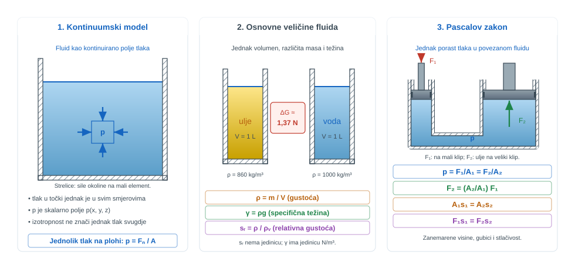
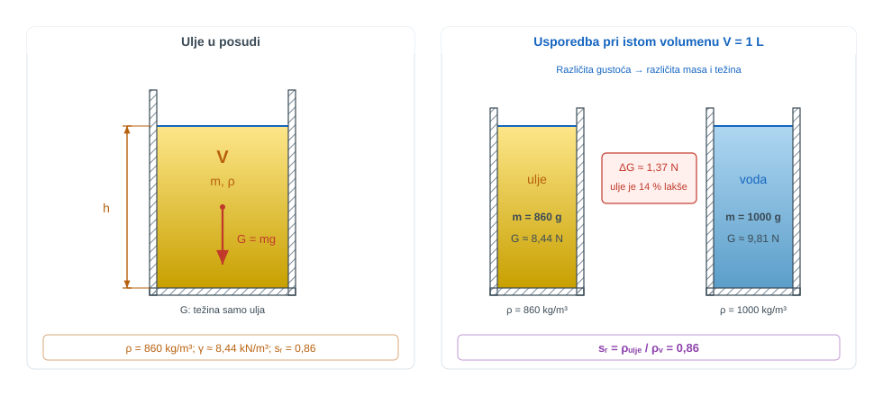
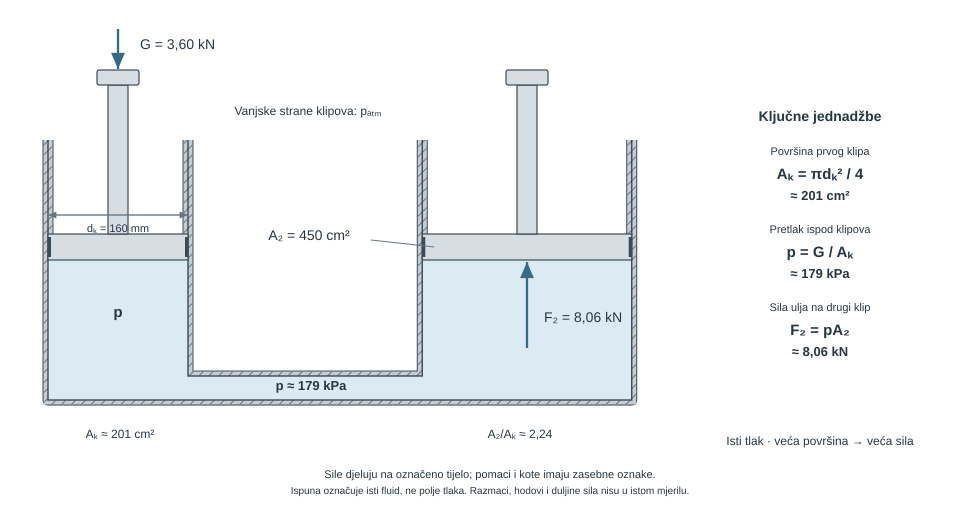
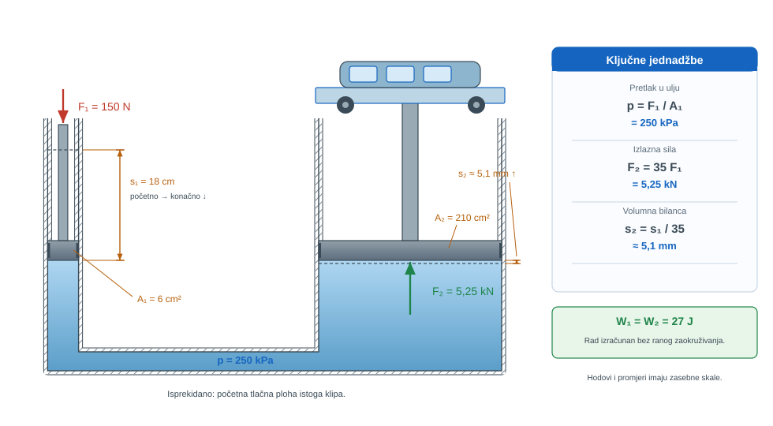
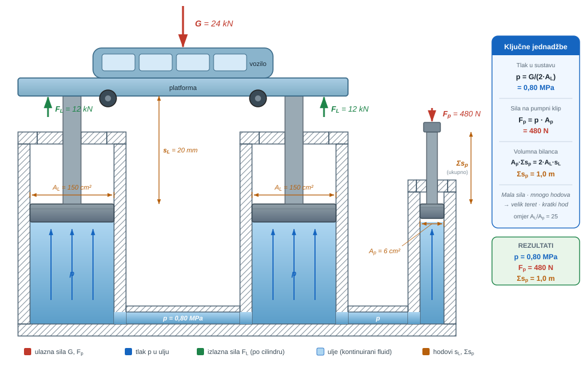
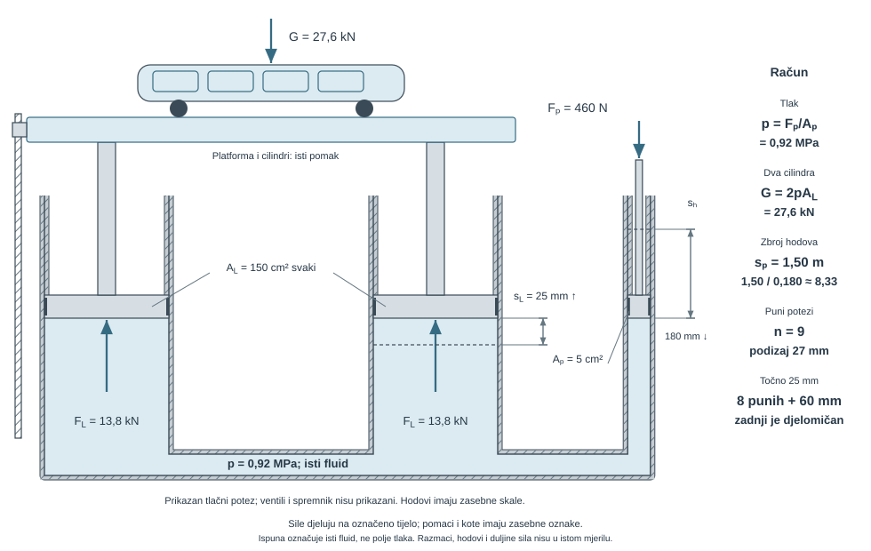
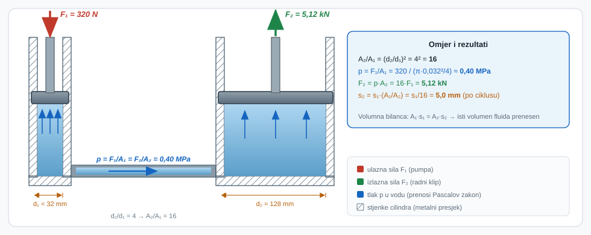
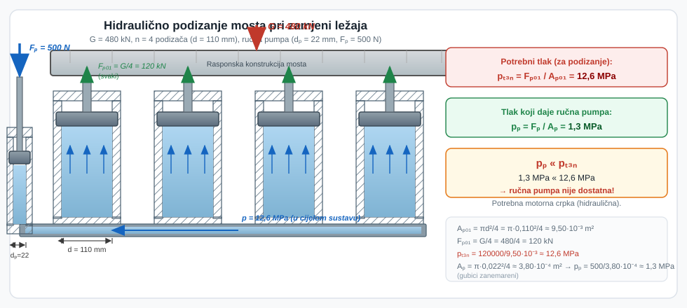
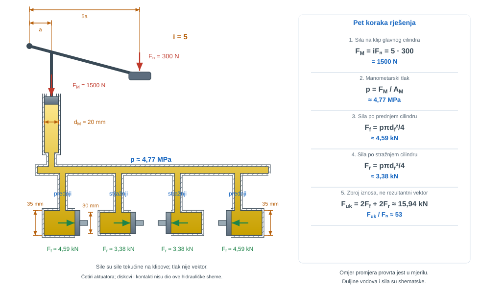
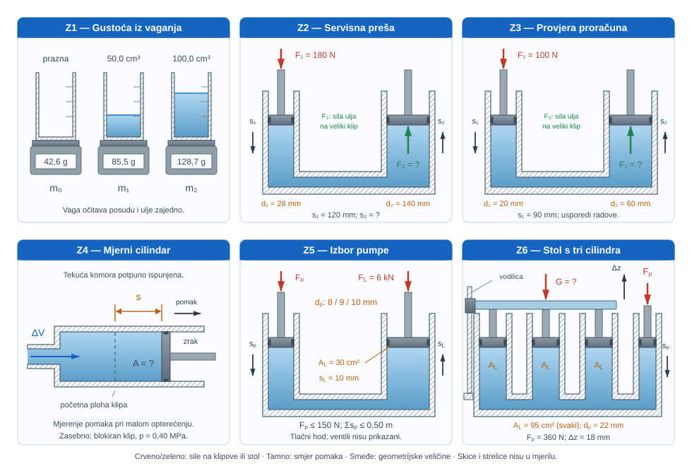

{#fig-uvod-u01 fig-align="center"}

## Fluid kao kontinuum: model umjesto popisa formula

Prvo poglavlje ne počinje samo definicijom tlaka ili gustoće. Najprije se razjašnjava što je fluid, zašto ga opisujemo kontinuumom i zašto su tlak i Pascalov zakon prirodne posljedice tog modela.

Bez tog uvoda kasnija hidrostatika i Bernoullijeva jednadžba lako postaju samo algebra bez fizikalnoga smisla.

::: {.mf1-application}

Inženjerski kontekst

Hidraulične dizalice, preše za oblikovanje lima i brodski kormilarski hidraulični pogoni počivaju na istoj ideji: tlak prenesen zatvorenim fluidom pretvara mali ulazni napor u veliku radnu silu. Zato se u ovom poglavlju gustoća, tlak i Pascalov zakon ne čitaju odvojeno, nego kao povezane veličine kojima se čita cilindar, crpka, vod i radni alat.
:::

::: {.mf1-priprema}

Prije čitanja poglavlja

**Predznanje koje se pretpostavlja:**

- pojam sile i mase iz Fizike I; jedinice SI sustava;
- osnove geometrije (površina kruga $A = \pi d^2/4$, prevođenje cm² u m²);
- razlikovanje težine od mase u gravitacijskom polju.

**Ishodi učenja:**

- razlikovati silu, tlak, gustoću i specifičnu težinu kao zasebne fizikalne veličine;
- prepoznati tlak kao skalarno polje u mirujućem fluidu i razumjeti zašto djeluje jednako u svim smjerovima;
- primijeniti Pascalov zakon na zatvoreni hidraulični sustav s dva ili više klipova;
- objasniti zašto pojačanje sile uvijek prati proporcionalno smanjenje pomaka.

**Procijenjeno vrijeme:** 4–5 sati za teoriju i izvode, 3 sata za rješavanje primjera i zadataka.
:::

::: {.callout-tip collapse="true" icon="false"}
## Mehanika fluida i numerika — najava

Svaka jednadžba u ovom udžbeniku ima svoju ulogu u **računalnoj dinamici fluida (CFD)**. Time se ovdje neće baviti detaljnije — to je tema kolegija Računalna dinamika fluida. No kroz udžbenik javljaju se dvije vrste oznaka:

- **Numerički trag** *(sklopiv, uz pojedine jednadžbe)* — kratki podsjetnik gdje ta jednadžba živi u numerici.
- **Numerički most** *(na kraju svakog poglavlja, plavi okvir)* — kratak osvrt kamo navedeno poglavlje vodi dalje.

Nije gradivo MF1. Otvara se s znatiželjom.
:::

## Fizikalni uvod i matematički izvod

Fluid je tvar koja se pod djelovanjem tangencijalnog naprezanja neprestano deformira. Zato ga u inženjerskom radu ne pratimo po molekulama, nego uvodimo kontinuumski model: pretpostavljamo da su veličine poput gustoće, tlaka i brzine definirane u svakoj točki prostora.

Tek tada matematika dobiva jasan fizički smisao: polja poput $p(x,y,z)$ i $\rho(x,y,z)$ nisu apstrakcija radi apstrakcije, nego način da složen stvarni fluid postane računski čitljiv i mjerljiv.

U tom jeziku tlak postaje osnovna radna veličina:

$$
p = \frac{F_n}{A}
$$

::: {.callout-note}
## Fizikalno značenje
Tlak nije sila – on mjeri koliko je sile sabijeno na jedinicu površine. Ista sila raspršena na veliku površinu daje nizak tlak; stisnuta na malu površinu daje visok tlak. U mirujućem fluidu nema tangencijalnih naprezanja, pa tlak u jednoj točki djeluje jednako u svim smjerovima – vodoravno, okomito i dijagonalno – i zato ga opisujemo jednim skalarem, a ne vektorom.
:::

Za mirujući zatvoreni fluid promjena tlaka prenosi se jednako u svim smjerovima. To je radna srž Pascalova zakona i razlog zašto hidraulični sustavi mogu pretvoriti malu silu na malom klipu u veliku silu na velikom klipu.

## Osnovne veličine koje se najčešće miješaju

Na samom početku treba razdvojiti tri veličine koje studenti najčešće miješaju:

$$
\rho = \frac{m}{V}
$$

$$
\gamma = \rho g
$$

$$
s_r = \frac{\rho}{\rho_{voda}}
$$

::: {.callout-note}
## Fizikalno značenje
Gustoća $\rho$ mjeri masenu zbijenost fluida – koliko kilograma mase stane u jedan kubni metar. Specifična težina $\gamma = \rho g$ pretvara tu masu u gravitacijsku silu: to je ono što fluid u Zemljinom polju fizički "teži" po kubnom metru. Relativna gustoća $s_r$ je bezdimenzijski omjer prema vodi: vrijednost 0,86 odmah kaže da ulje pluta na vodi jer je lakše, a vrijednost 13,6 za živu kaže da gotovo 14 litara vode teži koliko litra žive.
:::

Gustoća govori koliko mase ima u jedinici volumena, specifična težina kolika je težina tog volumena, a relativna gustoća daje odnos prema vodi kao referenci. Ako se ove tri veličine ne odvoje u pog. 1Osnove fluida i Pascalov zakon, kasnije pogreške u hidrostatici i uzgonu izgledaju kao računski problem, iako su zapravo problem modela. Tlak je normalna sila po jedinici površine. U mirujućem fluidu tlak u jednoj točki djeluje jednako u svim smjerovima, pa ga opisujemo kao skalarno polje, a ne kao vektor. Taj je korak temeljni: kasnije ćemo iz tlaka dobivati sile na plohe i stijenke, ali sam tlak nije sila nego intenzitet normalnog naprezanja.

::: {.mf1-we}

Kratki primjer — Gustoća, specifična težina i relativna gustoća ulja&nbsp;T1

**Kontekst:** Hidraulično ulje koristi se kao radni medij u hidrauličnim sustavima. Za odabir komponenti i provjeru uzgona potrebno je razlikovati gustoću, specifičnu težinu i relativnu gustoću tog ulja.

**Zadano**

- Gustoća hidrauličnog ulja: $\rho = 860\ \text{kg/m}^3$

**Traženo**

1. specifičnu težinu $\gamma$.
2. relativnu gustoću $s_r$.

{#fig-u01-gustoca-sr fig-align="center"}

**Pretpostavke i model**

Uzmi

$$
g = 9{,}81\ \text{m/s}^2
$$

i referentnu gustoću vode

$$
\rho_{voda} = 1000\ \text{kg/m}^3.
$$

**Rješenje**

Specifična težina ulja iznosi

$$
\gamma = \rho g = 860 \cdot 9{,}81 = 8437\ \text{N/m}^3\approx 8{,}44\ \text{kN/m}^3.
$$

Relativna gustoća dobiva se omjerom prema vodi:

$$
s_r = \frac{\rho}{\rho_{voda}} = \frac{860}{1000} = 0{,}86.
$$

**Provjera i komentar**

1. Relativna gustoća mora biti bez dimenzije.
2. Specifična težina mora imati jedinicu sile po volumenu, a ne mase po volumenu.
3. Čim se pomiješaju $\rho$, $\gamma$ i $s_r$, kasniji zadaci s tlakom i uzgonom kreću iz pogrešne fizikalne veličine.
:::

Kad su osnovne veličine razdvojene, Pascalov zakon više se ne čita kao napamet naučena formula, nego kao prirodna posljedica tlaka u zatvorenom mirujućem fluidu.

## Pascalov zakon kao prvi inženjerski alat

Pascalov zakon ne govori da fluid "stvara" silu, nego da se promjena tlaka u zatvorenom mirujućem fluidu prenosi bez gubitka kroz cijeli sustav. Zato za dva klipa vrijedi

$$
\Delta p = \frac{F_1}{A_1} = \frac{F_2}{A_2}
$$

odnosno

$$
F_2 = F_1 \frac{A_2}{A_1}
$$

::: {.callout-note}
## Fizikalno značenje
Pascalov zakon ne stvara energiju – on mijenja omjer sile i pomaka. Isti tlak koji mali klip unosi u zatvoreni fluid, fluid prenosi jednako prema svim stjenkama. Gdje je površina veća, isti tlak skuplja veću ukupnu silu. Omjer $A_2/A_1 = 35$ znači 35 puta veća izlazna sila, ali uz 35 puta manji izlazni pomak: mehanički rad ulaza ostaje jednak mehaničkom radu izlaza.
:::

::: {.callout-note collapse="true" icon="false"}
## Numerički trag

Ideja da se promjena tlaka u zatvorenom fluidu prenosi *istovremeno* na sve točke je upravo razlog zašto u CFD-u za nestlačivo strujanje tlak nije lokalna veličina, nego rješenje **eliptičke Poissonove jednadžbe** koja veže cijelu domenu u jednom koraku iteracije. Solveri tipa `simpleFoam` i `pisoFoam` (OpenFOAM) ili pressure-based rješavač u Fluentu računaju polje tlaka točno tako — globalno, ne marš-po-vremenu.
:::

::: {.mf1-interaktivno}

Interaktivni prikaz — Hidraulična preša

Interaktivni prikaz omogućuje mijenjanje promjera ulaznog i izlaznog klipa te sile na ulazu uz neposredno praćenje izlazne sile i pripadnog omjera pomaka klipova. Vizualizacija jasno razdvaja pojačanje sile od smanjenja pomaka koje slijedi iz očuvanja istisnutog volumena.

**Pitanja za samostalno istraživanje:** (a) Što se događa s pojačanjem sile kada se $D_1$ približi $D_2$? (b) Postoji li teorijska granica omjera $D_2/D_1$ koju propisuje sam Pascalov zakon? (c) Vrijedi li bilanca rada $F_1 s_1 = F_2 s_2$ za sve odabire parametara?

:::

Pojačanje sile ne znači pojačanje rada niotkuda. Ako zanemarimo gubitke i stlačivost, istisnuti volumen ostaje isti, pa je

$$
A_1 s_1 = A_2 s_2
$$

::: {.callout-note}
## Fizikalno značenje
Ova jednadžba je izravna posljedica nestlačivosti fluida: volumen koji uđe u sustav mora negdje izaći. Manji klip mora prijeći duži put da istisnuti volumen bude jednak volumenu koji veliki klip pomakne za kratki hod. Zato sustav s omjerom površina 35 zahtijeva da mali klip hoda 35 puta dulje od radnog klipa. Volumna bilanca vrijedi neovisno o tlaku – dovoljno je da je fluid nestlačiv.
:::

Veća izlazna sila zato dolazi uz manji izlazni pomak.

U ovom se poglavlju zato zadržavamo na osnovnom hidrauličnom prijenosu u kojem se tlak prenosi kroz zatvoreni mirujući fluid bez dodatnog hodanja po visinama. Kad radne točke nisu na istoj razini, isti se sustav mora čitati zajedno s hidrostatikom, što pripada pog. 3Hidrostatička raspodjela tlaka i manometrija.

::: {.mf1-izvod}

Matematički izvod — Pascalov zakon i očuvanje rada

Neka na mali klip površine $A_1$ djeluje dodatna sila $F_1$. Dodatni tlak koji ta sila stvara u zatvorenom mirujućem fluidu definira se relacijom

$$
\Delta p = \frac{F_1}{A_1}.
$$

U mirujućem fluidu taj dodatni tlak ne prenosi se kao smična sila, nego kao porast normalnog naprezanja koji se kroz istu povezanu tekućinu očituje jednako u svim smjerovima. Zato na velikom klipu površine $A_2$ vrijedi isti porast tlaka,

$$
\Delta p = \frac{F_2}{A_2}.
$$

Izjednačavanjem dvaju izraza dobiva se temeljni omjer hidrauličnoga sustava

$$
\frac{F_1}{A_1} = \frac{F_2}{A_2}
\qquad \Longrightarrow \qquad
F_2 = F_1 \frac{A_2}{A_1}.
$$

Fizikalno značenje članova pritom je neposredno: $F_1$ je ulazna sila, $A_1$ površina preko koje se ta sila pretvara u tlak, $F_2$ izlazna radna sila, a $A_2$ površina na kojoj isti tlak daje veći ukupni iznos sile. Povećanje sile ne znači i stvaranje rada niotkuda. Ako se fluid uzme nestlačivim, istisnuti volumen mora biti jednak na oba klipa, pa vrijedi

$$
\Delta V_1 = \Delta V_2
\qquad \Longrightarrow \qquad
A_1 s_1 = A_2 s_2.
$$

Uvrštavanjem odnosa sila i hodova slijedi i radna bilanca

$$
F_1 s_1 = F_2 s_2,
$$

::: {.callout-note}
## Razrada koraka
Korak: $F_2 = F_1 \dfrac{A_2}{A_1}$ i $A_1 s_1 = A_2 s_2$ $\;\Rightarrow\;$ $F_1 s_1 = F_2 s_2$

Iz volumne bilance slijedi $s_2 = s_1 \dfrac{A_1}{A_2}$. Uvrstimo to u rad izlaza:
$$
F_2 s_2 = F_1 \frac{A_2}{A_1} \cdot s_1 \frac{A_1}{A_2} = F_1 s_1.
$$
Razlomci $A_2/A_1$ i $A_1/A_2$ se pokrate bez obzira na veličinu površina, pa jednakost radova vrijedi općenito za svaki omjer klipova.
:::

što zatvara cjelovito fizikalno značenje Pascalova zakona: hidraulični sustav mijenja omjer sile i pomaka zato što isti porast tlaka djeluje na različitim površinama, ali ukupna mehanička energija ne nastaje iz ničega.
:::

::: {.mf1-izvod}

Matematički izvod — Izotropnost tlaka (Cauchyjev tetraedar)

Tvrdnja da u mirujućem fluidu tlak u jednoj točki djeluje jednako u svim smjerovima može se izvesti formalno iz ravnoteže sila na infinitezimalnom **trodimenzijskom tetraedru** s tri okomite plohe duž koordinatnih osi i jednom kosom plohom proizvoljne orijentacije s jediničnim vektorom normale $\vec{n} = (n_x, n_y, n_z)$.

Neka su pripadne površine $A_x$, $A_y$, $A_z$ (okomite na osi) i $A_n$ (kosa). Iz geometrije slijedi:

$$
A_x = n_x A_n, \qquad A_y = n_y A_n, \qquad A_z = n_z A_n.
$$

Na svaku plohu djeluje normalna tlačna sila — neka su odgovarajući tlakovi $p_x$, $p_y$, $p_z$ na koordinatnim plohama i $p_n$ na kosoj plohi. Ravnoteža sila po osi $x$ (zanemarujući težinu jer ona ima dimenziju volumena $\propto \ell^3$ koja iščezava brže od površina $\propto \ell^2$ kada $\ell \to 0$):

$$
p_x A_x - p_n A_n n_x = 0,
$$

odakle slijedi $p_x = p_n$. Analogno za osi $y$ i $z$ daje $p_y = p_n$ i $p_z = p_n$. Time se izvodi

$$
p_x = p_y = p_z = p_n,
$$

što znači da je tlak u jednoj točki mirujućeg fluida **neovisan o orijentaciji plohe** na kojoj se mjeri. Tlak je dakle skalarna veličina, što opravdava njegov zapis kao polje $p(x, y, z)$ koje će se koristiti u svim daljnjim poglavljima. Ova svojstvenost prestaje vrijediti čim se pojavi gibanje sa smičnim naprezanjem — tada se uvodi tenzor naprezanja u kojem tlak predstavlja samo izotropni dio.
:::

## Riješeni primjeri

::: {.mf1-we}

Riješeni primjer — Opterećeni klip i tlak u zatvorenom cilindru&nbsp;T2

**Kontekst:** U hidrauličnom cilindru kružni klip zatvara ulje, a vlastita težina i dodatni teret stvaraju tlak koji se Pascalovim zakonom prenosi na drugi radni klip veće površine.

**Zadano**

- Promjer kružnog klipa: $d_k = 160\ \text{mm}$
- Ukupna sila opterećenja na klipu: $G = 3{,}60\ \text{kN}$
- Površina drugog radnog klipa: $A_2 = 450\ \text{cm}^2$

**Traženo**

1. površinu klipa $A_k$.
2. manometarski tlak u ulju neposredno ispod klipa.
3. silu na radnom klipu površine $A_2$.

**Pretpostavke i model**

Na istoj razini mirujućeg ulja tlak se čita izravno iz odnosa sile i površine. Tek nakon što se odredi tlak pod opterećenim klipom, isti se tlak smije prenijeti na drugi klip i pretvoriti u novu silu.

**Rješenje**

Površina klipa iznosi

$$
A_k = \frac{\pi d_k^2}{4} = \frac{\pi \cdot 0{,}16^2}{4} = 2{,}01 \cdot 10^{-2}\ \text{m}^2 \approx 0{,}0201\ \text{m}^2.
$$

Manometarski tlak neposredno ispod klipa dobiva se iz definicije tlaka:

$$
p = \frac{G}{A_k} = \frac{3600}{0{,}0201} = 1{,}79 \cdot 10^5\ \text{Pa} \approx 179\ \text{kPa}.
$$

Površinu radnog klipa treba zapisati u SI jedinicama:

$$
A_2 = 450 \cdot 10^{-4} = 0{,}0450\ \text{m}^2.
$$

Sila na radnom klipu zato je

$$
F_2 = pA_2 = 1{,}79 \cdot 10^5 \cdot 0{,}0450 = 8{,}06 \cdot 10^3\ \text{N} \approx 8{,}06\ \text{kN}.
$$

**Provjera i komentar**

1. Veća ukupna sila na istom klipu mora dati veći tlak u ulju.
2. Na većem radnom klipu ista tlačna razina mora dati veću silu.
3. Ako je izlazna sila veća od ulazne, to je ovdje posljedica većeg presjeka, a ne stvaranja rada niotkuda.
:::

::: {.mf1-we}

Riješeni primjer — Servisna hidraulična dizalica&nbsp;T2

**Kontekst:** U radioničkoj hidrauličnoj dizalici mali upravljački klip prenosi tlak na veliki radni klip koji podiže teret. Treba odrediti tlak, izlaznu silu i izlazni pomak.

**Zadano**

- Površina malog upravljačkog klipa: $A_1 = 6\ \text{cm}^2$
- Površina velikog radnog klipa: $A_2 = 210\ \text{cm}^2$
- Sila na malom klipu: $F_1 = 150\ \text{N}$
- Pomak malog klipa: $s_1 = 18\ \text{cm}$

**Traženo**

1. tlak koji se prenosi kroz ulje.
2. silu na velikom klipu.
3. pomak velikog klipa.

Zanemari gubitke i stlačivost ulja.

**Pretpostavke i model**

Promatra se mirujući fluid u zatvorenom hidrauličnom sustavu. Najprije se iz sile i površine dobije tlak, zatim se isti tlak prenese na drugi klip, a na kraju se pomak zatvara jednakošću istisnutog volumena.

**Rješenje**

Površinu malog klipa treba pretvoriti u kvadratne metre:

$$
A_1 = 6 \cdot 10^{-4}\ \text{m}^2.
$$

Zato je tlak u ulju

$$
p = \frac{F_1}{A_1} = \frac{150}{6 \cdot 10^{-4}} = 2{,}50 \cdot 10^5\ \text{Pa} = 250\ \text{kPa}.
$$

Površina velikog klipa iznosi

$$
A_2 = 210 \cdot 10^{-4} = 2{,}10 \cdot 10^{-2}\ \text{m}^2.
$$

pa je sila na velikom klipu

$$
F_2 = pA_2 = 2{,}50 \cdot 10^5 \cdot 2{,}10 \cdot 10^{-2} = 5250\ \text{N} = 5{,}25\ \text{kN}.
$$

Za pomake koristimo jednakost istisnutog volumena:

$$
A_1 s_1 = A_2 s_2
$$

odakle slijedi

$$
s_2 = \frac{A_1}{A_2} s_1 = \frac{6}{210} \cdot 18\ \text{cm} = 0{,}514\ \text{cm} \approx 5{,}1\ \text{mm}.
$$

**Provjera i komentar**

1. Izlazna sila mora biti mnogo veća od ulazne jer je $A_2/A_1 = 35$.
2. Izlazni pomak mora biti mnogo manji od ulaznog iz istog razloga.
3. Ako su i sila i pomak ispali veliki, negdje je izgubljeno očuvanje volumena odnosno rada.
:::

::: {.mf1-we}

Riješeni primjer — Dvostruki hidraulični podizač servisne platforme&nbsp;T2

**Kontekst:** Servisna platforma za pregled vozila oslanja se na dva paralelna radna cilindra, dok mali pumpni klip ručno potiskuje ulje. Treba odrediti radni tlak, silu na pumpi i ukupan hod potreban za podizanje.

**Zadano**

- Ukupno opterećenje servisne platforme: $G = 24\ \text{kN}$
- Površina jednog radnog cilindra: $A_L = 150\ \text{cm}^2$ (dva jednaka cilindra)
- Površina pumpnog klipa: $A_p = 6\ \text{cm}^2$
- Visina podizanja platforme: $s_L = 20\ \text{mm}$

**Traženo**

1. tlak u ulju potreban da platforma miruje.
2. silu koju treba razviti pumpni klip.
3. ukupni zbroj hodova pumpnog klipa potreban da se platforma podigne za $s_L = 20\ \text{mm}$.

Zanemari gubitke i stlačivost ulja.

**Pretpostavke i model**

U zatvorenom mirujućem ulju prenosi se isti tlak u sve dijelove sustava. Zato se ukupna nosiva sila dobiva zbrojem sila na oba radna cilindra, a pumpni hod se dobiva iz jednakosti istisnutog volumena i ukupnog volumena koji moraju primiti oba velika cilindra.

**Rješenje**

Površina jednog radnog cilindra u SI jedinicama iznosi

$$
A_L = 150 \cdot 10^{-4} = 0{,}015\ \text{m}^2.
$$

Ukupna nosiva površina dvaju cilindara zato je

$$
A_{uk} = 2A_L = 0{,}030\ \text{m}^2.
$$

Tlak potreban da platforma miruje iznosi

$$
p = \frac{G}{A_{uk}} = \frac{24000}{0{,}030} = 8{,}00 \cdot 10^5\ \text{Pa} = 0{,}80\ \text{MPa}.
$$

Površina pumpnog klipa iznosi

$$
A_p = 6 \cdot 10^{-4}\ \text{m}^2.
$$

pa je sila na pumpnom klipu

$$
F_p = pA_p = 8{,}00 \cdot 10^5 \cdot 6 \cdot 10^{-4} = 480\ \text{N}.
$$

Ako se platforma podiže za

$$
s_L = 20\ \text{mm} = 0{,}020\ \text{m},
$$

tada oba radna cilindra zajedno trebaju volumen

$$
\Delta V = 2A_L s_L = 2 \cdot 0{,}015 \cdot 0{,}020 = 6{,}0 \cdot 10^{-4}\ \text{m}^3.
$$

Taj volumen mora dati pumpni klip, pa vrijedi

$$
A_p s_p = \Delta V \quad \Longrightarrow \quad s_p = \frac{\Delta V}{A_p} = \frac{6{,}0 \cdot 10^{-4}}{6 \cdot 10^{-4}} = 1{,}0\ \text{m}.
$$

To znači da je potreban ukupni zbroj hodova pumpnog klipa $s_p = 1{,}0\ \text{m}$, što se u praksi ostvaruje kroz više kratkih pumpnih poteza.

**Provjera i komentar**

1. Tlak mora biti manji nego u zadatku s jednim malim radnim klipom ako je ovdje ukupna nosiva površina velika.
2. Sila pumpnog klipa mora biti mnogo manja od nosivog opterećenja jer radi preko znatno manje površine.
3. Ukupni hod pumpe može biti velik jer jedan mali klip mora volumenski napuniti dva veća cilindra.
:::

::: {.mf1-ch}

Cjeloviti zadatak — Dvostruka hidraulična platforma s ručnom pumpom&nbsp;T3

**Kontekst:** U autoservisnoj radionici servisna platforma za pregled vozila oslanja se na dva paralelna radna cilindra, dok operater ručnom pumpom razvija tlak u hidrauličnom ulju. Treba odrediti radni tlak, nosivost platforme te ukupan hod i broj poteza pumpe za podizanje na zadanu visinu.

**Zadano**

- Površina jednog radnog cilindra: $A_L = 150\ \text{cm}^2$ (dva jednaka cilindra)
- Površina pumpnog klipa: $A_p = 5\ \text{cm}^2$
- Sila operatera na pumpni klip: $F_p = 460\ \text{N}$
- Visina podizanja platforme: $s_L = 25\ \text{mm}$
- Puni hod pumpnog klipa: $s_h = 180\ \text{mm}$

Zanemari gubitke i stlačivost ulja. Pretpostavi da su oba radna cilindra jednako opterećena.

**Traženo**

1. tlak $p$ u ulju.
2. silu koju preuzima jedan radni cilindar i ukupno dopušteno opterećenje platforme $G$.
3. ukupni zbroj hodova pumpnog klipa potreban da se platforma podigne za $s_L$.
4. najmanji broj punih pumpnih hodova potreban za taj podizaj.

**Pretpostavke i model**

U zatvorenom mirujućem ulju tlak koji stvara mali pumpni klip prenosi se jednako na oba radna cilindra. Zato se najprije iz sile i površine pumpnog klipa određuje tlak, zatim iz toga sila na radnim cilindrima, a na kraju iz volumne bilance ukupni hod i broj pumpnih poteza.

**Rješenje**

#### 1. Tlak u ulju

Površina pumpnog klipa u SI jedinicama iznosi $A_p = 5 \cdot 10^{-4}\ \text{m}^2$. Tlak koji pumpni klip stvara u ulju jednak je

$$
p = \frac{F_p}{A_p} = \frac{460}{5 \cdot 10^{-4}} = 9{,}20 \cdot 10^5\ \text{Pa} = 0{,}92\ \text{MPa}.
$$

#### 2. Sila jednog cilindra i ukupno opterećenje

Površina jednog radnog cilindra u SI jedinicama iznosi $A_L = 150 \cdot 10^{-4} = 0{,}015\ \text{m}^2$. Sila koju preuzima jedan cilindar zato je

$$
F_L = pA_L = 9{,}20 \cdot 10^5 \cdot 0{,}015 = 13800\ \text{N} = 13{,}8\ \text{kN}.
$$

Kako postoje dva jednaka cilindra, ukupno dopušteno opterećenje platforme iznosi

$$
G = 2F_L = 2 \cdot 13800 = 27600\ \text{N} = 27{,}6\ \text{kN}.
$$

#### 3. Zbroj hodova pumpnog klipa

Za podizanje platforme oba radna cilindra zajedno, uz $s_L = 25\ \text{mm} = 0{,}025\ \text{m}$, trebaju volumen

$$
\Delta V = 2A_L s_L = 2 \cdot 0{,}015 \cdot 0{,}025 = 7{,}5 \cdot 10^{-4}\ \text{m}^3.
$$

Taj volumen mora dati pumpni klip, pa iz $A_p s_p = \Delta V$ slijedi

$$
s_p = \frac{\Delta V}{A_p} = \frac{7{,}5 \cdot 10^{-4}}{5 \cdot 10^{-4}} = 1{,}5\ \text{m},
$$

što se u praksi ostvaruje nizom kratkih pumpnih poteza.

#### 4. Broj punih pumpnih hodova

Uz $s_h = 180\ \text{mm} = 0{,}180\ \text{m}$ najmanji potreban broj punih hodova je

$$
n = \frac{s_p}{s_h} = \frac{1{,}5}{0{,}180} = 8{,}33,
$$

pa u praksi treba uzeti $n = 9$ punih pumpnih hodova.

**Provjera i komentar**

Pumpni klip površine $5\ \text{cm}^2$ pod silom $460\ \text{N}$ stvara tlak od $0{,}92\ \text{MPa}$. Na toj tlačnoj razini svaki radni cilindar preuzima oko $13{,}8\ \text{kN}$, pa platforma može nositi ukupno oko $27{,}6\ \text{kN}$. Za podizanje platforme za $25\ \text{mm}$ potreban je ukupni zbroj hodova pumpnog klipa od $1{,}5\ \text{m}$, odnosno najmanje devet punih pumpnih poteza.

1. Ukupno nosivo opterećenje mora biti mnogo veće od sile pumpnog klipa jer je ukupna nosiva površina mnogo veća od pumpne.
2. Ukupni hod pumpe mora ostati velik jer mali klip volumenski puni dva velika cilindra.
3. Broj punih hodova mora se na kraju zaokružiti na prvi veći cijeli broj.
::: 

::: {.mf1-we}

Riješeni primjer — Hidraulična preša za savijanje cijevi &nbsp;T2

**Primjer za strojare**

**Kontekst:** U strojarskoj radionici ručna hidraulična preša savija čelične cijevi prema trnu. Operator pumpnim klipom stvara tlak koji potiskuje radni klip s alatom.

**Zadano**

- Promjer pumpnog klipa: $d_1 = 32\ \text{mm}$
- Sila operatera: $F_1 = 320\ \text{N}$
- Promjer radnog klipa: $d_2 = 128\ \text{mm}$
- Hod pumpnog klipa po ciklusu: $s_1 = 80\ \text{mm}$

**Traženo**

1. Tlak u hidrauličnom ulju.
2. Sila na radnom klipu.
3. Pomak radnog klipa po jednom ciklusu pumpanja.

{#fig-u01-presa-savijanje fig-align="center"}

**Pretpostavke i model**

Fluid je nestlačiv, gubici u vodovima i ventilima zanemareni. Oba klipa na istoj su razini – nema hidrostatske razlike tlaka. Pascalov zakon vrijedi izravno.

**Rješenje**

Površine klipova:

$$
A_1 = \frac{\pi d_1^2}{4} = \frac{\pi \cdot 0{,}032^2}{4} = 8{,}04 \cdot 10^{-4}\ \text{m}^2
$$

$$
A_2 = \frac{\pi d_2^2}{4} = \frac{\pi \cdot 0{,}128^2}{4} = 1{,}287 \cdot 10^{-2}\ \text{m}^2
$$

Omjer površina: $A_2/A_1 = (d_2/d_1)^2 = (128/32)^2 = 16$.

Tlak u ulju:

$$
p = \frac{F_1}{A_1} = \frac{320}{8{,}04 \cdot 10^{-4}} \approx 3{,}98 \cdot 10^5\ \text{Pa} \approx 0{,}40\ \text{MPa}
$$

Sila na radnom klipu:

$$
F_2 = p\,A_2 = 16 \cdot F_1 = 16 \cdot 320 = 5120\ \text{N} \approx 5{,}12\ \text{kN}
$$

Pomak radnog klipa iz volumne bilance:

$$
s_2 = \frac{A_1}{A_2}\,s_1 = \frac{1}{16} \cdot 80\ \text{mm} = 5{,}0\ \text{mm}
$$

**Provjera i komentar**

Omjer 16 između površina ($d_2/d_1 = 4$) realistično je za ručnu radionicu prešu. Sila $320\ \text{N}$ koja se pretvara u $5{,}12\ \text{kN}$ dovoljna je za savijanje tankih cijevi. Pomak $5\ \text{mm}$ po ciklusu tipičan je za fino pozicioniranje alata – za veći hod potrebno je više pumpnih ciklusa.
:::

::: {.mf1-we}

Riješeni primjer — Hidraulično podizanje mosta pri zamjeni ležaja &nbsp;T2

**Primjer za građevinare**

**Kontekst:** Obnova cestovnog mosta zahtijeva podizanje rasponske konstrukcije za nekoliko milimetara radi zamjene oštećenih ležajeva. Četiri hidraulična podizača postavljena su simetrično pod nosač.

**Zadano**

- Ukupna težina rasponske konstrukcije: $G = 480\ \text{kN}$
- Broj podizača: $n = 4$ (jednaki, simetrično raspoređeni)
- Promjer klipa svakog podizača: $d = 110\ \text{mm}$
- Promjer pumpnog klipa: $d_p = 22\ \text{mm}$, sila na pumpi: $F_p = 500\ \text{N}$

**Traženo**

1. Sila na svaki podizač.
2. Minimalni radni tlak za podizanje.
3. Tlak koji razvija pumpni klip i provjera dostatnosti.

{#fig-u01-most-podizanje fig-align="center"}

**Pretpostavke i model**

Teret se raspoređuje jednoliko na sva četiri podizača (simetričan raspored). Vlastita težina podizača i gubici u vodovima zanemareni. Svi podizači na istoj su razini.

**Rješenje**

Sila na svaki podizač:

$$
F_{pod} = \frac{G}{n} = \frac{480{,}000}{4} = 120{,}000\ \text{N} = 120\ \text{kN}
$$

Površina klipa podizača:

$$
A_{pod} = \frac{\pi \cdot 0{,}110^2}{4} = 9{,}50 \cdot 10^{-3}\ \text{m}^2
$$

Minimalni radni tlak:

$$
p_{min} = \frac{F_{pod}}{A_{pod}} = \frac{120{,}000}{9{,}50 \cdot 10^{-3}} \approx 12{,}6\ \text{MPa}
$$

Tlak koji razvija ručna pumpa:

$$
A_p = \frac{\pi \cdot 0{,}022^2}{4} = 3{,}80 \cdot 10^{-4}\ \text{m}^2, \qquad
p_p = \frac{F_p}{A_p} = \frac{500}{3{,}80 \cdot 10^{-4}} \approx 1{,}3\ \text{MPa}
$$

**Provjera i komentar**

Potrebni tlak ($12{,}6\ \text{MPa}$) gotovo je deset puta veći od tlaka ručne pumpe ($1{,}3\ \text{MPa}$). Ručni pogon nije dovoljan – u praksi se koristi motorna elektrohidraulična crpka. Tlak $12{,}6\ \text{MPa}$ realističan je za specijalizirane građevinske podizače, koji tipično rade do $70\ \text{MPa}$. Ovaj primjer pokazuje zašto se za velika nosiva opterećenja uvijek koriste motorni hidraulični agregati.
:::

::: {.mf1-we}

Riješeni primjer — Hidraulična kočnica vozila s razdiobom na više kočnih cilindara &nbsp;T2

**Primjer za strojare**

**Kontekst:** U hidrauličnom kočnom sustavu osobnog vozila operater pritiska kočnu papučicu, a poluga papučice mehanički povećava silu prije nego se ona prenese na klip glavnog kočnog cilindra. Tlak koji se u glavnom cilindru razvije isti se prenosi do **četiri** kočna cilindra (po jedan u svakom kotaču), ali kočna kliješta na prednjoj osovini imaju veći promjer od onih na stražnjoj. Time se s **jednim** ulazom (papučicom) dobivaju **četiri različite** kočne sile prilagođene podjeli kočne težine između prednje i stražnje osovine.

**Zadano**

- Sila vozača na papučicu: $F_n = 300\ \text{N}$
- Prijenosni omjer papučice: $i = 5$ (poluga $5 : 1$)
- Promjer klipa glavnog cilindra: $d_M = 20\ \text{mm}$
- Promjer kočnog cilindra prednjeg kotača: $d_f = 35\ \text{mm}$ (po jednom kotaču)
- Promjer kočnog cilindra stražnjeg kotača: $d_r = 30\ \text{mm}$ (po jednom kotaču)

**Traženo**

1. Sila kojom poluga papučice tlači klip glavnog cilindra.
2. Manometarski tlak u kočnoj tekućini.
3. Sila kojom svaki **prednji** kočni cilindar pritišće kočne pločice na disk.
4. Sila kojom svaki **stražnji** kočni cilindar pritišće kočne pločice na disk.
5. Ukupna sila stezanja na svim kočnim cilindrima i ukupno pojačanje sile u odnosu na silu vozača na papučicu.

{#fig-u01-kocnica-vozila fig-align="center"}

**Pretpostavke i model**

Kočna tekućina je nestlačiva, vodovi su kruti i bez gubitaka, a svi kočni cilindri leže na približno istoj razini (hidrostatske razlike između cilindara zanemarive). Trenje u glavnom cilindru i vremenska kašnjenja zanemaruju se – promatra se ustaljeno stanje pune sile kočenja. Time se sustav svodi na Pascalov zakon: jedna ulazna sila razvija jedan tlak koji se istovremeno prenosi do svih radnih cilindara.

**Rješenje**

Poluga papučice mehanički pojačava silu vozača:

$$
F_M = i \cdot F_n = 5 \cdot 300 = 1500\ \text{N}
$$

Površina klipa glavnog cilindra:

$$
A_M = \frac{\pi d_M^2}{4} = \frac{\pi \cdot 0{,}020^2}{4} = 3{,}142 \cdot 10^{-4}\ \text{m}^2
$$

Manometarski tlak u kočnoj tekućini:

$$
p = \frac{F_M}{A_M} = \frac{1500}{3{,}142 \cdot 10^{-4}} = 4{,}77 \cdot 10^6\ \text{Pa} \approx 4{,}77\ \text{MPa}
$$

Površine prednjeg i stražnjeg kočnog cilindra:

$$
A_f = \frac{\pi d_f^2}{4} = \frac{\pi \cdot 0{,}035^2}{4} = 9{,}621 \cdot 10^{-4}\ \text{m}^2
$$

$$
A_r = \frac{\pi d_r^2}{4} = \frac{\pi \cdot 0{,}030^2}{4} = 7{,}069 \cdot 10^{-4}\ \text{m}^2
$$

Isti tlak na različitim površinama daje različite sile. Sila po jednom prednjem kočnom cilindru:

$$
F_f = p \cdot A_f = 4{,}77 \cdot 10^6 \cdot 9{,}621 \cdot 10^{-4} \approx 4{,}59\ \text{kN}
$$

Sila po jednom stražnjem kočnom cilindru:

$$
F_r = p \cdot A_r = 4{,}77 \cdot 10^6 \cdot 7{,}069 \cdot 10^{-4} \approx 3{,}38\ \text{kN}
$$

Ukupna sila stezanja na svim kočnim cilindrima (dva prednja + dva stražnja):

$$
F_{uk} = 2 F_f + 2 F_r = 2 \cdot 4{,}59 + 2 \cdot 3{,}38 = 15{,}94\ \text{kN}
$$

Pojačanje sile od papučice do ukupne sile na kočnim cilindrima:

$$
k = \frac{F_{uk}}{F_n} = \frac{15{,}94 \cdot 10^3}{300} \approx 53
$$

**Provjera i komentar**

1. Pojačanje sile $k \approx 53$ rezultat je dvostrukog mehanizma: poluga papučice doprinosi faktorom $i = 5$, a hidraulika preostalim faktorom $\approx 10{,}6$, jer je zbroj površina svih kočnih cilindara $(2A_f + 2A_r) \approx 10{,}6 \cdot A_M$.
2. Prednji kočni cilindar daje veću silu od stražnjeg ($4{,}59\ \text{kN}$ prema $3{,}38\ \text{kN}$) iako je tlak u oba isti. To je inženjerska odluka: pri kočenju se masa vozila prebacuje prema naprijed, pa prednji kotači moraju preuzeti veći dio kočne sile.
3. Radni tlak $\approx 4{,}8\ \text{MPa}$ realan je iznos za hidrauličnu kočnicu osobnog vozila – vršni tlakovi pri naglom kočenju idu i preko $10\ \text{MPa}$, što je zato i razlog što se kao kočna tekućina koristi posebno ulje (DOT 4 / DOT 5.1) s visokom temperaturom vrenja.
4. Ako bi vozač pumpao papučicom dok kočne pločice ne dodirnu disk, ukupni hod papučice morao bi po volumnoj bilanci pokriti hod svih četiriju kočnih cilindara: $A_M s_M = 2 A_f s_f + 2 A_r s_r$. Zato „mekana" papučica nakon kvara obično znači da je u sustav ušao zrak – stlačivi medij troši hod papučice prije nego što se uopće razvije tlak.
:::

::: {.mf1-we}

Riješeni primjer — Hidraulička stezna naprava na robotskoj liniji za montažu baterijskih modula električnog vozila &nbsp;T2

**Kontekst:** U robotskoj proizvodnoj liniji za sklapanje litij-ionskih baterijskih modula električnog vozila, prije zavarivanja kontakata ćelija aktivira se sustav hidrauličkih stega koji točno pozicionira modul. Centralna pumpa razvija konstantan tlak koji se istodobno prenosi na više paralelnih steznih cilindara. Svi stezni cilindri su istog promjera jer moduli zahtijevaju jednoliko opterećenje po obodu radi sprječavanja deformacije ćelija.

**Zadano**

- Promjer pumpnog klipa: $d_p = 14\ \text{mm}$
- Sila pogonskog motora na pumpni klip: $F_p = 420\ \text{N}$
- Promjer svakog steznog cilindra: $d_s = 28\ \text{mm}$
- Broj paralelnih stega: $n = 6$
- Najveća dopuštena sila na jednoj baterijskoj ćeliji (radi sprječavanja oštećenja): $F_{dop} = 3{,}5\ \text{kN}$

**Traženo**

1. manometarski tlak u sustavu;
2. sila stezanja jednog cilindra;
3. ukupna sila stezanja na modulu;
4. ostaje li sila po jednoj stezi unutar dopuštene vrijednosti $F_{dop}$.

**Pretpostavke i model**

Hidrauličko ulje smatra se nestlačivim, gubici u vodovima zanemarivi, svi cilindri leže približno na istoj razini. Sustav radi u stacionarnom stanju nakon što su sve stege dosegle krajnji položaj. Tlak koji razvije pumpa istodobno se prenosi na sve paralelne stezne cilindre.

**Rješenje**

Površina pumpnog klipa iznosi

$$
A_p = \frac{\pi d_p^2}{4} = \frac{\pi \cdot 0{,}014^2}{4} = 1{,}539 \cdot 10^{-4}\ \text{m}^2.
$$

Tlak u sustavu zato je

$$
p = \frac{F_p}{A_p} = \frac{420}{1{,}539 \cdot 10^{-4}} \approx 2{,}729 \cdot 10^6\ \text{Pa} \approx 2{,}73\ \text{MPa}.
$$

Površina pojedinog steznog cilindra iznosi

$$
A_s = \frac{\pi d_s^2}{4} = \frac{\pi \cdot 0{,}028^2}{4} = 6{,}158 \cdot 10^{-4}\ \text{m}^2.
$$

Sila stezanja jednog cilindra zato je

$$
F_s = p \cdot A_s = 2{,}729 \cdot 10^6 \cdot 6{,}158 \cdot 10^{-4} \approx 1{,}680\ \text{kN}.
$$

Kako sustav ima $n = 6$ paralelnih stega, ukupna sila stezanja na modulu iznosi

$$
F_{uk} = n \cdot F_s = 6 \cdot 1{,}680 \approx 10{,}08\ \text{kN}.
$$

Sila po jednoj stezi $F_s \approx 1{,}68\ \text{kN}$ ostaje znatno ispod dopuštene granice $F_{dop} = 3{,}5\ \text{kN}$, što potvrđuje da je tlak primjereno odabran za zaštitu baterijskih ćelija.

**Provjera i komentar**

Radni tlak od oko $2{,}7\ \text{MPa}$ tipičan je za hidrauličke stezne sustave u robotskoj montaži; razina je dovoljna za pouzdano pozicioniranje, a istovremeno dovoljno niska da se rizik prekoračenja sile ne pojavljuje pri umjerenim promjenama radnih uvjeta. Pojačanje sile po jednoj stezi iznosi $F_s/F_p = 1680/420 = 4$, što odgovara omjeru površina $(d_s/d_p)^2 = (28/14)^2 = 4$. Ukupno pojačanje, uzimajući u obzir sve stege, iznosi $F_{uk}/F_p = 10080/420 = 24$, što je upravo zbroj pojačanja po svim paralelnim cilindrima. Sigurnosni faktor u odnosu na dopuštenu silu po ćeliji iznosi $F_{dop}/F_s \approx 2{,}1$, što ostavlja prostor za blage varijacije u tlaku pumpe bez prekoračenja konstruktivne granice ćelije.
:::

::: {.mf1-samoprovjera}

Provjeri sebe

Sljedeća pitanja služe za samostalnu provjeru razumijevanja prije prelaska na zadatke za vježbu. Preporučuje se prvo samostalno odgovoriti, a tek zatim otvoriti sklopivi blok s kratkim odgovorom.

1. Što se događa s pojačanjem sile $F_2/F_1$ ako se promjer obaju klipova udvostruči?

::: {.callout-note collapse="true"}
### Odgovor
Pojačanje sile se ne mijenja jer ovisi isključivo o omjeru površina $A_2/A_1$, a taj omjer ostaje jednak kada se oba promjera proporcionalno povećaju.
:::

2. Zašto pojačana izlazna sila u hidrauličnoj preši ne narušava zakon očuvanja energije?

::: {.callout-note collapse="true"}
### Odgovor
Veća izlazna sila proporcionalno je nadoknađena manjim izlaznim pomakom; iz volumne bilance vrijedi $F_1 s_1 = F_2 s_2$, pa mehanički rad ulaza ostaje jednak mehaničkom radu izlaza.
:::

3. Kako tlak djeluje u pojedinoj točki mirujućega fluida — vektorski ili skalarno, i zašto?

::: {.callout-note collapse="true"}
### Odgovor
Tlak u mirujućem fluidu djeluje jednako u svim smjerovima jer nema tangencijalnih naprezanja koja bi razlikovala smjer; opisuje ga jedan skalarni broj u svakoj točki, a ne vektor.
:::

4. Kolika je razlika između $\rho$, $\gamma$ i $s_r$, i u kojim jedinicama se izražavaju?

::: {.callout-note collapse="true"}
### Odgovor
Gustoća $\rho$ je masa po jedinici volumena (kg/m³), specifična težina $\gamma = \rho g$ je težinska sila po jedinici volumena (N/m³), a relativna gustoća $s_r = \rho/\rho_{voda}$ je bezdimenzijski omjer prema referentnoj gustoći vode.
:::
:::

## Zadaci za vježbu

::: {.mf1-vjezbe-list}
1. **T1** U servisnoj hidrauličnoj preši mali klip promjera $d_1 = 28\ \text{mm}$ potiskuje ulje prema radnom klipu promjera $d_2 = 140\ \text{mm}$. Ako operater na mali klip djeluje silom $F_1 = 180\ \text{N}$, odredi tlak u ulju, silu na radnom klipu i pomak radnog klipa ako mali klip prijeđe put $s_1 = 120\ \text{mm}$.

	**Natuknica:** $p = F_1/A_1$; zatim $F_2 = pA_2$ i iz volumne bilance $A_1 s_1 = A_2 s_2$.

	**Skica:** da - dva klipa spojena istim fluidom, kote $d_1$, $d_2$, $s_1$, $s_2$ i sile $F_1$, $F_2$.

2. **T1** Na kružni klip promjera $d = 24\ \text{mm}$ djeluje sila $F = 95\ \text{N}$. Odredi tlak u ulju i silu koju isti tlak daje na drugi klip promjera $D = 72\ \text{mm}$.

	**Natuknica:** najprije $A = \pi d^2/4$, zatim $p = F/A$ i na većem klipu $F_2 = pA_2$.

	**Skica:** da - dva kružna klipa različitih promjera u istoj hidrauličnoj grani.

3. **T2** U zatvorenoj hidrauličnoj stezi tlak ulja iznosi $p = 2{,}4\ \text{MPa}$, a radni klip ima promjer $d = 52\ \text{mm}$. Odredi silu stezanja i procijeni koliki bi promjer morao imati novi klip ako se pri istom tlaku traži sila stezanja od najmanje $8{,}0\ \text{kN}$.

	**Natuknica:** koristi $F = pA$; iz tražene sile vrati površinu $A = F/p$, pa zatim promjer iz $A = \pi d^2/4$.

	**Skica:** da - hidraulična stega s jednim radnim klipom i označenom silom stezanja.

4. **T2** Hidraulični stol nosi teret mase $m = 1350\ \text{kg}$ preko dvaju jednakih radnih cilindara promjera $D = 95\ \text{mm}$. Ulje se dovodi ručnom pumpom čiji klip ima promjer $d = 18\ \text{mm}$ i hod $s = 160\ \text{mm}$. Odredi minimalnu silu na pumpnom klipu potrebnu za podizanje tereta i broj punih pumpnih hodova potreban da se stol podigne za $\Delta z = 45\ \text{mm}$.

	**Natuknica:** teret raspodijeli na dva cilindra; iz $p = G/(2A_D)$ dobij $F_p = pA_d$, a broj hodova iz $nA_d s = 2A_D \Delta z$.

	**Skica:** da - pumpni klip, dva radna cilindra i vertikalni pomak stola $\Delta z$.

5. **T3** Ručna pumpa s klipom promjera $d = 25\ \text{mm}$ razvija silu $F_p = 420\ \text{N}$. Dva radna cilindra promjera $D = 140\ \text{mm}$ nalaze se na istoj razini i podižu platformu. Odredi tlak u ulju, ukupno nosivo opterećenje platforme i ukupni hod pumpnog klipa potreban da se platforma podigne za $\Delta z = 30\ \text{mm}$.

	**Natuknica:** najprije izračunaj tlak iz $p = F_p/A_d$; zatim ukupno opterećenje iz $G = 2pA_D$, a ukupan hod pumpe iz volumne bilance $A_d s_p = 2A_D \Delta z$.

	**Skica:** da - pumpni klip, dva radna cilindra na istoj razini i nosiva platforma.

6. **T3** Hidraulični radni stol podupiru tri jednaka cilindra, svaki površine $A_L = 95\ \text{cm}^2$. Ulje dovodi pumpni klip promjera $d = 22\ \text{mm}$ na koji djeluje sila $F_p = 360\ \text{N}$. Odredi tlak u ulju, ukupno opterećenje koje stol može nositi i ukupan hod pumpnog klipa potreban da se stol podigne za $\Delta z = 18\ \text{mm}$.

	**Natuknica:** prvo izračunaj $A_p$ i tlak iz $p = F_p/A_p$; zatim ukupno opterećenje iz $G = 3pA_L$, a hod pumpe iz volumne bilance $A_p s_p = 3A_L \Delta z$.

	**Skica:** da - pumpni klip, tri jednaka radna cilindra i vertikalni pomak radnog stola.
:::

::: {.mf1-zavrsni-okvir}

Za ponijeti iz poglavlja

**Sažeta provjera prije računa**

- Treba razdvojiti gustoću, specifičnu težinu i relativnu gustoću.
- Treba razlikovati silu, tlak i težinsku silu.
- Kod klipova treba razlikovati prenosi li se isti tlak ili ista sila.
- Površine treba pretvoriti u kvadratne metre prije računa.
- Na kraju treba provjeriti jesu li sila i pomak fizikalno konzistentni.

**Najčešća pogreška**

Najčešća pogreška u pog. 1Osnove fluida i Pascalov zakon nije algebra nego pogrešna identifikacija fizikalne veličine. Ako se uzme $\rho$ umjesto $\gamma$, tlak umjesto sile ili isti tlak zamijeni istom silom na oba klipa, cijeli račun može izgledati uredno, a biti fizikalno pogrešan.

**Nakon ovoga poglavlja mora biti moguće**

1. razlikovati fluid od krutoga tijela na razini modela.
2. razlikovati gustoću, specifičnu težinu, relativnu gustoću i tlak.
3. primijeniti Pascalov zakon na jednostavan hidraulični sustav i protumačiti posljedice za silu i pomak.

**U tehnici to znači**

Hidraulična dizalica, preša ili kormilarski pogon rade pouzdano samo ako je jasno što je tlak, a što sila te na kojoj se površini taj tlak pretvara u radni učinak. Upravo zato ovo poglavlje nije uvodna formalnost, nego temelj za čitanje cijelog hidrauličnog sklopa.

**Granica modela**

Pascalov zakon u ovom obliku vrijedi kao idealizacija zatvorenog mirujućeg fluida. U stvarnim sustavima odziv mijenjaju stlačivost fluida, elastičnost vodova, unutarnje propuštanje i gubici u ventilima, pa se stvarna sila i pomak ne prenose savršeno.

pog. 1Osnove fluida i Pascalov zakon uspostavlja temeljni jezik cijeloga kolegija. Kad su ovdje jasni tlak, gustoća i Pascalov zakon, kasnija poglavlja o hidrostatici, energiji i strujanju čitaju se sigurnije i bez miješanja osnovnih veličina.
:::

::: {.mf1-numerika}

Numerički most

**Gdje ovo živi u numerici.** Tlak kao skalarno polje $p(x,y,z)$ — temeljni objekt koji svaki CFD solver mora prije svega *postaviti*. Pojam tlaka u kontinuumu i Pascalov zakon su upravo razlog zašto se u nestlačivom CFD-u tlak ne marsira u vremenu, nego se rješava globalno po cijeloj domeni.

**Što numerički alat radi s tim.** Na početku simulacije postavlja se *inicijalni uvjet tlaka* — najčešće jednoliko polje ili hidrostatska raspodjela iz idućeg poglavlja. Promjene na rubu (klip, ulaz crpke, ventil) propagiraju se kroz mrežu kontrolnih volumena unutar jedne iteracije sprege tlaka i brzine.

**Tipičan scenarij.** U industrijskom hidrauličkom sustavu CFD se rijetko primjenjuje na samu Pascalovu prijenosnu silu — ona je analitički rješiva. Vrijednost numerike pojavljuje se onda kad fluid prolazi uskim kanalima, kroz ventile ili kada se promatra dinamika tlačnog vala (vodeni udar pri naglom zatvaranju ventila): tada lokalna polja brzine, tlaka i mogućih kavitacijskih zona postaju netrivijalna, a analitička procjena prestaje biti dovoljna.

**Alati u kojima se to susreće:** `OpenFOAM` (`setFields`, `pRefValue`) · `ANSYS Fluent` (*Operating Pressure*, *Pressure Reference*) · `COMSOL Multiphysics`.

> *Nije gradivo MF1. U kasnijim kolegijima posvećenima računalnoj dinamici fluida opisani sadržaj postat će poznat teren.*
:::

