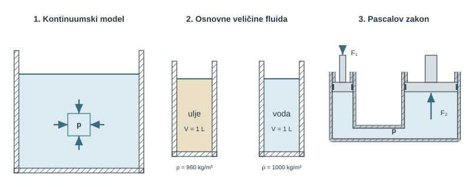
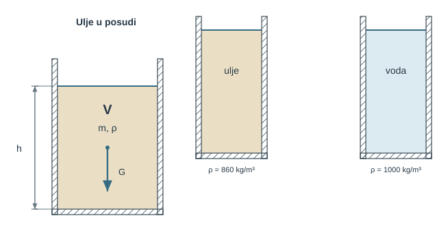
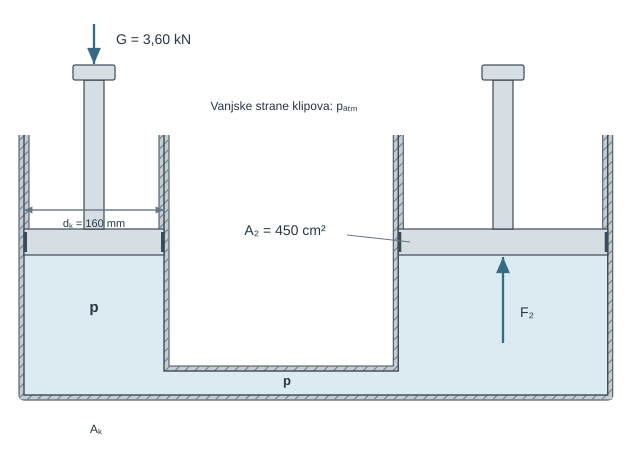
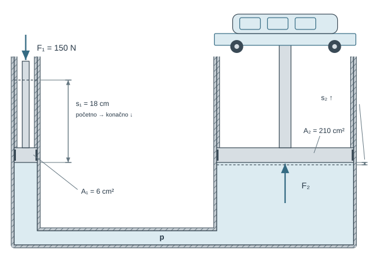
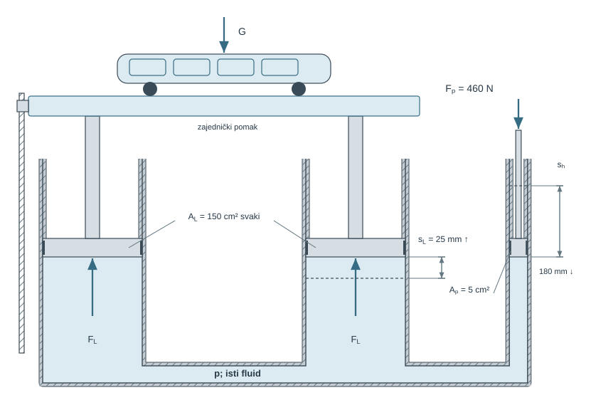
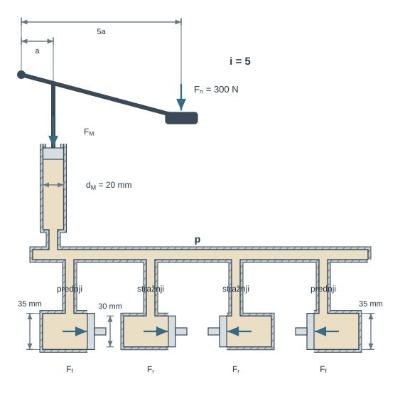
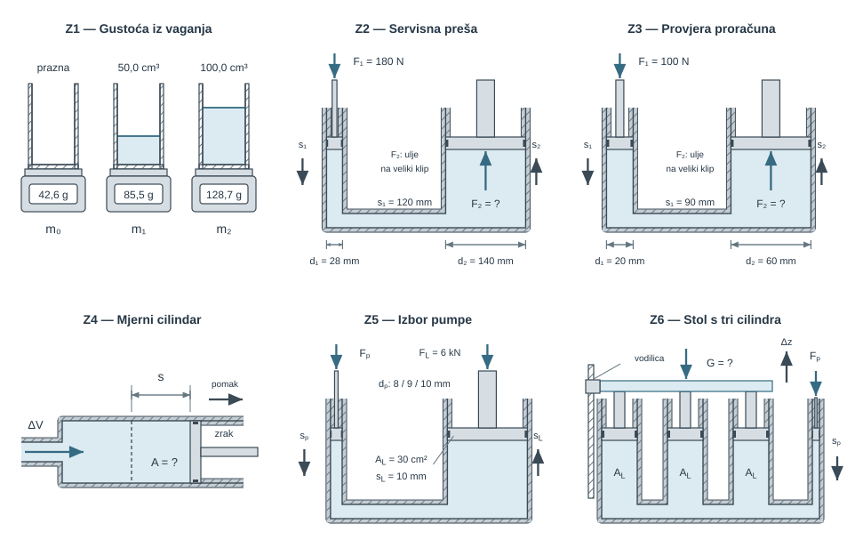

{#fig-uvod-u01 fig-align="center" fig-alt="Kontinuum i tlačne sile na mali element, svojstva ulja i vode te Pascalov prijenos između povezanih klipova"}

**Tumačenje skice.** U mirujućem fluidu tlak je skalarno polje $p(x,y,z)$: u istoj točki jednak je u svim smjerovima, ali se može mijenjati od točke do točke. Strelice prikazuju tlačne sile okoline na mali element. Za jednolik tlak na plohi vrijedi $p=F_n/A$.

Pri jednakom volumenu različite gustoće daju različite mase i težine: $\rho=m/V$, $\gamma=\rho g$ i $s_r=\rho/\rho_v$. Relativna gustoća nema jedinicu, a specifična težina ima jedinicu $\mathrm{N/m^3}$. Za prikazanu litru ulja i vode razlika težina iznosi približno $1{,}37\,\mathrm{N}$.

U povezanim cilindrima porast tlaka prenosi se jednako: $p=F_1/A_1=F_2/A_2$. Zato je $F_2=(A_2/A_1)F_1$, uz $A_1s_1=A_2s_2$ i, u idealnom modelu, $F_1s_1=F_2s_2$. Sila $F_1$ djeluje na mali klip, a $F_2$ označuje silu ulja na veliki klip; zanemareni su visinske razlike, gubitci i stlačivost.

## Fluid kao kontinuum

Za opis fluida najprije treba odabrati model i definirati veličine koje mjerimo. Ovo poglavlje uvodi kontinuum, gustoću i tlak te Pascalov zakon primjenjuje na prijenos sile u hidrauličnim sustavima.

::: {.mf1-application}

Inženjerski kontekst

Hidraulične dizalice, preše za oblikovanje lima i brodski kormilarski pogoni temelje se na prijenosu tlaka zatvorenim fluidom. U takvim sustavima tlak povezuje ulaznu silu, geometriju cilindara i radnu silu aktuatora.
:::

**Procijenjeno vrijeme rada uz priručnik:** 8 sati.

### Kontinuumski model

Fluid je tvar koja se pri djelovanju bilo kojega, pa i vrlo malog, tangencijalnog naprezanja neprekidno deformira. U inženjerskoj se analizi njegova molekularna građa obično ne promatra izravno. Umjesto toga primjenjuje se kontinuumski model, prema kojem su veličine kao što su gustoća, tlak i brzina definirane u svakoj točki prostora i u svakom trenutku.

Polja $p(x,y,z)$ i $\rho(x,y,z)$ matematički opisuju prostornu raspodjelu tlaka i gustoće te omogućuju određivanje sila i gibanja fluida na razini prikladnoj za tehnički proračun.

::: {#cfd-rashladni-krug-model .mf1-cfd title="Računalna dinamika fluida"}

**Rashladni krug: od uređaja do modela.** Zamislimo tekućinsko hlađenje baterije: crpka šalje rashladnu tekućinu kroz razdjelnik u uske kanale hladne ploče. Želimo saznati prima li svaki kanal dovoljno tekućine. Računalna dinamika fluida (CFD, engl. *Computational Fluid Dynamics*) iz zakona očuvanja računa približna polja brzine i tlaka. Najprije izdvajamo prostor unutar razdjelnika i kanala; u metodi konačnih volumena taj prostor dijelimo na male ćelije, povezane protocima i silama.

Za prvi model pretpostavimo potpuno napunjen sustav i stalnu temperaturu. Stijenke, ulaz i izlazi čine granice na kojima zadamo ponašanje fluida. Takav model može pokazati nejednoliku podjelu toka; temperaturu baterije dobit ćemo tek kada uključimo i prijenos topline. Ćelija predstavlja dio kontinuuma, a ne molekulu. Isti krug dalje proširujemo svojstvima fluida, gubitcima i crpkom.
:::

### Tlak

Za jednoliko raspodijeljen tlak na ravnoj plohi tlačna sila $F_n$ i površina $A$ povezane su izrazom:

$$
p = \frac{F_n}{A}
$$ {#eq-svojstva-tlak-fizikalni-uvod-i-matematicki-izvod-01}

Ako tlak po plohi nije jednolik, omjer $F_n/A$ daje srednji tlak. Lokalno se tlak definira kao $p=dF_n/dA$, a rezultantna sila dobiva integriranjem po plohi.

Tlak nije sila, nego normalna sila po jedinici površine. Ista normalna sila raspodijeljena na veću površinu daje manji tlak. U fluidu u mirovanju nema tangencijalnih naprezanja, a tlak u pojedinoj točki djeluje jednako u svim smjerovima. Tlak je stoga skalarna veličina.

U zatvorenom fluidu u mirovanju nametnuta se promjena tlaka prenosi jednako u svim smjerovima. To je temelj Pascalova zakona i rada hidrauličnih sustava, u kojima mala sila na klipu manje površine može proizvesti veću silu na klipu veće površine.

## Osnovne veličine

Gustoća, specifična težina i relativna gustoća različite su fizikalne veličine:

$$
\rho = \frac{m}{V}
$$ {#eq-svojstva-tlak-osnovne-velicine-koje-se-najcesce-mijesaju-01}

$$
\gamma = \rho g
$$ {#eq-svojstva-tlak-osnovne-velicine-koje-se-najcesce-mijesaju-02}

$$
s_r = \frac{\rho}{\rho_{voda}}
$$ {#eq-svojstva-tlak-osnovne-velicine-koje-se-najcesce-mijesaju-03}

Gustoća $\rho$ jest masa po jedinici volumena. Specifična težina $\gamma = \rho g$ jest težinska sila po jedinici volumena u zadanome gravitacijskom polju. Relativna gustoća $s_r$ bezdimenzijski je omjer gustoće fluida i referentne gustoće vode. Primjerice, vrijednost $s_r=0{,}86$ za ulje pokazuje da je njegova gustoća manja od gustoće vode, dok je za živu $s_r\approx13{,}6$.

Izraz $\rho=m/V$ daje gustoću homogenog fluida, odnosno srednju gustoću promatranog volumena. Kada se gustoća mijenja s položajem, lokalno pišemo $\rho=dm/dV$. Referentna gustoća vode u omjeru $s_r$ određuje se pri zadanoj temperaturi; u zadatcima se često usvaja približna vrijednost $1000\ \text{kg/m}^3$.

::: {#ex-u01-gustoca-specificna-tezina-i-relativna-gustoca-ulja .mf1-we}

Gustoća, specifična težina i relativna gustoća ulja&nbsp;T1

**Tekst zadatka**

Hidraulično ulje ima gustoću $\rho = 860\ \text{kg/m}^3$. Za usporedbu s vodom usvoji sljedeće referentne vrijednosti:

$$
g = 9{,}81\ \text{m/s}^2
$$ {#eq-svojstva-tlak-kratki-primjer-gustoca-specificna-tezina-i-relat-01}

$$
\rho_{voda} = 1000\ \text{kg/m}^3.
$$ {#eq-svojstva-tlak-kratki-primjer-gustoca-specificna-tezina-i-relat-02}

**Traži se**

1. Odredi specifičnu težinu $\gamma$.
2. Odredi relativnu gustoću $s_r$.

{#fig-u01-gustoca-sr fig-align="center" fig-alt="Usporedba gustoće, mase i težine jednakih volumena ulja i vode."}

**Uz skicu.** Težina $G$ odnosi se samo na ulje. Usporedba s vodom vrijedi za jednake volumene: gušći fluid tada ima veću masu i težinu. Masa posude ne ulazi u tu usporedbu.

**Rješenje**

Specifična težina ulja iznosi

$$
\gamma = \rho g = 860 \cdot 9{,}81 = 8436{,}6\ \text{N/m}^3\approx 8{,}44\ \text{kN/m}^3.
$$ {#eq-svojstva-tlak-kratki-primjer-gustoca-specificna-tezina-i-relat-03}

Relativna gustoća dobiva se omjerom prema vodi:

$$
s_r = \frac{\rho}{\rho_{voda}} = \frac{860}{1000} = 0{,}86.
$$ {#eq-svojstva-tlak-kratki-primjer-gustoca-specificna-tezina-i-relat-04}

**Provjera i tumačenje**

Relativna gustoća je bezdimenzijska veličina, a specifična težina ima jedinicu sile po volumenu. Razlikovanje $\rho$, $\gamma$ i $s_r$ nužno je pri proračunu hidrostatskoga tlaka i uzgona.
:::

::: {.mf1-cfd title="Računalna dinamika fluida"}

**Voda ili smjesa vode i glikola?** U istom rashladnom krugu izbor tekućine mijenja masu sadržanu u kanalima i sile potrebne za njezino ubrzavanje. Za izoterman CFD zadajemo gustoću pri radnoj temperaturi; gravitaciju uključujemo kada je važna za promatrani problem. Relativnu gustoću najprije pretvaramo u $\mathrm{kg/m^3}$. Ako uspoređujemo dvije tekućine pri jednakom volumnom protoku, njihovi maseni protoci ne moraju biti jednaki.

Gustoća sama nije dovoljna za izbor rashladne tekućine: za otpor strujanju trebamo viskoznost, a za odvođenje topline i toplinska svojstva. Time se razlikuju ulazni podatci modela od njegova rezultata. Promjena boje prikazanoga polja ne može nadomjestiti pogrešno zadana svojstva.
:::

## Pascalov zakon

Pascalov zakon navodi da se promjena tlaka nametnuta zatvorenom fluidu u mirovanju prenosi neumanjena na sve dijelove fluida i na stijenke spremnika. Pri primjeni na sustav s dva klipa pretpostavljaju se kvazistatičko stanje, približno jednake visine klipova te zanemarivi gubitci i stlačivost. Ako klipovi nisu na istoj visini, u analizu se uključuje hidrostatska razlika tlaka. U navedenim uvjetima vrijedi

$$
\Delta p = \frac{F_1}{A_1} = \frac{F_2}{A_2}
$$ {#eq-svojstva-tlak-pascalov-zakon-kao-prvi-inzenjerski-alat-01}

odnosno

$$
F_2 = F_1 \frac{A_2}{A_1}
$$ {#eq-svojstva-tlak-pascalov-zakon-kao-prvi-inzenjerski-alat-02}

Pascalov zakon ne podrazumijeva stvaranje energije, nego promjenu omjera sile i pomaka. Isti porast tlaka koji mali klip unosi u fluid na većoj površini daje veću ukupnu silu. Omjer $A_2/A_1=35$ daje 35 puta veću izlaznu silu, ali i 35 puta manji izlazni pomak; u idealiziranom sustavu rad ulaza jednak je radu izlaza.

::: {.mf1-interaktivno}

Interaktivni prikaz — Hidraulična preša

**Predvidi.** Kako udvostručenje promjera velikog klipa mijenja silu i hod, uz isti ulazni pogon?

**Provjeri i protumači.** Promijeni promjer, pa usporedi sile, pomake i rad. Objasni zašto provjera tlaka sama ne provjerava očuvanje rada.

<a class="mf1-interaktivno-veza" href="https://martibasic.github.io/MF1_udzbenik/jlite/lab/index.html?path=u01_hidraulicna_presa.ipynb">Pokreni u pregledniku</a>

:::

Povećanje sile ne znači povećanje rada. Uz zanemarive gubitke i stlačivost istisnuti volumen ostaje jednak, pa vrijedi

$$
A_1 s_1 = A_2 s_2
$$ {#eq-svojstva-tlak-interaktivni-prikaz-hidraulicna-presa-01}

Jednakost je posljedica nestlačivosti fluida: volumen koji jedan klip istisne jednak je volumenu kojim se pomiče drugi klip. Manji klip zato mora prijeći dulji put. Sustav s omjerom površina 35 zahtijeva da mali klip prijeđe 35 puta dulji put od radnog klipa. Volumna bilanca ne ovisi o razini tlaka, nego o pretpostavci nestlačivosti fluida.

Veća izlazna sila zato dolazi uz manji izlazni pomak.

::: {.mf1-granica-modela}

Kada stlačivost utječe na pomak klipa?

Volumni modul elastičnosti $K$ povezuje porast tlaka i smanjenje volumena
iste količine tekućine. Za mali porast tlaka pri stalnoj temperaturi i
približno stalnom $K$ vrijedi

$$
K=-V\frac{dp}{dV},\qquad
\Delta V_c\approx V_0\frac{\Delta p}{K}>0.
$$ {#eq-modul-stlacivosti-volumna-promjena}

Ovdje je $V_0$ početni ukupni volumen zatvorene tekućine, a $\Delta V_c$
pozitivan iznos njegova smanjenja. Ako pumpni klip smanji svoju komoru za
$\Delta V_p$, dio tog volumena nadoknađuje stlačivanje, pa radni klip
dobiva $A_Ls_L\approx\Delta V_p-\Delta V_c$. To vrijedi bez propuštanja,
zraka i rastezanja vodova. Ne uspoređuje se samo $\Delta p/K$ s malim
brojem: za točnost pomaka važan je omjer $\Delta V_c/\Delta V_p$.
Mala promjena gustoće može biti važna kada je istisnuti volumen malen.
:::

::: {.mf1-cfd title="Računalna dinamika fluida"}

**Hidraulična preša: sila i odziv nisu isto pitanje.** Ručni @ex-u01-servisna-hidraulicna-dizalica-t2 pretpostavlja sporo podizanje bez gubitaka: Pascalov zakon povezuje sile, a očuvanje volumena hodove. Ako želimo znati koliko brzo klip reagira nakon otvaranja ventila, model mora obuhvatiti dovod, ventil i promjenu volumena komore. Zadajemo pogon i opterećenje, a računamo tlakove i gibanje; ili zadamo gibanje klipa pa određujemo potrebnu silu. U CFD-u lokalni tok kroz ventil otkriva gdje nastaje dodatni pad tlaka.

**Zastani i promisli.** Preša daje veću izlaznu silu. Student iz toga zaključuje da daje i veći izlazni rad. Koju veličinu još mora usporediti?

Veća izlazna sila sama ne potvrđuje veći rad: usporedi i hodove. U sporoj granici, uz jednake visine i zanemarive gubitke, račun treba vratiti omjer sila $A_2/A_1$ i očuvanje istisnutoga volumena. Pri brzom odzivu treba razmotriti stlačivost tekućine preko modula $K$, podatljivost vodova i eventualni zarobljeni zrak. Za odziv cijele instalacije često najprije dostaje jednostavniji dinamički model; CFD se koristi za dio čiji prostorni tok bitno utječe na odgovor.
:::

U osnovnom hidrauličnom prijenosu tlak se promatra u zatvorenom fluidu u mirovanju, pri čemu se zanemaruje razlika visina. Sustavi čije se radne točke nalaze na različitim visinama analiziraju se zajedno s hidrostatskom raspodjelom tlaka, obrađenom u []{.mf1-chapter-ref target="u03"}.

::: {.mf1-izvod}

Matematički izvod — Pascalov zakon i očuvanje rada

Neka na mali klip površine $A_1$ djeluje dodatna sila $F_1$. Dodatni tlak koji ta sila stvara u zatvorenom mirujućem fluidu definira se relacijom

$$
\Delta p = \frac{F_1}{A_1}.
$$ {#eq-svojstva-tlak-matematicki-izvod-pascalov-zakon-i-ocuvanje-rada-01}

U mirujućem fluidu taj dodatni tlak ne prenosi se kao smična sila, nego kao porast normalnog naprezanja koji se kroz istu povezanu tekućinu očituje jednako u svim smjerovima. Zato na velikom klipu površine $A_2$ vrijedi isti porast tlaka,

$$
\Delta p = \frac{F_2}{A_2}.
$$ {#eq-svojstva-tlak-matematicki-izvod-pascalov-zakon-i-ocuvanje-rada-02}

Izjednačavanjem dvaju izraza dobiva se temeljni omjer hidrauličnoga sustava

$$
\frac{F_1}{A_1} = \frac{F_2}{A_2}
\qquad \Longrightarrow \qquad
F_2 = F_1 \frac{A_2}{A_1}.
$$ {#eq-svojstva-tlak-matematicki-izvod-pascalov-zakon-i-ocuvanje-rada-03}

U izrazu je $F_1$ ulazna sila, $A_1$ površina ulaznog klipa, $F_2$ izlazna radna sila, a $A_2$ površina izlaznog klipa. Povećanje sile ne znači stvaranje rada. Za nestlačiv fluid istisnuti je volumen jednak na oba klipa, pa vrijedi

$$
\Delta V_1 = \Delta V_2
\qquad \Longrightarrow \qquad
A_1 s_1 = A_2 s_2.
$$ {#eq-svojstva-tlak-matematicki-izvod-pascalov-zakon-i-ocuvanje-rada-04}

Uvrštavanjem odnosa sila i hodova slijedi i radna bilanca

$$
F_1 s_1 = F_2 s_2,
$$ {#eq-svojstva-tlak-matematicki-izvod-pascalov-zakon-i-ocuvanje-rada-05}

Iz volumne bilance slijedi $s_2 = s_1 \dfrac{A_1}{A_2}$. Uvrštavanjem u izraz za izlazni rad dobiva se
$$
F_2 s_2 = F_1 \frac{A_2}{A_1} \cdot s_1 \frac{A_1}{A_2} = F_1 s_1.
$$ {#eq-svojstva-tlak-razrada-koraka-01}

Omjeri površina međusobno se poništavaju, pa jednakost radova vrijedi za svaki omjer površina klipova u idealiziranom sustavu.

Hidraulični sustav stoga mijenja omjer sile i pomaka djelovanjem istoga porasta tlaka na različitim površinama, bez stvaranja mehaničke energije.
:::

::: {.mf1-dublje}

Izotropnost tlaka: Cauchyjev tetraedar

Tvrdnja da u mirujućem fluidu tlak u jednoj točki djeluje jednako u svim smjerovima može se izvesti formalno iz ravnoteže sila na infinitezimalnom **trodimenzijskom tetraedru** s tri okomite plohe duž koordinatnih osi i jednom kosom plohom proizvoljne orijentacije s jediničnim vektorom normale $\vec{n} = (n_x, n_y, n_z)$.

Neka su pripadne površine $A_x$, $A_y$, $A_z$ (okomite na osi) i $A_n$ (kosa). Ako je tetraedar odabran tako da su komponente normale nenegativne, iz geometrije projekcija slijedi:

$$
A_x = n_x A_n, \qquad A_y = n_y A_n, \qquad A_z = n_z A_n.
$$ {#eq-svojstva-tlak-dublje-izotropnost-tlaka-cauchyjev-tetraedar-01}

Za proizvoljnu orijentaciju površine geometrijskih projekcija izražavaju se pomoću $|n_i|$, dok se predznak čuva u vektoru normale i jednadžbi sila. Ovdje odabrani prvi oktant samo pojednostavnjuje zapis i ne ograničava zaključak.

Na svaku plohu djeluje normalna tlačna sila — neka su odgovarajući tlakovi $p_x$, $p_y$, $p_z$ na koordinatnim plohama i $p_n$ na kosoj plohi. Ravnoteža sila po osi $x$ (uz zanemarivanje težine, koja je razmjerna volumenu $\propto \ell^3$ i iščezava brže od tlačnih sila razmjernih površinama $\propto \ell^2$ kada $\ell \to 0$):

$$
p_x A_x - p_n A_n n_x = 0,
$$ {#eq-svojstva-tlak-dublje-izotropnost-tlaka-cauchyjev-tetraedar-02}

odakle slijedi $p_x = p_n$. Analogno se za osi $y$ i $z$ dobiva $p_y = p_n$ i $p_z = p_n$. Time se izvodi

$$
p_x = p_y = p_z = p_n,
$$ {#eq-svojstva-tlak-dublje-izotropnost-tlaka-cauchyjev-tetraedar-03}

što znači da je tlak u jednoj točki mirujućeg fluida **neovisan o orijentaciji plohe** na kojoj se mjeri. Tlak je dakle skalarna veličina, što opravdava njegov zapis kao polje $p(x, y, z)$ koje će se koristiti u svim daljnjim poglavljima. I u fluidu koji se giba tlak ostaje skalarni, izotropni dio tenzora naprezanja; ukupno naprezanje tada uz tlak sadrži i viskozni, devijatorski dio, pa ukupna kontaktna sila općenito nije samo normalna na plohu.
:::

## Riješeni primjeri

::: {#ex-u01-optereceni-klip-i-tlak-u-zatvorenom-cilindru .mf1-we}

Opterećeni klip i tlak u zatvorenom cilindru&nbsp;T2

**Tekst zadatka**

Klip promjera $d_k = 160\ \text{mm}$ opterećen je ukupnom silom $G = 3{,}60\ \text{kN}$. Ulje ga povezuje s radnim klipom površine $A_2 = 450\ \text{cm}^2$. Klipovi miruju na istoj visini, vanjske su im strane na atmosferskom tlaku, a trenje se zanemaruje.

**Traži se**

1. Odredi površinu klipa $A_k$.
2. Odredi manometarski tlak u ulju neposredno ispod klipa.
3. Odredi silu na radnom klipu površine $A_2$.

{#fig-u01-optereceni-klip-i-tlak-u-zatvorenom-cilindru fig-alt="Opterećeni klip i tlak u zatvorenom cilindru"}

**Veza s proračunom.** Iz promjera određujemo $A_k=\pi d_k^2/4$, a iz ravnoteže opterećenoga klipa manometarski tlak $p=G/A_k$. Taj tlak na drugom klipu daje silu $F_2=pA_2$. Sile djeluju na označena tijela; ispuna označuje isti fluid. Hodovi, razmaci i duljine strelica nisu u zajedničkom mjerilu.

**Rješenje**

Površina klipa iznosi

$$
A_k = \frac{\pi d_k^2}{4} = \frac{\pi \cdot 0{,}16^2}{4} = 2{,}01 \cdot 10^{-2}\ \text{m}^2 \approx 0{,}0201\ \text{m}^2.
$$ {#eq-svojstva-tlak-rijeseni-primjer-optereceni-klip-i-tlak-u-01}

Manometarski tlak neposredno ispod klipa dobiva se iz definicije tlaka:

$$
p = \frac{G}{A_k} = \frac{3600}{0{,}0201} = 1{,}79 \cdot 10^5\ \text{Pa} \approx 179\ \text{kPa}.
$$ {#eq-svojstva-tlak-rijeseni-primjer-optereceni-klip-i-tlak-u-02}

Površina radnog klipa u SI jedinicama iznosi

$$
A_2 = 450 \cdot 10^{-4} = 0{,}0450\ \text{m}^2.
$$ {#eq-svojstva-tlak-rijeseni-primjer-optereceni-klip-i-tlak-u-03}

Sila na radnom klipu zato je

$$
F_2 = pA_2 = 1{,}79 \cdot 10^5 \cdot 0{,}0450 = 8{,}06 \cdot 10^3\ \text{N} \approx 8{,}06\ \text{kN}.
$$ {#eq-svojstva-tlak-rijeseni-primjer-optereceni-klip-i-tlak-u-04}

**Provjera i tumačenje**

Veća ukupna sila na istom klipu daje veći tlak u ulju. Pri istome tlaku veća površina radnog klipa daje veću silu. Povećanje izlazne sile posljedica je većega presjeka klipa, a ne povećanja mehaničkog rada.
:::

::: {#ex-u01-servisna-hidraulicna-dizalica-t2 .mf1-we}

Servisna hidraulična dizalica&nbsp;T2

**Tekst zadatka**

Hidraulična dizalica ima upravljački klip površine $A_1 = 6\ \text{cm}^2$ i radni klip površine $A_2 = 210\ \text{cm}^2$. Sila $F_1 = 150\ \text{N}$ pomakne mali klip za $s_1 = 18\ \text{cm}$. Rad je kvazistatički, vanjske strane klipova izložene su atmosferi, a gubitci, stlačivost ulja i razlika visina zanemaruju se.

**Traži se**

1. Odredi tlak koji se prenosi kroz ulje.
2. Odredi silu na velikom klipu.
3. Odredi pomak velikog klipa.

{#fig-u01-servisna-hidraulicna-dizalica fig-alt="Servisna hidraulična dizalica"}

**Veza s proračunom.** Jednaki tlak povezuje sile, a očuvanje istisnutoga volumena pomake klipova. Veća izlazna sila zato dolazi uz kraći hod. Isprekidana crta označuje početnu tlačnu plohu istoga klipa; hodovi i promjeri prikazani su u zasebnim mjerilima.

**Rješenje**

Površina malog klipa u kvadratnim metrima iznosi

$$
A_1 = 6 \cdot 10^{-4}\ \text{m}^2.
$$ {#eq-svojstva-tlak-rijeseni-primjer-servisna-hidraulicna-dizalica-t-01}

Zato je tlak u ulju

$$
p = \frac{F_1}{A_1} = \frac{150}{6 \cdot 10^{-4}} = 2{,}50 \cdot 10^5\ \text{Pa} = 250\ \text{kPa}.
$$ {#eq-svojstva-tlak-rijeseni-primjer-servisna-hidraulicna-dizalica-t-02}

Površina velikog klipa iznosi

$$
A_2 = 210 \cdot 10^{-4} = 2{,}10 \cdot 10^{-2}\ \text{m}^2.
$$ {#eq-svojstva-tlak-rijeseni-primjer-servisna-hidraulicna-dizalica-t-03}

pa je sila na velikom klipu

$$
F_2 = pA_2 = 2{,}50 \cdot 10^5 \cdot 2{,}10 \cdot 10^{-2} = 5250\ \text{N} = 5{,}25\ \text{kN}.
$$ {#eq-svojstva-tlak-rijeseni-primjer-servisna-hidraulicna-dizalica-t-04}

Za pomake koristimo jednakost istisnutog volumena:

$$
A_1 s_1 = A_2 s_2
$$ {#eq-svojstva-tlak-rijeseni-primjer-servisna-hidraulicna-dizalica-t-05}

odakle slijedi

$$
s_2 = \frac{A_1}{A_2} s_1 = \frac{6}{210} \cdot 18\ \text{cm} = 0{,}514\ \text{cm} \approx 5{,}1\ \text{mm}.
$$ {#eq-svojstva-tlak-rijeseni-primjer-servisna-hidraulicna-dizalica-t-06}

**Provjera i tumačenje**

Kako je $A_2/A_1=35$, izlazna sila 35 je puta veća, a izlazni pomak 35 puta manji od pripadnih ulaznih veličina. Istodobno veliko povećanje sile i pomaka bilo bi protivno volumnoj bilanci i očuvanju rada.

**Procjena stlačivosti.** Za zasebnu nastavnu provjeru uzmi početni ukupni
volumen zatvorenog ulja $V_0=300\ \mathrm{cm^3}$ i $K=1{,}50\ \mathrm{GPa}$.
U toj odvojenoj provjeri sila i vanjsko opterećenje polako rastu. Tijekom tlačenja od nultog pretlaka do $250\ \mathrm{kPa}$ pumpni klip
istisne $\Delta V_p=A_1s_1=108\ \mathrm{cm^3}$. Pri stalnoj temperaturi,
bez zraka, propuštanja i elastičnosti vodova, stlačivanje iznosi
$\Delta V_c\approx0{,}0500\ \mathrm{cm^3}$. Za radni pomak preostaje
$107{,}95\ \mathrm{cm^3}$, odnosno $s_{2,c}\approx5{,}1405\ \mathrm{mm}$.
Odstupanje prema idealnom pomaku iz nezaokruženih podataka iznosi
$0{,}0463\,\%$, manje od nastavnog kriterija $1\,\%$. U ovom pokusu
nestlačivi model dovoljno je točan za pomak; zaključak se ne prenosi
automatski na sustav većeg volumena ili manji pumpni hod.
:::

::: {#ex-u01-dvostruka-hidraulicna-platforma-s-rucnom-pumpom-t3 .mf1-ch}

Dvostruka hidraulična platforma s ručnom pumpom&nbsp;T3

**Tekst zadatka**

Platformu podižu dva jednako opterećena i mehanički vođena cilindra, svaki površine $A_L = 150\ \text{cm}^2$. Ručna pumpa ima klip površine $A_p = 5\ \text{cm}^2$, silu $F_p = 460\ \text{N}$ i puni tlačni hod $s_h = 180\ \text{mm}$. Platformu treba podignuti za $s_L = 25\ \text{mm}$.

Rad je spor, bez gubitaka, stlačivosti i hidrostatskih razlika; vanjske strane klipova izložene su atmosferi. Idealni nepovratni ventili zadržavaju platformu pri povratnom potezu i omogućuju punjenje pumpe. Povratni potezi ne ulaze u zbroj tlačnih hodova.

**Traži se**

1. Odredi tlak $p$ u ulju.
2. Odredi silu jednoga radnog cilindra i ukupnu idealiziranu podiznu silu $G$.
3. Odredi ukupni zbroj hodova pumpnog klipa potreban da se platforma podigne za $s_L$.
4. Odredi najmanji broj punih tlačnih hodova za podizaj od barem zadane visine te zadnji djelomični hod za točno zadanu visinu.

{#fig-u01-dvostruka-hidraulicna-platforma-s-rucnom-pumpom fig-alt="Dvostruka hidraulična platforma s ručnom pumpom"}

**Veza s proračunom.** Oba cilindra pridonose nosivosti i zajedno primaju volumen koji istisne pumpa. Prikazan je samo tlačni potez; ventili i spremnik su izostavljeni. Ispuna označuje isti fluid, a hodovi i strelice sila imaju zasebna mjerila.

**Rješenje**

### 1. Tlak u ulju {.unnumbered .unlisted .mf1-step}

Površina pumpnog klipa u SI jedinicama iznosi $A_p = 5 \cdot 10^{-4}\ \text{m}^2$. Tlak koji pumpni klip stvara u ulju jednak je

$$
p = \frac{F_p}{A_p} = \frac{460}{5 \cdot 10^{-4}} = 9{,}20 \cdot 10^5\ \text{Pa} = 0{,}92\ \text{MPa}.
$$ {#eq-svojstva-tlak-1-tlak-u-ulju-01}

### 2. Sila jednog cilindra i ukupno opterećenje {.unnumbered .unlisted .mf1-step}

Površina jednog radnog cilindra u SI jedinicama iznosi $A_L = 150 \cdot 10^{-4} = 0{,}015\ \text{m}^2$. Sila koju preuzima jedan cilindar zato je

$$
F_L = pA_L = 9{,}20 \cdot 10^5 \cdot 0{,}015 = 13800\ \text{N} = 13{,}8\ \text{kN}.
$$ {#eq-svojstva-tlak-2-sila-jednog-cilindra-i-ukupno-opterecenje-01}

Kako postoje dva jednaka cilindra, ukupna idealizirana podizna sila iznosi

$$
G = 2F_L = 2 \cdot 13800 = 27600\ \text{N} = 27{,}6\ \text{kN}.
$$ {#eq-svojstva-tlak-2-sila-jednog-cilindra-i-ukupno-opterecenje-02}

### 3. Zbroj hodova pumpnog klipa {.unnumbered .unlisted .mf1-step}

Za podizanje platforme oba radna cilindra zajedno, uz $s_L = 25\ \text{mm} = 0{,}025\ \text{m}$, trebaju volumen

$$
\Delta V = 2A_L s_L = 2 \cdot 0{,}015 \cdot 0{,}025 = 7{,}5 \cdot 10^{-4}\ \text{m}^3.
$$ {#eq-svojstva-tlak-3-zbroj-hodova-pumpnog-klipa-01}

Taj volumen mora dati pumpni klip, pa iz $A_p s_p = \Delta V$ slijedi

$$
s_p = \frac{\Delta V}{A_p} = \frac{7{,}5 \cdot 10^{-4}}{5 \cdot 10^{-4}} = 1{,}5\ \text{m},
$$ {#eq-svojstva-tlak-3-zbroj-hodova-pumpnog-klipa-02}

što se u praksi ostvaruje nizom kratkih pumpnih poteza.

### 4. Broj punih pumpnih hodova {.unnumbered .unlisted .mf1-step}

Uz $s_h = 180\ \text{mm} = 0{,}180\ \text{m}$ omjer potrebnog zbroja hodova i duljine jednoga punog hoda iznosi

$$
\frac{s_p}{s_h} = \frac{1{,}5}{0{,}180} \approx 8{,}33,
$$ {#eq-svojstva-tlak-4-broj-punih-pumpnih-hodova-01}

pa je za podizaj **barem** 25 mm potreban najmanje $n=9$ punih tlačnih
hodova. Oni daju podizaj $s_{L,9}=27{,}0\ \mathrm{mm}$. Za **točno**
25 mm dovoljno je osam punih hodova i posljednji djelomični hod
$s_{zad}=1{,}50-8\cdot0{,}180=0{,}060\ \mathrm{m}=60\ \mathrm{mm}$.
Zbroj hodova nije duljina jednoga pumpnog cilindra.

**Provjera i tumačenje**

Pumpni klip površine $5\ \text{cm}^2$ pod silom $460\ \text{N}$ u idealnom modelu stvara tlak od $0{,}92\ \text{MPa}$. Na toj tlačnoj razini svaki radni cilindar daje oko $13{,}8\ \text{kN}$, odnosno zajedno oko $27{,}6\ \text{kN}$. To nije dopuštena nosivost platforme: nedostaju vlastita težina, trenje, razdioba opterećenja, čvrstoća, stabilnost, sigurnosni uređaji i mjerodavni propisi. Za podizanje za $25\ \text{mm}$ potreban je ukupni zbroj hodova pumpnog klipa od $1{,}5\ \text{m}$, odnosno osam punih poteza i posljednji potez od 60 mm. Devet punih poteza doseže 27 mm.

Ukupna idealizirana podizna sila veća je od sile na pumpnom klipu zbog veće ukupne radne površine. Ukupni hod pumpe ostaje velik jer mali klip volumenski puni dva velika cilindra. Broj potrebnih punih hodova zaokružuje se na prvi veći cijeli broj.
::: 

::: {#ex-u01-hidraulicna-kocnica-vozila-s-razdiobom-na-vise .mf1-we}

Hidraulična kočnica vozila s razdiobom na više kočnih cilindara &nbsp;T2

**Tekst zadatka**

Vozač djeluje na papučicu silom $F_n = 300\ \text{N}$. Poluga omjera $i = 5$ tlači glavni klip promjera $d_M = 20\ \text{mm}$, povezan s četirima kočnim cilindrima: dva prednja imaju promjer $d_f = 35\ \text{mm}$, a dva stražnja $d_r = 30\ \text{mm}$. Promatra se kvazistatički prijenos kroz nestlačivu tekućinu i krute vodove, bez trenja, gubitaka i razlika visina. Računaju se sile klipova; model diskova i dodira gume s podlogom nije zadan.

**Traži se**

1. Odredi silu kojom poluga papučice tlači klip glavnog cilindra.
2. Odredi manometarski tlak u kočnoj tekućini.
3. Odredi silu koju razvija klip svakoga **prednjeg** kočnog cilindra.
4. Odredi silu koju razvija klip svakoga **stražnjeg** kočnog cilindra.
5. Odredi skalarni zbroj iznosa sila svih klipova i omjer toga zbroja prema sili vozača na papučicu.

{#fig-u01-kocnica-vozila fig-align="center" fig-alt="Hidraulična kočnica: papučica, glavni cilindar i četiri kočna cilindra. Sile djeluju na klipove; diskovi i kontakti nisu prikazani."}

**Veza s proračunom.** Poluga povećava silu na glavnom klipu, a zajednički tlak djeluje na različite površine radnih klipova. Strelice označuju sile tekućine na klipove; diskovi i kontakti nisu prikazani. Omjeri promjera provrta jesu u mjerilu, dok su duljine vodova i strelica sila shematske.

**Rješenje**

Poluga papučice mehanički pojačava silu vozača:

$$
F_M = i \cdot F_n = 5 \cdot 300 = 1500\ \text{N}
$$ {#eq-svojstva-tlak-rijeseni-primjer-hidraulicna-kocnica-vozila-s-ra-01}

Površina klipa glavnog cilindra:

$$
A_M = \frac{\pi d_M^2}{4} = \frac{\pi \cdot 0{,}020^2}{4} = 3{,}142 \cdot 10^{-4}\ \text{m}^2
$$ {#eq-svojstva-tlak-rijeseni-primjer-hidraulicna-kocnica-vozila-s-ra-02}

Manometarski tlak u kočnoj tekućini:

$$
p = \frac{F_M}{A_M} = \frac{1500}{3{,}142 \cdot 10^{-4}} = 4{,}77 \cdot 10^6\ \text{Pa} \approx 4{,}77\ \text{MPa}
$$ {#eq-svojstva-tlak-rijeseni-primjer-hidraulicna-kocnica-vozila-s-ra-03}

Površine prednjeg i stražnjeg kočnog cilindra:

$$
A_f = \frac{\pi d_f^2}{4} = \frac{\pi \cdot 0{,}035^2}{4} = 9{,}621 \cdot 10^{-4}\ \text{m}^2
$$ {#eq-svojstva-tlak-rijeseni-primjer-hidraulicna-kocnica-vozila-s-ra-04}

$$
A_r = \frac{\pi d_r^2}{4} = \frac{\pi \cdot 0{,}030^2}{4} = 7{,}069 \cdot 10^{-4}\ \text{m}^2
$$ {#eq-svojstva-tlak-rijeseni-primjer-hidraulicna-kocnica-vozila-s-ra-05}

Isti tlak na različitim površinama daje različite sile. Sila po jednom prednjem kočnom cilindru:

$$
F_f = p \cdot A_f = 4{,}77 \cdot 10^6 \cdot 9{,}621 \cdot 10^{-4} \approx 4{,}59\ \text{kN}
$$ {#eq-svojstva-tlak-rijeseni-primjer-hidraulicna-kocnica-vozila-s-ra-06}

Sila po jednom stražnjem kočnom cilindru:

$$
F_r = p \cdot A_r = 4{,}77 \cdot 10^6 \cdot 7{,}069 \cdot 10^{-4} \approx 3{,}38\ \text{kN}
$$ {#eq-svojstva-tlak-rijeseni-primjer-hidraulicna-kocnica-vozila-s-ra-07}

Skalarni zbroj iznosa sila klipova (dva prednja + dva stražnja; nije rezultantni vektor):

$$
F_{uk} = 2 F_f + 2 F_r = 2 \cdot 4{,}59 + 2 \cdot 3{,}38 = 15{,}94\ \text{kN}
$$ {#eq-svojstva-tlak-rijeseni-primjer-hidraulicna-kocnica-vozila-s-ra-08}

Omjer zbroja sila klipova prema sili na papučici:

$$
k = \frac{F_{uk}}{F_n} = \frac{15{,}94 \cdot 10^3}{300} \approx 53
$$ {#eq-svojstva-tlak-rijeseni-primjer-hidraulicna-kocnica-vozila-s-ra-09}

**Provjera i tumačenje**

1. Broj $k \approx 53$ omjer je zbroja sila četiriju paralelnih aktuatora i jedne ulazne sile; nije pojačanje jedne izlazne sile niti izravno određuje kočni moment vozila. Za kočni moment trebaju još model kliješta, koeficijent trenja obloge, efektivni polumjer diska te veza s gumom i podlogom.
2. Izračunani $F_f$ i $F_r$ sile su pojedinih klipova. Sila stezanja para pločica ovisi o izvedbi kliješta: kod idealiziranih plutajućih kliješta s jednim klipom može biti približno $2F$, dok se kod kliješta s nasuprotnim klipovima zbrajaju doprinosi aktivnih klipova. Zato se bez zadane izvedbe ne smije $pA$ automatski nazvati silom stezanja.
3. Stvarni dopušteni radni tlak i izbor kočne tekućine određuju proizvođač sustava i mjerodavne specifikacije; ovaj idealni hidraulički račun nije specifikacija tekućine ni kočnog sklopa.
4. Ako bi vozač pumpao papučicom dok kočne pločice ne dodirnu disk, ukupni hod papučice morao bi po volumnoj bilanci pokriti hod svih četiriju kočnih cilindara: $A_M s_M = 2 A_f s_f + 2 A_r s_r$. „Mekana” papučica može upućivati na stlačivi plin, propuštanje ili povećanu elastičnost sustava, ali se uzrok ne može dijagnosticirati samo Pascalovim modelom.
:::

::: {#ex-u01-hidraulicka-stezna-naprava-na-robotskoj-liniji-za .mf1-we}

Hidraulička stezna naprava na robotskoj liniji za montažu baterijskih modula električnog vozila &nbsp;T2

**Tekst zadatka**

Hidraulična stezna naprava ima pumpni klip promjera $d_p = 14\ \text{mm}$ na koji djeluje sila $F_p = 420\ \text{N}$ te $n = 6$ paralelnih stega promjera $d_s = 28\ \text{mm}$. Svaka stega izravno opterećuje zasebnu baterijsku ćeliju; nastavna granica sile po ćeliji iznosi $F_{dop} = 3{,}5\ \text{kN}$ i nije specifikacija proizvođača. Sve su stege dosegle radni položaj. Zanemari stlačivost ulja, gubitke i razlike visina.

**Traži se**

1. Odredi manometarski tlak u sustavu.
2. Odredi silu stezanja jednog cilindra.
3. Odredi skalarni zbroj iznosa sila šest stega.
4. Provjeri ostaje li sila po jednoj stezi unutar dopuštene vrijednosti $F_{dop}$.

**Rješenje**

Površina pumpnog klipa iznosi

$$
A_p = \frac{\pi d_p^2}{4} = \frac{\pi \cdot 0{,}014^2}{4} \approx 1{,}539 \cdot 10^{-4}\ \text{m}^2.
$$ {#eq-svojstva-tlak-rijeseni-primjer-hidraulicka-stezna-naprava-na-r-01}

Tlak u sustavu zato je

$$
p = \frac{F_p}{A_p} = \frac{420}{\pi\cdot0{,}014^2/4} \approx 2{,}728 \cdot 10^6\ \text{Pa} \approx 2{,}73\ \text{MPa}.
$$ {#eq-svojstva-tlak-rijeseni-primjer-hidraulicka-stezna-naprava-na-r-02}

Površina pojedinog steznog cilindra iznosi

$$
A_s = \frac{\pi d_s^2}{4} = \frac{\pi \cdot 0{,}028^2}{4} \approx 6{,}158 \cdot 10^{-4}\ \text{m}^2.
$$ {#eq-svojstva-tlak-rijeseni-primjer-hidraulicka-stezna-naprava-na-r-03}

Sila stezanja jednog cilindra zato je

$$
F_s = pA_s = F_p\left(\frac{d_s}{d_p}\right)^2 = 420\left(\frac{28}{14}\right)^2\ \text{N} = 1{,}680\ \text{kN}.
$$ {#eq-svojstva-tlak-rijeseni-primjer-hidraulicka-stezna-naprava-na-r-04}

Kako sustav ima $n = 6$ paralelnih stega, skalarni zbroj iznosa njihovih sila iznosi

$$
F_{uk} = n \cdot F_s = 6 \cdot 1{,}680 \approx 10{,}08\ \text{kN}.
$$ {#eq-svojstva-tlak-rijeseni-primjer-hidraulicka-stezna-naprava-na-r-05}

Sila jedne stege $F_s \approx 1{,}68\ \text{kN}$ manja je od zadane granice $F_{dop} = 3{,}5\ \text{kN}$. Time se provjerava idealizirano opterećenje jedne stege, a ne potpuna sigurnost ćelije ili proizvodne linije.

**Granica modela.** Usporedba $F_s$ s dopuštenom silom na jednoj ćeliji vrijedi samo ako konstrukcija stege prenosi silu jednog cilindra na jednu ćeliju bez dodatne raspodjele opterećenja. U stvarnoj napravi odnos sile stege i sile na pojedinoj ćeliji zahtijeva model kontakta i geometrije modula.

**Provjera i tumačenje**

Omjer sile jednoga idealnog cilindra i sile pumpnoga klipa iznosi $F_s/F_p = 1680/420 = 4$, što odgovara omjeru površina $(d_s/d_p)^2 = (28/14)^2 = 4$. Omjer $F_{uk}/F_p = 24$ jest zbroj sila šest paralelnih aktuatora prema jednoj ulaznoj sili; za njihov zajednički hod pumpa mora isporučiti zbroj svih istisnutih volumena. Omjer zadane granice i nominalne sile, $F_{dop}/F_s \approx 2{,}1$, predstavlja razinu rezerve prema jednome kriteriju. Stvarna procjena zahtijeva tolerancije tlaka i površina, raspodjelu kontakta, prijelazne vršne sile, otkazne slučajeve te zasebnu analizu sigurnosti stroja i baterijskog modula.
:::

::: {.mf1-samoprovjera}

Provjeri sebe

1. Zašto tlak u fluidu u mirovanju u točki ne ovisi o orijentaciji zamišljene plohe kroz tu točku?
2. Preša daje veću izlaznu silu. Student iz toga zaključuje da daje i veći izlazni rad. Koju veličinu još mora usporediti?
3. Zašto mala promjena gustoće još ne jamči točan pomak klipa? Koja dva volumena treba usporediti?
4. Zašto se u Pascalovu zakonu uspoređuju tlakovi, a ne samo sile?

::: {.callout-note collapse="true"}
### Odgovori

1. Izotropnost tlaka slijedi iz ravnoteže sila na malom elementu fluida bez smičnih naprezanja, kako pokazuje izvod s tetraedrom.

2. Mora usporediti i hodove: povećanje sile prati manji pomak, pa se u idealnoj preši rad prenosi bez povećanja.

3. Za pomak klipa treba usporediti volumen stlačivanja s istisnutim volumenom pumpe: mali omjer $\Delta p/K$ sam nije dovoljan ako je $V_0$ velik.

4. Sile same nisu dovoljne jer ovise i o površini na kojoj djeluju.
:::
:::

::: {.mf1-zavrsni-okvir}

Za ponijeti iz poglavlja

- Kontinuumski model omogućuje da gustoću i tlak promatramo kao polja pogodna za inženjerski račun.
- Tlak je normalna sila po jedinici površine i u fluidu u mirovanju djeluje izotropno.
- Pascalov zakon prenosi promjenu tlaka kroz zatvoren fluid u mirovanju.
- Veći izlazni učinak hidrauličkog sustava prati odgovarajući kompromis u pomaku ili hodu.
- Idealizirani model ne uključuje stlačivost, propuštanje, trenje ni dinamičke valove.
:::

## Zadaci za vježbu

::::: {.mf1-vjezbe-list}

U hidrauličnim zadatcima tlak $p$ označuje razliku tlakova preko radnog klipa. Pretpostavljaju se kvazistatički rad, približno jednake visine klipova i kruti vodovi. Zanemaruju se trenje, propuštanje i stlačivost tekućine, osim u dopunskom pokusu stlačivosti u Z4 i modelu učinkovitosti u Z6. Sile djeluju izravno na klipove, bez dodatnog prijenosa polugom. Svi su brojčani podatci nastavni; mjerni nizovi u Z1 i Z4 sintetički su podatci, a ne zapis stvarnog pokusa.

### Gustoća ulja iz vaganja {#task-gustoca-ulja-iz-vaganja .unnumbered .unlisted}

**Tekst zadatka**

Prazna posuda ima masu $m_0 = 42{,}6\ \text{g}$. S volumenom ulja $V_1 = 50{,}0\ \text{cm}^3$ njezina ukupna masa iznosi $m_1 = 85{,}5\ \text{g}$, a s volumenom $V_2 = 100{,}0\ \text{cm}^3$ ukupna masa iznosi $m_2 = 128{,}7\ \text{g}$. Oba mjerenja odnose se na isto homogeno ulje pri istoj temperaturi. Uzmi $g = 9{,}81\ \text{m/s}^2$ i referentnu gustoću vode $\rho_v = 1000\ \text{kg/m}^3$.

**Traži se**

1. Odredi gustoću iz svakog mjerenja, njihovu aritmetičku sredinu te pripadnu specifičnu težinu i relativnu gustoću.
2. Objasni zašto se masa pune posude ne smije izravno podijeliti volumenom ulja.
3. Je li mala razlika dobivenih gustoća dovoljan dokaz da ulje nije homogeno?

:::: {.content-visible .mf1-hint-online when-format="html"}
::: {.callout-note collapse="true" data-hint-key="true"}
### Naputak
Najprije odvoji masu ulja od mase posude. Gustoće računaj u SI jedinicama; za preostale dvije veličine upotrijebi srednju gustoću. Bez podataka o točnosti instrumenata ne možeš razliku pripisati samo svojstvu ulja.
:::
::::
:::: {.content-visible .mf1-answer-online when-format="html"}
::: {.callout-tip collapse="true" data-answer-key="true"}
### Kontrolni rezultat
$\rho_1=858\ \text{kg/m}^3$, $\rho_2=861\ \text{kg/m}^3$, $\bar\rho=859{,}5\ \text{kg/m}^3$; $\bar\gamma\approx8{,}432\ \text{kN/m}^3$, $s_r=0{,}8595$. Masa ulja jest razlika ukupne mase i mase posude. Sama razlika gustoća ne dokazuje nehomogenost: nedostaju podatci o mjernoj točnosti.
:::
::::

[Razina: T1]{.mf1-task-level}

### Servisna hidraulična preša {#task-u01-u-servisnoj-hidraulicnoj-presi-mali-klip-promjera .unnumbered .unlisted}

**Tekst zadatka**

U servisnoj hidrauličnoj preši mali klip promjera $d_1 = 28\ \text{mm}$ potiskuje ulje prema radnom klipu promjera $d_2 = 140\ \text{mm}$. Operater na mali klip djeluje silom $F_1 = 180\ \text{N}$. Mali klip prijeđe put $s_1 = 120\ \text{mm}$.

**Traži se**

Odredi tlak u ulju, silu na radnom klipu i pomak radnog klipa.

:::: {.content-visible .mf1-hint-online when-format="html"}
::: {.callout-note collapse="true" data-hint-key="true"}
### Naputak
Primjenjuju se $p = F_1/A_1$, $F_2 = pA_2$ te volumna bilanca $A_1 s_1 = A_2 s_2$.
:::
::::
:::: {.content-visible .mf1-answer-online when-format="html"}
::: {.callout-tip collapse="true" data-answer-key="true"}
### Kontrolni rezultat
$p \approx 292\ \text{kPa}$; $F_2 = 4{,}5\ \text{kN}$; $s_2 = 4{,}8\ \text{mm}$.
:::
::::

[Razina: T1]{.mf1-task-level}

### Provjera pogrešnog proračuna preše {#task-pogreske-omjera-sile-i-pomaka .unnumbered .unlisted}

**Tekst zadatka**

Na maloj nastavnoj preši promjeri klipova iznose $d_1 = 20\ \text{mm}$ i $d_2 = 60\ \text{mm}$. Stalna ulazna sila jest $F_1 = 100\ \text{N}$, a ulazni pomak $s_1 = 90\ \text{mm}$. Student predlaže: „Promjer radnog klipa triput je veći, pa je izlazna sila 300 N. Izlazni je pomak zato triput veći i iznosi 270 mm.”

**Traži se**

1. Pronađi dvije pogreške u zaključivanju, odredi ispravnu izlaznu silu i pomak te neovisno provjeri rezultat usporedbom ulaznog i izlaznog rada.
2. Izračunaj i izlazni rad koji bi slijedio iz pogrešnog rješenja; objasni zašto ga ovaj sustav ne može ostvariti.

:::: {.content-visible .mf1-hint-online when-format="html"}
::: {.callout-note collapse="true" data-hint-key="true"}
### Naputak
Usporedi površine, ne promjere. Provjeri istisnute volumene. Za stalnu silu rad je umnožak sile i puta u njezinu smjeru; u računu rada pretvori milimetre u metre.
:::
::::
:::: {.content-visible .mf1-answer-online when-format="html"}
::: {.callout-tip collapse="true" data-answer-key="true"}
### Kontrolni rezultat
$A_2/A_1=9$, $F_2=900\ \text{N}$, $s_2=10\ \text{mm}$; $W_1=W_2=9\ \text{J}$. Pogrešni izlazni rad bio bi $81\ \text{J}$. Površina raste s kvadratom promjera, a povećanje sile prati smanjenje pomaka. Predloženi izlazni rad devet je puta veći od raspoloživog ulaznog rada.
:::
::::

[Razina: T2]{.mf1-task-level}

### Promjer cilindra iz mjerenja pomaka {#task-promjer-cilindra-iz-volumena .unnumbered .unlisted}

**Tekst zadatka**

Laboratorijski cilindar prije mjerenja potpuno je napunjen tekućinom i odzračen. Dovedeni dodatni volumeni, mjereni od istoga početnog položaja, i pomaci klipa pri malom opterećenju prikazani su u tablici. U zasebnom pokusu s blokiranim klipom razlika tlakova preko klipa iznosi $p = 0{,}40\ \text{MPa}$.

| Dodatni volumen $\Delta V$ (cm³) | Pomak $s$ (mm) |
| ---: | ---: |
| 5,0 | 10,0 |
| 10,0 | 20,0 |
| 15,0 | 30,0 |

U trećem pokusu cilindar i pumpa čine zatvoren sustav s početnim ukupnim volumenom tekućine $V_0=250\ \mathrm{cm^3}$. Pumpni klip smanji svoju komoru za $\Delta V_p=5{,}00\ \mathrm{cm^3}$, a tlak polako naraste za $\Delta p=0{,}40\ \mathrm{MPa}$. Radni klip sada je slobodan za pomak; vanjsko opterećenje prilagođava se kvazistatički. Zadan je $K=1{,}00\ \mathrm{GPa}$; temperatura je stalna. Nema zraka, propuštanja ni rastezanja vodova.

Ukupna masa tekućine, uključujući tekućinu u pumpi, ostaje ista.

Zanemarivanje stlačivosti prihvatljivo je ako promjena pomaka prema nestlačivom proračunu ne prelazi $1{,}0\,\%$.

**Traži se**

1. Odredi efektivnu površinu i promjer klipa iz svakog para podataka, provjeri njihovu usklađenost i predvidi idealnu silu u pokusu s blokiranim klipom.
2. Procijeni volumen stlačivanja i konačni pomak.
3. Odluči prolazi li taj kriterij. Objasni zašto početna tablica sama ne jamči valjanost modela pri svakom tlaku niti otkriva uzrok mogućeg odstupanja u stvarnom uređaju.

:::: {.content-visible .mf1-hint-online when-format="html"}
::: {.callout-note collapse="true" data-hint-key="true"}
### Naputak
Usporedi omjere volumena i pomaka, zatim izračunaj promjer i silu. U trećem pokusu razdvoji volumen istisnut pumpom i smanjenje volumena iste tekućine: samo ostatak pomiče radni klip. Pogrešku usporedi s nestlačivim pomakom; podudaranje početnih mjerenja vrijedi samo za ispitane uvjete.
:::
::::
:::: {.content-visible .mf1-answer-online when-format="html"}
::: {.callout-tip collapse="true" data-answer-key="true"}
### Kontrolni rezultat
Sva tri para daju $A=500\ \mathrm{mm^2}$ i $d\approx25{,}23\ \mathrm{mm}$; blokirani klip daje $F=200\ \mathrm{N}$. U trećem pokusu $\Delta V_c\approx0{,}100\ \mathrm{cm^3}$, $s\approx9{,}80\ \mathrm{mm}$ umjesto $s_0=10{,}0\ \mathrm{mm}$. Odstupanje je $2{,}0\,\%>1{,}0\,\%$: nestlačivi model ne prolazi. Početna tablica ne potvrđuje sve tlakove; stvarno odstupanje samo ne razlikuje stlačivost, elastičnost i propuštanje.
:::
::::

[Razina: T2]{.mf1-task-level}

### Izbor pumpe uz ograničenje sile i hoda {#task-izbor-pumpe-sila-i-hod .unnumbered .unlisted}

**Tekst zadatka**

Radni klip površine $A_L = 30\ \text{cm}^2$ mora svladati stalnu silu $F_L = 6{,}0\ \text{kN}$ i prijeći put $s_L = 10\ \text{mm}$. Najveća dopuštena sila neposredno na pumpnom klipu iznosi $F_{p,max} = 150\ \text{N}$, a zbroj njegovih tlačnih hodova smije biti najviše $s_{p,max} = 0{,}50\ \text{m}$. Povratni potezi ne ulaze u taj zbroj. Ponuđeni promjeri pumpnog klipa su $d_a = 8\ \text{mm}$, $d_b = 9\ \text{mm}$ i $d_c = 10\ \text{mm}$.

**Traži se**

1. Odredi potrebni tlak te za svaku varijantu silu i zbroj tlačnih hodova.
2. Odaberi varijantu koja zadovoljava oba zahtjeva i objasni zašto najmanji klip nije automatski najbolji izbor.
3. Provjeri za odabranu varijantu jednakost ulaznog i izlaznog rada.

:::: {.content-visible .mf1-hint-online when-format="html"}
::: {.callout-note collapse="true" data-hint-key="true"}
### Naputak
Kreni od opterećenja radnog klipa. Jedan zahtjev postavlja gornju, a drugi donju granicu površine pumpe. Računaj s nezaokruženim površinama i provjeri obje granice prije odabira.
:::
::::
:::: {.content-visible .mf1-answer-online when-format="html"}
::: {.callout-tip collapse="true" data-answer-key="true"}
### Kontrolni rezultat
$p=2{,}00\ \text{MPa}$. Za promjere 8, 9 i 10 mm parovi $(F_p,s_p)$ jesu približno $(100{,}5\ \text{N},0{,}5968\ \text{m})$, $(127{,}2\ \text{N},0{,}4716\ \text{m})$ i $(157{,}1\ \text{N},0{,}3820\ \text{m})$. Odabire se 9 mm; 8 mm ne zadovoljava hod, a 10 mm silu. Za odabranu pumpu $W_p=W_L=60\ \text{J}$.
:::
::::

[Razina: T3]{.mf1-task-level}

### Nosivost stola uz nesigurnu učinkovitost {#task-u01-hidraulicni-radni-stol-podupiru-tri-jednaka-cilindra .unnumbered .unlisted}

**Tekst zadatka**

Hidraulični radni stol podupiru tri jednaka cilindra, svaki površine $A_L = 95\ \text{cm}^2$. Ulje dovodi pumpni klip promjera $d = 22\ \text{mm}$ na koji djeluje sila $F_p = 360\ \text{N}$. Potreban je podizaj stola $\Delta z = 18\ \text{mm}$.

Zadani faktor prijenosa sile je $\eta_F=0{,}86\pm0{,}04$ i volumetrijska učinkovitost $\eta_V=0{,}90\pm0{,}03$. Intervali ± zajamčene su granice, ne standardne nesigurnosti; dopuštene su sve kombinacije.

Faktori označuju omjer korisnog i idealnog opterećenja te omjer dostavljenog i istisnutog volumena. Jednako opterećeni cilindri mehanički su vođeni na isti pomak.

Stol mora nositi najmanje $22{,}0\ \text{kN}$, a raspoloživi zbroj tlačnih hodova pumpe iznosi $1{,}60\ \text{m}$. Povratni potezi ne ulaze u zbroj. Opterećenje već uključuje težinu stola i tereta.

**Traži se**

1. Odredi tlak u ulju, ukupno idealno opterećenje koje stol može nositi i ukupan idealni hod pumpnog klipa za taj podizaj.
2. Izračunaj nominalno i konzervativno korisno opterećenje i potreban hod te obrazloži zadovoljava li sustav oba zahtjeva u cijelom zadanom rasponu učinkovitosti.

:::: {.content-visible .mf1-hint-online when-format="html"}
::: {.callout-note collapse="true" data-hint-key="true"}
### Naputak
Površina $A_p$ i tlak određuju se iz $p = F_p/A_p$, idealno opterećenje iz $G = 3pA_L$, a idealni hod pumpe iz volumne bilance $A_p s_p = 3A_L \Delta z$. Za stvarni sustav vrijedi $G_{kor}=\eta_FG$ i $s_{p,st}=s_p/\eta_V$. Konzervativna se odluka temelji na vrijednostima $\eta_{F,min}$ i $\eta_{V,min}$, a ne na srednjim vrijednostima.
:::
::::
:::: {.content-visible .mf1-answer-online when-format="html"}
::: {.callout-tip collapse="true" data-answer-key="true"}
### Kontrolni rezultat

$p \approx 947\ \text{kPa}$; $G \approx 27{,}0\ \text{kN}$; $s_p \approx 1{,}35\ \text{m}$. Nominalno je $G_{kor}\approx23{,}2\ \text{kN}$ i $s_{p,st}\approx1{,}50\ \text{m}$, a konzervativno $G_{kor,min}\approx22{,}1\ \text{kN}$ i $s_{p,st,max}\approx1{,}55\ \text{m}$. Oba zadana brojčana kriterija jesu zadovoljena, ali s malim rezervama, približno $0{,}1\ \text{kN}$ i $0{,}05\ \text{m}$; to nije potpuna provjera stroja ni odobrenje za puštanje u rad.
:::
::::

[Razina: T4]{.mf1-task-level}

:::::

{#fig-u01-vjezbe fig-align="center" fig-alt="Šest panela prikazuje praznu i napunjenu posudu na vagi u Z1, ulaznu i izlaznu silu preša u Z2 i Z3, dovedeni volumen i pomak klipa u Z4, pumpu s jednim radnim cilindrom u Z5 te stol s tri jednaka cilindra u Z6."}

**Napomene uz skice.** U Z1 vaga očitava posudu i ulje zajedno. U Z4 uspoređuju se početni i konačni položaj iste plohe klipa; mjerni niz, blokirani pokus i treći pokus s $V_0=250\,\mathrm{cm^3}$, $K=1\,\mathrm{GPa}$, $\Delta V_p=5\,\mathrm{cm^3}$ i $\Delta p=0{,}40\,\mathrm{MPa}$ opisani su u tekstu zadatka. U Z5 prikazana je pumpa promjera $9\,\mathrm{mm}$, bez ventila; ograničenja su $F_p\le150\,\mathrm{N}$ i $s_p\le0{,}50\,\mathrm{m}$. U Z6 tri cilindra površine $A_L=95\,\mathrm{cm^2}$ imaju isti pomak $\Delta z=18\,\mathrm{mm}$, uz $d_p=22\,\mathrm{mm}$ i $F_p=360\,\mathrm{N}$. Promjeri unutar Z2, Z3, Z5 i Z6 imaju zajedničko mjerilo; sile i pomaci nisu u tom mjerilu.

## Sažetak

Fluid se u inženjerskoj analizi najčešće opisuje kontinuumskim modelom, pri čemu su gustoća $\rho$, tlak $p$ i druge fizikalne veličine definirane kao polja u prostoru. Gustoća je masa po jedinici volumena, specifična težina težinska sila po jedinici volumena, a relativna gustoća bezdimenzijski omjer gustoće fluida i referentne gustoće vode.

Tlak je normalna sila po jedinici površine i u fluidu u mirovanju djeluje jednako u svim smjerovima. Pascalov zakon opisuje prijenos nametnute promjene tlaka kroz zatvoreni fluid u mirovanju. U idealiziranom hidrauličnom sustavu isti porast tlaka na klipovima različitih površina mijenja omjer sila prema $F_2/F_1=A_2/A_1$. Za nestlačiv fluid istodobno vrijedi $A_1s_1=A_2s_2$, pa povećanje izlazne sile prati razmjerno smanjenje izlaznoga pomaka, uz očuvanje mehaničkog rada.

Prikazani model zanemaruje stlačivost fluida, elastičnost vodova, unutarnje propuštanje, trenje i gubitke u ventilima. Ti utjecaji u stvarnim hidrauličnim sustavima određuju odstupanje od idealnoga prijenosa sile i pomaka.
