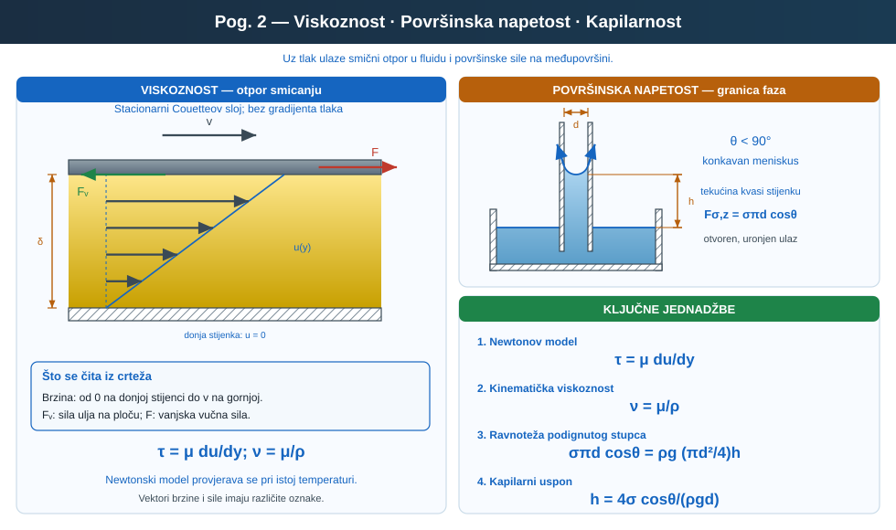
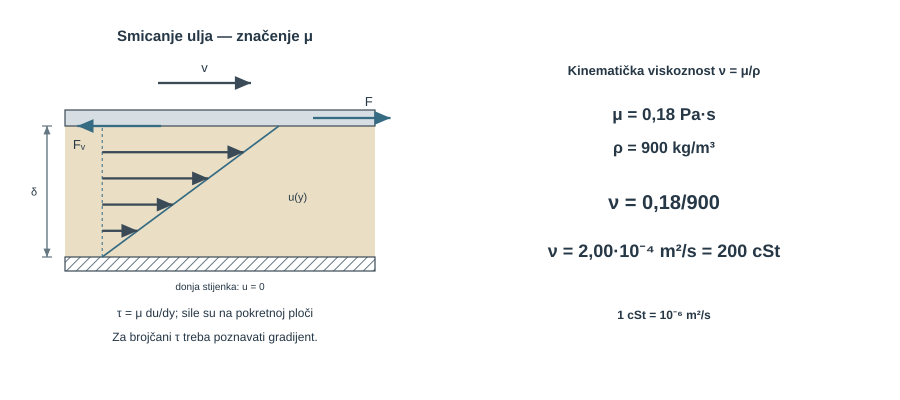
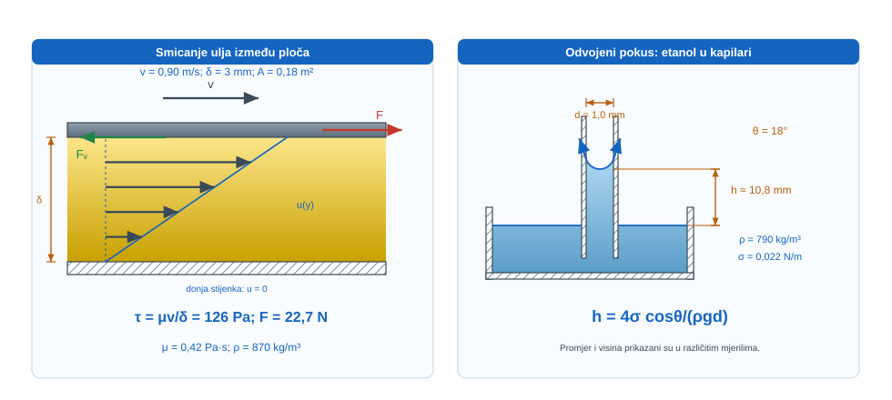
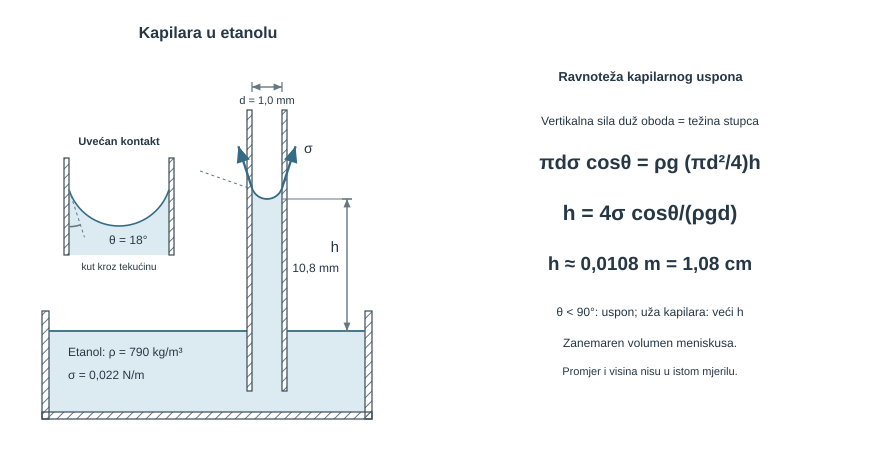
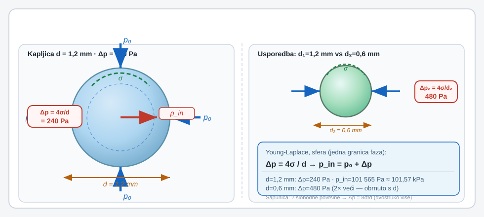
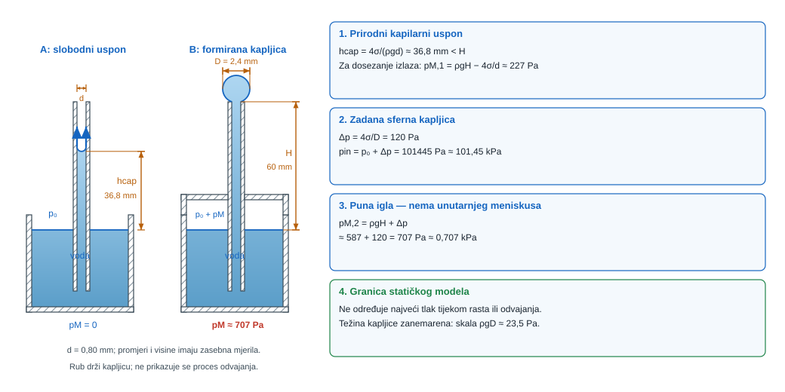
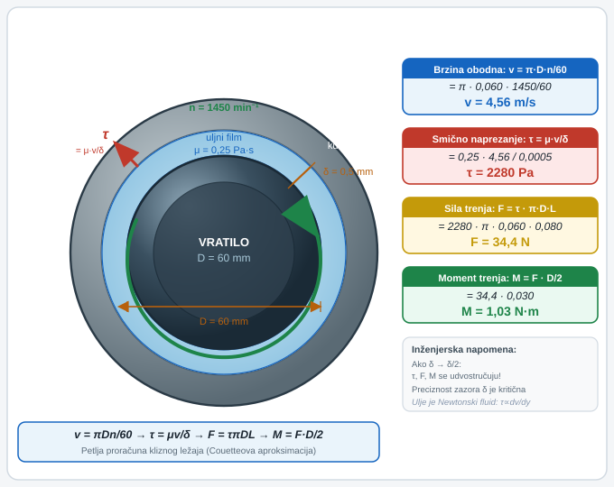
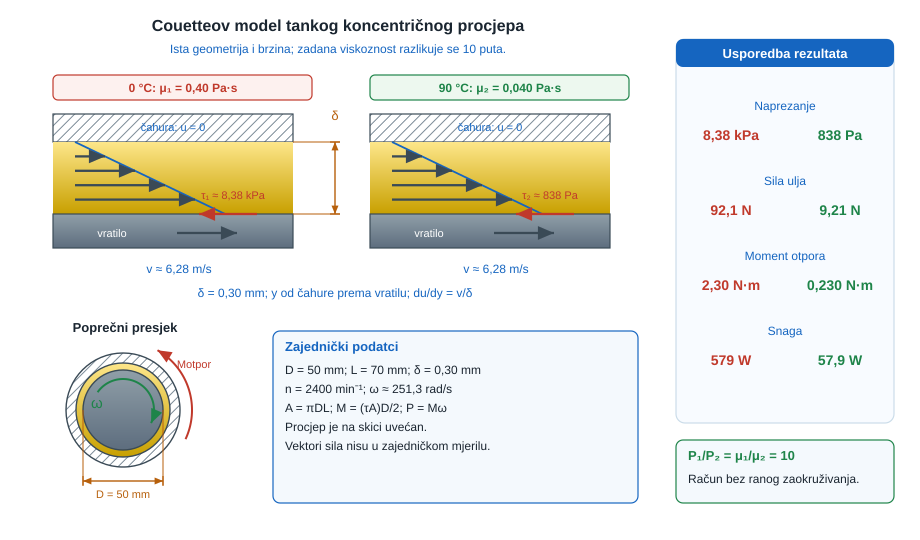
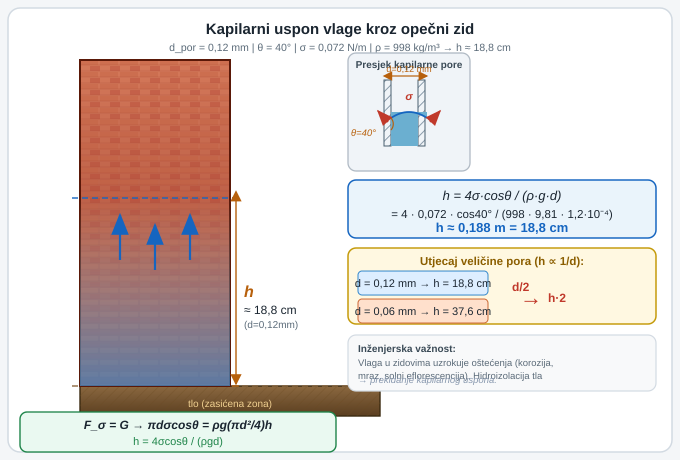
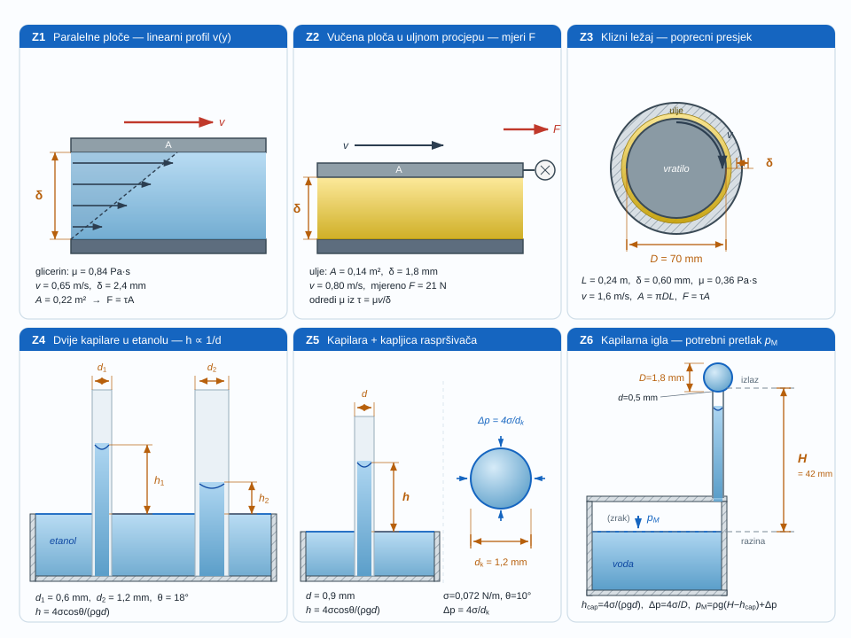

{#fig-uvod-u02 fig-align="center"}

## Kad fluid više nije samo nositelj tlaka

pog. 1Osnove fluida i Pascalov zakon zatvorio je tlak i Pascalov zakon za mirujući fluid. pog. 2Viskoznost, površinska napetost i kapilarnost otvara ono što se u tehnici vrlo brzo osjeti rukom i alatom: fluid nije samo nositelj tlaka, nego i medij koji pruža otpor gibanju te stvara pojave na slobodnoj površini.

Zato ovo poglavlje namjerno drži dva mehanizma jedan uz drugi: viskoznost u volumenu fluida i površinsku napetost na granici faza.

::: {.mf1-application}

Inženjerski kontekst

Viskoznost u strojarstvu odlučuje hoće li ležaj i klizna vodilica ostati odvojeni tankim uljnim filmom ili će prijeći u trošenje, a u autoindustriji upravo ona zatvara radni prozor motornog i hidrauličnog ulja pri hladnom startu i toplom radu. Površinska napetost i kapilarnost pojavljuju se u raspršivačima, premazima, zavarivačkim kupkama i podizanju vlage kroz porozne građevinske materijale, pa ovo poglavlje spaja tribologiju, obradu površina i fiziku slobodne površine.
:::

::: {.mf1-priprema}

Prije čitanja poglavlja

**Predznanje koje se pretpostavlja:**

- pojam smičnog naprezanja i naprezanja u tvari (Fizika I, osnove čvrstoće);
- diferencijalni račun jedne varijable, gradijent funkcije (Matematika I);
- razlikovanje sila i tlaka uvedeno u poglavlju pog. 1Osnove fluida i Pascalov zakon.

**Ishodi učenja:**

- razlikovati dinamičku i kinematičku viskoznost te ih pravilno koristiti;
- primijeniti Newtonov zakon viskoznosti na strujanje između dviju ploha;
- izračunati kapilarni uspon u kapilari zadanih svojstava;
- procijeniti kada površinska napetost dominira nad ostalim učincima na slobodnoj površini.

**Procijenjeno vrijeme:** 5–6 sati za teoriju i izvode, 3 sata za rješavanje primjera i zadataka.
:::

## Fizikalni uvod i matematički izvod

Kad se slojevi fluida gibaju relativno jedan prema drugom, pojavljuje se smično naprezanje i otpor gibanju. U Newtonskom fluidu vrijedi

$$
{}\tau = \mu \frac{dv}{dy}
$$

::: {.callout-note}
## Fizikalno značenje
Smično naprezanje $\tau$ je sila trenja po jedinici površine između susjednih slojeva fluida koji se kližu jedan uz drugoga. Gradijent brzine $dv/dy$ opisuje koliko se brzo ta brzina mijenja po okomici na tok – što su slojevi bliži po brzini, to manje naprezanje treba za održavanje gibanja. Koeficijent $\mu$ je "otpornost" fluida prema relativnom klizanju: voda ima $\mu \approx 0{,}001\ \text{Pa s}$, a strojno ulje može imati i $0{,}3\ \text{Pa s}$ – razlika od 300 puta. Newtonski model kaže da je $\tau$ linearno s $dv/dy$; za ne-Newtonske fluide (beton, krv, emulzije) ta linearnost prestaje.
:::

gdje je $\mu$ dinamička viskoznost, a $dv/dy$ gradijent brzine. Taj zapis kaže da matematika gradijenta brzine nije formalnost: što se susjedni slojevi brže razilaze po brzini, to je potrebno veće smično naprezanje da se njihovo relativno gibanje održi.

Na slobodnoj površini druga je fizika presudna: stvaranje površine traži energiju, pa se površina ponaša kao da je pod zateznom silom. To vodi prema površinskoj napetosti, kontaktnom kutu i kapilarnom usponu.

::: {.mf1-izvod}

Matematički izvod — Newtonov zakon viskoznosti i kapilarni uspon

Promatra se tanak sloj fluida između dviju paralelnih ploča površine $A$ i razmaka $\delta$. Donja ploča miruje, a gornja se giba brzinom $U$. Pokus pokazuje da sila potrebna za održavanje gibanja raste s površinom ploče i s brzinom, a pada s povećanjem razmaka među plohama. Zato se za Newtonski fluid piše razmjer

$$
F \propto A\frac{U}{\delta}.
$$

Uvođenjem konstante razmjernosti $\mu$ dobiva se

$$
F = \mu A\frac{U}{\delta}.
$$

Dijeljenjem s površinom slijedi smično naprezanje

$$
τ = \frac{F}{A} = \mu\frac{U}{\delta}.
$$

Kad se prijelaz s jedne brzine na drugu više ne promatra kao konačna razlika nego kao lokalni gradijent profila brzine, omjer $U/\delta$ prelazi u diferencijalni zapis $dv/dy$, pa nastaje Newtonov zakon viskoznosti

$$
τ = \mu\frac{dv}{dy}.
$$

U tom zapisu $\tau$ označuje gustoću smične sile na plohi, $\mu$ mjeri unutarnji otpor fluida relativnom klizanju slojeva, a $dv/dy$ pokazuje koliko se brzo brzina mijenja po okomici na strujanje.

Za kapilarni uspon promatra se kružna kapilara promjera $d$. Površinska napetost $\sigma$ djeluje duž cijeloga oboda, pa je ukupna sila na kontaktnoj liniji jednaka $\sigma\pi d$. Njezina vertikalna komponenta iznosi

$$
F_{\sigma,z} = \sigma\pi d\cos\theta,
$$

dok je težina podignutoga stupca tekućine

$$
G = \rho gV = \rho g\frac{\pi d^2}{4}h.
$$

U ravnoteži mora vrijediti $F_{\sigma,z}=G$, pa slijedi

$$
\sigma \pi d \cos\theta = \rho g \frac{\pi d^2}{4} h
$$

::: {.callout-note}
## Razrada koraka
Korak: jednadžba ravnoteže → $h = 4\sigma\cos\theta / (\rho g d)$

Dijeljenje obje strane s $\pi d$ (koji se pojavljuje na obje strane):
$$
\sigma \cos\theta = \rho g \frac{d}{4} h.
$$
Zatim se $h$ izolira dijeljenjem s $\rho g d/4$:
$$
h = \frac{4\sigma \cos\theta}{\rho g d}.
$$
Faktor $\pi$ otpada jer je bio zajednički na objema stranama jednadžbe ravnoteže. Promjer $d$ koji se poništava u brojniku ostaje samo u nazivniku jer je bio na viši potenciju u silici težine nego u sili površinske napetosti.
:::

i zato

$$
h = \frac{4\sigma \cos\theta}{\rho g d}.
$$

Iz iste relacije čita se i puni fizikalni smisao pojave: veća površinska napetost povećava uspon, veći promjer kapilare ga smanjuje, a znak člana $\cos\theta$ odlučuje radi li se o usponu ili padu. Kad je $\theta < 90^\circ$, tekućina kvasi stijenku i stupac raste; kad je $\theta > 90^\circ$, kapilarna pojava djeluje u suprotnom smjeru. Omjeri površinske napetosti prema inerciji i prema gravitaciji formaliziraju se Weberovim i Bondovim brojem u pog. 14Bezdimenzijski brojevi, dimenzijska analiza i sličnost.
:::

## Dinamička i kinematička viskoznost

Za inženjerski rad treba odmah razdvojiti dvije veličine:

$$
\mu\ [\text{Pa s}]
$$

$$
\nu = \frac{\mu}{\rho}\ [\text{m}^2/\text{s}]
$$

::: {.callout-note}
## Fizikalno značenje
Kinematička viskoznost $\nu$ kombinira unutarnji otpor fluida ($\mu$) s njegovom masenom inercijom ($\rho$). Fluid visoke gustoće sporije ubrzava pod istom silom, pa $\nu = \mu/\rho$ zapravo govori "koliko je mučno pokrenuti ovaj fluid relativno prema sebi". Upravo $\nu$ nastupa u Reynoldsovom broju i opisuje prelaz između laminarnog i turbulentnog strujanja: dva fluida s jednakim $\nu$ (ali različitim $\mu$ i $\rho$) imat će iste uzorce strujanja pri istoj brzini i dimenziji.
:::

Dinamička viskoznost govori koliki otpor fluid daje smičanju, a kinematička viskoznost taj isti otpor povezuje s gustoćom fluida. Ako se te dvije veličine pomiješaju, kasnije se pogrešno čitaju Reynoldsov broj i otpor strujanja.

::: {.mf1-we}

Kratki primjer — Pretvorba dinamičke u kinematičku viskoznost&nbsp;T1

**Kontekst:** Za procjenu Reynoldsovog broja u hidrauličkom sustavu potrebno je dinamičku viskoznost ulja izraziti kao kinematičku viskoznost, što se izvodi izravno pomoću gustoće tog ulja.

**Zadano**

- Dinamička viskoznost hidrauličnog ulja: $\mu = 0{,}18\ \text{Pa s}$
- Gustoća ulja: $\rho = 900\ \text{kg/m}^3$

**Traženo**

Odredi kinematičku viskoznost $\nu$.

{#fig-u02-kinematicka-viskoznost fig-align="center"}

**Pretpostavke i model**

Promatra se samo veza između dinamičke i kinematičke viskoznosti, pa vrijedi izravna relacija

$$
\nu = \frac{\mu}{\rho}.
$$

**Rješenje**

Uvrštavanjem zadanih podataka dobiva se

$$
\nu = \frac{\mu}{\rho} = \frac{0{,}18}{900} = 2{,}00 \cdot 10^{-4}\ \text{m}^2/\text{s}.
$$

**Provjera i komentar**

1. Kinematička viskoznost mora imati jedinicu površine po vremenu.
2. Pri istoj dinamičkoj viskoznosti veća gustoća daje manji $\nu$.
3. Ovaj korak ne govori još ništa o smičnom naprezanju; on samo pravilno prevodi jednu viskoznost u drugu.
:::

## Newtonov zakon viskoznosti

Za Newtonski fluid smično naprezanje raste linearno s gradijentom brzine:

$$
{}\tau = \mu \frac{dv}{dy}
$$

To nije univerzalni zakon za sve fluide, nego model za one fluide kod kojih je odnos linearan. U jednostavnom sloju fluida između dvije paralelne ploče, ako je profil brzine linearan, vrijedi i praktični zapis

$$
{}\tau = \mu \frac{v}{\delta}
$$

gdje je $\delta$ razmak među pločama.

::: {.callout-note collapse="true" icon="false"}
## Numerički trag

Newtonov zakon viskoznosti $\tau = \mu\,dv/dy$ ulazi u CFD solver kao **konstitutivni zakon** koji povezuje smično naprezanje s gradijentom brzine, čime se zatvara viskozni član u Navier-Stokesovim jednadžbama. U `OpenFOAM`-u nalazi se u datoteci `transportProperties` kao izbor *viskoznog modela* (`Newtonian`, `CrossPowerLaw`, `BirdCarreau`...). Ne-newtonski fluidi (svježi beton, isplaka, krv) dobivaju složenije modele.
:::

::: {.mf1-izvod}

Matematički izvod — Tenzor smičnog naprezanja u trodimenzijskom strujanju

Newtonov zakon viskoznosti $\tau = \mu\,dv/dy$ predstavljen je za **jednodimenzijsko strujanje** u kojem brzina ima samo jednu komponentu, a gradijent samo u jednom smjeru. U realnim trodimenzijskim strujanjima brzina ima tri komponente $u_1, u_2, u_3$ koje mogu varirati u sva tri smjera $x_1, x_2, x_3$, pa smično naprezanje postaje tenzor drugog reda.

Za **nestlačivi Newtonov fluid** poopćeni Newtonov zakon glasi

$$
\tau_{ij} = \mu\!\left(\frac{\partial u_i}{\partial x_j} + \frac{\partial u_j}{\partial x_i}\right),
$$

gdje su indeksi $i, j = 1, 2, 3$ koordinate prostora, a komponenta $\tau_{ij}$ predstavlja smično naprezanje koje djeluje u smjeru osi $i$ na plohu okomitu na os $j$.

Tenzor je **simetričan** ($\tau_{ij} = \tau_{ji}$), što fizikalno znači da svaka tri smična para djeluju jednako uzajamno — posljedica je to ravnoteže momenata na infinitezimalnom elementu fluida.

Iz tenzorske forme izlazi važan rezultat: trag tenzora (zbroj dijagonalnih elemenata) za nestlačivi fluid iščezava

$$
\tau_{11} + \tau_{22} + \tau_{33} = 2\mu\!\left(\frac{\partial u_1}{\partial x_1} + \frac{\partial u_2}{\partial x_2} + \frac{\partial u_3}{\partial x_3}\right) = 2\mu\,\nabla\cdot\vec{u} = 0,
$$

što znači da viskoznost ne dodaje vlastiti **izotropni dio** naprezanja — taj je dio u potpunosti pokriven tlakom $p$.

Skalarni jednodimenzijski oblik $\tau = \mu\,dv/dy$ koristi se kao radna verzija u svim $1$D problemima ovog poglavlja, ali iza njega stoji tenzorski zakon koji se pojavljuje u svakom CFD solveru kao **viskozni član** Navier-Stokesove jednadžbe (poglavlje pog. 11).
:::

## Površinska napetost i kontaktni kut

Na slobodnoj površini molekule nisu okružene susjedima kao u unutrašnjosti fluida. Zato površina nosi dodatnu energiju i ponaša se kao da je pod zatezanjem. Taj učinak opisuje se površinskom napetošću $\sigma$.

Površinska napetost ima dvostruku interpretaciju koja je istovremeno korisna. Mjeri se u jedinicama $\text{N/m}$ kao sila po jediničnoj duljini kontaktne linije, ali jednako vrijedi $\text{N/m} = \text{N}\cdot\text{m}/\text{m}^2 = \text{J/m}^2$, što znači da se $\sigma$ može čitati i kao energija po jediničnoj površini. Stvaranje nove površine fluida zahtijeva uložen rad jednak $\sigma \cdot \Delta A$, pa minimum energije pri zadanom volumenu objašnjava zašto kapljice u stanju bestežinskosti i sapunasti mjehuri zauzimaju sferni oblik — sfera, naime, ima najmanju površinu pri zadanom volumenu.

Kad je fluid u dodiru sa stijenkama, presudan postaje i kontaktni kut $\theta$. Znak i iznos $\cos \theta$ odlučuju penje li se tekućina u tankoj kapilari ili se razina spušta.

::: {.mf1-izvod}

Matematički izvod — Youngova jednadžba i podrijetlo kontaktnog kuta

Vrijednost kontaktnog kuta $\theta$ nije proizvoljna, nego proizlazi iz ravnoteže triju površinskih napetosti na trokontaktnoj liniji na kojoj se susreću kruta stijenka, tekućina i para. Na tu liniju djeluju tri sile po jedinici duljine:

- napetost između krutine i pare: $\sigma_{sv}$, koja vuče po krutoj površini prema van od tekućine;
- napetost između krutine i tekućine: $\sigma_{sl}$, koja vuče po krutoj površini prema tekućini;
- napetost između tekućine i pare: $\sigma_{lv}$, koja vuče po slobodnoj površini tekućine pod kutom $\theta$ prema krutoj plohi.

Tangencijalna ravnoteža duž krute površine glasi

$$
\sigma_{sv} = \sigma_{sl} + \sigma_{lv}\cos\theta,
$$

odakle slijedi **Youngova jednadžba**

$$
\cos\theta = \frac{\sigma_{sv} - \sigma_{sl}}{\sigma_{lv}}.
$$

Veličina $\sigma$ koja se koristi u kapilarnom usponu i u svim formulama koje slijede zapravo je $\sigma_{lv}$ — napetost između tekućine i pare. Ako krutina kvasi tekućinu (npr. voda na čistom staklu), vrijedi $\sigma_{sv} > \sigma_{sl}$, pa je $\cos\theta > 0$ i $\theta < 90^\circ$. Ako krutina ne kvasi tekućinu (npr. živa na staklu, voda na voštanoj površini), vrijedi $\sigma_{sv} < \sigma_{sl}$, pa je $\cos\theta < 0$ i $\theta > 90^\circ$.

Kvašenje i nekvašenje time prestaju biti svojstvo same tekućine — postaju **svojstvo para tekućina–krutina**. Ista voda u staklenoj kapilari kvasi ($\theta \approx 0$), u teflonskoj ne kvasi ($\theta > 90^\circ$), a kapilarni uspon ili pad mijenja predznak.
:::

Za kapilarni uspon vrijedi radni zapis

$$
h = \frac{4\sigma \cos\theta}{\rho g d}
$$

::: {.callout-note}
## Fizikalno značenje
Formula za $h$ sadržava sva četiri aktera kapilarnosti: površinska napetost $\sigma$ "vuče" tekućinu gore, $\cos\theta$ smanjuje tu silu za parcijalno kvašenje (za $\theta > 90^\circ$ ona okrene smjer i tekućina pada), a gustoća $\rho$ i gravitacija $g$ pružaju otpor težine stupca. Promjer $d$ stoji u nazivniku: prepoloviti promjer znači udvostručiti uspon. Zato je kapilarnost odlučujuća u tankim porama betona i opeke, ali zanemariva u cijevima centimetarskog ili većeg promjera.
:::

::: {.mf1-interaktivno}

Interaktivni prikaz — Kapilarni uspon

Interaktivni prikaz omogućuje mijenjanje površinske napetosti $\sigma$, kontaktnog kuta $\theta$ i promjera kapilare $d$ uz neposredno praćenje ravnotežne visine $h$. Krivulja $h(d)$ pokazuje karakterističnu ovisnost u logaritamskim koordinatama.

**Pitanja za samostalno istraživanje:** (a) Što se događa s usponom pri $\theta = 90°$ i pri $\theta > 90°$? (b) Koji eksponent ovisnosti $h \propto d^{?}$ slijedi iz formule? (c) Zašto je kapilarnost značajna u porama betona, ali zanemariva u cijevima centimetarskog promjera?

:::

pa su male promjene promjera cijevi ili kontaktnog kuta odmah vidljive na visini stupca. Kad je $\theta > 90^\circ$, izraz daje negativan $h$, što znači da se ne javlja kapilarni uspon nego kapilarni pad.

Za zakrivljenu slobodnu površinu nastaje karakterističan skok tlaka koji je posljedica iste ravnoteže sila kao i kod kapilarnog uspona, samo primijenjene na zatvoreni mjehurić. Za kapljicu s jednom granicom faza tlak skoka je $\Delta p = 4\sigma/d$, dok je za sapunasti mjehur s dvjema slobodnim površinama $\Delta p = 8\sigma/d$.

::: {.mf1-izvod}

Matematički izvod — Young-Laplaceov zakon za kapljicu i mjehurić

Promatra se sferna kapljica polumjera $r$ koja je u dodiru s okolnim plinom. Tlak unutar kapljice ($p_u$) veći je od tlaka u plinu ($p_v$) jer ga zatvara površinska napetost. Ravnoteža sila se najlakše postavlja po horizontalnoj presječnoj ravnini koja prolazi kroz ekvator kapljice; gornja polusfera mora ostati u ravnoteži pod djelovanjem dviju suprotno usmjerenih sila:

- sile tlačne razlike, koja tjera polusferu od ekvatora prema van — djeluje na projiciranu kružnu površinu $A_{proj} = \pi r^2$ i iznosi

$$
F_{tlak} = (p_u - p_v)\,\pi r^2,
$$

- sile površinske napetosti, koja gornju polusferu vuče prema dolje duž ekvatorske kružnice duljine $L = 2\pi r$:

$$
F_\sigma = \sigma \cdot 2\pi r.
$$

U ravnoteži vrijedi $F_{tlak} = F_\sigma$, odnosno

$$
(p_u - p_v)\,\pi r^2 = \sigma \cdot 2\pi r,
$$

odakle se kraćenjem zajedničkog faktora $\pi r$ dobiva tlačni skok

$$
\Delta p = p_u - p_v = \frac{2\sigma}{r} = \frac{4\sigma}{d}.
$$

Za **sapunasti mjehur** s dvije slobodne površine (unutarnja i vanjska opna) sila površinske napetosti je dvostruka jer obje opne dijele isti ekvatorski obod:

$$
F_\sigma = 2\cdot\sigma\cdot 2\pi r = 4\pi r\sigma,
$$

pa je tlačni skok

$$
\Delta p = \frac{4\sigma}{r} = \frac{8\sigma}{d}.
$$

Za općenitu zakrivljenu plohu s glavnim polumjerima zakrivljenosti $R_1$ i $R_2$, opći **Young-Laplaceov zakon** glasi

$$
\Delta p = \sigma\!\left(\frac{1}{R_1} + \frac{1}{R_2}\right),
$$

što za sferu ($R_1 = R_2 = r$) daje izraz $\Delta p = 2\sigma/r$, a za cilindar ($R_2 \to \infty$) daje $\Delta p = \sigma/R$.
:::

::: {.callout-note}
## Fizikalno značenje
Zakrivljena površina "stisne" fluid iznutra jer je površinska napetost zapregnuta po cijelom obodu i mora balansirati tlačnu silu. Što je manji promjer, to je veća zakrivljenost i veći skok tlaka. Faktor 4 za kapljicu nastaje jer sfera ima jednu slobodnu površinu i polumjer $r = d/2$; faktor 8 za mjehur dolazi od dvije paralelne slobodne površine. Ovaj skok tlaka ključan je za kavitaciju u pumpama: čim lokalni tlak padne ispod tlaka potrebnog da zatvori mikrokapljicu, nastaje kavitacijski mjehur.
:::

## Riješeni primjeri

::: {.mf1-we}

Riješeni primjer — Smično naprezanje u tankom uljnom sloju&nbsp;T2

**Kontekst:** Tanak sloj ulja između dviju paralelnih ploča je tipičan model za hidrauličku brtvu ili klizni element. Treba odrediti gradijent brzine, smično naprezanje, silu vučenja i kinematičku viskoznost.

**Zadano**

- Debljina uljnog sloja: $\delta = 3\ \text{mm}$
- Brzina gornje ploče: $v = 0{,}90\ \text{m/s}$
- Aktivna površina ploče: $A = 0{,}18\ \text{m}^2$
- Dinamička viskoznost ulja: $\mu = 0{,}42\ \text{Pa s}$
- Gustoća ulja: $\rho = 870\ \text{kg/m}^3$

**Traženo**

1. Odredi gradijent brzine $dv/dy$.
2. Odredi smično naprezanje $\tau$.
3. Odredi silu potrebnu za jednoliko gibanje gornje ploče.
4. Odredi kinematičku viskoznost $\nu$.

**Pretpostavke i model**

Promatra se linearni profil brzine između dviju paralelnih ploča. Zato je gradijent brzine konstantan, a smično naprezanje dobiva se iz Newtonova zakona viskoznosti.

**Rješenje**

Najprije razmak pretvorimo u metre:

$$
\delta = 0{,}003\ \text{m}.
$$

pa je gradijent brzine

$$
\frac{dv}{dy} = \frac{v}{\delta} = \frac{0{,}90}{0{,}003} = 300\ \text{s}^{-1}.
$$

smično naprezanje iznosi

$$
{}\tau = \mu \frac{dv}{dy} = 0{,}42 \cdot 300 = 126\ \text{Pa}.
$$

Sila na ploči zato je

$$
F = \tau A = 126 \cdot 0{,}18 = 22{,}68\ \text{N} \approx 22{,}7\ \text{N}.
$$

kinematička viskoznost glasi

$$
\nu = \frac{\mu}{\rho} = \frac{0{,}42}{870} = 4{,}83 \cdot 10^{-4}\ \text{m}^2/\text{s}.
$$

**Provjera i komentar**

1. Manji razmak među pločama mora povećati gradijent brzine.
2. Veća viskoznost mora povećati smično naprezanje i potrebnu silu.
3. Red veličine sile od nekoliko desetaka njutna razuman je za ovakav sloj i površinu.
:::

::: {.mf1-we}

Riješeni primjer — Kapilarni uspon etanola u staklenoj cjevčici&nbsp;T1

**Kontekst:** Staklena kapilara uronjena u etanol pokazuje kapilarni uspon manji nego u potpunom kvašenju jer kontaktni kut nije nula. Treba odrediti visinu kapilarnog uspona.

**Zadano**

- Unutarnji promjer kapilare: $d = 1{,}0\ \text{mm}$
- Površinska napetost etanola: $\sigma = 0{,}022\ \text{N/m}$
- Gustoća etanola: $\rho = 790\ \text{kg/m}^3$
- Gravitacijsko ubrzanje: $g = 9{,}81\ \text{m/s}^2$
- Kontaktni kut etanol-staklo: $\theta = 18^\circ$

**Traženo**

Odredi visinu kapilarnog uspona $h$.

{#fig-u02-kapilarni-uspon-etanol fig-align="center"}

**Pretpostavke i model**

Kontaktni kut ovdje nije nula, pa se kapilarni uspon ne smije računati kao potpuno kvašenje. U visinu uspona ulazi faktor $\cos\theta$, koji smanjuje vertikalnu komponentu površinske sile.

**Rješenje**

Promjer u metrima iznosi $d = 1{,}0 \cdot 10^{-3}\ \text{m}$, a za zadani kontaktni kut vrijedi $\cos 18^\circ \approx 0{,}951$, pa je kapilarni uspon

$$
h = \frac{4\sigma\cos\theta}{\rho g d} = \frac{4 \cdot 0{,}022 \cdot 0{,}951}{790 \cdot 9{,}81 \cdot 1{,}0 \cdot 10^{-3}} = 0{,}0108\ \text{m} \approx 1{,}08\ \text{cm}.
$$

**Provjera i komentar**

1. Kako je $\theta < 90^\circ$, razina mora rasti, a ne padati.
2. Tanja kapilara mora dati veći uspon.
3. Neto uspon mora biti manji nego u slučaju potpunog kvašenja jer je ovdje $\cos\theta < 1$.
:::

::: {.mf1-we}

Riješeni primjer — Tlakovni skok u vodenoj kapljici raspršivača&nbsp;T1

**Kontekst:** U raspršivaču nastaje gotovo sferna kapljica vode, a zakrivljena površina podiže tlak unutar kapljice prema Young-Laplaceovom zakonu. Treba odrediti tlakovni skok, apsolutni tlak unutar i učinak smanjenja promjera.

**Zadano**

- Promjer kapljice vode: $d = 1{,}2\ \text{mm}$
- Površinska napetost vode: $\sigma = 0{,}072\ \text{N/m}$
- Atmosferski tlak: $p_0 = 101325\ \text{Pa}$
- Smanjeni promjer kapljice: $d_2 = 0{,}6\ \text{mm}$

**Traženo**

1. tlakovni skok $\Delta p = p_{in} - p_0$ preko površine kapljice.
2. apsolutni tlak unutar kapljice.
3. koliki bi bio tlakovni skok kada bi se promjer kapljice smanjio na $0{,}6\ \text{mm}$.

**Pretpostavke i model**

Kapljica se tretira kao sfera s jednom granicom faza tekućina-zrak. Zato za Young-Laplaceov skok tlaka vrijedi relacija

$$
\Delta p = \frac{4\sigma}{d}
$$

jer je za sferu radijus $r = d/2$.

**Rješenje**

Za promjer $d = 1{,}2\ \text{mm} = 1{,}2 \cdot 10^{-3}\ \text{m}$ tlakovni skok iznosi

$$
\Delta p = \frac{4\sigma}{d} = \frac{4 \cdot 0{,}072}{1{,}2 \cdot 10^{-3}} = 240\ \text{Pa}.
$$

Apsolutni tlak unutar kapljice zato je

$$
p_{in} = p_0 + \Delta p = 101325 + 240 = 101565\ \text{Pa} \approx 101{,}57\ \text{kPa}.
$$

Ako se promjer prepolovi na $d_2 = 0{,}6\ \text{mm} = 0{,}6 \cdot 10^{-3}\ \text{m}$, tada novi tlakovni skok glasi

$$
\Delta p_2 = \frac{4\sigma}{d_2} = \frac{4 \cdot 0{,}072}{0{,}6 \cdot 10^{-3}} = 480\ \text{Pa}.
$$

**Provjera i komentar**

1. Tlak unutar kapljice mora biti veći od vanjskog tlaka jer zakrivljena površina mora ostati zategnuta.
2. Manja kapljica mora imati veći tlakovni skok, što se vidi odmah iz obrnutog razmjera s promjerom.
3. Dobiveni skok je malen u odnosu na atmosferu, ali nije malen u odnosu na lokalnu mikroskopsku geometriju kapljice.
:::

::: {.mf1-ch}

Cjeloviti zadatak — Kapilarni mikrodozator s izlaznom kapljicom&nbsp;T3

**Kontekst:** U laboratorijskom mikrodozatoru voda iz spremnika diže se tankom staklenom kapilarom do izlaza na kojem nastaje gotovo sferna kapljica. Treba odrediti kapilarni uspon, Laplaceov skok tlaka na kapljici i najmanji potreban pretlak u spremniku da uređaj pouzdano dozira.

**Zadano**

- Unutarnji promjer vertikalne staklene kapilare: $d = 0{,}80\ \text{mm}$
- Gustoća vode: $\rho = 998\ \text{kg/m}^3$
- Površinska napetost vode: $\sigma = 0{,}072\ \text{N/m}$
- Kontaktni kut voda-staklo (potpuno kvašenje): $\theta = 0^\circ$
- Visina izlaza kapilare iznad slobodne površine u spremniku: $H = 60\ \text{mm}$
- Promjer gotovo sferne izlazne kapljice: $D = 2{,}4\ \text{mm}$

Iznad vode u spremniku može se po potrebi zadati mali manometarski pretlak $p_M$.

**Traženo**

1. kapilarni uspon $h_{cap}$ kada je spremnik otvoren prema atmosferi.
2. tlakovni skok $\Delta p$ na izlaznoj kapljici i apsolutni tlak unutar kapljice.
3. najmanji manometarski pretlak $p_{M,min}$ koji treba zadati spremniku da voda dosegne izlaz i održi kapljicu promjera $D$.
4. je li kapilarnost sama dovoljna da voda dosegne izlaz bez dodatnog pretlaka.

Pretpostavi da je kapljica kvazistacionarna, da je gubitak u kapilari zanemariv i da se kapilarni uspon može čitati iz standardne relacije za potpunu vlažnost.

**Pretpostavke i model**

Kapilarnost i Laplaceov skok ovdje djeluju u istom uređaju, ali ih treba čitati odvojeno. Kapilarnost sama daje koliko se voda može podići u tankoj cjevčici bez dodatnog pogona. Ako izlaz leži više od tog uspona, ostatak visine mora se savladati dodatnim pretlakom u spremniku. Na samom izlazu zatim treba još zatvoriti skok tlaka preko zakrivljene površine kapljice.

**Rješenje**

#### 1. Kapilarni uspon

Za vodu u staklenoj kapilari pri $\theta = 0^\circ$ ($\cos 0^\circ = 1$) vrijedi

$$
h_{cap} = \frac{4\sigma \cos\theta}{\rho g d} = \frac{4 \cdot 0{,}072}{998 \cdot 9{,}81 \cdot 0{,}80 \cdot 10^{-3}} = 0{,}0368\ \text{m} \approx 36{,}8\ \text{mm}.
$$

#### 2. Tlakovni skok na kapljici

Za gotovo sfernu kapljicu, uz $D = 2{,}4\ \text{mm} = 2{,}4 \cdot 10^{-3}\ \text{m}$, relacija Young-Laplace daje

$$
\Delta p = \frac{4\sigma}{D} = \frac{4 \cdot 0{,}072}{2{,}4 \cdot 10^{-3}} = 120\ \text{Pa}.
$$

Ako je vanjski tlak atmosferski,

$$
p_{in} = p_0 + \Delta p = 101325 + 120 = 101445\ \text{Pa} \approx 101{,}45\ \text{kPa}.
$$

#### 3. Najmanji potreban pretlak u spremniku

Izlaz kapilare nalazi se na visini $H = 60\ \text{mm}$, a kapilarnost sama može podići vodu samo do $h_{cap}$. Preostala hidrostatička razlika $H - h_{cap} = 60 - 36{,}8 = 23{,}2\ \text{mm}$ odgovara dodatnom tlaku

$$
p_H = \rho g (H - h_{cap}) = 998 \cdot 9{,}81 \cdot (0{,}060 - 0{,}0368) = 227\ \text{Pa}.
$$

Na izlazu treba još savladati i tlačni skok na kapljici, pa je najmanji potreban manometarski pretlak

$$
p_{M,min} = p_H + \Delta p = 227 + 120 = 347\ \text{Pa} \approx 0{,}347\ \text{kPa}.
$$

#### 4. Je li kapilarnost sama dovoljna?

Kapilarnost sama bila bi dovoljna kada bi vrijedilo $h_{cap} \geq H$. Ovdje je, međutim, $36{,}8\ \text{mm} < 60\ \text{mm}$, pa sama kapilarnost nije dovoljna da voda dosegne izlaz. Potreban je mali dodatni pretlak u spremniku.

**Provjera i komentar**

Kapilarnost sama podiže vodu za oko $36{,}8\ \text{mm}$, dok izlaz mikrodozatora leži na $60\ \text{mm}$ iznad spremnika. Zato je za dosezanje izlaza potreban dodatni tlak od oko $227\ \text{Pa}$, a za zadržavanje kapljice promjera $2{,}4\ \text{mm}$ treba još oko $120\ \text{Pa}$ Laplaceova skoka. Ukupno je potreban minimalni manometarski pretlak od oko $347\ \text{Pa}$, a apsolutni tlak unutar kapljice iznosi oko $101{,}45\ \text{kPa}$.

1. Manja kapilarna cjevčica mora davati veći kapilarni uspon, pa bi smanjenje promjera olakšalo doseg izlaza.
2. Manja kapljica mora tražiti veći tlačni skok, pa bi smanjenje promjera kapljice povećalo potrebni pretlak.
3. Kako je $h_{cap} < H$, dodatni pogonski tlak mora biti pozitivan; negativan rezultat ovdje bi odmah značilo da je negdje izgubljen znak ili pretvorba jedinica.
::: 

::: {.mf1-we}

Riješeni primjer — Viskozni otpor i zakretni moment u kliznom ležaju &nbsp;T2

**Primjer za strojare**

**Kontekst:** Rotor centrifugalne pumpe vrti se u kliznom ležaju s uljnom podmazom. Potrebno je procijeniti zakretni moment trenja koji motor mora svladati samo zbog viskoznog otpora u ležaju.

**Zadano**

- Promjer vratila: $D = 60\ \text{mm}$
- Duljina ležaja: $L = 80\ \text{mm}$
- Uljni procjep: $\delta = 0{,}50\ \text{mm}$
- Dinamička viskoznost ulja: $\mu = 0{,}25\ \text{Pa s}$
- Brzina vrtnje: $n = 1450\ \text{min}^{-1}$

**Traženo**

1. Obodna brzina površine vratila.
2. Smično naprezanje u uljnom procjepu.
3. Sila viskoznog trenja na cilindarskoj površini ležaja.
4. Zakretni moment trenja.

{#fig-u02-klizni-lezaj fig-align="center"}

**Pretpostavke i model**

Profil brzine u tankom uljnom procjepu aproksimira se kao linearan, pa je gradijent brzine konstantan: $dv/dy \approx v/\delta$. Zanemaruju se rubni efekti na krajevima ležaja.

**Rješenje**

Obodna brzina površine vratila:

$$
v = \frac{\pi D n}{60} = \frac{\pi \cdot 0{,}060 \cdot 1450}{60} = 4{,}56\ \text{m/s}
$$

Smično naprezanje u procjepu:

$$
\tau = \mu \frac{v}{\delta} = 0{,}25 \cdot \frac{4{,}56}{0{,}00050} = 2280\ \text{Pa}
$$

Kontaktna površina ležaja:

$$
A = \pi D L = \pi \cdot 0{,}060 \cdot 0{,}080 = 1{,}508 \cdot 10^{-2}\ \text{m}^2
$$

Sila viskoznog trenja:

$$
F = \tau A = 2280 \cdot 1{,}508 \cdot 10^{-2} = 34{,}4\ \text{N}
$$

Zakretni moment trenja:

$$
M = F \cdot \frac{D}{2} = 34{,}4 \cdot 0{,}030 = 1{,}03\ \text{N m}
$$

**Provjera i komentar**

Zakretni moment $1{,}03\ \text{N m}$ realistična je vrijednost za klizni ležaj ove veličine – to je gubitak koji motor mora neprekidno svladavati. Povećanje $\delta$ (labaviji ležaj) smanjuje $\tau$ i $M$, ali narušava točnost vođenja. Ulje s manjom $\mu$ (viša temperatura) smanjuje moment trenja, ali i sposobnost odvajanja površina.

:::

::: {.mf1-we}

Riješeni primjer — Hladni start i radna temperatura: koliko košta hladno ulje &nbsp;T2

**Primjer za strojare**

**Kontekst:** Vratilo motora u kliznom ležaju mora se okretati neovisno o tome je li motor netom upaljen ili je već zagrijan. Viskoznost motornog ulja međutim **vrlo jako pada s temperaturom** – tipičan višegrad SAE 10W-40 ima pri $T = 0^\circ\text{C}$ približno deset puta veću dinamičku viskoznost nego pri radnoj temperaturi $T = 90^\circ\text{C}$. Isti ležaj, isti broj okretaja, isti uljni procjep – ali viskozni otpor pri hladnom startu može potrošiti red veličine više snage nego pri zagrijanom radu. Zato motor pri startu na hladno "vuče" teže i privremeno smije raditi samo pri smanjenoj brzini do nego se ulje zagrije.

**Zadano**

Isti klizni ležaj radi pri dvjema temperaturama:

- Promjer vratila: $D = 50\ \text{mm}$
- Duljina ležaja: $L = 70\ \text{mm}$
- Uljni procjep: $\delta = 0{,}30\ \text{mm}$
- Brzina vrtnje: $n = 2400\ \text{min}^{-1}$
- Dinamička viskoznost pri $T_1 = 0^\circ\text{C}$: $\mu_1 = 0{,}40\ \text{Pa s}$
- Dinamička viskoznost pri $T_2 = 90^\circ\text{C}$: $\mu_2 = 0{,}040\ \text{Pa s}$

**Traženo**

1. Obodna brzina vratila i gradijent brzine u procjepu.
2. Smično naprezanje pri obje temperature.
3. Zakretni moment trenja pri obje temperature.
4. Snaga koju motor mora trošiti samo na svladavanje viskoznog trenja pri obje temperature i omjer hladne i tople snage.

{#fig-u02-lezaj-temperatura fig-align="center"}

**Pretpostavke i model**

Profil brzine u tankom uljnom procjepu aproksimira se kao linearan, pa je $dv/dy = v/\delta$ konstantan. Gustoća ulja se mijenja s temperaturom svega nekoliko postotaka – zato se promjena gustoće zanemaruje, a sve razlike u rezultatu pripisuju se isključivo promjeni viskoznosti. Geometrija ležaja i broj okretaja se ne mijenjaju. Smjer toplinskog rastapanja ulja i lokalno zagrijavanje samog procjepa zanemaruju se – $\mu$ se uzima kao stalna unutar svakog od dva razmatranja.

**Rješenje**

Obodna brzina vratila ne ovisi o temperaturi:

$$
v = \frac{\pi D n}{60} = \frac{\pi \cdot 0{,}050 \cdot 2400}{60} \approx 6{,}28\ \text{m/s}
$$

Gradijent brzine u procjepu:

$$
\frac{dv}{dy} \approx \frac{v}{\delta} = \frac{6{,}28}{0{,}30 \cdot 10^{-3}} \approx 2{,}09 \cdot 10^4\ \text{s}^{-1}
$$

Smično naprezanje pri hladnom startu:

$$
\tau_1 = \mu_1 \frac{v}{\delta} = 0{,}40 \cdot 2{,}09 \cdot 10^4 \approx 8{,}38 \cdot 10^3\ \text{Pa}
$$

Smično naprezanje pri radnoj temperaturi:

$$
\tau_2 = \mu_2 \frac{v}{\delta} = 0{,}040 \cdot 2{,}09 \cdot 10^4 \approx 838\ \text{Pa}
$$

Kontaktna površina ležaja:

$$
A = \pi D L = \pi \cdot 0{,}050 \cdot 0{,}070 = 1{,}10 \cdot 10^{-2}\ \text{m}^2
$$

Sila viskoznog trenja i zakretni moment pri hladnom startu:

$$
F_1 = \tau_1 A \approx 92{,}2\ \text{N}, \qquad M_1 = F_1 \cdot \frac{D}{2} \approx 2{,}30\ \text{N m}
$$

Sila viskoznog trenja i zakretni moment pri radnoj temperaturi:

$$
F_2 = \tau_2 A \approx 9{,}22\ \text{N}, \qquad M_2 = F_2 \cdot \frac{D}{2} \approx 0{,}231\ \text{N m}
$$

Kutna brzina rotacije:

$$
\omega = \frac{2\pi n}{60} \approx 251{,}3\ \text{rad/s}
$$

Snaga koju motor mora trošiti samo zbog viskoznog trenja:

$$
P_1 = M_1 \omega \approx 2{,}30 \cdot 251{,}3 \approx 578\ \text{W}
$$

$$
P_2 = M_2 \omega \approx 0{,}231 \cdot 251{,}3 \approx 58{,}0\ \text{W}
$$

Omjer snage hladnog starta prema snazi pri radnoj temperaturi:

$$
\frac{P_1}{P_2} = \frac{\mu_1}{\mu_2} = 10
$$

**Provjera i komentar**

1. Smično naprezanje, sila trenja, moment i snaga svi se linearno mijenjaju s viskoznošću – jer ulaze samo kroz $\mu$ u Newtonov zakon. Zato je faktor 10 u $\mu$ izravno faktor 10 u svim izlaznim veličinama.
2. Snaga $578\ \text{W}$ samo za jedan klizni ležaj pri hladnom startu objašnjava zašto motor pri startu "muklo zvuči" i zašto se isključuju klimatizacija i druga trošila dok se ulje ne zagrije – snaga koja ide u svladavanje viskoznog trenja inače nedostaje za pokretanje.
3. Inženjerska poruka: višegrad ulje ($10W-40$, $5W-30$) projektirano je upravo da u zimskim uvjetima ima što manji $\mu_1$ (znamenka prije "W" – winter), a istovremeno pri radnoj temperaturi zadrži dovoljan $\mu_2$ (znamenka iza "W") da odvoji površine. Klasa "$0W-20$" jako reducira hladni start, ali pri visokoj radnoj temperaturi ima manju rezervu nosivosti uljnog filma.
4. Procjep $\delta$ i geometrija ležaja ne ulaze u omjer $P_1/P_2$ – mehanička konstrukcija ne pomaže oko hladnog starta. Jedina stvarna mjera je svojstvo ulja.
:::

::: {.mf1-we}

Riješeni primjer — Kapilarni uspon vlage kroz opečni zid &nbsp;T1

**Primjer za građevinare**

**Kontekst:** Neizolirani opečni zid starije stambene zgrade uzrokuje vidljive tragove vlage u prizemlju. Procjenjuje se do koje visine vlaga može kapilarno narastati kroz sitne pore opeke.

**Zadano**

- Ekvivalentni promjer kapilarnih pora u opeci: $d_{por} = 0{,}12\ \text{mm}$
- Površinska napetost vode: $\sigma = 0{,}072\ \text{N/m}$
- Kontaktni kut vode na opeci: $\theta = 40^\circ$
- Gustoća vode: $\rho = 998\ \text{kg/m}^3$

**Traženo**

1. Maksimalna visina kapilarnog uspona vlage.
2. Kolika bi bila ta visina kada bi pore bile upola manje ($d = 0{,}06\ \text{mm}$)?

{#fig-u02-kapilarna-vlaga-zid fig-align="center"}

**Pretpostavke i model**

Pore se modeliraju kao kružne kapilare s jedinstvenim ekvivalentnim promjerom. Kontaktni kut je isti za sve pore. Zanemaruje se otpor na toku vlage.

**Rješenje**

Za zadane uvjete vrijedi $\cos 40^\circ = 0{,}766$.

Maksimalni kapilarni uspon:

$$
h = \frac{4\sigma \cos\theta}{\rho g d_{por}} = \frac{4 \cdot 0{,}072 \cdot 0{,}766}{998 \cdot 9{,}81 \cdot 0{,}12 \cdot 10^{-3}} = \frac{0{,}2207}{1{,}175} \approx 0{,}188\ \text{m}
$$

$$
h \approx 18{,}8\ \text{cm}
$$

Za prepolovljeni promjer pore ($d = 0{,}06\ \text{mm}$):

$$
h_2 = \frac{4 \cdot 0{,}072 \cdot 0{,}766}{998 \cdot 9{,}81 \cdot 0{,}06 \cdot 10^{-3}} \approx 0{,}376\ \text{m} \approx 37{,}6\ \text{cm}
$$

**Provjera i komentar**

Visina $18{,}8\ \text{cm}$ dobro odgovara tipičnoj vlažnoj liniji koja se vidi u donjim dijelovima neizoliranoga opečnog prizemlja. Finija opeka s manjim porama daje gotovo dvostruku visinu uspona – suprotno od intuicije, ali izravna posljedica formule. Smanjenje kontaktnog kuta premazom silikonom (npr. $\theta \to 80^\circ$ gdje je $\cos 80^\circ = 0{,}17$) reducira uspon na svega oko $4\ \text{cm}$ – to je načelo hidrofobne fasadne impregancije.

:::

::: {.mf1-we}

Riješeni primjer — Mikrofluidički kanal u lab-on-chip uređaju za dijagnostiku &nbsp;T2

**Kontekst:** U dijagnostičkim uređajima vrste *lab-on-chip* (sve aktivnosti laboratorija sažete su na čipu veličine kovanice) uzorak krvi ili sline dovodi se u mikrofluidičke kanale isključivo kapilarnim djelovanjem, bez vanjske pumpe. Kanal je izrađen od polimera (najčešće PDMS), promjera reda nekoliko desetaka mikrometara. Kapilarno usisavanje koristi se kao temeljni mehanizam za precizno doziranje vrlo malih volumena.

**Zadano**

- Promjer kapilarnog kanala: $d = 60\ \mu\text{m}$
- Površinska napetost uzorka (vodena otopina sa surfaktantom): $\sigma = 0{,}055\ \text{N/m}$
- Kontaktni kut tekućine na PDMS materijalu: $\theta = 25^\circ$
- Gustoća uzorka (krv razrijeđena s reagensom): $\rho = 1010\ \text{kg/m}^3$

**Traženo**

1. Maksimalna ravnotežna visina kapilarnog uspona;
2. Razlika tlakova na meniskusu prema Young-Laplaceovu zakonu;
3. Učinak hidrofobnog premaza kanala (promjena kontaktnog kuta na $\theta = 110^\circ$).

**Pretpostavke i model**

Mikrofluidički kanal je vertikalno orijentiran, kontaktni kut je konstantan duž stijenke, gravitacijsko polje je standardno. Promatra se ravnotežno stanje (Lucas-Washburnova kinetika punjenja zanemaruje se jer je interes na konačnoj visini). Tekućina se aproksimira jednofaznim newtonskim fluidom.

**Rješenje**

Ravnotežna visina kapilarnog uspona slijedi iz uvjeta ravnoteže sile površinske napetosti i težine stupca:

$$
h = \frac{4\sigma\cos\theta}{\rho g d} = \frac{4 \cdot 0{,}055 \cdot \cos 25^\circ}{1010 \cdot 9{,}81 \cdot 60 \cdot 10^{-6}}.
$$

Uvrštavanjem $\cos 25^\circ \approx 0{,}906$:

$$
h = \frac{4 \cdot 0{,}055 \cdot 0{,}906}{1010 \cdot 9{,}81 \cdot 6 \cdot 10^{-5}} = \frac{0{,}1993}{0{,}5945} \approx 0{,}335\ \text{m}.
$$

Dakle visina kapilarnog uspona iznosi približno

$$
h \approx 33{,}5\ \text{cm}.
$$

Razlika tlakova na meniskusu prema Young-Laplaceovu zakonu za kružni presjek:

$$
\Delta p = \frac{4\sigma\cos\theta}{d} = \frac{4 \cdot 0{,}055 \cdot 0{,}906}{60 \cdot 10^{-6}} \approx 3{,}32 \cdot 10^3\ \text{Pa} \approx 3{,}32\ \text{kPa}.
$$

Pri hidrofobnom premazu kanala ($\theta = 110^\circ$) vrijedi $\cos 110^\circ \approx -0{,}342$, pa rezultat postaje negativan:

$$
h_{hidrofobno} = \frac{4 \cdot 0{,}055 \cdot (-0{,}342)}{1010 \cdot 9{,}81 \cdot 6 \cdot 10^{-5}} \approx -0{,}127\ \text{m}.
$$

Negativna vrijednost znači da tekućina ne ulazi u kapilaru, nego se povlači — što se u praksi koristi za izgradnju mikrofluidičkih ventila.

**Provjera i komentar**

Ravnotežna visina od oko $33{,}5\ \text{cm}$ daleko premašuje stvarne dimenzije lab-on-chip uređaja (tipično nekoliko centimetara), što potvrđuje da kapilarno djelovanje pouzdano dovršava punjenje kanala bez potrebe za vanjskim pogonom. Tlačni skok od $3{,}3\ \text{kPa}$ na meniskusu predstavlja okvirno onaj iznos koji konstrukcija ulaznih spojnica mora podnositi bez propuštanja. Mogućnost obrnutog ponašanja pri hidrofobnom premazu pokazuje zašto se selektivno mijenjanje kontaktnog kuta po duljini kanala koristi za izgradnju pasivnih ventila i preusmjerivača u modernim mikrofluidičkim uređajima.
:::

::: {.mf1-samoprovjera}

Provjeri sebe

Sljedeća pitanja služe za samostalnu provjeru razumijevanja prije prelaska na zadatke za vježbu. Preporučuje se prvo samostalno odgovoriti, a tek zatim otvoriti sklopivi blok s kratkim odgovorom.

1. Po čemu se razlikuju dinamička i kinematička viskoznost te zašto se uvodi i jedna i druga?

::: {.callout-note collapse="true"}
### Odgovor
Dinamička viskoznost $\mu$ (Pa·s) ulazi izravno u Newtonov zakon viskoznosti i veže smično naprezanje s gradijentom brzine. Kinematička viskoznost $\nu = \mu/\rho$ (m²/s) ima dimenziju difuzivnosti i prirodno se pojavljuje u bezdimenzijskim brojevima poput Reynoldsovog. Uvode se obje jer različiti zadaci zahtijevaju različitu prikladnu formu.
:::

2. Pri kojem se znaku člana $\cos\theta$ kapilarna pojava izvodi prema gore, a pri kojem prema dolje?

::: {.callout-note collapse="true"}
### Odgovor
Za $\theta < 90^\circ$ vrijedi $\cos\theta > 0$ pa kapilarni uspon je pozitivan i tekućina se penje (tekućina kvasi stijenku). Za $\theta > 90^\circ$ vrijedi $\cos\theta < 0$ pa kapilarna pojava daje pad razine (tekućina ne kvasi stijenku).
:::

3. Zašto je kapilarni uspon značajan u porama opeke, a praktički zanemariv u cijevi promjera dva centimetra?

::: {.callout-note collapse="true"}
### Odgovor
Kapilarni uspon je obrnuto proporcionalan promjeru, pa za pore reda $10\ \mu\text{m}$ daje desetke centimetara, dok za cijev od $20\ \text{mm}$ daje samo desetke mikrometara, što je u realnim uvjetima zanemarivo.
:::

4. Zašto Newtonov zakon viskoznosti ne vrijedi za svaki fluid?

::: {.callout-note collapse="true"}
### Odgovor
Newtonov zakon vrijedi samo za fluide kod kojih je veza između smičnog naprezanja i gradijenta brzine linearna. Mnoge stvarne tekućine (svježi beton, krv, polimerne otopine) nisu linearne; njihovo modeliranje zahtijeva proširene konstitutivne zakone poput Bingham, power-law ili Carreau modela.
:::
:::

## Zadaci za vježbu

::: {.mf1-vjezbe-list}
1. **T1** Između dviju paralelnih ploča nalazi se glicerin debljine $\delta = 2{,}4\ \text{mm}$. Gornja ploča površine $A = 0{,}22\ \text{m}^2$ giba se stalnom brzinom $v = 0{,}65\ \text{m/s}$, donja ploča miruje, a dinamička viskoznost glicerina iznosi $\mu = 0{,}84\ \text{Pa s}$. Odredi gradijent brzine, smično naprezanje i silu potrebnu za gibanje ploče.

	**Natuknica:** $dv/dy = v/\delta$, zatim $\tau = \mu dv/dy$ i na kraju $F = \tau A$. (Rješenje: $dv/dy \approx 271\ \text{s}^{-1}$; $\tau \approx 228\ \text{Pa}$; $F \approx 50\ \text{N}$.)

	**Skica:** da - dvije ploče, razmak $\delta$, gornja brzina $v$ i aktivna površina $A$.

2. **T1** Klizna ploča površine $A = 0{,}14\ \text{m}^2$ giba se brzinom $v = 0{,}80\ \text{m/s}$ kroz uljni procjep debljine $\delta = 1{,}8\ \text{mm}$. Ako je mjerena vučna sila $F = 21\ \text{N}$, odredi dinamičku viskoznost ulja.

	**Natuknica:** iz $F = \tau A$ dobij $\tau$, a zatim iz $\tau = \mu v/\delta$ vrati $\mu$. (Rješenje: $\tau = 150\ \text{Pa}$; $\mu \approx 0{,}34\ \text{Pa s}$.)

	**Skica:** da - ploča u procjepu s označenim $F$, $v$, $A$ i $\delta$.

3. **T2** Vratilo promjera $D = 70\ \text{mm}$ i duljine $L = 0{,}24\ \text{m}$ vrti se tako da je obodna brzina $v = 1{,}6\ \text{m/s}$ u uljnom procjepu debljine $\delta = 0{,}60\ \text{mm}$. Dinamička viskoznost ulja je $\mu = 0{,}36\ \text{Pa s}$. Odredi smično naprezanje i silu smicanja na vratilu.

	**Natuknica:** koristi aproksimaciju ravnih slojeva: $\tau = \mu v/\delta$ i $F = \tau A$ uz $A = \pi DL$. (Rješenje: $\tau = 960\ \text{Pa}$; $F \approx 51\ \text{N}$.)

	**Skica:** da - vratilo u ležajnom procjepu, oznake $D$, $L$, $\delta$ i smjer gibanja.

4. **T2** Kapilara promjera $d = 0{,}60\ \text{mm}$ uronjena je u etanol za koji vrijedi $\sigma = 0{,}022\ \text{N/m}$, $\theta = 18^\circ$ i $\rho = 790\ \text{kg/m}^3$. Odredi kapilarni uspon i usporedi ga s usponom u drugoj kapilari promjera $1{,}20\ \text{mm}$.

	**Natuknica:** $h = 4\sigma \cos\theta /(\rho g d)$; drugi slučaj računa se istom formulom samo s novim promjerom. (Rješenje: $h \approx 18{,}0\ \text{mm}$; kod $d = 1{,}2\ \text{mm}$ upola manje, $h \approx 9{,}0\ \text{mm}$.)

	**Skica:** da - dvije tanke kapilare, meniskus, kontaktni kut $\theta$ i različiti promjeri.

5. **T3** Staklena kapilara promjera $d = 0{,}90\ \text{mm}$ uronjena je u vodu za koju vrijedi $\sigma = 0{,}072\ \text{N/m}$, $\theta = 10^\circ$ i $\rho = 998\ \text{kg/m}^3$. Odredi kapilarni uspon. Zatim odredi tlak skoka u kapljici vode promjera $d_k = 1{,}2\ \text{mm}$ nastaloj na izlazu raspršivača istog sustava.

	**Natuknica:** najprije kapilarni uspon iz $h = 4\sigma \cos\theta /(\rho g d)$, a zatim tlak skoka kapljice iz $\Delta p = 4\sigma/d_k$. (Rješenje: $h \approx 32{,}2\ \text{mm}$; $\Delta p \approx 240\ \text{Pa}$.)

	**Skica:** da - kapilara s meniskusom i zasebno kapljica raspršivača s označenim promjerom $d_k$.

6. **T3** Kapilarna igla unutarnjeg promjera $d = 0{,}50\ \text{mm}$ spojena je na spremnik vode za koju vrijedi $\sigma = 0{,}072\ \text{N/m}$, $\rho = 998\ \text{kg/m}^3$ i $\theta = 0^\circ$. Izlaz igle nalazi se na visini $H = 42\ \text{mm}$ iznad slobodne površine, a na izlazu se treba održati kapljica promjera $D = 1{,}8\ \text{mm}$. Odredi kapilarni uspon i najmanji dodatni manometarski pretlak u spremniku potreban da voda dosegne izlaz i zadrži kapljicu.

	**Natuknica:** prvo izračunaj $h_{cap} = 4\sigma /(\rho g d)$, zatim tlakovni skok kapljice $\Delta p = 4\sigma/D$, a preostali pretlak zatvori iz $p_M = \rho g(H-h_{cap}) + \Delta p$ ako je $H > h_{cap}$. (Rješenje: $h_{cap} \approx 58{,}8\ \text{mm}$; kako je $h_{cap} > H$, kapilarnost sama diže vodu do izlaza i pokriva skok kapljice — potreban dodatni pretlak je zanemariv, $p_M \approx 0$.)

	**Skica:** da - spremnik, kapilarna igla, visina $H$ i izlazna kapljica promjera $D$.
:::

{#fig-u02-vjezbe fig-align="center"}

::: {.mf1-zavrsni-okvir}

Za ponijeti iz poglavlja

**Sažeta provjera prije računa**

- Treba prepoznati govori li zadatak o unutarnjem trenju ili o slobodnoj površini.
- Treba provjeriti koristi li se $\mu$ ili $\nu$ i razlikuju li se njihove uloge.
- Razmak sloja ili promjer kapilare treba pretvoriti u metre.
- Treba provjeriti ulazi li kontaktni kut kroz $\cos\theta$ i je li predznak ispravno određen.
- Treba očekivati fizikalno smislen trend: veća viskoznost daje veću silu, a manji promjer veći uspon.

**Najčešća pogreška**

Najčešća greška u pog. 2Viskoznost, površinska napetost i kapilarnost je miješanje dvaju potpuno različitih mehanizama. Newtonov zakon ne rješava kapilarni uspon, a površinska napetost ne opisuje smičanje između slojeva ulja. Prvi korak mora biti odluka koji je stvarni fizikalni uzrok u zadatku.

**Nakon ovoga poglavlja mora biti moguće**

1. razlikovati dinamičku i kinematičku viskoznost.
2. iz gradijenta brzine odrediti smično naprezanje u Newtonskom fluidu.
3. procijeniti kada površinska napetost i kontaktni kut određuju ponašanje slobodne površine i kapilare.

**U tehnici to znači**

U ležaju viskoznost čuva razmak između dviju ploha, u raspršivaču površinska napetost oblikuje kapljicu, a u građevinskom zidu kapilarnost određuje koliko će se vlaga penjati kroz porozni materijal. Isto poglavlje tako spaja mazanje, obradu površina i ponašanje tekućine na malim mjerilima.

**Granica modela**

Newtonov zakon viskoznosti ne vrijedi za svaki fluid, nego za one u kojima je veza između smičnog naprezanja i gradijenta brzine linearna. Jednako tako, kapilarni uspon i kontaktni kut vrlo su osjetljivi na onečišćenje, hrapavost i kemiju stijenke, pa idealna laboratorijska slika ne prelazi uvijek bez korekcija u stvarni sustav.

pog. 2Viskoznost, površinska napetost i kapilarnost razdvaja dvije nove fizike: unutarnje trenje u volumenu fluida i zatezanje slobodne površine. Kad je ovdje jasno koji se mehanizam čita, kasnije se sigurnije razlikuju viskoznost, hidrostatika i kapilarnost.
:::

::: {.mf1-numerika}

Numerički most

**Gdje ovo živi u numerici.** Površinska napetost i kontaktni kut su pokretači **multifaznog strujanja sa slobodnom površinom** — kapljice, mjehurići, valovi, tankoslojni nanosi. Bez njih CFD simulacija kapljice na lotosovom listu ili topa krv-zrak u srcu ne može vjerno reproducirati fizikalnu sliku.

**Što numerički alat radi s tim.** Slobodna površina se prati **VOF metodom** (Volume of Fluid) — uvodi se dodatno polje $\alpha \in [0,1]$ koje govori koliko je svaka ćelija ispunjena vodom. Površinska napetost ulazi u jednadžbu količine gibanja kao volumna sila preko **CSF modela** (Continuum Surface Force) razmazanog oko $\alpha \approx 0{,}5$.

**Tipičan scenarij.** Mikrofluidika i procesna industrija često rješavaju strujanje krvi, polimernih taljevina ili kompozitnih smjesa — fluida u kojima viskoznost nije konstanta, nego ovisi o stopi smicanja. CFD podržava modele Power-law, Cross, Bird-Carreau i Herschel-Bulkley koji proširuju Newtonov zakon na područje neNjutnovskih fluida; isti je okvir nužan i pri simulaciji kapljica na hidrofobnim površinama, gdje kontaktni kut ulazi kao rubni uvjet.

**Alati u kojima se to susreće:** `OpenFOAM` (`interFoam`, `compressibleInterFoam`) · `ANSYS Fluent` (*VOF Multiphase*) · `Star-CCM+` (*VOF Surface Tension*).

> *Nije gradivo MF1. Ovo poglavlje otvara vrata u svijet multifaznih simulacija.*
:::

