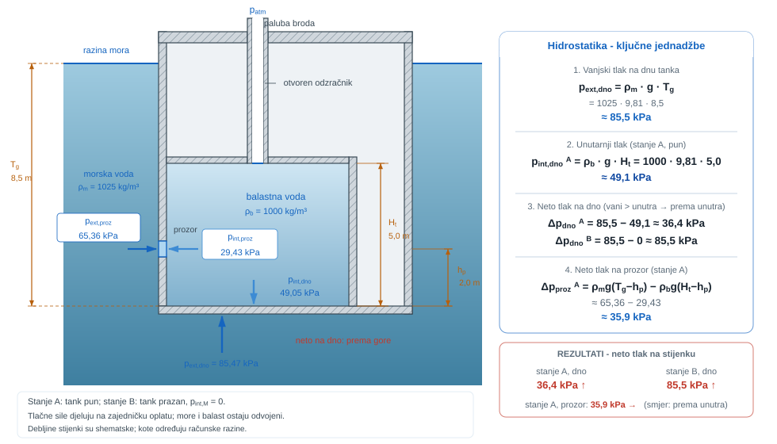

{#fig-uvod-u03 fig-align="center" fig-alt="Pregled poglavlja: Hidrostatika, raspodjela tlaka i manometrija"}

## Hidrostatička raspodjela tlaka

Hidrostatika proučava raspodjelu tlaka u fluidu u mirovanju. Njezine se relacije primjenjuju pri analizi spremnika, piezometara, U-manometara i diferencijalnih manometara.

::: {.mf1-application}

Inženjerski kontekst

Piezometri, U-manometri i diferencijalni manometri primjenjuju hidrostatsku ravnotežu za mjerenje tlaka. Isti se princip koristi za određivanje opterećenja koja voda stvara na različitim dubinama u spremnicima, kesonima i balastnim tankovima.
:::

**Procijenjeno vrijeme rada uz priručnik:** 9 sati.

### Diferencijalna jednadžba hidrostatike

Fluid u mirovanju ne može nositi smična naprezanja povezana sa strujanjem, ali i dalje nosi raspodjelu normalnog naprezanja, odnosno tlaka. Svaki sloj fluida mora nositi težinu slojeva iznad sebe, pa tlak raste s dubinom.

Za mirujući fluid u jednolikom gravitacijskom polju osnovna lokalna relacija glasi

$$\frac{dp}{dz} = -\rho g$$ {#eq-hidrostatika-fizikalni-uvod-i-matematicki-izvod-01}

::: {.mf1-fizikalno-znacenje}

Fizikalno značenje

Lokalni gradijent tlaka uravnotežuje težinu fluida. Negativan predznak označuje smanjenje tlaka s porastom koordinate $z$. Relacija $dp/dz=-\rho(z)g$ vrijedi i pri promjenjivoj gustoći, ali se tada gustoća ne može izlučiti iz integrala. Linearni porast tlaka $\rho gh$ poseban je slučaj približno konstantnih $\rho$ i $g$.
:::

Uz konstantnu gustoću dobiva se radni zapis

$$p_2 - p_1 = \rho g (z_1 - z_2)$$ {#eq-hidrostatika-fizikalno-znacenje-01}

ili, za dubinu mjerenu od slobodne površine,

$$p = p_0 + \rho g h$$ {#eq-hidrostatika-fizikalno-znacenje-02}

::: {.mf1-fizikalno-znacenje}

Fizikalno značenje

Ovo je radna jednadžba hidrostatike: poznatom tlaku na slobodnoj površini ($p_0$) dodaje se hidrostatički porast $\rho g h$ do promatrane dubine. Za vodu ($\rho \approx 1000\ \text{kg/m}^3$) svaki metar dubine donosi oko $9{,}81\ \text{kPa}$. Za živu ($\rho \approx 13600\ \text{kg/m}^3$) isti metar daje $\approx 133\ \text{kPa}$. Ista jednadžba vrijedi i unazad: iz poznatog tlaka u jednoj točki računa se tlak na svakoj drugoj visini u istom spojenom fluidu.
:::

U nižim slojevima tlak je veći jer oni nose težinu slojeva iznad sebe. Pri primjeni jednadžbe određuju se poznati tlak, referentna točka i put kroz promatrani fluid.

## Matematički izvod

Promatra se tanki horizontalni sloj mirujućega fluida površine $A$ i debljine $dz$. Os $z$ usmjerena je prema gore. Na donju plohu djeluje tlačna sila $p(z)A$ prema gore, na gornju plohu tlačna sila $p(z + dz)A$ prema dolje, a dodatno prema dolje djeluje težina sloja $\rho g A dz$. Budući da je fluid u mirovanju, zbroj vertikalnih sila mora biti jednak nuli:

$$
p(z)A - p(z + dz)A - \rho g A dz = 0.
$$ {#eq-hidrostatika-matematicki-izvod-01}

Kako je za mali pomak $dz$ moguće pisati $p(z + dz) = p(z) + dp$, uvrštavanjem slijedi

$$
p(z)A - [p(z) + dp]A - \rho g A dz = 0,
$$ {#eq-hidrostatika-matematicki-izvod-02}

odnosno nakon skraćivanja s $A$

$$
-dp - \rho g dz = 0.
$$ {#eq-hidrostatika-matematicki-izvod-03}

Time se dobiva diferencijalni zakon hidrostatike

$$
\frac{dp}{dz} = -\rho g.
$$ {#eq-hidrostatika-matematicki-izvod-04}

Negativan predznak samo kaže da tlak opada kad se ide prema gore, odnosno raste kad se ide prema dolje. Ako je gustoća homogena i može se smatrati konstantnom, jednadžba se integrira između dviju točaka 1 i 2:

$$
\int_{p_1}^{p_2} dp = -\rho g \int_{z_1}^{z_2} dz,
$$ {#eq-hidrostatika-matematicki-izvod-05}

pa slijedi

$$
p_2 - p_1 = -\rho g (z_2 - z_1) = \rho g (z_1 - z_2).
$$ {#eq-hidrostatika-matematicki-izvod-06}

Neka je $z_1$ visina slobodne površine, a $z_2$ visina promatrane točke, pri čemu je $z_2<z_1$. Dubina promatrane točke iznosi $h=z_1-z_2>0$, pa iz integriranoga oblika slijedi
$$
p_2 - p_1 = \rho g (z_1 - z_2) = \rho g h.
$$ {#eq-hidrostatika-razrada-koraka-01}

Ako je $p_1=p_0$, gdje je $p_0$ tlak na slobodnoj površini, dobiva se
$$
p_2 = p_0 + \rho g h.
$$ {#eq-hidrostatika-razrada-koraka-02}

Koordinata $z$ usmjerena je prema gore, dok je dubina $h$ pozitivna prema dolje. Zapisi su međusobno ekvivalentni.

Ako se umjesto koordinate $z$ uvede dubina $h$ mjerena prema dolje od poznate slobodne površine, dobiva se praktični zapis

$$
p = p_0 + \rho gh.
$$ {#eq-hidrostatika-razrada-koraka-03}

U tom konačnom obliku $p_0$ je referentni tlak na slobodnoj površini, a član $\rho gh$ hidrostatički porast tlaka zbog težine stupca fluida iznad promatrane točke.

::: {.mf1-izvod}

Matematički izvod — Vektorska generalizacija Eulerove jednadžbe hidrostatike

Promatra se infinitezimalni kvadar fluida dimenzija $dx \times dy \times dz$ s težištem u točki $(x, y, z)$. Na njega djeluju težina i sile tlaka na svih šest ploha. Sila tlaka na lijevu plohu (okomita na os $x$) iznosi $p(x - dx/2)\,dy\,dz$ u smjeru $+x$, a na desnu $-p(x + dx/2)\,dy\,dz$ u smjeru $-x$. Neto sila po osi $x$ je

$$
dF_x = -\frac{\partial p}{\partial x}\,dx\,dy\,dz = -\frac{\partial p}{\partial x}\,dV.
$$ {#eq-hidrostatika-matematicki-izvod-vektorska-generalizacija-euler-01}

Analogno za osi $y$ i $z$. Ako je gravitacija usmjerena prema $-z$ ($\vec{g} = -g\hat{z}$), težina kvadra djeluje samo po osi $z$: $dG_z = -\rho g\,dV$.

Ravnoteža sila u mirujućem fluidu daje tri komponente

$$
\frac{\partial p}{\partial x} = 0, \qquad \frac{\partial p}{\partial y} = 0, \qquad \frac{\partial p}{\partial z} = -\rho g,
$$ {#eq-hidrostatika-matematicki-izvod-vektorska-generalizacija-euler-02}

što se može sažeti u vektorski oblik

$$
\nabla p = \rho \vec{g}.
$$ {#eq-hidrostatika-matematicki-izvod-vektorska-generalizacija-euler-03}

Ova vektorska Eulerova jednadžba hidrostatike vrijedi u mirujućem fluidu. U ovdje pretpostavljenom jednolikom gravitacijskom polju bez drugih volumnih sila pojedinačne komponente pokazuju da tlak ovisi **samo o visini** $z$, pa su plohe konstantnog tlaka horizontalne ravnine. U općenitom polju volumnih sila izobare ne moraju biti horizontalne. U []{.mf1-chapter-ref target="u04"} gravitacija se za jednoliko ubrzani sustav zamjenjuje efektivnim poljem $\vec{g}_{eff}=\vec{g}-\vec{a}$.
:::

::: {.mf1-izvod}

Matematički izvod — Izotermalna atmosfera i karakteristična visina

Pretpostavka konstantne gustoće $\rho$ vrijedi za tekućine (voda, ulje, živa), ali ne za plinove u kojima se gustoća mijenja s tlakom i temperaturom. Za **izotermalnu atmosferu** uz pretpostavku $T = T_0$ = konst. može se izvesti raspodjela tlaka po visini.

Iz jednadžbe stanja idealnog plina vrijedi

$$
p = \rho R T_0 \quad\Longrightarrow\quad \rho = \frac{p}{R T_0},
$$ {#eq-hidrostatika-matematicki-izvod-izotermalna-atmosfera-i-karakt-01}

gdje je $R$ specifična plinska konstanta za zrak ($R \approx 287\ \text{J/(kg K)}$). Uvrštenjem u hidrostatsku jednadžbu $dp/dz = -\rho g$ slijedi

$$
\frac{dp}{dz} = -\frac{p\,g}{R T_0},
$$ {#eq-hidrostatika-matematicki-izvod-izotermalna-atmosfera-i-karakt-02}

što je obična diferencijalna jednadžba prvog reda u kojoj se varijable mogu razdvojiti:

$$
\frac{dp}{p} = -\frac{g}{R T_0}\,dz \quad\Longrightarrow\quad \ln p = -\frac{g}{R T_0}\,z + C.
$$ {#eq-hidrostatika-matematicki-izvod-izotermalna-atmosfera-i-karakt-03}

Uz početni uvjet $p(0) = p_0$ na razini mora dobiva se

$$
\boxed{p(z) = p_0\,\exp\!\left(-\frac{z}{H}\right), \qquad H = \frac{R T_0}{g}}.
$$ {#eq-hidrostatika-matematicki-izvod-izotermalna-atmosfera-i-karakt-04}

Veličina $H$ naziva se **karakteristična visina atmosfere**. Za $T_0 = 288\ \text{K}$ (standardna prizemna temperatura) i $g = 9{,}81\ \text{m/s}^2$ slijedi

$$
H = \frac{287 \cdot 288}{9{,}81} \approx 8400\ \text{m} \approx 8{,}4\ \text{km}.
$$ {#eq-hidrostatika-matematicki-izvod-izotermalna-atmosfera-i-karakt-05}

U ovom izotermalnom modelu tlak pada za faktor $e\approx2{,}72$ nakon porasta visine za jednu karakterističnu visinu, ovdje oko $8{,}4\ \text{km}$. Na $z\approx8{,}8\ \text{km}$ model daje oko $35\ \text{kPa}$, odnosno približno trećinu tlaka na razini mora. Stvarna atmosfera nije izotermalna: za pouzdan atmosferski podatak koristi se odgovarajući standardni ili izmjereni profil temperature i tlaka, dok je ovaj izvod samo model reda veličine [@anderson2021].
:::

::: {.mf1-numerika .kompakt}

Mirni spremnik kao provjera računa

U mirnom spremniku razlika tlačnih sila uravnotežuje težinu vode. Računalo istu ravnotežu primjenjuje na mala područja i dobiva tlak po dubini.

Poznato rješenje $p=p_0+\rho gh$ zato je jednostavna provjera: uz istu gustoću i referentni tlak moraju se slagati tlakovi na više dubina, a voda ostati mirna. Prividno strujanje upozorava na problem u postavkama ili računu. Iz takva polja tlaka u []{.mf1-chapter-ref target="u05"} dobivamo opterećenje stijenke.
:::

## Otvoreni i zatvoreni spremnici

Kod otvorenog spremnika tlak na slobodnoj površini jednak je atmosferskom tlaku. Zato je često praktično prijeći na manometarski tlak i atmosferu uzeti kao nultu razinu.

Kod zatvorenog spremnika to više nije automatski dopušteno. Ako je tlak na slobodnoj površini različit od atmosferskog, onda raspodjela nije samo $\rho g h$, nego

$$p = p_{pov} + \rho g h$$ {#eq-hidrostatika-otvoreni-i-zatvoreni-spremnici-01}

Najčešća pogreška ovdje nije u računu, nego u tome što se atmosfera mehanički uzme kao nula i kad za to nema fizikalnog opravdanja.

Iz manometarskog tlaka $p_M$ (indeks $M$ = manometarski; ista oznaka koristi se u ostatku priručnika) odmah se može čitati i piezometarska visina

$$
h_p = \frac{p_M}{\rho g},
$$ {#eq-hidrostatika-otvoreni-i-zatvoreni-spremnici-02}

::: {.mf1-fizikalno-znacenje}

Fizikalno značenje

Piezometarska visina geometrijski je prikaz tlaka: pokazuje do koje bi se visine voda (ili drugi fluid) podignula u otvorenoj cjevčici pričvršćenoj na to mjesto. Manometarski pretlak od $10\ \text{kPa}$ u vodi odgovara piezometarskoj visini oko $1{,}02\ \text{m}$. Piezometri zato daju izravno i pregledno mjerenje u spremnicima, geotehničkim istraživanjima i distribucijskim mrežama kada su ispunjeni njihovi mjerni uvjeti.
:::

Ta veličina predstavlja visinu stupca istoga fluida koja odgovara tom pretlaku. Upravo zato piezometar nije novo pravilo, nego geometrijsko očitanje već postojećeg hidrostatskog tlaka.

Manometar nije novi zakon fizike, nego instrumentacijski zapis iste hidrostatske ravnoteže kroz više spojenih stupaca fluida. U praksi je dovoljno držati se jednoga slijeda: odabrati jednu referentnu točku ili jednu poznatu vrijednost tlaka, kretati se kroz stupce fluida jednim dosljednim smjerom, pri silasku dodavati $\rho g \Delta h$, pri penjanju oduzimati isti član te na istoj horizontalnoj razini istog mirujućeg fluida izjednačiti tlak.

::: {.mf1-interaktivno}

Interaktivni prikaz — Diferencijalni manometar

Interaktivni prikaz prikazuje utjecaj gustoće radnoga i manometarskog fluida te razlike visina $\Delta h$ na izmjerenu razliku tlakova. Shema U-manometra prikazuje odnos razlike visina i gustoća.

<a class="mf1-interaktivno-veza" href="https://martibasic.github.io/MF1_udzbenik/jlite/lab/index.html?path=u03_diferencijalni_manometar.ipynb">Pokreni u pregledniku</a>

:::

Nedosljedna promjena referentnoga smjera ili zanemarivanje promjene fluida uzrokuje pogrešan predznak u manometarskoj jednadžbi.

Jednako je važno stalno razlikovati apsolutni, manometarski i vakuumski tlak: apsolutni se mjeri u odnosu na idealni vakuum, manometarski u odnosu na lokalni atmosferski tlak, a vakuumski opisuje koliko je apsolutni tlak ispod atmosferskoga.

Veza je uvijek

$$p_{aps} = p_{atm} + p_M$$ {#eq-hidrostatika-interaktivni-prikaz-diferencijalni-manometar-01}

::: {.mf1-fizikalno-znacenje}

Fizikalno značenje

Apsolutni tlak mjeri se u odnosu na idealni vakuum ($p=0$), dok je manometarski tlak razlika prema lokalnom atmosferskom tlaku. Vakuumski tlak opisuje koliko je apsolutni tlak ispod atmosferskoga ($p_{vak}=p_{atm}-p_{aps}$). Negativan rezultat za apsolutni tlak u uobičajenom modelu kapljevine ili plina nije „veći podtlak”, nego znak da su pretpostavke računa napuštene; kavitacijski se kriterij pritom uspoređuje s tlakom zasićene pare, a ne s nulom. Zamjena referenci jedna je od najtipičnijih pogrešaka u manometriji.
:::

Za podtlak vrijedi i relacija

$$p_{vak} = p_{atm} - p_{aps} = -p_M \qquad (p_M<0)$$ {#eq-hidrostatika-fizikalno-znacenje-03}

Ako je $p_M < 0$, to ne znači da je tlak „negativan” u apsolutnom smislu, nego da je sustav pod podtlakom u odnosu na okolinu.

## Riješeni primjeri

::: {#ex-u03-tlak-u-prikljucku-zatvorenog-vodenog-spremnika-t1 .mf1-we}

Tlak u priključku zatvorenog vodenog spremnika&nbsp;T1

**Kontekst:** Zatvoreni spremnik ima pretlak u plinskom prostoru iznad vode, a priključna točka nalazi se na zadanoj dubini ispod slobodne površine. Treba odrediti apsolutni i manometarski tlak u plinskom prostoru i u priključku.

**Zadano**

- Gustoća vode: $\rho = 998\ \text{kg/m}^3$
- Manometarski tlak u plinskom prostoru: $p_{G,m} = 18\ \text{kPa}$
- Dubina priključne točke `A` ispod slobodne površine: $h = 1{,}40\ \text{m}$
- Lokalni atmosferski tlak: $p_{atm} = 100{,}8\ \text{kPa}$

**Traženo**

1. apsolutni tlak u plinskom prostoru spremnika.
2. apsolutni tlak u točki `A`.
3. manometarski tlak u točki `A`.

{#fig-u03-zatvoreni-spremnik-tlak fig-align="center" fig-alt="Tlak u priključku zatvorenog vodenog spremnika (p_G=18 kPa, h=1,4 m)"}

**Pretpostavke i model**

Najprije treba odrediti tlak na slobodnoj površini. Tek se zatim kroz isti mirujući fluid silazi do točke `A` i dodaje hidrostatički doprinos $\rho g h$.

**Rješenje**

Apsolutni tlak u plinskom prostoru jednak je

$$
p_G = p_{atm} + p_{G,m} = 100{,}8 + 18{,}0 = 118{,}8\ \text{kPa} = 118800\ \text{Pa}.
$$ {#eq-hidrostatika-rijeseni-primjer-tlak-u-prikljucku-zatvorenog-vo-01}

Tlak u točki `A` dobiva se silaskom kroz vodu za dubinu $h$:

$$
p_A = p_G + \rho g h = 118800 + 998 \cdot 9{,}81 \cdot 1{,}40 = 132506{,}532\ \text{Pa} \approx 132{,}5\ \text{kPa}.
$$ {#eq-hidrostatika-rijeseni-primjer-tlak-u-prikljucku-zatvorenog-vo-02}

Manometarski tlak u točki `A` zato iznosi

$$
p_{A,m} = p_A - p_{atm} = 132506{,}532 - 100800 = 31706{,}532\ \text{Pa} \approx 31{,}7\ \text{kPa}.
$$ {#eq-hidrostatika-rijeseni-primjer-tlak-u-prikljucku-zatvorenog-vo-03}

**Provjera i komentar**

1. Tlak u točki `A` mora biti veći od tlaka u plinskom prostoru jer se do točke ide prema dolje kroz vodu.
2. Manometarski tlak u točki `A` mora biti veći od manometarskog tlaka plinskog prostora za iznos hidrostatičkog doprinosa vode.
3. Apsolutni tlak mora ostati pozitivan i veći od lokalnog atmosferskog tlaka.
:::

::: {#ex-u03-diferencijalni-manometar-izme-u-slatke-i-morske .mf1-we}

Diferencijalni manometar između slatke i morske vode&nbsp;T3

**Kontekst:** Dva paralelna horizontalna voda – jedan sa slatkom, drugi s morskom vodom – spojena su diferencijalnim manometrom sa živom i malim stupcem zraka. Treba odrediti razliku tlakova i procijeniti pogrešku zbog zanemarivanja zraka.

**Zadano**

- Gustoća slatke vode: $\rho_v = 1000\ \text{kg/m}^3$
- Gustoća morske vode: $\rho_{mv} = 1035\ \text{kg/m}^3$
- Gustoća žive: $\rho_{Hg} = 13600\ \text{kg/m}^3$
- Gustoća zraka: $\rho_{zr} = 1{,}2\ \text{kg/m}^3$
- Silazak od $p_1$ do lijeve granice voda-živa: $h_1 = 0{,}60\ \text{m}$
- Uspon između dviju razina žive: $h_2 = 0{,}10\ \text{m}$
- Neto uspon kroz zračni most, od granice živa–zrak do granice zrak–morska voda: $h_3 = 0{,}70\ \text{m}$
- Silazak od desne granice do $p_2$ kroz morsku vodu: $h_4 = 0{,}40\ \text{m}$

**Traženo**

1. razliku tlakova $p_1 - p_2$.
2. kolika je pogreška ako se stupac zraka zanemari.

{#fig-u03-diferencijalni-manometar fig-alt="Diferencijalni manometar"}

**Pretpostavke i model**

Tlak prati od poznate točke do tražene, segment po segment. Na svakom segmentu označi fluid i zapiši raste li tlak ili pada.

**Rješenje**

Krenimo od tlaka $p_1$ u lijevom vodu i pratimo sustav do tlaka $p_2$ u desnom vodu.

Ako se stupac zraka zanemari, radni zapis glasi:

1. Silazak kroz slatku vodu: $+\rho_v g h_1$.
2. Uspon kroz živu: $-\rho_{Hg} g h_2$.
3. Silazak kroz morsku vodu: $+\rho_{mv} g h_4$.

Zato vrijedi

$$
p_1 + \rho_v g h_1 - \rho_{Hg} g h_2 + \rho_{mv} g h_4 = p_2 \quad \Longrightarrow \quad p_1 - p_2 = g\left(\rho_{Hg} h_2 - \rho_{mv} h_4 - \rho_v h_1\right).
$$ {#eq-hidrostatika-rijeseni-primjer-diferencijalni-manometar-izme-u-01}

Uvrštavanjem podataka:

$$
\begin{aligned}
p_1 - p_2 &= 9{,}81\left(13600 \cdot 0{,}10 - 1035 \cdot 0{,}40 - 1000 \cdot 0{,}60\right) \\
&= 3394{,}26\ \text{Pa} \approx 3{,}39\ \text{kPa}.
\end{aligned}
$$ {#eq-hidrostatika-rijeseni-primjer-diferencijalni-manometar-izme-u-02}

Sada uključimo i mali stupac zraka. Tada se pri prolazu prema gore kroz zrak tlak još dodatno smanjuje za $\rho_{zr} g h_3$, pa vrijedi

$$
\begin{aligned}
p_1 + \rho_v g h_1 - \rho_{Hg} g h_2 - \rho_{zr} g h_3 + \rho_{mv} g h_4 &= p_2, \\
p_1 - p_2 &= g\left(\rho_{Hg} h_2 + \rho_{zr} h_3 - \rho_{mv} h_4 - \rho_v h_1\right).
\end{aligned}
$$ {#eq-hidrostatika-rijeseni-primjer-diferencijalni-manometar-izme-u-03}

Numerički:

$$
\begin{aligned}
p_1 - p_2 &= 9{,}81\left(13600 \cdot 0{,}10 + 1{,}2 \cdot 0{,}70 - 1035 \cdot 0{,}40 - 1000 \cdot 0{,}60\right) \\
&\approx 3402{,}50\ \text{Pa} \approx 3{,}40\ \text{kPa}.
\end{aligned}
$$ {#eq-hidrostatika-rijeseni-primjer-diferencijalni-manometar-izme-u-04}

Pogreška zanemarivanja zraka zato iznosi $\Delta p = \rho_{zr}gh_3 \approx 8{,}24\ \text{Pa}$, a relativna pogreška je

$$
\delta \approx \frac{8{,}24}{3402{,}50} \cdot 100\% \approx 0{,}24\%.
$$ {#eq-hidrostatika-rijeseni-primjer-diferencijalni-manometar-izme-u-05}

**Provjera i komentar**

U ovom zadatku tlak u lijevom vodu veći je od tlaka u desnom vodu za otprilike $3{,}4\ \text{kPa}$. Stupac zraka daje vrlo mali doprinos, pa je njegovo zanemarivanje ovdje inženjerski prihvatljivo.

1. Doprinos žive mora biti dominantan jer ima daleko najveću gustoću.
2. Doprinos zraka mora biti vrlo malen u odnosu na doprinose tekućina, što i brojčano dobivamo.
3. Ako se tijekom računa izgubi redoslijed prolaza kroz fluide, gotovo sigurno će se pojaviti pogrešan predznak ispred jednog od članova.
:::

Nakon otvorenih spremnika i diferencijalnog manometra treba razmotriti još jedan osnovni postupak: kako se iz očitanja vakuummetra ili otvorenog U-manometra određuje apsolutni tlak u plinskom prostoru, a zatim i tlak u tekućini ispod njega.

::: {#ex-u03-zatvoreni-vodeni-spremnik-s-uljnim-referentnim-spremnikom .mf1-ch}

Zatvoreni vodeni spremnik s uljnim referentnim spremnikom i živinim manometrom&nbsp;T3

**Kontekst:** U procesnoj postaji zatvoreni vodeni spremnik povezan je diferencijalnim živinim manometrom s otvorenim uljnim referentnim spremnikom. Treba odrediti tlakove u priključnim točkama i u plinskom prostoru te ocijeniti je li sustav pod pretlakom ili podtlakom u odnosu na atmosferu.

**Zadano**

- Gustoća vode u zatvorenom spremniku `A`: $\rho_w = 1000\ \text{kg/m}^3$
- Dubina priključne točke `1` ispod slobodne površine vode: $h_1 = 0{,}80\ \text{m}$
- Gustoća ulja u otvorenom referentnom spremniku `B`: $\rho_o = 850\ \text{kg/m}^3$
- Dubina priključne točke `2` ispod slobodne površine ulja: $h_2 = 0{,}55\ \text{m}$
- Atmosferski tlak iznad ulja u `B`: $p_0 = 101325\ \text{Pa}$
- Gustoća žive u diferencijalnom U-manometru: $\rho_{Hg} = 13600\ \text{kg/m}^3$
- Visina vodenog stupca u lijevom kraku (točka `1` do granice voda-živa): $a = 0{,}30\ \text{m}$
- Visina uljnog stupca u desnom kraku (točka `2` do granice ulje-živa): $b = 0{,}25\ \text{m}$
- Razlika razina žive (lijevi krak niži od desnog za): $\Delta h = 0{,}18\ \text{m}$
- Dubina točke `C` u spremniku `A` ispod slobodne površine vode: $h_C = 1{,}20\ \text{m}$

**Traženo**

1. tlakove u priključnim točkama $p_1$ i $p_2$ te njihovu razliku.
2. apsolutni i manometarski tlak u plinskom prostoru spremnika `A`.
3. apsolutni i manometarski tlak u točki `C`.
4. protumači jesu li plinski prostor i točka `C` pod pretlakom ili podtlakom u odnosu na atmosferu.

Zanemari gustoće plinova u spojnim cijevima.

{#fig-u03-zatvoreni-vodeni-spremnik-i-referentni-uljni-spremnik fig-alt="Zatvoreni vodeni spremnik i referentni uljni spremnik"}

**Pretpostavke i model**

Najsigurniji pristup i dalje nije pamtiti gotov izraz, nego tlak pratiti po segmentima. U otvorenom spremniku `B` tlak u točki `2` određuje se iz atmosferskog tlaka i doprinosa uljnog stupca. Zatim se preko diferencijalnog manometra dobije tlak u točki `1`, a tek se nakon toga iz točke `1` penje prema plinskom prostoru `A` ili silazi prema dubljoj točki `C`.

**Rješenje**

### 1. Tlak u točki `2` i relacija manometra {.unnumbered .unlisted .mf1-step}

Kako je spremnik `B` otvoren, tlak na njegovoj slobodnoj površini jednak je atmosferskom. Zato je tlak u točki `2`

$$
p_2 = p_0 + \rho_o g h_2 = 101325 + 850 \cdot 9{,}81 \cdot 0{,}55 = 105911\ \text{Pa} \approx 105{,}9\ \text{kPa}.
$$ {#eq-hidrostatika-1-tlak-u-tocki-2-i-relacija-01}

Sada krenimo od točke `1` prema točki `2` kroz manometar:

1. prema dolje kroz vodu visine $a$ tlak raste za $\rho_w g a$.
2. kroz živu se ide prema gore za visinsku razliku $\Delta h$, pa tlak pada za $\rho_{Hg} g \Delta h$.
3. prema gore kroz ulje visine $b$ tlak pada za $\rho_o g b$.

Zato vrijedi

$$
p_1 + \rho_w g a - \rho_{Hg} g \Delta h - \rho_o g b = p_2,
$$ {#eq-hidrostatika-1-tlak-u-tocki-2-i-relacija-02}

odnosno

$$
\begin{aligned}
p_1 &= p_2 - \rho_w g a + \rho_{Hg} g \Delta h + \rho_o g b \\
&\approx 105911 - 1000 \cdot 9{,}81 \cdot 0{,}30 \\
&\quad + 13600 \cdot 9{,}81 \cdot 0{,}18 + 850 \cdot 9{,}81 \cdot 0{,}25 \\
&\approx 129068\ \text{Pa} \approx 129{,}1\ \text{kPa}.
\end{aligned}
$$ {#eq-hidrostatika-1-tlak-u-tocki-2-i-relacija-03}

Razlika tlakova zato je

$$
p_1 - p_2 = 129068 - 105911 = 23157\ \text{Pa} \approx 23{,}16\ \text{kPa}.
$$ {#eq-hidrostatika-1-tlak-u-tocki-2-i-relacija-04}

### 2. Tlak u plinskom prostoru spremnika `A` {.unnumbered .unlisted .mf1-step}

U spremniku `A` točka `1` nalazi se na dubini $h_1$ ispod slobodne površine vode, pa iz $p_1 = p_G + \rho_w g h_1$ slijedi

$$
p_G = p_1 - \rho_w g h_1 = 129068 - 1000 \cdot 9{,}81 \cdot 0{,}80 = 121220\ \text{Pa} \approx 121{,}2\ \text{kPa}.
$$ {#eq-hidrostatika-2-tlak-u-plinskom-prostoru-spremnika-a-01}

Manometarski tlak plinskog prostora iznosi

$$
p_{G,m} = p_G - p_0 = 121220 - 101325 = 19895\ \text{Pa} \approx 19{,}9\ \text{kPa}.
$$ {#eq-hidrostatika-2-tlak-u-plinskom-prostoru-spremnika-a-02}

### 3. Tlak u točki `C` {.unnumbered .unlisted .mf1-step}

Točka `C` nalazi se dublje od slobodne površine za $h_C = 1{,}20\ \text{m}$, pa je njezin apsolutni tlak

$$
p_C = p_G + \rho_w g h_C = 121220 + 1000 \cdot 9{,}81 \cdot 1{,}20 = 132992\ \text{Pa} \approx 133{,}0\ \text{kPa}.
$$ {#eq-hidrostatika-3-tlak-u-tocki-c-01}

Manometarski tlak u točki `C` jest

$$
p_{C,m} = p_C - p_0 = 132992 - 101325 = 31667\ \text{Pa} \approx 31{,}7\ \text{kPa}.
$$ {#eq-hidrostatika-3-tlak-u-tocki-c-02}

### 4. Tumačenje stanja {.unnumbered .unlisted .mf1-step}

Kako je i $p_{G,m} > 0$ i $p_{C,m} > 0$, slijedi da su i plinski prostor i točka `C` pod pretlakom u odnosu na atmosferu. Točka `C` je pod većim pretlakom jer se nalazi dublje u vodi.

**Provjera i komentar**

Otvoreni uljni spremnik daje u točki `2` tlak oko $105{,}9\ \text{kPa}$, a diferencijalni manometar pokazuje da je tlak u točki `1` veći za oko $23{,}16\ \text{kPa}$. Iz toga slijedi da je apsolutni tlak plinskog prostora zatvorenog spremnika oko $121{,}2\ \text{kPa}$, odnosno da je spremnik pod manometarskim pretlakom od oko $19{,}9\ \text{kPa}$. U dubljoj točki `C` tlak dodatno raste na oko $133{,}0\ \text{kPa}$, odnosno na oko $31{,}7\ \text{kPa}$ manometarski.

1. Niža razina žive u lijevom kraku mora značiti da je tlak na lijevoj strani manometra veći.
2. Tlak u točki `1` mora biti veći od tlaka u plinskom prostoru jer se do nje dolazi silaskom kroz vodu.
3. Tlak u točki `C` mora biti veći od tlaka u plinskom prostoru i veći od tlaka u točki `1`, jer je `C` najdublja promatrana točka u vodi.
:::

Kao prijelaz prema []{.mf1-chapter-ref target="u04"} korisno je usporediti ravnotežu tlaka u spojenim posudama s idejom efektivnog polja sila.

{#fig-u03-staticka-zamjena-za-ravnotezu-tlaka-i-efektivno fig-alt="Ravnoteža tlaka i efektivno polje sila"}

::: {#ex-u03-tlak-na-usisu-pumpe-za-cirkulaciju-ulja .mf1-we}

Tlak na usisu pumpe za cirkulaciju ulja &nbsp;T2

**Kontekst:** U hidrauličnom sustavu preše pumpa za cirkulaciju ulja smještena je 2,4 m iznad razine ulja u otvorenom spremniku. Pumpa usisava ulje podtlakom na svom usisu.

**Zadano**

- Visina pumpe iznad razine ulja: $H = 2{,}40\ \text{m}$
- Gustoća hidrauličnog ulja: $\rho = 870\ \text{kg/m}^3$
- Lokalni atmosferski tlak: $p_{atm} = 101{,}3\ \text{kPa}$

**Traženo**

1. Manometarski tlak na usisu pumpe.
2. Apsolutni tlak na usisu pumpe.
3. Odredi statičku gornju granicu visine stupca pri kojoj bi apsolutni tlak pao na zadani tlak pare $p_v \approx 200\ \text{Pa}$.

{#fig-u03-pumpa-usis fig-align="center" fig-alt="Tlak na usisu pumpe za cirkulaciju ulja (H=2,4 m iznad razine, ρ=870 kg/m³)"}

**Pretpostavke i model**

Promatra se idealna granica bez protoka: zanemaruju se brzinska visina i svi gubitci u usisnom vodu. Slobodna površina ulja u spremniku je na atmosferskom tlaku. Ovaj hidrostatski model nije dovoljan za provjeru usisa pumpe u radu.

**Rješenje**

Manometarski tlak na usisu pumpe (uspon od slobodne površine za $H$):

$$
p_M = -\rho g H = -870 \cdot 9{,}81 \cdot 2{,}40 = -20483{,}28\ \text{Pa}
$$ {#eq-hidrostatika-rijeseni-primjer-tlak-na-usisu-pumpe-za-01}

$$
p_M \approx -20{,}5\ \text{kPa}
$$ {#eq-hidrostatika-rijeseni-primjer-tlak-na-usisu-pumpe-za-02}

Apsolutni tlak na usisu:

$$
p_{aps} = p_{atm} + p_M = 101300 - 20483{,}28 = 80816{,}72\ \text{Pa} \approx 80{,}8\ \text{kPa}
$$ {#eq-hidrostatika-rijeseni-primjer-tlak-na-usisu-pumpe-za-03}

Statička granična visina stupca pri $p_{aps}=p_v$:

$$
H_{max} = \frac{p_{atm} - p_v}{\rho g} = \frac{101300 - 200}{870 \cdot 9{,}81} = \frac{101100}{8534{,}7} \approx 11{,}8\ \text{m}
$$ {#eq-hidrostatika-rijeseni-primjer-tlak-na-usisu-pumpe-za-04}

**Provjera i komentar**

U idealnoj statičkoj slici točka na visini $2{,}4\ \text{m}$ ima apsolutni tlak $80{,}8\ \text{kPa}$, a $11{,}8\ \text{m}$ samo je gornja granica stupca pri nultom protoku. Za pumpu u radu treba bilancu energije s brzinom i gubicima te usporedbu raspoložive neto pozitivne usisne visine $NPSH_A$ s proizvođačevim zahtjevom $NPSH_R$ za zadani protok, brzinu vrtnje i fluid. Zato se iz ovoga računa ne može propisati opća „sigurna usisna visina”.

:::

::: {#ex-u03-balastni-tank-broda-tlak-iznutra-i-izvana .mf1-we}

Balastni tank broda: tlak iznutra i izvana &nbsp;T2

**Kontekst:** Brod nosi balastne tankove pri dnu trupa, koji se za prazno povratno putovanje pune slatkom (ili morskom) vodom radi stabilnosti, a pri teretnom putovanju se prazne. Stijenka tanka istovremeno odvaja **vanjsku** morsku vodu (koja pritišće prema unutra) od **unutarnje** balastne vode (koja pritišće prema van). Brodski strojar dimenzionira stijenku tanka prema **neto tlaku** – razlici dvaju hidrostatskih tlakova na istoj dubini – jer ona definira u koju stranu stijenka biva opterećena i koje je opterećenje veće (prazan ili pun tank).

**Zadano**

Brod plovi mirnom morskom vodom. Promatra se idealizirani balastni tank uz vanjsku oplatu: njegovo dno i bočna stijenka s prozorom izravno odvajaju more od balasta. Između te stijenke i mora nema suhog prostora ni druge oplate.

- Gaz broda (dubina kobilice ispod morske razine): $T_g = 8{,}5\ \text{m}$
- Visina tanka mjerena od dna broda prema gore: $H_t = 5{,}0\ \text{m}$
- Promatračev prozor postavljen je na visini $h_p = 2{,}0\ \text{m}$ iznad dna tanka
- Gustoća morske vode: $\rho_m = 1025\ \text{kg/m}^3$
- Gustoća balastne (slatke) vode: $\rho_b = 1000\ \text{kg/m}^3$
- Vrh tanka spojen je s atmosferom kroz odzračnik, pa je slobodna površina balasta na atmosferskom tlaku
- $g = 9{,}81\ \text{m/s}^2$

**Traženo**

Razmotri dva stanja: **(A) tank pun** balastne vode do vrha; **(B) tank prazan**.

1. Manometarski tlak vanjske morske vode na razini **dna tanka**.
2. Manometarski tlak balastne vode na razini dna tanka (stanje A).
3. Neto manometarski tlak na dno tanka u stanju A i u stanju B; u oba slučaja navedi smjer u kojem stijenka biva tlačena.
4. Neto manometarski tlak na **promatračev prozor** u stanju A.

{#fig-u03-balastni-tank fig-align="center" fig-alt="Balastni tank u trupu broda na gazu $T_g = 8{,}5$ m: vanjska morska voda i unutarnja balastna voda do visine $H_t = 5{,}0$ m. Prozor je na $h_p = 2$ m iznad dna tanka."}

**Pretpostavke i model**

Brod miruje i ne valja se – razmatra se čista hidrostatika. Slobodna površina mora i (u stanju A) slobodna površina balasta su na atmosferskom tlaku, pa se sve može računati manometarski. Stijenka tanka je nepropusna i kruta. Razlika gustoće morske i balastne vode ne mijenja se s dubinom – obje su nestlačive.

**Rješenje**

Manometarski tlak vanjske morske vode na razini dna tanka (dubina od morske površine = $T_g$):

$$
p_{ext,dno} = \rho_m g T_g = 1025 \cdot 9{,}81 \cdot 8{,}5 \approx 85{,}5\ \text{kPa}
$$ {#eq-hidrostatika-rijeseni-primjer-balastni-tank-broda-tlak-iznutr-01}

**Stanje A – tank pun balastne vode.** Manometarski tlak balasta na dnu tanka (dubina od slobodne površine balasta = $H_t$):

$$
p_{int,dno}^{A} = \rho_b g H_t = 1000 \cdot 9{,}81 \cdot 5{,}0 \approx 49{,}1\ \text{kPa}
$$ {#eq-hidrostatika-rijeseni-primjer-balastni-tank-broda-tlak-iznutr-02}

Neto tlak na dno tanka u stanju A (vani veći – dno je opterećeno prema gore, u unutrašnjost tanka):

$$
\Delta p_{dno}^{A} = p_{ext,dno} - p_{int,dno}^{A} \approx 85{,}5 - 49{,}1 \approx 36{,}4\ \text{kPa}
$$ {#eq-hidrostatika-rijeseni-primjer-balastni-tank-broda-tlak-iznutr-03}

**Stanje B – tank prazan.** Unutarnji tlak na dno tanka jednak je atmosferskom, pa je manometarski nula:

$$
p_{int,dno}^{B} = 0
$$ {#eq-hidrostatika-rijeseni-primjer-balastni-tank-broda-tlak-iznutr-04}

Neto tlak na dno tanka u stanju B (vani veći – dno je i dalje opterećeno prema gore, ali jače):

$$
\Delta p_{dno}^{B} = p_{ext,dno} - 0 \approx 85{,}5\ \text{kPa}
$$ {#eq-hidrostatika-rijeseni-primjer-balastni-tank-broda-tlak-iznutr-05}

**Promatračev prozor u stanju A.** Prozor je na visini $h_p = 2$ m iznad dna, pa:

- s vanjske strane je na dubini $T_g - h_p = 8{,}5 - 2 = 6{,}5\ \text{m}$ ispod morske površine:

$$
p_{ext,proz} = \rho_m g (T_g - h_p) = 1025 \cdot 9{,}81 \cdot 6{,}5 \approx 65{,}36\ \text{kPa}
$$ {#eq-hidrostatika-rijeseni-primjer-balastni-tank-broda-tlak-iznutr-06}

- s unutarnje strane je na dubini $H_t - h_p = 5 - 2 = 3{,}0\ \text{m}$ ispod razine balasta:

$$
p_{int,proz}^{A} = \rho_b g (H_t - h_p) = 1000 \cdot 9{,}81 \cdot 3{,}0 = 29{,}43\ \text{kPa}
$$ {#eq-hidrostatika-rijeseni-primjer-balastni-tank-broda-tlak-iznutr-07}

Neto tlak na prozor (vani veći, prema unutra):

$$
\Delta p_{proz}^{A} \approx 65{,}36 - 29{,}43 \approx 35{,}9\ \text{kPa}
$$ {#eq-hidrostatika-rijeseni-primjer-balastni-tank-broda-tlak-iznutr-08}

**Provjera i komentar**

1. Razlika između dva slučaja ($\Delta p_{dno}^{B}-\Delta p_{dno}^{A}\approx49{,}1\ \text{kPa}$) jednaka je unutarnjem hidrostatskom doprinosu balasta $\rho_b gH_t$; vanjski je tlak u oba uspoređena stanja isti.
2. Prazno stanje u ovom nastavnom paru daje veći neto tlak na promatranu stijenku. Iz toga ne slijedi da je ono mjerodavno projektno stanje: dimenzioniranje mora obuhvatiti propisane kombinacije opterećenja, geometriju, dinamiku i konstrukcijski model.
3. Neto tlakovi na **dno** i **prozor** u stanju A iznose redom $36{,}4$ i $35{,}9\ \text{kPa}$. Mala promjena po dubini posljedica je razlike gustoća: nagib neto tlaka iznosi $(\rho_m-\rho_b)g$, ovdje približno $0{,}25\ \text{kPa/m}$.
4. Punjenje ili pražnjenje tanka mijenja neto hidrostatičko opterećenje, ali ovaj presjek ne opisuje konstrukciju dvostrukoga trupa, slijed balastiranja ni sigurnost broda.
:::

::: {#ex-u03-iot-tlacni-senzor-za-otkrivanje-propustanja-u .mf1-we}

IoT tlačni senzor za otkrivanje propuštanja u distribucijskoj mreži vodoopskrbe &nbsp;T2

**Kontekst:** U distribucijskoj se mreži tlačna očitanja na dvama čvorovima uspoređuju s očekivanom hidrostatičkom razlikom. Odstupanje je dijagnostički signal, ali samo po sebi ne određuje uzrok: treba ga usporediti s potrošnjom, radom crpki i ventila, drugim senzorima te mjernom nesigurnošću.

**Zadano**

- Manometarski tlak na nižem čvoru `A`: $p_{M,A} = 5{,}20\ \text{bar} = 520\ \text{kPa}$
- Razlika visine između čvorova: $\Delta z = z_B - z_A = 38\ \text{m}$ ($B$ je viši)
- Gustoća vode: $\rho = 998\ \text{kg/m}^3$
- Atmosferski tlak: $p_{atm} = 101{,}3\ \text{kPa}$
- Mreža u stanju nominalne potrošnje, strujanje zanemarivo (tlak se očitava u razdoblju mirovanja)

**Traženo**

1. Očekivani manometarski tlak na višem čvoru `B`;
2. Apsolutni tlak na čvoru `B`;
3. Procjena: ako bi senzor na `A` umjesto $5{,}20\ \text{bar}$ pokazao $4{,}70\ \text{bar}$, što to znači za stanje mreže?

**Pretpostavke i model**

Promatra se kvazistatičko stanje mreže u kojem se zanemaruju lokalni gubitci trenja jer su brzine strujanja niske (noćno mjerenje). Voda se smatra nestlačivom, gustoća se ne mijenja s visinom. Sav put između čvorova `A` i `B` prolazi kroz istu povezanu vodenu masu bez prijelaza preko atmosfere.

**Rješenje**

Manometarski tlak na višem čvoru slijedi iz hidrostatske bilance po putu od `A` prema `B`:

$$
p_{M,B} = p_{M,A} - \rho g \Delta z = 520 \cdot 10^3 - 998 \cdot 9{,}81 \cdot 38.
$$ {#eq-hidrostatika-rijeseni-primjer-iot-tlacni-senzor-za-otkrivanje-01}

Drugi član iznosi $998 \cdot 9{,}81 \cdot 38 \approx 372{,}1 \cdot 10^3\ \text{Pa}$, pa je

$$
p_{M,B} \approx 520 - 372{,}1 = 147{,}9\ \text{kPa} \approx 1{,}48\ \text{bar}.
$$ {#eq-hidrostatika-rijeseni-primjer-iot-tlacni-senzor-za-otkrivanje-02}

Apsolutni tlak na `B` iznosi

$$
p_{aps,B} = p_{M,B} + p_{atm} = 147{,}9 + 101{,}3 = 249{,}2\ \text{kPa}.
$$ {#eq-hidrostatika-rijeseni-primjer-iot-tlacni-senzor-za-otkrivanje-03}

Ako bi senzor na `A` izvijestio o tlaku od $4{,}70\ \text{bar}$ umjesto očekivanih $5{,}20\ \text{bar}$, pad od $\Delta p = 50\ \text{kPa}$ predstavlja gubitak hidrostatičke visine od

$$
\Delta h = \frac{\Delta p}{\rho g} = \frac{50 \cdot 10^3}{998 \cdot 9{,}81} \approx 5{,}11\ \text{m}.
$$ {#eq-hidrostatika-rijeseni-primjer-iot-tlacni-senzor-za-otkrivanje-04}

Očitano odstupanje od $50\ \text{kPa}$ ekvivalentno je približno $5{,}11\ \text{m}$ vodenog stupca. Ono zahtijeva provjeru, ali iz jednoga očitanja nije moguće razlikovati propuštanje, promjenu potrošnje ili pogona, položaj ventila i pogrešku senzora.

**Provjera i komentar**

Hidrostatička razlika tlakova od $372\ \text{kPa}$ između čvorova razmaknutih $38\ \text{m}$ po visini odgovara promjeni oko $9{,}8\ \text{kPa}$ po metru vodenog stupca. Dobivenih $1{,}48\ \text{bar}$ u točki `B` rezultat je zadanoga kvazistatičkog modela, a ne provjera uslužnog tlaka mreže. Alarmni prag mora proizaći iz mjerne nesigurnosti, prirodne varijabilnosti pogona i procjene posljedica, ne iz univerzalne vrijednosti $50\ \text{kPa}$.
:::

::: {.mf1-samoprovjera}

Provjeri sebe

1. Zašto je u spojenom mirujućem fluidu tlak na istoj dubini jednak?
2. Zašto je opasno miješati manometarski i apsolutni tlak u istom računu?
3. Kada se relacija $p=p_0+\rho gh$ ne smije primijeniti s jednom konstantnom gustoćom?
4. Zašto iz hidrostatičkoga računa ne slijedi automatski tlak u strujajućem sustavu?

::: {.callout-note collapse="true"}
### Odgovori

Kad bi tlakovi na istoj dubini bili različiti, mirujući fluid ne bi bio u ravnoteži. Referenca tlaka mora biti ista na svim članovima jer se inače unosi lažna razlika. Pri promjenjivoj gustoći ili više fluida gustoća ostaje unutar odgovarajućeg integrala ili segmentnog zapisa. Strujanje uvodi brzinske, gubitne i eventualno nestacionarne doprinose koji nisu sadržani u čistoj hidrostatici.
:::
:::

::: {.mf1-zavrsni-okvir}

Za ponijeti iz poglavlja

- Hidrostatički gradijent tlaka uravnotežuje težinu fluida u mirovanju.
- U homogenom mirujućem fluidu tlak raste s dubinom za približno $\rho g$ po jedinici visine.
- Manometarski i apsolutni tlak moraju se kroz cijeli račun voditi s istom referencom.
- Složeni manometarski sustavi rješavaju se praćenjem tlaka po segmentima i fluidima.
- Hidrostatski rezultat nije zamjena za energijsku bilancu u strujajućem sustavu.
:::

## Zadaci za vježbu

::::: {.mf1-vjezbe-list}

U svim zadatcima uzmi $g = 9{,}81\ \text{m/s}^2$. Fluidi miruju, gustoće su stalne, a utjecaji kapilarnosti i težine plina zanemaruju se. Granice tekućih slojeva u spremnicima su ravne. Podatci i mjerna ograničenja nastavne su pretpostavke; očitanja u Z2, Z4 i Z6 sintetička su, a ne zapisi stvarnog pokusa.

### Tlak u otvorenom spremniku {#task-u03-otvoreni-spremnik-s-vodom-ima-slobodnu-povrsinu .unnumbered .unlisted}

Otvoreni spremnik s vodom ima slobodnu površinu na atmosferskom tlaku. Odredi apsolutni i manometarski tlak u točki koja se nalazi na dubini $h = 2{,}40\ \text{m}$ ako je $p_{atm} = 100{,}8\ \text{kPa}$ i $\rho = 998\ \text{kg/m}^3$.

:::: {.content-visible .mf1-hint-online when-format="html"}
::: {.callout-note collapse="true" data-hint-key="true"}
### Naputak
Manometarski tlak je $p_M = \rho gh$, a apsolutni $p_{aps} = p_{atm} + p_M$.
:::
::::
:::: {.content-visible .mf1-answer-online when-format="html"}
::: {.callout-tip collapse="true" data-answer-key="true"}
### Kontrolni rezultat

$p_M \approx 23{,}5\ \text{kPa}$; $p_{aps} \approx 124{,}3\ \text{kPa}$.
:::
::::

[Razina: T1]{.mf1-task-level}

### Razina vode iz razlike tlakova {#task-razina-vode-iz-razlike-tlakova .unnumbered .unlisted}

U zatvorenom spremniku s vodom gustoće $\rho = 998\ \text{kg/m}^3$ tlak se mjeri u točki `A` uz dno i u plinskom prostoru `G`. Razlika tlakova iznosi $\Delta p = p_A-p_G = 17{,}62\ \text{kPa}$. Oba se tlaka odnose izravno na označene točke, bez dodatnih stupaca tekućine u mjernim vodovima.

Odredi visinu vode $h$ iznad točke `A`. Bi li se razlika tlakova promijenila kada bi tlak plina porastao za $5{,}0\ \text{kPa}$, uz nepromijenjene razinu i gustoću vode?

:::: {.content-visible .mf1-hint-online when-format="html"}
::: {.callout-note collapse="true" data-hint-key="true"}
### Naputak
Zapiši tlak u `A` polazeći od tlaka plina. Oduzmi $p_G$ pa iz preostale hidrostatičke razlike odredi visinu.
:::
::::
:::: {.content-visible .mf1-answer-online when-format="html"}
::: {.callout-tip collapse="true" data-answer-key="true"}
### Kontrolni rezultat

$h \approx 1{,}80\ \text{m}$. Pri zadanoj promjeni tlaka plina oba tlaka porastu za $5{,}0\ \text{kPa}$, pa $\Delta p$ ostaje $17{,}62\ \text{kPa}$.
:::
::::

[Razina: T1]{.mf1-task-level}

### U-manometar s uljem i živom {#task-u03-cjevovod-s-uljem-gustoce-spojen-je-na .unnumbered .unlisted}

Cjevovod s uljem gustoće $\rho_u = 860\ \text{kg/m}^3$ spojen je na otvoreni U-manometar sa živom gustoće $\rho_{Hg} = 13600\ \text{kg/m}^3$. Razlika razina žive iznosi $\Delta h = 0{,}185\ \text{m}$; razina u otvorenom kraku viša je od granice ulja i žive. Priključna točka u kraku s uljem nalazi se $0{,}12\ \text{m}$ iznad dodira ulja i žive. Odredi manometarski tlak u cjevovodu.

:::: {.content-visible .mf1-hint-online when-format="html"}
::: {.callout-note collapse="true" data-hint-key="true"}
### Naputak
Kreni od slobodne površine otvorenog kraka; niz stupce piši promjene tlaka kao $\rho g\Delta h$ uz točan znak.
:::
::::
:::: {.content-visible .mf1-answer-online when-format="html"}
::: {.callout-tip collapse="true" data-answer-key="true"}
### Kontrolni rezultat

$p_M \approx 23{,}7\ \text{kPa}$.
:::
::::

[Razina: T2]{.mf1-task-level}

### Debljina sloja ulja iz tlaka {#task-debljina-sloja-ulja-iz-tlaka .unnumbered .unlisted}

U otvorenom spremniku miruju dva nemješljiva sloja: ulje gustoće $\rho_u = 850\ \text{kg/m}^3$ iznad vode gustoće $\rho_w = 1000\ \text{kg/m}^3$. Ukupna visina tekućine iznad dna iznosi $H = 1{,}50\ \text{m}$, a manometarski tlak na dnu $p_{M,A} = 13{,}83\ \text{kPa}$.

Odredi debljine sloja ulja $h_u$ i sloja vode $h_w$ te manometarski tlak na njihovoj granici. Provjeri je li dobiven raspored moguć i skiciraj kako tlak raste s dubinom: mijenja li se na granici tlak ili samo njegov nagib?

:::: {.content-visible .mf1-hint-online when-format="html"}
::: {.callout-note collapse="true" data-hint-key="true"}
### Naputak
Debljine slojeva moraju dati ukupnu visinu. Tlak na dnu dobiva se zbrajanjem dvaju hidrostatičkih doprinosa. Kao provjeru usporedi zadani tlak s tlakovima koje bi dala ista ukupna visina čistog ulja i čiste vode.
:::
::::
:::: {.content-visible .mf1-answer-online when-format="html"}
::: {.callout-tip collapse="true" data-answer-key="true"}
### Kontrolni rezultat

$h_u \approx 0{,}601\ \text{m}$; $h_w \approx 0{,}899\ \text{m}$; $p_{M,granica} \approx 5{,}015\ \text{kPa}$. Obje su debljine pozitivne, a $12{,}508 < 13{,}830 < 14{,}715\ \text{kPa}$. Tlak je na ravnoj granici kontinuiran; nagib $dp/dh$ raste s $8{,}339$ na $9{,}810\ \text{kPa/m}$ pri ulasku iz ulja u vodu.
:::
::::

[Razina: T2]{.mf1-task-level}

### Izbor manometra za podtlak {#task-izbor-manometra-za-podtlak .unnumbered .unlisted}

U-manometrom otvorenim prema atmosferi treba mjeriti podtlak plina od nule do $p_{vak,max} = 6{,}00\ \text{kPa}$. Lokalni atmosferski tlak iznosi $p_{atm} = 98{,}6\ \text{kPa}$. Razmatraju se tri odvojene izvedbe ispunjene uljem gustoće $\rho_u = 860\ \text{kg/m}^3$, vodom gustoće $\rho_w = 998\ \text{kg/m}^3$ ili živom gustoće $\rho_{Hg} = 13600\ \text{kg/m}^3$.

Najveća dopuštena **okomita razlika razina** iznosi $\Delta h_{max} = 0{,}650\ \text{m}$. Zajamčena pogreška očitanja te razlike jest najviše $\varepsilon_h = 1{,}0\ \text{mm}$; to je pogreška već očitane razlike, ne svakog kraka zasebno. Pripadna pogreška izračunanog podtlaka ne smije premašiti $\varepsilon_{p,max} = 20\ \text{Pa}$. Gustoće i $g$ u ovom se proračunu smatraju točnima.

Za svaku izvedbu odredi potrebnu razliku razina pri najvećem podtlaku i granicu tlačne pogreške. Izaberi izvedbu koja zadovoljava oba uvjeta. Koji je krak viši i koliki je apsolutni tlak plina pri najvećem podtlaku? Objasni zašto najkraći stupac nije nužno najbolji izbor. Ocijeni samo zadane mjerne zahtjeve.

:::: {.content-visible .mf1-hint-online when-format="html"}
::: {.callout-note collapse="true" data-hint-key="true"}
### Naputak
Kreni od atmosferskog tlaka i penjanja kroz manometarsku tekućinu prema strani podtlaka. Ista gustoća određuje i potrebnu visinu za zadani tlak i promjenu tlaka pri pogrešci visine. Provjeri oba ograničenja za svaki fluid.
:::
::::
:::: {.content-visible .mf1-answer-online when-format="html"}
::: {.callout-tip collapse="true" data-answer-key="true"}
### Kontrolni rezultat

Za ulje, vodu i živu redom: $\Delta h \approx 0{,}711$; $0{,}613$; $0{,}04497\ \text{m}$, a granice tlačne pogreške su $8{,}44$; $9{,}79$; $133{,}42\ \text{Pa}$. Bira se **voda**: ulje traži preveliku razliku razina, a živa daje preveliku tlačnu pogrešku. Razina je viša u kraku spojenom s plinom; $p_{gas,aps} = 92{,}6\ \text{kPa}$. Veća gustoća skraćuje stupac, ali pri istoj pogrešci očitanja povećava tlačnu pogrešku.
:::
::::

[Razina: T3]{.mf1-task-level}

### Tlak plina iz manometarskog mjerenja {#task-u03-zatvoreni-spremnik-s-vodom-ima-plinski-prostor .unnumbered .unlisted}

Zatvoreni spremnik s vodom ima plinski prostor nepoznatog apsolutnog tlaka. Bočni priključak na dubini $h_1 = 0{,}65\ \text{m}$ spojen je na otvoreni U-manometar sa živom gustoće $\rho_{Hg} = 13600\ \text{kg/m}^3$, pri čemu je razlika razina žive $\Delta h = 0{,}210\ \text{m}$, a razina žive na strani spremnika niža. Spojni vod od priključka do žive potpuno je ispunjen vodom; granica vode i žive nalazi se **na istoj visini kao priključak**.

Odredi apsolutni tlak plina u spremniku i apsolutni tlak u točki koja leži $h_2=1{,}30\ \text{m}$ ispod slobodne površine vode. Uzmi $\rho_w = 998\ \text{kg/m}^3$ i $p_{atm} = 100{,}9\ \text{kPa}$.

Za izbor apsolutnoga pretvornika tlaka uzmi tolerancije $\Delta h\pm2\ \text{mm}$, $h_1\pm5\ \text{mm}$, $h_2\pm5\ \text{mm}$ i $p_{atm}\pm0{,}4\ \text{kPa}$. Tolerancije su zajamčeni granični intervali, ne standardne nesigurnosti; dopuštena je svaka kombinacija njihovih vrijednosti. Geometrijski uvjet jednake visine priključka i granice vode i žive vrijedi u svim tim kombinacijama.

Odredi konzervativni najveći očekivani tlak u dubljoj točki i izaberi mjerno područje $0$--$140\ \text{kPa}$ ili $0$--$160\ \text{kPa}$ ako puna skala mora biti barem $5\ \%$ veća od najvećega očekivanog tlaka.

:::: {.content-visible .mf1-hint-online when-format="html"}
::: {.callout-note collapse="true" data-hint-key="true"}
### Naputak
Iz otvorenog manometra najprije odredi tlak u priključku, zatim se penjanjem kroz vodu vrati na plinski prostor, a silaskom na dubinu $h_2$ dobij tlak u traženoj točki. Za konzervativnu gornju granicu istodobno uzmi najveće $p_{atm}$, $\Delta h$ i $h_2$, a najmanje $h_1$. Nakon toga primijeni zahtijevanu rezervu na mjerno područje; nominalna vrijednost sama nije dovoljna za izbor senzora.
:::
::::
:::: {.content-visible .mf1-answer-online when-format="html"}
::: {.callout-tip collapse="true" data-answer-key="true"}
### Kontrolni rezultat

$p_{gas} \approx 122{,}6\ \text{kPa}$ (aps.); na dubini $1{,}30\ \text{m}$: $p \approx 135{,}3\ \text{kPa}$. Konzervativna gornja granica iznosi $p_{max}\approx136{,}05\ \text{kPa}$, pa uz rezervu od $5\ \%$ treba puna skala od najmanje $142{,}85\ \text{kPa}$. Pretvornik $0$--$140\ \text{kPa}$ nije dostatan; bira se područje $0$--$160\ \text{kPa}$.
:::
::::

[Razina: T4]{.mf1-task-level}

:::::

{#fig-u03-vjezbe fig-align="center" fig-alt="Skice uz Z1–Z6: otvoreni spremnik, određivanje razine iz razlike tlakova, uljni U-manometar, slojevi ulja i vode, mjerenje podtlaka i izbor apsolutnog senzora."}

## Sažetak

U fluidu u mirovanju gradijent tlaka uravnotežuje volumne sile. Za jednoliko gravitacijsko polje usmjereno prema dolje vrijedi $dp/dz=-\rho g$. Kada je gustoća konstantna, tlakovi u dvjema točkama povezani su relacijom $p_2-p_1=\rho g(z_1-z_2)$, odnosno $p=p_0+\rho gh$ za dubinu $h$ mjerenu od slobodne površine prema dolje.

U otvorenome je spremniku tlak na slobodnoj površini atmosferski, dok u zatvorenome spremniku tlak na slobodnoj površini određuje stanje plinskoga prostora. Apsolutni tlak mjeri se u odnosu na idealni vakuum, manometarski tlak u odnosu na lokalni atmosferski tlak, a vakuumski tlak opisuje sniženje apsolutnoga tlaka ispod atmosferskoga.

Manometrija se temelji na istoj hidrostatskoj ravnoteži. Pri prolazu kroz stupac pojedinoga fluida tlak se pri silasku povećava za $\rho g\Delta h$, a pri usponu smanjuje za isti iznos. Za svaki segment koristi se gustoća pripadnoga fluida. Jednostavni hidrostatski model vrijedi za fluid u mirovanju; pri značajnom strujanju, promjenjivoj gustoći ili ubrzanome gibanju sustava potreban je širi model.
