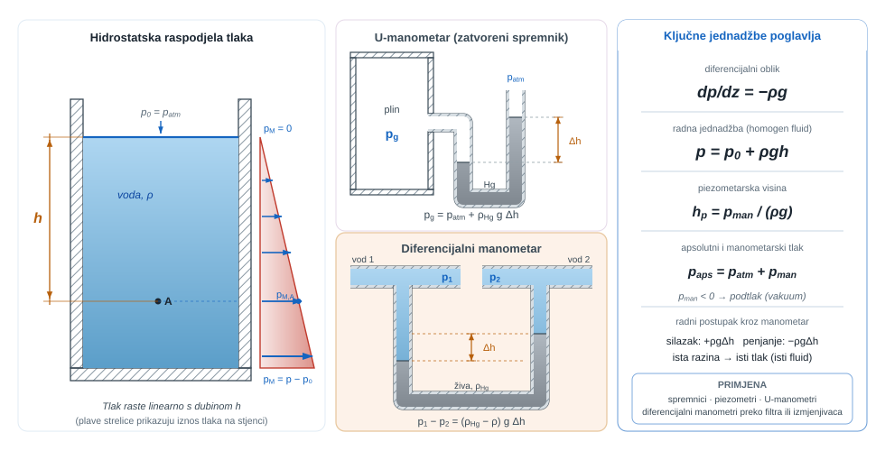
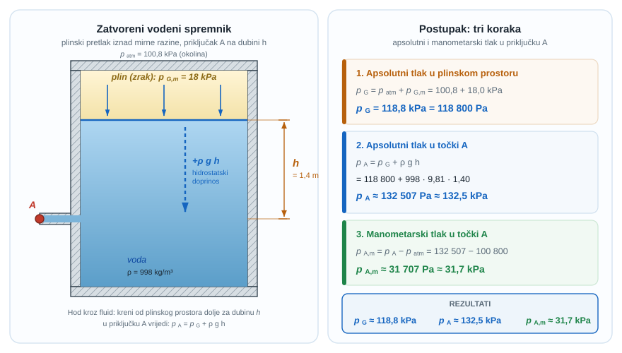
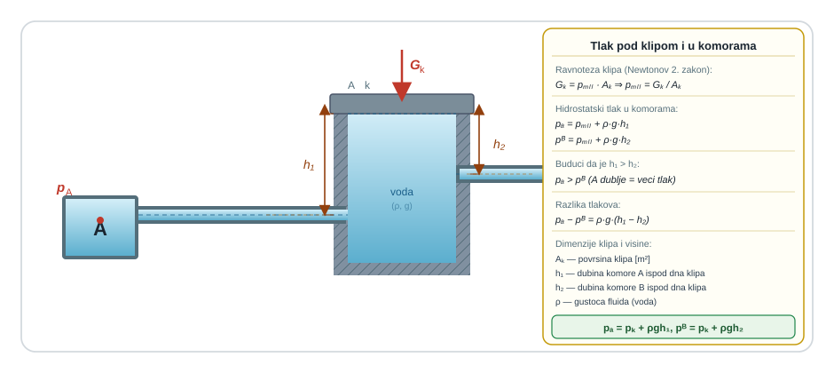
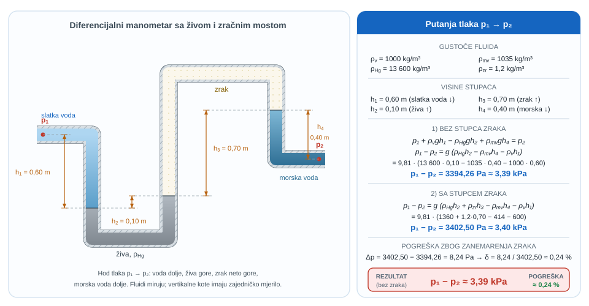
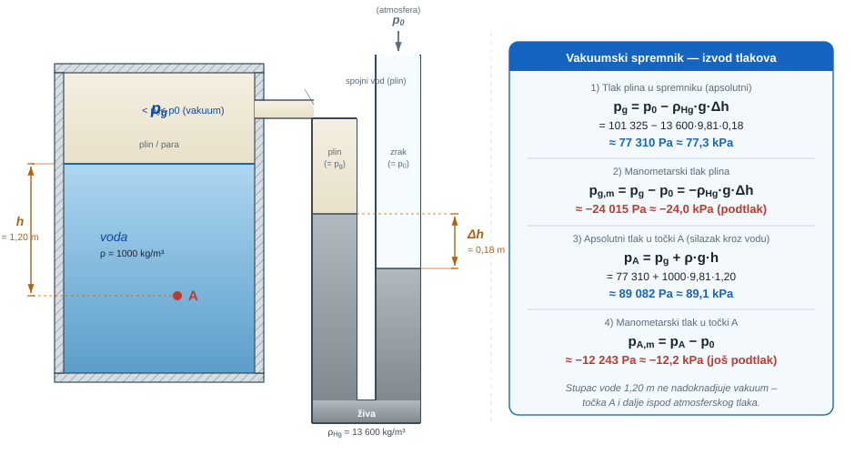
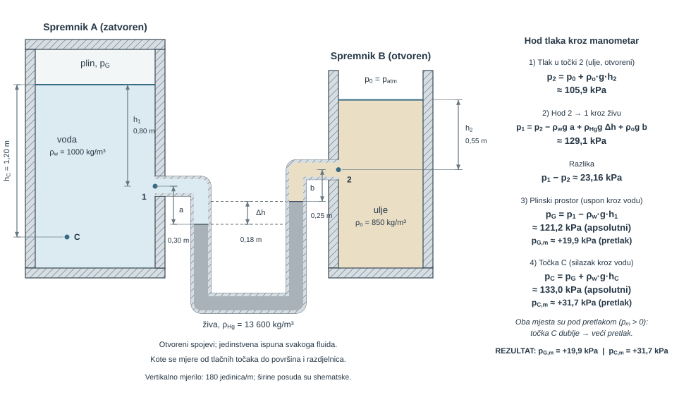
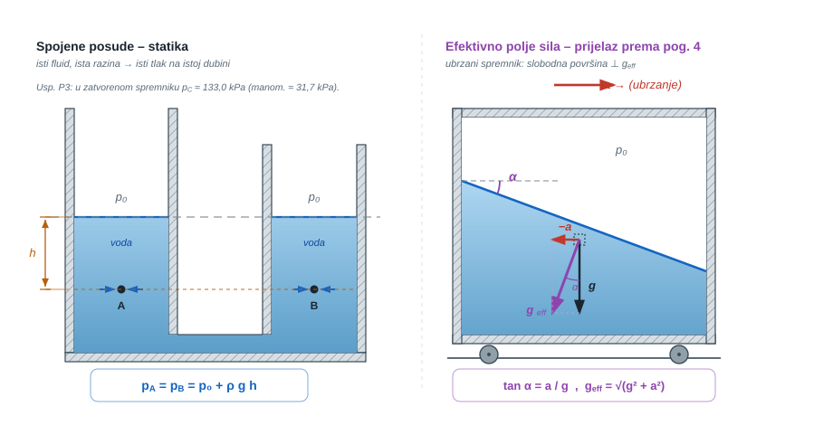
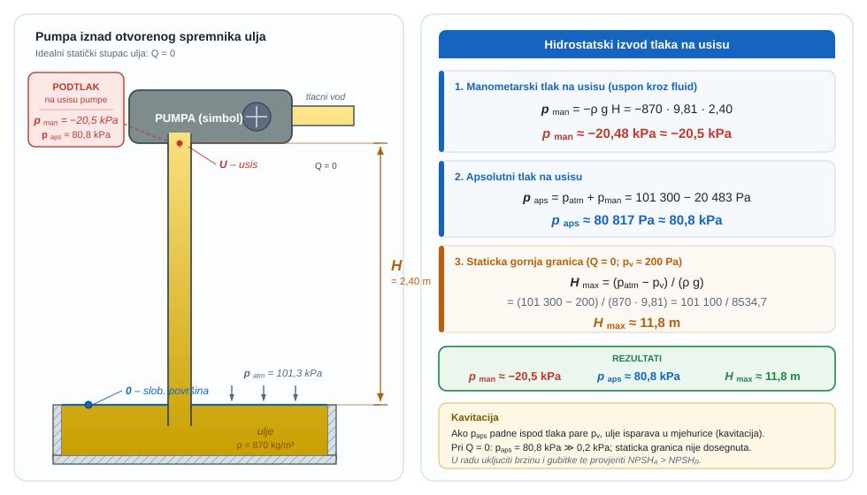
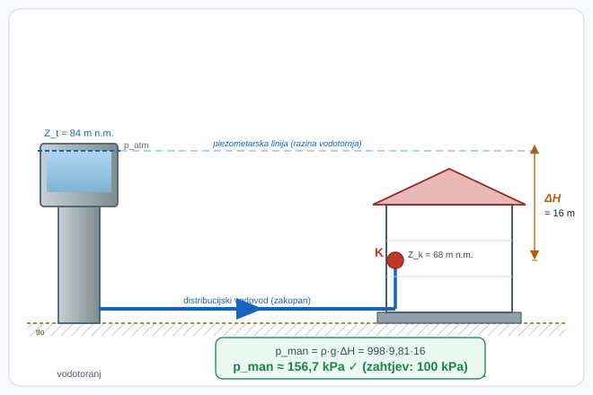
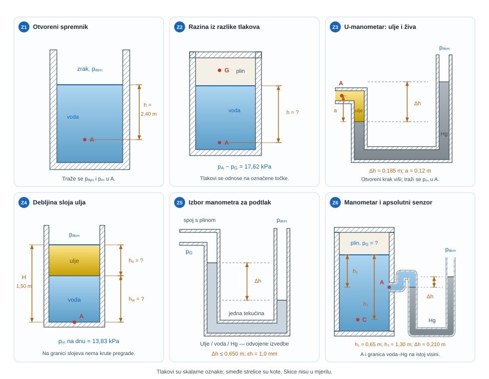

{#fig-uvod-u03 fig-align="center"}

## Hidrostatika kao prvi stvarni test modela

Hidrostatika je prvo poglavlje u kojem model odmah mora dati i mjerenje.

Cilj nije samo zapisati relaciju za tlak, nego učvrstiti radni postupak koji se ponavlja kroz spremnike, piezometre, U-manometre i diferencijalne manometre.

::: {.mf1-application}

Inženjerski kontekst

Ista hidrostatska logika čita se na piezometru uz spremnik, na U-manometru ventilacijskog voda i na diferencijalnom manometru koji provjerava pad tlaka preko filtra ili izmjenjivača topline. U građevini i brodogradnji ta se slika širi na tlak vode po dubini u spremnicima, kesonima i balastnim tankovima, pa je manometrija ovdje instrumentacijski nastavak hidrostatike, a ne novo pravilo.
:::

## Fizikalni uvod i matematički izvod

Fluid u mirovanju ne može nositi smična naprezanja povezana sa strujanjem, ali i dalje nosi raspodjelu normalnog naprezanja, odnosno tlaka. Svaki sloj fluida mora držati težinu slojeva iznad sebe, pa tlak raste s dubinom.

Za homogeni fluid u gravitacijskom polju osnovna relacija je

$$\frac{dp}{dz} = -\rho g$$

::: {.callout-note}
## 📐 Fizikalno značenje
Ova diferencijalna jednadžba kaže jednu jednostavnu stvar: tlak se smanjuje za iznos težine tankog sloja fluida na svakom milimetru visine. Negativan predznak govori da, kad idemo prema gore ($z$ raste), tlak pada. Gustoća $\rho$ je jedina svojina fluida koja ulazi: isti metar dubine daje deset puta veći porast tlaka u živi nego u vodi jer je živa deset puta gušća. Ova relacija vrijedi točno samo za homogeni fluid u gravitacijskom polju bez strujanja.
:::

Ako je gustoće moguće uzeti konstantnom, to prelazi u radni zapis

$$p_2 - p_1 = \rho g (z_1 - z_2)$$

ili, za dubinu mjerenu od slobodne površine,

$$p = p_0 + \rho g h$$

::: {.callout-note}
## 📐 Fizikalno značenje
Ovo je radna jednadžba hidrostatike: poznati tlak na slobodnoj površini ($p_0$), a zatim dodamo "težinski porast" $\rho g h$ za svaki metar dubine. Za vodu ($\rho \approx 1000\ \text{kg/m}^3$) svaki metar dubine donosi oko $9{,}81\ \text{kPa}$. Za živu ($\rho \approx 13600\ \text{kg/m}^3$) isti metar daje $\approx 133\ \text{kPa}$. Ista jednadžba vrijedi i unazad: iz poznatog tlaka u jednoj točki računa se tlak na svakoj drugoj visini u istom spojenom fluidu.
:::

Ključno je da se ova relacija ne koristi mehanički. Diferencijalna jednadžba ovdje nije samo simboličan zapis, nego sažima jednu vrlo jednostavnu sliku: svaki niži sloj nosi težinu slojeva iznad sebe. Zato prije računa treba odrediti koji je tlak poznat, gdje je referentna točka i kojim se putem prolazi kroz fluid.

## Matematički izvod

Promatra se tanki horizontalni sloj mirujućega fluida površine $A$ i debljine $dz$. Os $z$ usmjerena je prema gore. Na donju plohu djeluje tlak $p(z)A$ prema gore, na gornju plohu tlak $p(z + dz)A$ prema dolje, a dodatno prema dolje djeluje težina sloja $\rho g A dz$. Budući da je fluid u mirovanju, zbroj vertikalnih sila mora biti jednak nuli:

$$
p(z)A - p(z + dz)A - \rho g A dz = 0.
$$

Kako je za mali pomak $dz$ moguće pisati $p(z + dz) = p(z) + dp$, uvrštavanjem slijedi

$$
p(z)A - [p(z) + dp]A - \rho g A dz = 0,
$$

odnosno nakon skraćivanja s $A$

$$
-dp - \rho g dz = 0.
$$

Time se dobiva diferencijalni zakon hidrostatike

$$
\frac{dp}{dz} = -\rho g.
$$

Negativan predznak samo kaže da tlak opada kad se ide prema gore, odnosno raste kad se ide prema dolje. Ako je gustoća homogena i može se smatrati konstantnom, jednadžba se integrira između dviju točaka 1 i 2:

$$
\int_{p_1}^{p_2} dp = -\rho g \int_{z_1}^{z_2} dz,
$$

pa slijedi

$$
p_2 - p_1 = -\rho g (z_2 - z_1) = \rho g (z_1 - z_2).
$$

::: {.callout-note}
## 📝 Razrada koraka
Korak: integrirani oblik s $z$ → praktični zapis s dubinom $h$

Neka je $z_1$ visina slobodne površine i $z_2$ visina promatrane točke (niže, dakle $z_2 < z_1$). Tada je $h = z_1 - z_2 > 0$ upravo dubina promatrane točke ispod slobodne površine. Uvrstimo u integrirani oblik:
$$
p_2 - p_1 = \rho g (z_1 - z_2) = \rho g h.
$$
Ako je $p_1 = p_0$ (tlak na slobodnoj površini), dobivamo:
$$
p_2 = p_0 + \rho g h.
$$
Promjena konvencije: $z$ je koordinata prema gore, $h$ je dubina prema dolje. Oba zapisa su ekvivalentni, ali $h$ je pozitivan prema dolje pa je oblik s $h$ intuitivniji za hidrostatička izračunavanja.
:::

Ako se umjesto koordinate $z$ uvede dubina $h$ mjerena prema dolje od poznate slobodne površine, dobiva se praktični zapis

$$
p = p_0 + \rho gh.
$$

U tom konačnom obliku $p_0$ je referentni tlak na slobodnoj površini, a član $\rho gh$ hidrostatički porast tlaka zbog težine stupca fluida iznad promatrane točke.

## Otvoreni i zatvoreni spremnici

Kod otvorenog spremnika tlak na slobodnoj površini jednak je atmosferskom tlaku. Zato je često praktično prijeći na manometarski tlak i atmosferu uzeti kao nultu razinu.

Kod zatvorenog spremnika to više nije automatski dopušteno. Ako je tlak na slobodnoj površini različit od atmosferskog, onda raspodjela nije samo $\rho g h$, nego

$$p = p_{pov} + \rho g h$$

Najčešća greška ovdje nije u računu, nego u tome što se atmosfera mehanički uzme kao nula i kad za to nema fizikalnog opravdanja.

Iz manometarskog tlaka odmah se može čitati i piezometarska visina

$$
h_p = \frac{p_{man}}{\rho g},
$$

::: {.callout-note}
## 📐 Fizikalno značenje
Piezometarska visina je geometrijska reprezentacija tlaka: do koje bi visine voda (ili drugi fluid) narasla u otvorenoj cjevčici pričvršćenoj na to mjesto. Manometarski pretlak od $10\ \text{kPa}$ u vodi odgovara piezometarskoj visini oko $1{,}02\ \text{m}$. Ova veličina spaja računski tlak s vizualno opipljivom fizikalnom veličinom i zato su piezometri nezamjenjivi u terenskim mjerenjima, geotehničkim istraživanjima i provjeri funkcionalnosti distribucijskih mreža.
:::

odnosno visina stupca istoga fluida koji bi odgovarao tom pretlaku. Upravo zato piezometar nije novo pravilo, nego geometrijsko očitanje već postojećeg hidrostatskog tlaka.

Manometar nije novi zakon fizike, nego instrumentacijski zapis iste hidrostatske ravnoteže kroz više spojenih stupaca fluida. U praksi je dovoljno držati se jednoga slijeda: odabrati jednu referentnu točku ili jednu poznatu vrijednost tlaka, kretati se kroz stupce fluida jednim dosljednim smjerom, pri silasku dodavati $\rho g \Delta h$, pri penjanju oduzimati isti član te na istoj horizontalnoj razini istog mirujućeg fluida izjednačiti tlak.

Ako se usred rješenja promijeni referentni smjer ili se preskoči promjena fluida, gotovo je sigurno da će predznaci otići u krivom smjeru.

Jednako je važno stalno razlikovati apsolutni, manometarski i vakuumski tlak: apsolutni se mjeri u odnosu na idealni vakuum, manometarski u odnosu na lokalni atmosferski tlak, a vakuumski opisuje koliko je apsolutni tlak ispod atmosferskoga.

Veza je uvijek

$$p_{aps} = p_{atm} + p_{man}$$

::: {.callout-note}
## 📐 Fizikalno značenje
Apsolutni tlak je "prava" fizikalna veličina mjerena od idealnog vakuuma ($p = 0$) i uvijek je pozitivan. Manometarski tlak je samo razlika od lokalnog atmosferskog: to je ono što manometri i senzori uglavnom prikazuju jer se atmosfera "poništava". Vakuumski tlak opisuje koliko je apsolutni tlak ispod atmosferskog ($p_{vak} = p_{atm} - p_{aps}$). Zamjena jednog za drugi – recimo korištenje manometarskog tlaka tamo gdje je potreban apsolutni – jedna je od najtipičnijih grešaka u manometriji.
:::

pa za podtlak vrijedi i relacija

$$p_{vak} = p_{atm} - p_{aps} = -p_{man} \qquad (p_{man}<0)$$

Ako je $p_{man} < 0$, to ne znači da je tlak "negativan" u apsolutnom smislu, nego da je sustav pod podtlakom u odnosu na okolinu.

## Riješeni primjeri

::: {.mf1-we}

Riješeni primjer - Tlak u priključku zatvorenog vodenog spremnika T1

**Zadano**

Zatvoreni spremnik djelomično je ispunjen vodom gustoće $\rho = 998\ \text{kg/m}^3$. U plinskom prostoru iznad vode vlada manometarski tlak

$$
p_{G,m} = 18\ \text{kPa}
$$

Priključna točka `A` nalazi se na dubini

$$
h = 1{,}40\ \text{m}
$$

ispod slobodne površine vode. Lokalni atmosferski tlak iznosi

$$
p_{atm} = 100{,}8\ \text{kPa}.
$$

**Traženo**

1. apsolutni tlak u plinskom prostoru spremnika.
2. apsolutni tlak u točki `A`.
3. manometarski tlak u točki `A`.

{#fig-u03-zatvoreni-spremnik-tlak fig-align="center"}

**Pretpostavke i model**

Najprije treba zatvoriti tlak na slobodnoj površini. Tek se zatim kroz isti mirujući fluid silazi do točke `A` i dodaje hidrostatički doprinos $\rho g h$.

**Rješenje**

Apsolutni tlak u plinskom prostoru jednak je

$$
p_G = p_{atm} + p_{G,m} = 100{,}8 + 18{,}0 = 118{,}8\ \text{kPa}
$$

odnosno

$$
p_G = 118800\ \text{Pa}.
$$

Tlak u točki `A` dobiva se silaskom kroz vodu za dubinu $h$:

$$
p_A = p_G + \rho g h
$$

odnosno

$$
p_A = 118800 + 998 \cdot 9{,}81 \cdot 1{,}40 = 132512\ \text{Pa}
$$

pa je

$$
p_A \approx 132{,}5\ \text{kPa}.
$$

Manometarski tlak u točki `A` zato iznosi

$$
p_{A,m} = p_A - p_{atm} = 132512 - 100800 = 31712\ \text{Pa}
$$

odnosno

$$
p_{A,m} \approx 31{,}7\ \text{kPa}.
$$

**Provjera i komentar**

1. Tlak u točki `A` mora biti veći od tlaka u plinskom prostoru jer se do točke ide prema dolje kroz vodu.
2. Manometarski tlak u točki `A` mora biti veći od manometarskog tlaka plinskog prostora za iznos hidrostatičkog doprinosa vode.
3. Apsolutni tlak mora ostati pozitivan i veći od lokalnog atmosferskog tlaka.
:::

::: {.mf1-we}

Riješeni primjer - Ravnoteza klipa i tlak u dvjema komorama T2

**Zadano**

Dvije komore `A` i `B` povezane su istom mirujućom vodom gustoće $\rho = 1000\ \text{kg/m}^3$. U središnjem cilindru nalazi se klip težine

$$
G_k = 25\ \text{N}
$$

i promjera

$$
d_k = 0{,}30\ \text{m}
$$

Karakteristične visine u sustavu su

$$
h_1 = 0{,}25\ \text{m}, \qquad h_2 = 0{,}50\ \text{m}
$$

pri čemu je $h_1$ vertikalni pad od razine neposredno ispod klipa do komore `A`, a $h_2$ ukupna vertikalna udaljenost od komore `A` do komore `B`.

Zanemari utjecaj visine stupca zraka i odredi manometarske tlakove u komorama `A` i `B`.

**Traženo**

Odredi manometarske tlakove u komorama `A` i `B`.

**Pretpostavke i model**

Najprije treba dobiti bazni tlak koji stvara sam klip. Tek se taj tlak zatim prenosi kroz vodu i korigira za visinske razlike do komora `A` i `B`. To je najjednostavniji uvod u radni ritual poglavlja: poznati tlak na jednoj razini, pa dosljedno hodanje gore ili dolje kroz isti fluid.

**Rješenje**

Površina klipa iznosi

$$
A_k = \frac{\pi d_k^2}{4} = \frac{\pi \cdot 0{,}30^2}{4} = 0{,}0707\ \text{m}^2
$$

Bazni pretlak neposredno ispod klipa jednak je

$$
p_c = \frac{G_k}{A_k} = \frac{25}{0{,}0707} = 353{,}6\ \text{Pa}
$$

Do komore `A` ide se prema dolje kroz vodu za visinu $h_1$, pa tlak raste:

$$
p_A = p_c + \rho g h_1
$$

odnosno

$$
p_A = 353{,}6 + 1000 \cdot 9{,}81 \cdot 0{,}25 = 2806\ \text{Pa}
$$

pa je

$$
p_A \approx 2{,}81\ \text{kPa}
$$

Do komore `B` u odnosu na razinu komore `A` ide se prema gore za visinsku razliku $h_2 - h_1 = 0{,}25\ \text{m}$, pa tlak pada:

$$
p_B = p_c - \rho g (h_2 - h_1)
$$

odnosno

$$
p_B = 353{,}6 - 1000 \cdot 9{,}81 \cdot 0{,}25 = -2099\ \text{Pa}
$$

pa slijedi

$$
p_B \approx -2{,}10\ \text{kPa}
$$

**Provjera i komentar**

Komora `A` je pod pozitivnim manometarskim tlakom od oko $2{,}8\ \text{kPa}$, dok je komora `B` pod blagim podtlakom od oko $2{,}1\ \text{kPa}$ u odnosu na atmosferu. Time se odmah vidi zašto je u ovom poglavlju ključno razlikovati apsolutni i manometarski tlak.

1. Bazni tlak ispod laganog klipa mora biti malen, reda nekoliko stotina paskala.
2. Tlak u nižoj komori mora biti veći od baznog tlaka jer se do nje ide prema dolje kroz vodu.
3. Negativan manometarski tlak u višoj komori ne znači negativan apsolutni tlak, nego podtlak u odnosu na okolinu.
:::

::: {.mf1-we}

Riješeni primjer - Diferencijalni manometar između slatke i morske vode T3

**Zadano**

Dva paralelna horizontalna voda spojena su diferencijalnim manometrom. U lijevom vodu struji slatka voda gustoće $\rho_v = 1000\ \text{kg/m}^3$, a u desnom morska voda gustoće $\rho_{mv} = 1035\ \text{kg/m}^3$. U manometru se nalaze još živa gustoće $\rho_{Hg} = 13600\ \text{kg/m}^3$ i mali stupac zraka gustoće $\rho_{zr} = 1{,}2\ \text{kg/m}^3$.

Zadane su visinske razlike:

$$
h_1 = 0{,}60\ \text{m}, \qquad h_2 = 0{,}10\ \text{m}, \qquad h_3 = 0{,}70\ \text{m}, \qquad h_4 = 0{,}40\ \text{m}
$$

pri čemu je $h_1$ silazak od točke $p_1$ do lijeve granice voda-živa, $h_2$ uspon između dviju razina žive, $h_3$ visina malog stupca zraka, a $h_4$ silazak od desne granice manometra do točke $p_2$ kroz morsku vodu.

**Traženo**

1. razliku tlakova $p_1 - p_2$.
2. kolika je pogreška ako se stupac zraka zanemari.

**Pretpostavke i model**

Najsigurniji pristup nije pamtiti gotovu formulu, nego pratiti tlak od jedne poznate točke do druge. Na svakom segmentu treba samo dosljedno zapisati raste li tlak ili pada i koji fluid taj segment pripada.

**Rješenje**

Krenimo od tlaka $p_1$ u lijevom vodu i pratimo sustav do tlaka $p_2$ u desnom vodu.

Ako se stupac zraka zanemari, radni zapis glasi:

1. idem dolje kroz slatku vodu: $+\rho_v g h_1$.
2. idem gore kroz živu: $-\rho_{Hg} g h_2$.
3. idem dolje kroz morsku vodu: $+\rho_{mv} g h_4$.

Zato vrijedi

$$
p_1 + \rho_v g h_1 - \rho_{Hg} g h_2 + \rho_{mv} g h_4 = p_2
$$

odnosno

$$
p_1 - p_2 = g\left(\rho_{Hg} h_2 - \rho_{mv} h_4 - \rho_v h_1\right)
$$

Uvrstavanjem podataka:

$$
p_1 - p_2 = 9{,}81\left(13600 \cdot 0{,}10 - 1035 \cdot 0{,}40 - 1000 \cdot 0{,}60\right)
$$

pa slijedi

$$
p_1 - p_2 = 3394\ \text{Pa} \approx 3{,}39\ \text{kPa}
$$

Sada uključimo i mali stupac zraka. Tada se pri prolazu prema gore kroz zrak tlak još dodatno smanjuje za $\rho_{zr} g h_3$, pa vrijedi

$$
p_1 + \rho_v g h_1 - \rho_{Hg} g h_2 - \rho_{zr} g h_3 + \rho_{mv} g h_4 = p_2
$$

odnosno

$$
p_1 - p_2 = g\left(\rho_{Hg} h_2 + \rho_{zr} h_3 - \rho_{mv} h_4 - \rho_v h_1\right)
$$

Numerički:

$$
p_1 - p_2 = 9{,}81\left(13600 \cdot 0{,}10 + 1{,}2 \cdot 0{,}70 - 1035 \cdot 0{,}40 - 1000 \cdot 0{,}60\right)
$$

pa je

$$
p_1 - p_2 = 3402\ \text{Pa} \approx 3{,}40\ \text{kPa}
$$

Pogreška zanemarivanja zraka zato iznosi

$$
\Delta p = 3402 - 3394 = 8\ \text{Pa}
$$

a relativna pogreška je

$$
\delta = \frac{8}{3402} \cdot 100\% \approx 0{,}24\%
$$

**Provjera i komentar**

U ovom zadatku tlak u lijevom vodu veći je od tlaka u desnom vodu za otprilike $3{,}4\ \text{kPa}$. Stupac zraka daje vrlo mali doprinos, pa je njegovo zanemarivanje ovdje inženjerski prihvatljivo.

1. Doprinos žive mora biti dominantan jer ima daleko najveću gustoću.
2. Doprinos zraka mora biti vrlo malen u odnosu na doprinose tekućina, što i brojčano dobivamo.
3. Ako se tijekom računa izgubi redoslijed prolaza kroz fluide, gotovo sigurno će se pojaviti pogrešan predznak ispred jednog od članova.
:::

Nakon otvorenih spremnika i diferencijalnog manometra treba zatvoriti još jedan osnovni tip čitanja: kako se iz vakuummetra ili otvorenog U-manometra vraća apsolutni tlak u plinskom prostoru, a zatim i tlak u tekućini ispod njega.

::: {.mf1-we}

Riješeni primjer - Vakuumski spremnik s otvorenim živinim manometrom T2

**Zadano**

Zatvoreni spremnik za odzračivanje djelomično je ispunjen vodom gustoće $\rho = 1000\ \text{kg/m}^3$. Plinski prostor iznad vode spojen je s otvorenim U-manometrom u kojem je živa gustoće $\rho_{Hg} = 13600\ \text{kg/m}^3$. U otvorenom kraku manometra vlada atmosferski tlak $p_0 = 101325\ \text{Pa}$.

Razlika razina žive između otvorenog i spojenog kraka iznosi $\Delta h = 0{,}18\ \text{m}$, pri čemu je razina žive u kraku spojenom na spremnik viša, što znači da je u spremniku podtlak. Točka `A` u vodi nalazi se na dubini $h = 1{,}20\ \text{m}$ ispod slobodne površine u spremniku.

**Traženo**

1. apsolutni i manometarski tlak u plinskom prostoru spremnika.
2. apsolutni tlak u točki `A`.
3. manometarski tlak u točki `A` i protumači je li točka `A` još uvijek pod podtlakom u odnosu na atmosferu.

**Pretpostavke i model**

Otvoreni krak manometra daje poznati atmosferski tlak, a visinska razlika žive vraća tlak u plinskom prostoru spremnika. Tek se zatim iz tog tlaka silazi kroz vodu do točke `A`.

**Rješenje**

Kako je razina žive u kraku spojenom na spremnik viša, tlak u spremniku manji je od atmosferskog za iznos

$$
\rho_{Hg} g \Delta h
$$

Zato je apsolutni tlak u plinskom prostoru

$$
p_g = p_0 - \rho_{Hg} g \Delta h = 101325 - 13600 \cdot 9{,}81 \cdot 0{,}18
$$

pa slijedi

$$
p_g = 77310\ \text{Pa}
$$

odnosno

$$
p_g \approx 77{,}3\ \text{kPa}
$$

Manometarski tlak u plinskom prostoru zato je

$$
p_{g,m} = p_g - p_0 = -24015\ \text{Pa} \approx -24{,}0\ \text{kPa}
$$

Tlak u točki `A` dobiva se silaskom kroz vodu za dubinu $h$:

$$
p_A = p_g + \rho g h = 77310 + 1000 \cdot 9{,}81 \cdot 1{,}20
$$

pa je

$$
p_A = 89082\ \text{Pa}
$$

odnosno

$$
p_A \approx 89{,}1\ \text{kPa}
$$

Manometarski tlak u točki `A` iznosi

$$
p_{A,m} = p_A - p_0 = 89082 - 101325 = -12243\ \text{Pa}
$$

odnosno

$$
p_{A,m} \approx -12{,}2\ \text{kPa}
$$

**Provjera i komentar**

Iako se tlak pri silasku do točke `A` povećao za hidrostatički doprinos vode, to nije bilo dovoljno da dosegne atmosferski tlak. Zato je točka `A` i dalje pod blagim podtlakom u odnosu na okolinu, iako je njezin apsolutni tlak naravno i dalje pozitivan.

1. Viša razina žive na strani spremnika odmah govori da je tlak u spremniku manji od atmosferskog.
2. Tlak u točki `A` mora biti veći od tlaka u plinskom prostoru jer se do nje ide prema dolje kroz vodu.
3. Negativan manometarski tlak ne znači negativan apsolutni tlak, nego samo tlak manji od atmosferskog.
:::

::: {.mf1-ch}

Cjeloviti zadatak - Zatvoreni vodeni spremnik s uljnim referentnim spremnikom i živinim manometrom T3

**Zadano**

Zatvoreni kalibracijski spremnik `A` djelomično je ispunjen vodom gustoće

$$
\rho_w = 1000\ \text{kg/m}^3
$$

a tlak u plinskom prostoru iznad vode iznosi nepoznatu vrijednost $p_G$. Na bočnoj stijenci spremnika nalazi se priključna točka `1` na dubini

$$
h_1 = 0{,}80\ \text{m}
$$

ispod slobodne površine vode.

Desno od njega nalazi se otvoreni referentni spremnik `B` ispunjen uljem gustoće

$$
\rho_o = 850\ \text{kg/m}^3
$$

Na njegovoj stijenci nalazi se priključna točka `2` na dubini

$$
h_2 = 0{,}55\ \text{m}
$$

ispod slobodne površine ulja, koja je na atmosferskom tlaku

$$
p_0 = 101325\ \text{Pa}
$$

Točke `1` i `2` spojene su diferencijalnim U-manometrom sa živom gustoće

$$
\rho_{Hg} = 13600\ \text{kg/m}^3
$$

U lijevom kraku između točke `1` i granice voda-ziva nalazi se vodeni stupac visine

$$
a = 0{,}30\ \text{m}
$$

a u desnom kraku između točke `2` i granice ulje-ziva uljni stupac visine

$$
b = 0{,}25\ \text{m}
$$

Razina žive u lijevom kraku niža je od razine žive u desnom za

$$
\Delta h = 0{,}18\ \text{m}
$$

U spremniku `A` promatra se i točka `C`, koja se nalazi na dubini

$$
h_C = 1{,}20\ \text{m}
$$

ispod slobodne površine vode.

**Traženo**

1. tlakove u priključnim točkama $p_1$ i $p_2$ te njihovu razliku.
2. apsolutni i manometarski tlak u plinskom prostoru spremnika `A`.
3. apsolutni i manometarski tlak u točki `C`.
4. protumači jesu li plinski prostor i točka `C` pod pretlakom ili podtlakom u odnosu na atmosferu.

Zanemari gustoće plinova u spojnim cijevima.

**Pretpostavke i model**

Najsigurniji pristup i dalje nije pamtiti gotov izraz, nego tlak pratiti po segmentima. U otvorenom spremniku `B` tlak u točki `2` vraća se iz atmosfere i uljnog stupca. Zatim se preko diferencijalnog manometra dobije tlak u točki `1`, a tek se nakon toga iz točke `1` penje prema plinskom prostoru `A` ili silazi prema dubljoj točki `C`.

**Rješenje**

#### 1. Tlak u točki `2` i relacija manometra

Kako je spremnik `B` otvoren, tlak u njegovoj slobodnoj površini jednak je atmosferskom. Zato je tlak u točki `2`

$$
p_2 = p_0 + \rho_o g h_2
$$

odnosno

$$
p_2 = 101325 + 850 \cdot 9{,}81 \cdot 0{,}55 = 105911\ \text{Pa}
$$

pa je

$$
p_2 \approx 105{,}9\ \text{kPa}
$$

Sada krenimo od točke `1` prema točki `2` kroz manometar:

1. prema dolje kroz vodu visine $a$ tlak raste za $\rho_w g a$.
2. kroz živu se ide prema gore za visinsku razliku $\Delta h$, pa tlak pada za $\rho_{Hg} g \Delta h$.
3. prema gore kroz ulje visine $b$ tlak pada za $\rho_o g b$.

Zato vrijedi

$$
p_1 + \rho_w g a - \rho_{Hg} g \Delta h - \rho_o g b = p_2
$$

odnosno

$$
p_1 = p_2 - \rho_w g a + \rho_{Hg} g \Delta h + \rho_o g b
$$

Numerički:

$$
p_1 = 105911 - 1000 \cdot 9{,}81 \cdot 0{,}30 + 13600 \cdot 9{,}81 \cdot 0{,}18 + 850 \cdot 9{,}81 \cdot 0{,}25
$$

pa slijedi

$$
p_1 = 129068\ \text{Pa} \approx 129{,}1\ \text{kPa}
$$

Razlika tlakova zato je

$$
p_1 - p_2 = 129068 - 105911 = 23157\ \text{Pa}
$$

odnosno

$$
p_1 - p_2 \approx 23{,}16\ \text{kPa}
$$

#### 2. Tlak u plinskom prostoru spremnika `A`

U spremniku `A` točka `1` nalazi se na dubini $h_1$ ispod slobodne površine vode, pa vrijedi

$$
p_1 = p_G + \rho_w g h_1
$$

odnosno

$$
p_G = p_1 - \rho_w g h_1 = 129068 - 1000 \cdot 9{,}81 \cdot 0{,}80
$$

pa je

$$
p_G = 121220\ \text{Pa}
$$

odnosno

$$
p_G \approx 121{,}2\ \text{kPa}
$$

Manometarski tlak plinskog prostora iznosi

$$
p_{G,m} = p_G - p_0 = 121220 - 101325 = 19895\ \text{Pa}
$$

pa slijedi

$$
p_{G,m} \approx 19{,}9\ \text{kPa}
$$

#### 3. Tlak u točki `C`

Točka `C` nalazi se dublje od slobodne površine za $h_C = 1{,}20\ \text{m}$, pa je njezin apsolutni tlak

$$
p_C = p_G + \rho_w g h_C
$$

odnosno

$$
p_C = 121220 + 1000 \cdot 9{,}81 \cdot 1{,}20 = 132992\ \text{Pa}
$$

pa je

$$
p_C \approx 133{,}0\ \text{kPa}
$$

Manometarski tlak u točki `C` jest

$$
p_{C,m} = p_C - p_0 = 132992 - 101325 = 31667\ \text{Pa}
$$

odnosno

$$
p_{C,m} \approx 31{,}7\ \text{kPa}
$$

#### 4. Tumačenje stanja

Kako je i

$$
p_{G,m} > 0
$$

i

$$
p_{C,m} > 0
$$

slijedi da su i plinski prostor i točka `C` pod pretlakom u odnosu na atmosferu. Točka `C` je pod većim pretlakom jer se nalazi dublje u vodi.

**Provjera i komentar**

Otvoreni uljni spremnik daje u točki `2` tlak oko $105{,}9\ \text{kPa}$, a diferencijalni manometar pokazuje da je tlak u točki `1` veći za oko $23{,}16\ \text{kPa}$. Iz toga slijedi da je apsolutni tlak plinskog prostora zatvorenog spremnika oko $121{,}2\ \text{kPa}$, odnosno da je spremnik pod manometarskim pretlakom od oko $19{,}9\ \text{kPa}$. U dubljoj točki `C` tlak dodatno raste na oko $133{,}0\ \text{kPa}$, odnosno na oko $31{,}7\ \text{kPa}$ manometarski.

1. Niža razina žive u lijevom kraku mora značiti da je tlak na lijevoj strani manometra veći.
2. Tlak u točki `1` mora biti veći od tlaka u plinskom prostoru jer se do nje dolazi silaskom kroz vodu.
3. Tlak u točki `C` mora biti veći od tlaka u plinskom prostoru i veći od tlaka u točki `1`, jer je `C` najdublja promatrana točka u vodi.
:::

Kao prijelaz prema U04Relativno mirovanje fluida korisno je usporediti ravnotežu tlaka u spojenim posudama s idejom efektivnog polja sila.

::: {.mf1-we}

Riješeni primjer – Tlak na usisu pumpe za cirkulaciju ulja &nbsp;T2

🔩 **Primjer za strojare**

**Kontekst:** U hidrauličnom sustavu preše pumpa za cirkulaciju ulja smještena je 2,4 m iznad razine ulja u otvorenom spremniku. Pumpa aspirira ulje podtlakom na svom usisu.

**Zadano**

- Visina pumpe iznad razine ulja: $H = 2{,}40\ \text{m}$
- Gustoća hidrauličnog ulja: $\rho = 870\ \text{kg/m}^3$
- Lokalni atmosferski tlak: $p_{atm} = 101{,}3\ \text{kPa}$

**Traženo**

1. Manometarski tlak na usisu pumpe.
2. Apsolutni tlak na usisu pumpe.
3. Procijeni do koje maksimalne visine se ulje može aspirirati bez kavitacije (tlak pare ulja $p_v \approx 200\ \text{Pa}$).

{#fig-u03-pumpa-usis fig-align="center"}

**Pretpostavke i model**

Zanemaruju se gubici u usisnom vodu (samo hidrostatika). Slobodna površina ulja u spremniku je na atmosferskom tlaku. Pumpa je viša od razine – tlak pada pri usponu kroz fluid.

**Rješenje**

Manometarski tlak na usisu pumpe (uspon od slobodne površine za $H$):

$$
p_{man} = -\rho g H = -870 \cdot 9{,}81 \cdot 2{,}40 = -20{,}49 \cdot 10^3\ \text{Pa}
$$

$$
p_{man} \approx -20{,}5\ \text{kPa}
$$

Apsolutni tlak na usisu:

$$
p_{aps} = p_{atm} + p_{man} = 101300 - 20490 = 80810\ \text{Pa} \approx 80{,}8\ \text{kPa}
$$

Maksimalna teorijska visina aspiracije (bez kavitacije):

$$
H_{max} = \frac{p_{atm} - p_v}{\rho g} = \frac{101300 - 200}{870 \cdot 9{,}81} = \frac{101100}{8534} \approx 11{,}8\ \text{m}
$$

**Provjera i komentar**

Apsolutni tlak $80{,}8\ \text{kPa}$ je razuman – pumpa radi s podtlakom na usisu, ali daleko iznad kavitacijske granice. Teorijska maksimalna usisna visina od $11{,}8\ \text{m}$ u praksi se reducira na $6{-}8\ \text{m}$ zbog hidrauličkih gubitaka i sigurnosne margine iznad kavitacije. Tipični podatkovni listovi pumpi navode „maksimalnu usisnu visinu" upravo iz ove hidrostatičke analize.

:::

::: {.mf1-we}

Riješeni primjer – Tlak u distribucijskoj mreži iz vodotornja &nbsp;T1

🏗️ **Primjer za građevinare**

**Kontekst:** Vodotoranj opskrbljuje vodom stambeno naselje. Razina vode u vodotornju je na apsolutnoj nadmorskoj visini $Z_t = 84\ \text{m}$, a priključna točka u stambenoj zgradi je na nadmorskoj visini $Z_k = 68\ \text{m}$.

**Zadano**

- Razina vode u vodotornju: $Z_t = 84\ \text{m}$ n.m.
- Priključak u zgradi: $Z_k = 68\ \text{m}$ n.m.
- Gustoća vode: $\rho = 998\ \text{kg/m}^3$
- Atmosferski tlak: $p_{atm} = 100{,}5\ \text{kPa}$

**Traženo**

1. Razlika razina između vodotornja i priključka.
2. Manometarski tlak u kućnom priključku.
3. Apsolutni tlak u kućnom priključku.
4. Je li tlak dovoljan za normalno funkcioniranje (minimalni zahtjev $p_{man,min} = 100\ \text{kPa}$)?

{#fig-u03-vodotoranj-distribucija fig-align="center"}

**Pretpostavke i model**

Fluid je u mirovanju (statičko stanje mreže). Slobodna površina u vodotornju je na atmosferskom tlaku. Zanemaruju se gubici u distribucijskim vodovima.

**Rješenje**

Razlika razina između vodotornja i priključka:

$$
\Delta H = Z_t - Z_k = 84 - 68 = 16\ \text{m}
$$

Manometarski tlak u priključku:

$$
p_{man} = \rho g \Delta H = 998 \cdot 9{,}81 \cdot 16 = 156{,}7 \cdot 10^3\ \text{Pa} \approx 156{,}7\ \text{kPa}
$$

Apsolutni tlak u priključku:

$$
p_{aps} = p_{atm} + p_{man} = 100500 + 156700 = 257200\ \text{Pa} \approx 257{,}2\ \text{kPa}
$$

Usporedba s minimalnim zahtjevom: $p_{man} = 156{,}7\ \text{kPa} > 100\ \text{kPa}$ – uvjet je zadovoljen.

**Provjera i komentar**

Razlika razina $16\ \text{m}$ daje tlak od $\approx 1{,}57\ \text{bar}$ – normalan distribucijski tlak za niže zone vodoopskrbe. Europski standardi (EN 805) zahtijevaju minimalno 1 bar u priključnoj točki. Za višu zonu (zgrada na $Z = 78\ \text{m}$) ista razlika bi bila samo 6 m, što daje svega $\approx 59\ \text{kPa}$ – nedovoljno bez pojačne pumpe.

:::

## Usporedna tablica: strojarstvo i građevinarstvo

| Koncept | Strojarstvo – gdje se pojavljuje | Građevinarstvo – gdje se pojavljuje |
|---------|----------------------------------|--------------------------------------|
| $p = p_0 + \rho g h$ | Tlak na ulaznom priključku pumpe; prekoračenje tlaka na dnu hidrauličnog cilindra | Tlak tla na temelj brane; hidrostatički tlak na podzemni zid ili kasonu |
| Manometarski tlak | Očitanje radnog tlaka u hidrauličnom krugu (senzori ne mjere apsolutni tlak) | Tlak u distribucijskoj mreži iz vodotornja; tlak u kućnom priključku |
| Piezometarska visina | Provjera sila usisavanja pumpe; procjena kavitacijske margine | Terenski piezometri za praćenje razine podzemne vode; potlačne linije u brani |
| Diferencijalni manometar | Mjerenje pada tlaka na filtru ili izmjenjivaču topline; kontrola stanja konstriktora | Razlika tlakova između uzvodnog i nizvodnog presjeka u hidroelektrani; mjerenje pada u propustu |
| Vakuumski (negativni) tlak | Usisna strana pumpe; kondenzator pare u parnom ciklusu | Sukcijska snaga usisa u temeljnom tlu; negativni pore-water pressure |

## Zadaci za vježbu

::: {.mf1-vjezbe-list}
1. **T1** Otvoreni spremnik s vodom ima slobodnu površinu na atmosferskom tlaku. Odredi apsolutni i manometarski tlak u točki koja se nalazi na dubini $h = 2{,}40\ \text{m}$ ako je $p_{atm} = 100{,}8\ \text{kPa}$ i $\rho = 998\ \text{kg/m}^3$.

	**Natuknica:** manometarski tlak je $p_m = \rho gh$, a apsolutni $p_{aps} = p_{atm} + p_m$.

	**Skica:** da - otvoreni spremnik, slobodna površina i jedna točka na dubini $h$.

2. **T1** U zatvorenom spremniku iznad vode vlada manometarski tlak $p_m = 26\ \text{kPa}$. Odredi apsolutni i manometarski tlak u priključku koji se nalazi $1{,}80\ \text{m}$ ispod slobodne površine ako je lokalni atmosferski tlak $p_{atm} = 99{,}2\ \text{kPa}$, a gustoća vode $\rho = 998\ \text{kg/m}^3$.

	**Natuknica:** najprije tlak na slobodnoj površini, zatim kroz isti fluid dodaj $\rho gh$; tek na kraju razdvoji apsolutni i manometarski tlak.

	**Skica:** da - zatvoreni spremnik, plinski prostor iznad vode i priključak na dubini $h$.

3. **T2** Cjevovod s uljem gustoće $\rho_u = 860\ \text{kg/m}^3$ spojen je na otvoreni U-manometar sa živom gustoće $\rho_{Hg} = 13600\ \text{kg/m}^3$. Razlika razina žive iznosi $\Delta h = 0{,}185\ \text{m}$, a priključna točka u kraku s uljem nalazi se $0{,}12\ \text{m}$ iznad dodira ulja i žive. Odredi manometarski tlak u cjevovodu.

	**Natuknica:** kreni od slobodne površine otvorenog kraka; niz stupce piši promjene tlaka kao $\rho g\Delta h$ uz točan znak.

	**Skica:** da - U-manometar s uljem i živom, razlika razina $\Delta h$ i priključna točka.

4. **T2** Diferencijalni manometar ispunjen živom spaja dvije točke u vodi, pri čemu je razlika razina žive $\Delta h = 0{,}145\ \text{m}$. Točka `A` nalazi se $0{,}30\ \text{m}$ ispod točke `B`. Odredi razliku tlakova $p_A - p_B$.

	**Natuknica:** napravi jednu zatvorenu putanju od `A` do `B`; kroz vodu i živu piši odvojene doprinose $\rho g\Delta h$ i tek na kraju zbroji.

	**Skica:** da - dvije točke spojene diferencijalnim manometrom s označenim visinskim pomakom.

5. **T3** Vakuumski spremnik spojen je na otvoreni živin manometar koji pokazuje razliku razina $\Delta h = 0{,}230\ \text{m}$. Ako je lokalni atmosferski tlak $p_{atm} = 98{,}6\ \text{kPa}$, odredi apsolutni tlak plina u spremniku. Zatim odredi apsolutni tlak u točki koja se nalazi $0{,}90\ \text{m}$ ispod slobodne površine vode unutar istog spremnika.

	**Natuknica:** iz manometra najprije vrati tlak plina, a zatim u istom spremniku kroz vodu dodaj $\rho gh$ do tražene točke.

	**Skica:** da - vakuumski spremnik, otvoreni živin manometar i unutarnja točka na dubini $h$.

6. **T3** Zatvoreni spremnik s vodom ima plinski prostor nepoznatog apsolutnog tlaka. Bočni priključak na dubini $h_1 = 0{,}65\ \text{m}$ spojen je na otvoreni U-manometar sa živom gustoće $\rho_{Hg} = 13600\ \text{kg/m}^3$, pri čemu je razlika razina žive $\Delta h = 0{,}210\ \text{m}$, a razina žive na strani spremnika niža. Odredi apsolutni tlak plina u spremniku i apsolutni tlak u točki koja leži $1{,}30\ \text{m}$ ispod slobodne površine vode. Uzmite $\rho_w = 998\ \text{kg/m}^3$ i $p_{atm} = 100{,}9\ \text{kPa}$.

	**Natuknica:** iz otvorenog manometra najprije vrati tlak u priključku, zatim se penjanjem kroz vodu vrati na plinski prostor, a silaskom na dubinu $1{,}30\ \text{m}$ dobije tlak u traženoj točki.

	**Skica:** da - zatvoreni vodeni spremnik, priključak na dubini $h_1$, otvoreni U-manometar sa živom i dublja unutarnja točka.
:::

::: {.mf1-zavrsni-okvir}

Za ponijeti iz poglavlja

**Sažeta provjera prije računa**

- Treba jasno označiti referentnu točku i poznati tlak.
- Treba razlikovati gdje se radi s apsolutnim, a gdje s manometarskim tlakom.
- Kretanje gore ili dolje kroz svaki stupac treba pratiti bez miješanja znakova.
- Treba provjeriti mijenja li se fluid, pa s njim i gustoća u izrazu $\rho g \Delta h$.
- Treba odvojiti čistu hidrostatiku od relativnog mirovanja i uzgona.

**Najčešća pogreška**

Najčešća greška nije sama algebra, nego prerano skrivanje fizike u jednu dugu jednadžbu. Ako se ne vidi gdje tlak raste, gdje pada i koji je tlak poznat na početku putanje, treba se vratiti na skicu.

**Nakon ovoga poglavlja mora biti moguće**

1. pročitati raspodjelu tlaka u otvorenom ili zatvorenom spremniku.
2. razlikovati apsolutni, manometarski i vakuumski tlak.
3. dosljedno pročitati više-fluidni manometar bez gubitka predznaka.

**U tehnici to znači**

Piezometar uz spremnik, diferencijalni manometar na filtru i tlačni priključak na balastnom tanku svi se čitaju istom hidrostatikom. Tko zna pratiti tlak kroz stupce fluida i tipove tlaka, zna i ispravno tumačiti očitanje instrumenta na stvarnom sustavu.

**Granica modela**

Jednostavni zapis $p = p_0 + \rho gh$ vrijedi samo dok je fluid u mirovanju ili u režimu koji se može čitati kao hidrostatika. Čim značajno uđu strujanje, promjena gustoće ili jaka akceleracija sustava, treba prijeći na širi model od čistoga manometarskog puta.

U03Hidrostatička raspodjela tlaka i manometrija treba učvrstiti tri stabilne navike: crtanje referentne skice, praćenje promjene tlaka po koracima i razlikovanje tipova tlaka prije nego što račun uopće počne.
:::

