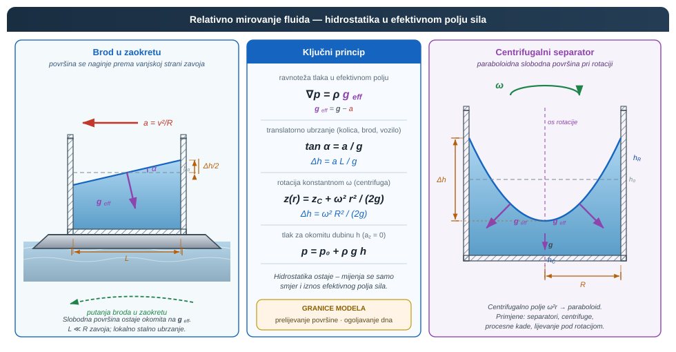
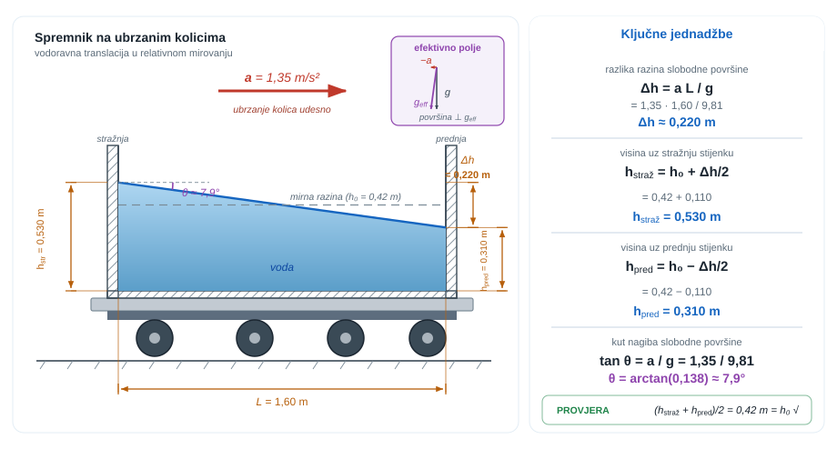
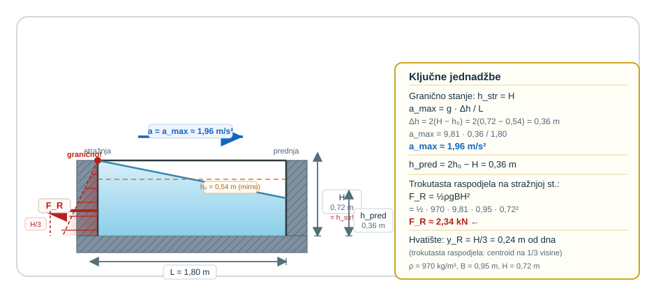
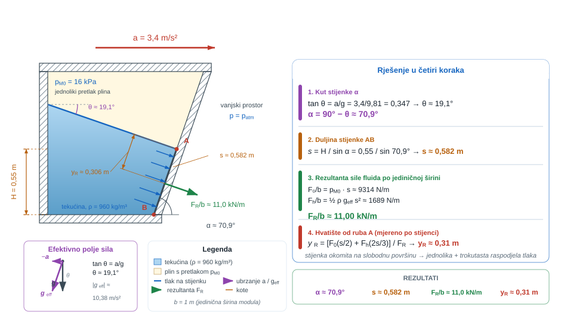
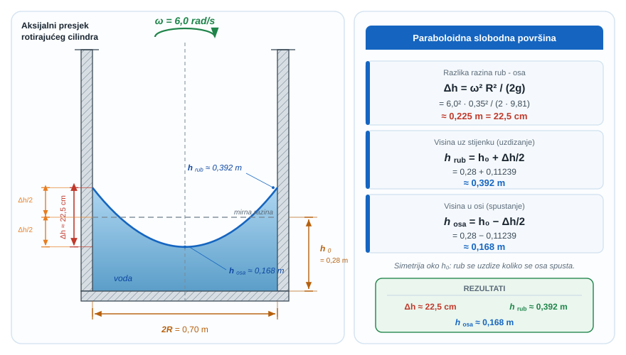
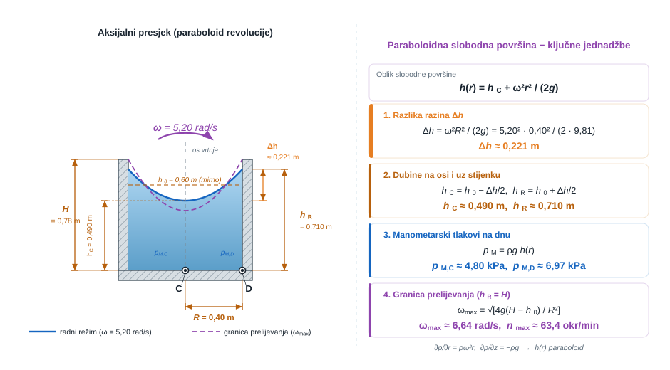
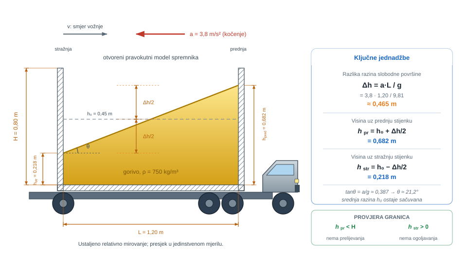
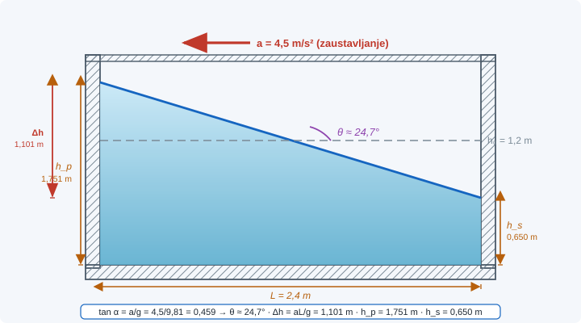
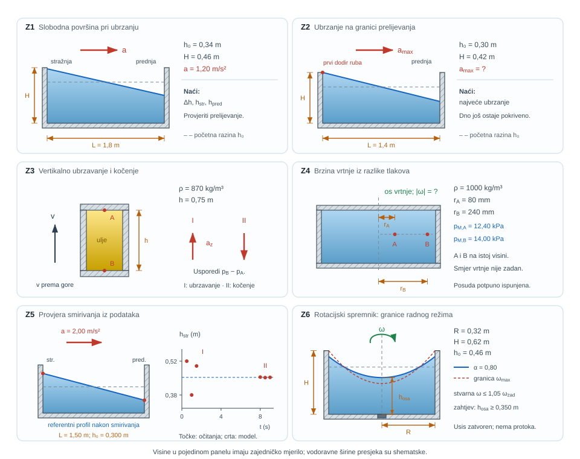

{#fig-uvod-u04 fig-align="center"}

## Relativno mirovanje kao hidrostatika u novom polju sila

Relativno mirovanje počinje ondje gdje se tekućina prema stijenkama spremnika smiri, iako se cijeli sustav i dalje ubrzava.

Središnja ideja poglavlja nije samo da se slobodna površina naginje, nego da obična hidrostatika prelazi u hidrostatiku u novom, efektivnom polju sila.

::: {.mf1-application}

Inženjerski kontekst

Relativno mirovanje vidi se svaki put kad se tekućina "smiri" u spremniku koji ipak ubrzava: pri kočenju autocisterne, pri promjeni kursa broda, u gorivnom spremniku vozila i u procesnoj kadi na ubrzanoj platformi. Isti model vrijedi i za rotaciju, pa iz ovog poglavlja izravno vode centrifuge, separatori i svi sklopovi u kojima slobodna površina i tlak ovise o efektivnom polju sila, a ne samo o gravitaciji.
:::

::: {.mf1-priprema}

Prije čitanja poglavlja

**Predznanje koje se pretpostavlja:**

- hidrostatička raspodjela tlaka iz poglavlja pog. 3Hidrostatička raspodjela tlaka i manometrija;
- kinematika i dinamika kružnog gibanja iz Fizike I (kutna brzina, centrifugalno ubrzanje);
- pojam neinercijalnog referentnog okvira i prividnih sila;
- diferencijalni račun više varijabli i osnove parcijalnih derivacija.

**Ishodi učenja:**

- prepoznati efektivno polje sila u translatorno ili rotacijski ubrzanom spremniku;
- odrediti nagib ili oblik slobodne površine fluida u nestandardnom polju sila;
- izračunati paraboloidnu slobodnu površinu rotirajućeg cilindričnog spremnika i pripadne tlakove na stijenkama;
- raspoznati granične slučajeve u kojima model relativnog mirovanja prestaje vrijediti (prelijevanje, ogoljavanje dna).

**Procijenjeno vrijeme:** 5–6 sati za teoriju i izvode, 3 sata za rješavanje primjera i zadataka.
:::

## Fizikalni uvod i matematički izvod

Ako se spremnik giba stalnim translatornim ubrzanjem i ako se nakon prolaznih oscilacija fluid smiri u odnosu na stijenke, onda se problem može čitati kao hidrostatika u neinercijskom sustavu. U tom sustavu na fluid djeluje efektivno polje sila koje je rezultat gravitacije i inercijske sile.

U tom stanju fluid se prema spremniku giba kao kruto tijelo: nema relativnog klizanja slojeva ni smičnih naprezanja koja bi nastajala zbog deformacije profila brzine. Upravo zato relativno mirovanje nije nastavak strujanja s gradijentom brzine, nego novi statički problem u promijenjenom polju sila.

Za gibanje spremnika ubrzanjem $a$ udesno, slobodna površina ostaje okomita na $\vec{g}_{eff}$, pa za bočni presjek pravokutnog spremnika vrijedi radna relacija

$$\Delta h = \frac{aL}{g}$$

::: {.callout-note}
## Fizikalno značenje
Razlika razina $\Delta h$ je izravna mjera koliko ubrzanje "naginje" slobodnu površinu. Veće ubrzanje ili dulji spremnik daje veći nagib jer inercijska pseudo-sila ima više prostora za djelovanje. Gravitacija $g$ u nazivniku je stabilizirajući član: što je veća sila teže, to manji kut postignuća pri istom ubrzanju. Formula vrijedi samo dok se površina ne prelije ili dok ne ogoli dno: ispod tih graničnih stanja vrijedi pretpostavka o ravnoj slobodnoj površini.
:::

gdje je $\Delta h$ razlika razina slobodne površine na krajevima spremnika.

Najvažnija promjena u odnosu na pog. 3Hidrostatička raspodjela tlaka i manometrija jest to da tlak više ne raste samo po dubini mjerene okomito prema dolje. Najprije treba odrediti smjer efektivnog polja sila, a tek zatim čitati geometriju slobodne površine i lokalnu dubinu.

Matematika zato ne prati "nagnutu vodu" kao poseban slučaj, nego uvodi novi vektor efektivne gravitacije. Kad se taj vektor jednom odredi, geometrija slobodne površine i raspodjela tlaka opet postaju čitljive kao u hidrostatici.

## Matematički izvod

Promatra se spremnik koji se giba stalnim translatornim ubrzanjem $\vec a$ te sustav koordinata vezan uz spremnik. U tom neinercijskom sustavu mirujući fluid mora zadovoljavati ravnotežu između gradijenta tlaka, gravitacije i inercijskoga člana. Po jedinici volumena vrijedi

$$
-\nabla p + \rho\vec g - \rho\vec a = 0,
$$

odnosno

$$
\nabla p = \rho(\vec g - \vec a) = \rho\vec g_{eff}.
$$

::: {.callout-note}
## Fizikalno značenje
Efektivno polje sila $\vec{g}_{eff}$ je vektorski zbroj gravitacije i inercijskog člana: fluid se u akceleriranom sustavu "ne zna" razlikovati je li u gravitacijskom polju ili u ubrzanom okviru. Upravo to je razlog zašto slobodna površina u ubrzanom spremniku ostaje okomita na $\vec{g}_{eff}$ – ista fizika kao i u običnoj hidrostatici, samo s novim "gravitacijskim" vektorom. U slobodnom padu ($\vec{a} = \vec{g}$) vrijedi $\vec{g}_{eff} = 0$ i hidrostatski tlak nestaje: astronauti u orbiti ne osjećaju težinu kolone tekucine.
:::

Time se uvodi efektivno polje sila $\vec g_{eff}$: fluid se u akceleriranom spremniku ponaša kao da se nalazi u novom gravitacijskom polju koje je vektorski zbroj stvarne gravitacije i suprotno usmjerene inercijske akceleracije. Za translatorno gibanje spremnika s komponentama ubrzanja $a_x$ i $a_z$, uz os $x$ vodoravno i os $z$ prema gore, slijede komponente

$$\frac{\partial p}{\partial x} = -\rho a_x, \qquad \frac{\partial p}{\partial z} = -\rho(g+a_z)$$

Klasična hidrostatika iz pog. 3Hidrostatička raspodjela tlaka i manometrija samo je poseban slučaj za $a_x = 0$ i $a_z = 0$. Jednako tako, pri slobodnom padu s $a_z = -g$ nestaje hidrostatički porast tlaka po visini, jer cijeli fluidni stupac ubrzava zajedno sa spremnikom. U najčešćem slučaju vodoravnog ubrzanja udesno vrijedi $a_x = a$ i $a_z = 0$, pa se relacija svodi na poznati zapis

$$\frac{\partial p}{\partial x} = -\rho a, \qquad \frac{\partial p}{\partial z} = -\rho g$$

Na slobodnoj površini tlak je konstantan, pa diferencijal promjene tlaka po samoj površini mora biti jednak nuli:

$$dp = \frac{\partial p}{\partial x}dx + \frac{\partial p}{\partial z}dz = 0$$

Uvrštavanjem parcijalnih derivacija dobiva se

$$-\rho a_x\,dx - \rho (g+a_z)\,dz = 0$$

odnosno nakon skraćivanja s $\rho$

$$\frac{dz}{dx} = -\frac{a_x}{g+a_z}$$

Za čisti vodoravni slučaj ponovno slijedi

$$\frac{dz}{dx} = -\frac{a}{g}$$

što znači da je slobodna površina okomita na vektor $\vec g_{eff}$. Za pravokutni spremnik duljine $L$ integracija nagiba preko cijele duljine daje

$$
\Delta h = \frac{aL}{g}.
$$

Fizikalno značenje relacije jest neposredno: što je spremnik dulji i što je ubrzanje veće, to je veća razlika razina između krajeva, dok gravitacija $g$ djeluje kao stabilizirajući član koji površinu vraća prema vodoravnom položaju.

::: {.mf1-izvod}

Matematički izvod — Coriolisova sila u relativnom mirovanju — zašto nestaje

Pri rotirajućem spremniku puni oblik prividnih sila u neinercijalnom (rotirajućem) okviru sadrži tri člana: centrifugalnu silu $-\rho\vec{\omega}\times(\vec{\omega}\times\vec{r})$, Eulerovu silu $-\rho\dot{\vec{\omega}}\times\vec{r}$ (koja iščezava pri konstantnoj kutnoj brzini) i **Coriolisovu silu** $-2\rho\vec{\omega}\times\vec{v}_{rel}$, koja djeluje samo kad fluid ima brzinu u rotirajućem okviru.

U stanju relativnog mirovanja $\vec{v}_{rel} = 0$, pa Coriolisov član automatski iščezava

$$
-2\rho\vec{\omega}\times\vec{v}_{rel} = 0.
$$

Ravnoteža sila po jedinici volumena svodi se zato na

$$
\nabla p = \rho\vec{g}_{eff} = \rho\vec{g} - \rho\vec{\omega}\times(\vec{\omega}\times\vec{r}),
$$

a centrifugalni član u cilindričnim koordinatama (kutna brzina $\vec{\omega} = \omega\hat{z}$, vektor položaja $\vec{r} = r\hat{r}$) daje radijalnu komponentu efektivnog ubrzanja $a_{cf} = \omega^2 r$. Coriolisova sila se vraća u igru čim fluid počne strujati u rotirajućem okviru (npr. radijalni transport u centrifugalnoj crpki), gdje je glavni izvor odvajanja toka i ograničenja efikasnosti.
:::

::: {.mf1-izvod}

Matematički izvod — Volumno očuvanje paraboloida — eksplicitan izvod

Za rotirajući cilindrični spremnik s vodom radijusa $R$ i početne mirne visine $h_0$, slobodna površina pri vrtnji kutnom brzinom $\omega$ poprima oblik paraboloida $h(r) = h_C + \omega^2 r^2/(2g)$, gdje je $h_C$ visina u središtu. Vrijednosti $h_C$ i $h_R$ (uz stijenku) povezuju se zakonom očuvanja volumena vode prije i poslije početka vrtnje.

Volumen vode u rotirajućem spremniku računa se integralom

$$
V = \int_0^R 2\pi r \cdot h(r)\,dr = \int_0^R 2\pi r\!\left(h_C + \frac{\omega^2 r^2}{2g}\right)dr.
$$

Integracija po članovima daje

$$
V = 2\pi\!\left[\frac{h_C r^2}{2} + \frac{\omega^2 r^4}{8g}\right]_0^R = \pi R^2 h_C + \frac{\pi \omega^2 R^4}{4g}.
$$

Volumen vode u mirovanju je $V_0 = \pi R^2 h_0$, a zakon očuvanja $V = V_0$ daje

$$
\pi R^2 h_C + \frac{\pi \omega^2 R^4}{4g} = \pi R^2 h_0,
$$

odakle slijedi visina u središtu

$$
h_C = h_0 - \frac{\omega^2 R^2}{4g}.
$$

Iz definicije paraboloida $h_R = h_C + \omega^2 R^2/(2g)$ izravno se dobiva visina uz stijenku

$$
h_R = h_0 + \frac{\omega^2 R^2}{4g}.
$$

Zbroj i srednja vrijednost daju karakterističnu jednakost $(h_C + h_R)/2 = h_0$ — visina rasta uz stijenku jednaka je padu visine u središtu, što je geometrijska posljedica simetrije paraboloida i očuvanja mase.

Granični uvjet **ogoljavanja dna** dolazi iz $h_C = 0$:

$$
\omega_{crit}^{ogol} R^2 = 4 g h_0 \quad\Longrightarrow\quad \omega_{crit}^{ogol} = \frac{2\sqrt{g h_0}}{R},
$$

dok granični uvjet **prelijevanja** preko ruba spremnika visine $H$ slijedi iz $h_R = H$:

$$
\omega_{crit}^{prel} = \frac{2\sqrt{g(H - h_0)}}{R}.
$$

Iz dvaju graničnih uvjeta jasno se vidi koja se pojava javlja prva: ako je spremnik plitko ispunjen (mali $h_0$ u odnosu na $H - h_0$), prelijevanje će se dogoditi prije ogoljavanja, i obrnuto.
:::

## Riješeni primjeri

::: {.mf1-we}

Riješeni primjer — Otvoreni spremnik na laboratorijskim kolicima&nbsp;T2

**Kontekst:** Otvoreni pravokutni spremnik na laboratorijskim kolicima giba se vodoravno stalnim ubrzanjem. U relativnom mirovanju treba odrediti nagib slobodne površine i visine uz stijenke.

**Zadano**

- Duljina spremnika: $L = 1{,}60\ \text{m}$
- Širina spremnika: $B = 0{,}80\ \text{m}$
- Početna mirna visina vode: $h_0 = 0{,}42\ \text{m}$
- Vodoravno ubrzanje udesno: $a = 1{,}35\ \text{m/s}^2$

**Traženo**

1. razliku razina slobodne površine između stražnje i prednje stijenke.
2. visinu vode uz stražnju i prednju stijenku.
3. kut nagiba slobodne površine prema vodoravnici.

**Pretpostavke i model**

Promatra se translatorno ubrzanje bez prelijevanja i bez ogoljavanja dna. Zato je slobodna površina ravna, a srednja visina tekućine ostaje jednaka početnoj vrijednosti $h_0$.

**Rješenje**

Za vodoravno ubrzani spremnik vrijedi osnovna relacija

$$
\Delta h = \frac{aL}{g} = \frac{1{,}35 \cdot 1{,}60}{9{,}81} = 0{,}220\ \text{m} \approx 22{,}0\ \text{cm}.
$$

Kako nema gubitka volumena, srednja visina ostaje $(h_{stražnja} + h_{prednja})/2 = h_0 = 0{,}42\ \text{m}$ a razlika visina je $h_{stražnja} - h_{prednja} = \Delta h = 0{,}220\ \text{m}$. Rješavanjem tog sustava slijedi

$$
h_{stražnja} = h_0 + \frac{\Delta h}{2} = 0{,}42 + 0{,}110 = 0{,}530\ \text{m},
$$

$$
h_{prednja} = h_0 - \frac{\Delta h}{2} = 0{,}42 - 0{,}110 = 0{,}310\ \text{m}.
$$

Kut nagiba slobodne površine dobiva se iz efektnog polja sila:

$$
{}\tan\theta = \frac{a}{g} = \frac{1{,}35}{9{,}81} = 0{,}138 \quad \Longrightarrow \quad {}\theta = \arctan(0{,}138) \approx 7{,}9^\circ.
$$

**Provjera i komentar**

Pri zadanom ubrzanju slobodna površina povisi se na stražnjoj strani za oko $11\ \text{cm}$ i jednako toliko padne na prednjoj strani. To je upravo najjednostavniji ulaz u relativno mirovanje prije nego što se uključe granični uvjeti prelijevanja ili sila na stijenci.

1. Ako je ubrzanje nula, mora biti i $\Delta h = 0$.
2. Kod gibanja udesno razina mora biti viša na stražnjoj strani spremnika.
3. Dobivene dubine moraju ostati pozitivne ako nema ogoljavanja dna, što je ovdje zadovoljeno.
:::

::: {.mf1-we}

Riješeni primjer — Procesna kada na automatskoj platformi&nbsp;T2

**Kontekst:** Procesna kada s rashladnom tekućinom prevozi se na ubrzanoj platformi. Treba odrediti najveće ubrzanje prije prelijevanja, visine uz stijenke u graničnom stanju i rezultantnu silu na stražnju stijenku.

**Zadano**

- Duljina kade: $L = 1{,}80\ \text{m}$
- Visina kade: $H = 0{,}72\ \text{m}$
- Širina kade: $B = 0{,}95\ \text{m}$
- Gustoća rashladne tekućine: $\rho = 970\ \text{kg/m}^3$
- Početna mirna visina: $h_0 = 0{,}54\ \text{m}$

**Traženo**

1. Odredite najveće dopušteno ubrzanje $a_{max}$ pri kojem tekućina još ne prelijeva preko ruba kade.
2. Za to granično stanje odredite visinu tekućine uz stražnju i prednju stijenku.
3. Odredite rezultantnu silu fluida na stražnju vertikalnu stijenku po punoj širini kade.

Zanemarite valjanje, površinsku napetost i prolazne oscilacije.

**Pretpostavke i model**

Slobodna površina je ravna, a u graničnom stanju prelijevanja dodiruje gornji rub stražnje stijenke. Sve dok tekućina još ne prelijeva, srednja visina ostaje jednaka početnoj vrijednosti $h_0$.

**Rješenje**

Za granično stanje vrijedi $h_{stražnja} = H = 0{,}72\ \text{m}$, a iz očuvanja srednje visine $(h_{stražnja} + h_{prednja})/2 = h_0$ slijedi

$$
h_{prednja} = 2h_0 - h_{stražnja} = 2 \cdot 0{,}54 - 0{,}72 = 0{,}36\ \text{m}.
$$

Razlika razina slobodne površine tada iznosi $\Delta h = h_{stražnja} - h_{prednja} = 0{,}36\ \text{m}$, pa je maksimalno ubrzanje

$$
a_{max} = g \frac{\Delta h}{L} = 9{,}81 \cdot \frac{0{,}36}{1{,}80} = 1{,}962\ \text{m/s}^2 \approx 1{,}96\ \text{m/s}^2.
$$

Za stražnju stijenku raspodjela tlaka je trokutasta, jer slobodna površina prolazi kroz njezin gornji rub. Rezultantna sila po punoj širini stijenke zato glasi

$$
F_R = \frac{1}{2} \rho g B h_{stražnja}^2 = \frac{1}{2} \cdot 970 \cdot 9{,}81 \cdot 0{,}95 \cdot 0{,}72^2 = 2343\ \text{N} \approx 2{,}34\ \text{kN}.
$$

Ako se želi i položaj hvatišta rezultante, ono je za trokutastu raspodjelu na visini $h_{stražnja}/3 = 0{,}24\ \text{m}$ od dna.

**Provjera i komentar**

1. Dobiveno ubrzanje je reda $0{,}20g$, što je fizikalno razumno za granično stanje bez prelijevanja.
2. Prednja dubina ostaje pozitivna, pa nema ogoljavanja dna uz prednju stijenku.
3. Sila reda nekoliko kilonjutna razumna je za gotovo metar široku stijenku i dubinu fluida oko $0{,}7\ \text{m}$.
:::

::: {.mf1-we}

Riješeni primjer — Zatvoreni servisni modul s kosom inspekcijskom stijenkom&nbsp;T2

**Kontekst:** Zatvoreni transportni modul s tehnološkom tekućinom i plinskim pretlakom ubrzava se vodoravno. Treba postaviti inspekcijsku stijenku tako da bude okomita na slobodnu površinu te odrediti silu i hvatište rezultante.

**Zadano**

- Gustoća tehnološke tekućine: $\rho = 960\ \text{kg/m}^3$
- Jednoliki pretlak iznad slobodne površine: $p_{M0} = 16\ \text{kPa}$
- Vodoravno ubrzanje modula: $a = 3{,}4\ \text{m/s}^2$
- Vertikalna visina od ruba `A` do dna `B`: $H = 0{,}55\ \text{m}$
- Širina modula: $b = 1\ \text{m}$ (jedinična)

**Traženo**

1. kut ${}\alpha$ pod kojim stijenku `AB` treba postaviti prema vodoravnici.
2. duljinu stijenke `AB`.
3. rezultantnu silu fluida na stijenku `AB` po jediničnoj širini modula.
4. udaljenost hvatišta rezultante od gornjeg ruba `A`, mjerenu po stijenci.

Zanemari prolazne oscilacije i promjenu gustoće plina iznad tekućine.

**Pretpostavke i model**

Slobodna površina i u zatvorenom modulu mora biti okomita na efektivno polje sila $\vec{g}_{eff}$. Budući da je u plinskom prostoru iznad tekućine tlak jednolik, na gornjem rubu `A` tlak je jednak $p_{M0}$, a duž stijenke `AB` zatim linearno raste zbog efektivne težine fluida.

**Rješenje**

Najprije odredimo kut nagiba slobodne površine iz osnovne relacije relativnog mirovanja:

$$
{}\tan\theta = \frac{a}{g} = \frac{3{,}4}{9{,}81} = 0{,}347 \quad \Longrightarrow \quad {}\theta = \arctan(0{,}347) \approx 19{,}1^\circ.
$$

Ako slobodna površina mora biti okomita na stijenku `AB`, tada stijenka mora zatvarati s vodoravnicom kut

$$
{}\alpha = 90^\circ - {}\theta = 90^\circ - 19{,}1^\circ = 70{,}9^\circ \approx 71^\circ.
$$

Duljina stijenke slijedi iz zadane vertikalne projekcije $H$:

$$
s = \frac{H}{\sin\alpha} = \frac{0{,}55}{\sin 70{,}9^\circ} \approx 0{,}582\ \text{m}.
$$

Efektivna težina po jedinici mase ima iznos

$$
g_{eff} = \sqrt{g^2 + a^2} = \sqrt{9{,}81^2 + 3{,}4^2} \approx 10{,}38\ \text{m/s}^2.
$$

Na stijenci `AB` djeluju dvije komponente sile po jediničnoj širini modula:

1. jednolika komponenta zbog plinskog pretlaka.
2. linearno rastuća komponenta zbog raspodjele tlaka u tekućini uz $g_{eff}$.

Ploha stijenke po jediničnoj širini modula iznosi $A_{AB} = s \cdot 1 = 0{,}582\ \text{m}^2$. Jednolika komponenta sile zato glasi

$$
F_0 = p_{M0} A_{AB} = 16\,000 \cdot 0{,}582 = 9312\ \text{N}.
$$

Hidrostatski porast uz stijenku daje trokutastu komponentu

$$
F_h = \frac{1}{2} \rho g_{eff} s^2 \cdot 1 = \frac{1}{2} \cdot 960 \cdot 10{,}38 \cdot 0{,}582^2 \approx 1688\ \text{N}.
$$

Ukupna rezultantna sila po jediničnoj širini modula iznosi

$$
F_R = F_0 + F_h = 9312 + 1688 = 11\,000\ \text{N} \approx 11{,}0\ \text{kN/m}.
$$

Za položaj hvatišta mjerimo udaljenost $y_R$ od ruba `A` po stijenci. Jednolika komponenta djeluje u polovini duljine $s/2$, a trokutasta u točki $2s/3$ od `A`, pa je

$$
y_R = \frac{F_0 \cdot (s/2) + F_h \cdot (2s/3)}{F_R} = \frac{9312 \cdot 0{,}291 + 1688 \cdot 0{,}388}{11\,000} \approx 0{,}306\ \text{m} \approx 0{,}31\ \text{m}
$$

ispod ruba `A`, mjereno uzduž stijenke.

**Provjera i komentar**

1. Budući da je $a < g$, kut ${}\alpha$ mora ostati veći od $45^\circ$, što je ovdje zadovoljeno.
2. Da nema plinskog pretlaka, hvatište bi bilo dublje prema $2s/3$; ovdje ga jednolika komponenta vraća bliže sredini stijenke.
3. Ukupna sila mora biti veća od same hidrostatske komponente, a razumna je i to da pretlak ovdje nosi veći dio opterećenja.
:::

::: {.mf1-we}

Riješeni primjer — Rotirajući cilindrični spremnik bez prelijevanja&nbsp;T2

**Kontekst:** Otvoreni cilindrični spremnik s vodom vrti se oko svoje osi konstantnom kutnom brzinom. Slobodna površina prelazi u paraboloid, a treba odrediti razliku razina i visine uz rub i u osi.

**Zadano**

- Polumjer spremnika: $R = 0{,}35\ \text{m}$
- Početna srednja visina vode: $h_0 = 0{,}28\ \text{m}$
- Kutna brzina vrtnje: $\omega = 6{,}0\ \text{rad/s}$

**Traženo**

1. razliku razina slobodne površine između stijenke i osi spremnika $\Delta h$.
2. visinu slobodne površine uz stijenku $h_{rub}$.
3. visinu slobodne površine na osi spremnika $h_{osa}$.

Zanemari prelijevanje i pretpostavi da volumen vode ostaje isti.

{#fig-u04-rotirajuci-cilindar fig-align="center"}

**Pretpostavke i model**

U relativnom mirovanju pri rotaciji slobodna površina prelazi u paraboloid, ali se za osnovni proračun najprije može čitati razlika razina između ruba i osi. Kako nema prelijevanja, srednja visina ostaje jednaka početnoj vrijednosti $h_0$.

**Rješenje**

Razlika razina između stijenke i osi iznosi

$$
\Delta h = \frac{\omega^2 R^2}{2g} = \frac{6{,}0^2 \cdot 0{,}35^2}{2 \cdot 9{,}81} = 0{,}225\ \text{m} \approx 22{,}5\ \text{cm}.
$$

Kako volumen ostaje isti, srednja visina ostaje $h_0 = (h_{rub} + h_{osa})/2$. Zato je visina uz stijenku

$$
h_{rub} = h_0 + \frac{\Delta h}{2} = 0{,}28 + \frac{0{,}225}{2} = 0{,}3925\ \text{m} \approx 0{,}393\ \text{m}.
$$

Visina na osi spremnika iznosi

$$
h_{osa} = h_0 - \frac{\Delta h}{2} = 0{,}28 - \frac{0{,}225}{2} = 0{,}1675\ \text{m} \approx 0{,}168\ \text{m}.
$$

**Provjera i komentar**

1. Veća kutna brzina mora povećati razliku razina jer je $\Delta h \propto \omega^2$.
2. Ako nema prelijevanja, visina uz rub i visina u osi moraju ostati simetrične oko srednje visine $h_0$.
3. Visina na osi mora pasti, a visina uz stijenku porasti u odnosu na početnu ravnu razinu.
:::

::: {.mf1-ch}

Cjeloviti zadatak — rotirajući cilindrični spremnik s granicom prelijevanja&nbsp;T3

**Kontekst:** U procesnom postrojenju otvoreni cilindrični spremnik s vodom vrti se oko vertikalne osi konstantnom kutnom brzinom. Treba odrediti oblik paraboloidne slobodne površine, dubinske tlakove na dnu te granični broj okretaja prije prelijevanja preko ruba.

**Zadano**

- Unutarnji polumjer otvorenog cilindričnog spremnika: $R = 0{,}40\ \text{m}$
- Unutarnja visina spremnika: $H = 0{,}78\ \text{m}$
- Gustoća vode: $\rho = 1000\ \text{kg/m}^3$
- Mirna razina vode: $h_0 = 0{,}60\ \text{m}$
- Kutna brzina vrtnje oko okomite osi: $\omega = 5{,}20\ \text{rad/s}$

Nakon prolaznog razdoblja voda se postavi u relativno mirovanje kao kruto rotirajuće tijelo.

**Traženo**

1. razliku razina slobodne površine između stijenke i osi spremnika $\Delta h$.
2. dubinu vode na osi spremnika $h_C$ i uz stijenku $h_R$.
3. manometarski tlak na dnu u središnjoj točki `C` i u rubnoj točki `D`.
4. najveći dopušteni broj okretaja prije prelijevanja, izražen kao $\omega_{max}$ i $n_{max}$ u okr/min.

Zanemari površinsku napetost, valjanje i otpor zraka.

**Pretpostavke i model**

U stanju relativnog mirovanja pri vrtnji fluid se opet giba kao kruto tijelo, ali sada s konstantnom kutnom brzinom $\omega$. Zato u cilindričnim koordinatama vrijedi da tlak radijalno raste prema stijenci, a po visini i dalje opada zbog gravitacije:

$$
\frac{\partial p}{\partial r} = \rho \omega^2 r, \qquad \frac{\partial p}{\partial z} = -\rho g
$$

::: {.callout-note}
## Fizikalno značenje
Prva jednadžba kaže da tlak radijalno raste prema stjenci jer centrifugalna pseudo-sila gura fluid prema van: više $r$, više tlaka. Druga jednadžba je ista stara hidrostatika po visini. Zajedno definiraju "dvosmjerni" tlak u rotirajućem spremniku: po radijusu raste, po visini pada. Zato na slobodnoj površini mora postojati parabolični kompromis između tih dviju tendencija.
:::

Iz toga slijedi da slobodna površina i druge plohe stalnog tlaka više nisu ravnine nego paraboloidi revolucije. U aksijalnom presjeku zato vrijedi parabola

$$
h(r) = h_C + \frac{\omega^2 r^2}{2g}
$$

::: {.callout-note}
## Fizikalno značenje
Parabola $h(r) = h_C + \omega^2 r^2/(2g)$ opisuje oblik slobodne površine: na osi vrtnje površina je najniža ($h_C$), a prema stjenci raste kvadratno. Veća kutna brzina $\omega$ ili veći polumjer $R$ daju strmiji paraboloid. Faktor $2g$ u nazivniku dolazi od integracije centrifugalnog ubrzanja $\omega^2 r$ po radijusu – isti tip kao $v^2/(2g)$ u Bernoullijevoj jednadžbi koja slijedi u pog. 9Bernoullijeva jednadžba idealnog fluida.
:::

::: {.mf1-interaktivno}

Interaktivni prikaz — Paraboloidna slobodna površina

Interaktivni prikaz omogućuje mijenjanje kutne brzine $\omega$, polumjera spremnika $R$ i početne visine $h_0$ uz neposredno praćenje paraboloidne slobodne površine. Visina u središtu i na rubu spremnika ažuriraju se u realnom vremenu.

**Pitanja za samostalno istraživanje:** (a) Pri kojoj kombinaciji $\omega$ i $R$ središte spremnika počinje ogoljavati? (b) Ako se polumjer udvostruči uz konstantne $\omega$ i $h_0$, kako se mijenja razlika $z_R - z_d$? (c) Vrijedi li volumno očuvanje između paraboloida iznad razine $h_0$ i praznog prostora ispod nje?

:::

::: {.callout-note}
## Razrada koraka
Korak: $\partial p/\partial r = \rho\omega^2 r$ i $\partial p/\partial z = -\rho g$ $\;\Rightarrow\;$ $h(r) = h_C + \omega^2 r^2/(2g)$

Na slobodnoj površini vrijedi $dp = 0$, pa:
$$
0 = \frac{\partial p}{\partial r}\,dr + \frac{\partial p}{\partial z}\,dz = \rho\omega^2 r\,dr - \rho g\,dz.
$$
Dijeljenje s $\rho g$ i premještanje članova:
$$
\frac{dz}{dr} = \frac{\omega^2 r}{g}.
$$
Integracija od osi ($r = 0$, $z = h_C$) do radijusa $r$:
$$
z(r) = h_C + \frac{\omega^2}{g}\int_0^r r'\,dr' = h_C + \frac{\omega^2 r^2}{2g}.
$$
:::

gdje je $r$ udaljenost od osi vrtnje. Budući da nema prelijevanja pri zadanom režimu, ukupni volumen vode ostaje isti pa je srednja visina i dalje jednaka početnoj vrijednosti $h_0$.

**Rješenje**

#### 1. Razlika razina slobodne površine

Iz izraza za paraboloidnu slobodnu površinu razlika između stijenke i osi spremnika iznosi

$$
\Delta h = h_R - h_C = \frac{\omega^2 R^2}{2g} = \frac{5{,}20^2 \cdot 0{,}40^2}{2 \cdot 9{,}81} = 0{,}2205\ \text{m} \approx 22{,}1\ \text{cm}.
$$

#### 2. Dubina na osi i uz stijenku

Kako se volumen nije promijenio, srednja visina ostaje $h_0 = (h_C + h_R)/2$, uz relaciju $h_R - h_C = \Delta h$. Zato je

$$
h_C = h_0 - \frac{\Delta h}{2} = 0{,}60 - \frac{0{,}2205}{2} = 0{,}4897\ \text{m} \approx 0{,}490\ \text{m},
$$

$$
h_R = h_0 + \frac{\Delta h}{2} = 0{,}60 + \frac{0{,}2205}{2} = 0{,}7103\ \text{m} \approx 0{,}710\ \text{m}.
$$

#### 3. Tlak na dnu u točkama `C` i `D`

Na dnu spremnika lokalni manometarski tlak dobiva se iz lokalne dubine ispod slobodne površine. U osi spremnika vrijedi

$$
p_{M,C} = \rho g h_C = 1000 \cdot 9{,}81 \cdot 0{,}4897 = 4804\ \text{Pa} \approx 4{,}80\ \text{kPa}.
$$

Uz stijenku je dubina veća, pa je

$$
p_{M,D} = \rho g h_R = 1000 \cdot 9{,}81 \cdot 0{,}7103 = 6968\ \text{Pa} \approx 6{,}97\ \text{kPa}.
$$

#### 4. Granica prelijevanja

Do prelijevanja dolazi kada slobodna površina uz stijenku dosegne rub spremnika, odnosno kada je

$$
h_R = H
$$

Kako za rotaciju bez gubitka volumena vrijedi $h_R = h_0 + \omega^2 R^2/(4g)$, granična kutna brzina zadovoljava $H = h_0 + \omega_{max}^2 R^2/(4g)$, pa je

$$
\omega_{max} = \sqrt{\frac{4g(H-h_0)}{R^2}} = \sqrt{\frac{4 \cdot 9{,}81 \cdot (0{,}78-0{,}60)}{0{,}40^2}} = 6{,}64\ \text{rad/s}.
$$

Broj okretaja tada iznosi

$$
n_{max} = \frac{60\omega_{max}}{2\pi} = \frac{60 \cdot 6{,}64}{2\pi} = 63{,}4\ \text{okr/min}.
$$

**Provjera i komentar**

Pri radnoj brzini vrtnje slobodna površina podigne se uz stijenku za oko $22{,}1\ \text{cm}$ u odnosu na os spremnika. Time dubina u osi padne na oko $0{,}490\ \text{m}$, a uz stijenku naraste na oko $0{,}710\ \text{m}$. Zato je manometarski tlak na dnu u središtu oko $4{,}80\ \text{kPa}$, a uz stijenu oko $6{,}97\ \text{kPa}$. Granica prelijevanja nastupa tek pri oko $6{,}64\ \text{rad/s}$, odnosno oko $63{,}4\ \text{okr/min}$.

1. Uz stijenku dubina mora biti veća nego na osi, jer se slobodna površina pri vrtnji podiže prema rubu.
2. Ako je $\omega = 0$, paraboloid se mora vratiti na ravnu slobodnu površinu i opet vrijedi $h_C = h_R = h_0$.
3. Budući da je pri radnom režimu $h_R < H$, spremnik još ne prelijeva, što je u skladu s dobivenom sigurnosnom rezervom do ruba.
:::

::: {.mf1-we}

Riješeni primjer — Nagib goriva u spremniku autocisterne pri kočenju &nbsp;T2

**Primjer za strojare**

**Kontekst:** Autocisterna za gorivo s pravokutnim spremnikom kočenjem usporava. Posuje li gorivo na gornji rubnik stijenke i hoće li se pumpa za pražnjenje na stražnjoj stijenci izložiti zraku?

**Zadano**

- Duljina spremnika: $L = 1{,}20\ \text{m}$ (u smjeru vožnje)
- Početna mirna visina goriva: $h_0 = 0{,}45\ \text{m}$
- Visina spremnika: $H = 0{,}80\ \text{m}$
- Usporenje pri kočenju: $a = 3{,}8\ \text{m/s}^2$
- Gustoća goriva: $\rho = 750\ \text{kg/m}^3$

**Traženo**

1. Razlika razina između prednje i stražnje stijenke.
2. Visina goriva uz svaku stijenku.
3. Hoće li doći do prelijevanja ili ogoljavanja dna?

{#fig-u04-autocisterna-kocenje fig-align="center"}

**Pretpostavke i model**

Kočenje je jednoliko usporavanje (a = konst.). Fluid se smatra nestlačivim, bez prelaznih valova. Srednja visina goriva ostaje $h_0$ jer nema prelijevanja.

**Rješenje**

Razlika razina (gorivo se pri kočenju giba prema naprijed, tj. prema prednjoj stijenci):

$$
\Delta h = \frac{aL}{g} = \frac{3{,}8 \cdot 1{,}20}{9{,}81} = 0{,}465\ \text{m}
$$

Visina uz prednju stijenku (podignut nivo):

$$
h_{prednja} = h_0 + \frac{\Delta h}{2} = 0{,}45 + 0{,}233 = 0{,}683\ \text{m}
$$

Visina uz stražnju stijenku (snižen nivo):

$$
h_{stražnja} = h_0 - \frac{\Delta h}{2} = 0{,}45 - 0{,}233 = 0{,}217\ \text{m}
$$

**Provjera i komentar**

Prednja stijenka dostiže $h = 0{,}683\ \text{m}$ što je ispod vrha ($H = 0{,}80\ \text{m}$) – nema prelijevanja. Stražnja stijenka zadržava $0{,}217\ \text{m}$ – pumpa za pražnjenje nije izložena zraku. Pri strožem kočenju ($a > 5{,}0\ \text{m/s}^2$) prednji zid bi bio natopljeniji od ruba, a pri $a > 7{,}4\ \text{m/s}^2$ dno stražnje strane bi se ogolilo. Ova analiza opravdava ograničenja brzine punjenja i kočenja kod autocisterni.

:::

::: {.mf1-we}

Riješeni primjer — Vodena cisterna vatrogasnog vozila pri naglom zaustavljanju &nbsp;T2

**Primjer za građevinare**

**Kontekst:** Vatrogasno vozilo s pravokutnim cisternama za vodu naglo se zaustavlja da bi zauzelo položaj. Projektant provjerava hoće li sile na prednju stjenku cisterne i stanje razine ostati u prihvatljivim granicama.

**Zadano**

- Duljina cisterne: $L = 2{,}40\ \text{m}$
- Mirna razina vode: $h_0 = 1{,}20\ \text{m}$
- Visina cisterne: $H = 1{,}60\ \text{m}$
- Usporenje: $a = 4{,}5\ \text{m/s}^2$

**Traženo**

1. Razlika razina slobodne površine.
2. Visina vode uz prednju i stražnju stijenku.
3. Kut nagiba slobodne površine prema vodoravnici.

{#fig-u04-vatrogasna-cisterna fig-align="center"}

**Pretpostavke i model**

Jednoliko usporavanje, ravna slobodna površina, bez prelijevanja.

**Rješenje**

$$
\Delta h = \frac{aL}{g} = \frac{4{,}5 \cdot 2{,}40}{9{,}81} = 1{,}101\ \text{m}
$$

$$
h_{prednja} = 1{,}20 + \frac{1{,}101}{2} = 1{,}751\ \text{m}
$$

$$
h_{stražnja} = 1{,}20 - \frac{1{,}101}{2} = 0{,}650\ \text{m}
$$

$$
\tan\theta = \frac{a}{g} = \frac{4{,}5}{9{,}81} = 0{,}459 \quad\Rightarrow\quad \theta \approx 24{,}7^\circ
$$

**Provjera i komentar**

Prednja stijenka doseže $1{,}751\ \text{m}$ – blizu vrha $H = 1{,}60\ \text{m}$! Dolazi do prelijevanja: pretpostavka ravne površine bez prelijevanja nije zadovoljena. U stvarnosti dizajn ovakve cisterne treba uključiti bafle (pregradne ploče) koje ograničavaju nagib slobodne površine i dinamičke sile na stijenke.

:::

::: {.mf1-we}

Riješeni primjer — Laboratorijska centrifuga za odvajanje plazme od eritrocita &nbsp;T2

**Kontekst:** U medicinskim i biotehnološkim laboratorijima centrifuga se koristi za odvajanje krvnih komponenti različite gustoće. Cijevi s uzorkom postavljaju se u rotor koji se okreće velikom kutnom brzinom; centrifugalno polje, mnogo jače od gravitacije, gura gušće sastojke (eritrocite, $\rho \approx 1095\ \text{kg/m}^3$) prema dnu cijevi, dok lakša plazma ($\rho \approx 1025\ \text{kg/m}^3$) ostaje pri vrhu.

**Zadano**

- Broj okretaja rotora: $n = 4000$ o/min
- Polumjer dna cijevi od osi rotacije: $r_d = 95\ \text{mm}$
- Polumjer vrha cijevi od osi rotacije: $r_v = 25\ \text{mm}$
- Gustoća uzorka pune krvi: $\rho = 1060\ \text{kg/m}^3$

**Traženo**

1. Kutna brzina $\omega$ u rad/s;
2. Centrifugalno ubrzanje na dnu cijevi izraženo u jedinicama $g$;
3. Razlika tlakova između dna i vrha cijevi unutar uzorka.

**Pretpostavke i model**

U rotirajućem okviru fluid se nalazi u stanju relativnog mirovanja. Efektivno ubrzanje u radijalnom smjeru iznosi $a_{cf}(r) = \omega^2 r$, pa se hidrostatički zakon primjenjuje s tom radijalnom akceleracijom umjesto gravitacije. Gravitacijski doprinos zanemaruje se jer je centrifugalno ubrzanje za nekoliko redova veličine veće. Uzorak se promatra kao homogen u trenutku početka centrifugiranja (još nije došlo do potpunog razdvajanja).

**Rješenje**

Kutna brzina iznosi

$$
\omega = \frac{2\pi n}{60} = \frac{2\pi \cdot 4000}{60} \approx 418{,}9\ \text{rad/s}.
$$

Centrifugalno ubrzanje na dnu cijevi:

$$
a_{cf} = \omega^2 r_d = 418{,}9^2 \cdot 0{,}095 \approx 1{,}666 \cdot 10^4\ \text{m/s}^2.
$$

Izraženo u jedinicama gravitacije:

$$
\frac{a_{cf}}{g} = \frac{1{,}666 \cdot 10^4}{9{,}81} \approx 1{,}699 \cdot 10^3,
$$

dakle približno $1{,}70 \cdot 10^3\ g$ (oko 1700 puta veće od zemljine gravitacije).

Razlika tlakova između dna i vrha cijevi u rotirajućem fluidu jednaka je integralu radijalnog tlačnog gradijenta:

$$
\Delta p = \int_{r_v}^{r_d} \rho\omega^2 r\,\mathrm{d}r = \frac{1}{2}\rho\omega^2 (r_d^2 - r_v^2).
$$

Uvrštavanjem:

$$
\Delta p = \frac{1}{2} \cdot 1060 \cdot 418{,}9^2 \cdot (0{,}095^2 - 0{,}025^2).
$$

Računaju se redom $0{,}095^2 - 0{,}025^2 = 9{,}025 \cdot 10^{-3} - 6{,}25 \cdot 10^{-4} = 8{,}40 \cdot 10^{-3}\ \text{m}^2$ i $418{,}9^2 \approx 1{,}754 \cdot 10^5\ \text{rad}^2/\text{s}^2$:

$$
\Delta p = 0{,}5 \cdot 1060 \cdot 1{,}754 \cdot 10^5 \cdot 8{,}40 \cdot 10^{-3} \approx 7{,}81 \cdot 10^5\ \text{Pa}.
$$

Razlika tlakova zato iznosi otprilike

$$
\Delta p \approx 781\ \text{kPa} \approx 7{,}81\ \text{bar}.
$$

**Provjera i komentar**

Centrifugalno polje od oko $1700\ g$ tipično je za odvajanje krvnih komponenti u kliničkim laboratorijima; pri tom polju eritrociti dosegnu dno cijevi u nekoliko minuta. Razlika tlakova od $7{,}8\ \text{bar}$ unutar same krvi pokazuje koliko su centrifugalna polja jača od običnog hidrostatičkog tlaka u uzorku ($\rho g \Delta r \approx 0{,}73\ \text{kPa}$, što je oko 1000 puta manje). Upravo zato se centrifuge koriste i u industriji separacije, gdje je gravitacijsko odvajanje presporo ili neefikasno. Pri dizajniranju cijevi za uzorak treba uzeti u obzir i konstrukcijsku otpornost cijevi na visok unutarnji tlak: pri ovako visokim ubrzanjima, neispravno zatvorena cijev može popustiti.
:::

::: {.mf1-samoprovjera}

Provjeri sebe

Sljedeća pitanja služe za samostalnu provjeru razumijevanja prije prelaska na zadatke za vježbu.

1. Što razlikuje pristup hidrostatici u inercijalnom okviru od pristupa u ubrzanom ili rotirajućem okviru?

::: {.callout-note collapse="true"}
### Odgovor
U inercijalnom okviru jedina je vanjska sila gravitacija; u ubrzanom ili rotirajućem okviru uvodi se efektivno polje sila koje uključuje i prividne sile (translacijsku inerciju, centrifugalnu i Coriolisovu silu). Tlak i slobodna površina zatim ovise o vektoru efektivnog ubrzanja.
:::

2. Zašto slobodna površina u rotirajućem cilindričnom spremniku poprima oblik paraboloida, a ne ravnu nagnutu plohu kao u translacijskom ubrzanju?

::: {.callout-note collapse="true"}
### Odgovor
Centrifugalno ubrzanje u rotirajućem okviru linearno raste s radijalnom udaljenošću ($a = \omega^2 r$), pa integracija $\mathrm{d}z/\mathrm{d}r = \omega^2 r/g$ daje parabolu. U translacijskom ubrzanju vektor inercije je konstantan, pa slobodna površina ostaje ravna, ali nagnuta.
:::

3. Pri kojoj se kombinaciji $\omega$ i polumjera $R$ središte rotirajućeg spremnika prvi put ogoljava od tekućine?

::: {.callout-note collapse="true"}
### Odgovor
Središte se ogoljava kad visina u središtu $z_C$ padne na nulu. Iz uvjeta očuvanja volumena slijedi $z_C = h_0 - \omega^2 R^2/(4g)$, pa je granično stanje $\omega^2 R^2 = 4 g h_0$, odakle se može izračunati granična kutna brzina za poznati polumjer i početnu visinu.
:::

4. Vrijedi li model relativnog mirovanja ako se cisterna ne giba stalnim ubrzanjem nego s promjenjivim ubrzanjem (na primjer pri prelasku iz kočenja u stajanje)?

::: {.callout-note collapse="true"}
### Odgovor
Ne; model vrijedi samo nakon što se fluid "smiri" u ubrzanom okviru, što zahtijeva da ubrzanje bude približno konstantno u promatranom vremenskom intervalu. Pri brzim promjenama ubrzanja pojavljuju se prolazne oscilacije slobodne površine koje nisu obuhvaćene jednostavnim hidrostatičkim modelom.
:::
:::

## Zadaci za vježbu

::: {.mf1-vjezbe-list}
1. **T1** Otvoreni pravokutni spremnik duljine $L = 1{,}80\ \text{m}$ i početne dubine vode $h_0 = 0{,}34\ \text{m}$ giba se vodoravno stalnim ubrzanjem $a = 1{,}20\ \text{m/s}^2$. Odredi razliku razina između krajeva spremnika, lokalne dubine uz stražnju i prednju stijenku te provjeri dolazi li do prelijevanja ako je visina boka $H = 0{,}46\ \text{m}$.

	**Natuknica:** $\Delta h = aL/g$; zatim $h_{str} = h_0 + \Delta h/2$ i $h_{pred} = h_0 - \Delta h/2$; usporedi $h_{str}$ s $H$. (Rješenje: $\Delta h \approx 0{,}22\ \text{m}$; $h_{str} \approx 0{,}45\ \text{m}$, $h_{pred} \approx 0{,}23\ \text{m}$; nema prelijevanja jer je $h_{str} < H$.)

	**Skica:** da - pravokutni spremnik, vektor $a$, kosa slobodna ploha, kote $L$, $h_0$ i $H$.

2. **T1** Otvoreni spremnik duljine $L = 1{,}40\ \text{m}$ napunjen je do visine $h_0 = 0{,}30\ \text{m}$, a visina boka je $H = 0{,}42\ \text{m}$. Odredi najveće vodoravno ubrzanje prije početka prelijevanja.

	**Natuknica:** u graničnom stanju vrijedi $h_{str} = H$ i $\Delta h = 2(H-h_0)$; nakon toga $a = g\Delta h/L$. (Rješenje: $a_{max} \approx 1{,}68\ \text{m/s}^2$.)

	**Skica:** da - spremnik s rubom prelijevanja, kosa slobodna ploha i kote $L$, $h_0$, $H$.

3. **T2** Zatvoreni vertikalni cilindar potpuno ispunjen uljem gustoće $\rho = 870\ \text{kg/m}^3$ ima visinu stupca fluida $h = 0{,}75\ \text{m}$. Sustav se giba prema gore ubrzanjem $a_z = 2{,}3\ \text{m/s}^2$. Odredi razliku tlaka između dna i vrha cilindra te usporedi rezultat s mirovnim stanjem.

	**Natuknica:** koristi efektivnu težinu fluida: $\Delta p = \rho (g+a_z)h$; za usporedbu u mirovanju uzmi $\Delta p_0 = \rho gh$. (Rješenje: $\Delta p \approx 7{,}90\ \text{kPa}$; u mirovanju $\Delta p_0 \approx 6{,}40\ \text{kPa}$ — oko 23 % više.)

	**Skica:** da - vertikalni cilindar, smjer $a_z$, kote $h$ te tlakovi na vrhu i dnu.

4. **T2** Ubrzani otvoreni spremnik širine stijenke $b = 0{,}75\ \text{m}$ i duljine $L = 1{,}60\ \text{m}$ s početnom dubinom $h_0 = 0{,}36\ \text{m}$ nosi na stražnjoj stijenci hidrostatsku silu $F = 820\ \text{N}$. Odredi ubrzanje spremnika ako nema prelijevanja.

	**Natuknica:** iz sile vrati lokalnu dubinu preko $F = \rho g b h_{str}^2/2$; zatim $h_{str} = h_0 + \Delta h/2$ i $a = g\Delta h/L$. (Rješenje: $h_{str} \approx 0{,}47\ \text{m}$; $a \approx 1{,}38\ \text{m/s}^2$.)

	**Skica:** da - spremnik, stražnja stijena s rezultantom $F$, slobodna ploha i vektor $a$.

5. **T3** Cilindrična posuda radijusa $R = 0{,}28\ \text{m}$ s početnom dubinom vode $h_0 = 0{,}22\ \text{m}$ vrti se stalnom kutnom brzinom $\omega = 5{,}5\ \text{rad/s}$. Odredi porast razine uz stijenku, spuštanje razine u osi i procijeni ostaje li dno u osi potpuno prekriveno vodom.

	**Natuknica:** razlika razina je $\Delta h = \omega^2 R^2/(2g)$; uz očuvanje volumena vrijedi $h_{rub} = h_0 + \Delta h/2$ i $h_{osa} = h_0 - \Delta h/2$. (Rješenje: $\Delta h \approx 0{,}12\ \text{m}$; $h_{rub} \approx 0{,}28\ \text{m}$, $h_{osa} \approx 0{,}16\ \text{m}$ — dno u osi ostaje pokriveno.)

	**Skica:** da - aksijalni presjek posude, parabolična slobodna ploha, kote $R$, $h_0$, $h_{rub}$ i $h_{osa}$.

6. **T3** Otvoreni cilindrični spremnik polumjera $R = 0{,}32\ \text{m}$ i visine $H = 0{,}62\ \text{m}$ ispunjen je vodom do početne srednje visine $h_0 = 0{,}46\ \text{m}$. Odredi najveću kutnu brzinu pri kojoj još nema prelijevanja. Zatim za radni režim $\omega = 0{,}80\,\omega_{max}$ odredi dubinu vode u osi i uz stijenu te manometarske tlakove na dnu u tim dvjema točkama.

	**Natuknica:** u graničnom stanju vrijedi $h_{rub} = H = h_0 + \omega_{max}^2 R^2/(4g)$; za radni režim najprije nađi $\Delta h = \omega^2 R^2/(2g)$, zatim $h_{osa}$ i $h_{rub}$, a tlakove iz $p_M = \rho gh$. (Rješenje: $\omega_{max} \approx 7{,}83\ \text{rad/s}$; pri $\omega = 0{,}80\,\omega_{max}$: $h_{osa} \approx 0{,}36\ \text{m}$, $h_{rub} \approx 0{,}56\ \text{m}$; $p_{M,osa} \approx 3{,}51\ \text{kPa}$, $p_{M,rub} \approx 5{,}52\ \text{kPa}$.)

	**Skica:** da - aksijalni presjek cilindra, paraboloidna slobodna ploha, točke na osi i uz stijenu te kote $R$, $H$ i $h_0$.
:::

{#fig-u04-vjezbe fig-align="center"}

::: {.mf1-zavrsni-okvir}

Za ponijeti iz poglavlja

**Sažeta provjera prije računa**

- Treba najprije odrediti smjer efektivnog polja sila, a ne odmah krenuti na tlak.
- Treba razlikovati znači li zadano stanje očuvanje volumena, prelijevanje ili ogoljavanje dna.
- Relacija $\Delta h = aL/g$ koristi se tek nakon što je geometrija spremnika jasna.
- Sila na stijenci treba se računati iz lokalne dubine uz tu stijenu, a ne iz početne mirne razine.
- Translaciju, vertikalno ubrzanje i rotaciju treba razdvojiti kao tri različita fizikalna scenarija.

**Najčešća pogreška**

Najčešća greška je pročitati granično stanje samo jednim uvjetom. U zadacima prelijevanja treba istodobno zadovoljiti dodir slobodne površine s rubom spremnika i očuvanje srednje visine sve dok nema gubitka volumena.

**Nakon ovoga poglavlja mora biti moguće**

1. odrediti smjer i ulogu efektivnog polja sila u translatorno ubrzanom spremniku.
2. pročitati nagib slobodne površine i iz njega izvesti lokalne dubine uz stijene.
3. spojiti geometriju slobodne površine s raspodjelom tlaka i rezultantnom silom.

**U tehnici to znači**

Gorivni spremnik vozila pri kočenju, autocisterna u zavoju i centrifuga u radnom režimu svi traže isto čitanje: gdje se u novom polju sila nalazi slobodna površina i kakav tlak zbog toga nastaje uz stijenke. Na toj se osnovi procjenjuju prelijevanje, ogoljavanje usisa i promjena opterećenja konstrukcije.

**Granica modela**

Ovaj model vrijedi kad se tekućina prema spremniku zaista smirila, odnosno kad su prolazne oscilacije zanemarive. Ako su valjanje, udari, prskanje ili slobodno njihanje tekućine bitni, slika relativnog mirovanja više nije dovoljna sama za sebe.

pog. 4Relativno mirovanje fluida nije samo nastavak hidrostatike, nego promjena referentnog okvira. Prvo se određuje kako izgleda efektivno polje sila, zatim slobodna površina, a tek onda tlak i sila na stijenkama.
:::

::: {.mf1-numerika}

Numerički most

**Gdje ovo živi u numerici.** Promjena referentnog okvira iz ovog poglavlja je upravo *jezgra* numeričkih pristupa rotirajućim domenama: pumpe, ventilatori, vodne i plinske turbine, centrifuge. Umjesto da mreža fizički rotira (skupo!), CFD solver dodaje **prividne sile** — centrifugalnu i Coriolisovu — točno onako kako se u zadacima dodavalo $a_{cf} = \omega^2 r$.

**Što numerički alat radi s tim.** **MRF (Moving Reference Frame)** definira zonu u mreži koja se "vrti" matematički — rješavanjem Navier-Stokesa u rotirajućem sustavu s dopisanim Coriolisovim i centrifugalnim članom. Za pune nestacionarne simulacije postoji i **klizajuća mreža (engl. sliding mesh)** u kojoj se rotor i stator fizički kližu jedan uz drugog.

**Tipičan scenarij.** Centrifugalne crpke i ventilatori standardno se modeliraju MRF zonom oko rotora; uz stacionarni solver postiže se brza procjena karakteristike pumpe za projektnu radnu točku. Za detaljnu analizu rotor-stator interakcije (akustika, vibracije, pulsacije pri niskim radnim točkama) prelazi se na klizajuću mrežu, koja je $10$ do $100$ puta skuplja, ali jedina daje vjernu vremensku sliku.

**Alati u kojima se to susreće:** `OpenFOAM` (`MRFZone`, `simpleFoam` s rotacijom) · `ANSYS Fluent` (*Frame Motion*, *Sliding Mesh*) · `Star-CCM+` (*Rotating Reference Frame*).

> *Nije gradivo MF1. Paraboloidna slobodna površina iz centrifuge ovdje, u CFD-u javlja se kao polje koje solver sam izračuna.*
:::

