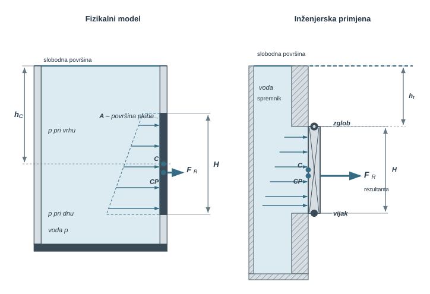
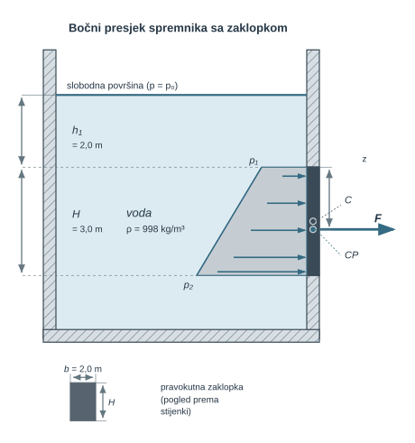
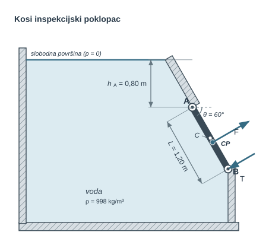
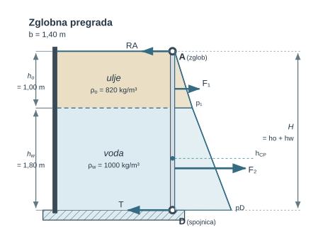
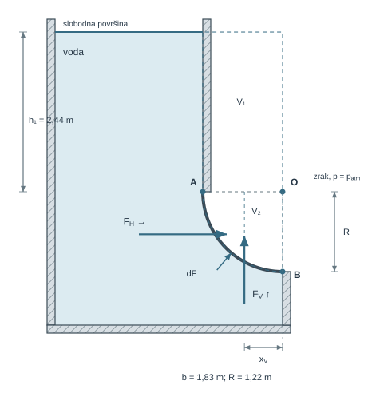
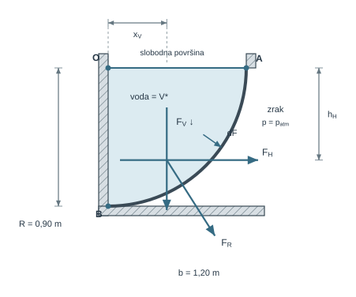
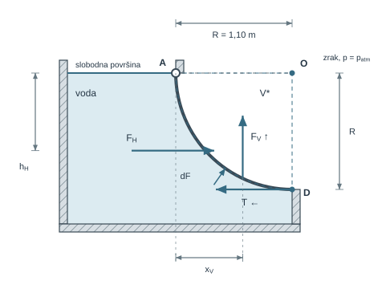
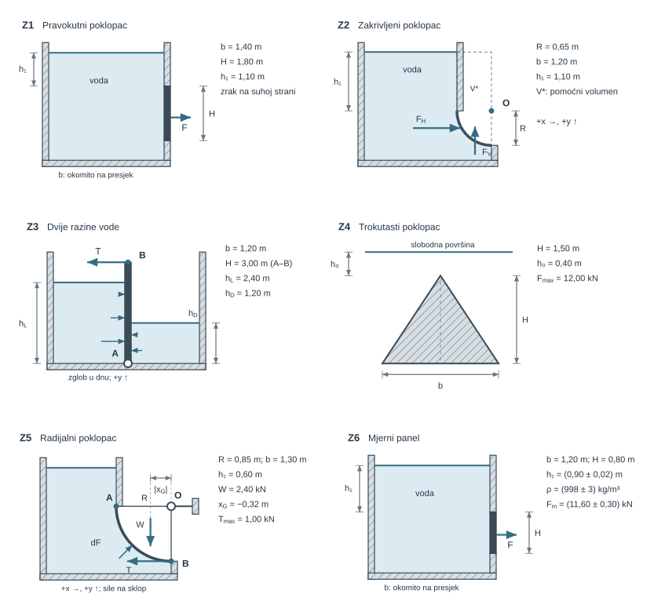

{#fig-u05-pregled-sila-na-plohe fig-align="center" style="width:100%;max-width:980px;" fig-alt="Od raspodjele hidrostatskog tlaka do rezultantne sile i njezina pravca djelovanja na ravnoj plohi"}

**Tumačenje skice.** Rezultanta tlaka na ravnu plohu jest $F=\rho gAh_C$: tlak u težištu množi se površinom. Za vertikalnu plohu dubina centra tlaka iznosi $h_{CP}=h_C+I_G/(Ah_C)$, gdje je $I_G$ aksijalni moment površine oko težišne osi. Vrijednosti su $bH^3/12$ za pravokutnik, $bH^3/36$ za trokut i $\pi d^4/64$ za krug.

Na prikazanoj plohi tlak raste s dubinom, pa je CP ispod težišta C. Za nagnutu plohu iznos sile i dalje određuju $A$ i okomita dubina $h_C$; položaj hvatišta računa se s odgovarajućom geometrijom. Iznos sile određuje nosivost ploče, a njezin moment opterećenje zgloba, vijka i ukruta. U prikazanom poklopcu donji vijak prenosi veću komponentu reakcije od gornjeg zgloba. Isti se postupak primjenjuje na brodske pregrade, brane i taložnike.

## Hidrostatske sile na plohe

Tlak je lokalna veličina, dok je opterećenje poklopca, vrata ili stijenke određeno njegovom raspodjelom po cijeloj plohi. Za hidrostatsku analizu određuju se:

1. koliki su iznos i smjer rezultantne sile;
2. kojim pravcem ta sila djeluje.

Na ravnoj plohi sve lokalne tlačne sile imaju isti smjer, pa se integracijom traže iznos i centar tlaka. Na zakrivljenoj plohi lokalne normale mijenjaju smjer, pa je pouzdanije najprije odrediti horizontalnu i vertikalnu komponentu. Oba slučaja proizlaze iz istoga temeljnog zapisa

$$
d\mathbf F=p\,\mathbf n_f\,dA,
$$ {#eq-sile-plohe-od-lokalnog-tlaka-do-sile-na-plohu-01}

gdje je $\mathbf n_f$ jedinična normala usmjerena **iz stvarnog fluida prema stijenci**. Ta definicija normale nije formalnost: ona određuje predznak svake komponente sile.

::: {.mf1-application}

Inženjerski kontekst

Isti se račun pojavljuje na brodskim i procesnim poklopcima, ustavama retencijskih bazena, stijenkama rashladnih spremnika i zakrivljenim prijelazima vodnih građevina. Hidrostatika daje opterećenje fluida za zadanu geometriju i stanje. Ne provjerava sama po sebi čvrstoću, zamor, brtvljenje, stabilnost cijele konstrukcije ni normativnu prihvatljivost.
:::

**Procijenjeno vrijeme rada uz priručnik:** 11 sati.

U osnovnom modelu fluid miruje, gustoća svakog homogenog sloja je stalna, gravitacijsko polje je jednoliko, a kapilarni učinci zanemarivi.

## Referentni tlak i smjer sile

Prije integriranja treba nacrtati obje strane plohe. Neto tlak je razlika tlakova koji djeluju s njezinih dviju strana. Ako je spremnik otvoren i atmosfera djeluje i na slobodnu površinu i na vanjsku stranu poklopca, atmosferski se doprinos poništava. Tada je najjednostavnije rabiti manometarski tlak

$$
p=\rho gh.
$$ {#eq-sile-plohe-referentni-tlak-i-smjer-sile-01}

Ako se jednoliki tlak $p_0$ **ne poništava**, neto raspodjela glasi

$$
p_{\mathrm{net}}(h)=p_0+\rho gh.
$$ {#eq-sile-plohe-referentni-tlak-i-smjer-sile-02}

Jednoliki član mijenja i silu i položaj njezina hvatišta. Zbog toga formula za centar tlaka izvedena samo za $p=\rho gh$ ne smije biti automatski primijenjena na zatvoren spremnik s plinskim nadtlakom.

## Ravna ploha: rezultanta i centar tlaka

Na ravnoj plohi normala je stalna. Zato se vektorska integracija svodi na određivanje iznosa

$$
F=\int_A p\,dA.
$$ {#eq-sile-plohe-ravna-ploha-rezultanta-i-centar-tlaka-01}

Za otvoren spremnik i neto manometarski tlak $p=\rho gh$ vrijedi

$$
F=\rho g\int_A h\,dA=\rho gAh_C,
$$ {#eq-u05-sila-ravna-ploha}

gdje je $A$ površina plohe, a $h_C$ vertikalna dubina njezina težišta. Rezultanta djeluje okomito na plohu, od fluida prema stijenci. Zapis $F=p_C A$ valjan je zato što je u homogenom fluidu tlak linearna funkcija dubine, pa je srednji tlak jednak tlaku u težištu plohe.

Za vertikalni pravokutni pojas širine $b$, od dubine $h_a$ do $h_b$, isti rezultat dobiva se izravno:

$$
F=\rho gb\int_{h_a}^{h_b}h\,dh
=\frac{\rho gb}{2}\left(h_b^2-h_a^2\right).
$$ {#eq-sile-plohe-ravna-ploha-rezultanta-i-centar-tlaka-02}

Faktorizacija razlike kvadrata vraća $F=\rho gA(h_a+h_b)/2$. Integralni i težišni zapis nisu dvije različite metode, nego dva oblika iste bilance.

### Centar tlaka

Pravac djelovanja rezultante dobiva se iz jednakosti momenata. Za vertikalnu koordinatu $h$ mjerenu od slobodne površine prema dolje,

$$
Fh_{CP}=\int_A h\,p\,dA=\rho g\int_A h^2\,dA.
$$ {#eq-sile-plohe-centar-tlaka-01}

Za neto polje $p=\rho gh$ slijedi

$$
h_{CP}=\frac{I_O}{Ah_C}
=h_C+\frac{I_G}{Ah_C},
$$ {#eq-u05-centar-tlaka-vertikalna}

gdje je $I_G$ drugi moment površine oko centroidne osi paralelne slobodnoj površini, a $I_O=I_G+Ah_C^2$. Za nehorizontalnu plohu pod pozitivnim manometarskim tlakom centar tlaka nalazi se dublje od težišta. To nije opće pravilo za svaku moguću raspodjelu: za vodoravnu plohu ili jednoliki neto tlak hvatište je u težištu, a za kombinaciju $p_0+\rho gh$ treba momentirati cijelu raspodjelu.

Ako je $p_0$ jednoliki neto doprinos, opći zapis za dubinu hvatišta jest

$$
h_R=\frac{\int_A h\,(p_0+\rho gh)\,dA}
{(p_0+\rho gh_C)A}.
$$ {#eq-sile-plohe-centar-tlaka-02}

Taj je oblik pouzdaniji od pamćenja posebnih korekcija jer zahtijeva da se sila i moment računaju iz iste raspodjele tlaka.

### Nagnuta ploha i jasno definiran kut

Neka je $s$ koordinata duž linije najvećeg pada po plohi, a $\theta$ kut te linije prema **vodoravnici**, $0\leq\theta\leq90^\circ$. Ako je početna točka osi $s$ na dubini $h_0$, tada je

$$
h(s)=h_0+s\sin\theta.
$$ {#eq-sile-plohe-nagnuta-ploha-i-jasno-definiran-kut-01}

Za potpuno uronjenu ravnu plohu i $p_0=0$ rezultanta ostaje

$$
F=\rho gAh_C,
$$ {#eq-sile-plohe-nagnuta-ploha-i-jasno-definiran-kut-02}

ali samo uz usporedbu ploha jednake površine i jednake vertikalne dubine težišta. Nagib nije nestao iz geometrije: određuje dubine rubova, smjer normale i krak sile prema zglobu.

Moment oko centroidne osi paralelne slobodnoj površini daje položaj centra tlaka duž plohe

$$
s_{CP}=s_C+\frac{I_G\sin\theta}{Ah_C},
$$ {#eq-sile-plohe-nagnuta-ploha-i-jasno-definiran-kut-03}

a njegova vertikalna dubina iznosi

$$
h_{CP}=h_C+\frac{I_G\sin^2\theta}{Ah_C}.
$$ {#eq-u05-centar-tlaka-nagnuta}

Za $\theta=90^\circ$ dobiva se vertikalna ploha. Kada $\theta\to0$ tlak po vodoravnoj plohi postaje jednolik i $h_{CP}\to h_C$. To je važan granični slučaj izvoda.

<!-- [NOVA PEDAGOŠKA DOPUNA] Postojeći numerički pokus -->
::: {.mf1-interaktivno}

Numerički pokus — ravna ploha

**Predvidi.** Kako se mijenjaju $F$ i $h_{CP}-h_C$ kada cijelu plohu spustiš dublje?

**Provjeri i protumači.** Usporedi numeričku integraciju tlaka s analitičkim izrazima. Zatim pri istoj dubini težišta promijeni nagib i objasni razliku u hvatištu sile.

<a class="mf1-interaktivno-veza" href="https://martibasic.github.io/MF1_udzbenik/jlite/lab/index.html?path=u05_sila_na_ravnu_plohu.ipynb">Pokreni u pregledniku</a>

:::

::: {#cfd-ustava-opterecenje .mf1-cfd title="Računalna dinamika fluida"}

**Zatvorena ustava i njezin pogon.** Za ustavu gradskoga kanala želimo znati silu vode i moment koji mora uravnotežiti pogon. U mirnom stanju zadamo razine vode s obiju strana. Izračunani tlak integriramo po cijeloj plohi, a svaki doprinos momentu množimo njegovim krakom prema osi ustave. Rezultanta i centar tlaka iz ručnog računa provjeravaju oba izlaza.

Zatim možemo istražiti djelomično otvaranje: pojavljuje se mlaz ispod ustave, pa hidrostatska raspodjela uz otvor više nije dovoljan opis. CFD tada povezuje položaj ustave, protok i opterećenje pogona. Točna ukupna sila ne jamči točan moment, a tlak u jednoj točki ne predstavlja cijelu plohu. Isti se postupak koristi za stijenku cisterne iz prethodnog poglavlja; nizvodni mlaz i skok pratimo u []{.mf1-chapter-ref target="u15"}.

[]{#verifikacija-cfd-a-ručnim-računom}
:::

## Riješeni primjeri: ravne plohe

::: {#ex-u05-vertikalna-pravokutna-zaklopka .mf1-we}

Vertikalna pravokutna zaklopka T2

**Tekst zadatka**

Kruta pravokutna zaklopka širine $b=2{,}0\ \mathrm{m}$ i visine $H=3{,}0\ \mathrm{m}$ potpuno je uronjena u mirujuću vodu gustoće $\rho=998\ \mathrm{kg/m^3}$. Gornji joj je rub na dubini $h_1=2{,}0\ \mathrm{m}$. Vanjska strana i slobodna površina vode izložene su atmosferi. Zanemari deformaciju zaklopke.

**Traži se**

Odredi rezultantnu silu i centar tlaka.

{#fig-u05-vertikalna-pravokutna-zaklopka fig-align="center" fig-alt="Vertikalna pravokutna zaklopka s dubinama rubova, težištem i centrom tlaka"}

**Veza s proračunom.** Tlak raste s dubinom, pa donji dio zaklopke nosi veće opterećenje. Rezultanta zato djeluje ispod težišta C. Površina i dubina težišta određuju silu, a raspodjela tlaka njezino hvatište.

**Rješenje**

Površina i dubina težišta jesu

$$
A=bH=6{,}0\ \mathrm{m^2},\qquad
h_C=h_1+\frac H2=3{,}5\ \mathrm{m}.
$$ {#eq-sile-plohe-rijeseni-primjer-vertikalna-pravokutna-zaklopka-01}

Stoga je

$$
F=\rho gAh_C
=998\cdot9{,}81\cdot6{,}0\cdot3{,}5
=205{,}6\ \mathrm{kN}.
$$ {#eq-sile-plohe-rijeseni-primjer-vertikalna-pravokutna-zaklopka-02}

Za centroidnu vodoravnu os pravokutnika

$$
I_G=\frac{bH^3}{12}=4{,}50\ \mathrm{m^4},
$$ {#eq-sile-plohe-rijeseni-primjer-vertikalna-pravokutna-zaklopka-03}

pa je

$$
h_{CP}=3{,}5+\frac{4{,}50}{6{,}0\cdot3{,}5}
=3{,}714\ \mathrm{m}.
$$ {#eq-sile-plohe-rijeseni-primjer-vertikalna-pravokutna-zaklopka-04}

Centar tlaka je $1{,}714\ \mathrm{m}$ ispod gornjeg ruba.

**Provjera i tumačenje**

Tlak na gornjem i donjem rubu iznosi $19{,}58$ i $48{,}95\ \mathrm{kPa}$. Srednja vrijednost linearnog dijagrama jest $34{,}27\ \mathrm{kPa}$, a $34{,}27\cdot6{,}0=205{,}6\ \mathrm{kN}$. Hvatište mora biti između težišta na $3{,}5\ \mathrm{m}$ i donjeg ruba na $5{,}0\ \mathrm{m}$, što je zadovoljeno.
:::

::: {#ex-u05-kosi-poklopac .mf1-we}

Kosi poklopac sa spojnicom T2

**Tekst zadatka**

Pravokutni poklopac širine $b=0{,}90\ \mathrm{m}$ i duljine $L=1{,}20\ \mathrm{m}$ zglobno je vezan na gornjem rubu $A$, na dubini $h_A=0{,}80\ \mathrm{m}$. Ploha je nagnuta za $\theta=60^\circ$ prema vodoravnici, a spojnica na donjem rubu djeluje okomito na nju. Voda miruje, atmosferski se tlak poništava. Zanemari težinu poklopca i trenje zgloba.

**Traži se**

Odredi hidrostatsku silu, njezin krak prema zglobu i silu spojnice.

{#fig-u05-kosi-poklopac fig-align="center" fig-alt="Kosi poklopac s kutom prema vodoravnici, zglobom, centrom tlaka i spojnicom"}

**Veza s proračunom.** Širina poklopca $b=0{,}90\,\mathrm{m}$ mjeri se okomito na ravninu skice. Sila vode djeluje okomito na poklopac; silu spojnice određuje njezin moment oko zgloba. Dubina u vodi i udaljenost duž poklopca nisu ista veličina.

**Rješenje**

Površina i dubina težišta su

$$
A=bL=1{,}08\ \mathrm{m^2},\qquad
h_C=h_A+\frac L2\sin\theta=1{,}3196\ \mathrm{m}.
$$ {#eq-sile-plohe-rijeseni-primjer-kosi-poklopac-sa-spojnicom-t2-01}

Zato je

$$
F=\rho gAh_C=13{,}95\ \mathrm{kN}.
$$ {#eq-sile-plohe-rijeseni-primjer-kosi-poklopac-sa-spojnicom-t2-02}

Koordinata $s$ mjeri se od zgloba niz plohu. Budući da je $h(s)=h_A+s\sin\theta$, jednakost momenata daje

$$
s_{CP}=
\frac{h_A L^2/2+(\sin\theta)L^3/3}
{h_A L+(\sin\theta)L^2/2}
=0{,}679\ \mathrm{m}.
$$ {#eq-sile-plohe-rijeseni-primjer-kosi-poklopac-sa-spojnicom-t2-03}

Moment tlaka oko zgloba iznosi $M_A=Fs_{CP}=9{,}47\ \mathrm{kN\,m}$. Spojnica ima krak $L$, pa

$$
T=\frac{M_A}{L}=7{,}89\ \mathrm{kN}.
$$ {#eq-sile-plohe-rijeseni-primjer-kosi-poklopac-sa-spojnicom-t2-04}

**Provjera i tumačenje**

Težište poklopca je $0{,}600\ \mathrm{m}$ od zgloba, a centar tlaka mora biti dalje niz plohu jer tlak raste: $0{,}600<s_{CP}<1{,}200\ \mathrm{m}$. Momentna bilanca izravno vraća $TL=Fs_{CP}$; usporedba samih iznosa $T$ i $F$ ne bi bila dovoljna.
:::

::: {#ex-u05-pregrada-ulje-voda .mf1-we}

Zglobna pregrada s uljem iznad vode T3

**Tekst zadatka**

Vertikalna pregrada širine $b=1{,}40\ \mathrm{m}$ zglobno je vezana na slobodnoj površini. S jedne strane zadržava ulje gustoće $\rho_o=820\ \mathrm{kg/m^3}$ i visine $h_o=1{,}00\ \mathrm{m}$ iznad vode gustoće $\rho_w=1000\ \mathrm{kg/m^3}$ i visine $h_w=1{,}80\ \mathrm{m}$. Druga strana je na atmosferi. Donji rub pridržava vodoravna spojnica. Fluidi miruju i ne miješaju se; zglob i spojnica su idealni.

**Traži se**

Odredi silu, centar tlaka i statičke reakcije.

{#fig-u05-pregrada-ulje-voda fig-align="center" fig-alt="Zglobna vertikalna pregrada s izlomljenim dijagramom tlaka kroz ulje i vodu"}

**Veza s proračunom.** Tlak je neprekinut na granici ulja i vode, ali mu se nagib mijenja s gustoćom. Sile $F_1$ i $F_2$ djeluju na pregradu, a $T$ i $R_A$ su reakcije spojnice i zgloba. Širina $b=1{,}40\,\mathrm{m}$ okomita je na skicu; duljine strelica sila su simbolične.

**Rješenje**

Na uljnom polju tlak čini trokut, pa je

$$
F_1=\frac12\rho_o gb h_o^2=5{,}631\ \mathrm{kN}.
$$ {#eq-sile-plohe-rijeseni-primjer-zglobna-pregrada-s-uljem-iznad-01}

Na vodenom polju ostaje pravokutni doprinos uljnog stupca i trokutni doprinos vode:

$$
F_{2,r}=\rho_o gbh_oh_w=20{,}271\ \mathrm{kN},
$$ {#eq-sile-plohe-rijeseni-primjer-zglobna-pregrada-s-uljem-iznad-02}

$$
F_{2,t}=\frac12\rho_wgbh_w^2=22{,}249\ \mathrm{kN}.
$$ {#eq-sile-plohe-rijeseni-primjer-zglobna-pregrada-s-uljem-iznad-03}

Ukupna sila iznosi

$$
F=F_1+F_{2,r}+F_{2,t}=48{,}151\ \mathrm{kN}.
$$ {#eq-sile-plohe-rijeseni-primjer-zglobna-pregrada-s-uljem-iznad-04}

Momenti oko gornjeg zgloba računaju se preko težišta svakog dijela dijagrama tlaka:

$$
M_A=
F_1\frac{2h_o}{3}
+F_{2,r}\left(h_o+\frac{h_w}{2}\right)
+F_{2,t}\left(h_o+\frac{2h_w}{3}\right)
=91{,}218\ \mathrm{kN\,m}.
$$ {#eq-sile-plohe-rijeseni-primjer-zglobna-pregrada-s-uljem-iznad-05}

Zato su

$$
h_{CP}=\frac{M_A}{F}=1{,}894\ \mathrm{m},
$$ {#eq-sile-plohe-rijeseni-primjer-zglobna-pregrada-s-uljem-iznad-06}

$$
T=\frac{M_A}{h_o+h_w}=32{,}578\ \mathrm{kN},\qquad
R_A=F-T=15{,}574\ \mathrm{kN}.
$$ {#eq-sile-plohe-rijeseni-primjer-zglobna-pregrada-s-uljem-iznad-07}

**Provjera i tumačenje**

Tlak je kontinuiran na razdjelnici: vodeno polje počinje s tlakom $\rho_o gh_o$, a ne s nulom. Zbroj sila zadovoljava $R_A+T=F$, a zbroj momenata $T(h_o+h_w)=M_A$. Izostavljanje pravokutnog doprinosa $F_{2,r}$ prekršilo bi i kontinuitet tlaka i obje bilance.
:::

## Zakrivljena ploha: projekcija i pomoćni volumen

Na zakrivljenoj plohi lokalne normale nisu paralelne. Izravni vektorski integral i dalje je temelj,

$$
\mathbf F=\int_A p\,\mathbf n_f\,dA,
$$ {#eq-sile-plohe-zakrivljena-ploha-projekcija-i-pomocni-volumen-01}

ali se za često korištene cilindrične i dvodimenzijske geometrije rezultat preglednije nalazi po komponentama.

### Horizontalna komponenta

Za odabrani vodoravni smjer $x$ vrijedi

$$
F_x=\int_A p\,n_{f,x}\,dA.
$$ {#eq-sile-plohe-horizontalna-komponenta-01}

Predznačeni element $n_{f,x}dA$ jednak je projekciji na ravninu okomitu na $x$. Ako se predznak normale ne mijenja i projekcija je jednoznačna, iznos horizontalne komponente jednaka je sili na **vertikalnu projekciju** zakrivljene plohe:

$$
|F_H|=\rho gA_xh_{Cx}.
$$ {#eq-u05-zakrivljena-horizontalna}

Pravac djelovanja prolazi centrom tlaka te vertikalne projekcije. Kod plohe s pregibom, prevjesom ili promjenom predznaka $n_{f,x}$ površinu treba podijeliti i komponente zbrojiti predznačeno; jedna ukupna „sjena” tada nije dovoljna.

### Vertikalna komponenta i njezin smjer

Za vertikalnu komponentu vrijedi

$$
F_V=\int_A p\,n_{f,z}\,dA.
$$ {#eq-sile-plohe-vertikalna-komponenta-i-njezin-smjer-01}

U otvorenom spremniku, s manometarskim tlakom jednakim nuli na slobodnoj površini, iznos se može dobiti ravnotežom pomoćnog volumena $V^*$ omeđenog zakrivljenom plohom, okomitim bočnim plohama i vodoravnom zatvarajućom plohom:

$$
|F_V|=\rho gV^*.
$$ {#eq-u05-zakrivljena-vertikalna}

Pravac djelovanja prolazi težištem toga volumena. Formula daje **iznos**, ne automatski smjer. Smjer se određuje ovim redoslijedom:

1. označi stvarnu stranu na kojoj fluid dodiruje plohu;
2. nacrtaj lokalnu strelicu $p\mathbf n_f$ od fluida prema stijenci;
3. pročitaj predznak njezine vertikalne komponente.

Fluid iznad konkavne plohe tipično opterećuje plohu prema dolje. Fluid koji kvasi konveksnu donju stranu može djelovati prema gore. Položaj nacrtanog pomoćnog volumena sam po sebi nije kriterij smjera, jer taj volumen ne mora biti stvarni fluid.

Ako je tlak na vodoravnoj zatvarajućoj plohi različit od nule ili se ne poništava tlak s druge strane, njegov doprinos treba dodati predznačeno. U složenoj geometriji najsigurnija je kontrola izravnim integralom $\int p n_{f,z}\,dA$.

Nakon određivanja predznačenih komponenti,

$$
F_R=\sqrt{F_H^2+F_V^2},\qquad
\alpha=\operatorname{atan2}(F_V,F_H).
$$ {#eq-sile-plohe-vertikalna-komponenta-i-njezin-smjer-02}

Funkcija $\operatorname{atan2}$ zadržava kvadrant; obični $\arctan(F_V/F_H)$ može sakriti pogrešan predznak. Na kružnom luku u ravninskom presjeku sve lokalne tlačne sile prolaze središtem zakrivljenosti, pa kroz njega prolazi i rezultanta. To geometrijsko svojstvo ne vrijedi za proizvoljnu zakrivljenu plohu.

<!-- [NOVA PEDAGOŠKA DOPUNA] Postojeći numerički pokus -->
::: {.mf1-interaktivno}

Numerički pokus — zakrivljena ploha

**Predvidi.** Odredi smjer $F_V$ iz strane koju fluid kvasi, prije računanja iznosa.

**Provjeri i protumači.** Mijenjaj dubinu i polumjer te usporedi numeričke komponente s projekcijom i pomoćnim volumenom. Objasni zašto rezultanta kružnog luka prolazi središtem zakrivljenosti.

<a class="mf1-interaktivno-veza" href="https://martibasic.github.io/MF1_udzbenik/jlite/lab/index.html?path=u06_zakrivljena_ploha.ipynb">Pokreni u pregledniku</a>

:::

::: {.mf1-cfd title="Računalna dinamika fluida"}

**Zakrivljeni zatvarač: oblik mijenja smjer opterećenja.** Za zakrivljeni zatvarač kanala CFD zbraja vektore $p_i\mathbf n_{f,i}A_i$ po plohama mreže. Normala ide iz fluida u zatvarač, pa rezultat daje silu fluida na konstrukciju. U mirovanju vodoravnu i vertikalnu komponentu provjeravamo projekcijom i pomoćnim volumenom; uzimamo u obzir tlakove na svim opterećenim stranama.

Ručni @ex-u05-zglobni-cetvrtcilindricni-poklopac pokazuje zašto moment računamo oko zgloba A, a ne središta zakrivljenosti O. Jednake rezultante dviju raspodjela tlaka ne jamče jednak moment: usporedi njihove krakove prema istoj osi. Pogon zato provjeravamo i silom i momentom. Nakon otvaranja dodaju se strujanje i viskozna naprezanja. Mreža zato mora vjerno opisati zakrivljenost, a konačan izlaz čine komponente sile i moment, povezane s konkretnim položajem zatvarača.
:::

## Riješeni primjeri: zakrivljene plohe

::: {#ex-u05-potopljena-cetvrtina-kruga .mf1-we}

Potopljena četvrtina kruga, sila prema gore T2

**Tekst zadatka**

Četvrtcilindrična ploha ima polumjer $R=1{,}22\ \mathrm{m}$, širinu $b=1{,}83\ \mathrm{m}$ i gornju točku na dubini $h_1=2{,}44\ \mathrm{m}$. Voda gustoće $998\ \mathrm{kg/m^3}$ kvasi konveksnu vanjsku i donju stranu. Atmosferski tlak se poništava, a krajnji učinci zanemaruju. Pozitivni vertikalni smjer je prema gore.

**Traži se**

Odredi komponente, pravce djelovanja i rezultantu.

{#fig-u05-potopljena-cetvrtcilindricna-ploha fig-align="center" fig-alt="Potopljena četvrtcilindrična ploha s vodom na konveksnoj donjoj strani i vertikalnom silom prema gore"}

**Veza s proračunom.** Vodoravnu komponentu određuje vertikalna projekcija. Vertikalna komponenta usmjerena je prema gore; njezin pomoćni volumen $V^*$ nije druga tekućina. Oznaka $V_1$ označuje pravokutni dio tog volumena.

**Rješenje**

Vertikalna projekcija ima

$$
A_x=Rb=2{,}233\ \mathrm{m^2},\qquad
h_{Cx}=h_1+\frac R2=3{,}05\ \mathrm{m}.
$$ {#eq-sile-plohe-rijeseni-primjer-potopljena-cetvrtina-kruga-sila-01}

Zato je

$$
F_H=\rho gA_xh_{Cx}=66{,}67\ \mathrm{kN}.
$$ {#eq-sile-plohe-rijeseni-primjer-potopljena-cetvrtina-kruga-sila-02}

Za projekciju je $I_G=bR^3/12=0{,}277\ \mathrm{m^4}$, pa horizontalna komponenta djeluje na dubini

$$
h_H=h_{Cx}+\frac{I_G}{A_xh_{Cx}}=3{,}091\ \mathrm{m}.
$$ {#eq-sile-plohe-rijeseni-primjer-potopljena-cetvrtina-kruga-sila-03}

Pomoćni volumen sastoji se od pravokutnog i četvrtcilindričnog dijela:

$$
V^*=h_1Rb+\frac{\pi R^2}{4}b
=5{,}448+2{,}139=7{,}587\ \mathrm{m^3}.
$$ {#eq-sile-plohe-rijeseni-primjer-potopljena-cetvrtina-kruga-sila-04}

Iznos vertikalne komponente je

$$
|F_V|=\rho gV^*=74{,}28\ \mathrm{kN}.
$$ {#eq-sile-plohe-rijeseni-primjer-potopljena-cetvrtina-kruga-sila-05}

Stvarna voda kvasi donju konveksnu stranu, pa lokalne tlačne strelice imaju vertikalnu komponentu prema gore: $F_V=+74{,}28\ \mathrm{kN}$. Vodoravni položaj pravca djelovanja dobiva se iz težišta složenog volumena,

$$
x_V=\frac{(h_1Rb)(R/2)+[(\pi R^2/4)b][4R/(3\pi)]}{V^*}
=0{,}584\ \mathrm{m}.
$$ {#eq-sile-plohe-rijeseni-primjer-potopljena-cetvrtina-kruga-sila-06}

Rezultanta je

$$
F_R=\sqrt{66{,}67^2+74{,}28^2}=99{,}81\ \mathrm{kN},
$$ {#eq-sile-plohe-rijeseni-primjer-potopljena-cetvrtina-kruga-sila-07}

pod kutom $48{,}1^\circ$ iznad horizontale.

**Provjera i tumačenje**

Rezultanta mora biti između veće komponente i njihova zbroja: $74{,}28<99{,}81<140{,}95\ \mathrm{kN}$. Smjer se dodatno provjerava jednom lokalnom normalom na donjoj strani koju voda kvasi; ona ima pozitivnu vertikalnu komponentu neovisno o tome gdje je nacrtan $V^*$.
:::

::: {#ex-u05-cetvrtcilindar-prema-dolje .mf1-we}

Četvrtcilindrični poklopac uz slobodnu površinu T2

**Tekst zadatka**

Četvrtcilindrični poklopac širine $b=1{,}20\ \mathrm{m}$ i polumjera $R=0{,}90\ \mathrm{m}$ počinje na slobodnoj površini vode. Voda kvasi stranu prikazanu na skici: normale od fluida prema stijenci imaju vertikalne komponente prema dolje. Računaj neto manometarski tlak, jednak nuli na slobodnoj površini.

**Traži se**

Odredi komponente i rezultantu.

{#fig-u05-cetvrtcilindricni-poklopac-slobodna-povrsina fig-align="center" fig-alt="Četvrtcilindrični poklopac uz slobodnu površinu s vertikalnom komponentom prema dolje"}

**Veza s proračunom.** Uz pozitivnu os $z$ prema gore, sila vode na poklopac ima vodoravnu komponentu udesno i vertikalnu prema dolje. Ovdje pomoćni volumen $V^*$ ispunjava stvarna voda. Predznak vertikalne sile slijedi iz strane koju voda kvasi.

**Rješenje**

Za vertikalnu projekciju

$$
A_x=Rb=1{,}08\ \mathrm{m^2},\qquad h_{Cx}=R/2=0{,}45\ \mathrm{m},
$$ {#eq-sile-plohe-rijeseni-primjer-cetvrtcilindricni-poklopac-uz-s-01}

pa su

$$
F_H=\rho gA_xh_{Cx}=4{,}758\ \mathrm{kN},\qquad
h_H=\frac{2R}{3}=0{,}600\ \mathrm{m}.
$$ {#eq-sile-plohe-rijeseni-primjer-cetvrtcilindricni-poklopac-uz-s-02}

Pomoćni volumen je četvrtina valjka,

$$
V^*=\frac{\pi R^2}{4}b=0{,}7634\ \mathrm{m^3},
$$ {#eq-sile-plohe-rijeseni-primjer-cetvrtcilindricni-poklopac-uz-s-03}

zbog čega je

$$
F_V=-\rho gV^*=-7{,}474\ \mathrm{kN}.
$$ {#eq-sile-plohe-rijeseni-primjer-cetvrtcilindricni-poklopac-uz-s-04}

Negativan predznak označuje smjer prema dolje. Pravac djelovanja udaljen je od okomite stijenke

$$
x_V=\frac{4R}{3\pi}=0{,}382\ \mathrm{m}.
$$ {#eq-sile-plohe-rijeseni-primjer-cetvrtcilindricni-poklopac-uz-s-05}

Stoga je

$$
F_R=8{,}860\ \mathrm{kN},\qquad
\alpha=-57{,}52^\circ.
$$ {#eq-sile-plohe-rijeseni-primjer-cetvrtcilindricni-poklopac-uz-s-06}

**Provjera i tumačenje**

Izravna integracija po kružnom luku koji počinje na slobodnoj površini daje $F_H=\rho gbR^2/2$ i $|F_V|=\rho gb\pi R^2/4$. Zato mora vrijediti $|F_V|/F_H=\pi/2=1{,}571$; numerički je $7{,}474/4{,}758=1{,}571$.
:::

::: {#ex-u05-zglobni-cetvrtcilindricni-poklopac .mf1-we}

Zglobni poklopac s vertikalnom silom prema gore T3

**Tekst zadatka**

Kruti četvrtcilindrični poklopac širine $b=1{,}40\ \mathrm{m}$ i polumjera $R=1{,}10\ \mathrm{m}$ ima zglob u gornjoj točki $A$ na slobodnoj površini vode. Donji rub pridržava vodoravna spojnica. Voda miruje i kvasi konveksnu donju i lijevu stranu; atmosferski tlak se poništava. Zanemari težinu poklopca i trenje zgloba. Pozitivni vertikalni smjer je prema gore.

**Traži se**

Odredi komponente i statičku silu spojnice.

{#fig-u05-zglobni-cetvrtcilindricni-poklopac fig-align="center" fig-alt="Zglobni četvrtcilindrični poklopac s vodom na donjoj strani, silom prema gore i vodoravnom spojnicom"}

**Veza s proračunom.** O je središte kružnice, a os poklopca nalazi se u zglobu A. Sile djeluju na poklopac; spojnica je izvan presjeka širine $b=1{,}40\,\mathrm{m}$. Pomoćni volumen $V^*$ nalazi se na suhoj strani i daje vertikalnu komponentu prema gore. Za spojnicu zbroji momente oko A.

**Rješenje**

Horizontalna komponenta i njezin krak prema zglobu jesu

$$
F_H=\rho g(Rb)\frac R2=8{,}292\ \mathrm{kN},\qquad
h_H=\frac{2R}{3}=0{,}733\ \mathrm{m}.
$$ {#eq-sile-plohe-rijeseni-primjer-zglobni-poklopac-s-vertikalnom-01}

Pomoćni volumen je

$$
V^*=\frac{\pi R^2}{4}b=1{,}3305\ \mathrm{m^3},
$$ {#eq-sile-plohe-rijeseni-primjer-zglobni-poklopac-s-vertikalnom-02}

pa je iznos vertikalne komponente

$$
|F_V|=\rho gV^*=13{,}026\ \mathrm{kN}.
$$ {#eq-sile-plohe-rijeseni-primjer-zglobni-poklopac-s-vertikalnom-03}

Voda kvasi donju konveksnu stranu, stoga je $F_V$ **prema gore**. Njezin je vodoravni krak prema zglobu

$$
x_V=R-\frac{4R}{3\pi}=0{,}633\ \mathrm{m}.
$$ {#eq-sile-plohe-rijeseni-primjer-zglobni-poklopac-s-vertikalnom-04}

Rezultanta iznosi $F_R=15{,}441\ \mathrm{kN}$ i usmjerena je $57{,}52^\circ$ iznad horizontale. Za prikazane smjerove obje komponente daju moment otvaranja oko $A$. Ravnoteža momenata zato zahtijeva

$$
TR=F_Hh_H+F_Vx_V,
$$ {#eq-sile-plohe-rijeseni-primjer-zglobni-poklopac-s-vertikalnom-05}

odnosno

$$
T=\frac{8{,}292\cdot0{,}733+13{,}026\cdot0{,}633}{1{,}10}
=13{,}026\ \mathrm{kN}.
$$ {#eq-sile-plohe-rijeseni-primjer-zglobni-poklopac-s-vertikalnom-06}

**Provjera i tumačenje**

Za ovu posebnu geometriju

$$
F_Hh_H=\rho gbR^3/3,
$$ {#eq-sile-plohe-rijeseni-primjer-zglobni-poklopac-s-vertikalnom-07}

$$
F_Vx_V=\rho gbR^3\left(\frac\pi4-\frac13\right).
$$ {#eq-sile-plohe-rijeseni-primjer-zglobni-poklopac-s-vertikalnom-08}

Zbroj je $\rho gb\pi R^3/4=F_VR$, pa identitet daje $T=F_V=13{,}026\ \mathrm{kN}$. Jednakost je geometrijska provjera ovog slučaja, a ne opće pravilo za zakrivljene poklopce.
:::

::: {.mf1-samoprovjera}

Provjeri sebe

1. Zašto je u hidrostatskoj sili važno razlikovati neto tlak od apsolutnog tlaka?
2. Zašto je centar tlaka na uronjenoj ravnoj plohi niže od težišta plohe kada tlak raste s dubinom?
3. Zašto je za zakrivljenu plohu često sigurnije rastaviti silu na vodoravnu i okomitu komponentu?
4. Dvije raspodjele tlaka daju jednaku silu na ustavu, ali različit moment oko istog zgloba. Daju li jednako opterećenje pogona?

::: {.callout-note collapse="true"}
### Odgovori

1. Jednoliki referentni tlak može se poništiti samo ako djeluje s obje strane na isti način; u suprotnom mijenja i silu i hvatište.

2. Dublji dijelovi nose veći tlak pa povlače rezultantu prema dolje.

3. Na zakrivljenoj plohi normale mijenjaju smjer, a komponente se lakše vežu uz projekciju i težinu zamišljenog stupca fluida.

4. Ne. Jednaka sila ne jamči jednak krak: moment ovisi o raspodjeli tlaka i hvatištu rezultante. Za pogon treba provjeriti i moment, a konstrukcijsku sigurnost zasebno.
:::
:::

## Zadaci za samostalan rad

U svim zadatcima uzmi $g=9{,}81\ \mathrm{m/s^2}$. Ako nije drukčije navedeno, voda ima $\rho=998\ \mathrm{kg/m^3}$, atmosfera djeluje s obje strane gdje je prisutna i računa se neto manometarski tlak. Skica sa stranom koju fluid kvasi, normalom i pozitivnim smjerovima dio je postavljanja modela.

{#fig-u05-vjezbe-skice fig-align="center" fig-alt="Šest skica s dimenzijama, stvarnom vodom i silama na poklopce; u Z5 os je u središtu kružnice O"}

**Napomene uz skice.** Strelice prikazuju sile na poklopce, a dvostrane strelice kote; duljine sila nisu u mjerilu. U Z1 traže se rezultanta i njezino hvatište, a u Z2 komponente i iznos rezultante. U Z3 pregrada ne propušta vodu; račun obuhvaća silu, hvatište, moment u A i silu spojnice. Z4 je pogled okomito na plohu, pa je sila okomita na crtež; traže se najveća širina i centar tlaka te provjera širine $1{,}20\,\mathrm{m}$. U Z5 os je u O, a spojnica izvan presjeka; sile i moment odnose se na O. U Z6 oznaka $\pm$ predstavlja standardnu nesigurnost: uspoređuju se $F$, $u(F)$ i $z$, uz odluku na razini $2u$.

::::: {.mf1-vjezbe-list}

### Sila na pravokutni poklopac {#task-u05-ravna-pravokutna-zaklopka .unnumbered .unlisted}

**Tekst zadatka**

Vertikalni pravokutni poklopac širine $b=1{,}40\ \mathrm{m}$ i visine $H=1{,}80\ \mathrm{m}$ nalazi se u vodi tako da mu je gornji rub na dubini $h_1=1{,}10\ \mathrm{m}$.

**Traži se**

Odredi rezultantnu silu, dubinu centra tlaka i njegovu udaljenost od gornjeg ruba.

:::: {.content-visible when-format="html"}
:::: {.content-visible .mf1-hint-online when-format="html"}
::: {.callout-note collapse="true" data-hint-key="true"}
### Naputak
Najprije izračunaj $A$ i $h_C$. Za centar tlaka treba $I_G=bH^3/12$.
:::
::::
::::

:::: {.content-visible .mf1-answer-online when-format="html"}
::: {.callout-tip collapse="true" data-answer-key="true"}
### Kontrolni rezultat

$F=49{,}34\ \mathrm{kN}$; $h_{CP}=2{,}135\ \mathrm{m}$; udaljenost od gornjeg ruba $1{,}035\ \mathrm{m}$.
:::
::::

[Razina: T1]{.mf1-task-level}

### Sila na zakrivljeni poklopac {#task-u05-zakrivljeni-poklopac-cetvrtine-kruga .unnumbered .unlisted}

**Tekst zadatka**

Zakrivljeni poklopac presjeka četvrtine kruga ima $R=0{,}65\ \mathrm{m}$ i širinu $b=1{,}20\ \mathrm{m}$. Gornja mu je točka na dubini $h_1=1{,}10\ \mathrm{m}$. Voda kvasi konveksnu vanjsku i donju stranu.

**Traži se**

Odredi $F_H$, predznačeni $F_V$ i $F_R$.

:::: {.content-visible when-format="html"}
:::: {.content-visible .mf1-hint-online when-format="html"}
::: {.callout-note collapse="true" data-hint-key="true"}
### Naputak
Za $F_H$ rabi vertikalnu projekciju $Rb$ na dubini $h_1+R/2$. Pomoćni volumen čine pravokutni dio $h_1Rb$ i četvrtina valjka.
:::
::::
::::

:::: {.content-visible .mf1-answer-online when-format="html"}
::: {.callout-tip collapse="true" data-answer-key="true"}
### Kontrolni rezultat

$F_H=10{,}88\ \mathrm{kN}$; $F_V=+12{,}30\ \mathrm{kN}$ prema gore; $F_R=16{,}42\ \mathrm{kN}$.
:::
::::

[Razina: T1]{.mf1-task-level}

### Pregrada između dviju razina vode {#task-pregrada-izmedu-dviju-razina-vode .unnumbered .unlisted}

**Tekst zadatka**

Vertikalna nepropusna pregrada širine $b=1{,}20\ \mathrm{m}$ i visine $H=3{,}00\ \mathrm{m}$ dijeli dva otvorena spremnika. Dubina vode iznad zajedničkog dna lijevo je $h_L=2{,}40\ \mathrm{m}$, a desno $h_D=1{,}20\ \mathrm{m}$. Pregrada je zglobno oslonjena u dnu $A$; u gornjoj točki $B$ pridržava je vodoravna spojnica. Zanemari trenje i moment težine pregrade.

Uzmi $+x$ udesno, $+y$ prema gore i pozitivan moment suprotno kazaljci na satu.

**Traži se**

Odredi neto silu vode i visinu njezina pravca djelovanja iznad dna, moment vode oko $A$ te iznos i smjer sile spojnice.

:::: {.content-visible when-format="html"}
:::: {.content-visible .mf1-hint-online when-format="html"}
::: {.callout-note collapse="true" data-hint-key="true"}
### Naputak
Odvojeno nacrtaj dva trokutasta dijagrama manometarskog tlaka. Svaki daje silu na visini $h/3$ iznad dna. Sile i njihove momente oduzmi uz odgovarajuće predznake; krak spojnice jest $H$.
:::
::::
::::

:::: {.content-visible .mf1-answer-online when-format="html"}
::: {.callout-tip collapse="true" data-answer-key="true"}
### Kontrolni rezultat

$F_x=+25{,}377\ \mathrm{kN}$; $y_R=0{,}9333\ \mathrm{m}$ iznad dna; $M_A=-23{,}685\ \mathrm{kN\,m}$; $T=7{,}895\ \mathrm{kN}$ ulijevo u $B$. Provjera: pri jednakim razinama neto sila i moment su nula; zamjena lijeve i desne razine obrće njihove predznake.
:::
::::

[Razina: T2]{.mf1-task-level}

### Širina trokutastog poklopca {#task-sirina-trokutastog-poklopca .unnumbered .unlisted}

**Tekst zadatka**

Vertikalni poklopac ima oblik jednakokračnog trokuta s vrhom gore, visinom $H=1{,}50\ \mathrm{m}$ i vodoravnom osnovicom širine $b$. Vrh je na dubini $h_0=0{,}40\ \mathrm{m}$ ispod slobodne površine vode; s druge strane je zrak na atmosferskom tlaku. Dopuštena rezultantna sila jest $F_{\max}=12{,}00\ \mathrm{kN}$.

Visina i dubina vrha ostaju zadane pri promjeni širine; provjerava se samo navedeni uvjet sile, ne čvrstoća konstrukcije.

Ponuđeni poklopac ima širinu $1{,}20\ \mathrm{m}$.

**Traži se**

1. Odredi najveću širinu $b_{\max}$ i dubinu centra tlaka.
2. Zadovoljava li ponuđeni poklopac ovaj uvjet?

:::: {.content-visible when-format="html"}
:::: {.content-visible .mf1-hint-online when-format="html"}
::: {.callout-note collapse="true" data-hint-key="true"}
### Naputak
Za trokut s vrhom gore vrijedi $A=bH/2$, $h_C=h_0+2H/3$ i $I_G=bH^3/36$ oko vodoravne težišne osi. Upotrijebi $F\le F_{\max}$; zatim provjeri ovisi li $h_{CP}$ o širini.
:::
::::
::::

:::: {.content-visible .mf1-answer-online when-format="html"}
::: {.callout-tip collapse="true" data-answer-key="true"}
### Kontrolni rezultat

$b_{\max}=1{,}1673\ \mathrm{m}$; $h_{CP}=1{,}4893\ \mathrm{m}$. Za $b=1{,}20\ \mathrm{m}$ sila je $F=12{,}336\ \mathrm{kN}>F_{\max}$, pa ponuđena širina ne zadovoljava. Pri zadanim $H$ i $h_0$, $h_{CP}$ ne ovisi o $b$.
:::
::::

[Razina: T2]{.mf1-task-level}

### Radijalni poklopac s težinom {#task-radijalni-poklopac-s-tezinom .unnumbered .unlisted}

**Tekst zadatka**

Kruti sklop četvrtcilindričnog poklopca i njegovih krakova okreće se oko osi kroz središte kružnice $O$, a ne oko kraja luka. Voda kvasi konveksnu lijevu i donju stranu, a s druge strane je zrak na atmosferskom tlaku.

U presjeku s ishodištem u $O$, $+x$ udesno i $+y$ prema gore, krajevi su $A=(-R,0)$ i $B=(0,-R)$; $R=0{,}85\ \mathrm{m}$ i širina $b=1{,}30\ \mathrm{m}$. Os $O$ nalazi se $h_1=0{,}60\ \mathrm{m}$ ispod slobodne površine. Težina cijelog sklopa je $W=2{,}40\ \mathrm{kN}$ i djeluje na pravcu $x_G=-0{,}32\ \mathrm{m}$. Vodoravna spojnica u $B$ može samo vlačiti ulijevo, do $T_{\max}=1{,}00\ \mathrm{kN}$.

Krakovi i spojnica su na suhoj strani ili izvan širine presjeka; njihovo dodatno hidrostatsko opterećenje zanemari. Zanemari trenje osi; pozitivan moment je suprotno kazaljci na satu.

**Traži se**

1. Odaberi potreban model i odredi predznačene komponente sile vode, njezin moment oko $O$, silu spojnice i komponente reakcije osi na sklop.
2. Može li spojnica održati ravnotežu?
3. Obrazloži mijenja li porast $h_1$ potrebnu silu spojnice dok cijeli luk ostaje uronjen.

:::: {.content-visible when-format="html"}
:::: {.content-visible .mf1-hint-online when-format="html"}
::: {.callout-note collapse="true" data-hint-key="true"}
### Naputak
Nacrtaj jednu lokalnu tlačnu normalu i provjeri njezin pravac prema $O$. Za ravnotežu izdvoji cijeli kruti sklop; tek nakon momentne jednadžbe zatvori ravnotežu sila. Zasebno provjeri predznak i kapacitet spojnice.
:::
::::
::::

:::: {.content-visible .mf1-answer-online when-format="html"}
::: {.callout-tip collapse="true" data-answer-key="true"}
### Kontrolni rezultat

$F_x=+11{,}089\ \mathrm{kN}$; $F_y=+13{,}713\ \mathrm{kN}$; $M_{O,\mathrm{voda}}=0$. $T=0{,}904\ \mathrm{kN}$ ulijevo, manje od $T_{\max}$; $R_{Ox}=-10{,}185\ \mathrm{kN}$, $R_{Oy}=-11{,}313\ \mathrm{kN}$. Sve tlačne normale prolaze kroz $O$; $T=W|x_G|/R$ ne ovisi o $h_1$ u zadanom modelu.
:::
::::

[Razina: T3]{.mf1-task-level}

### Nesigurnost sile na mjerni panel {#task-u05-nesigurnost-modela-i-mjerenja .unnumbered .unlisted}

**Tekst zadatka**

Pravokutni mjerni panel ima točno poznate dimenzije $b=1{,}20\ \mathrm{m}$ i $H=0{,}80\ \mathrm{m}$. Gornji rub je na izmjerenoj dubini $h_1=0{,}90\ \mathrm{m}$ sa standardnom nesigurnošću $u(h_1)=0{,}020\ \mathrm{m}$, a gustoća je $\rho=998\ \mathrm{kg/m^3}$ uz $u(\rho)=3\ \mathrm{kg/m^3}$. Neovisna mjerna ćelija daje $F_m=11{,}60\ \mathrm{kN}$ uz $u(F_m)=0{,}30\ \mathrm{kN}$. Pretpostavi neovisne ulaze i primijeni linearnu propagaciju nesigurnosti.

**Traži se**

1. Izračunaj predviđanje $F$, njegovu standardnu nesigurnost i normirano odstupanje $z=|F-F_m|/\sqrt{u(F)^2+u(F_m)^2}$.
2. Obrazloži podupiru li podatci tvrdnju o neslaganju na razini $2u$.

:::: {.content-visible when-format="html"}
:::: {.content-visible .mf1-hint-online when-format="html"}
::: {.callout-note collapse="true" data-hint-key="true"}
### Naputak
Za $F=\rho gbH(h_1+H/2)$ relativna nesigurnost zbog dvaju nesigurnih ulaza jest $u(F)/F=\sqrt{[u(\rho)/\rho]^2+[u(h_1)/(h_1+H/2)]^2}$.
:::
::::
::::

:::: {.content-visible .mf1-answer-online when-format="html"}
::: {.callout-tip collapse="true" data-answer-key="true"}
### Kontrolni rezultat

$F=12{,}218\ \mathrm{kN}$; $u(F)=0{,}192\ \mathrm{kN}$; kombinirana nesigurnost razlike $0{,}356\ \mathrm{kN}$; $z=1{,}74$. Budući da je $z<2$, ovaj skup podataka ne pokazuje neslaganje na zadanoj razini, ali time model nije općenito validiran.
:::
::::

[Razina: T4]{.mf1-task-level}

:::::

## Sažetak

::: {.mf1-zavrsni-okvir}

Hidrostatske sile na ravne i zakrivljene plohe

- Za ravnu plohu integrira se neto tlak; pri $p=\rho gh$ vrijedi $F=\rho gAh_C$.
- Centar tlaka dolazi iz momenta **iste** raspodjele. Formula $h_C+I_G/(Ah_C)$ nije opća za nenulti jednoliki dodatak tlaka.
- Kut nagnute plohe ovdje je kut prema vodoravnici; geometrija dubina ulazi preko $\sin\theta$.
- Za zakrivljenu plohu $F_H$ se dobiva iz sile na vertikalnu projekciju, a $|F_V|$ iz težine odgovarajućega pomoćnog volumena kada su ispunjene pretpostavke otvorenog manometarskog slučaja.
- Smjer $F_V$ određuje stvarna strana koju fluid kvasi i normala $\mathbf n_f$. Vertikalna komponenta može biti prema gore ili prema dolje.
- Hidrostatički račun ne uključuje strujne udare, valove, inerciju poklopca, deformaciju, zamor, brtvljenje ni normativnu provjeru konstrukcije.
:::
