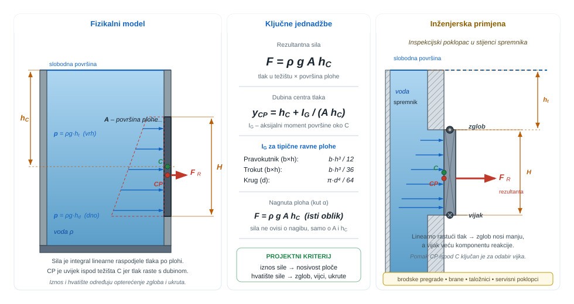
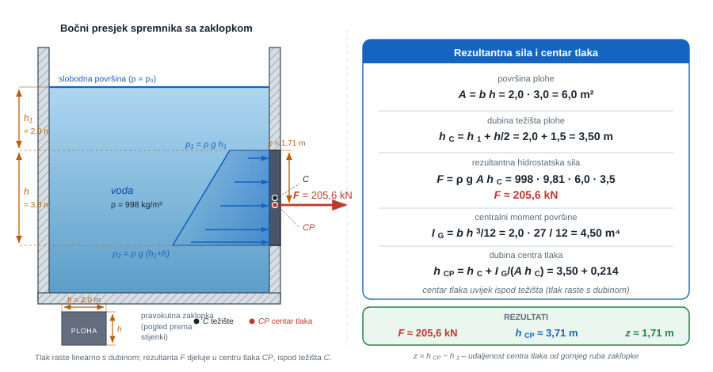
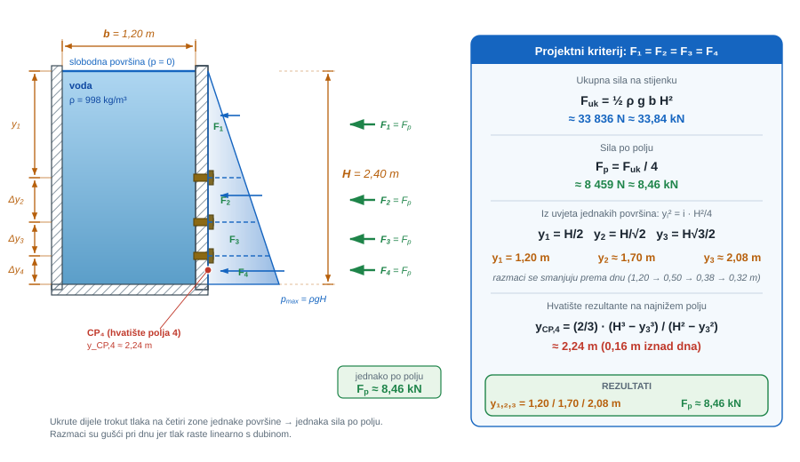
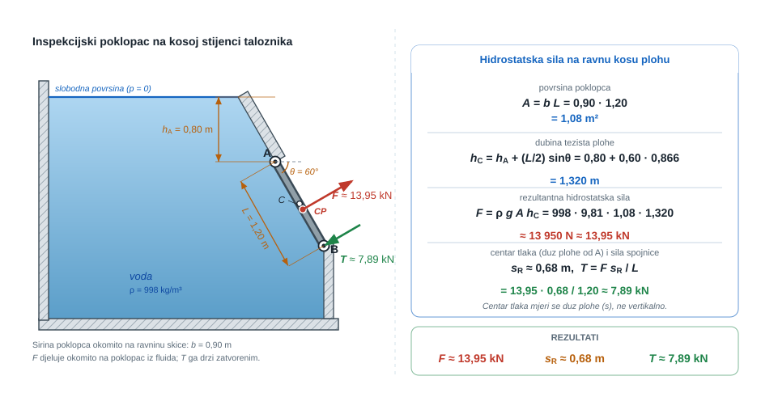
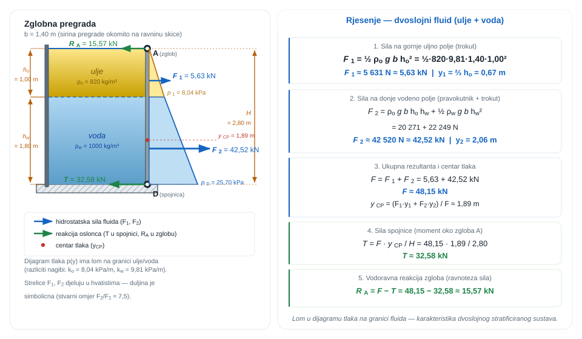
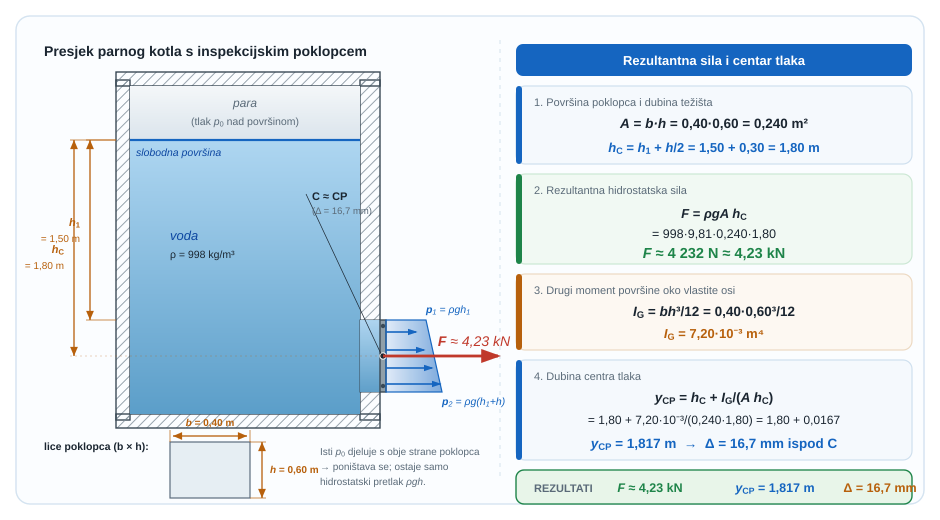
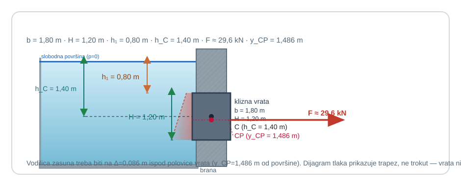
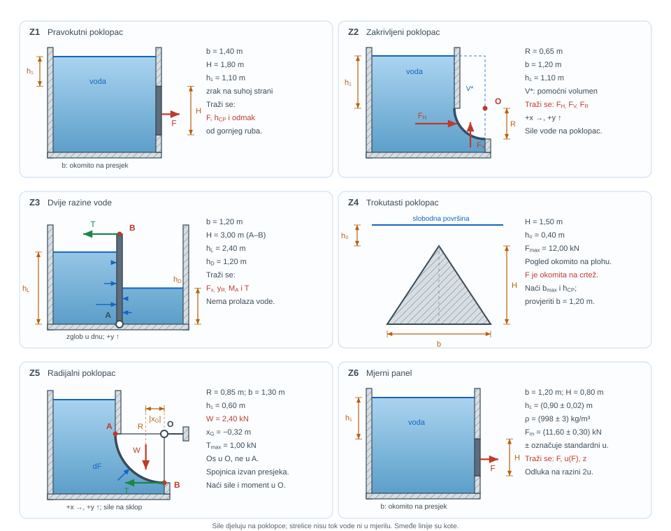

{#fig-uvod-u05 fig-align="center" style="width:100%;max-width:980px;"}

## Ravne plohe kao raspodjela opterećenja, a ne samo jedna sila

Kad se hidrostatski tlak prenese na stijenku, više se ne traži samo lokalni tlak nego cijela raspodjela opterećenja.

Zato se u ovom poglavlju ne računa samo jedna rezultantna sila na plohu, nego i način na koji se raspodjela hidrostatskog tlaka pretvara u projektni kriterij za panele, ukrute i nosive elemente.

::: {.mf1-application}

Inženjerski kontekst

Kad su vrata brane, inspekcijski poklopac ili stijenka spremnika potopljeni, projektanta ne zanima samo ukupna sila nego i gdje ta sila djeluje, jer od toga ovise zglob, vijci, ukrute i okvir. Isto vrijedi za brodske pregrade, taložnike i privremene građevinske zaštite od vode: linearna raspodjela tlaka postaje stvarno opterećenje koje konstrukcija mora nositi bez lokalnog preopterećenja.
:::

## Fizikalni uvod i matematički izvod

Za ravnu plohu uronjenu u mirujući fluid rezultantna hidrostatska sila može se zapisati preko površine i dubine težišta plohe:

$$F = \rho g A h_C$$

::: {.callout-note}
## 📐 Fizikalno značenje
Rezultantna sila nije tlak u najdubljem ili najpliem rubu plohe – to je površina množena tlakom u težištu. Dubina težišta $h_C$ predstavlja "prosjek" geometrije plohe. Ako se ploha naginje ili rotira (ali ostaje ista površina i dubina težišta), rezultantna sila ne mijenja se. Zato ovo nije intuitivni zakon: deblje plohe ili nagnute plohe ne znače nužno veću ukupnu silu, nego samo drukčiji moment koji učine.
:::

Ako na istu stranu plohe djeluje i jednoliki tlak $p_0$, tada se opći zapis može čitati kao

$$F = (p_0 + \rho g h_C)A = p_C A$$

gdje je $p_C$ tlak u težištu plohe. U većini zadataka iz ovoga poglavlja isti atmosferski tlak djeluje i s druge strane plohe, pa se jednoliki dio opterećenja poništi i ostaje samo hidrostatički pretlak. Upravo zato u proračunu najčešće pišemo samo $\rho g A h_C$, ali korisno je znati da je to poseban slučaj općega pravila.

No taj zapis je samo skraćeni rezultat integracije. Kad treba usporediti više polja, ukruta ili podjela iste stijenke, često je korisnije raditi izravno s raspodjelom tlaka.

Za vertikalni pravokutni pojas širine $b$ koji se proteže od dubine $y_a$ do $y_b$ ispod slobodne površine vrijedi

$$F = \rho g b \int_{y_a}^{y_b} y\,dy = \frac{1}{2}\rho g b\left(y_b^2 - y_a^2\right)$$

::: {.callout-note}
## 📝 Razrada koraka
Korak: integral $\int y\,dy$ → formula s kvadratima rubnih dubina

Uvrstimo $p(y) = \rho g y$ i integriramo:
$$
F = \rho g b \int_{y_a}^{y_b} y\,dy = \rho g b \left[\frac{y^2}{2}\right]_{y_a}^{y_b} = \frac{1}{2}\rho g b\left(y_b^2 - y_a^2\right).
$$
Faktorizacijom razlike kvadrata: $y_b^2 - y_a^2 = (y_b-y_a)(y_b+y_a)$, pa:
$$
F = \rho g b (y_b - y_a) \cdot \frac{y_b + y_a}{2} = \rho g \cdot A_{pojas} \cdot h_C.
$$
Ovo pokazuje ekvivalentnost integralnog i „težišnog" zapisa: $(y_b+y_a)/2$ je dubina težišta pojasa, a $b(y_b-y_a)$ je njegova površina.
:::

To je najvažniji radni zapis ovog poglavlja: kad god je raspodjela tlaka linearna, ravne plohe i njihovi podpaneli mogu se čitati preko kvadrata karakterističnih dubina. Integral ovdje nije formalna komplikacija, nego najkraći način da se iz lokalnog tlaka prijeđe na ukupnu silu koja opterećuje stvarni element konstrukcije.

Za položaj hvatišta rezultante na istom pojasu vrijedi

$$y_{CP} = \frac{\int_{y_a}^{y_b} y\,p(y)\,b\,dy}{\int_{y_a}^{y_b} p(y)\,b\,dy} = \frac{2}{3}\,\frac{y_b^3 - y_a^3}{y_b^2 - y_a^2}$$

pa se i centar tlaka može dobiti bez posebnog pamćenja formula za svaki novi oblik.

## Matematički izvod

Na svakom elementu uronjene ravne plohe površine $dA$ tlak je zadan lokalnom dubinom $h$, pa vrijedi

$$
dF = p\,dA, \qquad p = \rho gh.
$$

Ukupna rezultantna sila dobiva se integracijom po cijeloj plohi:

$$
F = \int_A p\,dA = \rho g \int_A h\,dA.
$$

Kako je po definiciji dubine težišta plohe

$$
h_C = \frac{1}{A}\int_A h\,dA,
$$

slijedi opći izraz

$$
F = \rho gAh_C.
$$

To je prvi temeljni rezultat: sila ovisi o površini plohe i dubini njezina težišta, a ne o dubini nekoga slučajno odabranog ruba. Zbog toga potpuno uronjena ravna ploha ne dobiva veću rezultantu samo zato što je nagnuta ili zakrenuta, ako su joj površina i dubina težišta ostale iste. Drugi temeljni rezultat odnosi se na položaj centra tlaka. Za koordinatu $y$ mjerenu od slobodne površine prema dolje, moment rezultante mora biti jednak momentu raspodijeljenoga tlaka:

$$
Fy_{CP} = \int_A y\,p\,dA = \rho g \int_A y^2\,dA.
$$

Uvrštavanjem izraza za ukupnu silu dobiva se

$$
y_{CP} = \frac{\int_A y^2\,dA}{\int_A y\,dA} = \frac{I_O}{Ah_C},
$$

gdje je $I_O$ drugi moment površine oko slobodne površine. Primjenom Steinerova poučka $I_O = I_G + Ah_C^2$ slijedi i često korišten oblik

$$
y_{CP} = h_C + \frac{I_G}{Ah_C}.
$$

::: {.callout-note}
## 📐 Fizikalno značenje
Centar tlaka je uvijek dublje od težišta plohe ($y_{CP} > h_C$) jer raspodjela tlaka nije jednolika nego linearna – dublji dijelovi plohe nose veće tlakove i "vuku" hvatište prema dolje. Član $I_G/(Ah_C)$ mjeri tu asimetriju: veće plohe duboko potopljene imaju mali pomak (hvatište blizu težišta), dok plitko potopljene plohe imaju veći pomak. U praksi je ova informacija ključna za dimenzioniranje zglobova, bravica i nosive konstrukcije zaklopke ili brane.
:::

Upravo taj dodatni član pokazuje puno fizikalno značenje centra tlaka: budući da tlak raste s dubinom, donji dijelovi plohe sudjeluju jače u rezultanti nego gornji, pa se hvatište sile uvijek nalazi dublje od težišta same plohe.

## Riješeni primjeri

::: {.mf1-we}

Riješeni primjer - Vertikalna pravokutna zaklopka ispod slobodne površine T2

**Zadano**

Vertikalna pravokutna zaklopka širine $b = 2{,}0\ \text{m}$ i visine $h = 3{,}0\ \text{m}$ uronjena je u vodu tako da joj je gornji rub na dubini $h_1 = 2{,}0\ \text{m}$ ispod slobodne površine. Gustoće vode je $\rho = 998\ \text{kg/m}^3$.

**Traženo**

1. rezultantnu hidrostatsku silu na zaklopku.
2. dubinu centra tlaka ispod slobodne površine.
3. udaljenost centra tlaka od gornjeg ruba zaklopke.

**Pretpostavke i model**

Zaklopka je ravna i potpuno uronjena, a s druge strane djeluje atmosferski tlak pa se u proračunu koristi samo hidrostatički pretlak. Za rezultantu je najbrže koristiti površinu i dubinu težišta, a za centar tlaka izraz s momentom tlačne raspodjele.

**Rješenje**

Površina zaklopke iznosi

$$
A = bh = 2{,}0 \cdot 3{,}0 = 6{,}0\ \text{m}^2
$$

Dubina težišta plohe je

$$
h_C = h_1 + \frac{h}{2} = 2{,}0 + 1{,}5 = 3{,}5\ \text{m}
$$

Zato je rezultantna sila

$$
F = \rho g A h_C
$$

odnosno

$$
F = 998 \cdot 9{,}81 \cdot 6{,}0 \cdot 3{,}5 = 2{,}06 \cdot 10^5\ \text{N}
$$

pa slijedi

$$
F \approx 205{,}5\ \text{kN}
$$

Za pravokutnu plohu vrijedi

$$
h_{CP} = h_C + \frac{I_G}{A h_C}
$$

pri čemu je centralni moment površine oko vodoravne osi

$$
I_G = \frac{bh^3}{12} = \frac{2{,}0 \cdot 3{,}0^3}{12} = 4{,}5\ \text{m}^4
$$

Uvrstavanjem slijedi

$$
h_{CP} = 3{,}5 + \frac{4{,}5}{6{,}0 \cdot 3{,}5} = 3{,}714\ \text{m}
$$

Dakle, centar tlaka nalazi se na dubini

$$
h_{CP} \approx 3{,}71\ \text{m}
$$

ispod slobodne površine. Udaljenost centra tlaka od gornjeg ruba zaklopke zato je

$$
z = h_{CP} - h_1 = 3{,}714 - 2{,}0 = 1{,}714\ \text{m}
$$

odnosno približno

$$
z \approx 1{,}71\ \text{m}
$$

ispod gornjeg ruba.

**Provjera i komentar**

1. Centar tlaka mora biti niže od težišta plohe jer tlak raste s dubinom.
2. Dobivena sila reda $10^5\ \text{N}$ razumna je za plohu od nekoliko kvadratnih metara na dubini reda nekoliko metara.
3. Dubina centra tlaka mora ostati unutar visine zaklopke, što je ovdje zadovoljeno jer je $2{,}0 < 3{,}71 < 5{,}0$ m.
:::

Taj osnovni proračun zatvara tipičan prvi korak: jedna ploha, jedna rezultanta i jedno hvatište. Tek nakon toga ima smisla prijeći na projektni zadatak u kojem se ista stijenka dijeli na više polja i svako polje mora nositi kontroliranu silu.

::: {.mf1-we}

Riješeni primjer - Servisni spremnik s tri vodoravne ukrute T2

**Zadano**

Vertikalna bočna stijena servisnog spremnika širine $b = 1{,}20\ \text{m}$ i visine $H = 2{,}40\ \text{m}$ opterećena je vodom gustoće $\rho = 998\ \text{kg/m}^3$ do vrha spremnika. U stijenu treba ugraditi tri vodoravne ukrute koje će je podijeliti na četiri polja.

Položaji ukruta trebaju biti takvi da je rezultantna hidrostatska sila na svakom od četiri polja jednaka.

**Traženo**

1. Odredite dubine $y_1$, $y_2$ i $y_3$ ukruta ispod slobodne površine.
2. Odredite kolika sila otpada na svako polje.
3. Odredite dubinu hvatišta rezultante na najnižem polju.

Zanemarite vlastitu težinu ukruta i debljinu stijenke. Pretpostavite da je stijena potpuno vertikalna i da s vanjske strane djeluje atmosferski tlak.

**Pretpostavke i model**

Svako polje promatra se kao vertikalni pravokutni pojas iste širine $b$. Kako je fluid u mirovanju, tlak raste linearno s dubinom, pa se sila po polju dobiva integracijom od gornje do donje granice toga polja.

**Rješenje**

Najprije odredimo ukupnu silu na cijelu stijenu:

$$F_{uk} = \frac{1}{2}\rho g b H^2$$

Uvrstavanjem podataka:

$$F_{uk} = \frac{1}{2} \cdot 998 \cdot 9{,}81 \cdot 1{,}20 \cdot 2{,}40^2 = 33836\ \text{N}$$

Kako se stijena dijeli na četiri jednako opterećena polja, sila po jednom polju mora biti

$$F_p = \frac{F_{uk}}{4} = 8459\ \text{N} \approx 8{,}46\ \text{kN}$$

Za prvo polje, od slobodne površine do dubine $y_1$, vrijedi

$$F_p = \frac{1}{2}\rho g b y_1^2$$

Usporedbom s $F_p = F_{uk}/4$ slijedi

$$\frac{1}{2}\rho g b y_1^2 = \frac{1}{4}\cdot \frac{1}{2}\rho g b H^2$$

odakle je

$$y_1^2 = \frac{H^2}{4} \qquad \Rightarrow \qquad y_1 = \frac{H}{2} = 1{,}20\ \text{m}$$

Za drugo polje, od $y_1$ do $y_2$, vrijedi

$$\frac{1}{2}\rho g b\left(y_2^2 - y_1^2\right) = F_p = \frac{1}{8}\rho g b H^2$$

pa slijedi

$$y_2^2 - y_1^2 = \frac{H^2}{4}$$

Kako je već $y_1^2 = H^2/4$, dobiva se

$$y_2^2 = \frac{H^2}{2} \qquad \Rightarrow \qquad y_2 = \frac{H}{\sqrt{2}} = 1{,}697\ \text{m}$$

Na isti način za treće polje vrijedi

$$y_3^2 - y_2^2 = \frac{H^2}{4}$$

odakle je

$$y_3^2 = \frac{3H^2}{4} \qquad \Rightarrow \qquad y_3 = \frac{\sqrt{3}}{2}H = 2{,}078\ \text{m}$$

Dakle, položaji ukruta su

$$y_1 = 1{,}20\ \text{m}, \qquad y_2 = 1{,}70\ \text{m}, \qquad y_3 = 2{,}08\ \text{m}$$

Svako polje nosi jednaku silu

$$F_p \approx 8{,}46\ \text{kN}$$

Za najniže polje, koje se proteže od $y_3$ do $H$, dubina hvatišta rezultante je

$$y_{CP,4} = \frac{2}{3}\,\frac{H^3 - y_3^3}{H^2 - y_3^2}$$

Numerički:

$$y_{CP,4} = \frac{2}{3}\,\frac{2{,}40^3 - 2{,}078^3}{2{,}40^2 - 2{,}078^2} = 2{,}244\ \text{m}$$

odnosno približno

$$y_{CP,4} \approx 2{,}24\ \text{m}$$

ispod slobodne površine, odnosno oko $0{,}16\ \text{m}$ iznad dna spremnika.

**Provjera i komentar**

1. Ukrute prema dnu moraju biti sve bliže jedna drugoj jer tlak raste s dubinom, a dobiveni položaji upravo to pokazuju.
2. Sila po polju reda nekoliko kilonjutna razumna je za stijenu širine oko metar i dubine reda dva metra.
3. Hvatište najnižeg polja mora biti vrlo blizu dna, ali i dalje unutar tog polja, što dobiveni rezultat zadovoljava.
:::

Ta projektna scena zatvara vertikalne raspodjele po poljima. Vrijedi otvoriti još jedan tipični inženjerski slučaj iste fizike: ravnu, ali kosu plohu, na kojoj i dalje vrijede rezultanta i centar tlaka iz U05Hidrostatske sile na ravne plohe, samo se dubina duž plohe mora čitati preko geometrije.

::: {.mf1-we}

Riješeni primjer - Kosi inspekcijski poklopac na talozniku T2

**Zadano**

Pravokutni inspekcijski poklopac širine $b = 0{,}90\ \text{m}$ i duljine po plohi $L = 1{,}20\ \text{m}$ zatvara otvor na kosoj stijenci taloznika. Poklopac je zglobno vezan u gornjoj točki `A`, koja se nalazi na dubini $h_A = 0{,}80\ \text{m}$ ispod slobodne površine. Poklopac zatvara stijenu nagnutu pod kutom $\theta = 60^\circ$ u odnosu na vodoravnicu. Tekućina je voda gustoće $\rho = 998\ \text{kg/m}^3$.

Na donjem rubu poklopca nalazi se zatezna spojnica koja djeluje okomito na poklopac.

**Traženo**

1. rezultantnu hidrostatsku silu na poklopac.
2. položaj centra tlaka, mjeren uz plohu od zgloba `A`.
3. silu spojnice potrebnu da poklopac ostane zatvoren.

**Pretpostavke i model**

Poklopac je ravna ploha stalne širine, pa se i na kosoj stijenci može koristiti isti princip kao i za vertikalnu plohu: rezultanta dolazi iz površine i dubine težišta, a hvatište iz momenta raspodjele tlaka. Vanjska strana poklopca je na atmosferskom tlaku, pa računamo samo hidrostatički pretlak.

**Rješenje**

Površina poklopca iznosi

$$
A = bL = 0{,}90 \cdot 1{,}20 = 1{,}08\ \text{m}^2
$$

Dubina težišta plohe je

$$
h_C = h_A + \frac{L}{2}\sin\theta
$$

odnosno

$$
h_C = 0{,}80 + 0{,}60 \sin 60^\circ = 0{,}80 + 0{,}60 \cdot 0{,}866 = 1{,}320\ \text{m}
$$

Zato je rezultantna sila

$$
F = \rho g A h_C
$$

pa slijedi

$$
F = 998 \cdot 9{,}81 \cdot 1{,}08 \cdot 1{,}320 \approx 1{,}395 \cdot 10^4\ \text{N}
$$

odnosno

$$
F \approx 13{,}95\ \text{kN}
$$

Za položaj centra tlaka uz plohu uvodimo koordinatu $s$ mjerenu od zgloba `A`. Lokalna dubina tada je

$$
h(s) = h_A + s \sin\theta
$$

pa je

$$
s_R = \frac{\int_0^L s\,\rho g h(s)\,b\,ds}{\int_0^L \rho g h(s)\,b\,ds} = \frac{h_A L^2/2 + (\sin\theta)L^3/3}{h_A L + (\sin\theta)L^2/2}
$$

Uvrstavanjem podataka dobiva se

$$
s_R = \frac{0{,}80 \cdot 1{,}20^2/2 + (\sin 60^\circ)\cdot 1{,}20^3/3}{0{,}80 \cdot 1{,}20 + (\sin 60^\circ)\cdot 1{,}20^2/2} \approx 0{,}679\ \text{m}
$$

Dakle, centar tlaka nalazi se

$$
s_R \approx 0{,}68\ \text{m}
$$

od zgloba, uz samu plohu poklopca.

Moment hidrostatske sile oko zgloba iznosi

$$
M_A = F s_R = 13{,}95 \cdot 0{,}679 \approx 9{,}47\ \text{kN m}
$$

Kako spojnica djeluje okomito na poklopac na donjem rubu, njezin je krak jednak duljini $L$, pa je potrebna sila

$$
T = \frac{M_A}{L} = \frac{9{,}47}{1{,}20} \approx 7{,}89\ \text{kN}
$$

odnosno približno

$$
T \approx 7{,}9\ \text{kN}
$$

**Provjera i komentar**

1. Centar tlaka mora biti dalje od zgloba nego težište plohe, a težište je na $L/2 = 0{,}60$ m; dobiveni rezultat $0{,}68$ m to potvrduje.
2. Sila spojnice mora biti manja od rezultantne hidrostatske sile jer djeluje s duljim krakom od centra tlaka.
3. Da je zglob dublje potopljen ili da je poklopac dulji, i rezultanta i potrebni moment zatvaranja morali bi rasti.
:::

::: {.mf1-we}

Riješeni primjer - Vertikalna ploha kroz tri sloja različitih tekućina T2

**Zadano**

U procesnoj posudi se na vertikalnoj pregradi pojavljuju tri nemiješajuća sloja: ulje na vrhu, voda u sredini i glicerin (kao sloj veće gustoće) na dnu.

- Širina pregrade: $b = 0{,}80\ \text{m}$
- Visina pregrade (duž plohe): $L = 1{,}50\ \text{m}$
- Gornji rub pregrade je na dubini $h_0 = 0{,}30\ \text{m}$ ispod slobodne površine **gornjeg** fluida (ulja)
- Sloj ulja: $\rho_u = 820\ \text{kg/m}^3$, dubina granice ulje/voda od slobodne površine: $h_{uv} = 0{,}80\ \text{m}$
- Sloj vode: $\rho_w = 998\ \text{kg/m}^3$, dubina granice voda/glicerin od slobodne površine: $h_{vg} = 1{,}50\ \text{m}$
- Sloj glicerina: $\rho_g = 1260\ \text{kg/m}^3$
- $g = 9{,}81\ \text{m/s}^2$

**Traženo**

1. Rezultantna sila $F$ na pregradu.
2. Sile koje doprinose svakim slojem pojedinačno: $F_1$ (ulje), $F_2$ (voda), $F_3$ (glicerin).
3. Položaj hvatišta sile $h_{CP}$, mjeren od slobodne površine.
4. Položaj hvatišta mjeren duž plohe od gornjeg ruba pregrade ($s_{CP}$); usporediti s položajem težišta plohe.

{#fig-u05-tri-sloja fig-align="center"}

**Pretpostavke i model**

Slojevi se ne miješaju (stabilan stratifikat – gušći fluid dolje) i u mirovanju su. Atmosferski tlak djeluje s obje strane pregrade, pa se računa samo manometarski tlak. Hidrostatski tlak unutar svakog sloja raste linearno s dubinom uz vlastiti nagib $\rho_i g$, a na granicama slojeva je kontinuiran. Profil tlaka po visini plohe nije ravan pravac nego **izlomljena linija** s tri ravna segmenta: po jedan nagib u svakom sloju.

Sustavski pristup: ploha se podijeli na tri pojasa, po jedan u svakom sloju; u svakom pojasu tlak je linearan, pa je rezultanta sila tog pojasa jednaka srednjem tlaku puta površina pojasa, a hvatište je u centroidu trapeznog tlakovnog profila.

**Rješenje**

Najprije se odrede duljine plohe u svakom sloju. Donji rub plohe je na dubini $h_0 + L = 0{,}30 + 1{,}50 = 1{,}80\ \text{m}$, što je u sloju glicerina. Pojasi su:

- Pojas 1 (ulje): od dubine $h_0 = 0{,}30$ m do $h_{uv} = 0{,}80$ m – duljina $L_1 = 0{,}50\ \text{m}$
- Pojas 2 (voda): od $h_{uv} = 0{,}80$ do $h_{vg} = 1{,}50$ m – duljina $L_2 = 0{,}70\ \text{m}$
- Pojas 3 (glicerin): od $h_{vg} = 1{,}50$ do $1{,}80$ m – duljina $L_3 = 0{,}30\ \text{m}$

Provjera: $L_1 + L_2 + L_3 = 1{,}50$ m $= L$ ✓.

Tlakovi na karakterističnim dubinama (manometarski, kumulativno prelaze granice slojeva):

$$
p(h_0) = \rho_u g h_0 = 820 \cdot 9{,}81 \cdot 0{,}30 \approx 2413\ \text{Pa}
$$

$$
p(h_{uv}) = \rho_u g h_{uv} = 820 \cdot 9{,}81 \cdot 0{,}80 \approx 6435\ \text{Pa}
$$

$$
p(h_{vg}) = p(h_{uv}) + \rho_w g (h_{vg} - h_{uv}) = 6435 + 998 \cdot 9{,}81 \cdot 0{,}70 \approx 13\,289\ \text{Pa}
$$

$$
p(h_0 + L) = p(h_{vg}) + \rho_g g \cdot L_3 = 13\,289 + 1260 \cdot 9{,}81 \cdot 0{,}30 \approx 16\,997\ \text{Pa}
$$

Sila po pojasu (srednji tlak puta površina pojasa $A_i = b L_i$):

$$
F_1 = \frac{p(h_0) + p(h_{uv})}{2} \cdot b L_1 = \frac{2413 + 6435}{2} \cdot 0{,}80 \cdot 0{,}50 \approx 1770\ \text{N}
$$

$$
F_2 = \frac{p(h_{uv}) + p(h_{vg})}{2} \cdot b L_2 = \frac{6435 + 13\,289}{2} \cdot 0{,}80 \cdot 0{,}70 \approx 5523\ \text{N}
$$

$$
F_3 = \frac{p(h_{vg}) + p(h_0+L)}{2} \cdot b L_3 = \frac{13\,289 + 16\,997}{2} \cdot 0{,}80 \cdot 0{,}30 \approx 3634\ \text{N}
$$

Ukupna rezultanta:

$$
F = F_1 + F_2 + F_3 \approx 1770 + 5523 + 3634 \approx 10{,}93\ \text{kN}
$$

Za hvatište svakog pojasa služi se centroidom trapeznog tlakovnog profila – udaljenost centroida od **vrha** pojasa duž plohe:

$$
\Delta s_i = L_i \cdot \frac{p_{top,i} + 2 p_{bot,i}}{3(p_{top,i} + p_{bot,i})}
$$

Za svaki pojas dobiva se dubina hvatišta od slobodne površine ($h_{F,i} = h_{top,i} + \Delta s_i$):

$$
h_{F1} \approx 0{,}30 + 0{,}50 \cdot \frac{2413 + 2\cdot 6435}{3(2413 + 6435)} \approx 0{,}30 + 0{,}288 \approx 0{,}588\ \text{m}
$$

$$
h_{F2} \approx 0{,}80 + 0{,}70 \cdot \frac{6435 + 2\cdot 13\,289}{3(6435 + 13\,289)} \approx 0{,}80 + 0{,}390 \approx 1{,}190\ \text{m}
$$

$$
h_{F3} \approx 1{,}50 + 0{,}30 \cdot \frac{13\,289 + 2 \cdot 16\,997}{3(13\,289 + 16\,997)} \approx 1{,}50 + 0{,}156 \approx 1{,}656\ \text{m}
$$

Ukupno hvatište iz momentne ravnoteže oko slobodne površine:

$$
h_{CP} = \frac{F_1 h_{F1} + F_2 h_{F2} + F_3 h_{F3}}{F}
$$

$$
h_{CP} \approx \frac{1770 \cdot 0{,}588 + 5523 \cdot 1{,}190 + 3634 \cdot 1{,}656}{10\,927} \approx \frac{1041 + 6573 + 6018}{10\,927} \approx 1{,}248\ \text{m}
$$

Položaj hvatišta duž plohe od gornjeg ruba:

$$
s_{CP} = h_{CP} - h_0 = 1{,}248 - 0{,}30 \approx 0{,}948\ \text{m}
$$

Težište plohe nalazi se na $L/2 = 0{,}75$ m od gornjeg ruba.

**Provjera i komentar**

1. Hvatište je dublje od težišta plohe ($s_{CP} > L/2$), što je očekivano jer tlak raste s dubinom – donji dio plohe je opterećeniji. Iznos pomaka ($\approx 0{,}20$ m) odražava nesimetričnost tlakovnog profila.
2. Pojas s **najvećim doprinosom** je sloj vode ($F_2 \approx 5{,}5$ kN, oko $51\%$ ukupne sile), iako je gustoća vode srednja. Razlog je dvojak: voda zauzima najveći dio plohe ($L_2 = 0{,}70$ m) i nalazi se na dubini gdje je tlakovni profil već "podignut" hidrostatskim doprinosom ulja iznad.
3. Najgušći sloj (glicerin) daje silu $F_3 \approx 3{,}6$ kN – manju od vode, jer iako $\rho$ raste i tlak je viši, glicerin zauzima najuži pojas plohe ($L_3 = 0{,}30$ m). Inženjerska poruka: **redoslijed slojeva** (gustoći prema dolje, što je hidrostatski stabilno) određuje na kojoj dubini se akumulira tlak; sama gustoća ne garantira veliku silu ako je geometrija plohe nepovoljna.
4. Da su slojevi raspoređeni obrnuto (gušći gore), sustav bi bio hidrostatski **nestabilan** i miješao bi se konvekcijom; ovakav pristup integracije po pojasima ne bi vrijedio. Ovaj primjer vrijedi samo za stratificirani sustav u mirovanju.
:::

::: {.mf1-ch}

Cjeloviti zadatak - Zglobna pregrada s uljem iznad vode T3

**Zadano**

Vertikalna pravokutna servisna pregrada širine

$$
b = 1{,}40\ \text{m}
$$

i ukupne visine

$$
H = 2{,}80\ \text{m}
$$

zatvara otvor spremnika i zglobno je vezana u gornjoj točki `A`, koja leži točno na slobodnoj površini gornjeg fluida. S unutarnje strane pregrade nalaze se dva nemiješajuća fluida:

1. ulje gustoće:

$$
\rho_o = 820\ \text{kg/m}^3
$$

visine

$$
h_o = 1{,}00\ \text{m}
$$

2. voda gustoće:

$$
\rho_w = 1000\ \text{kg/m}^3
$$

visine

$$
h_w = 1{,}80\ \text{m}
$$

Na donjem rubu `D` pregrada se pridržava vodoravnom spojnicom koja sprječava otvaranje. Vanjska strana pregrade je na atmosferskom tlaku, a vlastitu težinu pregrade zanemari.

**Traženo**

1. silu na gornje uljno polje $F_1$ i silu na donje polje $F_2$.
2. ukupnu rezultantnu silu $F$ i dubinu centra tlaka $y_{CP}$ ispod slobodne površine ulja.
3. silu spojnice $T$ potrebnu da pregrada ostane zatvorena.
4. vodoravnu reakciju zgloba u točki `A`.

**Pretpostavke i model**

Pregrada je i dalje ravna vertikalna ploha, pa je fizika ista kao u ostatku U05Hidrostatske sile na ravne plohe; mijenja se samo tlak po dubini. Gornji dio nosi čisti trokutni dijagram tlaka ulja, dok donji dio nosi zbroj pravokutnog dijela od uljnog stupca i dodatnog trokutnog dijela od vode. Zato se najprije mora zatvoriti sila i moment po tim dijelovima, a tek onda vratiti ukupna rezultanta i sila držanja.

**Rješenje**

Ukupna visina pregrade jest

$$
H = h_o + h_w = 1{,}00 + 1{,}80 = 2{,}80\ \text{m}
$$

#### 1. Sila na gornje i donje polje

Na gornjem uljnom polju tlak raste linearno od nule do vrijednosti na granici fluida, pa je sila

$$
F_1 = \frac{1}{2} \rho_o g b h_o^2
$$

odnosno

$$
F_1 = \frac{1}{2} \cdot 820 \cdot 9{,}81 \cdot 1{,}40 \cdot 1{,}00^2 = 5631\ \text{N}
$$

pa je

$$
F_1 \approx 5{,}63\ \text{kN}
$$

Na donjem polju tlak se sastoji od pravokutnog dijela zbog uljnog stupca i dodatnog trokutnog dijela zbog vode. Zato je

$$
F_2 = \rho_o g b h_o h_w + \frac{1}{2} \rho_w g b h_w^2
$$

odnosno

$$
F_2 = 820 \cdot 9{,}81 \cdot 1{,}40 \cdot 1{,}00 \cdot 1{,}80 + \frac{1}{2} \cdot 1000 \cdot 9{,}81 \cdot 1{,}40 \cdot 1{,}80^2
$$

pa slijedi

$$
F_2 = 20271 + 22249 = 42520\ \text{N}
$$

odnosno

$$
F_2 \approx 42{,}52\ \text{kN}
$$

#### 2. Ukupna rezultanta i centar tlaka

Ukupna sila na pregradu je

$$
F = F_1 + F_2 = 5631 + 42520 = 48151\ \text{N}
$$

odnosno

$$
F \approx 48{,}15\ \text{kN}
$$

Za položaj centra tlaka trebamo ukupni moment raspodjele tlaka oko slobodne površine. Za gornji uljni trokut vrijedi

$$
M_1 = \rho_o g b \frac{h_o^3}{3} = 3754\ \text{N m}
$$

Na donjem polju pravokutni dio od uljnog stupca ima težište na dubini

$$
h_o + \frac{h_w}{2} = 1{,}00 + 0{,}90 = 1{,}90\ \text{m}
$$

a dodatni vodeni trokut na dubini

$$
h_o + \frac{2h_w}{3} = 1{,}00 + 1{,}20 = 2{,}20\ \text{m}
$$

pa je moment donjeg polja

$$
M_2 = \rho_o g b h_o h_w \left(h_o + \frac{h_w}{2}\right) + \frac{1}{2} \rho_w g b h_w^2 \left(h_o + \frac{2h_w}{3}\right)
$$

odnosno

$$
M_2 = 20271 \cdot 1{,}90 + 22249 \cdot 2{,}20 = 87464\ \text{N m}
$$

Ukupni moment je zato

$$
M_A = M_1 + M_2 = 3754 + 87464 = 91218\ \text{N m}
$$

Dubina centra tlaka ispod slobodne površine iznosi

$$
y_{CP} = \frac{M_A}{F} = \frac{91218}{48151} = 1{,}894\ \text{m}
$$

odnosno

$$
y_{CP} \approx 1{,}89\ \text{m}
$$

#### 3. Sila spojnice

Iz ravnoteze momenata oko zgloba `A` vrijedi

$$
T H = F y_{CP}
$$

pa je tražena sila spojnice

$$
T = \frac{F y_{CP}}{H} = \frac{48151 \cdot 1{,}894}{2{,}80} = 32578\ \text{N}
$$

odnosno

$$
T \approx 32{,}58\ \text{kN}
$$

#### 4. Reakcija zgloba

Kako su sve sile vodoravne, iz ravnoteze sila po vodoravnoj osi slijedi

$$
R_A + T - F = 0
$$

pa je vodoravna reakcija zgloba

$$
R_A = F - T = 48{,}15 - 32{,}58 = 15{,}57\ \text{kN}
$$

odnosno

$$
R_A \approx 15{,}6\ \text{kN}
$$

**Provjera i komentar**

Ovaj `CH` zatvara integrativni sloj U05Hidrostatske sile na ravne plohe bez izlaska iz ravnih ploha: gornje uljno polje nosi oko $5{,}63\ \text{kN}$, donje polje oko $42{,}52\ \text{kN}$, ukupna rezultanta iznosi oko $48{,}15\ \text{kN}$, a centar tlaka leži na dubini oko $1{,}89\ \text{m}$ ispod slobodne površine. Da bi zglobna pregrada ostala zatvorena, spojnica mora preuzeti oko $32{,}58\ \text{kN}$, a zglob oko $15{,}6\ \text{kN}$ vodoravne reakcije.

1. Donje polje mora nositi znatno veći dio sile jer je i dublje i opterećeno gušćim fluidom.
2. Centar tlaka mora ležati ispod polovice ukupne visine, jer se najveći dio opterećenja nalazi u donjem dijelu pregrade.
3. Ako se donje polje tretira kao jedan čisti trokut bez uljnog pravokutnog doprinosa, rezultanta i moment će biti premali.
:::

::: {.mf1-we}

Riješeni primjer – Hidrostatska sila na inspekcijski poklopac tlakova kotla &nbsp;T2

🔩 **Primjer za strojare**

**Kontekst:** Na bočnoj stjenci tlakova kotla za paru u energani ugraden je pravokutni inspekcijski poklopac. Kotao je u radu djelomice ispunjen vodom, a iznad vode vlada parna atm. Provjera: kolika hidrostatska sila djeluje na poklopac?

**Zadano**

- Dimenzije poklopca: širina $b = 0{,}40\ \text{m}$, visina $h = 0{,}60\ \text{m}$ (vertikalan)
- Gornji rub poklopca na dubini $h_1 = 1{,}50\ \text{m}$ ispod slobodne površine vode
- Tlak pare iznad vode: $p_0 = 0$ (zanemari; s druge strane poklopca je isti atmosferski tlak)
- Gustoća vode: $\rho = 998\ \text{kg/m}^3$

**Traženo**

1. Rezultantna hidrostatska sila na poklopac.
2. Dubina centra tlaka.
3. Udaljenost centra tlaka od gornjeg ruba poklopca.

{#fig-u05-inspekcijski-poklopac fig-align="center" style="width:100%;max-width:940px;"}

**Pretpostavke i model**

S obje strane poklopca djeluje isti tlak pare, pa se jednoliki dio poništava i ostaje samo hidrostatski pretlak od vodenog stupca. Poklopac je vertikalan, pa vrijedi standardna formula.

**Rješenje**

Dubina težišta poklopca:
$$
h_C = h_1 + \frac{h}{2} = 1{,}50 + 0{,}30 = 1{,}80\ \text{m}
$$

Površina poklopca:
$$
A = b \cdot h = 0{,}40 \cdot 0{,}60 = 0{,}240\ \text{m}^2
$$

Rezultantna sila:
$$
F = \rho g A h_C = 998 \cdot 9{,}81 \cdot 0{,}240 \cdot 1{,}80 = 4232\ \text{N} \approx 4{,}23\ \text{kN}
$$

Drugi moment površine oko vlastite osi:
$$
I_G = \frac{b h^3}{12} = \frac{0{,}40 \cdot 0{,}60^3}{12} = 7{,}20 \cdot 10^{-3}\ \text{m}^4
$$

Dubina centra tlaka:
$$
y_{CP} = h_C + \frac{I_G}{A h_C} = 1{,}80 + \frac{7{,}20 \cdot 10^{-3}}{0{,}240 \cdot 1{,}80} = 1{,}80 + 0{,}0167 = 1{,}817\ \text{m}
$$

Udaljenost od gornjeg ruba: $1{,}817 - 1{,}50 = 0{,}317\ \text{m}$ (nešto ispod sredine poklopca).

**Provjera i komentar**

Sila $4{,}23\ \text{kN}$ realna je vrijednost za poklopac te veličine i dubine. Centar tlaka je $16{,}7\ \text{mm}$ ispod težišta – zbog plitke potopljenosti pomak je mali, ali neželimno zanemariv pri dimenzioniranju zaptivačke spojnice. Zabrtvljivači i vijci uvijek se računaju na silu u centru tlaka, ne u težištu.

:::

::: {.mf1-we}

Riješeni primjer – Sila i hvatište na brodska vrata brane &nbsp;T2

🏗️ **Primjer za građevinare**

**Kontekst:** Klizna vrata brane pravokutnog otvora kontroliraju protok vode u kanalu za natapanje. Projektant određuje silu i položaj rezultante da dimenzionira zakovice i vodilice.

**Zadano**

- Dimenzije vrata: širina $b = 1{,}80\ \text{m}$, visina $H_{vr} = 1{,}20\ \text{m}$ (vertikalna)
- Gornji rub vrata na dubini $h_1 = 0{,}80\ \text{m}$ ispod slobodne površine
- Gustoca vode: $\rho = 998\ \text{kg/m}^3$

**Traženo**

1. Rezultantna hidrostatska sila na vrata.
2. Dubina centra tlaka.
3. Na kojoj visini od dna vrata djeluje rezultanta?

{#fig-u05-brodska-vrata-brane fig-align="center" style="width:100%;max-width:940px;"}

**Pretpostavke i model**

Voda samo s jedne strane (niz vodu je suho ili se tlakovi poništavaju). Vrata su vertikalna. Koristi se formula $F = \rho g A h_C$ i $y_{CP} = h_C + I_G/(Ah_C)$.

**Rješenje**

$$
h_C = h_1 + \frac{H_{vr}}{2} = 0{,}80 + 0{,}60 = 1{,}40\ \text{m}
$$

$$
A = b \cdot H_{vr} = 1{,}80 \cdot 1{,}20 = 2{,}16\ \text{m}^2
$$

$$
F = 998 \cdot 9{,}81 \cdot 2{,}16 \cdot 1{,}40 = 29{,}63\ \text{kN}
$$

$$
I_G = \frac{b H_{vr}^3}{12} = \frac{1{,}80 \cdot 1{,}20^3}{12} = 0{,}2592\ \text{m}^4
$$

$$
y_{CP} = 1{,}40 + \frac{0{,}2592}{2{,}16 \cdot 1{,}40} = 1{,}40 + 0{,}0857 = 1{,}486\ \text{m}
$$

Visična mjera od dna vrata: $(h_1 + H_{vr}) - y_{CP} = 2{,}00 - 1{,}486 = 0{,}514\ \text{m}$.

Rezultanta djeluje $0{,}514\ \text{m}$ od dna vrata (ispod polovice $= 0{,}60\ \text{m}$).

**Provjera i komentar**

Sila $29{,}63\ \text{kN}$ je realna za klizna vrata tog gabarita. Hvatište $0{,}514\ \text{m}$ od dna govori konstruktoru gdje postaviti vodilicu: vodilica bi trebala biti na toj visini, ne na sredini, da bi se izbjeglo okretno opterecenje vrata. To je klasičan primjer zašto je položaj centra tlaka projektni parametar.

:::

## Usporedna tablica: strojarstvo i građevinarstvo

| Koncept | Strojarstvo – gdje se pojavljuje | Građevinarstvo – gdje se pojavljuje |
|---------|----------------------------------|--------------------------------------|
| Rezultantna sila $F = \rho g A h_C$ | Sila na inspekcijski poklopac kotla ili hidrauličnog rezervoara; opterecenje brtvene ploče | Sila na klizna ili taljača vrata brane; sila vode na zid bazena ili retencijskog jezerca |
| Centar tlaka $y_{CP}$ | Položaj rezultante za dimenzioniranje zakovica i vijaka poklopca; hvatište na stijenki filtra | Položaj za vodilice i zasune vrata brane; moment sile na potporni zid kanal |
| Trokutna raspodjela tlaka | Tlak na stijenku hidrauličnog cilindra koji je izložen jednostranom hidrostatskom opterecenju | Tlak na potporni zid s jednom stranom ispunjenom vodom; bok brane s razinom na vrhu |
| Pravokutna raspodjela tlaka | Sila na potopljenu horizontalnu plohu brtvene košuljice pod stalnim pretlakom | Sila na horizontalni element temelja potpuno ispod razine podzemne vode |
| Složena raspodjela (više fluida) | Ploha između dva različita radna medija u spremniku (ulje + voda) | Uslojena pregrada između prostora s različitim tekućinama (muljana jama + voda) |

::: {.mf1-vjezbe-list}
1. **T1** Vertikalni pravokutni poklopac širine $b = 1{,}40\ \text{m}$ i visine $h = 1{,}80\ \text{m}$ nalazi se u vodi tako da mu je gornji rub na dubini $h_1 = 1{,}10\ \text{m}$. Odredi rezultantnu hidrostatsku silu na poklopac, dubinu centra tlaka ispod slobodne površine i udaljenost centra tlaka od gornjeg ruba poklopca.

	**Natuknica:** $F = \rho gAh_C$; zatim $y_{CP} = h_C + I_G/(Ah_C)$ i udaljenost od gornjeg ruba dobiva se oduzimanjem $h_1$.

	**Skica:** da - vertikalna ploha, slobodna površina, dubina $h_1$, širina $b$ i visina $h$.

2. **T1** Kružni inspekcijski prozor promjera $D = 0{,}60\ \text{m}$ nalazi se u vodi tako da mu je središte na dubini $h_C = 2{,}20\ \text{m}$. Odredi rezultantnu silu na prozor i dubinu centra tlaka.

	**Natuknica:** koristi $A = \pi D^2/4$ i $I_G = \pi D^4/64$; zatim isti slijed $F = \rho gAh_C$ i $y_{CP} = h_C + I_G/(Ah_C)$.

	**Skica:** da - kružna ploha s označenim središtem, promjerom $D$ i dubinom $h_C$.

3. **T2** Kosi inspekcijski poklopac širine $b = 0{,}80\ \text{m}$ i duljine $L = 1{,}00\ \text{m}$ nalazi se pod kutom $40^\circ$ prema vodoravnici. Gornji rub poklopca je na dubini $0{,}90\ \text{m}$ i spojen je zglobom. Odredi rezultantnu silu na poklopac, položaj centra tlaka duž plohe i silu držanja potrebnu na donjem rubu da poklopac ostane zatvoren.

	**Natuknica:** srednja dubina je $h_C = h_1 + (L/2)\sin\theta$; silu računaj preko $\rho gAh_C$, a silu držanja iz momentne ravnoteže oko zgloba.

	**Skica:** da - kosa ploha sa zglobom, duljina $L$, kut $\theta$ i rezultanta na plohi.

4. **T2** Vertikalna stijena širine $b = 1{,}80\ \text{m}$ zadržava vodu do visine $1{,}50\ \text{m}$, iznad koje se nalazi ulje gustoće $\rho_u = 820\ \text{kg/m}^3$ još do dodatne visine $0{,}90\ \text{m}$. Odredi ukupnu rezultantnu silu na stijenu i dubinu njezina hvatišta.

	**Natuknica:** tlak razdvoji na dva dijela; za svaku tekućinu računaj zasebnu rezultantu i moment, pa ih zbroji u zajedničko hvatište.

	**Skica:** da - vertikalna stijena s dvije tekućine i prijelomom dijagrama tlaka na granici slojeva.

5. **T3** Vertikalna stijenka spremnika visine $H = 4{,}20\ \text{m}$ i širine $b = 2{,}50\ \text{m}$ potpuno je ispunjena vodom. Dvije vodoravne ukrute trebaju podijeliti opterećenje stijenke na tri pojasa jednakih rezultantnih sila. Odredi dubine na kojima treba postaviti ukrute mjereno od slobodne površine.

	**Natuknica:** radi s površinom dijagrama tlaka; svako polje mora imati istu rezultantu, pa uvjet postavi preko jednakih integrala po dubini.

	**Skica:** da - stijena spremnika, linearni dijagram tlaka i dvije nepoznate razine ukruta.

6. **T3** Zglobna vertikalna pregrada širine $b = 1{,}20\ \text{m}$ i visine $H = 2{,}40\ \text{m}$ zadržava s jedne strane ulje gustoće $\rho_u = 820\ \text{kg/m}^3$ do visine $0{,}80\ \text{m}$, a ispod njega vodu gustoće $\rho_w = 998\ \text{kg/m}^3$ do ukupne visine $H$. Pregrada je zglobno vezana u gornjem rubu, a na donjem rubu pridržava se vodoravnom spojnicom. Odredi ukupnu rezultantnu silu, dubinu centra tlaka i silu u spojnici.

	**Natuknica:** tlak razdvoji na gornje uljno i donje vodeno polje; zasebno zatvori sile i momente, zatim vrati ukupno hvatište i momentnu ravnotežu oko zgloba.

	**Skica:** da - vertikalna pregrada s gornjim slojem ulja, donjim slojem vode, zglobom gore i spojnicom dolje.
:::

::: {.mf1-zavrsni-okvir}

Za ponijeti iz poglavlja

**Sažeta provjera prije računa**

- Treba razlikovati traži li zadatak jednu ukupnu rezultantu na plohu ili raspodjelu opterećenja po više polja.
- Treba provjeriti koristi li se dubina mjerena od slobodne površine dosljedno u cijelom zadatku.
- Silu po polju treba pisati iz integrala ili barem iz izraza koji iz njega izravno slijedi.
- Treba provjeriti da su dobivene dubine ukruta rastuće i da sve ostaju unutar visine spremnika.
- Treba provjeriti leži li dobiveno hvatište stvarno unutar polja za koje je računano.

**Najčešća pogreška**

Najčešća greška je dijeliti visinu stijenke na jednake geometrijske razmake i pretpostaviti da to daje jednake sile. Kod linearnog rasta tlaka jednake visine ne znače jednake rezultante.

**Nakon ovoga poglavlja mora biti moguće**

1. iz dijagrama tlaka izvesti rezultantnu silu na ravnu plohu ili njezin dio.
2. odrediti centar tlaka bez slijepog oslanjanja na gotove formule.
3. pretvoriti hidrostatički proračun u konstrukcijski kriterij raspodjele opterećenja.

**U tehnici to znači**

Vrata brane, servisni poklopac spremnika i brodska pregrada ne dimenzioniraju se iz jedne apstraktne sile, nego iz raspodjele opterećenja i položaja njezine rezultante. Tek tada projektant može smisleno odrediti ukrute, zglobove i mjesta oslanjanja.

**Granica modela**

Ovdje se promatra statičko opterećenje mirujućeg fluida i kruta ploha. Ako su važni elastični progib ploče, valovi, udarni režimi ili lokalno izvijanje, sama rezultanta više nije dovoljna za puni proračun sigurnosti.

U05Hidrostatske sile na ravne plohe nije samo poglavlje o jednoj rezultanti. Prava vrijednost dolazi kad se raspodjela tlaka čita dovoljno dobro da se iz nje projektiraju polja, ukrute i oslonci.
:::

