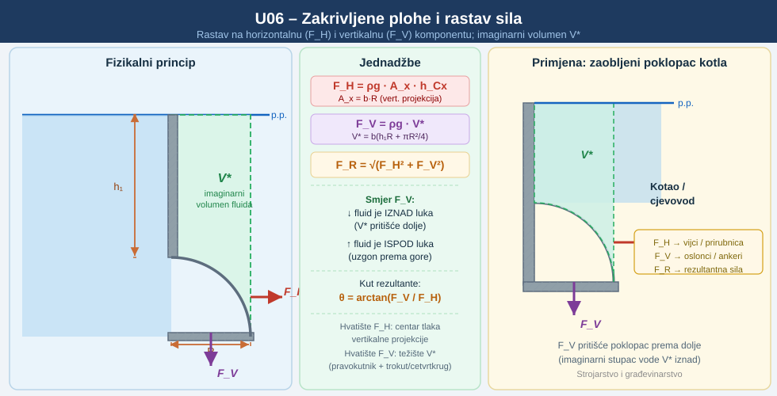
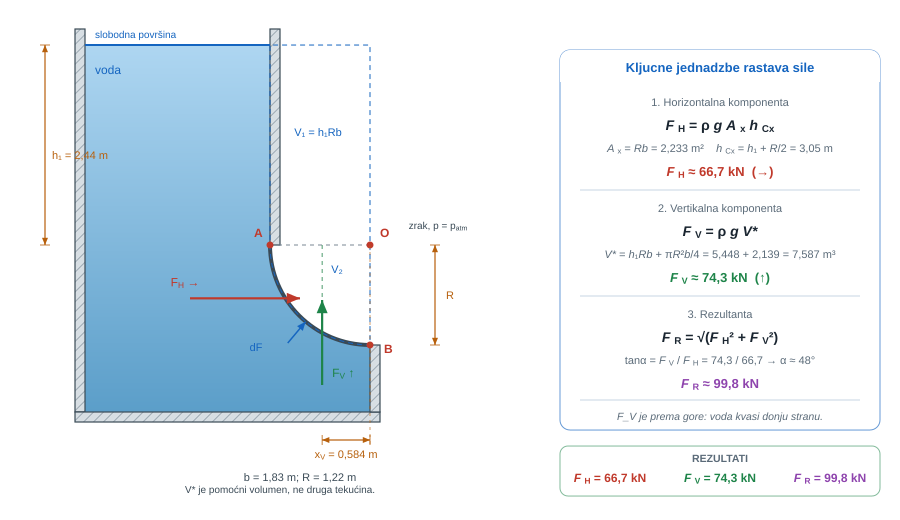
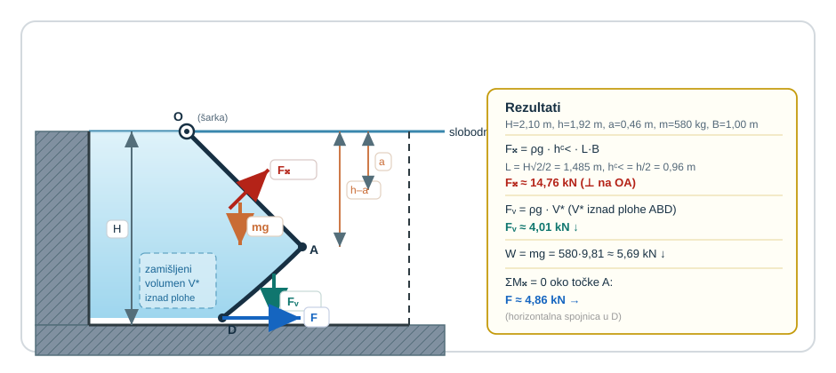
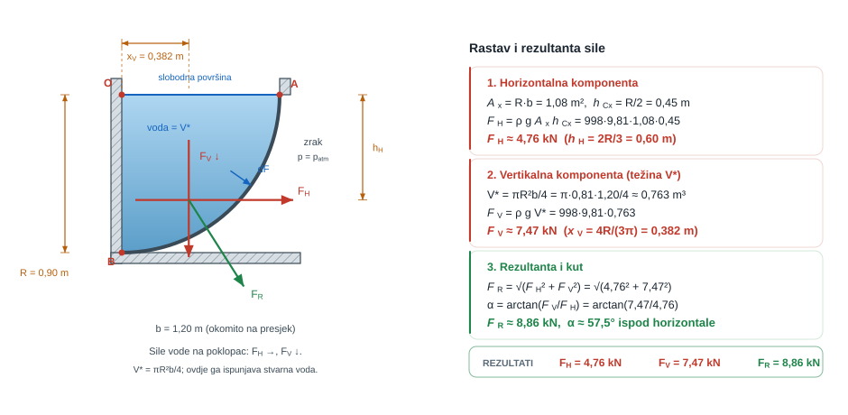
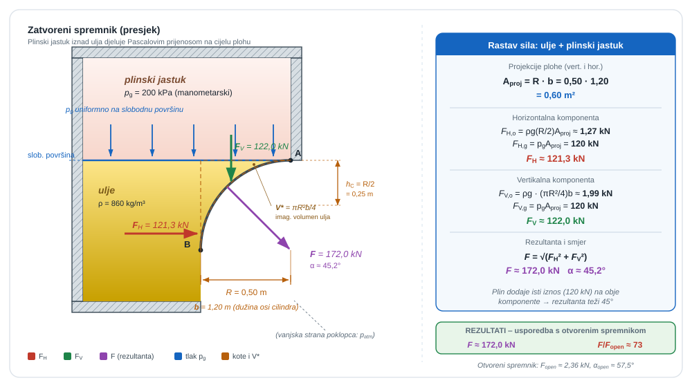
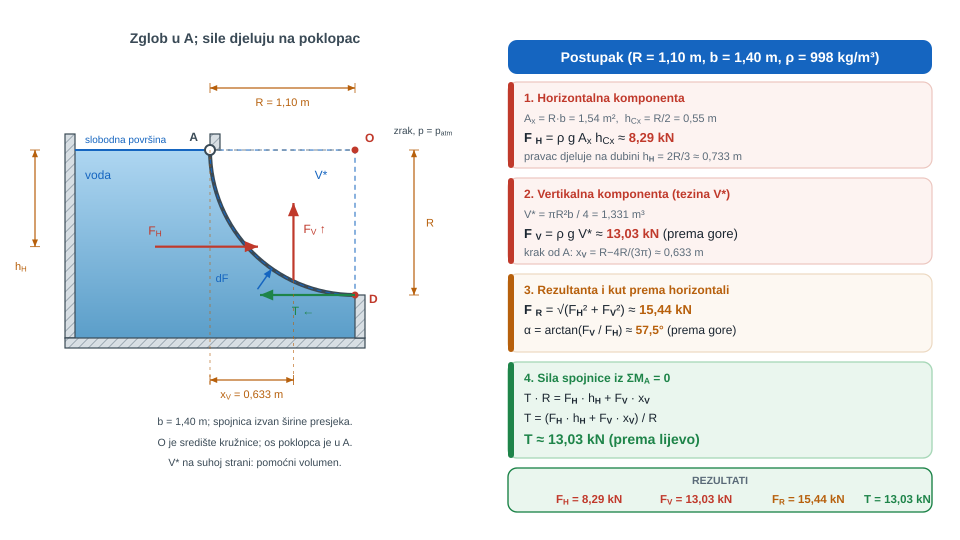
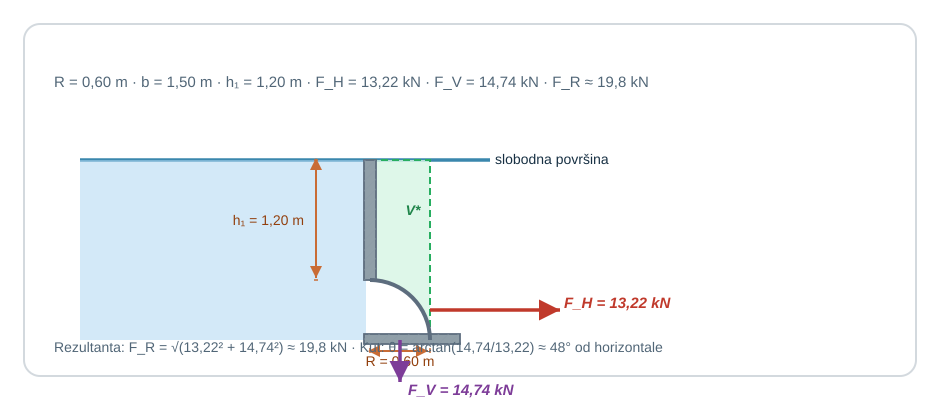
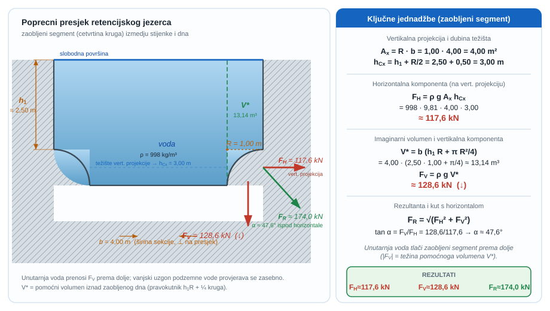
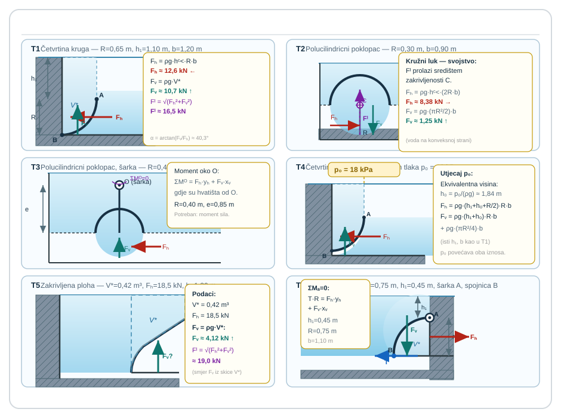

{#fig-uvod-u06 fig-align="center" style="width:100%;max-width:980px;" fig-alt="Pregled poglavlja: Zakrivljene plohe i rastav sila"}

## Zakrivljena ploha — nova geometrija razlaganja sile

Na zakrivljenoj stijenci fizika tlaka ostaje ista, ali geometrija sile postaje složenija.

Poglavlje zato ne uvodi novu fiziku, nego dvije stabilne radne navike: horizontalna komponenta sile čita se preko projekcije, a vertikalna preko težine zamišljenog volumena fluida.

::: {.mf1-application}

Inženjerski kontekst

Zakrivljene površine pojavljuju se na segmentnim ustavama, zaobljenim poklopcima spremnika, procesnim revizijskim otvorima i brodskim oplatama koje ne rade s ravnom stijenkom. U takvim sklopovima rezultat ne daje jedna zapamćena formula, nego rastav na projekciju i volumen, jer se tek tada može ispravno pročitati što opterećuje nosač vodoravno, a što ga gura ili rasterećuje okomito.
:::

::: {.mf1-priprema}

Prije čitanja poglavlja

**Predznanje koje se pretpostavlja:**

- sila na uronjenu ravnu plohu iz poglavlja pog. 5Hidrostatske sile na ravne i zakrivljene plohe;
- vektorska analiza, projekcije vektora na koordinatne osi;
- integracija po krivuljama i plohama, pojam težišta volumena;
- osnove statike krutog tijela.

**Ishodi učenja:**

- rastaviti hidrostatičku silu na zakrivljenu plohu na horizontalnu i vertikalnu komponentu;
- odrediti horizontalnu komponentu preko sile na vertikalnu projekciju plohe;
- odrediti vertikalnu komponentu preko težine imaginarnog volumena fluida između plohe i slobodne površine;
- ispravno utvrditi smjer vertikalne komponente (prema gore ili prema dolje).

**Procijenjeno vrijeme:** 5–6 sati za teoriju i izvode, 4 sata za rješavanje primjera i zadataka.
:::

## Fizikalni uvod i matematički izvod

Na zakrivljenoj plohi tlak i dalje djeluje okomito na svaki lokalni element površine, ali rezultantu više nije praktično tražiti izravno integracijom po svim smjerovima. Zato se sila rastavlja na dvije komponente:

$$F_H = \rho g A_x h_{Cx}$$

::: {.mf1-fizikalno-znacenje}

Fizikalno značenje

Horizontalna komponenta sile na zakrivljenu plohu jednaka je sili na zamišljenu ravnu (vertikalnu) plohu iste projekcije. Zakrivljenost plohe horizontalnu silu ne mijenja — ona ovisi samo o tome koliko je „široka" sjena plohe u vodoravnom smjeru i na kojoj je dubini njezino težište. Intuitivno: zakrivljenost preraspoređuje smjer lokalnih sila, ali ne mijenja ukupnu vodoravnu komponentu.
:::

gdje je $A_x$ vertikalna projekcija zakrivljene površine, a $h_{Cx}$ dubina težišta te projekcije, te

$$|F_V| = \rho gV^*$$

::: {.mf1-fizikalno-znacenje}

Fizikalno značenje

U otvorenom spremniku, kada se radi s manometarskim tlakom, **iznos** vertikalne komponente jednak je težini odgovarajućega pomoćnog volumena $V^*$. Predznak se ne određuje time je li nacrtani volumen „ispod slobodne površine”, nego iz stvarne okupane strane plohe: fluid iznad konkavne plohe opterećuje je prema dolje, a fluid ispod konveksne plohe gura je prema gore. Pomoćni volumen može ležati i na strani na kojoj stvarnoga fluida nema.
:::

gdje je $V^*$ geometrijski pomoćni volumen omeđen zakrivljenom površinom, vertikalnim bočnim plohama i vodoravnom plohom poznatoga tlaka.

::: {.mf1-interaktivno}

Interaktivni prikaz — Sila na zakrivljenu plohu

Interaktivni prikaz omogućuje mijenjanje polumjera krivulje, dubine vrha i širine plohe (četvrtina kruga uronjena u vodu) uz neposredno praćenje horizontalne i vertikalne komponente sile te rezultante s pripadnim kutom. Vektori sila pomažu intuitivno razumijevanje smjera djelovanja.

<a class="mf1-interaktivno-veza" href="https://martibasic.github.io/MF1_udzbenik/jlite/lab/index.html?path=u06_zakrivljena_ploha.ipynb">Pokreni u pregledniku</a>

**Pitanja za samostalno istraživanje:** (a) Kako se omjer $F_V/F_H$ mijenja kada dubina vrha $h_t$ teži k nuli? (b) Što se događa s istim omjerom pri velikim dubinama ($h_t \gg R$)? (c) Pri kojoj kombinaciji $R$ i $h_t$ rezultanta sile prolazi kroz središte krivulje?

:::

Najvažniji detalj nije sama formula, nego orijentacija sile. Uvedimo $\vec n_f$ kao jediničnu normalu usmjerenu **iz fluida prema stijenci**. Tada je sila fluida na stijenku

$$
d\vec F=p\,\vec n_f\,dA.
$$

Znak svake komponente čita se iz komponente normale $\vec n_f$ na stvarno okupanoj strani. Time se izbjegava nepouzdano pravilo zasnovano samo na položaju nacrtanoga pomoćnog volumena.

## Matematički izvod

Na lokalnom elementu zakrivljene plohe površine $dA$ tlak djeluje okomito na plohu, pa je elementarna sila fluida na stijenku

$$
d\vec F = p\,\vec n_f\,dA.
$$

Ako normala na plohu zatvara kut $\varphi$ s odabranim pozitivnim vodoravnim smjerom, horizontalna komponenta elementarne sile iznosi

$$
dF_x = p\,n_{f,x}\,dA=p\,dA\cos\varphi.
$$

Veličina $n_{f,x}dA$ jest **predznačena** površina projekcije na okomitu ravninu. Za plohu na kojoj se vodoravna komponenta normale ne mijenja po predznaku, iznos horizontalne komponente zato je

$$
F_H = \int p\,dA_x.
$$

Time horizontalna komponenta poprima isti matematički oblik kao sila na ravnu vertikalnu plohu projekcije $A_x$:

$$
F_H = \rho g A_x h_{Cx}.
$$

Vertikalnu komponentu često je jednostavnije dobiti ravnotežom pomoćnoga volumena nego integriranjem lokalnih kutova. U otvorenom spremniku s manometarskim tlakom njezin je iznos

$$
|F_V| = \rho gV^*.
$$

Ovdje je $V^*$ pomoćni volumen između zakrivljene plohe i vodoravne plohe na kojoj je manometarski tlak nula. Formula daje **magnitudu**; smjer se određuje iz $n_{f,z}$ na stvarno okupanoj strani. Ako na zatvarajućoj plohi djeluje nenulti jednoliki tlak, njegov se doprinos mora uključiti zasebno.

Jednako je važno znati i gdje te komponente djeluju. Horizontalna komponenta ima isti pravac djelovanja kao sila na vertikalnu projekciju zakrivljene plohe, pa se njezino hvatište dobiva kao centar tlaka te projekcije. Vertikalna komponenta prolazi kroz težište zamišljenoga volumena $V^*$, jer po ulozi odgovara njegovoj težini. Tek nakon toga komponente se smiju spojiti u jednu rezultantu i uključiti u momentnu ravnotežu poklopca, brane ili zatvarača.

Praktična provjera smjera glasi: nacrtaj jednu lokalnu tlačnu strelicu od fluida prema stijenci. Ako njezina vertikalna komponenta pokazuje prema dolje duž cijele plohe, i $F_V$ je prema dolje; ako pokazuje prema gore, i $F_V$ je prema gore. Nakon što su određene predznačene komponente, iznos rezultante dobiva se iz

$$
F_R = \sqrt{F_H^2 + F_V^2},
$$

a smjer rezultante određuje se iz odgovarajućeg omjera $F_V/F_H$. Ako je ploha dio cilindrične površine, pravac djelovanja rezultante dodatno prolazi središtem zakrivljenosti, što je često presudan geometrijski podatak za momentnu ravnotežu zatvarača i poklopaca.

::: {.callout-note}
## Razrada koraka
Korak: od $d\vec F=p\vec n_f\,dA$ → rastav na $F_H=\rho gA_xh_{Cx}$ i $|F_V|=\rho gV^*$

Elementarna sila fluida na stijenku $d\vec F=p\vec n_f\,dA$ djeluje okomito na element zakrivljene plohe. Ako komponenta normale u promatranom vodoravnom smjeru ne mijenja predznak:
$$
dF_H = p\,|n_{f,x}|dA = p\,dA_x,
$$
jer je $dA_x=|n_{f,x}|dA$ iznos vertikalne projekcije elementa. Integriranjem:
$$
F_H = \int p\,dA_x = \int \rho g y\,dA_x = \rho g h_{Cx} A_x.
$$
Za vertikalnu komponentu vrijedi $dF_z=p\,n_{f,z}dA$; iznos $|n_{f,z}|dA$ odgovara **horizontalnoj** projekciji elementa. Umjesto integriranja po kutovima može se primijeniti ravnoteža pomoćnoga volumena, čime se u otvorenom manometarskom slučaju dobiva $|F_V|=\rho gV^*$. Predznak se zatim uzima iz $n_{f,z}$, a ne iz samoga položaja $V^*$.
:::

::: {.mf1-izvod}

Matematički izvod — Vertikalna sila na zakrivljenu plohu — ravnoteža imaginarnog volumena fluida

Pomoćni volumen $V^*$ zatvara se zakrivljenom plohom, **okomitim bočnim plohama** i gornjom vodoravnom plohom $A_t$ na kojoj je tlak $p_t$ poznat. Bočne plohe nemaju vertikalnu komponentu tlačne sile. Najprije razmotrimo slučaj u kojem stvarni fluid leži iznad konkavne plohe, pa se taj volumen može izravno izdvojiti kao fluidno tijelo.

Na izdvojeni volumen djeluju težina $W^*=\rho gV^*$ prema dolje, sila $p_tA_t$ na gornjoj plohi prema dolje te sila stijenke na fluid prema gore. Ravnoteža zato daje

$$
F_{stijenka\to fluid,z}=\rho gV^*+p_tA_t.
$$

Po Newtonovu trećem zakonu sila fluida na konkavnu stijenku usmjerena je **prema dolje** i ima isti iznos. U otvorenom spremniku na slobodnoj površini $p_t=0$ manometarski, pa ostaje $|F_V|=\rho gV^*$.

Ako stvarni fluid kvasi suprotnu, konveksnu donju stranu plohe, lokalne normale $\vec n_f$ pokazuju s vertikalnom komponentom prema gore. Tada je sila fluida na stijenku **prema gore**; isti geometrijski volumen može poslužiti za magnitudu, ali nije stvarni „stupac koji sjedi na plohi”. Zato smjer uvijek treba potvrditi stvarnom okupanom stranom.

Najopćenitija kontrola jest izravni predznačeni integral

$$
F_V=\int_{A_z}p\,n_{f,z}\,dA
   =\int_{A_z}p\cos\theta_v\,dA,
$$

gdje je $\theta_v$ kut između $\vec n_f$ i pozitivne vertikale. Iznos $|n_{f,z}|dA$ jest horizontalna projekcija elementa. Integral i ravnoteža pomoćnoga volumena daju isti rezultat kada se dosljedno zadrže orijentacija normale, poznati tlak na zatvarajućoj plohi i reakcijski par fluid–stijenka.
:::

## Riješeni primjeri

::: {#ex-u06-potopljena-cetvrtina-kruga-t2 .mf1-we}

Riješeni primjer — Potopljena četvrtina kruga&nbsp;T2

**Kontekst:** U bočnoj stijenci spremnika potopljena je zakrivljena ploha oblika četvrtine kruga, ispod slobodne površine vode. Treba rastaviti hidrostatsku silu na horizontalnu i vertikalnu komponentu i odrediti iznos rezultante.

**Zadano**

- Polumjer četvrtine kruga zakrivljene površine `AB`: $R = 1{,}22\ \text{m}$
- Duljina spremnika okomito na presjek: $b = 1{,}83\ \text{m}$
- Dubina gornje točke zakrivljene površine ispod slobodne površine: $h_1 = 2{,}44\ \text{m}$
- Gustoća vode: $\rho = 998\ \text{kg/m}^3$

**Traženo**

1. horizontalnu komponentu sile $F_H$ i dubinu njezina hvatišta.
2. vertikalnu komponentu sile $F_V$ i vodoravni položaj njezina pravca djelovanja.
3. iznos rezultante $F_R$.

{#fig-u06-potopljena-cetvrtina-kruga fig-alt="potopljena četvrtina kruga"}

**Pretpostavke i model**

Horizontalna komponenta čita se preko vertikalne projekcije zakrivljene površine. Skica pokazuje da stvarna voda kvasi **konveksnu vanjsku i donju stranu** plohe `AB`, pa lokalne tlačne sile imaju vertikalne komponente prema gore. Pomoćni volumen $V^*$ nalazi se na suprotnoj, konkavnoj strani i služi samo za račun magnitude $|F_V|=\rho gV^*$.

**Rješenje**

#### 1. Horizontalna komponenta

Vertikalna projekcija zakrivljene površine jest pravokutnik površine

$$
A_x = Rb = 1{,}22 \cdot 1{,}83 = 2{,}233\ \text{m}^2.
$$

Dubina težišta te projekcije iznosi

$$
h_{Cx} = h_1 + \frac{R}{2} = 2{,}44 + 0{,}61 = 3{,}05\ \text{m}.
$$

Zato je horizontalna komponenta sile

$$
F_H = \rho g A_x h_{Cx} = 998 \cdot 9{,}81 \cdot 2{,}233 \cdot 3{,}05 \approx 6{,}67 \cdot 10^4\ \text{N} = 66{,}7\ \text{kN}.
$$

Dubina hvatišta horizontalne komponente dobiva se kao centar tlaka vertikalne projekcije:

$$
h_{FH} = h_{Cx} + \frac{I_G}{h_{Cx}A_x},
$$

pri čemu je za pravokutnik

$$
I_G = \frac{bR^3}{12} = \frac{1{,}83 \cdot 1{,}22^3}{12} = 0{,}277\ \text{m}^4.
$$

Zato je

$$
h_{FH} = 3{,}05 + \frac{0{,}277}{3{,}05 \cdot 2{,}233} \approx 3{,}09\ \text{m}.
$$

#### 2. Vertikalna komponenta

Magnituda vertikalne komponente jednaka je težini geometrijskoga pomoćnog volumena na konkavnoj strani plohe `AB`. Taj volumen sastoji se od:

1. pravokutnog bloka volumena $V_1 = h_1Rb$.
2. četvrtine cilindra volumena $V_2 = \frac{\pi R^2}{4}b$.

Numerički:

$$
V_1 = 2{,}44 \cdot 1{,}22 \cdot 1{,}83 = 5{,}448\ \text{m}^3,
$$

$$
V_2 = \frac{\pi \cdot 1{,}22^2}{4} \cdot 1{,}83 = 2{,}139\ \text{m}^3,
$$

pa je ukupni volumen

$$
V^* = V_1 + V_2 = 7{,}587\ \text{m}^3.
$$

Odakle slijedi

$$
F_V = \rho g V^* = 998 \cdot 9{,}81 \cdot 7{,}587 \approx 7{,}43 \cdot 10^4\ \text{N} = 74{,}3\ \text{kN}.
$$

Smjer sile je **prema gore**, jer stvarna voda kvasi konveksnu donju stranu plohe i tlači je prema gore. Pomoćni volumen nije stvarni stupac vode na toj strani konstrukcije.

Vodoravni položaj pravca djelovanja dobiva se iz težišta tog volumena:

$$
x_{FV} = \frac{V_1 x_1 + V_2 x_2}{V_1 + V_2},
$$

gdje je za pravokutni dio $x_1 = R/2 = 0{,}61\ \text{m}$, a za četvrtinu kruga $x_2 = \frac{4R}{3\pi} = 0{,}518\ \text{m}$. Zato je

$$
x_{FV} = \frac{5{,}448 \cdot 0{,}61 + 2{,}139 \cdot 0{,}518}{7{,}587} \approx 0{,}584\ \text{m}.
$$

#### 3. Rezultanta

Kako su komponente okomite jedna na drugu, iznos rezultante je

$$
F_R = \sqrt{F_H^2 + F_V^2} = \sqrt{66{,}7^2 + 74{,}3^2}\ \text{kN} \approx 99{,}8\ \text{kN}.
$$

**Provjera i komentar**

1. Ovdje je $F_V$ prema gore jer je stvarna okupana strana konveksna i nalazi se ispod plohe; sam položaj pomoćnoga volumena prema slobodnoj površini nije kriterij smjera.
2. Horizontalna komponenta mora se dobiti iz projekcije, pa je razumno reda sile na ravnu vertikalnu plohu sličnih dimenzija.
3. Rezultanta mora biti veća od svake pojedine komponente, ali manja od njihova aritmetičkog zbroja.
:::

Tek nakon tog baznog rastava ima smisla prijeći na složeniji zatvarač u kojem se na zakrivljeni dio nadovezuju još ravni segment, vlastita težina konstrukcije i momentna ravnoteža.

::: {#ex-u06-sklopiva-servisna-brana-s-zakrivljenim-rubom-t2 .mf1-we}

Riješeni primjer — Sklopiva servisna brana s zakrivljenim rubom&nbsp;T2

**Kontekst:** U hidrotehničkom objektu sklopiva servisna brana s ravnim i zakrivljenim segmentom okretljivo je vezana pri slobodnoj površini. Treba odrediti hidrostatske komponente na pojedinim dijelovima i silu držanja koja drži branu zatvorenom.

**Zadano**

- Jedinična širina servisne brane: $B = 1{,}00\ \text{m}$
- Brana je okretljivo vezana u točki `O` na razini slobodne površine
- Ravni segment `OA` nagnut je pod kutom $45^\circ$ prema dolje; zakrivljeni rub `ABD` nadovezuje se na njega (vidjeti skicu)
- Masa brane: $m = 580\ \text{kg}$
- Gustoća vode: $\rho = 998\ \text{kg/m}^3$
- Geometrija presjeka: $H = 2{,}10\ \text{m}$, $h = 1{,}92\ \text{m}$, $a = 0{,}46\ \text{m}$
- Duljina ravnog dijela: $L = (h-a)\sqrt{2}$
- Pomoćna mjera zakrivljenog ruba: $y = H + a - h$
- Brana se pridržava vodoravnom silom $F$ u donjoj točki `D`

**Traženo**

1. Odredite silu hidrostatskog tlaka na ravni dio `OA` i položaj njezina hvatišta.
2. Odredite vertikalnu komponentu sile hidrostatskog tlaka na zakrivljeni dio `ABD` i navedite njezin smjer.
3. Odredite silu $F$ potrebnu da brana ostane u ravnotezi.

Zanemarite debljinu stijenke i mali uzgon na dvostruko okupanom tankom dijelu konstrukcije.

{#fig-u06-sklopiva-servisna-brana-s-zakrivljenim-rubom fig-alt="sklopiva servisna brana s zakrivljenim rubom"}

**Pretpostavke i model**

Ravni dio `OA` tretira se kao klasična ravna ploha nagnuta pod $45^\circ$. Na zakrivljenom rubu `ABD` stvarna voda prema skici kvasi njegovu gornju, konkavnu stranu, pa lokalne tlačne strelice imaju vertikalnu komponentu prema dolje. Magnituda se dobiva iz pomoćnoga volumena.

**Rješenje**

Najprije se iz geometrije dobiva duljina ravnog dijela:

$$
L = (h-a)\sqrt{2} = (1{,}92 - 0{,}46)\sqrt{2} \approx 2{,}065\ \text{m},
$$

te pomoćna mjera zakrivljenog ruba:

$$
y = H + a - h = 2{,}10 + 0{,}46 - 1{,}92 = 0{,}64\ \text{m}.
$$

#### 1. Sila na ravni dio `OA`

Težište ravnog dijela nalazi se na dubini

$$
h_C = \frac{h-a}{2} = \frac{1{,}92 - 0{,}46}{2} = 0{,}73\ \text{m},
$$

pa je sila hidrostatskog tlaka na taj segment

$$
F_{OA} = \rho g h_C A = \rho g \frac{h-a}{2} \cdot L \cdot B = 998 \cdot 9{,}81 \cdot 0{,}73 \cdot 2{,}065 \cdot 1{,}00 \approx 14757\ \text{N} \approx 14{,}76\ \text{kN}.
$$

Kako gornji rub ravnog segmenta leži na slobodnoj površini, pomak hvatišta od težišta po ravnini iznosi

$$
\Delta y = \frac{I_{\xi\xi}}{h_C A} = \frac{L}{6} \approx 0{,}344\ \text{m}.
$$

Zato je krak sile $F_{OA}$ u odnosu na zglob `O`

$$
\frac{L}{2} - \Delta y = \frac{L}{3} \approx 0{,}688\ \text{m}.
$$

#### 2. Vertikalna komponenta na zakrivljeni rub `ABD`

Magnituda vertikalne komponente jednaka je težini pomoćnoga volumena koji definira zakrivljeni rub. U ovoj geometriji taj se volumen svodi na pravokutni blok volumena $V^*=y^2B$, pa je

$$
F_V = \rho g y^2 B = 998 \cdot 9{,}81 \cdot 0{,}64^2 \cdot 1{,}00 \approx 4010\ \text{N} \approx 4{,}01\ \text{kN}.
$$

Smjer ove sile je **prema dolje**, jer voda kvasi gornju, konkavnu stranu zakrivljenoga ruba. To je tlačno opterećenje vode, a ne „podtlačni doprinos iznad slobodne površine”.

#### 3. Sila držanja u točki `D`

Težina brane iznosi

$$
W = mg = 580 \cdot 9{,}81 = 5689{,}8\ \text{N}.
$$

Iz ravnoteze momenata oko točke `O` slijedi

$$
F \cdot H + F_{OA}\left(\frac{L}{2} - \Delta y\right) - (W + F_V)\cdot H = 0,
$$

pa je tražena sila držanja

$$
F = \frac{(W + F_V)H - F_{OA}(L/2 - \Delta y)}{H} = \frac{(5689{,}8 + 4010)\cdot 2{,}10 - 14756{,}7 \cdot 0{,}688}{2{,}10} \approx 4864\ \text{N} \approx 4{,}86\ \text{kN}.
$$

**Provjera i komentar**

1. Vertikalna komponenta nije golema, ali nije ni zanemariva: reda je nekoliko kilonjutna, što je sasvim razumno za geometriju s pomoćnom mjerom $y = 0{,}64\ \text{m}$.
2. Sila na ravni dio mora biti veća od vertikalne komponente zakrivljenog ruba jer je ravna opločena površina veća i nalazi se dublje.
3. Sila držanja manja je od zbroja nizvodnih sila jer dio opterećenja već preuzima moment sile na ravnom segmentu.
:::

Za zatvaranje poglavlja korisno je vratiti se i na čistu referentnu geometriju u kojoj je zakrivljena površina neposredno vezana uz slobodnu površinu. Tada se najjasnije vidi kako projekcija daje $F_H$, imaginarni volumen daje $F_V$, a rezultanta se dobiva tek na kraju.

::: {#ex-u06-cetvrtcilindricni-revizijski-poklopac-uz-slobodnu-povrsinu-t2 .mf1-we}

Riješeni primjer — Četvrtcilindrični revizijski poklopac uz slobodnu površinu&nbsp;T2

**Kontekst:** Na bočnoj stijenci spremnika ugrađen je četvrtcilindrični revizijski poklopac čiji gornji rub leži upravo na slobodnoj površini vode. Treba rastaviti hidrostatsku silu na komponente i odrediti iznos i smjer rezultante.

**Zadano**

- Širina četvrtcilindričnog poklopca (jedinična osi): $b = 1{,}20\ \text{m}$
- Polumjer zakrivljenosti poklopca: $R = 0{,}90\ \text{m}$
- Gornja točka zakrivljene površine nalazi se na slobodnoj površini vode
- Gustoća vode: $\rho = 998\ \text{kg/m}^3$

**Traženo**

1. horizontalnu komponentu sile $F_H$ i dubinu njezina pravca djelovanja.
2. vertikalnu komponentu sile $F_V$ i vodoravni položaj njezina pravca djelovanja.
3. iznos rezultante $F_R$ i kut koji zatvara s horizontalom.

{#fig-u06-cetvrtcilindricni-poklopac fig-alt="četvrtcilindrični poklopac"}

**Pretpostavke i model**

Kako gornji rub poklopca leži na slobodnoj površini, vertikalna projekcija je pravokutnik visine $R$, a pomoćni volumen iznad zakrivljene plohe četvrtina je valjka. Na skici voda kvasi konveksnu gornju i lijevu stranu plohe; lokalne normale od fluida prema stijenci imaju komponente prema dolje, pa je i vertikalna komponenta prema dolje.

**Rješenje**

#### 1. Horizontalna komponenta

Vertikalna projekcija zakrivljene plohe jest pravokutnik površine

$$
A_x = Rb = 0{,}90 \cdot 1{,}20 = 1{,}08\ \text{m}^2.
$$

Dubina težišta te projekcije iznosi

$$
h_{Cx} = \frac{R}{2} = 0{,}45\ \text{m},
$$

pa je horizontalna komponenta sile

$$
F_H = \rho g A_x h_{Cx} = 998 \cdot 9{,}81 \cdot 1{,}08 \cdot 0{,}45 \approx 4758\ \text{N} \approx 4{,}76\ \text{kN}.
$$

Kako projekcija počinje na slobodnoj površini, dubina pravca djelovanja horizontalne komponente jednaka je centru tlaka tog pravokutnika:

$$
h_H = \frac{2R}{3} = 0{,}60\ \text{m}.
$$

#### 2. Vertikalna komponenta

Magnituda vertikalne komponente jednaka je težini pomoćnoga volumena vode iznad zakrivljene plohe. Ovdje je taj volumen četvrtina valjka:

$$
V^* = \frac{\pi R^2}{4} b = \frac{\pi \cdot 0{,}90^2}{4} \cdot 1{,}20 \approx 0{,}763\ \text{m}^3.
$$

Zato je

$$
F_V = \rho g V^* = 998 \cdot 9{,}81 \cdot 0{,}763 \approx 7474\ \text{N} \approx 7{,}47\ \text{kN}.
$$

Smjer je **prema dolje** jer lokalne normale od stvarne vode prema stijenci na prikazanoj konveksnoj strani imaju komponente prema dolje. Pravac djelovanja te sile prolazi težištem pomoćne četvrtine kruga, pa je vodoravna udaljenost od okomite stijenke

$$
x_V = \frac{4R}{3\pi} = \frac{4 \cdot 0{,}90}{3\pi} \approx 0{,}382\ \text{m}.
$$

#### 3. Rezultanta

Kako su komponente okomite jedna na drugu, iznos rezultante je

$$
F_R = \sqrt{F_H^2 + F_V^2} = \sqrt{4{,}76^2 + 7{,}47^2}\ \text{kN} \approx 8{,}86\ \text{kN}.
$$

Kut rezultante prema horizontalnoj osi glasi

$$
\alpha = \arctan\left(\frac{F_V}{F_H}\right) = \arctan\left(\frac{7{,}47}{4{,}76}\right) \approx 57{,}5^\circ
$$

prema dolje u odnosu na horizontalu.

**Provjera i komentar**

1. Vertikalna komponenta mora biti veća od horizontalne jer je imaginarni volumen ovdje razmjerno velik u odnosu na projekciju.
2. Pravac djelovanja $F_H$ mora biti dublje od težišta projekcije, pa je $h_H > R/2$ fizikalno očekivan rezultat.
3. Rezultanta mora biti veća od svake pojedine komponente, ali manja od njihova zbroja.
:::

::: {#ex-u06-cetvrtcilindricni-poklopac-u-zatvorenom-spremniku-s-plinskim .mf1-we}

Riješeni primjer — Četvrtcilindrični poklopac u zatvorenom spremniku s plinskim jastukom&nbsp;T2

**Kontekst:** U zatvorenom hidropneumatskom servisnom spremniku iznad slobodne površine ulja djeluje plinski jastuk pod manometarskim pretlakom. Treba razdvojiti doprinose hidrostatskog tlaka ulja i ravnomjernog plinskog tlaka na zakrivljenom poklopcu i usporediti rezultantu s otvorenim slučajem.

**Zadano**

Hidropneumatski servisni spremnik ima oblik zatvorenog cilindra. Donji dio spremnika ispunjen je uljem do razdjelnice; iznad nje nalazi se plinski jastuk (dušik) pod **manometarskim** pretlakom. Na bočnoj stijenci nalazi se četvrtcilindrični inspekcijski poklopac. Na skici ulje kvasi **unutarnju konveksnu stranu** poklopca; lokalne normale od ulja prema poklopcu usmjerene su prema van iz spremnika i imaju vertikalnu komponentu prema dolje. Zato su $F_H$ i $F_V$ usmjerene kako je prikazano.

- Polumjer zakrivljenosti poklopca: $R = 0{,}50\ \text{m}$
- Širina poklopca uzduž osi zakrivljenja: $b = 1{,}20\ \text{m}$
- Gornji rub poklopca poklapa se s razinom slobodne površine ulja
- Gustoća ulja: $\rho = 860\ \text{kg/m}^3$
- Manometarski tlak plinskog jastuka: $p_g = 200\ \text{kPa}$
- Vanjska strana poklopca je na atmosferskom tlaku
- $g = 9{,}81\ \text{m/s}^2$

**Traženo**

1. Horizontalna komponenta sile na poklopac $F_H$ s razdvojenim doprinosima ulja i plina.
2. Vertikalna komponenta $F_V$ s razdvojenim doprinosima.
3. Iznos i smjer rezultantne sile $F$ na poklopac.
4. Usporediti s otvorenim spremnikom (kad bi $p_g = 0$): za koliko se mijenjaju $F_H$, $F_V$, kut nagiba rezultante?

{#fig-u06-plinski-jastuk fig-align="center" fig-alt="Četvrtcilindrični poklopac u zatvorenom spremniku s plinskim jastukom pod tlakom $p_g = 200$ kPa iznad slobodne površine ulja ($\rho = 860$ kg/m³). Plinski jastuk dodaje uniformni pomak tlaka na cijelu plohu."}

**Pretpostavke i model**

Sustav je u mirovanju – razmatra se čista hidrostatika. Plin je dovoljno laganog hidrostatičkog stupca da se njegova vlastita "težina" zanemari, pa je tlak plina **jednak na cijeloj slobodnoj površini ulja**. Plin svojim tlakom djeluje ravnomjerno na slobodnu površinu, a Pascalov princip prenosi taj tlak kroz mirujuće ulje na cijelu unutarnju stijenku spremnika – uključujući i poklopac. Zato se tlak u dubini $h$ ispod slobodne površine ulja računa kao $p(h) = p_g + \rho g h$.

To znači da na svaku komponentu sile postoje **dva aditivna doprinosa**: jedan od hidrostatskog tlaka ulja kao i u otvorenom spremniku, te drugi od plinskog jastuka kao da je plin svojim tlakom $p_g$ uniformno pritisnuo plohu. Komponente sila zbog plina prirodno se pišu preko **projekcija** plohe – jer uniformni tlak na zakrivljenoj plohi daje silu na njezinim projekcijama.

**Rješenje**

**Projekcije plohe.** Vertikalna projekcija plohe (na vertikalnu ravninu okomitu na os zakrivljenja) je pravokutnik visine $R$ i širine $b$. Horizontalna projekcija (na horizontalnu ravninu) je pravokutnik dimenzija $R \cdot b$ – iste površine kao vertikalna, jer kod četvrtkruga te dvije projekcije imaju iste dimenzije.

$$
A_{proj,v} = A_{proj,h} = R \cdot b = 0{,}50 \cdot 1{,}20 = 0{,}60\ \text{m}^2.
$$

**Horizontalna komponenta $F_H$.** Doprinos ulja ($F_{H,o}$) preko težišta vertikalne projekcije, koje je na dubini $h_C = R/2 = 0{,}25$ m:

$$
F_{H,o} = \rho g h_C A_{proj,v} = 860 \cdot 9{,}81 \cdot 0{,}25 \cdot 0{,}60 \approx 1265\ \text{N} \approx 1{,}27\ \text{kN}.
$$

Doprinos plina ($F_{H,g}$) – uniformni tlak $p_g$ na istu projekciju:

$$
F_{H,g} = p_g A_{proj,v} = 200\,000 \cdot 0{,}60 = 120\,000\ \text{N} = 120\ \text{kN}.
$$

Ukupno:

$$
F_H = F_{H,o} + F_{H,g} \approx 1{,}27 + 120 \approx 121{,}3\ \text{kN}.
$$

**Vertikalna komponenta $F_V$.** Doprinos ulja ($F_{V,o}$) po magnitudi je jednak težini pomoćnoga četvrtkružnog volumena iznad plohe i usmjeren je prema dolje:

$$
V_{imag} = \frac{\pi R^2}{4} \cdot b = \frac{\pi \cdot 0{,}50^2}{4} \cdot 1{,}20 \approx 0{,}2356\ \text{m}^3,
$$

$$
F_{V,o} = \rho g V_{imag} = 860 \cdot 9{,}81 \cdot 0{,}2356 \approx 1{,}99\ \text{kN}.
$$

Doprinos plina ($F_{V,g}$) – uniformni tlak $p_g$ na horizontalnu projekciju:

$$
F_{V,g} = p_g A_{proj,h} = 200\,000 \cdot 0{,}60 = 120\,000\ \text{N} = 120\ \text{kN}.
$$

Ukupno:

$$
F_V = F_{V,o} + F_{V,g} \approx 1{,}99 + 120 \approx 122{,}0\ \text{kN}.
$$

**Iznos i smjer rezultante** (kut ispod horizontale):

$$
F = \sqrt{F_H^2 + F_V^2} \approx \sqrt{121{,}3^2 + 122{,}0^2} \approx 172{,}0\ \text{kN},
$$

$$
\alpha = \arctan\frac{F_V}{F_H} = \arctan\frac{122{,}0}{121{,}3} \approx 45{,}2^\circ.
$$

**Usporedba s otvorenim spremnikom** ($p_g = 0$):

$$
F_{H,open} = 1{,}27\ \text{kN}, \quad F_{V,open} = 1{,}99\ \text{kN},
$$

$$
F_{open} = \sqrt{1{,}27^2 + 1{,}99^2} \approx 2{,}36\ \text{kN}, \quad \alpha_{open} \approx 57{,}5^\circ.
$$

Omjer rezultanti $F / F_{open} \approx 73$.

**Provjera i komentar**

1. Plinski jastuk ovdje dodaje **isti** iznos sile (120 kN) na obje komponente jer su dvije projekcije baš ove četvrtcilindrične plohe jednake ($Rb$). Zato pri dominantnom $p_g$ kut teži $45^\circ$; to nije rezultat neovisan o geometriji općenite zakrivljene plohe.
2. Zakrivljenost plohe i tip fluida postaju **sekundarni** ako je $p_g \gg \rho g R$. Pri ulja na dubini $R = 0{,}50$ m hidrostatski tlak iznosi svega $\rho g R \approx 4{,}2$ kPa – pedeset puta manje od plinskog $p_g$. Zato hidrostatski doprinos čini manje od $1\%$ ukupne sile.
3. U ovom primjeru $p_g\gg\rho gR$, pa jednoliki plinski tlak dominira opterećenjem. Dobivene komponente ipak nisu proračun čvrstoće tlačne posude ili vijčanoga spoja: za to trebaju membranska i lokalna naprezanja, geometrijski diskontinuiteti, materijal, ciklusi, brtvljenje i mjerodavni propisi.
4. Hvatišta dvaju doprinosa $F_V$ nisu ista: $F_{V,o}$ djeluje u centroidu imaginarnog četvrtkružnog volumena ($x_o = 4R/3\pi \approx 0{,}212$ m od osi simetrije), a $F_{V,g}$ djeluje u centroidu horizontalne projekcije, pravokutnika ($x_g = R/2 = 0{,}25$ m). Pri momentnom proračunu vijaka treba računati sa zbirnim hvatištem, ne s jednim "prosjekom".
:::

::: {#ex-u06-cetvrtcilindricni-poklopac-s-vodoravnom-spojnicom-t3 .mf1-ch}

Cjeloviti zadatak — Četvrtcilindrični poklopac s vodoravnom spojnicom&nbsp;T3

**Kontekst:** U servisnom spremniku četvrtcilindrični poklopac zglobno je vezan u gornjoj točki, a donji rub pridržava vodoravna spojnica. Treba odrediti komponente hidrostatske sile, rezultantu i silu koju spojnica mora preuzeti da poklopac ostane zatvoren.

**Zadano**

- Širina četvrtcilindričnog servisnog poklopca: $b = 1{,}40\ \text{m}$
- Polumjer zakrivljenosti poklopca: $R = 1{,}10\ \text{m}$
- Gornja točka `A` poklopca nalazi se na slobodnoj površini vode
- Poklopac je okretljivo vezan u točki `A`; u donjoj točki `D` pridržava se vodoravnom spojnicom
- Gustoća vode: $\rho = 998\ \text{kg/m}^3$
- Zanemaruju se vlastita težina poklopca i trenje u zglobu

**Traženo**

1. horizontalnu komponentu sile $F_H$ i dubinu njezina pravca djelovanja $h_H$.
2. vertikalnu komponentu sile $F_V$ i vodoravni položaj njezina pravca djelovanja $x_V$.
3. iznos rezultante $F_R$ i kut koji zatvara s horizontalom.
4. silu spojnice $T$ potrebnu da poklopac ostane zatvoren.

{#fig-u06-cetvrtcilindricni-poklopac-s-vodoravnom-spojnicom fig-alt="četvrtcilindrični poklopac s vodoravnom spojnicom"}

**Pretpostavke i model**

Ovo je i dalje čista hidrostatska sila na zakrivljenoj plohi, ali sada komponente više nisu konačni odgovor. Na prikazanoj geometriji voda kvasi konveksnu donju i lijevu stranu poklopca. Lokalne normale od vode prema stijenci imaju vertikalne komponente prema gore, pa je $F_V$ prema gore. Horizontalna komponenta čita se preko vertikalne projekcije, magnituda vertikalne preko težine pomoćnoga volumena, a tek se zatim iz ravnoteže momenata oko zgloba `A` dobiva potrebna sila držanja spojnice.

**Rješenje**

#### 1. Horizontalna komponenta

Vertikalna projekcija zakrivljene plohe jest pravokutnik površine

$$
A_x = Rb = 1{,}10 \cdot 1{,}40 = 1{,}54\ \text{m}^2.
$$

Dubina težišta te projekcije iznosi

$$
h_{Cx} = \frac{R}{2} = 0{,}55\ \text{m},
$$

pa je horizontalna komponenta sile

$$
F_H = \rho g A_x h_{Cx} = 998 \cdot 9{,}81 \cdot 1{,}54 \cdot 0{,}55 \approx 8292\ \text{N} \approx 8{,}29\ \text{kN}.
$$

Kako projekcija počinje na slobodnoj površini, dubina pravca djelovanja horizontalne komponente jednaka je centru tlaka tog pravokutnika:

$$
h_H = \frac{2R}{3} = \frac{2 \cdot 1{,}10}{3} \approx 0{,}733\ \text{m}.
$$

#### 2. Vertikalna komponenta

Magnituda vertikalne komponente jednaka je težini pomoćnoga volumena iznad zakrivljene plohe. Ovdje je taj volumen četvrtina valjka:

$$
V^* = \frac{\pi R^2}{4} b = \frac{\pi \cdot 1{,}10^2}{4} \cdot 1{,}40 \approx 1{,}331\ \text{m}^3.
$$

Zato je

$$
F_V = \rho g V^* = 998 \cdot 9{,}81 \cdot 1{,}331 \approx 13026\ \text{N} \approx 13{,}03\ \text{kN}.
$$

Smjer je **prema gore** jer voda kvasi konveksnu donju stranu plohe. Pomoćna četvrtina kruga leži na suprotnoj strani luka; njezino je težište udaljeno $4R/(3\pi)$ od desnoga radijusa, pa je vodoravni krak sile prema zglobu `A`

$$
x_V=R-\frac{4R}{3\pi}
=1{,}10-\frac{4\cdot1{,}10}{3\pi}
\approx0{,}633\ \text{m}.
$$

#### 3. Rezultanta

Kako su komponente okomite jedna na drugu, iznos rezultante je

$$
F_R = \sqrt{F_H^2 + F_V^2} = \sqrt{8{,}29^2 + 13{,}03^2}\ \text{kN} \approx 15{,}44\ \text{kN}.
$$

Kut rezultante prema horizontalnoj osi glasi

$$
\alpha = \arctan\left(\frac{F_V}{F_H}\right) = \arctan\left(\frac{13{,}03}{8{,}29}\right) \approx 57{,}5^\circ
$$

prema gore u odnosu na horizontalu.

#### 4. Sila spojnice

Obje hidrostatske komponente otvaraju poklopac oko zgloba `A`, pa iz ravnoteze momenata oko te točke vrijedi

$$
T R = F_H h_H + F_V x_V \quad \Rightarrow \quad T = \frac{F_H h_H + F_V x_V}{R}.
$$

Uvrstavanjem brojeva dobiva se potrebna sila spojnice

$$
T = \frac{8292 \cdot 0{,}733 + 13026 \cdot 0{,}633}{1{,}10} \approx 13026\ \text{N} \approx 13{,}03\ \text{kN}.
$$

**Provjera i komentar**

Ovaj cjeloviti zadatak zatvara puni radni luk pog. 5Hidrostatske sile na ravne i zakrivljene plohe u jednom zatvaraču: projekcija daje $F_H\approx8{,}29\ \text{kN}$ na dubini $0{,}733\ \text{m}$, pomoćni volumen daje $F_V\approx13{,}03\ \text{kN}$ prema gore s krakom $0{,}633\ \text{m}$, a rezultanta iznosi oko $15{,}44\ \text{kN}$. Da bi poklopac ostao zatvoren, vodoravna spojnica mora preuzeti silu od oko $13{,}03\ \text{kN}$.

1. Kako voda na skici kvasi konveksnu donju stranu plohe, $F_V$ mora biti prema gore, a ne prema dolje.
2. Sila spojnice istoga je reda veličine kao rezultanta jer djeluje s punim krakom $R$; njezin se iznos dobiva iz momenata, a ne usporedbom magnituda sila.
3. Ako se pri momentu oko `A` uzme krak $F_H$ jednak polumjeru umjesto dubine $h_H$, geometrija pravca djelovanja nije dobro pročitana.
:::

::: {#ex-u06-hidrostatska-sila-na-zaobljeni-prijelaz-otvorenoga-kalibracijskog .mf1-we}

Riješeni primjer — Hidrostatska sila na zaobljeni prijelaz otvorenoga kalibracijskog spremnika &nbsp;T2

**Primjer za strojare**

**Kontekst:** Otvoreni kalibracijski spremnik u procesnom laboratoriju ima zaobljeni unutarnji prijelaz boka u dno u obliku četvrtine kruga. Spremnik se polagano puni vodom kako bi se izdvojilo gravitacijsko hidrostatsko opterećenje segmenta. Ovo nije proračun tlačne posude niti propisani hidrotest pod nadtlakom.

**Zadano**

- Polumjer zakrivljenja: $R = 0{,}60\ \text{m}$
- Širina segmenta okomito na presjek: $b = 1{,}50\ \text{m}$
- Slobodna površina je $h_1 = 1{,}20\ \text{m}$ iznad vrha zaobljenog segmenta
- Gustoća vode: $\rho = 998\ \text{kg/m}^3$

**Traženo**

Horizontalna i vertikalna komponenta sile te iznos rezultante.

{#fig-u06-zaobljeni-poklopac-kotla fig-align="center" style="width:100%;max-width:940px;" fig-alt="Zaobljeni prijelaz otvorenoga kalibracijskog spremnika: R=0,60 m, b=1,50 m, h₁=1,20 m, F_H=13,22 kN, F_V=14,74 kN prema dolje"}

**Pretpostavke i model**

Zaobljeni segment je četvrtina kruga. Voda kvasi njegovu konkavnu stranu odozgo, pa je $F_V$ prema dolje. $F_H$ se računa po vertikalnoj projekciji, a magnituda $F_V$ po pomoćnom volumenu (pravokutnik + četvrtina kruga) iznad segmenta.

**Rješenje**

$$
A_x = R\cdot b = 0{,}60 \cdot 1{,}50 = 0{,}90\ \text{m}^2, \quad h_{Cx} = h_1 + R/2 = 1{,}20 + 0{,}30 = 1{,}50\ \text{m}
$$

$$
F_H = 998 \cdot 9{,}81 \cdot 0{,}90 \cdot 1{,}50 = 13{,}22\ \text{kN}
$$

$$
V^* = b\!\left(h_1 R + \tfrac{\pi R^2}{4}\right) = 1{,}50\!\left(1{,}20 \cdot 0{,}60 + \tfrac{\pi \cdot 0{,}36}{4}\right) = 1{,}50 \cdot 1{,}003 = 1{,}505\ \text{m}^3
$$

$$
F_V = 998 \cdot 9{,}81 \cdot 1{,}505 = 14{,}74\ \text{kN}\quad(\downarrow)
$$

$$
F_R = \sqrt{13{,}22^2 + 14{,}74^2} \approx 19{,}8\ \text{kN}
$$

**Provjera i komentar**

$F_V$ je prema dolje jer voda kvasi konkavnu stranu segmenta odozgo. Rezultanta iznosi $19{,}8\ \text{kN}$ i zatvara kut $\arctan(14{,}74/13{,}22)\approx48^\circ$ **ispod** horizontale. To su samo hidrostatske komponente za zadanu otvorenu geometriju.

:::

::: {#ex-u06-sile-na-zaobljeno-dno-retencijskog-jezerca-t2 .mf1-we}

Riješeni primjer — Sile na zaobljeno dno retencijskog jezerca &nbsp;T2

**Primjer za građevinare**

**Kontekst:** Na kraju kanala za odvodnju oborinske vode nalazi se retencijsko jezerce sa zaobljenim prijelazom boka u dno. Promatra se jedan četvrtkružni segment pri punoj razini kako bi se odredilo opterećenje koje unutarnja voda prenosi na temeljnu konstrukciju.

**Zadano**

- Polumjer zakrivljenja dna: $R = 1{,}00\ \text{m}$
- Duljina sekcije (okomito): $b = 4{,}00\ \text{m}$
- Slobodna površina $h_1 = 2{,}50\ \text{m}$ iznad vrha zaobljenog segmenta
- Gustoća vode: $\rho = 998\ \text{kg/m}^3$

**Traženo**

Horizontalna i vertikalna komponenta sile te rezultanta i smjer.

{#fig-u06-zaobljeno-dno-jezerca fig-align="center" style="width:100%;max-width:940px;" fig-alt="Zaobljeno dno retencijskog jezerca: R=1,00 m, b=4,00 m, h₁=2,50 m, F_H=117,6 kN, F_V=128,6 kN prema dolje"}

**Pretpostavke i model**

Voda kvasi konkavnu unutarnju stranu segmenta odozgo. Zato je vertikalna komponenta sile unutarnje vode prema dolje; eventualni uzgon podzemne vode na vanjsku stranu temeljne ploče zaseban je slučaj opterećenja.

**Rješenje**

$$
A_x = 1{,}00 \cdot 4{,}00 = 4{,}00\ \text{m}^2, \quad h_{Cx} = 2{,}50 + 0{,}50 = 3{,}00\ \text{m}
$$

$$
F_H = 998 \cdot 9{,}81 \cdot 4{,}00 \cdot 3{,}00 = 117{,}6\ \text{kN}
$$

$$
V^* = 4{,}00\!\left(2{,}50 \cdot 1{,}00 + \tfrac{\pi \cdot 1{,}00^2}{4}\right) = 4{,}00 \cdot 3{,}285 = 13{,}14\ \text{m}^3
$$

$$
F_V = 998 \cdot 9{,}81 \cdot 13{,}14 = 128{,}6\ \text{kN}\quad(\downarrow)
$$

$$
F_R = \sqrt{117{,}6^2 + 128{,}6^2} \approx 174{,}0\ \text{kN}
$$

**Provjera i komentar**

Unutarnja voda opterećuje zaobljeni segment vertikalnom komponentom $F_V=128{,}6\ \text{kN}$ prema dolje. Rezultanta zatvara kut $\arctan(128{,}6/117{,}6)\approx47{,}6^\circ$ ispod horizontale. Provjera uzgona temeljne ploče zahtijeva zaseban model vanjske podzemne vode i neto tlakova s obiju strana.

:::

::: {#ex-u06-otvorena-hidrostatska-kalibracija-zakrivljene-pregrade-t3 .mf1-we}

Riješeni primjer — Otvorena hidrostatska kalibracija zakrivljene pregrade &nbsp;T3

**Kontekst:** Za razvoj zakrivljene pregrade budućega procesnog spremnika izrađen je otvoreni, atmosferski kalibracijski bazen. Model pregrade oblika četvrtine cilindra polagano se opterećuje vodom kako bi se provjerili ručni hidrostatski integrali. Račun namjerno ne predstavlja ispitivanje čvrstoće spremnika pod tlakom.

**Zadano**

- Polumjer zakrivljene pregrade: $R = 1{,}20\ \text{m}$
- Dubina vrha pregrade ispod slobodne površine: $h_t = 2{,}50\ \text{m}$
- Širina pregrade (dimenzija u smjeru osi spremnika): $L = 3{,}50\ \text{m}$
- Kalibracijski medij: voda, $\rho = 998\ \text{kg/m}^3$
- Konveksna strana pregrade okrenuta je prema fluidu pod opterećenjem

**Traženo**

1. Horizontalna komponenta sile na pregradu;
2. Vertikalna komponenta sile;
3. Iznos rezultante i kut prema horizontali.

**Pretpostavke i model**

Promatra se statičko stanje u otvorenom bazenu. Pregrada je vertikalno postavljena, vrh joj je na zadanoj dubini, a četvrtina kruga proteže se prema dolje i u stranu. Voda kvasi **konveksnu stranu** pregrade, pa je $F_V$ prema gore. Magnituda horizontalne komponente dobiva se iz vertikalne projekcije, a magnituda vertikalne iz pomoćnoga volumena. Atmosferski se tlak poništava u neto opterećenju.

**Rješenje**

Vertikalna projekcija pregrade ima dimenzije $R \times L$, a dubina težišta te projekcije iznosi $h_t + R/2$:

$$
F_H = \rho g L R \left(h_t + \frac{R}{2}\right) = 998 \cdot 9{,}81 \cdot 3{,}50 \cdot 1{,}20 \cdot \left(2{,}50 + \frac{1{,}20}{2}\right).
$$

Uvrštavanjem $h_t + R/2 = 3{,}10\ \text{m}$:

$$
F_H = 998 \cdot 9{,}81 \cdot 3{,}50 \cdot 1{,}20 \cdot 3{,}10 \approx 127{,}4\ \text{kN}.
$$

Imaginarni volumen fluida iznad četvrtine cilindra iznosi

$$
V_{imag} = L\left(h_t R + R^2 - \frac{\pi R^2}{4}\right) = 3{,}50 \cdot \left(2{,}50 \cdot 1{,}20 + 1{,}20^2 - \frac{\pi \cdot 1{,}20^2}{4}\right).
$$

Računaju se redom $2{,}50 \cdot 1{,}20 = 3{,}00\ \text{m}^2$, $1{,}20^2 = 1{,}44\ \text{m}^2$ i $\pi \cdot 1{,}44 / 4 \approx 1{,}131\ \text{m}^2$:

$$
V_{imag} = 3{,}50 \cdot (3{,}00 + 1{,}44 - 1{,}131) = 3{,}50 \cdot 3{,}309 \approx 11{,}58\ \text{m}^3.
$$

Vertikalna komponenta sile zato iznosi

$$
F_V = \rho g V_{imag} = 998 \cdot 9{,}81 \cdot 11{,}58 \approx 113{,}4\ \text{kN}\quad(\uparrow).
$$

Iznos rezultante:

$$
F_R = \sqrt{F_H^2 + F_V^2} = \sqrt{127{,}4^2 + 113{,}4^2} \approx \sqrt{16\,231 + 12\,860} \approx 170{,}5\ \text{kN}.
$$

Kut rezultante iznad horizontale:

$$
\varphi = \arctan\frac{F_V}{F_H} = \arctan\frac{113{,}4}{127{,}4} \approx 41{,}7^\circ.
$$

**Provjera i komentar**

U otvorenoj kalibraciji rezultanta iznosi $170{,}5\ \text{kN}$ i djeluje $41{,}7^\circ$ iznad horizontale. Taj se rezultat ne smije proglasiti „najgorim scenarijem” niti sigurnosnim testom stvarnoga procesnog spremnika. U tlačnoj opremi opterećenje pregrade ovisi o diferencijalnom tlaku između odjeljaka, zadanom ispitnom tlaku, temperaturi i faznom stanju medija; gustoća tekućine određuje samo gravitacijski gradijent. Postupak ispitivanja i dopuštena opterećenja određuju se prema konstrukciji i mjerodavnom propisu.
:::

::: {.mf1-samoprovjera}

Provjeri sebe

Sljedeća pitanja služe za samostalnu provjeru razumijevanja prije prelaska na zadatke za vježbu.

1. Zašto se horizontalna komponenta sile na zakrivljenu plohu računa preko vertikalne projekcije plohe, a ne preko njezine stvarne zakrivljene površine?

::: {.callout-note collapse="true"}
### Odgovor
Komponenta sile u smjeru osi $x$ jednaka je integralu tlaka pomnoženog s projekcijom plohe na smjer okomit na os $x$. Ta projekcija je upravo vertikalna ravna projekcija plohe, pa horizontalna komponenta sile ne ovisi o zakrivljenosti same plohe nego samo o njezinoj projekciji.
:::

2. Što fizikalno predstavlja "imaginarni volumen" pri izračunu vertikalne komponente sile?

::: {.callout-note collapse="true"}
### Odgovor
To je geometrijski volumen zatvoren zakrivljenom plohom, okomitim bočnim plohama i vodoravnom plohom poznatoga tlaka. U otvorenom manometarskom slučaju njegova težina daje **magnitudu** vertikalne komponente; smjer dolazi iz stvarno okupane strane plohe.
:::

3. Kako se određuje smjer vertikalne komponente: prema gore ili prema dolje?

::: {.callout-note collapse="true"}
### Odgovor
Smjer se određuje iz normale usmjerene od stvarnoga fluida prema stijenci. Fluid koji kvasi konkavnu stranu plohe odozgo daje komponentu prema dolje; fluid koji kvasi konveksnu donju stranu daje komponentu prema gore. Položaj pomoćnoga volumena sam nije dovoljan kriterij.
:::

4. Vrijedi li ovaj rastav sile na horizontalnu i vertikalnu komponentu i za plohe složenog (nepravilnog) oblika?

::: {.callout-note collapse="true"}
### Odgovor
Vektorski integral tlaka vrijedi za svaku dovoljno glatku plohu. Jednostavna zamjena $F_H$ jednom ravnom projekcijom i $|F_V|$ jednim pomoćnim volumenom traži da su projekcije i zatvarajuće plohe jednoznačno definirane; kod pregiba, prevjesa ili promjene predznaka normale dijelove treba rastaviti i zbrojiti predznačeno. Za složene trodimenzijske plohe integral se zato često računa numerički.
:::
:::

## Zadaci za vježbu

::::: {.mf1-vjezbe-list}
1. [**T1**]{#task-u06-zakrivljeni-poklopac-presjeka-cetvrtine-kruga-polumjera-i} Zakrivljeni poklopac presjeka četvrtine kruga polumjera $R = 0{,}65\ \text{m}$ i širine $b = 1{,}20\ \text{m}$ nalazi se u vodi. Gornja točka poklopca na dubini je $h_1 = 1{,}10\ \text{m}$ ispod slobodne površine. Voda kvasi konveksnu vanjsku i donju stranu poklopca, pa je $F_V$ prema gore. Odredi horizontalnu komponentu sile, vertikalnu komponentu sile i iznos rezultante.

   :::: {.content-visible .mf1-hint-online when-format="html"}
   ::: {.callout-note collapse="true" data-hint-key="true"}
   ### Naputak
   $F_H$ čitaj preko vertikalne projekcije, magnitudu $F_V$ preko težine pomoćnoga volumena, a rezultantu iz $F_R = \sqrt{F_H^2 + F_V^2}$.
   :::
   ::::
   :::: {.content-visible .mf1-answer-online when-format="html"}
   ::: {.callout-tip collapse="true" data-answer-key="true"}
   ### Kontrolni rezultat

   $F_H \approx 10{,}9\ \text{kN}$; $F_V \approx 12{,}3\ \text{kN}$ prema gore; $F_R \approx 16{,}4\ \text{kN}$.
   :::
   ::::
   **Skica:** da - četvrtina kruga, slobodna površina, projekcija i zamišljeni volumen $V^*$.

2. [**T1**]{#task-u06-polucilindricni-poklopac-ima-okomit-promjer-radijus-i} Polucilindrični poklopac ima **okomit promjer**, radijus $R = 0{,}30\ \text{m}$ i širinu $b = 0{,}90\ \text{m}$. Središte zakrivljenosti nalazi se na dubini $h_C=1{,}20\ \text{m}$. Voda kvasi konveksnu stranu poklopca, a $F_V$ je prema gore. Odredi $F_H$, $F_V$, $F_R$ i kut rezultante prema horizontali.

   :::: {.content-visible .mf1-hint-online when-format="html"}
   ::: {.callout-note collapse="true" data-hint-key="true"}
   ### Naputak
   vertikalna projekcija ima površinu $2Rb$, a pomoćni volumen polucilindra $\pi R^2b/2$.
   :::
   ::::
   :::: {.content-visible .mf1-answer-online when-format="html"}
   ::: {.callout-tip collapse="true" data-answer-key="true"}
   ### Kontrolni rezultat

   $F_H=\rho gh_C(2Rb)\approx6{,}34\ \text{kN}$; $F_V=\rho g\pi R^2b/2\approx1{,}25\ \text{kN}$ prema gore; $F_R\approx6{,}47\ \text{kN}$; $\alpha\approx11{,}1^\circ$ iznad horizontale.
   :::
   ::::
   **Skica:** da - polucilindrična ploha, središte zakrivljenosti i pravac rezultante.

3. [**T2**]{#task-u06-polucilindricna-kapa-radijusa-i-sirine-potpuno-je} Polucilindrična kapa radijusa $R=0{,}40\ \text{m}$ i širine $b=1{,}00\ \text{m}$ potpuno je uronjena, a slobodna površina nalazi se $h_t=0{,}85\ \text{m}$ iznad najviše točke kape. Voda kvasi simetričnu konveksnu donju stranu, dok je konkavna strana ventilirana na atmosferski tlak. Os zgloba prolazi središtem zakrivljenosti $C$. Odredi rezultantu hidrostatskoga pretlaka i njezin moment oko osi kroz $C$.

   :::: {.content-visible .mf1-hint-online when-format="html"}
   ::: {.callout-note collapse="true" data-hint-key="true"}
   ### Naputak
   vodoravne se komponente poništavaju simetrijom, a svaka lokalna tlačna normala prolazi kroz $C$. Pomoćni volumen obuhvaća pravokutni stupac $2Rh_tb$ i polucilindar.
   :::
   ::::
   :::: {.content-visible .mf1-answer-online when-format="html"}
   ::: {.callout-tip collapse="true" data-answer-key="true"}
   ### Kontrolni rezultat

   $F_H=0$; $F_V=\rho gb(2Rh_t+\pi R^2/2)\approx9{,}12\ \text{kN}$ prema gore; $F_R=9{,}12\ \text{kN}$ i $M_C=0$ u idealnom modelu.
   :::
   ::::
   **Skica:** da - zakrivljeni poklopac sa zglobom, komponentama i krakovima momenata.

4. [**T2**]{#task-u06-zakrivljeni-zatvarac-presjeka-cetvrtine-kruga-polumjera-i} Zakrivljeni zatvarač presjeka četvrtine kruga polumjera $R=0{,}55\ \text{m}$ i širine $b=1{,}00\ \text{m}$ počinje na razdjelnici vode i zatvorenoga zračnog prostora. Zrak ima jednoliki manometarski nadtlak $p_0=18\ \text{kPa}$, voda kvasi konkavnu stranu zatvarača, a vanjska je strana na atmosferi. Odredi kako se mijenjaju $F_H$ i $F_V$ u odnosu na slučaj $p_0=0$.

   :::: {.content-visible .mf1-hint-online when-format="html"}
   ::: {.callout-note collapse="true" data-hint-key="true"}
   ### Naputak
   jednoliki nadtlak integrira se preko vertikalne i horizontalne projekcije.
   :::
   ::::
   :::: {.content-visible .mf1-answer-online when-format="html"}
   ::: {.callout-tip collapse="true" data-answer-key="true"}
   ### Kontrolni rezultat

   $\Delta F_H=p_0Rb=9{,}90\ \text{kN}$ u vodoravnom smjeru prema van; $\Delta F_V=p_0Rb=9{,}90\ \text{kN}$ prema dolje. Ti se vektorski doprinosi dodaju komponentama za $p_0=0$.
   :::
   ::::
   **Skica:** da - zakrivljena ploha, slobodna površina ili zatvoreni zračni jastuk i označeni nadtlak $p_0$.

5. [**T3**]{#task-u06-u-otvorenom-servisnom-kanalu-voda-kvasi-konveksnu} U otvorenom servisnom kanalu voda kvasi konveksnu donju stranu zakrivljene plohe, pa je vertikalna komponenta prema gore; isti atmosferski tlak poništava se s druge strane. Pomoćni volumen ima obujam $V^*=0{,}42\ \text{m}^3$, a integracija po vertikalnoj projekciji već je dala $F_H=18{,}5\ \text{kN}$. Odredi $F_V$ i $F_R$.

   :::: {.content-visible .mf1-hint-online when-format="html"}
   ::: {.callout-note collapse="true" data-hint-key="true"}
   ### Naputak
   iz $|F_V|=\rho gV^*$ najprije dobij magnitudu, a zadana okupana strana određuje smjer.
   :::
   ::::
   :::: {.content-visible .mf1-answer-online when-format="html"}
   ::: {.callout-tip collapse="true" data-answer-key="true"}
   ### Kontrolni rezultat

   $F_V\approx4{,}11\ \text{kN}$ prema gore; $F_R\approx19{,}0\ \text{kN}$.
   :::
   ::::
   **Skica:** da - podna zakrivljena ploha, zamišljeni volumen $V^*$, projekcija za $F_H$ i smjerovi komponenti.

6. [**T3**]{#task-u06-cetvrtcilindricni-poklopac-polumjera-i-sirine-nalazi-se} Četvrtcilindrični poklopac polumjera $R=0{,}75\ \text{m}$ i širine $b=1{,}10\ \text{m}$ nalazi se tako da mu je gornja točka na dubini $h_1=0{,}45\ \text{m}$ ispod slobodne površine vode. Voda kvasi konkavnu stranu poklopca odozgo, pa je $F_V$ prema dolje. Poklopac je zglobno vezan u gornjoj točki, a na donjem rubu pridržava ga vodoravna spojnica. Odredi $F_H$, $F_V$, $F_R$ i silu spojnice.

   :::: {.content-visible .mf1-hint-online when-format="html"}
   ::: {.callout-note collapse="true" data-hint-key="true"}
   ### Naputak
   za $F_H$ koristi vertikalnu projekciju na dubini $h_1+R/2$; za $F_V$ uzmi težinu pomoćnoga volumena koji uključuje pravokutni dio i četvrtinu valjka. Za moment oko zgloba trebaju $h_H=h_C+R^2/(12h_C)$ i težište složenoga volumena.
   :::
   ::::
   :::: {.content-visible .mf1-answer-online when-format="html"}
   ::: {.callout-tip collapse="true" data-answer-key="true"}
   ### Kontrolni rezultat

   $F_H\approx6{,}66\ \text{kN}$; $h_H\approx0{,}882\ \text{m}$ ispod slobodne površine, odnosno krak $0{,}432\ \text{m}$ prema zglobu; $F_V\approx8{,}39\ \text{kN}$ prema dolje. Težište volumena leži $\bar x_V\approx0{,}343\ \text{m}$ od lijeve granice, pa je krak do zgloba $R-\bar x_V\approx0{,}407\ \text{m}$; $F_R\approx10{,}7\ \text{kN}$; $T=[F_H\cdot0{,}432+F_V(R-\bar x_V)]/R\approx8{,}39\ \text{kN}$.
   :::
   ::::
   **Skica:** da - četvrtcilindrični poklopac sa slobodnom površinom iznad njega, dubinom $h_1$, zglobom i spojnicom.
:::::

{#fig-u06-vjezbe fig-align="center" fig-alt="Skice uz zadatke za vježbu — zakrivljeni poklopci i rastav sila (poglavlje 6)."}

::: {.mf1-zavrsni-okvir}

Za ponijeti iz poglavlja

**Sažeta provjera prije računa**

- Treba jasno odvojiti koja se sila računa na ravnoj, a koja na zakrivljenoj plohi.
- Za horizontalnu komponentu treba koristiti projekciju, a ne stvarnu zakrivljenu površinu.
- Treba označiti stvarno okupanu stranu i normalu od fluida prema stijenci; tek zatim pomoćnim volumenom računati magnitudu $F_V$.
- Prije momentne ravnoteže potrebno je točno odrediti gdje prolaze pravci djelovanja pojedinih sila.
- Treba provjeriti ima li dobivena vertikalna komponenta fizikalno smislen smjer.

**Najčešća pogreška**

Najčešća je greška odrediti smjer samo prema položaju pomoćnoga volumena. Pouzdana provjera je lokalna tlačna strelica od stvarnoga fluida prema stijenci: njezina vertikalna komponenta odmah pokazuje je li rezultantni $F_V$ prema gore ili prema dolje.

**Nakon ovoga poglavlja mora biti moguće**

1. rastaviti silu na zakrivljenoj plohi na horizontalnu i vertikalnu komponentu.
2. koristiti projekciju za $F_H$ i zamišljeni volumen za $F_V$.
3. prevesti dobivene komponente u rezultantu ili u momentnu ravnotežu zatvarača.

**U tehnici to znači**

Na segmentnoj ustavi, zaobljenom poklopcu ili zakrivljenom brodskom otvoru nije presudno samo kolika je ukupna sila, nego kako je ona raspoređena po smjerovima. Horizontalna komponenta opterećuje oslonce drukčije od vertikalne, pa rastav sile izravno ulazi u čitanje reakcija, momenata i sigurnosti zatvarača.

**Granica modela**

Najveći rizik ovdje nije algebarska pogreška, nego pogrešan odabir zamišljenog volumena i smjera vertikalne komponente. Ako geometrija uključuje plinski jastuk, podtlak ili složeniju prostornu plohu, treba vrlo pažljivo provjeriti vrijedi li jednostavni 2D rastav bez dodatnih korekcija.

pog. 5Hidrostatske sile na ravne i zakrivljene plohe nije poglavlje novih formula, nego novih pogleda na istu silu. Horizontalna komponenta čita projekciju, vertikalna težinu zamišljenog volumena, a najveći rizik nije algebra nego pogrešan smjer sile.
:::

::: {.mf1-numerika}

Numerički most

**Gdje ovo živi u numerici.** Za analitički nedostupne geometrije — segmentnu ustavu, turbinsku lopaticu, krilo ili brodski trup — sila se dobiva vektorskom integracijom trakcije. Ako je $\vec A_i$ vanjski vektor površine **fluidnoga** kontrolnog volumena, tlakova sila stijenke na fluid jest približno $-\sum_i p_i\vec A_i$, uz dodatak viskozne trakcije; sila fluida na stijenku ima suprotan predznak. Znak zato ovisi o tome izvještava li alat silu na fluid ili na zid i kako je orijentirana normala.

**Što numerički alat radi s tim.** Mreža mora dobro razlučiti zakrivljenost — to je zadatak generatora mreže (`snappyHexMesh`, *Fluent meshing*). Što je veća krivina lokalno, to gušća mreža mora biti uz zid. Rezultati izlaze kao horizontalna, vertikalna i ukupna sila *izravno*, bez ručnog rastavljanja.

**Tipičan scenarij.** Krilo zrakoplova, lopatica turbine, propeler ili brodski trup imaju zakrivljenu mokru plohu na kojoj se ne može unaprijed napisati raspodjela tlaka. CFD daje cjelovito trodimenzijsko polje $p(x,y,z)$ na zidu, a integracijom po patchu istovremeno se dobivaju uzgon, otpor i moment — sve tri komponente bez ručnog rastavljanja na projekcije i imaginarne volumene.

**Alati u kojima se to susreće:** `OpenFOAM` (`snappyHexMesh`, `forces`, `forceCoeffs`) · `ANSYS Fluent` (*Fluent Meshing*, *Force Report*) · `Star-CCM+` (*Surface Wrapper*, *Force Reports*).

> *Nije gradivo MF1. Ono što se ovdje radi mukotrpno za segmentnu ustavu, CFD radi za bilo koju trodimenzijsku geometriju u istom potezu.*
:::
