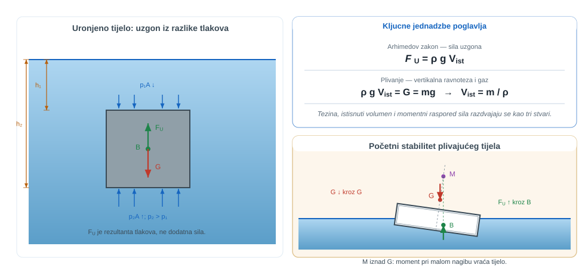
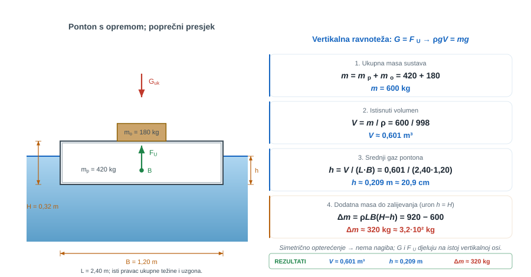
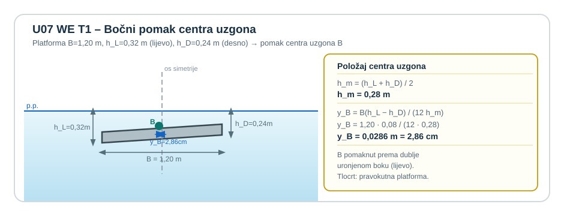
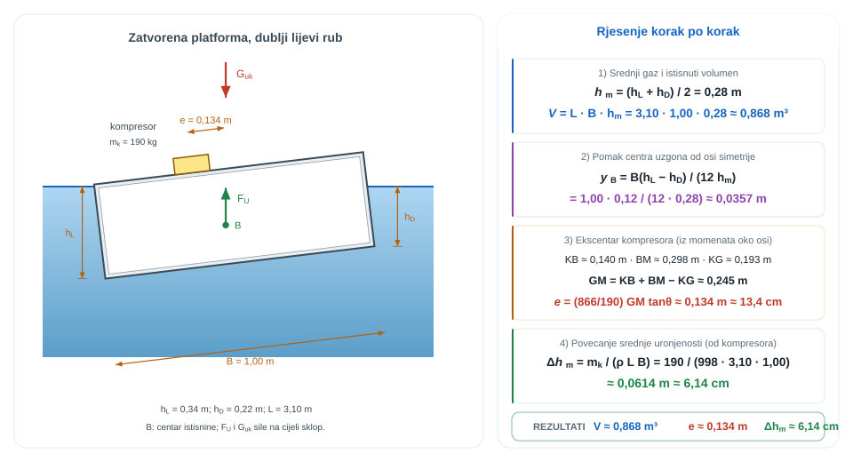
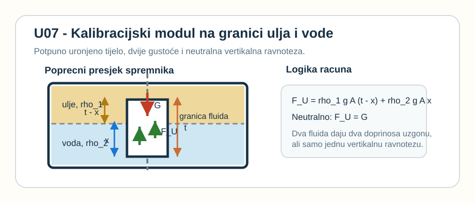
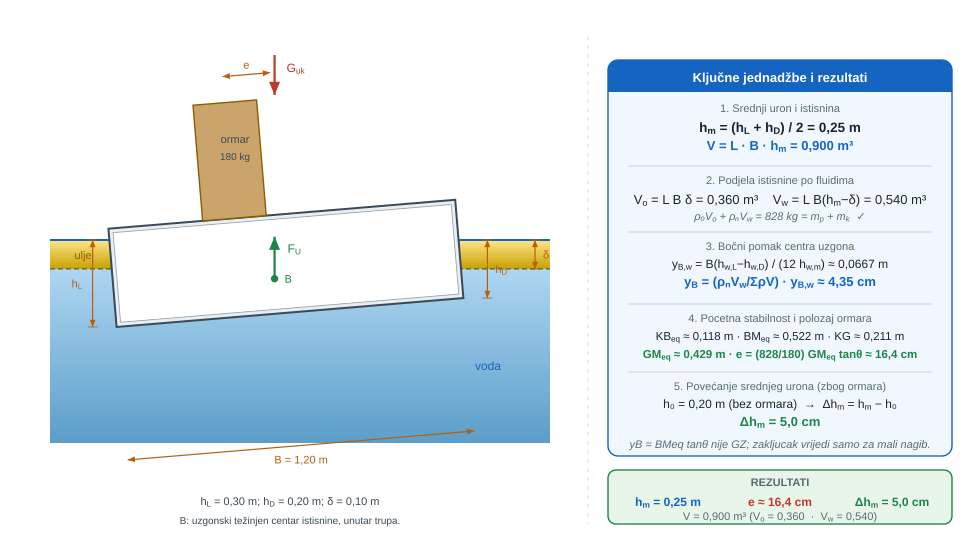
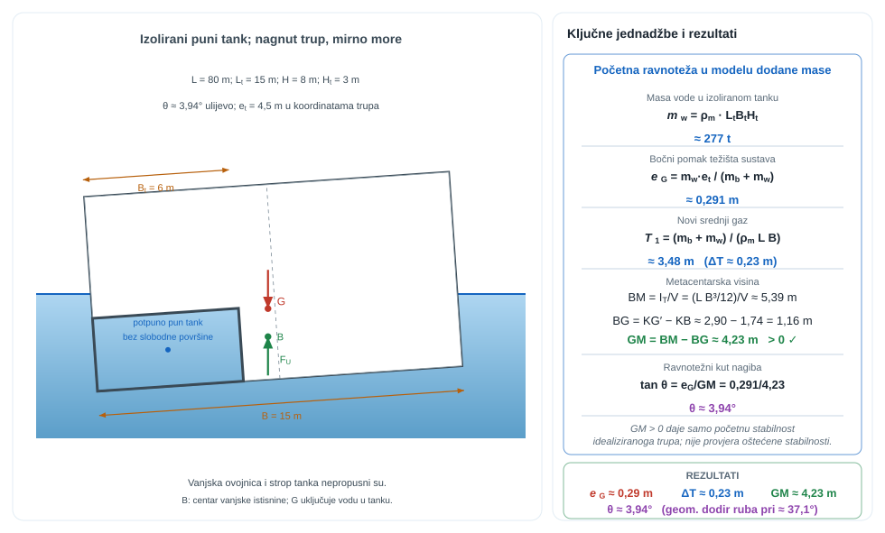
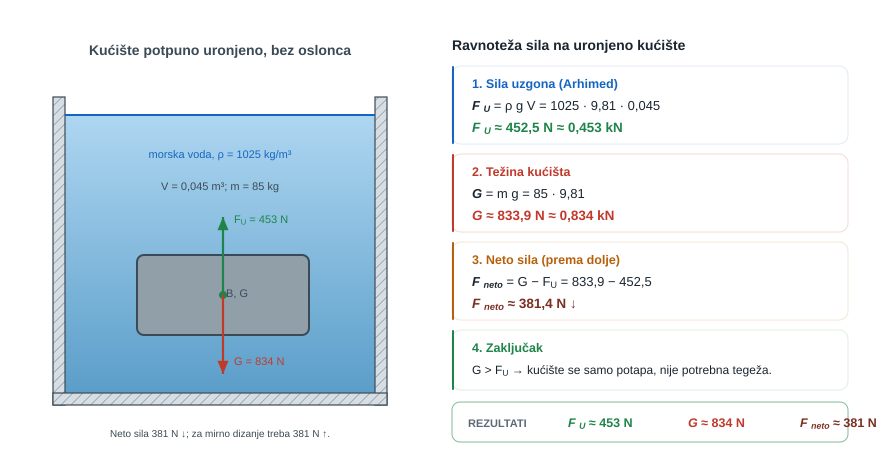
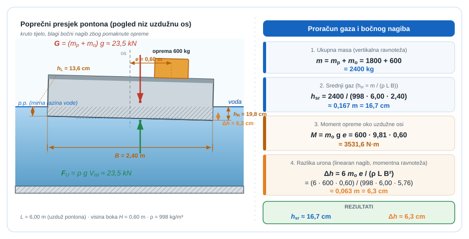
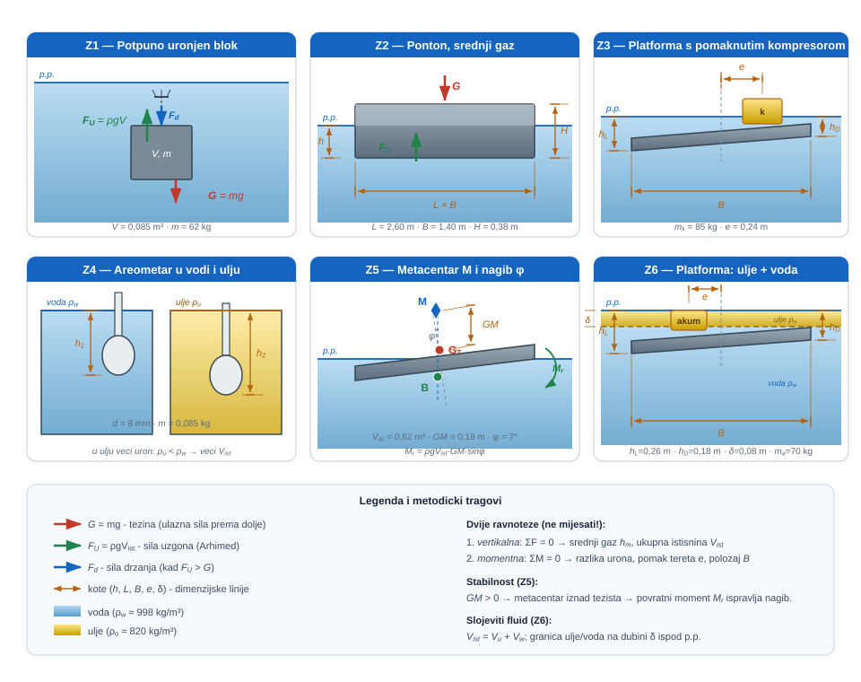

{#fig-uvod-u07 fig-align="center"}

## Uzgon kao spoj istisnine, težine i geometrije urona

Arhimedov zakon sam po sebi nije dovoljan za čitanje plivajućeg tijela.

Zato se već na početku razdvajaju tri stvari: ukupna težina, istisnuti volumen i momentni raspored tih sila.

::: {.mf1-application}

Inženjerski kontekst

U brodogradnji, lučnim pontonima i plutajućim radnim platformama nije dovoljno znati samo koliko je vode istisnuto; jednako je važno gdje su težište i centar uzgona te kakav moment nastaje kad se teret pomakne. Zato ovo poglavlje izravno ulazi u stabilnost plovila, raspored opreme na pontonu, sigurnost plutajuće dizalice i svaku tehničku situaciju u kojoj mali bočni pomak tereta može otvoriti veliki nagib.
:::

::: {.mf1-priprema}

Prije čitanja poglavlja

**Predznanje koje se pretpostavlja:**

- hidrostatička raspodjela tlaka iz poglavlja pog. 3Hidrostatička raspodjela tlaka i manometrija;
- sila na ravne plohe iz poglavlja pog. 5Hidrostatske sile na ravne plohe;
- osnovni pojmovi statike krutog tijela: ravnoteža sila, ravnoteža momenata, položaj težišta;
- integralni račun više varijabli (težište volumena).

**Ishodi učenja:**

- primijeniti Arhimedov zakon na potpuno i djelomično uronjeno tijelo;
- razlikovati uvjet plovnosti od uvjeta stabilnosti plivajućeg tijela;
- izračunati gaz pravokutnog ili nepravilno oblikovanog plivajućeg tijela;
- procijeniti početnu stabilnost preko metacentarske visine i prepoznati granične slučajeve.

**Procijenjeno vrijeme:** 6–8 sati za teoriju i izvode, 4 sata za rješavanje primjera i zadataka.
:::

## Fizikalni uvod i matematički izvod

Za tijelo koje miruje u fluidu vrijedi da je sila uzgona jednaka težini istisnutog fluida:

$$F_U = \rho g V$$

Za plivajuće tijelo u ravnoteži ta sila mora biti jednaka ukupnoj težini tijela i svih tereta na njemu. To je tek prvi korak. Drugi korak je geometrija: gdje djeluje težina, gdje djeluje uzgon i kakav moment nastaje ako je teret bočno pomaknut. Matematika zato mora odvojiti ukupni volumen istisnine od rasporeda sile i momenata, inače plivanje i nagib ostaju pomiješani u istoj brojci.

Kod prizmatskih tijela s ravnim dnom vrlo se često može odvojiti srednja uronjenost od nagiba:

- srednja uronjenost dolazi iz ukupne težine
- razlika urona po širini dolazi iz momentne ravnoteze

Ta razdvojenost je jezgra gotovo svih prvih zadataka plivanja i stabilnosti.

## Matematički izvod

Najjednostavniji put prema Arhimedovu zakonu polazi od potpuno uronjenoga prizmatičnog tijela vodoravne površine $A$. Na gornju plohu na dubini $h_1$ djeluje sila

$$
F_1 = p_1A = (p_0 + \rho gh_1)A
$$

prema dolje, a na donju plohu na dubini $h_2$ sila

$$
F_2 = p_2A = (p_0 + \rho gh_2)A
$$

prema gore. Neto vertikalna hidrostatska sila iznosi zato

$$
F_U = F_2 - F_1 = \rho g(h_2-h_1)A.
$$

Budući da je $(h_2-h_1)A = V_{ist}$, odnosno istisnuti volumen fluida, slijedi opći zapis uzgona

$$
F_U = \rho gV_{ist}.
$$

::: {.callout-note}
## Fizikalno značenje
Sila uzgona ne ovisi o obliku tijela, materijalu ni gustoći — ovisi isključivo o volumenu fluida koji tijelo istisne i gustoći tog fluida. Kilogram čelika i kilogram pluta istisnu isti volumen vode ako su iste veličine, pa imaju isti uzgon — ali čelik tone jer je teži od istisnute vode, a pluta pliva jer je lakši. Uzgon je uvijek vertikalan prema gore i prolazi kroz težište istisnutog volumena, a ne kroz težište samog tijela.
:::

::: {.callout-note collapse="true" icon="false"}
## Numerički trag

Arhimedov zakon je u CFD-u utkan u **VOF metodu** (Volume of Fluid): dodatno polje $\alpha \in [0,1]$ kaže koliko je svaka ćelija ispunjena vodom, a uzgon se pojavljuje automatski jer su težinski članovi $\rho g$ različiti u "vodenim" i "zračnim" ćelijama. Solver `interFoam` u OpenFOAM-u simulira plivajuće tijelo (npr. brod u valovima) tako da prati pomicanje izolinije $\alpha = 0{,}5$ — to je upravo numerička slika slobodne površine i istisnutog volumena.
:::

::: {.mf1-interaktivno}

Interaktivni prikaz — Gaz plivajućeg tijela

Interaktivni prikaz omogućuje mijenjanje mase tijela i gustoće fluida uz neposredno praćenje ravnotežnog gaza i preostale visine iznad razine vode. Pri prekoračenju granice plovnosti prikaz signalizira da tijelo tone.

**Pitanja za samostalno istraživanje:** (a) Kako se gaz mijenja kada isti blok prelazi iz slatke u slanu vodu? (b) Pri kojoj masi tijelo upravo počinje tonuti? (c) Što bi se dogodilo s gazom istog tijela u ulju gustoće $800$ kg/m³, a što u glicerinu gustoće $1260$ kg/m³?

:::

Isti rezultat vrijedi i za proizvoljan oblik tijela: neto hidrostatska sila jednaka je težini fluida koji bi ispunio istisnuti volumen. Pravac djelovanja te sile prolazi kroz centar uzgona, tj. kroz težište istisnutoga volumena.

Iz toga odmah slijedi i prvo pravilo stabilnosti. Kod potpuno uronjenog tijela stabilan je položaj onaj u kojem je težište tijela $G$ ispod centra uzgona $B$; ako se te dvije točke poklope, ravnoteža je neutralna, a ako je $G$ iznad $B$, mali poremećaj daje prevrtni moment. Kod plivajućeg tijela slika je drukčija jer se pri malom nagibu oblik istisnutoga volumena mijenja, pa se i centar uzgona pomiče. Tada se uvodi metacentar $M$, a znak metacentarske visine $GM$ odlučuje o početnoj stabilnosti: $GM > 0$ znači povratni moment, $GM = 0$ neutralnu ravnotežu, a $GM < 0$ nestabilan položaj.

Za plivajuće tijelo vertikalna ravnoteža tada daje

$$
\rho gV_{ist} = G = mg
$$

odnosno

$$
V_{ist} = \frac{m}{\rho}.
$$

::: {.callout-note}
## Fizikalno značenje
Ova jednadžba kaže da plivajuće tijelo potapa se točno toliko da istisne svoju vlastitu masu fluida. Ako se teret doda, tijelo se potapa dublje; ako se teret ukloni, izroni. Volumen istisnine $V_{ist}$ nije fizička veličina tijela — on ovisi o gustoći fluida: isti brod u slanoj vodi (gustoća ~1025 kg/m³) istisne manji volumen nego u slatkoj vodi (~998 kg/m³), pa u slanoj vodi plovi nešto više.
:::

::: {.callout-note}
## Razrada koraka
Korak: od tlakova na gornju i donju plohu → $F_U = \rho g V_{ist}$

Na gornjoj plohi prizma na dubini $h_1$: $F_1 = (p_0 + \rho g h_1)A$ prema dolje.
Na donjoj plohi na dubini $h_2$: $F_2 = (p_0 + \rho g h_2)A$ prema gore.
Neto sila:
$$
F_U = F_2 - F_1 = \rho g(h_2 - h_1)A.
$$
Budući da je $(h_2 - h_1)A$ upravo volumen istisnine $V_{ist}$:
$$
F_U = \rho g V_{ist}.
$$
Jednolikni tlak $p_0$ potpuno se poniješta između gornje i donje plohe — zato uzgon ne ovisi o atmosferskom tlaku ni o apsolutnom tlaku u fluidu, nego samo o razlici dubina gornje i donje plohe.
:::

To je tek prvi dio fizikalne slike. Član $V_{ist}$ određuje koliko fluida mora biti istisnuto da bi se tijelo održalo na površini, ali ne određuje još i njegov nagib. Ako težište ukupne težine ne leži na istoj okomici kao centar uzgona, pojavljuje se moment koji tijelo zakreće. Zato za plivanje nisu dovoljne samo sile; mora biti zadovoljena i ravnoteža momenata.

Za pravokutnu platformu s linearnom promjenom urona po širini srednja uronjenost određena je vertikalnom ravnotežom, dok raspodjela urona po rubovima proizlazi iz momentne ravnoteže oko uzdužne osi. Upravo se tu vidi cjelovito značenje poglavlja: uzgon nije samo jedna brojka, nego rezultat istisnine, položaja centra uzgona i njihove geometrijske veze s ukupnom težinom sustava.

::: {.mf1-izvod}

Matematički izvod — Bočni pomak centra uzgona pri linearnoj promjeni urona

Promatra se pravokutni ponton duljine $L$ i širine $B$ koji u nagnutom (ili nesimetrično opterećenom) položaju ima različite urone na lijevoj i desnoj strani: $h_L$ uz lijevu i $h_D$ uz desnu stijenku, uz srednji uron $h_m = (h_L + h_D)/2$.

Poprečni presjek istisnutoga volumena je trapez s okomicama duljina $h_L$ i $h_D$ na razmaku $B$. Taj se trapez razlaže na pravokutnik visine $h_D$ i trokut katetа $(h_L - h_D)$ i $B$ smješten uz lijevu stijenku. Pripadne površine i položaji težišta u poprečnom presjeku (mjereno od lijevog ruba) iznose

$$
A_1 = h_D B, \qquad \bar{x}_1 = \frac{B}{2},
$$

$$
A_2 = \frac{1}{2}(h_L - h_D) B, \qquad \bar{x}_2 = \frac{B}{3}.
$$

Težište cijelog trapeza, mjereno od lijevog ruba, dobiva se prvim momentom

$$
\bar{x} = \frac{A_1 \bar{x}_1 + A_2 \bar{x}_2}{A_1 + A_2} = \frac{h_D B \cdot \tfrac{B}{2} + \tfrac{1}{2}(h_L - h_D)B \cdot \tfrac{B}{3}}{B h_m}
= \frac{B(h_L + 2h_D)}{6 h_m}.
$$

Bočni pomak centra uzgona od centra pontona (od ravnine simetrije, mjereno prema strani s većim uronom) iznosi

$$
y_B = \frac{B}{2} - \bar{x} = \frac{B}{2} - \frac{B(h_L + 2h_D)}{6 h_m}
= \frac{B\,(h_L - h_D)}{12\, h_m}.
$$

Provjera: pri simetričnom uronu $h_L = h_D = h_m$ dobiva se $y_B = 0$, što znači da centar uzgona ostaje u središnjoj okomici. Pri tipičnoj razlici urona $h_L - h_D = 0{,}05\ \text{m}$ na pontonu širine $B = 1{,}2\ \text{m}$ sa srednjim uronom $h_m = 0{,}2\ \text{m}$ pomak centra uzgona iznosi $y_B = 1{,}2 \cdot 0{,}05/(12 \cdot 0{,}2) = 0{,}025\ \text{m}$, dakle $2{,}5\ \text{cm}$ — što izravno mjeri ekscentričnost rezultantne sile uzgona u odnosu na težinu tereta.
:::

Pri vrlo malim kutovima nagiba uvodi se još jedna apstraktna, ali fizikalno duboka veličina — metacentar. Iz njega proizlazi kriterij stabilnosti, koji je vrlo jasno povezan s geometrijom vodne linije plivajućeg tijela.

::: {.mf1-izvod}

Matematički izvod — Metacentarski radijus $\overline{BM} = I_T / V_{displ}$

Promatra se plivajuće tijelo nagnuto za mali kut $\theta$ oko uzdužne osi koja prolazi kroz njegovu vodnu liniju (presjek tijela s mirnom slobodnom površinom). Istisnuti volumen ostaje konstantan jer s jedne strane voda "ulazi" u tijelo, a s druge "izlazi" — masa tijela se nije promijenila.

Geometrijski to znači da se s jedne strane osi rotacije pojavljuje klin dodatne istisnine (točke na udaljenosti $y > 0$ uranjaju se za $y\theta$ dublje), a s druge strane jednak klin nestaje istisnine ($y < 0$, voda se povlači za $|y|\theta$). Pomak centra uzgona $B \to B'$ u horizontalnom smjeru izračunava se prvim momentom volumna preslagivanja:

$$
V_{displ}\cdot \overline{BB'} = \int_{A_{wl}} y \cdot (y\theta)\, dA = \theta \int_{A_{wl}} y^2\, dA = \theta\, I_T,
$$

gdje je $A_{wl}$ površina vodne linije, a

$$
I_T = \int_{A_{wl}} y^2\, dA
$$

drugi moment površine vodne linije oko osi rotacije. Otud slijedi pomak centra uzgona

$$
\overline{BB'} = \frac{I_T\, \theta}{V_{displ}}.
$$

Metacentar $M$ definiran je kao točka u kojoj se sjeku okomica kroz novi centar uzgona $B'$ i prvotna osa simetrije tijela. Za male kutove vrijedi geometrijski

$$
\overline{BB'} = \overline{BM} \cdot \theta,
$$

pa izjednačavanjem dvaju izraza nastaje središnja relacija stabilnosti

$$
\boxed{\overline{BM} = \frac{I_T}{V_{displ}}}.
$$

Za pravokutnu vodnu liniju širine $B$ i duljine $L$ vrijedi $I_T = L B^3/12$, pa je

$$
\overline{BM} = \frac{L B^3}{12\, V_{displ}}.
$$

Iz toga slijedi vrlo važna inženjerska poruka: **metacentarski radijus raste s kubom širine tijela**. Brodovi i pontoni izrazito široke vodne linije (katamarani, lihteri, šlepere) prirodno su stabilniji od uskih, jer im je $\overline{BM}$ za isti volumen istisnine reda veličine veći.

Konačni kriterij stabilnosti dobiva se kombiniranjem metacentarskog radijusa s razmakom centra uzgona i težišta tijela ($\overline{BG}$):

$$
\overline{GM} = \overline{BM} - \overline{BG}.
$$

Predznak $\overline{GM}$ odlučuje o početnoj stabilnosti. Pri $\overline{GM} > 0$ moment uzgona pri malom nagibu vraća tijelo u ravnotežu (povratni moment), pri $\overline{GM} = 0$ ravnoteža je neutralna, a pri $\overline{GM} < 0$ tijelo se prevrće.
:::

::: {.mf1-izvod}

Matematički izvod — Krivulja stabilnosti $GZ(\theta)$ i finitni nagib

Metacentarski radijus $\overline{BM}$ izveden je za **infinitezimalni nagib** — pretpostavku $\sin\theta \approx \tan\theta \approx \theta$ koja vrijedi do otprilike $7{-}10^\circ$. Pri većim nagibima metacentar više nije nepokretna točka i koristi se **krivulja stabilnosti** $GZ(\theta)$ koja izravno mjeri povratni krak težine.

Pri nagibu $\theta$ centar uzgona pomakne se iz prvotne pozicije $B$ u novi položaj $B_\theta$, koji ovisi o stvarnoj geometriji uronjenog dijela trupa. Težište tijela $G$ ostaje fiksirano u trupu. **Povratni krak** $GZ$ definira se kao vodoravna udaljenost od težišta $G$ do okomice koja prolazi kroz novi centar uzgona $B_\theta$:

$$
GZ(\theta) = \overline{GM}\,\sin\theta + f(\theta),
$$

gdje je prvi član linearni početni odziv (za male $\theta$ vrijedi samo on, $GZ \approx \overline{GM}\,\theta$), a $f(\theta)$ je korekcija za nelinearno preraspoređivanje istisnine pri velikim nagibima — postaje značajna kad dijelovi palube urone u vodu ili kad se rubovi trupa pojave iznad vode.

Povratni **moment uzgona** koji vraća brod u uspravan položaj iznosi

$$
M_{povratni}(\theta) = \rho g V_{displ}\cdot GZ(\theta),
$$

a maksimalni kut do kojeg vrijedi $GZ > 0$ naziva se **kut iščezavajuće stabilnosti** $\theta_v$. Pri tom kutu krak povratne sile postaje nula, a brod nakon njega prelazi u nestabilno područje.

Tipična krivulja $GZ(\theta)$, kakva se nalazi u stabilnosnoj brošuri svakog broda, ima sljedeća svojstva:

- pri $\theta = 0$ vrijedi $GZ = 0$ (uspravni položaj);
- nagib krivulje u ishodištu jednak je $\overline{GM}$ — poveznica s metacentarskom teorijom;
- maksimum krivulje pojavljuje se obično pri $\theta_{max} \approx 25{-}40^\circ$;
- pri $\theta_v$ krivulja siječe nulu (granica stabilnosti).

**Integral površine ispod krivulje**

$$
A = \int_0^{\theta_v} GZ(\theta)\,d\theta
$$

ima dimenziju duljine puta kuta (m·rad) i mjeri **rezervu energije stabilnosti** — mehanički rad koji brod može apsorbirati prije prevrtanja. Iz tog razloga međunarodna SOLAS konvencija propisuje minimalne vrijednosti $A$ u različitim rasponima nagiba: $A_{0\text{-}30^\circ} \ge 0{,}055\ \text{m\,rad}$ i $A_{0\text{-}40^\circ} \ge 0{,}09\ \text{m\,rad}$.

Metacentarska teorija ($\overline{GM} > 0$) i kriterij iščezavajućeg kraka ($\theta_v$, $A$) zajedno čine cjelovit sustav stabilnosti broda: prvi se primjenjuje na svaki radni nagib, drugi na izvanredne situacije poput snažnog vjetra, valova ili poplavljenog tanka.
:::

## Riješeni primjeri

::: {.mf1-we}

Riješeni primjer — Koliki gaz ima radni ponton pri simetričnom opterećenju&nbsp;T2

**Kontekst:** Pravokutni radni ponton nosi simetrično postavljenu opremu na mirnoj vodi. Treba odrediti istisnuti volumen, srednji gaz i preostalu nosivost prije nego što razina vode dosegne gornji rub boka.

**Zadano**

- Duljina pravokutnog radnog pontona: $L = 2{,}40\ \text{m}$
- Širina pontona: $B = 1{,}20\ \text{m}$
- Ukupna visina boka: $H = 0{,}32\ \text{m}$
- Vlastita masa pontona: $m_p = 420\ \text{kg}$
- Simetrično postavljena oprema mase: $m_o = 180\ \text{kg}$
- Gustoća vode: $\rho = 998\ \text{kg/m}^3$

**Traženo**

1. istisnuti volumen vode u ravnoteznom položaju.
2. srednji gaz pontona $h$.
3. koliku dodatnu masu još može primiti prije nego što gornji rub dođe do razine vode.

**Pretpostavke i model**

Kako je opterećenje postavljeno simetrično, ovdje nema bočnog nagiba ni momentne neravnoteze. Zadatak se zatvara samo vertikalnom ravnotezom: težina pontona i tereta mora biti jednaka uzgonu, odnosno težini istisnute vode.

**Rješenje**

Ukupna masa sustava iznosi

$$
m = m_p + m_o = 420 + 180 = 600\ \text{kg}.
$$

Za plivanje u ravnotezi vrijedi $\rho g V = mg$, pa je istisnuti volumen

$$
V = \frac{m}{\rho} = \frac{600}{998} \approx 0{,}601\ \text{m}^3.
$$

Za pravokutni ponton vrijedi $V = LBh$, odakle slijedi srednji gaz

$$
h = \frac{V}{LB} = \frac{0{,}601}{2{,}40 \cdot 1{,}20} \approx 0{,}209\ \text{m} \approx 20{,}9\ \text{cm}.
$$

Granični slučaj prije zalijevanja palube dobiva se kad je uron jednak ukupnoj visini boka, tj. $h = H = 0{,}32\ \text{m}$. Tada je najveći mogući istisnuti volumen

$$
V_{max} = LBH = 2{,}40 \cdot 1{,}20 \cdot 0{,}32 \approx 0{,}922\ \text{m}^3,
$$

pa odgovarajuća ukupna masa iznosi

$$
m_{max} = \rho V_{max} = 998 \cdot 0{,}922 \approx 920\ \text{kg}.
$$

Zato je dodatna masa koju ponton još može primiti

$$
\Delta m = m_{max} - m = 920 - 600 = 320\ \text{kg} \approx 3{,}2 \cdot 10^2\ \text{kg}.
$$

**Provjera i komentar**

1. Veća ukupna masa mora značiti veći istisnuti volumen i veći gaz.
2. Dobiveni gaz mora biti manji od ukupne visine boka dok ponton još ima slobodni bok.
3. U simetričnom slučaju nema razloga za razliku urona lijevo i desno.
:::

 Kad je ta osnovna vertikalna ravnoteza zatvorena, korisno je najprije odvojiti još jedan međukorak: što sami rubni uroni govore o srednjem gazu i o bočnom pomaku centra uzgona, još bez traženja položaja tereta.

::: {.mf1-we}

Riješeni primjer — Bočni pomak centra uzgona iz rubnih urona&nbsp;T1

**Kontekst:** Pravokutna plutajuća platforma neravnomjerno je opterećena, pa se na lijevom i desnom rubu mjere različite uronjenosti. Treba iz tih rubnih urona odrediti srednji gaz i bočni pomak centra uzgona od osi simetrije.

**Zadano**

- Širina pravokutne plutajuće platforme: $B = 1{,}20\ \text{m}$
- Izmjereni uron lijevog ruba: $h_L = 0{,}32\ \text{m}$
- Izmjereni uron desnog ruba: $h_D = 0{,}24\ \text{m}$
- Pretpostavlja se linearan nagib plivajućeg presjeka

**Traženo**

1. srednji gaz platforme $h_m$.
2. bočni pomak centra uzgona $y_B$ od osi simetrije.

{#fig-u07-bocni-pomak-centra-uzgona fig-align="center"}

**Pretpostavke i model**

Za pravokutnu platformu s linearnom promjenom urona srednji gaz dobiva se kao aritmetička sredina lijevog i desnog urona. Tek nakon toga bočni pomak centra uzgona slijedi iz geometrije nagnutog presjeka.

**Rješenje**

Srednji gaz iznosi

$$
h_m = \frac{h_L + h_D}{2} = \frac{0{,}32 + 0{,}24}{2} = 0{,}28\ \text{m}.
$$

Za pravokutnu platformu s linearnim nagibom bočni pomak centra uzgona glasi

$$
y_B = \frac{B(h_L - h_D)}{12h_m} = \frac{1{,}20(0{,}32 - 0{,}24)}{12 \cdot 0{,}28} \approx 0{,}0286\ \text{m} \approx 2{,}86\ \text{cm}
$$

prema dublje uronjenoj strani.

**Provjera i komentar**

1. Srednji gaz mora ležati između lijevog i desnog urona.
2. Centar uzgona mora se pomaknuti prema dublje uronjenoj strani.
3. Ako su rubni uroni jednaki, mora biti i $y_B = 0$.
:::

 Kad je taj geometrijski međukorak zatvoren, tek tada ima smisla prijeći na složeniji slučaj u kojem se teret bočno pomiče i uz ravnotezu sila treba zatvoriti i ravnotezu momenata.

::: {.mf1-we}

Riješeni primjer — Plutajuća servisna platforma s pomaknutim kompresorom&nbsp;T2

**Kontekst:** Na plutajućoj servisnoj platformi prijenosni kompresor postavljen je izvan osi simetrije, što izaziva mjerljiv bočni nagib. Treba odrediti istisnuti volumen, položaj težišta kompresora i porast srednjeg gaza nakon njegova postavljanja.

**Zadano**

- Duljina pravokutne plutajuće servisne platforme: $L = 3{,}10\ \text{m}$
- Širina platforme: $B = 1{,}00\ \text{m}$
- Masa platforme: $m_p = 676\ \text{kg}$
- Gustoća vode: $\rho = 998\ \text{kg/m}^3$
- Masa prijenosnog kompresora: $m_k = 190\ \text{kg}$
- Izmjereni uron lijevog ruba platforme nakon postavljanja kompresora: $h_L = 0{,}34\ \text{m}$
- Izmjereni uron desnog ruba: $h_D = 0{,}22\ \text{m}$
- Platforma je kruta, ravnog dna i okomitih bočnih stijenki

**Traženo**

1. Odredite ukupni istisnuti volumen vode u ravnoteznom položaju.
2. Odredite udaljenost $e$ težišta kompresora od uzdužne osi simetrije platforme.
3. Odredite za koliko je srednja uronjenost platforme veća nego prije postavljanja kompresora.

**Pretpostavke i model**

Platforma se promatra kao kruto prizmatsko tijelo pravokutnog tlocrta i ravnog dna. Srednja uronjenost dobiva se iz aritmetičke sredine lijevog i desnog urona, a bočni pomak centra uzgona iz linearnog nagiba plivajućeg presjeka.

**Rješenje**

Srednja uronjenost iznosi

$$
h_m = \frac{h_L + h_D}{2} = \frac{0{,}34 + 0{,}22}{2} = 0{,}28\ \text{m},
$$

pa je istisnuti volumen

$$
V = L B h_m = 3{,}10 \cdot 1{,}00 \cdot 0{,}28 = 0{,}868\ \text{m}^3.
$$

To odgovara istisnutoj masi vode od približno $998 \cdot 0{,}868 \approx 866\ \text{kg}$, što je u skladu s ukupnom masom platforme i kompresora.

Za pravokutnu platformu s linearnom promjenom urona po širini bočni pomak centra uzgona glasi

$$
y_B = \frac{B(h_L - h_D)}{12h_m} = \frac{1{,}00\,(0{,}34 - 0{,}22)}{12 \cdot 0{,}28} \approx 0{,}0357\ \text{m}.
$$

Momentna ravnoteza oko uzdužne osi simetrije tada daje $F_U y_B = m_k g e$, a kako je $F_U = (m_p + m_k)g$, slijedi

$$
e = \frac{m_p + m_k}{m_k} y_B = \frac{676 + 190}{190} \cdot 0{,}0357 \approx 0{,}1628\ \text{m} \approx 0{,}163\ \text{m}.
$$

Povećanje srednje uronjenosti nakon postavljanja kompresora uzrokuje samo njegova masa, pa je

$$
\Delta h_m = \frac{m_k}{\rho L B} = \frac{190}{998 \cdot 3{,}10 \cdot 1{,}00} \approx 0{,}0614\ \text{m} \approx 6{,}14\ \text{cm}.
$$

**Provjera i komentar**

1. Dublje uronjena strana mora biti ona na koju je kompresor pomaknut, a dobiveni rezultat to potvrduje.
2. Dobiveni pomak kompresora manji je od polovice širine platforme, pa je geometrijski moguć.
3. Povećanje srednjeg gaza reda nekoliko centimetara razumno je za dodatnih $190\ \text{kg}$ na ovakvoj platformi.
:::

Plutajuća platforma nije jedini tipičan ulaz u pog. 7Uzgon, plivanje i stabilnost. Jednako je važno znati zatvoriti vertikalnu ravnotezu i za potpuno uronjeno tijelo koje presiječa granicu dvaju fluida, jer se tada ukupni uzgon čita kao zbroj dviju istisnina različitih gustoća.

::: {.mf1-we}

Riješeni primjer — Kalibracijski modul na granici ulja i vode&nbsp;T2

**Kontekst:** Hermetički kalibracijski modul potpuno je uronjen tako da presijeca granicu između ulja i vode različitih gustoća. Treba odrediti pravilnu podjelu modula između dvaju fluida za neutralni uron i silu koju vodilica preuzima pri pogrešnom postavljanju.

**Zadano**

- Dimenzije pravokutnog tlocrta hermetičkog kalibracijskog modula: $b = 0{,}32\ \text{m}$, $l = 0{,}20\ \text{m}$
- Visina modula: $t = 0{,}22\ \text{m}$
- Gustoća gornjeg fluida (ulje): $\rho_1 = 820\ \text{kg/m}^3$
- Gustoća donjeg fluida: $\rho_2 = 1030\ \text{kg/m}^3$
- Masa modula: $m = 12{,}8\ \text{kg}$

**Traženo**

1. Odredite koliki dio visine modula mora biti u donjem, gušćem fluidu da modul bude neutralno uronjen.
2. Odredite silu koju mora prenijeti vodilica ako je modul pogrešno postavljen tako da je u donjem fluidu samo $x = 0{,}050\ \text{m}$ njegove visine.

{#fig-u07-kalibracijski-modul fig-align="center" style="width:100%;max-width:520px;"}

**Pretpostavke i model**

Modul se promatra kao kruto tijelo stalnog poprečnog presjeka. Budući da je potpuno uronjen, slobodni bok i nagib ovdje nisu tema; cijeli zadatak zatvara se vertikalnom ravnotežom između težine i zbroja uzgona gornjeg i donjeg fluida.

**Rješenje**

Površina vodoravnog presjeka modula iznosi

$$
A = b l = 0{,}32 \cdot 0{,}20 = 0{,}064\ \text{m}^2.
$$

Ako je `x` dio modula u donjem fluidu, tada je visina dijela u gornjem fluidu jednaka $t - x$. Za neutralnu vertikalnu ravnotezu mora vrijediti $F_U = G$, odnosno

$$
\rho_1 g A (t - x) + \rho_2 g A x = mg.
$$

Nakon skraćivanja s $g$ i uvrstavanja podataka dobiva se

$$
820 \cdot 0{,}064 \cdot (0{,}22 - x) + 1030 \cdot 0{,}064 \cdot x = 12{,}8,
$$

što daje

$$
0{,}064 \left[820(0{,}22 - x) + 1030x\right] = 12{,}8 \quad \Rightarrow \quad 820 \cdot 0{,}22 + (1030 - 820)x = \frac{12{,}8}{0{,}064},
$$

odnosno $180{,}4 + 210x = 200$, odakle je

$$
x = \frac{19{,}6}{210} \approx 0{,}0933\ \text{m} \approx 9{,}33\ \text{cm}.
$$

Visina modula u gornjem fluidu tada je

$$
t - x = 0{,}22 - 0{,}0933 \approx 0{,}1267\ \text{m} \approx 12{,}7\ \text{cm}.
$$

Sada provjerimo pogrešno postavljen modul s visinom u donjem fluidu $x = 0{,}050\ \text{m}$. Tada je ukupni uzgon

$$
F_U = \rho_1 g A (0{,}22 - 0{,}05) + \rho_2 g A \cdot 0{,}05 = 9{,}81 \cdot 0{,}064 \left(820 \cdot 0{,}17 + 1030 \cdot 0{,}05\right) \approx 119{,}9\ \text{N}.
$$

Težina modula iznosi

$$
G = mg = 12{,}8 \cdot 9{,}81 \approx 125{,}6\ \text{N}.
$$

Kako je $G > F_U$, vodilica mora prenijeti dodatnu silu prema gore:

$$
F_V = G - F_U = 125{,}6 - 119{,}9 \approx 5{,}7\ \text{N}
$$

prema gore.

**Provjera i komentar**

1. Dobivena vrijednost `x` mora biti između $0$ i ukupne visine $t$, što je ovdje zadovoljeno.
2. Kako je gustoće modula između $\rho_1$ i $\rho_2$, neutralni položaj mora stvarno presiječati granicu dvaju fluida.
3. Ako je dio modula u gušćem fluidu premalen, ukupni uzgon pada i vodilica mora preuzeti preostalu težinu prema gore.
:::

::: {.mf1-ch}

Cjeloviti zadatak — Plutajuća servisna platforma na granici ulja i vode&nbsp;T4

**Kontekst:** Hermetička servisna platforma pluta na stratificiranom mediju u kojem sloj ulja leži iznad vode, a na njoj se nepoznato bočno postavlja ormar s instrumentacijom. Treba podijeliti istisninu po fluidima, naći bočni pomak centra uzgona i položaj ormara koji uravnotežuje izmjerene rubne urone.

**Zadano**

- Duljina hermetičke pravokutne servisne platforme: $L = 3{,}00\ \text{m}$
- Širina platforme: $B = 1{,}20\ \text{m}$
- Visina boka: $H = 0{,}34\ \text{m}$
- Vlastita masa platforme: $m_p = 648\ \text{kg}$
- Gustoća gornjeg sloja ulja: $\rho_o = 800\ \text{kg/m}^3$
- Debljina uljnog sloja: $\delta = 0{,}10\ \text{m}$
- Gustoća donjeg sloja vode: $\rho_w = 1000\ \text{kg/m}^3$
- Masa ormara instrumentacije na platformi: $m_k = 180\ \text{kg}$ na nepoznatoj udaljenosti $e$ od uzdužne osi simetrije
- Izmjereni uroni rubova platforme (od slobodne površine ulja): $h_L = 0{,}30\ \text{m}$, $h_D = 0{,}20\ \text{m}$
- Platforma je kruta, bočne stijenke okomite, dno ravno, promjena urona po širini linearna

**Traženo**

1. srednji uron $h_m$ i ukupni istisnuti volumen $V$.
2. koliki se dio istisnine nalazi u ulju, a koliki u vodi.
3. bočni pomak rezultantnog centra uzgona $y_B$.
4. udaljenost $e$ težišta ormara od osi simetrije platforme.
5. za koliko je srednja uronjenost veća nego prije postavljanja ormara.

**Pretpostavke i model**

Ovdje se platforma još uvijek čita kao prizmatsko tijelo, ali uzgon više ne dolazi iz jedne jedine gustoće. Gornji uljni sloj daje simetrični doprinos uzgonu, dok donji vodeni dio nosi i preostalu vertikalnu ravnotezu i bočni pomak centra uzgona pri nagibu. Zato se najprije mora zatvoriti podjela istisnine po fluidima, a tek zatim momentna ravnoteza s pomaknutim teretom.

**Rješenje**

Srednja uronjenost dobiva se iz sredine izmjerenih rubnih urona:

$$
h_m = \frac{h_L + h_D}{2} = \frac{0{,}30 + 0{,}20}{2} = 0{,}25\ \text{m}.
$$

Ukupni istisnuti volumen zato je

$$
V = L B h_m = 3{,}00 \cdot 1{,}20 \cdot 0{,}25 = 0{,}900\ \text{m}^3.
$$

Kako su oba ruba uronjena više od debljine uljnog sloja $\delta = 0{,}10\ \text{m}$, cijela platforma kroz puni tlocrt presiječa svih $\delta$ ulja. Zato je volumen istisnine u ulju

$$
V_o = L B \delta = 3{,}00 \cdot 1{,}20 \cdot 0{,}10 = 0{,}360\ \text{m}^3,
$$

a volumen istisnine u vodi

$$
V_w = L B (h_m - \delta) = 3{,}00 \cdot 1{,}20 \cdot (0{,}25 - 0{,}10) = 0{,}540\ \text{m}^3.
$$

Provjera vertikalne ravnoteze sada glasi

$$
\rho_o V_o + \rho_w V_w = 800 \cdot 0{,}360 + 1000 \cdot 0{,}540 = 288 + 540 = 828\ \text{kg},
$$

što se točno slaže s ukupnom masom sustava

$$
m_p + m_k = 648 + 180 = 828\ \text{kg}.
$$

Dakle, vertikalna ravnoteza je zatvorena.

Za bočni pomak centra uzgona bitan je samo vodeni dio ispod granice fluida, jer je uljni dio simetričan po širini i ne daje bočni moment. Vodene dubine lijevo i desno iznose

$$
h_{w,L} = h_L - \delta = 0{,}30 - 0{,}10 = 0{,}20\ \text{m}, \qquad h_{w,D} = h_D - \delta = 0{,}20 - 0{,}10 = 0{,}10\ \text{m},
$$

pa je srednja vodena dubina

$$
h_{w,m} = h_m - \delta = 0{,}15\ \text{m}.
$$

Centar uzgona vodenog dijela za linearni nagib pravokutnog presjeka nalazi se na udaljenosti

$$
y_{B,w} = \frac{B(h_{w,L} - h_{w,D})}{12 h_{w,m}} = \frac{1{,}20(0{,}20 - 0{,}10)}{12 \cdot 0{,}15} \approx 0{,}0667\ \text{m}
$$

od osi simetrije platforme, prema dublje uronjenoj strani.

Kako je samo vodeni dio asimetričan, rezultantni bočni pomak ukupnog centra uzgona dobiva se težinjenjem po uzgonskim doprinosima:

$$
y_B = \frac{\rho_w V_w}{\rho_o V_o + \rho_w V_w} y_{B,w} = \frac{540}{828} \cdot 0{,}0667 \approx 0{,}0435\ \text{m} \approx 4{,}35\ \text{cm}.
$$

Momentna ravnoteza oko uzdužne osi simetrije sada daje $(m_p + m_k) g y_B = m_k g e$, odakle slijedi

$$
e = \frac{m_p + m_k}{m_k} y_B = \frac{828}{180} \cdot 0{,}0435 \approx 0{,}200\ \text{m} = 20{,}0\ \text{cm}.
$$

Prije postavljanja ormara platforma je bila simetrično opterećena, pa je i tada bila u ravnotezi bez nagiba. Neka je tadašnji srednji uron $h_0$. Budući da je uljni sloj i dalje potpuno presijecao platformu, vrijedi

$$
\rho_o L B \delta + \rho_w L B (h_0 - \delta) = m_p,
$$

odnosno $800 \cdot 3{,}00 \cdot 1{,}20 \cdot 0{,}10 + 1000 \cdot 3{,}00 \cdot 1{,}20 \cdot (h_0 - 0{,}10) = 648$, što daje $288 + 3600(h_0 - 0{,}10) = 648$, pa je

$$
h_0 = 0{,}20\ \text{m}.
$$

Povećanje srednje uronjenosti nakon postavljanja ormara zato iznosi

$$
\Delta h_m = h_m - h_0 = 0{,}25 - 0{,}20 = 0{,}05\ \text{m} = 5{,}0\ \text{cm}.
$$

**Provjera i komentar**

Ovaj `CH` zatvara tri jezgre pog. 7Uzgon, plivanje i stabilnost u jednom zadatku: srednji uron platforme je $0{,}25\ \text{m}$, ukupna istisnina iznosi $0{,}900\ \text{m}^3$, od čega je $0{,}360\ \text{m}^3$ u ulju, a $0{,}540\ \text{m}^3$ u vodi. Rezultantni centar uzgona pomaknut je oko $4{,}35\ \text{cm}$ prema dubljoj strani, pa ormar mora biti postavljen oko $20\ \text{cm}$ od osi simetrije. Njegovo postavljanje povećalo je srednji uron za $5\ \text{cm}$.

1. Srednji uron mora biti između izmjerenih rubnih urona i manji od visine boka, što ovdje vrijedi.
2. Dublje uronjena strana mora biti ona na koju je pomaknut ormar, pa znak momenta mora biti fizikalno smislen.
3. Dobiveni pomak ormara mora biti manji od polovice širine platforme; ovdje je $e = 0{,}20\ \text{m} < B/2 = 0{,}60\ \text{m}$.
:::

::: {.mf1-ch}

Cjeloviti zadatak — Asimetrično poplavljen balastni tank: novi gaz, nagib i provjera stabilnosti broda&nbsp;T4

**Kontekst:** Teretni brod pojednostavljenog pravokutnog trupa pretrpio je oštećenje pa se bočni balastni tank potpuno napunio morskom vodom. Treba odrediti novi gaz, bočni nagib i metacentarsku visinu te ocijeniti je li brod zadržao stabilnost u skladu sa SOLAS kriterijima.

**Zadano**

Teretni brod pojednostavljenog pravokutnog trupa miruje u mirnoj morskoj vodi kad zbog oštećenja trupa s lijeve strane more potpuno preplavi jedan balastni tank. Zadatak je odrediti **kako brod reagira**: koliko se gaz povećao, koliki je novi bočni nagib i da li je brod ostao stabilan (uobičajeni SOLAS kriterij za teretne brodove zahtijeva GM > 0 i ograničava kut nagiba na 15$^\circ$).

**Glavni podaci broda**

- Duljina: $L = 80\ \text{m}$, širina: $B = 15\ \text{m}$, visina trupa: $H = 8\ \text{m}$
- Ukupna masa broda s teretom (prije oštećenja): $m_b = 4000\ \text{t}$
- Visina težišta broda iznad kobilice: $K\bar G_b = 3{,}0\ \text{m}$
- Gustoća morske vode: $\rho_m = 1025\ \text{kg/m}^3$
- $g = 9{,}81\ \text{m/s}^2$

**Geometrija poplavljenog tanka**

Lijevi balastni tank u sredini trupa, otvoren prema moru kroz oštećenje:

- Duljina tanka: $L_t = 15\ \text{m}$
- Širina tanka u poprečnom presjeku: $B_t = 6{,}0\ \text{m}$ (uz lijevu bočnu stijenku trupa)
- Visina tanka od kobilice prema gore: $H_t = 3{,}0\ \text{m}$

Tank se potpuno napuni morskom vodom (pretpostavlja se trajno otvoreni "prozor" prema moru).

**Traženo**

1. Volumen i masa morske vode koja je ušla u tank.
2. Pomak težišta cijelog sustava (brod + voda u tanku): bočni pomak $e_G$ od osi simetrije i nova visina težišta $K\bar G'$.
3. Novi srednji gaz $T_1$ ako bi brod ostao u uspravnom položaju, te porast gaza $\Delta T = T_1 - T_0$.
4. Metacentarska visina $\overline{GM}$ i zaključak o stabilnosti.
5. Ravnotežni bočni kut nagiba $\theta$ (uz pretpostavku malog kuta).
6. Provjera: koliko se spustio bočni rub palube i je li paluba u vodi? Granični kut prije nego što paluba dotakne morsku razinu.

{#fig-u07-poplavljen-tank fig-align="center"}

**Pretpostavke i model**

Brod se modelira kao kruti pravokutni trup s konstantnom raspodjelom mase – težište broda $G_b$ je na osi simetrije, na zadanoj visini $K\bar G_b$ iznad kobilice. More miruje, valovi se zanemaruju. Razmatra se konačno ravnotežno stanje **nakon** što se voda u tanku smiri (tzv. "free communication" – tank trajno spojen s morem, pa razina vode u tanku prati morsku razinu; ovdje se za jednostavnost uzima da je tank pun do svojeg vrha).

Bočni nagib smatra se "malim" ($\theta < 10^\circ$), tako da se može koristiti standardna formula tan$\theta = e_G/\overline{GM}$. Drugi moment površine vodne linije računa se za pravokutni trup $L \times B$.

**Rješenje**

**1. Volumen i masa poplavljene vode.**

$$
V_w = L_t B_t H_t = 15 \cdot 6 \cdot 3 = 270\ \text{m}^3,
$$

$$
m_w = \rho_m V_w = 1025 \cdot 270 \approx 277\,000\ \text{kg} \approx 277\ \text{t}.
$$

**2. Pomak težišta sustava.**

Centroid poplavljene vode (= centar tanka) je u bočnom smjeru udaljen $B_t/2 = 3{,}0$ m od lijeve stijenke broda, što je $B/2 - B_t/2 = 7{,}5 - 3{,}0 = 4{,}5$ m lijevo od osi simetrije. Po visini, centroid je na $H_t/2 = 1{,}5$ m iznad kobilice.

Bočni pomak težišta cijelog sustava (pondrirano masom):

$$
e_G = \frac{m_w \cdot e_t}{m_b + m_w} = \frac{277 \cdot 4{,}5}{4000 + 277} = \frac{1247}{4277} \approx 0{,}291\ \text{m}.
$$

Nova visina težišta sustava iznad kobilice:

$$
K\bar G' = \frac{m_b \cdot K\bar G_b + m_w \cdot (H_t/2)}{m_b + m_w} = \frac{4000 \cdot 3{,}0 + 277 \cdot 1{,}5}{4277} \approx 2{,}90\ \text{m}.
$$

**3. Novi gaz (uspravan položaj).** Brod plovi kad uzgon = ukupna težina, tj. istisnina $V_{displ} = (m_b + m_w)/\rho_m$. Za pravokutni trup $V_{displ} = L \cdot B \cdot T$, pa:

$$
T_1 = \frac{m_b + m_w}{\rho_m L B} = \frac{4277 \cdot 10^3}{1025 \cdot 80 \cdot 15} \approx 3{,}478\ \text{m}.
$$

Originalni gaz (samo $m_b$): $T_0 = m_b / (\rho_m L B) = 4000\cdot 10^3 / 1{,}23 \cdot 10^6 \approx 3{,}252\ \text{m}$.

$$
\Delta T = T_1 - T_0 \approx 0{,}226\ \text{m}.
$$

**4. Metacentarska visina.** Drugi moment površine vodne linije za pravokutni presjek:

$$
I_T = \frac{L B^3}{12} = \frac{80 \cdot 15^3}{12} = 22\,500\ \text{m}^4.
$$

Volumen istisnine:

$$
V_{displ} = \frac{m_b + m_w}{\rho_m} = \frac{4277 \cdot 10^3}{1025} \approx 4172\ \text{m}^3.
$$

Metacentarski radijus (razmak centra uzgona $B'$ od metacentra $M$):

$$
\overline{BM} = \frac{I_T}{V_{displ}} = \frac{22\,500}{4172} \approx 5{,}39\ \text{m}.
$$

Visina centra uzgona iznad kobilice ($T_1/2$):

$$
K\bar B = T_1/2 \approx 1{,}74\ \text{m}.
$$

Razmak težišta od centra uzgona:

$$
\overline{BG} = K\bar G' - K\bar B \approx 2{,}90 - 1{,}74 \approx 1{,}16\ \text{m}.
$$

Metacentarska visina:

$$
\overline{GM} = \overline{BM} - \overline{BG} \approx 5{,}39 - 1{,}16 \approx 4{,}23\ \text{m}.
$$

Kako je $\overline{GM} > 0$, brod je **stabilan** u smislu povratnog momenta pri malim nagibima.

**5. Ravnotežni kut nagiba.** Za male kutove vrijedi:

$$
\tan\theta = \frac{e_G}{\overline{GM}} = \frac{0{,}291}{4{,}23} \approx 0{,}0689 \quad \Rightarrow \quad \theta \approx 3{,}94^\circ.
$$

**6. Provjera bočnog ruba palube.** Originalni nadboj (freeboard) pri uspravnom položaju s novim gazom:

$$
F_b = H - T_1 \approx 8 - 3{,}478 \approx 4{,}52\ \text{m}.
$$

Spuštanje lijevog ruba palube zbog nagiba:

$$
\Delta z = (B/2) \sin\theta \approx 7{,}5 \cdot \sin 3{,}94^\circ \approx 7{,}5 \cdot 0{,}0687 \approx 0{,}515\ \text{m}.
$$

Preostali nadboj na lijevom rubu palube:

$$
F_{b,L} = F_b - \Delta z \approx 4{,}52 - 0{,}52 \approx 4{,}00\ \text{m}.
$$

Granični kut prije nego što paluba dotakne morsku razinu:

$$
\sin\theta_{lim} = \frac{F_b}{B/2} = \frac{4{,}52}{7{,}5} \approx 0{,}603, \qquad \theta_{lim} \approx 37{,}1^\circ.
$$

**Provjera i komentar**

1. Brod **preživljava** poplavljenje ovog tanka: $\overline{GM} \approx 4{,}2$ m (jako pozitivno), $\theta \approx 4^\circ$ (znatno manje od SOLAS ograničenja $\approx 15^\circ$), paluba ostaje 4 m iznad mora. Razlog dobre stabilnosti je velika širina trupa: $\overline{BM}$ raste s **kubom** širine ($I_T \propto B^3$), pa široki brod prirodno ima veliki metacentarski radijus.
2. Ali porast gaza $\Delta T \approx 0{,}23$ m čini se mali, a u praksi je vrlo opasan. Ako brod već vozi punim teretom i originalni nadboj je samo 0,5 m, ovih dodatnih 23 cm može ga približiti **graničnoj liniji opterećenja** (Plimsoll mark). Drugi tank koji se popuni vodom poslije bi mogao značiti gubitak nadboja i kaskadno poplavljenje – upravo zato SOLAS standard za teretne brodove zahtijeva "dvostruko dno" i komore koje **ograničavaju** koliko vode može ući.
3. Mali kut nagiba $\theta \approx 4^\circ$ uveden je tipičnim aproksimativnim formulama. Točniji proračun (npr. za $\theta > 10^\circ$) traži integraciju oblika trupa i mijenjanje $I_T$ s nagibom – ovo je polje **stabilnosti pri velikim nagibima** (large angle stability), koje koristi krivulju momenata povratka (GZ-curve).
4. Najopasniji slučaj nije ovaj **pravilan** poplavljen tank, nego *slobodna površina vode unutar tanka* (free surface effect). Ako tank nije potpuno pun (gornji rub iznad vodne linije), pomak vode pri nagibu broda dodatno pomiče težište prema **istoj** strani gdje brod nagne – efektivno smanjujući $\overline{GM}$. Zato se tankovi ili pune do vrha ili se prazne, ali ne se ostavljaju u "polupopunjenom" stanju.
5. Inženjerska poruka: stabilnost broda nije statički podatak iz brodskog priručnika – ona se **dinamički mijenja** ovisno o tome je li teret raspoređen simetrično, jesu li tankovi puni i je li trup intaktan. Mehanika fluida ovdje prelazi u brodograđevnu disciplinu "stabilnosti i trima".
:::

::: {.mf1-we}

Riješeni primjer — Uzgon na potonulo pumpno kućište pri ispitivanju &nbsp;T2

**Primjer za strojare**

**Kontekst:** Pumpa u podvodnom prihvatnom bazenu ima čelično kućište koje se ispravlja ronjenjem. Serviseri trebaju znati koliku tegežu (lančanu vezu prema dnu) trebaju koristiti da kućište ostane na dnu dok se montira priključak.

**Zadano**

- Volumen kućišta pumpe: $V = 0{,}045\ \text{m}^3$
- Masa kućišta: $m = 85\ \text{kg}$
- Gustoća morske vode: $\rho = 1025\ \text{kg/m}^3$

**Traženo**

1. Sila uzgona na kućište.
2. Neto sila i potrebna tegeba (sila držanja prema dnu).

{#fig-u07-pumpno-kuciste-uzgon fig-align="center"}

**Rješenje**

$$
F_U = \rho g V = 1025 \cdot 9{,}81 \cdot 0{,}045 = 452{,}5\ \text{N} \approx 0{,}453\ \text{kN}
$$

Težina kućišta:
$$
G = mg = 85 \cdot 9{,}81 = 833{,}9\ \text{N} \approx 0{,}834\ \text{kN}
$$

Neto sila (prema dolje, kućište tone samo):
$$
F_{neto} = G - F_U = 833{,}9 - 452{,}5 = 381{,}4\ \text{N}
$$

Kućište se samo potapa — nema potrebe za tegebom; ali ronioci trebaju silu od ~381 N za podizanje kućišta na površinu.

**Provjera i komentar**

Gustoća čelika (~7850 kg/m³) >> gustoća morske vode, pa je potpuno uronjeno čelično kućište uvijek teže od istisnute vode. Uzgon ($452\ \text{N}$) ipak znatno olakšava podizanje — bez uzgona trebalo bi podici 834 N, a uz uzgon samo 381 N. U dubokim bazinima sa slojima različite slanosti gustoća se mijenja s dubinom, pa se uzgon mijenja za svaki metar.

:::

::: {.mf1-we}

Riješeni primjer — Gaz i nagib priveznog pontona za plovni put &nbsp;T2

**Primjer za građevinare**

**Kontekst:** Privezni ponton za brodove na rijeci dimenzionira se za vlastitu težinu plus težinu servisnog čelika. Projektant provjerava gaz i ima li nesimetrično postavljena servisna oprema prekomjeran bočni nagib.

**Zadano**

- Dimenzije pontona: $L = 6{,}00\ \text{m}$, $B = 2{,}40\ \text{m}$, visina boka $H = 0{,}60\ \text{m}$
- Vlastita masa: $m_p = 1800\ \text{kg}$
- Servisna oprema masa: $m_o = 600\ \text{kg}$, postavljena $e = 0{,}60\ \text{m}$ od osi simetrije
- Gustoća: $\rho = 998\ \text{kg/m}^3$

**Traženo**

1. Srednji gaz.
2. Bočni nagib (razlika urona s jedne i druge strane).

{#fig-u07-ponton-nagib fig-align="center"}

**Pretpostavke i model**

Vertikalna ravnoteža → srednji gaz. Momentna ravnoteža oko uzdužne osi → nagib.

**Rješenje**

Ukupna masa: $m = 1800 + 600 = 2400\ \text{kg}$

$$
h_{sr} = \frac{m}{\rho L B} = \frac{2400}{998 \cdot 6{,}00 \cdot 2{,}40} = \frac{2400}{14371} = 0{,}167\ \text{m}
$$

Moment opreme oko osi: $M = m_o \cdot g \cdot e = 600 \cdot 9{,}81 \cdot 0{,}60 = 3531{,}6\ \text{N\,m}$

Uzgonski moment otpora (za linearni nagib): $M_U = \rho g L h_{sr} \cdot \frac{B^2}{6} = 998 \cdot 9{,}81 \cdot 6{,}00 \cdot 0{,}167 \cdot \frac{2{,}40^2}{6}$

Razlika urona između strana:
$$
\Delta h = \frac{m_o \cdot e}{\rho \cdot L \cdot B^2 / 6} \cdot \frac{B}{2}... \approx \frac{6 m_o e}{\rho L B^2} = \frac{6 \cdot 600 \cdot 0{,}60}{998 \cdot 6{,}00 \cdot 5{,}76} = \frac{2160}{34507} = 0{,}0626\ \text{m}
$$

Ponton se naginje ~6,3 cm na stranu tereta.

**Provjera i komentar**

Srednji gaz $16{,}7\ \text{cm}$ od visine boka $60\ \text{cm}$ — ponton ima dovoljno rezerve nebouka. Nagib $6{,}3\ \text{cm}$ je prihvatljiv (< 5° u ovom slučaju) ali bi se trebao projektno ograničiti na max ~3 cm za udobnost pješačke komunikacije. Postavljanjem opreme simetričnije ili dodavanjem protutereta nagib se eliminira.

:::

::: {.mf1-we}

Riješeni primjer — Plutajući vjetroagregat tipa cilindrične plovne osnove &nbsp;T3

**Kontekst:** Plutajuće priobalne vjetroelektrane (engl. *floating offshore wind*) koriste se za iskorištavanje vjetra na dubokim morima, gdje fiksne temeljne konstrukcije nisu ekonomski opravdane. Tip plovne osnove koji se ovdje promatra je *spar-buoy* — dugi vertikalni cilindar koji nosi turbinu na vrhu, a u donjem dijelu sadrži balast koji daje težinu potrebnu za stabilnost. Tako oblikovana konstrukcija ponaša se kao plivajuće tijelo s vrlo visokim metacentrom.

**Zadano**

- Ukupna masa konstrukcije s turbinom: $m_{uk} = 1\,100\ \text{t} = 1{,}10 \cdot 10^6\ \text{kg}$
- Promjer cilindra plovne osnove: $D = 9{,}0\ \text{m}$
- Ukupna duljina cilindra: $H = 95\ \text{m}$
- Gustoća morske vode: $\rho_{m} = 1\,025\ \text{kg/m}^3$
- Plovna osnova orijentirana vertikalno, turbina iznad razine mora

**Traženo**

1. Površina poprečnog presjeka plovne osnove;
2. Istisnuti volumen u ravnoteži;
3. Gaz (dubina urona) plovne osnove;
4. Visina nadvodnog dijela (rezerva slobodnog boka).

**Pretpostavke i model**

Promatra se ravnoteža u mirnoj vodi, bez utjecaja vjetra na rotor i bez valova. Promjer cilindra je konstantan po visini; masa je raspoređena tako da je težište osnove duboko pod razinom mora, čime se postiže pasivna stabilnost. Atmosferski tlak djeluje s obje strane plovne osnove, pa se njegov doprinos poništava.

**Rješenje**

Površina poprečnog presjeka iznosi

$$
A = \frac{\pi D^2}{4} = \frac{\pi \cdot 9{,}0^2}{4} \approx 63{,}62\ \text{m}^2.
$$

Iz Arhimedovog zakona istisnuti volumen u ravnoteži jednak je masi konstrukcije podijeljenoj s gustoćom mora:

$$
V_{ist} = \frac{m_{uk}}{\rho_{m}} = \frac{1{,}10 \cdot 10^6}{1\,025} \approx 1\,073{,}2\ \text{m}^3.
$$

Gaz plovne osnove (dubina urona cilindra) slijedi iz omjera istisnutog volumena i površine presjeka:

$$
d = \frac{V_{ist}}{A} = \frac{1\,073{,}2}{63{,}62} \approx 16{,}87\ \text{m}.
$$

Visina nadvodnog dijela iznosi

$$
H - d = 95 - 16{,}87 \approx 78{,}13\ \text{m}.
$$

Promjena mase za $\pm 5\,\%$ (prirast od taloga, ledenice ili korozije; gubitak od ispražnjenog balasta) mijenja gaz na

$$
d_{+5\%} \approx \frac{1{,}155 \cdot 10^6}{1\,025 \cdot 63{,}62} \approx 17{,}71\ \text{m}, \qquad
d_{-5\%} \approx 16{,}02\ \text{m}.
$$

Apsolutna promjena gaza zato je manja od $0{,}9\ \text{m}$, što ne ugrožava plovnost niti sigurnu visinu rotora iznad mora.

**Provjera i komentar**

Gaz od oko $17\ \text{m}$ tipičan je za stvarne *spar-buoy* konstrukcije priobalnih plutajućih vjetroagregata; visoka nadvodna duljina od $78\ \text{m}$ omogućuje smještaj kupole i rotora dovoljno visoko iznad mora da utjecaj valova na lopatice bude zanemariv. Cilindrična geometrija osnove daje vrlo malu površinu na razini mora, pa horizontalni valni utjecaj ostaje umjeren u odnosu na alternativnu polu-podvodnu strukturu (engl. *semi-submersible*). Stabilnost konstrukcije osigurava se dubokim balastom u donjem dijelu cilindra, čime težište cijele konstrukcije ostaje znatno ispod centra uzgona, a što daje pozitivnu metacentarsku visinu i pasivnu vertikalnu povratnu silu pri svim radnim nagibima. Kod stvarnih sustava plovna osnova dodatno se pridržava lančanim ili kabelskim sidrenjem za morsko dno, čija je uloga ograničenje horizontalnog pomaka, ali ne i nošenje težine konstrukcije — tu ulogu u potpunosti obavlja Arhimedov zakon.
:::

::: {.mf1-samoprovjera}

Provjeri sebe

Sljedeća pitanja služe za samostalnu provjeru razumijevanja prije prelaska na zadatke za vježbu.

1. Što govori Arhimedov zakon o ovisnosti sile uzgona o materijalu i obliku tijela?

::: {.callout-note collapse="true"}
### Odgovor
Sila uzgona ovisi isključivo o istisnutom volumenu fluida i njegovoj gustoći, a ne o materijalu, masi ni unutarnjoj građi uronjenog tijela. Tijela jednake vanjske geometrije, neovisno o tome jesu li čvrsta ili šuplja, imaju jednaku silu uzgona.
:::

2. Zašto plivajuće tijelo može biti u vertikalnoj ravnoteži, a istovremeno nestabilno na nagib?

::: {.callout-note collapse="true"}
### Odgovor
Vertikalna ravnoteža traži jednakost težine i sile uzgona, dok stabilnost traži da metacentar leži iznad težišta tijela. Tijelo može zadovoljiti prvi uvjet (pliva pravilno), ali pri malom nagibu može imati negativnu metacentarsku visinu pa moment nastaje koji ga prevrće.
:::

3. Kako se mijenja gaz istog broda pri prelasku iz slatke u slanu vodu?

::: {.callout-note collapse="true"}
### Odgovor
Gustoća slane vode veća je od slatke, pa je za istu masu broda potreban manji istisnuti volumen. Brod plovi pliće (manji gaz) u slanoj vodi. Ovaj učinak je razlog što tankeri mogu nositi nešto veći teret na otvorenom moru nego pri ulasku u rijeke.
:::

4. Vrijedi li Arhimedov zakon i u uljnom ili plinskom fluidu, ili samo u vodi?

::: {.callout-note collapse="true"}
### Odgovor
Vrijedi u bilo kojem fluidu, uključujući plinove. U zraku sila uzgona je obično zanemariva zbog male gustoće zraka, ali za balone, dirižable i precizna mjerenja mase u vakuumu treba je uračunati. U uljnim sustavima Arhimedov zakon koristi se pri proračunu uzgona kliznih elemenata i u multifaznim separatorima.
:::
:::

## Zadaci za vježbu

::: {.mf1-vjezbe-list}
1. **T1** Hermetički zatvoreno tijelo volumena $V = 0{,}085\ \text{m}^3$ i mase $m = 62\ \text{kg}$ potpuno je uronjeno u vodu gustoće $\rho = 998\ \text{kg/m}^3$. Odredi silu uzgona i silu koju treba primijeniti da tijelo ostane potpuno uronjeno i u mirovanju.

	**Natuknica:** uzgon je $F_U = \rho gV$; potom usporedi $F_U$ i težinu $G = mg$ da dobiješ potrebnu dodatnu silu. (Rješenje: $F_U \approx 832\ \text{N}$; kako je $F_U > G = 608\ \text{N}$, treba dodatna sila prema dolje $\approx 224\ \text{N}$.)

	**Skica:** da - potpuno uronjeni blok, volumen $V$, smjerovi $F_U$, $G$ i dodatne sile držanja.

2. **T1** Pravokutni radni ponton duljine $L = 2{,}60\ \text{m}$, širine $B = 1{,}40\ \text{m}$ i visine boka $H = 0{,}38\ \text{m}$ ima vlastitu masu $m_p = 510\ \text{kg}$. Na njega se simetrično postavlja teret mase $m_t = 220\ \text{kg}$. Ponton pluta u vodi gustoće $\rho = 998\ \text{kg/m}^3$. Odredi istisnuti volumen, srednji gaz i preostalu dodatnu masu koju ponton može primiti prije nego što rub boka dođe do razine vode.

	**Natuknica:** iz vertikalne ravnoteže vrijedi $\rho gV_{ist} = (m_p + m_t)g$; srednji gaz slijedi iz $V_{ist} = LBh$. (Rješenje: $V_{ist} \approx 0{,}73\ \text{m}^3$; srednji gaz $h \approx 0{,}20\ \text{m}$; dodatna masa do ruba $\approx 650\ \text{kg}$.)

	**Skica:** da - ponton pravokutnog presjeka, srednji gaz $h$ i slobodni bok $H-h$.

3. **T2** Plutajuća servisna platforma duljine $L = 2{,}20\ \text{m}$ i širine $B = 1{,}00\ \text{m}$ ima ukupnu masu s opremom $m = 560\ \text{kg}$. Kompresor mase $85\ \text{kg}$ pomakne se za $e = 0{,}24\ \text{m}$ udesno od središnje osi. Ako platforma pluta u vodi i ostaje u linearnom režimu malog nagiba, odredi srednji gaz te razliku urona lijevoga i desnoga ruba.

	**Natuknica:** srednji gaz dolazi iz ukupne težine, a razlika urona iz momentne ravnoteže oko uzdužne osi; ne miješaj te dvije jednadžbe. (Rješenje: srednji gaz $\approx 0{,}25\ \text{m}$; razlika urona lijevog i desnog ruba $\approx 0{,}11\ \text{m}$.)

	**Skica:** da - platforma, pomaknuti kompresor, lijevi i desni uron te širina $B$.

4. **T2** Areometar mase $m = 0{,}085\ \text{kg}$ s cilindričnim vratom promjera $d = 8\ \text{mm}$ pluta tako da mu je u vodi uronjena duljina $h_1 = 82\ \text{mm}$, a u nepoznatom ulju $h_2 = 95\ \text{mm}$. Odredi gustoću ulja i protumači zašto je uron u ulju veći nego u vodi.

	**Natuknica:** u oba fluida vrijedi $\rho gV_{ist} = mg$; razlika je samo u uronjenom volumenu vrata i tijela areometra. (Rješenje: $\rho_{ulje} \approx 990\ \text{kg/m}^3$; uron je veći jer je ulje rjeđe pa je za istu težinu potreban veći istisnuti volumen.)

	**Skica:** da - areometar s cilindričnim vratom i dvije razine urona $h_1$, $h_2$.

5. **T3** Plutajući modul istiskuje volumen vode $V_{ist} = 0{,}62\ \text{m}^3$ i ima metacentarsku visinu $GM = 0{,}18\ \text{m}$. Ako se pri malom nagibu zakrene za $\varphi = 7^\circ$, odredi povratni moment stabilnosti i procijeni je li ravnoteža stabilna.

	**Natuknica:** deplasman je $\Delta = \rho gV_{ist}$, a za male nagibe povratni moment je $M_r = \Delta GM\sin\varphi$; znak $GM$ odlučuje o stabilnosti. (Rješenje: $\Delta \approx 6{,}07\ \text{kN}$; $M_r \approx 133\ \text{N·m}$; $GM > 0$ pa je ravnoteža stabilna.)

	**Skica:** da - presjek tijela s težištem, metacentrom, nagibom $\varphi$ i ramenom povratnog momenta.

6. **T3** Pravokutna servisna platforma duljine $L = 2{,}80\ \text{m}$ i širine $B = 1{,}20\ \text{m}$ pluta na granici ulja gustoće $\rho_o = 820\ \text{kg/m}^3$ debljine $\delta = 0{,}08\ \text{m}$ i vode gustoće $\rho_w = 998\ \text{kg/m}^3$. Nakon pomaka akumulatora lijevi rub uronjen je $h_L = 0{,}26\ \text{m}$, a desni $h_D = 0{,}18\ \text{m}$. Ukupna masa platforme s opremom je $640\ \text{kg}$, od čega akumulator ima $70\ \text{kg}$. Odredi srednji uron, volumene istisnine u ulju i vodi, bočni pomak centra uzgona i udaljenost akumulatora od osi simetrije platforme.

	**Natuknica:** najprije uzmi $h_m = (h_L + h_D)/2$, podijeli istisninu na uljni i vodeni dio preko granice $\delta$, zatim iz linearnog nagiba vrati bočni pomak centra uzgona i zatvori momentnu ravnotežu s pomaknutim akumulatorom. (Rješenje: $h_m = 0{,}22\ \text{m}$; $V_{ulje} \approx 0{,}27\ \text{m}^3$, $V_{voda} \approx 0{,}47\ \text{m}^3$; bočni pomak centra uzgona $\approx 0{,}036\ \text{m}$; akumulator je $\approx 0{,}33\ \text{m}$ od osi simetrije.)

	**Skica:** da - platforma na granici ulja i vode, rubni uroni $h_L$ i $h_D$, granica fluida i bočni pomak akumulatora.
:::

::: {.mf1-zavrsni-okvir}

Za ponijeti iz poglavlja

**Sažeta provjera prije računa**

- Treba razdvojiti ukupni istisnuti volumen od raspodjele tog volumena po širini tijela.
- Srednju uronjenost treba računati iz ukupne težine, a ne iz momentne ravnoteže.
- Prije pisanja znakova u momentima treba jasno odrediti na koju je stranu pomaknut teret.
- Treba provjeriti koristi li se isti koordinatni smjer za položaj težine i za položaj centra uzgona.
- Treba provjeriti je li dobiveni pomak tereta uopće geometrijski moguć.

**Najčešća pogreška**

Najčešća greška je pokušati iz razlike urona odmah dobiti ukupni volumen istisnine. Razlika urona govori o nagibu i momentnoj ravnoteži, dok ukupni volumen najprije dolazi iz srednje uronjenosti i ukupne težine.

**Nakon ovoga poglavlja mora biti moguće**

1. povezati Arhimedov zakon s realnim istisnutim volumenom.
2. odvojiti ravnotežu vertikalnih sila od ravnoteže momenata plivajućeg tijela.
3. iz geometrije urona pročitati što govori o težištu tereta, a što o ukupnoj težini.

**U tehnici to znači**

Ponton, plutajuća dizalica ili radna platforma mogu zadovoljiti uvjet uzgona, a ipak ostati loše raspoređeni i skloni nagibu. Zato ovo poglavlje izravno ulazi u raspored tereta, procjenu gaza i sigurnost plovila ili plutajuće konstrukcije pri stvarnom opterećenju.

**Granica modela**

Ovdje se promatra statička ravnoteža ili mala odstupanja od nje. U valovima, pri slobodnoj površini unutar spremnika ili pri većim kutovima nagiba stvarna stabilnost može biti bitno drukčija od slike dobivene iz jednostavne ravnoteže sila i momenata.

pog. 7Uzgon, plivanje i stabilnost lomi se na dvije stabilne navike: uzgon uvijek dolazi iz istisnine, a nagib iz momenta. Miješanje te dvije stvari gotovo sigurno ruši fizikalni smisao zadatka.
:::

::: {.mf1-numerika}

Numerički most

**Gdje ovo živi u numerici.** Uzgon, plivanje i slobodna površina su **glavna pokretačka tema multifaznog CFD-a**. Brodski trupovi u valovima, plutajući vjetroagregati, slobodna površina u akumulaciji, otvoreni kanali, prelijevanje, zapljuskivanje cisterne — sve su to **VOF simulacije** s gravitacijom.

**Što numerički alat radi s tim.** Solver `interFoam` (i srodni) rješava Navier-Stokesove jednadžbe za zajedničku mješavinu *voda + zrak*, uz dodatno polje $\alpha$ za udio vode po ćeliji. Tijelo koje pliva može biti zadano kao kruti zid sa **šest-stupanjskim rješavačem gibanja (6-DOF)** koji u svakom vremenskom koraku računa novi gaz i nagib iz hidrodinamičke sile — istim postupkom ravnoteže sila i momenata kao u ručnom zadatku, samo dinamički.

**Tipičan scenarij.** Brodski hidrodinamički bazen za ispitivanje stabilnosti replicira se VOF simulacijom uz 6-DOF rješavač: brod slobodno pliva u zadanom valnom polju, a solver iterativno traži ravnotežu sila i momenata u svakom vremenskom koraku. Rezultat je dinamička slika gaza, nagiba i otpora u stvarnom moru — daleko od statičke metacentarske analize, ali sa istim teorijskim temeljem $\overline{GM}$ kao kriterijem početne stabilnosti.

**Alati u kojima se to susreće:** `OpenFOAM` (`interFoam`, `interDyMFoam`, `sixDoFRigidBodyMotion`) · `ANSYS Fluent` (*VOF + Dynamic Mesh*) · `Star-CCM+` (*VOF + DFBI Motion*).

> *Nije gradivo MF1. Stabilnost pontona koja se ovdje računa ručno, u CFD-u solver pronađe sam — iteracijom istog uvjeta ravnoteže.*
:::

