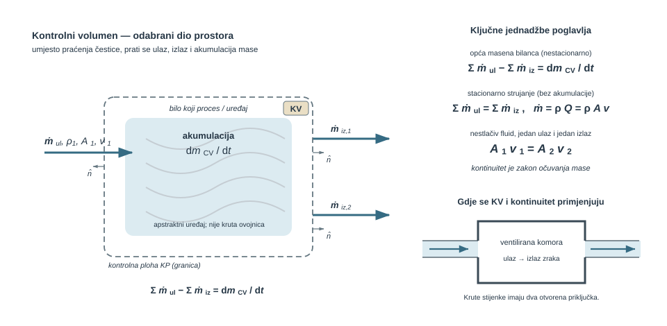
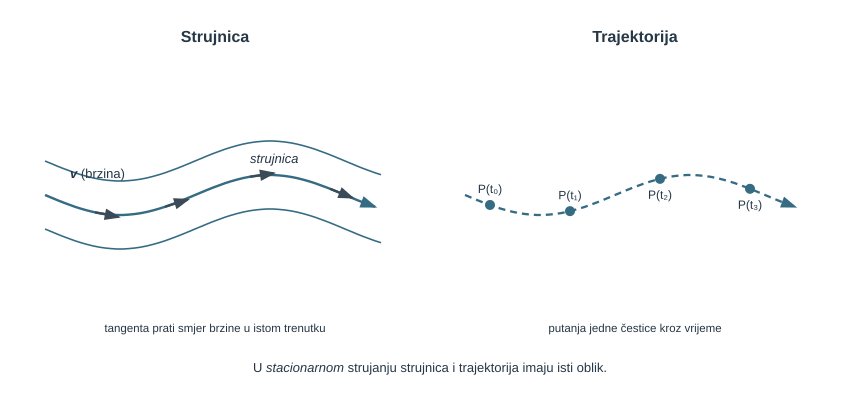
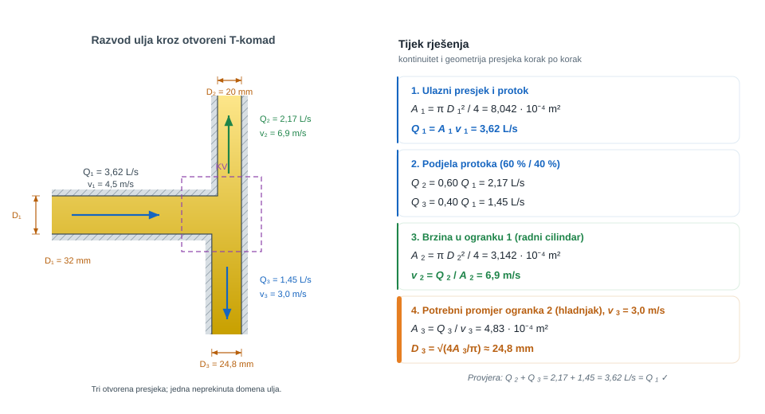

{#fig-uvod-u08 fig-align="center" fig-alt="Pregled poglavlja: kinematika, kontrolni volumen i kontinuitet."}

## Kontrolni volumen — temeljni alat dinamike strujanja

pog. 7Kinematika, kontrolni volumen i kontinuitet uvodi promjenu pogleda: umjesto praćenja pojedine čestice, promatra se odabrani dio prostora kroz koji fluid prolazi. Kontinuitet zato nije samo poseban zapis $A_1 v_1 = A_2 v_2$, nego jedan rubni slučaj mnogo šire bilance mase.

::: {.mf1-application}

Inženjerski kontekst

Kontrolni volumen je radni alat za sve sustave u kojima je važnije što ulazi, izlazi i ostaje u prostoru nego pratiti putanju svake pojedine čestice fluida: mješalice, ventilacijske komore, rashladne razdjelnike, izjednačne spremnike i građevinske retencijske komore. U strojarstvu i procesnoj tehnici upravo taj pogled zatvara masu kroz T-račve, difuzore, usisne komore i spremnike tijekom punjenja ili pražnjenja.
:::

::: {.mf1-priprema}

Prije čitanja poglavlja

**Predznanje koje se pretpostavlja:**

- pojmovi gustoće, mase i protoka iz prethodnih poglavlja;
- vektorska analiza i osnove rada s integralnim izrazima;
- pojam površinske normale i skalarnog produkta vektora;
- pojam derivacije po vremenu i po prostoru (parcijalna derivacija).

**Ishodi učenja:**

- opisati strujanje **poljem brzine** i razlikovati Eulerov pogled (točka prostora) od Lagrangeova (čestica fluida);
- razlikovati **strujnicu** od **trajektorije** i znati kada se podudaraju;
- povezati stvarni profil brzine sa **srednjom (1D) brzinom** koja ulazi u kontinuitet;
- definirati i nacrtati kontrolni volumen prilagođen konkretnom problemu;
- razlikovati masenu od volumenske bilance i ispravno ih primijeniti pri nestlačivim i stlačivim fluidima;
- riješiti probleme s više ulaza i izlaza (mješalice, razdjelnici, čvorovi mreže) i prepoznati nestacionarnu akumulaciju mase.

**Procijenjeno vrijeme rada uz udžbenik:** 10 sati.
:::

## Kinematika strujanja: kako opisujemo gibanje fluida

Prije nego što uvedemo bilance mase i energije, treba dogovoriti **kako uopće opisujemo gibanje fluida**. Za jednu kuglicu dovoljno je pratiti njezin položaj kroz vrijeme. U fluidu je čestica bezbroj, pa se nameću dva pogleda:

- **Lagrangeov pogled** — prati se pojedina čestica fluida i bilježi kako se njezin položaj i brzina mijenjaju kroz vrijeme (kao da smo obojili jednu kap i gledali kamo putuje).
- **Eulerov pogled** — biramo nepomične točke prostora i u svakoj bilježimo brzinu fluida koji baš u tom trenutku prolazi (kao mreža senzora brzine ugrađenih u cijev).

Inženjerski račun gotovo uvijek koristi Eulerov pogled, jer nas zanima što se događa na određenom mjestu (grlo Venturija, presjek cijevi, ulaz u crpku), a ne kamo je otputovala baš jedna čestica.

### Polje brzine

U Eulerovu pogledu brzina je **polje** — vektor pridružen svakoj točki prostora i svakom trenutku:

$$
\vec{v} = \vec{v}(x, y, z, t).
$$ {#eq-kinematika-kv-polje-brzine-01}

To je središnji objekt cijele dinamike fluida: iz polja brzine čitaju se protok, sile i gubici. Sva poglavlja koja slijede zapravo su načini da se to polje (ili barem njegova srednja vrijednost na nekom presjeku) odredi iz poznatih uvjeta.

::: {.mf1-fizikalno-znacenje}

Fizikalno značenje

Polje brzine nije brzina jedne čestice, nego „snimka" brzina svih čestica odjednom. Ako u presjeku cijevi izmjerimo brzinu u svakoj točki, dobili smo dio polja brzine u tom trenutku. Zato senzor na fiksnom mjestu (Eulerov pogled) mjeri kako se mijenja brzina *tamo*, a ne što se događa s jednom određenom česticom koja je odavno otplovila dalje.
:::

### Strujnica, trajektorija i strujna cijev

Iz polja brzine izvode se dvije krivulje koje se lako pomiješaju:

- **Strujnica** (linija strujanja) je krivulja koja je u **jednom trenutku** u svakoj svojoj točki tangentna na vektor brzine. To je trenutna „slika smjera" strujanja.
- **Trajektorija** (putanja) je stvarni put koji **jedna čestica** fluida prijeđe **kroz vrijeme**.

{#fig-u08-kinematika fig-align="center" fig-alt="Strujnica je tangentna na vektore brzine u istom trenutku; trajektorija je putanja jedne čestice kroz vrijeme. U stacionarnom strujanju obje krivulje imaju isti oblik."}

::: {.mf1-fizikalno-znacenje}

Fizikalno značenje

U **stacionarnom** strujanju polje brzine se ne mijenja kroz vrijeme, pa čestica koja krene po strujnici zauvijek ostaje na njoj — strujnica i trajektorija se **podudaraju**. U **nestacionarnom** strujanju polje se mijenja dok čestica putuje, pa njezina trajektorija „bježi" s trenutne strujnice i dvije krivulje više nisu iste. U MF1 gotovo uvijek radimo sa stacionarnim strujanjem, pa smijemo govoriti jednostavno o „strujnici".
:::

Skup strujnica koje prolaze rubom neke male zatvorene krivulje tvori **strujnu cijev**: fluid kroz njezin plašt ne prolazi (brzina je tangentna na strujnice), pa se ponaša kao stvarna cijev bez stijenki. Upravo je strujna cijev geometrijska podloga za kontinuitet i za Bernoullijevu jednadžbu u pog. 8Energijska jednadžba i Bernoulli.

### Stacionarno i nestacionarno strujanje

Strujanje je **stacionarno** ako se polje brzine (i tlak, gustoća…) u svakoj *fiksnoj točki* ne mijenja kroz vrijeme:

$$
\frac{\partial \vec{v}}{\partial t} = 0 \quad (\text{u svakoj točki prostora}).
$$ {#eq-kinematika-kv-stacionarno-i-nestacionarno-strujanje-01}

Pozor: stacionarno **ne znači** da se čestica ne ubrzava. Voda u suženju ustaljeno struji (slika se ne mijenja), ali svaka čestica koja uđe u suženje ubrzava jer prelazi u područje veće brzine. Nestacionarno strujanje javlja se pri pokretanju i zaustavljanju crpke, zatvaranju ventila ili pri punjenju i pražnjenju spremnika, gdje član akumulacije $dm_{CV}/dt$ nije nula.

### Od stvarnog profila do srednje brzine (1D model)

U potpuno razvijenom strujanju kroz ravnu kružnu cijev brzina nije jednaka po presjeku: uz stijenku pada na nulu zbog uvjeta ljepljivosti, a najveća je u osi. U općem presjeku profil ne mora biti osnosimetričan niti mu maksimum mora ležati u osi. Predznačeni volumenski protok kroz orijentiranu plohu računa se iz **normalne komponente** brzine:

$$
Q = \int_A \vec v\cdot\vec n\,dA = \int_A v_n\,dA .
$$ {#eq-kinematika-kv-od-stvarnog-profila-do-srednje-brzine-1d-01}

Da ne bismo u svakom zadatku integrirali cijeli profil, uvodi se **srednja (1D) brzina** — jedna brzina koja kroz isti presjek daje isti protok:

$$
\bar v_n = \frac{Q}{A} = \frac{1}{A}\int_A \vec v\cdot\vec n\,dA .
$$ {#eq-kinematika-kv-od-stvarnog-profila-do-srednje-brzine-1d-02}

Time složeni dvo- ili trodimenzijski profil zamjenjujemo jednim brojem po presjeku. To je **jednodimenzijski (1D) model** na kojem počiva cijela integralna analiza u MF1: kad god pišemo $Q = A\bar v$ ili $A_1\bar v_1 = A_2\bar v_2$, podrazumijevamo da je presjek okomit na glavni smjer strujanja i koristimo srednju normalnu, a ne vršnu brzinu. U nastavku se, radi kraćeg zapisa, crtica nad srednjom brzinom izostavlja.

::: {#ex-u08-srednja-brzina-iz-profila-brzine-t2 .mf1-we}

Riješeni primjer — Srednja brzina iz profila brzine&nbsp;T2

**Kontekst:** U cijevi je brzina najveća u osi, a nula uz stijenku. Da bismo mogli koristiti jednostavni 1D kontinuitet, treba iz stvarnog profila izvući jednu srednju brzinu.

**Zadano**

- Polumjer cijevi: $R = 25\ \text{mm}$
- Profil brzine: $v(r) = v_{max}\left(1 - (r/R)^2\right)$, $v_{max} = 3{,}0\ \text{m/s}$

**Traženo**

1. srednju brzinu $v$ i njezin odnos prema $v_{max}$.
2. volumenski protok $Q$.

**Pretpostavke i model**

Strujanje je osnosimetrično i stacionarno; protok je $Q = \int_A v\,dA$ uz prstenasti element $dA = 2\pi r\, dr$.

**Rješenje**

Protok se dobiva integracijom profila po presjeku:

$$
Q = \int_0^R v_{max}\left(1 - \frac{r^2}{R^2}\right) 2\pi r\, dr = 2\pi v_{max}\left[\frac{R^2}{2} - \frac{R^2}{4}\right] = v_{max}\,\frac{\pi R^2}{2}.
$$ {#eq-kinematika-kv-rijeseni-primjer-srednja-brzina-iz-profila-brzin-01}

Srednja brzina je protok podijeljen površinom $A = \pi R^2$:

$$
v = \frac{Q}{A} = \frac{v_{max}\,\pi R^2/2}{\pi R^2} = \frac{v_{max}}{2} = 1{,}5\ \text{m/s}.
$$ {#eq-kinematika-kv-rijeseni-primjer-srednja-brzina-iz-profila-brzin-02}

Uz $A = \pi R^2 = \pi \cdot 0{,}025^2 = 1{,}963 \cdot 10^{-3}\ \text{m}^2$ slijedi

$$
Q = vA = 1{,}5 \cdot 1{,}963 \cdot 10^{-3} \approx 2{,}95 \cdot 10^{-3}\ \text{m}^3/\text{s} = 2{,}95\ \text{L/s}.
$$ {#eq-kinematika-kv-rijeseni-primjer-srednja-brzina-iz-profila-brzin-03}

**Provjera i komentar**

1. Za ovaj (parabolični) profil srednja je brzina točno **pola** vršne — koristan orijentir.
2. U 1D modelu cijeli profil zamjenjuje jedan broj $v = 1{,}5\ \text{m/s}$; upravo taj broj ulazi u $Q = Av$ i u kontinuitet.
3. Da smo pogrešno uzeli $v_{max}$ umjesto srednje brzine, protok bismo precijenili dvostruko.
:::

### Materijalna derivacija: ubrzanje čestice

Kad nas zanima ubrzanje **čestice** (a ono ulazi u Newtonov zakon i u sve dinamičke jednadžbe), ne smijemo samo derivirati polje po vremenu u fiksnoj točki. Čestica se ubrzava iz dva razloga: jer se polje s vremenom mijenja i jer čestica putuje u područje druge brzine. Oba doprinosa spaja **materijalna (supstancijalna) derivacija**:

$$
\vec{a} = \frac{D\vec{v}}{Dt} = \underbrace{\frac{\partial \vec{v}}{\partial t}}_{\text{lokalno}} + \underbrace{(\vec{v}\cdot\nabla)\vec{v}}_{\text{konvektivno}} .
$$ {#eq-kinematika-kv-materijalna-derivacija-ubrzanje-cestice-01}

::: {.mf1-fizikalno-znacenje}

Fizikalno značenje

**Lokalni** član $\partial\vec{v}/\partial t$ opisuje ubrzanje jer se cijelo polje pojačava ili slabi (npr. pri pokretanju crpke). **Konvektivni** član $(\vec{v}\cdot\nabla)\vec{v}$ opisuje ubrzanje jer čestica putuje u područje druge brzine — točno ono što se događa u suženju gdje je strujanje stacionarno ($\partial\vec{v}/\partial t = 0$), a čestica ipak ubrzava. Zato voda u mlaznici ubrzava iako je „slika" strujanja nepromjenjiva: sav doprinos dolazi iz konvektivnog člana.
:::

Tu se materijalna derivacija zaustavlja na razini pojma. Eulerova jednadžba pojavljuje se u pog. 8Energijska jednadžba i Bernoulli, integralna bilanca količine gibanja u pog. 10Količina i moment količine gibanja, a puni lokalni izvod u pog. 12Diferencijalni opis realnog toka.

::: {.mf1-samoprovjera}

Provjeri sebe

Sljedeća pitanja služe za samostalnu provjeru prije prelaska na kontrolni volumen.

1. U čemu je razlika između strujnice i trajektorije i kada se podudaraju?

::: {.callout-note collapse="true"}
### Odgovor
Strujnica je krivulja tangentna na polje brzine u jednom trenutku; trajektorija je stvarni put jedne čestice kroz vrijeme. Podudaraju se u stacionarnom strujanju, jer se polje brzine tada ne mijenja dok čestica putuje.
:::

2. Može li strujanje biti stacionarno, a da se čestica ipak ubrzava?

::: {.callout-note collapse="true"}
### Odgovor
Može. Stacionarnost znači $\partial\vec{v}/\partial t = 0$ u svakoj fiksnoj točki, ali čestica koja prelazi iz šireg u uži presjek ulazi u područje veće brzine i ubrzava preko konvektivnog člana $(\vec{v}\cdot\nabla)\vec{v}$. Primjer je voda u mlaznici.
:::

3. Zašto u kontinuitetu $Q = Av$ koristimo srednju, a ne vršnu brzinu?

::: {.callout-note collapse="true"}
### Odgovor
Jer je protok integral cijelog profila, $Q = \int_A v\,dA$. Srednja brzina $v = Q/A$ definirana je tako da kroz presjek daje isti protok kao stvarni profil; vršna brzina (u osi) veća je od srednje i dala bi precijenjen protok.
:::
:::

## Fizikalni uvod i matematički izvod

Kad fluid struji, više nije praktično pratiti putanju iste čestice kroz vrijeme. Umjesto toga uvodi se kontrolni volumen: odabrani dio prostora kroz koji fluid može ulaziti, izlaziti i po potrebi se akumulirati.

Tu je korisno odmah razlikovati dva pogleda. Sustav ili kontrolna masa znači da se prati ista količina tvari i ne dopušta prijelaz mase preko granice. Kontrolni volumen znači da se prati odabrani dio prostora, dok masa smije prelaziti preko njegove granice.

U fluidnim uređajima poput difuzora, komore miješanja ili spremnika s promjenom razine upravo je drugi pogled prirodan, jer su ulazi, izlazi i akumulacija važniji od identiteta pojedine čestice. Formalni most između ta dva pogleda daje Reynoldsov teorem prijenosa, a kontinuitet u ovom poglavlju može se čitati kao njegova masena bilanca.

Najopćenitiji zapis je

$$\sum \dot{m}_{ulaz} - \sum \dot{m}_{izlaz} = \frac{dm_{CV}}{dt}$$ {#eq-kinematika-kv-fizikalni-uvod-i-matematicki-izvod-01}

::: {.mf1-fizikalno-znacenje}

Fizikalno značenje

Ova bilanca mase kaže: što god ne izlazi iz kontrolnog volumena, ostaje unutar njega (akumulira se). Ako ulazi više nego što izlazi, razina raste ili se masa skuplja. Ako izlazi više nego što ulazi, volumen se prazni. Kada nema akumulacije (stacionarno strujanje), masa koja uđe mora i izaći — ništa se ne može ni stvoriti ni izgubiti.
:::

Ako je strujanje stacionarno i nema akumulacije, to prelazi u

$$\sum \dot{m}_{ulaz} = \sum \dot{m}_{izlaz}$$ {#eq-kinematika-kv-fizikalno-znacenje-01}

Tu je važno ne pomiješati dvije različite veličine. Maseni protok $\dot m$ mjeri koliko mase prolazi u sekundi i uvijek je primarni zapis kontinuiteta, dok volumenski protok $Q$ mjeri koliko volumena prolazi u sekundi. Povezuje ih relacija

$$
\dot m = \rho Q,
\qquad
Q = Av.
$$ {#eq-kinematika-kv-fizikalno-znacenje-02}

Tek kad je riječ o istom nestlačivom fluidu kroz sve presjeke i kad je gustoća praktično ista, masena bilanca može se podijeliti s $\rho$ i prijeći u volumensku bilancu. Zato je u običnoj cijevi prirodno pisati $Q_1 = Q_2$, ali u miješanju dviju struja različitih gustoća najprije treba zatvoriti masenu bilancu, pa tek onda iz nje čitati gustoću ili volumenski protok mješavine.

Tek za jednu ulaznu i jednu izlaznu granu nestlačivoga fluida dobiva se poznati oblik

$$A_1 v_1 = A_2 v_2$$ {#eq-kinematika-kv-fizikalno-znacenje-03}

::: {.mf1-fizikalno-znacenje}

Fizikalno značenje

Jednadžba $A_1 v_1 = A_2 v_2$ kaže da se pri stacionarnom toku kroz jednu strujnu cijev nestlačivoga fluida **srednja brzina** povećava kad se raspoloživa površina presjeka smanji. Zato se tok ubrzava u suženju cijevi. Za rijeku nije dovoljna sama dubina: mjerodavna je cijela površina poprečnog presjeka, koja ovisi i o širini korita, te raspodjela brzine po tom presjeku.
:::

::: {.callout-note collapse="true" icon="false"}
## Numerički trag

U nestlačivom CFD modelu polje brzine mora zadovoljiti ograničenje $\nabla\cdot\vec v=0$. Metode sprege tlaka i brzine zato korigiraju polja tako da se diskretizirana bilanca mase zatvori u ćelijama i globalno. Mala lokalna divergencija sama ipak nije dokaz da su mreža, rubni uvjeti i fizikalni model prikladni.
:::

::: {.mf1-interaktivno}

Interaktivni prikaz — Kontinuitet u suženju cijevi

Interaktivni prikaz omogućuje mijenjanje ulaznog i izlaznog promjera te volumenskog protoka uz neposredno praćenje brzine fluida duž cijevi. Profil brzine jasno pokazuje koliko se brzina pojačava u suženju u odnosu na ulazni presjek.

<a class="mf1-interaktivno-veza" href="https://martibasic.github.io/MF1_udzbenik/jlite/lab/index.html?path=u08_kontinuitet_suzenje.ipynb">Pokreni u pregledniku</a>

**Pitanja za samostalno istraživanje:** (a) Koliko je puta veća izlazna brzina kada je $D_2 = D_1/2$, a koliko kada je $D_2 = D_1/4$? (b) Vrijedi li jednadžba kontinuiteta i pri $D_1 = D_2$? (c) Zašto u stvarnoj cijevi profil brzina nije jednolik nego približno paraboličan ili polako-jednolik?

:::

::: {.mf1-izvod}

Matematički izvod — Bilanca mase u kontrolnom volumenu

Opći kontinuitet nije nova formula nego integralni zapis očuvanja mase na kontrolnom volumenu $KV(t)$ omeđenom kontrolnom plohom $KP(t)$ s vanjskom normalom $\vec n$. Ako se kontrolna ploha lokalno giba brzinom $\vec v_{KP}$, masa je presijeca relativnom brzinom $\vec v-\vec v_{KP}$:

$$
\frac{d}{dt}\int_{KV(t)} \rho\,dV
+ \int_{KP(t)} \rho\bigl[(\vec v-\vec v_{KP})\cdot\vec n\bigr]\,dA = 0.
$$ {#eq-kinematika-kv-matematicki-izvod-bilanca-mase-u-kontrolnom-volu-01}

Prvi član predstavlja brzinu promjene mase unutar trenutačnoga kontrolnog volumena. Drugi predstavlja neto tok mase **kroz njegovu granicu**: predznak određuje skalarni produkt relativne brzine i vanjske normale. Za nepomičnu kontrolnu plohu vrijedi $\vec v_{KP}=0$, pa se dobiva oblik koji se koristi u spremnicima i nepomičnim cijevnim elementima:

$$
\frac{d}{dt}\int_{KV} \rho\,dV + \int_{KP} \rho(\vec v\cdot\vec n)\,dA=0.
$$ {#eq-kinematika-kv-matematicki-izvod-bilanca-mase-u-kontrolnom-volu-02}

Ako se kontrolna ploha rastavi na konačan broj presjeka na kojima se profil može čitati jednodimenzijski, površinski integral prelazi u zbroj članova

$$
\sum_k \rho_k A_k v_{n,k}.
$$ {#eq-kinematika-kv-matematicki-izvod-bilanca-mase-u-kontrolnom-volu-03}

Tada se opći zakon može zapisati kao

$$
\frac{dm_{CV}}{dt} + \sum \dot m_{izlaz} - \sum \dot m_{ulaz} = 0,
$$ {#eq-kinematika-kv-matematicki-izvod-bilanca-mase-u-kontrolnom-volu-04}

odnosno u poznatijem obliku

$$
\sum \dot m_{ulaz} - \sum \dot m_{izlaz} = \frac{dm_{CV}}{dt}.
$$ {#eq-kinematika-kv-matematicki-izvod-bilanca-mase-u-kontrolnom-volu-05}

Kad je tok stacionaran, član akumulacije nestaje pa slijedi

$$
\sum \dot m_{ulaz} = \sum \dot m_{izlaz}.
$$ {#eq-kinematika-kv-matematicki-izvod-bilanca-mase-u-kontrolnom-volu-06}

Tek ako je fluid pritom nestlačiv i ako postoji samo jedan ulazni i jedan izlazni presjek, maseni protoci prelaze u volumenske, pa nastaje krajnji rubni slučaj

$$
\rho A_1v_1 = \rho A_2v_2
\qquad \Longrightarrow \qquad
A_1v_1 = A_2v_2.
$$ {#eq-kinematika-kv-matematicki-izvod-bilanca-mase-u-kontrolnom-volu-07}

Time se vidi puno fizikalno značenje kontinuiteta: jednadžba ne tvrdi da se dvije površine moraju "mehanički" poništiti, nego da se ukupna masa ne može izgubiti ni stvoriti između ulaza, izlaza i eventualne akumulacije unutar kontrolnog volumena.
:::

::: {.mf1-izvod}

Matematički izvod — Reynoldsov transportni teorem — opći okvir

Sve integralne zakone fluidne mehanike — kontinuitet, količine gibanja i energije — povezuje jedinstveni matematički okvir poznat kao **Reynoldsov transportni teorem (RTT)**. On povezuje promjenu ekstenzivne veličine sustava, čija je pripadna specifična veličina $\eta$, s akumulacijom i protokom kroz proizvoljan kontrolni volumen. Kontrolni volumen može mirovati, gibati se ili deformirati.

Za proizvoljnu intenzivnu veličinu $\eta$ po jedinici mase RTT glasi

$$
\frac{d}{dt}\int_{sustav} \rho\eta\,dV
= \frac{d}{dt}\int_{KV(t)} \rho\eta\,dV
+ \int_{KP(t)} \rho\eta\bigl[(\vec v-\vec v_{KP})\cdot\vec n\bigr]\,dA.
$$ {#eq-kinematika-kv-matematicki-izvod-reynoldsov-transportni-teorem-01}

Prvi član s desne strane je **akumulacija** unutar kontrolnog volumena, drugi je **neto izlazni protok** kroz kontrolnu plohu. U članu protoka uvijek stoji brzina fluida **relativna prema plohi**. Za fiksni volumen $\vec v_{KP}=0$; za kontrolni volumen vezan uz lopaticu lokalno je $\vec v_{KP}=\vec u$, pa se u protoku pojavljuje relativna brzina $\vec w=\vec v-\vec u$. Sva tri osnovna zakona slijede iz RTT-a uz odgovarajući izbor $\eta$:

- **Očuvanje mase** ($\eta = 1$): $d/dt\int_{sustav}\rho\,dV = 0$, što daje jednadžbu kontinuiteta.
- **Količina gibanja** ($\eta = \vec{v}$): $d/dt\int_{sustav}\rho\vec{v}\,dV = \sum\vec{F}$, što daje integralni zakon iz pog. 10Količina i moment količine gibanja.
- **Energija** ($\eta = e$, ukupna specifična energija): $d/dt\int_{sustav}\rho e\,dV = \dot{Q}-\dot{W}$, što vodi na energijsku jednadžbu u pog. 8Energijska jednadžba i Bernoulli.

Zakoni se tako pojavljuju kao primjene istoga teorema na različite veličine. Član relativnoga protoka postaje presudan za pokretne lopatice u pog. 14Turbostrojevi i propulzija.
:::

::: {.mf1-izvod}

Matematički izvod — Diferencijalni oblik kontinuiteta — iz integralnog preko teorema o divergenciji

Integralni oblik kontinuiteta vrijedi za **proizvoljan** kontrolni volumen. Iz toga slijedi i **lokalni (diferencijalni) oblik** koji vrijedi u svakoj točki fluida — što je polazna jednadžba svake CFD analize.

Polazi se od integralnog zapisa

$$
\frac{d}{dt}\int_{KV}\rho\,dV + \int_{KP}\rho(\vec{v}\cdot\vec{n})\,dA = 0.
$$ {#eq-kinematika-kv-matematicki-izvod-diferencijalni-oblik-kontinuit-01}

Primjenom **teorema o divergenciji** površinski integral pretvara se u volumenski:

$$
\int_{KP}\rho(\vec{v}\cdot\vec{n})\,dA = \int_{KV}\nabla\cdot(\rho\vec{v})\,dV.
$$ {#eq-kinematika-kv-matematicki-izvod-diferencijalni-oblik-kontinuit-02}

Spajanjem dvaju članova pod jedan integral dobiva se

$$
\int_{KV}\!\left[\frac{\partial\rho}{\partial t} + \nabla\cdot(\rho\vec{v})\right]dV = 0.
$$ {#eq-kinematika-kv-matematicki-izvod-diferencijalni-oblik-kontinuit-03}

Kako ovaj integral mora iščeznuti za svaki kontrolni volumen, podintegralna funkcija sama mora biti nula u svakoj točki:

$$
\frac{\partial\rho}{\partial t} + \nabla\cdot(\rho\vec{v}) = 0.
$$ {#eq-kinematika-kv-matematicki-izvod-diferencijalni-oblik-kontinuit-04}

To je **diferencijalna jednadžba kontinuiteta** u najopćenitijem obliku — vrijedi i za stlačive i za nestlačive fluide. Za **nestlačivi fluid** ($\rho = \text{const.}$, pa $\partial\rho/\partial t = 0$ i $\nabla\rho = 0$) ona se reducira na

$$
\nabla\cdot\vec{v} = 0.
$$ {#eq-kinematika-kv-matematicki-izvod-diferencijalni-oblik-kontinuit-05}

Ova lokalna jednadžba čini polaznu točku diskretizacije u svakom CFD solveru: u algoritmima SIMPLE i PISO upravo se polje brzine iterativno korigira tako da $\nabla\cdot\vec{v} = 0$ vrijedi u svakoj ćeliji mreže.
:::

Primjeri niže samo redom variraju tri osnovne situacije: suženje ili difuzor, miješanje više struja i spremnik s promjenom razine. Zato se prije bilo koje jednadžbe najprije bira kontrolni volumen, pa se provjerava piše li se masena ili volumenska bilanca, radi li se o stacionarnom ili nestacionarnom problemu te postoji li jedna grana ili više ulaza i izlaza.

Ako taj redoslijed nije zatvoren, gotovo je sigurno da će zadatak biti krivo pojednostavljen.

## Riješeni primjeri

::: {#ex-u08-voda-struji-kroz-difuzor-t2 .mf1-we}

Riješeni primjer — Voda struji kroz difuzor&nbsp;T2

**Kontekst:** U cjevovodu vodoopskrbnog sustava difuzor postupno proširuje presjek kako bi se smanjila brzina vode prije ulaska u sljedeći element. Projektant iz zadanih dimenzija i izlazne brzine određuje ulaznu brzinu te volumenski i maseni protok.

**Zadano**

- Ulazni promjer difuzora: $D_1 = 120\ \text{mm}$
- Izlazni promjer difuzora: $D_2 = 180\ \text{mm}$
- Srednja brzina na izlazu: $v_2 = 16\ \text{m/s}$
- Gustoća vode: $\rho = 998\ \text{kg/m}^3$

**Traženo**

1. srednju brzinu na ulazu $v_1$.
2. volumenski protok $Q$.
3. maseni protok $\dot{m}$.

{#fig-u08-difuzor-i-kontinuitet fig-alt="difuzor i kontinuitet"}

**Pretpostavke i model**

Promatra se jedan kontrolni volumen s jednom ulaznom i jednom izlaznom granom. Kako je tok stacionaran, a voda se može uzeti nestlačivom, kroz oba presjeka mora prolaziti isti volumenski protok.

**Rješenje**

Za stacionarni tok nestlačivog fluida vrijedi $Q_1 = Q_2$, odnosno $A_1 v_1 = A_2 v_2$. Površine presjeka su

$$
A_1 = \frac{\pi D_1^2}{4} = \frac{\pi \cdot 0{,}12^2}{4} \approx 0{,}01131\ \text{m}^2,
$$ {#eq-kinematika-kv-rijeseni-primjer-voda-struji-kroz-difuzor-t2-01}

$$
A_2 = \frac{\pi D_2^2}{4} = \frac{\pi \cdot 0{,}18^2}{4} \approx 0{,}02545\ \text{m}^2.
$$ {#eq-kinematika-kv-rijeseni-primjer-voda-struji-kroz-difuzor-t2-02}

Iz kontinuiteta slijedi ulazna brzina

$$
v_1 = \frac{A_2}{A_1} v_2 = \left(\frac{0{,}18}{0{,}12}\right)^2 \cdot 16 = 36\ \text{m/s}.
$$ {#eq-kinematika-kv-rijeseni-primjer-voda-struji-kroz-difuzor-t2-03}

Volumenski protok može se sada izračunati iz bilo kojeg presjeka. Najjednostavnije je s izlaznog:

$$
Q = A_2 v_2 = 0{,}02545 \cdot 16 \approx 0{,}407\ \text{m}^3/\text{s}.
$$ {#eq-kinematika-kv-rijeseni-primjer-voda-struji-kroz-difuzor-t2-04}

Maseni protok zato iznosi

$$
\dot{m} = \rho Q = 998 \cdot 0{,}407 \approx 406\ \text{kg/s} \approx 4{,}06 \cdot 10^2\ \text{kg/s}.
$$ {#eq-kinematika-kv-rijeseni-primjer-voda-struji-kroz-difuzor-t2-05}

**Provjera i komentar**

U užem ulaznom presjeku brzina mora biti veća nego na izlazu, jer isti protok prolazi kroz manju površinu. U ovom difuzoru to daje ulaznu brzinu od $36\ \text{m/s}$, volumenski protok od oko $0{,}407\ \text{m}^3/\text{s}$ i maseni protok od oko $406\ \text{kg/s}$.

1. Kako je $D_2 > D_1$, mora biti $A_2 > A_1$ i zato $v_2 < v_1$.
2. Isti volumenski protok mora se dobiti i iz izraza $A_1 v_1$ i iz izraza $A_2 v_2$.
3. Ako brzina ispadne veća u širem presjeku, onda je odnos površina obrnut.
:::

Difuzor zatvara stacionarni jednovodni slučaj. Sljedeća jezgrena scena pog. 7Kinematika, kontrolni volumen i kontinuitet ide jedan korak dalje: protoci više nisu uravnoteženi, pa razlika ulaza i izlaza ne nestaje nego se pretvara u porast volumena unutar kontrolnog volumena.

::: {#ex-u08-izjednacni-spremnik-tijekom-ispiranja-filtra-t2 .mf1-we}

Riješeni primjer — Izjednačni spremnik tijekom ispiranja filtra&nbsp;T2

**Kontekst:** Tijekom ispiranja filtra u sustavu za pripremu vode izjednačni spremnik prima više vode nego što se odvodi servisnim ispustom, pa razina postupno raste. Operater procjenjuje brzinu porasta razine, vrijeme dosizanja gornje radne granice i pripadnu akumuliranu masu.

**Zadano**

- Duljina pravokutnog izjednačnog spremnika: $L = 3{,}0\ \text{m}$
- Širina spremnika: $b = 1{,}8\ \text{m}$
- Stalni ulazni volumenski protok vode: $Q_{in} = 22\ \text{L/s} = 0{,}022\ \text{m}^3/\text{s}$
- Stalni izlazni protok kroz servisni odvod: $Q_{out} = 8\ \text{L/s} = 0{,}008\ \text{m}^3/\text{s}$
- Početna dubina vode: $h_0 = 0{,}45\ \text{m}$
- Gornja dopuštena radna razina: $h_1 = 1{,}20\ \text{m}$
- Gustoća vode: $\rho = 998\ \text{kg/m}^3$

**Traženo**

1. brzinu porasta razine vode $dh/dt$.
2. vrijeme potrebno da razina poraste od $h_0$ do $h_1$.
3. kolika se masa vode akumulira u spremniku do tog trenutka.

{#fig-u08-izjednacni-spremnik-s-akumulacijom fig-alt="izjednačni spremnik s akumulacijom"}

**Pretpostavke i model**

Promatra se kontrolni volumen koji obuhvaća cijeli spremnik. Tekućina je ista na ulazu i izlazu, gustoća se uzima konstantnom, a tlocrtna površina spremnika ne mijenja se s visinom. Zato se član akumulacije može zapisati preko promjene volumena, odnosno preko promjene razine.

**Rješenje**

Tlocrtna površina spremnika iznosi

$$
A_T = Lb = 3{,}0 \cdot 1{,}8 = 5{,}40\ \text{m}^2.
$$ {#eq-kinematika-kv-rijeseni-primjer-izjednacni-spremnik-tijekom-isp-01}

Za nestacionarni kontrolni volumen vrijedi $Q_{in} - Q_{out} = dV/dt$. Kako je $V = A_T h$, slijedi

$$
\frac{dh}{dt} = \frac{Q_{in} - Q_{out}}{A_T} = \frac{0{,}022 - 0{,}008}{5{,}40} \approx 2{,}59 \cdot 10^{-3}\ \text{m/s} \approx 0{,}155\ \text{m/min}.
$$ {#eq-kinematika-kv-rijeseni-primjer-izjednacni-spremnik-tijekom-isp-02}

Porast razine koji nas zanima iznosi

$$
\Delta h = h_1 - h_0 = 1{,}20 - 0{,}45 = 0{,}75\ \text{m},
$$ {#eq-kinematika-kv-rijeseni-primjer-izjednacni-spremnik-tijekom-isp-03}

pa je pripadni akumulirani volumen

$$
\Delta V = A_T \Delta h = 5{,}40 \cdot 0{,}75 = 4{,}05\ \text{m}^3.
$$ {#eq-kinematika-kv-rijeseni-primjer-izjednacni-spremnik-tijekom-isp-04}

Vrijeme potrebno za takvu akumulaciju je

$$
t = \frac{\Delta V}{Q_{in} - Q_{out}} = \frac{4{,}05}{0{,}014} \approx 289\ \text{s} \approx 4{,}82\ \text{min}.
$$ {#eq-kinematika-kv-rijeseni-primjer-izjednacni-spremnik-tijekom-isp-05}

Masa vode koja se do tada akumulira iznosi

$$
\Delta m = \rho \Delta V = 998 \cdot 4{,}05 \approx 4{,}04 \cdot 10^3\ \text{kg} \approx 4040\ \text{kg}.
$$ {#eq-kinematika-kv-rijeseni-primjer-izjednacni-spremnik-tijekom-isp-06}

**Provjera i komentar**

Razina vode u spremniku raste brzinom od oko $0{,}155\ \text{m/min}$, do gornje radne razine dolazi za oko $4{,}8$ minuta, a u tom se vremenu u spremniku akumulira oko $4{,}04\ \text{t}$ vode. To je tipičan primjer pog. 7Kinematika, kontrolni volumen i kontinuitet u kojem razlika protoka postaje porast mase unutar kontrolnog volumena.

1. Kako je $Q_{in} > Q_{out}$, razina mora rasti, a ne padati.
2. Neto protok od $14\ \text{L/s}$ na spremniku tlocrtne površine $5{,}4\ \text{m}^2$ mora dati spor, ali mjerljiv rast razine reda nekoliko desetina metra u minuti.
3. Kad bi bilo $Q_{in} = Q_{out}$, član akumulacije bi nestao i problem bi se vratio na stacionarni slučaj.
:::

::: {#ex-u08-mijesajuci-izjednacni-spremnik-s-porastom-razine-t3 .mf1-ch}

Cjeloviti zadatak — miješajući izjednačni spremnik s porastom razine&nbsp;T3

**Kontekst:** U procesnom postrojenju miješajući izjednačni spremnik prima vodu i slanu otopinu iz dvaju ulaznih vodova, a homogenizirana mješavina izlazi kroz zajednički vod sporije nego što ulazi, pa razina postupno raste. Procesnom inženjeru trebaju izlazni protok, gustoća mješavine, brzina porasta razine te masa koja se akumulira u radnom rasponu.

**Zadano**

- Tlocrtne dimenzije pravokutnog miješajućeg izjednačnog spremnika: $L = 4{,}2\ \text{m}$, $b = 1{,}5\ \text{m}$
- Gustoća vode (ulazna struja A): $\rho_A = 1000\ \text{kg/m}^3$
- Volumenski protok vode: $Q_A = 18\ \text{L/s} = 0{,}018\ \text{m}^3/\text{s}$
- Relativna gustoća slane otopine (ulazna struja B): $s_B = 1{,}10$
- Volumenski protok slane otopine: $Q_B = 6\ \text{L/s} = 0{,}006\ \text{m}^3/\text{s}$
- Promjer izlaznog voda: $D_3 = 100\ \text{mm}$
- Trenutna srednja izlazna brzina: $v_3 = 1{,}80\ \text{m/s}$
- Spremnik je dobro izmiješan, gustoća u spremniku jednaka je gustoći mješavine ulaznih struja
- Početna razina: $h_0 = 0{,}80\ \text{m}$; razmatra se porast do $h_1 = 1{,}20\ \text{m}$

**Traženo**

1. izlazni volumenski protok $Q_3$.
2. gustoću homogenizirane mješavine u spremniku i izlaznom vodu $\rho_3$.
3. brzinu porasta razine $dh/dt$.
4. vrijeme potrebno da razina poraste od $h_0$ do $h_1$.
5. masu tekućine koja se akumulira u spremniku tijekom tog porasta.

{#fig-u08-mijesajuci-izjednacni-spremnik fig-alt="miješajući izjednačni spremnik"}

**Pretpostavke i model**

Ovdje jedan kontrolni volumen obuhvaća cijeli spremnik. Izlazni tok zatvara se preko relacije $Q_3 = A_3 v_3$, gustoća homogenizirane mješavine dobiva se iz masene bilance ulaza, a porast razine dolazi iz volumenske akumulacije. Ključ nije formula nego redoslijed: izlazni tok, zatim gustoća mješavine, pa tek onda član akumulacije.

**Rješenje**

Najprije od relativne gustoće dobivamo gustoću slane otopine:

$$
\rho_B = s_B \rho_A = 1{,}10 \cdot 1000 = 1100\ \text{kg/m}^3.
$$ {#eq-kinematika-kv-cjeloviti-zadatak-mijesajuci-izjednacni-spremnik-01}

Površina izlaznog presjeka iznosi

$$
A_3 = \frac{\pi D_3^2}{4} = \frac{\pi \cdot 0{,}10^2}{4} \approx 7{,}854 \cdot 10^{-3}\ \text{m}^2,
$$ {#eq-kinematika-kv-cjeloviti-zadatak-mijesajuci-izjednacni-spremnik-02}

zato je izlazni volumenski protok

$$
Q_3 = A_3 v_3 = 7{,}854 \cdot 10^{-3} \cdot 1{,}80 \approx 1{,}414 \cdot 10^{-2}\ \text{m}^3/\text{s} \approx 14{,}1\ \text{L/s}.
$$ {#eq-kinematika-kv-cjeloviti-zadatak-mijesajuci-izjednacni-spremnik-03}

Za homogeniziranu mješavinu najprije zatvaramo masenu bilancu dviju ulaznih struja. Ukupni ulazni maseni protok je

$$
\dot{m}_{in} = \rho_A Q_A + \rho_B Q_B = 1000 \cdot 0{,}018 + 1100 \cdot 0{,}006 = 18 + 6{,}6 = 24{,}6\ \text{kg/s}.
$$ {#eq-kinematika-kv-cjeloviti-zadatak-mijesajuci-izjednacni-spremnik-04}

Ukupni ulazni volumenski protok iznosi

$$
Q_{in} = Q_A + Q_B = 0{,}018 + 0{,}006 = 0{,}024\ \text{m}^3/\text{s},
$$ {#eq-kinematika-kv-cjeloviti-zadatak-mijesajuci-izjednacni-spremnik-05}

pa je gustoća homogenizirane mješavine

$$
\rho_3 = \frac{\dot{m}_{in}}{Q_{in}} = \frac{24{,}6}{0{,}024} = 1025\ \text{kg/m}^3.
$$ {#eq-kinematika-kv-cjeloviti-zadatak-mijesajuci-izjednacni-spremnik-06}

Tlocrtna površina spremnika iznosi

$$
A_T = Lb = 4{,}2 \cdot 1{,}5 = 6{,}30\ \text{m}^2.
$$ {#eq-kinematika-kv-cjeloviti-zadatak-mijesajuci-izjednacni-spremnik-07}

Za volumensku akumulaciju vrijedi $Q_A + Q_B - Q_3 = A_T \,dh/dt$, odnosno

$$
\frac{dh}{dt} = \frac{0{,}024 - 0{,}01414}{6{,}30} \approx 1{,}57 \cdot 10^{-3}\ \text{m/s} \approx 0{,}094\ \text{m/min}.
$$ {#eq-kinematika-kv-cjeloviti-zadatak-mijesajuci-izjednacni-spremnik-08}

Porast razine iznosi

$$
\Delta h = h_1 - h_0 = 1{,}20 - 0{,}80 = 0{,}40\ \text{m},
$$ {#eq-kinematika-kv-cjeloviti-zadatak-mijesajuci-izjednacni-spremnik-09}

pa je akumulirani volumen

$$
\Delta V = A_T \Delta h = 6{,}30 \cdot 0{,}40 = 2{,}52\ \text{m}^3.
$$ {#eq-kinematika-kv-cjeloviti-zadatak-mijesajuci-izjednacni-spremnik-10}

Vrijeme potrebno za takav porast razine iznosi

$$
t = \frac{\Delta V}{Q_A + Q_B - Q_3} = \frac{2{,}52}{0{,}024 - 0{,}01414} \approx 255\ \text{s} \approx 4{,}26\ \text{min}.
$$ {#eq-kinematika-kv-cjeloviti-zadatak-mijesajuci-izjednacni-spremnik-11}

Masa koja se u tom intervalu akumulira u spremniku iznosi

$$
\Delta m = \rho_3 \Delta V = 1025 \cdot 2{,}52 \approx 2583\ \text{kg} \approx 2{,}58\ \text{t}.
$$ {#eq-kinematika-kv-cjeloviti-zadatak-mijesajuci-izjednacni-spremnik-12}

**Provjera i komentar**

Ovaj cjeloviti zadatak zatvara puni slijed poglavlja pog. 7Kinematika, kontrolni volumen i kontinuitet u jednom kontrolnom volumenu: izlazni vod daje $Q_3 \approx 14{,}1\ \text{L/s}$, mješavina u spremniku ima gustoću oko $1025\ \text{kg/m}^3$, razina raste brzinom oko $0{,}094\ \text{m/min}$, a do porasta od $0{,}40\ \text{m}$ treba oko $4{,}3$ minute. U tom se vremenu akumulira oko $2{,}58$ t homogenizirane tekućine.

1. Gustoća mješavine mora biti između gustoće vode i gustoće slane otopine.
2. Kako je ukupni ulazni protok veći od izlaznog, razina mora rasti, a ne padati.
3. Ako se u ovom zadatku odmah napiše samo jedna formula kontinuiteta bez razdvajanja ulazne mase, izlaznog toka i akumulacije, gotovo sigurno će se izgubiti barem jedna fizikalna veza.
:::

Kao sažetak poglavlja korisno je držati zajedno tri reprezentativne scene: suženje, difuzor i kontrolni volumen s više tokova. Uz njih prirodno stoji i standardna shema bilance mase s označenim ulazima, izlazima i akumulacijom.

{#fig-u08-staticka-zamjena-za-kontrolni-volumen-i-kontinuitet fig-alt="statička zamjena za kontrolni volumen i kontinuitet"}

::: {#ex-u08-kontinuitet-kroz-razvodni-t-komad-hidraulicnog-sustava .mf1-we}

Riješeni primjer — Kontinuitet kroz razvodni T-komad hidrauličnog sustava &nbsp;T2

**Primjer za strojare**

**Kontekst:** U hidrauličnom sustavu strojnice T-komad dijeli ulazni tok ulja iz crpke u dva ogranka: jedan za radni cilindar, drugi za hladnjak ulja. Projektant provjerava brzine u ograncima.

**Zadano**

- Ulazna cijev: $D_1 = 32\ \text{mm}$, $v_1 = 4{,}5\ \text{m/s}$
- Ogranak 1 (radni cilindar): $D_2 = 20\ \text{mm}$, volumni udio $60\%$ ulaznog toka
- Ogranak 2 (hladnjak): $D_3 = ?$ mm, dobiva preostalih $40\%$
- Gustoća ulja: $\rho = 870\ \text{kg/m}^3$

**Traženo**

1. Volumni protok $Q_1$ na ulazu.
2. Protoci $Q_2$ i $Q_3$ u ograncima.
3. Brzina $v_2$ u ogranku 1 i potrebni promjer $D_3$ ako je $v_3 = 3{,}0\ \text{m/s}$.

{#fig-u08-t-komad-hidraulika fig-align="center" fig-alt="Razvodni T-komad: D1=32 mm, D2=20 mm, v1=4,5 m/s, 60%/40% raspodjela"}

**Rješenje**

$$
A_1 = \frac{\pi D_1^2}{4} = \frac{\pi \cdot 0{,}032^2}{4} = 8{,}042 \cdot 10^{-4}\ \text{m}^2
$$ {#eq-kinematika-kv-rijeseni-primjer-kontinuitet-kroz-razvodni-t-kom-01}

$$
Q_1 = A_1 v_1 = 8{,}042 \cdot 10^{-4} \cdot 4{,}5 = 3{,}619 \cdot 10^{-3}\ \text{m}^3/\text{s} = 3{,}62\ \text{L/s}
$$ {#eq-kinematika-kv-rijeseni-primjer-kontinuitet-kroz-razvodni-t-kom-02}

$$
Q_2 = 0{,}60 \cdot Q_1 = 2{,}17\ \text{L/s}, \quad Q_3 = 0{,}40 \cdot Q_1 = 1{,}45\ \text{L/s}
$$ {#eq-kinematika-kv-rijeseni-primjer-kontinuitet-kroz-razvodni-t-kom-03}

$$
A_2 = \frac{\pi \cdot 0{,}020^2}{4} = 3{,}142 \cdot 10^{-4}\ \text{m}^2, \quad v_2 = \frac{Q_2}{A_2} = \frac{2{,}17 \cdot 10^{-3}}{3{,}142 \cdot 10^{-4}} = 6{,}9\ \text{m/s}
$$ {#eq-kinematika-kv-rijeseni-primjer-kontinuitet-kroz-razvodni-t-kom-04}

$$
A_3 = \frac{Q_3}{v_3} = \frac{1{,}45 \cdot 10^{-3}}{3{,}0} = 4{,}83 \cdot 10^{-4}\ \text{m}^2 \Rightarrow D_3 = \sqrt{\frac{4 A_3}{\pi}} = 24{,}8\ \text{mm}
$$ {#eq-kinematika-kv-rijeseni-primjer-kontinuitet-kroz-razvodni-t-kom-05}

**Provjera i komentar**

Provjera: $Q_2 + Q_3 = 2{,}17 + 1{,}45 = 3{,}62\ \text{L/s} = Q_1$. Brzina $v_2 = 6{,}9\ \text{m/s}$ je nešto visoka za hidraulični sustav (preporučeno < 6 m/s u radnim cijevima), pa bi konstruktor razmatrao povećanje $D_2$ na npr. 22 mm.

:::

Razdjelnik rashladnog kruga primjenjuje istu višegransku bilancu, ali dodaje odluku o posljedicama blokade jedne grane.

::: {#ex-u08-rashladni-krug-baterijskog-paketa-elektricnog-vozila-t2 .mf1-we}

Riješeni primjer — Rashladni krug baterijskog paketa električnog vozila &nbsp;T2

**Kontekst:** Rashladni kolektor baterijskog paketa razdjeljuje zadani protok na više paralelnih kanala. Primjer ispituje samo volumensku bilancu pri zatvaranju jedne grane; temperatura ćelija i upravljačka logika nisu dio modela.

**Zadano**

- Promjer glavnog voda: $D_1 = 20\ \text{mm}$
- Promjer pojedinog rashladnog kanala uz modul: $d = 6\ \text{mm}$
- Broj paralelnih kanala: $n = 16$
- Ukupni volumenski protok rashladnog medija: $Q = 25\ \text{L/min}$

**Traženo**

1. Srednja brzina rashladnog medija u glavnom vodu;
2. Srednja brzina u jednom paralelnom kanalu;
3. Procjena: što se događa s brzinom u preostalim kanalima ako se jedan začepi?

**Pretpostavke i model**

Rashladni medij smatra se nestlačivim, gustoća se ne mijenja s temperaturom u promatranom radnom rasponu. Strujanje je stacionarno, profili brzina u presjecima aproksimirani su jednodimenzijskim srednjim vrijednostima. Svi paralelni kanali imaju iste dimenzije i isti hidraulički otpor, pa se ukupni protok raspoređuje jednoliko na sve aktivne kanale.

**Rješenje**

Pretvorba protoka u SI jedinice:

$$
Q = 25\ \text{L/min} = \frac{25 \cdot 10^{-3}}{60} = 4{,}167 \cdot 10^{-4}\ \text{m}^3/\text{s}.
$$ {#eq-kinematika-kv-rijeseni-primjer-rashladni-krug-baterijskog-pake-01}

Površina glavnog voda:

$$
A_1 = \frac{\pi D_1^2}{4} = \frac{\pi \cdot 0{,}020^2}{4} \approx 3{,}142 \cdot 10^{-4}\ \text{m}^2.
$$ {#eq-kinematika-kv-rijeseni-primjer-rashladni-krug-baterijskog-pake-02}

Srednja brzina u glavnom vodu:

$$
v_1 = \frac{Q}{A_1} = \frac{4{,}167 \cdot 10^{-4}}{3{,}142 \cdot 10^{-4}} \approx 1{,}326\ \text{m/s}.
$$ {#eq-kinematika-kv-rijeseni-primjer-rashladni-krug-baterijskog-pake-03}

Površina pojedinog kanala:

$$
A_d = \frac{\pi d^2}{4} = \frac{\pi \cdot 0{,}006^2}{4} \approx 2{,}827 \cdot 10^{-5}\ \text{m}^2.
$$ {#eq-kinematika-kv-rijeseni-primjer-rashladni-krug-baterijskog-pake-04}

Ukupna površina svih paralelnih kanala:

$$
A_{n} = n \cdot A_d = 16 \cdot 2{,}827 \cdot 10^{-5} \approx 4{,}524 \cdot 10^{-4}\ \text{m}^2.
$$ {#eq-kinematika-kv-rijeseni-primjer-rashladni-krug-baterijskog-pake-05}

Srednja brzina u pojedinom kanalu:

$$
v_d = \frac{Q}{A_{n}} = \frac{4{,}167 \cdot 10^{-4}}{4{,}524 \cdot 10^{-4}} \approx 0{,}921\ \text{m/s}.
$$ {#eq-kinematika-kv-rijeseni-primjer-rashladni-krug-baterijskog-pake-06}

Pri začepljenju jednog od kanala broj aktivnih kanala pada na $n' = 15$, ukupna površina iznosi $A_n' = 15 \cdot 2{,}827 \cdot 10^{-5} = 4{,}241 \cdot 10^{-4}\ \text{m}^2$, a brzina u preostalim kanalima raste na

$$
v_d' = \frac{Q}{A_{n}'} = \frac{4{,}167 \cdot 10^{-4}}{4{,}241 \cdot 10^{-4}} \approx 0{,}982\ \text{m/s},
$$ {#eq-kinematika-kv-rijeseni-primjer-rashladni-krug-baterijskog-pake-07}

što je porast od približno $6{,}6\,\%$.

**Provjera i komentar**

Zatvaranje jedne od šesnaest jednakih grana u zadanom modelu povećava brzinu u ostalima za približno $6{,}6\,\%$. Iz toga se ne može zaključiti da je kvar toplinski ili sigurnosno prihvatljiv: blokirana grana nema protok, a procjena temperature zahtijeva toplinsku bilancu, svojstva ćelija, kontaktne otpore, senzore i konkretnu strategiju zaštite.
:::

::: {.mf1-samoprovjera}

Provjeri sebe

Sljedeća pitanja služe za samostalnu provjeru razumijevanja prije prelaska na zadatke za vježbu.

1. U kojem slučaju vrijedi pojednostavljeni oblik $A_1 v_1 = A_2 v_2$, a kada ga treba zamijeniti općim integralnim oblikom bilance mase?

::: {.callout-note collapse="true"}
### Odgovor
Pojednostavljeni oblik vrijedi za stacionarno strujanje jednog nestlačivog fluida kroz jedan ulaz i jedan izlaz s približno jednolikim profilima brzine. U slučaju više ulaza i izlaza, akumulacije u kontrolnom volumenu ili miješanja fluida različitih gustoća, treba primijeniti opću masenu bilancu $\sum \dot{m}_{ul} = \sum \dot{m}_{iz} + \mathrm{d}m/\mathrm{d}t$.
:::

2. Po čemu se razlikuje masena bilanca od volumenske, i kada njihova razlika postaje važna?

::: {.callout-note collapse="true"}
### Odgovor
Masena bilanca koristi protoke izražene preko $\dot{m} = \rho Q$, dok volumenska bilanca uspoređuje izravno $Q$. Pri nestlačivom strujanju jednog fluida obje su ekvivalentne, ali pri miješanju fluida različitih gustoća (slatka i slana voda, ulje i voda) ili pri stlačivim fluidima različite gustoće na ulazu i izlazu samo masena bilanca daje pravilan odgovor.
:::

3. Što fizikalno predstavlja član $\mathrm{d}m/\mathrm{d}t$ u općem zakonu kontinuiteta?

::: {.callout-note collapse="true"}
### Odgovor
Predstavlja brzinu promjene ukupne mase fluida unutar kontrolnog volumena. Ako je veći od nule, masa se akumulira (spremnik se puni); ako je manji od nule, masa se gubi (spremnik se prazni); ako je nula, sustav je u stacionarnom stanju.
:::

4. Zašto je za pravilan proračun nužno najprije nacrtati kontrolni volumen?

::: {.callout-note collapse="true"}
### Odgovor
Bez jasno definiranog kontrolnog volumena nije moguće odrediti što su ulazi, što izlazi i postoji li akumulacija. Mnogi krivo pojednostavljeni rezultati nastaju upravo zato što se napreduje s bilanca prije nego što je kontrolni volumen u potpunosti zatvoren — bilo da se ne uzima u obzir dodatna grana, bilo da se akumulacija u nestacionarnoj situaciji previdi.
:::
:::

## Zadaci za vježbu

::::: {.mf1-vjezbe-list}
1. [**T1**]{#task-u08-voda-struji-kroz-cijev-koja-se-siri} Voda struji kroz cijev koja se širi s promjera $D_1 = 0{,}10\ \text{m}$ na $D_2 = 0{,}16\ \text{m}$. Ako je ulazna srednja brzina $v_1 = 4{,}8\ \text{m/s}$, a gustoća vode $\rho = 998\ \text{kg/m}^3$, odredi izlaznu brzinu, volumenski protok i maseni protok.

   :::: {.content-visible .mf1-hint-online when-format="html"}
   ::: {.callout-note collapse="true" data-hint-key="true"}
   ### Naputak
   najprije $Q = A_1 v_1$, zatim $v_2 = Q/A_2$ i na kraju $\dot m = \rho Q$.
   :::
   ::::
   :::: {.content-visible .mf1-answer-online when-format="html"}
   ::: {.callout-tip collapse="true" data-answer-key="true"}
   ### Kontrolni rezultat

   $Q \approx 37{,}7\ \text{L/s}$; $v_2 \approx 1{,}88\ \text{m/s}$; $\dot m \approx 37{,}6\ \text{kg/s}$.
   :::
   ::::
   **Skica:** da - cijev s ulaznim i izlaznim presjekom, oznake $D_1$, $D_2$, $v_1$, $v_2$.

2. [**T1**]{#task-u08-voda-ulazi-u-sapnicu-promjera-srednjom-brzinom} Voda ulazi u sapnicu promjera $D_1 = 120\ \text{mm}$ srednjom brzinom $v_1 = 3{,}1\ \text{m/s}$ i izlazi kroz otvor promjera $D_2 = 50\ \text{mm}$. Odredi izlaznu brzinu i maseni protok.

   :::: {.content-visible .mf1-hint-online when-format="html"}
   ::: {.callout-note collapse="true" data-hint-key="true"}
   ### Naputak
   za nestlačivu vodu vrijedi isti $Q$ kroz oba presjeka; iz $Q = A_1 v_1$ vrati $v_2$ i $\dot m$.
   :::
   ::::
   :::: {.content-visible .mf1-answer-online when-format="html"}
   ::: {.callout-tip collapse="true" data-answer-key="true"}
   ### Kontrolni rezultat

   $Q \approx 35{,}1\ \text{L/s}$; $v_2 \approx 17{,}9\ \text{m/s}$; $\dot m \approx 35{,}0\ \text{kg/s}$.
   :::
   ::::
   **Skica:** da - sapnica s jednim ulazom i jednim izlazom, oba presjeka jasno označena.

3. [**T2**]{#task-u08-u-komoru-za-mijesanje-ulaze-dvije-vodene} U komoru za miješanje ulaze dvije vodene struje: prva s protokom $Q_1 = 0{,}012\ \text{m}^3/\text{s}$ kroz cijev promjera $D_1 = 90\ \text{mm}$, a druga s protokom $Q_2 = 0{,}008\ \text{m}^3/\text{s}$ kroz cijev promjera $D_2 = 70\ \text{mm}$. Iz komore izlazi jedna struja kroz cijev promjera $D_3 = 120\ \text{mm}$. Odredi izlaznu brzinu i napiši masenu bilancu sustava.

   :::: {.content-visible .mf1-hint-online when-format="html"}
   ::: {.callout-note collapse="true" data-hint-key="true"}
   ### Naputak
   za stacionarnu mješalicu vrijedi $\dot m_1 + \dot m_2 = \dot m_3$; za vodu je dovoljno računati preko volumenskih protoka.
   :::
   ::::
   :::: {.content-visible .mf1-answer-online when-format="html"}
   ::: {.callout-tip collapse="true" data-answer-key="true"}
   ### Kontrolni rezultat

   $Q_3 = 20\ \text{L/s}$; $v_3 \approx 1{,}77\ \text{m/s}$.
   :::
   ::::
   **Skica:** da - komora s dva ulaza i jednim izlazom, označeni protoci i presjeci.

4. [**T2**]{#task-u08-u-razdjelnu-glavu-ulazi-voda-protokom-kroz} U razdjelnu glavu ulazi voda protokom $Q = 0{,}030\ \text{m}^3/\text{s}$ kroz cijev promjera $D_1 = 140\ \text{mm}$. Voda izlazi kroz dvije grane promjera $D_2 = 90\ \text{mm}$ i $D_3 = 70\ \text{mm}$, pri čemu je brzina u drugoj grani dvostruko veća od brzine u trećoj. Odredi protoke u granama.

   :::: {.content-visible .mf1-hint-online when-format="html"}
   ::: {.callout-note collapse="true" data-hint-key="true"}
   ### Naputak
   postavi $Q = Q_2 + Q_3$ i vezu brzina $v_2 = 2v_3$; preko $Q = Av$ zatvori sustav za dvije nepoznanice.
   :::
   ::::
   :::: {.content-visible .mf1-answer-online when-format="html"}
   ::: {.callout-tip collapse="true" data-answer-key="true"}
   ### Kontrolni rezultat

   $v_3 \approx 1{,}81\ \text{m/s}$, $v_2 \approx 3{,}62\ \text{m/s}$; $Q_2 \approx 23{,}0\ \text{L/s}$, $Q_3 \approx 7{,}0\ \text{L/s}$.
   :::
   ::::
   **Skica:** da - jedna ulazna i dvije izlazne grane s označenim promjerima i odnosom brzina.

5. [**T3**]{#task-u08-cilindricni-spremnik-promjera-puni-se-dotokom-dok} Cilindrični spremnik promjera $D = 1{,}60\ \text{m}$ puni se dotokom $Q_{in} = 0{,}014\ \text{m}^3/\text{s}$, dok kroz odvod stalno izlazi $Q_{out} = 0{,}009\ \text{m}^3/\text{s}$. Odredi brzinu porasta razine u spremniku i vrijeme potrebno da se razina poveća za $0{,}80\ \text{m}$.

   :::: {.content-visible .mf1-hint-online when-format="html"}
   ::: {.callout-note collapse="true" data-hint-key="true"}
   ### Naputak
   akumulacija je $Q_{in} - Q_{out}$; zatim vrijedi $A\,dh/dt = Q_{in} - Q_{out}$ i iz toga slijedi vrijeme za zadani porast razine.
   :::
   ::::
   :::: {.content-visible .mf1-answer-online when-format="html"}
   ::: {.callout-tip collapse="true" data-answer-key="true"}
   ### Kontrolni rezultat

   $dh/dt \approx 2{,}49\ \text{mm/s}$; $t \approx 322\ \text{s} \approx 5{,}4\ \text{min}$.
   :::
   ::::
   **Skica:** da - spremnik s dotokom, odvodom i rastom razine $h(t)$.

6. [**T4**]{#task-u08-mijesajuci-spremnik-tlocrtne-povrsine-prima-vodu-gustoce} Miješajući spremnik tlocrtne površine $A_T = 4{,}8\ \text{m}^2$ prima vodu gustoće $\rho_A=1000\ \text{kg/m}^3$ protokom $Q_A = 0{,}011\ \text{m}^3/\text{s}$ i slanu otopinu gustoće $\rho_B = 1080\ \text{kg/m}^3$ protokom $Q_B = 0{,}004\ \text{m}^3/\text{s}$. Homogena mješavina izlazi kroz cijev promjera $D = 80\ \text{mm}$ srednjom brzinom $v_3 = 1{,}6\ \text{m/s}$. Pretpostavi savršeno miješanje i da je spremnik na početku već napunjen mješavinom istog sastava kao spojeni dotoci; gustoća sadržaja i izlaza zato tijekom promatranih $6\ \text{min}$ ostaje jednaka omjeru ukupnoga ulaznog masenog i volumnog protoka. Odredi izlazni volumenski protok, gustoću mješavine, brzinu porasta razine i masu akumuliranu u spremniku tijekom $6\ \text{min}$. Mjerila ulaznih protoka imaju granice $\pm2\ \%$ za $Q_A$ i $\pm3\ \%$ za $Q_B$, a izlazna brzina $v_3$ granicu $\pm0{,}08\ \text{m/s}$. Početni slobodni bok iznosi $0{,}560\ \text{m}$. Konzervativno procijeni najveći porast razine, provjeri ostaje li šestominutni rad unutar geometrijskog kriterija slobodnog boka i odredi najdulje trajanje prije idealiziranog prelijevanja bez regulatora razine.

   :::: {.content-visible .mf1-hint-online when-format="html"}
   ::: {.callout-note collapse="true" data-hint-key="true"}
   ### Naputak
   najprije izračunaj $Q_3 = A_3 v_3$, zatim gustoću mješavine iz masene bilance ulaza, a član akumulacije zatvori preko $Q_A + Q_B - Q_3 = A_T\,dh/dt$. Za najveći porast razine uzmi oba ulazna protoka na gornjoj, a izlaznu brzinu na donjoj granici. Najdulje trajanje slijedi iz $t_{max}=h_{slob}/(dh/dt)_{max}$.
   :::
   ::::
   :::: {.content-visible .mf1-answer-online when-format="html"}
   ::: {.callout-tip collapse="true" data-answer-key="true"}
   ### Kontrolni rezultat

   $Q_3 \approx 8{,}0\ \text{L/s}$; $\rho_{mix} \approx 1020\ \text{kg/m}^3$; $dh/dt \approx 1{,}45\ \text{mm/s}$; akumulirana masa za 6 min $\approx 2{,}55 \cdot 10^3\ \text{kg}$. U nepovoljnoj kombinaciji granica $(dh/dt)_{max}\approx1{,}60\ \text{mm/s}$, pa bi razina za $6\ \text{min}$ porasla približno $0{,}577\ \text{m}$ i premašila slobodni bok za oko $17\ \text{mm}$. Zadani geometrijski kriterij nije zadovoljen; idealizirano vrijeme do ruba iznosi približno $349\ \text{s}$, odnosno $5{,}8\ \text{min}$, i nije opća sigurnosna granica rada.
   :::
   ::::
   **Skica:** da - miješajući spremnik s dva ulaza, jednim izlazom i rastom razine.
:::::

{#fig-u08-vjezbe fig-align="center" fig-alt="Skice uz zadatke za vježbu — cijevi, mješalice i razdjelnici protoka."}

::: {.mf1-zavrsni-okvir}

Za ponijeti iz poglavlja

**Sažeta provjera prije računa**

- Treba nacrtati granicu kontrolnog volumena.
- Treba jasno odrediti što ulazi, što izlazi i postoji li akumulacija.
- Treba provjeriti koristi li se maseni protok kad je gustoća bitna, a volumenski samo kad je to opravdano.
- Ako se spremnik puni ili prazni, potrebno je zadržati član akumulacije.
- Treba provjeriti nije li zadatak višegranski prije nego što se napiše $A_1 v_1 = A_2 v_2$.

**Najčešća pogreška**

Najčešća greška nije algebra nego krivi model. Kontinuitet se pokvari onog trena kad se bez skice preskoči izbor kontrolnog volumena i kad se poseban slučaj jedne cijevi primijeni na spremnik, komoru miješanja ili višegranski sustav.

**Nakon ovoga poglavlja mora biti moguće**

1. nacrtati kontrolni volumen prije bilo koje jednadžbe.
2. odabrati ispravan oblik bilance mase.
3. razlikovati suženje jedne cijevi od višegranskog ili nestacionarnog problema.

**U tehnici to znači**

Mješalica, ventilacijska komora, razdjelnik rashladne vode ili spremnik koji se puni ne mogu se čitati samo lokalno po jednoj cijevi. Tek kad se jasno odredi što ulazi, što izlazi i što se akumulira, model daje fizički smislen protok i vrijeme punjenja ili pražnjenja.

**Granica modela**

Pojednostavljeni zapis $A_1 v_1 = A_2 v_2$ vrijedi samo za vrlo poseban slučaj jedne ulazne i jedne izlazne grane nestlačivoga fluida. Čim sustav ima više grana, stlačivost ili akumulaciju, treba se vratiti punoj bilanci mase.

pog. 7Kinematika, kontrolni volumen i kontinuitet treba ostaviti jednu pouzdanu radnu naviku: prije svake jednadžbe prvo se crta kontrolni volumen, a tek zatim se piše bilanca mase.
:::

::: {.mf1-numerika}

Numerički most

**Gdje ovo živi u numerici.** U metodi konačnih volumena kontrolni volumen koji se ovdje rabi za jedan spremnik postaje ćelija mreže. Diskretizirani tokovi kroz plohe moraju zatvoriti lokalnu i globalnu bilancu mase; druge numeričke metode istu fizikalnu bilancu mogu diskretizirati drukčije.

**Što numerički alat radi s tim.** Diskretizirani kontinuitet spreže tlak i brzinu. Maseni debalans zato se prati zajedno s rezidualima i monitoriranim izlaznim veličinama; prihvatljiv rezultat mora pokazati očuvanje razmjerno mjerilu protoka i svrsi računa.

**Tipičan scenarij.** Protok se integrira na svim otvorenim granicama i uspoređuje s akumulacijom u domeni. Ne postoji univerzalna prihvatna granica od $1\,\%$: tolerancija ovisi o zatvorenosti bilance, diskretizaciji, vremenskoj statistici i potrebnoj nesigurnosti izlaza. Provjera jednadžbi i numeričke konvergencije prethodi validaciji prema podatcima [@nasa-cfd-vv; @asme-vv20-2009].

> *Nije gradivo MF1. Ovo poglavlje stoji kao mostovni stup između ručnog kontrolnog volumena i milijunske mreže koju gradi generator mreže.*
:::
