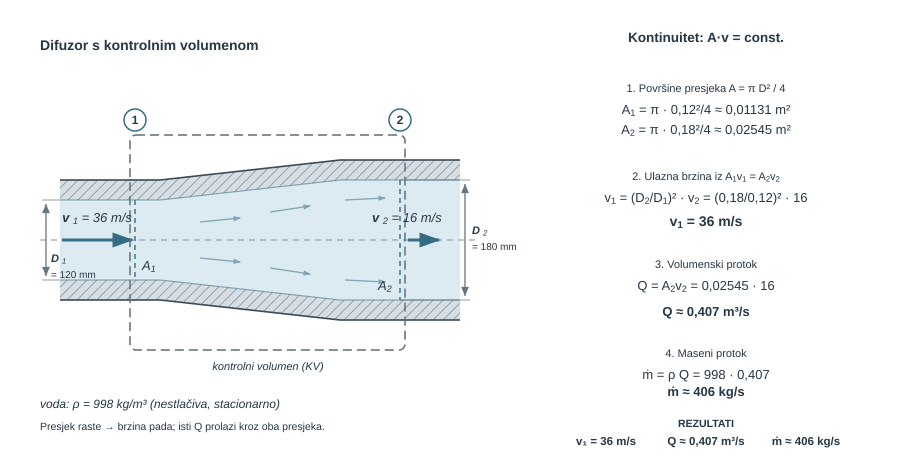
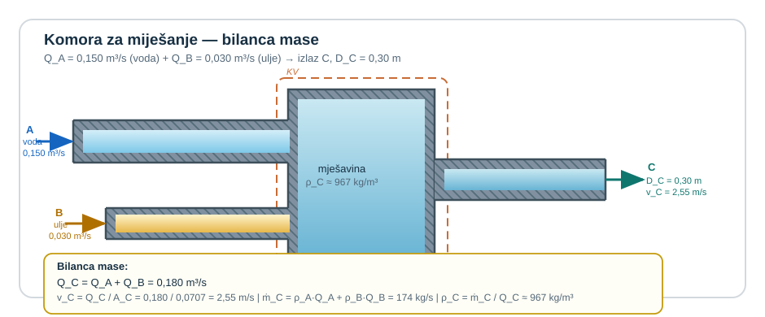
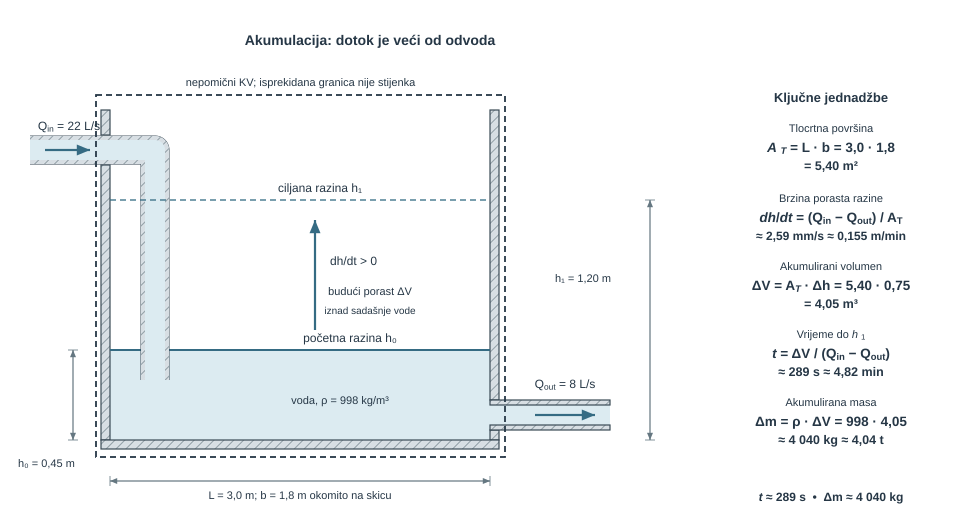
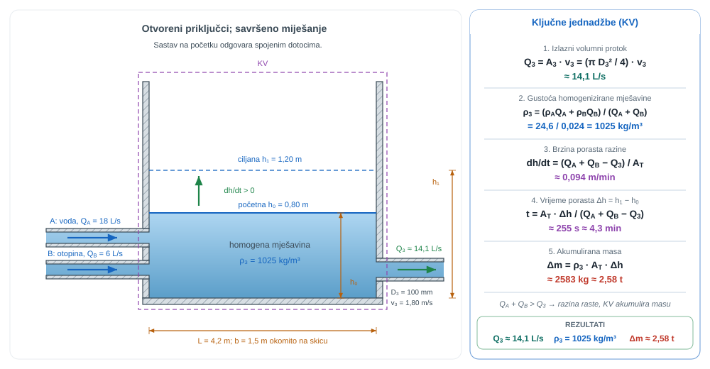
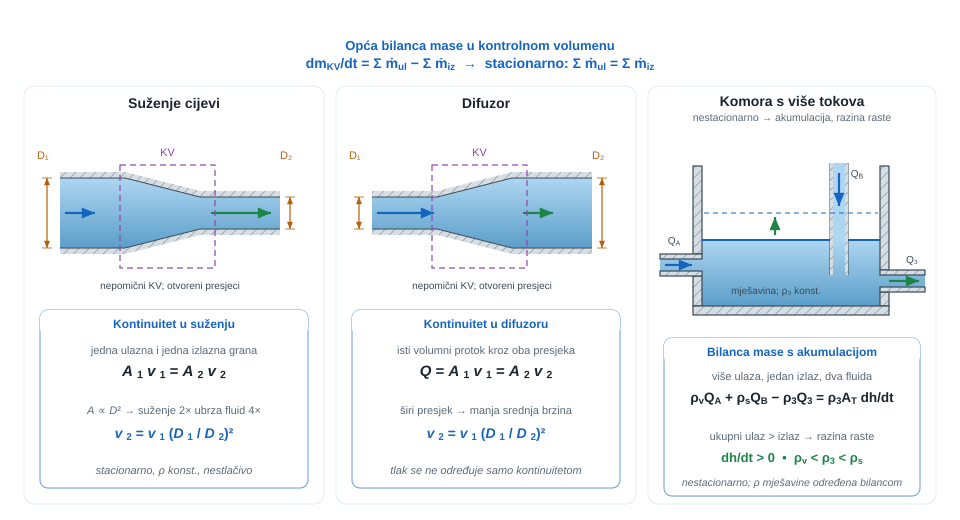
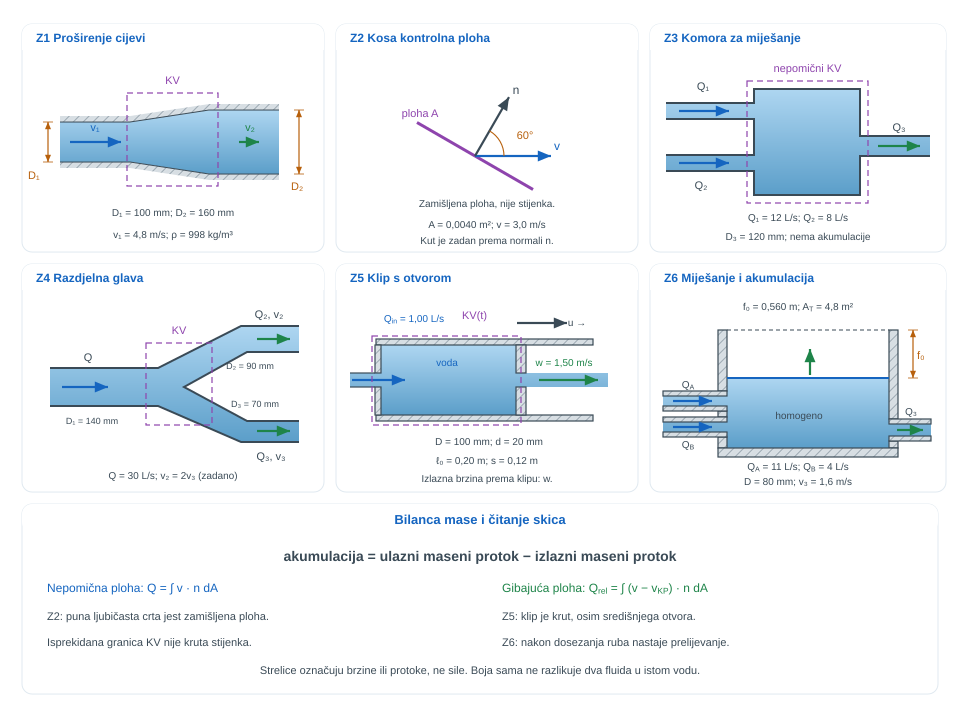

```{python}
#| label: fig-uvod-u08
#| fig-cap: "Pregled poglavlja: Kontrolni volumen i kontinuitet"
#| fig-align: center
#| out-width: 95%

import matplotlib.pyplot as plt
import matplotlib.patches as mpatches
import matplotlib.gridspec as gridspec
import numpy as np

FLUID = '#AED6F1'; SOLID = '#BDC3C7'; FORCE = '#E74C3C'
VEL   = '#27AE60'; DARK  = '#1A252F'; SUB   = '#566573'

fig = plt.figure(figsize=(12, 5))
gs  = gridspec.GridSpec(2, 2, figure=fig, hspace=0.45, wspace=0.35)
ax_fiz  = fig.add_subplot(gs[:, 0])
ax_mat  = fig.add_subplot(gs[0, 1])
ax_prak = fig.add_subplot(gs[1, 1])

for ax, naslov, boja in zip(
    [ax_fiz, ax_mat, ax_prak],
    ['Fizikalni sustav', 'Ključna jednadžba', 'Primjena u praksi'],
    ['#EAF4FB', '#EAF9F1', '#FDF2E9']
):
    ax.set_facecolor(boja)
    ax.set_title(naslov, fontsize=10, fontweight='bold', pad=6)
    ax.set_xticks([]); ax.set_yticks([])
    for sp in ax.spines.values():
        sp.set_edgecolor('#BDC3C7'); sp.set_linewidth(1.2)

# --- ZONA 1: T-komad s oznacenim protocima ---
ax = ax_fiz
ax.set_xlim(0, 10); ax.set_ylim(0, 8)

# Ulazna cijev (lijevo -> centar)
ax.fill([0.3, 4.2, 4.2, 0.3], [3.3, 3.3, 4.7, 4.7], fc=FLUID, ec='#555', lw=1.5)
# Ogranakgore (centar -> gore desno)
ax.fill([4.2, 4.2, 5.8, 5.8], [4.7, 6.8, 6.8, 4.7], fc=FLUID, ec='#555', lw=1.5)
# Ogranak dole (centar -> dole desno)
ax.fill([4.2, 4.2, 5.8, 5.8], [1.2, 3.3, 3.3, 1.2], fc=FLUID, ec='#555', lw=1.5)

# Strelice toka
# Ulazna
ax.annotate('', xy=(3.5, 4.0), xytext=(1.2, 4.0),
    arrowprops=dict(arrowstyle='->', color=VEL, lw=2.5))
ax.text(1.2, 4.5, r'$Q_1, v_1, A_1$', fontsize=8.5, ha='center', color=DARK)
# Ogranak gore
ax.annotate('', xy=(5.0, 6.2), xytext=(5.0, 5.1),
    arrowprops=dict(arrowstyle='->', color=VEL, lw=2.0))
ax.text(5.5, 5.8, r'$Q_2, v_2$', fontsize=8.5, ha='left', color=DARK)
# Ogranak dole
ax.annotate('', xy=(5.0, 1.8), xytext=(5.0, 2.9),
    arrowprops=dict(arrowstyle='->', color=VEL, lw=2.0))
ax.text(5.5, 2.2, r'$Q_3, v_3$', fontsize=8.5, ha='left', color=DARK)

# KV granica
from matplotlib.patches import FancyBboxPatch
ax.add_patch(FancyBboxPatch((3.8, 2.8), 1.8, 2.4,
    boxstyle='round,pad=0.1', fc='none', ec='#E74C3C', lw=2.0, ls='--'))
ax.text(4.7, 7.5, 'Kontrolni volumen', fontsize=8, ha='center',
    color='#E74C3C', style='italic')

# --- ZONA 2: jednadžbe ---
ax = ax_mat
ax.text(0.5, 0.83, r'$Q = A\,v$',
    transform=ax.transAxes, ha='center', va='center', fontsize=15, color=DARK)
ax.text(0.5, 0.55, r'$A_1 v_1 = A_2 v_2 + A_3 v_3$',
    transform=ax.transAxes, ha='center', va='center', fontsize=11, color=DARK)
ax.text(0.5, 0.25,
    r'$\frac{dV_{CV}}{dt} = \sum Q_{ul} - \sum Q_{iz}$',
    transform=ax.transAxes, ha='center', va='center', fontsize=11, color=DARK)

# --- ZONA 3: Retencijski bazen ---
ax = ax_prak
ax.set_xlim(0, 10); ax.set_ylim(0, 6)

# Bazen
ax.add_patch(plt.Rectangle((1.0, 0.8), 7.0, 4.0, fc='none', ec='#555', lw=2.0))
# Voda u bazenu
ax.add_patch(plt.Rectangle((1.1, 0.9), 6.8, 2.3, fc=FLUID, ec='none', alpha=0.7))
# Dotok lijevo
ax.fill([0.0, 1.0, 1.0, 0.0], [2.5, 2.5, 3.3, 3.3], fc=FLUID, ec='#555', lw=1.5)
ax.annotate('', xy=(0.8, 2.9), xytext=(0.0, 2.9),
    arrowprops=dict(arrowstyle='->', color=VEL, lw=2.0))
ax.text(0.0, 3.5, r'$Q_1+Q_2$', fontsize=8, color=DARK)
# Ispust desno
ax.fill([8.0, 9.5, 9.5, 8.0], [1.5, 1.5, 2.1, 2.1], fc=FLUID, ec='#555', lw=1.5)
ax.annotate('', xy=(9.5, 1.8), xytext=(8.2, 1.8),
    arrowprops=dict(arrowstyle='->', color=FORCE, lw=2.0))
ax.text(9.0, 1.3, r'$Q_{iz}$', fontsize=8, color=FORCE)
# dh/dt
ax.annotate('', xy=(4.5, 3.3), xytext=(4.5, 3.9),
    arrowprops=dict(arrowstyle='->', color='#8E44AD', lw=1.8))
ax.text(4.7, 3.7, r'$dh/dt$', fontsize=8.5, va='center', color='#8E44AD')
ax.text(5.0, 0.2, 'Retencijski bazen  (Građevinarstvo)',
    fontsize=7.5, ha='center', color=SUB)

fig.suptitle('U08 – Kontrolni volumen i kontinuitet',
             fontsize=13, fontweight='bold', y=1.01)
plt.show()
```

## Kontrolni volumen kao prvi veliki dinamični alat

<span class="mf1-ch-ref"><span class="mf1-ch-code">U08</span><span class="mf1-ch-title">Kontrolni volumen i kontinuitet</span></span> uvodi promjenu pogleda: umjesto praćenja pojedine čestice, promatra se odabrani dio prostora kroz koji fluid prolazi. Kontinuitet zato nije samo poseban zapis $A_1 v_1 = A_2 v_2$, nego jedan rubni slučaj mnogo šire bilance mase.

::: {.mf1-application}
<p class="mf1-box-label">Inženjerski kontekst</p>

Kontrolni volumen je radni alat za sve sustave u kojima je važnije što ulazi, izlazi i ostaje u prostoru nego pratiti putanju svake pojedine čestice fluida: mješalice, ventilacijske komore, rashladne razdjelnike, izjednačne spremnike i građevinske retencijske komore. U strojarstvu i procesnoj tehnici upravo taj pogled zatvara masu kroz T-račve, difuzore, usisne komore i spremnike tijekom punjenja ili pražnjenja.
:::

## Fizikalni uvod i matematički izvod

Kad fluid struji, više nije praktično pratiti putanju iste čestice kroz vrijeme. Umjesto toga uvodi se kontrolni volumen: odabrani dio prostora kroz koji fluid može ulaziti, izlaziti i po potrebi se akumulirati.

Tu je korisno odmah razlikovati dva pogleda. Sustav ili kontrolna masa znači da se prati ista količina tvari i ne dopušta prijelaz mase preko granice. Kontrolni volumen znači da se prati odabrani dio prostora, dok masa smije prelaziti preko njegove granice.

U fluidnim uređajima poput difuzora, komore miješanja ili spremnika s promjenom razine upravo je drugi pogled prirodan, jer su ulazi, izlazi i akumulacija važniji od identiteta pojedine čestice. Formalni most između ta dva pogleda daje Reynoldsov teorem prijenosa, a kontinuitet u ovom poglavlju može se čitati kao njegova masena bilanca.

Najopćenitiji zapis je

$$\sum \dot{m}_{ulaz} - \sum \dot{m}_{izlaz} = \frac{dm_{CV}}{dt}$$

::: {.callout-note}
## 📐 Fizikalno značenje
Ova bilanca mase kaže: što god ne izlazi iz kontrolnog volumena, ostaje unutar njega (akumulira se). Ako ulazi više nego što izlazi, razina raste ili se masa skuplja. Ako izlazi više nego što ulazi, volumen se prazni. Kada nema akumulacije (stacionarno strujanje), masa koja uđe mora i izaći — ništa se ne može ni stvoriti ni izgubiti.
:::

Ako je strujanje stacionarno i nema akumulacije, to prelazi u

$$\sum \dot{m}_{ulaz} = \sum \dot{m}_{izlaz}$$

Tu je važno ne pomiješati dvije različite veličine. Maseni protok $\dot m$ mjeri koliko mase prolazi u sekundi i uvijek je primarni zapis kontinuiteta, dok volumenski protok $Q$ mjeri koliko volumena prolazi u sekundi. Povezuje ih relacija

$$
\dot m = \rho Q,
\qquad
Q = Av.
$$

Tek kad je riječ o istom nestlačivom fluidu kroz sve presjeke i kad je gustoća praktično ista, masena bilanca može se podijeliti s $\rho$ i prijeći u volumensku bilancu. Zato je u običnoj cijevi prirodno pisati $Q_1 = Q_2$, ali u miješanju dviju struja različitih gustoća najprije treba zatvoriti masenu bilancu, pa tek onda iz nje čitati gustoću ili volumenski protok mješavine.

Tek za jednu ulaznu i jednu izlaznu granu nestlačivoga fluida dobiva se poznati oblik

$$A_1 v_1 = A_2 v_2$$

::: {.callout-note}
## 📐 Fizikalno značenje
Jednadžba $A_1 v_1 = A_2 v_2$ kaže da nestlačivi fluid ubrzava kad se cijev sužava, i usporava kad se širi. Fizikalna slika: svaka čestica fluida mora proći kroz uži presjek brže jer „masa se ne gubi" — u sekundi mora proći isti volumen. Isti princip objašnjava zašto rijeka teče brže na plitkim mjestima nego na dubokim.
:::

::: {.callout-note collapse="true" icon="false"}
## 🖥️ Numerički trag

Kontinuitet u diferencijalnom obliku $\nabla\cdot\vec{v} = 0$ je **najteža ograničenja u nestlačivom CFD-u**: rješavač brzine i tlaka mora ga zadovoljiti u *svakoj* ćeliji *u svakom koraku*. Zato postoje algoritmi tipa **SIMPLE**, **PISO** i **PIMPLE** koji iterativno usklađuju polje tlaka tako da popravljeno polje brzine više nema lokalnih divergencija. To je razlog zašto solver `simpleFoam` u svakoj iteraciji najprije računa brzinu, pa rješava Poissonovu jednadžbu za tlak, pa korigira brzinu — sve dok $\nabla\cdot\vec{v}$ ne padne ispod tolerancije.
:::

::: {.mf1-interaktivno}
<p class="mf1-box-label">📈 Interaktivni prikaz — Kontinuitet u suženju cijevi</p>

Interaktivni prikaz omogućuje mijenjanje ulaznog i izlaznog promjera te volumenskog protoka uz neposredno praćenje brzine fluida duž cijevi. Profil brzine jasno pokazuje koliko se brzina pojačava u suženju u odnosu na ulazni presjek.

<div class="mf1-interaktivno-akcija">
<a class="mf1-interaktivno-veza" href="https://colab.research.google.com/github/martibasic/MF1_udzbenik/blob/main/notebooks/u08_kontinuitet_suzenje.ipynb" target="_blank" rel="noopener">Otvori interaktivni prikaz</a>

</div>

<div class="mf1-interaktivno-pitanja">
**Pitanja za samostalno istraživanje:** (a) Koliko je puta veća izlazna brzina kada je $D_2 = D_1/2$, a koliko kada je $D_2 = D_1/4$? (b) Vrijedi li jednadžba kontinuiteta i pri $D_1 = D_2$? (c) Zašto u stvarnoj cijevi profil brzina nije jednolik nego približno paraboličan ili polako-jednolik?
</div>
:::

::: {.mf1-izvod}
<p class="mf1-box-label">Matematički izvod</p>

Opći kontinuitet nije nova formula nego integralni zapis očuvanja mase na kontrolnom volumenu $KV$ omeđenom kontrolnom plohom $KP$ s vanjskom normalom $\vec n$:

$$
\frac{d}{dt}\int_{KV} \rho\,dV + \int_{KP} \rho (\vec{v}\cdot\vec{n})\,dA = 0
$$

Prvi član predstavlja brzinu promjene mase unutar odabranoga prostora, odnosno akumulaciju ili pražnjenje kontrolnog volumena. Drugi član predstavlja neto tok mase kroz granicu: svaki dio plohe za koji je $\vec v\cdot\vec n > 0$ nosi izlaz iz volumena, a svaki dio za koji je $\vec v\cdot\vec n < 0$ nosi ulaz u volumen.

Ako se kontrolna ploha rastavi na konačan broj presjeka na kojima se profil može čitati jednodimenzijski, površinski integral prelazi u zbroj članova

$$
\sum_k \rho_k A_k v_{n,k}.
$$

Tada se opći zakon može zapisati kao

$$
\frac{dm_{CV}}{dt} + \sum \dot m_{izlaz} - \sum \dot m_{ulaz} = 0,
$$

odnosno u poznatijem obliku

$$
\sum \dot m_{ulaz} - \sum \dot m_{izlaz} = \frac{dm_{CV}}{dt}.
$$

Kad je tok stacionaran, član akumulacije nestaje pa slijedi

$$
\sum \dot m_{ulaz} = \sum \dot m_{izlaz}.
$$

Tek ako je fluid pritom nestlačiv i ako postoji samo jedan ulazni i jedan izlazni presjek, maseni protoci prelaze u volumenske, pa nastaje krajnji rubni slučaj

$$
\rho A_1v_1 = \rho A_2v_2
\qquad \Longrightarrow \qquad
A_1v_1 = A_2v_2.
$$

Time se vidi puno fizikalno značenje kontinuiteta: jednadžba ne tvrdi da se dvije površine moraju "mehanički" poništiti, nego da se ukupna masa ne može izgubiti ni stvoriti između ulaza, izlaza i eventualne akumulacije unutar kontrolnog volumena.
:::

Primjeri niže samo redom variraju tri osnovne situacije: suženje ili difuzor, miješanje više struja i spremnik s promjenom razine. Zato se prije bilo koje jednadžbe najprije bira kontrolni volumen, pa se provjerava piše li se masena ili volumenska bilanca, radi li se o stacionarnom ili nestacionarnom problemu te postoji li jedna grana ili više ulaza i izlaza.

Ako taj redoslijed nije zatvoren, gotovo je sigurno da će zadatak biti krivo pojednostavljen.

## Riješeni primjeri

::: {.mf1-we}
<p class="mf1-box-label">Riješeni primjer - Voda struji kroz difuzor <span class="mf1-level">T2</span></p>

**Zadano**

Voda struji stacionarno kroz difuzor. Ulazni promjer iznosi $D_1 = 120\ \text{mm}$, a izlazni $D_2 = 180\ \text{mm}$. Na izlazu je srednja brzina $v_2 = 16\ \text{m/s}$, a gustoće vode je $\rho = 998\ \text{kg/m}^3$.

**Traženo**

1. srednju brzinu na ulazu $v_1$.
2. volumenski protok $Q$.
3. maseni protok $\dot{m}$.



**Pretpostavke i model**

Promatra se jedan kontrolni volumen s jednom ulaznom i jednom izlaznom granom. Kako je tok stacionaran, a voda se može uzeti nestlačivom, kroz oba presjeka mora prolaziti isti volumenski protok.

**Rješenje**

Za stacionarni tok nestlačivog fluida vrijedi

$$
Q_1 = Q_2
$$

odnosno

$$
A_1 v_1 = A_2 v_2
$$

Površine presjeka su

$$
A_1 = \frac{\pi D_1^2}{4} = \frac{\pi \cdot 0{,}12^2}{4} = 0{,}01131\ \text{m}^2
$$

$$
A_2 = \frac{\pi D_2^2}{4} = \frac{\pi \cdot 0{,}18^2}{4} = 0{,}02545\ \text{m}^2
$$

Iz kontinuiteta slijedi ulazna brzina

$$
v_1 = \frac{A_2}{A_1} v_2 = \left(\frac{0{,}18}{0{,}12}\right)^2 \cdot 16 = 36\ \text{m/s}
$$

Volumenski protok može se sada izračunati iz bilo kojeg presjeka. Najjednostavnije je s izlaznog:

$$
Q = A_2 v_2 = 0{,}02545 \cdot 16 = 0{,}407\ \text{m}^3/\text{s}
$$

Maseni protok zato iznosi

$$
\dot{m} = \rho Q = 998 \cdot 0{,}407 = 406\ \text{kg/s}
$$

odnosno približno

$$
\dot{m} \approx 4{,}06 \cdot 10^2\ \text{kg/s}
$$

**Provjera i komentar**

U užem ulaznom presjeku brzina mora biti veća nego na izlazu, jer isti protok prolazi kroz manju površinu. U ovom difuzoru to daje ulaznu brzinu od $36\ \text{m/s}$, volumenski protok od oko $0{,}407\ \text{m}^3/\text{s}$ i maseni protok od oko $406\ \text{kg/s}$.

1. Kako je $D_2 > D_1$, mora biti $A_2 > A_1$ i zato $v_2 < v_1$.
2. Isti volumenski protok mora se dobiti i iz izraza $A_1 v_1$ i iz izraza $A_2 v_2$.
3. Ako brzina ispadne veća u širem presjeku, onda je odnos površina obrnut.
:::

::: {.mf1-we}
<p class="mf1-box-label">Riješeni primjer - Komora za miješanje s dva ulaza i jednim izlazom <span class="mf1-level">T2</span></p>

**Zadano**

U komoru za miješanje ulazi voda kroz presjek `A` volumenskim protokom

$$
Q_A = 150\ \text{dm}^3/\text{s} = 0{,}150\ \text{m}^3/\text{s}
$$

a kroz presjek `B` ulazi ulje relativne gustoće $s_B = 0{,}80$ volumenskim protokom

$$
Q_B = 30\ \text{dm}^3/\text{s} = 0{,}030\ \text{m}^3/\text{s}
$$

Smatra se da su tekućine nestlačive i da je mješavina na izlazu homogena. Promjer izlaznog presjeka `C` iznosi

$$
D_C = 0{,}30\ \text{m}
$$

Uzmi za vodu $\rho_A = 1000\ \text{kg/m}^3$.

**Traženo**

1. izlaznu brzinu $v_C$.
2. gustoću mješavine na izlazu $\rho_C$.



**Pretpostavke i model**

Ovdje više ne vrijedi pojednostavnjeni zapis jedne cijevi. Najprije treba zatvoriti masenu bilancu za oba ulaza i jedan izlaz, a tek zatim povezati izlazni volumenski protok s brzinom kroz presjek `C`.

**Rješenje**

Najprije iz relativne gustoće dobivamo gustoću ulja:

$$
\rho_B = s_B \rho_A = 0{,}80 \cdot 1000 = 800\ \text{kg/m}^3
$$

Kako su tekuće faze nestlačive, izlazni volumenski protok je zbroj ulaznih volumenskih protoka:

$$
Q_C = Q_A + Q_B = 0{,}150 + 0{,}030 = 0{,}180\ \text{m}^3/\text{s}
$$

Izlazna površina iznosi

$$
A_C = \frac{\pi D_C^2}{4} = \frac{\pi \cdot 0{,}30^2}{4} = 0{,}0707\ \text{m}^2
$$

pa je srednja izlazna brzina

$$
v_C = \frac{Q_C}{A_C} = \frac{0{,}180}{0{,}0707} = 2{,}55\ \text{m/s}
$$

Sada zatvaramo masenu bilancu:

$$
\dot{m}_C = \dot{m}_A + \dot{m}_B = \rho_A Q_A + \rho_B Q_B
$$

odnosno

$$
\dot{m}_C = 1000 \cdot 0{,}150 + 800 \cdot 0{,}030 = 150 + 24 = 174\ \text{kg/s}
$$

Gustoća mješavine na izlazu zato je

$$
\rho_C = \frac{\dot{m}_C}{Q_C} = \frac{174}{0{,}180} = 966{,}7\ \text{kg/m}^3
$$

odnosno približno

$$
\rho_C \approx 967\ \text{kg/m}^3
$$

**Provjera i komentar**

U izlaznom presjeku komora daje brzinu od oko $2{,}55\ \text{m/s}$ i homogenu mješavinu gustoće oko $967\ \text{kg/m}^3$. To je tipičan primjer gdje kontinuitet treba čitati kroz istodobnu bilancu volumena i mase, a ne samo kroz zapis $Av$ za jednu cijev.

1. Izlazna gustoća mora biti između gustoće vode i gustoće ulja.
2. Ukupni volumenski protok na izlazu mora biti veći od svakog pojedinog ulaza.
3. Ako se u masenoj bilanci koristi samo zbroj volumenskih protoka bez gustoća, izlazna gustoća ne može biti ispravno dobivena.
:::

Ta scena zatvara stacionarni višegranski slučaj. Treća jezgrena scena <span class="mf1-ch-ref"><span class="mf1-ch-code">U08</span><span class="mf1-ch-title">Kontrolni volumen i kontinuitet</span></span> ide jedan korak dalje: protoci više nisu uravnoteženi, pa razlika ulaza i izlaza ne nestaje nego se pretvara u porast volumena unutar kontrolnog volumena.

::: {.mf1-we}
<p class="mf1-box-label">Riješeni primjer - Izjednačni spremnik tijekom ispiranja filtra <span class="mf1-level">T2</span></p>

**Zadano**

Pravokutni izjednačni spremnik duljine $L = 3{,}0\ \text{m}$ i širine $b = 1{,}8\ \text{m}$ prima vodu tijekom ciklusa ispiranja filtra. U spremnik ulazi voda stalnim volumenskim protokom

$$
Q_{in} = 22\ \text{L/s} = 0{,}022\ \text{m}^3/\text{s}
$$

dok kroz servisni odvod stalno izlazi

$$
Q_{out} = 8\ \text{L/s} = 0{,}008\ \text{m}^3/\text{s}
$$

Početna dubina vode je $h_0 = 0{,}45\ \text{m}$, a gornja dopuštena radna razina $h_1 = 1{,}20\ \text{m}$. Uzmi za vodu $
\rho = 998\ \text{kg/m}^3$.

**Traženo**

1. brzinu porasta razine vode $dh/dt$.
2. vrijeme potrebno da razina poraste od $h_0$ do $h_1$.
3. kolika se masa vode akumulira u spremniku do tog trenutka.



**Pretpostavke i model**

Promatra se kontrolni volumen koji obuhvaća cijeli spremnik. Tekućina je ista na ulazu i izlazu, gustoća se uzima konstantnom, a tlocrtna površina spremnika ne mijenja se s visinom. Zato se član akumulacije može zapisati preko promjene volumena, odnosno preko promjene razine.

**Rješenje**

Tlocrtna površina spremnika iznosi

$$
A_T = Lb = 3{,}0 \cdot 1{,}8 = 5{,}40\ \text{m}^2
$$

Za nestacionarni kontrolni volumen vrijedi

$$
Q_{in} - Q_{out} = \frac{dV}{dt}
$$

Kako je $V = A_T h$, slijedi

$$
Q_{in} - Q_{out} = A_T \frac{dh}{dt}
$$

odnosno

$$
\frac{dh}{dt} = \frac{Q_{in} - Q_{out}}{A_T} = \frac{0{,}022 - 0{,}008}{5{,}40} = 2{,}59 \cdot 10^{-3}\ \text{m/s}
$$

To je jednako

$$
\frac{dh}{dt} \approx 0{,}155\ \text{m/min}
$$

Porast razine koji nas zanima iznosi

$$
\Delta h = h_1 - h_0 = 1{,}20 - 0{,}45 = 0{,}75\ \text{m}
$$

pa je pripadni akumulirani volumen

$$
\Delta V = A_T \Delta h = 5{,}40 \cdot 0{,}75 = 4{,}05\ \text{m}^3
$$

Vrijeme potrebno za takvu akumulaciju je

$$
t = \frac{\Delta V}{Q_{in} - Q_{out}} = \frac{4{,}05}{0{,}014} = 289\ \text{s}
$$

odnosno približno

$$
t \approx 4{,}82\ \text{min}
$$

Masa vode koja se do tada akumulira iznosi

$$
\Delta m = \rho \Delta V = 998 \cdot 4{,}05 = 4{,}04 \cdot 10^3\ \text{kg}
$$

odnosno

$$
\Delta m \approx 4040\ \text{kg}
$$

**Provjera i komentar**

Razina vode u spremniku raste brzinom od oko $0{,}155\ \text{m/min}$, do gornje radne razine dolazi za oko $4{,}8$ minuta, a u tom se vremenu u spremniku akumulira oko $4{,}04\ \text{t}$ vode. To je tipičan <span class="mf1-ch-ref"><span class="mf1-ch-code">U08</span><span class="mf1-ch-title">Kontrolni volumen i kontinuitet</span></span> primjer u kojem razlika protoka ne nestaje u jednadžbi, nego postaje stvarni porast mase unutar kontrolnog volumena.

1. Kako je $Q_{in} > Q_{out}$, razina mora rasti, a ne padati.
2. Neto protok od $14\ \text{L/s}$ na spremniku tlocrtne površine $5{,}4\ \text{m}^2$ mora dati spor, ali mjerljiv rast razine reda nekoliko desetina metra u minuti.
3. Kad bi bilo $Q_{in} = Q_{out}$, član akumulacije bi nestao i problem bi se vratio na stacionarni slučaj.
:::

::: {.mf1-ch}
<p class="mf1-box-label">Cjeloviti zadatak - miješajući izjednačni spremnik s porastom razine <span class="mf1-level">T3</span></p>

**Zadano**

Pravokutni miješajući izjednačni spremnik tlocrtnih dimenzija

$$
L = 4{,}2\ \text{m}, \qquad b = 1{,}5\ \text{m}
$$

prima dvije stalne ulazne struje:

1. vodu gustoće:

$$
\rho_A = 1000\ \text{kg/m}^3
$$

volumenskim protokom

$$
Q_A = 18\ \text{L/s} = 0{,}018\ \text{m}^3/\text{s}
$$

2. slanu otopinu relativne gustoće:

$$
s_B = 1{,}10
$$

volumenskim protokom

$$
Q_B = 6\ \text{L/s} = 0{,}006\ \text{m}^3/\text{s}
$$

Iz spremnika istječe homogena mješavina kroz izlazni vod promjera

$$
D_3 = 100\ \text{mm}
$$

pri čemu je trenutna srednja izlazna brzina

$$
v_3 = 1{,}80\ \text{m/s}
$$

Pretpostavi da je spremnik dobro izmiješan i da je njegova trenutna gustoća jednaka gustoći mješavine dviju ulaznih struja. Početna razina u promatranom intervalu je $h_0 = 0{,}80\ \text{m}$, a razmatra se porast do $h_1 = 1{,}20\ \text{m}$.

**Traženo**

1. izlazni volumenski protok $Q_3$.
2. gustoću homogenizirane mješavine u spremniku i izlaznom vodu $\rho_3$.
3. brzinu porasta razine $dh/dt$.
4. vrijeme potrebno da razina poraste od $h_0$ do $h_1$.
5. masu tekućine koja se akumulira u spremniku tijekom tog porasta.



**Pretpostavke i model**

Ovdje jedan kontrolni volumen obuhvaća cijeli spremnik. Izlazni tok zatvara se preko relacije $Q_3 = A_3 v_3$, gustoća homogenizirane mješavine dobiva se iz masene bilance ulaza, a porast razine dolazi iz volumenske akumulacije. Ključ nije formula nego redoslijed: izlazni tok, zatim gustoća mješavine, pa tek onda član akumulacije.

**Rješenje**

Najprije od relativne gustoće dobivamo gustoću slane otopine:

$$
\rho_B = s_B \rho_A = 1{,}10 \cdot 1000 = 1100\ \text{kg/m}^3
$$

Površina izlaznog presjeka iznosi

$$
A_3 = \frac{\pi D_3^2}{4} = \frac{\pi \cdot 0{,}10^2}{4} = 7{,}854 \cdot 10^{-3}\ \text{m}^2
$$

zato je izlazni volumenski protok

$$
Q_3 = A_3 v_3 = 7{,}854 \cdot 10^{-3} \cdot 1{,}80 = 1{,}414 \cdot 10^{-2}\ \text{m}^3/\text{s}
$$

odnosno

$$
Q_3 \approx 14{,}1\ \text{L/s}
$$

Za homogeniziranu mješavinu najprije zatvaramo masenu bilancu dviju ulaznih struja. Ukupni ulazni maseni protok je

$$
\dot{m}_{in} = \rho_A Q_A + \rho_B Q_B = 1000 \cdot 0{,}018 + 1100 \cdot 0{,}006 = 18 + 6{,}6 = 24{,}6\ \text{kg/s}
$$

Ukupni ulazni volumenski protok iznosi

$$
Q_{in} = Q_A + Q_B = 0{,}018 + 0{,}006 = 0{,}024\ \text{m}^3/\text{s}
$$

pa je gustoća homogenizirane mješavine

$$
\rho_3 = \frac{\dot{m}_{in}}{Q_{in}} = \frac{24{,}6}{0{,}024} = 1025\ \text{kg/m}^3
$$

Tlocrtna površina spremnika iznosi

$$
A_T = Lb = 4{,}2 \cdot 1{,}5 = 6{,}30\ \text{m}^2
$$

Za volumensku akumulaciju vrijedi

$$
Q_A + Q_B - Q_3 = A_T \frac{dh}{dt}
$$

odnosno

$$
\frac{dh}{dt} = \frac{0{,}024 - 0{,}01414}{6{,}30} = 1{,}57 \cdot 10^{-3}\ \text{m/s}
$$

što je jednako

$$
\frac{dh}{dt} \approx 0{,}094\ \text{m/min}
$$

Porast razine iznosi

$$
\Delta h = h_1 - h_0 = 1{,}20 - 0{,}80 = 0{,}40\ \text{m}
$$

pa je akumulirani volumen

$$
\Delta V = A_T \Delta h = 6{,}30 \cdot 0{,}40 = 2{,}52\ \text{m}^3
$$

Vrijeme potrebno za takav porast razine iznosi

$$
t = \frac{\Delta V}{Q_A + Q_B - Q_3} = \frac{2{,}52}{0{,}024 - 0{,}01414} = 255\ \text{s}
$$

odnosno približno

$$
t \approx 4{,}26\ \text{min}
$$

Masa koja se u tom intervalu akumulira u spremniku iznosi

$$
\Delta m = \rho_3 \Delta V = 1025 \cdot 2{,}52 = 2583\ \text{kg}
$$

odnosno

$$
\Delta m \approx 2{,}58\ \text{t}
$$

**Provjera i komentar**

Ovaj `CH` zatvara puni <span class="mf1-ch-ref"><span class="mf1-ch-code">U08</span><span class="mf1-ch-title">Kontrolni volumen i kontinuitet</span></span> slijed u jednom kontrolnom volumenu: izlazni vod daje $Q_3 \approx 14{,}1\ \text{L/s}$, mješavina u spremniku ima gustoću oko $1025\ \text{kg/m}^3$, razina raste brzinom oko $0{,}094\ \text{m/min}$, a do porasta od $0{,}40\ \text{m}$ treba oko $4{,}3$ minute. U tom se vremenu akumulira oko $2{,}58$ t homogenizirane tekućine.

1. Gustoća mješavine mora biti između gustoće vode i gustoće slane otopine.
2. Kako je ukupni ulazni protok veći od izlaznog, razina mora rasti, a ne padati.
3. Ako se u ovom zadatku odmah napiše samo jedna formula kontinuiteta bez razdvajanja ulazne mase, izlaznog toka i akumulacije, gotovo sigurno će se izgubiti barem jedna fizikalna veza.
:::

Kao sažetak poglavlja korisno je držati zajedno tri reprezentativne scene: suženje, difuzor i kontrolni volumen s više tokova. Uz njih prirodno stoji i standardna shema bilance mase s označenim ulazima, izlazima i akumulacijom.



::: {.mf1-we}
<p class="mf1-box-label">Riješeni primjer – Kontinuitet kroz razvodni T-komad hidrauličnog sustava &nbsp;<span class="mf1-level">T2</span></p>

🔩 **Primjer za strojare**

**Kontekst:** U hidrauličnom sustavu strojnice T-komad dijeli ulazni tok ulja iz crpke u dva ogranka: jedan za radni cilindar, drugi za hladnjak ulja. Projektant provjerava brzine u ograncima.

**Zadano**

- Ulazna cijev: $D_1 = 32\ \text{mm}$, $v_1 = 4{,}5\ \text{m/s}$
- Ogranak 1 (radni cilindar): $D_2 = 20\ \text{mm}$, volumni udio $60\%$ ulaznog toka
- Ogranak 2 (hladnjak): $D_3 = ?$ mm, dobiva preostalih $40\%$
- Gustoća ulja: $\rho = 870\ \text{kg/m}^3$

**Traženo**

1. Volumni protok $Q_1$ na ulazu.
2. Protoci $Q_2$ i $Q_3$ u ograncima.
3. Brzina $v_2$ u ogranku 1 i potrebni promjer $D_3$ ako je $v_3 = 3{,}0\ \text{m/s}$.

```{python}
#| label: fig-u08-t-komad-hidraulika
#| fig-cap: "Razvodni T-komad: D1=32 mm, D2=20 mm, v1=4,5 m/s, 60%/40% raspodjela"
#| fig-align: center
#| out-width: 55%

import matplotlib.pyplot as plt
import numpy as np

fig, ax = plt.subplots(figsize=(5.5, 4.5))
ax.set_xlim(0, 10); ax.set_ylim(0, 8)
ax.axis('off')

# Ulazna cijev (D1=32mm, r=1.6 plot)
# Ogranak 1 (D2=20mm, gore, r=1.0)
# Ogranak 2 (D3~25mm, dolje, r=1.25)
r1 = 1.6; r2 = 1.0; r3 = 1.25
cx = 4.5; cy = 4.0

# Ulazna cijev (lijevo)
ax.fill([0.3, cx, cx, 0.3],
    [cy - r1, cy - r1, cy + r1, cy + r1],
    fc='#AED6F1', ec='#555', lw=1.8)
# Ogranak gore
ax.fill([cx - r2, cx + r2, cx + r2, cx - r2],
    [cy, cy, 8.0, 8.0],
    fc='#AED6F1', ec='#555', lw=1.8)
# Ogranak dole
ax.fill([cx - r3, cx + r3, cx + r3, cx - r3],
    [cy, cy, 0.0, 0.0],
    fc='#AED6F1', ec='#555', lw=1.8)

# Strelice i oznake
# Ulaz
ax.annotate('', xy=(cx - 0.5, cy), xytext=(1.0, cy),
    arrowprops=dict(arrowstyle='->', color='#27AE60', lw=2.5))
ax.text(1.5, cy + 1.8, r'$D_1=32\ mm$' + '\n' + r'$v_1=4{,}5\ m/s$' + '\n' + r'$Q_1=3{,}62\ L/s$',
    fontsize=8, ha='center', color='#1A252F')

# Ogranak 1 (gore)
ax.annotate('', xy=(cx, 7.5), xytext=(cx, cy + 0.5),
    arrowprops=dict(arrowstyle='->', color='#27AE60', lw=2.0))
ax.text(cx + r2 + 0.3, 6.5,
    r'$D_2=20\ mm$' + '\n' + r'$v_2=6{,}9\ m/s$' + '\n' + r'$60\%$',
    fontsize=8, color='#1A252F')

# Ogranak 2 (dole)
ax.annotate('', xy=(cx, 0.5), xytext=(cx, cy - 0.5),
    arrowprops=dict(arrowstyle='->', color='#27AE60', lw=2.0))
ax.text(cx + r3 + 0.3, 1.3,
    r'$D_3\approx25\ mm$' + '\n' + r'$v_3=3{,}0\ m/s$' + '\n' + r'$40\%$',
    fontsize=8, color='#1A252F')

# Kontinuitet oznaka
ax.text(cx + 0.1, cy + 0.1,
    r'$Q_1=Q_2+Q_3$', fontsize=8, ha='left', va='bottom',
    bbox=dict(fc='white', ec='#BDC3C7', boxstyle='round,pad=0.2'),
    color='#1A252F')

ax.set_title('Razvodni T-komad hidraulicnog sustava (T2)', fontsize=9.5, pad=4)
plt.tight_layout()
plt.show()
```

**Rješenje**

$$
A_1 = \frac{\pi D_1^2}{4} = \frac{\pi \cdot 0{,}032^2}{4} = 8{,}042 \cdot 10^{-4}\ \text{m}^2
$$

$$
Q_1 = A_1 v_1 = 8{,}042 \cdot 10^{-4} \cdot 4{,}5 = 3{,}619 \cdot 10^{-3}\ \text{m}^3/\text{s} = 3{,}62\ \text{L/s}
$$

$$
Q_2 = 0{,}60 \cdot Q_1 = 2{,}17\ \text{L/s}, \quad Q_3 = 0{,}40 \cdot Q_1 = 1{,}45\ \text{L/s}
$$

$$
A_2 = \frac{\pi \cdot 0{,}020^2}{4} = 3{,}142 \cdot 10^{-4}\ \text{m}^2, \quad v_2 = \frac{Q_2}{A_2} = \frac{2{,}17 \cdot 10^{-3}}{3{,}142 \cdot 10^{-4}} = 6{,}9\ \text{m/s}
$$

$$
A_3 = \frac{Q_3}{v_3} = \frac{1{,}45 \cdot 10^{-3}}{3{,}0} = 4{,}83 \cdot 10^{-4}\ \text{m}^2 \Rightarrow D_3 = \sqrt{\frac{4 A_3}{\pi}} = 24{,}8\ \text{mm}
$$

**Provjera i komentar**

Provjera: $Q_2 + Q_3 = 2{,}17 + 1{,}45 = 3{,}62\ \text{L/s} = Q_1$ ✓. Brzina $v_2 = 6{,}9\ \text{m/s}$ je nešto visoka za hidraulični sustav (preporučeno < 6 m/s u radnim cijevima), pa bi konstruktor razmatrao povećanje $D_2$ na npr. 22 mm.

:::

::: {.mf1-we}
<p class="mf1-box-label">Riješeni primjer – Punjenje retencijskog bazena s više dotoka &nbsp;<span class="mf1-level">T2</span></p>

🏗️ **Primjer za građevinare**

**Kontekst:** Retencijski bazen za oborinsku vodu prima dotoke iz dva odvodna kanala i prazni se kroz jedan ispust. Hidrotehničar provjerava koliko brzo raste razina pri pljusku.

**Zadano**

- Bazen: tlocrtna površina $A_b = 120\ \text{m}^2$
- Dotok kanal 1: $Q_{ul,1} = 0{,}35\ \text{m}^3/\text{s}$
- Dotok kanal 2: $Q_{ul,2} = 0{,}20\ \text{m}^3/\text{s}$
- Ispust (gravitacijski): $Q_{iz} = 0{,}18\ \text{m}^3/\text{s}$
- Početna razina: $h_0 = 1{,}20\ \text{m}$

**Traženo**

1. Neto volumenski dotok (akumulacija).
2. Brzina porasta razine $dh/dt$.
3. Koliko vremena treba da razina poraste za $0{,}50\ \text{m}$?

```{python}
#| label: fig-u08-retencijski-bazen
#| fig-cap: "Punjenje retencijskog bazena: A_b=120 m², Q_ul=0,55 m³/s, Q_iz=0,18 m³/s, dh/dt≈18,5 cm/min"
#| fig-align: center
#| out-width: 55%

import matplotlib.pyplot as plt
import numpy as np

fig, ax = plt.subplots(figsize=(6, 4.5))
ax.set_xlim(0, 12); ax.set_ylim(0, 7)
ax.axis('off')

# Stijenke bazena
ax.add_patch(plt.Rectangle((1.0, 0.5), 9.5, 5.5, fc='none', ec='#555', lw=2.2))

# Voda (razina h_0=1.2m, +0.5m za 2.7min)
h0_p = 2.0; dh_p = 0.8
# Poetna razina
ax.add_patch(plt.Rectangle((1.1, 0.6), 9.3, h0_p, fc='#AED6F1', ec='none', alpha=0.6))
# Porast razine (stričanom)
ax.add_patch(plt.Rectangle((1.1, 0.6 + h0_p), 9.3, dh_p,
    fc='#AED6F1', ec='#1565c0', alpha=0.4, lw=1.0, ls='--'))

# Razina h_0
ax.plot([1.0, 10.5], [0.6 + h0_p, 0.6 + h0_p], color='#1565c0', lw=1.5)
ax.text(10.6, 0.6 + h0_p, r'$h_0=1{,}2\ m$', fontsize=8, va='center', color='#1565c0')

# Razina h_0+dh
ax.plot([1.0, 10.5], [0.6 + h0_p + dh_p, 0.6 + h0_p + dh_p],
    color='#1565c0', lw=1.0, ls='--')
ax.text(10.6, 0.6 + h0_p + dh_p, r'$h_0+0{,}5\ m$', fontsize=8, va='center', color='#1565c0')

# dh/dt strelica
ax.annotate('', xy=(5.5, 0.6 + h0_p + dh_p + 0.3),
    xytext=(5.5, 0.6 + h0_p),
    arrowprops=dict(arrowstyle='->', color='#8E44AD', lw=2.0))
ax.text(5.7, 0.6 + h0_p + dh_p/2,
    r'$dh/dt = 18{,}5\ cm/min$', fontsize=8, va='center', color='#8E44AD')

# Dotoci (dvije kanale lijeva strana)
ax.fill([0.0, 1.0, 1.0, 0.0], [2.4, 2.4, 3.1, 3.1], fc='#AED6F1', ec='#555', lw=1.5)
ax.annotate('', xy=(0.8, 2.75), xytext=(0.0, 2.75),
    arrowprops=dict(arrowstyle='->', color='#27AE60', lw=2.0))
ax.text(-0.1, 3.4, r'$Q_1=0{,}35$' + '\n' + r'$Q_2=0{,}20\ m^3/s$',
    fontsize=7.5, ha='left', color='#27AE60')

# Ispust (desna strana)
ax.fill([10.5, 11.5, 11.5, 10.5], [0.8, 0.8, 1.5, 1.5], fc='#AED6F1', ec='#555', lw=1.5)
ax.annotate('', xy=(11.5, 1.15), xytext=(10.7, 1.15),
    arrowprops=dict(arrowstyle='->', color='#E74C3C', lw=2.0))
ax.text(11.6, 1.15, r'$Q_{iz}=0{,}18\ m^3/s$',
    fontsize=7.5, va='center', color='#E74C3C')

# Formula box
ax.text(5.5, 0.0,
    r'$Q_{neto}=0{,}55-0{,}18=0{,}37\ m^3/s$; $t_{\Delta h=0{,}5m}\approx2{,}7\ min$',
    fontsize=8, ha='center', va='bottom', color='#1A252F',
    bbox=dict(fc='white', ec='#BDC3C7', boxstyle='round,pad=0.25'))

ax.set_title('Punjenje retencijskog bazena (T2)', fontsize=9.5, pad=4)
plt.tight_layout()
plt.show()
```

**Rješenje**

Bilanca mase (nestlačiva voda):
$$
\frac{dV_{baz}}{dt} = Q_{ul,1} + Q_{ul,2} - Q_{iz} = 0{,}35 + 0{,}20 - 0{,}18 = 0{,}37\ \text{m}^3/\text{s}
$$

Budući da je $V_{baz} = A_b \cdot h$:
$$
\frac{dh}{dt} = \frac{1}{A_b}\frac{dV_{baz}}{dt} = \frac{0{,}37}{120} = 3{,}08 \cdot 10^{-3}\ \text{m/s} = 18{,}5\ \text{cm/min}
$$

Potrebno vrijeme za $\Delta h = 0{,}50\ \text{m}$:
$$
t = \frac{\Delta h}{dh/dt} = \frac{0{,}50}{3{,}08 \cdot 10^{-3}} = 162\ \text{s} \approx 2{,}7\ \text{min}
$$

**Provjera i komentar**

Razina raste jer je ukupni ulaz ($0{,}55\ \text{m}^3/\text{s}$) veći od izlaza ($0{,}18\ \text{m}^3/\text{s}$). Za $2{,}7$ minute bazen poraste za $50\ \text{cm}$ — to je brzo punjenje koje zahtijeva dovoljnu dubinu bazena (slobodan neboard iznad $h_0 + 0{,}50 = 1{,}70\ \text{m}$). Ako ispust ne može preuzeti sav dotok, treba ili povećati ispust ili povećati volumen bazena.

:::

## Usporedna tablica: strojarstvo i građevinarstvo

| Koncept | Strojarstvo – gdje se pojavljuje | Građevinarstvo – gdje se pojavljuje |
|---------|----------------------------------|--------------------------------------|
| $A_1 v_1 = A_2 v_2$ | Difuzor, sapnica, mjerni presjek u hidrauličnom sustavu | Suženje kanala, mostovni otvor, prolaz kroz propust |
| $\sum \dot{m}_{ul} = \sum \dot{m}_{iz}$ | Miješanje struja ulja različitih temperatura u rashladnom krugu | Spajanje odvodnih kanala pred retencijskim bazen |
| Akumulacija $dm_{CV}/dt \neq 0$ | Punjenje/pražnjenje akumulacijskog hidrauličnog spremnika | Punjenje retencijskog bazena pri oluji; pražnjenje vodotornja |
| Maseni vs. volumenski protok | Bitno kod miješanja fluida različitih gustoća (ulje + voda) | Bitno kod miješanja slatke i slane vode u estuarijima i lučnim bazenima |
| Volumenski protok $Q = Av$ | Projektiranje cjevovoda, brzina u mjernim presjecima | Projektiranje kanala, propusta i melioracijskog sustava |

## Zadaci za vježbu

::: {.mf1-vjezbe-list}
1. **T1** Voda struji kroz cijev koja se širi s promjera $D_1 = 0{,}10\ \text{m}$ na $D_2 = 0{,}16\ \text{m}$. Ako je ulazna srednja brzina $v_1 = 4{,}8\ \text{m/s}$, a gustoća vode $\rho = 998\ \text{kg/m}^3$, odredi izlaznu brzinu, volumenski protok i maseni protok.

	**Natuknica:** najprije $Q = A_1 v_1$, zatim $v_2 = Q/A_2$ i na kraju $\dot m = \rho Q$.

	**Skica:** da - cijev s ulaznim i izlaznim presjekom, oznake $D_1$, $D_2$, $v_1$, $v_2$.

2. **T1** Voda ulazi u sapnicu promjera $D_1 = 120\ \text{mm}$ srednjom brzinom $v_1 = 3{,}1\ \text{m/s}$ i izlazi kroz otvor promjera $D_2 = 50\ \text{mm}$. Odredi izlaznu brzinu i maseni protok.

	**Natuknica:** za nestlačivu vodu vrijedi isti $Q$ kroz oba presjeka; iz $Q = A_1 v_1$ vrati $v_2$ i $\dot m$.

	**Skica:** da - sapnica s jednim ulazom i jednim izlazom, oba presjeka jasno označena.

3. **T2** U komoru za miješanje ulaze dvije vodene struje: prva s protokom $Q_1 = 0{,}012\ \text{m}^3/\text{s}$ kroz cijev promjera $D_1 = 90\ \text{mm}$, a druga s protokom $Q_2 = 0{,}008\ \text{m}^3/\text{s}$ kroz cijev promjera $D_2 = 70\ \text{mm}$. Iz komore izlazi jedna struja kroz cijev promjera $D_3 = 120\ \text{mm}$. Odredi izlaznu brzinu i napiši masenu bilancu sustava.

	**Natuknica:** za stacionarnu mješalicu vrijedi $\dot m_1 + \dot m_2 = \dot m_3$; za vodu je dovoljno računati preko volumenskih protoka.

	**Skica:** da - komora s dva ulaza i jednim izlazom, označeni protoci i presjeci.

4. **T2** U razdjelnu glavu ulazi voda protokom $Q = 0{,}030\ \text{m}^3/\text{s}$ kroz cijev promjera $D_1 = 140\ \text{mm}$. Voda izlazi kroz dvije grane promjera $D_2 = 90\ \text{mm}$ i $D_3 = 70\ \text{mm}$, pri čemu je brzina u drugoj grani dvostruko veća od brzine u trećoj. Odredi protoke u granama.

	**Natuknica:** postavi $Q = Q_2 + Q_3$ i vezu brzina $v_2 = 2v_3$; preko $Q = Av$ zatvori sustav za dvije nepoznanice.

	**Skica:** da - jedna ulazna i dvije izlazne grane s označenim promjerima i odnosom brzina.

5. **T3** Cilindrični spremnik promjera $D = 1{,}60\ \text{m}$ puni se dotokom $Q_{in} = 0{,}014\ \text{m}^3/\text{s}$, dok kroz odvod stalno izlazi $Q_{out} = 0{,}009\ \text{m}^3/\text{s}$. Odredi brzinu porasta razine u spremniku i vrijeme potrebno da se razina poveća za $0{,}80\ \text{m}$.

	**Natuknica:** akumulacija je $Q_{in} - Q_{out}$; zatim vrijedi $A\,dh/dt = Q_{in} - Q_{out}$ i iz toga slijedi vrijeme za zadani porast razine.

	**Skica:** da - spremnik s dotokom, odvodom i rastom razine $h(t)$.

6. **T3** Miješajući spremnik tlocrtne površine $A_T = 4{,}8\ \text{m}^2$ prima vodu protokom $Q_A = 0{,}011\ \text{m}^3/\text{s}$ i slanu otopinu gustoće $\rho_B = 1080\ \text{kg/m}^3$ protokom $Q_B = 0{,}004\ \text{m}^3/\text{s}$. Homogena mješavina izlazi kroz cijev promjera $D = 80\ \text{mm}$ srednjom brzinom $v_3 = 1{,}6\ \text{m/s}$. Odredi izlazni volumenski protok, gustoću mješavine, brzinu porasta razine i masu akumuliranu u spremniku tijekom $6\ \text{min}$.

	**Natuknica:** najprije izračunaj $Q_3 = A_3 v_3$, zatim gustoću mješavine iz masene bilance ulaza, a član akumulacije zatvori preko $Q_A + Q_B - Q_3 = A_T\,dh/dt$.

	**Skica:** da - miješajući spremnik s dva ulaza, jednim izlazom i rastom razine.
:::



::: {.mf1-zavrsni-okvir}
<p class="mf1-box-label">Za ponijeti iz poglavlja</p>

**Sažeta provjera prije računa**

- Treba nacrtati granicu kontrolnog volumena.
- Treba jasno odrediti što ulazi, što izlazi i postoji li akumulacija.
- Treba provjeriti koristi li se maseni protok kad je gustoća bitna, a volumenski samo kad je to opravdano.
- Ako se spremnik puni ili prazni, potrebno je zadržati član akumulacije.
- Treba provjeriti nije li zadatak višegranski prije nego što se napiše $A_1 v_1 = A_2 v_2$.

**Najčešća pogreška**

Najčešća greška nije algebra nego krivi model. Kontinuitet se pokvari onog trena kad se bez skice preskoči izbor kontrolnog volumena i kad se poseban slučaj jedne cijevi primijeni na spremnik, komoru miješanja ili višegranski sustav.

**Nakon ovoga poglavlja mora biti moguće**

1. nacrtati kontrolni volumen prije bilo koje jednadžbe.
2. odabrati ispravan oblik bilance mase.
3. razlikovati suženje jedne cijevi od višegranskog ili nestacionarnog problema.

**U tehnici to znači**

Mješalica, ventilacijska komora, razdjelnik rashladne vode ili spremnik koji se puni ne mogu se čitati samo lokalno po jednoj cijevi. Tek kad se jasno odredi što ulazi, što izlazi i što se akumulira, model daje fizički smislen protok i vrijeme punjenja ili pražnjenja.

**Granica modela**

Pojednostavljeni zapis $A_1 v_1 = A_2 v_2$ vrijedi samo za vrlo poseban slučaj jedne ulazne i jedne izlazne grane nestlačivoga fluida. Čim sustav ima više grana, stlačivost ili akumulaciju, treba se vratiti punoj bilanci mase.

<span class="mf1-ch-ref"><span class="mf1-ch-code">U08</span><span class="mf1-ch-title">Kontrolni volumen i kontinuitet</span></span> treba ostaviti jednu pouzdanu radnu naviku: prije svake jednadžbe prvo se crta kontrolni volumen, a tek zatim se piše bilanca mase.
:::

::: {.mf1-numerika}
<p class="mf1-box-label">🖥️ Numerički most</p>

**Gdje ovo živi u numerici.** Kontrolni volumen koji ovdje rabiš za jedan spremnik, u CFD-u postaje **svaka ćelija mreže**. Cijela domena se rastavlja na milijune malih kontrolnih volumena, a u svakom od njih solver piše točno onu bilancu mase koju ti pišeš ručno: što ulazi kroz lijevu stranu, što izlazi kroz desnu, što se akumulira unutra. To je smisao kratice **FVM — Finite Volume Method**.

**Što numerički alat radi s tim.** Diferencijalni oblik $\nabla\cdot\vec{v} = 0$ je zatvarač cijelog sustava. Algoritmi **SIMPLE** (stacionarno) i **PISO/PIMPLE** (nestacionarno) iterativno usklađuju polje tlaka i brzine tako da kontinuitet vrijedi globalno, a ne samo na ulazu i izlazu. Ako se na kraju simulacije ne zatvori masena bilanca, rezultat je numerički promašaj — bez obzira koliko izgledao lijepo.

**Alati gdje ćeš to sresti:** `OpenFOAM` (`simpleFoam`, `pisoFoam`, `pimpleFoam`) · `ANSYS Fluent` (*Pressure-Based Solver*, *SIMPLE/PISO*) · `Star-CCM+` (*Segregated Flow Solver*).

> *Nije gradivo MF1. Ovo poglavlje stoji kao mostovni stup između tvog ručnog kontrolnog volumena i milijunske mreže koju gradi mesh generator.*
:::


