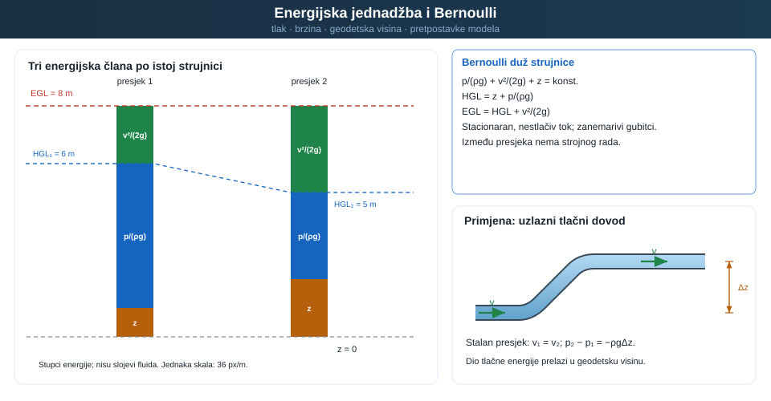
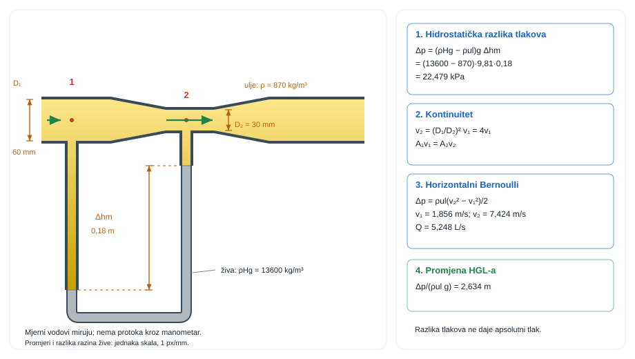

{#fig-uvod-u09 fig-align="center" fig-alt="Pregled poglavlja: energijska jednadžba i Bernoulli."}

## Bernoullijeva jednadžba kao bilanca mehaničke energije po strujnici

Kad brzina raste, tlak ili visina moraju to platiti.

pog. 7Kinematika, kontrolni volumen i kontinuitet zatvorio je bilancu mase i izbor kontrolnog volumena. pog. 8Energijska jednadžba i Bernoulli dodaje energetsku sliku strujanja: u idealiziranom toku mehanička energija ne nestaje, nego se preraspodjeljuje između tlaka, brzine i geodetske visine.

Zato u Venturijevoj cijevi, slobodnom mlazu ili Pitotovoj sondi više nije dovoljno pitati samo koliki je protok. Jednako je važno vidjeti u kojem se obliku u promatranoj točki nalazi energija fluida.

Povijesni prijelaz od Torricellijeva tumačenja istjecanja do Bernoullijeve opće energetske slike može se čitati kao ista fizikalna nit. Torricelli, Galileijev učenik, pokazao je da brzina istjecanja raste s korijenom iz visine stupca iznad otvora, a Bernoulli je približno stoljeće poslije tu fiziku ugradio u opću sliku preraspodjele tlaka, brzine i visine duž strujnice.

::: {.mf1-application}

Inženjerski kontekst

Idealni Bernoulli vidi se u Venturijevoj cijevi, Pitotovoj sondi, mlaznici za čišćenje, privremenom sifonu na gradilištu i svakom sklopu u kojem se tlak pretvara u brzinu ili obrnuto bez značajnih gubitaka. U autoindustriji, strojarstvu i brodogradnji ta logika stoji iza mjerenja protoka, tumačenja pada statičkog tlaka u suženju i čitanja energetske slike toka duž jedne strujnice.
:::

::: {.mf1-priprema}

Prije čitanja poglavlja

**Predznanje koje se pretpostavlja:**

- jednadžba kontinuiteta iz poglavlja pog. 7Kinematika, kontrolni volumen i kontinuitet;
- pojam rada i energije iz Fizike I; kinetička, potencijalna i tlačna energija;
- diferencijalni račun jedne varijable i osnove integriranja;
- pojam strujnice, trajektorije i polja brzine iz pog. 7Kinematika, kontrolni volumen i kontinuitet.

**Ishodi učenja:**

- izvesti Bernoullijevu jednadžbu integracijom Eulerove jednadžbe duž strujnice;
- prepoznati uvjete pod kojima ona vrijedi (stacionarno, nestlačivo, idealno strujanje, ista strujnica);
- primijeniti Bernoulli zajedno s kontinuitetom na Venturijevu cijev, Pitotovu sondu i istjecanje;
- pravilno čitati energetsku liniju EGL i hidrauličku liniju HGL duž strujanja.

**Procijenjeno vrijeme rada uz udžbenik:** 10 sati.
:::

## Fizikalni uvod i matematički izvod

Bernoullijeva jednadžba u ovom poglavlju predstavlja bilancu mehaničke energije po jedinici težine u idealiziranom strujanju. Tri osnovna člana su:

1. tlačna visina $p/(\rho g)$.
2. brzinska visina $v^2/(2g)$.
3. geodetska visina $z$.

Najčešći zapis glasi

$$
\frac{p}{\rho g} + \frac{v^2}{2g} + z = \text{const.}
$$ {#eq-energijska-bilanca-fizikalni-uvod-i-matematicki-izvod-01}

Za dvije točke na istoj strujnici to prelazi u

$$
\frac{p_1}{\rho g} + \frac{v_1^2}{2g} + z_1 = \frac{p_2}{\rho g} + \frac{v_2^2}{2g} + z_2
$$ {#eq-energijska-bilanca-fizikalni-uvod-i-matematicki-izvod-02}

::: {.callout-note collapse="true" icon="false"}
## Numerički trag

Bernoullijeva jednadžba može služiti kao analitička referenca za **verifikaciju** idealiziranoga Eulerova slučaja. U Venturijevoj cijevi tada se uspoređuju isti presjeci i prati približava li se numeričko rješenje referenci pri iteracijskoj i mrežnoj konvergenciji. U viskoznom modelu razlika može sadržavati fizikalni gubitak energije, razliku pretpostavki i numeričku pogrešku; te doprinose treba razdvojiti prije validacijske usporedbe s mjerenjem [@nasa-cfd-vv; @asme-vv20-2009].
:::

::: {.mf1-interaktivno}

Interaktivni prikaz — Venturijeva cijev

Interaktivni prikaz omogućuje mijenjanje promjera ulaza $D_1$, promjera grla $D_2$ i ulazne brzine $v_1$ uz neposredno praćenje promjene brzine, tlaka, energetske linije (EGL) i hidrauličke linije (HGL) duž osi cijevi. Vrijednosti polaznih parametara prilagođene su riješenom primjeru iz ovog poglavlja.

<a class="mf1-interaktivno-veza" href="https://martibasic.github.io/MF1_udzbenik/jlite/lab/index.html?path=u09_venturi.ipynb">Pokreni u pregledniku</a>

**Pitanja za samostalno istraživanje:** (a) Kako se ponaša tlak u grlu kada se $D_2$ smanjuje prema 10 mm? (b) Daju li svi parovi $(D_1, D_2)$ s istim omjerom 4:1 isti pad tlaka pri istoj $v_1$? (c) Zašto EGL u idealnom modelu ostaje konstantna, a HGL pada u grlu?

:::

Ako jedan član raste, barem jedan od preostala dva mora pasti. Upravo je to fizikalna srž Venturija, Pitota, mlaza i sifona bez gubitaka.

Iz istih članova odmah proizlaze i dvije korisne linije čitanja toka. Hidraulička linija ili `HGL` jednaka je zbroju tlačne i geodetske visine,

$$
HGL = \frac{p}{\rho g} + z,
$$ {#eq-energijska-bilanca-interaktivni-prikaz-venturijeva-cijev-01}

dok energetska linija ili `EGL` sadrži i brzinski član,

$$
EGL = \frac{p}{\rho g} + \frac{v^2}{2g} + z.
$$ {#eq-energijska-bilanca-interaktivni-prikaz-venturijeva-cijev-02}

::: {.mf1-fizikalno-znacenje}

Fizikalno značenje

`HGL` (hidraulička linija) vizualizira piezometarsku visinu $z+p/(\rho g)$, a `EGL` (energetska linija) iznad nje leži za brzinsku visinu $v^2/(2g)$. Pri crtanju otvorenih vodnih sustava uobičajeno je koristiti **manometarski tlak**, pa slobodna površina otvorenog spremnika leži na HGL-u. U idealnom toku `EGL` je horizontalna, dok `HGL` pada gdje fluid ubrzava i raste gdje usporava. Ako je HGL ispod osi cijevi, manometarski tlak je negativan, ali apsolutni tlak i dalje može biti daleko iznad tlaka zasićene pare. Kavitacija je moguća tek kad lokalni **apsolutni** tlak dosegne tlak zasićene pare pri promatranoj temperaturi.
:::

U idealnom toku `EGL` ostaje konstantna duž iste strujnice, a `HGL` je od nje niže upravo za brzinsku visinu $v^2/(2g)$. Zato su Venturijeva cijev i Pitotova sonda već u ovom poglavlju prirodni vizualni modeli preraspodjele energije.

Tu vrijedi zatvoriti i praktičnu pretvorbu jedinica. Tlak se često zadaje u paskalima ili kilopaskalima, a Bernoulli se vrlo često piše u metrima fluida. Zato treba stalno čitati dvije ekvivalentne slike iste stvari:

$$
\frac{p}{\gamma} = \frac{p}{\rho g}.
$$ {#eq-energijska-bilanca-fizikalno-znacenje-01}

Za vodu to znači da je približno $1\ \text{m}$ tlačne visine oko $9{,}81\ \text{kPa}$, odnosno da je $10\ \text{kPa}$ približno $1{,}02\ \text{m}$ vodenog stupca. Kad se u horizontalnom idealnom vodu brzina poveća, `EGL` ostaje ista, a `HGL` pada upravo za onoliko koliko se poveća brzinska visina. Zato pad statičkog tlaka od, primjerice, $\Delta p$ nije samo broj u kilopaskalima nego i pad `HGL` za $\Delta p/(\rho g)$ metara fluida.

Ista logika vrijedi i obrnuto: tlačna se visina množenjem s $\rho g$ pretvara u tlak, ali prije toga mora biti jasno je li visina apsolutna ili manometarska. Atmosferski se tlak dodaje samo pri prijelazu iz manometarske u apsolutnu referencu.

Matematika ovdje nije ukras oko fizike, nego njezin sažeti jezik. Član $p/(\rho g)$ govori koliku bi visinu fluida dao tlak, član $v^2/(2g)$ koliki je udio energije vezan uz gibanje, a član $z$ koliko energije dolazi iz samoga položaja u gravitacijskom polju. Bernoullijeva jednadžba zato stalno prevodi jednu istu mehaničku energiju iz jednoga oblika u drugi.

::: {.mf1-izvod}

Matematički izvod — Eulerova jednadžba duž strujnice iz Newtonova zakona

Bernoullijeva jednadžba nije zaseban zakon, nego integrirani oblik Eulerove jednadžbe — Newtonova drugoga zakona primijenjenoga na element fluida koji se giba duž strujnice u idealnom (neviskoznom, nestlačivom, stacionarnom) strujanju.

Promatra se element strujne cijevi duljine $ds$ i poprečnog presjeka $A$ koji se giba uz strujnicu brzinom $v$ u smjeru $s$. Masa elementa je $dm = \rho A\,ds$. Na njega djeluju tri vrste sila u smjeru osi $s$:

- sila tlaka na ulaznoj plohi: $p A$ u smjeru $+s$;
- sila tlaka na izlaznoj plohi: $-(p + dp) A$ u smjeru $+s$ (predznak: tlak gura natrag);
- komponenta težine duž osi $s$: $-\rho g A\,ds \cdot \sin\theta$, gdje je $\theta$ kut između strujnice i horizontalne ravnine. Korištenjem $\sin\theta = dz/ds$ (porast visine po duljini strujnice) komponenta se zapisuje kao $-\rho g A\,ds \cdot dz/ds$.

Suma sila na element je

$$
dF_s = pA - (p + dp)A - \rho g A\,ds\,\frac{dz}{ds} = -A\,dp - \rho g A\,dz.
$$ {#eq-energijska-bilanca-matematicki-izvod-eulerova-jednadzba-duz-strujni-01}

Newtonov drugi zakon povezuje to s ubrzanjem $a_s = dv/dt$. Za stacionarno strujanje vrijedi materijalna derivacija $dv/dt = v\,dv/ds$ (čista konvektivna komponenta jer je $\partial v/\partial t = 0$), pa je

$$
dm \cdot a_s = \rho A\,ds \cdot v\,\frac{dv}{ds} = -A\,dp - \rho g A\,dz.
$$ {#eq-energijska-bilanca-matematicki-izvod-eulerova-jednadzba-duz-strujni-02}

Kraćenjem s $A$ i dijeljenjem s $ds$ slijedi **Eulerova jednadžba duž strujnice**

$$
\rho v\,\frac{dv}{ds} = -\frac{dp}{ds} - \rho g\,\frac{dz}{ds},
$$ {#eq-energijska-bilanca-matematicki-izvod-eulerova-jednadzba-duz-strujni-03}

odnosno u kompaktnijem zapisu

$$
\rho\,v\,dv + dp + \rho g\,dz = 0.
$$ {#eq-energijska-bilanca-matematicki-izvod-eulerova-jednadzba-duz-strujni-04}

Integriranje ove diferencijalne forme uz pretpostavku konstantne gustoće dat će Bernoullijevu jednadžbu — što je tema izvoda koji slijedi.
:::

::: {.mf1-izvod}

Matematički izvod — Bernoullijeva jednadžba iz Eulerove

Promatra se element idealnoga fluida koji se giba duž strujnice s koordinatom $s$. Za stacionarno, nestlačivo i neviskozno strujanje projekcija jednadžbe količine gibanja na strujnicu daje Eulerov zapis

$$
\rho v\frac{dv}{ds} = -\frac{dp}{ds} - \rho g\frac{dz}{ds}.
$$ {#eq-energijska-bilanca-matematicki-izvod-bernoullijeva-jednadzba-iz-eul-01}

::: {.callout-note collapse="true" icon="false"}
## Numerički trag

Eulerove jednadžbe čine neviskozni model toka. Numerički se rješavaju kada je zanemarivanje viskoznih naprezanja opravdano za traženu izlaznu veličinu; izbor modela ne određuje naziv softvera, nego pretpostavke, rubni uvjeti i mjerodavne skale problema.
:::

Nakon množenja s $ds/\rho$ slijedi

$$
v\,dv + \frac{dp}{\rho} + g\,dz = 0.
$$ {#eq-energijska-bilanca-numericki-trag-01}

::: {.callout-note}
## Razrada koraka
Korak: od Eulerove jednadžbe gibanja → Bernoullijeva jednadžba integriranjem

Eulerova jednadžba: $\rho v\frac{dv}{ds} = -\frac{dp}{ds} - \rho g\frac{dz}{ds}$.

Korak 1 – dijeli s $\rho$ i pomnoži s $ds$:
$$v\,dv + \frac{dp}{\rho} + g\,dz = 0.$$ {#eq-energijska-bilanca-razrada-koraka-01}

Korak 2 – prepoznaj integrabilne oblike: $v\,dv = d(v^2/2)$, $dp/\rho = dp/\rho$ (za $\rho = \text{const.}$: $= d(p/\rho)$), $g\,dz = d(gz)$.

Korak 3 – integriraj od točke 1 do točke 2:
$$\frac{v_2^2 - v_1^2}{2} + \frac{p_2 - p_1}{\rho} + g(z_2 - z_1) = 0.$$ {#eq-energijska-bilanca-razrada-koraka-02}

Korak 4 – presloži: premjesti sve s indeksom 2 na desno i s indeksom 1 na lijevo:
$$\frac{p_1}{\rho} + \frac{v_1^2}{2} + gz_1 = \frac{p_2}{\rho} + \frac{v_2^2}{2} + gz_2.$$ {#eq-energijska-bilanca-razrada-koraka-03}

Korak 5 – podijeli s $g$ da dobiješ metre fluida: $\frac{p}{\rho g} + \frac{v^2}{2g} + z = \text{const.}$
:::

Integriranjem između točaka 1 i 2 dobiva se

$$
\int_{v_1}^{v_2} v\,dv + \int_{p_1}^{p_2} \frac{dp}{\rho} + g\int_{z_1}^{z_2} dz = 0.
$$ {#eq-energijska-bilanca-razrada-koraka-04}

Za nestlačiv fluid gustoća je konstantna, pa integracija daje

$$
\frac{v_2^2-v_1^2}{2} + \frac{p_2-p_1}{\rho} + g(z_2-z_1) = 0,
$$ {#eq-energijska-bilanca-razrada-koraka-05}

odnosno

$$
\frac{p_1}{\rho} + \frac{v_1^2}{2} + gz_1 = \frac{p_2}{\rho} + \frac{v_2^2}{2} + gz_2 = \text{const.}
$$ {#eq-energijska-bilanca-razrada-koraka-06}

Dijeljenjem s $g$ nastaje klasični Bernoullijev oblik u metrima fluida:

$$
\frac{p}{\rho g} + \frac{v^2}{2g} + z = \text{const.}
$$ {#eq-energijska-bilanca-razrada-koraka-07}

::: {.mf1-fizikalno-znacenje}

Fizikalno značenje

Ova jednadžba kaže da mehanička energija po jedinici težine ostaje konstantna duž strujnice idealnog fluida — ona se samo premješta između tlačne visine, brzinske visine i geodetske visine. Tlačni član ne predstavlja komprimiranje nestlačivoga fluida, nego mehanički doprinos **tlačnog rada** okolnog fluida. Kad se cijev sužava i brzina raste, energija dolazi od pada tlaka; kad se tok uspori, dio kinetičke energije može se vratiti u tlak. Bernoulli je zakon o preraspodjeli, a ne o stvaranju energije.
:::

Svaki član ima jasno fizikalno značenje: $p/(\rho g)$ je tlačna visina, tj. mehanička energija vezana uz tlak; $v^2/(2g)$ brzinska visina, odnosno energija gibanja po jedinici težine; a $z$ geodetska visina, tj. položajna energija po jedinici težine. Bernoullijeva jednadžba zato nije samo formula za račun, nego integralna izjava da se u idealnom toku mehanička energija ne gubi, nego se samo preraspodjeljuje između ta tri oblika.
:::

::: {.mf1-izvod}

Matematički izvod — Alternativni izvod Bernoullija iz rada i energije

Bernoullijeva jednadžba može se izvesti i izravno iz **energetskog principa**, ne polazeći od Eulerove jednadžbe. Ukupna mehanička energija fluidnog elementa duž strujnice ostaje konstantna ako nema disipativnih sila ni rada vanjskih sila izvan sile teže — što je tvrdnja zakona očuvanja mehaničke energije.

Promatra se cilindrični element strujne cijevi duljine $ds$, poprečnog presjeka $A$ i mase $dm = \rho A\,ds$ koji se duž strujnice giba brzinom $v$. Tijekom diferencijalnog vremena $dt$ element prelazi udaljenost $ds = v\,dt$, podignuvši se za visinski element $dz = \sin\theta\,ds$.

Na element djeluju dvije vrste sila koje vrše rad:

- **Sile tlaka** na ulaznoj i izlaznoj plohi. Rad neto sile tlaka u smjeru gibanja iznosi

$$
dW_{tlak} = pA\,ds - (p+dp)\,A\,ds = -A\,dp\,ds = -\frac{dp}{\rho}\,dm.
$$ {#eq-energijska-bilanca-matematicki-izvod-alternativni-izvod-bernoullija-01}

- **Sila teže** koja djeluje vertikalno prema dolje i vrši negativan rad pri uspinjanju:

$$
dW_{grav} = -dm\,g\,dz.
$$ {#eq-energijska-bilanca-matematicki-izvod-alternativni-izvod-bernoullija-02}

Promjena kinetičke energije elementa je

$$
dE_k = d\!\left(\frac{1}{2}\,dm\,v^2\right) = dm\,v\,dv.
$$ {#eq-energijska-bilanca-matematicki-izvod-alternativni-izvod-bernoullija-03}

Teorem rada i energije ($\sum dW = dE_k$) daje

$$
-\frac{dp}{\rho}\,dm - dm\,g\,dz = dm\,v\,dv,
$$ {#eq-energijska-bilanca-matematicki-izvod-alternativni-izvod-bernoullija-04}

odakle se nakon dijeljenja s $dm$ dobiva diferencijalna forma

$$
\frac{dp}{\rho} + g\,dz + v\,dv = 0.
$$ {#eq-energijska-bilanca-matematicki-izvod-alternativni-izvod-bernoullija-05}

Za nestlačivi fluid ($\rho$ = konst.) ova se jednadžba integrira između dvije točke duž iste strujnice:

$$
\frac{p_1 - p_2}{\rho} + g(z_1 - z_2) + \frac{v_1^2 - v_2^2}{2} = 0,
$$ {#eq-energijska-bilanca-matematicki-izvod-alternativni-izvod-bernoullija-06}

što se preraspodjelom svodi na **Bernoullijevu jednadžbu**

$$
\frac{p}{\rho g} + \frac{v^2}{2g} + z = \text{const.}
$$ {#eq-energijska-bilanca-matematicki-izvod-alternativni-izvod-bernoullija-07}

Ovaj izvod izravno potvrđuje da je **Bernoullijeva jednadžba zakon očuvanja mehaničke energije po jediničnoj težini fluida**. Tri člana sada se čitaju iz energetske perspektive:

- $p/(\rho g)$ je **tlačna visina** — potencijalna energija fluidnog elementa zbog tlačnog rada okolnog fluida;
- $v^2/(2g)$ je **brzinska visina** — kinetička energija po jediničnoj težini;
- $z$ je **geodetska visina** — gravitacijska potencijalna energija po jediničnoj težini.

Time se dobiva dvostruki uvid u istu jednadžbu: izvod iz Eulerove jednadžbe pokazuje **mehaničko** podrijetlo (Newton II na elementu strujne cijevi), a izvod iz rada i energije pokazuje **termodinamičko** podrijetlo (očuvanje mehaničke energije). U pog. 13Gubitci, cjevovodi, crpke i mreže bilanci se dodaje pozitivan gubitak mehaničke energije $h_w$ zbog ireverzibilnih procesa.
:::

Odmah ispod izvoda treba zatvoriti i pretpostavke modela. U pog. 8Energijska jednadžba i Bernoulli Bernoulli vrijedi samo kad su dovoljno dobro opravdane sljedeće pretpostavke:

- strujanje je stacionarno
- fluid se može uzeti nestlačivim
- viskozni gubici su zanemarivi
- između promatranih točaka nema strojnog rada ni druge vanjske mehaničke dobave energije
- dvije točke leže na istoj strujnici ili na aproksimaciji gdje je takva primjena dopuštena

To nije formalnost. Najčešći kvar u Bernoulliju nastaje onda kada se vide tlak i brzina pa se automatski zapisuje jednadžba, a da prije toga nije provjeren model.

Riješeni primjeri i zadaci za vježbu zato samo redom pokazuju kako isti Bernoullijev zapis čita pad statičkog tlaka u suženju, brzinu slobodnog mlaza, tlak u sifonu i Pitotovo lokalno mjerenje.

## Riješeni primjeri

::: {#ex-u09-pad-statickog-tlaka-u-konfuzoru-ventilacijskog-kanala .mf1-we}

Riješeni primjer — Pad statičkog tlaka u konfuzoru ventilacijskog kanala&nbsp;T2

**Kontekst:** U sustavu prisilne ventilacije konfuzor (suženje) ubrzava struju zraka prije ulaska u uži dio kanala. Projektant iz masenog protoka i geometrije presjeka određuje pad statičkog tlaka koji se javlja zbog ubrzanja zraka u suženju.

**Zadano**

- Ulazni poprečni presjek horizontalnog ventilacijskog kanala: $A_1 = 0{,}07\ \text{m}^2$
- Izlazni poprečni presjek: $A_2 = 0{,}0185\ \text{m}^2$
- Maseni protok zraka: $\dot{m} = 0{,}68\ \text{kg/s}$
- Gustoća zraka: $\rho = 1{,}2\ \text{kg/m}^3$
- Gubici strujanja se zanemaruju

**Traženo**

1. Odrediti pad statičkog tlaka $\Delta p$ između presjeka 1 i 2.

{#fig-u09-staticka-zamjena-za-egl-i-hgl fig-alt="statička zamjena za EGL i HGL"}

**Pretpostavke i model**

Promatra se horizontalni kanal bez gubitaka. Zato najprije iz kontinuiteta treba odrediti brzine u oba presjeka, a zatim iz idealnog Bernoullija procijeniti koliki pad statičkog tlaka mora platiti to ubrzanje.

**Rješenje**

Najprije iz masenog protoka dobivamo volumenski protok:

$$
Q = \frac{\dot{m}}{\rho} = \frac{0{,}68}{1{,}2} \approx 0{,}5667\ \text{m}^3/\text{s}.
$$ {#eq-energijska-bilanca-rijeseni-primjer-pad-statickog-tlaka-u-konfuzoru-01}

Iz toga slijede brzine u oba presjeka:

$$
v_1 = \frac{Q}{A_1} = \frac{0{,}5667}{0{,}07} \approx 8{,}10\ \text{m/s},
$$ {#eq-energijska-bilanca-rijeseni-primjer-pad-statickog-tlaka-u-konfuzoru-02}

$$
v_2 = \frac{Q}{A_2} = \frac{0{,}5667}{0{,}0185} \approx 30{,}63\ \text{m/s}.
$$ {#eq-energijska-bilanca-rijeseni-primjer-pad-statickog-tlaka-u-konfuzoru-03}

Kako je kanal horizontalan, vrijedi $z_1 = z_2$. Za idealni model bez gubitaka Bernoulli daje

$$
\frac{p_1}{\rho g} + \frac{v_1^2}{2g} = \frac{p_2}{\rho g} + \frac{v_2^2}{2g} \quad \Rightarrow \quad p_1 - p_2 = \frac{\rho}{2}(v_2^2 - v_1^2).
$$ {#eq-energijska-bilanca-rijeseni-primjer-pad-statickog-tlaka-u-konfuzoru-04}

Uvrstavanjem brojeva dobiva se

$$
\Delta p = \frac{1{,}2}{2}(30{,}63^2 - 8{,}10^2) \approx 523\ \text{Pa} \approx 0{,}523\ \text{kPa}.
$$ {#eq-energijska-bilanca-rijeseni-primjer-pad-statickog-tlaka-u-konfuzoru-05}

**Provjera i komentar**

1. Kako je $A_2 < A_1$, mora biti $v_2 > v_1$.
2. U idealnom konfuzoru porast brzine mora pratiti pad statičkog tlaka.
3. Ako je račun dao porast tlaka u užem presjeku, zamijenjene su točke ili predznak razlike.
:::

U suženju se kinetički i tlačni član razmjenjuju unutar voda. Kod slobodnog mlaza ista bilanca najprije daje izlaznu brzinu, a zatim se nastavlja običnom kinematikom čestice.

::: {#ex-u09-domet-slobodnog-mlaza-iz-velikog-spremnika-t2 .mf1-we}

Riješeni primjer — Domet slobodnog mlaza iz velikog spremnika&nbsp;T2

**Kontekst:** Iz bočne stijenke velikog otvorenog spremnika voda istječe kroz malu rupicu i tvori slobodni mlaz koji pada na tlo (Torricellijev problem). Treba odrediti vodoravni domet mlaza za nekoliko položaja otvora te onaj položaj koji daje najveći domet.

**Zadano**

- Visina slobodne površine vode iznad tla u velikom otvorenom spremniku: $H = 4{,}0\ \text{m}$
- Položaji male rupice na bočnoj stijenci za usporedbu: $h = 1{,}0\ \text{m}$, $h = 2{,}0\ \text{m}$, $h = 3{,}0\ \text{m}$
- Gubici se zanemaruju

**Traženo**

1. Izračunati domet mlaza za sva tri zadana položaja otvora.
2. Odrediti položaj otvora koji daje najveći domet.

{#fig-u09-domet-slobodnog-mlaza fig-alt="domet slobodnog mlaza"}

**Pretpostavke i model**

Spremnik je dovoljno velik da je brzina na slobodnoj površini zanemariva, a i slobodna površina i otvor su na atmosferskom tlaku. Zato Bernoulli između slobodne površine i otvora prelazi u Torricellijev zapis za izlaznu brzinu. Nakon izlaza mlaz se dalje giba kao vodoravno izbačeno tijelo.

**Rješenje**

Iz Bernoullija između slobodne površine i otvora slijedi $v_0 = \sqrt{2g(H-h)}$, a vrijeme pada mlaza s visine $h$ do tla glasi $t = \sqrt{2h/g}$, pa je horizontalni domet

$$
x = v_0 t = \sqrt{2g(H-h)}\,\sqrt{\frac{2h}{g}} = 2\sqrt{h(H-h)}.
$$ {#eq-energijska-bilanca-rijeseni-primjer-domet-slobodnog-mlaza-iz-veliko-01}

Sada izračunajmo domet za tri zadana položaja.

Za $h = 1{,}0\ \text{m}$:

$$
x = 2\sqrt{1{,}0(4{,}0 - 1{,}0)} = 2\sqrt{3} \approx 3{,}46\ \text{m}.
$$ {#eq-energijska-bilanca-rijeseni-primjer-domet-slobodnog-mlaza-iz-veliko-02}

Za $h = 2{,}0\ \text{m}$:

$$
x = 2\sqrt{2{,}0(4{,}0 - 2{,}0)} = 2\sqrt{4} = 4{,}00\ \text{m}.
$$ {#eq-energijska-bilanca-rijeseni-primjer-domet-slobodnog-mlaza-iz-veliko-03}

Za $h = 3{,}0\ \text{m}$:

$$
x = 2\sqrt{3{,}0(4{,}0 - 3{,}0)} = 2\sqrt{3} \approx 3{,}46\ \text{m}.
$$ {#eq-energijska-bilanca-rijeseni-primjer-domet-slobodnog-mlaza-iz-veliko-04}

Vidimo da je domet najveći kad je otvor postavljen na polovicu ukupne visine stupca vode, odnosno za $h = H/2$. Tada vrijedi $x_{max} = H$, pa je u ovom primjeru maksimalni domet jednak

$$
x_{max} = 4{,}0\ \text{m}.
$$ {#eq-energijska-bilanca-rijeseni-primjer-domet-slobodnog-mlaza-iz-veliko-05}

**Provjera i komentar**

Slobodni mlaz ne dobiva najveći domet ni iz najviše ni iz najniže postavljenog otvora. Maksimum nastaje točno na polovici ukupne visine, gdje se najpovoljnije uravnoteže izlazna brzina i vrijeme leta.

1. Ako je otvor prenisko, vrijeme leta je kratko i domet pada iako je brzina velika.
2. Ako je otvor previsoko, vrijeme leta je dugo, ali izlazna brzina pada jer je visinska razlika do slobodne površine mala.
3. Položaji $h$ i $H-h$ daju isti domet jer se u izrazu pojavljuje njihov umnožak.
:::

::: {#ex-u09-privremeni-sifon-za-praznjenje-servisnog-bazena-t2 .mf1-we}

Riješeni primjer — Privremeni sifon za praznjenje servisnog bazena&nbsp;T2

**Kontekst:** Pri privremenom praznjenju servisnog bazena postavlja se sifon koji premošćuje rub bazena i odvodi vodu u niži ispustni kanal. Operater iz visinske razlike određuje brzinu i protok sifona te provjerava tlak u njegovoj najvišoj točki kako bi se isključila opasnost od isparavanja.

**Zadano**

- Promjer idealiziranog sifona: $D = 80\ \text{mm}$
- Razina vode u donjem ispustnom kanalu (ispod slobodne površine bazena): $\Delta z = 3{,}6\ \text{m}$
- Visina najviše točke sifona `C` iznad slobodne površine bazena: $z_C = 2{,}2\ \text{m}$
- Atmosferska tlačna visina: $10{,}2\ \text{m}$ vodenog stupca
- Naponska visina pare: $0{,}25\ \text{m}$ vodenog stupca
- Gubici se zanemaruju; oba spremnika su velika i otvorena prema atmosferi

**Traženo**

1. brzinu strujanja $v$ u sifonskoj cijevi.
2. volumenski protok $Q$.
3. tlačnu visinu $p_C/\gamma$ u najvišoj točki `C` i idealiziranu razliku apsolutne tlačne visine prema zadanoj visini tlaka pare ako je atmosferska visina $10{,}2\ \text{m}$ vodenog stupca, a visina tlaka pare $0{,}25\ \text{m}$ vodenog stupca.

{#fig-u09-idealni-sifon-izme-u-dviju-razina fig-alt="idealni sifon između dviju razina"}

**Pretpostavke i model**

Obje slobodne površine su na atmosferskom tlaku, brzine na njima su zanemarive, a u cijevi se promjer ne mijenja. Zato Bernoulli između slobodnih površina odmah daje idealnu brzinu sifona, a Bernoulli između slobodne površine bazena i vrha sifona daje tlačnu visinu u točki `C`.

**Rješenje**

Iz Bernoullija između slobodne površine bazena `A` i slobodne površine kanala `B` slijedi

$$
\frac{p_A}{\gamma} + \frac{v_A^2}{2g} + z_A = \frac{p_B}{\gamma} + \frac{v_B^2}{2g} + z_B.
$$ {#eq-energijska-bilanca-rijeseni-primjer-privremeni-sifon-za-praznjenje-01}

Kako su $p_A = p_B = p_{atm}$ te su $v_A \approx v_B \approx 0$, ostaje $z_A - z_B = v^2/(2g) = \Delta z$, pa je brzina u sifonskoj cijevi

$$
v = \sqrt{2g\Delta z} = \sqrt{2 \cdot 9{,}81 \cdot 3{,}6} \approx 8{,}40\ \text{m/s}.
$$ {#eq-energijska-bilanca-rijeseni-primjer-privremeni-sifon-za-praznjenje-02}

Površina presjeka cijevi iznosi

$$
A = \frac{\pi D^2}{4} = \frac{\pi \cdot 0{,}08^2}{4} \approx 5{,}03 \cdot 10^{-3}\ \text{m}^2,
$$ {#eq-energijska-bilanca-rijeseni-primjer-privremeni-sifon-za-praznjenje-03}

zato je volumenski protok

$$
Q = Av = 5{,}03 \cdot 10^{-3} \cdot 8{,}40 \approx 4{,}22 \cdot 10^{-2}\ \text{m}^3/\text{s} \approx 42{,}2\ \text{L/s}.
$$ {#eq-energijska-bilanca-rijeseni-primjer-privremeni-sifon-za-praznjenje-04}

Sada zapišimo Bernoullija između slobodne površine bazena `A` i vrha sifona `C`. Uzmimo $z_A = 0$, pa je $z_C = 2{,}2\ \text{m}$:

$$
\frac{p_{atm}}{\gamma} = \frac{p_C}{\gamma} + \frac{v^2}{2g} + z_C.
$$ {#eq-energijska-bilanca-rijeseni-primjer-privremeni-sifon-za-praznjenje-05}

Ako radimo s manometarskim tlakom u odnosu na atmosferu, to prelazi u $0 = p_C/\gamma + 3{,}6 + 2{,}2$, pa je

$$
\frac{p_C}{\gamma} = -5{,}8\ \text{m}.
$$ {#eq-energijska-bilanca-rijeseni-primjer-privremeni-sifon-za-praznjenje-06}

Drugim riječima, u vrhu sifona manometarska tlačna visina pada $5{,}8\ \text{m}$ ispod atmosferske referentne razine, pa je lokalna `HGL` ondje za isti iznos niža od slobodne površine bazena.

To znači da je apsolutna tlačna visina u točki `C`

$$
\left(\frac{p_C}{\gamma}\right)_{abs} = 10{,}2 - 5{,}8 = 4{,}4\ \text{m}.
$$ {#eq-energijska-bilanca-rijeseni-primjer-privremeni-sifon-za-praznjenje-07}

Ako rezultat želimo vratiti u tlak, tada slijedi

$$
p_{C,man} = \rho g\left(\frac{p_C}{\gamma}\right) = 1000 \cdot 9{,}81 \cdot (-5{,}8) \approx -56{,}9\ \text{kPa},
$$ {#eq-energijska-bilanca-rijeseni-primjer-privremeni-sifon-za-praznjenje-08}

te apsolutni tlak

$$
p_{C,abs} = \rho g\left(\frac{p_C}{\gamma}\right)_{abs} = 1000 \cdot 9{,}81 \cdot 4{,}4 \approx 43{,}2\ \text{kPa}.
$$ {#eq-energijska-bilanca-rijeseni-primjer-privremeni-sifon-za-praznjenje-09}

Kako je visina tlaka pare $p_v/\gamma=0{,}25\ \text{m}$, idealni model daje razliku $4{,}4-0{,}25=4{,}15\ \text{m}$ vodenog stupca prema tomu lokalnom kriteriju.

**Provjera i komentar**

Idealni sifon daje brzinu od oko $8{,}4\ \text{m/s}$ i protok od oko $42\ \text{L/s}$. U vrhu sifona tlak pada na $-5{,}8\ \text{m}$ manometarske visine, dok je apsolutna tlačna visina oko $4{,}4\ \text{m}$ vode. Dobivena razlika prema tlaku pare pripada idealnom modelu; stvarna provjera mora uključiti gubitke, temperaturu, prolazne pojave, otopljene plinove i lokalne minimume tlaka. To je prijelaz iz pog. 8Energijska jednadžba i Bernoulli prema pog. 13Gubitci, cjevovodi, crpke i mreže.

1. Što je donja razina dublje ispod gornje, to idealna brzina sifona mora biti veća.
2. Tlak u vrhu sifona mora biti manji od atmosferskog jer se dio ukupne energije troši na visinu vrha i na brzinski član.
3. Ako bi izračun apsolutnog tlaka pao ispod naponske visine pare, čisti idealni model više ne bi bio dovoljan za fizikalno uvjerljiv odgovor.
:::

::: {#ex-u09-idealni-bypass-sifon-sa-suzenjem-u-vrhu .mf1-ch}

Cjeloviti zadatak — Idealni bypass-sifon sa suženjem u vrhu i mlaznim ispuštom&nbsp;T3

**Kontekst:** Idealizirani bypass-sifon premošćuje rub bazena, ima suženje u najvišoj točki i završava slobodnim vodoravnim mlazom iznad podloge. Traže se protok, brzina i tlak u suženju, modelska razlika prema tlaku pare te vodoravni domet mlaza.

**Zadano**

- Glavni promjer sifonske cijevi: $D = 100\ \text{mm}$
- Promjer suženja u najvišoj točki `C`: $d_C = 80\ \text{mm}$
- Visina slobodne površine bazena `A` iznad podloge: $4{,}2\ \text{m}$
- Visina vodoravnog izlaza `B` iznad podloge: $1{,}4\ \text{m}$
- Visina najviše točke sifona `C` iznad slobodne površine bazena: $z_C = 1{,}5\ \text{m}$
- Tlak na slobodnoj površini i na izlazu je atmosferski; brzina na slobodnoj površini je zanemariva
- Atmosferska tlačna visina: $10{,}2\ \text{m}$ vodenog stupca
- Naponska visina pare: $0{,}25\ \text{m}$ vodenog stupca
- Gubici se zanemaruju

**Traženo**

1. brzinu strujanja $v_B$ u glavnoj cijevi na izlazu i volumenski protok $Q$.
2. brzinu $v_C$ u suženju pri vrhu sifona.
3. manometarsku i apsolutnu tlačnu visinu u točki `C`.
4. razliku apsolutne tlačne visine prema visini tlaka pare ako je atmosferska visina $10{,}2\ \text{m}$ vodenog stupca, a visina tlaka pare $0{,}25\ \text{m}$ vodenog stupca.
5. vodoravni domet mlaza nakon izlaza iz točke `B`.

{#fig-u09-idealni-bypass-sifon-sa-suzenjem fig-alt="idealni bypass-sifon sa suženjem"}

**Pretpostavke i model**

Ovdje isti idealni tok treba čitati u tri različita reza. Bernoulli između slobodne površine `A` i izlaza `B` daje glavnu izlaznu brzinu. Kontinuitet zatim iz te iste vrijednosti vraća veću brzinu u suženju `C`, a Bernoulli između `A` i `C` pokazuje koliko pritom mora pasti statički tlak. Nakon izlaza iz `B` mlaz više ne pripada unutarnjem strujanju cijevi nego gibanju vodoravno izbačenog tijela.

**Rješenje**

Najprije iz geometrije sustava slijedi visinska razlika između slobodne površine i izlaza:

$$
\Delta z_{AB} = 4{,}2 - 1{,}4 = 2{,}8\ \text{m}.
$$ {#eq-energijska-bilanca-cjeloviti-zadatak-idealni-bypass-sifon-sa-suzenj-01}

Bernoulli između slobodne površine `A` i izlaza `B` daje

$$
\frac{p_A}{\gamma} + \frac{v_A^2}{2g} + z_A = \frac{p_B}{\gamma} + \frac{v_B^2}{2g} + z_B.
$$ {#eq-energijska-bilanca-cjeloviti-zadatak-idealni-bypass-sifon-sa-suzenj-02}

Kako su $p_A = p_B = p_{atm}$ i $v_A \approx 0$, ostaje

$$
v_B = \sqrt{2g\Delta z_{AB}} = \sqrt{2 \cdot 9{,}81 \cdot 2{,}8} \approx 7{,}41\ \text{m/s}.
$$ {#eq-energijska-bilanca-cjeloviti-zadatak-idealni-bypass-sifon-sa-suzenj-03}

Površina glavne cijevi iznosi

$$
A = \frac{\pi D^2}{4} = \frac{\pi \cdot 0{,}10^2}{4} \approx 7{,}854 \cdot 10^{-3}\ \text{m}^2,
$$ {#eq-energijska-bilanca-cjeloviti-zadatak-idealni-bypass-sifon-sa-suzenj-04}

pa je volumenski protok

$$
Q = Av_B = 7{,}854 \cdot 10^{-3} \cdot 7{,}41 \approx 5{,}82 \cdot 10^{-2}\ \text{m}^3/\text{s} \approx 58{,}2\ \text{L/s}.
$$ {#eq-energijska-bilanca-cjeloviti-zadatak-idealni-bypass-sifon-sa-suzenj-05}

Površina suženja pri vrhu sifona je

$$
A_C = \frac{\pi d_C^2}{4} = \frac{\pi \cdot 0{,}08^2}{4} \approx 5{,}027 \cdot 10^{-3}\ \text{m}^2,
$$ {#eq-energijska-bilanca-cjeloviti-zadatak-idealni-bypass-sifon-sa-suzenj-06}

pa iz kontinuiteta slijedi

$$
v_C = \frac{Q}{A_C} = \frac{5{,}82 \cdot 10^{-2}}{5{,}027 \cdot 10^{-3}} \approx 11{,}58\ \text{m/s}.
$$ {#eq-energijska-bilanca-cjeloviti-zadatak-idealni-bypass-sifon-sa-suzenj-07}

Sada pišemo Bernoullija između slobodne površine `A` i točke `C`. Uzmemo li manometarski tlak u odnosu na atmosferu, vrijedi $0 = p_C/\gamma + v_C^2/(2g) + z_C$, pa je manometarska tlačna visina u vrhu sifona

$$
\frac{p_C}{\gamma} = -\left(\frac{11{,}58^2}{2 \cdot 9{,}81} + 1{,}5\right) = -(6{,}84 + 1{,}5) = -8{,}34\ \text{m}.
$$ {#eq-energijska-bilanca-cjeloviti-zadatak-idealni-bypass-sifon-sa-suzenj-08}

Apsolutna tlačna visina u točki `C` zato iznosi

$$
\left(\frac{p_C}{\gamma}\right)_{abs} = 10{,}2 - 8{,}34 = 1{,}86\ \text{m}.
$$ {#eq-energijska-bilanca-cjeloviti-zadatak-idealni-bypass-sifon-sa-suzenj-09}

Modelska razlika prema visini tlaka pare tada je $1{,}86-0{,}25=1{,}61\ \text{m}$. To je provjera idealnog stacionarnog računa, ne sigurnosna margina izvedenoga sifona.

Nakon izlaza iz točke `B` mlaz se giba kao vodoravno izbačeno tijelo s početnom visinom $h_B = 1{,}4\ \text{m}$. Vrijeme pada do podloge iznosi

$$
t = \sqrt{\frac{2h_B}{g}} = \sqrt{\frac{2 \cdot 1{,}4}{9{,}81}} \approx 0{,}534\ \text{s},
$$ {#eq-energijska-bilanca-cjeloviti-zadatak-idealni-bypass-sifon-sa-suzenj-10}

pa je vodoravni domet mlaza

$$
x = v_B t = 7{,}41 \cdot 0{,}534 \approx 3{,}96\ \text{m}.
$$ {#eq-energijska-bilanca-cjeloviti-zadatak-idealni-bypass-sifon-sa-suzenj-11}

**Provjera i komentar**

Ovaj cjeloviti zadatak zatvara puni idealni luk poglavlja pog. 8Energijska jednadžba i Bernoulli u jednom sustavu: Bernoulli između slobodne površine i izlaza daje brzinu oko $7{,}41\ \text{m/s}$ i protok oko $58{,}2\ \text{L/s}$, kontinuitet povećava brzinu u suženju vrha na oko $11{,}58\ \text{m/s}$, a tlak u točki `C` pada na oko $-8{,}34\ \text{m}$ manometarske visine. Ipak, apsolutna tlačna visina ostaje oko $1{,}86\ \text{m}$ vode, što je još oko $1{,}61\ \text{m}$ iznad naponske visine pare. Nakon izlaza mlaz doseže vodoravni domet od oko $3{,}96\ \text{m}$.

1. U suženju mora biti $v_C > v_B$ jer isti protok prolazi kroz manji presjek.
2. Tlak u vrhu sifona mora biti manji od atmosferskog, a u suženju pada još više zbog veće brzine.
3. Ako se pri računu dometa koristi $v_C$ umjesto izlazne brzine $v_B$, pomiješani su unutarnji presjek sifona i stvarni izlazni mlaz.
:::

U pog. 8Energijska jednadžba i Bernoulli još ne treba crtati komplicirane energetske sheme, ali treba razumjeti osnovnu logiku: `EGL` prati ukupnu mehaničku energiju po jedinici težine, `HGL` zbroj tlačne i geodetske visine, a u idealnom toku `EGL` ostaje vodoravna dok se `HGL` spušta kad raste brzinski član. Upravo to u Venturiju i Pitotu odmah vizualizira što je plaćeno tlakom, a što dobiveno u brzini.

::: {#ex-u09-venturijeva-cijev-za-mjerenje-protoka-ulja-t2 .mf1-we}

Riješeni primjer — Venturijeva cijev za mjerenje protoka ulja &nbsp;T2

**Primjer za strojare**

**Kontekst:** U industrijskom maznom sustavu Venturijeva cijev mjeri protok ulja. Diferencijalnim manometrom (živa u U-cijevi) mjeri se razlika tlakova između ulaza i grla. Iz te razlike se računa protok.

**Zadano**

- Promjer ulaza: $D_1 = 60\ \text{mm}$
- Promjer grla: $D_2 = 30\ \text{mm}$
- Razlika očitanja diferencialnog manometra: $\Delta h_m = 0{,}18\ \text{m}$ žive ($\rho_{Hg} = 13600\ \text{kg/m}^3$)
- Gustoća ulja: $\rho_{ul} = 870\ \text{kg/m}^3$
- Cijev je horizontalna; zanemari gubitke

**Traženo**

Volumenski protok ulja $Q$.

{#fig-u09-venturijeva-cijev fig-align="center" fig-alt="Venturijeva cijev: D1=60 mm, D2=30 mm, Δh_m=0,18 m žive, Q≈5,27 L/s"}

**Rješenje**

Razlika tlakova između presjeka 1 i 2 iz diferencialnog manometra:
$$
\Delta p = (\rho_{Hg} - \rho_{ul})\,g\,\Delta h_m = (13600 - 870) \cdot 9{,}81 \cdot 0{,}18 = 22{,}74\ \text{kPa}
$$ {#eq-energijska-bilanca-rijeseni-primjer-venturijeva-cijev-za-mjerenje-p-01}

Za horizontalnu cijevi ($z_1 = z_2$) iz Bernoullija:
$$
\Delta p = \frac{\rho_{ul}}{2}(v_2^2 - v_1^2)
$$ {#eq-energijska-bilanca-rijeseni-primjer-venturijeva-cijev-za-mjerenje-p-02}

Iz kontinuiteta: $v_2 = v_1(A_1/A_2) = v_1(D_1/D_2)^2 = 4 v_1$

$$
\Delta p = \frac{\rho_{ul}}{2}(16 v_1^2 - v_1^2) = \frac{15\rho_{ul}}{2} v_1^2
$$ {#eq-energijska-bilanca-rijeseni-primjer-venturijeva-cijev-za-mjerenje-p-03}

$$
v_1 = \sqrt{\frac{2\Delta p}{15\rho_{ul}}} = \sqrt{\frac{2 \cdot 22740}{15 \cdot 870}} = \sqrt{3{,}481} = 1{,}866\ \text{m/s}
$$ {#eq-energijska-bilanca-rijeseni-primjer-venturijeva-cijev-za-mjerenje-p-04}

$$
Q = A_1 v_1 = \frac{\pi \cdot 0{,}060^2}{4} \cdot 1{,}866 = 2{,}827 \cdot 10^{-3} \cdot 1{,}866 = 5{,}27\ \text{L/s}
$$ {#eq-energijska-bilanca-rijeseni-primjer-venturijeva-cijev-za-mjerenje-p-05}

**Provjera i komentar**

Brzina u grlu iznosi $v_2=7{,}46\ \text{m/s}$, a `HGL` je ondje za $\Delta p/(\rho g)=2{,}669\ \text{m}$ niže nego na ulazu. Diferencijalni manometar daje samo razliku tlakova: bez apsolutnog ulaznog tlaka, temperature i tlaka pare ulja iz ovoga se računa ne može zaključiti postoji li kavitacijska rezerva.

::: {.mf1-numerika .kompakt}

Numerička perspektiva

Ista Venturijeva cijev u CFD-u daje polje brzine i tlaka, ne samo dvije točke. Za **verifikaciju proračuna** treba pratiti maseni debalans, reziduale i promjenu $\Delta p$ na najmanje trima sustavno pročišćenim mrežama. Razlika prema idealnom Bernoulliju u viskoznom modelu nije sama po sebi numerička pogreška; može sadržavati stvarne gubitke i razliku modela. Validacija zato traži odgovarajuće mjerenje i njegove nesigurnosti [@nasa-cfd-vv; @asme-vv20-2009].
:::

:::

Venturi protok zaključuje iz razlike statičkih tlakova; Pitotova sonda sljedeća zaključuje brzinu iz razlike stagnacijskog i statičkog tlaka.

::: {#ex-u09-pitot-staticka-sonda-na-bespilotnoj-letjelici-za .mf1-we}

Riješeni primjer — Pitot-statička sonda na bespilotnoj letjelici za mjerenje brzine leta &nbsp;T2

**Kontekst:** Bespilotne letjelice (dronovi) korištene u geodetskim, poljoprivrednim i inspekcijskim mjerenjima opremljene su Pitot-statičkom sondom za mjerenje vlastite brzine u odnosu na okolni zrak. Sonda mjeri razliku između stagnacijskog tlaka na čelu sonde i statičkog tlaka okolnog strujanja, iz čega se Bernoullijevom jednadžbom izračunava brzina leta.

**Zadano**

- Razlika izmjerenih tlakova: $\Delta p = p_{st} - p_{\infty} = 380\ \text{Pa}$
- Gustoća zraka na visini leta od $500\ \text{m}$ pri temperaturi $12^\circ\text{C}$: $\rho = 1{,}115\ \text{kg/m}^3$
- Sonda je orijentirana paralelno s pravcem leta
- Promjer otvora sonde: $D_s = 5\ \text{mm}$
- Kinematička viskoznost zraka: $\nu = 1{,}5 \cdot 10^{-5}\ \text{m}^2/\text{s}$

**Traženo**

1. Brzina leta letjelice prema očitanju sonde;
2. Procjena: kako bi se promijenila preračunata brzina u gušćem zraku ($\rho = 1{,}25\ \text{kg/m}^3$) uz isti $\Delta p$;
3. Red veličine Reynoldsova broja sonde i što se iz njega smije zaključiti.

**Pretpostavke i model**

Strujanje zraka oko sonde smatra se stacionarnim i nestlačivim (Machov broj $\ll 0{,}3$). Zanemaruje se viskozni efekt na samoj sondi, kao i utjecaj smjera vjetra koji nije paralelan s osi letjelice. Točka 1 odgovara nepotečenom strujanju daleko od sonde, a točka 2 stagnacijskoj točki na čelu sonde u kojoj se zrak zaustavlja ($v_2 = 0$). Leti se na konstantnoj visini, pa članovi geodetske visine otpadaju.

**Rješenje**

Bernoullijeva jednadžba između nepotečene struje i stagnacijske točke daje:

$$
p_{\infty} + \frac{\rho v^2}{2} = p_{st}.
$$ {#eq-energijska-bilanca-rijeseni-primjer-pitot-staticka-sonda-na-bespilo-01}

Iz toga slijedi izraz za brzinu leta:

$$
v = \sqrt{\frac{2\,\Delta p}{\rho}} = \sqrt{\frac{2 \cdot 380}{1{,}115}}.
$$ {#eq-energijska-bilanca-rijeseni-primjer-pitot-staticka-sonda-na-bespilo-02}

Računaju se redom $2 \cdot 380 = 760$ i $760/1{,}115 \approx 681{,}6$:

$$
v = \sqrt{681{,}6} \approx 26{,}1\ \text{m/s}.
$$ {#eq-energijska-bilanca-rijeseni-primjer-pitot-staticka-sonda-na-bespilo-03}

U gušćem zraku, uz $\rho = 1{,}25\ \text{kg/m}^3$ i isti izmjereni $\Delta p$, brzina bi se preračunala na:

$$
v_o = \sqrt{\frac{2 \cdot 380}{1{,}25}} = \sqrt{608} \approx 24{,}7\ \text{m/s}.
$$ {#eq-energijska-bilanca-rijeseni-primjer-pitot-staticka-sonda-na-bespilo-04}

Razlika u izračunatoj brzini iznosi približno $1{,}4\ \text{m/s}$ ili $5{,}4\,\%$ — značajna pogreška ako se ne primjenjuje korekcija prema lokalnoj gustoći zraka.

Reynoldsov broj oko sonde:

$$
Re_s = \frac{v\,D_s}{\nu} = \frac{26{,}1 \cdot 0{,}005}{1{,}5 \cdot 10^{-5}} \approx 8\,700.
$$ {#eq-energijska-bilanca-rijeseni-primjer-pitot-staticka-sonda-na-bespilo-05}

Vrijednost $Re_s$ reda $10^4$ samo određuje omjer inercijskih i viskoznih učinaka za odabranu karakterističnu duljinu. Granice $2300/4000$ vrijede za razvijeno strujanje u kružnoj cijevi i ne smiju se prenijeti na vanjsko strujanje oko Pitotove sonde. Sam $Re_s$ zato ne dokazuje ni „turbulentnost sonde" ni točnost mjerenja; za to su potrebni geometrija, kut nastrujavanja i kalibracijska karakteristika sonde.

**Provjera i komentar**

Brzina od $26{,}1\ \text{m/s}$ odgovara približno $94\ \text{km/h}$. Promjena pretpostavljene gustoće od oko $12\,\%$ mijenja preračunatu brzinu za oko $5\,\%$, pa mjerenje koje traži malu nesigurnost mora koristiti lokalnu procjenu gustoće i kalibraciju cijelog mjernog lanca. Pri maloj brzini dinamički tlak pada s $v^2$, pa odnos signala i šuma postaje lošiji; konkretna donja mjerna granica ovisi o senzoru, sondi i obradi signala, a ne o jednoj univerzalnoj brzini.
:::

::: {.mf1-samoprovjera}

Provjeri sebe

Sljedeća pitanja služe za samostalnu provjeru razumijevanja prije prelaska na zadatke za vježbu.

1. Pod kojim sve uvjetima vrijedi klasična Bernoullijeva jednadžba u obliku iz ovog poglavlja?

::: {.callout-note collapse="true"}
### Odgovor
Vrijedi za stacionarno strujanje, nestlačivi fluid (gustoća konstantna), neviskozno strujanje (bez disipacije), bez vanjskog rada (bez pumpe ni turbine) i između točaka na istoj strujnici. Ako bilo koji od ovih uvjeta nije zadovoljen, treba prijeći na prošireni oblik koji se uvodi u sljedećem poglavlju.
:::

2. Po čemu se razlikuju energetska linija (EGL) i hidraulička linija (HGL) i kako se one ponašaju u idealnom strujanju?

::: {.callout-note collapse="true"}
### Odgovor
EGL je zbroj tlačne, brzinske i geodetske visine, a HGL samo tlačne i geodetske. U idealnom strujanju EGL ostaje konstantna duž strujnice (energija je očuvana), dok HGL pada gdje brzina raste i obratno, jer se razlikuju upravo za brzinsku visinu $v^2/(2g)$.
:::

3. Zašto se Torricellijeva formula $v = \sqrt{2gH}$ izvodi izravno iz Bernoullijeve jednadžbe?

::: {.callout-note collapse="true"}
### Odgovor
Postavljanjem Bernoullija između slobodne površine velikog spremnika (brzina nula, tlak atmosferski, visina $H$) i izlaznog presjeka male sapnice (tlak atmosferski, visina nula) pokraćuju se tlačni i geodetski članovi i ostaje $v^2/(2g) = H$, odakle slijedi $v = \sqrt{2gH}$.
:::

4. Kada se Bernoulli koristi za istjecanje, je li dobiveni rezultat za $v$ pretežno gornja ili donja granica stvarne brzine?

::: {.callout-note collapse="true"}
### Odgovor
Gornja granica. Stvarna brzina je manja jer u idealnom modelu nisu uračunati gubici trenja, lokalne disipacije na ulazu u sapnicu i mogući viskozni profil brzina. Razlika se uračunava preko koeficijenta isticanja $C_d < 1$ koji se uvodi u realnim primjenama.
:::
:::

## Zadaci za vježbu

::::: {.mf1-vjezbe-list}
1. [**T1**]{#task-u09-veliki-otvoreni-spremnik-sadrzi-vodu-do-visine} Veliki otvoreni spremnik sadrži vodu do visine $H = 3{,}20\ \text{m}$ iznad osi male bočne sapnice promjera $d = 26\ \text{mm}$. Zanemari gubitke i odredi izlaznu brzinu mlaza, volumenski protok i maseni protok vode.

   :::: {.content-visible .mf1-hint-online when-format="html"}
   ::: {.callout-note collapse="true" data-hint-key="true"}
   ### Naputak
   između slobodne površine i izlaza vrijedi Torricelli: $v = \sqrt{2gH}$; nakon toga $Q = Av$ i $\dot m = \rho Q$.
   :::
   ::::
   :::: {.content-visible .mf1-answer-online when-format="html"}
   ::: {.callout-tip collapse="true" data-answer-key="true"}
   ### Kontrolni rezultat

   $v \approx 7{,}92\ \text{m/s}$; $Q \approx 4{,}21\ \text{L/s}$; $\dot m \approx 4{,}20\ \text{kg/s}$.
   :::
   ::::
   **Skica:** da - veliki spremnik, slobodna površina, izlazna sapnica i geodetska visina $H$.

2. [**T1**]{#task-u09-horizontalnim-ventilacijskim-kanalom-smanjuje-se-presjek-s} Horizontalnim ventilacijskim kanalom smanjuje se presjek s $A_1 = 0{,}060\ \text{m}^2$ na $A_2 = 0{,}020\ \text{m}^2$. Volumenski protok zraka iznosi $Q = 0{,}42\ \text{m}^3/\text{s}$, a gustoća zraka je $\rho = 1{,}20\ \text{kg/m}^3$. Odredi pad statičkog tlaka.

   :::: {.content-visible .mf1-hint-online when-format="html"}
   ::: {.callout-note collapse="true" data-hint-key="true"}
   ### Naputak
   iz kontinuiteta dobij $v_1$ i $v_2$, a za horizontalni kanal bez gubitaka vrijedi $p_1 + \rho v_1^2/2 = p_2 + \rho v_2^2/2$.
   :::
   ::::
   :::: {.content-visible .mf1-answer-online when-format="html"}
   ::: {.callout-tip collapse="true" data-answer-key="true"}
   ### Kontrolni rezultat

   $v_1 = 7{,}0\ \text{m/s}$, $v_2 = 21{,}0\ \text{m/s}$; $\Delta p \approx 235\ \text{Pa}$.
   :::
   ::::
   **Skica:** da - horizontalni konfuzor s dva presjeka, brzinama i tlakovima.

3. [**T2**]{#task-u09-idealna-venturijeva-cijev-za-vodu-ima-ulazni} Idealna Venturijeva cijev za vodu ima ulazni promjer $D_1 = 120\ \text{mm}$ i promjer grla $D_2 = 70\ \text{mm}$. Razlika statičkih tlakova između ulaza i grla iznosi $\Delta p = 24\ \text{kPa}$. Odredi brzinu u grlu i volumenski protok kroz Venturi.

   :::: {.content-visible .mf1-hint-online when-format="html"}
   ::: {.callout-note collapse="true" data-hint-key="true"}
   ### Naputak
   spoji kontinuitet $A_1 v_1 = A_2 v_2$ s Bernoullijem između ulaza i grla, pa riješi dvije nepoznate brzine.
   :::
   ::::
   :::: {.content-visible .mf1-answer-online when-format="html"}
   ::: {.callout-tip collapse="true" data-answer-key="true"}
   ### Kontrolni rezultat

   $v_2 \approx 7{,}38\ \text{m/s}$; $Q \approx 28{,}4\ \text{L/s}$.
   :::
   ::::
   **Skica:** da - Venturi s ulazom, grlom i označenom razlikom tlakova $\Delta p$.

4. [**T2**]{#task-u09-pitotova-cijev-uronjena-je-u-vodeni-tok} Pitotova cijev uronjena je u vodeni tok. Razlika između stagnacijskog i statičkog tlaka iznosi $\Delta p = 8{,}5\ \text{kPa}$. Odredi lokalnu brzinu strujanja.

   :::: {.content-visible .mf1-hint-online when-format="html"}
   ::: {.callout-note collapse="true" data-hint-key="true"}
   ### Naputak
   u Pitotu vrijedi $\Delta p = \rho v^2/2$, pa brzina slijedi iz $v = \sqrt{2\Delta p/\rho}$.
   :::
   ::::
   :::: {.content-visible .mf1-answer-online when-format="html"}
   ::: {.callout-tip collapse="true" data-answer-key="true"}
   ### Kontrolni rezultat

   $v \approx 4{,}13\ \text{m/s}$.
   :::
   ::::
   **Skica:** da - strujna cijev s Pitot otvorom, stagnacijska i statička točka.

5. [**T3**]{#task-u09-idealni-sifon-prazni-otvoreni-spremnik-razlika-razina} Idealni sifon prazni otvoreni spremnik. Razlika razina između slobodne površine u spremniku i izlaza sifona iznosi $\Delta z = 2{,}8\ \text{m}$, a vrh sifona nalazi se $1{,}1\ \text{m}$ iznad slobodne površine. Odredi brzinu strujanja, apsolutni tlak u vrhu sifona te položaj HGL-a u vrhu u odnosu na slobodnu površinu. Ako je $p_{atm} = 101\ \text{kPa}$ i tlak zasićene pare $p_v=2{,}34\ \text{kPa}$, procijeni postoji li u idealnom radnom stanju kavitacijska rezerva.

   :::: {.content-visible .mf1-hint-online when-format="html"}
   ::: {.callout-note collapse="true" data-hint-key="true"}
   ### Naputak
   brzinu dobij iz Bernoullija između slobodne površine i izlaza, a tlak u vrhu iz Bernoullija između slobodne površine i vrha sifona. Uz manometarski tlak vrijedi $HGL_C=z_C+p_{M,C}/(\rho g)$, dok se kavitacija provjerava apsolutnim tlakom.
   :::
   ::::
   :::: {.content-visible .mf1-answer-online when-format="html"}
   ::: {.callout-tip collapse="true" data-answer-key="true"}
   ### Kontrolni rezultat

   $v \approx 7{,}41\ \text{m/s}$; $p_C \approx 62{,}8\ \text{kPa}$ (aps.); $HGL_C=-2{,}8\ \text{m}$ u odnosu na slobodnu površinu; $p_C-p_v\approx60{,}5\ \text{kPa}$, pa idealni račun pokazuje pozitivnu rezervu.
   :::
   ::::
   **Skica:** da - spremnik, sifonska cijev, vrh sifona, izlaz i visinske kote.

6. [**T4**]{#task-u09-idealni-sifon-promjera-prazni-otvoreni-spremnik-tako} Idealni sifon promjera $D = 70\ \text{mm}$ prazni otvoreni spremnik tako da je izlaz vodoravan i nalazi se $\Delta z = 2{,}6\ \text{m}$ ispod slobodne površine. Vrh sifona je $z_C = 1{,}7\ \text{m}$ iznad slobodne površine, a izlaz se nalazi $1{,}2\ \text{m}$ iznad tla. Najprije zanemari gubitke i odredi brzinu i volumenski protok u sifonu, apsolutni tlak u vrhu sifona te vodoravni domet mlaza nakon izlaza ako je $p_{atm} = 101{,}3\ \text{kPa}$. Zatim razmotri izvedeni sustav: ukupni koeficijent gubitaka od spremnika do izlaza iznosi $K_\Sigma=2{,}0\pm0{,}5$, a do vrha sifona $K_C=1{,}2\pm0{,}3$; oba su definirana uz brzinu u sifonu. Odredi nominalni stvarni protok i konzervativne granice protoka i tlaka u vrhu. Može li se zajamčiti zahtjev $Q\ge15{,}0\ \text{L/s}$ i $p_C\ge30\ \text{kPa}$ apsolutno?

   :::: {.content-visible .mf1-hint-online when-format="html"}
   ::: {.callout-note collapse="true" data-hint-key="true"}
   ### Naputak
   Bernoullijem između slobodne površine i izlaza vrati idealni $v$, između slobodne površine i vrha sifona vrati tlak, a domet mlaza zatvori kao vodoravno izbačeno tijelo s visine $1{,}2\ \text{m}$. Za izvedeni sustav koristi $v=\sqrt{2g\Delta z/(1+K_\Sigma)}$ i $p_C=p_{atm}-\rho g[z_C+(1+K_C)v^2/(2g)]$. Najmanji protok daje najveći $K_\Sigma$; najmanji tlak u vrhu provjeri konzervativnim kutovima zadanih intervala, ne samo nominalnim koeficijentima.
   :::
   ::::
   :::: {.content-visible .mf1-answer-online when-format="html"}
   ::: {.callout-tip collapse="true" data-answer-key="true"}
   ### Kontrolni rezultat

   Idealni model daje $v \approx 7{,}14\ \text{m/s}$; $Q \approx 27{,}5\ \text{L/s}$; $p_C \approx 59{,}2\ \text{kPa}$ (aps.); domet $x \approx 3{,}53\ \text{m}$. Za $K_\Sigma=2{,}0$ stvarni je protok približno $15{,}9\ \text{L/s}$, a za interval $K_\Sigma=1{,}5$--$2{,}5$ iznosi približno $17{,}4$--$14{,}7\ \text{L/s}$. Konzervativni tlak u vrhu ostaje oko $59{,}2\ \text{kPa}$ apsolutno, pa je tlačni zahtjev zadovoljen, ali se zahtjev protoka ne može zajamčiti. Potrebno je smanjiti gubitke, povećati promjer ili potvrditi $K_\Sigma$ mjerenjem.
   :::
   ::::
   **Skica:** da - spremnik, sifonska cijev s vrhom $C$, vodoravni izlaz i domet mlaza do tla.
:::::

{#fig-u09-vjezbe fig-align="center" fig-alt="Skice uz zadatke za vježbu — sapnice, Venturijeve cijevi, Pitot i sifoni."}

::: {.mf1-zavrsni-okvir}

Za ponijeti iz poglavlja

**Sažeta provjera prije računa**

- Jesu li dvije točke odabrane fizikalno smisleno?
- Vrijedi li idealni model ili je zadatak već ušao u gubitke i realni Bernoulli?
- Prije Bernoullija treba zatvoriti kontinuitet ako se mijenja presjek.
- Treba provjeriti koriste li se tlak, brzina i visina u istom sustavu jedinica.
- Treba znati koji član mora pasti ako drugi raste.

**Najčešća pogreška**

Najčešća greška u pog. 8Energijska jednadžba i Bernoulli nije algebra nego mehaničko prepisivanje Bernoullija bez provjere pretpostavki. Drugi klasični kvar je zaboraviti da porast brzine u pravilu ne donosi novu energiju, nego je plaćen padom tlaka ili visine.

**Nakon ovoga poglavlja mora biti moguće**

1. provjeriti jesu li uvjeti idealnog modela stvarno zatvoreni.
2. čitati tlak, brzinu i visinu kao tri oblika iste mehaničke energije.
3. spojiti kontinuitet i Bernoulli u jednostavnom problemu promjene presjeka.
4. prepoznati kada zadatak više ne pripada idealnom nego realnom modelu.

**U tehnici to znači**

Venturijeve cijevi, Pitotove sonde i mlaznice rade upravo zato što se ista mehanička energija može očitati kao tlak, brzina ili visina. U praksi taj prijelaz omogućuje mjerenje protoka, procjenu brzine strujanja i projektiranje mlaznih sustava za pranje, hlađenje ili raspršivanje.

**Granica modela**

Idealni Bernoulli prestaje biti dovoljan čim trenje, vrtloženje ili lokalni otpori daju mjerljiv gubitak, odnosno kad se predviđeni apsolutni tlak približi području promjene faze. Tada problem traži modele iz pog. 13Gubitci, cjevovodi, crpke i mreže.

pog. 8Energijska jednadžba i Bernoulli zatvara idealnu energetsku sliku strujanja: brzina ne raste niotkuda, nego na račun tlaka ili geodetske visine. Kad se to učvrsti, prijelaz prema pog. 13Gubitci, cjevovodi, crpke i mreže postaje prirodan.
:::

::: {.mf1-numerika}

Numerički most

**Gdje ovo živi u numerici.** Bernoullijeva jednadžba ima u CFD-u dvije različite uloge. Prva: Eulerove jednadžbe, iz kojih se pod odgovarajućim pretpostavkama izvodi Bernoulli, čine neviskozni model toka. Druga: Bernoullijev rezultat služi kao analitička referenca za **verifikaciju** idealiziranog slučaja i kao provjera reda veličine u presjecima gdje su gubitci mali. Validacija realnoga modela ipak traži podatke stvarnog sustava.

**Što numerički alat radi s tim.** Duž odabrane strujnice ili kroz usklađene presjeke iz polja $p$ i $v$ izračunavaju se `EGL` i `HGL`. U numeričkom Eulerovu slučaju koji dijeli Bernoullijeve pretpostavke, neželjeni pad `EGL` može otkriti diskretizacijsku disipaciju, nedovoljnu konvergenciju ili neusklađene rubne uvjete; usporedba mora koristiti istu strujnicu i istu referencu energije.

**Tipičan scenarij.** Eulerov model može poslužiti kao jeftiniji predprojektni model kada su viskozni učinci sekundarni, a zatim se odabrane geometrije provjeravaju viskoznim modelom. Koliko je takav račun brži i koliko je točan nije univerzalno: ovisi o mreži, solveru, geometriji i traženoj izlaznoj veličini.

> *Nije gradivo MF1. Bernoulli koji se ovdje piše za dvije točke, u CFD-u postaje provjera koja vrijedi za čitavu domenu.*
:::

::: {.callout-tip collapse="true" icon="false"}
## Provjera CFD-a analitičkim rješenjem

Bernoullijeva jednadžba može biti **referentno analitičko rješenje** za numerički model koji dijeli njezine pretpostavke. U idealiziranom Eulerovu modelu Venturija uspoređuju se isti presjeci, primjerice ulaz i grlo, te se provjerava smanjuje li se razlika prema Bernoulliju pri iteracijskoj i mrežnoj konvergenciji. Ne postoji univerzalna dopuštena razlika od $5\,\%$. U viskoznom CFD modelu dio razlike prema idealnom Bernoulliju predstavlja stvaran gubitak energije, pa se takav model validira mjerenjem ili odgovarajućim koreliranim modelom gubitaka. Razliku između verifikacije i validacije sustavno obrađuje dodatak D04.
:::
