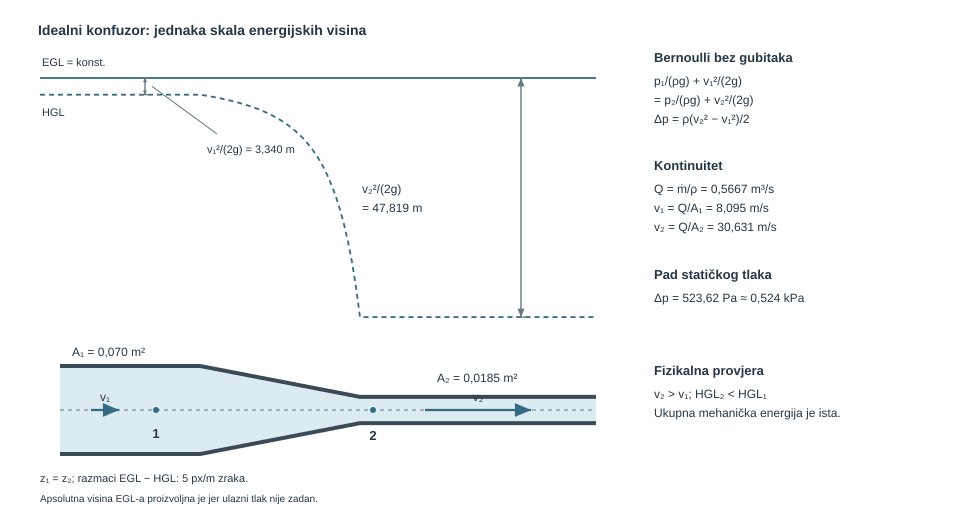
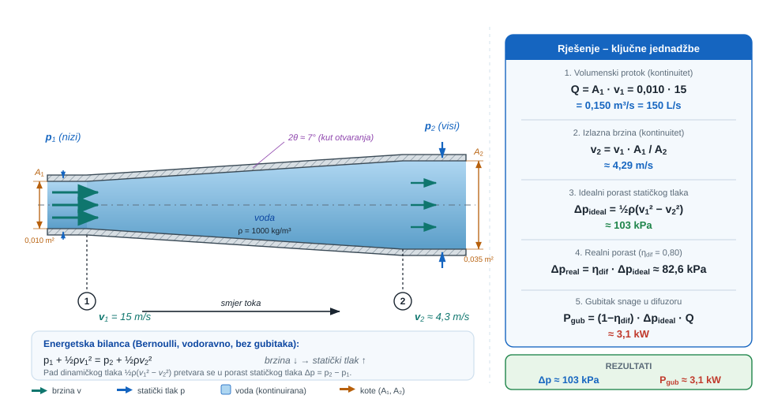
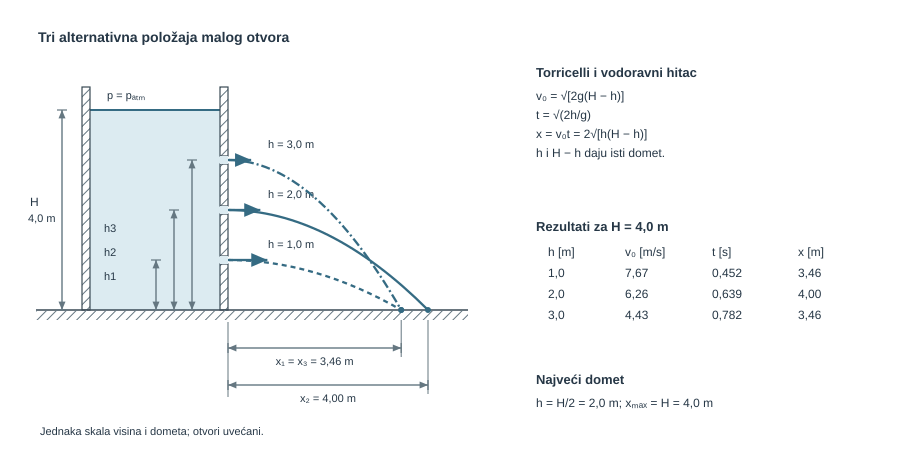
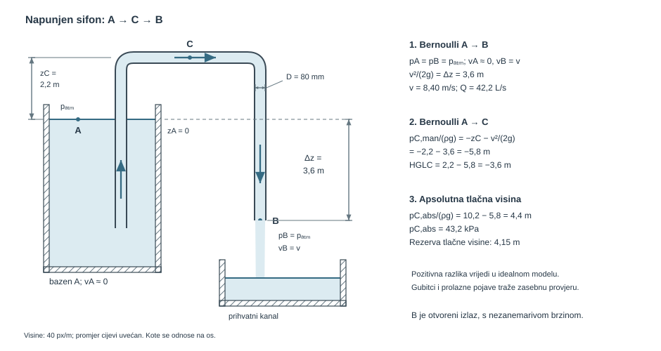
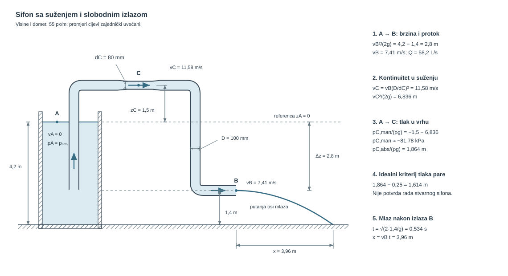
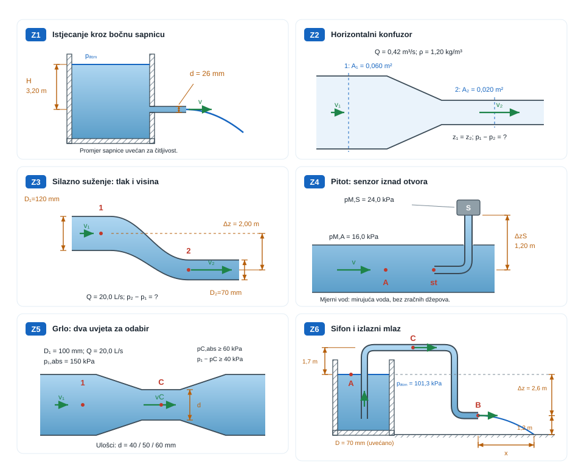

```{python}
#| label: fig-uvod-u09
#| fig-cap: "Pregled poglavlja: Bernoullijeva jednadžba idealnog fluida"
#| fig-align: center
#| out-width: 95%

import matplotlib.pyplot as plt
import matplotlib.patches as mpatches
import matplotlib.gridspec as gridspec
import numpy as np

FLUID = '#AED6F1'; SOLID = '#BDC3C7'; FORCE = '#E74C3C'
VEL   = '#27AE60'; DARK  = '#1A252F'; SUB   = '#566573'

fig = plt.figure(figsize=(12, 5))
gs  = gridspec.GridSpec(2, 2, figure=fig, hspace=0.45, wspace=0.35)
ax_fiz  = fig.add_subplot(gs[:, 0])
ax_mat  = fig.add_subplot(gs[0, 1])
ax_prak = fig.add_subplot(gs[1, 1])

for ax, naslov, boja in zip(
    [ax_fiz, ax_mat, ax_prak],
    ['Fizikalni sustav', 'Ključna jednadžba', 'Primjena u praksi'],
    ['#EAF4FB', '#EAF9F1', '#FDF2E9']
):
    ax.set_facecolor(boja)
    ax.set_title(naslov, fontsize=10, fontweight='bold', pad=6)
    ax.set_xticks([]); ax.set_yticks([])
    for sp in ax.spines.values():
        sp.set_edgecolor('#BDC3C7'); sp.set_linewidth(1.2)

# --- ZONA 1: Venturijeva cijev s EGL i HGL ---
ax = ax_fiz
ax.set_xlim(0, 10); ax.set_ylim(0, 8)

# Cijev s suzenjm (venturi profil)
x_pipe = np.array([0.3, 2.0, 2.0, 4.5, 4.5, 7.5, 7.5, 9.5, 9.5, 0.3])
y_top  = np.array([5.5, 5.5, 4.5, 4.2, 4.5, 4.5, 5.5, 5.5, 5.5, 5.5])
y_bot  = np.array([2.0, 2.0, 2.8, 3.1, 2.8, 2.8, 2.0, 2.0, 2.0, 2.0])
# Fill fluid
ax.fill_between(x_pipe[:9], y_bot[:9], y_top[:9], fc=FLUID, alpha=0.8, step='pre')
ax.plot(x_pipe[:9], y_top[:9], 'k-', lw=1.8)
ax.plot(x_pipe[:9], y_bot[:9], 'k-', lw=1.8)

# EGL (ravna horizontalna linija = const u idealnom toku)
ax.plot([0.3, 9.5], [7.2, 7.2], color='#E74C3C', lw=2.0, ls='-')
ax.text(9.6, 7.2, 'EGL', fontsize=9, va='center', color='#E74C3C')

# HGL (spusta se u suzenju gdje raste v)
hgl_x = [0.3, 2.5, 4.35, 7.0, 9.5]
hgl_y = [6.0, 6.0, 5.0, 6.0, 6.0]
ax.plot(hgl_x, hgl_y, color='#8E44AD', lw=1.8, ls='--')
ax.text(9.6, 6.0, 'HGL', fontsize=9, va='center', color='#8E44AD')

# v strelice u suzenju
ax.annotate('', xy=(5.5, 3.75), xytext=(4.0, 3.75),
    arrowprops=dict(arrowstyle='->', color=VEL, lw=2.0))
ax.text(4.7, 3.4, r'$v_2\uparrow$', fontsize=9, ha='center', color=VEL)

# p oznaka (pad tlaka)
ax.text(4.35, 4.6, r'$p\downarrow$', fontsize=9, ha='center', color='#8E44AD')

# --- ZONA 2: jednadžba ---
ax = ax_mat
ax.text(0.5, 0.75,
    r'$\dfrac{p}{\rho g}+\dfrac{v^2}{2g}+z = \mathrm{const}$',
    transform=ax.transAxes, ha='center', va='center', fontsize=13, color=DARK)
ax.text(0.5, 0.35,
    r'$p + \dfrac{\rho v^2}{2} + \rho g z = \mathrm{const}$',
    transform=ax.transAxes, ha='center', va='center', fontsize=11, color=DARK)
ax.text(0.5, 0.10,
    'Bernoulli: ideal, nestlačiv, stacionaran tok',
    transform=ax.transAxes, ha='center', va='center',
    fontsize=8, color=SUB, style='italic')

# --- ZONA 3: Pitotova sonda ---
ax = ax_prak
ax.set_xlim(0, 10); ax.set_ylim(0, 6)
# Cijev
ax.fill([0.3, 9.5, 9.5, 0.3], [1.5, 1.5, 3.5, 3.5], fc=FLUID, ec='#555', lw=1.5, alpha=0.7)
# Pitot sonda (prema strujanju)
ax.add_patch(mpatches.FancyBboxPatch((4.0, 2.0), 0.3, 2.0,
    boxstyle='round,pad=0.1', fc='#BDC3C7', ec='#555', lw=1.5))
ax.fill([4.15, 4.3, 4.15], [2.0, 2.4, 2.8], fc='#BDC3C7', ec='#555', lw=1.5)
# Strelice strujanja
for y0 in [2.0, 2.5, 3.0]:
    ax.annotate('', xy=(3.8, y0), xytext=(1.5, y0),
        arrowprops=dict(arrowstyle='->', color=VEL, lw=1.2))
ax.text(2.5, 3.7, r'$v_\infty$', fontsize=10, ha='center', color=VEL)
# p stagnation
ax.text(4.7, 2.4, r'$p_0=p+\frac{\rho v^2}{2}$',
    fontsize=8, va='center', color='#8E44AD')
ax.text(5.0, 0.3, 'Pitotova sonda  (Zrakoplovstvo/Strojarstvo)',
    fontsize=7.5, ha='center', color=SUB)

fig.suptitle('U09 – Bernoullijeva jednadžba idealnog fluida',
             fontsize=13, fontweight='bold', y=1.01)
plt.show()
```

## Bernoullijeva jednadžba kao bilanca mehaničke energije po strujnici

Kad brzina raste, tlak ili visina moraju to platiti.

<span class="mf1-ch-ref"><span class="mf1-ch-code">U08</span><span class="mf1-ch-title">Kontrolni volumen i kontinuitet</span></span> zatvorio je bilancu mase i izbor kontrolnog volumena. <span class="mf1-ch-ref"><span class="mf1-ch-code">U09</span><span class="mf1-ch-title">Bernoullijeva jednadžba idealnog fluida</span></span> dodaje energetsku sliku strujanja: u idealiziranom toku mehanička energija ne nestaje, nego se preraspodjeljuje između tlaka, brzine i geodetske visine.

Zato u Venturijevoj cijevi, slobodnom mlazu ili Pitotovoj sondi više nije dovoljno pitati samo koliki je protok. Jednako je važno vidjeti u kojem se obliku u promatranoj točki nalazi energija fluida.

Povijesni prijelaz od Torricellijeva tumačenja istjecanja do Bernoullijeve opće energetske slike može se čitati kao ista fizikalna nit. Torricelli, Galileijev učenik, pokazao je da brzina istjecanja raste s korijenom iz visine stupca iznad otvora, a Bernoulli je nekoliko desetljeća poslije tu fiziku zapisao kao opće pravilo preraspodjele tlaka, brzine i visine duž strujnice.

::: {.mf1-application}
<p class="mf1-box-label">Inženjerski kontekst</p>

Idealni Bernoulli vidi se u Venturijevoj cijevi, Pitotovoj sondi, mlaznici za čišćenje, privremenom sifonu na gradilištu i svakom sklopu u kojem se tlak pretvara u brzinu ili obrnuto bez značajnih gubitaka. U autoindustriji, strojarstvu i brodogradnji ta logika stoji iza mjerenja protoka, tumačenja pada statičkog tlaka u suženju i čitanja energetske slike toka duž jedne strujnice.
:::

::: {.mf1-priprema}
<p class="mf1-box-label">Prije čitanja poglavlja</p>

**Predznanje koje se pretpostavlja:**

- jednadžba kontinuiteta iz poglavlja <span class="mf1-ch-ref"><span class="mf1-ch-code">U08</span><span class="mf1-ch-title">Kontrolni volumen i kontinuitet</span></span>;
- pojam rada i energije iz Fizike I; kinetička, potencijalna i tlačna energija;
- diferencijalni račun jedne varijable i osnove integriranja;
- pojam strujnice (linije strujanja) u stacionarnom toku.

**Ishodi učenja:**

- izvesti Bernoullijevu jednadžbu integracijom Eulerove jednadžbe duž strujnice;
- prepoznati uvjete pod kojima ona vrijedi (stacionarno, nestlačivo, idealno strujanje, ista strujnica);
- primijeniti Bernoulli zajedno s kontinuitetom na Venturijevu cijev, Pitotovu sondu i istjecanje;
- pravilno čitati energetsku liniju EGL i hidrauličku liniju HGL duž strujanja.

**Procijenjeno vrijeme:** 6–7 sati za teoriju i izvode, 4 sata za rješavanje primjera i zadataka.
:::

## Fizikalni uvod i matematički izvod

Bernoullijeva jednadžba u ovom poglavlju predstavlja bilancu mehaničke energije po jedinici težine u idealiziranom strujanju. Tri osnovna člana su:

1. tlačna visina $p/(\rho g)$.
2. brzinska visina $v^2/(2g)$.
3. geodetska visina $z$.

Najčešći zapis glasi

$$
\frac{p}{\rho g} + \frac{v^2}{2g} + z = \text{const.}
$$

Za dvije točke na istoj strujnici to prelazi u

$$
\frac{p_1}{\rho g} + \frac{v_1^2}{2g} + z_1 = \frac{p_2}{\rho g} + \frac{v_2^2}{2g} + z_2
$$

::: {.callout-note collapse="true" icon="false"}
## Numerički trag

Bernoullijeva jednadžba u CFD-u rijetko se rješava — ona se najčešće koristi **za validaciju**. Kad inženjer pokrene Venturijevu cijev u OpenFOAM-u, prva provjera ispravnosti rezultata je usporedba pada tlaka između ulaza i grla s Bernoullijem. Ako CFD i Bernoulli daju isti rezultat (u idealiziranim uvjetima), simulacija "drži vodu". Razlika između njih u realnoj geometriji je upravo gubitak energije iz idućeg poglavlja.
:::

::: {.mf1-interaktivno}
<p class="mf1-box-label">Interaktivni prikaz — Venturijeva cijev</p>

Interaktivni prikaz omogućuje mijenjanje promjera ulaza $D_1$, promjera grla $D_2$ i ulazne brzine $v_1$ uz neposredno praćenje promjene brzine, tlaka, energetske linije (EGL) i hidrauličke linije (HGL) duž osi cijevi. Vrijednosti polaznih parametara prilagođene su riješenom primjeru iz ovog poglavlja.

<div class="mf1-interaktivno-akcija">
<a class="mf1-interaktivno-veza" href="https://colab.research.google.com/github/martibasic/MF1_udzbenik/blob/main/notebooks/u09_venturi.ipynb" target="_blank" rel="noopener">Otvori interaktivni prikaz</a>

</div>

<div class="mf1-interaktivno-pitanja">
**Pitanja za samostalno istraživanje:** (a) Kako se ponaša tlak u grlu kada se $D_2$ smanjuje prema 10 mm? (b) Daju li svi parovi $(D_1, D_2)$ s istim omjerom 4:1 isti pad tlaka pri istoj $v_1$? (c) Zašto EGL u idealnom modelu ostaje konstantna, a HGL pada u grlu?
</div>
:::

Ako jedan član raste, barem jedan od preostala dva mora pasti. Upravo je to fizikalna srž Venturija, Pitota, mlaza i sifona bez gubitaka.

Iz istih članova odmah proizlaze i dvije korisne linije čitanja toka. Hidraulička linija ili `HGL` jednaka je zbroju tlačne i geodetske visine,

$$
HGL = \frac{p}{\rho g} + z,
$$

dok energetska linija ili `EGL` sadrži i brzinski član,

$$
EGL = \frac{p}{\rho g} + \frac{v^2}{2g} + z.
$$

::: {.callout-note}
## Fizikalno značenje
`HGL` (hidraulička linija gradijenta) vizualizira gdje bi stigla voda kad bi se zaustavila bez gubitaka brzine — to je razina do koje bi porasla voda u piezometrima postavljenim uz cijev. `EGL` (energetska linija) je uvijek iznad `HGL` za iznos brzinske visine $v^2/(2g)$. U idealnom toku `EGL` je horizontalna (energija se čuva), dok `HGL` pada gdje fluid ubrzava i raste gdje usporava. Kad `HGL` padne ispod osi cijevi, statički tlak postaje negativan — to je preduvjet za kavitaciju.
:::

U idealnom toku `EGL` ostaje konstantna duž iste strujnice, a `HGL` je od nje niže upravo za brzinsku visinu $v^2/(2g)$. Zato su Venturijeva cijev i Pitotova sonda već u ovom poglavlju prirodni vizualni modeli preraspodjele energije.

Tu vrijedi zatvoriti i praktičnu pretvorbu jedinica. Tlak se često zadaje u paskalima ili kilopaskalima, a Bernoulli se vrlo često piše u metrima fluida. Zato treba stalno čitati dvije ekvivalentne slike iste stvari:

$$
\frac{p}{\gamma} = \frac{p}{\rho g}.
$$

Za vodu to znači da je približno $1\ \text{m}$ tlačne visine oko $9{,}81\ \text{kPa}$, odnosno da je $10\ \text{kPa}$ približno $1{,}02\ \text{m}$ vodenog stupca. Kad se u horizontalnom idealnom vodu brzina poveća, `EGL` ostaje ista, a `HGL` pada upravo za onoliko koliko se poveća brzinska visina. Zato pad statičkog tlaka od, primjerice, $\Delta p$ nije samo broj u kilopaskalima nego i pad `HGL` za $\Delta p/(\rho g)$ metara fluida.

Ista logika vrijedi i obrnuto: kad se u sifonu ili Pitotovoj sondi najprije dobije tlačna visina u metrima, apsolutni tlak vraća se množenjem s $\rho g$, a zatim se po potrebi pribraja ili oduzima atmosferski tlak ovisno radi li se s apsolutnim ili manometarskim tlakom.

Matematika ovdje nije ukras oko fizike, nego njezin sažeti jezik. Član $p/(\rho g)$ govori koliku bi visinu fluida dao tlak, član $v^2/(2g)$ koliki je udio energije vezan uz gibanje, a član $z$ koliko energije dolazi iz samoga položaja u gravitacijskom polju. Bernoullijeva jednadžba zato stalno prevodi jednu istu mehaničku energiju iz jednoga oblika u drugi.

::: {.mf1-izvod}
<p class="mf1-box-label">Matematički izvod — Eulerova jednadžba duž strujnice iz Newtonova zakona</p>

Bernoullijeva jednadžba nije zaseban zakon, nego integrirani oblik Eulerove jednadžbe — Newtonova drugoga zakona primijenjenoga na element fluida koji se giba duž strujnice u idealnom (neviskoznom, nestlačivom, stacionarnom) strujanju.

Promatra se element strujne cijevi duljine $ds$ i poprečnog presjeka $A$ koji se giba uz strujnicu brzinom $v$ u smjeru $s$. Masa elementa je $dm = \rho A\,ds$. Na njega djeluju tri vrste sila u smjeru osi $s$:

- sila tlaka na ulaznoj plohi: $p A$ u smjeru $+s$;
- sila tlaka na izlaznoj plohi: $-(p + dp) A$ u smjeru $+s$ (predznak: tlak gura natrag);
- komponenta težine duž osi $s$: $-\rho g A\,ds \cdot \sin\theta$, gdje je $\theta$ kut između strujnice i horizontalne ravnine. Korištenjem $\sin\theta = dz/ds$ (porast visine po duljini strujnice) komponenta se zapisuje kao $-\rho g A\,ds \cdot dz/ds$.

Suma sila na element je

$$
dF_s = pA - (p + dp)A - \rho g A\,ds\,\frac{dz}{ds} = -A\,dp - \rho g A\,dz.
$$

Newtonov drugi zakon povezuje to s ubrzanjem $a_s = dv/dt$. Za stacionarno strujanje vrijedi materijalna derivacija $dv/dt = v\,dv/ds$ (čista konvektivna komponenta jer je $\partial v/\partial t = 0$), pa je

$$
dm \cdot a_s = \rho A\,ds \cdot v\,\frac{dv}{ds} = -A\,dp - \rho g A\,dz.
$$

Kraćenjem s $A$ i dijeljenjem s $ds$ slijedi **Eulerova jednadžba duž strujnice**

$$
\rho v\,\frac{dv}{ds} = -\frac{dp}{ds} - \rho g\,\frac{dz}{ds},
$$

odnosno u kompaktnijem zapisu

$$
\rho\,v\,dv + dp + \rho g\,dz = 0.
$$

Integriranje ove diferencijalne forme uz pretpostavku konstantne gustoće dat će Bernoullijevu jednadžbu — što je tema izvoda koji slijedi.
:::

::: {.mf1-izvod}
<p class="mf1-box-label">Matematički izvod — Bernoullijeva jednadžba iz Eulerove</p>

Promatra se element idealnoga fluida koji se giba duž strujnice s koordinatom $s$. Za stacionarno, nestlačivo i neviskozno strujanje projekcija jednadžbe količine gibanja na strujnicu daje Eulerov zapis

$$
\rho v\frac{dv}{ds} = -\frac{dp}{ds} - \rho g\frac{dz}{ds}.
$$

::: {.callout-note collapse="true" icon="false"}
## Numerički trag

Eulerova jednadžba (Navier-Stokes bez viskoznog člana) je temelj **Euler solvera** — posebne klase CFD rješavača za strujanja u kojima je viskoznost zanemariva: vanjska aerodinamika nadzvučnih projektila, akustika, atmosferska strujanja na velikim skalama. Slobodno dostupan solver `SU2` (NASA, Stanford) i komercijalni Fluent imaju *inviscid* mod koji rješava točno ovu jednadžbu — samo u 3D obliku, na mreži s milijunima ćelija.
:::

Nakon množenja s $ds/\rho$ slijedi

$$
v\,dv + \frac{dp}{\rho} + g\,dz = 0.
$$

::: {.callout-note}
## Razrada koraka
Korak: od Eulerove jednadžbe gibanja → Bernoullijeva jednadžba integriranjem

Eulerova jednadžba: $\rho v\frac{dv}{ds} = -\frac{dp}{ds} - \rho g\frac{dz}{ds}$.

Korak 1 – dijeli s $\rho$ i pomnoži s $ds$:
$$v\,dv + \frac{dp}{\rho} + g\,dz = 0.$$

Korak 2 – prepoznaj integrabilne oblike: $v\,dv = d(v^2/2)$, $dp/\rho = dp/\rho$ (za $\rho = \text{const.}$: $= d(p/\rho)$), $g\,dz = d(gz)$.

Korak 3 – integriraj od točke 1 do točke 2:
$$\frac{v_2^2 - v_1^2}{2} + \frac{p_2 - p_1}{\rho} + g(z_2 - z_1) = 0.$$

Korak 4 – presloži: premjesti sve s indeksom 2 na desno i s indeksom 1 na lijevo:
$$\frac{p_1}{\rho} + \frac{v_1^2}{2} + gz_1 = \frac{p_2}{\rho} + \frac{v_2^2}{2} + gz_2.$$

Korak 5 – podijeli s $g$ da dobiješ metre fluida: $\frac{p}{\rho g} + \frac{v^2}{2g} + z = \text{const.}$
:::

Integriranjem između točaka 1 i 2 dobiva se

$$
\int_{v_1}^{v_2} v\,dv + \int_{p_1}^{p_2} \frac{dp}{\rho} + g\int_{z_1}^{z_2} dz = 0.
$$

Za nestlačiv fluid gustoća je konstantna, pa integracija daje

$$
\frac{v_2^2-v_1^2}{2} + \frac{p_2-p_1}{\rho} + g(z_2-z_1) = 0,
$$

odnosno

$$
\frac{p_1}{\rho} + \frac{v_1^2}{2} + gz_1 = \frac{p_2}{\rho} + \frac{v_2^2}{2} + gz_2 = \text{const.}
$$

Dijeljenjem s $g$ nastaje klasični Bernoullijev oblik u metrima fluida:

$$
\frac{p}{\rho g} + \frac{v^2}{2g} + z = \text{const.}
$$

::: {.callout-note}
## Fizikalno značenje
Ova jednadžba kaže da mehanička energija po jedinici težine ostaje konstantna duž strujnice idealnog fluida — ona se samo premješta između tri oblika: tlačna visina (energija komprimiranja), brzinska visina (energija gibanja) i geodetska visina (položajna energija). Kad se cijev sužava i brzina raste, energija mora doći odnekud — dolazi od pada tlaka. Kad fluid ulazi u širi dio i uspori, ta kinetička energija vraća se u tlak. Bernoulli je zakon o preraspodjeli, a ne o stvaranju energije.
:::

Svaki član ima jasno fizikalno značenje: $p/(\rho g)$ je tlačna visina, tj. mehanička energija vezana uz tlak; $v^2/(2g)$ brzinska visina, odnosno energija gibanja po jedinici težine; a $z$ geodetska visina, tj. položajna energija po jedinici težine. Bernoullijeva jednadžba zato nije samo formula za račun, nego integralna izjava da se u idealnom toku mehanička energija ne gubi, nego se samo preraspodjeljuje između ta tri oblika.
:::

::: {.mf1-izvod}
<p class="mf1-box-label">Matematički izvod — Alternativni izvod Bernoullija iz rada i energije</p>

Bernoullijeva jednadžba može se izvesti i izravno iz **energetskog principa**, ne polazeći od Eulerove jednadžbe. Ukupna mehanička energija fluidnog elementa duž strujnice ostaje konstantna ako nema disipativnih sila ni rada vanjskih sila izvan sile teže — što je tvrdnja zakona očuvanja mehaničke energije.

Promatra se cilindrični element strujne cijevi duljine $ds$, poprečnog presjeka $A$ i mase $dm = \rho A\,ds$ koji se duž strujnice giba brzinom $v$. Tijekom diferencijalnog vremena $dt$ element prelazi udaljenost $ds = v\,dt$, podignuvši se za visinski element $dz = \sin\theta\,ds$.

Na element djeluju dvije vrste sila koje vrše rad:

- **Sile tlaka** na ulaznoj i izlaznoj plohi. Rad neto sile tlaka u smjeru gibanja iznosi

$$
dW_{tlak} = pA\,ds - (p+dp)\,A\,ds = -A\,dp\,ds = -\frac{dp}{\rho}\,dm.
$$

- **Sila teže** koja djeluje vertikalno prema dolje i vrši negativan rad pri uspinjanju:

$$
dW_{grav} = -dm\,g\,dz.
$$

Promjena kinetičke energije elementa je

$$
dE_k = d\!\left(\frac{1}{2}\,dm\,v^2\right) = dm\,v\,dv.
$$

Teorem rada i energije ($\sum dW = dE_k$) daje

$$
-\frac{dp}{\rho}\,dm - dm\,g\,dz = dm\,v\,dv,
$$

odakle se nakon dijeljenja s $dm$ dobiva diferencijalna forma

$$
\frac{dp}{\rho} + g\,dz + v\,dv = 0.
$$

Za nestlačivi fluid ($\rho$ = konst.) ova se jednadžba integrira između dvije točke duž iste strujnice:

$$
\frac{p_1 - p_2}{\rho} + g(z_1 - z_2) + \frac{v_1^2 - v_2^2}{2} = 0,
$$

što se preraspodjelom svodi na **Bernoullijevu jednadžbu**

$$
\frac{p}{\rho g} + \frac{v^2}{2g} + z = \text{const.}
$$

Ovaj izvod izravno potvrđuje da je **Bernoullijeva jednadžba zakon očuvanja mehaničke energije po jediničnoj težini fluida**. Tri člana sada se čitaju iz energetske perspektive:

- $p/(\rho g)$ je **tlačna visina** — potencijalna energija fluidnog elementa zbog tlačnog rada okolnog fluida;
- $v^2/(2g)$ je **brzinska visina** — kinetička energija po jediničnoj težini;
- $z$ je **geodetska visina** — gravitacijska potencijalna energija po jediničnoj težini.

Time se dobiva dvostruki uvid u istu jednadžbu: izvod iz Eulerove jednadžbe pokazuje **mehaničko** podrijetlo (Newton II na elementu strujne cijevi), a izvod iz rada i energije pokazuje **termodinamičko** podrijetlo (očuvanje mehaničke energije). Pri prijelazu na realni fluid (poglavlje U10) dodaje se gubitak $h_w$ kao energija koja se nepovratno pretvara u toplinu zbog viskoznog trenja — drugi zakon termodinamike u jeziku hidromehanike.
:::

Odmah ispod izvoda treba zatvoriti i pretpostavke modela. U <span class="mf1-ch-ref"><span class="mf1-ch-code">U09</span><span class="mf1-ch-title">Bernoullijeva jednadžba idealnog fluida</span></span> Bernoulli vrijedi samo kad su dovoljno dobro opravdane sljedeće pretpostavke:

- strujanje je stacionarno
- fluid se može uzeti nestlačivim
- viskozni gubici su zanemarivi
- između promatranih točaka nema strojnog rada ni druge vanjske mehaničke dobave energije
- dvije točke leže na istoj strujnici ili na aproksimaciji gdje je takva primjena dopuštena

To nije formalnost. Najčešći kvar u Bernoulliju nastaje onda kada se vide tlak i brzina pa se automatski zapisuje jednadžba, a da prije toga nije provjeren model.

Riješeni primjeri i zadaci za vježbu zato samo redom pokazuju kako isti Bernoullijev zapis čita pad statičkog tlaka u suženju, brzinu slobodnog mlaza, tlak u sifonu i Pitotovo lokalno mjerenje.

## Riješeni primjeri

::: {.mf1-we}
<p class="mf1-box-label">Riješeni primjer — Pad statičkog tlaka u konfuzoru ventilacijskog kanala&nbsp;<span class="mf1-level">T2</span></p>

**Kontekst:** U sustavu prisilne ventilacije konfuzor (suženje) ubrzava struju zraka prije ulaska u uži dio kanala. Projektant iz masenog protoka i geometrije presjeka određuje pad statičkog tlaka koji se javlja zbog ubrzanja zraka u suženju.

**Zadano**

- Ulazni poprečni presjek horizontalnog ventilacijskog kanala: $A_1 = 0{,}07\ \text{m}^2$
- Izlazni poprečni presjek: $A_2 = 0{,}0185\ \text{m}^2$
- Maseni protok zraka: $\dot{m} = 0{,}68\ \text{kg/s}$
- Gustoća zraka: $\rho = 1{,}2\ \text{kg/m}^3$
- Gubici strujanja se zanemaruju

**Traženo**

1. Odrediti pad statičkog tlaka $\Delta p$ između presjeka 1 i 2.



**Pretpostavke i model**

Promatra se horizontalni kanal bez gubitaka. Zato najprije iz kontinuiteta treba odrediti brzine u oba presjeka, a zatim iz idealnog Bernoullija procijeniti koliki pad statičkog tlaka mora platiti to ubrzanje.

**Rješenje**

Najprije iz masenog protoka dobivamo volumenski protok:

$$
Q = \frac{\dot{m}}{\rho} = \frac{0{,}68}{1{,}2} \approx 0{,}5667\ \text{m}^3/\text{s}.
$$

Iz toga slijede brzine u oba presjeka:

$$
v_1 = \frac{Q}{A_1} = \frac{0{,}5667}{0{,}07} \approx 8{,}10\ \text{m/s},
$$

$$
v_2 = \frac{Q}{A_2} = \frac{0{,}5667}{0{,}0185} \approx 30{,}63\ \text{m/s}.
$$

Kako je kanal horizontalan, vrijedi $z_1 = z_2$. Za idealni model bez gubitaka Bernoulli daje

$$
\frac{p_1}{\rho g} + \frac{v_1^2}{2g} = \frac{p_2}{\rho g} + \frac{v_2^2}{2g} \quad \Rightarrow \quad p_1 - p_2 = \frac{\rho}{2}(v_2^2 - v_1^2).
$$

Uvrstavanjem brojeva dobiva se

$$
\Delta p = \frac{1{,}2}{2}(30{,}63^2 - 8{,}10^2) \approx 523\ \text{Pa} \approx 0{,}523\ \text{kPa}.
$$

**Provjera i komentar**

1. Kako je $A_2 < A_1$, mora biti $v_2 > v_1$.
2. U idealnom konfuzoru porast brzine mora pratiti pad statičkog tlaka.
3. Ako je račun dao porast tlaka u užem presjeku, zamijenjene su točke ili predznak razlike.
:::

::: {.mf1-we}
<p class="mf1-box-label">Riješeni primjer — Difuzor: pretvorba brzine natrag u statički tlak&nbsp;<span class="mf1-level">T2</span></p>

**Kontekst:** Iza radnog kola centrifugalne crpke difuzor postupno proširuje presjek i pretvara visoku kinetičku energiju izlazne vode natrag u statički tlak prije ulaza u tlačni vod. Analiziraju se idealni porast tlaka, izlazna brzina te realni porast tlaka i gubitak snage uz zadani koeficijent povratka.

**Zadano**

U vodovodnom sustavu nalazi se difuzor (konično proširenje cijevi) postavljen vodoravno. Voda ulazi kroz uži presjek velikom brzinom i izlazi kroz širi presjek manjom brzinom. Difuzor je **simetrična suprotnost** prethodnom konfuzoru: dok u konfuzoru pad statičkog tlaka prati porast brzine, u difuzoru se kinetička energija "vraća" u statički tlak.

- Ulazni presjek (uži): $A_1 = 0{,}010\ \text{m}^2$
- Izlazni presjek (širi): $A_2 = 0{,}035\ \text{m}^2$
- Ulazna brzina: $v_1 = 15\ \text{m/s}$
- Gustoća vode: $\rho = 1000\ \text{kg/m}^3$
- Difuzor vodoravan, bez gubitaka (idealan)

**Traženo**

1. Volumenski protok kroz difuzor.
2. Izlaznu brzinu $v_2$.
3. Porast statičkog tlaka $\Delta p = p_2 - p_1$ idealnim Bernoullijem.
4. Procjenu **stvarnog** porasta tlaka za realni difuzor s koeficijentom povratka $\eta_{dif} = 0{,}80$, te gubitak snage koji se generira u difuzoru pri tom protoku.

{#fig-u09-difuzor fig-align="center"}

**Pretpostavke i model**

Strujanje je stacionarno, voda nestlačiva, difuzor postavljen vodoravno (geodetske visine $z_1 = z_2$). U **idealnom** modelu zanemaruju se gubici (trenje, lokalne vrtloge na ulazu u proširenje, odvajanje strujanja kod premalog kuta otvaranja), pa vrijedi nepromijenjena Bernoullijeva jednadžba duž strujnice:

$$
p_1 + \frac{1}{2}\rho v_1^2 = p_2 + \frac{1}{2}\rho v_2^2
$$

Pad brzine od $v_1$ do $v_2$ stvara pad **dinamičkog** tlaka, koji se idealnim modelom potpuno pretvara u porast **statičkog** tlaka. U stvarnom difuzoru dio te pretvorbe ne uspijeva – izgubi se na lokalne vrtloge u proširenju – pa se uvodi koeficijent povratka $\eta_{dif}$ (tipično 0,6–0,9 ovisno o kutu otvaranja).

**Rješenje**

Volumenski protok je jednak u oba presjeka (kontinuitet):

$$
Q = A_1 v_1 = 0{,}010 \cdot 15 = 0{,}150\ \text{m}^3/\text{s} = 150\ \text{L/s}.
$$

Izlazna brzina iz kontinuiteta:

$$
v_2 = v_1 \frac{A_1}{A_2} = 15 \cdot \frac{0{,}010}{0{,}035} \approx 4{,}29\ \text{m/s}.
$$

Idealan porast statičkog tlaka:

$$
\Delta p_{ideal} = \frac{\rho}{2}\left(v_1^2 - v_2^2\right) = \frac{1000}{2}\left(15^2 - 4{,}29^2\right) = 500 \cdot (225 - 18{,}4) \approx 1{,}03 \cdot 10^5\ \text{Pa} \approx 103\ \text{kPa}.
$$

Realni porast tlaka uz $\eta_{dif} = 0{,}80$:

$$
\Delta p_{real} = \eta_{dif} \cdot \Delta p_{ideal} \approx 0{,}80 \cdot 103 \approx 82{,}6\ \text{kPa}.
$$

Snaga gubitka u difuzoru (razlika idealne i stvarne pretvorbe puta protok):

$$
P_{gub} = (1 - \eta_{dif}) \cdot \Delta p_{ideal} \cdot Q = 0{,}20 \cdot 1{,}03 \cdot 10^5 \cdot 0{,}150 \approx 3{,}1\ \text{kW}.
$$

**Provjera i komentar**

1. Kako je $A_2 > A_1$, mora biti $v_2 < v_1$ – kontinuitet.
2. U idealnom difuzoru pad brzine mora pratiti porast statičkog tlaka – upravo obrnuto od konfuzora iz prethodnog primjera. Idealna Bernoullijeva jednadžba je **simetrična** s obzirom na smjer toka: ako se voda obrne, isti difuzor postaje konfuzor s istom razlikom tlaka u istom iznosu, ali suprotnog predznaka.
3. **Inženjerska poruka 1 – usisni dio crpke**: difuzor stoji upravo iza radnog kola centrifugalne crpke. Voda iz radnog kola izlazi brzinom 20–30 m/s; difuzor pretvara tu kinetičku energiju u statički tlak prije nego što voda uđe u tlačni vod. Bez difuzora, kinetička energija bi se rasipala u vrtlozima ulaska u cijev.
4. **Inženjerska poruka 2 – stvarni $\eta_{dif}$ ovisi o kutu**: ako se difuzor previše naglo otvori (kut $> 15^\circ$ između stijenki), strujanje se odvaja od stijenke i nastaju vrtlozi koji rasipaju energiju – $\eta_{dif}$ padne ispod 0,5. Optimalan kut otvaranja je $7$–$10^\circ$, koji daje $\eta_{dif} \approx 0{,}85$. Difuzori su upravo zato karakteristično **dugački** – ne smiju biti naglo otvoreni.
5. Gubitak $P_{gub} \approx 3{,}1$ kW pri ovom protoku odgovara potrošnji energije male kućanske crpke – ako je difuzor projektiran loše, taj se gubitak svaki sat plaća kao električnoj energiji. Zato projektant ne smije "skratiti" difuzor radi uštede prostora bez da uskoči u trošak energije tijekom cijelog vijeka rada.
:::

::: {.mf1-we}
<p class="mf1-box-label">Riješeni primjer — Domet slobodnog mlaza iz velikog spremnika&nbsp;<span class="mf1-level">T2</span></p>

**Kontekst:** Iz bočne stijenke velikog otvorenog spremnika voda istječe kroz malu rupicu i tvori slobodni mlaz koji pada na tlo (Torricellijev problem). Treba odrediti vodoravni domet mlaza za nekoliko položaja otvora te onaj položaj koji daje najveći domet.

**Zadano**

- Visina slobodne površine vode iznad tla u velikom otvorenom spremniku: $H = 4{,}0\ \text{m}$
- Položaji male rupice na bočnoj stijenci za usporedbu: $h = 1{,}0\ \text{m}$, $h = 2{,}0\ \text{m}$, $h = 3{,}0\ \text{m}$
- Gubici se zanemaruju

**Traženo**

1. Izračunati domet mlaza za sva tri zadana položaja otvora.
2. Odrediti položaj otvora koji daje najveći domet.



**Pretpostavke i model**

Spremnik je dovoljno velik da je brzina na slobodnoj površini zanemariva, a i slobodna površina i otvor su na atmosferskom tlaku. Zato Bernoulli između slobodne površine i otvora prelazi u Torricellijev zapis za izlaznu brzinu. Nakon izlaza mlaz se dalje giba kao vodoravno izbačeno tijelo.

**Rješenje**

Iz Bernoullija između slobodne površine i otvora slijedi $v_0 = \sqrt{2g(H-h)}$, a vrijeme pada mlaza s visine $h$ do tla glasi $t = \sqrt{2h/g}$, pa je horizontalni domet

$$
x = v_0 t = \sqrt{2g(H-h)}\,\sqrt{\frac{2h}{g}} = 2\sqrt{h(H-h)}.
$$

Sada izračunajmo domet za tri zadana položaja.

Za $h = 1{,}0\ \text{m}$:

$$
x = 2\sqrt{1{,}0(4{,}0 - 1{,}0)} = 2\sqrt{3} \approx 3{,}46\ \text{m}.
$$

Za $h = 2{,}0\ \text{m}$:

$$
x = 2\sqrt{2{,}0(4{,}0 - 2{,}0)} = 2\sqrt{4} = 4{,}00\ \text{m}.
$$

Za $h = 3{,}0\ \text{m}$:

$$
x = 2\sqrt{3{,}0(4{,}0 - 3{,}0)} = 2\sqrt{3} \approx 3{,}46\ \text{m}.
$$

Vidimo da je domet najveći kad je otvor postavljen na polovicu ukupne visine stupca vode, odnosno za $h = H/2$. Tada vrijedi $x_{max} = H$, pa je u ovom primjeru maksimalni domet jednak

$$
x_{max} = 4{,}0\ \text{m}.
$$

**Provjera i komentar**

Slobodni mlaz ne dobiva najveći domet ni iz najviše ni iz najniže postavljenog otvora. Maksimum nastaje točno na polovici ukupne visine, gdje se najpovoljnije uravnoteže izlazna brzina i vrijeme leta.

1. Ako je otvor prenisko, vrijeme leta je kratko i domet pada iako je brzina velika.
2. Ako je otvor previsoko, vrijeme leta je dugo, ali izlazna brzina pada jer je visinska razlika do slobodne površine mala.
3. Položaji $h$ i $H-h$ daju isti domet jer se u izrazu pojavljuje njihov umnožak.
:::

::: {.mf1-we}
<p class="mf1-box-label">Riješeni primjer — Privremeni sifon za praznjenje servisnog bazena&nbsp;<span class="mf1-level">T2</span></p>

**Kontekst:** Pri privremenom praznjenju servisnog bazena postavlja se sifon koji premošćuje rub bazena i odvodi vodu u niži ispustni kanal. Operater iz visinske razlike određuje brzinu i protok sifona te provjerava tlak u njegovoj najvišoj točki kako bi se isključila opasnost od isparavanja.

**Zadano**

- Promjer idealiziranog sifona: $D = 80\ \text{mm}$
- Razina vode u donjem ispustnom kanalu (ispod slobodne površine bazena): $\Delta z = 3{,}6\ \text{m}$
- Visina najviše točke sifona `C` iznad slobodne površine bazena: $z_C = 2{,}2\ \text{m}$
- Atmosferska tlačna visina: $10{,}2\ \text{m}$ vodenog stupca
- Naponska visina pare: $0{,}25\ \text{m}$ vodenog stupca
- Gubici se zanemaruju; oba spremnika su velika i otvorena prema atmosferi

**Traženo**

1. brzinu strujanja $v$ u sifonskoj cijevi.
2. volumenski protok $Q$.
3. tlačnu visinu $p_C/\gamma$ u najvišoj točki `C` i provjeri je li tlak sigurno iznad naponske visine isparavanja ako je atmosferska visina $10{,}2\ \text{m}$ vodenog stupca, a naponska visina pare $0{,}25\ \text{m}$ vodenog stupca.



**Pretpostavke i model**

Obje slobodne površine su na atmosferskom tlaku, brzine na njima su zanemarive, a u cijevi se promjer ne mijenja. Zato Bernoulli između slobodnih površina odmah daje idealnu brzinu sifona, a Bernoulli između slobodne površine bazena i vrha sifona daje tlačnu visinu u točki `C`.

**Rješenje**

Iz Bernoullija između slobodne površine bazena `A` i slobodne površine kanala `B` slijedi

$$
\frac{p_A}{\gamma} + \frac{v_A^2}{2g} + z_A = \frac{p_B}{\gamma} + \frac{v_B^2}{2g} + z_B.
$$

Kako su $p_A = p_B = p_{atm}$ te su $v_A \approx v_B \approx 0$, ostaje $z_A - z_B = v^2/(2g) = \Delta z$, pa je brzina u sifonskoj cijevi

$$
v = \sqrt{2g\Delta z} = \sqrt{2 \cdot 9{,}81 \cdot 3{,}6} \approx 8{,}40\ \text{m/s}.
$$

Površina presjeka cijevi iznosi

$$
A = \frac{\pi D^2}{4} = \frac{\pi \cdot 0{,}08^2}{4} \approx 5{,}03 \cdot 10^{-3}\ \text{m}^2,
$$

zato je volumenski protok

$$
Q = Av = 5{,}03 \cdot 10^{-3} \cdot 8{,}40 \approx 4{,}22 \cdot 10^{-2}\ \text{m}^3/\text{s} \approx 42{,}2\ \text{L/s}.
$$

Sada zapišimo Bernoullija između slobodne površine bazena `A` i vrha sifona `C`. Uzmimo $z_A = 0$, pa je $z_C = 2{,}2\ \text{m}$:

$$
\frac{p_{atm}}{\gamma} = \frac{p_C}{\gamma} + \frac{v^2}{2g} + z_C.
$$

Ako radimo s manometarskim tlakom u odnosu na atmosferu, to prelazi u $0 = p_C/\gamma + 3{,}6 + 2{,}2$, pa je

$$
\frac{p_C}{\gamma} = -5{,}8\ \text{m}.
$$

Drugim riječima, u vrhu sifona manometarska tlačna visina pada $5{,}8\ \text{m}$ ispod atmosferske referentne razine, pa je lokalna `HGL` ondje za isti iznos niža od slobodne površine bazena.

To znači da je apsolutna tlačna visina u točki `C`

$$
\left(\frac{p_C}{\gamma}\right)_{abs} = 10{,}2 - 5{,}8 = 4{,}4\ \text{m}.
$$

Ako rezultat želimo vratiti u tlak, tada slijedi

$$
p_{C,man} = \rho g\left(\frac{p_C}{\gamma}\right) = 1000 \cdot 9{,}81 \cdot (-5{,}8) \approx -56{,}9\ \text{kPa},
$$

te apsolutni tlak

$$
p_{C,abs} = \rho g\left(\frac{p_C}{\gamma}\right)_{abs} = 1000 \cdot 9{,}81 \cdot 4{,}4 \approx 43{,}2\ \text{kPa}.
$$

Kako je naponska visina pare $p_v/\gamma = 0{,}25\ \text{m}$, slijedi da je tlak u vrhu sifona i dalje sigurno iznad granice isparavanja, s razlikom $4{,}4 - 0{,}25 = 4{,}15\ \text{m}$ vodenog stupca.

**Provjera i komentar**

Idealni sifon daje brzinu od oko $8{,}4\ \text{m/s}$ i protok od oko $42\ \text{L/s}$. U vrhu sifona tlak pada na $-5{,}8\ \text{m}$ manometarske visine, ali je apsolutna tlačna visina još uvijek oko $4{,}4\ \text{m}$ vode, pa je u ovom idealiziranom scenariju tlak sigurno iznad naponske visine pare. Upravo taj tlak u vrhu pokazuje zašto je sifon prirodan prijelaz iz <span class="mf1-ch-ref"><span class="mf1-ch-code">U09</span><span class="mf1-ch-title">Bernoullijeva jednadžba idealnog fluida</span></span> prema realnijem <span class="mf1-ch-ref"><span class="mf1-ch-code">U10</span><span class="mf1-ch-title">Realni Bernoulli i gubici</span></span>.

1. Što je donja razina dublje ispod gornje, to idealna brzina sifona mora biti veća.
2. Tlak u vrhu sifona mora biti manji od atmosferskog jer se dio ukupne energije troši na visinu vrha i na brzinski član.
3. Ako bi izračun apsolutnog tlaka pao ispod naponske visine pare, čisti idealni model više ne bi bio dovoljan za fizikalno uvjerljiv odgovor.
:::

::: {.mf1-ch}
<p class="mf1-box-label">Cjeloviti zadatak — Idealni bypass-sifon sa suženjem u vrhu i mlaznim ispuštom&nbsp;<span class="mf1-level">T3</span></p>

**Kontekst:** Idealizirani bypass-sifon premošćuje rub bazena, ima suženje u najvišoj točki i završava slobodnim vodoravnim mlazom iznad podloge. Projektantu trebaju protok kroz glavnu cijev, brzina i tlak u suženju, sigurnosna razlika do naponske visine pare te vodoravni domet mlaza nakon izlaska iz cijevi.

**Zadano**

- Glavni promjer sifonske cijevi: $D = 100\ \text{mm}$
- Promjer suženja u najvišoj točki `C`: $d_C = 80\ \text{mm}$
- Visina slobodne površine bazena `A` iznad podloge: $4{,}2\ \text{m}$
- Visina vodoravnog izlaza `B` iznad podloge: $1{,}4\ \text{m}$
- Visina najviše točke sifona `C` iznad slobodne površine bazena: $z_C = 1{,}5\ \text{m}$
- Tlak na slobodnoj površini i na izlazu je atmosferski; brzina na slobodnoj površini je zanemariva
- Atmosferska tlačna visina: $10{,}2\ \text{m}$ vodenog stupca
- Naponska visina pare: $0{,}25\ \text{m}$ vodenog stupca
- Gubici se zanemaruju

**Traženo**

1. brzinu strujanja $v_B$ u glavnoj cijevi na izlazu i volumenski protok $Q$.
2. brzinu $v_C$ u suženju pri vrhu sifona.
3. manometarsku i apsolutnu tlačnu visinu u točki `C`.
4. sigurnosnu razliku do naponske visine isparavanja ako je atmosferska visina $10{,}2\ \text{m}$ vodenog stupca, a naponska visina pare $0{,}25\ \text{m}$ vodenog stupca.
5. vodoravni domet mlaza nakon izlaza iz točke `B`.



**Pretpostavke i model**

Ovdje isti idealni tok treba čitati u tri različita reza. Bernoulli između slobodne površine `A` i izlaza `B` daje glavnu izlaznu brzinu. Kontinuitet zatim iz te iste vrijednosti vraća veću brzinu u suženju `C`, a Bernoulli između `A` i `C` pokazuje koliko pritom mora pasti statički tlak. Nakon izlaza iz `B` mlaz više ne pripada unutarnjem strujanju cijevi nego gibanju vodoravno izbačenog tijela.

**Rješenje**

Najprije iz geometrije sustava slijedi visinska razlika između slobodne površine i izlaza:

$$
\Delta z_{AB} = 4{,}2 - 1{,}4 = 2{,}8\ \text{m}.
$$

Bernoulli između slobodne površine `A` i izlaza `B` daje

$$
\frac{p_A}{\gamma} + \frac{v_A^2}{2g} + z_A = \frac{p_B}{\gamma} + \frac{v_B^2}{2g} + z_B.
$$

Kako su $p_A = p_B = p_{atm}$ i $v_A \approx 0$, ostaje

$$
v_B = \sqrt{2g\Delta z_{AB}} = \sqrt{2 \cdot 9{,}81 \cdot 2{,}8} \approx 7{,}41\ \text{m/s}.
$$

Površina glavne cijevi iznosi

$$
A = \frac{\pi D^2}{4} = \frac{\pi \cdot 0{,}10^2}{4} \approx 7{,}854 \cdot 10^{-3}\ \text{m}^2,
$$

pa je volumenski protok

$$
Q = Av_B = 7{,}854 \cdot 10^{-3} \cdot 7{,}41 \approx 5{,}82 \cdot 10^{-2}\ \text{m}^3/\text{s} \approx 58{,}2\ \text{L/s}.
$$

Površina suženja pri vrhu sifona je

$$
A_C = \frac{\pi d_C^2}{4} = \frac{\pi \cdot 0{,}08^2}{4} \approx 5{,}027 \cdot 10^{-3}\ \text{m}^2,
$$

pa iz kontinuiteta slijedi

$$
v_C = \frac{Q}{A_C} = \frac{5{,}82 \cdot 10^{-2}}{5{,}027 \cdot 10^{-3}} \approx 11{,}58\ \text{m/s}.
$$

Sada pišemo Bernoullija između slobodne površine `A` i točke `C`. Uzmemo li manometarski tlak u odnosu na atmosferu, vrijedi $0 = p_C/\gamma + v_C^2/(2g) + z_C$, pa je manometarska tlačna visina u vrhu sifona

$$
\frac{p_C}{\gamma} = -\left(\frac{11{,}58^2}{2 \cdot 9{,}81} + 1{,}5\right) = -(6{,}84 + 1{,}5) = -8{,}34\ \text{m}.
$$

Apsolutna tlačna visina u točki `C` zato iznosi

$$
\left(\frac{p_C}{\gamma}\right)_{abs} = 10{,}2 - 8{,}34 = 1{,}86\ \text{m}.
$$

Sigurnosna razlika do naponske visine isparavanja tada je $1{,}86 - 0{,}25 = 1{,}61\ \text{m}$, pa je i u ovom idealnom režimu tlak u suženju još iznad granice isparavanja.

Nakon izlaza iz točke `B` mlaz se giba kao vodoravno izbačeno tijelo s početnom visinom $h_B = 1{,}4\ \text{m}$. Vrijeme pada do podloge iznosi

$$
t = \sqrt{\frac{2h_B}{g}} = \sqrt{\frac{2 \cdot 1{,}4}{9{,}81}} \approx 0{,}534\ \text{s},
$$

pa je vodoravni domet mlaza

$$
x = v_B t = 7{,}41 \cdot 0{,}534 \approx 3{,}96\ \text{m}.
$$

**Provjera i komentar**

Ovaj `CH` zatvara puni idealni luk <span class="mf1-ch-ref"><span class="mf1-ch-code">U09</span><span class="mf1-ch-title">Bernoullijeva jednadžba idealnog fluida</span></span> u jednom sustavu: Bernoulli između slobodne površine i izlaza daje brzinu oko $7{,}41\ \text{m/s}$ i protok oko $58{,}2\ \text{L/s}$, kontinuitet povećava brzinu u suženju vrha na oko $11{,}58\ \text{m/s}$, a tlak u točki `C` pada na oko $-8{,}34\ \text{m}$ manometarske visine. Ipak, apsolutna tlačna visina ostaje oko $1{,}86\ \text{m}$ vode, što je još oko $1{,}61\ \text{m}$ iznad naponske visine pare. Nakon izlaza mlaz doseze vodoravni domet od oko $3{,}96\ \text{m}$.

1. U suženju mora biti $v_C > v_B$ jer isti protok prolazi kroz manji presjek.
2. Tlak u vrhu sifona mora biti manji od atmosferskog, a u suženju pada još više zbog veće brzine.
3. Ako se pri računu dometa koristi $v_C$ umjesto izlazne brzine $v_B$, pomiješani su unutarnji presjek sifona i stvarni izlazni mlaz.
:::

U <span class="mf1-ch-ref"><span class="mf1-ch-code">U09</span><span class="mf1-ch-title">Bernoullijeva jednadžba idealnog fluida</span></span> još ne treba crtati komplicirane energetske sheme, ali treba razumjeti osnovnu logiku: `EGL` prati ukupnu mehaničku energiju po jedinici težine, `HGL` zbroj tlačne i geodetske visine, a u idealnom toku `EGL` ostaje vodoravna dok se `HGL` spušta kad raste brzinski član. Upravo to u Venturiju i Pitotu odmah vizualizira što je plaćeno tlakom, a što dobiveno u brzini.

::: {.mf1-we}
<p class="mf1-box-label">Riješeni primjer — Venturijeva cijev za mjerenje protoka ulja &nbsp;<span class="mf1-level">T2</span></p>

**Primjer za strojare**

**Kontekst:** U industrijskom maznom sustavu Venturijeva cijev mjeri protok ulja. Diferencijalnim manometrom (živa u U-cijevi) mjeri se razlika tlakova između ulaza i grla. Iz te razlike se računa protok.

**Zadano**

- Promjer ulaza: $D_1 = 60\ \text{mm}$
- Promjer grla: $D_2 = 30\ \text{mm}$
- Razlika očitanja diferencialnog manometra: $\Delta h_m = 0{,}18\ \text{m}$ žive ($\rho_{Hg} = 13600\ \text{kg/m}^3$)
- Gustoća ulja: $\rho_{ul} = 870\ \text{kg/m}^3$
- Cijev je horizontalna; zanemari gubitke

**Traženo**

Volumenski protok ulja $Q$.

```{python}
#| label: fig-u09-venturijeva-cijev
#| fig-cap: "Venturijeva cijev: D1=60 mm, D2=30 mm, Δh_m=0,18 m žive, Q≈5,27 L/s"
#| fig-align: center
#| out-width: 60%

import matplotlib.pyplot as plt
import numpy as np

fig, ax = plt.subplots(figsize=(6, 4))
ax.set_xlim(0, 12); ax.set_ylim(0, 7)
ax.axis('off')

# Venturi profil (horizontalna cijev)
# Ulaz D1=60mm, grlo D2=30mm -> prikaz r1=1.5, r2=0.75
r1 = 1.5; r2 = 0.75; cy = 3.5
# Cijev presjeci: 0-2 ulaz, 2-5 konfuzor, 5-7 grlo, 7-10 difuzor, 10-12 izlaz
xtop = [0, 2, 5, 7, 10, 12]
ytop = [cy+r1, cy+r1, cy+r2, cy+r2, cy+r1, cy+r1]
ybot = [cy-r1, cy-r1, cy-r2, cy-r2, cy-r1, cy-r1]
from matplotlib.patches import Polygon
ax.fill_between(xtop, ybot, ytop, fc='#AED6F1', alpha=0.8)
ax.plot(xtop, ytop, 'k-', lw=2.0)
ax.plot(xtop, ybot, 'k-', lw=2.0)

# D1 oznaka
ax.annotate('', xy=(0.5, cy+r1), xytext=(0.5, cy-r1),
    arrowprops=dict(arrowstyle='<->', color='#333', lw=1.0))
ax.text(0.2, cy, r'$D_1$\n$60\ mm$', fontsize=7.5, va='center', ha='right', color='#1A252F')

# D2 oznaka (grlo)
ax.annotate('', xy=(6.0, cy+r2), xytext=(6.0, cy-r2),
    arrowprops=dict(arrowstyle='<->', color='#333', lw=1.0))
ax.text(5.8, cy, r'$D_2$\n$30\ mm$', fontsize=7.5, va='center', ha='right', color='#1A252F')

# Manometarske U-cijevi (D1 i D2)
# P1 manometar (kod ulaza, x=1.5)
ax.plot([1.5, 1.5], [cy-r1, cy-r1-0.5], 'k-', lw=1.2)
ax.plot([1.5, 3.0], [cy-r1-0.5, cy-r1-0.5], 'k-', lw=1.2)
ax.plot([3.0, 3.0], [cy-r1-0.5, cy-r1-0.5-0.8], 'k-', lw=1.2)
# P2 manometar (kod grla, x=6.0)
ax.plot([6.0, 6.0], [cy-r2, cy-r2-0.5], 'k-', lw=1.2)
ax.plot([6.0, 3.0], [cy-r2-0.5, cy-r2-0.5], 'k-', lw=1.2)
# Ziva u manometru - nizi razine kod p2
h_m_scale = 0.9  # delta h manometar
ax.fill([2.7, 3.3, 3.3, 2.7],
    [cy-r1-1.3, cy-r1-1.3, cy-r1-0.5, cy-r1-0.5],
    fc='#C0C0C0', ec='#888', lw=1.0)
ax.fill([2.7, 3.3, 3.3, 2.7],
    [cy-r1-1.3-h_m_scale, cy-r1-1.3-h_m_scale, cy-r1-1.3, cy-r1-1.3],
    fc='#A9A9A9', ec='#888', lw=1.0)
# Delta h_m label
ax.annotate('', xy=(3.6, cy-r1-1.3), xytext=(3.6, cy-r1-1.3-h_m_scale),
    arrowprops=dict(arrowstyle='<->', color='#555', lw=1.0))
ax.text(3.8, cy-r1-1.3-h_m_scale/2,
    r'$\Delta h_m=0{,}18\ m$ (živa)',
    fontsize=7.5, va='center', color='#555')

# Strelice strujanja
for y0 in [cy]:
    ax.annotate('', xy=(10.5, y0), xytext=(0.5, y0),
        arrowprops=dict(arrowstyle='->', color='#27AE60', lw=2.0))

# Q i Delta p label
ax.text(6.0, cy+r1+0.5,
    r'$\Delta p = 22{,}74\ kPa$   $Q \approx 5{,}27\ L/s$',
    fontsize=8.5, ha='center', color='#E74C3C',
    bbox=dict(fc='white', ec='#BDC3C7', boxstyle='round,pad=0.25'))

ax.set_title('Venturijeva cijev za mjerenje protoka ulja (T2)', fontsize=9.5, pad=4)
plt.tight_layout()
plt.show()
```

**Rješenje**

Razlika tlakova između presjeka 1 i 2 iz diferencialnog manometra:
$$
\Delta p = (\rho_{Hg} - \rho_{ul})\,g\,\Delta h_m = (13600 - 870) \cdot 9{,}81 \cdot 0{,}18 = 22{,}74\ \text{kPa}
$$

Za horizontalnu cijevi ($z_1 = z_2$) iz Bernoullija:
$$
\Delta p = \frac{\rho_{ul}}{2}(v_2^2 - v_1^2)
$$

Iz kontinuiteta: $v_2 = v_1(A_1/A_2) = v_1(D_1/D_2)^2 = 4 v_1$

$$
\Delta p = \frac{\rho_{ul}}{2}(16 v_1^2 - v_1^2) = \frac{15\rho_{ul}}{2} v_1^2
$$

$$
v_1 = \sqrt{\frac{2\Delta p}{15\rho_{ul}}} = \sqrt{\frac{2 \cdot 22740}{15 \cdot 870}} = \sqrt{3{,}481} = 1{,}866\ \text{m/s}
$$

$$
Q = A_1 v_1 = \frac{\pi \cdot 0{,}060^2}{4} \cdot 1{,}866 = 2{,}827 \cdot 10^{-3} \cdot 1{,}866 = 5{,}27\ \text{L/s}
$$

**Provjera i komentar**

Brzina u grlu: $v_2 = 4 \cdot 1{,}866 = 7{,}46\ \text{m/s}$ — to je razumno za ulje u mjernoj cijevi. `HGL` u grlu je za $\Delta p/(\rho g) = 2{,}669\ \text{m}$ niže od `HGL` na ulazu, što izravno prikazuje manometarsko mjerenje. Kavitacija nije opasnost pri ovakvim brzinama ulja i pritisnim razinama industrijskog sustava.

::: {.mf1-numerika .kompakt}
<p class="mf1-box-label">Numerička perspektiva</p>

Ista Venturijeva cijev u CFD-u: 2D ili 3D mreža kroz cijev, *inlet* sa zadanom srednjom brzinom $v_1$, *outlet* sa zadanim tlakom, viskoznost ulja iz tabele. Solver `simpleFoam` u nekoliko stotina iteracija daje **puno polje brzine i tlaka**, ne samo dvije točke. Validacija: izračunaj $\Delta p$ između ulaza i grla iz CFD rezultata i usporedi s $\Delta p = \frac{\rho}{2}(v_2^2 - v_1^2)$ — slaganje od 1–3 % znak je da je mreža dovoljno fina i da je strujanje stvarno blizu Bernoullijevog idealnog modela.
:::

:::

::: {.mf1-we}
<p class="mf1-box-label">Riješeni primjer — Brzina istjecanja kroz propust u brani &nbsp;<span class="mf1-level">T2</span></p>

**Primjer za građevinare**

**Kontekst:** U dnu male brane nalazi se cijevni propust promjera $d = 0{,}40\ \text{m}$ koji prazni rezervoar. Projektant procjenjuje protok pri maksimalnoj razini (Torricelli — idealni model).

**Zadano**

- Razina vode u rezervoaru: $H = 8{,}50\ \text{m}$ iznad osi propusta
- Promjer propusta: $d = 0{,}40\ \text{m}$
- Zanemari gubitke (idealni model)
- Atmosferski tlak na obje strane

**Traženo**

1. Izlazna brzina vode $v$.
2. Volumenski protok $Q$.

```{python}
#| label: fig-u09-brzina-istjecanja-propust
#| fig-cap: "Istjecanje kroz propust u brani: H=8,50 m, d=0,40 m, v≈12,9 m/s (Torricelli)"
#| fig-align: center
#| out-width: 45%

import matplotlib.pyplot as plt
import numpy as np

fig, ax = plt.subplots(figsize=(5, 5.5))
ax.set_xlim(0, 9); ax.set_ylim(0, 10)
ax.axis('off')

# Brana (lijevo, visoka)
ax.add_patch(plt.Rectangle((3.0, 0.3), 1.2, 9.5, fc='#95A5A6', ec='#555', lw=2.0))

# Voda u rezervoaru (lijeva strana brane)
ax.add_patch(plt.Rectangle((0.3, 0.3), 2.7, 9.0, fc='#AED6F1', ec='none', alpha=0.7))
ax.plot([0.3, 3.0], [9.3, 9.3], color='#1565c0', lw=2.0)
ax.text(0.5, 9.5, 'p.p.', fontsize=8, color='#1565c0')

# Propust (otvor u brani)
propust_y = 0.5; propust_r = 0.4
ax.add_patch(plt.Rectangle((3.0, propust_y), 1.2, 2 * propust_r,
    fc='#AED6F1', ec='none'))  # Otvor (prekrije dijelu brane)
# Nacrtati otvor kao bijeli prostor
ax.add_patch(plt.Rectangle((3.0, propust_y), 1.2, 2 * propust_r,
    fc='white', ec='white', lw=0))
ax.plot([3.0, 4.2], [propust_y, propust_y], 'k-', lw=2.0)
ax.plot([3.0, 4.2], [propust_y + 2*propust_r, propust_y + 2*propust_r], 'k-', lw=2.0)

# Voda kroz propust (tok)
ax.fill([4.2, 5.0, 5.0, 4.2],
    [propust_y, propust_y, propust_y + 2*propust_r, propust_y + 2*propust_r],
    fc='#AED6F1', ec='none', alpha=0.7)

# v strelica
ax.annotate('', xy=(6.0, propust_y + propust_r), xytext=(4.3, propust_y + propust_r),
    arrowprops=dict(arrowstyle='->', color='#27AE60', lw=2.5))
ax.text(6.2, propust_y + propust_r,
    r'$v=\sqrt{2gH}$' + '\n' + r'$\approx 12{,}9\ m/s$',
    fontsize=8.5, va='center', color='#27AE60')

# H oznaka
ax.annotate('', xy=(0.1, propust_y + propust_r), xytext=(0.1, 9.3),
    arrowprops=dict(arrowstyle='<->', color='#333', lw=1.2))
ax.text(-0.1, (propust_y + propust_r + 9.3)/2, r'$H=8{,}5\ m$',
    fontsize=8, va='center', ha='right', color='#1A252F')

# d oznaka (promjer propusta)
ax.annotate('', xy=(3.0, propust_y - 0.4), xytext=(4.2, propust_y - 0.4),
    arrowprops=dict(arrowstyle='<->', color='#333', lw=1.0))
ax.text(3.6, propust_y - 0.7, r'$d=0{,}40\ m$',
    fontsize=8, ha='center', color='#1A252F')

# Tocka 1 (slobodna povrsina)
ax.plot(1.5, 9.3, 'o', ms=6, color='#E74C3C')
ax.text(1.7, 9.3, r'$\mathbf{1}$ ($v\approx0$, $z=H$)', fontsize=8, va='center', color='#E74C3C')
# Tocka 2 (izlaz iz propusta)
ax.plot(4.5, propust_y + propust_r, 'o', ms=6, color='#E74C3C')
ax.text(4.7, propust_y + propust_r - 0.4, r'$\mathbf{2}$ ($z=0$)', fontsize=8, va='center', color='#E74C3C')

ax.set_title('Istjecanje kroz propust u brani (T2)', fontsize=9.5, pad=4)
plt.tight_layout()
plt.show()
```

**Rješenje**

Bernoulli između slobodne površine (točka 1: $v_1 \approx 0$, $p_1 = p_{atm}$, $z_1 = H$) i izlaza iz propusta (točka 2: $p_2 = p_{atm}$, $z_2 = 0$):

$$
\frac{p_{atm}}{\rho g} + 0 + H = \frac{p_{atm}}{\rho g} + \frac{v^2}{2g} + 0
$$

$$
v = \sqrt{2gH} = \sqrt{2 \cdot 9{,}81 \cdot 8{,}50} = \sqrt{166{,}77} = 12{,}91\ \text{m/s}
$$

$$
Q = A\cdot v = \frac{\pi \cdot 0{,}40^2}{4} \cdot 12{,}91 = 0{,}1257 \cdot 12{,}91 = 1{,}622\ \text{m}^3/\text{s}
$$

**Provjera i komentar**

Stvarni protok bit će manji zbog gubitaka na ulazu i trenju u propustu — tipično se uvodi koeficijent isticanja $C_d \approx 0{,}6$–$0{,}8$. Za $C_d = 0{,}70$: $Q_{stvarni} \approx 1{,}14\ \text{m}^3/\text{s}$. Idealni Bernoulli daje gornju granicu — uvijek konzervativnu procjenu za projektanta koji dimenzionira kapacitet propusta.

:::

::: {.mf1-we}
<p class="mf1-box-label">Riješeni primjer — Pitot-statička sonda na bespilotnoj letjelici za mjerenje brzine leta &nbsp;<span class="mf1-level">T2</span></p>

**Kontekst:** Bespilotne letjelice (dronovi) korištene u geodetskim, poljoprivrednim i inspekcijskim mjerenjima opremljene su Pitot-statičkom sondom za mjerenje vlastite brzine u odnosu na okolni zrak. Sonda mjeri razliku između stagnacijskog tlaka na čelu sonde i statičkog tlaka okolnog strujanja, iz čega se Bernoullijevom jednadžbom izračunava brzina leta.

**Zadano**

- Razlika izmjerenih tlakova: $\Delta p = p_{st} - p_{\infty} = 380\ \text{Pa}$
- Gustoća zraka na visini leta od $500\ \text{m}$ pri temperaturi $12^\circ\text{C}$: $\rho = 1{,}115\ \text{kg/m}^3$
- Sonda je orijentirana paralelno s pravcem leta
- Promjer otvora sonde: $D_s = 5\ \text{mm}$
- Kinematička viskoznost zraka: $\nu = 1{,}5 \cdot 10^{-5}\ \text{m}^2/\text{s}$

**Traženo**

1. Brzina leta letjelice prema očitanju sonde;
2. Procjena: kako bi se promijenila izmjerena brzina pri letu u olujnim uvjetima ($\rho = 1{,}25\ \text{kg/m}^3$) uz isti $\Delta p$;
3. Provjera režima strujanja oko sonde preko Reynoldsova broja.

**Pretpostavke i model**

Strujanje zraka oko sonde smatra se stacionarnim i nestlačivim (Machov broj $\ll 0{,}3$). Zanemaruje se viskozni efekt na samoj sondi, kao i utjecaj smjera vjetra koji nije paralelan s osi letjelice. Točka 1 odgovara nepotečenom strujanju daleko od sonde, a točka 2 stagnacijskoj točki na čelu sonde u kojoj se zrak zaustavlja ($v_2 = 0$). Leti se na konstantnoj visini, pa članovi geodetske visine otpadaju.

**Rješenje**

Bernoullijeva jednadžba između nepotečene struje i stagnacijske točke daje:

$$
p_{\infty} + \frac{\rho v^2}{2} = p_{st}.
$$

Iz toga slijedi izraz za brzinu leta:

$$
v = \sqrt{\frac{2\,\Delta p}{\rho}} = \sqrt{\frac{2 \cdot 380}{1{,}115}}.
$$

Računaju se redom $2 \cdot 380 = 760$ i $760/1{,}115 \approx 681{,}6$:

$$
v = \sqrt{681{,}6} \approx 26{,}1\ \text{m/s}.
$$

Pri letu u olujnim uvjetima, uz $\rho = 1{,}25\ \text{kg/m}^3$ i isti izmjereni $\Delta p$, brzina bi se preračunala na:

$$
v_o = \sqrt{\frac{2 \cdot 380}{1{,}25}} = \sqrt{608} \approx 24{,}7\ \text{m/s}.
$$

Razlika u izračunatoj brzini iznosi približno $1{,}4\ \text{m/s}$ ili $5{,}4\,\%$ — značajna pogreška ako se ne primjenjuje korekcija prema lokalnoj gustoći zraka.

Reynoldsov broj oko sonde:

$$
Re_s = \frac{v\,D_s}{\nu} = \frac{26{,}1 \cdot 0{,}005}{1{,}5 \cdot 10^{-5}} \approx 8\,700.
$$

Vrijednost $Re_s$ od reda $10^4$ odgovara turbulentnom režimu strujanja oko sonde, što je povoljno za precizno Pitot-mjerenje jer stagnacijska točka ostaje stabilna.

**Provjera i komentar**

Brzina od $26{,}1\ \text{m/s}$ (približno $94\ \text{km/h}$) tipična je za komercijalne dronove srednje klase pri snimanju iz zraka i inspekciji infrastrukture. Promjena gustoće od oko $12\,\%$ koja se događa pri prelasku iz mirne atmosfere u olujnu utječe na izračun brzine za oko $5\,\%$, što za precizne misije nije prihvatljivo. Zato suvremeni dronovi opremljeni su i temperaturnim i tlačnim senzorom koji mjere uvjete okolnog zraka u realnom vremenu, a softver za upravljanje letom kontinuirano korigira izračun brzine iz $\Delta p$ prema trenutnoj gustoći. Pri vrlo niskim brzinama (manje od $5\ \text{m/s}$) Pitot-očitanja postaju nepouzdana jer $\Delta p$ pada ispod razine šuma senzora, pa se za male brzine koriste alternativne metode (ultrazvučne sonde ili optičko praćenje tla).
:::

::: {.mf1-samoprovjera}
<p class="mf1-box-label">Provjeri sebe</p>

Sljedeća pitanja služe za samostalnu provjeru razumijevanja prije prelaska na zadatke za vježbu.

1. Pod kojim sve uvjetima vrijedi klasična Bernoullijeva jednadžba u obliku iz ovog poglavlja?

::: {.callout-note collapse="true"}
### Odgovor
Vrijedi za stacionarno strujanje, nestlačivi fluid (gustoća konstantna), neviskozno strujanje (bez disipacije), bez vanjskog rada (bez pumpe ni turbine) i između točaka na istoj strujnici. Ako bilo koji od ovih uvjeta nije zadovoljen, treba prijeći na prošireni oblik koji se uvodi u sljedećem poglavlju.
:::

2. Po čemu se razlikuju energetska linija (EGL) i hidraulička linija (HGL) i kako se one ponašaju u idealnom strujanju?

::: {.callout-note collapse="true"}
### Odgovor
EGL je zbroj tlačne, brzinske i geodetske visine, a HGL samo tlačne i geodetske. U idealnom strujanju EGL ostaje konstantna duž strujnice (energija je očuvana), dok HGL pada gdje brzina raste i obratno, jer se razlikuju upravo za brzinsku visinu $v^2/(2g)$.
:::

3. Zašto se Torricellijeva formula $v = \sqrt{2gH}$ izvodi izravno iz Bernoullijeve jednadžbe?

::: {.callout-note collapse="true"}
### Odgovor
Postavljanjem Bernoullija između slobodne površine velikog spremnika (brzina nula, tlak atmosferski, visina $H$) i izlaznog presjeka male sapnice (tlak atmosferski, visina nula) pokraćuju se tlačni i geodetski članovi i ostaje $v^2/(2g) = H$, odakle slijedi $v = \sqrt{2gH}$.
:::

4. Kada se Bernoulli koristi za istjecanje, je li dobiveni rezultat za $v$ pretežno gornja ili donja granica stvarne brzine?

::: {.callout-note collapse="true"}
### Odgovor
Gornja granica. Stvarna brzina je manja jer u idealnom modelu nisu uračunati gubici trenja, lokalne disipacije na ulazu u sapnicu i mogući viskozni profil brzina. Razlika se uračunava preko koeficijenta isticanja $C_d < 1$ koji se uvodi u realnim primjenama.
:::
:::

## Zadaci za vježbu

::: {.mf1-vjezbe-list}
1. **T1** Veliki otvoreni spremnik sadrži vodu do visine $H = 3{,}20\ \text{m}$ iznad osi male bočne sapnice promjera $d = 26\ \text{mm}$. Zanemari gubitke i odredi izlaznu brzinu mlaza, volumenski protok i maseni protok vode.

	**Natuknica:** između slobodne površine i izlaza vrijedi Torricelli: $v = \sqrt{2gH}$; nakon toga $Q = Av$ i $\dot m = \rho Q$.

	**Skica:** da - veliki spremnik, slobodna površina, izlazna sapnica i geodetska visina $H$.

2. **T1** Horizontalnim ventilacijskim kanalom smanjuje se presjek s $A_1 = 0{,}060\ \text{m}^2$ na $A_2 = 0{,}020\ \text{m}^2$. Volumenski protok zraka iznosi $Q = 0{,}42\ \text{m}^3/\text{s}$, a gustoća zraka je $\rho = 1{,}20\ \text{kg/m}^3$. Odredi pad statičkog tlaka.

	**Natuknica:** iz kontinuiteta dobij $v_1$ i $v_2$, a za horizontalni kanal bez gubitaka vrijedi $p_1 + \rho v_1^2/2 = p_2 + \rho v_2^2/2$.

	**Skica:** da - horizontalni konfuzor s dva presjeka, brzinama i tlakovima.

3. **T2** Idealna Venturijeva cijev za vodu ima ulazni promjer $D_1 = 120\ \text{mm}$ i promjer grla $D_2 = 70\ \text{mm}$. Razlika statičkih tlakova između ulaza i grla iznosi $\Delta p = 24\ \text{kPa}$. Odredi brzinu u grlu i volumenski protok kroz Venturi.

	**Natuknica:** spoji kontinuitet $A_1 v_1 = A_2 v_2$ s Bernoullijem između ulaza i grla, pa riješi dvije nepoznate brzine.

	**Skica:** da - Venturi s ulazom, grlom i označenom razlikom tlakova $\Delta p$.

4. **T2** Pitotova cijev uronjena je u vodeni tok. Razlika između stagnacijskog i statičkog tlaka iznosi $\Delta p = 8{,}5\ \text{kPa}$. Odredi lokalnu brzinu strujanja.

	**Natuknica:** u Pitotu vrijedi $\Delta p = \rho v^2/2$, pa brzina slijedi iz $v = \sqrt{2\Delta p/\rho}$.

	**Skica:** da - strujna cijev s Pitot otvorom, stagnacijska i statička točka.

5. **T3** Idealni sifon prazni otvoreni spremnik. Razlika razina između slobodne površine u spremniku i izlaza sifona iznosi $\Delta z = 2{,}8\ \text{m}$, a vrh sifona nalazi se $1{,}1\ \text{m}$ iznad slobodne površine. Odredi brzinu strujanja u sifonu i apsolutni tlak u vrhu sifona ako je atmosferski tlak $p_{atm} = 101\ \text{kPa}$.

	**Natuknica:** brzinu dobij iz Bernoullija između slobodne površine i izlaza, a tlak u vrhu iz Bernoullija između slobodne površine i vrha sifona.

	**Skica:** da - spremnik, sifonska cijev, vrh sifona, izlaz i visinske kote.

6. **T3** Idealni sifon promjera $D = 70\ \text{mm}$ prazni otvoreni spremnik tako da je izlaz vodoravan i nalazi se $\Delta z = 2{,}6\ \text{m}$ ispod slobodne površine. Vrh sifona je $z_C = 1{,}7\ \text{m}$ iznad slobodne površine, a izlaz se nalazi $1{,}2\ \text{m}$ iznad tla. Zanemari gubitke i odredi brzinu i volumenski protok u sifonu, apsolutni tlak u vrhu sifona te vodoravni domet mlaza nakon izlaza ako je $p_{atm} = 101{,}3\ \text{kPa}$.

	**Natuknica:** Bernoullijem između slobodne površine i izlaza vrati $v$, između slobodne površine i vrha sifona vrati tlak, a domet mlaza zatvori kao vodoravno izbačeno tijelo s visine $1{,}2\ \text{m}$.

	**Skica:** da - spremnik, sifonska cijev s vrhom $C$, vodoravni izlaz i domet mlaza do tla.
:::



::: {.mf1-zavrsni-okvir}
<p class="mf1-box-label">Za ponijeti iz poglavlja</p>

**Sažeta provjera prije računa**

- Jesu li dvije točke odabrane fizikalno smisleno?
- Vrijedi li idealni model ili je zadatak već ušao u gubitke i realni Bernoulli?
- Prije Bernoullija treba zatvoriti kontinuitet ako se mijenja presjek.
- Treba provjeriti koriste li se tlak, brzina i visina u istom sustavu jedinica.
- Treba znati koji član mora pasti ako drugi raste.

**Najčešća pogreška**

Najčešća greška u <span class="mf1-ch-ref"><span class="mf1-ch-code">U09</span><span class="mf1-ch-title">Bernoullijeva jednadžba idealnog fluida</span></span> nije algebra nego mehaničko prepisivanje Bernoullija bez provjere pretpostavki. Drugi klasični kvar je zaboraviti da porast brzine u pravilu ne donosi novu energiju, nego je plaćen padom tlaka ili visine.

**Nakon ovoga poglavlja mora biti moguće**

1. provjeriti jesu li uvjeti idealnog modela stvarno zatvoreni.
2. čitati tlak, brzinu i visinu kao tri oblika iste mehaničke energije.
3. spojiti kontinuitet i Bernoulli u jednostavnom problemu promjene presjeka.
4. prepoznati kada zadatak više ne pripada idealnom nego realnom modelu.

**U tehnici to znači**

Venturijeve cijevi, Pitotove sonde i mlaznice rade upravo zato što se ista mehanička energija može očitati kao tlak, brzina ili visina. U praksi taj prijelaz omogućuje mjerenje protoka, procjenu brzine strujanja i projektiranje mlaznih sustava za pranje, hlađenje ili raspršivanje.

**Granica modela**

Idealni Bernoulli prestaje biti dovoljan čim trenje, vrtloženje, lokalni otpori ili rizik kavitacije počnu mjerljivo trošiti energiju. Tada isti problem više ne završava u ovom poglavlju, nego traži realni Bernoulli i gubitke iz <span class="mf1-ch-ref"><span class="mf1-ch-code">U10</span><span class="mf1-ch-title">Realni Bernoulli i gubici</span></span>.

<span class="mf1-ch-ref"><span class="mf1-ch-code">U09</span><span class="mf1-ch-title">Bernoullijeva jednadžba idealnog fluida</span></span> zatvara idealnu energetsku sliku strujanja: brzina ne raste niotkuda, nego na račun tlaka ili geodetske visine. Kad se to ovdje učvrsti, prijelaz prema <span class="mf1-ch-ref"><span class="mf1-ch-code">U10</span><span class="mf1-ch-title">Realni Bernoulli i gubici</span></span>, gdje se toj slici prvi put dodaju stvarni gubici, postaje prirodan.
:::

::: {.mf1-numerika}
<p class="mf1-box-label">Numerički most</p>

**Gdje ovo živi u numerici.** Bernoullijeva jednadžba ima u CFD-u dvije sasvim različite uloge. Prva: kao **temelj Eulerova solvera** za neviskozno strujanje (njezina diferencijalna verzija). Druga, daleko važnija: kao **prvi alat validacije** svakog CFD rezultata — prije pregleda boja na slici provjerava se zadovoljava li polje tlaka i brzine Bernoullija u presjecima gdje gubici trebaju biti mali.

**Što numerički alat radi s tim.** Inženjer postavlja *probne linije* (`sampleDict` u OpenFOAM-u, *Line probes* u Fluentu) duž strujnice i iz polja $p$ i $v$ izračunava `EGL` i `HGL`. Ako se `EGL` značajno spušta u području gdje to fizikalno ne bi smjelo (jer nema viskoznosti, vrtloga ili prepreke), simulacija ima problem — numeričku disipaciju, prevelike diskretizacijske greške ili krivu mrežu.

**Tipičan scenarij.** Iako se Eulerov solver rijetko koristi za konačno projektiranje (jer realnost zahtijeva uračunavanje viskoznosti), u SU2 i Fluentu često služi kao **brzi alat optimizacije**: jedna iteracija je $5$ do $10$ puta brža od pune RANS analize, a vraća dobar profil tlaka i uzgon u rasponu malih napadnih kutova. Time se geometrija krila ili profila može iterirati prije nego što se simulacija prebaci u skupu viskoznu fazu.

**Alati u kojima se to susreće:** `OpenFOAM` (`sampleDict`, `foamLog`, *inviscid* solveri) · `ANSYS Fluent` (*Inviscid Flow* model) · `SU2` (cjelovit Eulerov i RANS sustav) · `ParaView` (*Plot Over Line*).

> *Nije gradivo MF1. Bernoulli koji se ovdje piše za dvije točke, u CFD-u postaje provjera koja vrijedi za čitavu domenu.*
:::

::: {.callout-tip collapse="true" icon="false"}
## Validacija CFD-a ručnim računom

Bernoullijeva jednadžba glavni je validacijski alat za CFD simulacije nestlačivoga, niskoviskoznog strujanja. Za konfuzor ili Venturijevu cijev: iz simulacije se očita razlika tlakova $\Delta p_{CFD}$ između presjeka 1 i 2, a ručno se izračuna $\Delta p_{ručno} = (\rho/2)(v_2^2 - v_1^2)$ iz kontinuiteta i ulaznog protoka. Za idealni model razlika treba biti unutar $5\%$; veće odstupanje signalizira numeričku disipaciju (premruba mreža, prejaka *upwind* shema) ili nedovoljnu konvergenciju iteracija solvera. Ova se provjera radi prije svake interpretacije polja iz CFD rezultata.
:::


