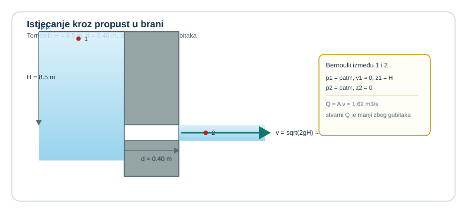

{width="95%"}

Kad brzina raste, tlak ili visina moraju to platiti.

U08Kontrolni volumen i kontinuitet zatvorio je bilancu mase i izbor kontrolnog volumena. U09Bernoullijeva jednadžba idealnog fluida dodaje energetsku sliku strujanja: u idealiziranom toku mehanička energija ne nestaje, nego se preraspodjeljuje između tlaka, brzine i geodetske visine.

Zato u Venturijevoj cijevi, slobodnom mlazu ili Pitotovoj sondi više nije dovoljno pitati samo koliki je protok. Jednako je važno vidjeti u kojem se obliku u promatranoj točki nalazi energija fluida.

Povijesni prijelaz od Torricellijeva tumačenja istjecanja do Bernoullijeve opće energetske slike može se čitati kao ista fizikalna nit. Torricelli, Galileijev učenik, pokazao je da brzina istjecanja raste s korijenom iz visine stupca iznad otvora, a Bernoulli je nekoliko desetljeća poslije tu fiziku zapisao kao opće pravilo preraspodjele tlaka, brzine i visine duž strujnice.

::: {.mf1-application}

Inženjerski kontekst

Idealni Bernoulli vidi se u Venturijevoj cijevi, Pitotovoj sondi, mlaznici za čišćenje, privremenom sifonu na gradilištu i svakom sklopu u kojem se tlak pretvara u brzinu ili obrnuto bez značajnih gubitaka. U autoindustriji, strojarstvu i brodogradnji ta logika stoji iza mjerenja protoka, tumačenja pada statičkog tlaka u suženju i čitanja energetske slike toka duž jedne strujnice.
:::

## Fizikalni uvod i matematički izvod

Bernoullijeva jednadžba u ovom poglavlju predstavlja bilancu mehaničke energije po jedinici težine u idealiziranom strujanju. Tri osnovna člana su:

1. tlačna visina $p/(\rho g)$.
2. brzinska visina $v^2/(2g)$.
3. geodetska visina $z$.

Najčešći zapis glasi

$$
\frac{p}{\rho g} + \frac{v^2}{2g} + z = \text{const.}
$$

Za dvije točke na istoj strujnici to prelazi u

$$
\frac{p_1}{\rho g} + \frac{v_1^2}{2g} + z_1 = \frac{p_2}{\rho g} + \frac{v_2^2}{2g} + z_2
$$

Ako jedan član raste, barem jedan od preostala dva mora pasti. Upravo je to fizikalna srž Venturija, Pitota, mlaza i sifona bez gubitaka.

Iz istih članova odmah proizlaze i dvije korisne linije čitanja toka. Hidraulička linija ili `HGL` jednaka je zbroju tlačne i geodetske visine,

$$
HGL = \frac{p}{\rho g} + z,
$$

dok energetska linija ili `EGL` sadrži i brzinski član,

$$
EGL = \frac{p}{\rho g} + \frac{v^2}{2g} + z.
$$

::: {.callout-note}
## 📐 Fizikalno značenje
`HGL` (hidraulička linija gradijenta) vizualizira gdje bi stigla voda kad bi se zaustavila bez gubitaka brzine — to je razina do koje bi porasla voda u piezometrima postavljenim uz cijev. `EGL` (energetska linija) je uvijek iznad `HGL` za iznos brzinske visine $v^2/(2g)$. U idealnom toku `EGL` je horizontalna (energija se čuva), dok `HGL` pada gdje fluid ubrzava i raste gdje usporava. Kad `HGL` padne ispod osi cijevi, statički tlak postaje negativan — to je preduvjet za kavitaciju.
:::

U idealnom toku `EGL` ostaje konstantna duž iste strujnice, a `HGL` je od nje niže upravo za brzinsku visinu $v^2/(2g)$. Zato su Venturijeva cijev i Pitotova sonda već u ovom poglavlju prirodni vizualni modeli preraspodjele energije.

Tu vrijedi zatvoriti i praktičnu pretvorbu jedinica. Tlak se često zadaje u paskalima ili kilopaskalima, a Bernoulli se vrlo često piše u metrima fluida. Zato treba stalno čitati dvije ekvivalentne slike iste stvari:

$$
\frac{p}{\gamma} = \frac{p}{\rho g}.
$$

Za vodu to znači da je približno $1\ \text{m}$ tlačne visine oko $9{,}81\ \text{kPa}$, odnosno da je $10\ \text{kPa}$ približno $1{,}02\ \text{m}$ vodenog stupca. Kad se u horizontalnom idealnom vodu brzina poveća, `EGL` ostaje ista, a `HGL` pada upravo za onoliko koliko se poveća brzinska visina. Zato pad statičkog tlaka od, primjerice, $\Delta p$ nije samo broj u kilopaskalima nego i pad `HGL` za $\Delta p/(\rho g)$ metara fluida.

Ista logika vrijedi i obrnuto: kad se u sifonu ili Pitotovoj sondi najprije dobije tlačna visina u metrima, apsolutni tlak vraća se množenjem s $\rho g$, a zatim se po potrebi pribraja ili oduzima atmosferski tlak ovisno radi li se s apsolutnim ili manometarskim tlakom.

Matematika ovdje nije ukras oko fizike, nego njezin sažeti jezik. Član $p/(\rho g)$ govori koliku bi visinu fluida dao tlak, član $v^2/(2g)$ koliki je udio energije vezan uz gibanje, a član $z$ koliko energije dolazi iz samoga položaja u gravitacijskom polju. Bernoullijeva jednadžba zato stalno prevodi jednu istu mehaničku energiju iz jednoga oblika u drugi.

::: {.mf1-izvod}

Matematički izvod

Promatra se element idealnoga fluida koji se giba duž strujnice s koordinatom $s$. Za stacionarno, nestlačivo i neviskozno strujanje projekcija jednadžbe količine gibanja na strujnicu daje Eulerov zapis

$$
\rho v\frac{dv}{ds} = -\frac{dp}{ds} - \rho g\frac{dz}{ds}.
$$

Nakon množenja s $ds/\rho$ slijedi

$$
v\,dv + \frac{dp}{\rho} + g\,dz = 0.
$$

::: {.callout-note}
## 📝 Razrada koraka
Korak: od Eulerove jednadžbe gibanja → Bernoullijeva jednadžba integriranjem

Eulerova jednadžba: $\rho v\frac{dv}{ds} = -\frac{dp}{ds} - \rho g\frac{dz}{ds}$.

Korak 1 – dijeli s $\rho$ i pomnoži s $ds$:
$$v\,dv + \frac{dp}{\rho} + g\,dz = 0.$$

Korak 2 – prepoznaj integrabilne oblike: $v\,dv = d(v^2/2)$, $dp/\rho = dp/\rho$ (za $\rho = \text{const.}$: $= d(p/\rho)$), $g\,dz = d(gz)$.

Korak 3 – integriraj od točke 1 do točke 2:
$$\frac{v_2^2 - v_1^2}{2} + \frac{p_2 - p_1}{\rho} + g(z_2 - z_1) = 0.$$

Korak 4 – presloži: premjesti sve s indeksom 2 na desno i s indeksom 1 na lijevo:
$$\frac{p_1}{\rho} + \frac{v_1^2}{2} + gz_1 = \frac{p_2}{\rho} + \frac{v_2^2}{2} + gz_2.$$

Korak 5 – podijeli s $g$ da dobiješ metre fluida: $\frac{p}{\rho g} + \frac{v^2}{2g} + z = \text{const.}$
:::

Integriranjem između točaka 1 i 2 dobiva se

$$
\int_{v_1}^{v_2} v\,dv + \int_{p_1}^{p_2} \frac{dp}{\rho} + g\int_{z_1}^{z_2} dz = 0.
$$

Za nestlačiv fluid gustoća je konstantna, pa integracija daje

$$
\frac{v_2^2-v_1^2}{2} + \frac{p_2-p_1}{\rho} + g(z_2-z_1) = 0,
$$

odnosno

$$
\frac{p_1}{\rho} + \frac{v_1^2}{2} + gz_1 = \frac{p_2}{\rho} + \frac{v_2^2}{2} + gz_2 = \text{const.}
$$

Dijeljenjem s $g$ nastaje klasični Bernoullijev oblik u metrima fluida:

$$
\frac{p}{\rho g} + \frac{v^2}{2g} + z = \text{const.}
$$

::: {.callout-note}
## 📐 Fizikalno značenje
Ova jednadžba kaže da mehanička energija po jedinici težine ostaje konstantna duž strujnice idealnog fluida — ona se samo premješta između tri oblika: tlačna visina (energija komprimiranja), brzinska visina (energija gibanja) i geodetska visina (položajna energija). Kad se cijev sužava i brzina raste, energija mora doći odnekud — dolazi od pada tlaka. Kad fluid ulazi u širi dio i uspori, ta kinetička energija vraća se u tlak. Bernoulli je zakon o preraspodjeli, a ne o stvaranju energije.
:::

Svaki član ima jasno fizikalno značenje: $p/(\rho g)$ je tlačna visina, tj. mehanička energija vezana uz tlak; $v^2/(2g)$ brzinska visina, odnosno energija gibanja po jedinici težine; a $z$ geodetska visina, tj. položajna energija po jedinici težine. Bernoullijeva jednadžba zato nije samo formula za račun, nego integralna izjava da se u idealnom toku mehanička energija ne gubi, nego se samo preraspodjeljuje između ta tri oblika.
:::

Odmah ispod izvoda treba zatvoriti i pretpostavke modela. U U09Bernoullijeva jednadžba idealnog fluida Bernoulli vrijedi samo kad su dovoljno dobro opravdane sljedeće pretpostavke:

- strujanje je stacionarno
- fluid se može uzeti nestlačivim
- viskozni gubici su zanemarivi
- između promatranih točaka nema strojnog rada ni druge vanjske mehaničke dobave energije
- dvije točke leže na istoj strujnici ili na aproksimaciji gdje je takva primjena dopuštena

To nije formalnost. Najčešći kvar u Bernoulliju nastaje onda kada se vide tlak i brzina pa se automatski zapisuje jednadžba, a da prije toga nije provjeren model.

Riješeni primjeri i zadaci za vježbu zato samo redom pokazuju kako isti Bernoullijev zapis čita pad statičkog tlaka u suženju, brzinu slobodnog mlaza, tlak u sifonu i Pitotovo lokalno mjerenje.

## Riješeni primjeri

::: {.mf1-we}

Riješeni primjer - Pad statičkog tlaka u konfuzoru ventilacijskog kanala T2

**Zadano**

Horizontalnom ventilacijskom kanalu smanjuje se poprečni presjek s $A_1 = 0{,}07\ \text{m}^2$ na $A_2 = 0{,}0185\ \text{m}^2$. Maseni protok zraka iznosi $\dot{m} = 0{,}68\ \text{kg/s}$, a gustoća zraka je $\rho = 1{,}2\ \text{kg/m}^3$. Zanemari gubitke strujanja i odredi pad statičkog tlaka $\Delta p$.

**Traženo**

1. Odrediti pad statičkog tlaka $\Delta p$ između presjeka 1 i 2.

**Pretpostavke i model**

Promatra se horizontalni kanal bez gubitaka. Zato najprije iz kontinuiteta treba odrediti brzine u oba presjeka, a zatim iz idealnog Bernoullija procijeniti koliki pad statičkog tlaka mora platiti to ubrzanje.

**Rješenje**

Najprije iz masenog protoka dobivamo volumenski protok:

$$
Q = \frac{\dot{m}}{\rho} = \frac{0{,}68}{1{,}2} = 0{,}5667\ \text{m}^3/\text{s}
$$

Iz toga slijede brzine u oba presjeka:

$$
v_1 = \frac{Q}{A_1} = \frac{0{,}5667}{0{,}07} \approx 8{,}10\ \text{m/s}
$$

$$
v_2 = \frac{Q}{A_2} = \frac{0{,}5667}{0{,}0185} \approx 30{,}63\ \text{m/s}
$$

Kako je kanal horizontalan, vrijedi $z_1 = z_2$. Za idealni model bez gubitaka Bernoulli daje:

$$
\frac{p_1}{\rho g} + \frac{v_1^2}{2g} = \frac{p_2}{\rho g} + \frac{v_2^2}{2g}
$$

odnosno

$$
p_1 - p_2 = \frac{\rho}{2}(v_2^2 - v_1^2)
$$

Uvrstavanjem brojeva dobiva se

$$
\Delta p = \frac{1{,}2}{2}(30{,}63^2 - 8{,}10^2) \approx 523\ \text{Pa}
$$

Dakle,

$$
\Delta p \approx 0{,}523\ \text{kPa}
$$

**Provjera i komentar**

1. Kako je $A_2 < A_1$, mora biti $v_2 > v_1$.
2. U idealnom konfuzoru porast brzine mora pratiti pad statičkog tlaka.
3. Ako je račun dao porast tlaka u užem presjeku, zamijenjene su točke ili predznak razlike.
:::

::: {.mf1-we}

Riješeni primjer - Domet slobodnog mlaza iz velikog spremnika T2

**Zadano**

Veliki otvoreni spremnik s vodom ima slobodnu površinu na visini

$$
H = 4{,}0\ \text{m}
$$

iznad tla. Na bočnoj stijenci može se otvoriti mala rupica na visini $h$ iznad tla. Zanemari gubitke i odredi za koje su položaje otvora najveći domet slobodnog mlaza:

$$
h = 1{,}0\ \text{m}, \qquad h = 2{,}0\ \text{m}, \qquad h = 3{,}0\ \text{m}
$$

**Traženo**

1. Izračunati domet mlaza za sva tri zadana položaja otvora.
2. Odrediti položaj otvora koji daje najveći domet.

**Pretpostavke i model**

Spremnik je dovoljno velik da je brzina na slobodnoj površini zanemariva, a i slobodna površina i otvor su na atmosferskom tlaku. Zato Bernoulli između slobodne površine i otvora prelazi u Torricellijev zapis za izlaznu brzinu. Nakon izlaza mlaz se dalje giba kao vodoravno izbačeno tijelo.

**Rješenje**

Iz Bernoullija između slobodne površine i otvora slijedi

$$
v_0 = \sqrt{2g(H-h)}
$$

Vrijeme pada mlaza s visine $h$ do tla glasi

$$
t = \sqrt{\frac{2h}{g}}
$$

pa je horizontalni domet

$$
x = v_0 t = \sqrt{2g(H-h)}\,\sqrt{\frac{2h}{g}} = 2\sqrt{h(H-h)}
$$

Sada izračunajmo domet za tri zadana položaja.

Za $h = 1{,}0\ \text{m}$:

$$
x = 2\sqrt{1{,}0(4{,}0 - 1{,}0)} = 2\sqrt{3} = 3{,}46\ \text{m}
$$

Za $h = 2{,}0\ \text{m}$:

$$
x = 2\sqrt{2{,}0(4{,}0 - 2{,}0)} = 2\sqrt{4} = 4{,}00\ \text{m}
$$

Za $h = 3{,}0\ \text{m}$:

$$
x = 2\sqrt{3{,}0(4{,}0 - 3{,}0)} = 2\sqrt{3} = 3{,}46\ \text{m}
$$

Vidimo da je domet najveći kad je otvor postavljen na polovicu ukupne visine stupca vode, odnosno za

$$
h = \frac{H}{2}
$$

Tada vrijedi i

$$
x_{max} = H
$$

pa je u ovom primjeru maksimalni domet jednak

$$
x_{max} = 4{,}0\ \text{m}
$$

**Provjera i komentar**

Slobodni mlaz ne dobiva najveći domet ni iz najviše ni iz najniže postavljenog otvora. Maksimum nastaje točno na polovici ukupne visine, gdje se najpovoljnije uravnoteže izlazna brzina i vrijeme leta.

1. Ako je otvor prenisko, vrijeme leta je kratko i domet pada iako je brzina velika.
2. Ako je otvor previsoko, vrijeme leta je dugo, ali izlazna brzina pada jer je visinska razlika do slobodne površine mala.
3. Položaji $h$ i $H-h$ daju isti domet jer se u izrazu pojavljuje njihov umnožak.
:::

::: {.mf1-we}

Riješeni primjer - Privremeni sifon za praznjenje servisnog bazena T2

**Zadano**

Servisni bazen treba se privremeno prazniti idealiziranim sifonom promjera $D = 80\ \text{mm}$. Razina vode u donjem ispustnom kanalu nalazi se $\Delta z = 3{,}6\ \text{m}$ ispod slobodne površine bazena. Najviša točka sifona `C` nalazi se $z_C = 2{,}2\ \text{m}$ iznad slobodne površine bazena.

Zanemari sve gubitke i uzmi da su oba spremnika velika i otvorena prema atmosferi.

**Traženo**

1. brzinu strujanja $v$ u sifonskoj cijevi.
2. volumenski protok $Q$.
3. tlačnu visinu $p_C/\gamma$ u najvišoj točki `C` i provjeri je li tlak sigurno iznad naponske visine isparavanja ako je atmosferska visina $10{,}2\ \text{m}$ vodenog stupca, a naponska visina pare $0{,}25\ \text{m}$ vodenog stupca.

**Pretpostavke i model**

Obje slobodne površine su na atmosferskom tlaku, brzine na njima su zanemarive, a u cijevi se promjer ne mijenja. Zato Bernoulli između slobodnih površina odmah daje idealnu brzinu sifona, a Bernoulli između slobodne površine bazena i vrha sifona daje tlačnu visinu u točki `C`.

**Rješenje**

Iz Bernoullija između slobodne površine bazena `A` i slobodne površine kanala `B` slijedi

$$
\frac{p_A}{\gamma} + \frac{v_A^2}{2g} + z_A = \frac{p_B}{\gamma} + \frac{v_B^2}{2g} + z_B
$$

Kako su $p_A = p_B = p_{atm}$ te su $v_A \approx v_B \approx 0$, ostaje

$$
z_A - z_B = \frac{v^2}{2g} = \Delta z
$$

pa je brzina u sifonskoj cijevi

$$
v = \sqrt{2g\Delta z} = \sqrt{2 \cdot 9{,}81 \cdot 3{,}6} = 8{,}40\ \text{m/s}
$$

Površina presjeka cijevi iznosi

$$
A = \frac{\pi D^2}{4} = \frac{\pi \cdot 0{,}08^2}{4} = 5{,}03 \cdot 10^{-3}\ \text{m}^2
$$

zato je volumenski protok

$$
Q = Av = 5{,}03 \cdot 10^{-3} \cdot 8{,}40 = 4{,}22 \cdot 10^{-2}\ \text{m}^3/\text{s}
$$

odnosno

$$
Q \approx 42{,}2\ \text{L/s}
$$

Sada zapišimo Bernoullija između slobodne površine bazena `A` i vrha sifona `C`. Uzmimo $z_A = 0$, pa je $z_C = 2{,}2\ \text{m}$:

$$
\frac{p_{atm}}{\gamma} = \frac{p_C}{\gamma} + \frac{v^2}{2g} + z_C
$$

Ako radimo s manometarskim tlakom u odnosu na atmosferu, to prelazi u

$$
0 = \frac{p_C}{\gamma} + 3{,}6 + 2{,}2
$$

pa je

$$
\frac{p_C}{\gamma} = -5{,}8\ \text{m}
$$

Drugim riječima, u vrhu sifona manometarska tlačna visina pada $5{,}8\ \text{m}$ ispod atmosferske referentne razine, pa je lokalna `HGL` ondje za isti iznos niža od slobodne površine bazena.

To znači da je apsolutna tlačna visina u točki `C`

$$
\left(\frac{p_C}{\gamma}\right)_{abs} = 10{,}2 - 5{,}8 = 4{,}4\ \text{m}
$$

Ako rezultat želimo vratiti u tlak, tada slijedi

$$
p_{C,man} = \rho g\left(\frac{p_C}{\gamma}\right) = 1000 \cdot 9{,}81 \cdot (-5{,}8) \approx -56{,}9\ \text{kPa}
$$

te apsolutni tlak

$$
p_{C,abs} = \rho g\left(\frac{p_C}{\gamma}\right)_{abs} = 1000 \cdot 9{,}81 \cdot 4{,}4 \approx 43{,}2\ \text{kPa}.
$$

Kako je naponska visina pare dana s

$$
\left(\frac{p_v}{\gamma}\right) = 0{,}25\ \text{m}
$$

slijedi da je tlak u vrhu sifona i dalje sigurno iznad granice isparavanja, s razlikom

$$
4{,}4 - 0{,}25 = 4{,}15\ \text{m}
$$

vodenog stupca.

**Provjera i komentar**

Idealni sifon daje brzinu od oko $8{,}4\ \text{m/s}$ i protok od oko $42\ \text{L/s}$. U vrhu sifona tlak pada na $-5{,}8\ \text{m}$ manometarske visine, ali je apsolutna tlačna visina još uvijek oko $4{,}4\ \text{m}$ vode, pa je u ovom idealiziranom scenariju tlak sigurno iznad naponske visine pare. Upravo taj tlak u vrhu pokazuje zašto je sifon prirodan prijelaz iz U09Bernoullijeva jednadžba idealnog fluida prema realnijem U10Realni Bernoulli i gubici.

1. Što je donja razina dublje ispod gornje, to idealna brzina sifona mora biti veća.
2. Tlak u vrhu sifona mora biti manji od atmosferskog jer se dio ukupne energije troši na visinu vrha i na brzinski član.
3. Ako bi izračun apsolutnog tlaka pao ispod naponske visine pare, čisti idealni model više ne bi bio dovoljan za fizikalno uvjerljiv odgovor.
:::

::: {.mf1-ch}

Cjeloviti zadatak - Idealni bypass-sifon sa suženjem u vrhu i mlaznim ispuštom T3

**Zadano**

Iz velikog otvorenog servisnog bazena voda se privremeno prebacuje idealiziranim bypass-sifonom preko pregrade. Glavni promjer sifonske cijevi je

$$
D = 100\ \text{mm}
$$

a u najvišoj točki `C` nalazi se kratko suženje promjera

$$
d_C = 80\ \text{mm}
$$

Slobodna površina bazena `A` nalazi se na visini

$$
4{,}2\ \text{m}
$$

iznad betonske podloge, izlaz `B` je vodoravan i nalazi se na visini

$$
1{,}4\ \text{m}
$$

iznad podloge, a najviša točka sifona `C` nalazi se

$$
z_C = 1{,}5\ \text{m}
$$

iznad slobodne površine bazena. Zanemari sve gubitke, uzmi da su tlak na slobodnoj površini i na izlazu atmosferski te da je brzina na slobodnoj površini zanemariva.

**Traženo**

1. brzinu strujanja $v_B$ u glavnoj cijevi na izlazu i volumenski protok $Q$.
2. brzinu $v_C$ u suženju pri vrhu sifona.
3. manometarsku i apsolutnu tlačnu visinu u točki `C`.
4. sigurnosnu razliku do naponske visine isparavanja ako je atmosferska visina $10{,}2\ \text{m}$ vodenog stupca, a naponska visina pare $0{,}25\ \text{m}$ vodenog stupca.
5. vodoravni domet mlaza nakon izlaza iz točke `B`.

**Pretpostavke i model**

Ovdje isti idealni tok treba čitati u tri različita reza. Bernoulli između slobodne površine `A` i izlaza `B` daje glavnu izlaznu brzinu. Kontinuitet zatim iz te iste vrijednosti vraća veću brzinu u suženju `C`, a Bernoulli između `A` i `C` pokazuje koliko pritom mora pasti statički tlak. Nakon izlaza iz `B` mlaz više ne pripada unutarnjem strujanju cijevi nego gibanju vodoravno izbačenog tijela.

**Rješenje**

Najprije iz geometrije sustava slijedi visinska razlika između slobodne površine i izlaza:

$$
\Delta z_{AB} = 4{,}2 - 1{,}4 = 2{,}8\ \text{m}
$$

Bernoulli između slobodne površine `A` i izlaza `B` daje

$$
\frac{p_A}{\gamma} + \frac{v_A^2}{2g} + z_A = \frac{p_B}{\gamma} + \frac{v_B^2}{2g} + z_B
$$

Kako su $p_A = p_B = p_{atm}$ i $v_A \approx 0$, ostaje

$$
v_B = \sqrt{2g\Delta z_{AB}} = \sqrt{2 \cdot 9{,}81 \cdot 2{,}8} = 7{,}41\ \text{m/s}
$$

Površina glavne cijevi iznosi

$$
A = \frac{\pi D^2}{4} = \frac{\pi \cdot 0{,}10^2}{4} = 7{,}854 \cdot 10^{-3}\ \text{m}^2
$$

pa je volumenski protok

$$
Q = Av_B = 7{,}854 \cdot 10^{-3} \cdot 7{,}41 = 5{,}82 \cdot 10^{-2}\ \text{m}^3/\text{s}
$$

odnosno

$$
Q \approx 58{,}2\ \text{L/s}
$$

Površina suženja pri vrhu sifona je

$$
A_C = \frac{\pi d_C^2}{4} = \frac{\pi \cdot 0{,}08^2}{4} = 5{,}027 \cdot 10^{-3}\ \text{m}^2
$$

pa iz kontinuiteta slijedi

$$
v_C = \frac{Q}{A_C} = \frac{5{,}82 \cdot 10^{-2}}{5{,}027 \cdot 10^{-3}} = 11{,}58\ \text{m/s}
$$

Sada pišemo Bernoullija između slobodne površine `A` i točke `C`. Uzmemo li manometarski tlak u odnosu na atmosferu, vrijedi

$$
0 = \frac{p_C}{\gamma} + \frac{v_C^2}{2g} + z_C
$$

odnosno

$$
\frac{p_C}{\gamma} = -\left(\frac{11{,}58^2}{2 \cdot 9{,}81} + 1{,}5\right) = -(6{,}84 + 1{,}5)
$$

pa je manometarska tlačna visina u vrhu sifona

$$
\frac{p_C}{\gamma} = -8{,}34\ \text{m}
$$

Apsolutna tlačna visina u točki `C` zato iznosi

$$
\left(\frac{p_C}{\gamma}\right)_{abs} = 10{,}2 - 8{,}34 = 1{,}86\ \text{m}
$$

Sigurnosna razlika do naponske visine isparavanja tada je

$$
1{,}86 - 0{,}25 = 1{,}61\ \text{m}
$$

pa je i u ovom idealnom režimu tlak u suženju još iznad granice isparavanja.

Nakon izlaza iz točke `B` mlaz se giba kao vodoravno izbačeno tijelo s početnom visinom

$$
h_B = 1{,}4\ \text{m}
$$

Vrijeme pada do podloge iznosi

$$
t = \sqrt{\frac{2h_B}{g}} = \sqrt{\frac{2 \cdot 1{,}4}{9{,}81}} = 0{,}534\ \text{s}
$$

pa je vodoravni domet mlaza

$$
x = v_B t = 7{,}41 \cdot 0{,}534 = 3{,}96\ \text{m}
$$

**Provjera i komentar**

Ovaj `CH` zatvara puni idealni luk U09Bernoullijeva jednadžba idealnog fluida u jednom sustavu: Bernoulli između slobodne površine i izlaza daje brzinu oko $7{,}41\ \text{m/s}$ i protok oko $58{,}2\ \text{L/s}$, kontinuitet povećava brzinu u suženju vrha na oko $11{,}58\ \text{m/s}$, a tlak u točki `C` pada na oko $-8{,}34\ \text{m}$ manometarske visine. Ipak, apsolutna tlačna visina ostaje oko $1{,}86\ \text{m}$ vode, što je još oko $1{,}61\ \text{m}$ iznad naponske visine pare. Nakon izlaza mlaz doseze vodoravni domet od oko $3{,}96\ \text{m}$.

1. U suženju mora biti $v_C > v_B$ jer isti protok prolazi kroz manji presjek.
2. Tlak u vrhu sifona mora biti manji od atmosferskog, a u suženju pada još više zbog veće brzine.
3. Ako se pri računu dometa koristi $v_C$ umjesto izlazne brzine $v_B$, pomiješani su unutarnji presjek sifona i stvarni izlazni mlaz.
:::

U U09Bernoullijeva jednadžba idealnog fluida još ne treba crtati komplicirane energetske sheme, ali treba razumjeti osnovnu logiku: `EGL` prati ukupnu mehaničku energiju po jedinici težine, `HGL` zbroj tlačne i geodetske visine, a u idealnom toku `EGL` ostaje vodoravna dok se `HGL` spušta kad raste brzinski član. Upravo to u Venturiju i Pitotu odmah vizualizira što je plaćeno tlakom, a što dobiveno u brzini.

::: {.mf1-we}

Riješeni primjer – Venturijeva cijev za mjerenje protoka ulja &nbsp;T2

🔩 **Primjer za strojare**

**Kontekst:** U industrijskom maznom sustavu Venturijeva cijev mjeri protok ulja. Diferencijalnim manometrom (živa u U-cijevi) mjeri se razlika tlakova između ulaza i grla. Iz te razlike se računa protok.

**Zadano**

- Promjer ulaza: $D_1 = 60\ \text{mm}$
- Promjer grla: $D_2 = 30\ \text{mm}$
- Razlika očitanja diferencialnog manometra: $\Delta h_m = 0{,}18\ \text{m}$ žive ($\rho_{Hg} = 13600\ \text{kg/m}^3$)
- Gustoća ulja: $\rho_{ul} = 870\ \text{kg/m}^3$
- Cijev je horizontalna; zanemari gubitke

**Traženo**

Volumenski protok ulja $Q$.

{width="60%"}

**Rješenje**

Razlika tlakova između presjeka 1 i 2 iz diferencialnog manometra:
$$
\Delta p = (\rho_{Hg} - \rho_{ul})\,g\,\Delta h_m = (13600 - 870) \cdot 9{,}81 \cdot 0{,}18 = 22{,}74\ \text{kPa}
$$

Za horizontalnu cijevi ($z_1 = z_2$) iz Bernoullija:
$$
\Delta p = \frac{\rho_{ul}}{2}(v_2^2 - v_1^2)
$$

Iz kontinuiteta: $v_2 = v_1(A_1/A_2) = v_1(D_1/D_2)^2 = 4 v_1$

$$
\Delta p = \frac{\rho_{ul}}{2}(16 v_1^2 - v_1^2) = \frac{15\rho_{ul}}{2} v_1^2
$$

$$
v_1 = \sqrt{\frac{2\Delta p}{15\rho_{ul}}} = \sqrt{\frac{2 \cdot 22740}{15 \cdot 870}} = \sqrt{3{,}481} = 1{,}866\ \text{m/s}
$$

$$
Q = A_1 v_1 = \frac{\pi \cdot 0{,}060^2}{4} \cdot 1{,}866 = 2{,}827 \cdot 10^{-3} \cdot 1{,}866 = 5{,}27\ \text{L/s}
$$

**Provjera i komentar**

Brzina u grlu: $v_2 = 4 \cdot 1{,}866 = 7{,}46\ \text{m/s}$ — to je razumno za ulje u mjernoj cijevi. `HGL` u grlu je za $\Delta p/(\rho g) = 2{,}669\ \text{m}$ niže od `HGL` na ulazu, što direktno prikazuje manometarsko mjerenje. Kavitacija nije opasnost pri ovakvim brzinama ulja i pritisnim razinama industrijskog sustava.

:::

::: {.mf1-we}

Riješeni primjer – Brzina istjecanja kroz propust u brani &nbsp;T2

🏗️ **Primjer za građevinare**

**Kontekst:** U dnu male brane nalazi se cijevni propust promjera $d = 0{,}40\ \text{m}$ koji prazni rezervoar. Projektant procjenjuje protok pri maksimalnoj razini (Torricelli — idealni model).

**Zadano**

- Razina vode u rezervoaru: $H = 8{,}50\ \text{m}$ iznad osi propusta
- Promjer propusta: $d = 0{,}40\ \text{m}$
- Zanemari gubitke (idealni model)
- Atmosferski tlak na obje strane

**Traženo**

1. Izlazna brzina vode $v$.
2. Volumenski protok $Q$.

{width="45%"}

**Rješenje**

Bernoulli između slobodne površine (točka 1: $v_1 \approx 0$, $p_1 = p_{atm}$, $z_1 = H$) i izlaza iz propusta (točka 2: $p_2 = p_{atm}$, $z_2 = 0$):

$$
\frac{p_{atm}}{\rho g} + 0 + H = \frac{p_{atm}}{\rho g} + \frac{v^2}{2g} + 0
$$

$$
v = \sqrt{2gH} = \sqrt{2 \cdot 9{,}81 \cdot 8{,}50} = \sqrt{166{,}77} = 12{,}91\ \text{m/s}
$$

$$
Q = A\cdot v = \frac{\pi \cdot 0{,}40^2}{4} \cdot 12{,}91 = 0{,}1257 \cdot 12{,}91 = 1{,}622\ \text{m}^3/\text{s}
$$

**Provjera i komentar**

Stvarni protok bit će manji zbog gubitaka na ulazu i trenju u propustu — tipično se uvodi koeficijent isticanja $C_d \approx 0{,}6$–$0{,}8$. Za $C_d = 0{,}70$: $Q_{stvarni} \approx 1{,}14\ \text{m}^3/\text{s}$. Idealni Bernoulli daje gornju granicu — uvijek konzervativnu procjenu za projektanta koji dimenzionira kapacitet propusta.

:::

## Usporedna tablica: strojarstvo i građevinarstvo

| Koncept | Strojarstvo – gdje se pojavljuje | Građevinarstvo – gdje se pojavljuje |
|---------|----------------------------------|--------------------------------------|
| Bernoulli: $p + \rho v^2/2 + \rho gz = \text{const.}$ | Pitotova sonda, Venturijeva cijev, mlaznica za čišćenje, sapnica gorionika | Istjecanje kroz propust, brzina u suženju kanala, sifon za prelijevanje |
| Torricellijev zakon $v = \sqrt{2gH}$ | Isticanje iz rezervoara maznog ulja; kalibracijska otvorna mlaznica | Isticanje kroz drenažni otvor brane; brzina prekomjerne vode kroz preljevni otvor |
| `HGL` i `EGL` linije | Vizualizacija pada tlaka u cjevovodima procesne opreme; provjera kavitacijskih uvjeta na usisnom vodu pumpe | Crtanje energetske linije gravitacijskog kanala i propusta; provjera negativnog tlaka u sifonu |
| Venturijev princip | Karubiratori, mješalice, ejektori, Venturijevi mjerači protoka | Venturijeva preljevna grla u hidrauličkim laboratorijima; mjerni presjeci u kanalima |
| Kavitacijski rizik ($p < p_{para}$) | Pad tlaka u grlu pumpe ili Venturija → mjehurići pare → kavitacija | Negativni tlak u vrhu sifona → kavitacijski limit visine sifona (~10 m pri atmosferskom tlaku) |

## Zadaci za vježbu

::: {.mf1-vjezbe-list}
1. **T1** Veliki otvoreni spremnik sadrži vodu do visine $H = 3{,}20\ \text{m}$ iznad osi male bočne sapnice promjera $d = 26\ \text{mm}$. Zanemari gubitke i odredi izlaznu brzinu mlaza, volumenski protok i maseni protok vode.

	**Natuknica:** između slobodne površine i izlaza vrijedi Torricelli: $v = \sqrt{2gH}$; nakon toga $Q = Av$ i $\dot m = \rho Q$.

	**Skica:** da - veliki spremnik, slobodna površina, izlazna sapnica i geodetska visina $H$.

2. **T1** Horizontalnim ventilacijskim kanalom smanjuje se presjek s $A_1 = 0{,}060\ \text{m}^2$ na $A_2 = 0{,}020\ \text{m}^2$. Volumenski protok zraka iznosi $Q = 0{,}42\ \text{m}^3/\text{s}$, a gustoća zraka je $\rho = 1{,}20\ \text{kg/m}^3$. Odredi pad statičkog tlaka.

	**Natuknica:** iz kontinuiteta dobij $v_1$ i $v_2$, a za horizontalni kanal bez gubitaka vrijedi $p_1 + \rho v_1^2/2 = p_2 + \rho v_2^2/2$.

	**Skica:** da - horizontalni konfuzor s dva presjeka, brzinama i tlakovima.

3. **T2** Idealna Venturijeva cijev za vodu ima ulazni promjer $D_1 = 120\ \text{mm}$ i promjer grla $D_2 = 70\ \text{mm}$. Razlika statičkih tlakova između ulaza i grla iznosi $\Delta p = 24\ \text{kPa}$. Odredi brzinu u grlu i volumenski protok kroz Venturi.

	**Natuknica:** spoji kontinuitet $A_1 v_1 = A_2 v_2$ s Bernoullijem između ulaza i grla, pa riješi dvije nepoznate brzine.

	**Skica:** da - Venturi s ulazom, grlom i označenom razlikom tlakova $\Delta p$.

4. **T2** Pitotova cijev uronjena je u vodeni tok. Razlika između stagnacijskog i statičkog tlaka iznosi $\Delta p = 8{,}5\ \text{kPa}$. Odredi lokalnu brzinu strujanja.

	**Natuknica:** u Pitotu vrijedi $\Delta p = \rho v^2/2$, pa brzina slijedi iz $v = \sqrt{2\Delta p/\rho}$.

	**Skica:** da - strujna cijev s Pitot otvorom, stagnacijska i statička točka.

5. **T3** Idealni sifon prazni otvoreni spremnik. Razlika razina između slobodne površine u spremniku i izlaza sifona iznosi $\Delta z = 2{,}8\ \text{m}$, a vrh sifona nalazi se $1{,}1\ \text{m}$ iznad slobodne površine. Odredi brzinu strujanja u sifonu i apsolutni tlak u vrhu sifona ako je atmosferski tlak $p_{atm} = 101\ \text{kPa}$.

	**Natuknica:** brzinu dobij iz Bernoullija između slobodne površine i izlaza, a tlak u vrhu iz Bernoullija između slobodne površine i vrha sifona.

	**Skica:** da - spremnik, sifonska cijev, vrh sifona, izlaz i visinske kote.

6. **T3** Idealni sifon promjera $D = 70\ \text{mm}$ prazni otvoreni spremnik tako da je izlaz vodoravan i nalazi se $\Delta z = 2{,}6\ \text{m}$ ispod slobodne površine. Vrh sifona je $z_C = 1{,}7\ \text{m}$ iznad slobodne površine, a izlaz se nalazi $1{,}2\ \text{m}$ iznad tla. Zanemari gubitke i odredi brzinu i volumenski protok u sifonu, apsolutni tlak u vrhu sifona te vodoravni domet mlaza nakon izlaza ako je $p_{atm} = 101{,}3\ \text{kPa}$.

	**Natuknica:** Bernoullijem između slobodne površine i izlaza vrati $v$, između slobodne površine i vrha sifona vrati tlak, a domet mlaza zatvori kao vodoravno izbačeno tijelo s visine $1{,}2\ \text{m}$.

	**Skica:** da - spremnik, sifonska cijev s vrhom $C$, vodoravni izlaz i domet mlaza do tla.
:::

::: {.mf1-zavrsni-okvir}

Za ponijeti iz poglavlja

**Sažeta provjera prije računa**

- Jesu li dvije točke odabrane fizikalno smisleno?
- Vrijedi li idealni model ili je zadatak već ušao u gubitke i realni Bernoulli?
- Prije Bernoullija treba zatvoriti kontinuitet ako se mijenja presjek.
- Treba provjeriti koriste li se tlak, brzina i visina u istom sustavu jedinica.
- Treba znati koji član mora pasti ako drugi raste.

**Najčešća pogreška**

Najčešća greška u U09Bernoullijeva jednadžba idealnog fluida nije algebra nego mehaničko prepisivanje Bernoullija bez provjere pretpostavki. Drugi klasični kvar je zaboraviti da porast brzine u pravilu ne donosi novu energiju, nego je plaćen padom tlaka ili visine.

**Nakon ovoga poglavlja mora biti moguće**

1. provjeriti jesu li uvjeti idealnog modela stvarno zatvoreni.
2. čitati tlak, brzinu i visinu kao tri oblika iste mehaničke energije.
3. spojiti kontinuitet i Bernoulli u jednostavnom problemu promjene presjeka.
4. prepoznati kada zadatak više ne pripada idealnom nego realnom modelu.

**U tehnici to znači**

Venturijeve cijevi, Pitotove sonde i mlaznice rade upravo zato što se ista mehanička energija može očitati kao tlak, brzina ili visina. U praksi taj prijelaz omogućuje mjerenje protoka, procjenu brzine strujanja i projektiranje mlaznih sustava za pranje, hlađenje ili raspršivanje.

**Granica modela**

Idealni Bernoulli prestaje biti dovoljan čim trenje, vrtloženje, lokalni otpori ili rizik kavitacije počnu mjerljivo trošiti energiju. Tada isti problem više ne završava u ovom poglavlju, nego traži realni Bernoulli i gubitke iz U10Realni Bernoulli i gubici.

U09Bernoullijeva jednadžba idealnog fluida zatvara idealnu energetsku sliku strujanja: brzina ne raste niotkuda, nego na račun tlaka ili geodetske visine. Kad se to ovdje učvrsti, prijelaz prema U10Realni Bernoulli i gubici, gdje se toj slici prvi put dodaju stvarni gubici, postaje prirodan.
:::

