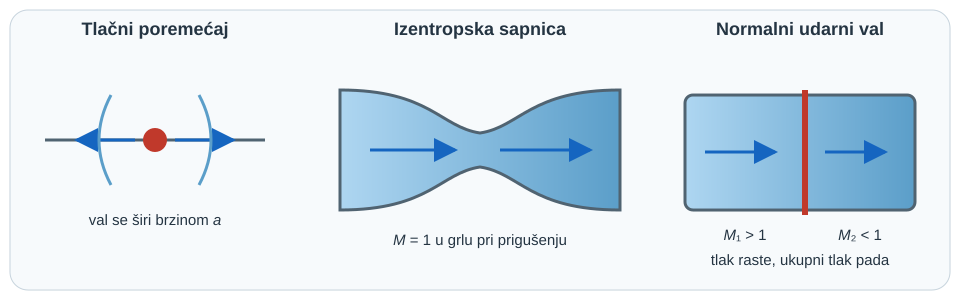

{#fig-kompresibilni-pregled fig-align="center" fig-alt="Kompresibilni tok povezuje širenje tlačnog vala, prigušenje u sapnici i skok veličina kroz udarni val."}

## Zašto gustoća više ne može ostati konstanta {#sec-kompresibilni-motivacija}

U sporom toku kapljevine promjena tlaka gotovo ne mijenja gustoću, pa je model konstantne gustoće izvrstan. Kod plina pri velikoj brzini ili velikoj promjeni tlaka isti korak više nije dopušten: dio energije toka pohranjuje se u stlačivanje i zagrijavanje plina. Tada uz masu, količinu gibanja i energiju treba pratiti i vezu između tlaka, gustoće i temperature [@anderson2021].

::: {.mf1-application}

Inženjerski kontekst

Kompresibilnost određuje odziv pneumatskog aktuatora, protok kroz sigurnosni ventil, rad mlaznice plinske turbine, ventilaciju tunela i širenje tlačnog vala kroz plinovod. U brodogradnji se pojavljuje u dovodu zraka motoru, ispušnom sustavu, podvodnoj akustici i kavitacijskim impulsima. Cilj poglavlja nije potpuna plinska dinamika, nego pouzdano prepoznati kada nestlačivi model prestaje vrijediti i postaviti temeljni jednodimenzijski račun.
:::

::: {.mf1-priprema}

Prije čitanja poglavlja

**Predznanje:** bilance mase i energije, idealni plin, specifični toplinski kapaciteti i osnovni diferencijalni račun.

**Ishodi učenja:**

- izvesti i protumačiti brzinu zvuka te Machov broj;
- odlučiti kada je prihvatljiv model konstantne gustoće;
- povezati statičke i stagnacijske veličine u izentropskom toku idealnog plina;
- objasniti prigušenje protoka u sapnici;
- postaviti bilance mase, količine gibanja i energije preko normalnoga udarnog vala.

**Procijenjeno vrijeme rada uz udžbenik:** 9 sati.
:::

## Brzina zvuka: mali poremećaj, konačno vrijeme {#sec-brzina-zvuka}

Promatra se vrlo malen tlačni poremećaj koji se kroz fluid širi bez značajne izmjene topline s okolinom. Za takav brzi, gotovo reverzibilni poremećaj vrijedi lokalna izentropska veza

$$
a^2=\left(\frac{\partial p}{\partial \rho}\right)_s,
$$ {#eq-brzina-zvuka-opca}

gdje je $a$ brzina zvuka, a indeks $s$ označuje konstantnu entropiju. Jednadžba kaže da je brzina vala veća što fluid jače poraste u tlaku pri malom povećanju gustoće.

Za idealni plin, $p=\rho RT$ i $p/\rho^\gamma=\text{konst.}$ duž izentrope. Diferenciranjem slijedi

$$
\frac{dp}{d\rho}=\gamma\frac{p}{\rho}=\gamma RT,
$$ {#eq-kompresibilni-tok-brzina-zvuka-mali-poremecaj-konacno-vrijeme-sec-01}

pa je

$$
a=\sqrt{\gamma RT}.
$$ {#eq-brzina-zvuka-plin}

Za kapljevinu se često koristi $a=\sqrt{K/\rho}$, gdje je $K$ izentropski modul stlačivosti. Stijenka elastične cijevi dodatno smanjuje brzinu tlačnog vala; zato se vodeni udar ne smije računati samo svojstvima vode kada je deformacija cijevi važna.

::: {.mf1-granica-modela}

Granica modela

Pascalov zakon opisuje novu statičku ravnotežu nestlačivog modela; ne tvrdi da stvarni poremećaj putuje beskonačnom brzinom. Informacija o promjeni tlaka u stvarnom fluidu putuje konačnom brzinom $a$.
:::

::: {#ex-akusticko-vrijeme .mf1-we}

Riješeni primjer — Vrijeme odziva pneumatskog voda T1

Zrak pri $T=293\ \text{K}$ nalazi se u vodu duljine $L=85\ \text{m}$. Za $\gamma=1{,}4$ i $R=287\ \text{J/(kg K)}$ procijeni najkraće vrijeme u kojem promjena ventila može biti opažena na drugom kraju.

$$
a=\sqrt{1{,}4\cdot287\cdot293}=343\ \text{m/s},\qquad
t_a=\frac{L}{a}=0{,}248\ \text{s}.
$$ {#eq-kompresibilni-tok-rijeseni-primjer-vrijeme-odziva-pneumatskog-voda-01}

**Provjera:** jedinica $L/a$ jest sekunda. Stvarni odziv tlaka i protoka obično je sporiji zbog refleksija, trenja, spremnika i dinamike ventila; $0{,}248\ \text{s}$ samo je kauzalna donja granica.
:::

## Machov broj i kriterij nestlačivosti {#sec-machov-broj}

Machov broj uspoređuje brzinu toka i brzinu širenja malog tlačnog poremećaja:

$$
Ma=\frac{v}{a}.
$$ {#eq-mach}

Kriterij $Ma<0{,}3$ korisna je inženjerska heuristika, a ne univerzalni zakon. U izentropskom toku idealnog plina relativna promjena gustoće obično je tada nekoliko posto ili manja. I pri malom Machovu broju gustoća može snažno varirati zbog grijanja, kemijske reakcije ili velike hidrostatičke razlike; kriterij se zato uvijek provjerava zajedno s termodinamičkim uvjetima.

::: {#ex-odabir-modela-kompresibilnosti .mf1-we}

Riješeni primjer — Dovod zraka baterijskom kompresoru T2

Zrak pri $20\ ^\circ\text{C}$ teče kroz vod promjera $D=80\ \text{mm}$ protokom $Q=0{,}42\ \text{m}^3/\text{s}$. Površina je $A=\pi D^2/4=5{,}027\cdot10^{-3}\ \text{m}^2$, pa je

$$
v=\frac{Q}{A}=83{,}6\ \text{m/s},\qquad Ma=\frac{83{,}6}{343}=0{,}244.
$$ {#eq-kompresibilni-tok-rijeseni-primjer-dovod-zraka-baterijskom-kompres-01}

Model konstantne gustoće može biti početna procjena ako su zagrijavanje i pad tlaka mali. Poveća li se protok za 30 %, dobiva se $Ma=0{,}317$ i potreban je kompresibilni račun.

**Provjera:** zaključak se temelji na lokalnom maksimumu brzine, ne samo na srednjoj brzini u najvećem presjeku.
:::

## Stagnacijske veličine u izentropskom toku {#sec-stagnacijske-velicine}

Za stacionarni, adijabatski tok idealnog plina bez rada vratila i zanemarive promjene potencijalne energije energijska jednadžba po jedinici mase glasi

$$
h+\frac{v^2}{2}=h_0=\text{konst.}
$$ {#eq-kompresibilni-tok-stagnacijske-velicine-u-izentropskom-toku-sec-st-01}

Za kalorijski idealan plin $h=c_pT$, pa slijedi

$$
T_0=T+\frac{v^2}{2c_p}.
$$ {#eq-kompresibilni-tok-stagnacijske-velicine-u-izentropskom-toku-sec-st-02}

Stagnacijska temperatura $T_0$ jest temperatura koju bi tok dosegnuo kad bi se adijabatski usporio do mirovanja. Uvrštavanjem $a^2=\gamma RT$ i $c_p=\gamma R/(\gamma-1)$ dobiva se

$$
\frac{T_0}{T}=1+\frac{\gamma-1}{2}Ma^2.
$$ {#eq-t0-t}

Ako je usporavanje i reverzibilno, iz izentropskih relacija slijede

$$
\frac{p_0}{p}=\left(1+\frac{\gamma-1}{2}Ma^2\right)^{\gamma/(\gamma-1)},
\qquad
\frac{\rho_0}{\rho}=\left(1+\frac{\gamma-1}{2}Ma^2\right)^{1/(\gamma-1)}.
$$ {#eq-stagnacijski-omjeri}

Ukupna temperatura ostaje konstantna i kroz adijabatski udarni val, ali ukupni tlak pada jer je udarni val ireverzibilan.

::: {#ex-stagnacijski-zrak .mf1-we}

Riješeni primjer — Pitotova sonda u brzom strujanju zraka T2

Za $T=260\ \text{K}$, $p=55\ \text{kPa}$ i $Ma=0{,}80$ uz $\gamma=1{,}4$:

$$
\frac{T_0}{T}=1+0{,}2(0{,}8)^2=1{,}128,
\qquad T_0=293{,}3\ \text{K},
$$ {#eq-kompresibilni-tok-rijeseni-primjer-pitotova-sonda-u-brzom-strujanj-01}

$$
\frac{p_0}{p}=1{,}128^{3{,}5}=1{,}524,
\qquad p_0=83{,}8\ \text{kPa}.
$$ {#eq-kompresibilni-tok-rijeseni-primjer-pitotova-sonda-u-brzom-strujanj-02}

Nestlačivi izraz $p_0-p=\rho v^2/2$ više nije zadani model. **Granična provjera:** kada $Ma\to0$, binomni razvoj kompresibilne relacije vraća nestlačivu dinamičku tlačnu skalu.
:::

## Sapnica i prigušenje protoka {#sec-sapnica-prigusenje}

Za stacionarni kvazijednodimenzijski tok vrijedi $\rho Av=\text{konst.}$, pa diferenciranjem

$$
\frac{d\rho}{\rho}+\frac{dA}{A}+\frac{dv}{v}=0.
$$ {#eq-kompresibilni-tok-sapnica-i-prigusenje-protoka-sec-sapnica-priguse-01}

Iz Eulerove jednadžbe bez trenja $dp+\rho v\,dv=0$ i definicije $a^2=dp/d\rho$ slijedi $d\rho/\rho=-Ma^2,dv/v$. Uvrštavanjem u kontinuitet dobiva se ključna relacija

$$
\boxed{\frac{dA}{A}=(Ma^2-1)\frac{dv}{v}}.
$$ {#eq-area-brzina}

Za podzvučni tok ubrzavanje zahtijeva suženje; za nadzvučni tok ubrzavanje zahtijeva širenje. U grlu pri $Ma=1$ promjena površine je nula. Kada je omjer izlaznog i spremničkog tlaka dovoljno malen, maseni protok dostiže maksimum i daljnje snižavanje nizvodnog tlaka više ga ne povećava: tok je **prigušen**.

Za idealni plin iz velikog spremnika kroz minimalnu površinu $A^*$ najveći maseni protok iznosi

$$
\dot m_{max}=A^*\frac{p_0}{\sqrt{T_0}}
\sqrt{\frac{\gamma}{R}}
\left(\frac{2}{\gamma+1}\right)^{\frac{\gamma+1}{2(\gamma-1)}}.
$$ {#eq-priguseni-protok}

::: {#ex-priguseni-ventil .mf1-we}

Riješeni primjer — Gornja granica protoka sigurnosnog otvora T3

Spremnik zraka ima $p_0=600\ \text{kPa(abs)}$ i $T_0=300\ \text{K}$. Idealizirani otvor ima $A^*=50\ \text{mm}^2$. Za $\gamma=1{,}4$ i $R=287\ \text{J/(kg K)}$:

$$
\dot m_{max}=50\cdot10^{-6}\frac{600000}{\sqrt{300}}
\sqrt{\frac{1{,}4}{287}}\left(\frac{2}{2{,}4}\right)^3
=0{,}0700\ \text{kg/s}.
$$ {#eq-kompresibilni-tok-rijeseni-primjer-gornja-granica-protoka-sigurnos-01}

Kritični omjer tlaka je

$$
\frac{p^*}{p_0}=\left(\frac{2}{\gamma+1}\right)^{\gamma/(\gamma-1)}=0{,}528.
$$ {#eq-kompresibilni-tok-rijeseni-primjer-gornja-granica-protoka-sigurnos-02}

Stoga je idealni tok prigušen ako je nizvodni tlak ispod približno $317\ \text{kPa(abs)}$. **Granica modela:** stvarni ventil zahtijeva koeficijent istjecanja, stvarnu efektivnu površinu i normirani proračun kapaciteta; dobivena vrijednost nije sigurnosna certifikacija.
:::

## Normalni udarni val: Hugoniotov uvjet {#sec-normalni-udarni-val}

Udarni val je vrlo tanak ireverzibilni prijelaz. Za stacionarni normalni val u adijabatskom kanalu konstantne površine bilance su

$$
\rho_1v_1=\rho_2v_2,
$$ {#eq-kompresibilni-tok-normalni-udarni-val-hugoniotov-uvjet-sec-normaln-01}

$$
p_1+\rho_1v_1^2=p_2+\rho_2v_2^2,
$$ {#eq-kompresibilni-tok-normalni-udarni-val-hugoniotov-uvjet-sec-normaln-02}

$$
h_1+\frac{v_1^2}{2}=h_2+\frac{v_2^2}{2}.
$$ {#eq-kompresibilni-tok-normalni-udarni-val-hugoniotov-uvjet-sec-normaln-03}

Eliminacija brzina daje Hugoniotovu relaciju između termodinamičkih stanja. Za kalorijski idealan plin praktični omjeri glase

$$
M_2^2=\frac{1+\tfrac{\gamma-1}{2}M_1^2}{\gamma M_1^2-\tfrac{\gamma-1}{2}},
\qquad
\frac{p_2}{p_1}=1+\frac{2\gamma}{\gamma+1}(M_1^2-1).
$$ {#eq-normalni-skok}

Fizički dopušten adijabatski udarni val povećava entropiju: nadzvučni ulaz postaje podzvučni, statički tlak i temperatura rastu, a ukupni tlak pada.

::: {#ex-normalni-udar .mf1-we}

Riješeni primjer — Udarni val u ispitnoj sapnici T3

Za zrak s $M_1=2{,}0$ i $\gamma=1{,}4$:

$$
M_2=\sqrt{\frac{1+0{,}2\cdot4}{1{,}4\cdot4-0{,}2}}=0{,}577,
$$ {#eq-kompresibilni-tok-rijeseni-primjer-udarni-val-u-ispitnoj-sapnici-01}

$$
\frac{p_2}{p_1}=1+\frac{2\cdot1{,}4}{2{,}4}(4-1)=4{,}50.
$$ {#eq-kompresibilni-tok-rijeseni-primjer-udarni-val-u-ispitnoj-sapnici-02}

**Provjera:** $M_2<1$ i $p_2>p_1$, što odgovara fizičkom smjeru. Obrnuti prijelaz bez vanjskog rada ili odvođenja topline smanjio bi entropiju i nije dopušten.
:::

## Radni ritual za kompresibilni problem {#sec-kompresibilni-ritual}

1. Odredi apsolutne tlakove i temperaturno stanje.
2. Procijeni lokalni najveći $Ma$, ne samo ulaznu srednju vrijednost.
3. Odluči je li proces približno izentropski, adijabatski s gubitcima ili s izmjenom topline.
4. Napiši kontinuitet, energiju i jednadžbu stanja; količinu gibanja dodaj kad postoji sila ili udarni val.
5. Provjeri prigušenje, smjer porasta entropije i granični slučaj $Ma\to0$.

::: {.mf1-samoprovjera}

Provjeri sebe

1. Zašto Pascalov zakon ne znači trenutačan prijenos poremećaja?
2. Može li tok s $Ma=0{,}1$ ipak imati važnu promjenu gustoće? Navedi mehanizam.
3. Zašto se nadzvučni tok ubrzava u divergentnom dijelu sapnice?
4. Koja veličina ostaje, a koja ne ostaje konstantna kroz adijabatski udarni val: $T_0$ ili $p_0$?

::: {.callout-note collapse="true"}
### Odgovori
Poremećaj putuje konačnom brzinom zvuka. Da; snažno grijanje ili velika promjena osnovnog tlaka može promijeniti gustoću i pri maloj brzini. Za $Ma>1$ relacija površina–brzina daje $dA>0$ kada je $dv>0$. Kroz adijabatski val $T_0$ ostaje, a $p_0$ pada zbog porasta entropije.
:::
:::

## Zadaci za vježbu {#sec-kompresibilni-zadaci}

::::: {.mf1-vjezbe-list}
1. [**T1**]{#task-brzina-zvuka-helium} Izračunaj brzinu zvuka u heliju pri $300\ \text{K}$ za $\gamma=1{,}667$ i $R=2077\ \text{J/(kg K)}$. Nacrtaj smjer širenja poremećaja.

   :::: {.content-visible .mf1-answer-online when-format="html"}
   ::: {.callout-tip collapse="true" data-answer-key="true"}
   ### Kontrolni rezultat

   $a\approx1019\ \text{m/s}$.
   :::
   ::::
2. [**T1**]{#task-mach-ventilacija} Zrak pri $20\ ^\circ\text{C}$ struji vodom $D=0{,}20\ \text{m}$ protokom $2{,}0\ \text{m}^3/\text{s}$. Odredi $Ma$ i obrazloži izbor modela.

   :::: {.content-visible .mf1-answer-online when-format="html"}
   ::: {.callout-tip collapse="true" data-answer-key="true"}
   ### Kontrolni rezultat

   $Ma\approx0{,}186$.
   :::
   ::::
3. [**T2**]{#task-stagnacijska-temperatura} Za zrak pri $T=240\ \text{K}$ i $Ma=1{,}5$ izračunaj $T_0$. Zatim procijeni rezultat preko $v^2/(2c_p)$.

   :::: {.content-visible .mf1-answer-online when-format="html"}
   ::: {.callout-tip collapse="true" data-answer-key="true"}
   ### Kontrolni rezultat

   $T_0=348\ \text{K}$.
   :::
   ::::
4. [**T2**]{#task-priguseni-protok} Odredi kritični nizvodni tlak za zrak iz spremnika pri $p_0=8\ \text{bar(abs)}$. Ne računaj kapacitet ventila.

   :::: {.content-visible .mf1-answer-online when-format="html"}
   ::: {.callout-tip collapse="true" data-answer-key="true"}
   ### Kontrolni rezultat

   $p^*\approx4{,}23\ \text{bar(abs)}$.
   :::
   ::::
5. [**T3**]{#task-sapnica-model} U konvergentnoj sapnici za zrak izmjereni su $p_0=600\pm3\ \text{kPa(abs)}$, $T_0=300\pm1\ \text{K}$ i prigušeni maseni protok $\dot m=0{,}0595\pm0{,}0006\ \text{kg/s}$. Geometrijski otvor ima površinu $A_g=50{,}0\ \text{mm}^2$, a neovisna optička kalibracija efektivne površine daje $A_{eff}=48{,}0\pm0{,}5\ \text{mm}^2$. Za $\gamma=1{,}4$ i $R=287\ \text{J/(kg K)}$ odredi izmjereni umnožak $C_dA_{eff}$ i $C_d$, procijeni standardnu nesigurnost $u(C_d)$ neovisnom RSS-propagacijom te objasni zašto samo mjerenje $\dot m,p_0,T_0$ ne može razdvojiti premalu efektivnu površinu od $C_d<1$.

   :::: {.content-visible .mf1-hint-online when-format="html"}
   ::: {.callout-note collapse="true" data-hint-key="true"}
   ### Naputak
   napiši prigušeni protok kao $\dot m=C_dA_{eff}K(p_0,T_0)$ i najprije iz mjerenja odredi samo produkt $C_dA_{eff}$. Za propagaciju upotrijebi relativne osjetljivosti $+1$ na $\dot m$, $-1$ na $A_{eff}$, $-1$ na $p_0$ i $+1/2$ na $T_0$.
   :::
   ::::
   :::: {.content-visible .mf1-answer-online when-format="html"}
   ::: {.callout-tip collapse="true" data-answer-key="true"}
   ### Kontrolni rezultat

   $C_dA_{eff}\approx42{,}50\ \text{mm}^2$; uz neovisno kalibrirano $A_{eff}$ slijedi $C_d\approx0{,}885$ i $u(C_d)\approx0{,}014$. Bez neovisne geometrijske ili protokovne kalibracije mjerenje određuje samo produkt, pa su $A_{eff}$ i $C_d$ neidentifikabilni zasebno.
   :::
   ::::

6. [**T4**]{#task-udarni-val-podaci} U zračnom kanalu mjereni su apsolutni statički tlakovi neposredno prije i poslije približno normalnoga vala: $p_1=80{,}0\pm0{,}4\ \text{kPa}$ i $p_2=360{,}0\pm1{,}8\ \text{kPa}$. Pitot-mjerenja daju ukupne tlakove $p_{01}=626\pm4\ \text{kPa}$ i $p_{02}=451\pm4\ \text{kPa}$. Za $\gamma=1{,}4$ iz omjera $p_2/p_1$ procijeni $M_1$ i njegovu standardnu nesigurnost linearnom RSS-propagacijom. Zatim izračunaj teorijski $p_{02}/p_{01}$, usporedi ga s mjerenim omjerom i odluči jesu li podaci konzistentni unutar kombinirane standardne nesigurnosti. Navedi zašto se iz samih statičkih tlakova ne može eksperimentalno potvrditi gubitak ukupnog tlaka.

   :::: {.content-visible .mf1-hint-online when-format="html"}
   ::: {.callout-note collapse="true" data-hint-key="true"}
   ### Naputak
   iz $p_2/p_1=1+2\gamma(M_1^2-1)/(\gamma+1)$ najprije izoliraj $M_1$. Nesigurnost omjera statičkih tlakova propagiraj iz oba senzora; izmjereni omjer ukupnih tlakova usporedi s normalno-udarnom relacijom pri dobivenom $M_1$.
   :::
   ::::
   :::: {.content-visible .mf1-answer-online when-format="html"}
   ::: {.callout-tip collapse="true" data-answer-key="true"}
   ### Kontrolni rezultat

   $p_2/p_1=4{,}500$, $M_1=2{,}000\pm0{,}007$; teorijski $p_{02}/p_{01}=0{,}7209\pm0{,}0032$, a izmjereni omjer je $0{,}7204\pm0{,}0079$. Kombinirana standardna nesigurnost razlike iznosi $0{,}0085$, pa je normirana razlika samo oko $0{,}050$ i podaci su konzistentni s modelom normalnoga vala. Bez $p_{01}$ i $p_{02}$ statička mjerenja određuju $M_1$, ali ne mjere izravno pad ukupnog tlaka.
   :::
   ::::
:::::

::: {.mf1-zavrsni-okvir}

Za ponijeti iz poglavlja

- Brzina zvuka mjeri termodinamičku krutost fluida i postavlja konačnu brzinu prijenosa informacije.
- Machov broj je prvi filtar modela, ali ne zamjenjuje provjeru grijanja i ukupne promjene tlaka.
- Izentropske stagnacijske relacije vrijede samo bez ireverzibilnih gubitaka.
- Prigušenje ograničuje maseni protok; snižavanje nizvodnog tlaka nakon toga ne povećava protok.
- Udarni val čuva masu, količinu gibanja i ukupnu entalpiju, ali povećava entropiju i smanjuje ukupni tlak.
:::

::: {.mf1-numerika}

Numerički pokus — od nestlačivog do prigušenog toka

Notebook `u09_kompresibilna_sapnica.ipynb` uspoređuje nestlačivu i izentropsku procjenu, izračunava kritični omjer tlakova te prikazuje maseni protok pri postupnom snižavanju protutlaka. Student najprije predviđa oblik krivulje, zatim provjerava granični slučaj $Ma\to0$ i numerički potvrđuje plato prigušenog protoka.

<a class="mf1-interaktivno-veza" href="https://martibasic.github.io/MF1_udzbenik/jlite/lab/index.html?path=u09_kompresibilna_sapnica.ipynb">Pokreni u pregledniku</a>

:::
