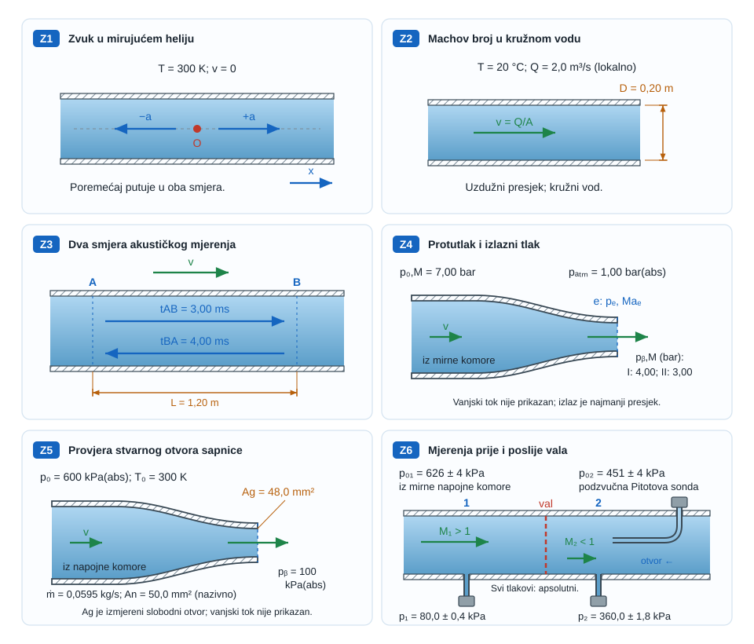

{#fig-kompresibilni-pregled fig-align="center" fig-alt="Kompresibilni tok povezuje širenje tlačnog vala, prigušenje u sapnici i skok veličina kroz udarni val."}

## Kompresibilnost fluida {#sec-kompresibilni-motivacija}

U sporom toku kapljevine promjena tlaka gotovo ne mijenja gustoću, pa je model konstantne gustoće izvrstan. Kod plina pri velikoj brzini ili velikoj promjeni tlaka isti korak više nije dopušten: dio energije toka pohranjuje se u stlačivanje i zagrijavanje plina. Tada uz masu, količinu gibanja i energiju treba pratiti i vezu između tlaka, gustoće i temperature [@anderson2021].

::: {.mf1-application}

Inženjerski kontekst

Kompresibilnost određuje odziv pneumatskog aktuatora, protok kroz sigurnosni ventil, rad mlaznice plinske turbine, ventilaciju tunela i širenje tlačnog vala kroz plinovod. U brodogradnji se pojavljuje u dovodu zraka motoru, ispušnom sustavu, podvodnoj akustici i kavitacijskim impulsima. Cilj poglavlja nije potpuna plinska dinamika, nego pouzdano prepoznati kada nestlačivi model prestaje vrijediti i postaviti temeljni jednodimenzijski račun.
:::

**Procijenjeno vrijeme rada uz udžbenik:** 9 sati.

## Brzina zvuka {#sec-brzina-zvuka}

Promatra se vrlo malen tlačni poremećaj koji se kroz fluid širi bez značajne izmjene topline s okolinom. Za takav brzi, gotovo reverzibilni poremećaj vrijedi lokalna izentropska veza

$$
a^2=\left(\frac{\partial p}{\partial \rho}\right)_s,
$$ {#eq-brzina-zvuka-opca}

gdje je $a$ brzina zvuka, a indeks $s$ označuje konstantnu entropiju. Jednadžba kaže da je brzina vala veća što fluid jače poraste u tlaku pri malom povećanju gustoće.

Za kalorijski idealan plin vrijedi $p=\rho RT$ i $p/\rho^\gamma=\text{konst.}$ duž izentrope. Ovdje je $R$ specifična plinska konstanta, a $\gamma=c_p/c_v$ bezdimenzijski omjer specifičnih toplinskih kapaciteta, koji se uzima konstantnim. Ta oznaka $\gamma$ u ovom poglavlju ne označuje specifičnu težinu $\rho g$. Diferenciranjem slijedi

$$
\frac{dp}{d\rho}=\gamma\frac{p}{\rho}=\gamma RT,
$$ {#eq-kompresibilni-tok-brzina-zvuka-mali-poremecaj-konacno-vrijeme-sec-01}

pa je

$$
a=\sqrt{\gamma RT}.
$$ {#eq-brzina-zvuka-plin}

Za kapljevinu se često koristi $a=\sqrt{K/\rho}$, gdje je $K$ izentropski modul stlačivosti. Stijenka elastične cijevi dodatno smanjuje brzinu tlačnog vala; zato se vodeni udar ne smije računati samo svojstvima vode kada je deformacija cijevi važna.

::: {.mf1-granica-modela}

Granica modela

Pascalov zakon opisuje novu statičku ravnotežu nestlačivog modela; ne tvrdi da stvarni poremećaj putuje beskonačnom brzinom. Informacija o promjeni tlaka u stvarnom fluidu putuje konačnom brzinom $a$.
:::

::: {#ex-akusticko-vrijeme .mf1-we}

P1. Vrijeme odziva pneumatskog voda T1

Zrak pri $T=293\ \text{K}$ nalazi se u vodu duljine $L=85\ \text{m}$. Za $\gamma=1{,}4$ i $R=287\ \text{J/(kg K)}$ procijeni najkraće vrijeme u kojem promjena ventila može biti opažena na drugom kraju.

$$
a=\sqrt{1{,}4\cdot287\cdot293}=343\ \text{m/s},\qquad
t_a=\frac{L}{a}=0{,}248\ \text{s}.
$$ {#eq-kompresibilni-tok-rijeseni-primjer-vrijeme-odziva-pneumatskog-voda-01}

**Provjera:** jedinica $L/a$ jest sekunda. Stvarni odziv tlaka i protoka obično je sporiji zbog refleksija, trenja, spremnika i dinamike ventila; $0{,}248\ \text{s}$ samo je kauzalna donja granica.
:::

## Machov broj i kriterij nestlačivosti {#sec-machov-broj}

Machov broj uspoređuje brzinu toka i brzinu širenja malog tlačnog poremećaja:

$$
Ma=\frac{v}{a}.
$$ {#eq-mach}

Kriterij $Ma<0{,}3$ korisna je inženjerska heuristika, a ne univerzalni zakon. U izentropskom toku idealnog plina relativna promjena gustoće obično je tada nekoliko posto ili manja. I pri malom Machovu broju gustoća može snažno varirati zbog grijanja, kemijske reakcije ili velike hidrostatičke razlike; kriterij se zato uvijek provjerava zajedno s termodinamičkim uvjetima.

::: {#ex-odabir-modela-kompresibilnosti .mf1-we}

P2. Dovod zraka baterijskom kompresoru T2

Zrak pri $20\ ^\circ\text{C}$ teče kroz vod promjera $D=80\ \text{mm}$ protokom $Q=0{,}42\ \text{m}^3/\text{s}$. Površina je $A=\pi D^2/4=5{,}027\cdot10^{-3}\ \text{m}^2$, pa je

$$
v=\frac{Q}{A}=83{,}6\ \text{m/s},\qquad Ma=\frac{83{,}6}{343}=0{,}244.
$$ {#eq-kompresibilni-tok-rijeseni-primjer-dovod-zraka-baterijskom-kompres-01}

Model konstantne gustoće može biti početna procjena ako su zagrijavanje i pad tlaka mali. Poveća li se protok za 30 %, dobiva se $Ma=0{,}317$, izvan uobičajenog područja te procjene; tada treba provjeriti promjenu gustoće kompresibilnim modelom.

**Provjera:** zaključak se temelji na lokalnom maksimumu brzine, ne samo na srednjoj brzini u najvećem presjeku.
:::

## Stagnacijske veličine u izentropskom toku {#sec-stagnacijske-velicine}

Za stacionarni, adijabatski tok idealnog plina bez rada vratila i zanemarive promjene potencijalne energije energijska jednadžba po jedinici mase glasi

$$
h+\frac{v^2}{2}=h_0=\text{konst.}
$$ {#eq-kompresibilni-tok-stagnacijske-velicine-u-izentropskom-toku-sec-st-01}

Za kalorijski idealan plin $h=c_pT$, pa slijedi

$$
T_0=T+\frac{v^2}{2c_p}.
$$ {#eq-kompresibilni-tok-stagnacijske-velicine-u-izentropskom-toku-sec-st-02}

Stagnacijska temperatura $T_0$ jest temperatura koju bi tok dosegnuo kad bi se adijabatski usporio do mirovanja. Uvrštavanjem $a^2=\gamma RT$ i $c_p=\gamma R/(\gamma-1)$ dobiva se

$$
\frac{T_0}{T}=1+\frac{\gamma-1}{2}Ma^2.
$$ {#eq-t0-t}

Ako je usporavanje i reverzibilno, iz izentropskih relacija slijede

$$
\frac{p_0}{p}=\left(1+\frac{\gamma-1}{2}Ma^2\right)^{\gamma/(\gamma-1)},
\qquad
\frac{\rho_0}{\rho}=\left(1+\frac{\gamma-1}{2}Ma^2\right)^{1/(\gamma-1)}.
$$ {#eq-stagnacijski-omjeri}

Ukupna temperatura ostaje konstantna i kroz adijabatski udarni val, ali ukupni tlak pada jer je udarni val ireverzibilan.

::: {#ex-stagnacijski-zrak .mf1-we}

P3. Pitotova sonda u brzom strujanju zraka T2

Za $T=260\ \text{K}$, $p=55\ \text{kPa}$ i $Ma=0{,}80$ uz $\gamma=1{,}4$:

$$
\frac{T_0}{T}=1+0{,}2(0{,}8)^2=1{,}128,
\qquad T_0=293{,}3\ \text{K},
$$ {#eq-kompresibilni-tok-rijeseni-primjer-pitotova-sonda-u-brzom-strujanj-01}

$$
\frac{p_0}{p}=1{,}128^{3{,}5}=1{,}524,
\qquad p_0=83{,}8\ \text{kPa}.
$$ {#eq-kompresibilni-tok-rijeseni-primjer-pitotova-sonda-u-brzom-strujanj-02}

Nestlačivi izraz $p_0-p=\rho v^2/2$ više nije zadani model. **Granična provjera:** kada $Ma\to0$, binomni razvoj kompresibilne relacije vraća nestlačivu dinamičku tlačnu skalu.
:::

::: {.mf1-numerika .kompakt}

Numerički trag — valovi, mreža i vremenski korak

U stlačivom računu promjene tlaka prenose se konačnom brzinom zvuka, pa prostorna i vremenska razlučivost moraju pratiti valne pojave. Premekana diskretizacija može razmazati skokove i gubitak ukupnoga tlaka, a prevelik vremenski korak može dati prividno mirno, ali nefizikalno rješenje.
:::

## Sapnica i prigušenje protoka {#sec-sapnica-prigusenje}

Za stacionarni kvazijednodimenzijski tok vrijedi $\rho Av=\text{konst.}$, pa diferenciranjem

$$
\frac{d\rho}{\rho}+\frac{dA}{A}+\frac{dv}{v}=0.
$$ {#eq-kompresibilni-tok-sapnica-i-prigusenje-protoka-sec-sapnica-priguse-01}

Za izentropski tok bez značajne promjene visine Eulerova jednadžba glasi $dp+\rho v\,dv=0$. Uz $dp=a^2\,d\rho$ slijedi $d\rho/\rho=-Ma^2\,dv/v$. Uvrštavanjem u kontinuitet dobiva se ključna relacija

$$
\boxed{\frac{dA}{A}=(Ma^2-1)\frac{dv}{v}}.
$$ {#eq-area-brzina}

Za podzvučni tok ubrzavanje zahtijeva suženje; za nadzvučni tok ubrzavanje zahtijeva širenje. Pri glatkom prijelazu kroz $Ma=1$ vrijedi $dA/dx=0$; u konvergentno-divergentnoj sapnici to je grlo. Samo postojanje grla ne jamči zvučni tok: važan je i nizvodni tlak. Kada je on dovoljno nizak, maseni protok dostiže maksimum i daljnje snižavanje nizvodnog tlaka više ga ne povećava uz iste $p_0$, $T_0$ i površinu grla: tok je **prigušen**.

Za idealni plin iz velikog spremnika kroz minimalnu površinu $A^*$ najveći maseni protok iznosi

$$
\dot m_{max}=A^*\frac{p_0}{\sqrt{T_0}}
\sqrt{\frac{\gamma}{R}}
\left(\frac{2}{\gamma+1}\right)^{\frac{\gamma+1}{2(\gamma-1)}}.
$$ {#eq-priguseni-protok}

::: {#ex-priguseni-ventil .mf1-we}

P4. Gornja granica protoka sigurnosnog otvora T3

Spremnik zraka ima $p_0=600\ \text{kPa(abs)}$ i $T_0=300\ \text{K}$. Idealizirani otvor ima $A^*=50\ \text{mm}^2$. Za $\gamma=1{,}4$ i $R=287\ \text{J/(kg K)}$:

$$
\dot m_{max}=50\cdot10^{-6}\frac{600000}{\sqrt{300}}
\sqrt{\frac{1{,}4}{287}}\left(\frac{2}{2{,}4}\right)^3
=0{,}0700\ \text{kg/s}.
$$ {#eq-kompresibilni-tok-rijeseni-primjer-gornja-granica-protoka-sigurnos-01}

Kritični omjer tlaka je

$$
\frac{p^*}{p_0}=\left(\frac{2}{\gamma+1}\right)^{\gamma/(\gamma-1)}=0{,}528.
$$ {#eq-kompresibilni-tok-rijeseni-primjer-gornja-granica-protoka-sigurnos-02}

Stoga je idealni tok prigušen ako je nizvodni tlak ispod približno $317\ \text{kPa(abs)}$. **Granica modela:** stvarni ventil zahtijeva koeficijent istjecanja, stvarnu efektivnu površinu i normirani proračun kapaciteta; dobivena vrijednost nije sigurnosna certifikacija.
:::

## Normalni udarni val: Hugoniotov uvjet {#sec-normalni-udarni-val}

Udarni val je vrlo tanak ireverzibilni prijelaz. Za stacionarni normalni val u adijabatskom kanalu konstantne površine bilance su

$$
\rho_1v_1=\rho_2v_2,
$$ {#eq-kompresibilni-tok-normalni-udarni-val-hugoniotov-uvjet-sec-normaln-01}

$$
p_1+\rho_1v_1^2=p_2+\rho_2v_2^2,
$$ {#eq-kompresibilni-tok-normalni-udarni-val-hugoniotov-uvjet-sec-normaln-02}

$$
h_1+\frac{v_1^2}{2}=h_2+\frac{v_2^2}{2}.
$$ {#eq-kompresibilni-tok-normalni-udarni-val-hugoniotov-uvjet-sec-normaln-03}

Eliminacija brzina daje Hugoniotovu relaciju između termodinamičkih stanja. Za kalorijski idealan plin praktični omjeri glase

$$
Ma_2^2=\frac{1+\tfrac{\gamma-1}{2}Ma_1^2}{\gamma Ma_1^2-\tfrac{\gamma-1}{2}},
\qquad
\frac{p_2}{p_1}=1+\frac{2\gamma}{\gamma+1}(Ma_1^2-1).
$$ {#eq-normalni-skok}

Fizički dopušten adijabatski udarni val povećava entropiju: nadzvučni ulaz postaje podzvučni, statički tlak i temperatura rastu, a ukupni tlak pada.

::: {#ex-normalni-udar .mf1-we}

P5. Udarni val u ispitnoj sapnici T3

Za zrak s $Ma_1=2{,}0$ i $\gamma=1{,}4$:

$$
Ma_2=\sqrt{\frac{1+0{,}2\cdot4}{1{,}4\cdot4-0{,}2}}=0{,}577,
$$ {#eq-kompresibilni-tok-rijeseni-primjer-udarni-val-u-ispitnoj-sapnici-01}

$$
\frac{p_2}{p_1}=1+\frac{2\cdot1{,}4}{2{,}4}(4-1)=4{,}50.
$$ {#eq-kompresibilni-tok-rijeseni-primjer-udarni-val-u-ispitnoj-sapnici-02}

**Provjera:** $Ma_2<1$ i $p_2>p_1$, što odgovara fizičkom smjeru. Obrnuti skok smanjio bi entropiju i nije fizički dopušten u ovom adijabatskom modelu. To ne isključuje postupno ubrzavanje iz podzvučnog u nadzvučni tok kroz prikladno oblikovanu sapnicu.
:::

## Postupak analize kompresibilnoga toka {#sec-kompresibilni-ritual}

1. Odredi apsolutne tlakove i temperaturno stanje.
2. Procijeni lokalni najveći $Ma$, ne samo ulaznu srednju vrijednost.
3. Odluči je li proces približno izentropski, adijabatski s gubitcima ili s izmjenom topline.
4. Napiši kontinuitet, energiju i jednadžbu stanja; količinu gibanja dodaj kad postoji sila ili udarni val.
5. Provjeri prigušenje, smjer porasta entropije i granični slučaj $Ma\to0$.

::: {.mf1-samoprovjera}

Provjeri sebe

1. Zašto Pascalov zakon ne znači trenutačan prijenos poremećaja?
2. Može li tok s $Ma=0{,}1$ ipak imati važnu promjenu gustoće? Navedi mehanizam.
3. Zašto se nadzvučni tok ubrzava u divergentnom dijelu sapnice?
4. Koja veličina ostaje, a koja ne ostaje konstantna kroz adijabatski udarni val: $T_0$ ili $p_0$?

::: {.callout-note collapse="true"}
### Odgovori
Poremećaj putuje konačnom brzinom zvuka. Da; snažno grijanje ili velika promjena osnovnog tlaka može promijeniti gustoću i pri maloj brzini. Za $Ma>1$ relacija površina–brzina daje $dA>0$ kada je $dv>0$. Kroz adijabatski val $T_0$ ostaje, a $p_0$ pada zbog porasta entropije.
:::
:::

::: {.mf1-numerika .kompakt}

Numerički trag — gustoća, energija i Machov broj

Za stlačivi CFD istodobno se rješavaju očuvanje mase, količine gibanja i energije, pa se gustoća i temperatura mijenjaju zajedno s tlakom i brzinom. Izentropska sapnica i normalni udarni val daju referentne odnose za provjeru solvera, dok stvarni gubitci ukupnog tlaka, turbulencija i prijenos topline traže širi model.

Za sapnicu se prate maseni protok, Machov broj, stagnacijske veličine i položaj mogućega vala. Rezidual energije ili lijep prikaz tlaka nije dovoljan ako se maseni protok mijenja s mrežom ili se skok ukupnoga tlaka ne slaže s referentnim odnosom.

Diskretizacija val mora prikazati u konačnom broju ćelija, ali širina razmazanoga skoka ne smije se tumačiti kao fizička debljina udarnoga vala. Tražena razlučivost određuje se osjetljivošću masenoga protoka i tlačnih odnosa, ne samo oštrinom slike.
:::

## Zadaci za vježbu {#sec-kompresibilni-zadaci}

{#fig-vjezbe-kompresibilni-tok fig-align="center" fig-alt="Šest skica s otvorenim prolazima. Z3 razlikuje prijenos zvuka uzvodno i nizvodno. Z4 označuje izlaz sapnice i zaseban protutlak. Z6 prikazuje normalni val u otvorenom kanalu, statičke priključke i podzvučnu Pitotovu sondu."}

U zadatcima plin promatraj kao kalorijski idealan. Brzina zvuka odnosi se na plin, a brzine i vremena prijelaza između nepomičnih točaka na laboratorij. Skice su shematske; veličina strelice sama ne zadaje iznos brzine. Šrafura označuje krutu stijenku, a isprekidana crta označeni presjek ili val, prema oznaci.

::::: {.mf1-vjezbe-list}

### Z1. Brzina zvuka u heliju {#task-brzina-zvuka-helium .unnumbered .unlisted}

Helij miruje pri $T=300\ \text{K}$. Za $\gamma=1{,}667$ i $R=2077\ \text{J/(kg K)}$ izračunaj brzinu zvuka. Vrlo malen tlačni poremećaj nastaje u točki O: označi oba uzdužna smjera njegova širenja i predznake brzina prema osi $x$ sa skice.

:::: {.content-visible .mf1-hint-online when-format="html"}
::: {.callout-note collapse="true" data-hint-key="true"}
### Naputak

Temperatura u relaciji za brzinu zvuka mora biti apsolutna. Plin miruje, pa je laboratorij ujedno sustav mirovanja plina; smjer širenja nije zadan smjerom nekoga srednjeg toka.
:::
::::
:::: {.content-visible .mf1-answer-online when-format="html"}
::: {.callout-tip collapse="true" data-answer-key="true"}
### Kontrolni rezultat

$a\approx1019\ \text{m/s}$; desno je brzina $+a$, lijevo $-a$. Srednja brzina helija ostaje $v=0$; strelice prikazuju širenje poremećaja.
:::
::::

[Razina: T1]{.mf1-task-level}

### Z2. Machov broj u ventilacijskom vodu {#task-mach-ventilacija .unnumbered .unlisted}

Zrak pri $T=20\ ^\circ\text{C}$ struji ravnim kružnim vodom promjera $D=0{,}20\ \text{m}$. Lokalni volumenski protok pri tom stanju jest $Q=2{,}0\ \text{m}^3/\text{s}$, a ne protok preračunat na standardne uvjete. Uz $\gamma=1{,}4$ i $R=287\ \text{J/(kg K)}$ odredi srednju brzinu i $Ma$. Za približno jednoliko strujanje, malo zagrijavanje i malu promjenu tlaka provjeri zadovoljava li početna procjena konstantne gustoće kriterij $Ma<0{,}3$.

:::: {.content-visible .mf1-hint-online when-format="html"}
::: {.callout-note collapse="true" data-hint-key="true"}
### Naputak

Iz promjera odredi površinu kružnoga presjeka, zatim primijeni $v=Q/A$ i definiciju Machova broja. Za brzinu zvuka pretvori temperaturu u kelvine.
:::
::::
:::: {.content-visible .mf1-answer-online when-format="html"}
::: {.callout-tip collapse="true" data-answer-key="true"}
### Kontrolni rezultat

$v\approx63{,}66\ \text{m/s}$ i $Ma\approx0{,}186$. Početna procjena konstantne gustoće zadovoljava zadani kriterij uz navedene pretpostavke; sam mali $Ma$ ne isključuje promjenu gustoće zbog grijanja ili velike promjene tlaka.
:::
::::

[Razina: T1]{.mf1-task-level}

### Z3. Akustičko mjerenje brzine i temperature {#task-akusticko-mjerenje-toka .unnumbered .unlisted}

U ravnom vodu zrak stacionarno i jednoliko struji od A prema B. Nepomične akustičke mjerne točke udaljene su $L=1{,}20\ \text{m}$. Malen signal putuje iz A u B za $t_{AB}=3{,}00\ \text{ms}$, a iz B u A za $t_{BA}=4{,}00\ \text{ms}$. To su vremena samog putovanja nakon korekcije kašnjenja elektronike. Zanemari refleksije i raspršenje te uzmi $\gamma=1{,}4$ i $R=287\ \text{J/(kg K)}$. Odredi brzinu toka $v$, brzinu zvuka $a$, statičku temperaturu $T$ i $Ma$. Objasni zašto je uzvodni prijenos moguć i zašto $L/t_{AB}$ nije sama brzina zvuka.

:::: {.content-visible .mf1-hint-online when-format="html"}
::: {.callout-note collapse="true" data-hint-key="true"}
### Naputak

U laboratoriju nizvodni signal ima brzinu $v+a$, a uzvodni $v-a<0$. Zato je $L/t_{AB}=a+v$ i $L/t_{BA}=a-v$. Zbrajanjem i oduzimanjem razdvoji $a$ i $v$, pa tek onda iz zvučne brzine odredi temperaturu.
:::
::::
:::: {.content-visible .mf1-answer-online when-format="html"}
::: {.callout-tip collapse="true" data-answer-key="true"}
### Kontrolni rezultat

$v=50{,}0\ \text{m/s}$, $a=350\ \text{m/s}$, $T\approx304{,}9\ \text{K}$ i $Ma\approx0{,}143$. Laboratorijske brzine signala jesu $+400$ i $-300\ \text{m/s}$. Uzvodni signal stiže jer je $v<a$; nizvodno ga tok prenosi zajedno sa širenjem relativno prema plinu.
:::
::::

[Razina: T2]{.mf1-task-level}

### Z4. Protutlak i prigušenje konvergentne sapnice {#task-priguseni-protok .unnumbered .unlisted}

Velika mirna komora napaja konvergentnu sapnicu fiksne geometrije. Manometarski tlak komore jest $p_{0,M}=7{,}00\ \text{bar}$, a atmosferski $p_{atm}=1{,}00\ \text{bar(abs)}$. Razmotri dva stacionarna namještanja manometarskog protutlaka: $p_{b,M}^{(I)}=4{,}00\ \text{bar}$ i $p_{b,M}^{(II)}=3{,}00\ \text{bar}$. Za zrak uz $\gamma=1{,}4$ i izentropski tok do izlaza odredi kritični apsolutni tlak $p^*$, režim u oba slučaja te izlazne $p_e$ i $Ma_e$. Objasni može li se protok dalje povećavati snižavanjem protutlaka u slučaju II uz iste stagnacijske uvjete. Kapacitet se ne traži.

:::: {.content-visible .mf1-hint-online when-format="html"}
::: {.callout-note collapse="true" data-hint-key="true"}
### Naputak

Omjere tvori iz apsolutnih tlakova. Najmanji presjek konvergentne sapnice jest izlaz. Ako je $p_b>p^*$, vrijedi $p_e=p_b$ i Mach slijedi iz izentropskog omjera $p_0/p_e$. Pri prigušenju izlaz ima $Ma_e=1$ i $p_e=p^*$; daljnja prilagodba protutlaku odvija se izvan sapnice.
:::
::::
:::: {.content-visible .mf1-answer-online when-format="html"}
::: {.callout-tip collapse="true" data-answer-key="true"}
### Kontrolni rezultat

$p_0=8{,}00\ \text{bar(abs)}$, $p^*\approx4{,}226\ \text{bar(abs)}$. I: $p_b=p_e=5{,}00\ \text{bar(abs)}$, $Ma_e\approx0{,}848$, neprigušen tok. II: $p_b=4{,}00\ \text{bar(abs)}$, $p_e=p^*$, $Ma_e=1$, prigušen tok. Dodatno snižavanje $p_b$ u II ne povećava protok pri istim $p_0,T_0$ i geometriji.
:::
::::

[Razina: T2]{.mf1-task-level}

### Z5. Geometrija ili koeficijent protoka? {#task-sapnica-model .unnumbered .unlisted}

Za nastavnu provjeru konvergentne sapnice zadani su sintetički podatci: $p_0=600\ \text{kPa(abs)}$, $T_0=300\ \text{K}$, $p_b=100\ \text{kPa(abs)}$ i $\dot m=0{,}0595\ \text{kg/s}$. Nazivna površina izlaza jest $A_n=50{,}0\ \text{mm}^2$, a neovisno optičko mjerenje stvarnog slobodnog presjeka daje $A_g=48{,}0\ \text{mm}^2$. U ovom zadatku zanemari mjerne nesigurnosti. Za zrak uz $\gamma=1{,}4$ i $R=287\ \text{J/(kg K)}$ koristi model $\dot m=C_d\dot m_{ideal}(A_g,p_0,T_0)$.

Provjeri uvjet prigušenja i odredi produkt $C_dA_g$ koji slijedi iz protoka. Bi li samo manji stvarni otvor uz $C_d=1$ objasnio podatke? Izračunaj idealni protok kroz izmjereni otvor i pripadajući $C_d$. Objasni što bi se moglo zaključiti bez optičkog mjerenja i zašto zamjena nazivnim otvorom sama ne jamči idealni protok.

:::: {.content-visible .mf1-hint-online when-format="html"}
::: {.callout-note collapse="true" data-hint-key="true"}
### Naputak

Najprije usporedi $p_b/p_0$ s kritičnim omjerom. Napiši prigušeni protok kao $\dot m=C_dA_gK(p_0,T_0)$. Protok određuje produkt; odvojeno mjerenje stvarne površine omogućuje procjenu koeficijenta. Nazivna površina nije mjerenje stvarnog prolaza.
:::
::::
:::: {.content-visible .mf1-answer-online when-format="html"}
::: {.callout-tip collapse="true" data-answer-key="true"}
### Kontrolni rezultat

$p_b/p_0=0{,}167<0{,}528$; $C_dA_g\approx42{,}50\ \text{mm}^2$. Za $A_g=48{,}0\ \text{mm}^2$: $\dot m_{ideal}\approx0{,}0672\ \text{kg/s}$ i $C_d\approx0{,}885$. Sama razlika površine ne objašnjava manji protok. Bez optike poznat je samo produkt, ne svaki faktor. Veći otvor sam ne jamči $C_d=1$.
:::
::::

[Razina: T3]{.mf1-task-level}

### Z6. Provjera podataka o udarnom valu {#task-udarni-val-podaci .unnumbered .unlisted}

U nastavnom skupu sintetičkih podataka za stacionarni normalni val u zračnom kanalu statički priključci prije i poslije vala daju $p_1=80{,}0\pm0{,}4\ \text{kPa(abs)}$ i $p_2=360{,}0\pm1{,}8\ \text{kPa(abs)}$. Ukupni tlak prije vala dobiva se neovisnim mjerenjem u velikoj mirnoj napojnoj komori: $p_{01}=626\pm4\ \text{kPa(abs)}$. Pretpostavi izentropski put od komore do presjeka 1, bez ranijeg vala. Podzvučna Pitotova sonda u presjeku 2, otvorom okrenuta uzvodno, daje $p_{02}=451\pm4\ \text{kPa(abs)}$. Zanemari poremećaj glavnog toka sondom i gubitke u mjernim vodovima. Sve oznake $\pm$ označuju male, međusobno neovisne standardne nesigurnosti mjerenja; $\gamma=1{,}4$ smatraj točnim.

Iz omjera $p_2/p_1$ odredi $M_1$ i njegovu standardnu nesigurnost linearnom RSS-propagacijom. Izračunaj teorijski omjer $G=p_{02}/p_{01}$ i njegovu nesigurnost, usporedi ga s izravno mjerenim omjerom $r_0$ te odluči jesu li konzistentni prema kriteriju $|G-r_0|\leq u(G-r_0)$. Izračunaj normiranu razliku. Objasni zašto sami statički tlakovi ne predstavljaju neovisnu mjernu potvrdu pada ukupnog tlaka i zašto obična nekorigirana Pitotova sonda ispred vala ne bi izravno dala $p_{01}$.

:::: {.content-visible .mf1-hint-online when-format="html"}
::: {.callout-note collapse="true" data-hint-key="true"}
### Naputak

Izoliraj $M_1$ iz statičkog omjera. Za $r=p_2/p_1$ vrijedi $u(r)/r=\sqrt{(u(p_1)/p_1)^2+(u(p_2)/p_2)^2}$. Analogno računaj $u(r_0)$. Relaciju za $M_2$ poveži s lokalnim stagnacijskim omjerima i dobij $G(M_1)$. Primijeni $u(G)=|G'(M_1)|u(M_1)$ te $u(G-r_0)=\sqrt{u(G)^2+u(r_0)^2}$; derivaciju smiješ procijeniti središnjom razlikom.
:::
::::
:::: {.content-visible .mf1-answer-online when-format="html"}
::: {.callout-tip collapse="true" data-answer-key="true"}
### Kontrolni rezultat

$M_1=2{,}000\pm0{,}007$; $G=0{,}7209\pm0{,}0032$; $r_0=0{,}7204\pm0{,}0079$; $u(G-r_0)=0{,}0085$. Normirana razlika $0{,}050<1$: podatci su konzistentni. Statički tlakovi sami daju modelsku procjenu, ne neovisno mjerenje gubitka ukupnog tlaka. Nadzvučna Pitotova sonda stvara vlastiti val i bez korekcije ne daje $p_{01}$.
:::
::::

[Razina: T4]{.mf1-task-level}

:::::

::: {.mf1-numerika}

Numerički pokus — od nestlačivog do prigušenog toka

Notebook `u09_kompresibilna_sapnica.ipynb` uspoređuje nestlačivu i izentropsku procjenu, izračunava kritični omjer tlakova te prikazuje maseni protok pri postupnom snižavanju protutlaka. Student najprije predviđa oblik krivulje, zatim provjerava granični slučaj $Ma\to0$ i numerički potvrđuje plato prigušenog protoka.

<a class="mf1-interaktivno-veza" href="https://martibasic.github.io/MF1_udzbenik/jlite/lab/index.html?path=u09_kompresibilna_sapnica.ipynb">Pokreni u pregledniku</a>

:::

::: {.mf1-zavrsni-okvir}

Za ponijeti iz poglavlja

- Brzina zvuka mjeri termodinamičku krutost fluida i postavlja konačnu brzinu prijenosa informacije.
- Machov broj je prvi filtar modela, ali ne zamjenjuje provjeru grijanja i ukupne promjene tlaka.
- Izentropske stagnacijske relacije vrijede samo bez ireverzibilnih gubitaka.
- Prigušenje ograničuje maseni protok; snižavanje nizvodnog tlaka nakon toga ne povećava protok.
- Udarni val čuva masu, količinu gibanja i ukupnu entalpiju, ali povećava entropiju i smanjuje ukupni tlak.
:::
