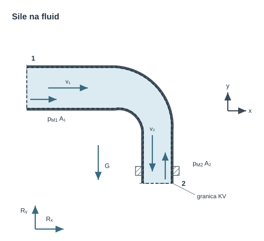
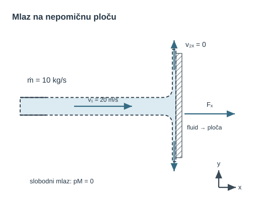
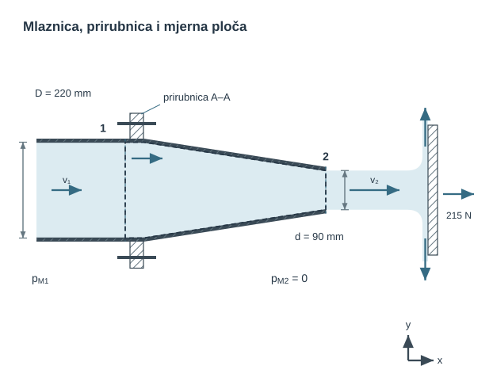
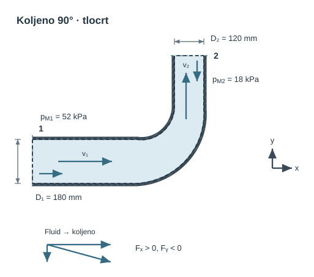
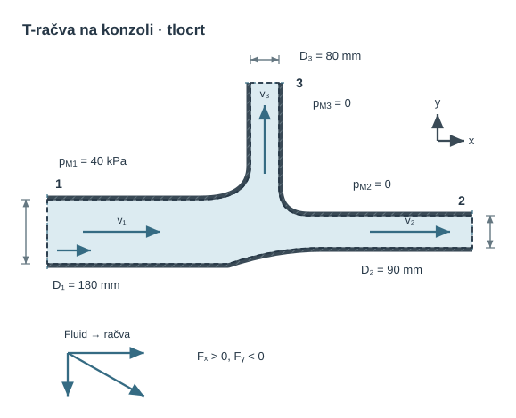
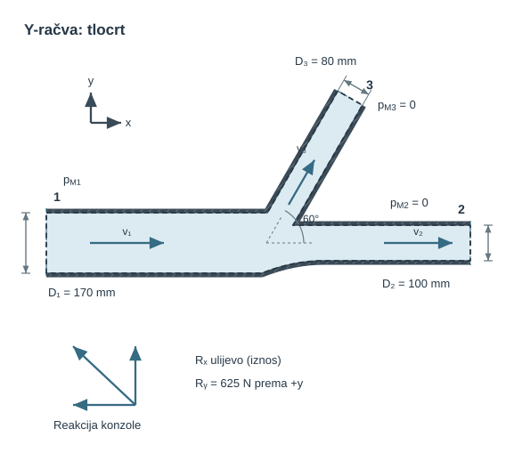
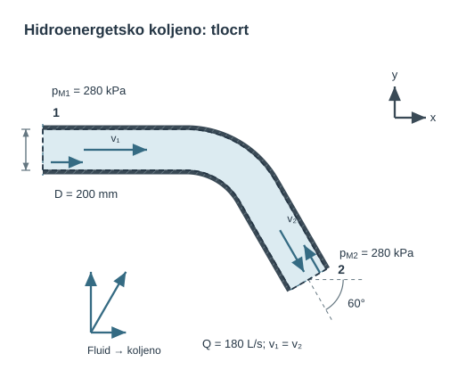
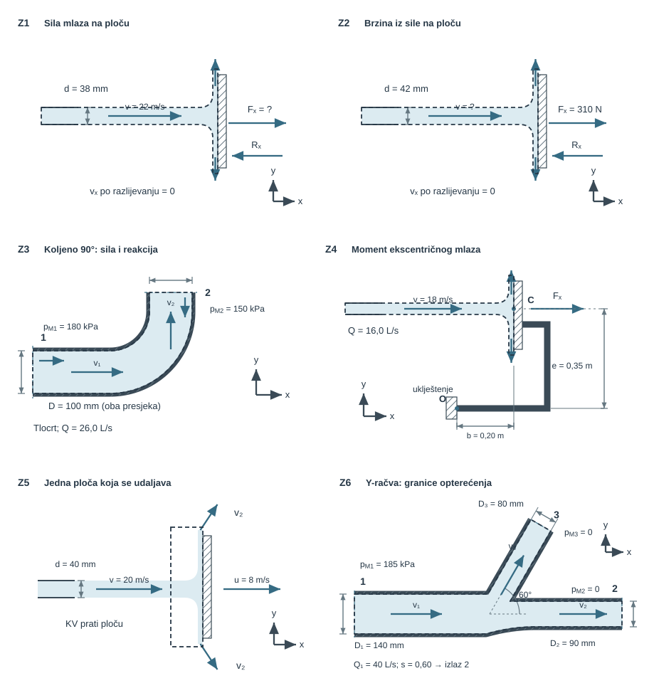

{#fig-uvod-u11 fig-align="center" fig-alt="Pregled poglavlja: količina i moment količine gibanja."}

**Tumačenje skice.** Za stacionaran tok kroz fiksni kontrolni volumen zbroj svih vanjskih sila na fluid jednak je promjeni toka količine gibanja: $\mathbf F_p+\mathbf G+\mathbf R=\sum_{\mathrm{izl}}\dot m\mathbf v-\sum_{\mathrm{ul}}\dot m\mathbf v$. Tlačna sila na presjeku je $\mathbf F_{p,i}=-p_{M,i}A_i\mathbf n_i$, gdje je $\mathbf n_i$ vanjska normala.

Za jedan ulaz i izlaz vrijedi $\dot m=\rho_1A_1v_1=\rho_2A_2v_2$. Brzine i sile zbrajaju se vektorski. Strelice $R_x$ i $R_y$ pokazuju pretpostavljene pozitivne smjerove sile stijenke na fluid; predznake određuje račun. Sila fluida na stijenku ima suprotan smjer, $\mathbf F_{\mathrm{fluid\to stijenka}}=-\mathbf R$.

## Količina i moment količine gibanja

Zakon količine gibanja povezuje protok, tlak i reakciju konstrukcije. Pri strujanju kroz mlaznicu, koljeno ili račvu promjena brzine fluida, zajedno s tlakovima na ulaznim i izlaznim presjecima, određuje opterećenje vijaka, prirubnice ili nosača.

::: {.mf1-application}

Inženjerski kontekst

Koljeno, T-račva ili mlaznica prenosi silu na prirubnicu i nosač. U pumpnim stanicama, brodskim strojarnicama i protupožarnim monitorima to opterećenje određujemo iz tlačnih sila i promjene količine gibanja fluida.
:::

**Procijenjeno vrijeme rada uz priručnik:** 10 sati.

## Integralni zakon količine gibanja

Za stacionarni tok osnovni zapis ostaje

$$
\sum \vec{F} = \dot{m}(\vec{V}_{izl} - \vec{V}_{ul})
$$ {#eq-momentum-fizikalni-uvod-i-matematicki-izvod-01}

::: {.mf1-fizikalno-znacenje}

Fizikalno značenje

Za stacionarni tok rezultantna vanjska sila na fluid u nepomičnom kontrolnom volumenu jednaka je razlici izlaznog i ulaznog toka količine gibanja. Promjena iznosa ili smjera brzine zato zahtijeva djelovanje sila. Ako fluid skrene za $90°$ u koljenu, sile tlaka i stijenke mijenjaju smjer njegove količine gibanja. Prema trećem Newtonovu zakonu fluid na stijenku djeluje silom jednakog iznosa i suprotnog smjera od sile stijenke na fluid. To opterećenje mora preuzeti konstrukcija.
:::

Pritom se zbroj sila ne smije svesti samo na reakciju stijenke. U tipičnom cijevnom elementu treba odvojeno prepoznati:

- tlakove na ulaznim i izlaznim presjecima
- težinu fluida ako ima komponentu u promatranom smjeru
- silu stijenke ili konstrukcije na fluid

Tek nakon toga može se odrediti sila fluida na konstrukciju, odnosno opterećenje vijaka, prirubnice ili nosača. Vektorski zapis ovdje nije formalna strogost radi same sebe: on je jedini način da se iz istoga toka istodobno ispravno pročitaju smjer, predznak i veličina opterećenja konstrukcije.

U []{.mf1-chapter-ref target="u10"} Bernoulli i kontinuitet više nisu dovoljni sami za sebe. Oni vraćaju energetsku sliku i raspodjelu protoka, ali ne daju reakciju konstrukcije. Tu ulazi zakon količine gibanja za kontrolni volumen.

Za kontrolni volumen $KV(t)$ omeđen kontrolnom plohom $KP(t)$ koja se lokalno giba brzinom $\vec v_{KP}$ integralni zakon količine gibanja u inercijskom referentnom okviru glasi

$$
\frac{\mathrm{d}}{\mathrm{d}t}\int_{KV(t)} \rho \vec{v}\,\mathrm{d}V
+ \int_{KP(t)} \rho \vec{v}\bigl[(\vec v-\vec v_{KP})\cdot \vec{n}\bigr]\,\mathrm{d}S
= \sum \vec{F}.
$$ {#eq-momentum-fizikalno-znacenje-01}

::: {.mf1-cfd title="Računalna dinamika fluida"}

**Koljeno rashladnog voda i njegov nosač.** Tok kroz zavoj mijenja smjer, pa fluid opterećuje cijev i njezine oslonce. Ručni račun obuhvaća cijelo koljeno jednim kontrolnim volumenom. CFD postavlja istu bilancu za svaku ćeliju: akumulacija i prijenos količine gibanja odgovaraju tlačnim, viskoznim i volumenskim silama. Time dobivamo i raspodjelu tlaka unutar zavoja.

Za zadani dotok i odgovarajući izlazni tlak možemo usporediti oštro i postupnije koljeno. Usporedba obuhvaća komponente sile na cijev te gubitak iz prethodne energijske analize; povoljan otpor ne jamči jednako opterećenje nosača. U stacionarnom modelu nema akumulacije, ali prijenos količine gibanja kroz otvore ostaje jer se tok skreće.

[]{#ista-bilanca-za-mnogo-malih-dijelova-fluida}
:::

Prvi član predstavlja akumulaciju količine gibanja unutar odabranoga volumena, a drugi prijenos kroz njegovu granicu relativnom brzinom. Za nepomični kontrolni volumen $\vec v_{KP}=0$. Ako je tok usto stacionaran, prvi član nestaje pa preostaje ravnoteža između vanjskih sila i neto toka količine gibanja kroz granicu.

Ako se ulazni i izlazni presjeci mogu čitati jednodimenzijski, za jedan ulaz i jedan izlaz slijedi pojednostavljenje

$$
\sum \vec F = \dot m(\vec V_2 - \vec V_1).
$$ {#eq-momentum-numericki-trag-01}

::: {.mf1-izvod}

Matematički izvod — Koeficijent količine gibanja $\beta$ i nejednoliki profil brzine

Prelazak iz integralnog oblika $\int_A \rho\,\vec{v}(\vec{v}\cdot\vec{n})\,dA$ na pojednostavljeni zapis $\dot{m}\,\vec{V}$ implicitno pretpostavlja **jednoliki profil brzine** preko cijelog presjeka. Za stvarne profile (laminarni parabolični profil, turbulentni profil $1/7$) pravu vrijednost integrala daje korekcijski **koeficijent količine gibanja**

$$
\beta = \frac{1}{v_{sr}^2 A}\int_A v^2\,dA,
$$ {#eq-momentum-matematicki-izvod-koeficijent-kolicine-gibanja-i-01}

gdje je $v_{sr} = Q/A$ srednja brzina presjeka. Točan integralni oblik zatim se piše kao

$$
\int_A \rho v^2\,dA = \beta \rho v_{sr}^2 A = \beta \dot{m} v_{sr}.
$$ {#eq-momentum-matematicki-izvod-koeficijent-kolicine-gibanja-i-02}

Za **laminarni parabolični profil** $v(r)=v_{max}(1-(r/R)^2)$ analitički je $\beta=4/3\approx1{,}33$. Idealizirani razvijeni turbulentni profil s eksponentom $1/7$ daje $\beta\approx1{,}02{-}1{,}03$. Uporaba $\beta\approx1$ odluka je o modelu profila, a ne univerzalno pravilo [@white2011].

Ovaj koeficijent analogan je **Coriolisovu koeficijentu $\alpha$**, koji u energijskoj bilanci korigira kinetičku energiju zbog nejednolikog profila: $\alpha$ stoji uz $v^2/(2g)$, a $\beta$ uz $\dot m v$. Za nenegativan jednosmjerni profil vrijedi $\alpha\ge\beta^{3/2}$, pa su oba veća od jedan ako profil nije jednolik. Za laminarni parabolični profil analitički je $\alpha=2$ i $\beta=4/3$. Kod povratnoga toka ili drukčije definiranih presjeka te se nejednakosti ne smiju primijeniti bez ponovne integracije.
:::

No taj oblik nije dovoljan dok se vanjske sile ne rastave na stvarne doprinose. Za tipičan cijevni element vrijedi

$$
\vec F_p + \vec G + \vec R_{st\to f} = \dot m(\vec V_2 - \vec V_1),
$$ {#eq-momentum-matematicki-izvod-koeficijent-kolicine-gibanja-i-03}

gdje je $\vec F_p$ rezultanta tlačnih sila na presjecima, $\vec G$ težina fluida unutar kontrolnog volumena, a $\vec R_{st\to f}$ sila stijenke ili konstrukcije na fluid. Iz toga odmah slijedi reakcija fluida na konstrukciju

$$
\vec F_{f\to st} = -\vec R_{st\to f} = \vec F_p + \vec G - \dot m(\vec V_2 - \vec V_1).
$$ {#eq-momentum-matematicki-izvod-koeficijent-kolicine-gibanja-i-04}

Tlačni članovi ne smiju se automatski izbaciti iz zapisa. Oni otpadaju tek kad su relevantni presjeci otvoreni atmosferi ili kad se njihova rezultanta doista poništi geometrijom i pravilno odabranim kontrolnim volumenom.

Upravo tu leži puni fizikalni smisao poglavlja. Član $\dot m\vec V$ opisuje tok količine gibanja, a tlačni članovi $pA$ sile na zamišljenim ulaznim i izlaznim presjecima kontrolnog volumena. Vijci, prirubnica i nosač ne nose apstraktnu jednadžbu, nego upravo vektorsku razliku tlačnih, težinskih i impulsnih doprinosa.

## Provjera sile na cijevno koljeno

::: {.mf1-cfd title="Računalna dinamika fluida"}

**Provjera opterećenja nosača dvama postupcima.** U CFD-u silu fluida na koljeno prvo dobijemo integracijom tlaka i viskoznih naprezanja po unutarnjoj stijenci. Neovisno je provjerimo bilancom kontrolnog volumena: uključimo tokove količine gibanja, tlakove na otvorima, težinu i, kod promjenjivoga toka, akumulaciju. Ručni @ex-u11-servisno-koljeno-na-sidrenom-nosacu-t2 polazi od zadanih tlakova i srednjih brzina. Za usporedbu s CFD-om uskladi presjeke i korekcije nejednolikih profila.

**Zastani i promisli.** Uz iste osi CFD daje silu fluida na koljeno suprotnu ručno izračunanoj sili koljena na fluid. Dokazuje li to pogrešku predznaka?

Suprotni predznaci sile stijenke na fluid i sile fluida na stijenku nisu neslaganje: prvo uskladi tijelo na koje se rezultat odnosi. Za nosač zatim sastavi ravnotežu same cijevi, uz njezinu težinu i ostale priključne sile. Pri profinjenju prati komponente ukupnog opterećenja.
:::

::: {.mf1-interaktivno}

Interaktivni prikaz — Sila na koljeno

**Predvidi.** Nacrtaj sile na fluid i na koljeno prije računanja komponenti. Što očekuješ u graničnom slučaju ravne cijevi jednakih promjera i tlakova?

**Provjeri i protumači.** Mijenjaj kut i usporedi komponente sile. Odvoji tlačni doprinos od promjene toka količine gibanja te provjeri tijelo na koje sila djeluje.

<a class="mf1-interaktivno-veza" href="https://martibasic.github.io/MF1_udzbenik/jlite/lab/index.html?path=u11_sila_na_koljeno.ipynb">Pokreni u pregledniku</a>

**Pitanja za samostalno istraživanje:** (a) Pri $\beta = 90°$, koje su vrijednosti $F_x$ i $F_y$ i kako mora biti orijentiran nosač? (b) Zašto je $\beta \to 180°$ slučaj najveće sile pri istom $Q$ i $D$? (c) Kada u članu $F_{int}$ dominira impulsni dio $\rho Q v$, a kada tlačni $pA$?

:::

::: {.callout-note}
## Postupak rješenja
Korak: od integralnog zakona → radni zapis $\sum\vec{F} = \dot{m}(\vec{V}_2 - \vec{V}_1)$

Integralni zakon za stacionarno strujanje ($d/dt = 0$):
$$
\int_{KP} \rho \vec{v}(\vec{v}\cdot\vec{n})\,dS = \sum \vec{F}.
$$ {#eq-momentum-razrada-koraka-01}
Za presjeke s jednodimenzijskim profilom brzine ($v = $ const. po presjeku):
- na ulazu: $\vec{v}\cdot\vec{n} = -v_1$ (normala je usmjerena prema van, a brzina prema unutra), taj član daje $-\dot{m}\vec{V}_1$
- na izlazu: $\vec{v}\cdot\vec{n} = +v_2$, daje $+\dot{m}\vec{V}_2$

Ukupno:
$$
\dot{m}\vec{V}_2 - \dot{m}\vec{V}_1 = \sum\vec{F} \quad\Rightarrow\quad \sum\vec{F} = \dot{m}(\vec{V}_2 - \vec{V}_1).
$$ {#eq-momentum-razrada-koraka-02}
Sile $\sum\vec{F}$ uključuju: tlačne sile na presjecima ($\vec{F}_p$), težinu fluida ($\vec{G}$) i silu stijenke na fluid ($\vec{R}$). Sila fluida na stijenku je $-\vec{R}$ (Newton III).
:::

To je razlog zašto se []{.mf1-chapter-ref target="u10"} ne čita kao još jedno poglavlje o formulama, nego kao prijelaz s toka na konstrukcijsko opterećenje. Na tlačnoj strani crpke koljeno i prije vodenog udara nosi stacionarni bočni potisak, a na mlaznici spoj preuzima razliku tlačnih i impulsnih doprinosa.

::: {.mf1-dublje}

Dublje — Lokalni oblik zakona količine gibanja

Integralni zakon količine gibanja vrijedi za bilo koji izabrani kontrolni volumen. Primjenom **teorema o divergenciji** isti se zakon zapisuje lokalno kao parcijalna diferencijalna jednadžba. Ovdje se čuva veza s integralnom bilancom; pretpostavke, rubni uvjeti i kanonska rješenja sustavno se obrađuju u []{.mf1-chapter-ref target="u12"}.

Polazi se od općeg oblika za **nepomični kontrolni volumen**, uz dopuštena vremenski promjenjiva polja:

$$
\begin{aligned}
&\frac{\partial}{\partial t}\int_{KV}\rho\vec u\,dV
+\int_{KP} \rho\,\vec{u}\,(\vec{u}\cdot\vec{n})\,dA \\
&= \int_{KV} \rho\,\vec{g}\,dV
- \int_{KP} p\,\vec{n}\,dA
+ \int_{KP} \boldsymbol{\tau}\cdot\vec{n}\,dA,
\end{aligned}
$$ {#eq-momentum-dublje-lokalni-oblik-zakona-kolicine-gibanja-01}

gdje su s desne strane redom volumna sila (težina), tlačna sila i viskozna sila izražena tenzorom naprezanja $\boldsymbol{\tau}$.

Za fiksni kontrolni volumen vremenska derivacija može se prenijeti pod integral. Primjenom teorema o divergenciji površinski integrali postaju volumenski:

$$
\frac{\partial}{\partial t}\int_{KV}\rho\vec u\,dV
=\int_{KV}\frac{\partial(\rho\vec u)}{\partial t}\,dV,
$$ {#eq-momentum-dublje-lokalni-oblik-zakona-kolicine-gibanja-02}

$$
\int_{KP} \rho\,\vec{u}\,(\vec{u}\cdot\vec{n})\,dA = \int_{KV} \nabla\cdot(\rho\,\vec{u}\otimes\vec{u})\,dV,
$$ {#eq-momentum-dublje-lokalni-oblik-zakona-kolicine-gibanja-03}

$$
\int_{KP} p\,\vec{n}\,dA = \int_{KV} \nabla p\,dV, \qquad \int_{KP} \boldsymbol{\tau}\cdot\vec{n}\,dA = \int_{KV} \nabla\cdot\boldsymbol{\tau}\,dV.
$$ {#eq-momentum-dublje-lokalni-oblik-zakona-kolicine-gibanja-04}

Spajanjem svih članova u jedan volumenski integral i argumentom proizvoljnosti kontrolnog volumena slijedi **lokalna jednadžba količine gibanja**:

$$
\boxed{\frac{\partial(\rho\vec u)}{\partial t}
+\nabla\cdot(\rho\,\vec{u}\otimes\vec{u})
= \rho\,\vec{g} - \nabla p + \nabla\cdot\boldsymbol{\tau}}.
$$ {#eq-momentum-dublje-lokalni-oblik-zakona-kolicine-gibanja-05}

Za konstantnu gustoću i nestlačivost, $\nabla\cdot\vec u=0$, vrijedi identitet

$$
\nabla\cdot(\vec u\otimes\vec u)=(\vec u\cdot\nabla)\vec u,
$$ {#eq-momentum-dublje-lokalni-oblik-zakona-kolicine-gibanja-06}

pa se konzervativni oblik pretvara u materijalno ubrzanje. **Idealni (neviskozni) fluid.** Kada je $\boldsymbol{\tau}=0$, dobiva se Eulerova jednadžba:

$$
\boxed{\rho\!\left(\frac{\partial\vec{u}}{\partial t} + (\vec{u}\cdot\nabla)\vec{u}\right) = -\nabla p + \rho\,\vec{g}}.
$$ {#eq-momentum-dublje-lokalni-oblik-zakona-kolicine-gibanja-07}

Izraz u zagradi na lijevoj strani jest **materijalna derivacija** brzine, odnosno ubrzanje fluidne čestice; množenjem gustoćom dobiva se inercijski član po jedinici volumena. U stacionarnom strujanju trajektorija se podudara sa strujnicom. Lokalni član $\partial\vec{u}/\partial t$ opisuje vremensku promjenu brzine u fiksnoj točki prostora; konvektivni član $(\vec{u}\cdot\nabla)\vec{u}$ opisuje promjenu jer se čestica giba kroz prostorno nejednoliko polje brzine.

**Realni newtonski nestlačivi fluid.** Za konstantnu dinamičku viskoznost vrijedi $\tau_{ij} = \mu(\partial u_i/\partial x_j + \partial u_j/\partial x_i)$, a divergencija viskoznog tenzora postaje $\nabla\cdot\boldsymbol{\tau} = \mu\nabla^2\vec{u}$. Uvrštavanjem se dobiva **Navier–Stokesova jednadžba**:

$$
\boxed{\rho\!\left(\frac{\partial\vec{u}}{\partial t} + (\vec{u}\cdot\nabla)\vec{u}\right) = -\nabla p + \rho\,\vec{g} + \mu\nabla^2\vec{u}}.
$$ {#eq-momentum-dublje-lokalni-oblik-zakona-kolicine-gibanja-08}

Ovaj oblik Navier–Stokesove jednadžbe vrijedi uz navedene pretpostavke konstantne gustoće i viskoznosti newtonskoga fluida. Kako se ta jednadžba zajedno s kontinuitetom prevodi u račun razrađuje @sec-realni-tok-cfd.

Skupine članova imaju jasnu fizikalnu interpretaciju:

- **Lokalni i konvektivni inercijski članovi** $\rho\,\partial\vec u/\partial t$ i $\rho(\vec u\cdot\nabla)\vec u$ — promjena brzine u vremenu i prijenos količine gibanja kroz prostorno nejednoliko polje; nelinearni konvektivni član omogućuje prijenos među skalama, ali sam po sebi nije dovoljan kriterij nastanka turbulencije;
- **Tlačni član** $-\nabla p$ — sila po jedinici volumena zbog gradijenta tlaka;
- **Volumna sila** $\rho\vec g$ — ovdje težina po jediničnom volumenu;
- **Viskozni član** $\mu\nabla^2\vec{u}$ — divergencija viskoznog naprezanja, odnosno sila po jediničnom volumenu; disipacija mehaničke energije posljedica je rada tih naprezanja, ali nije naziv samoga člana.

Reynoldsov broj $Re=\rho vL/\mu$ proizlazi kao omjer karakterističnih inercijskih i viskoznih članova. Mali $Re$ obično prigušuje poremećaje, dok veliki $Re$ dopušta da inercijski učinci i nestabilnosti postanu važni; prijelaz ovisi i o geometriji te ulaznim poremećajima. Potpuno razvijeni laminarni tok u kružnoj cijevi izvodi se u []{.mf1-chapter-ref target="u12"}.
:::

::: {.mf1-cfd title="Računalna dinamika fluida"}

**Zakretni moment raspršivača.** Dvije savijene mlaznice na rotirajućoj ruci mogu stvarati moment i kada se dio ukupnih sila međusobno poništi. Za zadani dovod i brzinu vrtnje CFD određuje izlazne brzine i naprezanja na stijenkama. Moment provjeravamo tokom $\vec r\times\vec v$ kroz granice, uz isti položaj osi i iste predznake.

Ako se ruka slobodno zalijeće, dodajemo jednadžbu njezina gibanja, moment tromosti i otpor ležajeva. Pratimo promjenu brzine vrtnje, a u fluidu i akumulaciju momenta količine gibanja. Time razlikujemo moment pri zadanoj brzini od predviđanja same brzine. Veza momenta s potrebnom ili dobivenom snagom nastavlja se na rotoru u []{.mf1-chapter-ref target="u14"}.
:::

## Riješeni primjeri

::: {#ex-u11-mlaz-vode-na-mirnu-ravnu-plocu-t2 .mf1-we}

Mlaz vode na mirnu ravnu ploču&nbsp;T2

**Tekst zadatka**

Vodeni mlaz brzine $v = 20\ \text{m/s}$ i masenog protoka $\dot{m} = 10\ \text{kg/s}$ okomito udara u nepomičnu vertikalnu ploču. Nakon udara razlijeva se uz ploču, bez aksijalne komponente brzine. Slobodni presjeci mlaza izloženi su atmosferskom tlaku.

**Traži se**

Odredi silu potrebnu da ploča ostane u mirovanju.

{#fig-u11-mlaz-na-plocu fig-alt="Mlaz na ploču"}

**Veza s proračunom.** Nakon razlijevanja nema izlazne komponente brzine po $x$, pa ulazni tok količine gibanja određuje silu na ploču. Reakcija ploče na fluid suprotnog je smjera. Kontrolna granica uz ploču prati stijenku; na slobodnim granicama mlaza manometarski tlak jednak je nuli.

**Rješenje**

Za stacionarni tok u osi mlaza vrijedi

$$
\sum F_x = \dot{m}(v_{x,izl} - v_{x,ul}).
$$ {#eq-momentum-rijeseni-primjer-mlaz-vode-na-mirnu-ravnu-01}

Prije udara mlaz ima ulaznu komponentu brzine $v_{x,ul} = 20\ \text{m/s}$, a nakon udara se rasprši uz ploču, pa je izlazna komponenta u istoj osi $v_{x,izl} = 0$. Zato sila ploče na fluid iznosi

$$
F_{pl \to f} = \dot{m}(0 - 20) = -200\ \text{N}.
$$ {#eq-momentum-rijeseni-primjer-mlaz-vode-na-mirnu-ravnu-02}

Negativan predznak samo govori da ploča na fluid djeluje suprotno smjeru mlaza. Po trećem Newtonovom zakonu sila fluida na ploču ima isti iznos i suprotan smjer, pa je sila koju treba preuzeti oslonac ploče

$$
F_R = F_{f \to pl} = 200\ \text{N}.
$$ {#eq-momentum-rijeseni-primjer-mlaz-vode-na-mirnu-ravnu-03}

**Provjera i tumačenje**

Kod slobodnog mlaza koji se na ploči zaustavlja u osi udara sila se dobiva izravno iz gubitka aksijalne komponente količine gibanja. Ovdje to daje točno $200\ \text{N}$.

1. Ako bi maseni protok bio veći, sila bi rasla linearno s $\dot{m}$.
2. Ako bi mlaz dolazio dvostruko brže, sila bi bila dvostruko veća jer je ovdje $\dot{m}$ već zadan.
3. Sila mora djelovati u smjeru dolaznog mlaza na ploču, a reakcija oslonca suprotno tome.
:::

::: {#ex-u11-kalibracijska-mlaznica-na-prirubnici-t2 .mf1-we}

Kalibracijska mlaznica na prirubnici&nbsp;T2

**Tekst zadatka**

Horizontalna mlaznica ima ulazni promjer $D = 220\ \text{mm}$ i izlazni promjer $d = 90\ \text{mm}$. Vodeni mlaz gustoće $\rho = 998\ \text{kg/m}^3$ okomito udara u mjernu ploču silom $F_P = 215\ \text{N}$ te se razlijeva bez aksijalne komponente brzine. Pretpostavi stacionaran tok, jednolike profile i atmosferski tlak u slobodnom mlazu; zanemari gubitke. Presjek prirubničkih vijaka označen je s `A-A`.

**Traži se**

1. Odredi protok $Q$ kroz mlaznicu.
2. Odredi pretlak $p_{M1}$ u presjeku 1 neposredno uz prirubnicu.
3. Odredi koliku vlačnu silu $R$ moraju preuzeti vijci u presjeku `A-A`.

{#fig-u11-kalibracijska-mlaznica-na-prirubnici fig-alt="Kalibracijska mlaznica na prirubnici"}

**Veza s proračunom.** Sila na mjernu ploču prvo određuje protok. Energijska bilanca daje ulazni tlak, a bilanca količine gibanja opterećenje prirubnice. Vijci prenose silu uz slobodan otvor; isprekidana granica kontrolnog volumena uz mlaznicu prati stijenku.

**Rješenje**

Površina izlaznog presjeka iznosi

$$
A_2 = \frac{\pi d^2}{4} = \frac{\pi \cdot 0{,}09^2}{4} = 6{,}36 \cdot 10^{-3}\ \text{m}^2.
$$ {#eq-momentum-rijeseni-primjer-kalibracijska-mlaznica-na-priru-01}

Za mlaz koji udara okomito u ravnu ploču vrijedi $F_P = \dot{m} v_2 = \rho A_2 v_2^2$, pa je izlazna brzina

$$
v_2 = \sqrt{\frac{F_P}{\rho A_2}} = \sqrt{\frac{215}{998 \cdot 6{,}36 \cdot 10^{-3}}} = 5{,}82\ \text{m/s},
$$ {#eq-momentum-rijeseni-primjer-kalibracijska-mlaznica-na-priru-02}

odakle slijedi protok

$$
Q = A_2 v_2 = 6{,}36 \cdot 10^{-3} \cdot 5{,}82 \approx 0{,}0370\ \text{m}^3/\text{s} = 37{,}0\ \text{l/s}.
$$ {#eq-momentum-rijeseni-primjer-kalibracijska-mlaznica-na-priru-03}

Površina ulaznog presjeka je

$$
A_1 = \frac{\pi D^2}{4} = \frac{\pi \cdot 0{,}22^2}{4} = 3{,}80 \cdot 10^{-2}\ \text{m}^2,
$$ {#eq-momentum-rijeseni-primjer-kalibracijska-mlaznica-na-priru-04}

pa je brzina u presjeku 1 jednaka

$$
v_1 = \frac{Q}{A_1} = \frac{0{,}0370}{3{,}80 \cdot 10^{-2}} = 0{,}974\ \text{m/s}.
$$ {#eq-momentum-rijeseni-primjer-kalibracijska-mlaznica-na-priru-05}

Kako je presjek 2 otvoren prema atmosferi, u zapisu s pretlakom vrijedi $p_{M2} = 0$. Bernoullijeva jednadžba između 1 i 2 zato daje $p_{M1} + \tfrac{\rho v_1^2}{2} = \tfrac{\rho v_2^2}{2}$, pa je

$$
p_{M1} = \frac{\rho}{2}(v_2^2 - v_1^2) = \frac{998}{2}(5{,}82^2 - 0{,}974^2) \approx 1{,}64 \cdot 10^4\ \text{Pa} = 16{,}4\ \text{kPa}.
$$ {#eq-momentum-rijeseni-primjer-kalibracijska-mlaznica-na-priru-06}

Za silu u vijcima sada promatramo kontrolni volumen unutar mlaznice. Maseni protok iznosi

$$
\dot{m} = \rho Q = 998 \cdot 0{,}0370 = 36{,}95\ \text{kg/s}.
$$ {#eq-momentum-rijeseni-primjer-kalibracijska-mlaznica-na-priru-07}

U osi $x$ jednadžba količine gibanja glasi $p_{M1} A_1 + F_{st \to f} = \dot{m}(v_2 - v_1)$, gdje je $F_{st \to f}$ sila stijenke mlaznice na fluid. Zato sila fluida na mlaznicu, a time i vlačna sila koju moraju preuzeti vijci, glasi

$$
\begin{aligned}
R &= F_{f \to st} = p_{M1} A_1 - \dot{m}(v_2 - v_1) \\
&= 1{,}64 \cdot 10^4 \cdot 3{,}80 \cdot 10^{-2} - 36{,}95(5{,}82 - 0{,}974) \approx 445\ \text{N},
\end{aligned}
$$ {#eq-momentum-rijeseni-primjer-kalibracijska-mlaznica-na-priru-08}

pa vijci u presjeku `A-A` rade na vlak.

**Provjera i tumačenje**

1. Protok reda nekoliko desetaka litara u sekundi razuman je za izlaz promjera $90\ \text{mm}$ i brzinu reda $6\ \text{m/s}$.
2. Budući da mlaznica ubrzava tok, statički tlak mora padati prema izlazu, pa je pozitivan pretlak u presjeku 1 fizikalno očekivan.
3. Sila u vijcima mora ostati pozitivna jer ulazna tlačna sila nadmašuje porast aksijalne impulsne funkcije.
:::

::: {#ex-u11-servisno-koljeno-na-sidrenom-nosacu-t2 .mf1-we}

Servisno koljeno na sidrenom nosaču&nbsp;T2

**Tekst zadatka**

Horizontalno koljeno od $90^\circ$ skreće tok vode gustoće $\rho = 998\ \text{kg/m}^3$ iz osi $x$ u os $y$. Ulazni promjer je $D_1 = 180\ \text{mm}$, izlazni $D_2 = 120\ \text{mm}$, a protok $Q = 0{,}045\ \text{m}^3/\text{s}$. Zadani su pretlakovi $p_{M1} = 52\ \text{kPa}$ i $p_{M2} = 18\ \text{kPa}$. Tok je stacionaran, profili jednoliki. Tlakovi i protok zadani su neovisno: gubitci nisu nula. Računaj horizontalne komponente, bez vertikalnog doprinosa težine.

**Traži se**

1. Odredi brzine $v_1$ i $v_2$.
2. Odredi komponente sile fluida na koljeno.
3. Odredi iznos rezultantne sile koju mora preuzeti sidreni nosač.

{#fig-u11-horizontalno-koljeno-i-reakcija-nosaca fig-alt="Horizontalno koljeno i reakcija nosača"}

**Veza s proračunom.** Tlakovi su zadani i ne određuju se ponovno energijskom jednadžbom. U obje koordinatne bilance uključi tlačne sile i promjenu toka količine gibanja. Sila fluida na koljeno suprotna je reakciji nosača u ovom modelu; kontrolna granica uz koljeno prati stijenku.

**Rješenje**

Površine presjeka su

$$
A_1 = \frac{\pi D_1^2}{4} = \frac{\pi \cdot 0{,}18^2}{4} = 2{,}545 \cdot 10^{-2}\ \text{m}^2,
$$ {#eq-momentum-rijeseni-primjer-servisno-koljeno-na-sidrenom-no-01}

$$
A_2 = \frac{\pi D_2^2}{4} = \frac{\pi \cdot 0{,}12^2}{4} = 1{,}131 \cdot 10^{-2}\ \text{m}^2.
$$ {#eq-momentum-rijeseni-primjer-servisno-koljeno-na-sidrenom-no-02}

Iz kontinuiteta slijede brzine

$$
v_1 = \frac{Q}{A_1} = \frac{0{,}045}{2{,}545 \cdot 10^{-2}} = 1{,}77\ \text{m/s},
$$ {#eq-momentum-rijeseni-primjer-servisno-koljeno-na-sidrenom-no-03}

$$
v_2 = \frac{Q}{A_2} = \frac{0{,}045}{1{,}131 \cdot 10^{-2}} = 3{,}98\ \text{m/s}.
$$ {#eq-momentum-rijeseni-primjer-servisno-koljeno-na-sidrenom-no-04}

Maseni protok iznosi

$$
\dot{m} = \rho Q = 998 \cdot 0{,}045 = 44{,}9\ \text{kg/s}.
$$ {#eq-momentum-rijeseni-primjer-servisno-koljeno-na-sidrenom-no-05}

Za os $x$ jednadžba količine gibanja glasi $p_{M1}A_1 + F_{st,x} = \dot{m}(0 - v_1)$ (na izlazu nema komponente brzine u smjeru $x$). Uvrštavanjem dobiva se

$$
\begin{aligned}
F_{st,x} &= \dot{m}(0 - v_1) - p_{M1}A_1 \\
&= 44{,}9 \cdot (-1{,}77) - 52\,000 \cdot 2{,}545 \cdot 10^{-2} \\
&= -1402\ \text{N}.
\end{aligned}
$$ {#eq-momentum-rijeseni-primjer-servisno-koljeno-na-sidrenom-no-06}

To je sila stijenke na fluid. Zato fluid na koljeno u osi $x$ djeluje silom $F_{f \to k,x} = +1402\ \text{N}$, odnosno udesno.

Za os $y$ vrijedi $-p_{M2}A_2 + F_{st,y} = \dot{m}(v_2 - 0)$, pa slijedi

$$
F_{st,y} = \dot{m} v_2 + p_{M2}A_2 = 44{,}9 \cdot 3{,}98 + 18\,000 \cdot 1{,}131 \cdot 10^{-2} = 383\ \text{N}.
$$ {#eq-momentum-rijeseni-primjer-servisno-koljeno-na-sidrenom-no-07}

To znači da fluid na koljeno u osi $y$ djeluje silom $F_{f \to k,y} = -383\ \text{N}$, odnosno prema dolje.

Rezultanta sile fluida na koljeno zato je

$$
F_R = \sqrt{F_{f \to k,x}^2 + F_{f \to k,y}^2} = \sqrt{1402^2 + 383^2} \approx 1453\ \text{N} = 1{,}45\ \text{kN}.
$$ {#eq-momentum-rijeseni-primjer-servisno-koljeno-na-sidrenom-no-08}

Sidreni nosač mora preuzeti jednaku i suprotnu silu: ulijevo i prema gore.

**Provjera i tumačenje**

U ovom koljenu fluid djeluje na konstrukciju silom od oko $1{,}45\ \text{kN}$, pretežno udesno, ali i s manjom komponentom prema dolje. To je tipičan rezultat iz []{.mf1-chapter-ref target="u10"}: promjena smjera strujanja ne daje samo novi tlak ili novu brzinu, nego i opterećenje koje se predaje nosaču.

1. Glavna komponenta sile mora ići u smjeru ulaznog tlaka i promjene osi toka, pa je ovdje prirodno veća u osi $x$ nego u osi $y$.
2. Kad se izlazni presjek suzi, izlazna brzina mora porasti i povećati impulsni doprinos u osi $y$.
3. Ako se na kraju dobije samo jedna os reakcije, gotovo sigurno je preskočena promjena smjera brzine ili jedan tlak na presjeku.

::: {.mf1-numerika .kompakt}

Numerička perspektiva

Za računalni proračun istoga koljena ova bilanca daje neovisnu provjeru integrirane sile; postupak je opisan u [provjeri sile na koljeno](#provjera-sile-na-cijevno-koljeno).
:::

:::

::: {#ex-u11-t-racva-na-sidrenoj-konzoli-t3 .mf1-ch}

T-račva na sidrenoj konzoli&nbsp;T3

**Tekst zadatka**

Horizontalna T-račva provodi vodu gustoće $\rho = 998\ \text{kg/m}^3$. Ulaz `1` ima promjer $D_1 = 180\ \text{mm}$ i pretlak $p_{M1} = 40\ \text{kPa}$. Ravni izlaz `2` u smjeru $x$ ima promjer $D_2 = 90\ \text{mm}$, a okomiti izlaz `3` u smjeru $y$ promjer $D_3 = 80\ \text{mm}$. Oba izlaza otvorena su prema atmosferi i na visini ulaza. Pretpostavi stacionaran tok s jednolikim profilima, bez gubitaka.

**Traži se**

1. Odredi brzinu u ulazu $v_1$ te izlazne brzine $v_2$ i $v_3$.
2. Odredi volumenske protoke $Q_1$, $Q_2$ i $Q_3$.
3. Odredi komponente sile fluida na račvu i rezultantu sile koju mora preuzeti sidrena konzola.

{#fig-u11-t-racva-na-sidrenoj-konzoli fig-alt="T-račva na sidrenoj konzoli"}

**Veza s proračunom.** Jednake visine, otvoreni izlazi i zanemareni gubitci daju jednake izlazne brzine, ali različite presjeke prate različiti protoci. Nakon njihove raspodjele sastavi komponente sile na račvu i suprotnu reakciju nosača. Kontrolna granica uz račvu prati stijenku.

**Rješenje**

Površine presjeka su

$$
A_1 = \frac{\pi D_1^2}{4} = \frac{\pi \cdot 0{,}18^2}{4} = 2{,}545 \cdot 10^{-2}\ \text{m}^2
$$ {#eq-momentum-cjeloviti-zadatak-t-racva-na-sidrenoj-konzoli-01}

$$
A_2 = \frac{\pi D_2^2}{4} = \frac{\pi \cdot 0{,}09^2}{4} = 6{,}362 \cdot 10^{-3}\ \text{m}^2
$$ {#eq-momentum-cjeloviti-zadatak-t-racva-na-sidrenoj-konzoli-02}

$$
A_3 = \frac{\pi D_3^2}{4} = \frac{\pi \cdot 0{,}08^2}{4} = 5{,}027 \cdot 10^{-3}\ \text{m}^2
$$ {#eq-momentum-cjeloviti-zadatak-t-racva-na-sidrenoj-konzoli-03}

Kako su izlazi `2` i `3` na istom tlaku i na istoj visini, iz Bernoullija između presjeka `1` i bilo kojeg izlaza slijedi

$$
\frac{p_{M1}}{\rho} + \frac{v_1^2}{2} = \frac{v_2^2}{2} = \frac{v_3^2}{2}
$$ {#eq-momentum-cjeloviti-zadatak-t-racva-na-sidrenoj-konzoli-04}

pa su izlazne brzine jednake:

$$
v_2 = v_3 = v
$$ {#eq-momentum-cjeloviti-zadatak-t-racva-na-sidrenoj-konzoli-05}

Iz kontinuiteta sada vrijedi

$$
A_1 v_1 = A_2 v + A_3 v = (A_2 + A_3)v,
$$ {#eq-momentum-cjeloviti-zadatak-t-racva-na-sidrenoj-konzoli-06}

odnosno

$$
v = \frac{A_1}{A_2 + A_3} v_1 = \frac{2{,}545 \cdot 10^{-2}}{6{,}362 \cdot 10^{-3} + 5{,}027 \cdot 10^{-3}} v_1 = 2{,}234 v_1.
$$ {#eq-momentum-cjeloviti-zadatak-t-racva-na-sidrenoj-konzoli-07}

Uvrštavanjem u Bernoullijevu relaciju dobiva se

$$
\frac{2p_{M1}}{\rho} = v^2 - v_1^2 = \left(2{,}234^2 - 1\right)v_1^2 \quad\Rightarrow\quad \frac{2 \cdot 40000}{998} = 3{,}99\, v_1^2,
$$ {#eq-momentum-cjeloviti-zadatak-t-racva-na-sidrenoj-konzoli-08}

odakle je $v_1 \approx 4{,}49\ \text{m/s}$ te zatim $v_2 = v_3 = 2{,}234 \cdot 4{,}49 \approx 10{,}03\ \text{m/s}$.

Volumenski protoci su

$$
Q_1 = A_1 v_1 = 2{,}545 \cdot 10^{-2} \cdot 4{,}49 = 0{,}114\ \text{m}^3/\text{s},
$$ {#eq-momentum-cjeloviti-zadatak-t-racva-na-sidrenoj-konzoli-09}

$$
\begin{aligned}
Q_2 &= A_2 v_2 = 6{,}362 \cdot 10^{-3} \cdot 10{,}03 = 0{,}0638\ \text{m}^3/\text{s}, \\
Q_3 &= A_3 v_3 = 5{,}027 \cdot 10^{-3} \cdot 10{,}03 = 0{,}0504\ \text{m}^3/\text{s},
\end{aligned}
$$ {#eq-momentum-cjeloviti-zadatak-t-racva-na-sidrenoj-konzoli-10}

i provjera daje $Q_1 \approx Q_2 + Q_3$. Maseni protoci su zato

$$
\begin{aligned}
\dot{m}_1 &= \rho Q_1 = 998 \cdot 0{,}114 = 114{,}0\ \text{kg/s}, \\
\dot{m}_2 &= 998 \cdot 0{,}0638 = 63{,}7\ \text{kg/s}, \\
\dot{m}_3 &= 998 \cdot 0{,}0504 = 50{,}3\ \text{kg/s}.
\end{aligned}
$$ {#eq-momentum-cjeloviti-zadatak-t-racva-na-sidrenoj-konzoli-11}

Za os $x$ jednadžba količine gibanja glasi

$$
p_{M1}A_1 + F_{st,x} = \dot{m}_2 v_2 - \dot{m}_1 v_1,
$$ {#eq-momentum-cjeloviti-zadatak-t-racva-na-sidrenoj-konzoli-12}

jer samo izlaz `2` ima komponentu brzine u smjeru osi $x$. Uvrštavanjem podataka dobiva se

$$
\begin{aligned}
40000 \cdot 2{,}545 \cdot 10^{-2} + F_{st,x} &= 63{,}7 \cdot 10{,}03 - 114{,}0 \cdot 4{,}49 \\
\Rightarrow\quad F_{st,x} &= -892\ \text{N}.
\end{aligned}
$$ {#eq-momentum-cjeloviti-zadatak-t-racva-na-sidrenoj-konzoli-13}

To je sila stijenke na fluid. Zato fluid na račvu djeluje silom $F_{f \to r,x} = +892\ \text{N}$, udesno.

Za os $y$ vrijedi

$$
F_{st,y} = \dot{m}_3 v_3 = 50{,}3 \cdot 10{,}03 = 505\ \text{N},
$$ {#eq-momentum-cjeloviti-zadatak-t-racva-na-sidrenoj-konzoli-14}

jer samo izlaz `3` nosi pozitivnu komponentu brzine u osi $y$. Zato fluid na račvu djeluje silom $F_{f \to r,y} = -505\ \text{N}$, prema dolje.

Rezultanta sile fluida na račvu iznosi

$$
F_R = \sqrt{F_{f \to r,x}^2 + F_{f \to r,y}^2} = \sqrt{892^2 + 505^2} = 1025\ \text{N} \approx 1{,}03\ \text{kN}.
$$ {#eq-momentum-cjeloviti-zadatak-t-racva-na-sidrenoj-konzoli-15}

Smjer rezultante je udesno i prema dolje, pa sidrena konzola mora preuzeti jednaku i suprotnu silu: ulijevo i prema gore.

**Provjera i tumačenje**

Ovaj zadatak povezuje postupke iz []{.mf1-chapter-ref target="u10"}: iz ulaznog pretlaka najprije se Bernoullijevom jednadžbom određuju izlazne brzine, zatim kontinuitet zatvara razdjelu protoka, a tek onda jednadžba količine gibanja daje opterećenje račve. Dobivena rezultanta na konzoli iznosi oko $1{,}03\ \text{kN}$.

1. Izlazne brzine moraju biti veće od ulazne jer se ukupna izlazna površina smanjila, a ulazni tlak je pozitivan.
2. Komponenta sile u osi $x$ mora ostati dominantna jer u tom smjeru djeluje i ulazna tlačna sila i dio impulsne bilance.
3. Ako se jednadžba količine gibanja napiše prije zatvaranja Bernoullija i kontinuiteta, gotovo sigurno će se izgubiti pravi odnos među protocima i silama u granama.
:::

::: {#ex-u11-y-racva-s-mjerenom-reakcijom-konzole-t4 .mf1-ch}

Y-račva s mjerenom reakcijom konzole&nbsp;T4

**Tekst zadatka**

Horizontalna Y-račva provodi vodu gustoće $\rho = 998\ \text{kg/m}^3$. Ulaz `1` promjera $D_1 = 170\ \text{mm}$ i izlaz `2` promjera $D_2 = 100\ \text{mm}$ usmjereni su duž $+x$. Izlaz `3` promjera $D_3 = 80\ \text{mm}$ zatvara kut $60^\circ$ prema $+x$, u smjeru $+y$. Oba izlaza su na atmosferi i visini ulaza. Zanemari gubitke.

Izmjerena reakcija konzole iznosi $R_y = 625\ \text{N}$ prema $+y$. U tlocrtu je to smjer prema gore. Oznaka $R_x$ predstavlja pozitivan iznos reakcije ulijevo, pa je njezina komponenta $-R_x$. Zadani statički kriterij je $R\le1{,}0\ \text{kN}$.

**Traži se**

1. Odredi zajedničku izlaznu brzinu $v = v_2 = v_3$.
2. Odredi ulaznu brzinu $v_1$ te protoke $Q_1$, $Q_2$ i $Q_3$.
3. Odredi potreban manometarski tlak u ulazu $p_{M1}$.
4. Odredi horizontalnu reakciju konzole $R_x$ i ukupnu rezultantu koju mora preuzeti nosač.
5. Provjeri zadovoljava li izračunana rezultanta zadani statički kriterij $R\le1{,}0\ \text{kN}$.

{#fig-u11-y-racva-s-mjerenom-reakcijom-konzole fig-alt="Y-račva s mjerenom reakcijom konzole"}

**Veza s proračunom.** Mjerena vertikalna reakcija omogućuje obrnuti račun protoka kroz kosi ogranak. Kontinuitet i energijska bilanca zatim povezuju preostale veličine. Iznos reakcije odredi tek nakon obiju komponenata. Kontrolna granica uz račvu prati stijenku.

**Rješenje**

Površine presjeka iznose

$$
A_1 = \frac{\pi D_1^2}{4} = \frac{\pi \cdot 0{,}17^2}{4} = 2{,}270 \cdot 10^{-2}\ \text{m}^2
$$ {#eq-momentum-cjeloviti-zadatak-y-racva-s-mjerenom-reakcijom-01}

$$
A_2 = \frac{\pi D_2^2}{4} = \frac{\pi \cdot 0{,}10^2}{4} = 7{,}854 \cdot 10^{-3}\ \text{m}^2
$$ {#eq-momentum-cjeloviti-zadatak-y-racva-s-mjerenom-reakcijom-02}

$$
A_3 = \frac{\pi D_3^2}{4} = \frac{\pi \cdot 0{,}08^2}{4} = 5{,}027 \cdot 10^{-3}\ \text{m}^2
$$ {#eq-momentum-cjeloviti-zadatak-y-racva-s-mjerenom-reakcijom-03}

Konzola na račvu djeluje poprečnom reakcijom prema $+y$, pa fluid na račvu djeluje jednakom silom prema $-y$. Zato je sila stijenke na fluid po osi $y$ jednaka $F_{st,y} = 625\ \text{N}$. Budući da samo izlaz `3` nosi komponentu brzine u osi $y$, iz zakona količine gibanja slijedi

$$
F_{st,y} = \dot{m}_3 v_3 \sin 60^\circ = \rho A_3 v^2 \sin 60^\circ,
$$ {#eq-momentum-cjeloviti-zadatak-y-racva-s-mjerenom-reakcijom-04}

odakle se izlazna brzina vraća iz mjerene reakcije:

$$
625 = 998 \cdot 5{,}027 \cdot 10^{-3} \cdot v^2 \cdot \sin 60^\circ \quad\Rightarrow\quad v = 11{,}99\ \text{m/s} \approx 12{,}0\ \text{m/s}.
$$ {#eq-momentum-cjeloviti-zadatak-y-racva-s-mjerenom-reakcijom-05}

Kako su izlazne brzine jednake, kontinuitet $A_1 v_1 = (A_2 + A_3)v$ daje

$$
v_1 = \frac{A_2 + A_3}{A_1} v = \frac{7{,}854 \cdot 10^{-3} + 5{,}027 \cdot 10^{-3}}{2{,}270 \cdot 10^{-2}} \cdot 11{,}99 = 6{,}81\ \text{m/s}.
$$ {#eq-momentum-cjeloviti-zadatak-y-racva-s-mjerenom-reakcijom-06}

Protok u pojedinim granama zato je

$$
\begin{aligned}
Q_2 &= A_2 v = 7{,}854 \cdot 10^{-3} \cdot 11{,}99 = 0{,}0942\ \text{m}^3/\text{s}, \\
Q_3 &= A_3 v = 5{,}027 \cdot 10^{-3} \cdot 11{,}99 = 0{,}0603\ \text{m}^3/\text{s},
\end{aligned}
$$ {#eq-momentum-cjeloviti-zadatak-y-racva-s-mjerenom-reakcijom-07}

$$
Q_1 = Q_2 + Q_3 = 0{,}1545\ \text{m}^3/\text{s} \approx 155\ \text{L/s}.
$$ {#eq-momentum-cjeloviti-zadatak-y-racva-s-mjerenom-reakcijom-08}

Bernoulli između ulaza `1` i bilo kojeg izlaza sada daje

$$
\frac{p_{M1}}{\gamma} + \frac{v_1^2}{2g} = \frac{v^2}{2g}
$$ {#eq-momentum-cjeloviti-zadatak-y-racva-s-mjerenom-reakcijom-09}

pa je manometarski tlak u presjeku `1`

$$
p_{M1} = \frac{\rho}{2}\left(v^2-v_1^2\right) = \frac{998}{2}\left(11{,}99^2 - 6{,}81^2\right) = 48{,}6\ \text{kPa}
$$ {#eq-momentum-cjeloviti-zadatak-y-racva-s-mjerenom-reakcijom-10}

Maseni protoci iznose

$$
\begin{aligned}
\dot{m}_1 &= \rho Q_1 = 998 \cdot 0{,}1545 = 154{,}2\ \text{kg/s}, \\
\dot{m}_2 &= 998 \cdot 0{,}0942 = 94{,}0\ \text{kg/s}, \\
\dot{m}_3 &= 998 \cdot 0{,}0603 = 60{,}2\ \text{kg/s}.
\end{aligned}
$$ {#eq-momentum-cjeloviti-zadatak-y-racva-s-mjerenom-reakcijom-11}

Za os $x$ vrijedi jednadžba količine gibanja

$$
p_{M1}A_1 + F_{st,x} = \dot{m}_2 v + \dot{m}_3 v \cos 60^\circ - \dot{m}_1 v_1,
$$ {#eq-momentum-cjeloviti-zadatak-y-racva-s-mjerenom-reakcijom-12}

odnosno numerički

$$
\begin{aligned}
48600 \cdot 2{,}270 \cdot 10^{-2} + F_{st,x} &= 94{,}0 \cdot 11{,}99 \\
&\quad + 60{,}2 \cdot 11{,}99 \cdot 0{,}5 - 154{,}2 \cdot 6{,}81 \\
\Rightarrow\quad 1103 + F_{st,x} &= 439,
\end{aligned}
$$ {#eq-momentum-cjeloviti-zadatak-y-racva-s-mjerenom-reakcijom-13}

pa slijedi $F_{st,x} = -664\ \text{N}$. To je sila stijenke na fluid. Zato fluid na račvu djeluje silom $F_{f \to r,x} = +664\ \text{N}$ udesno, pa konzola mora preuzeti horizontalnu reakciju $R_x = 664\ \text{N}$ ulijevo. Poprečna reakcija je već izmjerena: $R_y = 625\ \text{N}$ prema gore.

Ukupna rezultanta koju mora preuzeti nosač zato iznosi

$$
R = \sqrt{R_x^2 + R_y^2} = \sqrt{664^2 + 625^2} = 912{,}1\ \text{N} \approx 0{,}913\ \text{kN}.
$$ {#eq-momentum-cjeloviti-zadatak-y-racva-s-mjerenom-reakcijom-14}

Smjer reakcije konzole je ulijevo i prema gore, pod kutom

$$
\varphi = \arctan \frac{625}{664} = 43{,}3^\circ
$$ {#eq-momentum-cjeloviti-zadatak-y-racva-s-mjerenom-reakcijom-15}

iznad negativnog smjera osi $x$. Usporedba sa zadanim statičkim kriterijem rezultante daje $1{,}0\ \text{kN} - 0{,}913\ \text{kN} = 0{,}087\ \text{kN}$, pa proračunati režim zadovoljava taj kriterij za oko $87\ \text{N}$. To nije potpuna provjera konzole ni spojeva.

**Provjera i tumačenje**

Ovaj `T4` zadatak pokazuje inverzni postupak: umjesto da se iz protoka i tlaka računa sila, iz mjerene reakcije konzole rekonstruira se idealizirani radni režim račve. Iz poprečne sile od $625\ \text{N}$ proizlazi izlazna brzina od oko $12\ \text{m/s}$, ukupni protok od oko $155\ \text{L/s}$ i potreban ulazni pretlak od oko $48{,}6\ \text{kPa}$. Rezultanta od oko $0{,}913\ \text{kN}$ manja je od zadanoga statičkog kriterija od $1{,}0\ \text{kN}$; čvrstoća, zamor, spojevi i prolazna opterećenja nisu ovim modelom provjereni.

1. Ako mjerena poprečna reakcija poraste, mora porasti i izlazna brzina u kosoj grani jer je upravo ona jedini izvor pozitivnog toka količine gibanja u osi $y$.
2. Ulazna brzina mora ostati manja od izlazne jer se jedan veći ulazni presjek dijeli na dva manja izlaza.
3. Ako se iz izmjerene sile odmah pokuša vratiti $p_{M1}$ bez kontinuiteta i Bernoullija, preskače se veza između reakcije i stvarne kinematike u granama.
:::

Nakon inverznog problema grananja, završni primjer vraća se koljenu kako bi se ista vektorska bilanca primijenila na suvremeni mali hidroenergetski sustav.

::: {#ex-u11-sila-na-koljeno-tlacnog-voda-male-hidroelektrane .mf1-we}

Sila na koljeno tlačnog voda male hidroelektrane &nbsp;T2

**Tekst zadatka**

Horizontalno koljeno tlačnog voda promjera $D = 200\ \text{mm}$ zakreće tok za $\beta = 60^\circ$, od $+x$ prema $-y$. Voda gustoće $\rho = 998\ \text{kg/m}^3$ struji protokom $Q = 0{,}18\ \text{m}^3/\text{s}$ uz ulazni manometarski tlak $p_M = 280\ \text{kPa}$. Tok je stacionaran, promjer stalan, a gubitak u koljenu zanemariv, pa su ulazni i izlazni tlak jednaki. Koristi srednje brzine i računaj samo horizontalne komponente sila.

**Traži se**

1. Odredi srednju brzinu vode u tlačnom vodu.
2. Odredi komponente sile fluida na koljeno u smjeru ulaza i okomito na njega.
3. Odredi iznos rezultante i smjer djelovanja.

{#fig-hidroenergetsko-koljeno fig-align="center" fig-alt="Otvoreno koljeno stalnog unutarnjeg promjera 200 mm zakreće tok 60 stupnjeva prema minus y. Tlak na izlaznom presjeku djeluje prema kontrolnom volumenu. Rezultanta sile fluida ide prema plus x i plus y; reakcija oslonca ima suprotan smjer."}

**Veza s proračunom.** Stalan presjek znači jednak iznos brzine, ali zakret prema negativnoj osi $y$ mijenja njezin smjer. Zato ostaje promjena količine gibanja, uz tlačne doprinose. Sila fluida na koljeno i reakcija oslonca suprotne su; kontrolna granica uz koljeno prati stijenku.

**Rješenje**

Površina presjeka voda i brzina vode:

$$
A = \frac{\pi D^2}{4} = \frac{\pi \cdot 0{,}200^2}{4} \approx 3{,}142 \cdot 10^{-2}\ \text{m}^2,
$$ {#eq-momentum-rijeseni-primjer-sila-na-koljeno-tlacnog-voda-01}

$$
v = \frac{Q}{A} = \frac{0{,}18}{3{,}142 \cdot 10^{-2}} \approx 5{,}73\ \text{m/s}.
$$ {#eq-momentum-rijeseni-primjer-sila-na-koljeno-tlacnog-voda-02}

Zbroj iznosa impulsnog i tlačnog doprinosa na presjeku:

$$
F_{int} = \rho Q v + p_{M} A = 998 \cdot 0{,}18 \cdot 5{,}73 + 280\,000 \cdot 3{,}142 \cdot 10^{-2}.
$$ {#eq-momentum-rijeseni-primjer-sila-na-koljeno-tlacnog-voda-03}

Računaju se redom $\rho Q v \approx 1\,029\ \text{N}$ i $p_{M} A \approx 8\,798\ \text{N}$:

$$
F_{int} \approx 9\,827\ \text{N}.
$$ {#eq-momentum-rijeseni-primjer-sila-na-koljeno-tlacnog-voda-04}

Komponente sile fluida na koljeno (s osi $x$ u smjeru ulaznog toka):

$$
F_x = F_{int}\,(1 - \cos\beta) = 9\,827 \cdot (1 - \cos 60^\circ) = 9\,827 \cdot 0{,}5 \approx 4{,}91\ \text{kN},
$$ {#eq-momentum-rijeseni-primjer-sila-na-koljeno-tlacnog-voda-05}

$$
F_y = F_{int}\,\sin\beta = 9\,827 \cdot \sin 60^\circ = 9\,827 \cdot 0{,}866 \approx 8{,}51\ \text{kN}.
$$ {#eq-momentum-rijeseni-primjer-sila-na-koljeno-tlacnog-voda-06}

Iznos rezultante:

$$
F_R = \sqrt{F_x^2 + F_y^2} = \sqrt{4{,}91^2 + 8{,}51^2} \approx 9{,}83\ \text{kN}.
$$ {#eq-momentum-rijeseni-primjer-sila-na-koljeno-tlacnog-voda-07}

Smjer rezultante u odnosu na ulaznu os:

$$
\varphi = \arctan\frac{F_y}{F_x} = \arctan\frac{8{,}51}{4{,}91} \approx 60^\circ.
$$ {#eq-momentum-rijeseni-primjer-sila-na-koljeno-tlacnog-voda-08}

**Provjera i tumačenje**

Rezultanta od približno $9{,}83\ \text{kN}$ ima smjer koji slijedi iz vektorske razlike ulaznoga i izlaznoga tlačno-impulsnog doprinosa; za ovu geometriju dobiven je kut $60^\circ$ prema odabranoj osi. Tlačni član ($p_M A \approx 8{,}8\ \text{kN}$) veći je od impulsnoga ($\rho Qv \approx 1{,}0\ \text{kN}$). Dobivena sila ulazni je podatak za zaseban proračun sidrenja, cijevi i spojeva, u kojem treba uključiti i vlastitu težinu, prolazna stanja te propisane kombinacije opterećenja.
:::

::: {.mf1-samoprovjera}

Provjeri sebe

Sljedeća pitanja služe za samostalnu provjeru razumijevanja prije prelaska na zadatke za vježbu.

1. Po čemu se razlikuje impulsni doprinos $\dot{m}\Delta v$ od tlačnog doprinosa $pA$ u sili na koljeno?

::: {.callout-note collapse="true"}
### Odgovor
Impulsni doprinos nastaje zbog promjene vektora brzine fluida (mijenja se smjer ili iznos) i ovisi o protoku mase i razlici brzina. Tlačni doprinos nastaje zbog statičkog tlaka na ulaznom i izlaznom presjeku kontrolnog volumena i ovisi o tlaku i površini. Koji doprinos prevladava ovisi o tlakovima, brzinama, površinama i smjerovima presjeka.
:::

2. Uz iste osi CFD daje silu fluida na koljeno suprotnu ručno izračunanoj sili koljena na fluid. Dokazuje li to pogrešku predznaka?

::: {.callout-note collapse="true"}
### Odgovor
Ne. To su sile na dva različita tijela, jednake po iznosu i suprotne po smjeru. Prije usporedbe napiši na koje tijelo svaka sila djeluje; tek sile na istom tijelu moraju imati podudarne komponente.
:::

3. Zašto za pravilan proračun sile na koljeno treba uračunati i tlak i brzinu, a ne samo jedno od toga?

::: {.callout-note collapse="true"}
### Odgovor
Jednadžba količine gibanja sadrži oba doprinosa — tok količine gibanja i sile tlaka na presjecima. Njihov je relativni iznos ovisan o tlaku, brzini, geometriji i odabranim presjecima, pa izostavljanje jednoga nema univerzalan postotak pogreške i može promijeniti i iznos i smjer rezultante.
:::

4. Vrijedi li primjena zakona količine gibanja i ako su gubitci u koljenu nezanemarivi?

::: {.callout-note collapse="true"}
### Odgovor
Vrijedi i tada, jer zakon količine gibanja proizlazi iz Newtonovih zakona i ne zahtijeva pretpostavku idealnog (bezgubitnog) strujanja. Razlika između idealnog i realnog slučaja ulazi preko različitih tlakova na ulaznom i izlaznom presjeku — gubitci energije smanjuju tlak na izlazu, što se mora uračunati preko proširene Bernoullijeve jednadžbe ili izravnog mjerenja.
:::
:::

## Zadaci za vježbu

Za sve zadatke uzmi $\rho=998\ \text{kg/m}^3$ i jednolike profile brzine. Tlakovi označeni s $p_M$ su manometarski. Za cijevne elemente promatraju se samo komponente u horizontalnoj ravnini $xy$; težina i oslanjanje okomito na tu ravninu nisu dio traženog opterećenja. Osi i presjeci prikazani su na @fig-u11-vjezbe. Sila fluida na element označena je s $\vec F$, a reakcija nosača na element s $\vec R$.

::::: {.mf1-vjezbe-list}

### Sila mlaza na nepomičnu ploču {#task-u11-vodeni-mlaz-promjera-izlazi-iz-sapnice-brzinom .unnumbered .unlisted}

**Tekst zadatka**

Vodeni mlaz promjera $d=38\ \text{mm}$ i brzine $v=22\ \text{m/s}$ udara okomito na dovoljno veliku nepomičnu ploču. Sav se mlaz razlijeva uz ploču, pa je izlazna komponenta brzine u osi $x$ jednaka nuli. Tlak na slobodnim presjecima jest atmosferski; zanemari težinu u zoni udara.

**Traži se**

Odredi maseni protok, silu fluida na ploču $F_x$ i reakciju oslonca $R_x$.

:::: {.content-visible .mf1-hint-online when-format="html"}
::: {.callout-note collapse="true" data-hint-key="true"}
### Naputak

Najprije $\dot m=\rho Av$. Bilanca $\dot m(v_{x,izl}-v_{x,ul})$ daje silu ploče na fluid. Za silu fluida na ploču primijeni treći Newtonov zakon, a za oslonac ravnotežu ploče.
:::
::::
:::: {.content-visible .mf1-answer-online when-format="html"}
::: {.callout-tip collapse="true" data-answer-key="true"}
### Kontrolni rezultat

$\dot m\approx24{,}90\ \text{kg/s}$; $F_x\approx+547{,}8\ \text{N}$, $R_x\approx-547{,}8\ \text{N}$. Sila na ploču prati dolazni mlaz, a oslonac djeluje suprotno.
:::
::::

[Razina: T1]{.mf1-task-level}

### Brzina mlaza iz izmjerene sile {#task-u11-mlaz-vode-udara-okomito-na-nepomicnu-plocu .unnumbered .unlisted}

**Tekst zadatka**

Mlaz vode promjera $d=42\ \text{mm}$ udara okomito na nepomičnu ploču. Zadana sila fluida na ploču jest $F_x=310\ \text{N}$; to je opterećenje od mlaza nakon oduzimanja ostalih opterećenja mjernog sklopa. Sav se mlaz razlijeva uz ploču i izlazna aksijalna komponenta brzine nestaje. Tlak na slobodnim presjecima je atmosferski.

**Traži se**

Odredi brzinu mlaza i volumenski protok.

:::: {.content-visible .mf1-hint-online when-format="html"}
::: {.callout-note collapse="true" data-hint-key="true"}
### Naputak

Iz $F_x=\rho Av^2$ odredi pozitivni iznos brzine, a zatim $Q=Av$. Promjer se odnosi na slobodni mlaz koji udara u ploču.
:::
::::
:::: {.content-visible .mf1-answer-online when-format="html"}
::: {.callout-tip collapse="true" data-answer-key="true"}
### Kontrolni rezultat

$v\approx14{,}97\ \text{m/s}$; $Q\approx20{,}74\ \text{L/s}$.
:::
::::

[Razina: T1]{.mf1-task-level}

### Sile na cijevno koljeno {#task-u11-horizontalno-koljeno-zakrece-tok-vode-za-bez .unnumbered .unlisted}

**Tekst zadatka**

Horizontalno koljeno zakreće tok iz $+x$ u $+y$ za $90^\circ$, uz stalni promjer $D=100\ \text{mm}$. Protok jest $Q=0{,}026\ \text{m}^3/\text{s}$, a zadani tlakovi su $p_{M1}=180\ \text{kPa}$ i $p_{M2}=150\ \text{kPa}$. Ne pretpostavljaj tok bez gubitaka: tlakovi su neovisno zadani. Vanjski tlak jest atmosferski.

**Traži se**

Odredi brzinu, komponente i rezultantu sile fluida na koljeno te komponente reakcije nosača.

:::: {.content-visible .mf1-hint-online when-format="html"}
::: {.callout-note collapse="true" data-hint-key="true"}
### Naputak

Brzina izlaza nema komponentu $x$, a brzina ulaza nema komponentu $y$. Tlačne sile na fluid usmjerene su prema unutrašnjosti kontrolnog volumena: u $+x$ na ulazu i u $-y$ na izlazu. Reakcija nosača na koljeno suprotna je sili fluida na koljeno.
:::
::::
:::: {.content-visible .mf1-answer-online when-format="html"}
::: {.callout-tip collapse="true" data-answer-key="true"}
### Kontrolni rezultat

$v\approx3{,}310\ \text{m/s}$; $(F_x,F_y)\approx(+1{,}500,-1{,}264)\ \text{kN}$, $|\vec F|\approx1{,}961\ \text{kN}$. Reakcija nosača je $(R_x,R_y)\approx(-1{,}500,+1{,}264)\ \text{kN}$.
:::
::::

[Razina: T2]{.mf1-task-level}

### Moment ekscentričnog mlaza {#task-moment-ekscentricnog-mlaza .unnumbered .unlisted}

**Tekst zadatka**

U horizontalnoj ravnini slobodni vodeni mlaz protoka $Q=16{,}0\ \text{L/s}$ i brzine $v=18{,}0\ \text{m/s}$ udara u nepomičnu ploču okomito na os $x$. Razlijevanje je simetrično oko osi mlaza i uklanja izlaznu komponentu brzine $x$; rezultantna sila prolazi središtem udara C. Kruti nosač ploče ukliješten je u O.

Koordinate C u odnosu na O jesu $b=0{,}20\ \text{m}$ u smjeru $+x$ i $e=0{,}35\ \text{m}$ u smjeru $+y$. Tlak slobodnog mlaza jest atmosferski; zanemari težinu sklopa i vode u zoni udara. Pozitivan moment djeluje suprotno smjeru kazaljke na satu u tlocrtu.

**Traži se**

1. Odredi silu fluida na ploču i njezin moment $M_{O,z}$ te reakcijsku silu i moment uklještenja potrebne za mirovanje.
2. Objasni koji je krak relevantan i zašto pomicanje ploče samo u smjeru $x$ ne mijenja moment pri istom mlazu.

:::: {.content-visible .mf1-hint-online when-format="html"}
::: {.callout-note collapse="true" data-hint-key="true"}
### Naputak

Količina gibanja daje $F_x=\rho Qv$, $F_y=0$. Za kruti sklop ploče i nosača upotrijebi $M_{O,z}=bF_y-eF_x$. Uklještenje prenosi i silu i moment; krak je okomita udaljenost od O do pravca djelovanja sile.
:::
::::
:::: {.content-visible .mf1-answer-online when-format="html"}
::: {.callout-tip collapse="true" data-answer-key="true"}
### Kontrolni rezultat

$F_x\approx+287{,}4\ \text{N}$, $F_y=0$; $M_{O,z}\approx-100{,}6\ \text{N m}$ (u smjeru kazaljke). Oslonac daje $R_x\approx-287{,}4\ \text{N}$, $R_y=0$ i $M_{R,z}\approx+100{,}6\ \text{N m}$. Krak je $e=0{,}35\ \text{m}$, a ne $\sqrt{b^2+e^2}$. Promjena $b$ sama ne mijenja moment jer je $F_y=0$.
:::
::::

[Razina: T2]{.mf1-task-level}

### Mlaz na ploču koja se udaljava {#task-mlaz-na-pomicnu-plocu .unnumbered .unlisted}

**Tekst zadatka**

Nepomična sapnica daje vodeni mlaz promjera $d=40\ \text{mm}$ i laboratorijske brzine $v=20{,}0\ \text{m/s}$. Jedna dovoljno velika ravna ploča, okomita na mlaz, jednoliko se udaljava brzinom $u=8{,}00\ \text{m/s}$ u smjeru $+x$. Promatraj razdoblje dok mlaz neprekidno doseže ploču. U sustavu ploče idealiziraj razlijevanje bez gubitka relativne brzine: voda izlazi tangencijalno uz ploču, simetrično u poprečnim smjerovima.

Zanemari gravitaciju u kratkoj zoni udara; slobodni presjeci su na atmosferskom tlaku.

**Traži se**

1. Odaberi kontrolni volumen koji prati ploču.
2. Odredi maseni protok koji zaista doseže ploču, silu fluida na nju i predanu mehaničku snagu.
3. Odredi laboratorijski iznos izlazne brzine vode i neovisno provjeri snagu promjenom toka kinetičke energije kroz taj pomični volumen.
4. Za isti mlaz pronađi brzinu $0<u<v$ pri kojoj je snaga predana toj jednoj ploči najveća.
5. Obrazloži zašto u bilanci kroz pomičnu granicu ne smiješ jednostavno uzeti sav maseni protok nepomične sapnice.

:::: {.content-visible .mf1-hint-online when-format="html"}
::: {.callout-note collapse="true" data-hint-key="true"}
### Naputak

Dotok kroz pomičnu granicu određuje $v-u$. Apsolutna izlazna komponenta $x$ jest $u$, a relativna izlazna brzina tangencijalna je i iznosa $v-u$. Snagu računaj kao $P=F_xu$ i kao $\dot m_{rel}(v^2-v_2^2)/2$. Maksimiziraj $u(v-u)^2$ na zadanom intervalu; provjeri i njegove rubove.
:::
::::
:::: {.content-visible .mf1-answer-online when-format="html"}
::: {.callout-tip collapse="true" data-answer-key="true"}
### Kontrolni rezultat

$\dot m_{rel}\approx15{,}05\ \text{kg/s}$, $F_x\approx180{,}6\ \text{N}$, $P\approx1{,}445\ \text{kW}$. $v_2=\sqrt{u^2+(v-u)^2}\approx14{,}42\ \text{m/s}$ daje istu snagu iz energije. Maksimum: $u=v/3\approx6{,}667\ \text{m/s}$, $P_{max}\approx1{,}486\ \text{kW}$. Relativni dotok je manji od protoka sapnice jer se slobodni mlaz između sapnice i ploče produljuje.
:::
::::

[Razina: T3]{.mf1-task-level}

### Sile na Y-račvu {#task-u11-vodoravna-y-racva-prima-vodu-kroz-ulaz .unnumbered .unlisted}

**Tekst zadatka**

Vodoravna Y-račva prima vodu u smjeru $+x$ kroz ulaznu cijev promjera $D_1=140\ \text{mm}$. Nominalni protok jest $Q_1=0{,}040\ \text{m}^3/\text{s}$, a manometarski tlak $p_{M1}=185\ \text{kPa}$. Udio $s=0{,}60$ odlazi ravno kroz $D_2=90\ \text{mm}$, a ostatak kroz $D_3=80\ \text{mm}$ pod $60^\circ$ prema $+y$ u horizontalnoj ravnini. Oba izlaza su na atmosferskom tlaku.

Izlazni udio je zadan radnim režimom; ne pretpostavljaj jednaku brzinu u granama niti tok bez gubitaka. U sintetičkom pogonskom scenariju zadane su neovisne zajamčene granice: $p_{M1}=185\pm5\ \text{kPa}$, $Q_1=0{,}040\ \text{m}^3/\text{s}\pm2\ \%$ te $s=0{,}60\pm0{,}03$. To nisu standardne nesigurnosti za RSS. Ocjenjuje se samo taj statički kriterij rezultante u ravnini.

Ponuđene nosivosti su $3{,}0\ \text{kN}$ i $3{,}5\ \text{kN}$, uz kriterij $R_{naz}\geq1{,}15F_{max}$.

**Traži se**

1. Odredi nominalne protoke, komponente sile fluida na račvu i reakciju nosača.
2. Odredi najveću rezultantu u cijelom zadanom području i provjeri gdje nastaje.
3. Odaberi manju ponuđenu nosivost koja zadovoljava zadani kriterij.

:::: {.content-visible .mf1-hint-online when-format="html"}
::: {.callout-note collapse="true" data-hint-key="true"}
### Naputak

Iz $Q_2=sQ_1$ i $Q_3=(1-s)Q_1$ odredi brzine pa projiciraj izlaz 3 s $\cos60^\circ$ i $\sin60^\circ$. Provjeri smjer promjene rezultante s $p_{M1}$, $Q_1$ i $s$ u zadanim intervalima prije uporabe samo rubnih kombinacija. Traži maksimum sile, zatim primijeni zadani faktor; reakcija nosača ima suprotne komponente.
:::
::::
:::: {.content-visible .mf1-answer-online when-format="html"}
::: {.callout-tip collapse="true" data-answer-key="true"}
### Kontrolni rezultat

$(Q_2,Q_3)=(24,16)\ \text{L/s}$; $(F_x,F_y)\approx(2835{,}8,-44{,}0)\ \text{N}$, $|\vec F|\approx2836{,}2\ \text{N}$; $\vec R=-\vec F$. Maksimum $2918{,}3\ \text{N}$ nastaje pri $p_{M1}=190\ \text{kPa}$, $Q_1=39{,}2\ \text{L/s}$, $s=0{,}57$. Zahtjev $1{,}15F_{max}=3356{,}1\ \text{N}$: odabire se $3{,}5\ \text{kN}$; $3{,}0\ \text{kN}$ ne zadovoljava. Provjeren je samo zadani statički kriterij.
:::
::::

[Razina: T4]{.mf1-task-level}

:::::

{#fig-u11-vjezbe fig-align="center" fig-alt="Šest skica s otvorenim presjecima i neprekinutim fluidom. Z4 odvaja okomiti krak momenta od udaljenosti po x. Z5 razlikuje brzinu mlaza, gibanje ploče i apsolutni izlaz. Z6 prikazuje tlocrt račve s pravom granom od 60 stupnjeva."}

**Napomene uz skice.** U Z5 kontrolni volumen prati ploču, dok izlazne strelice prikazuju apsolutne brzine vode. Isprekidane granice kontrolnih volumena uz krute plohe podudaraju se sa stijenkama. Kote označuju promjere ili okomite krakove; duljine strelica same ne zadaju iznose sila i brzina.

::: {.mf1-zavrsni-okvir}

Za ponijeti iz poglavlja

**Sažeta provjera prije računa**

- Treba najprije odvojiti slobodni mlaz i unutarnji kontrolni volumen mlaznice.
- Treba provjeriti koristi li se pretlak tako da je u otvorenom presjeku tlak jednak nuli.
- Treba iz kontinuiteta ispravno povezati brzine u presjecima 1 i 2.
- Treba imati na umu da jednadžba količine gibanja najprije daje silu stijenke na fluid.
- Na kraju treba jasno odrediti rade li vijci na vlak ili na tlak.

**Najčešća pogreška**

Česta pogreška nastaje kada se sila na ploču poistovjeti sa silom u vijcima. Sila na ploču određuje slobodni mlaz iza mlaznice, ali sila u vijcima dolazi iz drugog kontrolnog volumena u kojem istodobno djeluju i tlak i promjena količine gibanja.

**Nakon ovoga poglavlja mora biti moguće**

1. postaviti kontrolni volumen za cijevni element i pravilno ucrtati tlakove na presjecima.
2. spojiti kontinuitet, Bernoullija i zakon količine gibanja u jedan slijed računa.
3. izračunati silu fluida na konstrukciju i pravilno protumačiti predznak reakcije.

**U tehnici to znači**

Pri dimenzioniranju koljena, račvi, mlaznica i prirubnica treba odrediti iznos i smjer sile koju konstrukcija preuzima od fluida. Ovo poglavlje zato povezuje hidraulički proračun s određivanjem opterećenja nosača, vijaka i sidara.

**Granica modela**

Jednadžba količine gibanja u primijenjenom pojednostavljenom obliku opisuje stacionarni problem na jasno odabranom kontrolnom volumenu. Ako sustav ulazi u prolazne pojave, vodeni udar ili brzu promjenu protoka, stacionarna bilanca količine gibanja više nije dovoljna za puni opis opterećenja.

[]{.mf1-chapter-ref target="u10"} je poglavlje u kojem zakon količine gibanja više nije samo zapis promjene brzine, nego i konstrukcijski odgovor sustava. Kad su povezani sila na ploču, protok, tlak i sila u vijcima, prijelaz prema složenijim koljenima, račvama i prema []{.mf1-chapter-ref target="u14"} postaje prirodan.
:::
