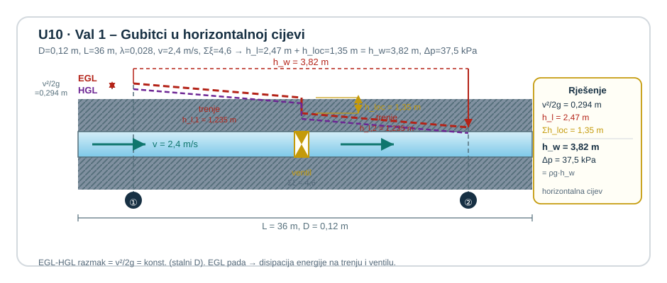
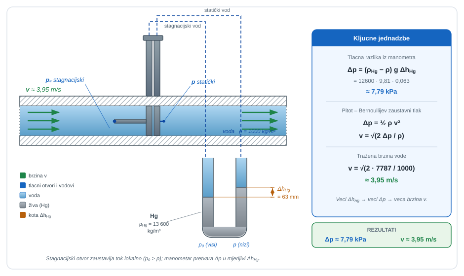
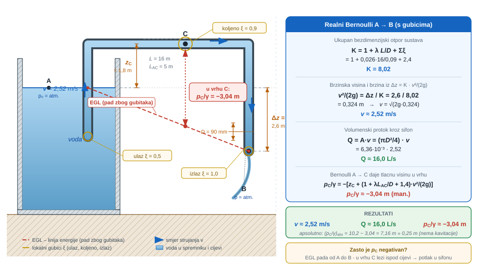
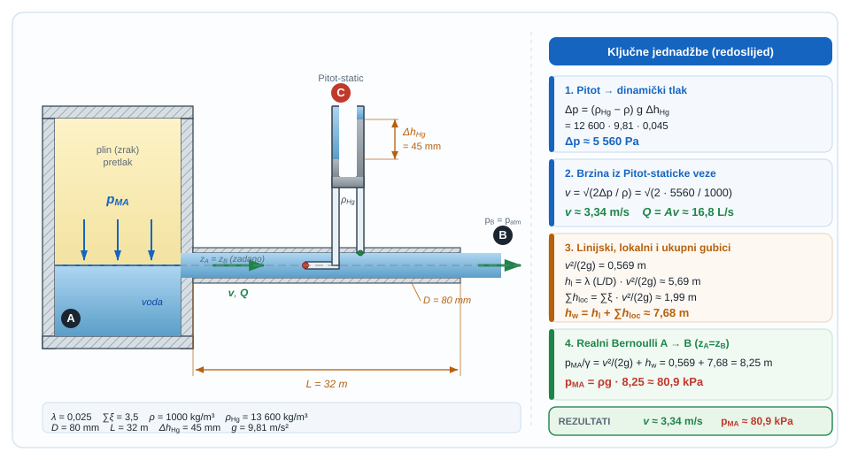
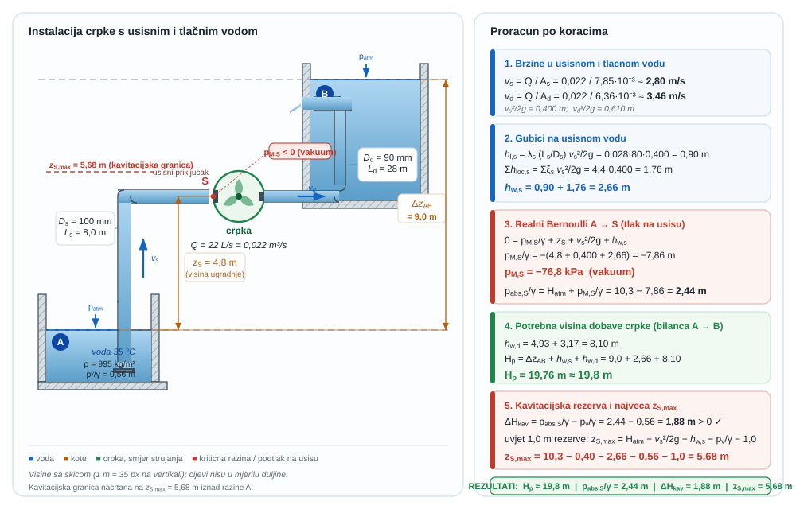
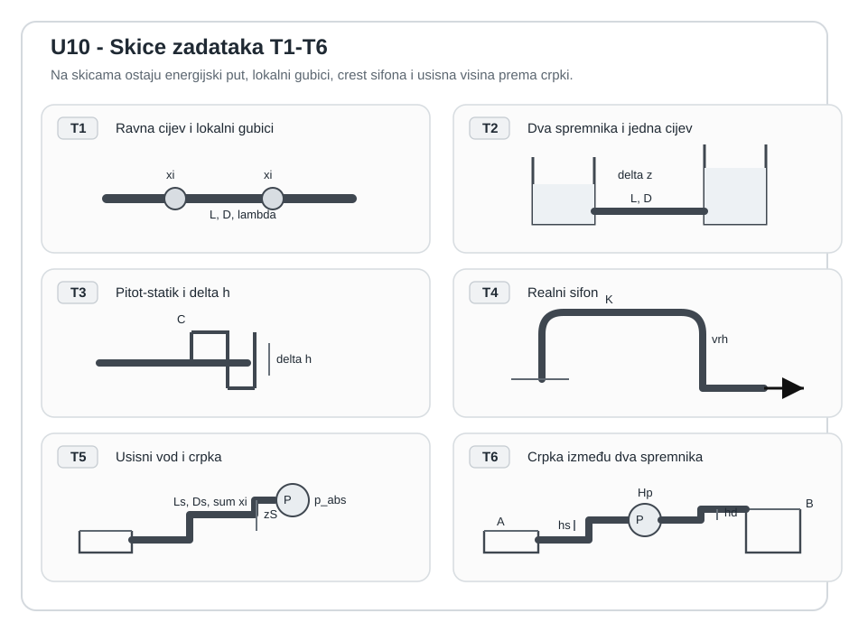

```{python}
#| label: fig-uvod-u10
#| fig-cap: "Pregled poglavlja: Realni Bernoulli i gubici"
#| fig-align: center
#| out-width: 95%

import matplotlib.pyplot as plt
import matplotlib.patches as mpatches
import matplotlib.gridspec as gridspec
import numpy as np

FLUID = '#AED6F1'; SOLID = '#BDC3C7'; FORCE = '#E74C3C'
VEL   = '#27AE60'; DARK  = '#1A252F'; SUB   = '#566573'

fig = plt.figure(figsize=(12, 5))
gs  = gridspec.GridSpec(2, 2, figure=fig, hspace=0.45, wspace=0.35)
ax_fiz  = fig.add_subplot(gs[:, 0])
ax_mat  = fig.add_subplot(gs[0, 1])
ax_prak = fig.add_subplot(gs[1, 1])

for ax, naslov, boja in zip(
    [ax_fiz, ax_mat, ax_prak],
    ['Fizikalni sustav', 'Ključna jednadžba', 'Primjena u praksi'],
    ['#EAF4FB', '#EAF9F1', '#FDF2E9']
):
    ax.set_facecolor(boja)
    ax.set_title(naslov, fontsize=10, fontweight='bold', pad=6)
    ax.set_xticks([]); ax.set_yticks([])
    for sp in ax.spines.values():
        sp.set_edgecolor('#BDC3C7'); sp.set_linewidth(1.2)

# --- ZONA 1: Cijev s EGL koji pada ---
ax = ax_fiz
ax.set_xlim(0, 10); ax.set_ylim(0, 8)

# Horizontalna cijev (zapravo ima mali pad, ali prikaz horizontalan)
ax.fill([0.5, 9.0, 9.0, 0.5], [2.5, 2.5, 4.5, 4.5], fc=FLUID, ec='#555', lw=1.8, alpha=0.8)

# EGL (pada u smjeru strujanja)
ax.plot([0.5, 9.0], [7.0, 5.2], color='#E74C3C', lw=2.0)
ax.text(9.1, 5.2, 'EGL', fontsize=9, va='center', color='#E74C3C')

# HGL (para s EGL za brzinsku visinu)
ax.plot([0.5, 9.0], [6.0, 4.2], color='#8E44AD', lw=1.8, ls='--')
ax.text(9.1, 4.2, 'HGL', fontsize=9, va='center', color='#8E44AD')

# h_w gubitak (razlika EGL pocetka i kraja)
ax.annotate('', xy=(8.0, 5.2), xytext=(8.0, 7.0),
    arrowprops=dict(arrowstyle='<->', color='#E74C3C', lw=1.5))
ax.text(8.2, 6.1, r'$h_w$', fontsize=12, va='center', color='#E74C3C')

# Strujanje
for y0 in [3.5]:
    ax.annotate('', xy=(7.5, y0), xytext=(2.0, y0),
        arrowprops=dict(arrowstyle='->', color=VEL, lw=2.0))

# Tocke 1 i 2
ax.plot(0.5, 7.0, 'o', ms=7, color='#555')
ax.text(0.7, 7.2, r'$E_1$', fontsize=9, color='#555')
ax.plot(9.0, 5.2, 'o', ms=7, color='#555')
ax.text(8.3, 5.0, r'$E_2$', fontsize=9, color='#555')

# --- ZONA 2: jednadžbe ---
ax = ax_mat
ax.text(0.5, 0.82, r'$E_1 = E_2 + h_w$',
    transform=ax.transAxes, ha='center', va='center', fontsize=14, color=DARK)
ax.text(0.5, 0.52, r'$h_l = \lambda\,\dfrac{L}{D}\,\dfrac{v^2}{2g}$',
    transform=ax.transAxes, ha='center', va='center', fontsize=12, color=DARK)
ax.text(0.5, 0.20, r'$h_{loc} = \xi\,\dfrac{v^2}{2g}$',
    transform=ax.transAxes, ha='center', va='center', fontsize=12, color=DARK)

# --- ZONA 3: Crpka s usisnim vodom ---
ax = ax_prak
ax.set_xlim(0, 10); ax.set_ylim(0, 6)

# Bazen (dno)
ax.add_patch(plt.Rectangle((0.5, 0.3), 4.0, 2.0, fc=FLUID, ec='#555', lw=1.5, alpha=0.7))
ax.plot([0.5, 4.5], [2.3, 2.3], color='#1565c0', lw=1.5)

# Usisna cijev (ide gore)
ax.fill([2.0, 2.6, 2.6, 2.0], [2.3, 2.3, 5.0, 5.0], fc=FLUID, ec='#555', lw=1.5, alpha=0.7)

# Crpka
ax.add_patch(mpatches.FancyBboxPatch((1.5, 4.8), 1.6, 0.8,
    boxstyle='round,pad=0.1', fc='#F39C12', ec='#D35400', lw=1.5))
ax.text(2.3, 5.2, r'$C$', fontsize=11, ha='center', va='center', color='white')

# h_w strelica
ax.annotate('', xy=(5.5, 2.3), xytext=(5.5, 5.2),
    arrowprops=dict(arrowstyle='<->', color='#E74C3C', lw=1.2))
ax.text(5.7, 3.75, r'$z_S + h_w$', fontsize=8.5, va='center', color='#E74C3C')
ax.text(5.0, 0.2, 'Usisni vod crpke (Strojarstvo)',
    fontsize=7.5, ha='center', color=SUB)

fig.suptitle('U10 – Realni Bernoulli i gubici',
             fontsize=13, fontweight='bold', y=1.01)
plt.show()
```

Kad energija više ne ostaje ista duž strujnice.

<span class="mf1-ch-ref"><span class="mf1-ch-code">U09</span><span class="mf1-ch-title">Bernoullijeva jednadžba idealnog fluida</span></span> zatvorio je idealni Bernoulli: energija se preraspodjeljuje između tlaka, brzine i visine, ali se ne gubi.

<span class="mf1-ch-ref"><span class="mf1-ch-code">U10</span><span class="mf1-ch-title">Realni Bernoulli i gubici</span></span> dodaje ono što stvarni fluidi ne dopuštaju zanemariti: trenje, vrtloženje i lokalne poremećaje. Zato ukupna raspoloživa energija više ne ostaje stalna, nego opada u smjeru strujanja.

::: {.mf1-application}
<p class="mf1-box-label">Inženjerski kontekst</p>

Realni Bernoulli ulazi u svaki cjevovod koji stvarno radi: servisne crpke, rashladne krugove motora, brodske balastne i protupožarne vodove te ventilacijske kanale s lokalnim otporima. Upravo ovdje tehnička praksa postaje stroža od idealnog modela, jer promjer, hrapavost, ventil, koljeno i usisna visina zajedno odlučuju hoće li sustav dobiti traženi protok ili otvoriti rizik kavitacije.
:::

## Fizikalni uvod i matematički izvod

Za realni fluid između presjeka 1 i 2 Bernoullijeva jednadžba dobiva dodatni član ukupnog gubitka energije:

$$
\frac{p_1}{\rho g} + \frac{v_1^2}{2g} + z_1 = \frac{p_2}{\rho g} + \frac{v_2^2}{2g} + z_2 + h_w
$$

Član $h_w$ nije kozmetički dodatak, nego fizikalna cijena strujanja realnog fluida. Najčešće se rastavlja na:

$$
h_w = h_l + \sum h_{loc}
$$

pri čemu je linijski gubitak

$$
h_l = \lambda \frac{L}{D} \frac{v^2}{2g}
$$

::: {.callout-note}
## 📐 Fizikalno značenje
Darcy-Weisbachova formula kaže da gubitak energije na ravnoj dionici raste proporcionalno s duljinom cijevi, obrnuto s promjerom i kvadratično s brzinom. Faktor $\lambda$ (koeficijent trenja) ovisi o hrapavosti stjenke i Reynoldsovom broju — tj. o turbulenciji. Gubitak nije samo „trenje stjenke" nego i disipacija u turbulentnim vrtlozima koji se stalno stvaraju i raspadaju po poprečnom presjeku. Zato dulji vod, manji promjer i veća brzina zajedno eksponencijalno povećavaju energijsku cijenu.
:::

a lokalni gubitak

$$
h_{loc} = \xi \frac{v^2}{2g}
$$

::: {.callout-note}
## 📐 Fizikalno značenje
Lokalni gubici ($\xi v^2/2g$) modeliraju energijsku disipaciju na mjestima gdje strujanje nagle mijenja smjer ili brzinu: ventili, koljena, ulazi, izlazi, nagle promjene presjeka. Koeficijent $\xi$ je eksperimentalni broj koji govori koliki višekratnik brzinske visine košta svaki element. Ulazni rub s oštrinom ima $\xi \approx 0{,}5$, zaobljeni ulaz $\xi \approx 0{,}04$ — razlika od 10× za isti protok. U kratkim cjevovodima lokalni gubici mogu biti dominantni.
:::

::: {.mf1-izvod}
<p class="mf1-box-label">Matematički izvod</p>

Za stacionarni tok realnoga fluida između dvaju presjeka 1 i 2 mehanička energija više nije očuvana kao u idealnom Bernoulliju. Dio raspoložive energije nepovratno se pretvara u unutarnju energiju, vrtloge i disipaciju, pa opća energijska bilanca po jedinici težine poprima oblik

$$
\left(\frac{p}{\rho g} + \alpha\frac{v^2}{2g} + z\right)_1 + h_p - h_t = \left(\frac{p}{\rho g} + \alpha\frac{v^2}{2g} + z\right)_2 + h_w.
$$

U ovom poglavlju nema strojeva između presjeka, pa su $h_p = 0$ i $h_t = 0$, a za uobičajeno tehničko čitanje uzima se i $\alpha \approx 1$. Zato ostaje radni zapis

$$
\frac{p_1}{\rho g} + \frac{v_1^2}{2g} + z_1 = \frac{p_2}{\rho g} + \frac{v_2^2}{2g} + z_2 + h_w.
$$

Član $h_w$ nije nova sila, nego pad raspoložive mehaničke visine između dviju točaka. U praktičnom cjevovodnom računu on se rastavlja na linijski i lokalni dio:

$$
h_w = h_l + \sum h_{loc}.
$$

Eksperimentalni Darcy-Weisbachov zakon daje linijski gubitak na ravnoj dionici cijevi

$$
h_l = \lambda\frac{L}{D}\frac{v^2}{2g},
$$

dok se lokalni gubitci na ventilima, koljenima, ulazima, izlazima i naglim promjenama presjeka zapisuju kao

$$
h_{loc} = \xi\frac{v^2}{2g}.
$$

U tim je formulama $\lambda$ bezdimenzijski koeficijent trenja, $L/D$ geometrijski omjer koji pokazuje koliko se dugo trenje razvija duž cijevi, $\xi$ koeficijent lokalnoga elementa, a $v^2/(2g)$ brzinska visina koja predstavlja raspoloživu kinetičku energiju toka po jedinici težine. Time se ista Bernoullijeva slika iz <span class="mf1-ch-ref"><span class="mf1-ch-code">U09</span><span class="mf1-ch-title">Bernoullijeva jednadžba idealnog fluida</span></span> pretvara iz idealne u radno realnu: svaki pad energijske linije izravno znači da je dio mehaničke energije već potrošen na disipaciju.

::: {.callout-note}
## 📝 Razrada koraka
Korak: od idealnog Bernoullija → realni zapis s gubicima i preuredbom za $h_w$

Idealni Bernoulli: $\frac{p_1}{\rho g} + \frac{v_1^2}{2g} + z_1 = \frac{p_2}{\rho g} + \frac{v_2^2}{2g} + z_2$

Realni fluid gubi energiju — označimo taj iznos $h_w$ (gubitak po jedinici težine, u metrima). Energijska bilanca postaje:
$$
\left(\frac{p_1}{\rho g} + \frac{v_1^2}{2g} + z_1\right) - h_w = \frac{p_2}{\rho g} + \frac{v_2^2}{2g} + z_2.
$$
Preuredimo tako da $h_w$ stoji na desnoj strani (konvencija: gubici su pozitivni i stoje uz point 2):
$$
\frac{p_1}{\rho g} + \frac{v_1^2}{2g} + z_1 = \frac{p_2}{\rho g} + \frac{v_2^2}{2g} + z_2 + h_w.
$$
Kada su zadani svi ostali članovi, $h_w$ se izolira jednostavnim premještanjem:
$$
h_w = \left(\frac{p_1}{\rho g} + \frac{v_1^2}{2g} + z_1\right) - \left(\frac{p_2}{\rho g} + \frac{v_2^2}{2g} + z_2\right).
$$
To je fizikalno: $h_w$ je razlika raspoložive mehaničke visine između točaka 1 i 2.
:::
:::

Za osnovno čitanje realnog Bernoullija najprije treba razdvojiti dvije vrste fizikalne cijene strujanja:

- linijski gubici dolaze iz trenja na ravnoj dionici cijevi
- lokalni gubici dolaze iz ventila, koljena, suženja, proširenja, ulaza i izlaza

Najčešća metodička greška nastaje kad se svi gubici tretiraju kao jedna mutna brojka bez mjesta u sustavu. U realnom Bernoulliju svaki gubitak mora imati i fizikalnu lokaciju i ispravan zapis. Isto vrijedi i za čitanje energijskih linija. U <span class="mf1-ch-ref"><span class="mf1-ch-code">U09</span><span class="mf1-ch-title">Bernoullijeva jednadžba idealnog fluida</span></span> je `EGL` ostajao vodoravan. U <span class="mf1-ch-ref"><span class="mf1-ch-code">U10</span><span class="mf1-ch-title">Realni Bernoulli i gubici</span></span> to više nije slučaj:

- `EGL` pada u smjeru strujanja jer se dio energije disipira
- `HGL` prati tlačnu i geodetsku visinu
- razmak `EGL - HGL` jednak je brzinskoj visini $v^2/(2g)$

Između dvaju promatranih presjeka pad energijske linije jednak je upravo ukupnom gubitku $h_w$. To je najkraći način da se vizualno vidi koliko je energije izgubljeno i koliko je još ostalo na raspolaganju sustavu.

## Riješeni primjeri

::: {.mf1-we}
<p class="mf1-box-label">Riješeni primjer - Linijski i lokalni gubici u horizontalnoj cijevi <span class="mf1-level">T2</span></p>

**Zadano**

Voda struji horizontalnom cijevi promjera $D = 0{,}12\ \text{m}$ i duljine $L = 36\ \text{m}$ srednjom brzinom $v = 2{,}4\ \text{m/s}$. Koeficijent trenja je $\lambda = 0{,}028$, a zbroj lokalnih koeficijenata na ulazu, ventilu i koljenu iznosi $\sum \xi = 4{,}6$.

**Traženo**

1. linijski gubitak $h_l$.
2. lokalni gubitak $\sum h_{loc}$.
3. ukupni gubitak energije $h_w$.
4. pad tlaka $\Delta p$.

Uzmi za vodu $\rho = 1000\ \text{kg/m}^3$.



**Pretpostavke i model**

Promatra se horizontalna cijev sa zadanom srednjom brzinom. Zato se energijska bilanca ne troši na promjenu geodetske visine, nego samo na disipaciju uzrokovanu trenjem na ravnoj dionici i dodatnim gubicima na lokalnim elementima.

**Rješenje**

Najprije izračunamo brzinsku visinu:

$$
\frac{v^2}{2g} = \frac{2{,}4^2}{2 \cdot 9{,}81} \approx 0{,}294\ \text{m}
$$

Linijski gubitak glasi

$$
h_l = \lambda \frac{L}{D} \frac{v^2}{2g} = 0{,}028 \cdot \frac{36}{0{,}12} \cdot 0{,}294
$$

odakle slijedi

$$
h_l \approx 2{,}47\ \text{m}
$$

Lokalni gubitak iznosi

$$
\sum h_{loc} = \sum \xi \frac{v^2}{2g} = 4{,}6 \cdot 0{,}294 \approx 1{,}35\ \text{m}
$$

Ukupni gubitak energije zato je

$$
h_w = h_l + \sum h_{loc} \approx 2{,}47 + 1{,}35 = 3{,}82\ \text{m}
$$

Za horizontalnu cijev pad tlaka glasi

$$
\Delta p = \rho g h_w = 1000 \cdot 9{,}81 \cdot 3{,}82 \approx 3{,}75 \cdot 10^4\ \text{Pa}
$$

odnosno

$$
\Delta p \approx 37{,}5\ \text{kPa}
$$

**Provjera i komentar**

1. Ukupni gubitak mora biti veći od svakog pojedinačnog doprinosa.
2. Ako se brzina poveća, oba tipa gubitaka rastu s članom $v^2$.
3. U horizontalnoj cijevi pad tlaka izravno prati izgubljenu energijsku visinu.
:::

::: {.mf1-we}
<p class="mf1-box-label">Riješeni primjer - Pitot-statička cijev u struji vode <span class="mf1-level">T2</span></p>

**Zadano**

Pitot-statička cijev uronjena je u struju vode gustoće $\rho = 1000\ \text{kg/m}^3$ i spojena na živin diferencijalni manometar gustoće $\rho_{Hg} = 13600\ \text{kg/m}^3$. Očitana razlika razina žive iznosi

$$
\Delta h_{Hg} = 63\ \text{mm}
$$

**Traženo**

1. Odrediti brzinu strujanja vode.



**Pretpostavke i model**

Na vrhu Pitot-cijevi tok se lokalno zaustavlja, pa se dinamički tlak pretvara u porast tlaka. Manometar zato ne mjeri izravno brzinu, nego razliku stagnacijskog i statičkog tlaka. Iz te tlačne razlike brzina se dobiva iz Bernoullijeve relacije za lokalno zaustavljanje toka.

**Rješenje**

Razlika tlakova između stagnacijske i statičke točke očitava se preko živinog manometra:

$$
\Delta p = (\rho_{Hg} - \rho)g\Delta h_{Hg}
$$

Pri tome je

$$
\Delta h_{Hg} = 0{,}063\ \text{m}
$$

pa slijedi

$$
\Delta p = (13600 - 1000) \cdot 9{,}81 \cdot 0{,}063
$$

odnosno

$$
\Delta p \approx 7{,}79 \cdot 10^3\ \text{Pa} = 7{,}79\ \text{kPa}
$$

Za Pitot-statičku cijev dinamički tlak glasi

$$
\Delta p = \frac{1}{2}\rho v^2
$$

pa je tražena brzina

$$
v = \sqrt{\frac{2\Delta p}{\rho}} = \sqrt{\frac{2 \cdot 7787}{1000}}
$$

odakle dobivamo

$$
v \approx 3{,}95\ \text{m/s}
$$

**Provjera i komentar**

Očitani manometarski stupac od $63\ \text{mm Hg}$ odgovara brzini strujanja vode od približno $4\ \text{m/s}$. Time se vidi kako <span class="mf1-ch-ref"><span class="mf1-ch-code">U10</span><span class="mf1-ch-title">Realni Bernoulli i gubici</span></span> spaja energetsku sliku toka s lokalnim mjerenjem u jednoj točki sustava.

1. Veća očitana razlika razina mora značiti veću tlačnu razliku i veću brzinu.
2. Ako se zaboravi razlika gustoća $\rho_{Hg} - \rho$, manometarski tlak će biti precijenjen.
3. Brzina reda nekoliko metara u sekundi razumna je za dinamički tlak reda nekoliko kilopaskala u vodi.
:::

Ta mjerna scena zatvara lokalno očitanje energije. Treća jezgrena scena <span class="mf1-ch-ref"><span class="mf1-ch-code">U10</span><span class="mf1-ch-title">Realni Bernoulli i gubici</span></span> je realni sifon: isti mehanizam kao u <span class="mf1-ch-ref"><span class="mf1-ch-code">U09</span><span class="mf1-ch-title">Bernoullijeva jednadžba idealnog fluida</span></span>, ali sada raspoloživu geodetsku visinu troše i izlazna brzina i cijeli paket linijskih i lokalnih gubitaka.

::: {.mf1-we}
<p class="mf1-box-label">Riješeni primjer - Servisni sifon s raspodijeljenim gubicima <span class="mf1-level">T2</span></p>

**Zadano**

Servisni spremnik prazni se sifonom promjera $D = 90\ \text{mm}$. Između slobodne površine spremnika `A` i slobodnog izlaza `B` postoji visinska razlika

$$
\Delta z = 2{,}6\ \text{m}
$$

Najviša točka sifona `C` nalazi se $z_C = 1{,}8\ \text{m}$ iznad slobodne površine spremnika. Ukupna duljina cijevi je $L = 16\ \text{m}$, od čega na dionicu `A-C` otpada $L_{AC} = 5\ \text{m}$. Za cijeli sifon uzmi Darcyjev koeficijent trenja

$$
\lambda = 0{,}026
$$

a zbroj lokalnih gubitaka na ulazu, vršnom koljenu i izlazu

$$
\sum \xi = 0{,}5 + 0{,}9 + 1{,}0 = 2{,}4
$$

**Traženo**

1. brzinu strujanja $v$ u sifonu.
2. volumenski protok $Q$.
3. tlačnu visinu $p_C/\gamma$ u najvišoj točki `C`.

Za procjenu sigurnosti uzmi da je atmosferska visina $10{,}2\ \text{m}$ vodenog stupca, a naponska visina pare $0{,}25\ \text{m}$ vodenog stupca.



**Pretpostavke i model**

Oba kraja sustava su na atmosferskom tlaku, a brzina na slobodnoj površini spremnika zanemariva je prema brzini u cijevi. Zato Bernoullijeva jednadžba između slobodne površine `A` i slobodnog izlaza `B` sadrži izlaznu brzinsku visinu i ukupne linijske i lokalne gubitke.

**Rješenje**

Iz realnog Bernoullija između `A` i `B` slijedi

$$
\Delta z = \frac{v^2}{2g} + \lambda \frac{L}{D}\frac{v^2}{2g} + \sum \xi \frac{v^2}{2g}
$$

odnosno

$$
\Delta z = \left(1 + \lambda \frac{L}{D} + \sum \xi\right)\frac{v^2}{2g}
$$

Najprije izračunajmo ukupni bezdimenzijski otpor sustava:

$$
1 + \lambda \frac{L}{D} + \sum \xi = 1 + 0{,}026 \cdot \frac{16}{0{,}09} + 2{,}4 = 8{,}02
$$

Zato je brzinska visina u cijevi

$$
\frac{v^2}{2g} = \frac{\Delta z}{8{,}02} = \frac{2{,}6}{8{,}02} = 0{,}324\ \text{m}
$$

pa slijedi

$$
v = \sqrt{2g \cdot 0{,}324} = 2{,}52\ \text{m/s}
$$

Površina presjeka sifona iznosi

$$
A = \frac{\pi D^2}{4} = \frac{\pi \cdot 0{,}09^2}{4} = 6{,}36 \cdot 10^{-3}\ \text{m}^2
$$

pa je volumenski protok

$$
Q = Av = 6{,}36 \cdot 10^{-3} \cdot 2{,}52 = 1{,}60 \cdot 10^{-2}\ \text{m}^3/\text{s}
$$

odnosno približno

$$
Q \approx 16{,}0\ \text{L/s}
$$

Za tlak u vrhu sifona pišemo Bernoullija između slobodne površine `A` i točke `C`. Do točke `C` ulaze visina vrha, brzinska visina, linijski gubici na dionici $L_{AC}$ i lokalni gubici ulaza i vršnog koljena:

$$
0 = \frac{p_C}{\gamma} + z_C + \frac{v^2}{2g} + \lambda \frac{L_{AC}}{D}\frac{v^2}{2g} + (0{,}5 + 0{,}9)\frac{v^2}{2g}
$$

Kako je

$$
\lambda \frac{L_{AC}}{D} = 0{,}026 \cdot \frac{5}{0{,}09} = 1{,}44
$$

slijedi

$$
\frac{p_C}{\gamma} = -\left[1{,}8 + \left(1 + 1{,}44 + 1{,}4\right)0{,}324\right] = -3{,}04\ \text{m}
$$

To je manometarska tlačna visina u točki `C`. Apsolutna tlačna visina zato je

$$
\left(\frac{p_C}{\gamma}\right)_{abs} = 10{,}2 - 3{,}04 = 7{,}16\ \text{m}
$$

Kako je to mnogo više od naponske visine pare od $0{,}25\ \text{m}$, u ovom primjeru nema neposredne opasnosti od isparavanja u vrhu sifona.

**Provjera i komentar**

Zbog gubitaka realni sifon daje brzinu od samo oko $2{,}5\ \text{m/s}$ i protok od oko $16\ \text{L/s}$, znatno manji nego u idealnom slučaju istog geodetskog pada. U vrhu sifona tlak pada na oko $-3{,}0\ \text{m}$ manometarske visine, ali je apsolutna tlačna visina i dalje dovoljno visoka. Upravo takva provjera pokazuje zašto <span class="mf1-ch-ref"><span class="mf1-ch-code">U10</span><span class="mf1-ch-title">Realni Bernoulli i gubici</span></span> mora spojiti gubitke i tlak u jedinstvenu energetsku sliku.

1. U realnom sifonu brzina mora biti manja nego u idealnom sifonu iste visinske razlike.
2. Tlak u vrhu sifona mora biti niži od atmosferskog i dodatno se smanjivati kad rastu gubici na usisnom kraku.
3. Ako bi apsolutna tlačna visina pala ispod naponske visine pare, rezultat bi upozoravao da idealizirani rad sifona više nije fizikalno siguran.
:::

<span class="mf1-ch-ref"><span class="mf1-ch-code">U10</span><span class="mf1-ch-title">Realni Bernoulli i gubici</span></span> nije samo poglavlje o padovima energije nego i prvo mjesto gdje se brzina dobiva iz lokalno izmjerene tlačne razlike, preko $p_0 - p = \rho v^2/2$ i $v = \sqrt{2(p_0-p)/\rho}$. Time ista energetska slika postaje most između teorije i mjerenja: može se čitati ili iz bilance duž sustava ili iz lokalne stagnacijske točke, a prirodni integrativni korak je stvarni vod u kojem Pitot više nije sam sebi svrha, nego ulazna mjerna informacija za cijelu energetsku bilancu.

::: {.mf1-ch}
<p class="mf1-box-label">Cjeloviti zadatak - tlačni spremnik s Pitot kontrolom i realnim gubicima <span class="mf1-level">T3</span></p>

**Zadano**

Zatvoreni servisni spremnik potiskuje vodu u horizontalni ispitni vod stalnog promjera

$$
D = 80\ \text{mm}
$$

koji na kraju slobodno istječe u atmosferu u točki `B`. Slobodna površina vode u spremniku `A` i os izlazne cijevi nalaze se na istoj visinskoj razini. Ukupna duljina cijevi iznosi

$$
L = 32\ \text{m}
$$

a Darcyjev koeficijent trenja je

$$
\lambda = 0{,}025
$$

Zbroj lokalnih koeficijenata na ulazu, regulacijskom ventilu i izlazu iznosi

$$
\sum \xi = 3{,}5
$$

U mjernom presjeku `C` u istoj cijevi Pitot-statička cijev spojena je na živin diferencijalni manometar gustoće

$$
\rho_{Hg} = 13600\ \text{kg/m}^3
$$

Za vodu uzmi

$$
\rho = 1000\ \text{kg/m}^3
$$

a očitana razlika razina žive je

$$
\Delta h_{Hg} = 45\ \text{mm}
$$

**Traženo**

1. brzinu strujanja $v$ u cijevi.
2. volumenski protok $Q$.
3. linijski gubitak $h_l$, lokalni gubitak $\sum h_{loc}$ i ukupni gubitak $h_w$.
4. potreban manometarski pretlak plina u spremniku $p_{M A}$.



**Pretpostavke i model**

Pitot u presjeku `C` najprije daje lokalnu brzinu u cijevi. Kako je promjer cijevi stalan, ista brzina vrijedi i za ostatak voda. Tek nakon toga realni Bernoulli između slobodne površine spremnika `A` i slobodnog izlaza `B` zatvara ukupni pad raspoložive energije na izlaznu brzinsku visinu i sve linijske i lokalne gubitke.

**Rješenje**

Najprije iz Pitot-manometarskog očitanja dobivamo dinamički tlak:

$$
\Delta p = (\rho_{Hg} - \rho)g\Delta h_{Hg}
$$

odnosno

$$
\Delta p = (13600 - 1000) \cdot 9{,}81 \cdot 0{,}045 = 5560\ \text{Pa}
$$

Za Pitot-statičku cijev vrijedi

$$
\Delta p = \frac{1}{2}\rho v^2
$$

pa je brzina strujanja

$$
v = \sqrt{\frac{2\Delta p}{\rho}} = \sqrt{\frac{2 \cdot 5560}{1000}} = 3{,}34\ \text{m/s}
$$

Površina presjeka cijevi iznosi

$$
A = \frac{\pi D^2}{4} = \frac{\pi \cdot 0{,}08^2}{4} = 5{,}03 \cdot 10^{-3}\ \text{m}^2
$$

zato je volumenski protok

$$
Q = Av = 5{,}03 \cdot 10^{-3} \cdot 3{,}34 = 1{,}68 \cdot 10^{-2}\ \text{m}^3/\text{s}
$$

odnosno

$$
Q \approx 16{,}8\ \text{L/s}
$$

Brzinska visina glasi

$$
\frac{v^2}{2g} = \frac{3{,}34^2}{2 \cdot 9{,}81} = 0{,}569\ \text{m}
$$

Linijski gubitak iznosi

$$
h_l = \lambda \frac{L}{D} \frac{v^2}{2g} = 0{,}025 \cdot \frac{32}{0{,}08} \cdot 0{,}569
$$

pa slijedi

$$
h_l = 5{,}69\ \text{m}
$$

Lokalni gubitak je

$$
\sum h_{loc} = \sum \xi \frac{v^2}{2g} = 3{,}5 \cdot 0{,}569 = 1{,}99\ \text{m}
$$

Ukupni gubitak zato je

$$
h_w = h_l + \sum h_{loc} = 5{,}69 + 1{,}99 = 7{,}68\ \text{m}
$$

Sada pišemo realni Bernoulli između slobodne površine spremnika `A` i slobodnog izlaza `B`. Kako su $z_A = z_B$, brzina na slobodnoj površini je zanemariva, a na izlazu je tlak jednak atmosferskom, u zapisu s manometarskim tlakom vrijedi

$$
\frac{p_{M A}}{\gamma} = \frac{v^2}{2g} + h_w
$$

odnosno

$$
\frac{p_{M A}}{\gamma} = 0{,}569 + 7{,}68 = 8{,}25\ \text{m}
$$

Potreban manometarski pretlak plina u spremniku zato je

$$
p_{M A} = \rho g \cdot 8{,}25 = 1000 \cdot 9{,}81 \cdot 8{,}25 = 8{,}09 \cdot 10^4\ \text{Pa}
$$

odnosno

$$
p_{M A} \approx 80{,}9\ \text{kPa}
$$

**Provjera i komentar**

Ovaj primjer zatvara cjelovit slijed <span class="mf1-ch-ref"><span class="mf1-ch-code">U10</span><span class="mf1-ch-title">Realni Bernoulli i gubici</span></span> u jednom sustavu: Pitot najprije daje brzinu od oko $3{,}34\ \text{m/s}$, iz nje slijedi protok od oko $16{,}8\ \text{L/s}$, ukupni gubitak iznosi oko $7{,}68\ \text{m}$, a da bi takav tok uopće postojao, spremnik mora biti pod manometarskim pretlakom od oko $80{,}9\ \text{kPa}$.

1. Ako Pitot očita veću razliku razina, moraju rasti i brzina i svi gubici jer ovdje sve ovisi o članu $v^2$.
2. Potreban pretlak u spremniku mora biti veći od same izlazne brzinske visine jer osim ubrzanja mora platiti i cijeli paket disipativnih gubitaka.
3. Ako se u ovom zadatku odmah piše Bernoulli bez vraćanja brzine iz Pitota, nestaje veza između lokalnog mjerenja i energetske slike cijelog voda.
:::

::: {.mf1-we}
<p class="mf1-box-label">Riješeni primjer - Usisni tlak na ulazu male servisne crpke <span class="mf1-level">T2</span></p>

**Zadano**

Otvoreni usisni bazen napaja malu servisnu crpku. Osa usisnog priključka crpke `S` nalazi se

$$
z_S = 6{,}6\ \text{m}
$$

iznad slobodne površine bazena. Kroz usisni vod promjera

$$
D = 80\ \text{mm}
$$

i duljine

$$
L = 4{,}5\ \text{m}
$$

struji voda protokom

$$
Q = 0{,}014\ \text{m}^3/\text{s}.
$$

Vrijedi Darcyjev koeficijent trenja

$$
\lambda = 0{,}030
$$

i zbroj lokalnih koeficijenata na usisnoj košari, ulazu i jednom koljenu

$$
\sum \xi = 1{,}6.
$$

Atmosferska visina iznosi $10{,}2\ \text{m}$ vodenog stupca, a naponska visina pare $0{,}25\ \text{m}$ vodenog stupca.

**Traženo**

1. Odrediti brzinu $v_s$ u usisnom vodu.
2. Odrediti ukupni usisni gubitak $h_{w,s}$.
3. Odrediti manometarsku i apsolutnu tlačnu visinu u točki `S`.
4. Procijeniti postoji li neposredna opasnost od kavitacije.

```{python}
#| label: fig-u10-usisni-tlak-crpka
#| fig-cap: "Usisni vod servisne crpke: D=80 mm, L=4,5 m, z_S=6,6 m, λ=0,030"
#| fig-align: center
#| out-width: 45%

import matplotlib.pyplot as plt
import numpy as np

fig, ax = plt.subplots(figsize=(4.5, 6.0))
ax.set_xlim(0, 8); ax.set_ylim(0, 11)
ax.axis('off')

# Koordinate (skala: 1m = 1 plot jed)
# Bazen slobodna povrsina na y=1.0, osa crpke na y=1.0+6.6=7.6
z_basin = 1.0; z_pump = z_basin + 6.6
Dpipe = 0.4  # vizualni promjer cijevi

# Voda u bazenu
ax.add_patch(plt.Rectangle((1.0, 0.0), 4.0, z_basin + 0.3,
    fc='#AED6F1', ec='#555', lw=1.5, alpha=0.7))
ax.plot([1.0, 5.0], [z_basin + 0.3, z_basin + 0.3], color='#1565c0', lw=1.5)
ax.text(0.8, z_basin + 0.5, 'p.p. (A)', fontsize=7.5, color='#1565c0')

# Usisna cijev
ax.fill([2.5 - Dpipe, 2.5 + Dpipe, 2.5 + Dpipe, 2.5 - Dpipe],
    [z_basin + 0.3, z_basin + 0.3, z_pump, z_pump],
    fc='#AED6F1', ec='#555', lw=1.8, alpha=0.7)

# Crpka
from matplotlib.patches import FancyBboxPatch
ax.add_patch(FancyBboxPatch((1.5, z_pump), 2.0, 0.8,
    boxstyle='round,pad=0.1', fc='#F39C12', ec='#D35400', lw=2.0))
ax.text(2.5, z_pump + 0.4, r'$S$ (crpka)', fontsize=8, ha='center', va='center', color='white')

# z_S kota
ax.annotate('', xy=(5.5, z_basin + 0.3), xytext=(5.5, z_pump),
    arrowprops=dict(arrowstyle='<->', color='#333', lw=1.2))
ax.text(5.7, (z_basin + 0.3 + z_pump) / 2, r'$z_S=6{,}6\ m$',
    fontsize=8, va='center', color='#1A252F')

# EGL (vrijedi na slobodnoj povrsini, pada do S)
# Na slobodnoj povrsini EGL = p_atm/rho*g + 0 + z_A = h_atm + z_A
h_atm = 10.2
egl_A = z_basin + 0.3 + h_atm * 0.5  # skala: h_atm=10.2m skaliran na 5.1
egl_S = z_pump - 1.0  # nesto ispod crpke (gubitak)

ax.plot([1.5, 2.5], [egl_A, egl_S], color='#E74C3C', lw=2.0, ls='-')
ax.text(2.7, egl_S, 'EGL pada (gubici)', fontsize=7.5, va='center', color='#E74C3C')

# D oznaka cijevi
ax.annotate('', xy=(2.5 - Dpipe, z_basin + 2.5), xytext=(2.5 + Dpipe, z_basin + 2.5),
    arrowprops=dict(arrowstyle='<->', color='#333', lw=0.8))
ax.text(2.5, z_basin + 2.0, r'$D=80\ mm$', fontsize=7.5, ha='center', color='#1A252F')

# Kavitacijska granica (upozorenje)
kavit_y = z_pump - 0.5
ax.plot([1.2, 3.8], [kavit_y, kavit_y], color='#E67E22', lw=1.0, ls=':')
ax.text(4.0, kavit_y, r'$p_{vap}$', fontsize=7.5, va='center', color='#E67E22')

ax.set_title('Usisni tlak servisne crpke (T2)', fontsize=9.5, pad=4)
plt.tight_layout()
plt.show()
```

**Pretpostavke i model**

Promatra se samo usisni krak između slobodne površine bazena `A` i ulaza u crpku `S`. Slobodna površina je na atmosferskom tlaku i njezina je brzina zanemariva. Zato realni Bernoulli izravno pokazuje kako se geodetska visina, brzinska visina i svi usisni gubici pretvaraju u pad apsolutnog tlaka na ulazu u crpku. Prag sigurnosti čita se tek iz usporedbe apsolutne tlačne visine s naponskom visinom pare.

**Rješenje**

Površina usisnog presjeka iznosi

$$
A_s = \frac{\pi D^2}{4} = \frac{\pi \cdot 0{,}08^2}{4} = 5{,}03 \cdot 10^{-3}\ \text{m}^2
$$

pa je brzina u usisnom vodu

$$
v_s = \frac{Q}{A_s} = \frac{0{,}014}{5{,}03 \cdot 10^{-3}} = 2{,}78\ \text{m/s}.
$$

Brzinska visina zato iznosi

$$
\frac{v_s^2}{2g} = \frac{2{,}78^2}{2 \cdot 9{,}81} = 0{,}395\ \text{m}.
$$

Linijski gubitak na usisu je

$$
h_{l,s} = \lambda \frac{L}{D}\frac{v_s^2}{2g} = 0{,}030 \cdot \frac{4{,}5}{0{,}08} \cdot 0{,}395 = 0{,}667\ \text{m}
$$

a lokalni gubitak

$$
\sum h_{loc,s} = \sum \xi \frac{v_s^2}{2g} = 1{,}6 \cdot 0{,}395 = 0{,}632\ \text{m}.
$$

Ukupni usisni gubitak zato je

$$
h_{w,s} = h_{l,s} + \sum h_{loc,s} = 0{,}667 + 0{,}632 = 1{,}30\ \text{m}.
$$

Sada pišemo realni Bernoulli između slobodne površine `A` i usisne točke `S` u manometarskom zapisu:

$$
0 = \frac{p_S}{\gamma} + \frac{v_s^2}{2g} + z_S + h_{w,s}
$$

odnosno

$$
\frac{p_S}{\gamma} = -(0{,}395 + 6{,}6 + 1{,}30) = -8{,}30\ \text{m}.
$$

To je manometarska tlačna visina na usisu. Apsolutna tlačna visina zato iznosi

$$
\left(\frac{p_S}{\gamma}\right)_{abs} = 10{,}2 - 8{,}30 = 1{,}90\ \text{m}.
$$

Raspoloživa sigurnosna razlika do naponske visine pare je

$$
1{,}90 - 0{,}25 = 1{,}65\ \text{m}.
$$

Dakle, usis je još iznad granice isparavanja, ali rezerva nije velika.

**Provjera i komentar**

1. Manometarski tlak na usisu mora biti negativan jer crpka vuče vodu iz spremnika koji je ispod njezina ulaza.
2. Svaki dodatni usisni gubitak ili veća visina ugradnje odmah smanjuju apsolutni tlak na ulazu u crpku.
3. O sigurnosti se ne odlučuje po manometarskom nego po apsolutnom tlaku u usporedbi s naponskom visinom pare.
:::

::: {.mf1-ch}
<p class="mf1-box-label">Cjeloviti zadatak - Usisni vod servisne crpke s kavitacijskom granicom <span class="mf1-level">T4</span></p>

**Zadano**

Otvoreni servisni bazen `A` opskrbljuje centrifugalnu crpku koja vodu šalje u otvoreni gornji rashladni spremnik `B`. Osa usisnog priključka crpke `S` nalazi se

$$
z_S = 4{,}8\ \text{m}
$$

iznad slobodne površine bazena `A`, a slobodna površina spremnika `B` nalazi se

$$
\Delta z_{AB} = 9{,}0\ \text{m}
$$

iznad slobodne površine bazena `A`.

Radni protok sustava je

$$
Q = 22\ \text{L/s} = 0{,}022\ \text{m}^3/\text{s}
$$

Voda temperature oko $35^\circ\text{C}$ ima gustoću

$$
\rho = 995\ \text{kg/m}^3
$$

a odgovarajuća naponska visina pare je

$$
\frac{p_v}{\gamma} = 0{,}56\ \text{m}
$$

Atmosferska tlačna visina je

$$
H_{atm} = 10{,}3\ \text{m}
$$

Usisni vod `A-S` ima:

- promjer $D_s = 100\ \text{mm}$
- duljinu $L_s = 8{,}0\ \text{m}$
- Darcyjev koeficijent $\lambda_s = 0{,}028$
- zbroj lokalnih koeficijenata $\sum \xi_s = 4{,}4$

Tlačni vod `S-B` ima:

- promjer $D_d = 90\ \text{mm}$
- duljinu $L_d = 28\ \text{m}$
- Darcyjev koeficijent $\lambda_d = 0{,}026$
- zbroj lokalnih koeficijenata $\sum \xi_d = 5{,}2$

**Traženo**

1. brzine $v_s$ i $v_d$ u usisnom i tlačnom vodu.
2. ukupni gubitak $h_{w,s}$ na usisnom vodu te manometarsku i apsolutnu tlačnu visinu u točki `S`.
3. potrebnu visinu dobave crpke $H_p$.
4. raspoloživu kavitacijsku rezervu:

$$
\Delta H_{kav} = \left(\frac{p_{abs,S}}{\gamma}\right) - \frac{p_v}{\gamma}
$$

i najveću dopuštenu visinu ugradnje osi crpke $z_{S,max}$ ako se zahtijeva najmanje $1{,}0\ \text{m}$ rezerve iznad naponske visine pare.



**Pretpostavke i model**

Oba spremnika su velika i otvorena prema atmosferi, pa su brzine na slobodnim površinama zanemarive. Potrebna visina dobave crpke zato se dobiva iz energetske bilance između slobodnih površina `A` i `B`, dok se tlak na usisu `S` zatvara zasebnim realnim Bernoullijem samo po usisnom kraku. Upravo taj drugi korak odlučuje postoji li opasnost od kavitacije.

**Rješenje**

Površina usisnog presjeka iznosi

$$
A_s = \frac{\pi D_s^2}{4} = \frac{\pi \cdot 0{,}10^2}{4} = 7{,}85 \cdot 10^{-3}\ \text{m}^2
$$

pa je brzina u usisnom vodu

$$
v_s = \frac{Q}{A_s} = \frac{0{,}022}{7{,}85 \cdot 10^{-3}} = 2{,}80\ \text{m/s}
$$

Za tlačni vod je

$$
A_d = \frac{\pi D_d^2}{4} = \frac{\pi \cdot 0{,}09^2}{4} = 6{,}36 \cdot 10^{-3}\ \text{m}^2
$$

pa slijedi

$$
v_d = \frac{Q}{A_d} = \frac{0{,}022}{6{,}36 \cdot 10^{-3}} = 3{,}46\ \text{m/s}
$$

Brzinske visine u dvama vodovima zato su

$$
\frac{v_s^2}{2g} = \frac{2{,}80^2}{2 \cdot 9{,}81} = 0{,}400\ \text{m}
$$

$$
\frac{v_d^2}{2g} = \frac{3{,}46^2}{2 \cdot 9{,}81} = 0{,}610\ \text{m}
$$

Linijski gubitak na usisu iznosi

$$
h_{l,s} = \lambda_s \frac{L_s}{D_s}\frac{v_s^2}{2g} = 0{,}028 \cdot \frac{8{,}0}{0{,}10} \cdot 0{,}400 = 0{,}90\ \text{m}
$$

a lokalni gubitak

$$
\sum h_{loc,s} = \sum \xi_s \frac{v_s^2}{2g} = 4{,}4 \cdot 0{,}400 = 1{,}76\ \text{m}
$$

pa je ukupni usisni gubitak

$$
h_{w,s} = h_{l,s} + \sum h_{loc,s} = 0{,}90 + 1{,}76 = 2{,}66\ \text{m}
$$

Sada pišemo realni Bernoulli između slobodne površine bazena `A` i usisne točke `S` neposredno pred crpkom. U zapisu s manometarskim tlakom vrijedi

$$
0 = \frac{p_{M,S}}{\gamma} + z_S + \frac{v_s^2}{2g} + h_{w,s}
$$

odakle slijedi

$$
\frac{p_{M,S}}{\gamma} = -(4{,}8 + 0{,}400 + 2{,}66) = -7{,}86\ \text{m}
$$

odnosno manometarski tlak na usisu

$$
p_{M,S} = -7{,}86\,\gamma = -7{,}86 \cdot 995 \cdot 9{,}81 = -76{,}8\ \text{kPa}
$$

Apsolutna tlačna visina u točki `S` zato je

$$
\frac{p_{abs,S}}{\gamma} = H_{atm} + \frac{p_{M,S}}{\gamma} = 10{,}3 - 7{,}86 = 2{,}44\ \text{m}
$$

što odgovara apsolutnom tlaku

$$
p_{abs,S} = 2{,}44\,\gamma = 23{,}8\ \text{kPa}
$$

Za tlačni vod dobivamo linijski gubitak

$$
h_{l,d} = \lambda_d \frac{L_d}{D_d}\frac{v_d^2}{2g} = 0{,}026 \cdot \frac{28}{0{,}09} \cdot 0{,}610 = 4{,}93\ \text{m}
$$

i lokalni gubitak

$$
\sum h_{loc,d} = \sum \xi_d \frac{v_d^2}{2g} = 5{,}2 \cdot 0{,}610 = 3{,}17\ \text{m}
$$

pa je

$$
h_{w,d} = 4{,}93 + 3{,}17 = 8{,}10\ \text{m}
$$

budući da su i `A` i `B` veliki otvoreni spremnici, potrebna visina dobave crpke dobiva se iz bilance između njihovih slobodnih površina:

$$
H_p = \Delta z_{AB} + h_{w,s} + h_{w,d}
$$

odnosno

$$
H_p = 9{,}0 + 2{,}66 + 8{,}10 = 19{,}76\ \text{m}
$$

pa je tražena visina dobave približno

$$
H_p \approx 19{,}8\ \text{m}
$$

Raspoloživa kavitacijska rezerva sada je

$$
\Delta H_{kav} = \frac{p_{abs,S}}{\gamma} - \frac{p_v}{\gamma} = 2{,}44 - 0{,}56 = 1{,}88\ \text{m}
$$

Kriterij je sada izravan: ako je $\Delta H_{kav} > 0$, apsolutni tlak na usisu još je iznad naponske visine pare; ako rezerva padne na nulu ili ispod nje, usis ulazi u područje fizikalno rizično za kavitaciju. U projektnom računu često se zato ne traži samo pozitivan rezultat, nego i minimalna dodatna sigurnosna margina.

Dakle, usis ostaje iznad naponske visine pare, ali ne s velikom rezervom.

Ako se zahtijeva najmanje $1{,}0\ \text{m}$ rezerve iznad naponske visine pare, mora vrijediti

$$
H_{atm} - z_{S,max} - \frac{v_s^2}{2g} - h_{w,s} - \frac{p_v}{\gamma} = 1{,}0
$$

pa slijedi

$$
z_{S,max} = 10{,}3 - 0{,}400 - 2{,}66 - 0{,}56 - 1{,}0 = 5{,}68\ \text{m}
$$

Trenutna ugradnja s osi crpke na $4{,}8\ \text{m}$ zato ostavlja još oko

$$
5{,}68 - 4{,}8 = 0{,}88\ \text{m}
$$

dodatne sigurnosne rezerve do zadane granice.

**Provjera i komentar**

Ovaj `T4` zadatak zatvara dvije razine <span class="mf1-ch-ref"><span class="mf1-ch-code">U10</span><span class="mf1-ch-title">Realni Bernoulli i gubici</span></span> odjednom: ista instalacija traži visinu dobave crpke od oko $19{,}8\ \text{m}$, ali istodobno spušta apsolutnu tlačnu visinu na usisu na samo $2{,}44\ \text{m}$. Nakon odužimanja naponske visine pare ostaje kavitacijska rezerva od oko $1{,}88\ \text{m}$, pa je sustav još siguran, ali jasno blizu granice na kojoj bi dodatni usisni gubici ili toplija voda mogli otvoriti kavitaciju.

1. Ako se poveća samo visina ugradnje crpke, potrebna visina dobave prema spremniku `B` ostaje ista, ali kavitacijska rezerva na usisu pada.
2. Usisni vod mora biti hidraulički osjetljiviji od tlačnog voda jer se na usisu svaki dodatni gubitak izravno pretvara u pad apsolutnog tlaka.
3. Ako bi se u kavitacijskoj provjeri koristio manometarski umjesto apsolutnog tlaka, sigurnost sustava bila bi procijenjena potpuno pogrešno.
:::

::: {.mf1-we}
<p class="mf1-box-label">Riješeni primjer – Pad tlaka u rashladnom cjevovodu motora &nbsp;<span class="mf1-level">T2</span></p>

🔩 **Primjer za strojare**

**Kontekst:** Rashladni krug motora u automobilu ima aluminijsku cijev koja vodi rashladno sredstvo od pumpe do radijatora. Projektant provjerava pad tlaka na toj dionici.

**Zadano**

- Promjer cijevi: $D = 28\ \text{mm}$
- Duljina dionice: $L = 1{,}20\ \text{m}$
- Zbroj lokalnih koeficijenata (2 koljena, ulaz, izlaz): $\sum\xi = 4{,}2$
- Koeficijent trenja: $\lambda = 0{,}028$
- Srednja brzina rashladnog sredstva: $v = 2{,}8\ \text{m/s}$
- Gustoća: $\rho = 1060\ \text{kg/m}^3$

**Traženo**

Ukupni gubitak energije $h_w$ i odgovarajući pad tlaka $\Delta p$.

```{python}
#| label: fig-u10-rashladni-cjevovod
#| fig-cap: "Rashladni cjevovod motora: D=28 mm, L=1,20 m, v=2,8 m/s, Δp≈21,6 kPa"
#| fig-align: center
#| out-width: 55%

import matplotlib.pyplot as plt
import numpy as np

fig, ax = plt.subplots(figsize=(6, 4))
ax.set_xlim(0, 12); ax.set_ylim(0, 6)
ax.axis('off')

# Horizontalna cijev (desno), koljeno gore, segment gore, koljeno dole, izlaz desno
# Segment 1: ulaz (lijevo) → desno
ax.fill([0.5, 5.5, 5.5, 0.5], [2.2, 2.2, 3.0, 3.0], fc='#AED6F1', ec='#555', lw=1.5, alpha=0.8)
# Koljeno 1 spoj
ax.fill([5.2, 6.0, 6.0, 5.2], [2.2, 2.2, 3.0, 3.0], fc='#AED6F1', ec='#555', lw=1.5, alpha=0.8)
# Segment 2: gore
ax.fill([5.2, 6.0, 6.0, 5.2], [2.8, 2.8, 4.8, 4.8], fc='#AED6F1', ec='#555', lw=1.5, alpha=0.8)
# Koljeno 2 spoj
ax.fill([5.2, 7.5, 7.5, 5.2], [4.0, 4.0, 4.8, 4.8], fc='#AED6F1', ec='#555', lw=1.5, alpha=0.8)
# Segment 3: desno
ax.fill([7.2, 11.5, 11.5, 7.2], [4.0, 4.0, 4.8, 4.8], fc='#AED6F1', ec='#555', lw=1.5, alpha=0.8)

# Strelice strujanja
ax.annotate('', xy=(3.5, 2.6), xytext=(1.0, 2.6),
    arrowprops=dict(arrowstyle='->', color='#27AE60', lw=2.0))
ax.text(2.2, 1.8, r'$v=2{,}8\ m/s$', fontsize=9, ha='center', color='#27AE60')

# EGL (pada u smjeru strujanja)
ax.plot([0.5, 5.5], [5.5, 5.0], color='#E74C3C', lw=1.8)
ax.plot([5.5, 6.0], [5.0, 4.8], color='#E74C3C', lw=1.8, ls='--')
ax.plot([6.0, 11.5], [4.8, 4.3], color='#E74C3C', lw=1.8)
ax.text(11.6, 4.3, 'EGL', fontsize=8.5, va='center', color='#E74C3C')

# Delta p / h_w
ax.annotate('', xy=(0.5, 5.5), xytext=(11.5, 5.5),
    arrowprops=dict(arrowstyle='<->', color='#E74C3C', lw=1.2))
ax.text(6.0, 5.8, r'$h_w = 2{,}08\ m$  →  $\Delta p \approx 21{,}6\ kPa$',
    fontsize=8.5, ha='center', color='#E74C3C',
    bbox=dict(fc='white', ec='#BDC3C7', boxstyle='round,pad=0.2'))

# D oznaka
ax.text(6.8, 2.0, r'$D=28\ mm$', fontsize=8, ha='center', color='#1A252F')
ax.text(6.0, 0.4, r'$h_l=0{,}40\ m$ (trenje) + $h_{loc}=1{,}68\ m$ (koljena)',
    fontsize=8, ha='center', color='#566573')

ax.set_title('Rashladni cjevovod motora (T2)', fontsize=9.5, pad=4)
plt.tight_layout()
plt.show()
```

**Rješenje**

$$
h_l = \lambda \frac{L}{D}\frac{v^2}{2g} = 0{,}028 \cdot \frac{1{,}20}{0{,}028} \cdot \frac{2{,}8^2}{2 \cdot 9{,}81} = 1{,}00 \cdot 0{,}399 = 0{,}399\ \text{m}
$$

$$
h_{loc} = \sum\xi \cdot \frac{v^2}{2g} = 4{,}2 \cdot 0{,}399 = 1{,}676\ \text{m}
$$

$$
h_w = h_l + h_{loc} = 0{,}399 + 1{,}676 = 2{,}075\ \text{m}
$$

$$
\Delta p = \rho g h_w = 1060 \cdot 9{,}81 \cdot 2{,}075 = 21{,}57\ \text{kPa}
$$

**Provjera i komentar**

Lokalni gubici ($1{,}68\ \text{m}$) dominiraju nad linijskim ($0{,}40\ \text{m}$) jer je cijev kratka — to je tipično za kratke spojne vodove s koljenima. Pad tlaka $21{,}6\ \text{kPa}$ mora biti pokrit pritiskom pumpe. Povećanjem promjera na $D = 32\ \text{mm}$ brzina pada na $v' = (28/32)^2 \cdot 2{,}8 = 2{,}14\ \text{m/s}$ pa $h_w$ pada na ~$1{,}21\ \text{m}$ — gotovo dvostruko manje zbog kvadratne ovisnosti o brzini.

:::

::: {.mf1-we}
<p class="mf1-box-label">Riješeni primjer – Pad tlaka u gravitacijskoj odvodnji zgrade &nbsp;<span class="mf1-level">T2</span></p>

🏗️ **Primjer za građevinare**

**Kontekst:** Gravitacijski odvodnji vod zgrade spaja krovni slivnik s revizijskim šahtom u dvorištu. Hidrotehničar provjerava ima li dovoljnog pada za željeni protok.

**Zadano**

- Promjer PVC-cijevi: $D = 110\ \text{mm}$
- Duljina voda: $L = 18\ \text{m}$ (kosa cijev)
- Geodetska visinska razlika: $\Delta z = 3{,}50\ \text{m}$
- Lokalni koeficijenti (ulaz, 3 koljena, izlaz): $\sum\xi = 6{,}5$
- Koeficijent trenja: $\lambda = 0{,}025$
- Gustoća vode: $\rho = 998\ \text{kg/m}^3$

**Traženo**

Srednja brzina i volumenski protok (sustav od slobodne površine do slobodne površine: $\Delta z = h_w$).

```{python}
#| label: fig-u10-gravitacijska-odvodnja
#| fig-cap: "Gravitacijska odvodnja zgrade: D=110 mm, L=18 m, Δz=3,50 m, Q≈24,2 L/s"
#| fig-align: center
#| out-width: 55%

import matplotlib.pyplot as plt
import numpy as np

fig, ax = plt.subplots(figsize=(6, 4.5))
ax.set_xlim(0, 12); ax.set_ylim(0, 8)
ax.axis('off')

# Krov (gornja strana, slivnik)
ax.add_patch(plt.Rectangle((0.5, 6.0), 3.5, 0.5, fc='#BDC3C7', ec='#555', lw=1.5))
ax.text(2.2, 6.8, 'slivnik (A)', fontsize=8, ha='center', color='#555')

# Revizijski šaht (dno)
ax.add_patch(plt.Rectangle((8.5, 1.0), 2.0, 1.5, fc='#95A5A6', ec='#555', lw=1.5))
ax.text(9.5, 1.75, 'šaht (B)', fontsize=8, ha='center', color='white')

# Kosa odvodna cijev
pipe_w = 0.4
# Cijev od (1.8, 6.0) do (9.5, 1.5)
x_start, y_start = 1.8, 6.0
x_end, y_end = 9.5, 2.5
dx = x_end - x_start; dy = y_end - y_start
length = np.sqrt(dx**2 + dy**2)
# Normala na smjer cijevi
nx = -dy/length; ny = dx/length
# Cetiri ugla cijevi
p1x = x_start + nx*pipe_w/2; p1y = y_start + ny*pipe_w/2
p2x = x_start - nx*pipe_w/2; p2y = y_start - ny*pipe_w/2
p3x = x_end - nx*pipe_w/2; p3y = y_end - ny*pipe_w/2
p4x = x_end + nx*pipe_w/2; p4y = y_end + ny*pipe_w/2

ax.fill([p1x, p4x, p3x, p2x], [p1y, p4y, p3y, p2y],
    fc='#AED6F1', ec='#555', lw=1.8, alpha=0.8)

# Strelica strujanja (duž cijevi)
mid_x = (x_start + x_end) / 2; mid_y = (y_start + y_end) / 2
ax.annotate('', xy=(mid_x + dx*0.2, mid_y + dy*0.2),
    xytext=(mid_x - dx*0.2, mid_y - dy*0.2),
    arrowprops=dict(arrowstyle='->', color='#27AE60', lw=2.0))
ax.text(mid_x - 1.0, mid_y + 0.5, r'$v\approx2{,}5\ m/s$', fontsize=8.5, color='#27AE60')

# Δz kota
ax.annotate('', xy=(11.2, y_end), xytext=(11.2, y_start),
    arrowprops=dict(arrowstyle='<->', color='#333', lw=1.2))
ax.text(11.4, (y_start + y_end)/2, r'$\Delta z=3{,}5\ m$',
    fontsize=8, va='center', color='#1A252F')

# L kota
ax.annotate('', xy=(x_start, y_start - 0.6), xytext=(x_end, y_start - 0.6),
    arrowprops=dict(arrowstyle='<->', color='#555', lw=1.0))
ax.text((x_start + x_end)/2, y_start - 1.0, r'$L=18\ m$',
    fontsize=8, ha='center', color='#555')

# Info box
ax.text(5.5, 0.2,
    r'$\Delta z = h_w$  $\Rightarrow$  $v\approx2{,}5\ m/s$,  $Q\approx24{,}2\ L/s$',
    fontsize=8.5, ha='center', va='bottom', color='#1A252F',
    bbox=dict(fc='white', ec='#BDC3C7', boxstyle='round,pad=0.25'))

ax.set_title('Gravitacijska odvodnja zgrade (T2)', fontsize=9.5, pad=4)
plt.tight_layout()
plt.show()
```

**Rješenje**

Bernoulli između slobodnih površina ($v_1 \approx 0$, $v_2 \approx 0$, $p_1 = p_2 = p_{atm}$):
$$
\Delta z = h_w = \left(\lambda\frac{L}{D} + \sum\xi\right)\frac{v^2}{2g}
$$

$$
\lambda\frac{L}{D} + \sum\xi = 0{,}025 \cdot \frac{18}{0{,}110} + 6{,}5 = 4{,}091 + 6{,}5 = 10{,}591
$$

$$
v = \sqrt{\frac{2g\,\Delta z}{10{,}591}} = \sqrt{\frac{2 \cdot 9{,}81 \cdot 3{,}50}{10{,}591}} = \sqrt{6{,}476} = 2{,}545\ \text{m/s}
$$

$$
Q = A\cdot v = \frac{\pi \cdot 0{,}110^2}{4} \cdot 2{,}545 = 9{,}503 \cdot 10^{-3} \cdot 2{,}545 = 24{,}18\ \text{L/s}
$$

**Provjera i komentar**

Lokalni gubici (6,5) dominiraju nad linijskim (4,1) i ovdje — koljena u gravitacijskim odvodnjima su ključni. Za kišni vod s krova ove veličine ($Q \approx 24\ \text{L/s}$) cijev $D = 110\ \text{mm}$ je adekvatna, ali ne i predimenzionirana. Smanjenje broja koljena na npr. 1 smanjilo bi $\sum\xi$ na ~3, što bi povećalo $Q$ za ~20%.

:::

## Usporedna tablica: strojarstvo i građevinarstvo

| Koncept | Strojarstvo – gdje se pojavljuje | Građevinarstvo – gdje se pojavljuje |
|---------|----------------------------------|--------------------------------------|
| Darcy-Weisbach $h_l = \lambda(L/D)(v^2/2g)$ | Rashladni cjevovod motora; hidraulični vod između crpke i aktuatora | Odvodnja krovnih voda; distributivna mreža vodoopskrbe |
| Lokalni gubici $h_{loc} = \xi v^2/2g$ | Ventil, koljeno, filtar, T-komad u hidrauličnoj instalaciji | Ulaz u revizijski šaht, koljena i priključci u odvodnoj kanalizaciji |
| Koeficijent trenja $\lambda$ (Moody) | Odabir materijala cijevi (glatka čelik vs. hrapava) u industrijskim sustavima | Hrapavost betonskih ili PVC kanala; starenje odvodnih cjevovoda |
| `EGL` pada u smjeru toka | Pad energijske linije od crpke prema potrošaču u rashladnom krugu | Pad energijske linije od gornje kote do revizijskog šahta |
| Kavitacijski uvjet ($p_{abs} > p_{para}$) | Provjera usisnog voda pumpe — kavitacija pumpe uništava rotor | Sifon u gravitacijskoj odvodnji — kavitacija ograničava visinu sifona |

## Zadaci za vježbu

::: {.mf1-vjezbe-list}
1. **T1** Voda struji horizontalnom cijevi promjera $D = 90\ \text{mm}$ i duljine $L = 28\ \text{m}$ srednjom brzinom $v = 2{,}1\ \text{m/s}$. Koeficijent trenja iznosi $\lambda = 0{,}031$, a zbroj lokalnih koeficijenata $\sum\xi = 3{,}8$. Odredi linijski gubitak, lokalni gubitak, ukupni gubitak energije i pad tlaka.

	**Natuknica:** koristi $h_w = (\lambda L/D + \sum\xi) v^2/(2g)$; pad tlaka je $\Delta p = \rho g h_w$.

	**Skica:** da - ravna cijev s označenom duljinom $L$, promjerom $D$ i lokalnim elementima.

2. **T1** Dva velika spremnika povezana su cijevi promjera $D = 75\ \text{mm}$ i ukupne duljine $L = 42\ \text{m}$. Razlika razina slobodnih površina iznosi $\Delta z = 6{,}2\ \text{m}$, a ukupni lokalni koeficijent na ulazu, koljenu i izlazu je $\sum\xi = 5{,}1$. Za koeficijent trenja uzmi $\lambda = 0{,}029$. Odredi srednju brzinu strujanja i volumenski protok kroz sustav.

	**Natuknica:** između slobodnih površina vrijedi $\Delta z = h_w$; iz toga vrati $v$, pa zatim $Q = Av$.

	**Skica:** da - dva spremnika spojena jednom cijevi s ulazom, koljenom i izlazom.

3. **T2** Pitot-statik cijev mjeri vodeni tok, a diferencijalni manometar daje razliku tlačnih visina $\Delta h = 0{,}32\ \text{m}$ vode. Koeficijent sonde je $C = 0{,}98$. Odredi brzinu strujanja.

	**Natuknica:** lokalna brzina je $v = C\sqrt{2g\Delta h}$ ako je manometarska razlika već izražena u metrima vode.

	**Skica:** da - Pitot-statik s manometrom i označenom razlikom razina $\Delta h$.

4. **T2** Realni sifon prazni spremnik kroz cijev promjera $D = 60\ \text{mm}$. Razlika razina između slobodne površine spremnika i izlaza iznosi $\Delta z = 2{,}4\ \text{m}$, ukupni koeficijent gubitaka duž cijelog sifona je $K = 6{,}8$, a vrh sifona nalazi se $0{,}90\ \text{m}$ iznad slobodne površine. Odredi brzinu strujanja i apsolutni tlak u vrhu sifona.

	**Natuknica:** između slobodne površine i izlaza vrijedi $\Delta z = K v^2/(2g)$; tlak u vrhu dobij iz Bernoullija između slobodne površine i vrha uz pripadne gubitke do vrha.

	**Skica:** da - spremnik, realni sifon, vrh sifona, izlaz i raspodijeljeni gubici.

5. **T3** Centrifugalna crpka nalazi se $2{,}6\ \text{m}$ iznad slobodne površine usisnog spremnika. Kroz usisni vod promjera $D = 80\ \text{mm}$ i duljine $L = 5{,}0\ \text{m}$ struji voda protokom $Q = 0{,}014\ \text{m}^3/\text{s}$. Vrijedi $\lambda = 0{,}030$, $\sum\xi = 1{,}8$, atmosferski tlak je $101\ \text{kPa}$, a tlak zasićene pare vode $2{,}34\ \text{kPa}$. Odredi apsolutni tlak na ulazu u crpku i procijeni postoji li opasnost od kavitacije.

	**Natuknica:** prvo iz protoka dobij brzinu i usisne gubitke, zatim Bernoullijem do ulaza u crpku vrati $p_{aps}$ i usporedi ga s tlakom zasićene pare.

	**Skica:** da - usisni spremnik, crpka iznad razine vode, usisni vod i visinska razlika.

6. **T3** Otvoreni usisni spremnik i otvoreni tlačni spremnik povezani su centrifugalnom crpkom. Razlika slobodnih razina iznosi $\Delta z = 8{,}5\ \text{m}$. Kroz usisni vod vrijedi $D_s = 90\ \text{mm}$, $L_s = 6{,}0\ \text{m}$, $\lambda_s = 0{,}028$ i $\sum\xi_s = 2{,}0$, a kroz tlačni vod $D_d = 80\ \text{mm}$, $L_d = 24\ \text{m}$, $\lambda_d = 0{,}026$ i $\sum\xi_d = 4{,}8$. Ako voda struji protokom $Q = 0{,}018\ \text{m}^3/\text{s}$, atmosferska tlačna visina je $10{,}3\ \text{m}$, a naponska visina pare $0{,}40\ \text{m}$, odredi potrebnu visinu dobave crpke, apsolutnu tlačnu visinu na usisu i raspoloživu kavitacijsku rezervu.

	**Natuknica:** iz protoka najprije odredi brzine i gubitke na usisu i tlačnom vodu; visinu dobave vrati iz ukupne energijske bilance između slobodnih površina, a apsolutni tlak na usisu zasebnim realnim Bernoullijem po usisnom kraku.

	**Skica:** da - donji usisni spremnik, crpka, gornji tlačni spremnik, usisni i tlačni vod s označenim gubicima.
:::



::: {.mf1-zavrsni-okvir}
<p class="mf1-box-label">Za ponijeti iz poglavlja</p>

**Sažeta provjera prije računa**

- Treba jasno odrediti presjeke između kojih se piše energijska bilanca.
- Treba popisati sve linijske i lokalne gubitke bez preskakanja elemenata.
- Treba provjeriti koristi li se ispravna brzina u izrazu za svaki gubitak.
- Treba razlikovati zapis u metrima fluida od zapisa u paskalima.
- Treba provjeriti je li zadatak još u području idealnog Bernoullija iz <span class="mf1-ch-ref"><span class="mf1-ch-code">U09</span><span class="mf1-ch-title">Bernoullijeva jednadžba idealnog fluida</span></span> ili već traži realni zapis.

**Najčešća pogreška**

Najčešća greška u <span class="mf1-ch-ref"><span class="mf1-ch-code">U10</span><span class="mf1-ch-title">Realni Bernoulli i gubici</span></span> nije formula nego kaotično dodavanje gubitaka bez fizikalne mape sustava. Drugi česti pad je zbrajanje tlakova i visina kao da su ista veličina prije nego što se sve prebaci u isti energijski oblik.

**Nakon ovoga poglavlja mora biti moguće**

1. napisati prošireni Bernoulli s jasno odvojenim gubicima.
2. razlikovati linijske od lokalnih gubitaka i pravilno ih zbrojiti.
3. čitati pad `EGL` i `HGL` kao trag disipacije energije.
4. povezati mjerenje Pitot-statičke cijevi s lokalnom energetskom slikom strujanja.

**U tehnici to znači**

Servisna crpka, rashladni vod ili ventilacijski kanal rade dobro samo ako se raspoloživa energija ne potroši prerano na trenje i lokalne otpore. Upravo se ovdje čita hoće li sustav dati traženi protok ili će energiju izgubiti na koljenima, ventilima, usisu i suženjima.

**Granica modela**

Koeficijenti $\lambda$ i $\xi$ nisu ukrasi koji se mogu uzeti proizvoljno, nego sažimaju režim strujanja i geometriju stvarnoga elementa. Posebno kod kavitacije sigurnost se ne smije procjenjivati manometarskim, nego apsolutnim tlakom.

<span class="mf1-ch-ref"><span class="mf1-ch-code">U10</span><span class="mf1-ch-title">Realni Bernoulli i gubici</span></span> zatvara prijelaz iz idealnog u realni tok: energija se više ne samo raspodjeljuje, nego i gubi. Kad su linijski i lokalni gubitci jasno razdvojeni, prijelaz prema <span class="mf1-ch-ref"><span class="mf1-ch-code">U11</span><span class="mf1-ch-title">Količina gibanja i sile strujanja</span></span>, gdje se fokus s energije prebacuje na sile strujanja, postaje prirodan.
:::


