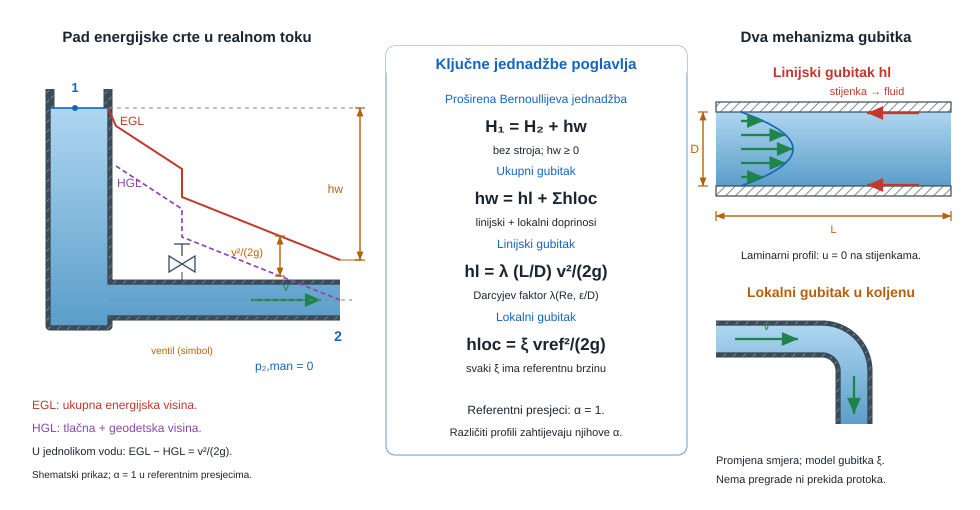
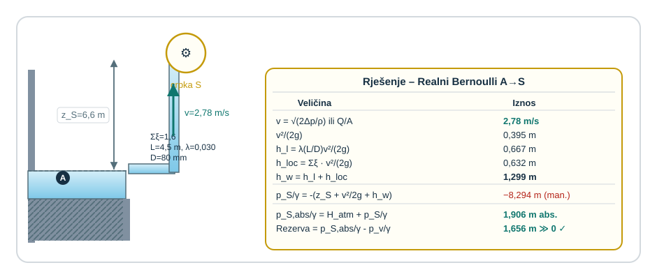
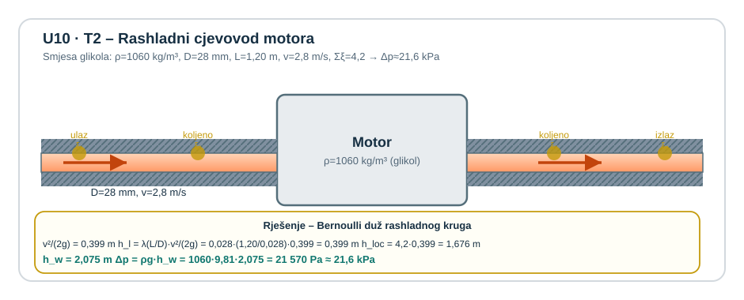
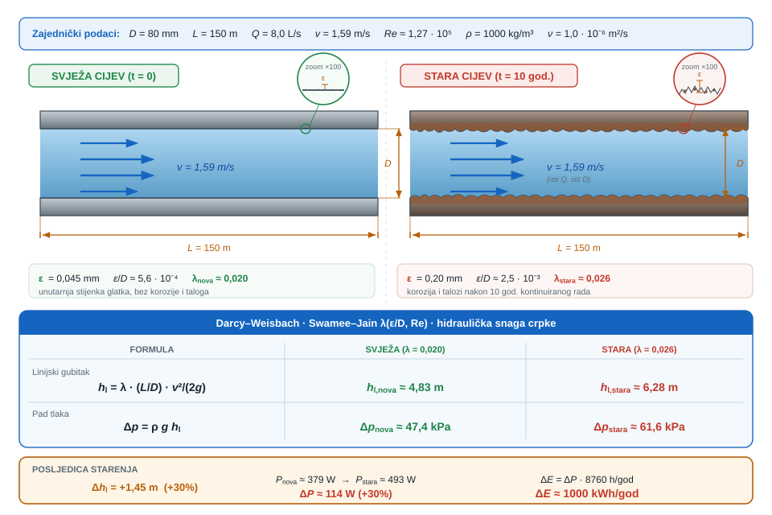
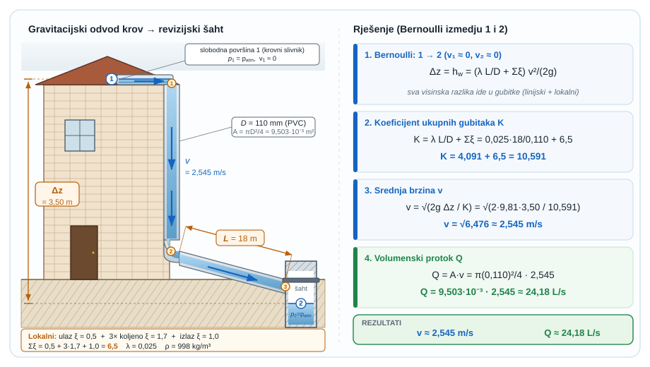

{#fig-uvod-u10 fig-align="center"}

## Realni tok kao idealni tok s pribrojenim gubicima energije

Kad energija više ne ostaje ista duž strujnice.

pog. 9Bernoullijeva jednadžba idealnog fluida zatvorio je idealni Bernoulli: energija se preraspodjeljuje između tlaka, brzine i visine, ali se ne gubi.

pog. 10Realni Bernoulli i gubici dodaje ono što stvarni fluidi ne dopuštaju zanemariti: trenje, vrtloženje i lokalne poremećaje. Zato ukupna raspoloživa energija više ne ostaje stalna, nego opada u smjeru strujanja.

::: {.mf1-application}

Inženjerski kontekst

Realni Bernoulli ulazi u svaki cjevovod koji stvarno radi: servisne crpke, rashladne krugove motora, brodske balastne i protupožarne vodove te ventilacijske kanale s lokalnim otporima. Upravo ovdje tehnička praksa postaje stroža od idealnog modela, jer promjer, hrapavost, ventil, koljeno i usisna visina zajedno odlučuju hoće li sustav dobiti traženi protok ili otvoriti rizik kavitacije.
:::

::: {.mf1-priprema}

Prije čitanja poglavlja

**Predznanje koje se pretpostavlja:**

- idealna Bernoullijeva jednadžba iz poglavlja pog. 9Bernoullijeva jednadžba idealnog fluida;
- pojam Reynoldsovog broja i razlika laminarnog od turbulentnog režima;
- razumijevanje viskoznosti i smičnog naprezanja iz poglavlja pog. 2Viskoznost, površinska napetost i kapilarnost;
- osnove čitanja tehničkih dijagrama (Moodyjev dijagram).

**Ishodi učenja:**

- proširiti Bernoullijevu jednadžbu članom gubitaka energije i ispravno ga primijeniti;
- razlikovati linijske od lokalnih gubitaka i pravilno ih zbrojiti;
- odabrati ili iz Moodyjevog dijagrama očitati koeficijent trenja $\lambda$ za zadane uvjete;
- prepoznati kavitacijski limit i znati kada apsolutni tlak postaje kritičan.

**Procijenjeno vrijeme:** 6–8 sati za teoriju i izvode, 5 sati za rješavanje primjera i zadataka.
:::

## Fizikalni uvod i matematički izvod

Za realni fluid između presjeka 1 i 2 Bernoullijeva jednadžba dobiva dodatni član ukupnog gubitka energije:

$$
\frac{p_1}{\rho g} + \frac{v_1^2}{2g} + z_1 = \frac{p_2}{\rho g} + \frac{v_2^2}{2g} + z_2 + h_w
$$

Član $h_w$ nije kozmetički dodatak, nego fizikalna cijena strujanja realnog fluida. Najčešće se rastavlja na:

$$
h_w = h_l + \sum h_{loc}
$$

pri čemu je linijski gubitak

$$
h_l = \lambda \frac{L}{D} \frac{v^2}{2g}
$$

::: {.callout-note}
## Fizikalno značenje
Darcy-Weisbachova formula kaže da gubitak energije na ravnoj dionici raste proporcionalno s duljinom cijevi, obrnuto s promjerom i kvadratično s brzinom. Faktor $\lambda$ (koeficijent trenja) ovisi o hrapavosti stjenke i Reynoldsovom broju — tj. o turbulenciji. Gubitak nije samo „trenje stjenke" nego i disipacija u turbulentnim vrtlozima koji se stalno stvaraju i raspadaju po poprečnom presjeku. Zato dulji vod, manji promjer i veća brzina zajedno eksponencijalno povećavaju energijsku cijenu.
:::

::: {.callout-note collapse="true" icon="false"}
## Numerički trag

Gubici energije u realnom toku — disipacija u turbulentnim vrtlozima — su upravo razlog zbog kojeg postoje **turbulentni modeli** u CFD-u. Umjesto da rješava svaki sitni vrtlog (skupo i u praksi nemoguće za inženjerske probleme), solver koristi *modele zatvaranja*: **k-ε**, **k-ω SST**, **Spalart-Allmaras**. Ovi modeli su zapravo numerička parafraza Darcy-Weisbachovog $\lambda$ — eksperimentalna kalibracija koja kaže "koliko energije turbulencija pojede po jedinici volumena i vremena".
:::

::: {.mf1-interaktivno}

Interaktivni prikaz — Moodyjev dijagram

Interaktivni prikaz omogućuje mijenjanje Reynoldsovog broja i relativne hrapavosti cijevi uz neposredno praćenje pripadnog koeficijenta trenja $\lambda$ na klasičnom Moodyjevu dijagramu. Krivulje za nekoliko vrijednosti $\varepsilon/D$ olakšavaju usporedbu i izbor odgovarajućeg radnog područja.

**Pitanja za samostalno istraživanje:** (a) U kojem se području Reynoldsov broj više ne utječe na $\lambda$ i što to fizikalno znači? (b) Kako se $\lambda$ ponaša s porastom $Re$ kod hidraulički gladkih cijevi? (c) Za $\lambda \approx 0{,}025$, koje kombinacije $Re$ i $\varepsilon/D$ ga daju i što govore o različitim radnim režimima?

:::

a lokalni gubitak

$$
h_{loc} = \xi \frac{v^2}{2g}
$$

::: {.callout-note}
## Fizikalno značenje
Lokalni gubici ($\xi v^2/2g$) modeliraju energijsku disipaciju na mjestima gdje strujanje nagle mijenja smjer ili brzinu: ventili, koljena, ulazi, izlazi, nagle promjene presjeka. Koeficijent $\xi$ je eksperimentalni broj koji govori koliki višekratnik brzinske visine košta svaki element. Ulazni rub s oštrinom ima $\xi \approx 0{,}5$, zaobljeni ulaz $\xi \approx 0{,}04$ — razlika od 10× za isti protok. U kratkim cjevovodima lokalni gubici mogu biti dominantni.
:::

::: {.mf1-izvod}

Matematički izvod — Bernoullijeva jednadžba s pribrojenim gubicima

Za stacionarni tok realnoga fluida između dvaju presjeka 1 i 2 mehanička energija više nije očuvana kao u idealnom Bernoulliju. Dio raspoložive energije nepovratno se pretvara u unutarnju energiju, vrtloge i disipaciju, pa opća energijska bilanca po jedinici težine poprima oblik

$$
\left(\frac{p}{\rho g} + \alpha\frac{v^2}{2g} + z\right)_1 + h_p - h_t = \left(\frac{p}{\rho g} + \alpha\frac{v^2}{2g} + z\right)_2 + h_w.
$$

U ovom poglavlju nema strojeva između presjeka, pa su $h_p = 0$ i $h_t = 0$, a za uobičajeno tehničko čitanje uzima se i $\alpha \approx 1$. Zato ostaje radni zapis

$$
\frac{p_1}{\rho g} + \frac{v_1^2}{2g} + z_1 = \frac{p_2}{\rho g} + \frac{v_2^2}{2g} + z_2 + h_w.
$$

Član $h_w$ nije nova sila, nego pad raspoložive mehaničke visine između dviju točaka. U praktičnom cjevovodnom računu on se rastavlja na linijski i lokalni dio:

$$
h_w = h_l + \sum h_{loc}.
$$

Eksperimentalni Darcy-Weisbachov zakon daje linijski gubitak na ravnoj dionici cijevi

$$
h_l = \lambda\frac{L}{D}\frac{v^2}{2g},
$$

dok se lokalni gubitci na ventilima, koljenima, ulazima, izlazima i naglim promjenama presjeka zapisuju kao

$$
h_{loc} = \xi\frac{v^2}{2g}.
$$

U tim je formulama $\lambda$ bezdimenzijski koeficijent trenja, $L/D$ geometrijski omjer koji pokazuje koliko se dugo trenje razvija duž cijevi, $\xi$ koeficijent lokalnoga elementa, a $v^2/(2g)$ brzinska visina koja predstavlja raspoloživu kinetičku energiju toka po jedinici težine. Time se ista Bernoullijeva slika iz pog. 9Bernoullijeva jednadžba idealnog fluida pretvara iz idealne u radno realnu: svaki pad energijske linije izravno znači da je dio mehaničke energije već potrošen na disipaciju.

::: {.callout-note}
## Razrada koraka
Korak: od idealnog Bernoullija → realni zapis s gubicima i preuredbom za $h_w$

Idealni Bernoulli: $\frac{p_1}{\rho g} + \frac{v_1^2}{2g} + z_1 = \frac{p_2}{\rho g} + \frac{v_2^2}{2g} + z_2$

Realni fluid gubi energiju — označimo taj iznos $h_w$ (gubitak po jedinici težine, u metrima). Energijska bilanca postaje:
$$
\left(\frac{p_1}{\rho g} + \frac{v_1^2}{2g} + z_1\right) - h_w = \frac{p_2}{\rho g} + \frac{v_2^2}{2g} + z_2.
$$
Preuredimo tako da $h_w$ stoji na desnoj strani (konvencija: gubici su pozitivni i stoje uz point 2):
$$
\frac{p_1}{\rho g} + \frac{v_1^2}{2g} + z_1 = \frac{p_2}{\rho g} + \frac{v_2^2}{2g} + z_2 + h_w.
$$
Kada su zadani svi ostali članovi, $h_w$ se izolira jednostavnim premještanjem:
$$
h_w = \left(\frac{p_1}{\rho g} + \frac{v_1^2}{2g} + z_1\right) - \left(\frac{p_2}{\rho g} + \frac{v_2^2}{2g} + z_2\right).
$$
To je fizikalno: $h_w$ je razlika raspoložive mehaničke visine između točaka 1 i 2.
:::
:::

::: {.mf1-izvod}

Matematički izvod — Gubitak energije kao integral disipacije

Član $h_w$ u proširenoj Bernoullijevoj jednadžbi nije ad-hoc dodatak — on predstavlja **integral viskozne disipacije** po cijelom kontrolnom volumenu. Po jedinici mase, brzina disipacije mehaničke energije u toplinu zadana je s funkcijom disipacije

$$
\Phi = \mu\!\left[\left(\frac{\partial v_i}{\partial x_j} + \frac{\partial v_j}{\partial x_i}\right)\frac{\partial v_i}{\partial x_j}\right] - \frac{2}{3}\mu(\nabla\cdot\vec{v})^2,
$$

koja je posljedica drugoga zakona termodinamike: smična naprezanja u realnom fluidu uvijek pretvaraju kinetičku energiju u toplinu (entropija raste).

Ukupni gubitak energije po jedinici protočne težine između presjeka $A$ i $B$ glasi

$$
h_w = \frac{1}{\dot{m}g}\int_{V_{AB}} \Phi\,dV.
$$

Zato je $h_w$ uvijek **pozitivan**: nikad ne može biti negativan (to bi značilo da se toplina spontano pretvara u mehaničku energiju). Idealni fluid je granični slučaj $\mu = 0$, gdje $\Phi = 0$ i $h_w = 0$, što vraća na Bernoullijevu jednadžbu idealnog fluida iz pog. 9.

U inženjerskoj praksi $\Phi$ se ne integrira izravno — premjerene su tablične vrijednosti $\lambda$ i $\xi$ koje sažimaju cijeli disipativni mehanizam za pojedinu geometriju. Ali važno je razumjeti: koeficijenti trenja su **mjerni odgovor** na termodinamičko pitanje koliko energije fluid izgubi u danom uvjetu. Numeričke metode (CFD) idu obrnutim putem — ne koriste tablične $\lambda$, nego izravno integriraju $\Phi$ po cijeloj domeni iz polja brzine i turbulentnih veličina.
:::

::: {.mf1-izvod}

Matematički izvod — Dimenzionalna analiza Darcy-Weisbacha — zašto kvadrat brzine?

Oblik Darcy-Weisbachove formule $h_l = \lambda(L/D)(v^2/(2g))$ nije proizvoljan — slijedi iz **Buckinghamova π-teorema** (dimenzionalne analize). Pad tlaka po jedinici duljine $\Delta p/L$ za strujanje u kružnoj cijevi može ovisiti samo o sljedećim parametrima:

- gustoći fluida $\rho$ ($\text{kg/m}^3$);
- viskoznosti $\mu$ ($\text{Pa s} = \text{kg/(m s)}$);
- promjeru cijevi $D$ ($\text{m}$);
- hrapavosti stijenke $\varepsilon$ ($\text{m}$);
- srednjoj brzini $v$ ($\text{m/s}$).

Iz pet dimenzionalnih veličina (s tri osnovne jedinice: masa, duljina, vrijeme) dimenzionalna analiza daje $5 - 3 = 2$ bezdimenzijska parametra. Prirodan izbor je Reynoldsov broj $Re = \rho v D/\mu$ i relativna hrapavost $\varepsilon/D$. Pad tlaka po duljini ima dimenziju $[\Delta p/L] = \text{Pa/m} = \text{kg/(m}^2\text{ s}^2\text{)}$, što se može zapisati i kao $\rho v^2/D$. Zato vrijedi opći funkcionalni oblik

$$
\frac{\Delta p}{L} = f(Re, \varepsilon/D) \cdot \frac{\rho v^2}{2D},
$$

gdje je $f(Re, \varepsilon/D) = \lambda$ Darcyjev koeficijent trenja. Faktor $1/2$ uvodi se po dogovoru (suglasje s definicijom kinetičke visine $v^2/(2g)$). Sustavno izvođenje ove ovisnosti Buckinghamovim $\Pi$ teoremom, zajedno s ostalim bezdimenzijskim brojevima, dano je u pog. 14Bezdimenzijski brojevi, dimenzijska analiza i sličnost.

Izraz preko visine fluida (dijeljenjem s $\rho g$) glasi

$$
\frac{h_l}{L} = \lambda \cdot \frac{1}{D} \cdot \frac{v^2}{2g} \quad\Longleftrightarrow\quad h_l = \lambda \frac{L}{D}\frac{v^2}{2g}.
$$

Ovaj izvod pokazuje da je **kvadrat brzine** nužna posljedica dimenzionalne analize — nije eksperimentalna pretpostavka. Samo numerička vrijednost koeficijenta $\lambda$ je eksperimentalna (i ovisi o $Re$ i $\varepsilon/D$, kako pokazuje Moodyjev dijagram). Strukturna istina formule je dimenzionalna nužnost.
:::

Za osnovno čitanje realnog Bernoullija najprije treba razdvojiti dvije vrste fizikalne cijene strujanja:

- linijski gubici dolaze iz trenja na ravnoj dionici cijevi
- lokalni gubici dolaze iz ventila, koljena, suženja, proširenja, ulaza i izlaza

Najčešća metodička greška nastaje kad se svi gubici tretiraju kao jedna mutna brojka bez mjesta u sustavu. U realnom Bernoulliju svaki gubitak mora imati i fizikalnu lokaciju i ispravan zapis. Isto vrijedi i za čitanje energijskih linija. U pog. 9Bernoullijeva jednadžba idealnog fluida je `EGL` ostajao vodoravan. U pog. 10Realni Bernoulli i gubici to više nije slučaj:

- `EGL` pada u smjeru strujanja jer se dio energije disipira
- `HGL` prati tlačnu i geodetsku visinu
- razmak `EGL - HGL` jednak je brzinskoj visini $v^2/(2g)$

Između dvaju promatranih presjeka pad energijske linije jednak je upravo ukupnom gubitku $h_w$. To je najkraći način da se vizualno vidi koliko je energije izgubljeno i koliko je još ostalo na raspolaganju sustavu.

::: {.mf1-izvod}

Matematički izvod — Hagen-Poiseuilleov zakon i podrijetlo $\lambda = 64/Re$

Za laminarno strujanje nestlačivog Newtonovog fluida u **kružnoj cijevi** može se analitički izvesti potpuni profil brzine i pripadni koeficijent trenja. Pretpostavlja se stacionarno, potpuno razvijeno strujanje (brzina ovisi samo o radijalnoj koordinati $r$, ne i o duljini $x$) u cijevi polumjera $R$.

**Ravnoteža sila na cilindričnom elementu** fluida polumjera $r$ i duljine $dx$ uključuje silu tlaka na krajnjim plohama i silu smičnog trenja na bočnoj plohi:

$$
\pi r^2\,p(x) - \pi r^2\,p(x+dx) - \tau(r)\cdot 2\pi r\,dx = 0,
$$

odakle slijedi linearni profil smičnog naprezanja u presjeku

$$
\tau(r) = -\frac{r}{2}\frac{dp}{dx}.
$$

Smično naprezanje raste linearno s polumjerom — maksimalno je na stijenci ($r = R$), a iščezava u osi cijevi ($r = 0$).

**Newtonov zakon viskoznosti** ($\tau = -\mu\,du/dr$, s negativnim predznakom jer brzina pada od osi prema zidu) izjednačavanjem daje

$$
-\mu\,\frac{du}{dr} = -\frac{r}{2}\frac{dp}{dx} \quad\Longrightarrow\quad \frac{du}{dr} = \frac{r}{2\mu}\frac{dp}{dx}.
$$

Integriranjem od $r$ do $R$ uz rubni uvjet $u(R) = 0$ (uvjet ljepljivosti na stijenci) dobiva se **parabolni profil brzine**

$$
\boxed{u(r) = -\frac{1}{4\mu}\frac{dp}{dx}\left(R^2 - r^2\right)}.
$$

Negativan predznak gradijenta tlaka ($dp/dx < 0$ jer tlak pada u smjeru strujanja) daje pozitivnu brzinu. Maksimalna brzina je u osi cijevi:

$$
u_{max} = u(0) = -\frac{R^2}{4\mu}\frac{dp}{dx}.
$$

**Volumenski protok** dobiva se integracijom brzinskog profila preko cijelog presjeka:

$$
Q = \int_0^R u(r)\,2\pi r\,dr = -\frac{\pi}{2\mu}\frac{dp}{dx}\int_0^R r(R^2 - r^2)\,dr = -\frac{\pi R^4}{8\mu}\frac{dp}{dx}.
$$

To je **Hagen-Poiseuilleov zakon**

$$
\boxed{Q = \frac{\pi R^4\,\Delta p}{8\mu L}},
$$

gdje je $\Delta p = -L\,dp/dx$ pad tlaka duž duljine $L$. Iz njega se odmah dobivaju i srednja brzina te odnos prema maksimalnoj:

$$
\bar{v} = \frac{Q}{\pi R^2} = \frac{R^2\,\Delta p}{8\mu L}, \qquad u_{max} = 2\bar{v}.
$$

Srednja brzina iznosi **točno polovicu maksimalne** — karakteristični potpis laminarnog parabolnog profila.

**Veza s Darcyjevim koeficijentom trenja:** iz definicije $\Delta p = \lambda(L/D)(\rho\bar{v}^2/2)$ uz $D = 2R$, izjednačavanjem s Hagen-Poiseuilleovim izrazom $\Delta p = 32\mu L \bar{v}/D^2$ dobiva se

$$
\lambda\,\frac{L}{D}\,\frac{\rho \bar{v}^2}{2} = \frac{32\mu L \bar{v}}{D^2},
$$

odakle nakon kraćenja slijedi

$$
\boxed{\lambda = \frac{64\mu}{\rho \bar{v} D} = \frac{64}{Re}}.
$$

Time je **izveden klasičan faktor $64$** u laminarnoj grani Moodyjevog dijagrama — iz egzaktnog rješenja Navier-Stokesove jednadžbe za kružnu cijev, a ne iz eksperimenta. Eksperimentalna potvrda Hagen-Poiseuilleova zakona u $19$. stoljeću prvi je put pokazala da je viskoznost fluida fizikalno mjerljivo svojstvo, što je otvorilo put modernoj hidromehanici i osnovala disciplinu reologije.
:::

## Riješeni primjeri

::: {.mf1-we}

Riješeni primjer — Linijski i lokalni gubici u horizontalnoj cijevi&nbsp;T2

**Kontekst:** U horizontalnoj dionici industrijskog cjevovoda voda prolazi kroz ravnu cijev s ulazom, ventilom i koljenom, na kojima nastaju i linijski i lokalni gubici energije. Projektant zbraja te gubitke u ukupnu energijsku visinu i iz nje određuje pripadni pad tlaka duž dionice.

**Zadano**

- Promjer horizontalne cijevi: $D = 0{,}12\ \text{m}$
- Duljina cijevi: $L = 36\ \text{m}$
- Srednja brzina vode: $v = 2{,}4\ \text{m/s}$
- Koeficijent trenja: $\lambda = 0{,}028$
- Zbroj lokalnih koeficijenata (ulaz, ventil, koljeno): $\sum \xi = 4{,}6$
- Gustoća vode: $\rho = 1000\ \text{kg/m}^3$

**Traženo**

1. linijski gubitak $h_l$.
2. lokalni gubitak $\sum h_{loc}$.
3. ukupni gubitak energije $h_w$.
4. pad tlaka $\Delta p$.

**Pretpostavke i model**

Promatra se horizontalna cijev sa zadanom srednjom brzinom. Zato se energijska bilanca ne troši na promjenu geodetske visine, nego samo na disipaciju uzrokovanu trenjem na ravnoj dionici i dodatnim gubicima na lokalnim elementima.

**Rješenje**

Najprije izračunamo brzinsku visinu:

$$
\frac{v^2}{2g} = \frac{2{,}4^2}{2 \cdot 9{,}81} \approx 0{,}294\ \text{m}.
$$

Linijski gubitak glasi

$$
h_l = \lambda \frac{L}{D} \frac{v^2}{2g} = 0{,}028 \cdot \frac{36}{0{,}12} \cdot 0{,}294 \approx 2{,}47\ \text{m}.
$$

Lokalni gubitak iznosi

$$
\sum h_{loc} = \sum \xi \frac{v^2}{2g} = 4{,}6 \cdot 0{,}294 \approx 1{,}35\ \text{m}.
$$

Ukupni gubitak energije zato je

$$
h_w = h_l + \sum h_{loc} \approx 2{,}47 + 1{,}35 = 3{,}82\ \text{m}.
$$

Za horizontalnu cijev pad tlaka glasi

$$
\Delta p = \rho g h_w = 1000 \cdot 9{,}81 \cdot 3{,}82 \approx 3{,}75 \cdot 10^4\ \text{Pa} = 37{,}5\ \text{kPa}.
$$

**Provjera i komentar**

1. Ukupni gubitak mora biti veći od svakog pojedinačnog doprinosa.
2. Ako se brzina poveća, oba tipa gubitaka rastu s članom $v^2$.
3. U horizontalnoj cijevi pad tlaka izravno prati izgubljenu energijsku visinu.
:::

::: {.mf1-we}

Riješeni primjer — Pitot-statička cijev u struji vode&nbsp;T2

**Kontekst:** U cjevovodu s vodom Pitot-statička cijev mjeri lokalnu brzinu strujanja preko razlike stagnacijskog i statičkog tlaka, koja se očitava kao razina žive u diferencijalnom manometru. Iz tog očitanja Bernoullijevom relacijom za zaustavni tlak izračunava se brzina vode.

**Zadano**

- Gustoća vode: $\rho = 1000\ \text{kg/m}^3$
- Gustoća žive: $\rho_{Hg} = 13600\ \text{kg/m}^3$
- Očitana razlika razina žive: $\Delta h_{Hg} = 63\ \text{mm} = 0{,}063\ \text{m}$

**Traženo**

1. Odrediti brzinu strujanja vode.

**Pretpostavke i model**

Na vrhu Pitot-cijevi tok se lokalno zaustavlja, pa se dinamički tlak pretvara u porast tlaka. Manometar zato ne mjeri izravno brzinu, nego razliku stagnacijskog i statičkog tlaka. Iz te tlačne razlike brzina se dobiva iz Bernoullijeve relacije za lokalno zaustavljanje toka.

**Rješenje**

Razlika tlakova između stagnacijske i statičke točke očitava se preko živinog manometra:

$$
\Delta p = (\rho_{Hg} - \rho)g\Delta h_{Hg} = (13600 - 1000) \cdot 9{,}81 \cdot 0{,}063 \approx 7{,}79 \cdot 10^3\ \text{Pa} = 7{,}79\ \text{kPa}.
$$

Za Pitot-statičku cijev dinamički tlak glasi $\Delta p = \tfrac{1}{2}\rho v^2$, pa je tražena brzina

$$
v = \sqrt{\frac{2\Delta p}{\rho}} = \sqrt{\frac{2 \cdot 7787}{1000}} \approx 3{,}95\ \text{m/s}.
$$

**Provjera i komentar**

Očitani manometarski stupac od $63\ \text{mm Hg}$ odgovara brzini strujanja vode od približno $4\ \text{m/s}$. Time se vidi kako pog. 10Realni Bernoulli i gubici spaja energetsku sliku toka s lokalnim mjerenjem u jednoj točki sustava.

1. Veća očitana razlika razina mora značiti veću tlačnu razliku i veću brzinu.
2. Ako se zaboravi razlika gustoća $\rho_{Hg} - \rho$, manometarski tlak će biti precijenjen.
3. Brzina reda nekoliko metara u sekundi razumna je za dinamički tlak reda nekoliko kilopaskala u vodi.
:::

Ta mjerna scena zatvara lokalno očitanje energije. Treća jezgrena scena pog. 10Realni Bernoulli i gubici je realni sifon: isti mehanizam kao u pog. 9Bernoullijeva jednadžba idealnog fluida, ali sada raspoloživu geodetsku visinu troše i izlazna brzina i cijeli paket linijskih i lokalnih gubitaka.

::: {.mf1-we}

Riješeni primjer — Servisni sifon s raspodijeljenim gubicima&nbsp;T2

**Kontekst:** Pri servisnom pražnjenju spremnika sifon premošćuje rub i odvodi vodu u niži ispust, ali na cijeloj duljini i u lokalnim elementima nastaju realni gubici energije. Projektantu trebaju stvarna brzina i protok sifona te tlak u njegovoj najvišoj točki kao provjera sigurnosne razlike do naponske visine pare.

**Zadano**

- Promjer sifona: $D = 90\ \text{mm}$
- Visinska razlika između slobodne površine spremnika `A` i izlaza `B`: $\Delta z = 2{,}6\ \text{m}$
- Visina najviše točke `C` iznad slobodne površine: $z_C = 1{,}8\ \text{m}$
- Ukupna duljina cijevi: $L = 16\ \text{m}$
- Duljina dionice `A-C`: $L_{AC} = 5\ \text{m}$
- Darcyjev koeficijent trenja: $\lambda = 0{,}026$
- Zbroj lokalnih gubitaka (ulaz, vršno koljeno, izlaz): $\sum \xi = 0{,}5 + 0{,}9 + 1{,}0 = 2{,}4$
- Atmosferska visina: $10{,}2\ \text{m}$ vodenog stupca
- Naponska visina pare: $0{,}25\ \text{m}$ vodenog stupca

**Traženo**

1. brzinu strujanja $v$ u sifonu.
2. volumenski protok $Q$.
3. tlačnu visinu $p_C/\gamma$ u najvišoj točki `C`.

**Pretpostavke i model**

Oba kraja sustava su na atmosferskom tlaku, a brzina na slobodnoj površini spremnika zanemariva je prema brzini u cijevi. Zato Bernoullijeva jednadžba između slobodne površine `A` i slobodnog izlaza `B` sadrži izlaznu brzinsku visinu i ukupne linijske i lokalne gubitke.

**Rješenje**

Iz realnog Bernoullija između `A` i `B` slijedi

$$
\Delta z = \frac{v^2}{2g} + \lambda \frac{L}{D}\frac{v^2}{2g} + \sum \xi \frac{v^2}{2g} = \left(1 + \lambda \frac{L}{D} + \sum \xi\right)\frac{v^2}{2g}.
$$

Najprije izračunajmo ukupni bezdimenzijski otpor sustava:

$$
1 + \lambda \frac{L}{D} + \sum \xi = 1 + 0{,}026 \cdot \frac{16}{0{,}09} + 2{,}4 = 8{,}02.
$$

Zato je brzinska visina u cijevi

$$
\frac{v^2}{2g} = \frac{\Delta z}{8{,}02} = \frac{2{,}6}{8{,}02} = 0{,}324\ \text{m},
$$

pa slijedi

$$
v = \sqrt{2g \cdot 0{,}324} = 2{,}52\ \text{m/s}.
$$

Površina presjeka sifona iznosi

$$
A = \frac{\pi D^2}{4} = \frac{\pi \cdot 0{,}09^2}{4} = 6{,}36 \cdot 10^{-3}\ \text{m}^2,
$$

pa je volumenski protok

$$
Q = Av = 6{,}36 \cdot 10^{-3} \cdot 2{,}52 \approx 1{,}60 \cdot 10^{-2}\ \text{m}^3/\text{s} = 16{,}0\ \text{L/s}.
$$

Za tlak u vrhu sifona pišemo Bernoullija između slobodne površine `A` i točke `C`. Do točke `C` ulaze visina vrha, brzinska visina, linijski gubici na dionici $L_{AC}$ i lokalni gubici ulaza i vršnog koljena:

$$
0 = \frac{p_C}{\gamma} + z_C + \frac{v^2}{2g} + \lambda \frac{L_{AC}}{D}\frac{v^2}{2g} + (0{,}5 + 0{,}9)\frac{v^2}{2g}.
$$

Kako je $\lambda \tfrac{L_{AC}}{D} = 0{,}026 \cdot \tfrac{5}{0{,}09} = 1{,}44$, slijedi

$$
\frac{p_C}{\gamma} = -\left[1{,}8 + \left(1 + 1{,}44 + 1{,}4\right)0{,}324\right] = -3{,}04\ \text{m}.
$$

To je manometarska tlačna visina u točki `C`. Apsolutna tlačna visina zato je

$$
\left(\frac{p_C}{\gamma}\right)_{abs} = 10{,}2 - 3{,}04 = 7{,}16\ \text{m}.
$$

Kako je to mnogo više od naponske visine pare od $0{,}25\ \text{m}$, u ovom primjeru nema neposredne opasnosti od isparavanja u vrhu sifona.

**Provjera i komentar**

Zbog gubitaka realni sifon daje brzinu od samo oko $2{,}5\ \text{m/s}$ i protok od oko $16\ \text{L/s}$, znatno manji nego u idealnom slučaju istog geodetskog pada. U vrhu sifona tlak pada na oko $-3{,}0\ \text{m}$ manometarske visine, ali je apsolutna tlačna visina i dalje dovoljno visoka. Upravo takva provjera pokazuje zašto pog. 10Realni Bernoulli i gubici mora spojiti gubitke i tlak u jedinstvenu energetsku sliku.

1. U realnom sifonu brzina mora biti manja nego u idealnom sifonu iste visinske razlike.
2. Tlak u vrhu sifona mora biti niži od atmosferskog i dodatno se smanjivati kad rastu gubici na usisnom kraku.
3. Ako bi apsolutna tlačna visina pala ispod naponske visine pare, rezultat bi upozoravao da idealizirani rad sifona više nije fizikalno siguran.
:::

pog. 10Realni Bernoulli i gubici nije samo poglavlje o padovima energije nego i prvo mjesto gdje se brzina dobiva iz lokalno izmjerene tlačne razlike, preko $p_0 - p = \rho v^2/2$ i $v = \sqrt{2(p_0-p)/\rho}$. Time ista energetska slika postaje most između teorije i mjerenja: može se čitati ili iz bilance duž sustava ili iz lokalne stagnacijske točke, a prirodni integrativni korak je stvarni vod u kojem Pitot više nije sam sebi svrha, nego ulazna mjerna informacija za cijelu energetsku bilancu.

::: {.mf1-ch}

Cjeloviti zadatak — tlačni spremnik s Pitot kontrolom i realnim gubicima&nbsp;T3

**Kontekst:** U ispitnom postavu zatvoreni tlačni spremnik tjera vodu kroz horizontalni vod do slobodnog izlaza, a u jednom presjeku Pitot-statička cijev mjeri lokalnu brzinu. Iz Pitot-očitanja i poznatih linijskih i lokalnih gubitaka određuju se protok, ukupni gubici i potreban pretlak plina u spremniku koji takav režim održava.

**Zadano**

- Promjer horizontalnog ispitnog voda: $D = 80\ \text{mm}$
- Ukupna duljina cijevi: $L = 32\ \text{m}$
- Darcyjev koeficijent trenja: $\lambda = 0{,}025$
- Zbroj lokalnih koeficijenata (ulaz, regulacijski ventil, izlaz): $\sum \xi = 3{,}5$
- Gustoća žive u diferencijalnom manometru: $\rho_{Hg} = 13600\ \text{kg/m}^3$
- Gustoća vode: $\rho = 1000\ \text{kg/m}^3$
- Razlika razina žive (Pitot-statička cijev u presjeku `C`): $\Delta h_{Hg} = 45\ \text{mm}$

Slobodna površina vode u spremniku `A` i os izlazne cijevi nalaze se na istoj visinskoj razini, a izlaz `B` je u atmosferi.

**Traženo**

1. brzinu strujanja $v$ u cijevi.
2. volumenski protok $Q$.
3. linijski gubitak $h_l$, lokalni gubitak $\sum h_{loc}$ i ukupni gubitak $h_w$.
4. potreban manometarski pretlak plina u spremniku $p_{M A}$.

**Pretpostavke i model**

Pitot u presjeku `C` najprije daje lokalnu brzinu u cijevi. Kako je promjer cijevi stalan, ista brzina vrijedi i za ostatak voda. Tek nakon toga realni Bernoulli između slobodne površine spremnika `A` i slobodnog izlaza `B` zatvara ukupni pad raspoložive energije na izlaznu brzinsku visinu i sve linijske i lokalne gubitke.

**Rješenje**

Najprije iz Pitot-manometarskog očitanja dobivamo dinamički tlak:

$$
\Delta p = (\rho_{Hg} - \rho)g\Delta h_{Hg} = (13600 - 1000) \cdot 9{,}81 \cdot 0{,}045 = 5560\ \text{Pa}.
$$

Za Pitot-statičku cijev vrijedi $\Delta p = \tfrac{1}{2}\rho v^2$, pa je brzina strujanja

$$
v = \sqrt{\frac{2\Delta p}{\rho}} = \sqrt{\frac{2 \cdot 5560}{1000}} = 3{,}34\ \text{m/s}.
$$

Površina presjeka cijevi iznosi

$$
A = \frac{\pi D^2}{4} = \frac{\pi \cdot 0{,}08^2}{4} = 5{,}03 \cdot 10^{-3}\ \text{m}^2,
$$

pa je volumenski protok

$$
Q = Av = 5{,}03 \cdot 10^{-3} \cdot 3{,}34 = 1{,}68 \cdot 10^{-2}\ \text{m}^3/\text{s} \approx 16{,}8\ \text{L/s}.
$$

Brzinska visina glasi

$$
\frac{v^2}{2g} = \frac{3{,}34^2}{2 \cdot 9{,}81} = 0{,}569\ \text{m}.
$$

Linijski gubitak iznosi

$$
h_l = \lambda \frac{L}{D} \frac{v^2}{2g} = 0{,}025 \cdot \frac{32}{0{,}08} \cdot 0{,}569 = 5{,}69\ \text{m}.
$$

Lokalni gubitak je

$$
\sum h_{loc} = \sum \xi \frac{v^2}{2g} = 3{,}5 \cdot 0{,}569 = 1{,}99\ \text{m}.
$$

Ukupni gubitak zato je

$$
h_w = h_l + \sum h_{loc} = 5{,}69 + 1{,}99 = 7{,}68\ \text{m}.
$$

Sada pišemo realni Bernoulli između slobodne površine spremnika `A` i slobodnog izlaza `B`. Kako su $z_A = z_B$, brzina na slobodnoj površini je zanemariva, a na izlazu je tlak jednak atmosferskom, u zapisu s manometarskim tlakom vrijedi

$$
\frac{p_{M A}}{\gamma} = \frac{v^2}{2g} + h_w = 0{,}569 + 7{,}68 = 8{,}25\ \text{m}.
$$

Potreban manometarski pretlak plina u spremniku zato je

$$
p_{M A} = \rho g \cdot 8{,}25 = 1000 \cdot 9{,}81 \cdot 8{,}25 = 8{,}09 \cdot 10^4\ \text{Pa} \approx 80{,}9\ \text{kPa}.
$$

**Provjera i komentar**

Ovaj primjer zatvara cjelovit slijed pog. 10Realni Bernoulli i gubici u jednom sustavu: Pitot najprije daje brzinu od oko $3{,}34\ \text{m/s}$, iz nje slijedi protok od oko $16{,}8\ \text{L/s}$, ukupni gubitak iznosi oko $7{,}68\ \text{m}$, a da bi takav tok uopće postojao, spremnik mora biti pod manometarskim pretlakom od oko $80{,}9\ \text{kPa}$.

1. Ako Pitot očita veću razliku razina, moraju rasti i brzina i svi gubici jer ovdje sve ovisi o članu $v^2$.
2. Potreban pretlak u spremniku mora biti veći od same izlazne brzinske visine jer osim ubrzanja mora platiti i cijeli paket disipativnih gubitaka.
3. Ako se u ovom zadatku odmah piše Bernoulli bez vraćanja brzine iz Pitota, nestaje veza između lokalnog mjerenja i energetske slike cijelog voda.
:::

::: {.mf1-we}

Riješeni primjer — Usisni tlak na ulazu male servisne crpke&nbsp;T2

**Kontekst:** Mala servisna crpka usisava vodu iz bazena postavljenog znatno ispod svoje osi, pa apsolutni tlak na usisnom priključku može pasti opasno blizu naponske visine pare. Iz protoka i parametara usisnog voda određuju se tlačna visina u točki `S` i sigurnosna razlika do kavitacijske granice.

**Zadano**

- Visina osi usisnog priključka crpke iznad slobodne površine bazena: $z_S = 6{,}6\ \text{m}$
- Promjer usisnog voda: $D = 80\ \text{mm}$
- Duljina usisnog voda: $L = 4{,}5\ \text{m}$
- Protok: $Q = 0{,}014\ \text{m}^3/\text{s}$
- Darcyjev koeficijent trenja: $\lambda = 0{,}030$
- Zbroj lokalnih koeficijenata (usisna košara, ulaz, jedno koljeno): $\sum \xi = 1{,}6$
- Atmosferska visina: $10{,}2\ \text{m}$ vodenog stupca
- Naponska visina pare: $0{,}25\ \text{m}$ vodenog stupca

**Traženo**

1. Odrediti brzinu $v_s$ u usisnom vodu.
2. Odrediti ukupni usisni gubitak $h_{w,s}$.
3. Odrediti manometarsku i apsolutnu tlačnu visinu u točki `S`.
4. Procijeniti postoji li neposredna opasnost od kavitacije.

{#fig-u10-usisni-tlak-crpka fig-align="center"}

**Pretpostavke i model**

Promatra se samo usisni krak između slobodne površine bazena `A` i ulaza u crpku `S`. Slobodna površina je na atmosferskom tlaku i njezina je brzina zanemariva. Zato realni Bernoulli izravno pokazuje kako se geodetska visina, brzinska visina i svi usisni gubici pretvaraju u pad apsolutnog tlaka na ulazu u crpku. Prag sigurnosti čita se tek iz usporedbe apsolutne tlačne visine s naponskom visinom pare.

**Rješenje**

Površina usisnog presjeka iznosi

$$
A_s = \frac{\pi D^2}{4} = \frac{\pi \cdot 0{,}08^2}{4} = 5{,}03 \cdot 10^{-3}\ \text{m}^2
$$

pa je brzina u usisnom vodu

$$
v_s = \frac{Q}{A_s} = \frac{0{,}014}{5{,}03 \cdot 10^{-3}} = 2{,}78\ \text{m/s}.
$$

Brzinska visina zato iznosi

$$
\frac{v_s^2}{2g} = \frac{2{,}78^2}{2 \cdot 9{,}81} = 0{,}395\ \text{m}.
$$

Linijski gubitak na usisu je

$$
h_{l,s} = \lambda \frac{L}{D}\frac{v_s^2}{2g} = 0{,}030 \cdot \frac{4{,}5}{0{,}08} \cdot 0{,}395 = 0{,}667\ \text{m},
$$

a lokalni gubitak

$$
\sum h_{loc,s} = \sum \xi \frac{v_s^2}{2g} = 1{,}6 \cdot 0{,}395 = 0{,}632\ \text{m}.
$$

Ukupni usisni gubitak zato je

$$
h_{w,s} = h_{l,s} + \sum h_{loc,s} = 0{,}667 + 0{,}632 = 1{,}30\ \text{m}.
$$

Sada pišemo realni Bernoulli između slobodne površine `A` i usisne točke `S` u manometarskom zapisu

$$
0 = \frac{p_S}{\gamma} + \frac{v_s^2}{2g} + z_S + h_{w,s},
$$

odnosno

$$
\frac{p_S}{\gamma} = -(0{,}395 + 6{,}6 + 1{,}30) = -8{,}30\ \text{m}.
$$

To je manometarska tlačna visina na usisu. Apsolutna tlačna visina zato iznosi

$$
\left(\frac{p_S}{\gamma}\right)_{abs} = 10{,}2 - 8{,}30 = 1{,}90\ \text{m}.
$$

Raspoloživa sigurnosna razlika do naponske visine pare je

$$
1{,}90 - 0{,}25 = 1{,}65\ \text{m}.
$$

Dakle, usis je još iznad granice isparavanja, ali rezerva nije velika.

**Provjera i komentar**

1. Manometarski tlak na usisu mora biti negativan jer crpka vuče vodu iz spremnika koji je ispod njezina ulaza.
2. Svaki dodatni usisni gubitak ili veća visina ugradnje odmah smanjuju apsolutni tlak na ulazu u crpku.
3. O sigurnosti se ne odlučuje po manometarskom nego po apsolutnom tlaku u usporedbi s naponskom visinom pare.
:::

::: {.mf1-ch}

Cjeloviti zadatak — Usisni vod servisne crpke s kavitacijskom granicom&nbsp;T4

**Kontekst:** Servisna crpka diže topliju vodu iz nižeg bazena u viši spremnik kroz različite presjeke usisnog i tlačnog voda, pa istodobno treba odrediti potrebnu visinu dobave crpke i kavitacijsku rezervu na njezinu usisu. Projektant uz to traži i najveću dopuštenu visinu ugradnje crpke koja zadržava propisanu sigurnosnu rezervu iznad naponske visine pare.

**Zadano**

- Visina osi usisnog priključka `S` iznad slobodne površine bazena `A`: $z_S = 4{,}8\ \text{m}$
- Visinska razlika slobodnih površina spremnika `B` i bazena `A`: $\Delta z_{AB} = 9{,}0\ \text{m}$
- Radni protok sustava: $Q = 22\ \text{L/s} = 0{,}022\ \text{m}^3/\text{s}$
- Gustoća vode (oko $35^\circ\text{C}$): $\rho = 995\ \text{kg/m}^3$
- Naponska visina pare: $p_v/\gamma = 0{,}56\ \text{m}$
- Atmosferska tlačna visina: $H_{atm} = 10{,}3\ \text{m}$
- Usisni vod `A-S`: promjer $D_s = 100\ \text{mm}$, duljina $L_s = 8{,}0\ \text{m}$, $\lambda_s = 0{,}028$, $\sum \xi_s = 4{,}4$
- Tlačni vod `S-B`: promjer $D_d = 90\ \text{mm}$, duljina $L_d = 28\ \text{m}$, $\lambda_d = 0{,}026$, $\sum \xi_d = 5{,}2$

**Traženo**

1. brzine $v_s$ i $v_d$ u usisnom i tlačnom vodu.
2. ukupni gubitak $h_{w,s}$ na usisnom vodu te manometarsku i apsolutnu tlačnu visinu u točki `S`.
3. potrebnu visinu dobave crpke $H_p$.
4. raspoloživu kavitacijsku rezervu:

$$
\Delta H_{kav} = \left(\frac{p_{abs,S}}{\gamma}\right) - \frac{p_v}{\gamma}
$$

i najveću dopuštenu visinu ugradnje osi crpke $z_{S,max}$ ako se zahtijeva najmanje $1{,}0\ \text{m}$ rezerve iznad naponske visine pare.

**Pretpostavke i model**

Oba spremnika su velika i otvorena prema atmosferi, pa su brzine na slobodnim površinama zanemarive. Potrebna visina dobave crpke zato se dobiva iz energetske bilance između slobodnih površina `A` i `B`, dok se tlak na usisu `S` zatvara zasebnim realnim Bernoullijem samo po usisnom kraku. Upravo taj drugi korak odlučuje postoji li opasnost od kavitacije.

**Rješenje**

Površine presjeka iznose

$$
A_s = \frac{\pi D_s^2}{4} = \frac{\pi \cdot 0{,}10^2}{4} = 7{,}85 \cdot 10^{-3}\ \text{m}^2, \qquad A_d = \frac{\pi D_d^2}{4} = \frac{\pi \cdot 0{,}09^2}{4} = 6{,}36 \cdot 10^{-3}\ \text{m}^2.
$$

Brzine u usisnom i tlačnom vodu zato su

$$
v_s = \frac{Q}{A_s} = \frac{0{,}022}{7{,}85 \cdot 10^{-3}} = 2{,}80\ \text{m/s}, \qquad v_d = \frac{Q}{A_d} = \frac{0{,}022}{6{,}36 \cdot 10^{-3}} = 3{,}46\ \text{m/s}.
$$

Brzinske visine u dvama vodovima zato su

$$
\frac{v_s^2}{2g} = \frac{2{,}80^2}{2 \cdot 9{,}81} = 0{,}400\ \text{m}, \qquad \frac{v_d^2}{2g} = \frac{3{,}46^2}{2 \cdot 9{,}81} = 0{,}610\ \text{m}.
$$

Linijski gubitak na usisu iznosi

$$
h_{l,s} = \lambda_s \frac{L_s}{D_s}\frac{v_s^2}{2g} = 0{,}028 \cdot \frac{8{,}0}{0{,}10} \cdot 0{,}400 = 0{,}90\ \text{m},
$$

a lokalni gubitak

$$
\sum h_{loc,s} = \sum \xi_s \frac{v_s^2}{2g} = 4{,}4 \cdot 0{,}400 = 1{,}76\ \text{m},
$$

pa je ukupni usisni gubitak

$$
h_{w,s} = h_{l,s} + \sum h_{loc,s} = 0{,}90 + 1{,}76 = 2{,}66\ \text{m}.
$$

Sada pišemo realni Bernoulli između slobodne površine bazena `A` i usisne točke `S` neposredno pred crpkom. U zapisu s manometarskim tlakom vrijedi

$$
0 = \frac{p_{M,S}}{\gamma} + z_S + \frac{v_s^2}{2g} + h_{w,s},
$$

odakle slijedi

$$
\frac{p_{M,S}}{\gamma} = -(4{,}8 + 0{,}400 + 2{,}66) = -7{,}86\ \text{m},
$$

pa je manometarski tlak na usisu

$$
p_{M,S} = -7{,}86\,\gamma = -7{,}86 \cdot 995 \cdot 9{,}81 = -76{,}8\ \text{kPa}.
$$

Apsolutna tlačna visina u točki `S` zato je

$$
\frac{p_{abs,S}}{\gamma} = H_{atm} + \frac{p_{M,S}}{\gamma} = 10{,}3 - 7{,}86 = 2{,}44\ \text{m},
$$

što odgovara apsolutnom tlaku $p_{abs,S} = 2{,}44\,\gamma = 23{,}8\ \text{kPa}$.

Za tlačni vod dobivamo linijski gubitak

$$
h_{l,d} = \lambda_d \frac{L_d}{D_d}\frac{v_d^2}{2g} = 0{,}026 \cdot \frac{28}{0{,}09} \cdot 0{,}610 = 4{,}93\ \text{m},
$$

i lokalni gubitak

$$
\sum h_{loc,d} = \sum \xi_d \frac{v_d^2}{2g} = 5{,}2 \cdot 0{,}610 = 3{,}17\ \text{m},
$$

pa je $h_{w,d} = 4{,}93 + 3{,}17 = 8{,}10\ \text{m}$.

Budući da su i `A` i `B` veliki otvoreni spremnici, potrebna visina dobave crpke dobiva se iz bilance između njihovih slobodnih površina:

$$
H_p = \Delta z_{AB} + h_{w,s} + h_{w,d} = 9{,}0 + 2{,}66 + 8{,}10 = 19{,}76\ \text{m} \approx 19{,}8\ \text{m}.
$$

Raspoloživa kavitacijska rezerva sada je

$$
\Delta H_{kav} = \frac{p_{abs,S}}{\gamma} - \frac{p_v}{\gamma} = 2{,}44 - 0{,}56 = 1{,}88\ \text{m}.
$$

Kriterij je sada izravan: ako je $\Delta H_{kav} > 0$, apsolutni tlak na usisu još je iznad naponske visine pare; ako rezerva padne na nulu ili ispod nje, usis ulazi u područje fizikalno rizično za kavitaciju. U projektnom računu često se zato ne traži samo pozitivan rezultat, nego i minimalna dodatna sigurnosna margina.

Dakle, usis ostaje iznad naponske visine pare, ali ne s velikom rezervom.

Ako se zahtijeva najmanje $1{,}0\ \text{m}$ rezerve iznad naponske visine pare, mora vrijediti

$$
H_{atm} - z_{S,max} - \frac{v_s^2}{2g} - h_{w,s} - \frac{p_v}{\gamma} = 1{,}0,
$$

pa slijedi

$$
z_{S,max} = 10{,}3 - 0{,}400 - 2{,}66 - 0{,}56 - 1{,}0 = 5{,}68\ \text{m}.
$$

Trenutna ugradnja s osi crpke na $4{,}8\ \text{m}$ zato ostavlja još oko $5{,}68 - 4{,}8 = 0{,}88\ \text{m}$ dodatne sigurnosne rezerve do zadane granice.

**Provjera i komentar**

Ovaj `T4` zadatak zatvara dvije razine pog. 10Realni Bernoulli i gubici odjednom: ista instalacija traži visinu dobave crpke od oko $19{,}8\ \text{m}$, ali istodobno spušta apsolutnu tlačnu visinu na usisu na samo $2{,}44\ \text{m}$. Nakon odužimanja naponske visine pare ostaje kavitacijska rezerva od oko $1{,}88\ \text{m}$, pa je sustav još siguran, ali jasno blizu granice na kojoj bi dodatni usisni gubici ili toplija voda mogli otvoriti kavitaciju.

1. Ako se poveća samo visina ugradnje crpke, potrebna visina dobave prema spremniku `B` ostaje ista, ali kavitacijska rezerva na usisu pada.
2. Usisni vod mora biti hidraulički osjetljiviji od tlačnog voda jer se na usisu svaki dodatni gubitak izravno pretvara u pad apsolutnog tlaka.
3. Ako bi se u kavitacijskoj provjeri koristio manometarski umjesto apsolutnog tlaka, sigurnost sustava bila bi procijenjena potpuno pogrešno.
:::

::: {.mf1-we}

Riješeni primjer — Pad tlaka u rashladnom cjevovodu motora &nbsp;T2

**Primjer za strojare**

**Kontekst:** Rashladni krug motora u automobilu ima aluminijsku cijev koja vodi rashladno sredstvo od pumpe do radijatora. Projektant provjerava pad tlaka na toj dionici.

**Zadano**

- Promjer cijevi: $D = 28\ \text{mm}$
- Duljina dionice: $L = 1{,}20\ \text{m}$
- Zbroj lokalnih koeficijenata (2 koljena, ulaz, izlaz): $\sum\xi = 4{,}2$
- Koeficijent trenja: $\lambda = 0{,}028$
- Srednja brzina rashladnog sredstva: $v = 2{,}8\ \text{m/s}$
- Gustoća: $\rho = 1060\ \text{kg/m}^3$

**Traženo**

Ukupni gubitak energije $h_w$ i odgovarajući pad tlaka $\Delta p$.

{#fig-u10-rashladni-cjevovod fig-align="center"}

**Rješenje**

$$
h_l = \lambda \frac{L}{D}\frac{v^2}{2g} = 0{,}028 \cdot \frac{1{,}20}{0{,}028} \cdot \frac{2{,}8^2}{2 \cdot 9{,}81} = 1{,}20 \cdot 0{,}400 = 0{,}480\ \text{m}
$$

$$
h_{loc} = \sum\xi \cdot \frac{v^2}{2g} = 4{,}2 \cdot 0{,}400 = 1{,}678\ \text{m}
$$

$$
h_w = h_l + h_{loc} = 0{,}480 + 1{,}678 = 2{,}158\ \text{m}
$$

$$
\Delta p = \rho g h_w = 1060 \cdot 9{,}81 \cdot 2{,}158 = 22{,}44\ \text{kPa}
$$

**Provjera i komentar**

Lokalni gubici ($1{,}68\ \text{m}$) dominiraju nad linijskim ($0{,}48\ \text{m}$) jer je cijev kratka — to je tipično za kratke spojne vodove s koljenima. Pad tlaka $22{,}4\ \text{kPa}$ mora biti pokrit pritiskom pumpe. Povećanjem promjera na $D = 32\ \text{mm}$ brzina pada na $v' = (28/32)^2 \cdot 2{,}8 = 2{,}14\ \text{m/s}$ pa $h_w$ pada na ~$1{,}26\ \text{m}$ — gotovo dvostruko manje zbog kvadratne ovisnosti o brzini.

:::

::: {.mf1-we}

Riješeni primjer — Starenje cijevi: kako rastuća hrapavost mijenja $\lambda$ i potrebnu snagu crpke &nbsp;T2

**Primjer za strojare**

**Kontekst:** U industrijskom postrojenju voda se transportira čeličnim cjevovodom od crpne stanice do tehnološkog procesa. Ista cijev koja na početku rada (svježa, glatka) ima hrapavost $\varepsilon \approx 0{,}045\ \text{mm}$ nakon **10 godina** kontinuiranog rada – zbog unutarnje korozije, taloga i sitnih oštećenja – dolazi do $\varepsilon \approx 0{,}20\ \text{mm}$. Promjer cijevi i protok ostaju zadani projektom, ali raste relativna hrapavost $\varepsilon/D$ i s njom **koeficijent linijskog gubitka** $\lambda$. Inženjer mora znati koliko ta promjena povećava pad tlaka i snagu koju crpka mora isporučivati – jer ta razlika izravno povećava potrošnju električne energije i preranu zamjenu opreme.

**Zadano**

- Duljina cjevovoda: $L = 150\ \text{m}$
- Promjer cijevi: $D = 80\ \text{mm}$
- Protok vode: $Q = 8{,}0\ \text{L/s}$
- Gustoća vode: $\rho = 1000\ \text{kg/m}^3$
- Kinematička viskoznost vode: $\nu = 1{,}0 \cdot 10^{-6}\ \text{m}^2/\text{s}$
- Hrapavost cijevi – svježa: $\varepsilon_{nova} = 0{,}045\ \text{mm}$
- Hrapavost cijevi – nakon 10 godina: $\varepsilon_{stara} = 0{,}20\ \text{mm}$
- Cjevovod je horizontalan, lokalni gubici se zanemaruju (predmet primjera su isključivo linijski gubici)

**Traženo**

1. Brzina strujanja i Reynoldsov broj.
2. Relativna hrapavost u oba stanja te koeficijent $\lambda$ iz Moodyjeva dijagrama (ili Swamee–Jain aproksimacije) za oba stanja.
3. Visina linijskog gubitka $h_l$ u oba stanja i odgovarajući pad tlaka.
4. Hidraulička snaga koju crpka mora **dodatno** isporučivati zbog starenja cijevi i procjena dodatne električne energije godišnje (rad $24/7$).

{#fig-u10-starenje-cijevi fig-align="center"}

**Pretpostavke i model**

Strujanje je stacionarno, voda nestlačiva, cijev s konstantnim promjerom – brzina i $Re$ ne ovise o hrapavosti. Promjena hrapavosti djeluje **isključivo** kroz $\lambda$ (preko relativne hrapavosti $\varepsilon/D$). Promjer cijevi se s vremenom ne mijenja značajno (taloženje smanjuje efektivni $D$, ali to je drugotni efekt koji ovaj primjer ne razmatra). Koristi se Swamee–Jain eksplicitna aproksimacija Colebrookove formule:

$$
\lambda = \frac{0{,}25}{\left[\log_{10}\!\left(\dfrac{\varepsilon}{3{,}7 D} + \dfrac{5{,}74}{Re^{0{,}9}}\right)\right]^{2}}
$$

Lokalni gubici (koljena, ventili) **bi** dodatno povećali ukupni pad tlaka u realnom sustavu, ali se za izoliranje učinka starenja zanemaruju.

**Rješenje**

Brzina u cijevi:

$$
A = \frac{\pi D^2}{4} = \frac{\pi \cdot 0{,}080^2}{4} \approx 5{,}03 \cdot 10^{-3}\ \text{m}^2
$$

$$
v = \frac{Q}{A} = \frac{0{,}008}{5{,}03 \cdot 10^{-3}} \approx 1{,}59\ \text{m/s}
$$

Reynoldsov broj (jednak u oba stanja):

$$
Re = \frac{vD}{\nu} = \frac{1{,}59 \cdot 0{,}080}{1{,}0 \cdot 10^{-6}} \approx 1{,}27 \cdot 10^{5}
$$

Pripadajući zajednički član u nazivniku Swamee–Jaina (preko $Re$):

$$
\frac{5{,}74}{Re^{0{,}9}} = \frac{5{,}74}{(1{,}27 \cdot 10^{5})^{0{,}9}} \approx \frac{5{,}74}{47\,547} \approx 1{,}21 \cdot 10^{-4}
$$

**Svježa cijev** ($\varepsilon/D = 0{,}045/80 \approx 5{,}6 \cdot 10^{-4}$):

$$
\frac{\varepsilon_{nova}}{3{,}7 D} \approx \frac{5{,}6 \cdot 10^{-4}}{3{,}7} \approx 1{,}51 \cdot 10^{-4}
$$

$$
\lambda_{nova} \approx \frac{0{,}25}{[\log_{10}(1{,}51\cdot 10^{-4} + 1{,}21\cdot 10^{-4})]^2} = \frac{0{,}25}{[\log_{10}(2{,}72 \cdot 10^{-4})]^2}
$$

$$
\lambda_{nova} \approx \frac{0{,}25}{(-3{,}566)^2} \approx 0{,}0197 \approx 0{,}020
$$

**Stara cijev** ($\varepsilon/D = 0{,}20/80 = 2{,}5 \cdot 10^{-3}$):

$$
\frac{\varepsilon_{stara}}{3{,}7 D} \approx \frac{2{,}5 \cdot 10^{-3}}{3{,}7} \approx 6{,}76 \cdot 10^{-4}
$$

$$
\lambda_{stara} \approx \frac{0{,}25}{[\log_{10}(6{,}76 \cdot 10^{-4} + 1{,}21 \cdot 10^{-4})]^2} = \frac{0{,}25}{[\log_{10}(7{,}96 \cdot 10^{-4})]^2}
$$

$$
\lambda_{stara} \approx \frac{0{,}25}{(-3{,}099)^2} \approx 0{,}0260
$$

Linijski gubici (Darcy–Weisbach):

$$
\frac{v^2}{2g} = \frac{1{,}59^2}{2 \cdot 9{,}81} \approx 0{,}129\ \text{m}, \qquad \frac{L}{D} = \frac{150}{0{,}080} = 1875
$$

$$
h_{l,nova} = \lambda_{nova} \frac{L}{D} \frac{v^2}{2g} \approx 0{,}020 \cdot 1875 \cdot 0{,}129 \approx 4{,}83\ \text{m}
$$

$$
h_{l,stara} = \lambda_{stara} \frac{L}{D} \frac{v^2}{2g} \approx 0{,}026 \cdot 1875 \cdot 0{,}129 \approx 6{,}28\ \text{m}
$$

Pad tlaka u cjevovodu:

$$
\Delta p_{nova} = \rho g h_{l,nova} \approx 47{,}4\ \text{kPa}, \qquad \Delta p_{stara} \approx 61{,}6\ \text{kPa}
$$

Razlika u hidrauličkoj snazi crpke:

$$
P = \rho g Q h_l
$$

$$
P_{nova} \approx 1000 \cdot 9{,}81 \cdot 0{,}008 \cdot 4{,}83 \approx 379\ \text{W}
$$

$$
P_{stara} \approx 1000 \cdot 9{,}81 \cdot 0{,}008 \cdot 6{,}28 \approx 493\ \text{W}
$$

$$
\Delta P = P_{stara} - P_{nova} \approx 114\ \text{W}
$$

Dodatna električna energija godišnje (rad $24/7$):

$$
\Delta E \approx \Delta P \cdot 8760\ \text{h} \approx 114 \cdot 8760 \approx 1000\ \text{kWh/god}
$$

**Provjera i komentar**

1. Reynoldsov broj i brzina ne ovise o $\varepsilon$, samo o $Q$ i geometriji – starenje djeluje **isključivo** kroz $\lambda$. To je važno za interpretaciju Moodyjeva dijagrama: na istoj okomici ($Re$ konstantan) dvije različite vrijednosti $\lambda$ odgovaraju različitim krivuljama $\varepsilon/D$.
2. Porast $\lambda$ od $\approx 30\%$ daje porast linijskog gubitka i potrebne snage crpke u **istom postotku** – jer su $h_l \propto \lambda$ i $P \propto \lambda$ pri konstantnom $Q$. Inženjerska poruka: kvadratna ovisnost brzine zbunjuje pri prvom pogledu, ali pri **fiksiranom protoku** zapravo svi gubici rastu **linearno** sa $\lambda$.
3. $\Delta E \approx 1000\ \text{kWh/god}$ za jednu cijev nije zanemarivo – pri industrijskoj cijeni struje od oko 1,5 kn/kWh to je $\approx 1500\ \text{kn/god}$ samo zbog starenja. U pogonu s desetcima cijevi taj iznos se zbraja u nekoliko desetaka tisuća kuna godišnje – dovoljno da opravda preventivno čišćenje ili obnova zaštitne unutarnje obloge cijevi.
4. **Najvažnija dimenzionirajuća odluka**: cijev se ne smije dimenzionirati za $\lambda$ svježe cijevi! Inženjerska praksa je projektirati za $\lambda$ koji odgovara **kraju projektnog vijeka** (npr. 20–25 godina). U suprotnom, crpka koja je odabrana za svježu cijev na kraju vijeka radi izvan svojeg projektnog optimuma (ispod radne točke), s nižom učinkovitošću i većim mehaničkim opterećenjem.
5. Specifični broj $\varepsilon = 0{,}20\ \text{mm}$ tipičan je za **umjereno** korodirani čelik. Jako korodirani čelik bez katodne zaštite može doseći $\varepsilon = 1{,}0\ \text{mm}$ i više – u tom slučaju $\lambda$ raste do $\approx 0{,}04$, a snaga crpke gotovo se udvostručuje u odnosu na svježi sustav.
:::

::: {.mf1-we}

Riješeni primjer — Pad tlaka u gravitacijskoj odvodnji zgrade &nbsp;T2

**Primjer za građevinare**

**Kontekst:** Gravitacijski odvodnji vod zgrade spaja krovni slivnik s revizijskim šahtom u dvorištu. Hidrotehničar provjerava ima li dovoljnog pada za željeni protok.

**Zadano**

- Promjer PVC-cijevi: $D = 110\ \text{mm}$
- Duljina voda: $L = 18\ \text{m}$ (kosa cijev)
- Geodetska visinska razlika: $\Delta z = 3{,}50\ \text{m}$
- Lokalni koeficijenti (ulaz, 3 koljena, izlaz): $\sum\xi = 6{,}5$
- Koeficijent trenja: $\lambda = 0{,}025$
- Gustoća vode: $\rho = 998\ \text{kg/m}^3$

**Traženo**

Srednja brzina i volumenski protok (sustav od slobodne površine do slobodne površine: $\Delta z = h_w$).

{#fig-u10-gravitacijska-odvodnja fig-align="center"}

**Rješenje**

Bernoulli između slobodnih površina ($v_1 \approx 0$, $v_2 \approx 0$, $p_1 = p_2 = p_{atm}$):
$$
\Delta z = h_w = \left(\lambda\frac{L}{D} + \sum\xi\right)\frac{v^2}{2g}
$$

$$
\lambda\frac{L}{D} + \sum\xi = 0{,}025 \cdot \frac{18}{0{,}110} + 6{,}5 = 4{,}091 + 6{,}5 = 10{,}591
$$

$$
v = \sqrt{\frac{2g\,\Delta z}{10{,}591}} = \sqrt{\frac{2 \cdot 9{,}81 \cdot 3{,}50}{10{,}591}} = \sqrt{6{,}476} = 2{,}545\ \text{m/s}
$$

$$
Q = A\cdot v = \frac{\pi \cdot 0{,}110^2}{4} \cdot 2{,}545 = 9{,}503 \cdot 10^{-3} \cdot 2{,}545 = 24{,}18\ \text{L/s}
$$

**Provjera i komentar**

Lokalni gubici (6,5) dominiraju nad linijskim (4,1) i ovdje — koljena u gravitacijskim odvodnjima su ključni. Za kišni vod s krova ove veličine ($Q \approx 24\ \text{L/s}$) cijev $D = 110\ \text{mm}$ je adekvatna, ali ne i predimenzionirana. Smanjenje broja koljena na npr. 1 smanjilo bi $\sum\xi$ na ~3, što bi povećalo $Q$ za ~20%.

:::

::: {.mf1-we}

Riješeni primjer — Tekućinsko hlađenje servera u podatkovnom centru — gubici u distribucijskom krugu &nbsp;T3

**Kontekst:** Veliki podatkovni centri sve češće koriste izravno tekućinsko hlađenje (engl. *direct liquid cooling*) za odvođenje topline s procesora; voda iz vanjskog rashladnog uređaja kruži kroz distribucijsku liniju u serverskoj sali i grana se na više paralelnih dionica, po jedan ormar (engl. *rack*). Pri projektiranju takvog sustava ključno je procijeniti ukupne hidrauličke gubitke kako bi se ispravno dimenzionirala crpka.

**Zadano**

- Glavna distribucijska linija: $L_1 = 80\ \text{m}$, $D_1 = 65\ \text{mm}$
- Pojedinačna dionica do jednog ormara: $L_2 = 8\ \text{m}$, $d_2 = 25\ \text{mm}$
- Broj paralelnih ormara: $n = 12$
- Ukupni protok rashladne vode: $Q = 12\ \text{L/s}$
- Kinematička viskoznost vode: $\nu = 1{,}0 \cdot 10^{-6}\ \text{m}^2/\text{s}$
- Koeficijent trenja (procjenjeno iz Moodyjevog dijagrama za navedene režime): $\lambda = 0{,}025$
- Zbroj lokalnih koeficijenata gubitka u jednoj dionici (ulaz, izlaz, dva koljena, ventil): $\sum\xi = 4{,}5$
- Povratni vod ima istu duljinu i promjer kao glavna linija
- Gustoća vode: $\rho = 998\ \text{kg/m}^3$

**Traženo**

1. Srednja brzina i Reynoldsov broj u glavnoj liniji;
2. Srednja brzina i Reynoldsov broj u pojedinačnoj dionici;
3. Ukupni gubitak energije u sustavu (dovod + jedna dionica + povrat);
4. Procjena potrebne snage cirkulacijske crpke uz mehaničku učinkovitost $\eta = 0{,}70$.

**Pretpostavke i model**

Strujanje je u svakoj dionici razvijeno turbulentno (provjerava se nakon računa Reynoldsova broja). Voda se smatra nestlačivom, gubici se rastavljaju na linijske i lokalne, a paralelne dionice nose jednaki udio ukupnog protoka jer su geometrijski jednake. Promjena visine između ulaza i izlaza sustava zanemaruje se (zatvoreni krug u istoj razini). Cijela rashladna voda prolazi kroz glavnu liniju, zatim se jednoliko dijeli u $n$ paralelnih dionica, pa se objedinjuje natrag u povratni vod.

**Rješenje**

Pretvorba protoka:

$$
Q = 12\ \text{L/s} = 0{,}012\ \text{m}^3/\text{s}.
$$

Površina i brzina u glavnoj liniji:

$$
A_1 = \frac{\pi D_1^2}{4} = \frac{\pi \cdot 0{,}065^2}{4} \approx 3{,}318 \cdot 10^{-3}\ \text{m}^2,
$$

$$
v_1 = \frac{Q}{A_1} = \frac{0{,}012}{3{,}318 \cdot 10^{-3}} \approx 3{,}617\ \text{m/s}.
$$

Reynoldsov broj u glavnoj liniji:

$$
Re_1 = \frac{v_1 D_1}{\nu} = \frac{3{,}617 \cdot 0{,}065}{1 \cdot 10^{-6}} \approx 2{,}35 \cdot 10^5,
$$

što je daleko unutar razvijenog turbulentnog područja.

Protok kroz jednu paralelnu dionicu:

$$
Q_2 = \frac{Q}{n} = \frac{0{,}012}{12} = 1{,}00 \cdot 10^{-3}\ \text{m}^3/\text{s}.
$$

Površina i brzina u jednoj dionici:

$$
A_2 = \frac{\pi d_2^2}{4} = \frac{\pi \cdot 0{,}025^2}{4} \approx 4{,}909 \cdot 10^{-4}\ \text{m}^2,
$$

$$
v_2 = \frac{Q_2}{A_2} = \frac{1{,}00 \cdot 10^{-3}}{4{,}909 \cdot 10^{-4}} \approx 2{,}037\ \text{m/s},
$$

$$
Re_2 = \frac{v_2 d_2}{\nu} \approx 5{,}09 \cdot 10^4,
$$

također turbulentno.

Linijski gubitak u glavnoj liniji:

$$
h_{l,1} = \lambda\,\frac{L_1}{D_1}\,\frac{v_1^2}{2g} = 0{,}025 \cdot \frac{80}{0{,}065} \cdot \frac{3{,}617^2}{2 \cdot 9{,}81}.
$$

Računaju se redom $L_1/D_1 = 1\,231$ i $v_1^2/(2g) = 13{,}08/19{,}62 \approx 0{,}667\ \text{m}$:

$$
h_{l,1} = 0{,}025 \cdot 1\,231 \cdot 0{,}667 \approx 20{,}5\ \text{m}.
$$

Gubitak u jednoj paralelnoj dionici (linijski + lokalni):

$$
h_{w,2} = \left(\lambda\,\frac{L_2}{d_2} + \sum\xi\right)\frac{v_2^2}{2g}.
$$

Uz $\lambda L_2/d_2 = 0{,}025 \cdot 8 / 0{,}025 = 8{,}0$ i $v_2^2/(2g) \approx 0{,}212\ \text{m}$:

$$
h_{w,2} = (8{,}0 + 4{,}5) \cdot 0{,}212 \approx 2{,}65\ \text{m}.
$$

Ukupni gubitak energije u zatvorenom krugu (dovod + dionica + povrat, gdje povratni vod ima istu strukturu kao dovod):

$$
h_w = 2 h_{l,1} + h_{w,2} \approx 2 \cdot 20{,}5 + 2{,}65 \approx 43{,}7\ \text{m}.
$$

Snaga crpke uz učinkovitost $\eta = 0{,}70$:

$$
P = \frac{\rho g Q h_w}{\eta} = \frac{998 \cdot 9{,}81 \cdot 0{,}012 \cdot 43{,}7}{0{,}70} \approx 7{,}33\ \text{kW}.
$$

**Provjera i komentar**

Ukupni gubitak od oko $44\ \text{m}$ vodenog stupca odgovara padu tlaka od približno $4{,}3\ \text{bara}$, što je za zatvoreni rashladni krug podatkovnog centra realna vrijednost. Snaga crpke od približno $7{,}3\ \text{kW}$ u kontinuiranom radu predstavlja godišnju potrošnju oko $64\,\text{MWh}$ samo za cirkulaciju rashladnog medija — značajan dio operativnih troškova centra. Glavna distribucijska linija doprinosi gotovo $94\,\%$ ukupnog pada tlaka, što je tipično za sustave gdje pojedinačne dionice prema ormarima nose mali pojedinačni protok. Optimizacija sustava zato se najčešće provodi povećanjem promjera glavne linije (čime se $v_1$, a time i kvadratno $h_{l,1}$, znatno smanjuje), a ne intervencijama na paralelnim dionicama. Suvremeni inženjerski pristup koristi kombinaciju CFD analize i mrežnih hidrauličkih modela za projektiranje takvih sustava prije fizičke izvedbe.
:::

::: {.mf1-samoprovjera}

Provjeri sebe

Sljedeća pitanja služe za samostalnu provjeru razumijevanja prije prelaska na zadatke za vježbu.

1. Po čemu se linijski gubici razlikuju od lokalnih i kako se prepoznaju u praktičnom sustavu?

::: {.callout-note collapse="true"}
### Odgovor
Linijski gubici nastaju duž ravnih dionica cijevi zbog trenja stijenke i rastu proporcionalno s duljinom. Lokalni gubici nastaju u pojedinim mjestima sustava (koljena, ventili, suženja, naglo proširenje) gdje strujnice mijenjaju smjer ili profil — iznos im je proporcionalan brzinskoj visini i koeficijentu $\xi$ koji ovisi o geometriji elementa.
:::

2. O čemu ovisi koeficijent trenja $\lambda$ u turbulentnom režimu strujanja?

::: {.callout-note collapse="true"}
### Odgovor
U turbulentnom režimu $\lambda$ ovisi o Reynoldsovom broju i o relativnoj hrapavosti $\varepsilon/D$. Za niži Reynoldsov broj dominira utjecaj viskoznosti, za viši dominira hrapavost. Pri vrlo velikim Reynoldsovim brojevima $\lambda$ postaje neovisan o Reynoldsovu broju i ovisi samo o $\varepsilon/D$.
:::

3. Zašto pri proračunu kavitacijskog rizika u usisnom vodu treba koristiti apsolutni, a ne manometarski tlak?

::: {.callout-note collapse="true"}
### Odgovor
Kavitacija nastupa kad lokalni apsolutni tlak padne ispod tlaka zasićene pare radnog fluida. Manometarski tlak može biti negativan (podtlak), ali apsolutni je referenciran od nule, što daje izravno mjerilo blizine kavitacijskom limitu. Korištenje manometarskog tlaka u tom proračunu vodi na pogrešne zaključke.
:::

4. Vrijedi li proširena Bernoullijeva jednadžba i u prisutnosti pumpe ili turbine u sustavu?

::: {.callout-note collapse="true"}
### Odgovor
Vrijedi uz dodatne članove: $h_p$ za pumpu (dodaje energiju u sustav) i $h_t$ za turbinu (oduzima energiju). Opći oblik bilance je $H_1 + h_p = H_2 + h_t + h_w$, gdje je $H_i$ ukupna mehanička visina u presjeku $i$, a $h_w$ ukupni gubitak između dvaju presjeka.
:::
:::

## Zadaci za vježbu

::: {.mf1-vjezbe-list}
1. **T1** Voda struji horizontalnom cijevi promjera $D = 90\ \text{mm}$ i duljine $L = 28\ \text{m}$ srednjom brzinom $v = 2{,}1\ \text{m/s}$. Koeficijent trenja iznosi $\lambda = 0{,}031$, a zbroj lokalnih koeficijenata $\sum\xi = 3{,}8$. Odredi linijski gubitak, lokalni gubitak, ukupni gubitak energije i pad tlaka.

	**Natuknica:** koristi $h_w = (\lambda L/D + \sum\xi) v^2/(2g)$; pad tlaka je $\Delta p = \rho g h_w$. (Rješenje: $h_l \approx 2{,}17\ \text{m}$, $h_{loc} \approx 0{,}85\ \text{m}$, $h_w \approx 3{,}02\ \text{m}$; $\Delta p \approx 29{,}6\ \text{kPa}$.)

	**Skica:** da - ravna cijev s označenom duljinom $L$, promjerom $D$ i lokalnim elementima.

2. **T1** Dva velika spremnika povezana su cijevi promjera $D = 75\ \text{mm}$ i ukupne duljine $L = 42\ \text{m}$. Razlika razina slobodnih površina iznosi $\Delta z = 6{,}2\ \text{m}$, a ukupni lokalni koeficijent na ulazu, koljenu i izlazu je $\sum\xi = 5{,}1$. Za koeficijent trenja uzmi $\lambda = 0{,}029$. Odredi srednju brzinu strujanja i volumenski protok kroz sustav.

	**Natuknica:** između slobodnih površina vrijedi $\Delta z = h_w$; iz toga vrati $v$, pa zatim $Q = Av$. (Rješenje: $v \approx 2{,}39\ \text{m/s}$; $Q \approx 10{,}5\ \text{L/s}$.)

	**Skica:** da - dva spremnika spojena jednom cijevi s ulazom, koljenom i izlazom.

3. **T2** Pitot-statik cijev mjeri vodeni tok, a diferencijalni manometar daje razliku tlačnih visina $\Delta h = 0{,}32\ \text{m}$ vode. Koeficijent sonde je $C = 0{,}98$. Odredi brzinu strujanja.

	**Natuknica:** lokalna brzina je $v = C\sqrt{2g\Delta h}$ ako je manometarska razlika već izražena u metrima vode. (Rješenje: $v \approx 2{,}46\ \text{m/s}$.)

	**Skica:** da - Pitot-statik s manometrom i označenom razlikom razina $\Delta h$.

4. **T2** Realni sifon prazni spremnik kroz cijev promjera $D = 60\ \text{mm}$. Razlika razina između slobodne površine spremnika i izlaza iznosi $\Delta z = 2{,}4\ \text{m}$, ukupni koeficijent gubitaka duž cijelog sifona je $K = 6{,}8$, a vrh sifona nalazi se $0{,}90\ \text{m}$ iznad slobodne površine. Odredi brzinu strujanja i apsolutni tlak u vrhu sifona.

	**Natuknica:** između slobodne površine i izlaza vrijedi $\Delta z = K v^2/(2g)$; tlak u vrhu dobij iz Bernoullija između slobodne površine i vrha uz pripadne gubitke do vrha. (Rješenje: $v \approx 2{,}63\ \text{m/s}$; uz $p_{atm} = 101{,}3\ \text{kPa}$ i zanemarive gubitke do vrha, $p_C \approx 89\ \text{kPa}$ (aps.).)

	**Skica:** da - spremnik, realni sifon, vrh sifona, izlaz i raspodijeljeni gubici.

5. **T3** Centrifugalna crpka nalazi se $2{,}6\ \text{m}$ iznad slobodne površine usisnog spremnika. Kroz usisni vod promjera $D = 80\ \text{mm}$ i duljine $L = 5{,}0\ \text{m}$ struji voda protokom $Q = 0{,}014\ \text{m}^3/\text{s}$. Vrijedi $\lambda = 0{,}030$, $\sum\xi = 1{,}8$, atmosferski tlak je $101\ \text{kPa}$, a tlak zasićene pare vode $2{,}34\ \text{kPa}$. Odredi apsolutni tlak na ulazu u crpku i procijeni postoji li opasnost od kavitacije.

	**Natuknica:** prvo iz protoka dobij brzinu i usisne gubitke, zatim Bernoullijem do ulaza u crpku vrati $p_{aps}$ i usporedi ga s tlakom zasićene pare. (Rješenje: $v \approx 2{,}79\ \text{m/s}$; $p_{usis} \approx 57{,}4\ \text{kPa}$ (aps.), znatno iznad $p_v = 2{,}34\ \text{kPa}$ — nema opasnosti od kavitacije.)

	**Skica:** da - usisni spremnik, crpka iznad razine vode, usisni vod i visinska razlika.

6. **T3** Otvoreni usisni spremnik i otvoreni tlačni spremnik povezani su centrifugalnom crpkom. Razlika slobodnih razina iznosi $\Delta z = 8{,}5\ \text{m}$. Kroz usisni vod vrijedi $D_s = 90\ \text{mm}$, $L_s = 6{,}0\ \text{m}$, $\lambda_s = 0{,}028$ i $\sum\xi_s = 2{,}0$, a kroz tlačni vod $D_d = 80\ \text{mm}$, $L_d = 24\ \text{m}$, $\lambda_d = 0{,}026$ i $\sum\xi_d = 4{,}8$. Ako voda struji protokom $Q = 0{,}018\ \text{m}^3/\text{s}$, atmosferska tlačna visina je $10{,}3\ \text{m}$, a naponska visina pare $0{,}40\ \text{m}$, odredi potrebnu visinu dobave crpke, apsolutnu tlačnu visinu na usisu i raspoloživu kavitacijsku rezervu.

	**Natuknica:** iz protoka najprije odredi brzine i gubitke na usisu i tlačnom vodu; visinu dobave vrati iz ukupne energijske bilance između slobodnih površina, a apsolutni tlak na usisu zasebnim realnim Bernoullijem po usisnom kraku. (Rješenje: $v_s \approx 2{,}83\ \text{m/s}$, $v_d \approx 3{,}58\ \text{m/s}$; $H_p \approx 18{,}3\ \text{m}$; apsolutna tlačna visina na usisu i kavitacijska rezerva ovise o usisnoj visini crpke — uz crpku na razini usisnog spremnika iznose $\approx 8{,}3\ \text{m}$.)

	**Skica:** da - donji usisni spremnik, crpka, gornji tlačni spremnik, usisni i tlačni vod s označenim gubicima.
:::

::: {.mf1-zavrsni-okvir}

Za ponijeti iz poglavlja

**Sažeta provjera prije računa**

- Treba jasno odrediti presjeke između kojih se piše energijska bilanca.
- Treba popisati sve linijske i lokalne gubitke bez preskakanja elemenata.
- Treba provjeriti koristi li se ispravna brzina u izrazu za svaki gubitak.
- Treba razlikovati zapis u metrima fluida od zapisa u paskalima.
- Treba provjeriti je li zadatak još u području idealnog Bernoullija iz pog. 9Bernoullijeva jednadžba idealnog fluida ili već traži realni zapis.

**Najčešća pogreška**

Najčešća greška u pog. 10Realni Bernoulli i gubici nije formula nego kaotično dodavanje gubitaka bez fizikalne mape sustava. Drugi česti pad je zbrajanje tlakova i visina kao da su ista veličina prije nego što se sve prebaci u isti energijski oblik.

**Nakon ovoga poglavlja mora biti moguće**

1. napisati prošireni Bernoulli s jasno odvojenim gubicima.
2. razlikovati linijske od lokalnih gubitaka i pravilno ih zbrojiti.
3. čitati pad `EGL` i `HGL` kao trag disipacije energije.
4. povezati mjerenje Pitot-statičke cijevi s lokalnom energetskom slikom strujanja.

**U tehnici to znači**

Servisna crpka, rashladni vod ili ventilacijski kanal rade dobro samo ako se raspoloživa energija ne potroši prerano na trenje i lokalne otpore. Upravo se ovdje čita hoće li sustav dati traženi protok ili će energiju izgubiti na koljenima, ventilima, usisu i suženjima.

**Granica modela**

Koeficijenti $\lambda$ i $\xi$ nisu ukrasi koji se mogu uzeti proizvoljno, nego sažimaju režim strujanja i geometriju stvarnoga elementa. Posebno kod kavitacije sigurnost se ne smije procjenjivati manometarskim, nego apsolutnim tlakom.

pog. 10Realni Bernoulli i gubici zatvara prijelaz iz idealnog u realni tok: energija se više ne samo raspodjeljuje, nego i gubi. Kad su linijski i lokalni gubitci jasno razdvojeni, prijelaz prema pog. 11Količina gibanja i sile strujanja, gdje se fokus s energije prebacuje na sile strujanja, postaje prirodan.
:::

::: {.mf1-numerika}

Numerički most

**Gdje ovo živi u numerici.** Gubici energije $h_l$ i $h_{loc}$ koji se ovdje očitavaju iz tablica zapravo su **integral disipacije** koju CFD u svakoj točki strujanja računa iz polja viskoznosti i turbulencije. Drugim riječima: $\lambda$ i $\xi$ sažeti su, mjerni odgovor na pitanje koje CFD odgovara po točkama. Otuda i razlika u pristupu: ručno se integrira jednom za cijelu dionicu; CFD integrira po cijeloj domeni.

**Što numerički alat radi s tim.** **RANS modeli** (Reynolds-Averaged Navier-Stokes) — k-ε, k-ω SST, Spalart-Allmaras — dodaju Navier-Stokesu dvije ili više dodatnih jednadžbi za turbulentnu kinetičku energiju i njezinu disipaciju. **LES** (Large Eddy Simulation) ide korak dalje: rješava velike vrtloge izravno, a modelira samo male. **DNS** (Direct Numerical Simulation) rješava sve — najtočnije, najskuplje i ograničeno na vrlo male geometrije.

**Tipičan scenarij.** Industrijski projekt cjevovoda gotovo nikad ne traži 3D RANS analizu cijelog sustava — to bi bilo ekonomski neisplativo. Standardni pristup koristi $1$D analitički proračun (s Moodyjevim $\lambda$ i tabličnim $\xi$) za cijeli sustav, a $3$D RANS samo za kritične elemente — T-račvu, koljeno, regulacijski ventil, ulaz u kolektor — gdje tablični koeficijenti mogu odstupati i $30$ do $50\%$ od stvarne geometrije zbog asimetrije ili lokalne hrapavosti.

**Alati u kojima se to susreće:** `OpenFOAM` (`turbulenceProperties` s izborom `RAS`/`LES`/`DNS`) · `ANSYS Fluent` (*Viscous Model* dijaloški izbornik) · `Star-CCM+` (*Turbulence Models*).

> *Nije gradivo MF1. Moodyjev dijagram koji se ovdje rabi za $\lambda$ u CFD-u "ne treba" — solver sam izračuna gubitak. No Moodyjev dijagram i dalje validira simulaciju.*
:::

