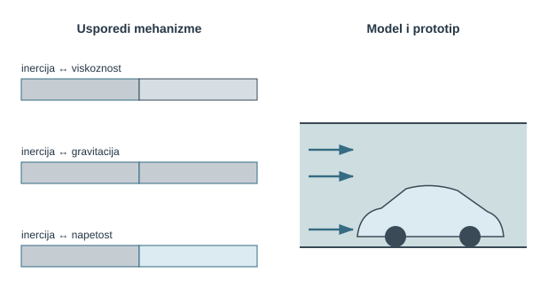
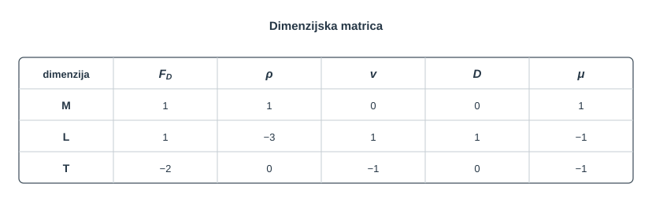
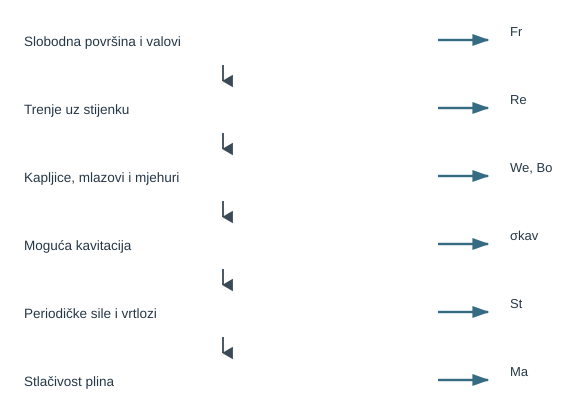
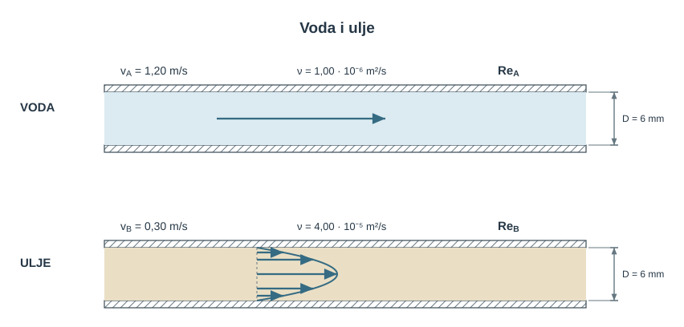
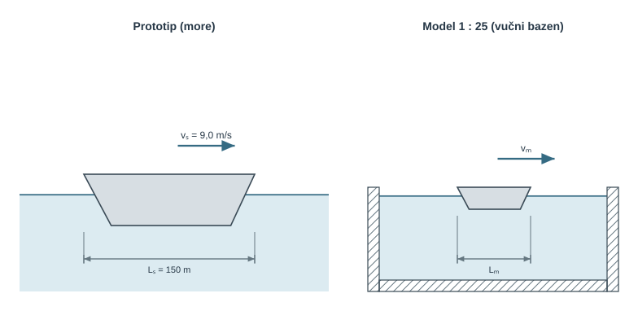
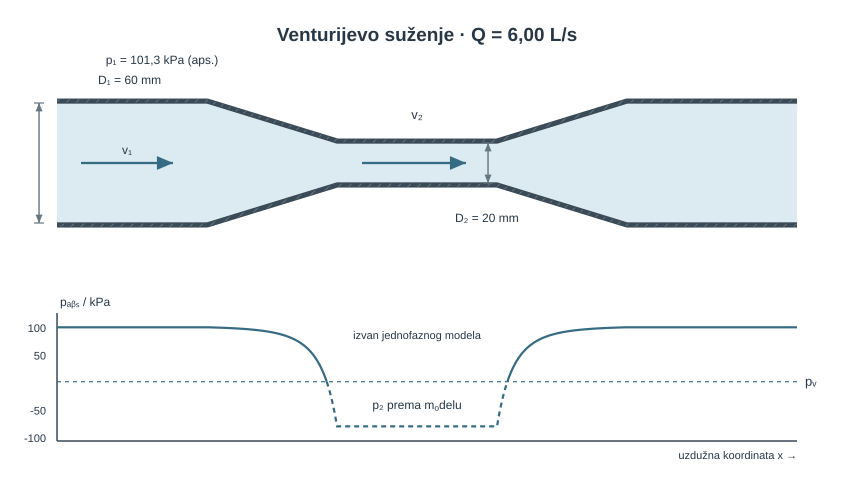
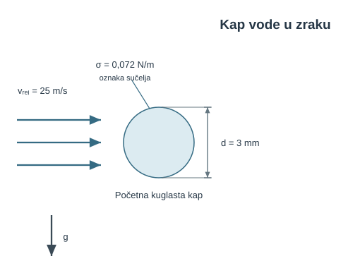
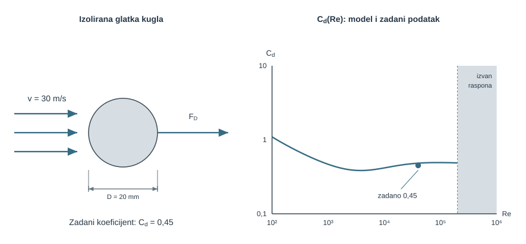
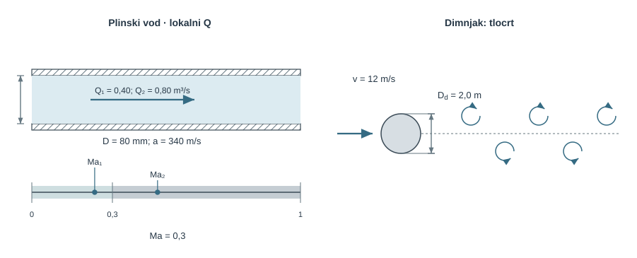
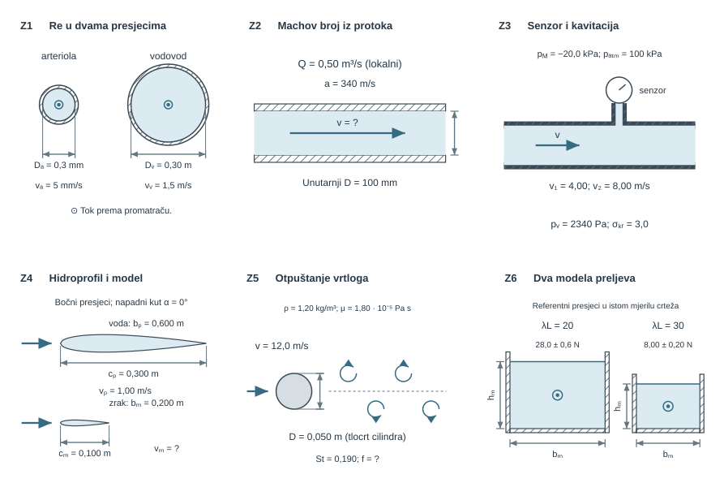

{#fig-uvod-u14 fig-align="center" fig-alt="Pregled poglavlja: usporedba karakterističnih mjerila, ključni bezdimenzijski brojevi i prijenos koeficijenta otpora iz aerotunela uz odgovarajuće uvjete sličnosti."}

**Tumačenje skice.** Usporedba karakterističnih mjerila daje $Re=\rho vL/\mu=vL/\nu$ za odnos inercije i viskoznosti, $Fr^2=v^2/(gL)$ za odnos inercije i gravitacije te $We=\rho v^2L/\sigma$ za odnos inercije i površinske napetosti. Parovi na skici shematski su i nemaju numeričko mjerilo.

Uz slobodnu površinu prati se $Fr=v/\sqrt{gL}$, za tlačne učinke $Eu=\Delta p/(\rho v^2)$, a za stlačivost $Ma=v/a$. Kapljice i mlazovi zahtijevaju provjeru površinske napetosti. Usporedba modela i prototipa u aerotunelu prenosi $C_d$ pri jednakom $Re$ samo ako su i ostali relevantni uvjeti isti, unutar granica odabranog modela.

## Dimenzijska analiza i sličnost

Dimenzijska analiza povezuje tlačne, viskozne, gravitacijske, inercijske i međupovršinske učinke bezdimenzijskim grupama. One mogu predstavljati omjere karakterističnih sila, vremenskih skala ili brzina te normirane odzivne veličine. Svrha je utvrditi mjerodavne fizikalne mehanizme promatranoga problema.

::: {.mf1-application}

Inženjerski kontekst

Brod se prije gradnje ispituje kao model u vučnom bazenu, automobil i zrakoplovno krilo u aerotunelu, a brodski vijak i centrifugalna crpka provjeravaju se na kavitaciju. Model i prototip ponašaju se jednako u bezdimenzijskom smislu samo ako su im jednaki **svi mjerodavni** brojevi te bezdimenzijski rubni i početni uvjeti. Kad to nije moguće, bira se prioritetna sličnost i kvantificira učinak neusklađenih grupa. Isti jezik povezuje vrtložno otpuštanje, raspad mlaza, stlačivost i prijenos rezultata iz laboratorija u pogon.
:::

**Procijenjeno vrijeme rada uz priručnik:** 9 sati.

## Dimenzije, jedinice i sila inercije kao referenca

Mehaničke veličine u ovom poglavlju izražavaju se preko tri **primarne dimenzije**: mase $\mathsf{M}$, duljine $\mathsf{L}$ i vremena $\mathsf{T}$. Tako brzina ima dimenziju $\mathsf{L}\,\mathsf{T}^{-1}$, gustoća $\mathsf{M}\,\mathsf{L}^{-3}$, a tlak i naprezanje $\mathsf{M}\,\mathsf{L}^{-1}\,\mathsf{T}^{-2}$. Kada problem uključuje toplinske veličine, potrebna je i dimenzija temperature $\Theta$. Načelo **dimenzijske homogenosti** kaže da svaki ispravan fizikalni izraz mora s obje strane imati istu dimenziju — to je ujedno jednostavna početna provjera svake jednadžbe.

Bezdimenzijski broj nastaje kombiniranjem veličina tako da se dimenzije pokrate. U mehanici fluida osobito su korisna karakteristična mjerila sila jer omogućuju usporedbu fizikalnih mehanizama. Za mnoge tokove polazi se od sljedećih mjerila:

$$
\begin{aligned}
&F_i \sim \rho v^2 L^2 \quad(\text{inercija}), \\
&F_\mu \sim \mu v L \quad(\text{viskoznost}), \\
&F_g \sim \rho g L^3 \quad(\text{gravitacija}),
\end{aligned}
$$ {#eq-slicnost-dimenzije-jedinice-i-sila-inercije-kao-referenca-01}

$$
F_p \sim \Delta p\, L^2 \quad(\text{tlak}), \qquad
F_\sigma \sim \sigma L \quad(\text{površinska napetost}).
$$ {#eq-slicnost-dimenzije-jedinice-i-sila-inercije-kao-referenca-02}

Ovdje je $L$ karakteristična duljina problema (promjer cijevi, duljina trupa, promjer kapi), a $v$ karakteristična brzina. **Inercijska sila** $F_i \sim \rho v^2 L^2$ uzima se kao prirodna referenca jer je prisutna u gotovo svakom strujanju — čim se fluid giba, ima inerciju. Zato se većina važnih bezdimenzijskih brojeva može pročitati kao omjer inercijske sile prema nekoj drugoj sili.

::: {.mf1-fizikalno-znacenje}

Fizikalno značenje

Bezdimenzijski broj nije puka matematička kratica. Omjeri sila poput $Re$, $Fr^2$ i $We$ pokazuju relativnu važnost mehanizama; $St$ uspoređuje vremenske skale, $Ma$ brzinu toka i širenja zvuka, a $C_p$ i $C_d$ normiraju mjerene odzive. Jednaka vrijednost jedne grupe nije dovoljna ako su u problemu aktivne i druge grupe.
:::

## Bezdimenzijske grupe kao omjeri mehanizama

Sljedeći pregled povezuje karakteristična mjerila sila s njihovim bezdimenzijskim omjerima. Strouhalov i Machov broj u nastavku uvode i dvije druge interpretacije — vremensku i brzinsku.

[]{#fig-u14-omjer-sila}

**Karakteristična mjerila sila.** Karakteristične sile procjenjuju se mjerilima $F_i\sim\rho v^2L^2$, $F_\mu\sim\mu vL$, $F_g\sim\rho gL^3$, $F_p\sim\Delta pL^2$ i $F_\sigma\sim\sigma L$. Njihovi omjeri daju $Re=\rho vL/\mu\sim F_i/F_\mu$, $Fr^2=v^2/(gL)\sim F_i/F_g$, $Eu=\Delta p/(\rho v^2)\sim F_p/F_i$ i $We=\rho v^2L/\sigma\sim F_i/F_\sigma$.

Bondov broj je $Bo=\Delta\rho gL^2/\sigma$; poistovjećivanje s prikazanim omjerom $F_g/F_\sigma$ vrijedi samo kada je $\Delta\rho\approx\rho$. Oznaka $F_i$ predstavlja inercijsko mjerilo, a ne dodatnu vanjsku silu. Navedena mjerila ne čine jednadžbu ravnoteže pojedine čestice; $L$, $v$ i $\Delta p$ moraju imati ista referentna značenja u svim omjerima.

**Reynoldsov broj** uspoređuje inerciju i viskoznost:

$$
Re = \frac{F_i}{F_\mu} = \frac{\rho v L}{\mu} = \frac{v L}{\nu}.
$$ {#eq-slicnost-bezdimenzijske-grupe-kao-omjeri-mehanizama-01}

Mali $Re$ obično znači da viskoznost snažno prigušuje poremećaje. Veliki $Re$ znači da su inercijski učinci jaki, ali **ne jamči sam po sebi turbulenciju**: prijelaz ovisi o geometriji, stabilnosti osnovnog toka, hrapavosti i ulaznim poremećajima. Za razvijeno strujanje u kružnoj cijevi $Re\lesssim2300$ obično je laminarno, prijelazno je približno između 2300 i 4000, a iznad toga u tehničkim uvjetima najčešće turbulentno [@white2011].

**Froudeov broj** uspoređuje inerciju i gravitaciju:

$$
Fr = \frac{v}{\sqrt{gL}}, \qquad Fr^2 = \frac{F_i}{F_g}.
$$ {#eq-slicnost-bezdimenzijske-grupe-kao-omjeri-mehanizama-02}

Froudeov broj važan je kada dinamiku slobodne površine određuju gravitacijski valovi, primjerice kod broda, otvorenog kanala ili preljeva. U otvorenom kanalu, kada je za $L$ odabrana hidraulička dubina $A/T$, $Fr=1$ označuje kritično strujanje: karakteristična brzina plitkovodnog vala jednaka je srednjoj brzini toka.

**Eulerov broj i koeficijent tlaka** uspoređuju tlačnu i inercijsku silu:

$$
Eu = \frac{\Delta p}{\rho v^2}, \qquad C_p = \frac{p - p_\infty}{\tfrac{1}{2}\rho v^2}.
$$ {#eq-slicnost-bezdimenzijske-grupe-kao-omjeri-mehanizama-03}

U nestlačivom, neviskoznom toku s referentnim stanjem u neporemećenoj struji Bernoullijeva jednadžba daje $C_p=1$ u stagnacijskoj točki. U realnom ili stlačivom toku, uz drukčiji izbor referentnog tlaka ili gubitke, ta vrijednost nije univerzalna. Negativan $C_p$ samo znači da je statički tlak manji od odabranoga referentnog tlaka.

**Kavitacijski broj** je posebni Eulerov broj koji normira tlačnu rezervu referentnog toka iznad tlaka zasićene pare:

$$
\sigma_{kav} = \frac{p_{ref} - p_v}{\tfrac{1}{2}\rho v_{ref}^2}.
$$ {#eq-slicnost-bezdimenzijske-grupe-kao-omjeri-mehanizama-04}

Referentni tlak, brzina i kritična vrijednost moraju biti definirani za konkretnu napravu i konvenciju. Kavitacija lokalno počinje kada apsolutni tlak dosegne $p_v$; na razini cijelog propelera ili crpke to se često opisuje eksperimentalnim $\sigma_{kr}$. Zato sama brojčana vrijednost $\sigma_{kav}$ bez karakteristike uređaja nije dovoljna za tvrdnju „sigurno” ili „kavitira”.

**Weberov broj** uspoređuje inerciju i površinsku napetost:

$$
We = \frac{\rho v^2 L}{\sigma}, \qquad We = \frac{F_i}{F_\sigma}.
$$ {#eq-slicnost-bezdimenzijske-grupe-kao-omjeri-mehanizama-05}

Pri malom $We$ površinska napetost snažno se opire deformaciji, a pri velikom su inercijska naprezanja relativno veća. Prag raspada nije univerzalan: ovisi o vrsti raspada, omjeru gustoća i viskoznosti, Ohnesorgeovu broju, početnoj deformaciji i vremenu djelovanja. Vrijednost reda $We\approx12$ može služiti kao orijentir za određene režime aerodinamičkog raspada pojedinačne kapi, ali ne kao opći kriterij kvalitete atomizacije [@white2011].

**Bondov (Eötvösov) broj** uspoređuje gravitaciju i površinsku napetost:

$$
Bo = \frac{\Delta\rho\,g L^2}{\sigma}.
$$ {#eq-slicnost-bezdimenzijske-grupe-kao-omjeri-mehanizama-06}

Ovdje je $\Delta\rho$ razlika gustoća dviju faza; za granicu voda–zrak često se aproksimira gustoćom vode. Pri $Bo\sim1$ gravitacija i površinska napetost usporedive su, a kapilarna duljina glasi $L_c=\sqrt{\sigma/(\Delta\rho g)}$.

**Strouhalov broj** opisuje nestacionarno, periodičko strujanje:

$$
St = \frac{f L}{v},
$$ {#eq-slicnost-bezdimenzijske-grupe-kao-omjeri-mehanizama-07}

gdje je $f$ frekvencija pojave. To je omjer konvektivne vremenske skale $L/v$ i perioda $1/f$, a ne izravan omjer sila. Za kružni cilindar u određenom subkritičnom području Reynoldsova broja često je $St$ reda $0{,}2$; vrijednost ovisi o geometriji i režimu [@white2011].

::: {.mf1-cfd title="Računalna dinamika fluida"}

**Vibrira li nosač zbog vrtloga?** Cilindrični stup u vodi može biti izložen promjenjivoj bočnoj sili zbog otpuštanja vrtloga. U nestacionarnom CFD-u najprije računamo tok oko nepomičnog stupa pri zadanoj brzini dotoka. Iz zapisa sile određujemo srednji otpor, amplitudu i dominantnu frekvenciju; $St=fL/v$ omogućuje usporedbu različitih dimenzija i brzina pri odgovarajućem režimu.

Zapis mora obuhvatiti više perioda, a vremenski korak dovoljno razlučiti svaki period. Jednak srednji otpor ne potvrđuje točnu frekvenciju. Ako je frekvencija blizu vlastite frekvencije konstrukcije, za predviđanje vibracija treba uključiti i gibanje konstrukcije. Tako CFD daje pobudu za mehanički model, dok sama simulacija nepomičnog stupa još ne daje njegov pomak.
:::

**Machov broj** uspoređuje inerciju i stlačivost (elastičnost) fluida:

$$
Ma = \frac{v}{a}, \qquad \text{Cauchyjev broj} = \frac{\rho v^2}{K} = Ma^2,
$$ {#eq-slicnost-bezdimenzijske-grupe-kao-omjeri-mehanizama-08}

gdje je $a$ brzina zvuka, a $K$ modul stlačivosti. Za plinska strujanja bez velikog zagrijavanja i snažnih tlačnih promjena, $Ma<0{,}3$ često je uporabljiv kriterij da su promjene gustoće male. To je inženjerski prag, ne matematička granica: iznad njega stlačivost postupno postaje važna, a i pri malom $Ma$ gustoća se može mijenjati zbog temperature ili sastava [@anderson2021].

**Koeficijent trenja, otpora i tlaka kao bezdimenzijski rezultati.** Rezultati proračuna otpora mogu se prikazati i bezdimenzijskim koeficijentima, dobivenima normiranjem sila ili naprezanja:

$$
\lambda = \lambda\!\left(Re, \frac{\varepsilon}{D}\right), \qquad
C_d = \frac{F_D}{\tfrac{1}{2}\rho v^2 A}.
$$ {#eq-slicnost-bezdimenzijske-grupe-kao-omjeri-mehanizama-09}

Darcyjev $\lambda$ i koeficijent otpora $C_d$ jesu bezdimenzijski odzivi. Jedna izmjerena krivulja može se prenositi samo unutar iste bezdimenzijske geometrije, rubnih uvjeta i skupa relevantnih grupa; primjerice $C_d$ osim o $Re$ može ovisiti o hrapavosti, $Ma$, slobodnoj turbulenciji i blizini stijenke.

::: {.mf1-cfd title="Računalna dinamika fluida"}

**Može li se rezultat prenijeti na veći razdjelnik?** Za geometrijski slične rashladne razdjelnike usporedimo bezdimenzijska polja tlaka i brzine pri jednakom $Re$, uz jednak oblik ulaznog profila i relativnu hrapavost. Ako su važni isti mehanizmi, takva usporedba otkriva može li se rezultat jednoga uređaja prenijeti na drugi. Bezdimenzijski tlak koristi istu referencu i skalu $\rho v^2/2$ u oba računa.

Jednake dimenzijske vrijednosti pada tlaka nisu uvjet sličnosti. Obrnuto, slaganje koeficijenata nema značenje ako su korištene različite referentne brzine. Za izoterman jednofazni model to može biti dovoljna hidrodinamička usporedba; prijenos rezultata hlađenja traži i toplinsku sličnost. Time se jasno određuje što možemo skalirati iz ranijeg CFD modela.
:::

## Kada se rezultat može prenijeti na drugi sustav

Zamislimo dva geometrijski slična cjevovoda različitih veličina. Za nestlačivi tok istog tipa jednaki Reynoldsovi brojevi mogu omogućiti usporedbu raspodjela brzine i tlaka, izraženih u odnosu na odabranu brzinu i tlak. Pritom moraju odgovarati i ostali uvjeti, poput relativne hrapavosti i načina ulaska fluida.

Ako sustav ima slobodnu površinu ili kapljice, važni postaju i drugi omjeri sila. Za model vala treba paziti na Froudeov broj, a za kapljice i na Weberov broj. Prije prenošenja računalnog rezultata na drugi uređaj zato treba provjeriti koje pojave određuju njegovo ponašanje.

Tablica sažima sve brojeve poglavlja; ista tablica u skraćenom obliku ulazi u dod. ASažetak formula i oznaka.

| Broj | Definicija | Fizikalno tumačenje | Prag ili uvjet | Gdje je važan |
| --- | --- | --- | --- | --- |
| $Re$ | $\rho vL/\mu=vL/\nu$ | inercija / viskoznost | granice ovise o geometriji; za cijev približno 2300–4000 | režim, otpor |
| $Fr$ | $v/\sqrt{gL}$ | $Fr^2=$ inercija / gravitacija | $Fr=1$ za kritično strujanje u otvorenom kanalu | brod, kanal, preljev |
| $Eu,\ C_p$ | $\Delta p/(\rho v^2)$; $(p-p_\infty)/(\tfrac12\rho v^2)$ | tlak / inercija; normirani tlak | $C_p=1$ samo za idealnu nestlačivu stagnaciju uz odgovarajuću referencu | raspodjela tlaka |
| $\sigma_{kav}$ | $(p_{ref}-p_v)/(\tfrac12\rho v_{ref}^2)$ | normirana tlačna rezerva | usporedba s uređajno i konvencijski definiranim $\sigma_{kr}$ | vijak, crpka |
| $We$ | $\rho v^2L/\sigma$ | inercija / površinska napetost | prag raspada ovisi o režimu i drugim grupama | kap, mlaz, sprej |
| $Bo$ | $\Delta\rho gL^2/\sigma$ | gravitacija / površinska napetost | $Bo\sim1$, $L_c=\sqrt{\sigma/(\Delta\rho g)}$ | oblik kapi i mjehura |
| $\lambda,\ C_d$ | bezdimenzijski koeficijenti | normirani odzivi otpora | vrijede uz definiranu geometriju i relevantne grupe | unutarnji i vanjski otpor |
| $St$ | $fL/v$ | omjer vremenskih skala | $St$ reda $0{,}2$ samo za određene tokove oko cilindra | vrtložno otpuštanje |
| $Ma$ | $v/a$ | omjer brzine toka i zvuka; $Ma^2$ povezan s inercijom/stlačivošću | $Ma<0{,}3$ je čest, uvjetan nestlačivi prag | stlačivost |

## Buckinghamov Π teorem

Dimenzijska analiza odgovara na pitanje: ako problem ovisi o $n$ fizikalnih veličina, koliko ga **neovisnih bezdimenzijskih grupa** određuje? Odgovor daje Buckinghamov $\Pi$ teorem:

$$
\text{broj } \Pi\text{-grupa} = n - k,
$$ {#eq-slicnost-buckinghamov-teorem-01}

gdje je $n$ broj fizikalnih veličina, a $k$ rang dimenzijske matrice (u mehanici fluida najčešće $k = 3$: $\mathsf{M}, \mathsf{L}, \mathsf{T}$). Postupak je uvijek isti:

1. popiši sve fizikalne veličine koje ulaze u problem i njihove dimenzije;
2. odredi $k$ — rang dimenzijske matrice;
3. izaberi $k$ **ponavljajućih varijabli** koje zajedno pokrivaju sve dimenzije i same ne tvore bezdimenzijsku grupu (tipično $\rho, v, L$);
4. svaku preostalu varijablu kombiniraj s ponavljajućima u jednu $\Pi$-grupu i odredi eksponente tako da izraz bude bezdimenzijski;
5. protumači dobivene grupe i, kada je moguće, poveži ih s poznatim brojevima (Re, Fr, …).

Slika [-@fig-u14-pi-buckingham] prikazuje taj postupak shematski na primjeru otpora kugle.

{#fig-u14-pi-buckingham fig-align="center" fig-alt="Shema Buckinghamova postupka: popis varijabli {F, ρ, v, D, μ}, dimenzijska matrica M-L-T i tvorba dviju Π-grupa Π₁ = F/(ρv²D²) i Π₂ = Re"}

**Tumačenje matrice.** Za pet varijabli $F_D$, $\rho$, $v$, $D$ i $\mu$ dimenzijska matrica ima rang tri, pa dobivamo $n-k=5-3=2$ neovisne bezdimenzijske grupe. Jedan izbor je $\Pi_1=F_D/(\rho v^2D^2)$ i $\Pi_2=\rho vD/\mu=Re$. Veza $\Pi_1=f(\Pi_2)$ vodi zapisu $C_d=\Phi(Re)$, uz odabranu definiciju koeficijenta otpora.

::: {.mf1-izvod}

Matematički izvod — Dimenzijska analiza pada tlaka u cijevi

Ukupni pad tlaka na ravnoj cijevnoj dionici može ovisiti o gustoći $\rho$, srednjoj brzini $v$, promjeru $D$, duljini $L$, viskoznosti $\mu$ i hrapavosti stijenke $\varepsilon$. Skup od $n = 7$ veličina ($\Delta p,\rho,v,D,L,\mu,\varepsilon$) ima $k = 3$ neovisne dimenzije, pa nastaju četiri $\Pi$-grupe.

Uz ponavljajuće varijable $\rho, v, D$ tvore se grupe:

$$
\Pi_1 = \frac{\Delta p}{\rho v^2}, \qquad
\Pi_2 = \frac{\rho v D}{\mu} = Re, \qquad
\Pi_3 = \frac{L}{D}, \qquad
\Pi_4 = \frac{\varepsilon}{D}.
$$ {#eq-slicnost-matematicki-izvod-dimenzijska-analiza-pada-tlaka-01}

Iz teorema slijedi da su sve grupe povezane jednom funkcijom:

$$
\frac{\Delta p}{\rho v^2} = \phi\!\left(Re, \frac{L}{D}, \frac{\varepsilon}{D}\right).
$$ {#eq-slicnost-matematicki-izvod-dimenzijska-analiza-pada-tlaka-02}

::: {.callout-note}
## Postupak rješenja
Korak: traženje eksponenata za $\Pi_1 = \Delta p\, \rho^a v^b D^c$.

Dimenzije: $[\Delta p] = \mathsf{M}\mathsf{L}^{-1}\mathsf{T}^{-2}$, $[\rho] = \mathsf{M}\mathsf{L}^{-3}$, $[v] = \mathsf{L}\mathsf{T}^{-1}$, $[D] = \mathsf{L}$. Da $\Pi_1$ bude bezdimenzijski:

$$
\mathsf{M}:\ 1 + a = 0,\qquad
\mathsf{T}:\ -2 - b = 0,\qquad
\mathsf{L}:\ -1 - 3a + b + c = 0.
$$ {#eq-slicnost-razrada-koraka-01}

Odatle $a = -1$, $b = -2$, $c = 0$, pa je $\Pi_1 = \Delta p/(\rho v^2)$, što je Eulerov broj.
:::

Dimenzijska analiza sama ne određuje oblik funkcije $\phi$ niti dokazuje linearnost s $L$. Dodatna fizikalna pretpostavka glasi: strujanje je potpuno razvijeno u jednolikoj ravnoj cijevi, pa je srednji gradijent tlaka konstantan i jednake se dionice mogu zbrajati. Tek tada je $\Delta p\propto L$, pa se funkcija može zapisati u Darcy–Weisbachovu obliku

$$
\Delta p = \lambda\,\frac{L}{D}\,\frac{\rho v^2}{2}, \qquad \lambda = \lambda\!\left(Re, \frac{\varepsilon}{D}\right),
$$ {#eq-slicnost-razrada-koraka-02}

Dimenzijska analiza tako ograničava dopuštenu ovisnost, a pretpostavka potpuno razvijenoga toka izdvaja $L/D$. Sama funkcija $\lambda(Re,\varepsilon/D)$ dobiva se analitički u laminarnom toku ili empirijski/numerički u turbulentnom.
:::

::: {.mf1-izvod}

Matematički izvod — Otpor kugle daje Cd(Re)

Za izoliranu glatku kuglu u jednolikoj, nestlačivoj struji daleko od stijenki, uz zanemarivu slobodnu turbulenciju i stlačivost, sila otpora $F_D$ ovisi o $\rho$, $v$, $D$ i $\mu$. Tada iz pet veličina nastaju dvije $\Pi$-grupe:

$$
\Pi_1 = \frac{F_D}{\rho v^2 D^2}, \qquad \Pi_2 = \frac{\rho v D}{\mu} = Re.
$$ {#eq-slicnost-matematicki-izvod-otpor-kugle-daje-cd-re-01}

Time je cijeli problem otpora sveden na jednu funkciju jedne varijable:

$$
\frac{F_D}{\rho v^2 D^2} = f(Re) \quad\Longleftrightarrow\quad C_d = \frac{F_D}{\tfrac{1}{2}\rho v^2 A} = \Phi(Re),
$$ {#eq-slicnost-matematicki-izvod-otpor-kugle-daje-cd-re-02}

Unutar navedenih pretpostavki jedna krivulja $C_d(Re)$ obuhvaća Stokesov režim $C_d=24/Re$ pri vrlo malom $Re$ i područje otporne krize. Hrapavost, blizina stijenke, slobodna turbulencija ili stlačivost uveli bi dodatne parametre i promijenili krivulju.
:::

## Sličnost i modelska ispitivanja

Da bi se rezultati ispitivanja modela mogli prenijeti na stvarni objekt (prototip), mora vrijediti **sličnost** na tri razine:

- **geometrijska sličnost** — model i prototip imaju isti oblik, sve duljine u istom mjerilu $\lambda_L = L_p/L_m$;
- **kinematička sličnost** — polja brzina su geometrijski slična (iste linije strujanja, brzine u istom omjeru);
- **dinamička sličnost** — sile na model i prototip u istom su omjeru, što znači da su **mjerodavni bezdimenzijski brojevi jednaki**.

Dinamička sličnost je cilj: ako su jednaki svi relevantni brojevi, model i prototip ponašaju se identično u bezdimenzijskom smislu, pa se izmjereni koeficijenti ($C_d$, $C_p$, $\lambda$) izravno prenose.

::: {.mf1-fizikalno-znacenje}

Fizikalno značenje

Praktičan problem je što se svi brojevi rijetko mogu izjednačiti istovremeno. Za model broda u istom fluidu jednak $Fr$ traži $v_m=v_p/\sqrt{\lambda_L}$, dok jednak $Re$ traži $v_m=v_p\lambda_L$. Ti su zahtjevi za $\lambda_L\ne1$ međusobno nespojivi. U vučnom bazenu zato se prioritetno čuva Froudeova sličnost, a viskozni doprinos procjenjuje zasebno odgovarajućim korekcijskim postupkom. Drugi fluid ili promijenjeni tlak/temperatura mogu približiti dodatnu sličnost, ali uvode praktična ograničenja i nove provjere.
:::

Skaliranje veličina slijedi iz odabranog broja. Pri Froudeovoj sličnosti, uz jednako gravitacijsko ubrzanje i mjerilo $\lambda_L=L_p/L_m$, vrijedi:

$$
\frac{v_p}{v_m} = \sqrt{\lambda_L}, \qquad
\frac{Q_p}{Q_m} = \lambda_L^{5/2}, \qquad
\frac{F_p}{F_m} = \frac{\rho_p}{\rho_m}\lambda_L^{3}.
$$ {#eq-slicnost-fizikalno-znacenje-01}

Posljednji se izraz svodi na $\lambda_L^3$ samo kada model i prototip imaju jednaku referentnu gustoću.

## Kako odlučiti što bezdimenzionirati

Srž ovog poglavlja nije zapamtiti devet formula, nego prepoznati **skup** relevantnih grupa. Najprije se definiraju izlazna veličina, geometrija, fluid te početni i rubni uvjeti; zatim se iz jednadžbi ili Buckinghamova postupka izdvoje mogući mehanizmi. Procjena reda veličine pokazuje koje se grupe mogu zanemariti, a koje treba očuvati. Ako dvije važne grupe nije moguće istodobno uskladiti, odabire se prioritetna sličnost i procjenjuje mjerilna pogreška.

{#fig-u14-odluka fig-align="center" fig-alt="Dijagram pitanja za prepoznavanje mogućih relevantnih grupa: slobodna površina upućuje na Fr, viskoznost na Re, kapljice na We i Bo, kavitacija na σ_kav, periodičnost na St, a stlačivost na Ma. U jednom problemu može biti važno više grupa."}

**Tumačenje dijagrama.** Treba provjeriti sve aktivne mehanizme jer u istom problemu može biti važno više grupa. Slobodna površina i valovi upućuju na $Fr=v/\sqrt{gL}$; trenje i režim toka na $Re=vL/\nu$; kapljice, mlazovi i mjehuri na $We$, $Bo$ i kapilarnu duljinu $L_c$. Prijelazni raspon Reynoldsova broja ovisi o toku; za kružnu cijev orijentacijski je $2300$–$4000$. Prag raspada kapljice također ovisi o režimu.

Pri mogućoj kavitaciji uspoređuje se $\sigma_{\mathrm{kav}}=(p_{\mathrm{ref}}-p_v)/(\tfrac12\rho v_{\mathrm{ref}}^2)$ s kritičnom vrijednošću definiranom za uređaj. Periodičnost opisuje $St=fL/v$; za cilindar je u određenom rasponu $Re$ često reda $0{,}2$. Za stlačivost služi $Ma=v/a$: kriterij $Ma<0{,}3$ često dopušta približno stalnu gustoću, uz provjeru uvjeta problema. Izlazni koeficijent bira se prema pitanju: $C_d$ za otpor tijela, $\lambda$ za cijevne gubitke ili $C_p$ za raspodjelu tlaka.

::: {.mf1-decision-grid}
::: {.mf1-decision-step}
1

Postoji li slobodna površina ili valovi?

Ako da, gravitacija može biti važna → mjerodavan je **Froudeov broj** $Fr$ (brod, kanal, preljev, hidraulički skok).
:::

::: {.mf1-decision-step}
2

Je li bitan režim ili trenje uz stijenku?

Izračunaj **Reynoldsov broj** $Re$ (cijev, granični sloj, ležaj) i protumači ga za konkretnu geometriju. On mjeri relativnu važnost inercije i viskoznosti, ali prijelaz ne određuje bez podataka o stabilnosti toka i poremećajima.
:::

::: {.mf1-decision-step}
3

Ima li kapljica, mlaza ili mjehura?

Tada je važna površinska napetost → **Weberov broj** $We$ (inercija prema površinskoj napetosti) i **Bondov broj** $Bo$ (gravitacija prema površinskoj napetosti). Usporedi $L$ s kapilarnom duljinom $L_c$.
:::

::: {.mf1-decision-step}
4

Može li tlak pasti do tlaka zasićene pare?

U suženjima, na vijku i usisu crpke → **kavitacijski broj** $\sigma_{kav}$. Usporedba s kritičnom vrijednošću vrijedi samo za jednako definirane referentne veličine i odgovarajuću karakteristiku iste vrste uređaja.
:::

::: {.mf1-decision-step}
5

Postoje li periodičke sile ili vibracije?

Vrtložno otpuštanje iza tijela → **Strouhalov broj** $St$. Provjeri može li nastupiti rezonancija s konstrukcijom.
:::

::: {.mf1-decision-step}
6

Je li brzina plina velika?

Ako se $v$ približava brzini zvuka → provjeri **Machov broj** $Ma$. Za $Ma<0{,}3$ nestlačiva aproksimacija često je dobra ako nema velikih toplinskih, tlačnih ni sastavnih promjena; pretpostavku ipak treba provjeriti za konkretan problem.
:::

::: {.mf1-decision-step}
7

Što tražiš kao izlaz?

Otpor tijela → **koeficijent otpora** $C_d$; pad tlaka u cijevi → **koeficijent trenja** $\lambda$; raspodjela tlaka po plohi → **koeficijent tlaka** $C_p$.
:::
:::

::: {#cfd-ponton-slicnost .mf1-cfd title="Računalna dinamika fluida"}

**Mali ponton u bazenu i stvarni ponton u valovima.** U []{.mf1-chapter-ref target="u06"} provjeravali smo gaz i početni stabilitet. Za dinamički pokus manjega pontona sada treba uskladiti geometriju, raspodjelu mase i važne bezdimenzijske uvjete. Froudeova sličnost povezuje gibanje s gravitacijskim valovima, dok Reynoldsov broj određuje odnos inercije i viskoznosti. Ručni @ex-u14-froudeova-slicnost-model-broda-u-vucnom-bazenu računski pokazuje da ista voda pri promjeni mjerila ne čuva oba broja.

**Zastani i promisli.** Model broda i prototip imaju isti Froudeov broj. Smijemo li bez dodatne provjere prenijeti i viskozni otpor?

Jednak Froudeov broj zato ne potvrđuje prijenos viskoznog otpora. CFD računi obaju mjerila mogu pokazati osjetljivost otpora i prigušenja na promijenjeni $Re$, uz zasebne numeričke provjere; sami ne uklanjaju razliku mjerila. Za kapilarne učinke dodatno provjeravamo $We$ i $Bo$. Odabir modela tako počinje procjenom mehanizama prije izrade mreže; pregled daje @sec-cfd-mapa.
:::

## Riješeni primjeri

::: {#ex-u14-reynoldsov-broj-u-dva-sustava-iste-geometrije .mf1-we}

Reynoldsov broj u dva sustava iste geometrije&nbsp;T1

**Tekst zadatka**

Kroz razvijeni ravni kružni kanal promjera $D = 6\ \text{mm}$ u jednom slučaju teče voda brzinom $v_A = 1{,}2\ \text{m/s}$, s $\nu_v = 1{,}0 \cdot 10^{-6}\ \text{m}^2/\text{s}$, a u drugom ulje brzinom $v_B = 0{,}30\ \text{m/s}$, s $\nu_u = 4{,}0 \cdot 10^{-5}\ \text{m}^2/\text{s}$. Za procjenu početka prijelaznog područja uzmi orijentacijsku vrijednost $Re=2300$ [@white2011].

**Traži se**

1. Odredi Reynoldsov broj i režim u oba slučaja.
2. Odredi brzinu vode koja odgovara orijentacijskoj vrijednosti $Re=2300$.

{#fig-u14-val1-reynolds fig-align="center" fig-alt="Voda i ulje u istoj cijevi: usporedba uvjeta koji određuju Reynoldsov broj."}

**Uz skicu.** Oba prikaza imaju isti unutarnji promjer. Strelica uz vodu označuje srednju brzinu; turbulentne fluktuacije nisu nacrtane. Za prikazani potpuno razvijeni laminarni tok ulja vrijedi $u(r)=2v_B[1-(r/R)^2]$, uz $R=D/2$ i prianjanje $u(\pm R)=0$. Strelice unutar profila označuju lokalne brzine, a ne strujnice. Debljina stijenke je shematska.

**Rješenje**

Za vodu:

$$
Re_A = \frac{v_A D}{\nu_v} = \frac{1{,}2 \cdot 0{,}006}{1{,}0 \cdot 10^{-6}} = 7200 \quad (>4000 \Rightarrow \text{turbulentno}).
$$ {#eq-slicnost-rijeseni-primjer-reynoldsov-broj-u-dva-sustava-01}

Za ulje:

$$
Re_B = \frac{v_B D}{\nu_u} = \frac{0{,}30 \cdot 0{,}006}{4{,}0 \cdot 10^{-5}} = 45 \quad (\ll 2300 \Rightarrow \text{izrazito laminarno}).
$$ {#eq-slicnost-rijeseni-primjer-reynoldsov-broj-u-dva-sustava-02}

Brzina vode koja odgovara $Re=2300$:

$$
v_{kr} = \frac{Re_{kr}\,\nu_v}{D} = \frac{2300 \cdot 1{,}0 \cdot 10^{-6}}{0{,}006} \approx 0{,}383\ \text{m/s}.
$$ {#eq-slicnost-rijeseni-primjer-reynoldsov-broj-u-dva-sustava-03}

**Provjera i tumačenje**

1. Pri istom $D$ i sličnom redu veličine brzine, $Re$ se razlikuje oko 160 puta — pri istoj geometriji razliku režima određuje omjer inercijskih i viskoznih učinaka.
2. Pri zadanoj brzini ulje ima vrlo malen $Re$, pa viskozni učinci snažno prigušuju poremećaje. Pri dovoljno većoj brzini i njegov bi se režim mogao promijeniti.
3. Za vodu je $Re=7200$ iznad uobičajenoga prijelaznog područja razvijenog toka u kružnoj cijevi, pa se u tehničkim ulaznim uvjetima očekuje turbulentan tok. Posljedice za prijenos topline traže i toplinsku analizu.
:::

::: {#ex-u14-froudeova-slicnost-model-broda-u-vucnom-bazenu .mf1-we}

Froudeova sličnost: model broda u vučnom bazenu&nbsp;T2

**Tekst zadatka**

Brod duljine $L_s = 150\ \text{m}$ i brzine $v_s = 9{,}0\ \text{m/s}$ ispituje se geometrijski sličnim modelom u mjerilu $\lambda_L = 25$. U oba slučaja vrijede $\nu = 1{,}0 \cdot 10^{-6}\ \text{m}^2/\text{s}$ i $g = 9{,}81\ \text{m/s}^2$. Za proučavanje otpora valova odaberi Froudeovu sličnost.

**Traži se**

1. Odredi duljinu i brzinu modela iz uvjeta $Fr_m = Fr_s$.
2. Odredi Froudeov broj te omjer Reynoldsovih brojeva prototipa i modela.
3. Objasni zašto se Reynoldsova sličnost ne može istovremeno zadovoljiti.

{#fig-u14-val2-brod fig-align="center" fig-alt="Model broda i prototip pri jednakom Froudeovu broju."}

**Veza s proračunom.** Froudeova sličnost određuje modelsku brzinu za usporedbu gravitacijskih valova, ali u istoj vodi ne čuva i Reynoldsov broj. Model i prototip nacrtani su u različitim grafičkim mjerilima; stvarne dimenzije daju kote. Prikazana je shema uronjenih trupova, bez valova, s otvorenim prolazom vode ispod modela.

**Rješenje**

Duljina modela:

$$
L_m = \frac{L_s}{\lambda_L} = \frac{150}{25} = 6{,}0\ \text{m}.
$$ {#eq-slicnost-rijeseni-primjer-froudeova-slicnost-model-broda-01}

Iz $Fr_m = Fr_s$, tj. $v_m/\sqrt{gL_m} = v_s/\sqrt{gL_s}$, slijedi $v_m = v_s/\sqrt{\lambda_L}$:

$$
v_m = \frac{v_s}{\sqrt{\lambda_L}} = \frac{9{,}0}{\sqrt{25}} = 1{,}8\ \text{m/s}.
$$ {#eq-slicnost-rijeseni-primjer-froudeova-slicnost-model-broda-02}

Froudeov broj (jednak na modelu i prototipu):

$$
Fr = \frac{v_s}{\sqrt{g L_s}} = \frac{9{,}0}{\sqrt{9{,}81 \cdot 150}} \approx 0{,}235.
$$ {#eq-slicnost-rijeseni-primjer-froudeova-slicnost-model-broda-03}

Reynoldsovi brojevi: $Re_s = v_s L_s/\nu = 1{,}35 \cdot 10^{9}$, $Re_m = v_m L_m/\nu = 1{,}08 \cdot 10^{7}$, pa je

$$
\frac{Re_s}{Re_m} = \lambda_L^{3/2} = 25^{1{,}5} = 125.
$$ {#eq-slicnost-rijeseni-primjer-froudeova-slicnost-model-broda-04}

**Provjera i tumačenje**

1. Model je kraći (mjerilo 25) i sporiji ($\sqrt{25} = 5$ puta) — to je posljedica Froudeove sličnosti.
2. Za jednak $Re$ model bi se morao gibati brzinom $v_m = v_s\,\lambda_L = 225\ \text{m/s}$, što je praktično neostvarivo i neprikladno za ovakav bazenski pokus; Froudeova i Reynoldsova sličnost ne mogu se zadovoljiti istovremeno istim fluidom i ovim mjerilom.
3. Zato se otpor razdvaja: valni se doprinos prenosi prvenstveno Froudeovom sličnošću, a viskozni se doprinos procjenjuje odgovarajućim korekcijskim postupkom [@ittc].
:::

::: {#ex-u14-kavitacija-u-venturijevom-suzenju-t2 .mf1-we}

Kavitacija u Venturijevu suženju&nbsp;T2

**Tekst zadatka**

Horizontalni Venturijev mjerač ima ulazni promjer $D_1 = 60\ \text{mm}$ i promjer grla $D_2 = 20\ \text{mm}$. Voda gustoće $\rho = 1000\ \text{kg/m}^3$ i tlaka pare $p_v = 2340\ \text{Pa}$ struji zadanim protokom $Q = 6{,}0\ \text{L/s}$ uz apsolutni ulazni tlak $p_1 = 101{,}3\ \text{kPa}$. Primijeni jednofazni Bernoullijev model bez gubitaka i provjeri njegovu valjanost prema idealiziranom kriteriju $p_2=p_v$.

**Traži se**

1. Odredi brzine $v_1$ i $v_2$.
2. Odredi tlak u grlu prema Bernoulliju i donesi zaključak o kavitaciji.
3. Odredi kavitacijski broj i idealizirani granični protok prema uvjetu $p_2=p_v$.

{#fig-u14-val3-venturi fig-align="center" fig-alt="Tlak u grlu Venturijeva suženja prema jednofaznom modelu. Dio osi ispod tlaka pare pokazuje prekoračenje valjanosti modela."}

**Uz dijagram.** Krivulja tlaka dobivena je Bernoullijevom jednadžbom uz pretpostavku jednofaznog toka bez gubitaka. Idealizirani prag kavitacije jest $p_2=p_v$, bez dodatne pogonske rezerve. Dio krivulje ispod tlaka pare pokazuje prekoračenje valjanosti modela, a ne pouzdano predviđanje stvarnog dvofaznog tlaka. Ispuna cijevi označuje geometriju fluida.

**Rješenje**

Površine i brzine:

$$
A_1 = \frac{\pi D_1^2}{4} = 2{,}827 \cdot 10^{-3}\ \text{m}^2, \qquad v_1 = \frac{Q}{A_1} = 2{,}12\ \text{m/s},
$$ {#eq-slicnost-rijeseni-primjer-kavitacija-u-venturijevom-suzen-01}

$$
A_2 = \frac{\pi D_2^2}{4} = 3{,}142 \cdot 10^{-4}\ \text{m}^2, \qquad v_2 = \frac{Q}{A_2} = 19{,}10\ \text{m/s}.
$$ {#eq-slicnost-rijeseni-primjer-kavitacija-u-venturijevom-suzen-02}

Tlak u grlu iz Bernoullija:

$$
p_2 = p_1 + \tfrac{1}{2}\rho\,(v_1^2 - v_2^2) = 101\,300 + 500\,(2{,}12^2 - 19{,}10^2) \approx -78{,}8\ \text{kPa}.
$$ {#eq-slicnost-rijeseni-primjer-kavitacija-u-venturijevom-suzen-03}

Predviđeni apsolutni tlak je negativan — fizikalno nemoguć i jasan znak sloma jednofaznoga idealnog modela. Idealizirani granični protok prema uvjetu $p_2=p_v$ slijedi uz $v_1=(A_2/A_1)v_2$:

$$
\begin{aligned}
v_{2,\max} &= \sqrt{\frac{p_1 - p_v}{\tfrac{1}{2}\rho\,(1 - (A_2/A_1)^2)}} \approx 14{,}16\ \text{m/s}, \\
Q_{\max} &= A_2 v_{2,\max} \approx 4{,}45\ \text{L/s}.
\end{aligned}
$$ {#eq-slicnost-rijeseni-primjer-kavitacija-u-venturijevom-suzen-04}

Kavitacijski broj pri radnom protoku ($v_2 = 19{,}10\ \text{m/s}$):

$$
\sigma_{kav} = \frac{p_1 - p_v}{\tfrac{1}{2}\rho v_2^2} = \frac{101\,300 - 2340}{500 \cdot 19{,}10^2} \approx 0{,}543.
$$ {#eq-slicnost-rijeseni-primjer-kavitacija-u-venturijevom-suzen-05}

**Provjera i tumačenje**

1. Suženje 9 puta (po površini) daje 9 puta veću brzinu u grlu, pa kvadratni član u Bernoulliju naglo obara tlak.
2. Negativan apsolutni tlak pokazuje da jednofazni Bernoullijev rezultat pri $6\ \text{L/s}$ nije fizički ostvariv; u stvarnom toku treba očekivati promjenu režima i provjeriti pojavu kavitacije odgovarajućim modelom ili mjerenjem.
3. Vrijednost $\approx4{,}4\ \text{L/s}$ samo je prag idealiziranoga kriterija za zadane ulazne podatke, a ne zajamčen dopušteni protok crpke. Pogonska provjera traži stvarne gubitke, temperaturu, karakteristiku incipijencije i odgovarajući NPSH.
:::

::: {#ex-u14-weberov-i-bondov-broj-raspad-kapi-u .mf1-we}

Weberov i Bondov broj: raspad kapi u struji zraka&nbsp;T2

**Tekst zadatka**

Vodena kap promjera $d = 3\ \text{mm}$ giba se relativnom brzinom $v = 25\ \text{m/s}$ kroz zrak gustoće $\rho_{zr} = 1{,}2\ \text{kg/m}^3$. Gustoća vode je $\rho_v = 1000\ \text{kg/m}^3$, a površinska napetost $\sigma = 0{,}072\ \text{N/m}$. Za pojednostavljenu procjenu raspada uzmi orijentacijski prag $We_{kr}=12$. Zanemari viskoznost i vremenski razvoj deformacije.

**Traži se**

1. Odredi Weberov broj (s gustoćom zraka) i prosudi raspad.
2. Odredi Bondov broj i usporedi gravitaciju s napetošću.
3. Odredi kritičnu brzinu pri kojoj počinje raspad.

{#fig-u14-val4-kap fig-align="center" fig-alt="Kap u struji zraka: inercija, površinska napetost i gravitacija."}

**Veza s proračunom.** Bezdimenzijski brojevi odnose se na početnu kuglastu kap, a relativna brzina na zrak i kap. Zadani kritični Weberov broj služi procjeni početka raspada; ne određuje broj, veličine ni putanje nastalih kapljica.

**Rješenje**

Weberov broj:

$$
We = \frac{\rho_{zr}\,v^2\,d}{\sigma} = \frac{1{,}2 \cdot 25^2 \cdot 0{,}003}{0{,}072} \approx 31{,}3.
$$ {#eq-slicnost-rijeseni-primjer-weberov-i-bondov-broj-raspad-01}

Dobiveni $We>12$ prema zadanom kriteriju predviđa početak raspada.

Bondov broj:

$$
Bo = \frac{(\rho_v-\rho_{zr})g\,d^2}{\sigma}
= \frac{(1000-1{,}2)\cdot9{,}81\cdot0{,}003^2}{0{,}072}
\approx1{,}22.
$$ {#eq-slicnost-rijeseni-primjer-weberov-i-bondov-broj-raspad-02}

Kapilarna duljina $L_c=\sqrt{\sigma/[(\rho_v-\rho_{zr})g]}\approx2{,}71\ \text{mm}$ blizu je $d$, pa je $Bo$ reda jedan. Kritična brzina prema **zadanom** kriteriju $We=12$ glasi:

$$
v_{kr} = \sqrt{\frac{We_{kr}\,\sigma}{\rho_{zr}\,d}} = \sqrt{\frac{12 \cdot 0{,}072}{1{,}2 \cdot 0{,}003}} \approx 15{,}5\ \text{m/s}.
$$ {#eq-slicnost-rijeseni-primjer-weberov-i-bondov-broj-raspad-03}

**Provjera i tumačenje**

1. $We\approx31$ premašuje zadani prag, pa pojednostavljeni kriterij predviđa početak raspada. Ne daje veličinu ni raspodjelu nastalih kapljica i zato sam ne dokazuje „bolju atomizaciju”.
2. $Bo\approx1$ pokazuje da gravitacija može utjecati na statičku deformaciju kapi te veličine; stvarni dinamički oblik ovisi i o aerodinamičkom i viskoznom opterećenju.
3. Vrijednost $15{,}5\ \text{m/s}$ granica je samo ovoga kriterija. Stvarna granica ovisi o dodatnim grupama i početnim uvjetima. Skok tlaka u približno sfernoj kapi povezan je izrazom $\Delta p=4\sigma/d$ iz []{.mf1-chapter-ref target="u02"}.
:::

::: {#ex-u14-buckinghamova-analiza-otpora-kugle-i-krivulja-cd .mf1-ch}

Buckinghamova analiza otpora kugle i krivulja Cd(Re)&nbsp;T3

**Tekst zadatka**

Glatka kugla promjera $D = 20\ \text{mm}$ nalazi se u jednolikoj ustaljenoj struji zraka brzine $v = 30\ \text{m/s}$, gustoće $\rho = 1{,}2\ \text{kg/m}^3$ i viskoznosti $\nu = 1{,}5 \cdot 10^{-5}\ \text{m}^2/\text{s}$. Zadani izmjereni koeficijent otpora iznosi $C_d = 0{,}45$ u području $Re \sim 10^4$–$10^5$. Tok smatraj nestlačivim; ne uključuj hrapavost, blizinu stijenke ni slobodnu turbulenciju kao dodatne parametre.

**Traži se**

1. Popiši varijable i odredi broj $\Pi$-grupa prema Buckinghamovu teoremu.
2. Odredi Reynoldsov broj struje.
3. Odredi silu otpora i vrijednost grupe $\Pi_1 = F_D/(\rho v^2 D^2)$.

{#fig-u14-ch1-kugla fig-align="center" fig-alt="Kugla u struji, ilustrativna korelacija iz povezane bilježnice i zasebno označena zadana radna točka. Korelacija se ne izjednačuje sa zadanim podatkom C_d = 0,45 i ne produžuje se kroz krizu otpora."}

**Uz dijagram.** Čeona površina kugle je $A=\pi D^2/4$. Krivulja prikazuje ilustrativnu korelaciju iz povezane bilježnice za $Re\le2\cdot10^5$, a izdvojena točka zaseban zadani podatak ovoga primjera, $C_d=0{,}45$. Korelacija se ne izjednačuje s tim podatkom i ne produžuje se kroz krizu otpora, koju ovaj model ne opisuje.

**Rješenje**

### 1. Dimenzijska analiza {.unnumbered .unlisted .mf1-step}

Varijable $\{F_D, \rho, v, D, \mu\}$ daju $n = 5$, dimenzije $\mathsf{M}, \mathsf{L}, \mathsf{T}$ daju $k = 3$, pa nastaju $\Pi = 5 - 3 = 2$ grupe:

$$
\Pi_1 = \frac{F_D}{\rho v^2 D^2}, \qquad \Pi_2 = \frac{\rho v D}{\mu} = Re \quad\Rightarrow\quad C_d = f(Re).
$$ {#eq-slicnost-1-dimenzijska-analiza-01}

### 2. Reynoldsov broj {.unnumbered .unlisted .mf1-step}

$$
Re = \frac{v D}{\nu} = \frac{30 \cdot 0{,}020}{1{,}5 \cdot 10^{-5}} = 4{,}0 \cdot 10^{4}.
$$ {#eq-slicnost-2-reynoldsov-broj-01}

### 3. Sila otpora i grupa Π₁ {.unnumbered .unlisted .mf1-step}

Čeona površina $A = \pi D^2/4 = 3{,}142 \cdot 10^{-4}\ \text{m}^2$. Sila otpora:

$$
F_D = C_d\,\tfrac{1}{2}\rho v^2 A = 0{,}45 \cdot \tfrac{1}{2} \cdot 1{,}2 \cdot 30^2 \cdot 3{,}142 \cdot 10^{-4} \approx 0{,}0763\ \text{N} \approx 76{,}3\ \text{mN}.
$$ {#eq-slicnost-3-sila-otpora-i-grupa-1-01}

Vrijednost prve grupe:

$$
\Pi_1 = \frac{F_D}{\rho v^2 D^2} = \frac{0{,}0763}{1{,}2 \cdot 30^2 \cdot 0{,}020^2} \approx 0{,}177 = C_d \cdot \frac{\pi}{8}.
$$ {#eq-slicnost-3-sila-otpora-i-grupa-1-02}

**Provjera i tumačenje**

1. $\Pi$-teorem reducira problem s pet varijabli na funkciju jedne varijable ($Re$) unutar navedenih pretpostavki. Time se mjerenja organiziraju u prenosivu krivulju, ali samu krivulju i njezinu nesigurnost i dalje treba odrediti podatcima.
2. Veza $\Pi_1 = C_d\,\pi/8$ pokazuje da su $\Pi_1$ i $C_d$ ista informacija, samo različito normirana (čeona površina umjesto $D^2$).
3. Granica modela: za glatku kuglu u struji male slobodne turbulencije otporna kriza javlja se približno pri $Re$ reda nekoliko $10^5$, kada prijelaz graničnog sloja odgađa odvajanje i $C_d$ naglo pada. Položaj krize osjetljiv je na hrapavost i poremećaje, pa zadani konstantni $C_d=0{,}45$ vrijedi samo u radnom području zadatka.
:::

::: {.mf1-interaktivno}

Interaktivni prikaz — Krivulja otpora glatke izolirane kugle

**Predvidi.** Kada isti Reynoldsov broj daje isti koeficijent otpora dviju kugli?

**Provjeri i protumači.** Usporedi radne točke i interpolaciju krivulje. Razlikuj interpolacijsku pogrešku od odstupanja korelacije; gušća tablica ne proširuje njezinu valjanost na hrapavu kuglu ili područje krize otpora.

<a class="mf1-interaktivno-veza" href="https://martibasic.github.io/MF1_udzbenik/jlite/lab/index.html?path=u14_cd_re_kugla.ipynb">Pokreni u pregledniku</a>

**Pitanja za samostalno istraživanje:** (a) Kako namjestiti vodu i zrak da postignu isti $Re$, i zašto im je tada $C_d$ jednak iako su sile otpora različite? (b) Ispod kojeg $Re$ krivulja prelazi u Stokesov režim $C_d = 24/Re$ i što to znači za taloženje sitnih čestica? (c) Pri fiksnom $C_d$, zašto udvostručenje brzine daje četverostruku silu otpora?

:::

::: {#ex-u14-machov-i-strouhalov-broj-stlacivost-i-vrtlozno .mf1-we}

Machov i Strouhalov broj: stlačivost i vrtložno otpuštanje&nbsp;T2

**Tekst zadatka**

Razmotri dva neovisna slučaja. U zračnom vodu promjera $D = 80\ \text{mm}$ protoci su $Q_1 = 0{,}40\ \text{m}^3/\text{s}$ i $Q_2 = 0{,}80\ \text{m}^3/\text{s}$, a brzina zvuka $a = 340\ \text{m/s}$. Za procjenu stlačivosti koristi orijentacijski prag $Ma=0{,}3$.

Dimnjak promjera $D_d = 2{,}0\ \text{m}$ izložen je vjetru brzine $v = 12\ \text{m/s}$. Uzmi $St \approx 0{,}2$ i vlastitu frekvenciju konstrukcije $f_n = 0{,}6\ \text{Hz}$. Podudaranje frekvencija ovdje služi kao upozorenje; amplituda odziva nije predmet računa.

**Traži se**

1. Odredi Machov broj pri oba protoka i granični protok za $Ma = 0{,}3$.
2. Odredi frekvenciju otpuštanja vrtloga iza dimnjaka i brzinu vjetra pri podudaranju frekvencija.

{#fig-u14-val5-mach fig-align="center" fig-alt="Plinski vod za procjenu stlačivosti i dimnjak za procjenu vrtložnog otpuštanja."}

**Veza s proračunom.** Za plinski vod najprije se provjerava utjecaj stlačivosti; Machov kriterij treba povezati i s promjenama tlaka i gustoće. Za dimnjak se frekvencija otpuštanja vrtloga uspoređuje s vlastitom frekvencijom. Njihovo podudaranje upućuje na moguću rezonanciju, ali ne određuje amplitudu. Razmaci naizmjeničnih vrtloga shematski su.

**Rješenje**

Površina voda $A = \pi D^2/4 = 5{,}027 \cdot 10^{-3}\ \text{m}^2$. Brzine i Machovi brojevi:

$$
v_1 = \frac{Q_1}{A} = 79{,}6\ \text{m/s}, \quad Ma_1 = \frac{v_1}{a} = 0{,}234,
$$ {#eq-slicnost-rijeseni-primjer-machov-i-strouhalov-broj-stlaci-01}

$$
v_2 = \frac{Q_2}{A} = 159{,}2\ \text{m/s}, \quad Ma_2 = \frac{v_2}{a} = 0{,}468.
$$ {#eq-slicnost-rijeseni-primjer-machov-i-strouhalov-broj-stlaci-02}

Pri $Ma_1$ nestlačiva aproksimacija često je prihvatljiva; pri $Ma_2$ stlačivost treba uključiti, uz navedene pretpostavke.

Granični protok za $Ma = 0{,}3$ ($v = 102\ \text{m/s}$): $Q_{lim} = A \cdot 102 \approx 0{,}513\ \text{m}^3/\text{s}$.

Frekvencija otpuštanja vrtloga iza dimnjaka:

$$
f = \frac{St\,v}{D_d} = \frac{0{,}2 \cdot 12}{2{,}0} = 1{,}2\ \text{Hz}.
$$ {#eq-slicnost-rijeseni-primjer-machov-i-strouhalov-broj-stlaci-03}

Brzina vjetra pri mogućoj rezonanciji, kada je $f = f_n$:

$$
v_{rez} = \frac{f_n\,D_d}{St} = \frac{0{,}6 \cdot 2{,}0}{0{,}2} = 6{,}0\ \text{m/s}.
$$ {#eq-slicnost-rijeseni-primjer-machov-i-strouhalov-broj-stlaci-04}

**Provjera i tumačenje**

1. Udvostručenje zadanoga lokalnog protoka povećava $Ma$ iz 0,234 na 0,468. U prvom je stanju aproksimacija konstantne gustoće često prihvatljiva ako nema velikih toplinskih ni tlačnih promjena; u drugom se stlačivost ne smije zanemariti. To nije kriterij opće valjanosti Bernoullijeve jednadžbe, nego kriterij modeliranja gustoće.
2. Pri vjetru oko $6\ \text{m/s}$ procijenjena se frekvencija vrtloga poklapa s vlastitom frekvencijom dimnjaka, pa postoji mogućnost rezonantnog odziva i zamora. Spiralne trake ili prigušivači mogu ga ublažiti, ali izbor mjere traži aeroelastičku i konstrukcijsku provjeru.
3. Strouhalov broj povezuje brzinu, veličinu i frekvenciju, pa služi i kao princip vrtložnog mjerača protoka (iz izmjerene frekvencije računa se brzina).
:::

::: {.mf1-samoprovjera}

Provjeri sebe

Sljedeća pitanja služe za samostalnu provjeru prije zadataka za vježbu. Preporučuje se prvo samostalno odgovoriti, a tek zatim otvoriti sklopivi blok.

1. Zašto se inercijska sila uzima kao referenca u većini bezdimenzijskih brojeva?

::: {.callout-note collapse="true"}
### Odgovor
Inercija je prisutna u gotovo svakom gibanju fluida, pa je prirodna referenca za $Re$, $Fr^2$, $Eu$, $We$ i srodne omjere. Ipak, nije svaki broj izravan omjer sila: $St$ uspoređuje vremenske skale, $Ma$ brzine, a $C_d$ je normirani odziv.
:::

2. Model broda i prototip imaju isti Froudeov broj. Smijemo li bez dodatne provjere prenijeti i viskozni otpor?

::: {.callout-note collapse="true"}
### Odgovor
Ne. Za istu vodu i gravitaciju Froudeova sličnost traži $v_m=v_p/\sqrt{\lambda_L}$, pa Reynoldsovi brojevi ostaju različiti. Valna sličnost zato ne potvrđuje viskozni otpor; učinak različitog $Re$ procjenjuje se zasebno.
:::

3. Koliko $\Pi$-grupa daje problem s 6 fizikalnih veličina i 3 neovisne dimenzije, i što to znači?

::: {.callout-note collapse="true"}
### Odgovor
Daje $6-3=3$ bezdimenzijske grupe. Problem se zato može opisati funkcijom triju bezdimenzijskih parametara umjesto šest dimenzijskih varijabli. Rezultat je prenosiv samo unutar pretpostavki i raspona u kojima su odabrane varijable potpune.
:::

4. U kojem se području Machova broja strujanje smije računati kao nestlačivo i zašto je to važno za MF1?

::: {.callout-note collapse="true"}
### Odgovor
Za mnoga plinska strujanja bez velikog zagrijavanja i tlačnih promjena $Ma<0{,}3$ znači da su promjene gustoće zbog brzine male, pa je nestlačiva aproksimacija često prihvatljiva. To nije dovoljan uvjet ako se gustoća znatno mijenja zbog temperature, sastava ili nametnutoga tlaka.
:::

5. Kako se odlučuje koje brojeve treba očuvati pri modelskom ispitivanju?

::: {.callout-note collapse="true"}
### Odgovor
Najprije se popišu svi mehanizmi i bezdimenzijski rubni uvjeti koji mogu utjecati na traženi rezultat. Procjenom reda veličine izdvajaju se grupe koje nisu zanemarive. Kod slobodne površine često je prioritetan $Fr$, u cijevi su važni $Re$ i $\varepsilon/D$, a kod kapljica uz $We$ često treba provjeriti i viskozni učinak. Jedna dominantna grupa dovoljna je samo ako su ostale doista zanemarive ili jednake.
:::
:::

## Zadaci za vježbu

Šest zadataka povezuje osnovne bezdimenzijske brojeve, izbor referentnih veličina, prijenos između različitih fluida, puni Buckinghamov postupak i procjenu modelskih podataka. Oznake i referentni presjeci prikazani su na @fig-u14-vjezbe.

::::: {.mf1-vjezbe-list}

### Reynoldsov broj u arterioli i vodovodu {#task-u14-krv-tece-arteriolom-promjera-brzinom-a-voda .unnumbered .unlisted}

**Tekst zadatka**

Krv teče arteriolom promjera $D_a=0{,}3\ \text{mm}$ srednjom brzinom $v_a=5\ \text{mm/s}$; za ovaj proračun uzmi zadanu efektivnu kinematičku viskoznost $\nu_a=3{,}3\cdot10^{-6}\ \text{m}^2/\text{s}$. Voda teče gradskim vodom promjera $D_v=0{,}3\ \text{m}$ pri $v_v=1{,}5\ \text{m/s}$ i $\nu_v=1{,}0\cdot10^{-6}\ \text{m}^2/\text{s}$. Iz toga ne izvodi potpun reološki model krvi.

**Traži se**

Izračunaj Reynoldsove brojeve i usporedi relativnu važnost inercije i viskoznosti.

:::: {.content-visible .mf1-hint-online when-format="html"}
::: {.callout-note collapse="true" data-hint-key="true"}
### Naputak

Pretvori i promjer i brzinu u SI jedinice, pa primijeni $Re=vD/\nu$. Za razvijen tok u kružnoj cijevi postoje orijentacijska područja režima; njihov prag ne prenosi automatski na arteriolu.
:::
::::

:::: {.content-visible .mf1-answer-online when-format="html"}
::: {.callout-tip collapse="true" data-answer-key="true"}
### Kontrolni rezultat

$Re_a\approx0{,}455$; $Re_v=4{,}50\cdot10^5$. U zadanom modelu arteriole prevladavaju viskozni učinci, a u vodovodu inercijski. Reynoldsov broj sam ne određuje sva svojstva krvi niti prijelaz u svakoj geometriji.
:::
::::

[Razina: T1]{.mf1-task-level}

### Machov broj i izbor modela {#task-u14-zrak-struji-vodom-promjera-lokalnim-volumenskim-protokom .unnumbered .unlisted}

**Tekst zadatka**

Zrak struji vodom unutarnjeg promjera $D=100\ \text{mm}$ lokalnim volumenskim protokom $Q=0{,}5\ \text{m}^3/\text{s}$; brzina zvuka je $a=340\ \text{m/s}$. Zadani protok vrijedi na promatranom presjeku i nije sveden na standardno stanje.

**Traži se**

1. Odredi srednju brzinu i Machov broj.
2. Prosudi je li, bez velikih toplinskih i tlačnih promjena, aproksimacija konstantne gustoće razumna.

:::: {.content-visible .mf1-hint-online when-format="html"}
::: {.callout-note collapse="true" data-hint-key="true"}
### Naputak

Iz unutarnjeg promjera odredi $A=\pi D^2/4$, zatim $v=Q/A$ i $Ma=v/a$. Vrijednost $Ma=0{,}3$ služi kao orijentacijski prag uz navedene pretpostavke.
:::
::::

:::: {.content-visible .mf1-answer-online when-format="html"}
::: {.callout-tip collapse="true" data-answer-key="true"}
### Kontrolni rezultat

$v\approx63{,}66\ \text{m/s}$, $Ma\approx0{,}187$. Prema zadanom kriteriju aproksimacija konstantne gustoće razumna je uz navedene dodatne pretpostavke.
:::
::::

[Razina: T1]{.mf1-task-level}

### Pretlak senzora i kavitacijski kriterij {#task-u14-na-referentnom-presjeku-usisa-crpke-apsolutni-tlak .unnumbered .unlisted}

**Tekst zadatka**

Na referentnom presjeku usisa crpke senzor pokazuje $p_M=-20{,}0\ \text{kPa}$ pri atmosferskom tlaku $p_{atm}=100{,}0\ \text{kPa}$. Voda ima $\rho=1000\ \text{kg/m}^3$ i tlak pare $p_v=2340\ \text{Pa}$. U zadanom nastavnom modelu karakteristike za oba razmatrana režima početak kavitacije odgovara $\sigma_{kr}=3{,}0$, uz iste referentne veličine. Ocjenjuje se samo taj kriterij; granična jednakost ne daje dodatnu pogonsku rezervu.

Usporedi brzine $v_1=4{,}00\ \text{m/s}$ i $v_2=8{,}00\ \text{m/s}$ pri istom tlaku.

**Traži se**

1. Najprije odredi apsolutni tlak i kavitacijski broj za brzinu $v_1$.
2. Zatim prosudi režim s brzinom $v_2$ pri istom očitanju tlaka.
3. Koliki bi minimalni pretlak senzor morao pokazivati pri $v_2$ da zadovolji zadani kriterij $\sigma_{kav}\geq\sigma_{kr}$?

:::: {.content-visible .mf1-hint-online when-format="html"}
::: {.callout-note collapse="true" data-hint-key="true"}
### Naputak

U brojnik kavitacijskog broja ulazi $p_{abs}-p_v$, pri čemu je $p_{abs}=p_{atm}+p_M$. Za drugu brzinu provjeri novu vrijednost nazivnika. Za granični pretlak riješi $p_{atm}+p_{M,min}-p_v=\sigma_{kr}\rho v_2^2/2$.
:::
::::

:::: {.content-visible .mf1-answer-online when-format="html"}
::: {.callout-tip collapse="true" data-answer-key="true"}
### Kontrolni rezultat

$p_{abs}=80{,}0\ \text{kPa}$; $\sigma_1\approx9{,}708>3$, a $\sigma_2\approx2{,}427<3$. Prvi režim zadovoljava, drugi ne zadovoljava zadani kriterij. Pri $v_2$ treba $p_{abs,min}=98{,}34\ \text{kPa}$, odnosno $p_{M,min}=-1{,}660\ \text{kPa}$. To je granica kriterija bez dodatne rezerve.
:::
::::

[Razina: T2]{.mf1-task-level}

### Hidroprofil u vodi i model u zraku {#task-reynoldsova-slicnost-hidroprofila .unnumbered .unlisted}

**Tekst zadatka**

Simetričan hidroprofil tetive $c_p=0{,}300\ \text{m}$ i raspona $b_p=0{,}600\ \text{m}$ nalazi se u vodi brzine $v_p=1{,}00\ \text{m/s}$, gustoće $\rho_p=1000\ \text{kg/m}^3$ i kinematičke viskoznosti $\nu_p=1{,}00\cdot10^{-6}\ \text{m}^2/\text{s}$. Geometrijski sličan model tetive $c_m=0{,}100\ \text{m}$ i raspona $b_m=0{,}200\ \text{m}$ ispituje se u zraku s $\rho_m=1{,}20\ \text{kg/m}^3$, $\nu_m=1{,}50\cdot10^{-5}\ \text{m}^2/\text{s}$ i $a_m=340\ \text{m/s}$.

Oba profila imaju nulti napadni kut, jednaku relativnu hrapavost i usporedive bezdimenzijske uvjete dolazne struje. Hidroprofil u vodi nalazi se daleko od slobodne površine i stijenki, a kavitacije nema; utjecaj stijenki tunela zanemariv je. U tim pretpostavkama za prijenos koeficijenta otpora traži se $Re_m=Re_p$, uz provjeru maloga $Ma_m$.

U sintetičkom nastavnom pokusu pri traženoj brzini izmjerena je samo komponenta otpora usporedna sa strujom, $F_{D,m}=0{,}405\ \text{N}$. Za $C_D$ upotrijebi referentnu površinu $A=bc$.

**Traži se**

1. Odredi brzinu modela za Reynoldsovu sličnost, provjeri Machov broj i iz jednakosti koeficijenata otpora izračunaj silu na prototipu.
2. Objasni zašto faktor $\lambda_L^3$ iz Froudeova modela nije primjenjiv na ovaj pokus.

:::: {.content-visible .mf1-hint-online when-format="html"}
::: {.callout-note collapse="true" data-hint-key="true"}
### Naputak

Za karakterističnu duljinu uzmi tetivu. Najprije izjednači $v_mc_m/\nu_m=v_pc_p/\nu_p$. Jednak je $C_D=F_D/(\rho v^2bc/2)$, pa omjer sila mora uključiti gustoću, kvadrat brzine i omjer površina. Ovdje se ne nameće Froudeova sličnost.
:::
::::

:::: {.content-visible .mf1-answer-online when-format="html"}
::: {.callout-tip collapse="true" data-answer-key="true"}
### Kontrolni rezultat

$Re_p=Re_m=3{,}00\cdot10^5$; $v_m=45{,}0\ \text{m/s}$, $Ma_m\approx0{,}132$. Površine su $A_m=0{,}0200\ \text{m}^2$ i $A_p=0{,}180\ \text{m}^2$; $C_D\approx0{,}01667$, $F_{D,p}=1{,}500\ \text{N}$. Omjer sila jest $(\rho_p/\rho_m)(v_p/v_m)^2(A_p/A_m)$; faktor $\lambda_L^3$ ne vrijedi za ovaj izbor fluida i sličnosti.
:::
::::

[Razina: T2]{.mf1-task-level}

### Dimenzijska analiza otpuštanja vrtloga {#task-u14-frekvencija-otpustanja-vrtloga-iza-geometrijski-slicnog-tijela .unnumbered .unlisted}

**Tekst zadatka**

Frekvencija otpuštanja vrtloga $f$ iza geometrijski sličnog tijela ovisi o brzini neporemećene struje $v$, karakterističnoj duljini $D$, gustoći $\rho$ i dinamičkoj viskoznosti $\mu$. Razmatra se izolirani kružni cilindar promjera $D=0{,}050\ \text{m}$ u zraku gustoće $\rho=1{,}20\ \text{kg/m}^3$ i viskoznosti $\mu=1{,}80\cdot10^{-5}\ \text{Pa s}$ pri $v=12{,}0\ \text{m/s}$. Zadani nastavni podatak za isti režim, geometriju i bezdimenzijske rubne uvjete jest $St=0{,}190$.

**Traži se**

1. Buckinghamovim postupkom, uz ponavljajuće varijable $\rho$, $v$ i $D$, odredi broj $\Pi$-grupa i pokaži da se rezultat može zapisati kao $St=\Phi(Re)$. Popiši dimenzije i izračunaj eksponente; nemoj početi uvrštavanjem gotovih definicija.
2. Za zadani cilindar odredi $Re$ i frekvenciju.
3. Objasni zašto ta brojčana vrijednost nije izvedena samom dimenzijskom analizom.

:::: {.content-visible .mf1-hint-online when-format="html"}
::: {.callout-note collapse="true" data-hint-key="true"}
### Naputak

U popis uključi i zavisnu varijablu $f$. Dimenzijska matrica treba dati rang $k$, pa tek potom primijeni $n-k$. Za svaku neponavljajuću varijablu napiši umnožak s nepoznatim eksponentima uz $\rho$, $v$ i $D$. Recipročna grupa $1/Re$ valjan je alternativni izbor.
:::
::::

:::: {.content-visible .mf1-answer-online when-format="html"}
::: {.callout-tip collapse="true" data-answer-key="true"}
### Kontrolni rezultat

$n=5$, $k=3$: dvije grupe. Dobiva se $\Pi_1=fD/v=St$ i $\Pi_2=\mu/(\rho vD)=1/Re$, ili njezina recipročna vrijednost $Re$. Za zadani slučaj $Re=4{,}00\cdot10^4$ i $f=45{,}6\ \text{Hz}$. Dimenzijska analiza određuje oblik $St=\Phi(Re)$; broj $St=0{,}190$ dolazi iz zadanoga podatka ili odgovarajućeg modela.
:::
::::

[Razina: T3]{.mf1-task-level}

### Dva mjerila modela preljeva {#task-u14-preljev-brane-ispituje-se-vodenim-modelom-u .unnumbered .unlisted}

**Tekst zadatka**

Preljev brane ispituje se geometrijski sličnim vodenim modelima u mjerilima $\lambda_L=L_p/L_m=20$ i $30$. Gustoća i gravitacijsko ubrzanje jednaki su na modelima i prototipu. U referentnom pravokutnom presjeku prototipa zadani su $v_p=6{,}00\ \text{m/s}$, $h_p=7{,}50\ \text{m}$ i $Q_p=480\ \text{m}^3/\text{s}$. Za vodu uzmi $\nu=1{,}00\cdot10^{-6}\ \text{m}^2/\text{s}$. Modelske brzine odabiru se po Froudeovoj sličnosti.

Sintetički podatci pokusa daju vodoravnu silu vode na preljev, nakon tariranja ostalih opterećenja:

| Mjerilo $\lambda_L$ | Sila na modelu $F_m$ | Zajamčena granica pogreške |
| --- | ---: | ---: |
| 20 | $28{,}0\ \text{N}$ | $\pm0{,}6\ \text{N}$ |
| 30 | $8{,}00\ \text{N}$ | $\pm0{,}20\ \text{N}$ |

Granice su neovisne i ne predstavljaju standardne nesigurnosti. Za ponavljanje pokusa laboratorij dopušta najviše $Q_{lim}=300\ \text{L/s}$ i zahtijeva da cijeli zajamčeni interval sile na odabranom modelu bude iznad $F_{min}=10{,}0\ \text{N}$.

**Traži se**

1. Odredi $v_m$, $Q_m$ i $Re_m=v_mh_m/\nu$ za oba modela.
2. Uz idealizirani zakon $F_p=\lambda_L^3F_m$ prenesi izmjerene intervale na prototip i utvrdi imaju li presjek.
3. Koje mjerilo zadovoljava oba uvjeta?
4. Objasni zašto eventualno preklapanje prenesenih intervala i veliki $Re_m$ još ne dokazuju malu pogrešku zbog nepotpune dinamičke sličnosti.

:::: {.content-visible .mf1-hint-online when-format="html"}
::: {.callout-note collapse="true" data-hint-key="true"}
### Naputak

Iz $Fr_m=Fr_p$ slijedi omjer brzina; kontinuitet i geometrijska sličnost daju omjer protoka. Interval sile množi se istim faktorom kao nominalna sila. Provjeri donju granicu očitanja, a ne samo sredinu. $Re_p/Re_m=\lambda_L^{3/2}$ pokazuje zašto Froudeov prijenos ostaje uvjetan.
:::
::::

:::: {.content-visible .mf1-answer-online when-format="html"}
::: {.callout-tip collapse="true" data-answer-key="true"}
### Kontrolni rezultat

Redom za $\lambda_L=20,30$: $v_m\approx(1{,}342;1{,}095)\ \text{m/s}$, $Q_m\approx(268{,}3;97{,}37)\ \text{L/s}$, $Re_m\approx(5{,}03;2{,}74)\cdot10^5$. Sile su $(224\pm4{,}8)\ \text{kN}$ i $(216\pm5{,}4)\ \text{kN}$; presjek $[219{,}2;221{,}4]\ \text{kN}$. Odabire se 20: oba protoka su dopuštena, ali za 30 i gornja granica sile iznosi samo $8{,}20\ \text{N}<10\ \text{N}$. Slaganje intervala ne dokazuje malu mjerilnu pogrešku.
:::
::::

[Razina: T4]{.mf1-task-level}

:::::

{#fig-u14-vjezbe fig-align="center" fig-alt="Šest označenih skica Z1–Z6. Cijevni otvori i mjerni priključak prohodni su; promjeri i tetive mjere stvarne presjeke. Z4 uspoređuje geometrijski slične profile u vodi i zraku. Z6 prikazuje pravokutne presjeke modela 1:20 i 1:30 u istom grafičkom mjerilu."}

**Napomene uz skice.** U Z1 i Z6 simbol $\odot$ označuje tok prema promatraču; presjeci u Z1 imaju različita grafička mjerila. Cijevni otvori u Z2 su prohodni. U Z3 manometarski tlak isti je u oba zadana režima. U Z4 raspon $b$ okomit je na crtež, a referentna površina $A=bc$.

U Z5 vrtlozi imaju suprotne smjerove vrtnje i shematske razmake. U Z6 $F_m$ predstavlja izmjerenu silu na preljev, a protok je $Q_m=v_mb_mh_m$; dva modelska presjeka prikazana su u istom grafičkom mjerilu.

::: {.mf1-zavrsni-okvir}

Za ponijeti iz poglavlja

**Sažeta provjera prije računa**

- Treba definirati izlaznu veličinu, geometriju te početne i rubne uvjete.
- Treba popisati sve relevantne bezdimenzijske grupe, procijeniti njihov red veličine i obrazložiti koje se zanemaruju.
- Reynoldsov broj važan je za relativni utjecaj viskoznosti, ali sam ne određuje režim u svakoj geometriji.
- Karakteristična duljina $L$ i brzina $v$ moraju biti dosljedno izabrane.
- Za plin treba provjeriti $Ma$ te moguće toplinske, tlačne i sastavne promjene prije pretpostavke konstantne gustoće.

**Najčešća pogreška**

Najčešća pogreška nije aritmetika nego pokušaj da se istovremeno zadovolje dva broja koja se isključuju (npr. Reynolds i Froude na istom modelu) ili pogrešan izbor karakteristične duljine. Druga je miješanje dvaju $C_d$: koeficijenta otpora tijela i koeficijenta istjecanja otvora iz []{.mf1-chapter-ref target="u13"}.

**Nakon ovoga poglavlja mora biti moguće**

1. razlikovati omjere sila, omjere vremenskih ili brzinskih skala i normirane odzive te navesti područje njihove primjene.
2. provesti Buckinghamovu analizu i dobiti $\Pi$-grupe iz popisa varijabli.
3. odlučiti koji broj treba očuvati pri modelskom ispitivanju i objasniti zašto sličnost često nije potpuna.

**U tehnici to znači**

Modelska ispitivanja u bazenu, aerotunelu i na crpkama traže očuvanje relevantnih bezdimenzijskih grupa ili dokumentiranu korekciju neusklađenih grupa. Krivulje poput $C_d(Re)$ i $\lambda(Re,\varepsilon/D)$ mogu se prenositi između veličina i fluida samo uz jednaku bezdimenzijsku geometriju, rubne uvjete i sve ostale važne parametre.

**Granica modela**

Bezdimenzijski brojevi sažimaju fiziku, ali ne zamjenjuju je. Kada dva broja istodobno postanu važna (npr. $Re$ i $Fr$ kod broda ili $We$ i $Re$ kod mlaza), treba provjeriti mogu li se oba očuvati. Ako potpuna sličnost nije ostvariva, potrebne su korekcije ili razdvajanje doprinosa.

**Kamo dalje nakon MF1**

Priručnik uz integralnu analizu uvodi i osnove stlačivoga toka, diferencijalnog opisa i otvorenih tokova. Njihova podrobnija obrada prirodno se nastavlja u sljedećim kolegijima:

- **granični sloj i otpor tijela** — kako granični sloj, odvajanje i raspodjela tlaka utječu na otpor i uzgon (koeficijent $C_d$, „otporna kriza” iz ovog poglavlja detaljno se obrađuje u aerodinamici i hidrodinamici);
- **strujanje u otvorenim kanalima** — gdje vlada Froudeov broj, hidraulički skok i preljevi;
- **stlačivo strujanje** — plinodinamika, mlaznice i udarni valovi; $Ma\approx0{,}3$ samo je čest orijentir za procjenu promjene gustoće zbog brzine, a ne granica područja;
- **diferencijalna i računalna dinamika fluida** — lokalne bilance i njihov numerički zapis u []{.mf1-chapter-ref target="u12"}; zajednička mapa nalazi se u @sec-cfd-mapa.

[]{.mf1-chapter-ref target="u11"} povezuje teme priručnika zajedničkim jezikom omjera mehanizama i normiranih odziva. Ispravno bezdimenzioniranje ne počinje pogađanjem jednoga broja, nego jasnim popisom varijabli, jednadžbi i rubnih uvjeta te obrazloženim izborom relevantnih grupa.
:::
