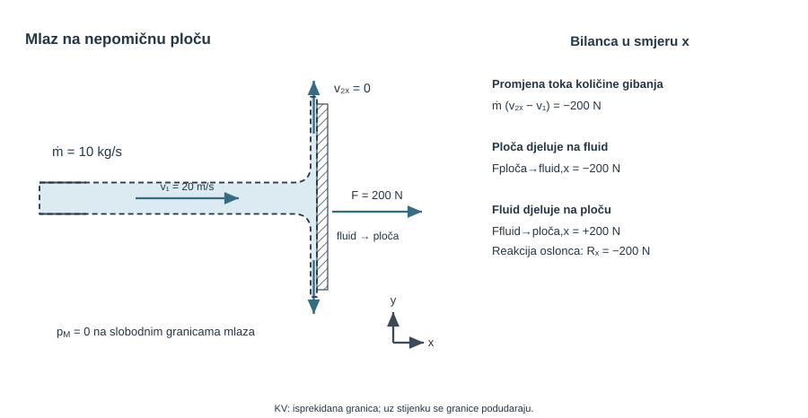
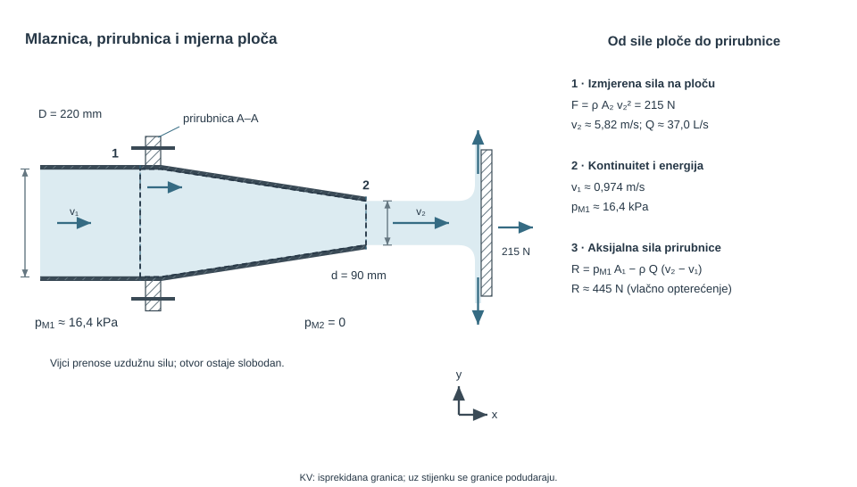
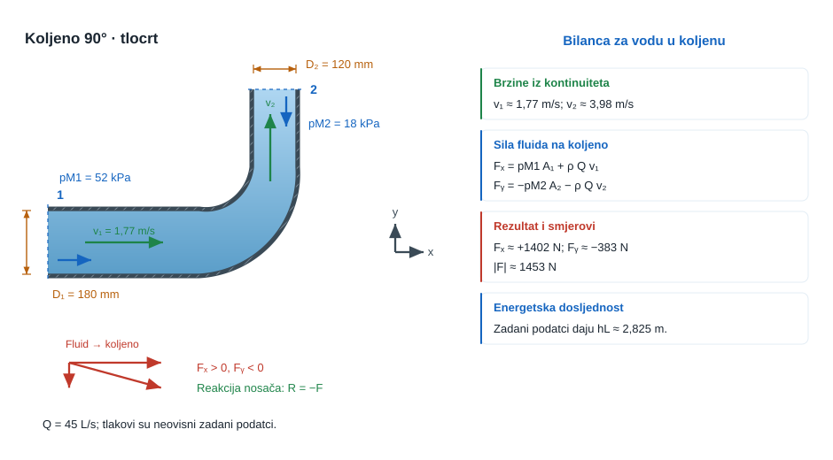
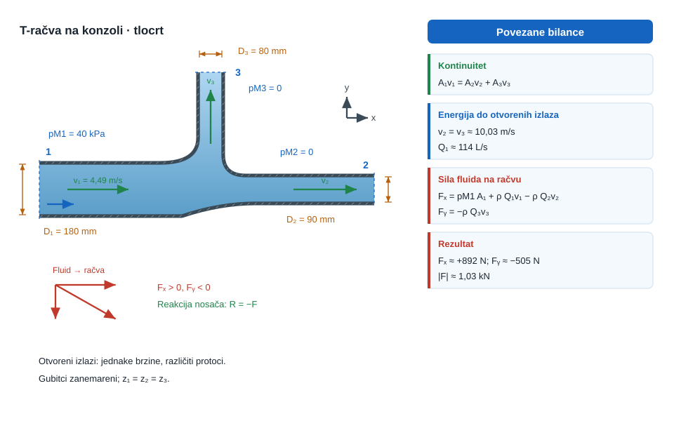
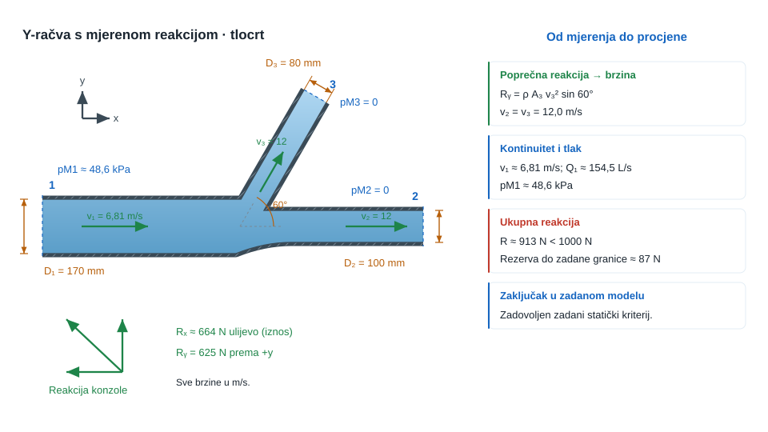
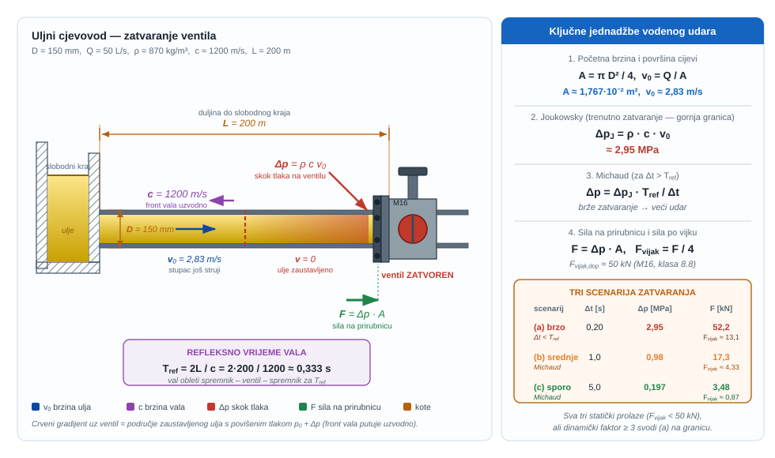
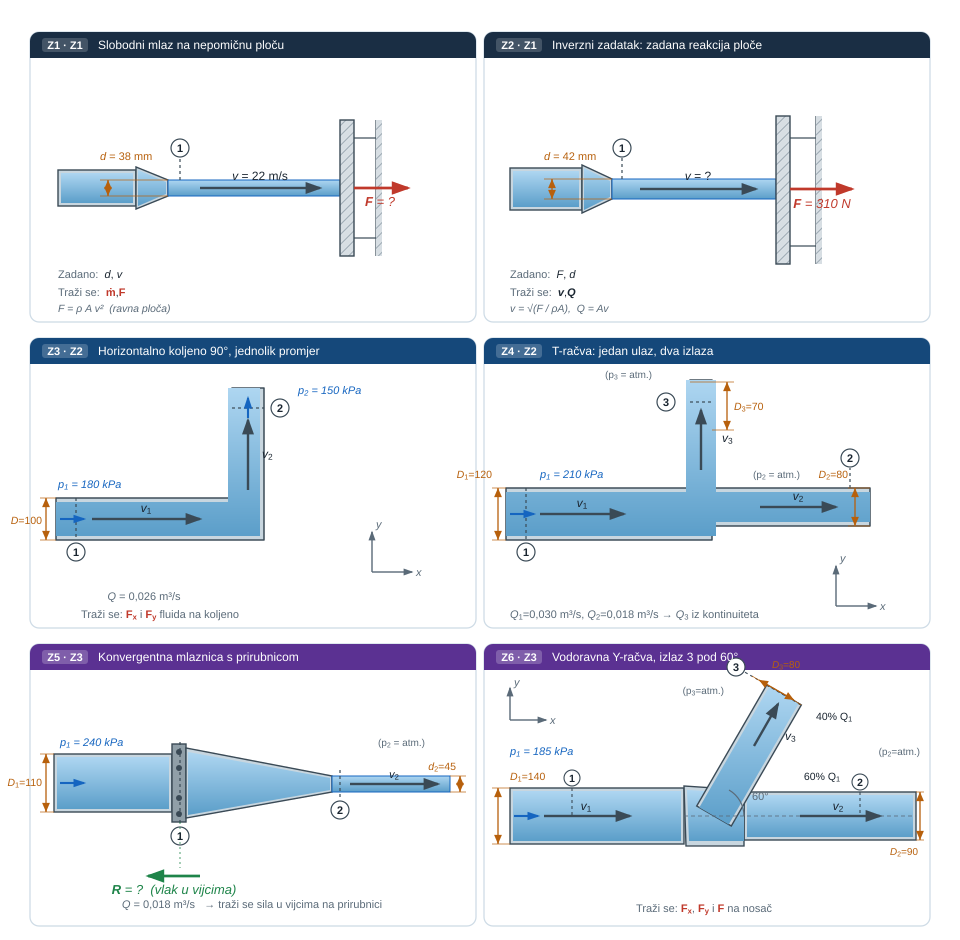

```{python}
#| label: fig-uvod-u11
#| fig-cap: "Pregled poglavlja: Količina gibanja i sile strujanja"
#| fig-align: center
#| out-width: 95%

import matplotlib.pyplot as plt
import matplotlib.patches as mpatches
import matplotlib.gridspec as gridspec
import numpy as np

FLUID = '#AED6F1'; SOLID = '#BDC3C7'; FORCE = '#E74C3C'
VEL   = '#27AE60'; DARK  = '#1A252F'; SUB   = '#566573'

fig = plt.figure(figsize=(12, 5))
gs  = gridspec.GridSpec(2, 2, figure=fig, hspace=0.45, wspace=0.35)
ax_fiz  = fig.add_subplot(gs[:, 0])
ax_mat  = fig.add_subplot(gs[0, 1])
ax_prak = fig.add_subplot(gs[1, 1])

for ax, naslov, boja in zip(
    [ax_fiz, ax_mat, ax_prak],
    ['Fizikalni sustav', 'Ključna jednadžba', 'Primjena u praksi'],
    ['#EAF4FB', '#EAF9F1', '#FDF2E9']
):
    ax.set_facecolor(boja)
    ax.set_title(naslov, fontsize=10, fontweight='bold', pad=6)
    ax.set_xticks([]); ax.set_yticks([])
    for sp in ax.spines.values():
        sp.set_edgecolor('#BDC3C7'); sp.set_linewidth(1.2)

# --- ZONA 1: 90deg koljeno s vektorima brzine ---
ax = ax_fiz
ax.set_xlim(0, 10); ax.set_ylim(0, 8)

# Horizontalni ulazni dio
ax.fill([0.5, 5.5, 5.5, 0.5], [3.2, 3.2, 4.8, 4.8],
    fc=FLUID, ec='#555', lw=1.8, alpha=0.8)
# Vertikalni izlazni dio
ax.fill([4.2, 5.8, 5.8, 4.2], [0.5, 0.5, 3.8, 3.8],
    fc=FLUID, ec='#555', lw=1.8, alpha=0.8)

# v1 vektor (ulaz, desno)
ax.annotate('', xy=(4.5, 4.0), xytext=(1.0, 4.0),
    arrowprops=dict(arrowstyle='->', color=VEL, lw=2.5))
ax.text(2.5, 4.4, r'$\vec{v}_1$', fontsize=12, ha='center', color=VEL)

# v2 vektor (izlaz, dole)
ax.annotate('', xy=(5.0, 1.0), xytext=(5.0, 3.5),
    arrowprops=dict(arrowstyle='->', color='#8E44AD', lw=2.5))
ax.text(5.5, 2.2, r'$\vec{v}_2$', fontsize=12, ha='left', color='#8E44AD')

# Reakcijska sila R
ax.annotate('', xy=(6.5, 4.0), xytext=(8.5, 5.5),
    arrowprops=dict(arrowstyle='->', color=FORCE, lw=2.5))
ax.text(8.6, 5.6, r'$\vec{R}$', fontsize=12, color=FORCE)

# F sile na zid
ax.annotate('', xy=(8.8, 2.5), xytext=(6.8, 1.0),
    arrowprops=dict(arrowstyle='->', color='#E67E22', lw=2.0))
ax.text(9.0, 2.5, r'$\vec{F}_{fluid}$', fontsize=9, color='#E67E22')

# --- ZONA 2: jednadžba ---
ax = ax_mat
ax.text(0.5, 0.78,
    r'$\sum\vec{F} = \dot{m}\,(\vec{v}_2 - \vec{v}_1)$',
    transform=ax.transAxes, ha='center', va='center', fontsize=14, color=DARK)
ax.text(0.5, 0.48,
    r'$F_x = \dot{m}(v_{2x}-v_{1x}) + (p_1 A_1)_x + \ldots$',
    transform=ax.transAxes, ha='center', va='center', fontsize=9, color=DARK)
ax.text(0.5, 0.18,
    r'$\dot{m} = \rho Q = \rho A v$',
    transform=ax.transAxes, ha='center', va='center', fontsize=11, color=DARK)

# --- ZONA 3: mlaznica na zidu ---
ax = ax_prak
ax.set_xlim(0, 10); ax.set_ylim(0, 6)

# Zid
ax.add_patch(plt.Rectangle((0.0, 0.0), 1.5, 6.0, fc='#95A5A6', ec='#555', lw=1.5))

# Dovodna cijev (u zidu, vodoravno)
ax.fill([1.5, 4.0, 4.0, 1.5], [2.5, 2.5, 3.5, 3.5], fc=FLUID, ec='#555', lw=1.5, alpha=0.8)

# Mlaznica (suzenje)
ax.fill([4.0, 5.5, 5.3, 4.0], [2.5, 2.7, 3.3, 3.5], fc='#BDC3C7', ec='#555', lw=1.5)

# Mlaz (izlaz)
ax.annotate('', xy=(8.5, 3.0), xytext=(5.5, 3.0),
    arrowprops=dict(arrowstyle='->', color=VEL, lw=2.5))
ax.text(7.0, 3.5, r'$v_2$', fontsize=11, ha='center', color=VEL)

# Reakcija na nosac
ax.annotate('', xy=(2.0, 2.0), xytext=(4.5, 2.0),
    arrowprops=dict(arrowstyle='->', color=FORCE, lw=2.0))
ax.text(2.8, 1.4, r'$F_{nosac}$', fontsize=9, ha='center', color=FORCE)
ax.text(5.0, 0.3, 'Mlaznica / reakcija nosaca (Strojarstvo)',
    fontsize=7.5, ha='center', color=SUB)

fig.suptitle('U11 \u2013 Koli\u010dina gibanja i sile strujanja',
             fontsize=13, fontweight='bold', y=1.01)
plt.show()
```

Količina gibanja ovdje postaje veza između protoka, tlaka i reakcije konstrukcije.

<span class="mf1-ch-ref"><span class="mf1-ch-code">U11</span><span class="mf1-ch-title">Količina gibanja i sile strujanja</span></span> prvo je poglavlje u kojem stacionarni kontrolni volumen treba čitati zajedno s tlakovima na presjecima i s reakcijom stvarnog cijevnog elementa.

Čim fluid više nije slobodni mlaz u zraku nego prolazi kroz mlaznicu, koljeno ili račvu, sama promjena brzine više nije dovoljna. U račun ulaze i tlakovi na ulazu i izlazu, a rezultat je često sila koju moraju preuzeti vijci, prirubnica ili nosač.

::: {.mf1-application}
<p class="mf1-box-label">Inženjerski kontekst</p>

Svako koljeno, T-račva, mlaznica ili završetak cjevovoda koji mijenja smjer ili brzinu toka prenosi silu na prirubnicu, vijčani spoj, konzolu ili temelj. Zato se ovo poglavlje izravno čita u pumpnim stanicama, brodskim strojarnicama, protupožarnim monitorima i vodenim mlaznicama, gdje konstrukcija ne nosi "protok", nego vektorsku razliku tlačnih i impulsnih doprinosa.
:::

## Fizikalni uvod i matematički izvod

Za stacionarni tok osnovni zapis ostaje

$$
\sum \vec{F} = \dot{m}(\vec{V}_{izl} - \vec{V}_{ul})
$$

::: {.callout-note}
## 📐 Fizikalno značenje
Ovaj zakon kaže da je rezultantna vanjska sila na kontrolni volumen jednaka brzini promjene količine gibanja fluida koji prolazi kroz njega. Intuitivno: fluid koji mijenja brzinu (iznos ili smjer) mora dobiti ili predati impuls nečemu — toj „nečemu" je stijenka, prirubnica, koljeno. Ako fluid skrene za $90°$ u koljenu, on je primio bočni impuls od stijenke koljena — a Newton III kaže da je koljeno primilo jednaku i suprotnu silu od fluida. Vijci na prirubnici ne nose „protok" nego upravo tu promjenu smjera impulsa.
:::

ali se ovdje zbroj sila ne smije svesti samo na reakciju stijenke. U tipičnom cijevnom elementu treba odvojeno prepoznati:

- tlakove na ulaznim i izlaznim presjecima
- težinu fluida ako geometrija nije u horizontalnoj ravnini
- silu stijenke ili konstrukcije na fluid

Tek nakon toga može se odrediti sila fluida na konstrukciju, odnosno opterećenje vijaka, prirubnice ili nosača. Vektorski zapis ovdje nije formalna strogost radi same sebe: on je jedini način da se iz istoga toka istodobno ispravno pročitaju smjer, predznak i veličina opterećenja konstrukcije.

U <span class="mf1-ch-ref"><span class="mf1-ch-code">U11</span><span class="mf1-ch-title">Količina gibanja i sile strujanja</span></span> Bernoulli i kontinuitet više nisu dovoljni sami za sebe. Oni vraćaju energetsku sliku i raspodjelu protoka, ali ne kažu koliku silu stvarno mora preuzeti zavareni nosač, sidro ili vijčani spoj. Tu prvi put u punom smislu ulazi zakon količine gibanja za kontrolni volumen.

Za opći kontrolni volumen $KV$ omeđen kontrolnom plohom $KP$ vrijedi integralni zakon količine gibanja

$$
\frac{\mathrm{d}}{\mathrm{d}t}\int_{KV} \rho \vec{v}\,\mathrm{d}V + \int_{KP} \rho \vec{v}(\vec{v}\cdot \vec{n})\,\mathrm{d}S = \sum \vec{F}
$$

::: {.callout-note collapse="true" icon="false"}
## 🖥️ Numerički trag

Ovo je **temeljna jednadžba svakog CFD solvera**. Razlika u odnosu na MF1: u CFD-u se ne piše jedanput za jedan kontrolni volumen koljena, nego *za svaku ćeliju mreže* (milijune njih), i sve zajedno čine sustav koji se rješava iterativno. To je razlog zašto skraćenica **FVM (Finite Volume Method)** dominira u industrijskom CFD-u — ona je doslovno integralna formulacija Navier-Stokesa na malim kontrolnim volumenima.
:::

Prvi član predstavlja akumulaciju količine gibanja unutar odabranoga prostora, a drugi konvektivni prijenos količine gibanja kroz granicu volumena. U stacionarnom strujanju prvi član nestaje, pa preostaje ravnoteža između vanjskih sila i neto toka količine gibanja kroz granice kontrolnog volumena.

Ako se ulazni i izlazni presjeci mogu čitati jednodimenzijski, za jedan ulaz i jedan izlaz slijedi pojednostavljenje

$$
\sum \vec F = \dot m(\vec V_2 - \vec V_1).
$$

No taj oblik nije dovoljan dok se vanjske sile ne rastave na stvarne doprinose. Za tipičan cijevni element vrijedi

$$
\vec F_p + \vec G + \vec R_{st\to f} = \dot m(\vec V_2 - \vec V_1),
$$

gdje je $\vec F_p$ rezultanta tlaknih sila na presjecima, $\vec G$ težina fluida unutar kontrolnog volumena, a $\vec R_{st\to f}$ sila stijenke ili konstrukcije na fluid. Iz toga odmah slijedi reakcija fluida na konstrukciju

$$
\vec F_{f\to st} = -\vec R_{st\to f} = \vec F_p + \vec G - \dot m(\vec V_2 - \vec V_1).
$$

Tlakni članovi ne smiju se automatski izbaciti iz zapisa. Oni otpadaju tek kad su relevantni presjeci otvoreni atmosferi ili kad se njihova rezultanta doista poništi geometrijom i pravilno odabranim kontrolnim volumenom.

Upravo tu leži puni fizikalni smisao poglavlja. Član $\dot m\vec V$ mjeri koliko struja "brani" svoj smjer i iznos brzine, a tlakni članovi $pA$ pokazuju koliko fluid statički gura zatvorene presjeke. Vijci, prirubnica i nosač ne nose apstraktnu jednadžbu, nego upravo vektorsku razliku tlaknih, težinskih i impulsnih doprinosa.

::: {.callout-note collapse="true" icon="false"}
## 🖥️ Numerički trag

Rastav sile na tlačnu, težinsku i impulsnu komponentu je upravo ono što CFD radi *automatski* po svakoj **ćeliji uz zid**: za svaki face elementarne mreže solver zna tlak (statički), gradijent brzine (viskozno smično naprezanje) i protok mase kroz face. Sumiranje po cijelom zidu daje silu i moment — to su `forces` / `forceCoeffs` funkcionalni objekti u OpenFOAM-u i *Force/Moment Reports* u Fluentu. Razlika u odnosu na MF1: CFD ne pretpostavlja jednodimenzijski profil brzine, pa dobivena sila u pravilu odstupa od ručnog $\dot m \Delta V$ za par postotaka — i to odstupanje govori koliko je strujanje stvarno 3D.
:::

::: {.mf1-interaktivno}
<p class="mf1-box-label">📈 Interaktivni prikaz — Sila na koljeno</p>

Interaktivni prikaz omogućuje mijenjanje kuta zakretanja koljena, volumenskog protoka i promjera cijevi uz neposredno praćenje komponenti sile $F_x$, $F_y$ te iznosa i smjera rezultante. Vizualno se odmah razabire kako se sila orijentira u prostoru s promjenom geometrije.

<div class="mf1-interaktivno-akcija">
<a class="mf1-interaktivno-veza" href="https://colab.research.google.com/github/martibasic/MF1_udzbenik/blob/main/notebooks/u11_sila_na_koljeno.ipynb" target="_blank" rel="noopener">Otvori interaktivni prikaz</a>

</div>

<div class="mf1-interaktivno-pitanja">
**Pitanja za samostalno istraživanje:** (a) Pri $\beta = 90°$, koje su vrijednosti $F_x$ i $F_y$ i kako mora biti orijentiran nosač? (b) Zašto je $\beta \to 180°$ slučaj najveće sile pri istom $Q$ i $D$? (c) Kada u članu $F_{int}$ dominira impulsni dio $\rho Q v$, a kada tlačni $pA$?
</div>
:::

::: {.callout-note}
## 📝 Razrada koraka
Korak: od integralnog zakona → radni zapis $\sum\vec{F} = \dot{m}(\vec{V}_2 - \vec{V}_1)$

Integralni zakon za stacionarno strujanje ($d/dt = 0$):
$$
\int_{KP} \rho \vec{v}(\vec{v}\cdot\vec{n})\,dS = \sum \vec{F}.
$$
Za presjeke s jednodimenzijskim profilom brzine ($v = $ const. po presjeku):
- na ulazu: $\vec{v}\cdot\vec{n} = -v_1$ (normala uperi prema van, brzina ulazi), taj član daje $-\dot{m}\vec{V}_1$
- na izlazu: $\vec{v}\cdot\vec{n} = +v_2$, daje $+\dot{m}\vec{V}_2$

Ukupno:
$$
\dot{m}\vec{V}_2 - \dot{m}\vec{V}_1 = \sum\vec{F} \quad\Rightarrow\quad \sum\vec{F} = \dot{m}(\vec{V}_2 - \vec{V}_1).
$$
Sile $\sum\vec{F}$ uključuju: tlakove na presjecima ($\vec{F}_p$), težinu fluida ($\vec{G}$) i silu stijenke na fluid ($\vec{R}$). Sila fluida na stijenku je $-\vec{R}$ (Newton III).
:::

To je razlog zašto se u strojarstvu <span class="mf1-ch-ref"><span class="mf1-ch-code">U11</span><span class="mf1-ch-title">Količina gibanja i sile strujanja</span></span> ne čita kao još jedno poglavlje o formulama, nego kao prvi ozbiljan prijelaz s hidraulike na konstrukcijsko opterećenje. Na tlačnoj strani crpke koljeno i prije vodenog udara već nosi stalni bočni potisak. Na kalibracijskoj mlaznici vijci ne nose "protok", nego razliku tlakne sile i impulsnog skoka. U razdjelnim glavama rashladne vode ili protupožarnim granama geometrija izlaza izravno određuje stalnu silu koju temelj ili konzola moraju preuzimati satima rada.

## Riješeni primjeri

::: {.mf1-we}
<p class="mf1-box-label">Riješeni primjer - Mlaz vode na mirnu ravnu ploču <span class="mf1-level">T2</span></p>

**Zadano**

Voda izlazi iz mlaznice srednjom brzinom $v = 20\ \text{m/s}$ i udara okomito u nepomičnu vertikalnu ploču. Maseni protok vode iznosi $\dot{m} = 10\ \text{kg/s}$. Nakon udara mlaz se rasprsi uzduž ravnine ploče, tako da iza udara više nema komponente brzine u smjeru osi mlaza.

**Traženo**

1. Odrediti silu potrebnu da ploča ostane u mirovanju.



**Pretpostavke i model**

Najjednostavniji kontrolni volumen obuhvaća zonu udara mlaza u ploču. Tlak je svugdje približno atmosferski, pa se u smjeru osi mlaza u proračunu zadržava samo promjena količine gibanja. Upravo je to najčišći prvi ulaz u ovo poglavlje.

**Rješenje**

Za stacionarni tok u osi mlaza vrijedi

$$
\sum F_x = \dot{m}(v_{x,izl} - v_{x,ul})
$$

Prije udara mlaz ima ulaznu komponentu brzine

$$
v_{x,ul} = 20\ \text{m/s}
$$

a nakon udara se rasprsi uz ploču, pa je izlazna komponenta u istoj osi

$$
v_{x,izl} = 0
$$

Zato sila ploče na fluid iznosi

$$
F_{pl \to f} = \dot{m}(0 - 20) = -200\ \text{N}
$$

Negativan predznak samo govori da ploča na fluid djeluje suprotno smjeru mlaza. Po trećem Newtonovom zakonu sila fluida na ploču ima isti iznos i suprotan smjer:

$$
F_{f \to pl} = 200\ \text{N}
$$

Dakle, sila koju treba preuzeti oslonac ploče iznosi

$$
F_R = 200\ \text{N}
$$

**Provjera i komentar**

Kod slobodnog mlaza koji se na ploči zaustavlja u osi udara sila se dobiva izravno iz gubitka aksijalne komponente količine gibanja. Ovdje to daje točno $200\ \text{N}$.

1. Ako bi maseni protok bio veći, sila bi rasla linearno s $\dot{m}$.
2. Ako bi mlaz dolazio dvostruko brze, sila bi bila dvostruko veća jer je ovdje $\dot{m}$ već zadan.
3. Sila mora djelovati u smjeru dolaznog mlaza na ploču, a reakcija oslonca suprotno tome.
:::

::: {.mf1-we}
<p class="mf1-box-label">Riješeni primjer - Kalibracijska mlaznica na prirubnici <span class="mf1-level">T2</span></p>

**Zadano**

Na ispitnom vodu kalibracijska mlaznica vijcima je spojena na dovodnu cijev u presjeku `A-A`. Promjer ulaznog dijela mlaznice iznosi $D = 220\ \text{mm}$, a promjer izlaza $d = 90\ \text{mm}$. Na maloj udaljenosti ispred izlaza postavljena je ravna mjerna ploča okomita na mlaz. U radu voda gustoće $\rho = 998\ \text{kg/m}^3$ djeluje na ploču silom $F_P = 215\ \text{N}$.

**Traženo**

1. Odrediti protok $Q$ kroz mlaznicu.
2. Odrediti pretlak $p_{M1}$ u presjeku 1 neposredno uz prirubnicu.
3. Odrediti koliku vlačnu silu $R$ moraju preuzeti vijci u presjeku `A-A`.

Pretpostavite jednolike profile brzine u presjecima 1 i 2, zanemarite gubitke i promatrajte horizontalnu ravninu.



**Pretpostavke i model**

Sila na mjernu ploču zaustavlja aksijalnu komponentu slobodnog mlaza, pa najprije iz te sile dobijemo izlaznu brzinu i protok. Zatim se između presjeka 1 i 2 primijeni Bernoullijeva jednadžba, a na kontrolni volumen unutar mlaznice jednadžba količine gibanja u osi $x$.

**Rješenje**

Površina izlaznog presjeka iznosi

$$
A_2 = \frac{\pi d^2}{4} = \frac{\pi \cdot 0{,}09^2}{4} = 6{,}36 \cdot 10^{-3}\ \text{m}^2
$$

Za mlaz koji udara okomito u ravnu ploču vrijedi

$$
F_P = \dot{m} v_2 = \rho Q v_2 = \rho A_2 v_2^2
$$

pa je izlazna brzina

$$
v_2 = \sqrt{\frac{F_P}{\rho A_2}} = \sqrt{\frac{215}{998 \cdot 6{,}36 \cdot 10^{-3}}} = 5{,}82\ \text{m/s}
$$

odakle slijedi protok

$$
Q = A_2 v_2 = 6{,}36 \cdot 10^{-3} \cdot 5{,}82 = 0{,}0370\ \text{m}^3/\text{s}
$$

odnosno

$$
Q \approx 37{,}0\ \text{l/s}
$$

Površina ulaznog presjeka je

$$
A_1 = \frac{\pi D^2}{4} = \frac{\pi \cdot 0{,}22^2}{4} = 3{,}80 \cdot 10^{-2}\ \text{m}^2
$$

pa je brzina u presjeku 1 jednaka

$$
v_1 = \frac{Q}{A_1} = \frac{0{,}0370}{3{,}80 \cdot 10^{-2}} = 0{,}974\ \text{m/s}
$$

Kako je presjek 2 otvoren prema atmosferi, u zapisu s pretlakom vrijedi $p_{M2} = 0$. Bernoullijeva jednadžba između 1 i 2 zato daje

$$
p_{M1} + \frac{\rho v_1^2}{2} = \frac{\rho v_2^2}{2}
$$

pa je

$$
p_{M1} = \frac{\rho}{2}(v_2^2 - v_1^2) = \frac{998}{2}(5{,}82^2 - 0{,}974^2) = 1{,}64 \cdot 10^4\ \text{Pa}
$$

odnosno

$$
p_{M1} \approx 16{,}4\ \text{kPa} = 0{,}164\ \text{bar}
$$

Za silu u vijcima sada promatramo kontrolni volumen unutar mlaznice. Maseni protok iznosi

$$
\dot{m} = \rho Q = 998 \cdot 0{,}0370 = 36{,}95\ \text{kg/s}
$$

U osi $x$ jednadžba količine gibanja glasi

$$
p_{M1} A_1 + F_{st \to f} = \dot{m}(v_2 - v_1)
$$

gdje je $F_{st \to f}$ sila stijenke mlaznice na fluid. Zato sila fluida na mlaznicu, a time i vlačna sila koju moraju preuzeti vijci, glasi

$$
R = F_{f \to st} = p_{M1} A_1 - \dot{m}(v_2 - v_1)
$$

Numerički je

$$
R = 1{,}64 \cdot 10^4 \cdot 3{,}80 \cdot 10^{-2} - 36{,}95(5{,}82 - 0{,}974) = 445\ \text{N}
$$

Dakle,

$$
R \approx 445\ \text{N}
$$

i vijci u presjeku `A-A` rade na vlak.

**Provjera i komentar**

1. Protok reda nekoliko desetaka litara u sekundi razuman je za izlaz promjera $90\ \text{mm}$ i brzinu reda $6\ \text{m/s}$.
2. Budući da mlaznica ubrzava tok, statički tlak mora padati prema izlazu, pa je pozitivan pretlak u presjeku 1 fizikalno očekivan.
3. Sila u vijcima mora ostati pozitivna jer ulazna tlakna sila nadmašuje porast aksijalne impulsne funkcije.
:::

::: {.mf1-we}
<p class="mf1-box-label">Riješeni primjer - Servisno koljeno na sidrenom nosaču <span class="mf1-level">T2</span></p>

**Zadano**

Voda gustoće $\rho = 998\ \text{kg/m}^3$ struji kroz horizontalno koljeno od $90^\circ$ koje tok skreće iz smjera osi $x$ u smjer osi $y$. Na ulazu u koljeno promjer je $D_1 = 180\ \text{mm}$, na izlazu $D_2 = 120\ \text{mm}$, a volumenski protok iznosi

$$
Q = 0{,}045\ \text{m}^3/\text{s}
$$

Pretlak u ulaznom presjeku je

$$
p_{M1} = 52\ \text{kPa}
$$

a u izlaznom presjeku

$$
p_{M2} = 18\ \text{kPa}
$$

Zanemari težinu fluida u koljenu i gubitke. Odredi:

**Traženo**

1. brzine $v_1$ i $v_2$.
2. komponente sile fluida na koljeno.
3. iznos rezultantne sile koju mora preuzeti sidreni nosač.



**Pretpostavke i model**

Promatra se stacionarni kontrolni volumen koji obuhvaća cijelo koljeno. Kako je tok u horizontalnoj ravnini, težina se ovdje zanemaruje, a u jednadžbi količine gibanja ostaju tlakovi na presjecima i sila stijenke na fluid po osima $x$ i $y$.

**Rješenje**

Površine presjeka su

$$
A_1 = \frac{\pi D_1^2}{4} = \frac{\pi \cdot 0{,}18^2}{4} = 2{,}545 \cdot 10^{-2}\ \text{m}^2
$$

$$
A_2 = \frac{\pi D_2^2}{4} = \frac{\pi \cdot 0{,}12^2}{4} = 1{,}131 \cdot 10^{-2}\ \text{m}^2
$$

Iz kontinuiteta slijede brzine

$$
v_1 = \frac{Q}{A_1} = \frac{0{,}045}{2{,}545 \cdot 10^{-2}} = 1{,}77\ \text{m/s}
$$

$$
v_2 = \frac{Q}{A_2} = \frac{0{,}045}{1{,}131 \cdot 10^{-2}} = 3{,}98\ \text{m/s}
$$

Maseni protok iznosi

$$
\dot{m} = \rho Q = 998 \cdot 0{,}045 = 44{,}9\ \text{kg/s}
$$

Za os $x$ jednadžba količine gibanja glasi

$$
p_{M1}A_1 + F_{st,x} = \dot{m}(0 - v_1)
$$

jer na izlazu nema komponente brzine u smjeru $x$. Uvrstavanjem dobiva se

$$
52\,000 \cdot 2{,}545 \cdot 10^{-2} + F_{st,x} = 44{,}9(0 - 1{,}77)
$$

odakle je

$$
F_{st,x} = -1402\ \text{N}
$$

To je sila stijenke na fluid. Zato fluid na koljeno djeluje u osi $x$ silom

$$
F_{f \to k,x} = +1402\ \text{N}
$$

odnosno prema desno.

Za os $y$ vrijedi

$$
-p_{M2}A_2 + F_{st,y} = \dot{m}(v_2 - 0)
$$

pa slijedi

$$
-18\,000 \cdot 1{,}131 \cdot 10^{-2} + F_{st,y} = 44{,}9 \cdot 3{,}98
$$

odakle je

$$
F_{st,y} = 383\ \text{N}
$$

To znači da fluid na koljeno u osi $y$ djeluje silom

$$
F_{f \to k,y} = -383\ \text{N}
$$

odnosno prema dolje.

Rezultanta sile fluida na koljeno zato je

$$
F_R = \sqrt{F_{f \to k,x}^2 + F_{f \to k,y}^2} = \sqrt{1402^2 + 383^2} = 1453\ \text{N}
$$

odnosno približno

$$
F_R \approx 1{,}45\ \text{kN}
$$

Sidreni nosač mora preuzeti jednaku i suprotnu silu: ulijevo i prema gore.

**Provjera i komentar**

U ovom koljenu fluid djeluje na konstrukciju silom od oko $1{,}45\ \text{kN}$, pretežno prema desno, ali i s manjom komponentom prema dolje. To je tipičan <span class="mf1-ch-ref"><span class="mf1-ch-code">U11</span><span class="mf1-ch-title">Količina gibanja i sile strujanja</span></span> rezultat: promjena smjera strujanja ne daje samo novi tlak ili novu brzinu, nego stvarno opterećenje koje mora preuzeti nosač.

1. Glavna komponenta sile mora ići u smjeru ulaznog tlaka i promjene osi toka, pa je ovdje prirodno veća u osi $x$ nego u osi $y$.
2. Kad se izlazni presjek suzi, izlazna brzina mora porasti i povećati impulsni doprinos u osi $y$.
3. Ako se na kraju dobije samo jedna os reakcije, gotovo sigurno je preskočena promjena smjera brzine ili jedan tlak na presjeku.

::: {.mf1-numerika .kompakt}
<p class="mf1-box-label">🖥️ Numerička perspektiva</p>

Ovo isto koljeno u CFD-u: 3D mreža iz `snappyHexMesh`-a, *inlet* sa zadanim protokom i tlakom, *outlet* sa zadanim tlakom, izbor k-ω SST turbulentnog modela. Rezultat: puno polje brzine i tlaka unutar koljena (vidiš sekundarno strujanje i odvajanje uz unutarnju stijenku!), a funkcionalni objekt `forces` u svakoj iteraciji ispisuje $\vec{F}_x$, $\vec{F}_y$, $\vec{F}_z$ i moment. Ručni rezultat $1{,}45\ \text{kN}$ obično odstupa za $5\text{--}10\,\%$ od CFD-a — razlika dolazi od ne-jednoliko brzine na presjeku i lokalnih gubitaka koje ručna metoda zanemari.
:::

:::

::: {.mf1-ch}
<p class="mf1-box-label">Cjeloviti zadatak - T-račva na sidrenoj konzoli <span class="mf1-level">T3</span></p>

**Zadano**

Voda gustoće $\rho = 998\ \text{kg/m}^3$ struji kroz vodoravnu T-račvu učvršćenu na sidrenoj konzoli. U ulaznom presjeku `1` promjer cijevi je

$$
D_1 = 180\ \text{mm}
$$

i manometarski tlak

$$
p_{M1} = 40\ \text{kPa}
$$

račva ima dva izlaza otvorena prema atmosferi: ravni izlaz `2` u smjeru osi $x$ promjera

$$
D_2 = 90\ \text{mm}
$$

i okomiti izlaz `3` u smjeru osi $y$ promjera

$$
D_3 = 80\ \text{mm}
$$

Smatraj da je sustav u horizontalnoj ravnini, da nema gubitaka i da su brzine u oba izlaza jednolike.

**Traženo**

1. brzinu u ulazu $v_1$ te izlazne brzine $v_2$ i $v_3$.
2. volumenske protoke $Q_1$, $Q_2$ i $Q_3$.
3. komponente sile fluida na račvu i rezultantu sile koju mora preuzeti sidrena konzola.



**Pretpostavke i model**

Oba izlaza otvorena su prema atmosferi i nalaze se na istoj geodetskoj razini kao ulaz. Zato Bernoulli između ulaza i svakog izlaza daje istu izlaznu brzinu u granama `2` i `3`. Tek nakon toga kontinuitet zatvara odnos između ulaznog i izlaznih protoka, a zatim se na cijelu račvu primjenjuje zakon količine gibanja po osima $x$ i $y$.

**Rješenje**

Površine presjeka su

$$
A_1 = \frac{\pi D_1^2}{4} = \frac{\pi \cdot 0{,}18^2}{4} = 2{,}545 \cdot 10^{-2}\ \text{m}^2
$$

$$
A_2 = \frac{\pi D_2^2}{4} = \frac{\pi \cdot 0{,}09^2}{4} = 6{,}362 \cdot 10^{-3}\ \text{m}^2
$$

$$
A_3 = \frac{\pi D_3^2}{4} = \frac{\pi \cdot 0{,}08^2}{4} = 5{,}027 \cdot 10^{-3}\ \text{m}^2
$$

Kako su izlazi `2` i `3` na istom tlaku i na istoj visini, iz Bernoullija između presjeka `1` i bilo kojeg izlaza slijedi

$$
\frac{p_{M1}}{\rho} + \frac{v_1^2}{2} = \frac{v_2^2}{2} = \frac{v_3^2}{2}
$$

pa su izlazne brzine jednake:

$$
v_2 = v_3 = v
$$

Iz kontinuiteta sada vrijedi

$$
A_1 v_1 = A_2 v + A_3 v = (A_2 + A_3)v
$$

odnosno

$$
v = \frac{A_1}{A_2 + A_3} v_1 = \frac{2{,}545 \cdot 10^{-2}}{6{,}362 \cdot 10^{-3} + 5{,}027 \cdot 10^{-3}} v_1 = 2{,}234 v_1
$$

Uvrstavanjem u Bernoullijevu relaciju dobiva se

$$
\frac{2p_{M1}}{\rho} = v^2 - v_1^2 = \left(2{,}234^2 - 1\right)v_1^2
$$

pa slijedi

$$
\frac{2 \cdot 40000}{998} = 3{,}99\, v_1^2
$$

odakle je

$$
v_1 = 4{,}49\ \text{m/s}
$$

te zatim

$$
v_2 = v_3 = 2{,}234 \cdot 4{,}49 = 10{,}03\ \text{m/s}
$$

Dakle,

$$
v_1 \approx 4{,}49\ \text{m/s}, \qquad v_2 = v_3 \approx 10{,}03\ \text{m/s}
$$

Volumenski protoci su

$$
Q_1 = A_1 v_1 = 2{,}545 \cdot 10^{-2} \cdot 4{,}49 = 0{,}114\ \text{m}^3/\text{s}
$$

$$
Q_2 = A_2 v_2 = 6{,}362 \cdot 10^{-3} \cdot 10{,}03 = 0{,}0638\ \text{m}^3/\text{s}
$$

$$
Q_3 = A_3 v_3 = 5{,}027 \cdot 10^{-3} \cdot 10{,}03 = 0{,}0504\ \text{m}^3/\text{s}
$$

i provjera daje

$$
Q_1 \approx Q_2 + Q_3
$$

Maseni protoci su zato

$$
\dot{m}_1 = \rho Q_1 = 998 \cdot 0{,}114 = 114{,}0\ \text{kg/s}
$$

$$
\dot{m}_2 = 998 \cdot 0{,}0638 = 63{,}7\ \text{kg/s}
$$

$$
\dot{m}_3 = 998 \cdot 0{,}0504 = 50{,}3\ \text{kg/s}
$$

Za os $x$ jednadžba količine gibanja glasi

$$
p_{M1}A_1 + F_{st,x} = \dot{m}_2 v_2 - \dot{m}_1 v_1
$$

jer samo izlaz `2` ima komponentu brzine u smjeru osi $x$. Uvrstavanjem podataka dobiva se

$$
40000 \cdot 2{,}545 \cdot 10^{-2} + F_{st,x} = 63{,}7 \cdot 10{,}03 - 114{,}0 \cdot 4{,}49
$$

odakle je

$$
F_{st,x} = -892\ \text{N}
$$

To je sila stijenke na fluid. Zato fluid na račvu djeluje silom

$$
F_{f \to r,x} = +892\ \text{N}
$$

odnosno prema desno.

Za os $y$ vrijedi

$$
F_{st,y} = \dot{m}_3 v_3
$$

jer samo izlaz `3` nosi pozitivnu komponentu brzine u osi $y$. Zato je

$$
F_{st,y} = 50{,}3 \cdot 10{,}03 = 505\ \text{N}
$$

pa fluid na račvu djeluje silom

$$
F_{f \to r,y} = -505\ \text{N}
$$

odnosno prema dolje.

Rezultanta sile fluida na račvu iznosi

$$
F_R = \sqrt{F_{f \to r,x}^2 + F_{f \to r,y}^2} = \sqrt{892^2 + 505^2} = 1025\ \text{N}
$$

odnosno približno

$$
F_R \approx 1{,}03\ \text{kN}
$$

Smjer rezultante je prema desno i prema dolje, pa sidrena konzola mora preuzeti jednaku i suprotnu silu: ulijevo i prema gore.

**Provjera i komentar**

Ovo je prvi stvarni integrativni zadatak <span class="mf1-ch-ref"><span class="mf1-ch-code">U11</span><span class="mf1-ch-title">Količina gibanja i sile strujanja</span></span>: iz ulaznog pretlaka najprije se Bernoullijem vraćaju izlazne brzine, zatim kontinuitet zatvara razdjelu protoka, a tek onda jednadžba količine gibanja daje opterećenje račve. Dobivena rezultanta na konzoli iznosi oko $1{,}03\ \text{kN}$.

1. Izlazne brzine moraju biti veće od ulazne jer se ukupna izlazna površina smanjila, a ulazni tlak je pozitivan.
2. Komponenta sile u osi $x$ mora ostati dominantna jer u tom smjeru djeluje i ulazna tlakna sila i dio impulsne bilance.
3. Ako se jednadžba količine gibanja napiše prije zatvaranja Bernoullija i kontinuiteta, gotovo sigurno će se izgubiti pravi odnos među protocima i silama u granama.
:::

::: {.mf1-ch}
<p class="mf1-box-label">Cjeloviti zadatak - Y-račva s mjerenom reakcijom konzole <span class="mf1-level">T4</span></p>

**Zadano**

Voda gustoće

$$
\rho = 998\ \text{kg/m}^3
$$

struji kroz vodoravnu `Y`-račvu učvršćenu na servisnoj konzoli. Ulazni presjek `1` nalazi se u osi $x$ i ima promjer

$$
D_1 = 170\ \text{mm}
$$

Ravni izlaz `2` nastavlja se u smjeru osi $x$ s promjerom

$$
D_2 = 100\ \text{mm}
$$

dok izlaz `3` ima promjer

$$
D_3 = 80\ \text{mm}
$$

i zatvara kut od $60^\circ$ iznad pozitivnog smjera osi $x$.

Oba izlaza otvorena su prema atmosferi, nalaze se na istoj geodetskoj razini kao ulaz i gubici se zanemaruju. Tijekom probnog rada dinamometar u konzoli pokazuje da nosač preuzima vertikalnu reakciju

$$
R_y = 625\ \text{N}
$$

prema gore.

**Traženo**

1. zajedničku izlaznu brzinu $v = v_2 = v_3$.
2. ulaznu brzinu $v_1$ te protoke $Q_1$, $Q_2$ i $Q_3$.
3. potreban manometarski tlak u ulazu $p_{M1}$.
4. horizontalnu reakciju konzole $R_x$ i ukupnu rezultantu koju mora preuzeti nosač.
5. je li konzola dopuštene rezultante $1{,}0\ \text{kN}$ dovoljna za ovaj radni režim.



**Pretpostavke i model**

Kako su presjeci `2` i `3` otvoreni prema atmosferi i na istoj visini, Bernoulli između `1-2` i `1-3` daje istu izlaznu brzinu u obje grane. Mjerena vertikalna reakcija konzole tada postaje ulaz u račun količine gibanja po osi $y$, iz kojeg se najprije vraća izlazna brzina. Tek nakon toga kontinuitet daje protoke, Bernoulli vraća ulazni tlak, a zakon količine gibanja po osi $x$ zatvara drugu komponentu reakcije.

**Rješenje**

Površine presjeka iznose

$$
A_1 = \frac{\pi D_1^2}{4} = \frac{\pi \cdot 0{,}17^2}{4} = 2{,}270 \cdot 10^{-2}\ \text{m}^2
$$

$$
A_2 = \frac{\pi D_2^2}{4} = \frac{\pi \cdot 0{,}10^2}{4} = 7{,}854 \cdot 10^{-3}\ \text{m}^2
$$

$$
A_3 = \frac{\pi D_3^2}{4} = \frac{\pi \cdot 0{,}08^2}{4} = 5{,}027 \cdot 10^{-3}\ \text{m}^2
$$

Konzola na račvu djeluje vertikalnom reakcijom prema gore, pa fluid na račvu djeluje jednakom silom prema dolje. Zato je sila stijenke na fluid po osi $y$

$$
F_{st,y} = 625\ \text{N}
$$

budući da samo izlaz `3` nosi komponentu brzine u osi $y$, iz zakona količine gibanja slijedi

$$
F_{st,y} = \dot{m}_3 v_3 \sin 60^\circ = \rho A_3 v^2 \sin 60^\circ
$$

odakle se izlazna brzina vraća iz mjerene reakcije:

$$
625 = 998 \cdot 5{,}027 \cdot 10^{-3} \cdot v^2 \cdot \sin 60^\circ
$$

$$
v = 11{,}99\ \text{m/s} \approx 12{,}0\ \text{m/s}
$$

Kako su izlazne brzine jednake, kontinuitet daje

$$
A_1 v_1 = A_2 v + A_3 v = (A_2 + A_3)v
$$

pa je

$$
v_1 = \frac{A_2 + A_3}{A_1} v = \frac{7{,}854 \cdot 10^{-3} + 5{,}027 \cdot 10^{-3}}{2{,}270 \cdot 10^{-2}} \cdot 11{,}99 = 6{,}81\ \text{m/s}
$$

Protok u pojedinim granama zato je

$$
Q_2 = A_2 v = 7{,}854 \cdot 10^{-3} \cdot 11{,}99 = 0{,}0942\ \text{m}^3/\text{s}
$$

$$
Q_3 = A_3 v = 5{,}027 \cdot 10^{-3} \cdot 11{,}99 = 0{,}0603\ \text{m}^3/\text{s}
$$

$$
Q_1 = Q_2 + Q_3 = 0{,}1545\ \text{m}^3/\text{s}
$$

odnosno

$$
Q_1 \approx 155\ \text{L/s}
$$

Bernoulli između ulaza `1` i bilo kojeg izlaza sada daje

$$
\frac{p_{M1}}{\gamma} + \frac{v_1^2}{2g} = \frac{v^2}{2g}
$$

pa je manometarski tlak u presjeku `1`

$$
p_{M1} = \frac{\rho}{2}\left(v^2-v_1^2\right) = \frac{998}{2}\left(11{,}99^2 - 6{,}81^2\right) = 48{,}6\ \text{kPa}
$$

Maseni protoci iznose

$$
\dot{m}_1 = \rho Q_1 = 998 \cdot 0{,}1545 = 154{,}2\ \text{kg/s}
$$

$$
\dot{m}_2 = 998 \cdot 0{,}0942 = 94{,}0\ \text{kg/s}
$$

$$
\dot{m}_3 = 998 \cdot 0{,}0603 = 60{,}2\ \text{kg/s}
$$

Za os $x$ vrijedi jednadžba količine gibanja

$$
p_{M1}A_1 + F_{st,x} = \dot{m}_2 v + \dot{m}_3 v \cos 60^\circ - \dot{m}_1 v_1
$$

odnosno numerički

$$
48600 \cdot 2{,}270 \cdot 10^{-2} + F_{st,x} = 94{,}0 \cdot 11{,}99 + 60{,}2 \cdot 11{,}99 \cdot 0{,}5 - 154{,}2 \cdot 6{,}81
$$

$$
1103 + F_{st,x} = 439
$$

pa slijedi

$$
F_{st,x} = -664\ \text{N}
$$

To je sila stijenke na fluid. Zato fluid na račvu djeluje silom

$$
F_{f \to r,x} = +664\ \text{N}
$$

prema desno, pa konzola mora preuzeti horizontalnu reakciju

$$
R_x = 664\ \text{N}
$$

prema lijevo.

Vertikalna reakcija je već izmjerena:

$$
R_y = 625\ \text{N}
$$

prema gore.

Ukupna rezultanta koju mora preuzeti nosač zato iznosi

$$
R = \sqrt{R_x^2 + R_y^2} = \sqrt{664^2 + 625^2} = 912{,}1\ \text{N}
$$

odnosno

$$
R \approx 0{,}913\ \text{kN}
$$

Smjer reakcije konzole je ulijevo i prema gore, pod kutom

$$
\varphi = \arctan \frac{625}{664} = 43{,}3^\circ
$$

iznad negativnog smjera osi $x$.

Usporedba s dopuštenom rezultantom nosača daje

$$
1{,}0\ \text{kN} - 0{,}913\ \text{kN} = 0{,}087\ \text{kN}
$$

pa je konzola još dovoljna, ali s razmjerno malom rezervom od oko $87\ \text{N}$.

**Provjera i komentar**

Ovaj `T4` zadatak zatvara obrat koji je u pogonu vrlo stvaran: umjesto da iz protoka i tlaka računaš silu, iz mjerene reakcije konzole vraćaš cijeli radni režim račve. Iz vertikalne sile od $625\ \text{N}$ proizlazi izlazna brzina od oko $12\ \text{m/s}$, ukupni protok od oko $155\ \text{L/s}$ i potreban ulazni pretlak od oko $48{,}6\ \text{kPa}$. Konzola na kraju mora preuzeti rezultantu od oko $0{,}913\ \text{kN}$, pa je nosač od $1{,}0\ \text{kN}$ još prihvatljiv, ali bez velike sigurnosne margine.

1. Ako mjerena vertikalna reakcija poraste, mora porasti i izlazna brzina u kosoj grani jer je upravo ona jedini izvor pozitivnog toka količine gibanja u osi $y$.
2. Ulazna brzina mora ostati manja od izlazne jer se jedan veći ulazni presjek dijeli na dva manja izlaza.
3. Ako se iz izmjerene sile odmah pokuša vratiti $p_{M1}$ bez kontinuiteta i Bernoullija, preskače se veza između reakcije i stvarne kinematike u granama.
:::

::: {.mf1-ch}
<p class="mf1-box-label">Cjeloviti zadatak - Vodeni udar pri zatvaranju ventila i sila na prirubnicu <span class="mf1-level">T3</span></p>

**Zadano**

U industrijskom uljnom cjevovodu zatvara se kuglični ventil koji prekida tok. **Brzina** kojom se ventil zatvara izravno određuje koliki će tlačni val (vodeni udar, water hammer) nastati. Ovaj zadatak povezuje **količinu gibanja** (jer naglo zaustavljanje stupca fluida znači veliku silu na ventil i prirubnicu), **Bernoulli/kontinuitet** (tlak prije i nakon udara) i **čvrstoću** (preuzimanje sile od strane vijaka prirubnice).

Razmatraju se tri scenarija zatvaranja ventila: brzo, srednje i sporo.

**Glavni podaci**

- Promjer cijevi: $D = 150\ \text{mm}$
- Protok prije zatvaranja: $Q = 50\ \text{L/s}$
- Gustoća ulja: $\rho = 870\ \text{kg/m}^3$
- Efektivna brzina tlačnog vala u sustavu (ulje + čelična cijev): $c \approx 1200\ \text{m/s}$
- Duljina cjevovoda od ventila do **najbližeg slobodnog kraja** (spremnik, akumulator, otvoren rezervoar gdje se val "reflektira"): $L = 200\ \text{m}$
- Vremena zatvaranja ventila u tri scenarija: $\Delta t_a = 0{,}20\ \text{s}$ (brzo), $\Delta t_b = 1{,}0\ \text{s}$ (srednje), $\Delta t_c = 5{,}0\ \text{s}$ (sporo)

**Granica prirubnice**

Prirubnica je vezana s **4 vijka M16** klase 8.8. Dopuštena vlačna sila po jednom vijku iznosi $F_{vijak,dop} \approx 50\ \text{kN}$.

**Traženo**

1. Početna brzina strujanja $v_0$ u cijevi i refleksno vrijeme vala $T_{ref}$.
2. Tlačni udar po **Joukowskom** (trenutno zatvaranje – gornja granica): $\Delta p_J$.
3. Tlačni udar u svakom od tri zadana scenarija (primijeniti **Michaudovu korekciju** za sporiji od refleksnog vremena).
4. Sila na prirubnicu u svakom scenariju i provjera vijaka.
5. Komentirati: koje zatvaranje sustav siguran može podnijeti i kako se mehanički štite prirubnice u realnim postrojenjima.

{#fig-u11-vodeni-udar fig-align="center"}

**Pretpostavke i model**

Strujanje je prije udara stacionarno i nestlačivo. Tlačni val nastaje zbog **stlačivosti** ulja i elastičnosti stijenke cijevi – brzina $c$ obuhvaća oba efekta (ne miješati s brzinom zvuka u slobodnom ulju, koja je $\approx 1400\ \text{m/s}$; cijev ovaj iznos smanjuje).

Joukowsky-jeva jednadžba daje maksimalni tlačni udar koji nastaje pri **trenutnom** zatvaranju ventila (kraćim od refleksnog vremena vala):

$$
\Delta p_J = \rho \cdot c \cdot \Delta v
$$

gdje je $\Delta v = v_0$ (jer brzina ulja pada s $v_0$ na nulu). Za zatvaranja **sporija** od refleksnog vremena $T_{ref} = 2L/c$, val se dijelom već vrati prije nego što se ventil potpuno zatvori, pa amplituda udara opada. Michaud daje aproksimaciju:

$$
\Delta p = \Delta p_J \cdot \frac{T_{ref}}{\Delta t} \quad \text{za } \Delta t > T_{ref}
$$

Lokalna sila na prirubnicu od tlačnog udara djeluje na poprečnu površinu cijevi: $F = \Delta p \cdot A$. (U realnom postrojenju ova sila zbraja se s normalnim hidrostatskim/radnim tlakom, ali ovdje računamo samo **dodatnu** silu od udara.)

**Rješenje**

**1. Brzina i refleksno vrijeme:**

$$
A = \frac{\pi D^2}{4} = \frac{\pi \cdot 0{,}150^2}{4} \approx 1{,}767 \cdot 10^{-2}\ \text{m}^2
$$

$$
v_0 = \frac{Q}{A} = \frac{0{,}050}{0{,}01767} \approx 2{,}83\ \text{m/s}
$$

$$
T_{ref} = \frac{2L}{c} = \frac{2 \cdot 200}{1200} \approx 0{,}333\ \text{s}
$$

**2. Joukowsky-jev tlačni udar (trenutno zatvaranje):**

$$
\Delta p_J = \rho c v_0 = 870 \cdot 1200 \cdot 2{,}83 \approx 2{,}95 \cdot 10^6\ \text{Pa} \approx 2{,}95\ \text{MPa}
$$

**3. Tlačni udar u tri scenarija.** Usporedba s $T_{ref}$:

- $\Delta t_a = 0{,}20\ \text{s} < T_{ref}$ – **direktni** udar pune amplitude:

$$
\Delta p_a = \Delta p_J \approx 2{,}95\ \text{MPa}
$$

- $\Delta t_b = 1{,}0\ \text{s} > T_{ref}$ – **indirektni** udar po Michaudu:

$$
\Delta p_b = \Delta p_J \cdot \frac{T_{ref}}{\Delta t_b} = 2{,}95 \cdot \frac{0{,}333}{1{,}0} \approx 0{,}98\ \text{MPa}
$$

- $\Delta t_c = 5{,}0\ \text{s} > T_{ref}$ – vrlo polagano zatvaranje:

$$
\Delta p_c = 2{,}95 \cdot \frac{0{,}333}{5{,}0} \approx 0{,}197\ \text{MPa} \approx 197\ \text{kPa}
$$

**4. Sile na prirubnicu:**

$$
F_a = \Delta p_a \cdot A \approx 2{,}95 \cdot 10^6 \cdot 0{,}01767 \approx 52{,}2\ \text{kN}
$$

$$
F_b \approx 0{,}98 \cdot 10^6 \cdot 0{,}01767 \approx 17{,}3\ \text{kN}
$$

$$
F_c \approx 0{,}197 \cdot 10^6 \cdot 0{,}01767 \approx 3{,}48\ \text{kN}
$$

Sila po jednom vijku (ravnomjerna raspodjela na 4 vijka):

$$
F_{vijak,a} \approx 13{,}1\ \text{kN}, \quad F_{vijak,b} \approx 4{,}33\ \text{kN}, \quad F_{vijak,c} \approx 0{,}87\ \text{kN}
$$

Sve tri vrijednosti su **ispod** $F_{vijak,dop} = 50\ \text{kN}$ – statički, čak i scenarij (a) prolazi. Međutim, **statička provjera ne uzima u obzir umor i ponavljanje udara**: ako se ovakav udar događa stotine puta dnevno, treba primijeniti dinamički faktor sigurnosti $\geq 3$. Tada bi za scenarij (a) vijak (s rezervom $50/13{,}1 \approx 3{,}8$) bio na granici.

**Provjera i komentar**

1. Razlika između (a) i (c) je **faktor 15** u tlačnom udaru, samo zbog različite **brzine zatvaranja** ventila. To je razlog zašto velike industrijske ventile **nikada ne zatvaraju trenutno** – uvijek se predviđa polagano zatvaranje preko mehaničkog ili pneumatskog aktuatora s vremenom zatvaranja koje znatno premašuje $T_{ref}$.
2. Refleksno vrijeme $T_{ref} = 2L/c$ je **karakteristično vrijeme sustava** – ono govori koliko brzo val "obleti" tam-i-natrag između ventila i najbližeg slobodnog kraja. Sve što se zbije unutar tog vremena ventil "vidi" kao trenutno; sve sporije može iskoristiti reflektirani val koji smanjuje amplitudu.
3. Iako u scenariju (a) vijci statički prolaze, **stijenka cijevi** mora podnijeti tlak od $2{,}95\ \text{MPa}$ povrh normalnog radnog tlaka (npr. 0,5 MPa). Ukupno $\approx 3{,}5\ \text{MPa}$ je više od 6× nominalne radne vrijednosti – materijal cijevi treba dimenzionirati upravo za **vršne udarne** uvjete, ne samo radne.
4. **Mehanička zaštita** od vodenog udara u realnim postrojenjima:
    - **Akumulatori s plinskim jastukom** (npr. dušikom) koji apsorbira tlačni val
    - **Sigurnosni ventili na cjevovodu** koji se otvaraju pri prelaznom porastu tlaka
    - **Polagano zatvaranje ventila** (motorizirano, podešeno na $\Delta t > 10 T_{ref}$)
    - **Zračnik** (cijev s otvorom prema atmosferi blizu ventila) koji daje valu "izlaz"
5. Najopasniji slučaj nije zatvaranje ventila operaterom, nego **iznenadno gašenje crpke** (npr. zbog nestanka struje). Ulje se naglo zaustavlja, a istovremeno se stupac koji je krenuo gibati prema gore (npr. u uzlaznom dijelu cjevovoda) može stvoriti **podtlak** koji vodi u kavitaciju – kasniji "kolaps" mjehurića pare daje sekundarni udar koji može biti **jači** od onog koji je nastao zaustavljanjem. Ovo je razlog zašto su crpne stanice opremljene "soft-stop" sustavom i akumulatorima čak i kad nema potrebe za reguliranjem protoka.
:::

::: {.mf1-we}
<p class="mf1-box-label">Riješeni primjer – Sila na koljeno rashladnog cjevovoda &nbsp;<span class="mf1-level">T2</span></p>

🔩 **Primjer za strojare**

**Kontekst:** U rashladnom krugu industrijskog kompresora horizontalno koljeno od $90°$ zakreće tok rashladne vode. Projektant određuje silu na vijke prirubnice koljenastog komada.

**Zadano**

- Promjer cijevi: $D = 80\ \text{mm}$, horizontalna ravnina
- Volumenski protok: $Q = 0{,}018\ \text{m}^3/\text{s}$
- Ulazni manometarski tlak (smjer $+x$): $p_1 = 250\ \text{kPa}$
- Izlazni manometarski tlak (smjer $+y$): $p_2 = 230\ \text{kPa}$
- Gustoća: $\rho = 998\ \text{kg/m}^3$

**Traženo**

Komponente sile fluida na koljeno ($F_x$, $F_y$) i rezultanta.

```{python}
#| label: fig-u11-koljeno-rashladni
#| fig-cap: "Koljeno 90 deg u rashladnom cjevovodu: D=80 mm, Q=0,018 m3/s, FR=1,80 kN"
#| fig-align: center
#| out-width: 50%

import matplotlib.pyplot as plt
import numpy as np

fig, ax = plt.subplots(figsize=(5.5, 5.5))
ax.set_xlim(0, 10); ax.set_ylim(0, 10)
ax.axis('off')

# Horizontalni ulazni dio (smjer +x)
ax.fill([0.5, 5.5, 5.5, 0.5], [4.2, 4.2, 5.8, 5.8],
    fc='#AED6F1', ec='#555', lw=1.8, alpha=0.8)

# Vertikalni izlazni dio (smjer +y)
ax.fill([4.2, 5.8, 5.8, 4.2], [5.0, 5.0, 9.5, 9.5],
    fc='#AED6F1', ec='#555', lw=1.8, alpha=0.8)

# v1 strelica (+x)
ax.annotate('', xy=(4.5, 5.0), xytext=(1.0, 5.0),
    arrowprops=dict(arrowstyle='->', color='#27AE60', lw=2.5))
ax.text(2.5, 5.5, r'$v_1 = 3{,}58\ m/s$', fontsize=9, ha='center', color='#27AE60')
ax.text(1.5, 4.0, r'$p_1=250\ kPa$', fontsize=8.5, ha='center', color='#1A252F')

# v2 strelica (+y)
ax.annotate('', xy=(5.0, 9.0), xytext=(5.0, 6.2),
    arrowprops=dict(arrowstyle='->', color='#8E44AD', lw=2.5))
ax.text(5.8, 7.5, r'$v_2 = 3{,}58\ m/s$', fontsize=9, va='center', color='#8E44AD')
ax.text(7.0, 9.0, r'$p_2=230\ kPa$', fontsize=8.5, ha='center', color='#1A252F')

# Koordinatni sustav
ax.annotate('', xy=(2.0, 2.5), xytext=(0.8, 2.5),
    arrowprops=dict(arrowstyle='->', color='#555', lw=1.2))
ax.text(2.2, 2.5, '+x', fontsize=8, va='center', color='#555')
ax.annotate('', xy=(0.8, 3.7), xytext=(0.8, 2.5),
    arrowprops=dict(arrowstyle='->', color='#555', lw=1.2))
ax.text(0.8, 3.9, '+y', fontsize=8, ha='center', color='#555')

# Reakcija R (sila stijenke na fluid)
ax.annotate('', xy=(7.5, 5.0), xytext=(6.0, 5.0),
    arrowprops=dict(arrowstyle='->', color='#E74C3C', lw=2.0))
ax.text(7.6, 5.0, r'$R_x=1{,}32\ kN$', fontsize=8.5, va='center', color='#E74C3C')
ax.annotate('', xy=(5.0, 3.5), xytext=(5.0, 2.2),
    arrowprops=dict(arrowstyle='->', color='#E74C3C', lw=2.0))
ax.text(5.8, 2.8, r'$R_y=1{,}22\ kN$', fontsize=8.5, va='center', color='#E74C3C')

# Rezultanta F_R
ax.text(5.0, 0.6,
    r'$F_R = \sqrt{1{,}32^2+1{,}22^2} \approx 1{,}80\ kN$',
    fontsize=9, ha='center',
    bbox=dict(fc='white', ec='#BDC3C7', boxstyle='round,pad=0.25'))

ax.set_title('Koljeno 90 deg u rashladnom cjevovodu (T2)', fontsize=9.5, pad=4)
plt.tight_layout()
plt.show()
```

**Rješenje**

$$
A = \frac{\pi D^2}{4} = \frac{\pi \cdot 0{,}080^2}{4} = 5{,}027 \cdot 10^{-3}\ \text{m}^2, \quad v = \frac{Q}{A} = \frac{0{,}018}{5{,}027 \cdot 10^{-3}} = 3{,}581\ \text{m/s}
$$

Ulazna brzina u smjeru $+x$: $\vec{V}_1 = (3{,}581,\, 0)$. Izlazna brzina u smjeru $+y$: $\vec{V}_2 = (0,\, 3{,}581)$.

Maseni protok: $\dot{m} = \rho Q = 998 \cdot 0{,}018 = 17{,}96\ \text{kg/s}$

Zakon količine gibanja (pozitivni smjerovi: $+x$, $+y$):

Smjer $x$: $p_1 A - R_x = \dot{m}(0 - v) \Rightarrow R_x = p_1 A + \dot{m}v = 250000 \cdot 5{,}027 \cdot 10^{-3} + 17{,}96 \cdot 3{,}581$
$$R_x = 1256{,}8 + 64{,}3 = 1321{,}1\ \text{N}$$

Smjer $y$: $-p_2 A + R_y = \dot{m}(v - 0) \Rightarrow R_y = p_2 A + \dot{m}v = 230000 \cdot 5{,}027 \cdot 10^{-3} + 64{,}3$
$$R_y = 1156{,}2 + 64{,}3 = 1220{,}5\ \text{N}$$

Sila stijenke na fluid: $\vec{R}_{st\to f} = (R_x, -R_y) = (1321{,}1;\ -1220{,}5)\ \text{N}$
Sila fluida na koljeno: $\vec{F} = (-1321{,}1;\ +1220{,}5)\ \text{N}$, $F_R = \sqrt{1321{,}1^2 + 1220{,}5^2} \approx 1797\ \text{N} = 1{,}80\ \text{kN}$

**Provjera i komentar**

Vijci prirubnice moraju preuzeti silu ~$1{,}80\ \text{kN}$. Dominira tlačni doprinos ($p_1 A + p_2 A \approx 2413\ \text{N}$) nad impulsnim ($64\ \text{N}$ po smjeru) — tipično za sporotečne rashladne vodove. U brzim parnim ili hidrauličnim cjevovodima udio impulsnog člana raste.

:::

::: {.mf1-we}
<p class="mf1-box-label">Riješeni primjer – Sila mlaznice vatrogasnog monitora na nosač &nbsp;<span class="mf1-level">T2</span></p>

🏗️ **Primjer za građevinare**

**Kontekst:** Stacionarni vatrogasni monitor na lučkom terminalu izbacuje vodu iz horizontalne mlaznice u zrak. Projektant određuje reakcijsku silu na nosač monitora.

**Zadano**

- Promjer mlaznice na izlazu: $d = 50\ \text{mm}$
- Izlazna brzina mlaza: $v_2 = 28\ \text{m/s}$ (horizontalno, u smjeru $+x$)
- Ulazni manometarski tlak: $p_1 = 600\ \text{kPa}$ (u cijevnom vodu)
- Promjer ulazne cijevi: $D_1 = 100\ \text{mm}$
- Na izlazu mlaznice: $p_2 = 0$ (atmosfera)
- Gustoća: $\rho = 998\ \text{kg/m}^3$

**Traženo**

Sila fluida na mlaznicu i nosač (reakcijska sila) u smjeru $x$.

```{python}
#| label: fig-u11-mlaznica-vatrogasni-monitor
#| fig-cap: "Vatrogasni monitor: d=50 mm, v2=28 m/s, p1=600 kPa, F_nosac=3,56 kN"
#| fig-align: center
#| out-width: 55%

import matplotlib.pyplot as plt
import numpy as np

fig, ax = plt.subplots(figsize=(6, 4.5))
ax.set_xlim(0, 12); ax.set_ylim(0, 7)
ax.axis('off')

# Dovodna cijev (ulaz lijevo, promjer D1=100mm)
ax.fill([0.3, 4.5, 4.5, 0.3], [2.5, 2.5, 4.5, 4.5],
    fc='#AED6F1', ec='#555', lw=1.8, alpha=0.8)
ax.text(0.5, 5.0, r'$D_1=100\ mm$', fontsize=8.5, color='#1A252F')
ax.text(0.5, 4.8, r'$p_1=600\ kPa$', fontsize=8, color='#1A252F')

# Mlaznica (suzenje)
ml_x = [4.5, 6.5, 6.5, 4.5]
ml_y_top = [4.5, 3.8, 3.2, 4.5]
ml_y_bot = [2.5, 3.2, 3.8, 2.5]
ax.fill(ml_x + ml_x[::-1], ml_y_top + ml_y_bot[::-1],
    fc='#BDC3C7', ec='#555', lw=1.5)
# Fluid kroz mlaznicu
ax.fill([4.5, 6.5, 6.5, 4.5],
    [3.0, 3.2, 3.8, 4.0],
    fc='#AED6F1', ec='none', alpha=0.7)

# Mlaz (izlaz desno)
ax.annotate('', xy=(11.0, 3.5), xytext=(6.5, 3.5),
    arrowprops=dict(arrowstyle='->', color='#27AE60', lw=3.0))
ax.text(9.0, 4.2, r'$v_2=28\ m/s$', fontsize=9.5, ha='center', color='#27AE60')
ax.text(9.0, 2.7, r'$d=50\ mm$,  $p_2=0$', fontsize=8.5, ha='center', color='#566573')

# Reakcijska sila na nosac (prema lijevo)
ax.annotate('', xy=(0.5, 3.5), xytext=(3.5, 3.5),
    arrowprops=dict(arrowstyle='->', color='#E74C3C', lw=2.5))
ax.text(2.0, 2.2, r'$F_{nosac}=3{,}56\ kN$',
    fontsize=9, ha='center', color='#E74C3C',
    bbox=dict(fc='white', ec='#BDC3C7', boxstyle='round,pad=0.2'))

# Nosac (oslonac)
ax.add_patch(plt.Rectangle((0.0, 1.5), 0.5, 4.0, fc='#95A5A6', ec='#555', lw=1.5))
ax.text(0.3, 0.8, 'nosac', fontsize=7.5, ha='center', color='#555')

ax.set_title('Vatrogasni monitor: reakcija na nosac (T2)', fontsize=9.5, pad=4)
plt.tight_layout()
plt.show()
```

**Rješenje**

$$
A_2 = \frac{\pi \cdot 0{,}050^2}{4} = 1{,}963 \cdot 10^{-3}\ \text{m}^2, \quad Q = A_2 v_2 = 1{,}963 \cdot 10^{-3} \cdot 28 = 54{,}97\ \text{L/s}
$$

$$
A_1 = \frac{\pi \cdot 0{,}100^2}{4} = 7{,}854 \cdot 10^{-3}\ \text{m}^2, \quad v_1 = \frac{Q}{A_1} = \frac{5{,}497 \cdot 10^{-2}}{7{,}854 \cdot 10^{-3}} = 7{,}0\ \text{m/s}
$$

$$
\dot{m} = \rho Q = 998 \cdot 0{,}05497 = 54{,}86\ \text{kg/s}
$$

Zakon količine gibanja u smjeru $x$ (ulaz i izlaz u istom smjeru $+x$):

$$
p_1 A_1 - 0 - R_x = \dot{m}(v_2 - v_1) = 54{,}86 \cdot (28 - 7{,}0) = 54{,}86 \cdot 21 = 1152\ \text{N}
$$

$$
R_x = p_1 A_1 - \dot{m}(v_2 - v_1) = 600000 \cdot 7{,}854 \cdot 10^{-3} - 1152 = 4712 - 1152 = 3560\ \text{N}
$$

Sila fluida na mlaznicu (sila na nosač) u smjeru $-x$: $F_{nosač} = R_x = 3{,}56\ \text{kN}$.

**Provjera i komentar**

Nosač treba preuzeti vučnu silu od ~$3{,}56\ \text{kN}$ prema natrag. Dominira tlačni doprinos ($p_1 A_1 = 4{,}71\ \text{kN}$) nad impulsnom razlikom ($1{,}15\ \text{kN}$). Ovo je realna sila za dimenzioniranje sidrišta monitora u temelje ili čeličnu konstrukciju terminala.

:::

## Usporedna tablica: strojarstvo i građevinarstvo

| Koncept | Strojarstvo – gdje se pojavljuje | Građevinarstvo – gdje se pojavljuje |
|---------|----------------------------------|--------------------------------------|
| $\sum\vec{F} = \dot{m}(\vec{V}_2 - \vec{V}_1)$ | Sila na koljeno, T-račvu ili difuzor u industrijskom cjevovodu | Sila na promjenu smjera kanala; opterećenje na uglovima vodovoda |
| Tlakni doprinos $pA$ | Dominira pri sporo tečućim rashladnim i hidrauličnim sustavima | Dominira pri dimenzioniranju prirubnica i sidrišta u vodovodnoj mreži |
| Impulsni doprinos $\dot{m}\Delta v$ | Dominira pri brzostrujnim parnim ili hidrauličnim sustavima; mlaznice | Dominira pri mlaznim monitorima, mlaznicama za čišćenje i kanalima s velikom brzinom |
| Reakcija mlaznice (potisak) | Vatrogasna šmrka; sapnica za čišćenje; sudnica; reaktivna struja | Vatrogasni monitor na lučkom terminalu; sidrena sila mlaznice za čišćenje nasipa |
| Vektorska priroda sile | Bočna sila na prirubničko koljeno u strojarnici; sila na zakrivljeni vod pod tlakom | Bočna sila na koljeno cjevovoda vodovoda; opterećenje temeljnog bloka pri zaokretanju trake |

## Zadaci za vježbu

::: {.mf1-vjezbe-list}
1. **T1** Vodeni mlaz promjera $d = 38\ \text{mm}$ izlazi iz sapnice brzinom $v = 22\ \text{m/s}$ i udara okomito na nepomičnu ravnu ploču. Odredi maseni protok i silu koju mlaz prenosi na ploču.

	**Natuknica:** $\dot m = \rho Av$; za ravnu ploču izlazna komponenta u osi mlaza je nula pa je $F = \dot m v$.

	**Skica:** da - sapnica, slobodni mlaz i ravna ploča s osi djelovanja sile.

2. **T1** Mlaz vode udara okomito na nepomičnu ploču i sila na ploču iznosi $F = 310\ \text{N}$. Promjer mlaza je $d = 42\ \text{mm}$. Odredi brzinu mlaza i volumenski protok.

	**Natuknica:** iz relacije $F = \rho A v^2$ vrati $v$, a zatim $Q = Av$.

	**Skica:** da - slobodni mlaz na ploču, poznata reakcija $F$ i promjer $d$.

3. **T2** Horizontalno koljeno zakreće tok vode za $90^\circ$ bez promjene promjera. Cijev ima promjer $D = 100\ \text{mm}$, protok je $Q = 0{,}026\ \text{m}^3/\text{s}$, ulazni manometarski tlak $p_1 = 180\ \text{kPa}$, a izlazni $p_2 = 150\ \text{kPa}$. Odredi komponente sile fluida na koljeno.

	**Natuknica:** iz $Q$ prvo dobij brzinu; zatim u x i y smjeru zbroji tlakove na presjecima i promjenu količine gibanja.

	**Skica:** da - koljeno od $90^\circ$, dva presjeka, tlakovi i osi koordinata.

4. **T2** T-račva prima vodu kroz ulaz promjera $D_1 = 120\ \text{mm}$ s protokom $Q_1 = 0{,}030\ \text{m}^3/\text{s}$. U vodoravni izlaz promjera $D_2 = 80\ \text{mm}$ odlazi $Q_2 = 0{,}018\ \text{m}^3/\text{s}$, a ostatak izlazi okomito prema gore kroz granu promjera $D_3 = 70\ \text{mm}$. Ulazni manometarski tlak je $p_1 = 210\ \text{kPa}$. Odredi komponente reakcije nosača ako su tlakovi na izlazima atmosferski.

	**Natuknica:** kontinuitetom zatvori $Q_3$, zatim u svakoj osi napiši jednadžbu količine gibanja za cijelu račvu.

	**Skica:** da - T-račva s jednim ulazom, dva izlaza i označenim koordinatnim osima.

5. **T3** Konvergentna mlaznica ima ulazni promjer $D_1 = 110\ \text{mm}$, izlazni promjer $D_2 = 45\ \text{mm}$ i protok vode $Q = 0{,}018\ \text{m}^3/\text{s}$. Ulazni manometarski tlak iznosi $p_1 = 240\ \text{kPa}$, a mlaz izlazi u atmosferu. Odredi silu koju moraju preuzeti vijci na prirubnici mlaznice.

	**Natuknica:** iz kontinuiteta dobij brzine u oba presjeka; zatim za unutarnji kontrolni volumen spoji tlak na ulazu i promjenu količine gibanja.

	**Skica:** da - mlaznica s prirubnicom, ulazni i izlazni presjek te aksijalna sila u vijcima.

6. **T3** Vodoravna Y-račva prima vodu kroz ulaz promjera $D_1 = 140\ \text{mm}$ pri protoku $Q_1 = 0{,}040\ \text{m}^3/\text{s}$ i ulaznom manometarskom tlaku $p_1 = 185\ \text{kPa}$. Šezdeset posto protoka odlazi ravno kroz izlaz promjera $D_2 = 90\ \text{mm}$, a ostatak kroz granu promjera $D_3 = 80\ \text{mm}$ koja zatvara kut od $60^\circ$ iznad osi $x$. Oba izlaza su na atmosferskom tlaku. Odredi komponente sile fluida na račvu i iznos rezultantne sile koju mora preuzeti nosač.

	**Natuknica:** najprije iz zadanog udjela vrati $Q_2$ i $Q_3$, zatim preko presjeka dobij brzine u svim granama, a na kraju po osima $x$ i $y$ napiši jednadžbu količine gibanja uz ulaznu tlaknu silu.

	**Skica:** da - Y-račva s jednim ulazom, dva izlaza, koordinatnim osima i kutom od $60^\circ$.
:::



::: {.mf1-zavrsni-okvir}
<p class="mf1-box-label">Za ponijeti iz poglavlja</p>

**Sažeta provjera prije računa**

- Treba najprije odvojiti slobodni mlaz i unutarnji kontrolni volumen mlaznice.
- Treba provjeriti koristi li se pretlak tako da je u otvorenom presjeku tlak jednak nuli.
- Treba iz kontinuiteta ispravno povezati brzine u presjecima 1 i 2.
- Treba imati na umu da jednadžba količine gibanja najprije daje silu stijenke na fluid.
- Na kraju treba jasno odrediti rade li vijci na vlak ili na tlak.

**Najčešća pogreška**

Najčešći lom zadatka nastaje kad se sila na ploču i sila u vijcima tretiraju kao ista stvar. Sila na ploču određuje slobodni mlaz iza mlaznice, ali sila u vijcima dolazi iz drugog kontrolnog volumena u kojem istodobno djeluju i tlak i promjena količine gibanja.

**Nakon ovoga poglavlja mora biti moguće**

1. postaviti kontrolni volumen za cijevni element i pravilno ucrtati tlakove na presjecima.
2. spojiti kontinuitet, Bernoullija i zakon količine gibanja u jedan slijed računa.
3. izračunati silu fluida na konstrukciju i pravilno protumačiti predznak reakcije.

**U tehnici to znači**

Koljena, račve, mlaznice i prirubnice u pumpnim stanicama ne otkazuju zato što "protok postoji", nego zato što konstrukcija mora preuzeti konkretnu vektorsku silu. Ovo je poglavlje zato neposredan most između hidraulike i dimenzioniranja nosača, vijaka i sidara.

**Granica modela**

Jednadžba količine gibanja u ovom obliku čita stacionarni problem na jasno odabranom kontrolnom volumenu. Ako sustav ulazi u prolazne pojave, vodeni udar ili brzu promjenu protoka, stacionarna bilanca količine gibanja više nije dovoljna za puni opis opterećenja.

<span class="mf1-ch-ref"><span class="mf1-ch-code">U11</span><span class="mf1-ch-title">Količina gibanja i sile strujanja</span></span> je poglavlje u kojem zakon količine gibanja više nije samo zapis promjene brzine, nego i konstrukcijski odgovor sustava. Kad su povezani sila na ploču, protok, tlak i sila u vijcima, prijelaz prema složenijim koljenima, račvama i prema <span class="mf1-ch-ref"><span class="mf1-ch-code">U12</span><span class="mf1-ch-title">Pokretne lopatice i potisak</span></span> postaje prirodan.
:::

::: {.mf1-numerika}
<p class="mf1-box-label">🖥️ Numerički most</p>

**Gdje ovo živi u numerici.** Integralni zakon količine gibanja je **doslovno srce CFD-a**. Cijela disciplina **Computational Fluid Dynamics** je grana primijenjene matematike koja rješava Navier-Stokesove jednadžbe — koje su, u krajnjoj liniji, samo lokalna verzija upravo ove jednadžbe primijenjene na infinitezimalan kontrolni volumen.

**Što numerički alat radi s tim.** Domena se rastavlja na milijune ćelija (kontrolnih volumena). U svakoj se piše bilanca količine gibanja po sve tri osi. Nelinearni član $\rho \vec{v}(\vec{v}\cdot\vec{n})$ pravi posao zanimljivim — on uvodi nestabilnosti, turbulenciju, vrtloge. Diskretizacija konvektivnog člana (npr. *upwind*, *linear*, *vanLeer*) i izbor turbulentnog modela definira točnost i cijenu simulacije.

**Alati gdje ćeš to sresti:** `OpenFOAM` (`simpleFoam`, `pisoFoam`, `pimpleFoam` — sve rješavaju ovaj zakon) · `ANSYS Fluent` · `Star-CCM+` · `SU2` · `COMSOL` — **sve** CFD platforme rješavaju ovu jednadžbu.

> *Nije gradivo MF1. Sila na koljeno koju ovdje računaš ručno za jedan kontrolni volumen, CFD računa za milijun kontrolnih volumena istovremeno — i izlazi mu ista sila, samo s mnogo više detalja o tome kako fluid teče unutra.*
:::


