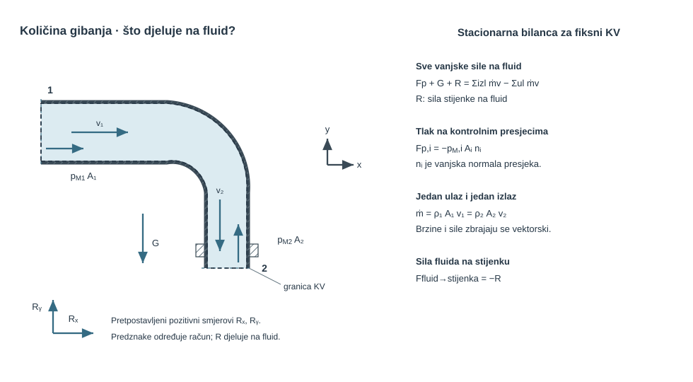

{#fig-uvod-u11 fig-align="center" fig-alt="Pregled poglavlja: količina i moment količine gibanja."}

## Količina gibanja kao izvor sila na cijevi, mlaznice i lopatice

Količina gibanja ovdje postaje veza između protoka, tlaka i reakcije konstrukcije.

pog. 10Količina i moment količine gibanja prvo je poglavlje u kojem stacionarni kontrolni volumen treba čitati zajedno s tlakovima na presjecima i s reakcijom stvarnog cijevnog elementa.

Čim fluid više nije slobodni mlaz u zraku nego prolazi kroz mlaznicu, koljeno ili račvu, sama promjena brzine više nije dovoljna. U račun ulaze i tlakovi na ulazu i izlazu, a rezultat je često sila koju moraju preuzeti vijci, prirubnica ili nosač.

::: {.mf1-application}

Inženjerski kontekst

Svako koljeno, T-račva, mlaznica ili završetak cjevovoda koji mijenja smjer ili brzinu toka prenosi silu na prirubnicu, vijčani spoj, konzolu ili temelj. Zato se ovo poglavlje izravno čita u pumpnim stanicama, brodskim strojarnicama, protupožarnim monitorima i vodenim mlaznicama, gdje konstrukcija ne nosi "protok", nego vektorsku razliku tlačnih i impulsnih doprinosa.
:::

::: {.mf1-priprema}

Prije čitanja poglavlja

**Predznanje koje se pretpostavlja:**

- jednadžba kontinuiteta i kontrolni volumen iz poglavlja pog. 7Kinematika, kontrolni volumen i kontinuitet;
- energijska jednadžba i pojam tlaka u presjeku iz poglavlja pog. 8Energijska jednadžba i Bernoulli;
- Newtonovi zakoni gibanja i pojam količine gibanja iz Fizike I;
- vektorska analiza, rastav vektora na komponente.

**Ishodi učenja:**

- postaviti kontrolni volumen za cijevni element i pravilno ucrtati tlakove i brzine na ulaznim i izlaznim presjecima;
- napisati i riješiti zakon količine gibanja u vektorskoj formi za stacionarni tok;
- razlikovati silu fluida na konstrukciju od sile konstrukcije na fluid (treći Newtonov zakon);
- izračunati silu na koljena, mlaznice i kontrolne zatvarače u realnim sustavima.

**Procijenjeno vrijeme rada uz udžbenik:** 10 sati.
:::

## Fizikalni uvod i matematički izvod

Za stacionarni tok osnovni zapis ostaje

$$
\sum \vec{F} = \dot{m}(\vec{V}_{izl} - \vec{V}_{ul})
$$ {#eq-momentum-fizikalni-uvod-i-matematicki-izvod-01}

::: {.mf1-fizikalno-znacenje}

Fizikalno značenje

Ovaj zakon kaže da je rezultantna vanjska sila na kontrolni volumen jednaka brzini promjene količine gibanja fluida koji prolazi kroz njega. Intuitivno: fluid koji mijenja brzinu (iznos ili smjer) mora dobiti ili predati impuls nečemu — toj „nečemu" je stijenka, prirubnica, koljeno. Ako fluid skrene za $90°$ u koljenu, on je primio bočni impuls od stijenke koljena — a Newton III kaže da je koljeno primilo jednaku i suprotnu silu od fluida. Vijci na prirubnici ne nose „protok" nego upravo tu promjenu smjera impulsa.
:::

ali se ovdje zbroj sila ne smije svesti samo na reakciju stijenke. U tipičnom cijevnom elementu treba odvojeno prepoznati:

- tlakove na ulaznim i izlaznim presjecima
- težinu fluida ako geometrija nije u horizontalnoj ravnini
- silu stijenke ili konstrukcije na fluid

Tek nakon toga može se odrediti sila fluida na konstrukciju, odnosno opterećenje vijaka, prirubnice ili nosača. Vektorski zapis ovdje nije formalna strogost radi same sebe: on je jedini način da se iz istoga toka istodobno ispravno pročitaju smjer, predznak i veličina opterećenja konstrukcije.

U pog. 10Količina i moment količine gibanja Bernoulli i kontinuitet više nisu dovoljni sami za sebe. Oni vraćaju energetsku sliku i raspodjelu protoka, ali ne daju reakciju konstrukcije. Tu ulazi zakon količine gibanja za kontrolni volumen.

Za kontrolni volumen $KV(t)$ omeđen kontrolnom plohom $KP(t)$ koja se lokalno giba brzinom $\vec v_{KP}$ integralni zakon količine gibanja u inercijskom referentnom okviru glasi

$$
\frac{\mathrm{d}}{\mathrm{d}t}\int_{KV(t)} \rho \vec{v}\,\mathrm{d}V
+ \int_{KP(t)} \rho \vec{v}\bigl[(\vec v-\vec v_{KP})\cdot \vec{n}\bigr]\,\mathrm{d}S
= \sum \vec{F}.
$$ {#eq-momentum-fizikalno-znacenje-01}

::: {.callout-note collapse="true" icon="false"}
## Numerički trag

Bilanca količine gibanja temelj je numeričkog modela strujanja. U metodi konačnih volumena ne piše se samo za jedan kontrolni volumen koljena, nego za svaku ćeliju mreže, a sve diskretne bilance zajedno tvore sustav jednadžbi. Druge metode, primjerice konačni elementi, do iste fizike dolaze drukčijom diskretizacijskom formulacijom.
:::

Prvi član predstavlja akumulaciju količine gibanja unutar odabranoga volumena, a drugi prijenos kroz njegovu granicu relativnom brzinom. Za nepomični kontrolni volumen $\vec v_{KP}=0$. Ako je tok usto stacionaran, prvi član nestaje pa preostaje ravnoteža između vanjskih sila i neto toka količine gibanja kroz granicu.

Ako se ulazni i izlazni presjeci mogu čitati jednodimenzijski, za jedan ulaz i jedan izlaz slijedi pojednostavljenje

$$
\sum \vec F = \dot m(\vec V_2 - \vec V_1).
$$ {#eq-momentum-numericki-trag-01}

::: {.mf1-izvod}

Matematički izvod — Koeficijent količine gibanja $\beta$ i nejednoliki profil brzine

Prelazak iz integralnog oblika $\int_A \rho\,\vec{v}(\vec{v}\cdot\vec{n})\,dA$ na pojednostavljeni zapis $\dot{m}\,\vec{V}$ implicitno pretpostavlja **jednoliki profil brzine** preko cijelog presjeka. Za realne profile (laminarni paraboloid, turbulentni profil $1/7$) pravu vrijednost integrala daje korekcijski **koeficijent količine gibanja**

$$
\beta = \frac{1}{v_{sr}^2 A}\int_A v^2\,dA,
$$ {#eq-momentum-matematicki-izvod-koeficijent-kolicine-gibanja-i-01}

gdje je $v_{sr} = Q/A$ srednja brzina presjeka. Točan integralni oblik se zatim piše kao

$$
\int_A \rho v^2\,dA = \beta \rho v_{sr}^2 A = \beta \dot{m} v_{sr}.
$$ {#eq-momentum-matematicki-izvod-koeficijent-kolicine-gibanja-i-02}

Za **laminarni parabolični profil** $v(r)=v_{max}(1-(r/R)^2)$ analitički je $\beta=4/3\approx1{,}33$. Idealizirani razvijeni turbulentni profil s eksponentom $1/7$ daje $\beta\approx1{,}02{-}1{,}03$. Uporaba $\beta\approx1$ odluka je o modelu profila, a ne univerzalno pravilo [@white2011].

Ovaj koeficijent analogan je **Coriolisovu koeficijentu $\alpha$**, koji u energijskoj bilanci korigira kinetičku energiju zbog nejednolikog profila: $\alpha$ stoji uz $v^2/(2g)$, a $\beta$ uz $\dot m v$. Za nenegativan jednosmjerni profil vrijedi $\alpha\ge\beta^{3/2}$, pa su oba veća od jedan ako profil nije jednolik. Za laminarni parabolični profil analitički je $\alpha=2$ i $\beta=4/3$. Kod povratnoga toka ili drukčije definiranih presjeka te se nejednakosti ne smiju primijeniti bez ponovne integracije.
:::

No taj oblik nije dovoljan dok se vanjske sile ne rastave na stvarne doprinose. Za tipičan cijevni element vrijedi

$$
\vec F_p + \vec G + \vec R_{st\to f} = \dot m(\vec V_2 - \vec V_1),
$$ {#eq-momentum-matematicki-izvod-koeficijent-kolicine-gibanja-i-03}

gdje je $\vec F_p$ rezultanta tlaknih sila na presjecima, $\vec G$ težina fluida unutar kontrolnog volumena, a $\vec R_{st\to f}$ sila stijenke ili konstrukcije na fluid. Iz toga odmah slijedi reakcija fluida na konstrukciju

$$
\vec F_{f\to st} = -\vec R_{st\to f} = \vec F_p + \vec G - \dot m(\vec V_2 - \vec V_1).
$$ {#eq-momentum-matematicki-izvod-koeficijent-kolicine-gibanja-i-04}

Tlakni članovi ne smiju se automatski izbaciti iz zapisa. Oni otpadaju tek kad su relevantni presjeci otvoreni atmosferi ili kad se njihova rezultanta doista poništi geometrijom i pravilno odabranim kontrolnim volumenom.

Upravo tu leži puni fizikalni smisao poglavlja. Član $\dot m\vec V$ mjeri koliko struja "brani" svoj smjer i iznos brzine, a tlakni članovi $pA$ pokazuju koliko fluid statički gura zatvorene presjeke. Vijci, prirubnica i nosač ne nose apstraktnu jednadžbu, nego upravo vektorsku razliku tlaknih, težinskih i impulsnih doprinosa.

::: {.callout-note collapse="true" icon="false"}
## Numerički trag

CFD silu na tijelo dobiva integracijom tlačnog i viskoznog naprezanja po cijeloj stijenci, a bilancu količine gibanja može se neovisno provjeriti tokovima kroz ulaze i izlaze. CFD ne pretpostavlja jednodimenzijski profil brzine, no zato ne postoji univerzalno očekivano odstupanje od „nekoliko posto”. Razlika prema 1D računu može potjecati od stvarne trodimenzijske fizike, različitih pretpostavki, diskretizacijske pogreške ili nedovoljne konvergencije; te uzroke treba razdvojiti verifikacijom i validacijom.
:::

::: {.mf1-interaktivno}

Interaktivni prikaz — Sila na koljeno

Interaktivni prikaz omogućuje mijenjanje kuta zakretanja koljena, volumenskog protoka i promjera cijevi uz neposredno praćenje komponenti sile $F_x$, $F_y$ te iznosa i smjera rezultante. Vizualno se odmah razabire kako se sila orijentira u prostoru s promjenom geometrije.

<a class="mf1-interaktivno-veza" href="https://martibasic.github.io/MF1_udzbenik/jlite/lab/index.html?path=u11_sila_na_koljeno.ipynb">Pokreni u pregledniku</a>

**Pitanja za samostalno istraživanje:** (a) Pri $\beta = 90°$, koje su vrijednosti $F_x$ i $F_y$ i kako mora biti orijentiran nosač? (b) Zašto je $\beta \to 180°$ slučaj najveće sile pri istom $Q$ i $D$? (c) Kada u članu $F_{int}$ dominira impulsni dio $\rho Q v$, a kada tlačni $pA$?

:::

::: {.callout-note}
## Razrada koraka
Korak: od integralnog zakona → radni zapis $\sum\vec{F} = \dot{m}(\vec{V}_2 - \vec{V}_1)$

Integralni zakon za stacionarno strujanje ($d/dt = 0$):
$$
\int_{KP} \rho \vec{v}(\vec{v}\cdot\vec{n})\,dS = \sum \vec{F}.
$$ {#eq-momentum-razrada-koraka-01}
Za presjeke s jednodimenzijskim profilom brzine ($v = $ const. po presjeku):
- na ulazu: $\vec{v}\cdot\vec{n} = -v_1$ (normala uperi prema van, brzina ulazi), taj član daje $-\dot{m}\vec{V}_1$
- na izlazu: $\vec{v}\cdot\vec{n} = +v_2$, daje $+\dot{m}\vec{V}_2$

Ukupno:
$$
\dot{m}\vec{V}_2 - \dot{m}\vec{V}_1 = \sum\vec{F} \quad\Rightarrow\quad \sum\vec{F} = \dot{m}(\vec{V}_2 - \vec{V}_1).
$$ {#eq-momentum-razrada-koraka-02}
Sile $\sum\vec{F}$ uključuju: tlakove na presjecima ($\vec{F}_p$), težinu fluida ($\vec{G}$) i silu stijenke na fluid ($\vec{R}$). Sila fluida na stijenku je $-\vec{R}$ (Newton III).
:::

To je razlog zašto se pog. 10Količina i moment količine gibanja ne čita kao još jedno poglavlje o formulama, nego kao prijelaz s toka na konstrukcijsko opterećenje. Na tlačnoj strani crpke koljeno i prije vodenog udara nosi stacionarni bočni potisak, a na mlaznici spoj preuzima razliku tlaknih i impulsnih doprinosa.

::: {.mf1-dublje}

Dublje — Lokalni oblik zakona količine gibanja

Integralni zakon količine gibanja vrijedi za bilo koji izabrani kontrolni volumen. Primjenom **teorema o divergenciji** isti se zakon zapisuje lokalno kao parcijalna diferencijalna jednadžba. Ovdje se čuva veza s integralnom bilancom; pretpostavke, rubni uvjeti i kanonska rješenja sustavno se obrađuju u pog. 12Diferencijalni opis realnog toka.

Polazi se od općeg oblika za **nepomični kontrolni volumen**, uz dopuštena vremenski promjenjiva polja:

$$
\frac{\partial}{\partial t}\int_{KV}\rho\vec u\,dV
+\int_{KP} \rho\,\vec{u}\,(\vec{u}\cdot\vec{n})\,dA
= \int_{KV} \rho\,\vec{g}\,dV
- \int_{KP} p\,\vec{n}\,dA
+ \int_{KP} \boldsymbol{\tau}\cdot\vec{n}\,dA,
$$ {#eq-momentum-dublje-lokalni-oblik-zakona-kolicine-gibanja-01}

gdje su s desne strane redom volumna sila (težine), tlačna sila i smična sila preko tenzora naprezanja $\boldsymbol{\tau}$.

Za fiksni kontrolni volumen vremenska derivacija može se prenijeti pod integral. Primjenom teorema o divergenciji površinski integrali postaju volumenski:

$$
\frac{\partial}{\partial t}\int_{KV}\rho\vec u\,dV
=\int_{KV}\frac{\partial(\rho\vec u)}{\partial t}\,dV,
$$ {#eq-momentum-dublje-lokalni-oblik-zakona-kolicine-gibanja-02}

$$
\int_{KP} \rho\,\vec{u}\,(\vec{u}\cdot\vec{n})\,dA = \int_{KV} \nabla\cdot(\rho\,\vec{u}\otimes\vec{u})\,dV,
$$ {#eq-momentum-dublje-lokalni-oblik-zakona-kolicine-gibanja-03}

$$
\int_{KP} p\,\vec{n}\,dA = \int_{KV} \nabla p\,dV, \qquad \int_{KP} \boldsymbol{\tau}\cdot\vec{n}\,dA = \int_{KV} \nabla\cdot\boldsymbol{\tau}\,dV.
$$ {#eq-momentum-dublje-lokalni-oblik-zakona-kolicine-gibanja-04}

Spajanjem svih članova u jedan volumenski integral i argumentom proizvoljnosti kontrolnog volumena slijedi **lokalna jednadžba količine gibanja**:

$$
\boxed{\frac{\partial(\rho\vec u)}{\partial t}
+\nabla\cdot(\rho\,\vec{u}\otimes\vec{u})
= \rho\,\vec{g} - \nabla p + \nabla\cdot\boldsymbol{\tau}}.
$$ {#eq-momentum-dublje-lokalni-oblik-zakona-kolicine-gibanja-05}

Za konstantnu gustoću i nestlačivost, $\nabla\cdot\vec u=0$, vrijedi identitet

$$
\nabla\cdot(\vec u\otimes\vec u)=(\vec u\cdot\nabla)\vec u,
$$ {#eq-momentum-dublje-lokalni-oblik-zakona-kolicine-gibanja-06}

pa se konzervativni oblik pretvara u materijalno ubrzanje. **Idealni (neviskozni) fluid.** Kada je $\boldsymbol{\tau}=0$, dobiva se Eulerova jednadžba:

$$
\boxed{\rho\!\left(\frac{\partial\vec{u}}{\partial t} + (\vec{u}\cdot\nabla)\vec{u}\right) = -\nabla p + \rho\,\vec{g}}.
$$ {#eq-momentum-dublje-lokalni-oblik-zakona-kolicine-gibanja-07}

Lijeva strana je **materijalna derivacija** brzine — ubrzanje fluidne čestice koja slijedi svoju trajektoriju. Trajektorija se podudara sa strujnicom samo u stacionarnom strujanju. Lokalni član $\partial\vec{u}/\partial t$ opisuje vremensku promjenu brzine u fiksnoj točki prostora; konvektivni član $(\vec{u}\cdot\nabla)\vec{u}$ opisuje promjenu jer se čestica giba kroz prostorno nejednoliko polje brzine.

**Realni Newtonov nestlačivi fluid.** Za konstantnu dinamičku viskoznost vrijedi $\tau_{ij} = \mu(\partial u_i/\partial x_j + \partial u_j/\partial x_i)$, a divergencija viskoznog tenzora postaje $\nabla\cdot\boldsymbol{\tau} = \mu\nabla^2\vec{u}$. Uvrštavanjem se dobiva **Navier–Stokesova jednadžba**:

$$
\boxed{\rho\!\left(\frac{\partial\vec{u}}{\partial t} + (\vec{u}\cdot\nabla)\vec{u}\right) = -\nabla p + \rho\,\vec{g} + \mu\nabla^2\vec{u}}.
$$ {#eq-momentum-dublje-lokalni-oblik-zakona-kolicine-gibanja-08}

Ovaj oblik Navier–Stokesove jednadžbe vrijedi uz navedene pretpostavke konstantne gustoće i viskoznosti Newtonskoga fluida. Numerički postupak diskretizira jednadžbu zajedno s kontinuitetom i rubnim uvjetima; konvergencija diskretiziranoga sustava nije sama po sebi validacija fizikalnog modela.

Skupine članova imaju jasnu fizikalnu interpretaciju:

- **Lokalni i konvektivni inercijski članovi** $\rho\,\partial\vec u/\partial t$ i $\rho(\vec u\cdot\nabla)\vec u$ — promjena brzine u vremenu i prijenos količine gibanja kroz prostorno nejednoliko polje; nelinearni konvektivni član omogućuje prijenos među skalama, ali sam po sebi nije dovoljan kriterij nastanka turbulencije;
- **Tlačni član** $-\nabla p$ — sila po jediničnom volumenu od strane gradijenta tlaka;
- **Volumna sila** $\rho\vec g$ — ovdje težina po jediničnom volumenu;
- **Viskozni član** $\mu\nabla^2\vec{u}$ — divergencija viskoznog naprezanja, odnosno sila po jediničnom volumenu; disipacija mehaničke energije posljedica je rada tih naprezanja, ali nije naziv samoga člana.

Reynoldsov broj $Re=\rho vL/\mu$ proizlazi kao omjer karakterističnih inercijskih i viskoznih članova. Mali $Re$ obično prigušuje poremećaje, dok veliki $Re$ dopušta da inercijski učinci i nestabilnosti postanu važni; prijelaz ovisi i o geometriji te ulaznim poremećajima. Potpuno razvijeni laminarni tok u kružnoj cijevi izvodi se u pog. 12Diferencijalni opis realnog toka.
:::

## Riješeni primjeri

::: {#ex-u11-mlaz-vode-na-mirnu-ravnu-plocu-t2 .mf1-we}

Riješeni primjer — Mlaz vode na mirnu ravnu ploču&nbsp;T2

**Kontekst:** Na hidrauličkom ispitnom stolu vodeni mlaz okomito udara u nepomičnu ploču i rasprši se uz njezinu površinu. Iz promjene količine gibanja u smjeru osi mlaza određuje se sila koju oslonac ploče mora preuzeti, što je temeljna ilustracija djelovanja mlaza.

**Zadano**

- Srednja brzina vode na izlazu iz mlaznice: $v = 20\ \text{m/s}$
- Maseni protok vode: $\dot{m} = 10\ \text{kg/s}$
- Mlaz udara okomito u nepomičnu vertikalnu ploču i rasprsi se uzduž ploče (nakon udara nema aksijalne komponente brzine).

**Traženo**

1. Odrediti silu potrebnu da ploča ostane u mirovanju.

{#fig-u11-mlaz-na-plocu fig-alt="mlaz na ploču"}

**Pretpostavke i model**

Najjednostavniji kontrolni volumen obuhvaća zonu udara mlaza u ploču. Tlak je svugdje približno atmosferski, pa se u smjeru osi mlaza u proračunu zadržava samo promjena količine gibanja. Upravo je to najčišći prvi ulaz u ovo poglavlje.

**Rješenje**

Za stacionarni tok u osi mlaza vrijedi

$$
\sum F_x = \dot{m}(v_{x,izl} - v_{x,ul}).
$$ {#eq-momentum-rijeseni-primjer-mlaz-vode-na-mirnu-ravnu-01}

Prije udara mlaz ima ulaznu komponentu brzine $v_{x,ul} = 20\ \text{m/s}$, a nakon udara se rasprsi uz ploču, pa je izlazna komponenta u istoj osi $v_{x,izl} = 0$. Zato sila ploče na fluid iznosi

$$
F_{pl \to f} = \dot{m}(0 - 20) = -200\ \text{N}.
$$ {#eq-momentum-rijeseni-primjer-mlaz-vode-na-mirnu-ravnu-02}

Negativan predznak samo govori da ploča na fluid djeluje suprotno smjeru mlaza. Po trećem Newtonovom zakonu sila fluida na ploču ima isti iznos i suprotan smjer, pa je sila koju treba preuzeti oslonac ploče

$$
F_R = F_{f \to pl} = 200\ \text{N}.
$$ {#eq-momentum-rijeseni-primjer-mlaz-vode-na-mirnu-ravnu-03}

**Provjera i komentar**

Kod slobodnog mlaza koji se na ploči zaustavlja u osi udara sila se dobiva izravno iz gubitka aksijalne komponente količine gibanja. Ovdje to daje točno $200\ \text{N}$.

1. Ako bi maseni protok bio veći, sila bi rasla linearno s $\dot{m}$.
2. Ako bi mlaz dolazio dvostruko brze, sila bi bila dvostruko veća jer je ovdje $\dot{m}$ već zadan.
3. Sila mora djelovati u smjeru dolaznog mlaza na ploču, a reakcija oslonca suprotno tome.
:::

::: {#ex-u11-kalibracijska-mlaznica-na-prirubnici-t2 .mf1-we}

Riješeni primjer — Kalibracijska mlaznica na prirubnici&nbsp;T2

**Kontekst:** U laboratoriju za baždarenje mlaznica sila izmjerena na ploči pred izlaznim mlazom služi za procjenu protoka i pretlaka prije mlaznice. Iz toga se određuje i idealizirano aksijalno opterećenje prirubničkih vijaka; njihov odabir traži zasebnu konstrukcijsku provjeru spoja.

**Zadano**

- Promjer ulaznog dijela mlaznice: $D = 220\ \text{mm}$
- Promjer izlaza mlaznice: $d = 90\ \text{mm}$
- Gustoća vode: $\rho = 998\ \text{kg/m}^3$
- Sila kojom mlaz djeluje na mjernu ploču: $F_P = 215\ \text{N}$

**Traženo**

1. Odrediti protok $Q$ kroz mlaznicu.
2. Odrediti pretlak $p_{M1}$ u presjeku 1 neposredno uz prirubnicu.
3. Odrediti koliku vlačnu silu $R$ moraju preuzeti vijci u presjeku `A-A`.

Pretpostavite jednolike profile brzine u presjecima 1 i 2, zanemarite gubitke i promatrajte horizontalnu ravninu.

{#fig-u11-kalibracijska-mlaznica-na-prirubnici fig-alt="kalibracijska mlaznica na prirubnici"}

**Pretpostavke i model**

Sila na mjernu ploču zaustavlja aksijalnu komponentu slobodnog mlaza, pa najprije iz te sile dobijemo izlaznu brzinu i protok. Zatim se između presjeka 1 i 2 primijeni Bernoullijeva jednadžba, a na kontrolni volumen unutar mlaznice jednadžba količine gibanja u osi $x$.

**Rješenje**

Površina izlaznog presjeka iznosi

$$
A_2 = \frac{\pi d^2}{4} = \frac{\pi \cdot 0{,}09^2}{4} = 6{,}36 \cdot 10^{-3}\ \text{m}^2.
$$ {#eq-momentum-rijeseni-primjer-kalibracijska-mlaznica-na-priru-01}

Za mlaz koji udara okomito u ravnu ploču vrijedi $F_P = \dot{m} v_2 = \rho A_2 v_2^2$, pa je izlazna brzina

$$
v_2 = \sqrt{\frac{F_P}{\rho A_2}} = \sqrt{\frac{215}{998 \cdot 6{,}36 \cdot 10^{-3}}} = 5{,}82\ \text{m/s},
$$ {#eq-momentum-rijeseni-primjer-kalibracijska-mlaznica-na-priru-02}

odakle slijedi protok

$$
Q = A_2 v_2 = 6{,}36 \cdot 10^{-3} \cdot 5{,}82 \approx 0{,}0370\ \text{m}^3/\text{s} = 37{,}0\ \text{l/s}.
$$ {#eq-momentum-rijeseni-primjer-kalibracijska-mlaznica-na-priru-03}

Površina ulaznog presjeka je

$$
A_1 = \frac{\pi D^2}{4} = \frac{\pi \cdot 0{,}22^2}{4} = 3{,}80 \cdot 10^{-2}\ \text{m}^2,
$$ {#eq-momentum-rijeseni-primjer-kalibracijska-mlaznica-na-priru-04}

pa je brzina u presjeku 1 jednaka

$$
v_1 = \frac{Q}{A_1} = \frac{0{,}0370}{3{,}80 \cdot 10^{-2}} = 0{,}974\ \text{m/s}.
$$ {#eq-momentum-rijeseni-primjer-kalibracijska-mlaznica-na-priru-05}

Kako je presjek 2 otvoren prema atmosferi, u zapisu s pretlakom vrijedi $p_{M2} = 0$. Bernoullijeva jednadžba između 1 i 2 zato daje $p_{M1} + \tfrac{\rho v_1^2}{2} = \tfrac{\rho v_2^2}{2}$, pa je

$$
p_{M1} = \frac{\rho}{2}(v_2^2 - v_1^2) = \frac{998}{2}(5{,}82^2 - 0{,}974^2) \approx 1{,}64 \cdot 10^4\ \text{Pa} = 16{,}4\ \text{kPa}.
$$ {#eq-momentum-rijeseni-primjer-kalibracijska-mlaznica-na-priru-06}

Za silu u vijcima sada promatramo kontrolni volumen unutar mlaznice. Maseni protok iznosi

$$
\dot{m} = \rho Q = 998 \cdot 0{,}0370 = 36{,}95\ \text{kg/s}.
$$ {#eq-momentum-rijeseni-primjer-kalibracijska-mlaznica-na-priru-07}

U osi $x$ jednadžba količine gibanja glasi $p_{M1} A_1 + F_{st \to f} = \dot{m}(v_2 - v_1)$, gdje je $F_{st \to f}$ sila stijenke mlaznice na fluid. Zato sila fluida na mlaznicu, a time i vlačna sila koju moraju preuzeti vijci, glasi

$$
R = F_{f \to st} = p_{M1} A_1 - \dot{m}(v_2 - v_1) = 1{,}64 \cdot 10^4 \cdot 3{,}80 \cdot 10^{-2} - 36{,}95(5{,}82 - 0{,}974) \approx 445\ \text{N},
$$ {#eq-momentum-rijeseni-primjer-kalibracijska-mlaznica-na-priru-08}

pa vijci u presjeku `A-A` rade na vlak.

**Provjera i komentar**

1. Protok reda nekoliko desetaka litara u sekundi razuman je za izlaz promjera $90\ \text{mm}$ i brzinu reda $6\ \text{m/s}$.
2. Budući da mlaznica ubrzava tok, statički tlak mora padati prema izlazu, pa je pozitivan pretlak u presjeku 1 fizikalno očekivan.
3. Sila u vijcima mora ostati pozitivna jer ulazna tlakna sila nadmašuje porast aksijalne impulsne funkcije.
:::

::: {#ex-u11-servisno-koljeno-na-sidrenom-nosacu-t2 .mf1-we}

Riješeni primjer — Servisno koljeno na sidrenom nosaču&nbsp;T2

**Kontekst:** Horizontalno koljeno od $90^\circ$ u servisnom cjevovodu zakreće tok vode iz jedne osi u drugu, a sidreni nosač mora preuzeti reakcijsku silu. Iz promjene količine gibanja i razlike tlakova na ulazu i izlazu određuju se komponente i rezultanta sile za pravilno dimenzioniranje nosača.

**Zadano**

- Gustoća vode: $\rho = 998\ \text{kg/m}^3$
- Horizontalno koljeno od $90^\circ$ skreće tok iz osi $x$ u os $y$.
- Promjer ulaznog presjeka: $D_1 = 180\ \text{mm}$
- Promjer izlaznog presjeka: $D_2 = 120\ \text{mm}$
- Volumenski protok: $Q = 0{,}045\ \text{m}^3/\text{s}$
- Pretlak u ulaznom presjeku: $p_{M1} = 52\ \text{kPa}$
- Pretlak u izlaznom presjeku: $p_{M2} = 18\ \text{kPa}$

Zanemari težinu fluida u koljenu i gubitke.

**Traženo**

1. brzine $v_1$ i $v_2$.
2. komponente sile fluida na koljeno.
3. iznos rezultantne sile koju mora preuzeti sidreni nosač.

{#fig-u11-horizontalno-koljeno-i-reakcija-nosaca fig-alt="horizontalno koljeno i reakcija nosača"}

**Pretpostavke i model**

Promatra se stacionarni kontrolni volumen koji obuhvaća cijelo koljeno. Kako je tok u horizontalnoj ravnini, težina se ovdje zanemaruje, a u jednadžbi količine gibanja ostaju tlakovi na presjecima i sila stijenke na fluid po osima $x$ i $y$.

**Rješenje**

Površine presjeka su

$$
A_1 = \frac{\pi D_1^2}{4} = \frac{\pi \cdot 0{,}18^2}{4} = 2{,}545 \cdot 10^{-2}\ \text{m}^2,
$$ {#eq-momentum-rijeseni-primjer-servisno-koljeno-na-sidrenom-no-01}

$$
A_2 = \frac{\pi D_2^2}{4} = \frac{\pi \cdot 0{,}12^2}{4} = 1{,}131 \cdot 10^{-2}\ \text{m}^2.
$$ {#eq-momentum-rijeseni-primjer-servisno-koljeno-na-sidrenom-no-02}

Iz kontinuiteta slijede brzine

$$
v_1 = \frac{Q}{A_1} = \frac{0{,}045}{2{,}545 \cdot 10^{-2}} = 1{,}77\ \text{m/s},
$$ {#eq-momentum-rijeseni-primjer-servisno-koljeno-na-sidrenom-no-03}

$$
v_2 = \frac{Q}{A_2} = \frac{0{,}045}{1{,}131 \cdot 10^{-2}} = 3{,}98\ \text{m/s}.
$$ {#eq-momentum-rijeseni-primjer-servisno-koljeno-na-sidrenom-no-04}

Maseni protok iznosi

$$
\dot{m} = \rho Q = 998 \cdot 0{,}045 = 44{,}9\ \text{kg/s}.
$$ {#eq-momentum-rijeseni-primjer-servisno-koljeno-na-sidrenom-no-05}

Za os $x$ jednadžba količine gibanja glasi $p_{M1}A_1 + F_{st,x} = \dot{m}(0 - v_1)$ (na izlazu nema komponente brzine u smjeru $x$). Uvrstavanjem dobiva se

$$
F_{st,x} = \dot{m}(0 - v_1) - p_{M1}A_1 = 44{,}9 \cdot (-1{,}77) - 52\,000 \cdot 2{,}545 \cdot 10^{-2} = -1402\ \text{N}.
$$ {#eq-momentum-rijeseni-primjer-servisno-koljeno-na-sidrenom-no-06}

To je sila stijenke na fluid. Zato fluid na koljeno u osi $x$ djeluje silom $F_{f \to k,x} = +1402\ \text{N}$, odnosno prema desno.

Za os $y$ vrijedi $-p_{M2}A_2 + F_{st,y} = \dot{m}(v_2 - 0)$, pa slijedi

$$
F_{st,y} = \dot{m} v_2 + p_{M2}A_2 = 44{,}9 \cdot 3{,}98 + 18\,000 \cdot 1{,}131 \cdot 10^{-2} = 383\ \text{N}.
$$ {#eq-momentum-rijeseni-primjer-servisno-koljeno-na-sidrenom-no-07}

To znači da fluid na koljeno u osi $y$ djeluje silom $F_{f \to k,y} = -383\ \text{N}$, odnosno prema dolje.

Rezultanta sile fluida na koljeno zato je

$$
F_R = \sqrt{F_{f \to k,x}^2 + F_{f \to k,y}^2} = \sqrt{1402^2 + 383^2} \approx 1453\ \text{N} = 1{,}45\ \text{kN}.
$$ {#eq-momentum-rijeseni-primjer-servisno-koljeno-na-sidrenom-no-08}

Sidreni nosač mora preuzeti jednaku i suprotnu silu: ulijevo i prema gore.

**Provjera i komentar**

U ovom koljenu fluid djeluje na konstrukciju silom od oko $1{,}45\ \text{kN}$, pretežno prema desno, ali i s manjom komponentom prema dolje. To je tipičan rezultat poglavlja pog. 10Količina i moment količine gibanja: promjena smjera strujanja ne daje samo novi tlak ili novu brzinu, nego i opterećenje koje se predaje nosaču.

1. Glavna komponenta sile mora ići u smjeru ulaznog tlaka i promjene osi toka, pa je ovdje prirodno veća u osi $x$ nego u osi $y$.
2. Kad se izlazni presjek suzi, izlazna brzina mora porasti i povećati impulsni doprinos u osi $y$.
3. Ako se na kraju dobije samo jedna os reakcije, gotovo sigurno je preskočena promjena smjera brzine ili jedan tlak na presjeku.

::: {.mf1-numerika .kompakt}

Numerička perspektiva

Trodimenzijska simulacija istoga koljena može integrirati tlakna i viskozna naprezanja po stijenci te rezultat neovisno usporediti s bilancom količine gibanja na granicama domene. Razlika prema jednodimenzijskom računu nema unaprijed zadan prihvatljiv postotak: treba razdvojiti učinak drukčijih fizikalnih pretpostavki od diskretizacijske i iteracijske pogreške te provjeriti osjetljivost na mrežu i rubne uvjete [@nasa-cfd-vv; @asme-vv20-2009].
:::

:::

::: {#ex-u11-t-racva-na-sidrenoj-konzoli-t3 .mf1-ch}

Cjeloviti zadatak — T-račva na sidrenoj konzoli&nbsp;T3

**Kontekst:** U industrijskom razdjelnom sustavu T-račva dijeli ulazni protok na dva izlaza koji prolaze kroz različite presjeke. Sidrena konzola mora preuzeti rezultantu sile fluida na račvu, pa se njezino opterećenje određuje sprezanjem Bernoullijeve jednadžbe, kontinuiteta i zakona količine gibanja.

**Zadano**

- Gustoća vode: $\rho = 998\ \text{kg/m}^3$
- Promjer ulaznog presjeka `1`: $D_1 = 180\ \text{mm}$
- Manometarski tlak u presjeku `1`: $p_{M1} = 40\ \text{kPa}$
- Promjer ravnog izlaza `2` (smjer osi $x$): $D_2 = 90\ \text{mm}$
- Promjer okomitog izlaza `3` (smjer osi $y$): $D_3 = 80\ \text{mm}$

Oba izlaza otvorena su prema atmosferi. Smatraj da je sustav u horizontalnoj ravnini, da nema gubitaka i da su brzine u oba izlaza jednolike.

**Traženo**

1. brzinu u ulazu $v_1$ te izlazne brzine $v_2$ i $v_3$.
2. volumenske protoke $Q_1$, $Q_2$ i $Q_3$.
3. komponente sile fluida na račvu i rezultantu sile koju mora preuzeti sidrena konzola.

{#fig-u11-t-racva-na-sidrenoj-konzoli fig-alt="T-račva na sidrenoj konzoli"}

**Pretpostavke i model**

Oba izlaza otvorena su prema atmosferi i nalaze se na istoj geodetskoj razini kao ulaz. Zato Bernoulli između ulaza i svakog izlaza daje istu izlaznu brzinu u granama `2` i `3`. Tek nakon toga kontinuitet zatvara odnos između ulaznog i izlaznih protoka, a zatim se na cijelu račvu primjenjuje zakon količine gibanja po osima $x$ i $y$.

**Rješenje**

Površine presjeka su

$$
A_1 = \frac{\pi D_1^2}{4} = \frac{\pi \cdot 0{,}18^2}{4} = 2{,}545 \cdot 10^{-2}\ \text{m}^2
$$ {#eq-momentum-cjeloviti-zadatak-t-racva-na-sidrenoj-konzoli-01}

$$
A_2 = \frac{\pi D_2^2}{4} = \frac{\pi \cdot 0{,}09^2}{4} = 6{,}362 \cdot 10^{-3}\ \text{m}^2
$$ {#eq-momentum-cjeloviti-zadatak-t-racva-na-sidrenoj-konzoli-02}

$$
A_3 = \frac{\pi D_3^2}{4} = \frac{\pi \cdot 0{,}08^2}{4} = 5{,}027 \cdot 10^{-3}\ \text{m}^2
$$ {#eq-momentum-cjeloviti-zadatak-t-racva-na-sidrenoj-konzoli-03}

Kako su izlazi `2` i `3` na istom tlaku i na istoj visini, iz Bernoullija između presjeka `1` i bilo kojeg izlaza slijedi

$$
\frac{p_{M1}}{\rho} + \frac{v_1^2}{2} = \frac{v_2^2}{2} = \frac{v_3^2}{2}
$$ {#eq-momentum-cjeloviti-zadatak-t-racva-na-sidrenoj-konzoli-04}

pa su izlazne brzine jednake:

$$
v_2 = v_3 = v
$$ {#eq-momentum-cjeloviti-zadatak-t-racva-na-sidrenoj-konzoli-05}

Iz kontinuiteta sada vrijedi

$$
A_1 v_1 = A_2 v + A_3 v = (A_2 + A_3)v,
$$ {#eq-momentum-cjeloviti-zadatak-t-racva-na-sidrenoj-konzoli-06}

odnosno

$$
v = \frac{A_1}{A_2 + A_3} v_1 = \frac{2{,}545 \cdot 10^{-2}}{6{,}362 \cdot 10^{-3} + 5{,}027 \cdot 10^{-3}} v_1 = 2{,}234 v_1.
$$ {#eq-momentum-cjeloviti-zadatak-t-racva-na-sidrenoj-konzoli-07}

Uvrstavanjem u Bernoullijevu relaciju dobiva se

$$
\frac{2p_{M1}}{\rho} = v^2 - v_1^2 = \left(2{,}234^2 - 1\right)v_1^2 \quad\Rightarrow\quad \frac{2 \cdot 40000}{998} = 3{,}99\, v_1^2,
$$ {#eq-momentum-cjeloviti-zadatak-t-racva-na-sidrenoj-konzoli-08}

odakle je $v_1 \approx 4{,}49\ \text{m/s}$ te zatim $v_2 = v_3 = 2{,}234 \cdot 4{,}49 \approx 10{,}03\ \text{m/s}$.

Volumenski protoci su

$$
Q_1 = A_1 v_1 = 2{,}545 \cdot 10^{-2} \cdot 4{,}49 = 0{,}114\ \text{m}^3/\text{s},
$$ {#eq-momentum-cjeloviti-zadatak-t-racva-na-sidrenoj-konzoli-09}

$$
Q_2 = A_2 v_2 = 6{,}362 \cdot 10^{-3} \cdot 10{,}03 = 0{,}0638\ \text{m}^3/\text{s}, \qquad Q_3 = A_3 v_3 = 5{,}027 \cdot 10^{-3} \cdot 10{,}03 = 0{,}0504\ \text{m}^3/\text{s},
$$ {#eq-momentum-cjeloviti-zadatak-t-racva-na-sidrenoj-konzoli-10}

i provjera daje $Q_1 \approx Q_2 + Q_3$. Maseni protoci su zato

$$
\dot{m}_1 = \rho Q_1 = 998 \cdot 0{,}114 = 114{,}0\ \text{kg/s}, \qquad \dot{m}_2 = 998 \cdot 0{,}0638 = 63{,}7\ \text{kg/s}, \qquad \dot{m}_3 = 998 \cdot 0{,}0504 = 50{,}3\ \text{kg/s}.
$$ {#eq-momentum-cjeloviti-zadatak-t-racva-na-sidrenoj-konzoli-11}

Za os $x$ jednadžba količine gibanja glasi

$$
p_{M1}A_1 + F_{st,x} = \dot{m}_2 v_2 - \dot{m}_1 v_1,
$$ {#eq-momentum-cjeloviti-zadatak-t-racva-na-sidrenoj-konzoli-12}

jer samo izlaz `2` ima komponentu brzine u smjeru osi $x$. Uvrstavanjem podataka dobiva se

$$
40000 \cdot 2{,}545 \cdot 10^{-2} + F_{st,x} = 63{,}7 \cdot 10{,}03 - 114{,}0 \cdot 4{,}49 \quad\Rightarrow\quad F_{st,x} = -892\ \text{N}.
$$ {#eq-momentum-cjeloviti-zadatak-t-racva-na-sidrenoj-konzoli-13}

To je sila stijenke na fluid. Zato fluid na račvu djeluje silom $F_{f \to r,x} = +892\ \text{N}$, prema desno.

Za os $y$ vrijedi

$$
F_{st,y} = \dot{m}_3 v_3 = 50{,}3 \cdot 10{,}03 = 505\ \text{N},
$$ {#eq-momentum-cjeloviti-zadatak-t-racva-na-sidrenoj-konzoli-14}

jer samo izlaz `3` nosi pozitivnu komponentu brzine u osi $y$. Zato fluid na račvu djeluje silom $F_{f \to r,y} = -505\ \text{N}$, prema dolje.

Rezultanta sile fluida na račvu iznosi

$$
F_R = \sqrt{F_{f \to r,x}^2 + F_{f \to r,y}^2} = \sqrt{892^2 + 505^2} = 1025\ \text{N} \approx 1{,}03\ \text{kN}.
$$ {#eq-momentum-cjeloviti-zadatak-t-racva-na-sidrenoj-konzoli-15}

Smjer rezultante je prema desno i prema dolje, pa sidrena konzola mora preuzeti jednaku i suprotnu silu: ulijevo i prema gore.

**Provjera i komentar**

Ovo je prvi stvarni integrativni zadatak poglavlja pog. 10Količina i moment količine gibanja: iz ulaznog pretlaka najprije se Bernoullijem vraćaju izlazne brzine, zatim kontinuitet zatvara razdjelu protoka, a tek onda jednadžba količine gibanja daje opterećenje račve. Dobivena rezultanta na konzoli iznosi oko $1{,}03\ \text{kN}$.

1. Izlazne brzine moraju biti veće od ulazne jer se ukupna izlazna površina smanjila, a ulazni tlak je pozitivan.
2. Komponenta sile u osi $x$ mora ostati dominantna jer u tom smjeru djeluje i ulazna tlakna sila i dio impulsne bilance.
3. Ako se jednadžba količine gibanja napiše prije zatvaranja Bernoullija i kontinuiteta, gotovo sigurno će se izgubiti pravi odnos među protocima i silama u granama.
:::

::: {#ex-u11-y-racva-s-mjerenom-reakcijom-konzole-t4 .mf1-ch}

Cjeloviti zadatak — Y-račva s mjerenom reakcijom konzole&nbsp;T4

**Kontekst:** U pogonu se Y-račva s dva izlaza pod različitim kutovima oslanja na konzolu opremljenu mjernom ćelijom za vertikalnu reakciju. Iz izmjerene reakcije obrnutim putem se rekonstruira cijeli radni režim — brzine, protoci i ulazni tlak — te se provjerava nosivost konzole.

**Zadano**

- Gustoća vode: $\rho = 998\ \text{kg/m}^3$
- Promjer ulaznog presjeka `1` (u smjeru osi $x$): $D_1 = 170\ \text{mm}$
- Promjer ravnog izlaza `2` (smjer osi $x$): $D_2 = 100\ \text{mm}$
- Promjer izlaza `3`: $D_3 = 80\ \text{mm}$ (zatvara kut $60^\circ$ iznad pozitivnog smjera osi $x$)
- Izmjerena vertikalna reakcija konzole (prema gore): $R_y = 625\ \text{N}$

Oba izlaza otvorena su prema atmosferi, nalaze se na istoj geodetskoj razini kao ulaz i gubici se zanemaruju.

**Traženo**

1. zajedničku izlaznu brzinu $v = v_2 = v_3$.
2. ulaznu brzinu $v_1$ te protoke $Q_1$, $Q_2$ i $Q_3$.
3. potreban manometarski tlak u ulazu $p_{M1}$.
4. horizontalnu reakciju konzole $R_x$ i ukupnu rezultantu koju mora preuzeti nosač.
5. zadovoljava li izračunana rezultanta zadani statički kriterij $R\le1{,}0\ \text{kN}$.

{#fig-u11-y-racva-s-mjerenom-reakcijom-konzole fig-alt="Y-račva s mjerenom reakcijom konzole"}

**Pretpostavke i model**

Kako su presjeci `2` i `3` otvoreni prema atmosferi i na istoj visini, Bernoulli između `1-2` i `1-3` daje istu izlaznu brzinu u obje grane. Mjerena vertikalna reakcija konzole tada postaje ulaz u račun količine gibanja po osi $y$, iz kojeg se najprije vraća izlazna brzina. Tek nakon toga kontinuitet daje protoke, Bernoulli vraća ulazni tlak, a zakon količine gibanja po osi $x$ zatvara drugu komponentu reakcije.

**Rješenje**

Površine presjeka iznose

$$
A_1 = \frac{\pi D_1^2}{4} = \frac{\pi \cdot 0{,}17^2}{4} = 2{,}270 \cdot 10^{-2}\ \text{m}^2
$$ {#eq-momentum-cjeloviti-zadatak-y-racva-s-mjerenom-reakcijom-01}

$$
A_2 = \frac{\pi D_2^2}{4} = \frac{\pi \cdot 0{,}10^2}{4} = 7{,}854 \cdot 10^{-3}\ \text{m}^2
$$ {#eq-momentum-cjeloviti-zadatak-y-racva-s-mjerenom-reakcijom-02}

$$
A_3 = \frac{\pi D_3^2}{4} = \frac{\pi \cdot 0{,}08^2}{4} = 5{,}027 \cdot 10^{-3}\ \text{m}^2
$$ {#eq-momentum-cjeloviti-zadatak-y-racva-s-mjerenom-reakcijom-03}

Konzola na račvu djeluje vertikalnom reakcijom prema gore, pa fluid na račvu djeluje jednakom silom prema dolje. Zato je sila stijenke na fluid po osi $y$ jednaka $F_{st,y} = 625\ \text{N}$. Budući da samo izlaz `3` nosi komponentu brzine u osi $y$, iz zakona količine gibanja slijedi

$$
F_{st,y} = \dot{m}_3 v_3 \sin 60^\circ = \rho A_3 v^2 \sin 60^\circ,
$$ {#eq-momentum-cjeloviti-zadatak-y-racva-s-mjerenom-reakcijom-04}

odakle se izlazna brzina vraća iz mjerene reakcije:

$$
625 = 998 \cdot 5{,}027 \cdot 10^{-3} \cdot v^2 \cdot \sin 60^\circ \quad\Rightarrow\quad v = 11{,}99\ \text{m/s} \approx 12{,}0\ \text{m/s}.
$$ {#eq-momentum-cjeloviti-zadatak-y-racva-s-mjerenom-reakcijom-05}

Kako su izlazne brzine jednake, kontinuitet $A_1 v_1 = (A_2 + A_3)v$ daje

$$
v_1 = \frac{A_2 + A_3}{A_1} v = \frac{7{,}854 \cdot 10^{-3} + 5{,}027 \cdot 10^{-3}}{2{,}270 \cdot 10^{-2}} \cdot 11{,}99 = 6{,}81\ \text{m/s}.
$$ {#eq-momentum-cjeloviti-zadatak-y-racva-s-mjerenom-reakcijom-06}

Protok u pojedinim granama zato je

$$
Q_2 = A_2 v = 7{,}854 \cdot 10^{-3} \cdot 11{,}99 = 0{,}0942\ \text{m}^3/\text{s}, \qquad Q_3 = A_3 v = 5{,}027 \cdot 10^{-3} \cdot 11{,}99 = 0{,}0603\ \text{m}^3/\text{s},
$$ {#eq-momentum-cjeloviti-zadatak-y-racva-s-mjerenom-reakcijom-07}

$$
Q_1 = Q_2 + Q_3 = 0{,}1545\ \text{m}^3/\text{s} \approx 155\ \text{L/s}.
$$ {#eq-momentum-cjeloviti-zadatak-y-racva-s-mjerenom-reakcijom-08}

Bernoulli između ulaza `1` i bilo kojeg izlaza sada daje

$$
\frac{p_{M1}}{\gamma} + \frac{v_1^2}{2g} = \frac{v^2}{2g}
$$ {#eq-momentum-cjeloviti-zadatak-y-racva-s-mjerenom-reakcijom-09}

pa je manometarski tlak u presjeku `1`

$$
p_{M1} = \frac{\rho}{2}\left(v^2-v_1^2\right) = \frac{998}{2}\left(11{,}99^2 - 6{,}81^2\right) = 48{,}6\ \text{kPa}
$$ {#eq-momentum-cjeloviti-zadatak-y-racva-s-mjerenom-reakcijom-10}

Maseni protoci iznose

$$
\dot{m}_1 = \rho Q_1 = 998 \cdot 0{,}1545 = 154{,}2\ \text{kg/s}, \qquad \dot{m}_2 = 998 \cdot 0{,}0942 = 94{,}0\ \text{kg/s}, \qquad \dot{m}_3 = 998 \cdot 0{,}0603 = 60{,}2\ \text{kg/s}.
$$ {#eq-momentum-cjeloviti-zadatak-y-racva-s-mjerenom-reakcijom-11}

Za os $x$ vrijedi jednadžba količine gibanja

$$
p_{M1}A_1 + F_{st,x} = \dot{m}_2 v + \dot{m}_3 v \cos 60^\circ - \dot{m}_1 v_1,
$$ {#eq-momentum-cjeloviti-zadatak-y-racva-s-mjerenom-reakcijom-12}

odnosno numerički

$$
48600 \cdot 2{,}270 \cdot 10^{-2} + F_{st,x} = 94{,}0 \cdot 11{,}99 + 60{,}2 \cdot 11{,}99 \cdot 0{,}5 - 154{,}2 \cdot 6{,}81 \quad\Rightarrow\quad 1103 + F_{st,x} = 439,
$$ {#eq-momentum-cjeloviti-zadatak-y-racva-s-mjerenom-reakcijom-13}

pa slijedi $F_{st,x} = -664\ \text{N}$. To je sila stijenke na fluid. Zato fluid na račvu djeluje silom $F_{f \to r,x} = +664\ \text{N}$ prema desno, pa konzola mora preuzeti horizontalnu reakciju $R_x = 664\ \text{N}$ prema lijevo. Vertikalna reakcija je već izmjerena: $R_y = 625\ \text{N}$ prema gore.

Ukupna rezultanta koju mora preuzeti nosač zato iznosi

$$
R = \sqrt{R_x^2 + R_y^2} = \sqrt{664^2 + 625^2} = 912{,}1\ \text{N} \approx 0{,}913\ \text{kN}.
$$ {#eq-momentum-cjeloviti-zadatak-y-racva-s-mjerenom-reakcijom-14}

Smjer reakcije konzole je ulijevo i prema gore, pod kutom

$$
\varphi = \arctan \frac{625}{664} = 43{,}3^\circ
$$ {#eq-momentum-cjeloviti-zadatak-y-racva-s-mjerenom-reakcijom-15}

iznad negativnog smjera osi $x$. Usporedba sa zadanim statičkim kriterijem rezultante daje $1{,}0\ \text{kN} - 0{,}913\ \text{kN} = 0{,}087\ \text{kN}$, pa proračunati režim zadovoljava taj kriterij za oko $87\ \text{N}$. To nije potpuna provjera konzole ni spojeva.

**Provjera i komentar**

Ovaj `T4` zadatak pokazuje inverzni postupak: umjesto da se iz protoka i tlaka računa sila, iz mjerene reakcije konzole rekonstruira se idealizirani radni režim račve. Iz vertikalne sile od $625\ \text{N}$ proizlazi izlazna brzina od oko $12\ \text{m/s}$, ukupni protok od oko $155\ \text{L/s}$ i potreban ulazni pretlak od oko $48{,}6\ \text{kPa}$. Rezultanta od oko $0{,}913\ \text{kN}$ manja je od zadanoga statičkog kriterija od $1{,}0\ \text{kN}$; čvrstoća, zamor, spojevi i prolazna opterećenja nisu ovim modelom provjereni.

1. Ako mjerena vertikalna reakcija poraste, mora porasti i izlazna brzina u kosoj grani jer je upravo ona jedini izvor pozitivnog toka količine gibanja u osi $y$.
2. Ulazna brzina mora ostati manja od izlazne jer se jedan veći ulazni presjek dijeli na dva manja izlaza.
3. Ako se iz izmjerene sile odmah pokuša vratiti $p_{M1}$ bez kontinuiteta i Bernoullija, preskače se veza između reakcije i stvarne kinematike u granama.
:::

Nakon inverznog problema grananja, završni primjer vraća se koljenu kako bi se ista vektorska bilanca primijenila na suvremeni mali hidroenergetski sustav.

::: {#ex-u11-sila-na-koljeno-tlacnog-voda-male-hidroelektrane .mf1-we}

Riješeni primjer — Sila na koljeno tlačnog voda male hidroelektrane &nbsp;T2

**Kontekst:** Mala hidroelektrana ugrađena u području planinske rijeke koristi raspoloživu visinsku razliku za pogon Peltonove turbine snage približno $50\ \text{kW}$. Voda iz akumulacijskog bazena prolazi tlačnim vodom (čeličnom cijevi) do strojarnice, pri čemu cijev mijenja smjer u jednom horizontalnom koljenu zbog uklopa u teren. Konstruktor mora procijeniti silu kojom voda djeluje na koljeno radi pravilnog sidrenja.

**Zadano**

- Kut zakretanja koljena: $\beta = 60^\circ$
- Promjer tlačnog voda: $D = 200\ \text{mm}$
- Volumenski protok: $Q = 0{,}18\ \text{m}^3/\text{s}$
- Manometarski tlak ispred koljena: $p_{M} = 280\ \text{kPa}$ (izračunat iz raspoložive visine umanjene za gubitke u prethodnom dijelu voda)
- Gustoća vode: $\rho = 998\ \text{kg/m}^3$
- Pretpostavlja se zanemariv gubitak u samom koljenu (kratko, glatko zaobljeno)
- Koljeno je u horizontalnoj ravnini

**Traženo**

1. Srednja brzina vode u tlačnom vodu;
2. Komponente sile fluida na koljeno u smjeru ulaza i okomito na njega;
3. Iznos rezultante i smjer djelovanja.

**Pretpostavke i model**

Kontrolni volumen obuhvaća cijelo koljeno. Strujanje je stacionarno i nestlačivo, tlakovi na ulazu i izlazu koljena približno su jednaki ($p_2 \approx p_1$) jer su gubici zanemarivi, a promjer je nepromijenjen. Težina vode u koljenu zanemaruje se jer je kontrolni volumen u horizontalnoj ravnini. Profili brzina aproksimiraju se jednodimenzijskim srednjim vrijednostima. Atmosferski tlak djeluje izvana na vanjsku stijenku koljena i ne utječe na izračun unutrašnjih sila.

**Rješenje**

Površina presjeka voda i brzina vode:

$$
A = \frac{\pi D^2}{4} = \frac{\pi \cdot 0{,}200^2}{4} \approx 3{,}142 \cdot 10^{-2}\ \text{m}^2,
$$ {#eq-momentum-rijeseni-primjer-sila-na-koljeno-tlacnog-voda-01}

$$
v = \frac{Q}{A} = \frac{0{,}18}{3{,}142 \cdot 10^{-2}} \approx 5{,}73\ \text{m/s}.
$$ {#eq-momentum-rijeseni-primjer-sila-na-koljeno-tlacnog-voda-02}

Intenzitet ukupne sile na presjeku (zbroj impulsnog i tlačnog doprinosa):

$$
F_{int} = \rho Q v + p_{M} A = 998 \cdot 0{,}18 \cdot 5{,}73 + 280\,000 \cdot 3{,}142 \cdot 10^{-2}.
$$ {#eq-momentum-rijeseni-primjer-sila-na-koljeno-tlacnog-voda-03}

Računaju se redom $\rho Q v \approx 1\,029\ \text{N}$ i $p_{M} A \approx 8\,798\ \text{N}$:

$$
F_{int} \approx 9\,827\ \text{N}.
$$ {#eq-momentum-rijeseni-primjer-sila-na-koljeno-tlacnog-voda-04}

Komponente sile fluida na koljeno (s osi $x$ u smjeru ulaznog toka):

$$
F_x = F_{int}\,(1 - \cos\beta) = 9\,827 \cdot (1 - \cos 60^\circ) = 9\,827 \cdot 0{,}5 \approx 4{,}91\ \text{kN},
$$ {#eq-momentum-rijeseni-primjer-sila-na-koljeno-tlacnog-voda-05}

$$
F_y = F_{int}\,\sin\beta = 9\,827 \cdot \sin 60^\circ = 9\,827 \cdot 0{,}866 \approx 8{,}51\ \text{kN}.
$$ {#eq-momentum-rijeseni-primjer-sila-na-koljeno-tlacnog-voda-06}

Iznos rezultante:

$$
F_R = \sqrt{F_x^2 + F_y^2} = \sqrt{4{,}91^2 + 8{,}51^2} \approx 9{,}83\ \text{kN}.
$$ {#eq-momentum-rijeseni-primjer-sila-na-koljeno-tlacnog-voda-07}

Smjer rezultante u odnosu na ulaznu os:

$$
\varphi = \arctan\frac{F_y}{F_x} = \arctan\frac{8{,}51}{4{,}91} \approx 60^\circ.
$$ {#eq-momentum-rijeseni-primjer-sila-na-koljeno-tlacnog-voda-08}

**Provjera i komentar**

Rezultanta od približno $9{,}83\ \text{kN}$ ima smjer koji slijedi iz vektorske razlike ulaznoga i izlaznoga tlačno-impulsnog doprinosa; za ovu geometriju dobiven je kut $60^\circ$ prema odabranoj osi. Tlačni član ($p_M A \approx 8{,}8\ \text{kN}$) veći je od impulsnoga ($\rho Qv \approx 1{,}0\ \text{kN}$). Dobivena sila ulazni je podatak za zaseban proračun sidrenja, cijevi i spojeva, u kojem treba uključiti i vlastitu težinu, prolazna stanja te propisane kombinacije opterećenja.
:::

::: {.mf1-samoprovjera}

Provjeri sebe

Sljedeća pitanja služe za samostalnu provjeru razumijevanja prije prelaska na zadatke za vježbu.

1. Po čemu se razlikuje impulsni doprinos $\dot{m}\Delta v$ od tlačnog doprinosa $pA$ u sili na koljeno?

::: {.callout-note collapse="true"}
### Odgovor
Impulsni doprinos nastaje zbog promjene vektora brzine fluida (mijenja se smjer ili iznos) i ovisi o protoku mase i razlici brzina. Tlačni doprinos nastaje zbog statičkog tlaka na ulazni i izlazni presjek kontrolnog volumena i ovisi o tlaku i površini. Pri sporom strujanju dominira tlačni doprinos, pri brzom impulsni.
:::

2. Kako se iz sile okoline na fluid dobiva sila fluida na konstrukciju?

::: {.callout-note collapse="true"}
### Odgovor
Po trećem Newtonovu zakonu, sila fluida na konstrukciju jednaka je po iznosu, a suprotna po smjeru sili koju konstrukcija djeluje na fluid. U proračunu se promijeni samo predznak — ali pri tumačenju rezultata to je presudno za odabir smjera sile na nosač ili sidrište.
:::

3. Zašto za pravilan proračun sile na koljeno treba uračunati i tlak i brzinu, a ne samo jedno od toga?

::: {.callout-note collapse="true"}
### Odgovor
Jednadžba količine gibanja sadrži oba doprinosa — tok količine gibanja i sile tlaka na presjecima. Njihov je relativni iznos ovisan o tlaku, brzini, geometriji i odabranim presjecima, pa izostavljanje jednoga nema univerzalan postotak pogreške i može promijeniti i iznos i smjer rezultante.
:::

4. Vrijedi li primjena zakona količine gibanja i ako su gubici u koljenu nezanemarivi?

::: {.callout-note collapse="true"}
### Odgovor
Vrijedi i tada, jer zakon količine gibanja proizlazi iz Newtonovih zakona i ne zahtijeva pretpostavku idealnog (bezgubitnog) strujanja. Razlika između idealnog i realnog slučaja ulazi preko različitih tlakova na ulaznom i izlaznom presjeku — gubici energije smanjuju tlak na izlazu, što se mora uračunati preko proširenog Bernoullijevog zakona ili izravnog mjerenja.
:::
:::

## Zadaci za vježbu

::::: {.mf1-vjezbe-list}
1. [**T1**]{#task-u11-vodeni-mlaz-promjera-izlazi-iz-sapnice-brzinom} Vodeni mlaz promjera $d = 38\ \text{mm}$ izlazi iz sapnice brzinom $v = 22\ \text{m/s}$ i udara okomito na nepomičnu ravnu ploču. Odredi maseni protok i silu koju mlaz prenosi na ploču.

   :::: {.content-visible .mf1-hint-online when-format="html"}
   ::: {.callout-note collapse="true" data-hint-key="true"}
   ### Naputak
   $\dot m = \rho Av$; za ravnu ploču izlazna komponenta u osi mlaza je nula pa je $F = \dot m v$.
   :::
   ::::
   :::: {.content-visible .mf1-answer-online when-format="html"}
   ::: {.callout-tip collapse="true" data-answer-key="true"}
   ### Kontrolni rezultat

   $\dot m \approx 24{,}9\ \text{kg/s}$; $F \approx 548\ \text{N}$.
   :::
   ::::
   **Skica:** da - sapnica, slobodni mlaz i ravna ploča s osi djelovanja sile.

2. [**T1**]{#task-u11-mlaz-vode-udara-okomito-na-nepomicnu-plocu} Mlaz vode udara okomito na nepomičnu ploču i sila na ploču iznosi $F = 310\ \text{N}$. Promjer mlaza je $d = 42\ \text{mm}$. Odredi brzinu mlaza i volumenski protok.

   :::: {.content-visible .mf1-hint-online when-format="html"}
   ::: {.callout-note collapse="true" data-hint-key="true"}
   ### Naputak
   iz relacije $F = \rho A v^2$ vrati $v$, a zatim $Q = Av$.
   :::
   ::::
   :::: {.content-visible .mf1-answer-online when-format="html"}
   ::: {.callout-tip collapse="true" data-answer-key="true"}
   ### Kontrolni rezultat

   $v \approx 15{,}0\ \text{m/s}$; $Q \approx 20{,}7\ \text{L/s}$.
   :::
   ::::
   **Skica:** da - slobodni mlaz na ploču, poznata reakcija $F$ i promjer $d$.

3. [**T2**]{#task-u11-horizontalno-koljeno-zakrece-tok-vode-za-bez} Horizontalno koljeno zakreće tok vode za $90^\circ$ bez promjene promjera. Cijev ima promjer $D = 100\ \text{mm}$, protok je $Q = 0{,}026\ \text{m}^3/\text{s}$, ulazni manometarski tlak $p_1 = 180\ \text{kPa}$, a izlazni $p_2 = 150\ \text{kPa}$. Odredi komponente sile fluida na koljeno.

   :::: {.content-visible .mf1-hint-online when-format="html"}
   ::: {.callout-note collapse="true" data-hint-key="true"}
   ### Naputak
   iz $Q$ prvo dobij brzinu; zatim u x i y smjeru zbroji tlakove na presjecima i promjenu količine gibanja.
   :::
   ::::
   :::: {.content-visible .mf1-answer-online when-format="html"}
   ::: {.callout-tip collapse="true" data-answer-key="true"}
   ### Kontrolni rezultat

   $v \approx 3{,}31\ \text{m/s}$; komponente sile fluida na koljeno $F_x \approx 1{,}50\ \text{kN}$, $F_y \approx -1{,}26\ \text{kN}$; rezultanta $\approx 1{,}96\ \text{kN}$.
   :::
   ::::
   **Skica:** da - koljeno od $90^\circ$, dva presjeka, tlakovi i osi koordinata.

4. [**T2**]{#task-u11-t-racva-prima-vodu-kroz-ulaz-promjera} T-račva prima vodu kroz ulaz promjera $D_1 = 120\ \text{mm}$ s protokom $Q_1 = 0{,}030\ \text{m}^3/\text{s}$. U vodoravni izlaz promjera $D_2 = 80\ \text{mm}$ odlazi $Q_2 = 0{,}018\ \text{m}^3/\text{s}$, a ostatak izlazi okomito prema gore kroz granu promjera $D_3 = 70\ \text{mm}$. Ulazni manometarski tlak je $p_1 = 210\ \text{kPa}$. Odredi komponente reakcije nosača ako su tlakovi na izlazima atmosferski.

   :::: {.content-visible .mf1-hint-online when-format="html"}
   ::: {.callout-note collapse="true" data-hint-key="true"}
   ### Naputak
   kontinuitetom zatvori $Q_3$, zatim u svakoj osi napiši jednadžbu količine gibanja za cijelu račvu.
   :::
   ::::
   :::: {.content-visible .mf1-answer-online when-format="html"}
   ::: {.callout-tip collapse="true" data-answer-key="true"}
   ### Kontrolni rezultat

   $Q_3 = 12\ \text{L/s}$; reakcija nosača $\approx 2{,}39\ \text{kN}$ (pretežno u osi ulaza), okomita komponenta $\approx 37\ \text{N}$.
   :::
   ::::
   **Skica:** da - T-račva s jednim ulazom, dva izlaza i označenim koordinatnim osima.

5. [**T3**]{#task-u11-konvergentna-mlaznica-ima-ulazni-promjer-izlazni-promjer} Konvergentna mlaznica ima ulazni promjer $D_1 = 110\ \text{mm}$, izlazni promjer $D_2 = 45\ \text{mm}$ i protok vode $Q = 0{,}018\ \text{m}^3/\text{s}$. Ulazni manometarski tlak iznosi $p_1 = 240\ \text{kPa}$, a mlaz izlazi u atmosferu. Odredi silu koju moraju preuzeti vijci na prirubnici mlaznice.

   :::: {.content-visible .mf1-hint-online when-format="html"}
   ::: {.callout-note collapse="true" data-hint-key="true"}
   ### Naputak
   iz kontinuiteta dobij brzine u oba presjeka; zatim za unutarnji kontrolni volumen spoji tlak na ulazu i promjenu količine gibanja.
   :::
   ::::
   :::: {.content-visible .mf1-answer-online when-format="html"}
   ::: {.callout-tip collapse="true" data-answer-key="true"}
   ### Kontrolni rezultat

   $v_1 \approx 1{,}89\ \text{m/s}$, $v_2 \approx 11{,}3\ \text{m/s}$; sila u vijcima prirubnice $\approx 2{,}11\ \text{kN}$.
   :::
   ::::
   **Skica:** da - mlaznica s prirubnicom, ulazni i izlazni presjek te aksijalna sila u vijcima.

6. [**T4**]{#task-u11-vodoravna-y-racva-prima-vodu-kroz-ulaz} Vodoravna Y-račva prima vodu kroz ulaz promjera $D_1 = 140\ \text{mm}$ pri protoku $Q_1 = 0{,}040\ \text{m}^3/\text{s}$ i ulaznom manometarskom tlaku $p_1 = 185\ \text{kPa}$. Šezdeset posto protoka odlazi ravno kroz izlaz promjera $D_2 = 90\ \text{mm}$, a ostatak kroz granu promjera $D_3 = 80\ \text{mm}$ koja zatvara kut od $60^\circ$ iznad osi $x$. Oba izlaza su na atmosferskom tlaku. Odredi komponente sile fluida na račvu i iznos rezultantne sile koju mora preuzeti nosač. U pogonu vrijedi $p_1=185\pm5\ \text{kPa}$, $Q_1$ ima granicu $\pm2\ \%$, a udio protoka ravnim izlazom iznosi $0{,}60\pm0{,}03$. Odredi konzervativnu najveću rezultantu i izaberi nosač nazivne nosivosti $3{,}0\ \text{kN}$ ili $3{,}5\ \text{kN}$ ako se na najveću očekivanu silu primjenjuje projektni faktor $1{,}15$.

   :::: {.content-visible .mf1-hint-online when-format="html"}
   ::: {.callout-note collapse="true" data-hint-key="true"}
   ### Naputak
   najprije iz zadanog udjela vrati $Q_2$ i $Q_3$, zatim preko presjeka dobij brzine u svim granama, a na kraju po osima $x$ i $y$ napiši jednadžbu količine gibanja uz ulaznu tlaknu silu. Za omotač nesigurnosti izračunaj rezultantu u rubnim kombinacijama $p_1$, $Q_1$ i udjela protoka; zbog kvadratne ovisnosti članova količine gibanja nije dovoljno samo uvećati nominalnu rezultantu za jedan postotak.
   :::
   ::::
   :::: {.content-visible .mf1-answer-online when-format="html"}
   ::: {.callout-tip collapse="true" data-answer-key="true"}
   ### Kontrolni rezultat

   $Q_2 = 24\ \text{L/s}$, $Q_3 = 16\ \text{L/s}$; $F_x \approx 2{,}84\ \text{kN}$, $F_y \approx -44\ \text{N}$; rezultanta $\approx 2{,}84\ \text{kN}$. Rubne kombinacije daju najveću očekivanu rezultantu približno $2{,}92\ \text{kN}$. Zadani faktor daje kriterij od oko $3{,}36\ \text{kN}$, pa deklariranih $3{,}0\ \text{kN}$ ne zadovoljava taj pojedinačni kriterij, dok bi $3{,}5\ \text{kN}$ zadovoljilo samo tu usporedbu. Potpuni odabir traži zasebnu provjeru nosača, spojeva i svih kombinacija opterećenja.
   :::
   ::::
   **Skica:** da - Y-račva s jednim ulazom, dva izlaza, koordinatnim osima i kutom od $60^\circ$.
:::::

{#fig-u11-vjezbe fig-align="center" fig-alt="Skice uz zadatke za vježbu — mlazovi na plohe, koljena i račve."}

::: {.mf1-zavrsni-okvir}

Za ponijeti iz poglavlja

**Sažeta provjera prije računa**

- Treba najprije odvojiti slobodni mlaz i unutarnji kontrolni volumen mlaznice.
- Treba provjeriti koristi li se pretlak tako da je u otvorenom presjeku tlak jednak nuli.
- Treba iz kontinuiteta ispravno povezati brzine u presjecima 1 i 2.
- Treba imati na umu da jednadžba količine gibanja najprije daje silu stijenke na fluid.
- Na kraju treba jasno odrediti rade li vijci na vlak ili na tlak.

**Najčešća pogreška**

Najčešći lom zadatka nastaje kad se sila na ploču i sila u vijcima tretiraju kao ista stvar. Sila na ploču određuje slobodni mlaz iza mlaznice, ali sila u vijcima dolazi iz drugog kontrolnog volumena u kojem istodobno djeluju i tlak i promjena količine gibanja.

**Nakon ovoga poglavlja mora biti moguće**

1. postaviti kontrolni volumen za cijevni element i pravilno ucrtati tlakove na presjecima.
2. spojiti kontinuitet, Bernoullija i zakon količine gibanja u jedan slijed računa.
3. izračunati silu fluida na konstrukciju i pravilno protumačiti predznak reakcije.

**U tehnici to znači**

Koljena, račve, mlaznice i prirubnice u pumpnim stanicama ne otkazuju zato što "protok postoji", nego zato što konstrukcija mora preuzeti konkretnu vektorsku silu. Ovo je poglavlje zato neposredan most između hidraulike i dimenzioniranja nosača, vijaka i sidara.

**Granica modela**

Jednadžba količine gibanja u ovom obliku čita stacionarni problem na jasno odabranom kontrolnom volumenu. Ako sustav ulazi u prolazne pojave, vodeni udar ili brzu promjenu protoka, stacionarna bilanca količine gibanja više nije dovoljna za puni opis opterećenja.

pog. 10Količina i moment količine gibanja je poglavlje u kojem zakon količine gibanja više nije samo zapis promjene brzine, nego i konstrukcijski odgovor sustava. Kad su povezani sila na ploču, protok, tlak i sila u vijcima, prijelaz prema složenijim koljenima, račvama i prema pog. 14Turbostrojevi i propulzija postaje prirodan.
:::

::: {.mf1-numerika}

Numerički most

**Gdje ovo živi u numerici.** Integralni ili lokalni zakon količine gibanja temelj je većine numeričkih modela strujanja. Metoda konačnih volumena izravno bilancira tokove i sile po ćelijama; druge diskretizacije polaze od istih diferencijalnih jednadžbi.

**Što numerički alat radi s tim.** Diskretiziraju se nestacionarni, konvektivni, tlačni, viskozni i volumenski članovi. Nelinearnost konvektivnoga člana otežava rješavanje, ali sama po sebi nije sinonim za turbulenciju. Točnost ovisi o modelu, mreži, vremenskom koraku, rubnim uvjetima i konvergenciji.

**Tipičan scenarij.** Sila na koljeno dobiva se integracijom tlaka i smičnih naprezanja po stijenci, a može se neovisno provjeriti bilancom količine gibanja na granicama domene. Jednodimenzijski i numerički rezultat ne moraju biti jednaki ako ne predstavljaju isti model; slaganje se ocjenjuje tek nakon verifikacije i, kada postoje odgovarajući mjerni podaci, validacije [@nasa-cfd-vv; @asme-vv20-2009].

> *Nije gradivo MF1. Ključna veza jest ista bilanca: ručni račun je zatvara na jednom kontrolnom volumenu, a numerički model na diskretiziranoj domeni, uz dodatnu obvezu procjene numeričke pogreške.*
:::
