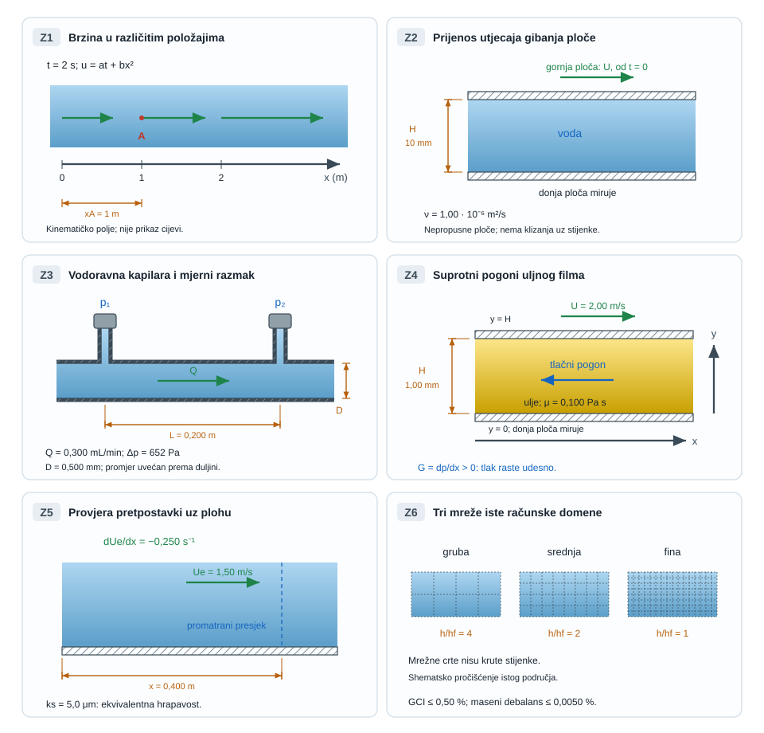

{#fig-realni-tok-pregled fig-align="center" fig-alt="Diferencijalni opis povezuje lokalnu bilancu količine gibanja, rast graničnog sloja i turbulentne fluktuacije."}

## Diferencijalni opis realnog toka {#sec-realni-tok-motivacija}

Integralne bilance odgovaraju na pitanje kolika je ukupna sila, protok ili snaga sustava. Ne govore izravno gdje nastaje najveće naprezanje, kada se tok odvaja od stijenke ni kako se brzina mijenja unutar graničnog sloja. Za ta pitanja bilancu treba primijeniti na proizvoljno malen element fluida.

::: {.mf1-application}

Inženjerski kontekst

Isti diferencijalni model opisuje uljni film ležaja, razvoj profila u rashladnom kanalu, otpor trupa, odvajanje iza lopatice i polje brzine koje računa program za CFD. Razlika između analitičkog rješenja i simulacije nije u temeljnim zakonima: analitički račun uvodi snažne simetrije, a numerički alat iste lokalne bilance primjenjuje na mnogo ćelija [@schlichting2017; @pope2000].
:::

**Procijenjeno vrijeme rada uz udžbenik:** 10 sati.

## Materijalna derivacija {#sec-materijalna-derivacija}

Brzina je polje $\mathbf u(\mathbf x,t)$. Čestica koja se giba kroz to polje osjeća promjenu zbog vremena i zbog prelaska u područje druge brzine. Lančano pravilo daje

$$
\frac{D\mathbf u}{Dt}=
\underbrace{\frac{\partial\mathbf u}{\partial t}}_{\text{lokalno ubrzanje}}+
\underbrace{(\mathbf u\cdot\nabla)\mathbf u}_{\text{konvektivno ubrzanje}}.
$$ {#eq-materijalna-derivacija}

Stacionarno strujanje ima $\partial\mathbf u/\partial t=0$, ali čestica može ubrzavati zbog promjene brzine duž svojeg gibanja, primjerice u suženju ili zavoju. Nejednolik profil sam po sebi ne znači ubrzanje: u potpuno razvijenom ravnom toku $\mathbf u=(u(y),0,0)$ vrijedi $(\mathbf u\cdot\nabla)\mathbf u=u\,\partial\mathbf u/\partial x=0$, iako je $du/dy$ različit od nule. U stacionarnom polju putanje čestica poklapaju se sa strujnicama.

::: {#ex-konvektivno-ubrzanje .mf1-we}

Ubrzanje u stacionarnom toku kroz suženje T1

U jednodimenzijskom stacionarnom modelu brzina raste linearno, $u(x)=2+3x\ \text{m/s}$ za $x$ u metrima. U $x=0{,}50\ \text{m}$ vrijedi $u=3{,}5\ \text{m/s}$ i

$$
a_x=u\frac{du}{dx}=3{,}5\cdot3=10{,}5\ \text{m/s}^2.
$$ {#eq-realni-tok-rijeseni-primjer-ubrzanje-kroz-mirno-suzenje-t1-01}

**Provjera:** lokalni član je nula, ali konvektivni nije. Jedinice $(\text{m/s})(1/\text{s})$ daju $\text{m/s}^2$.
:::

## Lokalna bilanca mase i količine gibanja {#sec-navier-stokes}

Za kontinuum bez izvora mase lokalna bilanca mase jest

$$
\frac{\partial\rho}{\partial t}+\nabla\cdot(\rho\mathbf u)=0.
$$ {#eq-lokalna-kontinuitet}

Za nestlačiv fluid konstantne gustoće svodi se na $\nabla\cdot\mathbf u=0$.

Drugi Newtonov zakon za materijalni element glasi

$$
\rho\frac{D\mathbf u}{Dt}=\nabla\cdot\boldsymbol\sigma+\rho\mathbf b,
$$ {#eq-realni-tok-lokalna-bilanca-mase-i-kolicine-gibanja-sec-01}

gdje je $\boldsymbol\sigma=-p\mathbf I+\boldsymbol\tau$ ukupni tenzor naprezanja, a $\mathbf b$ sila po jedinici mase. Za newtonski fluid konstantnih $\rho$ i $\mu$ s $\nabla\cdot\mathbf u=0$ vrijedi $\nabla\cdot\boldsymbol\tau=\mu\nabla^2\mathbf u$. Dobiva se

$$
\boxed{
\rho\left(\frac{\partial\mathbf u}{\partial t}+(\mathbf u\cdot\nabla)\mathbf u\right)
=-\nabla p+\mu\nabla^2\mathbf u+\rho\mathbf b
}.
$$ {#eq-navier-stokes-nestlacivi}

Članovi redom znače lokalnu i konvektivnu promjenu količine gibanja, tlačnu silu, viskoznu difuziju količine gibanja i volumensku silu. Konvektivni član nije sam po sebi „izvor turbulencije”; nelinearnost omogućuje međudjelovanje skala, dok nastanak i održanje turbulencije ovise o nestabilnostima, smičnom radu, geometriji i disipaciji.

::: {.mf1-granica-modela}

Pretpostavke prikazanog oblika

Jednadžba [-@eq-navier-stokes-nestlacivi] pretpostavlja newtonski fluid, konstantnu viskoznost i gustoću te odsutnost dodatnih konstitutivnih učinaka. Nenewtonski fluid ne zahtijeva novi zakon količine gibanja, nego drukčiju vezu $\boldsymbol\tau(\mathbf D)$.
:::

## Rubni uvjeti i fizikalno zatvaranje problema {#sec-rubni-uvjeti}

Jednadžbe bez rubnih i početnih uvjeta ne određuju jedinstveno polje. Na nepomičnoj nepropusnoj stijenci za viskozni tok vrijedi

$$
\mathbf u=\mathbf 0,
$$ {#eq-realni-tok-rubni-uvjeti-i-fizikalno-zatvaranje-problema-sec-01}

odnosno nema prolaza kroz stijenku i nema klizanja uz nju. Na slobodnoj površini treba zadati kinematički uvjet gibanja granice i ravnotežu normalnih i tangencijalnih naprezanja. Na ulazu se zadaje konzistentan profil ili protok, a na izlazu tlak ili uvjet dovoljno udaljen od poremećaja. Pogrešan rubni uvjet može dati uredne reziduale, ali pogrešno fizikalno rješenje.

## Kanonsko rješenje: tok između paralelnih ploča {#sec-couette-poiseuille}

Promatra se stacionarni, potpuno razvijeni, laminarni tok newtonskog fluida između ploča na $y=0$ i $y=H$. Brzina je $\mathbf u=(u(y),0,0)$, gravitacija u smjeru toka zanemariva, a gradijent tlaka konstantan. Navier–Stokesova jednadžba svodi se na

$$
0=-\frac{dp}{dx}+\mu\frac{d^2u}{dy^2}.
$$ {#eq-realni-tok-kanonsko-rjesenje-tok-izme-u-paralelnih-ploca-01}

Dvostrukom integracijom i rubnim uvjetima $u(0)=0$, $u(H)=U$ dobiva se Couette–Poiseuilleov profil

$$
u(y)=\frac{U}{H}y+\frac{1}{2\mu}\frac{dp}{dx}(y^2-Hy).
$$ {#eq-couette-poiseuille}

Prvi član opisuje doprinos gibanja gornje ploče, a drugi doprinos gradijenta tlaka. Suprotstave li se ta dva pogona, u dijelu procjepa može nastati povratni tok.

::: {#ex-uljni-film .mf1-we}

Uljni film s dva pogonska mehanizma T2

Za $H=1{,}0\ \text{mm}$, $U=2{,}0\ \text{m/s}$, $\mu=0{,}10\ \text{Pa s}$ i $dp/dx=-100\ \text{kPa/m}$ brzina u sredini procjepa iznosi

$$
u(H/2)=\frac{U}{2}+\frac{1}{2\mu}\frac{dp}{dx}\left(-\frac{H^2}{4}\right)
=1{,}0+0{,}125=1{,}125\ \text{m/s}.
$$ {#eq-realni-tok-rijeseni-primjer-uljni-film-s-dva-pogonska-01}

**Provjera predznaka:** negativan $dp/dx$ znači pad tlaka u pozitivnom $x$-smjeru i zato povećava brzinu. Model ne procjenjuje nosivost ležaja bez određivanja prostorne raspodjele tlaka.
:::

## Hagen–Poiseuilleov tok i linearni gubitak {#sec-hagen-poiseuille}

Za kružnu cijev polumjera $R$ isti postupak u cilindričnim koordinatama daje

$$
u(r)=-\frac{1}{4\mu}\frac{dp}{dx}(R^2-r^2),
$$ {#eq-realni-tok-hagen-poiseuilleov-tok-i-linearni-gubitak-sec-01}

$$
Q=-\frac{\pi R^4}{8\mu}\frac{dp}{dx},
\qquad
\Delta p=\frac{128\mu L}{\pi D^4}Q.
$$ {#eq-hagen-poiseuille}

Ovo je važan granični test cijelog modela gubitaka: pri laminarnom potpuno razvijenom toku pad tlaka raste **linearno** s $Q$. U Darcyjevu zapisu isti rezultat daje $\lambda=64/Re$; zato tvrdnja da su svi gubitci nužno proporcionalni $v^2$ nije točna.

::: {.mf1-izvod}

Izvod — od profila brzine do $\lambda=64/Re$

Protok slijedi iz integracije dobivenoga paraboličnog profila po presjeku:

$$
Q=\int_0^R u(r)\,2\pi r\,dr
=-\frac{\pi R^4}{8\mu}\frac{dp}{dx}.
$$ {#eq-realni-tok-hagen-poiseuilleov-tok-i-linearni-gubitak-sec-02}

Uz $\bar u=Q/(\pi R^2)$ i $D=2R$ slijedi $\Delta p=-L\,dp/dx=32\mu L\bar u/D^2$ te $u_{max}=2\bar u$. Izjednačavanjem s Darcyjevim zapisom

$$
\Delta p=\lambda\frac{L}{D}\frac{\rho\bar u^2}{2}
$$ {#eq-realni-tok-izvod-od-profila-brzine-do-lambda-64-re-01}

dobiva se

$$
\lambda=\frac{64\mu}{\rho\bar uD}=\frac{64}{Re}.
$$ {#eq-realni-tok-izvod-od-profila-brzine-do-lambda-64-re-02}

Faktor $64$ zato nije empirijska konstanta, nego posljedica stacionarnog, potpuno razvijenog laminarnog toka newtonskoga fluida u kružnoj cijevi. Izvan tih pretpostavki ovaj se rezultat ne prenosi bez provjere.
:::

::: {#ex-laminarni-mikrokanal .mf1-we}

Pad tlaka u dijagnostičkom mikrokanalu T2

Voda pri $\mu=1{,}0\ \text{mPa s}$ teče kroz idealiziranu kružnu kapilaru $D=0{,}50\ \text{mm}$, $L=0{,}20\ \text{m}$, protokom $Q=0{,}30\ \text{mL/min}=5{,}0\cdot10^{-9}\ \text{m}^3/\text{s}$.

$$
\Delta p=\frac{128(10^{-3})(0{,}20)}{\pi(5\cdot10^{-4})^4}(5\cdot10^{-9})=652\ \text{Pa}.
$$ {#eq-realni-tok-rijeseni-primjer-pad-tlaka-u-dijagnostickom-mikr-01}

Srednja brzina je $0{,}0255\ \text{m/s}$ i $Re\approx12{,}7$, pa je laminarna pretpostavka konzistentna. Udvostručenje protoka udvostručuje $\Delta p$, a ne učetverostručuje ga.
:::

## Granični sloj, smično naprezanje i odvajanje {#sec-granicni-sloj}

Kada gotovo jednoliko strujanje naiđe na stijenku, uvjet prianjanja stvara tanko područje velikoga gradijenta brzine. Izvan njega viskozni učinak može biti malen; unutar njega određuje smično naprezanje

$$
\tau_w=\mu\left.\frac{\partial u}{\partial y}\right|_w.
$$ {#eq-realni-tok-granicni-sloj-smicno-naprezanje-i-odvajanje-sec-01}

Za laminarni granični sloj uz ravnu ploču bez gradijenta tlaka Blasiusovo rješenje daje procjene

$$
\delta_{99}\approx\frac{5x}{\sqrt{Re_x}},
\qquad
C_{f,x}\approx\frac{0{,}664}{\sqrt{Re_x}},
\qquad Re_x=\frac{U_\infty x}{\nu}.
$$ {#eq-blasius-procjene}

To nisu univerzalne formule: vrijede za glatku ravnu plohu, približno nulti gradijent tlaka i laminarni sloj.

Nepovoljan gradijent tlaka, $dp/dx>0$ u smjeru toka, usporava fluid uz stijenku. U stacionarnom dvodimenzijskom graničnom sloju nulto smično naprezanje može označiti početak odvajanja, uz pojavu lokalnog povratnog toka. Sama promjena znaka u drugoj geometriji, primjerice potpuno razvijenom toku između ploča u Z4, ne dokazuje odvajanje strujnica od plohe. Odvajanje mijenja tlak i otpor mnogo više nego sama lokalna viskozna sila; zato geometrijski blaga promjena difuzora može odlučiti radi li uređaj učinkovito.

::: {#ex-granicni-sloj .mf1-we}

Debljina sloja na oplati modela T2

Voda struji brzinom $U_\infty=1{,}5\ \text{m/s}$ uz glatku plohu. Za $x=0{,}40\ \text{m}$ i $\nu=1{,}0\cdot10^{-6}\ \text{m}^2/\text{s}$:

$$
Re_x=6{,}0\cdot10^5,
\qquad
\delta_{99}\approx\frac{5(0{,}40)}{\sqrt{6{,}0\cdot10^5}}=2{,}58\ \text{mm}.
$$ {#eq-realni-tok-rijeseni-primjer-debljina-sloja-na-oplati-modela-01}

Vrijednost je samo laminarna referenca; na tom $Re_x$ prijelaz može već ovisiti o hrapavosti, turbulenciji dotoka i gradijentu tlaka. **Provjera:** $\delta/x\approx0{,}0065\ll1$, što je konzistentno s aproksimacijom tankoga sloja.
:::

## Turbulentni tok: srednja vrijednost nije cijelo polje {#sec-turbulencija}

U turbulentnom toku trenutna brzina rastavlja se na vremenski srednju vrijednost i fluktuaciju,

$$
u_i(\mathbf x,t)=U_i(\mathbf x)+u_i'(\mathbf x,t),
\qquad \overline{u_i'}=0.
$$ {#eq-realni-tok-turbulentni-tok-srednja-vrijednost-nije-cijelo-p-01}

Intenzitet turbulencije za jednu komponentu može se izraziti kao

$$
I_u=\frac{u'_{rms}}{U},
\qquad
u'_{rms}=\sqrt{\overline{u'^2}}.
$$ {#eq-realni-tok-turbulentni-tok-srednja-vrijednost-nije-cijelo-p-02}

Usrednjavanje Navier–Stokesove jednadžbe uvodi Reynoldsova naprezanja $-\rho\overline{u_i'u_j'}$. Ona nisu nova molekularna naprezanja, nego tok srednje količine gibanja koji nose fluktuacije. Turbulencijski model zatvara te nepoznate korelacije; nije numerička zamjena za Darcyjev faktor trenja.

CFD je način numeričkog rješavanja i laminarnog i turbulentnog modela. RANS rješava osrednjene jednadžbe uz model korelacija; LES razrješava velike vrtloge i modelira učinak manjih; DNS razrješava sve dinamički relevantne turbulentne skale bez turbulencijskog modela. Izbor ovisi o potrebnom srednjem ili vremenskom odzivu i raspoloživoj razlučivosti, ne samo o $Re$ iz prethodnog poglavlja [@pope2000].

Uz stijenku je korisna bezdimenzijska udaljenost

$$
y^+=\frac{u_\tau y}{\nu},\qquad u_\tau=\sqrt{\frac{|\tau_w|}{\rho}}.
$$ {#eq-realni-tok-turbulentni-tok-srednja-vrijednost-nije-cijelo-p-03}

Ovdje je $y$ udaljenost od stijenke, a $u_\tau$ nenegativna brzina trenja, definirana iznosom smičnog naprezanja. Predznak $\tau_w$ zasebno opisuje smjer smicanja. Položaj prve ćelije i model strujanja uz stijenku moraju biti usklađeni: izravno razrješavanje viskoznog podsloja i zidna funkcija ne traže isti $y^+$.

::: {#ex-intenzitet-turbulencije .mf1-we}

Podatak anemometra, a ne etiketa režima T3

Senzor u ventilacijskom vodu daje srednju brzinu $U=8{,}0\ \text{m/s}$ i standardnu devijaciju uzdužne fluktuacije $u'_{rms}=0{,}48\ \text{m/s}$. Tada je

$$
I_u=0{,}48/8{,}0=0{,}060=6{,}0\%.
$$ {#eq-realni-tok-rijeseni-primjer-podatak-anemometra-a-ne-etiketa-01}

To je opis izmjerenog signala na određenom mjestu i u određenom frekvencijskom pojasu. Sam broj ne određuje je li profil potpuno razvijen niti koji turbulencijski model treba odabrati.
:::

## Veza s CFD-om: diskretizacija nije nova fizika {#sec-realni-tok-cfd}

U []{.mf1-chapter-ref target="u07"} povezali smo kontrolni volumen s ćelijom, u []{.mf1-chapter-ref target="u10"} sile s tokom količine gibanja, a u []{.mf1-chapter-ref target="u11"} odabrali važne mehanizme. Sada isti zakoni vrijede lokalno: Navier–Stokesove jednadžbe uz kontinuitet, materijalni model i rubne uvjete određuju polje. Jednostavne simetrije dale su Poiseuilleovo rješenje; složen difuzor obično traži numerički račun.

**Od jednadžbe do iteracije.** FVM integrira bilance po ćelijama. Tokovi i gradijenti približavaju se pomoću susjednih vrijednosti, a vremenske promjene pomoću odabranih vremenskih razina. Tako kontinuirane jednadžbe postaju spregnut, uglavnom nelinearan algebarski sustav. Računalo ažurira približne vrijednosti polja i rješava pripadne linearizirane sustave. U nestlačivom modelu tlak i brzina usklađuju se s očuvanjem mase. Iteracija nije vrijeme putovanja tlačnog vala; fizički vremenski korak postoji kada pratimo nestacionarni tok.

**Od mreže do izlaza.** Na skici graničnog sloja brzina se brzo mijenja uz stijenku: ondje mreža mora razlučiti gradijent potreban za $\tau_w$. U difuzoru su važni i zakrivljenost, odvajanje i trag iza njega. Više ćelija samo po sebi ne jamči bolji rezultat; mreža mora odgovarati geometriji, modelu stijenke i veličini koju tražimo. Iz polja dobivamo profil, protok, pad tlaka ili silu, prema @sec-cfd-polja-izlazi.

**Od izlaza do provjere.** Rezidual mjeri koliko trenutačne vrijednosti ne zadovoljavaju diskretne jednadžbe. Njegov pad ne dokazuje malu pogrešku prema kontinuiranom modelu. Zato uz izlaznu veličinu provjeravamo bilance, zasebno prostorno i vremensko profinjenje te prikladnost modela prema mjerenjima. Razliku verifikacije i validacije te cijeli postupak na Venturiju daje @sec-cfd-venturi [@nasa-cfd-vv].

Z6 i [pripremljeni paketi](d04_numericka_mehanika_fluida.qmd#sec-cfd-vv-paketi) omogućuju račun konvergencije i nesigurnosti uz jasno označene sintetičke podatke. MF1 daje zakone, pretpostavke i bilance; CFD proširuje njihovu primjenu kada analitička jednostavnost prestane biti dovoljna.

::: {.mf1-samoprovjera}

Provjeri sebe

1. Kako stacionarni tok može imati nenulto ubrzanje?
2. Koja pretpostavka omogućuje zapis $\mu\nabla^2\mathbf u$?
3. Zašto Hagen–Poiseuilleov rezultat mora biti test svakog općeg modela gubitaka?
4. Što fizikalno znači promjena znaka $\tau_w$?
5. Zašto mali rezidual nije dovoljan dokaz valjanosti CFD rješenja?

::: {.callout-note collapse="true"}
### Odgovori
Zbog konvektivnog ubrzanja. Potrebni su newtonski fluid, konstantna viskoznost i nestlačivost. On daje točan laminarni granični slučaj $\Delta p\propto Q$. Promjena znaka označuje promjenu smjera smicanja i lokalni povratni tok; zaključak o odvajanju zahtijeva odgovarajuću geometriju i uvjete graničnog sloja. Rezidual mjeri zadovoljenje diskretiziranog sustava, ne prikladnost modela ni veličinu diskretizacijske pogreške.
:::
:::

## Zadaci za vježbu {#sec-realni-tok-zadaci}

{#fig-realni-tok-vjezbe fig-align="center" fig-alt="Kote H i D mjere razmak stijenki i unutarnji promjer, L je razmak tlačnih priključaka; ploče su nepropusne, a mrežne crte nisu stijenke."}

::::: {.mf1-vjezbe-list}

### Lokalno i konvektivno ubrzanje {#task-materijalna-derivacija .unnumbered .unlisted}

Zadano je jednodimenzijsko kinematičko polje $u(x,t)=at+bx^2$, gdje su $a=2\ \text{m/s}^2$ i $b=1\ \text{m}^{-1}\text{s}^{-1}$. Odredi brzinu, lokalno, konvektivno i ukupno ubrzanje čestice u $x=1\ \text{m}$, $t=2\ \text{s}$. Polje služi vježbi materijalne derivacije; nije zadano kao potpuno nestlačivo strujanje u cijevi.

:::: {.content-visible .mf1-hint-online when-format="html"}
::: {.callout-note collapse="true" data-hint-key="true"}
### Naputak

Najprije izračunaj lokalnu brzinu. U lokalnom članu deriviraj po vremenu uz stalan položaj; u konvektivnom pomnoži brzinu s prostornom derivacijom polja.
:::
::::
:::: {.content-visible .mf1-answer-online when-format="html"}
::: {.callout-tip collapse="true" data-answer-key="true"}
### Kontrolni rezultat

$u=5\ \text{m/s}$; $a_{lok}=2\ \text{m/s}^2$, $a_{kon}=10\ \text{m/s}^2$ i $a=12\ \text{m/s}^2$.
:::
::::

[Razina: T1]{.mf1-task-level}

### Vrijeme viskozne difuzije {#task-viskozna-difuzija .unnumbered .unlisted}

Gornja ploča počinje kliziti iznad mirujućeg sloja vode, a donja ostaje nepomična. Razmak ploča je $H=10\ \text{mm}$, a kinematička viskoznost $\nu=1{,}00\cdot10^{-6}\ \text{m}^2/\text{s}$. Procijeni vremensko mjerilo prijenosa količine gibanja viskoznom difuzijom kroz cijeli razmak. Znači li ono točan trenutak uspostave stacionarnog profila?

:::: {.content-visible .mf1-hint-online when-format="html"}
::: {.callout-note collapse="true" data-hint-key="true"}
### Naputak

Usporedi redove veličine vremenskog i viskoznog člana: $U/t_\nu\sim\nu U/H^2$. Prije računa pretvori milimetre u metre.
:::
::::
:::: {.content-visible .mf1-answer-online when-format="html"}
::: {.callout-tip collapse="true" data-answer-key="true"}
### Kontrolni rezultat

$t_\nu\sim H^2/\nu=100\ \text{s}$. To je karakteristično vremensko mjerilo; vrijeme približavanja stacionarnom profilu ovisi o zadanoj toleranciji odstupanja.
:::
::::

[Razina: T1]{.mf1-task-level}

### Viskoznost iz mjerenja u kapilari {#task-poiseuille-inverzni .unnumbered .unlisted}

Dinamička viskoznost određuje se iz protoka i razlike tlakova između dvaju priključaka na vodoravnoj kapilari. Obrnutim Poiseuilleovim računom procijeni viskoznost i Reynoldsov broj te utvrdi koji mjerni podatak najviše pridonosi nesigurnosti.

Sintetički nastavni podatci su $Q=0{,}300\pm0{,}003\ \text{mL/min}$, $\Delta p=p_1-p_2=652\pm5\ \text{Pa}$, $L=0{,}200\pm0{,}001\ \text{m}$ i $D=0{,}500\pm0{,}005\ \text{mm}$. Znakovi $\pm$ označuju neovisne standardne nesigurnosti. Newtonski fluid ima gustoću $\rho=998\ \text{kg/m}^3$; njezinu nesigurnost zanemari. Duljina $L$ mjeri se između tlačnih priključaka na istoj visini. U tom dijelu kružne kapilare pretpostavi potpuno razvijen laminarni tok uz prianjanje na stijenku; pretpostavi da su ulazni učinci ograničeni na dio ispred mjernog razmaka. Procijeni $u(\mu)$ linearnom propagacijom nesigurnosti uz korijen zbroja kvadrata doprinosa (RSS) i posebno pokaži doprinos promjera.

:::: {.content-visible .mf1-hint-online when-format="html"}
::: {.callout-note collapse="true" data-hint-key="true"}
### Naputak

Invertiraj $Q=\pi D^4\Delta p/(128\mu L)$. Za neovisne standardne nesigurnosti vrijedi $[u(\mu)/\mu]^2=[4u(D)/D]^2+[u(\Delta p)/\Delta p]^2+[u(L)/L]^2+[u(Q)/Q]^2$.
:::
::::
:::: {.content-visible .mf1-answer-online when-format="html"}
::: {.callout-tip collapse="true" data-answer-key="true"}
### Kontrolni rezultat

$\mu\approx1{,}000\ \text{mPa s}$, $u(\mu)\approx0{,}042\ \text{mPa s}$ i $Re\approx12{,}7$. Sam promjer doprinosi relativnoj standardnoj nesigurnosti od $4\,\%$, pa ima najveći doprinos ukupnoj mjernoj nesigurnosti.
:::
::::

[Razina: T2]{.mf1-task-level}

### Povratni tok između ploča {#task-couette-povrat .unnumbered .unlisted}

Gibanje gornje ploče i nepovoljan gradijent tlaka pokreću ulje u suprotnim smjerovima u uskom procjepu. Odredi granični gradijent, smično naprezanje za dva zadana pogona i skiciraj pripadne profile brzine. Razlikuj povratni tok uz ploču od prolaza kroz nju.

Newtonski fluid ima $\mu=0{,}100\ \text{Pa s}$; donja ploča na $y=0$ miruje, a gornja na $y=H$ klizi u pozitivnom smjeru osi $x$ brzinom $U=2{,}00\ \text{m/s}$. Razmak je $H=1{,}00\ \text{mm}$. Za potpuno razvijeni laminarni tok i konstantan $G=dp/dx>0$ vrijedi $u(y)=Uy/H+G(y^2-Hy)/(2\mu)$. Odredi $G_{krit}$ pri kojem $\tau_0=\mu u'(0)$ mijenja znak, zatim $\tau_0$ pri $G=0{,}90G_{krit}$ i $G=1{,}10G_{krit}$. Ovdje je $\tau_0$ komponenta sile fluida na donju ploču po jedinici površine u smjeru osi $x$. Obje ploče su nepropusne, uz njih nema klizanja.

:::: {.content-visible .mf1-hint-online when-format="html"}
::: {.callout-note collapse="true" data-hint-key="true"}
### Naputak

Deriviraj profil i postavi $\tau_0=0$. Provjeri $u(0)=0$ i $u(H)=U$. Negativna brzina može nastati neposredno uz donju ploču; na samoj ploči ostaje nula.
:::
::::
:::: {.content-visible .mf1-answer-online when-format="html"}
::: {.callout-tip collapse="true" data-answer-key="true"}
### Kontrolni rezultat

$G_{krit}=4{,}00\cdot10^5\ \text{Pa/m}$. Pri $0{,}90G_{krit}$ vrijedi $\tau_0=+20{,}0\ \text{Pa}$ i $u(y)>0$ za $0<y\le H$; pri $1{,}10G_{krit}$ vrijedi $\tau_0=-20{,}0\ \text{Pa}$ i povratni tok u $0<y<H/11$. U oba profila $u(0)=0$ i $u(H)=U$; fluid ne prolazi kroz ploče.
:::
::::

[Razina: T2]{.mf1-task-level}

### Izbor modela graničnog sloja {#task-granicni-sloj-model .unnumbered .unlisted}

Na temelju lokalne vanjske brzine, njezina gradijenta i hrapavosti odluči može li Blasiusov model predvidjeti debljinu sloja uz ravnu plohu. Razdvoji uvjetnu referentnu procjenu od potvrđenog modela te obrazloži koje bi dodatne provjere trebale prethoditi njegovoj uporabi.

Sintetički nastavni podatci za vodu su $\nu=1{,}00\cdot10^{-6}\ \text{m}^2/\text{s}$, $\rho=998\ \text{kg/m}^3$, $x=0{,}400\ \text{m}$, $U_e=1{,}50\ \text{m/s}$ i $dU_e/dx=-0{,}250\ \text{s}^{-1}$. Ekvivalentna hrapavost iznosi $k_s=5{,}0\ \mu\text{m}$. Vanjski tok smatraj stacionarnim, nestlačivim i približno neviskoznim, uz stalnu visinu. Izračunaj $Re_x$, Blasiusovu referentnu debljinu $\delta_B=5x/\sqrt{Re_x}$, $k_s/\delta_B$, pokazatelj $K=(x/U_e)dU_e/dx$ te $dp_e/dx$. Odluči je li Blasiusov model opravdan. Mali $k_s/\delta_B$ nemoj poistovjetiti s dokazanom hidrauličkom glatkoćom niti prijelaz proglasiti iz jednoga univerzalnog praga $Re_x$.

:::: {.content-visible .mf1-hint-online when-format="html"}
::: {.callout-note collapse="true" data-hint-key="true"}
### Naputak

Blasius zahtijeva glatku plohu, laminaran tok i nulti gradijent tlaka. U zadanom vanjskom toku vrijedi $dp_e/dx=-\rho U_e\,dU_e/dx$. Odvoji dokazano prekršen uvjet od pretpostavke koju podatci još ne potvrđuju.
:::
::::
:::: {.content-visible .mf1-answer-online when-format="html"}
::: {.callout-tip collapse="true" data-answer-key="true"}
### Kontrolni rezultat

$Re_x=6{,}00\cdot10^5$, $\delta_B\approx2{,}58\ \text{mm}$, $k_s/\delta_B\approx1{,}94\cdot10^{-3}$, $K=-0{,}0667$ i $dp_e/dx\approx+374\ \text{Pa/m}$. Uvjet nultoga gradijenta tlaka nije zadovoljen; laminarnost i hidraulička glatkoća nisu dokazane. Blasiusov model nije opravdan za predviđanje debljine sloja: $\delta_B$ je samo referenca. Potrebno je provjeriti profil brzine i prijelaz.
:::
::::

[Razina: T3]{.mf1-task-level}

### Konvergencija i izbor mreže {#task-cfd-tri-mreze .unnumbered .unlisted}

Odaberi najgrublju mrežu koja zadovoljava zadane numeričke kriterije. Zatim procijeni slaganje CFD otpora profila s mjernom referencom i pokaži kako pretpostavljena nesigurnost utječe na odluku.

**a) Izbor mreže.** Sintetički Poiseuilleov skup iz `data/cfd/poiseuille_laminar` prikazan je zaokruženo. Tri sustavno profinjene mreže imaju $h/h_f=(4;\ 2;\ 1)$, protoke $Q=(8{,}16814;\ 7{,}93252;\ 7{,}87362)\cdot10^{-6}\ \text{m}^3/\text{s}$ i masene debalanse $(0{,}040;\ 0{,}010;\ 0{,}0025)\,\%$, redom od grube do fine. Računaj s ovdje ispisanim brojevima. Odredi opaženi red $p$, Richardsonovu ekstrapolaciju $Q_{ext}$ te $GCI_m$ i $GCI_f$ srednje i fine mreže uz $r=2$ i $F_s=1{,}25$. Za ovaj nastavni izbor zahtijeva se $GCI\le0{,}50\,\%$ i maseni debalans najviše $0{,}0050\,\%$.

**b) Usporedba otpora.** Za NACA 0012 pri $Re_c=6\cdot10^6$, $Ma=0{,}15$ i $\alpha=10{,}00^\circ$ uzmi $C_{D,CFD}=0{,}01222$ i $C_{D,ref}=0{,}01166$. Prva vrijednost zaokružena je s najfinije FUN3D mreže, a druga dobivena linearnom interpolacijom javnih mjerenja na isti kut (dodatak D.9). Za dovršen **nastavni scenarij** zadaju se standardne nesigurnosti koeficijenta: mjerna $u_m=0{,}00020$, numerička $u_n=0{,}00010$ i doprinos usklađivanja uvjeta i interpolacije $u_v=0{,}00010$. To su pretpostavke za vježbu, a ne objavljene nesigurnosti NASA-ina pokusa. Pretpostavi neovisne normalne doprinose, centrirane na nulu nakon korekcija; njihove standardne nesigurnosti smatraj poznatima. Numerički doprinos obuhvaća ukupnu numeričku nesigurnost ovog scenarija; ne dodaje mu se još GCI iz dijela a), koji pripada drugom problemu.

Izračunaj $E=C_{D,CFD}-C_{D,ref}$, relativno odstupanje prema referenci i proširenu nesigurnost razlike $U_E=2\sqrt{u_m^2+u_n^2+u_v^2}$. Za ovaj zadatak usporedbu smatraj sukladnom zadanom kriteriju ako $|E|\le U_E$ (faktor pokrivanja $k=2$, približno 95 % uz navedene pretpostavke). Ponovi odluku za $u_m=0{,}00030$, uz ostale iste vrijednosti. Objasni znači li eventualno zadovoljen kriterij točniji model i zašto rezultat dijela a) ne dokazuje valjanost profilnog modela.

:::: {.content-visible .mf1-hint-online when-format="html"}
::: {.callout-note collapse="true" data-hint-key="true"}
### Naputak

Za monotoni niz koristi $p=\ln[(Q_c-Q_m)/(Q_m-Q_f)]/\ln r$ i $Q_{ext}=Q_f+(Q_f-Q_m)/(r^p-1)$. Zatim $GCI_f=F_s|(Q_f-Q_m)/Q_f|/(r^p-1)$; za $GCI_m$ zamijeni par $(Q_f,Q_m)$ parom $(Q_m,Q_c)$. Razlomke pretvori u postotke i provjeri oba uvjeta.

U dijelu b) sve su nesigurnosti apsolutne i bezdimenzijske, kao $C_D$. Relativno odstupanje iznosi $100E/C_{D,ref}$ u postotcima. Provjeri sadrži li interval $[E-U_E;\ E+U_E]$ nulu. Veća nesigurnost širi interval, ali ne mijenja središnju razliku.
:::
::::
:::: {.content-visible .mf1-answer-online when-format="html"}
::: {.callout-tip collapse="true" data-answer-key="true" data-key-full="true"}
### Kontrolni rezultat

**a)** $p\approx2{,}000$, $Q_{ext}\approx7{,}8540\cdot10^{-6}\ \text{m}^3/\text{s}$, $GCI_m\approx1{,}237\,\%$ i $GCI_f\approx0{,}312\,\%$. Odabire se fina mreža: debalans je $0{,}0025\,\%$; srednja krši oba uvjeta, gruba maseni uvjet.

**b)** $E=+0{,}00056$, odnosno približno $+4{,}80\,\%$; CFD daje veći otpor. Za $u_m=0{,}00020$ dobiva se $U_E\approx0{,}000490$ i $|E|/U_E\approx1{,}14>1$: kriterij nije zadovoljen. Za $u_m=0{,}00030$ vrijedi $U_E\approx0{,}000663$ i $|E|/U_E\approx0{,}844<1$: kriterij je zadovoljen. Razlika ostaje ista; širi interval znači slabiju sposobnost razlikovanja modela od reference, a ne poboljšanje modela. To je dovršena uvjetna procjena za zadane nastavne pretpostavke. Za stvarnu validaciju izvornog CFD-a trebali bi dokumentirani reziduali, povijesti sila, masena bilanca i stvarni budžet nesigurnosti. Konvergencija Poiseuilleova protoka ne potvrđuje turbulentni otpor profila.
:::
::::

[Razina: T4]{.mf1-task-level}

:::::

::: {.mf1-numerika}

Numerički pokus — profil, mreža i pogreška

Bilježnica `u12_poiseuille_konvergencija.ipynb` provjerava laminarni režim i prianjanje, numerički integrira profil te uspoređuje protok s analitičkim rezultatom. Zasebno obrađuje mjerne nesigurnosti iz Z3, profile iz Z4 i izbor mreže prema podatcima iz Z6. Prije računa predvidi trendove, a poslije razluči mjernu nesigurnost, diskretizacijsku pogrešku i valjanost modela.

<a class="mf1-interaktivno-veza" href="https://martibasic.github.io/MF1_udzbenik/jlite/lab/index.html?path=u12_poiseuille_konvergencija.ipynb">Pokreni u pregledniku</a>

:::

::: {.mf1-zavrsni-okvir}

Za ponijeti iz poglavlja

- Materijalna derivacija povezuje Eulerov opis polja s ubrzanjem čestice.
- Navier–Stokesova jednadžba jest lokalna bilanca količine gibanja uz primjenu konstitutivnog zakona newtonskog fluida.
- Analitička rješenja nastaju iz jasno navedenih simetrija i rubnih uvjeta.
- Laminarni tok u cijevi daje $\Delta p\propto Q$ i zato je obvezan granični test.
- Granični sloj prenosi utjecaj uvjeta prianjanja; nepovoljan gradijent tlaka može izazvati odvajanje.
- Turbulencijski model zatvara korelacije fluktuacija; numerička konvergencija i fizikalna validacija nisu isto.
:::
