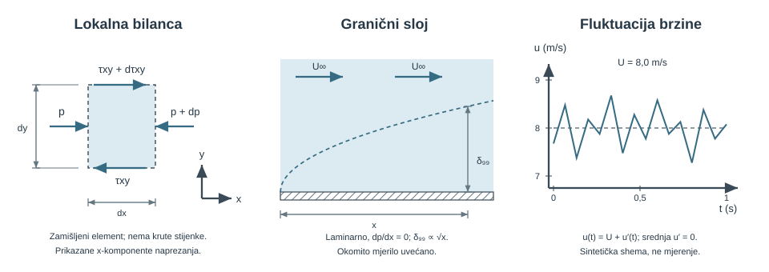

{#fig-realni-tok-pregled fig-align="center" fig-alt="Diferencijalni opis povezuje lokalnu bilancu količine gibanja, rast graničnog sloja i turbulentne fluktuacije."}

## Od bilance cijelog uređaja do polja u svakoj točki {#sec-realni-tok-motivacija}

Integralne bilance odgovaraju na pitanje kolika je ukupna sila, protok ili snaga sustava. Ne govore izravno gdje nastaje najveće naprezanje, kada se tok odvaja od stijenke ni kako se brzina mijenja unutar graničnog sloja. Za ta pitanja bilancu treba primijeniti na proizvoljno malen element fluida.

::: {.mf1-application}

Inženjerski kontekst

Isti diferencijalni model opisuje uljni film ležaja, razvoj profila u rashladnom kanalu, otpor trupa, odvajanje iza lopatice i polje brzine koje računa CFD solver. Razlika između analitičkog rješenja i simulacije nije u temeljnim zakonima: analitički račun uvodi snažne simetrije, a numerički alat iste lokalne bilance primjenjuje na mnogo ćelija [@schlichting2017; @pope2000].
:::

::: {.mf1-priprema}

Prije čitanja poglavlja

**Predznanje:** polje brzine, materijalna derivacija, Reynoldsov transportni teorem, količina gibanja, Newtonov konstitutivni zakon i bezdimenzioniranje.

**Ishodi učenja:**

- razlikovati lokalno i konvektivno ubrzanje;
- protumačiti svaki član Navier–Stokesove jednadžbe i navesti njezine pretpostavke;
- izvesti stacionarni laminarni tok između ploča i u kružnoj cijevi;
- procijeniti debljinu graničnog sloja, smično naprezanje i mogućnost odvajanja;
- razlikovati srednju brzinu, fluktuaciju, intenzitet turbulencije i Reynoldsovo naprezanje.

**Procijenjeno vrijeme rada uz udžbenik:** 10 sati.
:::

## Materijalna derivacija: ubrzanje čestice iz Eulerova polja {#sec-materijalna-derivacija}

Brzina je polje $\mathbf u(\mathbf x,t)$. Čestica koja se giba kroz to polje osjeća promjenu zbog vremena i zbog prelaska u područje druge brzine. Lančano pravilo daje

$$
\frac{D\mathbf u}{Dt}=
\underbrace{\frac{\partial\mathbf u}{\partial t}}_{\text{lokalno ubrzanje}}+
\underbrace{(\mathbf u\cdot\nabla)\mathbf u}_{\text{konvektivno ubrzanje}}.
$$ {#eq-materijalna-derivacija}

Stacionarno strujanje ima $\partial\mathbf u/\partial t=0$, ali čestica i dalje ubrzava u suženju, zavoju ili nejednolikom profilu. Njezina putanja poklapa se sa strujnicom samo kada se polje ne mijenja s vremenom.

::: {#ex-konvektivno-ubrzanje .mf1-we}

Riješeni primjer — Ubrzanje kroz mirno suženje T1

U jednodimenzijskom stacionarnom modelu brzina raste linearno, $u(x)=2+3x\ \text{m/s}$ za $x$ u metrima. U $x=0{,}50\ \text{m}$ vrijedi $u=3{,}5\ \text{m/s}$ i

$$
a_x=u\frac{du}{dx}=3{,}5\cdot3=10{,}5\ \text{m/s}^2.
$$ {#eq-realni-tok-rijeseni-primjer-ubrzanje-kroz-mirno-suzenje-t1-01}

**Provjera:** lokalni član je nula, ali konvektivni nije. Jedinice $(\text{m/s})(1/\text{s})$ daju $\text{m/s}^2$.
:::

## Lokalna bilanca mase i količine gibanja {#sec-navier-stokes}

Za kontinuum bez izvora mase lokalna bilanca mase jest

$$
\frac{\partial\rho}{\partial t}+\nabla\cdot(\rho\mathbf u)=0.
$$ {#eq-lokalna-kontinuitet}

Za nestlačiv fluid konstantne gustoće svodi se na $\nabla\cdot\mathbf u=0$.

Drugi Newtonov zakon za materijalni element glasi

$$
\rho\frac{D\mathbf u}{Dt}=\nabla\cdot\boldsymbol\sigma+\rho\mathbf b,
$$ {#eq-realni-tok-lokalna-bilanca-mase-i-kolicine-gibanja-sec-01}

gdje je $\boldsymbol\sigma=-p\mathbf I+\boldsymbol\tau$ ukupni tenzor naprezanja, a $\mathbf b$ sila po jedinici mase. Za Newtonski fluid konstantnih $\rho$ i $\mu$ s $\nabla\cdot\mathbf u=0$ vrijedi $\nabla\cdot\boldsymbol\tau=\mu\nabla^2\mathbf u$. Dobiva se

$$
\boxed{
\rho\left(\frac{\partial\mathbf u}{\partial t}+(\mathbf u\cdot\nabla)\mathbf u\right)
=-\nabla p+\mu\nabla^2\mathbf u+\rho\mathbf b
}.
$$ {#eq-navier-stokes-nestlacivi}

Članovi redom znače lokalnu i konvektivnu promjenu količine gibanja, tlačnu silu, viskoznu difuziju količine gibanja i volumensku silu. Konvektivni član nije sam po sebi „izvor turbulencije”; nelinearnost omogućuje međudjelovanje skala, dok nastanak i održanje turbulencije ovise o nestabilnostima, smičnom radu, geometriji i disipaciji.

::: {.mf1-granica-modela}

Pretpostavke prikazanog oblika

Jednadžba [-@eq-navier-stokes-nestlacivi] pretpostavlja Newtonski fluid, konstantnu viskoznost i gustoću te odsutnost dodatnih konstitutivnih učinaka. Nenewtonovski fluid ne zahtijeva novi zakon količine gibanja, nego drukčiju vezu $\boldsymbol\tau(\mathbf D)$.
:::

## Rubni uvjeti i fizikalno zatvaranje problema {#sec-rubni-uvjeti}

Jednadžbe bez rubnih i početnih uvjeta ne određuju jedinstveno polje. Na nepomičnoj nepropusnoj stijenci za viskozni tok vrijedi

$$
\mathbf u=\mathbf 0,
$$ {#eq-realni-tok-rubni-uvjeti-i-fizikalno-zatvaranje-problema-sec-01}

odnosno nema prolaza kroz stijenku i nema klizanja uz nju. Na slobodnoj površini treba zadati kinematički uvjet gibanja granice i ravnotežu normalnih i tangencijalnih naprezanja. Na ulazu se zadaje konzistentan profil ili protok, a na izlazu tlak ili uvjet dovoljno udaljen od poremećaja. Pogrešan rubni uvjet može dati uredne reziduale, ali pogrešno fizikalno rješenje.

## Kanonsko rješenje: tok između paralelnih ploča {#sec-couette-poiseuille}

Promatra se stacionarni, potpuno razvijeni, laminarni tok Newtonskog fluida između ploča na $y=0$ i $y=H$. Brzina je $\mathbf u=(u(y),0,0)$, gravitacija u smjeru toka zanemariva, a gradijent tlaka konstantan. Navier–Stokes se svodi na

$$
0=-\frac{dp}{dx}+\mu\frac{d^2u}{dy^2}.
$$ {#eq-realni-tok-kanonsko-rjesenje-tok-izme-u-paralelnih-ploca-01}

Dvostrukom integracijom i rubnim uvjetima $u(0)=0$, $u(H)=U$ dobiva se Couette–Poiseuilleov profil

$$
u(y)=\frac{U}{H}y+\frac{1}{2\mu}\frac{dp}{dx}(y^2-Hy).
$$ {#eq-couette-poiseuille}

Prvi član pokreće gornja ploča, drugi gradijent tlaka. Suprotstave li se ta dva pogona, u dijelu procjepa može nastati povratni tok.

::: {#ex-uljni-film .mf1-we}

Riješeni primjer — Uljni film s dva pogonska mehanizma T2

Za $H=1{,}0\ \text{mm}$, $U=2{,}0\ \text{m/s}$, $\mu=0{,}10\ \text{Pa s}$ i $dp/dx=-100\ \text{kPa/m}$ brzina u sredini procjepa iznosi

$$
u(H/2)=\frac{U}{2}+\frac{1}{2\mu}\frac{dp}{dx}\left(-\frac{H^2}{4}\right)
=1{,}0+0{,}125=1{,}125\ \text{m/s}.
$$ {#eq-realni-tok-rijeseni-primjer-uljni-film-s-dva-pogonska-01}

**Provjera predznaka:** negativan $dp/dx$ znači pad tlaka u pozitivnom $x$-smjeru i zato povećava brzinu. Model ne procjenjuje nosivost ležaja bez određivanja prostorne raspodjele tlaka.
:::

## Hagen–Poiseuilleov tok i linearni gubitak {#sec-hagen-poiseuille}

Za kružnu cijev polumjera $R$ isti postupak u cilindričnim koordinatama daje

$$
u(r)=-\frac{1}{4\mu}\frac{dp}{dx}(R^2-r^2),
$$ {#eq-realni-tok-hagen-poiseuilleov-tok-i-linearni-gubitak-sec-01}

$$
Q=-\frac{\pi R^4}{8\mu}\frac{dp}{dx},
\qquad
\Delta p=\frac{128\mu L}{\pi D^4}Q.
$$ {#eq-hagen-poiseuille}

Ovo je važan granični test cijelog modela gubitaka: pri laminarnom potpuno razvijenom toku pad tlaka raste **linearno** s $Q$. U Darcyjevu zapisu isti rezultat daje $\lambda=64/Re$; zato tvrdnja da su svi gubitci nužno proporcionalni $v^2$ nije točna.

::: {#ex-laminarni-mikrokanal .mf1-we}

Riješeni primjer — Pad tlaka u dijagnostičkom mikrokanalu T2

Voda pri $\mu=1{,}0\ \text{mPa s}$ teče kroz idealiziranu kružnu kapilaru $D=0{,}50\ \text{mm}$, $L=0{,}20\ \text{m}$, protokom $Q=0{,}30\ \text{mL/min}=5{,}0\cdot10^{-9}\ \text{m}^3/\text{s}$.

$$
\Delta p=\frac{128(10^{-3})(0{,}20)}{\pi(5\cdot10^{-4})^4}(5\cdot10^{-9})=652\ \text{Pa}.
$$ {#eq-realni-tok-rijeseni-primjer-pad-tlaka-u-dijagnostickom-mikr-01}

Srednja brzina je $0{,}0255\ \text{m/s}$ i $Re\approx12{,}7$, pa je laminarna pretpostavka konzistentna. Udvostručenje protoka udvostručuje $\Delta p$, a ne učetverostručuje ga.
:::

## Granični sloj, smično naprezanje i odvajanje {#sec-granicni-sloj}

Kada gotovo jednoliko strujanje naiđe na stijenku, no-slip uvjet stvara tanko područje velikoga gradijenta brzine. Izvan njega viskozni učinak može biti malen; unutar njega određuje smično naprezanje

$$
\tau_w=\mu\left.\frac{\partial u}{\partial y}\right|_w.
$$ {#eq-realni-tok-granicni-sloj-smicno-naprezanje-i-odvajanje-sec-01}

Za laminarnu ravnu ploču bez gradijenta tlaka Blasiusovo rješenje daje procjene

$$
\delta_{99}\approx\frac{5x}{\sqrt{Re_x}},
\qquad
C_{f,x}\approx\frac{0{,}664}{\sqrt{Re_x}},
\qquad Re_x=\frac{U_\infty x}{\nu}.
$$ {#eq-blasius-procjene}

To nisu univerzalne formule: vrijede za glatku ravnu plohu, približno nulti gradijent tlaka i laminarni sloj.

Nepovoljan gradijent tlaka, $dp/dx>0$ u smjeru toka, usporava fluid uz stijenku. Kad $\tau_w$ padne na nulu i potom promijeni znak, tok se odvaja. Odvajanje mijenja tlak i otpor mnogo više nego sama lokalna viskozna sila; zato geometrijski blaga promjena difuzora može odlučiti radi li uređaj učinkovito.

::: {#ex-granicni-sloj .mf1-we}

Riješeni primjer — Debljina sloja na oplati modela T2

Voda struji brzinom $U_\infty=1{,}5\ \text{m/s}$ uz glatku plohu. Za $x=0{,}40\ \text{m}$ i $\nu=1{,}0\cdot10^{-6}\ \text{m}^2/\text{s}$:

$$
Re_x=6{,}0\cdot10^5,
\qquad
\delta_{99}\approx\frac{5(0{,}40)}{\sqrt{6{,}0\cdot10^5}}=2{,}58\ \text{mm}.
$$ {#eq-realni-tok-rijeseni-primjer-debljina-sloja-na-oplati-modela-01}

Vrijednost je samo laminarna referenca; na tom $Re_x$ prijelaz može već ovisiti o hrapavosti, turbulenciji dotoka i gradijentu tlaka. **Provjera:** $\delta/x\approx0{,}0065\ll1$, što je konzistentno s aproksimacijom tankoga sloja.
:::

## Turbulentni tok: srednja vrijednost nije cijelo polje {#sec-turbulencija}

U turbulentnom toku trenutna brzina rastavlja se na vremenski srednju vrijednost i fluktuaciju,

$$
u_i(\mathbf x,t)=U_i(\mathbf x)+u_i'(\mathbf x,t),
\qquad \overline{u_i'}=0.
$$ {#eq-realni-tok-turbulentni-tok-srednja-vrijednost-nije-cijelo-p-01}

Intenzitet turbulencije za jednu komponentu može se izraziti kao

$$
I_u=\frac{u'_{rms}}{U},
\qquad
u'_{rms}=\sqrt{\overline{u'^2}}.
$$ {#eq-realni-tok-turbulentni-tok-srednja-vrijednost-nije-cijelo-p-02}

Usrednjavanje Navier–Stokesove jednadžbe uvodi Reynoldsova naprezanja $-\rho\overline{u_i'u_j'}$. Ona nisu nova molekularna naprezanja, nego tok srednje količine gibanja koji nose fluktuacije. Turbulencijski model zatvara te nepoznate korelacije; nije numerička zamjena za Darcyjev faktor trenja.

U zidu je korisna bezdimenzijska udaljenost

$$
y^+=\frac{u_\tau y}{\nu},\qquad u_\tau=\sqrt{\frac{\tau_w}{\rho}}.
$$ {#eq-realni-tok-turbulentni-tok-srednja-vrijednost-nije-cijelo-p-03}

Izbor prve ćelije i zidnog tretmana mora biti usklađen: izravno razrješavanje viskoznog podsloja i zidna funkcija ne traže isti $y^+$.

::: {#ex-intenzitet-turbulencije .mf1-we}

Riješeni primjer — Podatak anemometra, a ne etiketa režima T3

Senzor u ventilacijskom vodu daje srednju brzinu $U=8{,}0\ \text{m/s}$ i standardnu devijaciju uzdužne fluktuacije $u'_{rms}=0{,}48\ \text{m/s}$. Tada je

$$
I_u=0{,}48/8{,}0=0{,}060=6{,}0\%.
$$ {#eq-realni-tok-rijeseni-primjer-podatak-anemometra-a-ne-etiketa-01}

To je opis izmjerenog signala na određenom mjestu i u određenom frekvencijskom pojasu. Sam broj ne određuje je li profil potpuno razvijen niti koji turbulencijski model treba odabrati.
:::

## Veza s CFD-om: diskretizacija nije nova fizika {#sec-realni-tok-cfd}

Metoda konačnih volumena integrira lokalne bilance po ćelijama i pretvara tokove kroz plohe u algebraički sustav. Tri odvojena pitanja moraju ostati vidljiva:

1. **modelna pogreška** — jesu li jednadžbe, konstitutivni model i rubni uvjeti prikladni;
2. **numerička pogreška** — diskretizacija, iteracije, vremenski korak i mreža;
3. **validacijska razlika** — nesigurnost eksperimenta i razlika stvarnog sustava od modela.

Reziduali sami ne dokazuju točnost. Minimalni zapis uključuje bilancu mase, monitorirane integralne veličine i rezultat na najmanje tri sustavno pročišćene mreže [@nasa-cfd-vv; @asme-vv20-2009].

Za vježbu su u `data/cfd/` pripremljeni Poiseuilleov analitički slučaj, sintetički Venturi/difuzor i javni NASA TMR profilni skup. Prva dva sadrže puni nastavni trag reziduala, monitora, bilance i GCI-ja; treći namjerno pokazuje što se mora učiniti kada javna arhiva sadrži integralne rezultate i mjerenja, ali ne i povijest reziduala ni mjernu nesigurnost. Detaljan postupak i poveznice nalaze se u D04.

::: {.mf1-samoprovjera}

Provjeri sebe

1. Kako stacionarni tok može imati nenulto ubrzanje?
2. Koja pretpostavka omogućuje zapis $\mu\nabla^2\mathbf u$?
3. Zašto Hagen–Poiseuilleov rezultat mora biti test svakog općeg modela gubitaka?
4. Što fizički znači promjena znaka $\tau_w$?
5. Zašto mali rezidual nije dovoljan dokaz valjanosti CFD rješenja?

::: {.callout-note collapse="true"}
### Odgovori
Zbog konvektivnog ubrzanja. Potrebni su Newtonski fluid, konstantna viskoznost i nestlačivost. On daje točan laminarni granični slučaj $\Delta p\propto Q$. Promjena znaka označuje lokalni povratni tok i odvajanje. Rezidual mjeri zadovoljenje diskretiziranog sustava, ne prikladnost modela ni veličinu diskretizacijske pogreške.
:::
:::

## Zadaci za vježbu {#sec-realni-tok-zadaci}

::::: {.mf1-vjezbe-list}
1. [**T1**]{#task-materijalna-derivacija} Za $u(x,t)=2t+x^2$ odredi lokalno, konvektivno i ukupno ubrzanje u $x=1\ \text{m}$, $t=2\ \text{s}$ uz konzistentne SI jedinice koeficijenata.

   :::: {.content-visible .mf1-answer-online when-format="html"}
   ::: {.callout-tip collapse="true" data-answer-key="true"}
   ### Kontrolni rezultat

   $u=5\ \text{m/s}$, $a_{lok}=2$, $a_{kon}=10$, $a=12\ \text{m/s}^2$.
   :::
   ::::
2. [**T1**]{#task-viskozna-difuzija} Procijeni vrijeme viskozne difuzije $t_\nu\sim H^2/\nu$ kroz sloj vode $H=10\ \text{mm}$ pri $20\ ^\circ\text{C}$, za $\nu=1{,}00\cdot10^{-6}\ \text{m}^2/\text{s}$. Obrazloži red veličine.

   :::: {.content-visible .mf1-answer-online when-format="html"}
   ::: {.callout-tip collapse="true" data-answer-key="true"}
   ### Kontrolni rezultat

   $t_\nu\sim100\ \text{s}$.
   :::
   ::::
3. [**T2**]{#task-poiseuille-inverzni} U kapilari su izmjereni $Q=0{,}300\pm0{,}003\ \text{mL/min}$, $\Delta p=652\pm5\ \text{Pa}$, $L=0{,}200\pm0{,}001\ \text{m}$ i $D=0{,}500\pm0{,}005\ \text{mm}$. Fluid je Newtonski, gustoće $\rho=998\ \text{kg/m}^3$. Odredi dinamičku viskoznost i $Re$, a standardnu nesigurnost $u(\mu)$ procijeni neovisnom RSS-propagacijom. Posebno pokaži doprinos promjera, jer se u izrazu pojavljuje kao $D^4$.

   :::: {.content-visible .mf1-hint-online when-format="html"}
   ::: {.callout-note collapse="true" data-hint-key="true"}
   ### Naputak
   invertiraj $Q=\pi D^4\Delta p/(128\mu L)$. Za neovisne ulaze vrijedi $[u(\mu)/\mu]^2=[4u(D)/D]^2+[u(\Delta p)/\Delta p]^2+[u(L)/L]^2+[u(Q)/Q]^2$.
   :::
   ::::
   :::: {.content-visible .mf1-answer-online when-format="html"}
   ::: {.callout-tip collapse="true" data-answer-key="true"}
   ### Kontrolni rezultat

   $\mu\approx1{,}000\ \text{mPa s}$, $u(\mu)\approx0{,}042\ \text{mPa s}$ i $Re\approx12{,}7$. Sam promjer doprinosi relativnoj nesigurnosti od $4\,\%$, pa dominira zadanim mjernim budžetom.
   :::
   ::::

4. [**T2**]{#task-couette-povrat} Newtonski fluid viskoznosti $\mu=0{,}100\ \text{Pa s}$ nalazi se između nepomične donje i gornje ploče koja se giba brzinom $U=2{,}00\ \text{m/s}$; razmak je $H=1{,}00\ \text{mm}$. Za potpuno razvijeni profil $u(y)=Uy/H+[({dp}/{dx})/(2\mu)](y^2-Hy)$ odredi pozitivan gradijent tlaka pri kojem smično naprezanje na donjoj stijenci mijenja znak. Izračunaj to naprezanje pri $0{,}90$ i $1{,}10$ kritičnog gradijenta te skiciraj oba profila.

   :::: {.content-visible .mf1-hint-online when-format="html"}
   ::: {.callout-note collapse="true" data-hint-key="true"}
   ### Naputak
   deriviraj profil i postavi $\tau_0=\mu(du/dy)_{y=0}=0$; predznak gradijenta mora odgovarati nepovoljnom porastu tlaka u smjeru gibanja gornje ploče.
   :::
   ::::
   :::: {.content-visible .mf1-answer-online when-format="html"}
   ::: {.callout-tip collapse="true" data-answer-key="true"}
   ### Kontrolni rezultat

   $(dp/dx)_{krit}=4{,}00\cdot10^5\ \text{Pa/m}$; pri $0{,}90$ te vrijednosti $\tau_0=+20{,}0\ \text{Pa}$, a pri $1{,}10$ vrijedi $\tau_0=-20{,}0\ \text{Pa}$. Promjena predznaka zidnog naprezanja označuje početak lokalnog povratnog toka na donjoj stijenci.
   :::
   ::::

5. [**T3**]{#task-granicni-sloj-model} Voda pri $20\ ^\circ\text{C}$ ($\nu=1{,}00\cdot10^{-6}\ \text{m}^2/\text{s}$, $\rho=998\ \text{kg/m}^3$) struji uz nominalno ravnu plohu. U presjeku $x=0{,}400\ \text{m}$ izmjereno je $U_e=1{,}50\ \text{m/s}$ i $dU_e/dx=-0{,}250\ \text{s}^{-1}$, a ekvivalentna hrapavost iznosi $k_s=5{,}0\ \mu\text{m}$. Izračunaj $Re_x$, Blasiusovu procjenu $\delta_{99}\approx5x/\sqrt{Re_x}$, $k_s/\delta_{99}$ i bezdimenzijski pokazatelj promjene vanjske brzine $(x/U_e)dU_e/dx$. Odluči je li Blasiusov model ovdje opravdan i navedi koje su njegove pretpostavke prekršene; prijelaz nemoj proglasiti samo iz jednoga univerzalnog praga $Re_x$.

   :::: {.content-visible .mf1-hint-online when-format="html"}
   ::: {.callout-note collapse="true" data-hint-key="true"}
   ### Naputak
   Blasius zahtijeva glatku plohu, laminaran tok i praktično nulti gradijent tlaka odnosno stalnu $U_e$. Negativan $dU_e/dx$ odgovara nepovoljnom gradijentu tlaka; procijeni i njegovu važnost prije odluke.
   :::
   ::::
   :::: {.content-visible .mf1-answer-online when-format="html"}
   ::: {.callout-tip collapse="true" data-answer-key="true"}
   ### Kontrolni rezultat

   $Re_x=6{,}00\cdot10^5$, $\delta_{99}\approx2{,}58\ \text{mm}$, $k_s/\delta_{99}\approx1{,}94\cdot10^{-3}$ i $(x/U_e)dU_e/dx=-0{,}0667$. Hrapavost je mala prema procijenjenoj debljini, ali mjerljiva promjena $U_e$ krši pretpostavku nultoga gradijenta tlaka, a stanje laminarnosti pri tom $Re_x$ nije dokazano; Blasius zato nije opravdan bez dodatne provjere profila i prijelaza.
   :::
   ::::

6. [**T4**]{#task-cfd-tri-mreze} Za Poiseuilleov paket iz `data/cfd/poiseuille_laminar` tri mreže imaju omjer koraka $h/h_f=4,2,1$, protoke $Q=(8{,}16814;\ 7{,}93252;\ 7{,}87362)\cdot10^{-6}\ \text{m}^3/\text{s}$ i masene debalanse $(0{,}040;\ 0{,}010;\ 0{,}0025)\,\%$. Odredi opaženi red $p$, Richardsonovu ekstrapolaciju $Q_{ext}$ i fini $GCI$ uz faktor sigurnosti $F_s=1{,}25$. Zasebno izvijesti fini maseni debalans. Zatim u paketu `hydrofoil_experiment` provjeri postoje li reziduali, povijesti sila, masena bilanca i mjerna nesigurnost te obrazloži zašto se bez njih ne smije donijeti konačna validacijska presuda.

   :::: {.content-visible .mf1-hint-online when-format="html"}
   ::: {.callout-note collapse="true" data-hint-key="true"}
   ### Naputak
   za $r=2$ koristi $p=\ln[(Q_c-Q_m)/(Q_m-Q_f)]/\ln r$, zatim $Q_{ext}=Q_f+(Q_f-Q_m)/(r^p-1)$ i $GCI_f=F_s|(Q_f-Q_m)/Q_f|/(r^p-1)$.
   :::
   ::::
   :::: {.content-visible .mf1-answer-online when-format="html"}
   ::: {.callout-tip collapse="true" data-answer-key="true"}
   ### Kontrolni rezultat

   $p\approx2{,}000$, $Q_{ext}\approx7{,}85398\cdot10^{-6}\ \text{m}^3/\text{s}$, $GCI_f\approx0{,}312\,\%$ i fini maseni debalans iznosi $0{,}0025\,\%$. Arhiva profila ne sadrži reziduale, povijesti monitoriranih sila, masenu bilancu ni potpuni mjerni budžet nesigurnosti; zato je korisna za usporedbu integralnih koeficijenata i mrežnog trenda, ali ne zatvara validacijsku presudu.
   :::
   ::::
:::::

::: {.mf1-zavrsni-okvir}

Za ponijeti iz poglavlja

- Materijalna derivacija povezuje Eulerov opis polja s ubrzanjem čestice.
- Navier–Stokes je lokalna bilanca količine gibanja zatvorena konstitutivnim zakonom.
- Analitička rješenja nastaju iz jasno navedenih simetrija i rubnih uvjeta.
- Laminarni tok u cijevi daje $\Delta p\propto Q$ i zato je obvezan granični test.
- Granični sloj prenosi utjecaj no-slip uvjeta; nepovoljan gradijent tlaka može izazvati odvajanje.
- Turbulencijski model zatvara korelacije fluktuacija; numerička konvergencija i fizikalna validacija nisu isto.
:::

::: {.mf1-numerika}

Numerički pokus — profil, mreža i pogreška

Notebook `u12_poiseuille_konvergencija.ipynb` numerički integrira brzinski profil, uspoređuje ga s analitičkim protokom te na tri diskretizacije procjenjuje opaženu konvergenciju. Student prije računa predviđa znak pogreške, a poslije odvojeno izvještava modelnu i diskretizacijsku pogrešku.

<a class="mf1-interaktivno-veza" href="https://martibasic.github.io/MF1_udzbenik/jlite/lab/index.html?path=u12_poiseuille_konvergencija.ipynb">Pokreni u pregledniku</a>

:::
