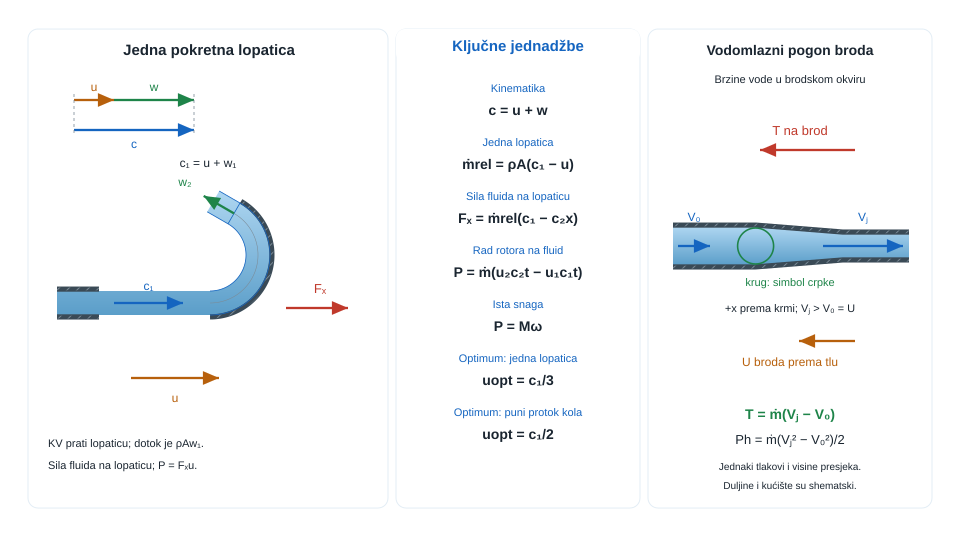{#fig-uvod-u12 fig-align="center"}

## Pokretne lopatice i potisak — račun u relativnom okviru

Količina gibanja je ovdje izravni ulaz u lopatice i mlazni potisak.

Naslov poglavlja vodi prema turbinama, vodilicama i potisku, ali temelj ostaje isti kao i u prethodnom poglavlju: jasan kontrolni volumen i ispravno pročitana promjena količine gibanja.

Na toj se osnovi zatim grade reakcija nosača, snaga na pokretnim lopaticama i mlazni potisak.

::: {.mf1-application}

Inženjerski kontekst

Pokretne lopatice i potisak nisu školski dodatak, nego jezgra rada Peltonova kola, vodomlaznog pogona, mlaznih čistača i svake ispitne glave koja skreće mlaz radi sile ili momenta. U strojarstvu i brodogradnji isti račun odlučuje koliko snage rotor stvarno prima, koliki potisak ostaje na nosaču i kako izbor izlaznog kuta mijenja korisni učinak stroja.
:::

::: {.mf1-priprema}

Prije čitanja poglavlja

**Predznanje koje se pretpostavlja:**

- zakon količine gibanja iz poglavlja pog. 11Količina gibanja i sile strujanja;
- pojam relativne i apsolutne brzine, vektor brzine i njegove komponente;
- kinematika kružnog gibanja, kutna i obodna brzina;
- pojam mehaničkog rada i snage u rotacijskom gibanju.

**Ishodi učenja:**

- razlikovati apsolutnu, relativnu i obodnu brzinu te ih ispravno kombinirati u trokutima brzina;
- izračunati silu i snagu koju fluid predaje pokretnoj lopatici;
- odrediti optimalnu obodnu brzinu za maksimalan korisni rad rotora;
- primijeniti istu logiku količine gibanja na potisak (vodomlazni pogoni, sustavi reakcijskog tipa).

**Procijenjeno vrijeme:** 6–7 sati za teoriju i izvode, 4 sata za rješavanje primjera i zadataka.
:::

## Fizikalni uvod i matematički izvod

Kad mlaz promijeni smjer ili iznos brzine, mora postojati sila koja je uzrokovala tu promjenu količine gibanja. U stacionarnom kontrolnom volumenu osnovni zapis je

$$\sum \vec{F} = \dot{m}(\vec{V}_{izl} - \vec{V}_{ul})$$

::: {.callout-note}
## Fizikalno značenje
Za pokretnu lopaticu ili vodilicu ovaj zakon kaže: koliko god brzo mlaz skrene ili uspori, sila koja je to napravila proporcionalna je masi fluida u sekundi i promjeni vektora brzine. Za Peltonov rotor to znači: kad se lopatica giba brzinom $u$, relativna brzina ulaza je $w_1 = c_1 - u$ — samo taj „ostatak" brzine struja na lopatici. Ako $u \to c_1/2$ (optimalna obodna brzina), relativni impuls pada na polovicu, ali sila radi na maksimalnom puta, pa je snaga maksimalna. To je fizikalni razlog zašto optimalna obodna brzina Peltonovog rotora nije ni nula ni jednaka brzini mlaza.
:::

To je najjači radni most prema svemu što kasnije dolazi u pog. 12Pokretne lopatice i potisak: nepomična vodilica, pokretna lopatica, moment na rotoru i mlazni potisak. Ako se u tom osnovnom obliku ne učvrste znakovi i smjerovi, kasniji zadaci vrlo brzo postaju samo algebra bez fizike.

## Matematički izvod

Za stacionarni tok kroz vodilicu ili lopaticu najprije se određuje maseni protok

$$
\dot m = \rho A v_n,
$$

gdje je $v_n$ komponenta brzine okomita na ulazni presjek. Za nepomičnu vodilicu ili lopaticu, uz zanemarive tlakne razlike prema atmosferi i uz zanemarivu težinu u promatranoj ravnini, zakon količine gibanja daje

$$
\vec F_{okoline\to fluid} = \dot m(\vec c_2 - \vec c_1).
$$

Najčešći lom zadatka nije račun površine ili protoka, nego znak: ta jednadžba najprije daje silu okoline na fluid. Tek suprotan predznak daje silu fluida na vodilicu i reakciju nosača,

$$
\vec F_{fluid\to vodilicu} = -\dot m(\vec c_2 - \vec c_1).
$$

U komponentnom zapisu odmah se vidi kako svaki izlazni zaokret ili pad brzine stvara novu reakciju po odgovarajućoj osi. Time ista jednadžba količine gibanja u pog. 12Pokretne lopatice i potisak počinje raditi dva posla odjednom: ako fluid izgubi tangencijalnu komponentu brzine, rotor ili lopatica primaju silu, moment i snagu; ako fluid dobije brzinu prema dolje ili unatrag, cijeli sustav prima potisak.

Za pokretnu lopaticu prvi korak nije sila nego razdvajanje apsolutne i relativne brzine. Ako mlaz dolazi apsolutnom brzinom $\vec c_1$, a lopatica se giba brzinom $\vec u$, relativni ulaz je

$$
\vec w_1 = \vec c_1 - \vec u, \qquad \dot m_{rel} = \rho A w_{1n}.
$$

Maseni protok kroz lopaticu zato se računa iz relativnoga dotoka, ali se promjena količine gibanja i dalje mora računati u apsolutnim brzinama fluida, pa vrijedi

$$
\vec F_{okoline\to fluid} = \dot m_{rel}(\vec c_2 - \vec c_1),
\qquad
\vec F_{fluid\to lopaticu} = -\vec F_{okoline\to fluid}.
$$

::: {.callout-note}
## Razrada koraka
Korak: od relativne brzine ($\vec{w}$) → apsolutna sila na pokretnu lopaticu

**1. Relativni ulaz:** Lopatica se giba brzinom $u$, pa mlaz „vidi" lopaticu s relativnom brzinom $w_1 = c_1 - u$ (u 1D slučaju u smjeru mlaza). Maseni protok koji zaista prolazi kroz lopaticu:
$$\dot{m} = \rho A w_1.$$

**2. Relativni izlaz:** Na lopatici brzina prelazi lom kuta $\beta_2$. U relativnom okviru izlazna brzina je $w_2 = w_1$ (bez gubitaka). U apsolutnom okviru:
$$c_{2x} = u + w_2\cos\beta_2, \qquad c_{2y} = w_2\sin\beta_2.$$

**3. Promjena količine gibanja** (u apsolutnom okviru):
$$F_x = \dot{m}(c_{2x} - c_1) = \dot{m}(u + w_1\cos\beta_2 - c_1) = \dot{m} w_1(\cos\beta_2 - 1).$$

**4. Snaga na lopatici:**
$$P = F_x \cdot (-u) = \dot{m} w_1 u(1 - \cos\beta_2).$$

Za $\beta_2 = 180°$ (idealni U-lom): $P_{max} = 2\dot{m}w_1 u = 2\rho A(c_1-u)^2 u$, maksimum za $u = c_1/3$ za jednu lopaticu ili $u = c_1/2$ za mnogo lopatica.
:::

::: {.mf1-izvod}

Matematički izvod — Optimum obodne brzine za jednu lopaticu i za kolo

Razlikuju se dva pedagoški važna granična slučaja koja daju različite optimalne obodne brzine, ovisno o tome kako se računa maseni protok kroz lopaticu.

**Slučaj 1: Jedna lopatica koja bježi pred mlazom**

Pri pojedinačnoj lopatici koja se giba u smjeru mlaza, mlaz mora "stići" lopaticu prije nego što na nju djeluje. Maseni protok koji efektivno djeluje na lopaticu je relativni protok

$$
\dot m = \rho A (c_1 - u),
$$

pa se sila i snaga zapisuju kao

$$
F = \dot m\,(c_1 - u)(1 - \cos\beta_2) = \rho A (c_1 - u)^2 (1 - \cos\beta_2),
$$

$$
P = F\,u = \rho A (1 - \cos\beta_2)(c_1 - u)^2 u.
$$

Uvjet maksimuma snage je $dP/du = 0$. Deriviranjem se dobiva

$$
\frac{dP}{du} = \rho A (1 - \cos\beta_2)\Bigl[(c_1 - u)^2 - 2(c_1 - u)u\Bigr] = \rho A (1 - \cos\beta_2)(c_1 - u)(c_1 - 3u).
$$

Netrivijalno rješenje ($c_1 - u \ne 0$) daje **$u_{opt} = c_1/3$**.

**Slučaj 2: Kolo s mnogo lopatica (Peltonov rotor)**

Pri rotoru s velikim brojem lopatica mlaz uvijek nalazi sljedeću lopaticu, pa cijeli protok kroz sapnicu sudjeluje u izmjeni količine gibanja:

$$
\dot m = \rho A c_1.
$$

Sila na lopaticu i snaga predani rotoru su tada

$$
F = \dot m\,(c_1 - u)(1 - \cos\beta_2) = \rho A c_1 (c_1 - u)(1 - \cos\beta_2),
$$

$$
P = F\,u = \rho A c_1 (1 - \cos\beta_2)(c_1 - u)\,u.
$$

Uvjet $dP/du = 0$ daje

$$
\frac{dP}{du} = \rho A c_1 (1 - \cos\beta_2)\bigl[(c_1 - u) - u\bigr] = \rho A c_1 (1 - \cos\beta_2)(c_1 - 2u) = 0,
$$

odakle slijedi **$u_{opt} = c_1/2$**.

**Fizikalna interpretacija razlike:**

Ključna razlika između dvaju slučajeva leži u tome koji maseni protok ulazi u proračun:

- Pri pojedinačnoj lopatici, $\dot m$ samo ovisi o $(c_1 - u)$, što daje kvadratnu ovisnost sile o relativnoj brzini. Optimum je niži ($u_{opt} = c_1/3$) jer veće $u$ smanjuje maseni protok.
- Pri kolu s mnogo lopatica $\dot m$ je konstantan, pa sila linearno opada s $(c_1 - u)$. Optimum je viši ($u_{opt} = c_1/2$) — klasičan rezultat za Peltonove turbine.

U oba slučaja idealni izlazni kut je $\beta_2 = 180^\circ$, što daje faktor $(1 - \cos\beta_2) = 2$. U realnim Peltonovim turbinama izlazni kut je nešto manji ($\beta_2 \approx 165^\circ$) kako bi se mlaz koji izlazi iz prethodne lopatice udaljio od sljedeće, a faktor pada na $(1 - \cos 165^\circ) \approx 1{,}97$ — gubitak je svega oko $1{,}5\%$.
:::

Kad je zanimljiv mehanički izlaz stroja, ključna više nije bilo koja komponenta sile nego tangencijalna komponenta, jer upravo ona radi na brzini oboda:

$$
P = F_t u = M\omega
$$

::: {.callout-note}
## Fizikalno značenje
Snaga $P = F_t u$ kaže da rotor prima rad samo od tangencijalne sile, a ta sila postoji jedino ako fluid mijenja tangencijalnu komponentu brzine. Radijalna promjena brzine mijenja opterećenje ležajeva, ali ne i snagu. Aksijalna promjena (usisni-tlačni stupanj) mijenja aksijalne sile, ali tangencijalna komponenta je jedina koja „gura" rotor u smjeru vrtnje. Zato je svaki kut lopatice — ulazni i izlazni — izravno uvjet za korisni učinak, ne samo geometrijska detalj.
:::

Kad se ulaz i izlaz rotora čitaju na različitim radijusima $r_1$ i $r_2$, više nije dovoljno gledati silu — treba krenuti od **momenta količine gibanja**, što vodi na klasičnu Eulerovu turbinsku jednadžbu.

::: {.mf1-izvod}

Matematički izvod — Eulerova turbinska jednadžba iz momenta količine gibanja

Polazi se od integralnog oblika momenta količine gibanja za stacionarni kontrolni volumen koji obuhvaća rotor:

$$
\sum \vec M = \int_{KP} \rho\,(\vec r \times \vec c)\,(\vec c\cdot\vec n)\,dA,
$$

gdje je $\vec r$ vektor položaja točke na kontrolnoj plohi od osi rotacije, a $\vec c$ apsolutna brzina fluida u toj točki.

Za rotor s jednim ulaznim presjekom na polumjeru $r_1$ i jednim izlaznim presjekom na polumjeru $r_2$, s jednolikom raspodjelom brzine u svakom presjeku, integral se svodi na razliku doprinosa izlaza i ulaza:

$$
\vec M = \dot m\,(\vec r_2 \times \vec c_2) - \dot m\,(\vec r_1 \times \vec c_1).
$$

Komponenta momenta oko osi vrtnje rotora čita se iz vektorskog produkta: na zadanom radijusu $r$ doprinos momentu daje samo tangencijalna komponenta brzine $c_t$ jer ona jedina ima krak $r$ oko osi (radijalna komponenta prolazi kroz os, a aksijalna je paralelna s osi). Zato je iznos osnog momenta

$$
M = \dot m\,(r_2 c_{2t} - r_1 c_{1t}).
$$

To je **Eulerova turbinska jednadžba** — temeljna jednadžba turbostrojarstva koja vrijedi za sve rotorske strojeve (pumpe, ventilatore, turbine, kompresore).

Snaga predana ili odveden rotoru dobiva se množenjem s kutnom brzinom $\omega$:

$$
P = M\omega = \dot m\,(u_2 c_{2t} - u_1 c_{1t}),
$$

gdje je $u_1 = \omega r_1$ obodna brzina ulaza, a $u_2 = \omega r_2$ obodna brzina izlaza. Za Peltonov rotor, gdje su mlaz i lopatica u istoj horizontalnoj ravnini ($r_1 = r_2 = r$, $u_1 = u_2 = u$), jednadžba se svodi na

$$
P = \dot m\,u\,(c_{1t} - c_{2t}),
$$

što je upravo izraz koji se ranije dobio za sile na pokretnoj lopatici — sad u jeziku komponenti brzine umjesto izlaznog kuta.
:::

Iz Eulerove jednadžbe odmah se vidi da korisni rad ne daje bilo koja komponenta brzine, nego promjena tangencijalne količine gibanja — to je razlog zašto su ulazni i izlazni kutovi lopatica središnji projektni parametri svake turbomashine.

::: {.callout-note collapse="true" icon="false"}
## Numerički trag

Moment količine gibanja na rotoru i razdvajanje apsolutne i relativne brzine ($\vec{c} = \vec{w} + \vec{u}$) jezgra je **rotacijskog CFD-a** za pumpe, ventilatore, kompresore i turbine. **MRF metoda** (Multiple Reference Frame) rješava Navier-Stokesa u rotirajućem sustavu — gleda fluid očima lopatice, jednako kao u izvodu u ovom poglavlju — i dodaje Coriolisovu i centrifugalnu silu kao izvorne članove. Za nestacionarne fenomene (interakcija rotor-stator, pulsacije) koristi se **klizajuća mreža (engl. sliding mesh)**: rotorska mreža fizički kliže uz statorsku.
:::

::: {.mf1-interaktivno}

Interaktivni prikaz — Trokuti brzina i snaga na Peltonovoj lopatici

Interaktivni prikaz omogućuje mijenjanje apsolutne brzine mlaza, obodne brzine lopatice i izlaznog kuta uz neposredno praćenje trokuta brzina i krivulje snage. Optimalna obodna brzina i pripadna maksimalna snaga jasno se očituju na grafu.

**Pitanja za samostalno istraživanje:** (a) Zašto maksimalna snaga pada točno na $u = c_1/2$ neovisno o izlaznom kutu? (b) Kakva je teorijska maksimalna snaga pri $\beta_2 = 180°$ i zašto stvarne lopatice imaju $\beta_2 \approx 165°$? (c) Pri $u = 0$, kolika je snaga predana rotoru iako sila postoji?

:::

Kod potiska se priča obrće. Ako vozilo ili platforma izbacuje mlaz dok je ulazna brzina okolnog fluida u smjeru potiska mala ili zanemariva, iz jednadžbe količine gibanja slijedi

$$
F_p = \dot m(v_{izl} - v_{ul}) \approx \dot m v = \rho A v^2.
$$

Za propelere i rotore koji stoje u mjestu i ubrzavaju okolni fluid (helikopter u visi, dron koji lebdi, vodomlaznik na propeleru) koristi se nešto profinjeniji model — teorija aktuatorskog diska — koja vodi na izvod brzine kroz rotor pri zadanom potisku.

::: {.mf1-izvod}

Matematički izvod — Aktuatorski disk i Froudeov teorem

Promatra se idealizirani rotor (propeler, dron, helikopter) kao tanki disk površine $A$ kroz koji fluid ulazi mirno iz okoline i izlazi ubrzano u traku. Modelu se postavljaju četiri presjeka:

- presjek $\infty$ (daleko ispred diska): brzina $v_\infty$, atmosferski tlak $p_\infty$;
- presjek tik ispred diska: brzina $v_d$, tlak $p_d^-$;
- presjek tik iza diska: brzina $v_d$ (kontinuitet zahtjeva istu brzinu kroz disk), tlak $p_d^+ > p_d^-$;
- presjek $w$ (u dalekoj traci, gdje se tlak vraća na atmosferski): brzina $v_w$, tlak $p_\infty$.

Maseni protok kroz strujnu cijev je konstantan: $\dot m = \rho A v_d$.

**Zakon količine gibanja** za cijelu strujnu cijev daje potisak

$$
F_p = \dot m\,(v_w - v_\infty) = \rho A v_d (v_w - v_\infty).
$$

**Bernoullijeva jednadžba** primijenjena dva puta — ispred diska (od $\infty$ do $d^-$) i iza diska (od $d^+$ do $w$, jer disk je jedino mjesto gdje se predaje energija pa Bernoulli vrijedi posebno u svakoj poludomeni) — daje

$$
p_\infty + \tfrac{1}{2}\rho v_\infty^2 = p_d^- + \tfrac{1}{2}\rho v_d^2,
$$

$$
p_d^+ + \tfrac{1}{2}\rho v_d^2 = p_\infty + \tfrac{1}{2}\rho v_w^2.
$$

Oduzimanjem prve jednadžbe od druge dobiva se tlačni skok preko diska

$$
\Delta p_d = p_d^+ - p_d^- = \tfrac{1}{2}\rho (v_w^2 - v_\infty^2).
$$

Potisak se može alternativno izračunati i kao tlačna sila na disku:

$$
F_p = \Delta p_d \cdot A = \tfrac{1}{2}\rho A (v_w^2 - v_\infty^2).
$$

Izjednačavanjem dvaju izraza za $F_p$ (preko količine gibanja i preko tlaka) dobiva se **Froudeov teorem**:

$$
\rho A v_d (v_w - v_\infty) = \tfrac{1}{2}\rho A (v_w - v_\infty)(v_w + v_\infty),
$$

odakle nakon kraćenja s $\rho A (v_w - v_\infty)$ slijedi

$$
\boxed{v_d = \tfrac{1}{2}(v_\infty + v_w)},
$$

što znači da je brzina kroz disk **aritmetička sredina** brzine ispred diska i u dalekoj traci.

**Lebdeći režim** ($v_\infty = 0$) — dron u visi, helikopter na mjestu, statički test propelera — daje $v_d = v_w/2$, pa potisak postaje

$$
F_p = \rho A v_d \cdot v_w = \rho A v_d \cdot 2 v_d = 2\rho A v_d^2.
$$

Iz toga slijedi i izravna formula koja se koristi u praksi:

$$
v_d = \sqrt{\frac{F_p}{2\rho A}}.
$$

Ova relacija pokazuje da je potrebna brzina kroz rotor proporcionalna $\sqrt{F_p/A}$ — udvostručenje potiska zahtijeva $\sqrt{2}$ puta veću brzinu, što je razlog zašto se učinkovitost helikoptera povećava povećanjem promjera rotora (manja brzina za istu silu manje gubi energiju u traci).
:::

Isti zakon zato vodi i Peltonov rotor i potisni sustav: u prvom slučaju fluid gubi korisnu tangencijalnu količinu gibanja i stroj prima rad, a u drugom slučaju fluid dobiva izlazni impuls i platforma prima uzgon ili pogon. Nova fizika nije u drugoj formuli, nego u tome tko preuzima reakciju i u kojem se referentnom okviru čita tok.

To je pravi strojarski smisao pog. 12Pokretne lopatice i potisak. Na Peltonovu kolu loš odabir obodne brzine odmah smanjuje moment i snagu generatora. Na vodilici ili ispitnoj glavi pogrešno pročitan izlazni vektor znači pogrešnu reakciju nosača. Na vodomlaznome pogonu, mlaznoj platformi ili servisnoj mlaznici za hidrodinamsko čišćenje ista matematika pokazuje hoće li sustav ostati na mjestu, ubrzati ili ostati bez rezerve potiska.

## Riješeni primjeri

::: {.mf1-we}

Riješeni primjer — Vodilica mlaza na ispitnom stolu&nbsp;T2

**Kontekst:** Na hidrauličkom ispitnom stolu nepomična vodilica skreće pravokutni mlaz vode u horizontalnoj ravnini za određeni kut, pri čemu se brzina zbog gubitaka smanjuje. Iz promjene količine gibanja određuje se reakcijska sila na nosač vodilice, što je tipičan ulazni primjer za analizu sila na lopaticama.

**Zadano**

- Širina pravokutne sapnice: $b = 36\ \text{mm}$
- Visina pravokutne sapnice: $h = 14\ \text{mm}$
- Brzina mlaza na ulazu u vodilicu: $v_1 = 24\ \text{m/s}$
- Kut skretanja u horizontalnoj ravnini: $\beta = 120^\circ$
- Izlazna brzina mlaza (s gubicima): $v_2 = 19\ \text{m/s}$
- Gustoća vode: $\rho = 998\ \text{kg/m}^3$

**Traženo**

1. Odredite maseni protok vode kroz sapnicu.
2. Odredite horizontalne komponente sile koju fluid vrši na vodilicu.
3. Odredite iznos i smjer reakcije koju mora preuzeti nosač vodilice.

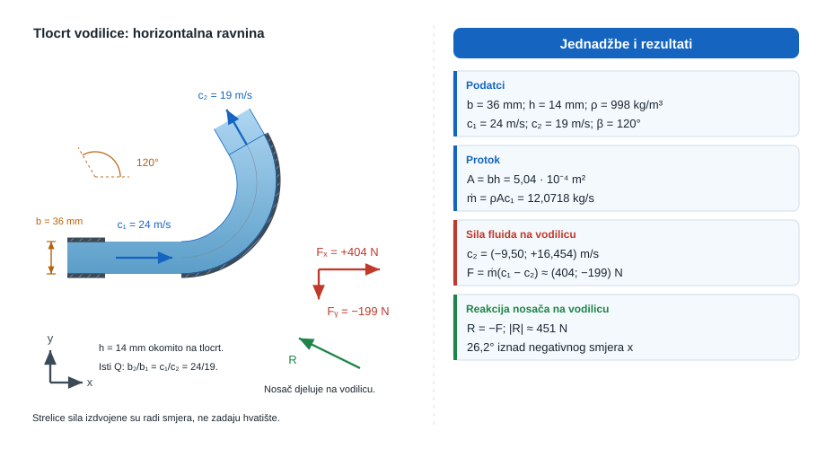

**Pretpostavke i model**

Promatra se stacionarni kontrolni volumen oko vodilice u horizontalnoj ravnini. Tlak na ulazu i izlazu jednak je atmosferskom, a težina vode unutar vodilice zanemariva je u odnosu na horizontalne sile.

**Rješenje**

Površina pravokutnog izlaza sapnice iznosi

$$
A = bh = 0{,}036 \cdot 0{,}014 = 5{,}04 \cdot 10^{-4}\ \text{m}^2,
$$

pa je maseni protok

$$
\dot{m} = \rho A v_1 = 998 \cdot 5{,}04 \cdot 10^{-4} \cdot 24 \approx 12{,}07\ \text{kg/s}.
$$

Ulazna brzina je $\vec{v}_1 = (24, 0)\ \text{m/s}$, a izlazna

$$
\vec{v}_2 = (19\cos 120^\circ, 19\sin 120^\circ) = (-9{,}5, 16{,}45)\ \text{m/s}.
$$

Sila vodilice na fluid zato glasi

$$
\vec{F}_{v\to f} = \dot{m}(\vec{v}_2 - \vec{v}_1) = (-404{,}4, 198{,}6)\ \text{N},
$$

ali zadatak traži silu fluida na vodilicu, pa treba promijeniti predznak:

$$
\vec{F}_{f\to v} = (404{,}4, -198{,}6)\ \text{N} \implies F_x \approx 404\ \text{N},\ F_y \approx -199\ \text{N}.
$$

Reakcija nosača mora biti jednaka po iznosu i suprotna po smjeru, $\vec{R} = (-404{,}4, 198{,}6)\ \text{N}$, pa je njezin iznos

$$
R = \sqrt{404{,}4^2 + 198{,}6^2} \approx 450{,}6\ \text{N} \approx 451\ \text{N}.
$$

Kut reakcije iznad negativnog smjera osi $x$ iznosi

$$
\alpha = \arctan\left(\frac{198{,}6}{404{,}4}\right) = 26{,}2^\circ.
$$

**Provjera i komentar**

1. Maseni protok reda desetak kilograma u sekundi razuman je za ovakav presjek i brzinu mlaza.
2. Komponenta po osi $x$ mora biti dominantna jer ulazna projekcija brzine po toj osi znatno nadmašuje izlaznu.
3. Reakcija reda nekoliko stotina njutna razumna je za mlaz brzine reda dvadesetak metara u sekundi.
:::

::: {.mf1-we}

Riješeni primjer — Uklještena zakrivljena lopatica&nbsp;T2

**Kontekst:** Zakrivljena lopatica uklještena na konstrukciju skreće slobodni mlaz vode pod određenim kutom, a uklještenje istovremeno preuzima i silu i moment savijanja. Odredbom komponenti reakcije i momenta u točki uklještenja dimenzioniraju se vijčani spoj i nosač lopatice.

**Zadano**

- Gustoća vode: $\rho = 998\ \text{kg/m}^3$
- Volumenski protok mlaza: $Q = 15\ \text{l/s}$
- Brzina mlaza (isti iznos na ulazu i izlazu): $v = 12{,}5\ \text{m/s}$
- Krak ulaznog mlaza ispod točke $O$: $h = 0{,}45\ \text{m}$
- Vodoravna udaljenost sjecišta izlazne osi od uklještenja: $l = 0{,}70\ \text{m}$
- Kut izlaznog smjera s negativnim smjerom osi $x$: $\alpha = 60^\circ$

**Traženo**

1. Odredite promjer mlaza $d$.
2. Odredite komponente reakcije $R_x$ i $R_y$ u uklještenju.
3. Odredite moment reakcije $M_O$ u točki $O$ i navedite njegov smjer.

Pretpostavite jednolike profile brzine po presjecima, neviskozno strujanje i isti iznos brzine na ulazu i izlazu iz lopatice.

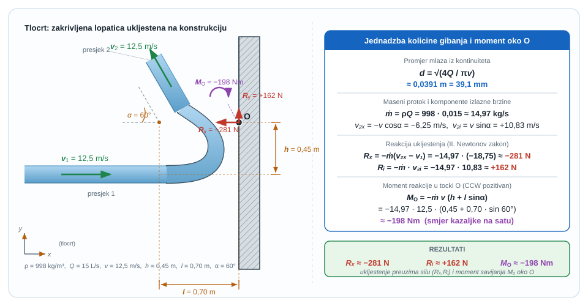

**Pretpostavke i model**

Mlaz ulazi i izlazi pri atmosferskom tlaku, pa su u ravninskoj jednadžbi količine gibanja dominantni članovi upravo promjena vektora brzine i reakcija uklještenja. Za moment oko $O$ koriste se momenti impulsnih funkcija ulaznog i izlaznog mlaza.

**Rješenje**

Najprije iz kontinuiteta $Q = \tfrac{\pi d^2}{4} v$ dobijemo promjer mlaza:

$$
d = \sqrt{\frac{4Q}{\pi v}} = \sqrt{\frac{4 \cdot 0{,}015}{\pi \cdot 12{,}5}} \approx 0{,}0391\ \text{m} = 39{,}1\ \text{mm}.
$$

Maseni protok iznosi

$$
\dot{m} = \rho Q = 998 \cdot 0{,}015 = 14{,}97\ \text{kg/s}.
$$

Ulazna brzina je $\vec{v}_1 = (12{,}5, 0)\ \text{m/s}$, a izlazna

$$
\vec{v}_2 = (-v\cos \alpha, v\sin \alpha) = (-6{,}25, 10{,}83)\ \text{m/s}.
$$

Sila lopatice na fluid glasi

$$
\vec{F}_{l \to f} = \dot{m}(\vec{v}_2 - \vec{v}_1) = 14{,}97(-18{,}75, 10{,}83) = (-280{,}7, 162{,}1)\ \text{N}.
$$

Fluid na lopaticu djeluje silom suprotnog smjera, a uklještenje mora preuzeti reakciju jednaku po iznosu i suprotnu sili fluida na lopaticu. Zato su komponente reakcije u $O$

$$
R_x = -280{,}7\ \text{N} \approx -281\ \text{N},\qquad R_y = 162{,}1\ \text{N} \approx 162\ \text{N}.
$$

Za moment oko točke $O$ ulazni mlaz daje momentni krak $h$, a izlazni mlaz doprinos $l\sin \alpha$. Ako je pozitivan smjer momenta suprotan smjeru kazaljke na satu, reakcijski moment uklještenja iznosi

$$
M_O = -\dot{m} v (h + l\sin \alpha) = -14{,}97 \cdot 12{,}5 \cdot (0{,}45 + 0{,}70 \sin 60^\circ) \approx -198\ \text{Nm},
$$

što znači da uklještenje mora preuzeti moment u smjeru kazaljke na satu.

**Provjera i komentar**

1. Promjer mlaza reda $40\ \text{mm}$ razuman je za protok $15\ \text{l/s}$ i brzinu oko $12{,}5\ \text{m/s}$.
2. Komponenta $R_x$ mora biti dominantna jer se vodoravna komponenta brzine mijenja s pozitivne na negativnu.
3. Moment mora biti u smjeru kazaljke na satu jer i ulazna i izlazna impulsna funkcija opterećuju uklještenje s lijeve strane točke $O$.
:::

::: {.mf1-we}

Riješeni primjer — Relativni dotok na pokretnu lopaticu&nbsp;T1

**Kontekst:** Kada se lopatica giba u smjeru mlaza, kroz njezin pokretni kontrolni volumen ulazi samo relativni protok određen razlikom brzina mlaza i lopatice. Ovaj uvodni primjer pokazuje koliko se taj efektivni protok razlikuje od punog sapničkog protoka, što je osnovna postavka za rad svake turbine s djelomično zahvaćenim mlazom.

**Zadano**

- Gustoća vode: $\rho = 998\ \text{kg/m}^3$
- Promjer sapnice: $d = 38\ \text{mm}$
- Apsolutna brzina mlaza na izlazu iz sapnice: $c_1 = 22\ \text{m/s}$
- Brzina lopatice (u istom smjeru): $u = 8\ \text{m/s}$
- Lopatica zahvaća cijeli mlaz.

**Traženo**

1. Odrediti relativnu ulaznu brzinu $w_1$.
2. Odrediti relativni maseni protok $\dot m_{rel}$ kroz pokretni kontrolni volumen.
3. Usporediti taj relativni protok s punim masenim protokom sapnice.

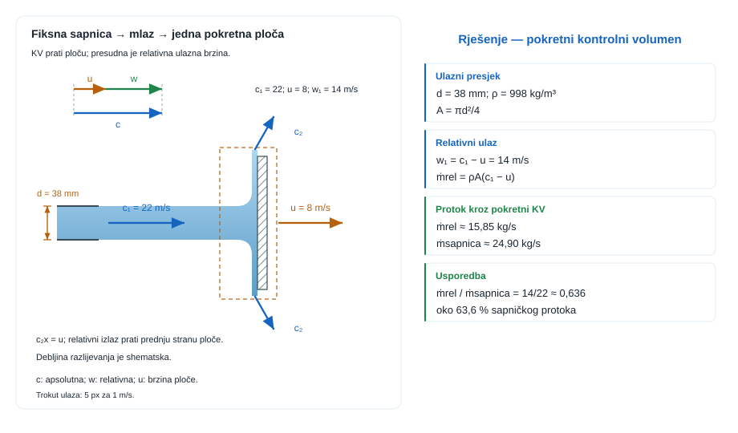{#fig-u12-relativni-dotok-lopatica fig-align="center"}

**Pretpostavke i model**

Za pokretnu lopaticu ulazni presjek treba čitati u sustavu koji se giba s lopaticom. Zato mlaz ne ulazi relativnom brzinom $c_1$, nego razlikom $w_1 = c_1-u$. Tek taj relativni dotok određuje koliko mase stvarno ulazi u pokretni kontrolni volumen.

**Rješenje**

Površina sapnice iznosi

$$
A = \frac{\pi d^2}{4} = \frac{\pi \cdot 0{,}038^2}{4} = 1{,}134 \cdot 10^{-3}\ \text{m}^2.
$$

Relativna ulazna brzina prema lopatici je

$$
w_1 = c_1-u = 22-8 = 14\ \text{m/s}.
$$

Zato relativni maseni protok iznosi

$$
\dot m_{rel} = \rho A w_1 = 998 \cdot 1{,}134 \cdot 10^{-3} \cdot 14 = 15{,}85\ \text{kg/s}.
$$

Puni maseni protok sapnice bio bi

$$
\dot m = \rho A c_1 = 998 \cdot 1{,}134 \cdot 10^{-3} \cdot 22 = 24{,}90\ \text{kg/s}.
$$

Dakle, kroz pokretni kontrolni volumen stvarno ulazi samo

$$
\frac{\dot m_{rel}}{\dot m} = \frac{15{,}85}{24{,}90} = 0{,}637
$$

odnosno oko $63{,}7\%$ punog sapničkog protoka.

**Provjera i komentar**

1. Ako bi lopatica mirovala, moralo bi biti $w_1 = c_1$.
2. Kako se lopatica giba u istom smjeru kao mlaz, relativni protok mora biti manji od punog sapničkog protoka.
3. Kad bi bilo $u \to c_1$, relativni bi dotok težio nuli.
:::

::: {.mf1-we}

Riješeni primjer — Pokretna ravna lopatica u mlazu&nbsp;T2

**Kontekst:** Ravna pokretna lopatica koja se giba u smjeru mlaza prima samo dio impulsa fluida i time crpi snagu iz mlaza. Iz relativnog dotoka i promjene apsolutne brzine određuju se sila i snaga koje lopatica predaje nosaču, što je didaktička priprema za rotorne lopatice.

**Zadano**

- Gustoća vode: $\rho = 998\ \text{kg/m}^3$
- Promjer sapnice: $d = 40\ \text{mm}$
- Apsolutna brzina mlaza: $c_1 = 24\ \text{m/s}$
- Brzina lopatice (u istom smjeru kao mlaz): $u = 9\ \text{m/s}$
- Lopatica zahvaća cijeli mlaz; nakon udara voda u apsolutnom sustavu napušta lopaticu s vodoravnom brzinom jednakom $u$; gubici zanemarivi.

**Traženo**

1. maseni protok koji stvarno ulazi u pokretni kontrolni volumen.
2. silu mlaza na lopaticu.
3. snagu koju mlaz predaje lopatici.

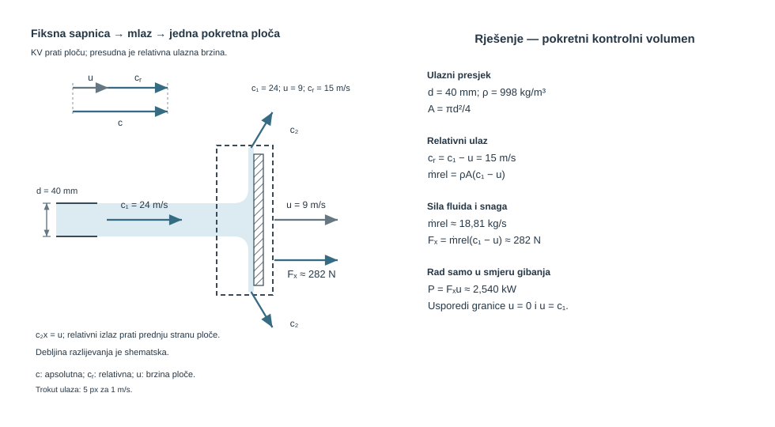

**Pretpostavke i model**

Za pokretni element presudan je relativni dotok $c_1-u$. Zato se kroz lopaticu ne vodi puni maseni protok sapnice, nego samo onaj koji u pokretnom sustavu stvarno presiječa kontrolnu površinu. Promjena količine gibanja po osi $x$ zato se zatvara upravo tim relativnim protokom.

**Rješenje**

Površina mlaza iznosi

$$
A = \frac{\pi d^2}{4} = \frac{\pi \cdot 0{,}04^2}{4} = 1{,}257 \cdot 10^{-3}\ \text{m}^2.
$$

Relativna ulazna brzina prema lopatici je $c_r = c_1-u = 24-9 = 15\ \text{m/s}$, pa je maseni protok koji stvarno ulazi u pokretni kontrolni volumen

$$
\dot{m}_{rel} = \rho A c_r = 998 \cdot 1{,}257 \cdot 10^{-3} \cdot 15 \approx 18{,}82\ \text{kg/s}.
$$

Kako voda nakon udara u apsolutnom sustavu odlazi s vodoravnom brzinom $u$, promjena vodoravne komponente brzine iznosi $c_1-u = 15\ \text{m/s}$, pa sila lopatice na fluid glasi

$$
F_{l\to f} = \dot{m}_{rel}(u-c_1) = 18{,}82 \cdot (9-24) = -282{,}3\ \text{N}.
$$

Zato fluid na lopaticu djeluje silom suprotnog smjera, pa je traženi iznos sile $F = 282{,}3\ \text{N} \approx 282\ \text{N}$. Snaga predana lopatici iznosi

$$
P = Fu = 282{,}3 \cdot 9 \approx 2541\ \text{W} = 2{,}54\ \text{kW}.
$$

**Provjera i komentar**

1. Ako bi lopatica mirovala, sila bi morala biti veća nego u ovom slučaju jer bi relativni dotok bio veći.
2. Ako bi se lopatica gibala brzinom jednakom brzini mlaza, relativni dotok pao bi na nulu i nestala bi i sila.
3. Snaga mora biti reda nekoliko kilovata jer se sila reda nekoliko stotina njutna prenosi na brzinu reda deset metara u sekundi.
:::

::: {.mf1-ch}

Cjeloviti zadatak — Pokretna zakrivljena lopatica s relativnim izlazom&nbsp;T3

**Kontekst:** Zakrivljena lopatica koja se giba u smjeru mlaza skreće relativni tok pod određenim kutom, a izlazna relativna brzina je manja od ulazne zbog gubitaka u kanalu lopatice. Iz vektorskog zbrajanja relativnih i transportnih brzina određuju se sila i snaga koje fluid predaje lopatici, što je radni model jedne lopatice rotorskog stroja.

**Zadano**

- Gustoća vode: $\rho = 998\ \text{kg/m}^3$
- Promjer sapnice: $d = 45\ \text{mm}$
- Apsolutna brzina mlaza iz sapnice: $c_1 = 26\ \text{m/s}$
- Brzina lopatice u smjeru mlaza: $u = 10\ \text{m/s}$
- Koeficijent relativnog izlaza: $w_2 = k w_1$, $k = 0{,}90$
- Kut relativnog izlaza iznad negativnog smjera osi $x$: $\beta = 30^\circ$

Pretpostavi da lopatica zahvaća cijeli mlaz, da je tok stacionaran u pokretnom sustavu i da su tlakovi na ulazu i izlazu jednaki atmosferskom.

**Traženo**

1. maseni protok koji stvarno ulazi u pokretni kontrolni volumen $\dot{m}_{rel}$.
2. apsolutni vektor izlazne brzine $\vec{c}_2$.
3. komponente i iznos sile mlaza na lopaticu.
4. snagu koju mlaz predaje lopatici.

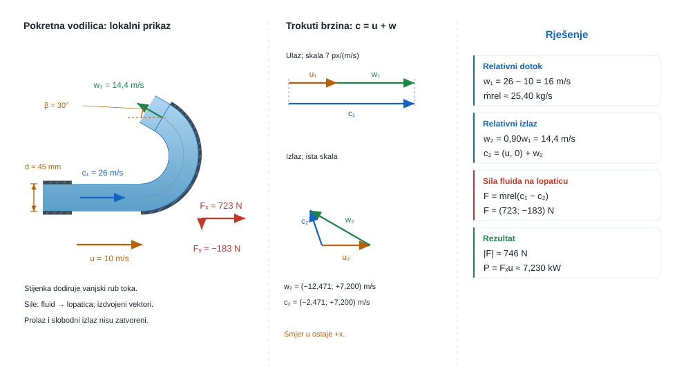

**Pretpostavke i model**

Pokretni kontrolni volumen vezan je uz lopaticu, pa kroz njega ne prolazi puni sapnicki protok nego samo relativni dotok definiran razlikom $c_1-u$. Iz relativnog izlaza najprije se odredi apsolutni izlazni vektor, a tek zatim jednadžba količine gibanja daje silu na lopaticu. Snaga se na kraju zatvara samo preko komponente sile u smjeru gibanja lopatice.

**Rješenje**

Površina mlaza iznosi

$$
A = \frac{\pi d^2}{4} = \frac{\pi \cdot 0{,}045^2}{4} = 1{,}590 \cdot 10^{-3}\ \text{m}^2.
$$

Relativna ulazna brzina prema lopatici je $w_1 = c_1-u = 26-10 = 16\ \text{m/s}$, pa je maseni protok koji stvarno ulazi u pokretni kontrolni volumen

$$
\dot{m}_{rel} = \rho A w_1 = 998 \cdot 1{,}590 \cdot 10^{-3} \cdot 16 = 25{,}4\ \text{kg/s}.
$$

Iz koeficijenta relativnog izlaza slijedi $w_2 = k w_1 = 0{,}90 \cdot 16 = 14{,}4\ \text{m/s}$. Relativni izlazni vektor glasi

$$
\vec{w}_2 = (-w_2 \cos \beta,\ w_2 \sin \beta) = (-14{,}4 \cos 30^\circ,\ 14{,}4 \sin 30^\circ) = (-12{,}47,\ 7{,}20)\ \text{m/s}.
$$

Apsolutna izlazna brzina dobiva se dodavanjem transportne brzine lopatice:

$$
\vec{c}_2 = (u,0) + \vec{w}_2 = (10-12{,}47,\ 7{,}20) = (-2{,}47,\ 7{,}20)\ \text{m/s}.
$$

Ulazna apsolutna brzina je $\vec{c}_1 = (26,0)\ \text{m/s}$. Sila lopatice na fluid glasi

$$
\vec{F}_{l \to f} = \dot{m}_{rel}(\vec{c}_2 - \vec{c}_1) = 25{,}4 \cdot (-28{,}47,\ 7{,}20) = (-723{,}3,\ 182{,}9)\ \text{N}.
$$

Zato fluid na lopaticu djeluje silom suprotnog smjera $\vec{F}_{f \to l} = (723{,}3,\ -182{,}9)\ \text{N}$, pa su komponente sile $F_x \approx 723\ \text{N}$, $F_y \approx -183\ \text{N}$, a rezultantni iznos

$$
F = \sqrt{723{,}3^2 + 182{,}9^2} = 746\ \text{N}.
$$

Snagu predanu lopatici daje samo komponenta sile u smjeru gibanja:

$$
P = F_x u = 723{,}3 \cdot 10 = 7233\ \text{W} \approx 7{,}23\ \text{kW}.
$$

**Provjera i komentar**

Ovaj `CH` zatvara puni prijelaz kroz pog. 12Pokretne lopatice i potisak: relativni dotok daje $\dot{m}_{rel} \approx 25{,}4\ \text{kg/s}$, relativni izlaz mora se prevesti u apsolutni vektor $\vec{c}_2 \approx (-2{,}47,\ 7{,}20)\ \text{m/s}$, a tek tada se dobiva sila mlaza na lopaticu od oko $(723, -183)\ \text{N}$. Budući da rad proizvodi samo komponenta sile u smjeru gibanja, lopatica prima snagu od oko $7{,}23\ \text{kW}$.

1. Maseni protok kroz pokretni kontrolni volumen mora biti manji od punog sapničkog protoka jer je $w_1 = c_1-u < c_1$.
2. Komponenta $F_x$ mora ostati dominantna jer upravo promjena tangencijalne brzine proizvodi rad i snagu.
3. Kad bi se lopatica gibala brzinom jednakom brzini mlaza, relativni dotok bi nestao, pa bi nestale i sila i snaga.
:::

::: {.mf1-ch}

Cjeloviti zadatak — Peltonov rotor s jednim mlazom i momentom na obodu&nbsp;T4

**Kontekst:** Peltonov rotor male hidroelektrane prima energiju jednog mlaza koji djeluje na lopatice raspoređene po obodu, a stalna brzina vrtnje rotora određena je generatorom. Iz tangencijalne komponente sile na lopatici izvode se moment na obodu i predana snaga, pa se ovim zadatkom provjerava može li jedan mlaz pogoniti pomoćni generator zadane snage.

**Zadano**

- Gustoća vode: $\rho = 998\ \text{kg/m}^3$
- Promjer sapnice: $d = 44\ \text{mm}$
- Apsolutna brzina mlaza iz sapnice: $c_1 = 31\ \text{m/s}$
- Srednji polumjer rotora: $r = 0{,}46\ \text{m}$
- Stalna brzina vrtnje rotora: $n = 320\ \text{min}^{-1}$
- Koeficijent relativnog izlaza: $w_2 = k w_1$, $k = 0{,}90$
- Kut relativnog izlaza iznad negativnog smjera osi $x$: $\beta = 20^\circ$
- Tražena snaga pomoćnog generatora: $P_G = 9{,}5\ \text{kW}$

Smjer osi $x$ odabran je tangencijalno u smjeru gibanja oboda. Pretpostavi da lopatica potpuno zahvaća mlaz te da su ulaz i izlaz na atmosferskom tlaku.

**Traženo**

1. obodnu brzinu rotora $u$ i relativnu ulaznu brzinu $w_1$.
2. maseni protok kroz pokretni kontrolni volumen $\dot{m}_{rel}$ i apsolutni izlazni vektor $\vec{c}_2$.
3. komponente i iznos sile fluida na lopaticu.
4. moment na obodu rotora i snagu koju mlaz predaje rotoru.
5. može li takav jedan mlaz pri ovom režimu pogoniti pomoćni generator tražene snage.

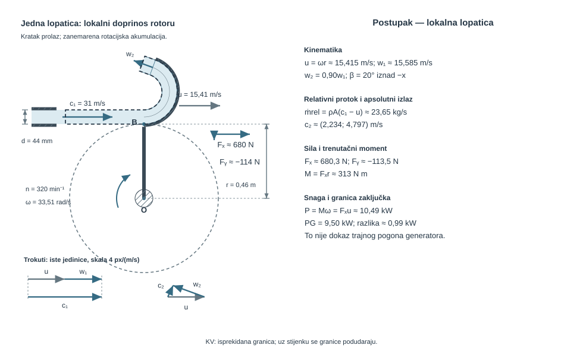

**Pretpostavke i model**

Promatra se pokretni kontrolni volumen vezan uz jednu reprezentativnu lopaticu na obodu rotora. U taj kontrolni volumen ulazi samo relativni dotok definiran brzinom $w_1 = c_1-u$. Iz relativnog izlaza najprije treba vratiti apsolutni izlazni vektor, zatim iz promjene količine gibanja odrediti tangencijalnu silu, a tek na kraju iz te sile zatvoriti moment i snagu na radijusu $r$.

**Rješenje**

Površina mlaza iznosi

$$
A = \frac{\pi d^2}{4} = \frac{\pi \cdot 0{,}044^2}{4} = 1{,}521 \cdot 10^{-3}\ \text{m}^2.
$$

Kutna brzina rotora je

$$
\omega = \frac{2\pi n}{60} = \frac{2\pi \cdot 320}{60} = 33{,}51\ \text{rad/s},
$$

pa je obodna brzina $u = \omega r = 33{,}51 \cdot 0{,}46 = 15{,}41\ \text{m/s}$. Relativna ulazna brzina prema lopatici sada je $w_1 = c_1-u = 31 - 15{,}41 = 15{,}59\ \text{m/s}$. Maseni protok koji stvarno ulazi u pokretni kontrolni volumen zato je

$$
\dot{m}_{rel} = \rho A w_1 = 998 \cdot 1{,}521 \cdot 10^{-3} \cdot 15{,}59 = 23{,}65\ \text{kg/s}.
$$

Iz koeficijenta relativnog izlaza slijedi $w_2 = k w_1 = 0{,}90 \cdot 15{,}59 = 14{,}03\ \text{m/s}$. Relativni izlazni vektor glasi

$$
\vec{w}_2 = (-w_2 \cos \beta,\ w_2 \sin \beta) = (-14{,}03 \cos 20^\circ,\ 14{,}03 \sin 20^\circ) = (-13{,}18,\ 4{,}80)\ \text{m/s}.
$$

Apsolutni izlazni vektor dobiva se dodavanjem transportne brzine oboda:

$$
\vec{c}_2 = (u,0) + \vec{w}_2 = (15{,}41-13{,}18,\ 4{,}80) = (2{,}23,\ 4{,}80)\ \text{m/s}.
$$

Ulazna apsolutna brzina je $\vec{c}_1 = (31,0)\ \text{m/s}$. Sila lopatice na fluid sada glasi

$$
\vec{F}_{l \to f} = \dot{m}_{rel}(\vec{c}_2 - \vec{c}_1) = 23{,}65 \cdot (-28{,}77,\ 4{,}80) = (-680{,}4,\ 113{,}5)\ \text{N}.
$$

Zato fluid na lopaticu djeluje silom suprotnog smjera $\vec{F}_{f \to l} = (680{,}4,\ -113{,}5)\ \text{N}$, pa su tražene komponente $F_x \approx 680\ \text{N}$, $F_y \approx -114\ \text{N}$, a rezultantni iznos sile je

$$
F = \sqrt{680{,}4^2 + 113{,}5^2} = 689{,}8\ \text{N}.
$$

Tangencijalna komponenta $F_x$ stvara moment na obodu rotora:

$$
M = F_x r = 680{,}4 \cdot 0{,}46 = 312{,}98\ \text{N m} \approx 313\ \text{N m}.
$$

Snaga koju mlaz predaje rotoru iznosi

$$
P = M\omega = 312{,}98 \cdot 33{,}51 = 10{,}49\ \text{kW},
$$

što je ekvivalentno i zapisu $P = F_x u = 680{,}4 \cdot 15{,}41 = 10{,}49\ \text{kW}$. Usporedba s traženom snagom generatora daje $\Delta P = 10{,}49 - 9{,}50 = 0{,}99\ \text{kW}$, pa jedan takav mlaz u idealiziranom hidrauličkom modelu jest dovoljan za traženi pogon, ali s rezervom manjom od $1\ \text{kW}$ prije mehaničkih i volumetrijskih gubitaka stroja.

**Provjera i komentar**

Ovaj `T4` zadatak zatvara stvarni rotorni rez pog. 12Pokretne lopatice i potisak: iz iste promjene količine gibanja koja je u ranijem zadatku davala silu na pokretnu lopaticu sada se dobiva tangencijalna sila od oko $680\ \text{N}$, moment od oko $313\ \text{N m}$ i snaga od oko $10{,}5\ \text{kW}$ na obodu Peltonova rotora. Time prijelaz iz relativne brzine u stvarni mehanički izlaz više nije samo kinematički dodatak, nego puni strojarski bilancni korak.

1. Ako se rotor vrti brze, relativni dotok $w_1$ pada, pa pri istom mlazu padaju i sila i predana snaga.
2. Tangencijalna komponenta sile mora biti mnogo veća od normalne jer upravo ona proizvodi moment na osovini.
3. Ako se iz relativnog izlaza izravno pročita moment bez povratka na apsolutni vektor $\vec{c}_2$, gubi se pravi impulsni skok koji rotor stvarno preuzima.
:::

::: {.mf1-ch}

Cjeloviti zadatak — Krivulja snage $P(u)$ Peltonove turbine: traženje optimalne brzine lopatice&nbsp;T3

**Kontekst:** Pri projektiranju Peltonove turbine ključno je pitanje pri kojoj obodnoj brzini lopatice rotor isporučuje najveću snagu, budući da sila pada s rastom $u$, a brzina raste. Iz analitičkog izvoda krivulje $P(u)$ određuju se optimalna brzina i projektna brzina vrtnje rotora, što izravno fiksira polumjer rotora za zadanu mrežnu frekvenciju generatora.

**Zadano**

U prethodnom zadatku Peltonov rotor s jednim mlazom dao je silu i moment pri **fiksiranoj** brzini lopatice $u$. Sada se postavlja drugačije pitanje: pri kojem $u$ rotor daje **maksimalnu snagu**?

Snaga rotora ovisi i o sili (koja pada s rastom $u$, jer relativni dotok pada) i o brzini (koja raste s $u$). Krivulja $P(u)$ je dakle **parabolična** s maksimumom negdje između $u = 0$ (lopatica miruje, ne čini rad) i $u = c_1$ (sila je nula, lopatica "bježi" od mlaza). Ova analiza daje **projektnu brzinu vrtnje** Peltonove turbine.

**Mlaznica i lopatica**

- Promjer mlaza: $d = 50\ \text{mm}$
- Brzina mlaza: $c_1 = 30\ \text{m/s}$
- Izlazni kut lopatice: $\beta_2 = 165^\circ$ (gotovo U-lom, $15^\circ$ otklon za odvod vode)
- Koeficijent relativnog izlaza (gubitak u lopatici): $k = 0{,}90$ (tj. $w_2 = k \, w_1$)
- Gustoća vode: $\rho = 998\ \text{kg/m}^3$
- Polumjer Peltonovog rotora: $R = 0{,}20\ \text{m}$

**Traženo**

1. Funkcionalni izraz za silu $F(u)$ i snagu $P(u)$ na lopatici (sve lopatice rotora, ne samo jedna – maseni protok je puni sapnički).
2. Brzinu lopatice $u_{opt}$ pri kojoj je snaga maksimalna (analitički iz $dP/du = 0$).
3. Iznos $P_{max}$ i odgovarajuću brzinu vrtnje rotora $n_{opt}$.
4. Hidrauličku snagu mlaza $P_{hid}$ i maksimalnu hidrauličku korisnost rotora $\eta_{max} = P_{max}/P_{hid}$.
5. Snagu pri tri "necjelovita" radna stanja: $u = c_1/4$, $u = c_1/3$, $u = 2c_1/3$. Komentirati kako se snaga mijenja kad rotor odstupi od optimalne brzine.

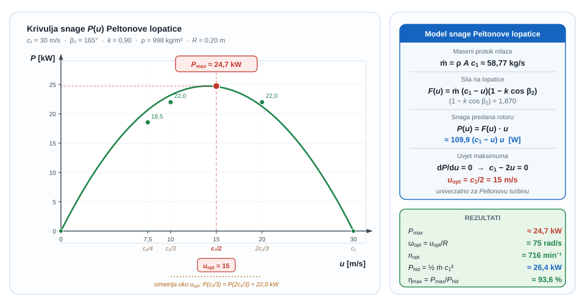{#fig-u12-krivulja-snage fig-align="center"}

**Pretpostavke i model**

Promatra se Peltonov rotor s **više lopatica** raspoređenih po obodu tako da svaka lopatica zauzme mjesto prethodne prije nego što mlaz "izaide" iz radnog područja – posljedica je da **puni** sapnički maseni protok kontinuirano predaje impuls rotoru:

$$
\dot m = \rho A c_1, \qquad A = \frac{\pi d^2}{4}
$$

Tangencijalna sila na lopaticu (u apsolutnom okviru, projekcija promjene količine gibanja na os gibanja oboda):

$$
F(u) = \dot m \cdot (c_1 - u) \cdot (1 - k \cos\beta_2)
$$

Faktor $(1 - k \cos\beta_2)$ kvantificira **koliko impulsa lopatica preuzme**: za savršeni U-lom ($\beta_2 = 180^\circ$, $k = 1$) iznosi $2$ – udvostručuje impuls jer mlaz potpuno mijenja smjer. Za $\beta_2 = 165^\circ$ i $k = 0{,}90$ iznosi $1 - 0{,}90 \cdot (-0{,}966) = 1 + 0{,}870 = 1{,}870$.

Snaga je sila puta brzina oboda: $P(u) = F(u) \cdot u$, što daje paraboličnu funkciju s nulom na oba kraja ($u = 0$ i $u = c_1$).

**Rješenje**

**1. Funkcionalni izrazi.** Površina mlaza:

$$
A = \frac{\pi d^2}{4} = \frac{\pi \cdot 0{,}050^2}{4} \approx 1{,}963 \cdot 10^{-3}\ \text{m}^2
$$

Puni maseni protok:

$$
\dot m = \rho A c_1 = 998 \cdot 1{,}963 \cdot 10^{-3} \cdot 30 \approx 58{,}77\ \text{kg/s}
$$

Sila:

$$
F(u) = \dot m \cdot (c_1 - u) \cdot 1{,}870 = 58{,}77 \cdot 1{,}870 \cdot (30 - u) \approx 109{,}9 \cdot (30 - u)\ \text{N}
$$

(s $u$ u m/s i $F$ u N).

Snaga:

$$
P(u) = F(u) \cdot u = 109{,}9 \cdot (30 - u) \cdot u\ \text{W}
$$

**2. Analitički optimum.** Derivacija po $u$:

$$
\frac{dP}{du} = 109{,}9 \cdot \frac{d}{du}\left[(30 - u) u\right] = 109{,}9 \cdot (30 - 2u)
$$

Nula daje:

$$
u_{opt} = \frac{c_1}{2} = \frac{30}{2} = 15\ \text{m/s}
$$

Ovaj rezultat **ne ovisi** o $\beta_2$, $k$, $\rho$, $A$ – samo o $c_1$. Faktor $1/2$ je **univerzalna** vrijednost za Peltonove turbine.

**3. Maksimalna snaga i broj okretaja:**

$$
P_{max} = P(u_{opt}) = 109{,}9 \cdot (30 - 15) \cdot 15 = 109{,}9 \cdot 225 \approx 24\,728\ \text{W} \approx 24{,}7\ \text{kW}
$$

Kutna brzina rotora i broj okretaja:

$$
\omega_{opt} = \frac{u_{opt}}{R} = \frac{15}{0{,}20} = 75\ \text{rad/s}
$$

$$
n_{opt} = \frac{\omega_{opt} \cdot 60}{2\pi} = \frac{75 \cdot 60}{2\pi} \approx 716\ \text{min}^{-1}
$$

**4. Hidraulička korisnost:**

$$
P_{hid} = \frac{1}{2}\dot m \, c_1^2 = \frac{1}{2} \cdot 58{,}77 \cdot 30^2 \approx 26\,447\ \text{W} \approx 26{,}4\ \text{kW}
$$

$$
\eta_{max} = \frac{P_{max}}{P_{hid}} = \frac{24{,}7}{26{,}4} \approx 0{,}936 \approx 93{,}6\%
$$

**5. Snaga izvan optimuma** (faktor $109{,}9$ u kW računa se kao $109{,}9 \cdot (30-u) \cdot u / 1000$):

- $u = c_1/4 = 7{,}5\ \text{m/s}$:  $P = 109{,}9 \cdot 22{,}5 \cdot 7{,}5 / 1000 \approx 18{,}5\ \text{kW}$ ($75\%$ od $P_{max}$)
- $u = c_1/3 = 10\ \text{m/s}$:  $P = 109{,}9 \cdot 20 \cdot 10 / 1000 \approx 22{,}0\ \text{kW}$ ($89\%$ od $P_{max}$)
- $u = 2c_1/3 = 20\ \text{m/s}$: $P = 109{,}9 \cdot 10 \cdot 20 / 1000 \approx 22{,}0\ \text{kW}$ ($89\%$ od $P_{max}$)

**Provjera i komentar**

1. Krivulja $P(u)$ je **simetrična** parabola oko $u_{opt} = c_1/2$. Vrijednosti pri $u = c_1/3$ i $u = 2c_1/3$ daju **istu** snagu ($\approx 22\ \text{kW}$, oko 89% maksimuma) – jer obje točke su jednako udaljene od optimuma. Ova simetrija je matematička posljedica oblika $P \propto (c_1 - u) u$ i daje inženjeru fleksibilnost: rotor smije raditi u **prozoru** brzina od oko $u_{opt} \pm c_1/6$ s minimalnim gubitkom snage.
2. **Univerzalnost** $u_{opt} = c_1/2$ je važna projektna činjenica: za zadanu visinu pada (koja određuje $c_1$ preko $c_1 = \sqrt{2gH}$) i zadanu brzinu vrtnje generatora ($n_{gen}$ fiksiran zbog mrežne frekvencije), polumjer rotora **mora** zadovoljiti:

$$
R = \frac{u_{opt}}{\omega} = \frac{c_1/2}{2\pi n / 60} = \frac{c_1 \cdot 30}{2\pi n}
$$

To je glavna geometrijska jednadžba za projektiranje Peltonove turbine.

3. Razlika između maksimalne hidrauličke korisnosti rotora ($\approx 93{,}6\%$) i ukupne korisnosti turbine ($\approx 88\%$ za moderne strojeve) ide na račun: gubitak u lopatici ($k < 1$), gubitak na mlaznici (kontrakcija mlaza), volumetrijski gubici (voda koja "promaši" lopatice) i mehanički gubici u ležajima. Naš model uzima u obzir samo **prvi** od tih efekata.
4. **Pad snage na rubovima parabole** je didaktički ključna poruka: ako se rotor zaustavi ($u = 0$, npr. preopterećen generator), snaga pada na **nulu** – ali sila ostaje (i čak je maksimalna pri $u = 0$). Razlika je u tome da sila bez puta ne stvara rad, a generator je upravo "uskratitelj puta". Suprotan rub je još opasniji: ako se generator otkvači i rotor "pobjegne" ($u \to c_1$), ne samo da snaga pada na nulu, nego sila također. Sustav se ne usporava nikakvim povratnim momentom – Peltonova turbina je u **"runaway" stanju**. Zato svaka Peltonova turbina ima **deflektor mlaza** (skreće mlaz mimo rotora pri nuždi) ili **kočno mehaničko zatvaranje** mlaznice.
5. Krivulja $P(u)$ koja se ovdje dobila vrijedi za **stacionarni** mlaz konstantne brzine $c_1$. Pri stvarnoj turbini, ako se promijeni protok kroz mlaznicu (npr. iglom regulatora), mijenja se i $c_1$, pa krivulja $P(u)$ poprima drugačiji oblik – ali optimum **uvijek** ostaje pri $u/c_1 = 1/2$.
:::

::: {.mf1-ch}

Cjeloviti zadatak — Mlazna platforma s četiri sapnice i prag lebdenja&nbsp;T4

**Kontekst:** Rekreacijska mlazna platforma (flyboard) koristi četiri usmjerene sapnice za stvaranje potiska prema dolje koji uzdiže vozača iznad vodene površine. Iz zakona količine gibanja određuju se prag lebdenja, ubrzanje pri radnoj brzini mlaza i kinematika nakon prekida dotoka, što je nužno za sigurnu projektnu visinu leta.

**Zadano**

- Ukupna masa platforme s vozačem: $m = 150\ \text{kg}$
- Gustoća vode: $\rho = 1000\ \text{kg/m}^3$
- Promjer svake od četiri jednake sapnice: $d = 50\ \text{mm}$
- Radna brzina mlaza: $v = 15\ \text{m/s}$
- Ciljna visina: $h = 10\ \text{m}$

Mlazovi izlaze okomito prema dolje istom brzinom $v$. Zanemaruju se otpor zraka, masa cijevi i svi gubici između pumpe i sapnica. Sustav kreće iz mirovanja s površine vode.

**Traženo**

1. ukupnu izlaznu površinu sapnica i minimalnu brzinu mlaza $v_{min}$ potrebnu za lebdenje.
2. ukupni potisak i vertikalno ubrzanje pri radnoj brzini mlaza.
3. vrijeme potrebno da mlazna platforma iz mirovanja dosegne visinu $h$ te brzinu pri toj visini.
4. dodatnu visinu i ukupno vrijeme provedeno iznad $10\ \text{m}$ ako se dotok vode prekine točno pri dosezanju te visine.

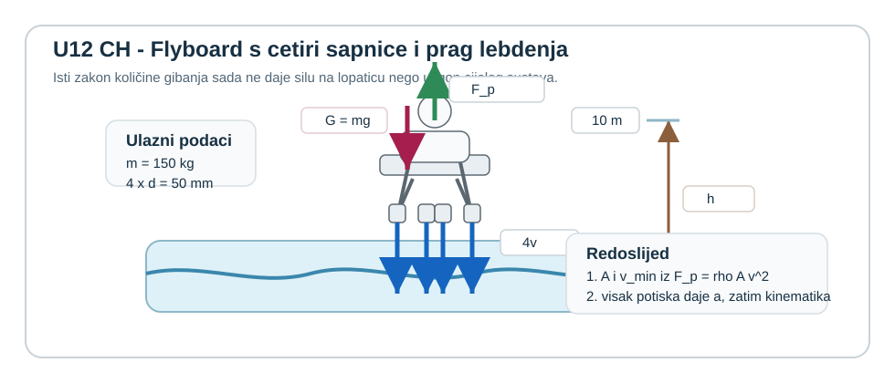

**Pretpostavke i model**

Za kontrolni volumen vezan uz platformu ukupni potisak dobiva se iz ukupne promjene količine gibanja vode u cetirima mlazovima:

$$
F_p = \dot{m}v = \rho A v^2
$$

gdje je $A$ zbroj svih izlaznih površina. Kad je $F_p > G = mg$, ostatak sile daje stalno ubrzanje po Newtonovu zakonu. Nakon prekida dotoka nestaje potisak i dalje vrijedi samo slobodno vertikalno gibanje pod djelovanjem težine.

**Rješenje**

Površina jedne sapnice iznosi

$$
A_1 = \frac{\pi d^2}{4} = \frac{\pi \cdot 0{,}05^2}{4} = 1{,}964 \cdot 10^{-3}\ \text{m}^2,
$$

pa je ukupna izlazna površina četiri sapnice

$$
A = 4A_1 = 4 \cdot 1{,}964 \cdot 10^{-3} = 7{,}854 \cdot 10^{-3}\ \text{m}^2.
$$

Uvjet lebdenja je jednakost potiska i težine $F_p = G$, odnosno $\rho A v_{min}^2 = mg$, pa slijedi

$$
v_{min} = \sqrt{\frac{mg}{\rho A}} = \sqrt{\frac{150 \cdot 9{,}81}{1000 \cdot 7{,}854 \cdot 10^{-3}}} = 13{,}69\ \text{m/s}.
$$

Za radnu brzinu $v = 15\ \text{m/s}$ ukupni potisak iznosi

$$
F_p = \rho A v^2 = 1000 \cdot 7{,}854 \cdot 10^{-3} \cdot 15^2 = 1767\ \text{N}.
$$

Težina sustava je $G = mg = 150 \cdot 9{,}81 = 1471{,}5\ \text{N}$, pa je rezultirajuća vertikalna sila $F_R = F_p - G = 1767 - 1471{,}5 = 295{,}5\ \text{N}$ i odgovarajuće ubrzanje

$$
a = \frac{F_R}{m} = \frac{295{,}5}{150} = 1{,}97\ \text{m/s}^2.
$$

Kako mlazna platforma kreće iz mirovanja i ubrzanje je u ovom modelu konstantno, za doseg visine $h = 10\ \text{m}$ iz $h = at^2/2$ slijedi

$$
t = \sqrt{\frac{2h}{a}} = \sqrt{\frac{20}{1{,}97}} = 3{,}19\ \text{s}.
$$

Brzina pri dosezanju visine $10\ \text{m}$ zato je $v_{10} = at = 1{,}97 \cdot 3{,}19 = 6{,}29\ \text{m/s}$.

Ako se dotok vode tada prekine, mlazna platforma dalje ide prema gore samo zbog stečene brzine. Dodatna visina iznad $10\ \text{m}$ iznosi

$$
\Delta h = \frac{v_{10}^2}{2g} = \frac{6{,}29^2}{2 \cdot 9{,}81} = 2{,}02\ \text{m},
$$

pa je najveća visina približno $h_{max} = 10 + 2{,}02 = 12{,}02\ \text{m}$. Vrijeme penjanja iznad $10\ \text{m}$ do vrha leta iznosi $t_{gore} = v_{10}/g = 6{,}29/9{,}81 = 0{,}64\ \text{s}$, a ukupno vrijeme provedeno iznad $10\ \text{m}$ prije ponovnog povratka na tu kotu je $t_{iznad\ 10} = 2t_{gore} = 1{,}28\ \text{s}$.

**Provjera i komentar**

Ovaj `T4` zadatak izravno zatvara potisni dio pog. 12Pokretne lopatice i potisak: četiri sapnice ukupne površine $7{,}85 \cdot 10^{-3}\ \text{m}^2$ trebaju najmanje $13{,}69\ \text{m/s}$ samo za lebdenje, dok pri $15\ \text{m/s}$ daju potisak od oko $1767\ \text{N}$ i ubrzanje od oko $1{,}97\ \text{m/s}^2$. U tom režimu mlazna platforma dosegne $10\ \text{m}$ za oko $3{,}19\ \text{s}$, a nakon prekida dotoka još se digne do oko $12{,}0\ \text{m}$ i ostaje iznad razine $10\ \text{m}$ oko $1{,}28\ \text{s}$.

1. Potisak mora rasti s $v^2$, pa i mala promjena brzine mlaza brzo mijenja režim iz tonjenja u lebdenje ili penjanje.
2. Ako je $v < v_{min}$, nema smisla računati vrijeme penjanja jer je rezultirajuća sila prema dolje.
3. Nakon prekida dotoka više nema potiska, pa se daljnje gibanje iznad $10\ \text{m}$ zatvara običnom vertikalnom kinematikom, ne više zakonom količine gibanja za mlaz.
:::

::: {.mf1-we}

Riješeni primjer — Snaga na Peltonovoj lopatici &nbsp;T2

**Primjer za strojare**

**Kontekst:** Peltonova turbina male hidroelektrane ima mlaznice promjera $d = 60\ \text{mm}$ s brzinom mlaza $c_1 = 40\ \text{m/s}$. Obodna brzina rotora iznosi $u = 18\ \text{m/s}$. Lopatice imaju izlazni kut $\beta_2 = 165°$ (gotovo U-lom s $15°$ nagibom radi odvoda vode). Odredi silu na lopaticu i snagu jednog mlaza.

**Zadano**

- $d = 60\ \text{mm}$, $c_1 = 40\ \text{m/s}$, $u = 18\ \text{m/s}$, $\beta_2 = 165°$
- $\rho = 998\ \text{kg/m}^3$

**Traženo**

Tangencijalna sila na lopaticu, snaga jednog mlaza.

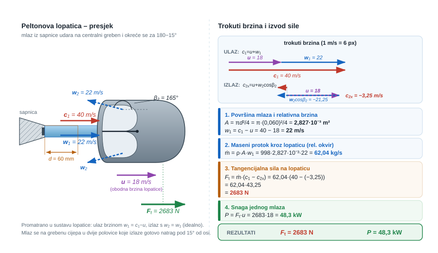{#fig-u12-pelton-lopatica fig-align="center"}

**Rješenje**

$$
A = \frac{\pi \cdot 0{,}060^2}{4} = 2{,}827 \cdot 10^{-3}\ \text{m}^2
$$

Relativna ulazna brzina: $w_1 = c_1 - u = 40 - 18 = 22\ \text{m/s}$

Maseni protok kroz lopaticu: $\dot{m} = \rho A w_1 = 998 \cdot 2{,}827 \cdot 10^{-3} \cdot 22 = 62{,}04\ \text{kg/s}$

Izlazna relativna brzina bez gubitaka: $w_2 = w_1 = 22\ \text{m/s}$

Apsolutna izlazna brzina (u smjeru tangente/x):
$$c_{2x} = u + w_2\cos(165°) = 18 + 22 \cdot (-0{,}9659) = 18 - 21{,}25 = -3{,}25\ \text{m/s}$$

Tangencijalna sila na lopaticu:
$$F_t = \dot{m}(c_1 - |c_{2x}|) = \dot{m}(c_1 - c_{2x}) = 62{,}04 \cdot (40 - (-3{,}25)) = 62{,}04 \cdot 43{,}25 = 2683\ \text{N}$$

Snaga jednog mlaza:
$$P = F_t \cdot u = 2683 \cdot 18 = 48{,}3\ \text{kW}$$

**Provjera i komentar**

Hidraulička snaga mlaza: $P_{hid} = \frac{1}{2}\dot{m}_{uk}c_1^2$ gdje $\dot{m}_{uk} = \rho A_{mlaza} c_1 = 998 \cdot 2{,}827 \cdot 10^{-3} \cdot 40 = 113{,}0\ \text{kg/s}$, tj. $P_{hid} = 0{,}5 \cdot 113 \cdot 1600 = 90{,}4\ \text{kW}$. Korisnost je $48{,}3/90{,}4 \approx 53\%$ — razumno za jedan mlaz bez optimizacije $u/c_1$. Kod pravih Peltonovih turbina $u/c_1 \approx 0{,}46$ i korisnost prelazi $90\%$.

:::

::: {.mf1-we}

Riješeni primjer — Reakcijska sila vodnog monitora na plovilo &nbsp;T2

**Primjer za građevinare**

**Kontekst:** Plovni bager za čišćenje dna rijeke ima pumpu koja crpi riječnu vodu i izbacuje je kroz stražnju mlaznicu kao pogonski potisak (hidromlazni pogon). Inženjer mora odrediti potisak i potrebnu snagu za zadanu brzinu plovidbe.

**Zadano**

- Promjer mlaznice: $d = 120\ \text{mm}$
- Brzina izlaznog mlaza (relativno prema plovilu): $v_{mlaz} = 8{,}5\ \text{m/s}$
- Plovilo plovi brzinom $V_{plovilo} = 1{,}2\ \text{m/s}$ (uzeto u mirovanju radi bilance)
- Gustoća riječne vode: $\rho = 1005\ \text{kg/m}^3$

**Traženo**

Potisak i snaga potrebna za savladavanje hydrodynamičkog otpora plovila.

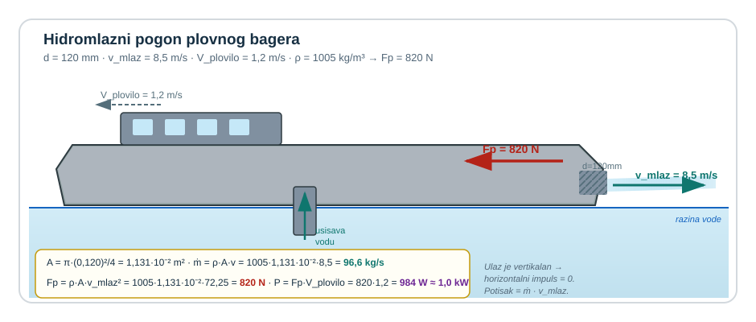{#fig-u12-hidromlazni-pogon fig-align="center"}

**Rješenje**

$$
A = \frac{\pi \cdot 0{,}120^2}{4} = 1{,}131 \cdot 10^{-2}\ \text{m}^2
$$

Maseni protok mlaza: $\dot{m} = \rho A v_{mlaz} = 1005 \cdot 1{,}131 \cdot 10^{-2} \cdot 8{,}5 = 96{,}5\ \text{kg/s}$

Ulazna voda se usisava iz okoliša — u referentnom okviru plovila ulazna brzina vode $\approx 0$ (zahvat s mirne riječne površine):

$$
F_p = \dot{m}(v_{mlaz} - 0) = 96{,}5 \cdot 8{,}5 = 820\ \text{N}
$$

Snaga pumpe (neto korisna):
$$
P = F_p \cdot V_{plovilo} + \frac{1}{2}\dot{m}(v_{mlaz}^2 - V_{plovilo}^2) \approx \frac{1}{2}\dot{m}v_{mlaz}^2 = 0{,}5 \cdot 96{,}5 \cdot 8{,}5^2 = 3481\ \text{W} \approx 3{,}5\ \text{kW}
$$

**Provjera i komentar**

Potisak od ~$820\ \text{N}$ za bager mase ~$2{,}5\ \text{t}$ daje ubrzanje od samo $0{,}33\ \text{m/s}^2$ — realno za spori radni brod. Snaga od ~$3{,}5\ \text{kW}$ je samo kinetička snaga mlaza; realna pumpa uz gubitke treba $2–3\times$ više. Ovaj pristup primjenjiv je i pri dimenzioniranju hidrauličnih potisnih agregata za plovila, pontone i plutajuće brane.

:::

::: {.mf1-we}

Riješeni primjer — Propeler dronskog kvadkoptera u stanju visa &nbsp;T2

**Kontekst:** Kvadkopterski dron za potrebe geodetske izmjere i inspekcije infrastrukture ima četiri istovjetna propelera. U stacionarnom visu (zadržavanju nepomičnog položaja u zraku) propeleri moraju razviti ukupni potisak jednak težini cijelog drona. Pojednostavljeni proračun potiska iz teorije aktuatorskog diska omogućuje procjenu mehaničke snage svakog propelera, što je ključno za određivanje trajanja leta na jednom punjenju baterije.

**Zadano**

- Masa drona s teretom: $m = 2{,}4\ \text{kg}$
- Broj propelera: $4$
- Promjer pojedinog propelera: $D = 280\ \text{mm}$
- Visina leta: $1\,500\ \text{m}$, temperatura zraka $5^\circ\text{C}$
- Gustoća zraka na toj visini: $\rho = 1{,}045\ \text{kg/m}^3$
- Učinkovitost propelera (omjer idealne i stvarne snage): $\eta = 0{,}70$

**Traženo**

1. Potreban potisak po pojedinom propeleru u stacionarnom visu;
2. Srednja brzina protoka zraka kroz propeler prema teoriji aktuatorskog diska;
3. Idealna i stvarna mehanička snaga po propeleru;
4. Ukupna snaga svih četiriju propelera.

**Pretpostavke i model**

Promatra se idealizirani aktuatorski disk: propeler se zamjenjuje tankom plohom koja diskontinuirano dodaje energiju struji zraka koja kroz njega prolazi. U stacionarnom visu ulazna brzina daleko ispred propelera iznosi nula, a daleko iza propelera dvostruka je srednja brzina kroz disk. Zrak se smatra nestlačivim na ovoj brzini, gubici su sažeti u jednom koeficijentu učinkovitosti. Težina drona je u potpunosti uravnotežena ukupnim potiskom.

**Rješenje**

Iz ravnoteže sila u visu, potisak po pojedinom propeleru:

$$
F_p = \frac{m\,g}{4} = \frac{2{,}4 \cdot 9{,}81}{4} \approx 5{,}886\ \text{N}.
$$

Površina diska pojedinog propelera:

$$
A = \frac{\pi D^2}{4} = \frac{\pi \cdot 0{,}280^2}{4} \approx 6{,}158 \cdot 10^{-2}\ \text{m}^2.
$$

Prema teoriji aktuatorskog diska, srednja brzina protoka zraka kroz disk u stacionarnom visu iznosi:

$$
v = \sqrt{\frac{F_p}{2\rho A}} = \sqrt{\frac{5{,}886}{2 \cdot 1{,}045 \cdot 6{,}158 \cdot 10^{-2}}}.
$$

Računaju se redom $2\rho A \approx 0{,}1287$ i $5{,}886 / 0{,}1287 \approx 45{,}73$:

$$
v = \sqrt{45{,}73} \approx 6{,}76\ \text{m/s}.
$$

Idealna mehanička snaga koju propeler predaje zraku:

$$
P_{id} = F_p \cdot v = 5{,}886 \cdot 6{,}76 \approx 39{,}8\ \text{W}.
$$

Stvarna mehanička snaga uz učinkovitost propelera:

$$
P_{st} = \frac{P_{id}}{\eta} = \frac{39{,}8}{0{,}70} \approx 56{,}9\ \text{W}.
$$

Ukupna snaga svih četiriju propelera:

$$
P_{uk} = 4 \cdot P_{st} \approx 227\ \text{W}.
$$

**Provjera i komentar**

Brzina protoka zraka kroz disk od oko $6{,}76\ \text{m/s}$ tipična je za male dronove u visu — niža brzina daje veću učinkovitost ali traži veće propelere, a viša brzina manje propelere ali manju učinkovitost. Ukupna snaga od približno $227\ \text{W}$ podudara se s tipičnim opažanjima za dronove te težinske klase; pri standardnoj bateriji od $5\,000\ \text{mAh}$ napona $14{,}8\ \text{V}$ ($74\ \text{Wh}$), teorijsko trajanje leta iznosi $74 / 0{,}227 \approx 326\ \text{s} \approx 20$ minuta, uz pretpostavku da cjelokupna energija baterije ide u potisak. Stvarno trajanje leta nešto je kraće zbog potrošnje elektronike za upravljanje, kamera i komunikaciju. Pri letu na nižoj visini (npr. $0\ \text{m}$, gdje je $\rho \approx 1{,}225\ \text{kg/m}^3$), zrak je gušći pa je potrebna brzina kroz disk manja, snaga niža i trajanje leta dulje — što je razlog zašto inspekcijski dronovi na velikim nadmorskim visinama (planinska područja) imaju kraće vrijeme leta nego pri obalnim misijama.
:::

::: {.mf1-samoprovjera}

Provjeri sebe

Sljedeća pitanja služe za samostalnu provjeru razumijevanja prije prelaska na zadatke za vježbu.

1. Po čemu se razlikuju apsolutna, relativna i obodna brzina u problemu pokretne lopatice?

::: {.callout-note collapse="true"}
### Odgovor
Apsolutna brzina $\vec{c}$ promatra se u nepomičnom (zemaljskom) okviru. Obodna brzina $\vec{u}$ je brzina same lopatice u istom okviru. Relativna brzina $\vec{w} = \vec{c} - \vec{u}$ je brzina fluida u okviru koji se giba s lopaticom. Maseni protok kroz lopaticu računa se iz relativne brzine, a promjena količine gibanja u apsolutnim brzinama.
:::

2. Zašto se maksimalna snaga na Peltonovoj lopatici postiže pri obodnoj brzini koja je polovica apsolutne brzine mlaza?

::: {.callout-note collapse="true"}
### Odgovor
Iz izraza za snagu $P = \rho Q (c_1 - u) u (1 - \cos\beta_2)$ slijedi da derivacija po $u$ pada na nulu pri $u = c_1/2$. Pri toj vrijednosti umnožak $(c_1-u)u$ je maksimalan, pa je i snaga maksimalna. Pri $u = 0$ ili $u = c_1$ snaga je nula.
:::

3. Što se događa s mlazom iza Peltonove lopatice pri optimalnoj obodnoj brzini i idealnom izlaznom kutu od $180^\circ$?

::: {.callout-note collapse="true"}
### Odgovor
Apsolutna izlazna brzina mlaza je teoretski nula — sva kinetička energija mlaza predana je rotoru. U praksi se koristi $\beta_2 \approx 165^\circ$ kako mlaz nakon izlaska iz lopatice ne bi udario u sljedeću lopaticu, što ograničava korisni rad na oko $95$ do $97\,\%$ teorijskog maksimuma.
:::

4. Vrijedi li isti pristup (trokut brzina, relativna brzina) i kod aksijalnih lopatica vjetroagregata ili samo kod hidroturbina?

::: {.callout-note collapse="true"}
### Odgovor
Vrijedi za sve rotirajuće lopaticne strojeve gdje fluid mijenja smjer ili iznos brzine u relativnom okviru lopatice. Vjetroagregati, hidroturbine, ventilatori, kompresori i propeleri zrakoplova svi koriste analognu kinematiku trokuta brzina; razlikuju se samo radnim medijem, smjerom prijenosa energije (od fluida na lopaticu ili obrnuto) i konkretnim oblikom lopatica.
:::
:::

## Zadaci za vježbu

::: {.mf1-vjezbe-list}
1. **T1** Vodeni mlaz brzine $v = 24\ \text{m/s}$ izlazi iz kružne sapnice promjera $d = 22\ \text{mm}$ i udara okomito na nepomičnu ravnu ploču. Odredi silu na ploču.

	**Natuknica:** $\dot m = \rho Av$, a za potpuno kočenje komponente brzine na ploči vrijedi $F = \dot m v$. (Rješenje: $\dot m \approx 9{,}1\ \text{kg/s}$; $F \approx 219\ \text{N}$.)

	**Skica:** da - sapnica, ravna ploča i os mlaza sa silom reakcije.

2. **T1** Vodeni mlaz brzine $v = 26\ \text{m/s}$ izlazi iz pravokutne sapnice širine $b = 30\ \text{mm}$ i visine $h = 16\ \text{mm}$ te udara u nepomičnu vodilicu koja tok zakreće za $110^\circ$ bez promjene iznosa brzine. Odredi komponente sile fluida na vodilicu i iznos reakcije nosača.

	**Natuknica:** iz presjeka dobij $\dot m$, a zatim razliku ulazne i izlazne komponente brzine u x i y smjeru. (Rješenje: $\dot m \approx 12{,}5\ \text{kg/s}$; $F_x \approx 435\ \text{N}$, $F_y \approx -304\ \text{N}$; reakcija nosača $\approx 531\ \text{N}$.)

	**Skica:** da - zakrenuta nepomična vodilica, ulazni i izlazni vektor brzine.

3. **T2** Na pokretnu lopaticu dolazi mlaz vode apsolutnom brzinom $v_1 = 32\ \text{m/s}$, dok se lopatica giba brzinom $u = 12\ \text{m/s}$ u smjeru mlaza. Pretpostavi da je relativna izlazna brzina po iznosu jednaka ulaznoj i zakrenuta za $150^\circ$ u odnosu na ulazni relativni smjer. Ako je maseni protok $\dot{m} = 18\ \text{kg/s}$, odredi tangencijalnu silu na lopaticu i snagu koju mlaz predaje lopatici.

	**Natuknica:** prijeđi na relativne brzine, zatim vrati apsolutnu izlaznu brzinu i iz tangencijalne promjene količine gibanja dobij silu; snaga je $P = Fu$. (Rješenje: $w_1 = 20\ \text{m/s}$; $F_t \approx 672\ \text{N}$; $P \approx 8{,}06\ \text{kW}$.)

	**Skica:** da - pokretna lopatica, brzina lopatice $u$, ulazni i izlazni trokut brzina.

4. **T2** Peltonova lopatica na rotoru radijusa $R = 0{,}42\ \text{m}$ prima mlaz vode masenog protoka $\dot m = 24\ \text{kg/s}$. Tangencijalna komponenta apsolutne brzine na ulazu iznosi $v_{u1} = 28\ \text{m/s}$, a na izlazu $v_{u2} = 6\ \text{m/s}$. Odredi tangencijalnu silu na lopaticu i moment na vratilu.

	**Natuknica:** tangencijalna sila slijedi iz $F_t = \dot m (v_{u1} - v_{u2})$, a moment je $M = F_t R$. (Rješenje: $F_t = 528\ \text{N}$; $M \approx 222\ \text{N·m}$.)

	**Skica:** da - rotor, polumjer $R$, mlaz i tangencijalne komponente brzine na ulazu i izlazu.

5. **T3** Potisni modul ima tri jednake sapnice promjera $d = 30\ \text{mm}$. Iz svake sapnice voda izlazi brzinom $v = 42\ \text{m/s}$ u suprotnom smjeru od gibanja platforme. Odredi ukupni potisak modula i hidrauličku snagu mlaza ako je gustoća vode $\rho = 998\ \text{kg/m}^3$.

	**Natuknica:** za jednu sapnicu vrijedi $F = \dot m v$ i $P = \dot m v^2/2$; ukupni rezultat je trostruki zbroj. (Rješenje: ukupni potisak $\approx 3{,}73\ \text{kN}$; hidraulička snaga $\approx 78{,}4\ \text{kW}$.)

	**Skica:** da - platforma s tri sapnice, smjer mlaza i rezultantni potisak.

6. **T3** Mlazna platforma ukupne mase $m = 110\ \text{kg}$ ima četiri jednake sapnice promjera $d = 28\ \text{mm}$. Voda iz svake sapnice izlazi okomito prema dolje brzinom $v = 36\ \text{m/s}$. Odredi ukupni potisak, najveću ukupnu masu koju takav sustav može držati u lebdenju i vertikalno ubrzanje platforme pri zadanoj masi sustava.

	**Natuknica:** najprije zbroji izlazne površine svih sapnica; zatim koristi $F_p = \rho A v^2$, uvjet lebdenja $F_p = mg$ i za zadanu masu Newtonov zakon $a = (F_p - mg)/m$. (Rješenje: $F_p \approx 3{,}19\ \text{kN}$; najveća masa lebdenja $\approx 325\ \text{kg}$; pri $m = 110\ \text{kg}$ ubrzanje $a \approx 19{,}2\ \text{m/s}^2$.)

	**Skica:** da - platforma s četiri sapnice, smjerovi mlazova, ukupni potisak i težina sustava.
:::

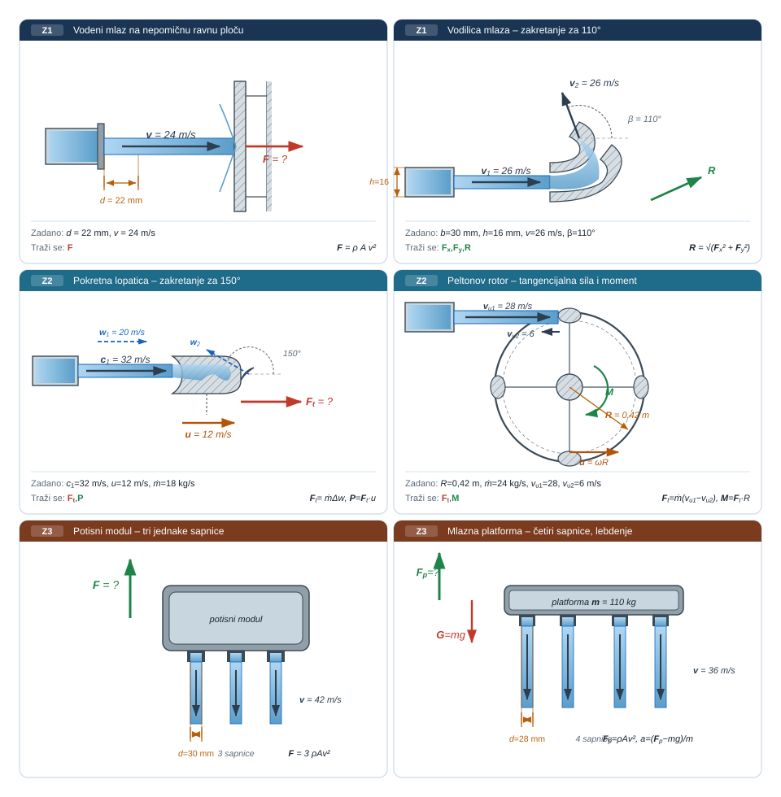{#fig-u12-vjezbe fig-align="center"}

::: {.mf1-zavrsni-okvir}

Za ponijeti iz poglavlja

**Sažeta provjera prije računa**

- Treba najprije nacrtati kontrolni volumen i osi prije pisanja jednadžbi.
- Treba jasno razlikovati koju silu daje jednadžba količine gibanja: silu okoline na fluid ili obrat.
- Treba rastaviti izlaznu brzinu na komponente u istom koordinatnom sustavu kao ulaznu.
- Treba provjeriti koristi li se maseni protok iz stvarne izlazne površine i zadane ulazne brzine.
- Treba razdvojiti silu fluida na vodilicu od reakcije nosača.

**Najčešća pogreška**

Najčešća greška nije u masenom protoku, nego u tome što se bez promjene predznaka uzme sila vodilice na fluid kao konačan odgovor. Taj korak treba uvijek jasno označiti prije nego što se zapis zaključa.

**Nakon ovoga poglavlja mora biti moguće**

1. postaviti kontrolni volumen za mlaz i vodilicu.
2. iz promjene vektora brzine odrediti komponente sile, reakcije i osnovni moment u uklještenju.
3. koristiti isti aparat količine gibanja kao bazu za lopatice, moment i mlazni potisak.

**U tehnici to znači**

Peltonovo kolo, vodomlazni pogon i mlazna ispitna glava rade dobro samo ako je ispravno pročitano koliko količine gibanja fluid predaje lopatici ili konstrukciji. Iz iste jednadžbe zato ovdje proizlaze sila, moment, snaga i potisak, ovisno o tome što se promatra kao radni izlaz sustava.

**Granica modela**

Maksimalna sila nije isto što i maksimalna snaga, a idealizirana promjena vektora brzine nije dovoljna ako su važni gubici u lopatici, neujednačen profil brzine ili složenija geometrija mlaza. U stvarnom stroju izbor kuta i brzine uvijek treba čitati zajedno s učinkovitošću, a ne samo sa silom.

pog. 12Pokretne lopatice i potisak počinje kontrolnim volumenom, ne turbinom. Jasno čitanje promjene količine gibanja na mirnoj vodilici daje stabilnu osnovu i za reakcije nosača i za kasnije pokretne lopatice.
:::

::: {.mf1-numerika}

Numerički most

**Gdje ovo živi u numerici.** Pokretne lopatice i moment količine gibanja vode ravno u **turbostrojarski CFD** — disciplinu koja računalom dimenzionira pumpe, ventilatore, vodne i plinske turbine, propelere i kompresore. Trokute brzina koji se ovdje crtaju ručno CFD rekonstruira automatski iz polja apsolutne i relativne brzine.

**Što numerički alat radi s tim.** Rotor se modelira **MRF zonom**: prostor uz lopaticu rotira matematički, a Navier-Stokes piše se u rotirajućem okviru s dodatnim Coriolisovim i centrifugalnim članom. Rezultat: polje tlaka po lopatici, lokalni napadni kutovi, mjesta odvajanja, raspodjela snage po radijusu. Za pune nestacionarne efekte (rotor-stator) prelazi se na **klizajuću mrežu (engl. sliding mesh)** ili **harmoničku ravnotežu (engl. harmonic balance)**.

**Tipičan scenarij.** Projektiranje turbinskog ili crpnog rotora počinje analitičkim trokutima brzina iz ovog poglavlja, a završava trodimenzijskom CFD analizom u MRF zoni oko lopatica. Iz simulacije izlaze mapa tlaka po profilu lopatice, mjesto pojave kavitacije i pripadni gubitak snage — informacije koje analitička teorija ne može pružiti, a bez kojih nije moguće dimenzionirati lopaticu za dugotrajan rad bez erozije i pulsacija.

**Alati u kojima se to susreće:** `OpenFOAM` (`MRFSimpleFoam`, `pimpleDyMFoam`) · `ANSYS Fluent` (*Frame Motion*, *Sliding Mesh*) · `Star-CCM+` (*MRF / Rigid Body Motion*) · specijalizirani `TURBO` alati (*CFX Turbo*, *AxStream*).

> *Nije gradivo MF1. Peltonov rotor koji se ovdje računa preko jedne reprezentativne lopatice, u CFD-u prati se za sve lopatice istovremeno, sa stvarnim trodimenzijskim vrtloženjem unutar lopatičnog kanala.*
:::

