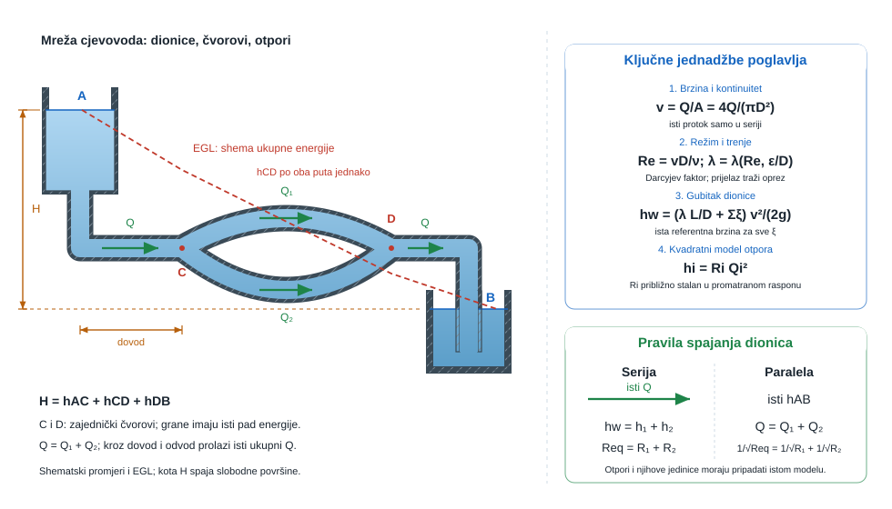
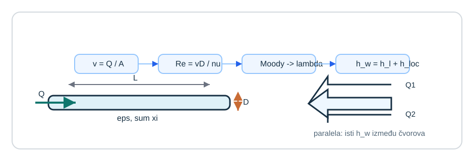
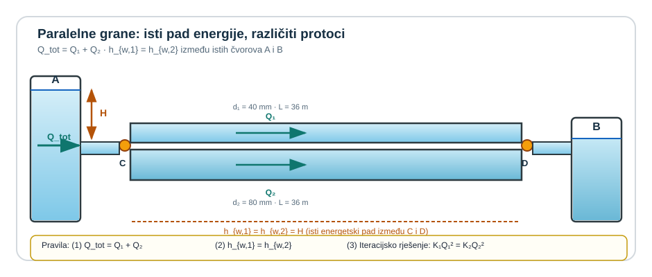
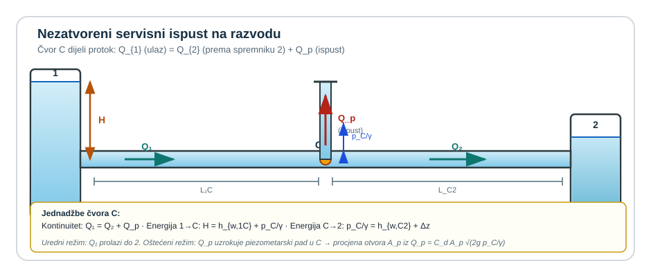
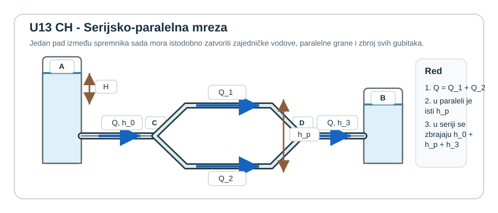
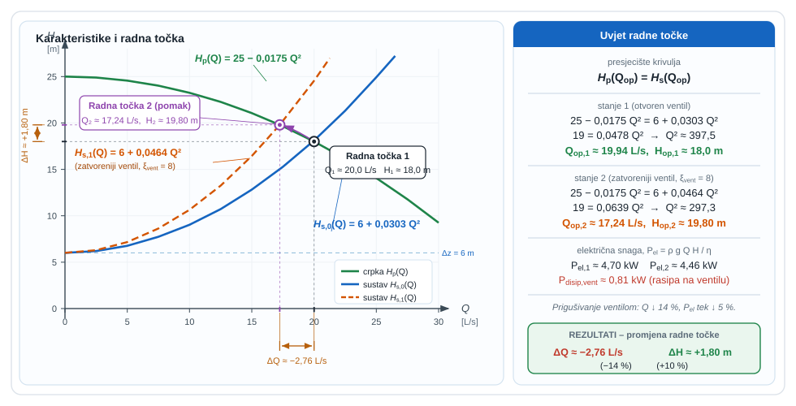
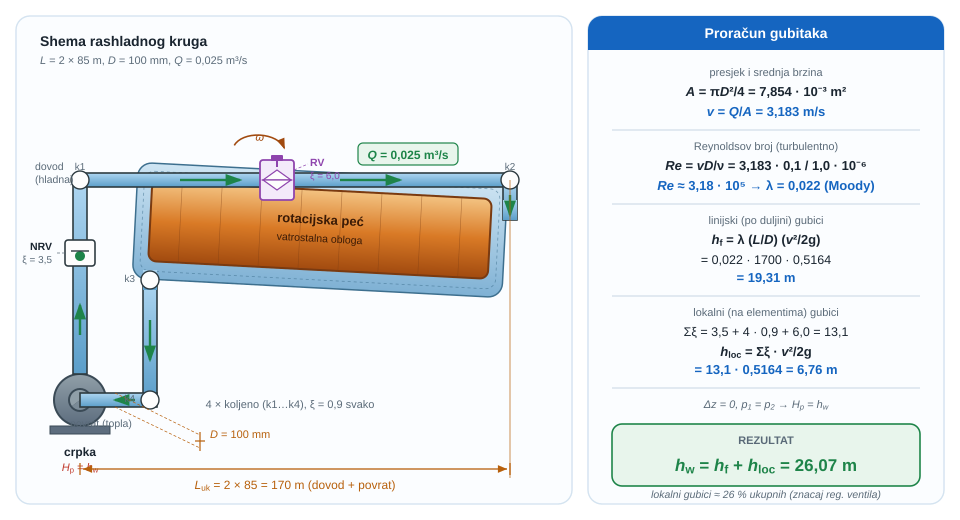
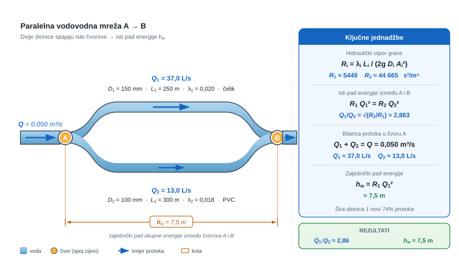
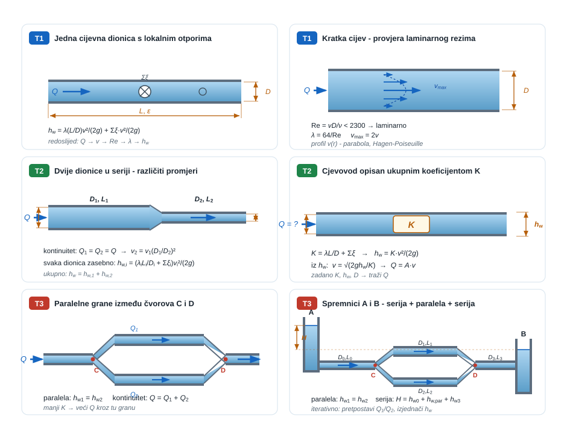

{#fig-uvod-u13 fig-align="center"}

## Cjevovod kao mreža dionica, čvorova i hidrauličkih otpora

Jedan cjevovod ovdje zatvara gotovo cijeli kolegij.

pog. 13Cjevovodi nije samo još jedno poglavlje o gubicima. U cjevovodima se na jednom mjestu spajaju kontinuitet, realni Bernoulli, izbor modela trenja i logika spajanja više grana. Zato cjevovodni zadatak vrlo brzo otkrije je li redoslijed modeliranja doista razumljen ili se samo prepoznaju pojedine formule.

::: {.mf1-application}

Inženjerski kontekst

Cjevovodi su stvarni završetak kolegija jer se u njima na jednom mjestu sastaju izbor promjera, Reynoldsov broj, trenje, lokalni gubici i raspodjela protoka po mreži. Takav se račun svakodnevno pojavljuje u industrijskim vodovima, brodskim rashladnim i balastnim mrežama, hidrantskim granama, kotlovnicama i rashladnim krugovima vozila, gdje pogrešan redoslijed modeliranja brzo znači pogrešnu radnu točku sustava.
:::

::: {.mf1-priprema}

Prije čitanja poglavlja

**Predznanje koje se pretpostavlja:**

- realni Bernoulli s gubicima iz poglavlja pog. 10Realni Bernoulli i gubici;
- kontinuitet i pojam protoka iz poglavlja pog. 8Kontrolni volumen i kontinuitet;
- Moodyjev dijagram, Reynoldsov broj i koeficijent trenja $\lambda$;
- osnove rješavanja nelinearnih i implicitnih jednadžbi (iterativno).

**Ishodi učenja:**

- pravilno postaviti redoslijed proračuna $Q \to v \to Re \to \lambda \to h_w$;
- riješiti cjevovodni sustav u seriji i u paraleli, uključujući izbor odgovarajućeg uvjeta (isti protok ili isti pad energije);
- procijeniti potrebnu snagu pumpe za cjevovodni sustav;
- prepoznati granične režime (laminarno, prijelazno, turbulentno) i njihove posljedice za odabir formula.

**Procijenjeno vrijeme:** 8–10 sati za teoriju i izvode, 6 sati za rješavanje primjera i zadataka.
:::

## Fizikalni uvod i matematički izvod

U cjevovodima se račun ne smije početi od Darcy-Weisbacha ili Moodyjeva dijagrama naslijepo. Redoslijed mora biti strogo zatvoren: iz geometrije i protoka najprije se dobiva brzina, iz brzine i promjera Reynoldsov broj, a tek nakon toga koeficijent trenja i gubitci. Taj redoslijed nije administrativna disciplina, nego fizikalna nužnost: bez brzine nema režima strujanja, a bez režima nema ni vjerodostojnoga otpora cijevi. Temeljna veza između protoka i srednje brzine jest

$$
v = \frac{Q}{A},
$$

pa iz nje odmah slijedi Reynoldsov broj

$$
Re = \frac{\rho vD}{\mu} = \frac{vD}{\nu}.
$$

::: {.callout-note collapse="true" icon="false"}
## Numerički trag

U CFD-u Reynoldsov broj **upravlja cjelokupnim tijekom rada**: određuje koji se turbulentni model bira ($k$-$\varepsilon$ za umjereno turbulentno, $k$-$\omega$ SST za odvajanje, LES za visoki $Re$), koliko gusta mora biti mreža uz zid (kriterij $y^+$) i koliko se vremena računa simulacija. Za laminarno strujanje ($Re < 2300$) turbulentni model nije potreban — CFD solver izravno rješava Navier-Stokesove jednadžbe. Za turbulentno ($Re > 4000$) bez modela disipacije svaki pokušaj rezultira numeričkim šumom.
:::

Taj broj nije samo klasifikacijska oznaka: on pokazuje dominira li u cijevi uređeno viskozno strujanje ili razvijena turbulencija. U laminarnom području otpor proizlazi izravno iz viskoznoga mehanizma, pa vrijedi

$$
\lambda = \frac{64}{Re},
$$

dok u turbulentnom području $\lambda$ više ne ovisi samo o $Re$, nego i o relativnoj hrapavosti $\varepsilon/D$. Kvantitativni izraz daje Colebrook-Whiteova jednadžba, koja je standardni model na kojemu je grafički zasnovan Moodyjev dijagram. Zašto $\lambda$ ovisi baš o $Re$ i $\varepsilon/D$ dokazuje se Buckinghamovim $\Pi$ teoremom u pog. 14Bezdimenzijski brojevi, dimenzijska analiza i sličnost.

::: {.mf1-izvod}

Matematički izvod — Colebrook-Whiteova jednadžba i Moodyjev dijagram

Za potpuno razvijeno turbulentno strujanje u kružnoj cijevi vrijedi **Colebrook-Whiteova jednadžba**:

$$
\frac{1}{\sqrt{\lambda}} = -2\log_{10}\!\left(\frac{\varepsilon/D}{3{,}7} + \frac{2{,}51}{Re\sqrt{\lambda}}\right).
$$

To je **implicitna** jednadžba — $\lambda$ se javlja na obje strane — pa se rješava iterativno. Ona objedinjuje dva granična režima:

- **Hidraulički glatka cijev** ($\varepsilon/D \to 0$, $Re$ umjereno): doprinos hrapavosti je zanemariv, pa se Colebrook-White reducira na implicitni Prandtlov zakon $1/\sqrt{\lambda} = -2\log_{10}(2{,}51/(Re\sqrt{\lambda}))$. Za $Re < 10^5$ obično se umjesto njega koristi eksplicitna **Blaziusova aproksimacija** $\lambda \approx 0{,}316\, Re^{-1/4}$.
- **Potpuno turbulentno područje** (vrlo veliki $Re$, hrapavost dominira): drugi član u zagradi nestaje, pa $\lambda$ više **ne ovisi o $Re$** nego samo o relativnoj hrapavosti. Granična vrijednost je $1/\sqrt{\lambda} = -2\log_{10}(\varepsilon/(3{,}7 D))$.

**Moodyjev dijagram** je grafička reprezentacija upravo Colebrook-Whiteove jednadžbe: krivulje $\lambda(Re)$ parametrizirane su s $\varepsilon/D$, a kako $Re$ raste, svaka krivulja se približava svojoj horizontalnoj asimptoti potpuno turbulentnog područja.

Za inženjersku procjenu bez iteracije često se koristi **Swamee-Jainova eksplicitna aproksimacija** s greškom manjom od $1\%$ u širokom rasponu:

$$
\lambda \approx \frac{0{,}25}{\left[\log_{10}\!\left(\dfrac{\varepsilon/D}{3{,}7} + \dfrac{5{,}74}{Re^{0{,}9}}\right)\right]^2}.
$$
:::

::: {.callout-note}
## Razrada koraka
Korak: od geometrije i protoka → $Re$ → $\lambda$ → $h_w$ (redoslijed koji se ne smije preskočiti)

**1. Brzina iz protoka:**
$$v = \frac{Q}{A} = \frac{Q}{\pi D^2/4} = \frac{4Q}{\pi D^2}.$$

**2. Reynoldsov broj:**
$$Re = \frac{vD}{\nu}.$$
Ako $Re < 2300$ → laminarno; ako $Re > 4000$ → turbulentno.

**3. Koeficijent trenja:**
- Laminarno: $\lambda = 64/Re$ (egzaktno, bez dijagrama).
- Turbulentno (razvijeno, hrapave cijevi): Colebrook-Whiteova jednadžba ili Moodijev dijagram s $\varepsilon/D$ i $Re$.
- Turbulentno hidraulički glatke: Blaziusova aproksimacija $\lambda \approx 0{,}316\, Re^{-1/4}$ za $Re < 10^5$.

**4. Linijski gubitak:**
$$h_l = \lambda \frac{L}{D}\frac{v^2}{2g}.$$

**5. Lokalni gubici (suma):**
$$h_{loc} = \sum \xi \frac{v^2}{2g}.$$

**6. Ukupni gubitak:**
$$h_w = h_l + h_{loc}.$$

Tipična greška: korak 3 se pogodi (npr. $\lambda = 0{,}02$ po osjećaju) bez provjere $Re$ i $\varepsilon/D$. To vodi na pogrešnu radnu točku, posebno pri promjeni protoka.
:::

Kad je koeficijent trenja određen, ukupna energijska bilanca između presjeka $A$ i $B$ piše se kao

$$
H_A + h_p - h_t = H_B + h_w,
$$

pri čemu je ukupna specifična mehanička energija fluida

$$
H = \frac{p_M}{\rho g} + z + \alpha\frac{v^2}{2g},
$$

a gubitci se rastavljaju na linijski i lokalni dio

$$
h_w = \lambda \frac{L}{D}\frac{v^2}{2g} + \sum \xi \frac{v^2}{2g}.
$$

::: {.callout-note}
## Fizikalno značenje
Darcy-Weisbachov linijski gubitak $\lambda (L/D)(v^2/2g)$ govori da je energijski trošak trenja proporcionalan duljini, obrnutno proporcionalan promjeru i kvadratno ovisi o brzini. Udvostručenjem promjera uz isti protok brzina se smanjuje četiri puta, a gubitak šesnaest puta — to je razlog zašto se za duljine transportnih vodova biraju što veći promjeri. Lokalni gubitak $\xi v^2/2g$ opisuje disipaciju u elementima poput ventila, koljena i T-račvi: $\xi$ sažima svu geometrijsku složenost u jednu bezdimenzijsku konstantu, a korisnik treba samo brzinu u referentnom presjeku.
:::

::: {.callout-note collapse="true" icon="false"}
## Numerički trag

Darcy-Weisbachov pad tlaka u ravnoj cijevi je **klasičan benchmark** za validaciju CFD-a u unutarnjem strujanju. Inženjer pokrene simulaciju duge cijevi, izmjeri pad tlaka po duljini, podijeli s $(L/D)(v^2/2g)\rho$ i dobije izračunati $\lambda$. Ako se to slaže s Moodyjevim dijagramom (za odgovarajući $Re$ i $\varepsilon/D$), simulacija dobro reproducira turbulentni granični sloj. **Wall functions** (`nutkWallFunction`, `kqRWallFunction` u OpenFOAM-u) su upravo onaj sloj koji povezuje grube zidne ćelije s analitičkim turbulentnim profilom — to su numerički ekvivalent Moodyjevog dijagrama.
:::

U tim je zapisima $p_M/(\rho g)$ tlačna visina, $z$ geodetska visina, $\alpha v^2/(2g)$ koregirana brzinska visina, $h_p$ energija koju u sustav unosi crpka, $h_t$ energija koju oduzima turbina, a $h_w$ nepovratno izgubljena mehanička energija zbog trenja, vrtloženja i lokalnih poremećaja strujanja. Tako se prvi put potpuno jasno vidi da "gubitci" nisu sporedna korekcija nego glavni jezik sustava: svaki član govori gdje energija još postoji, a gdje je već izgubljena.

::: {.mf1-izvod}

Matematički izvod — Hidraulički otpor i karakteristika sustava

Za inženjersku praksu vrlo je korisno zbrojiti sve gubitke jedne dionice u **jedan hidraulički otpor** $R$, sličan električnom otporu u Ohmovom zakonu. Polazi se od ukupnog gubitka

$$
h_w = \lambda \frac{L}{D}\frac{v^2}{2g} + \sum \xi \frac{v^2}{2g} = \frac{v^2}{2g}\!\left(\lambda \frac{L}{D} + \sum \xi\right).
$$

Brzina se izrazi preko volumenskog protoka

$$
v = \frac{Q}{A} = \frac{4Q}{\pi D^2}, \qquad v^2 = \frac{16\,Q^2}{\pi^2 D^4},
$$

pa supstitucijom slijedi

$$
h_w = \frac{16\,Q^2}{\pi^2 D^4 \cdot 2g}\!\left(\lambda \frac{L}{D} + \sum \xi\right) = \frac{8}{\pi^2 g D^4}\!\left(\frac{\lambda L}{D} + \sum \xi\right) Q^2.
$$

Definiranjem **hidrauličkog otpora dionice**

$$
R = \frac{8}{\pi^2 g}\!\left(\frac{\lambda L}{D^5} + \frac{\sum \xi}{D^4}\right)
$$

ukupni gubitak energije zapisuje se u kompaktnom obliku

$$
\boxed{h_w = R\,Q^2}.
$$

Za dionicu bez lokalnih gubitaka (samo trenje cijevi) izraz se reducira na klasični

$$
R = \frac{8\,\lambda\,L}{\pi^2 g\,D^5}.
$$

**Karakteristika sustava** dobiva se iz ukupne energijske bilance između početne i krajnje slobodne površine (gdje su brzine zanemarive, a tlakovi atmosferski). Za sustav s crpkom koja diže fluid s donje na gornju razinu vrijedi

$$
H_p(Q) = \Delta z + h_w(Q) = \Delta z + R\,Q^2,
$$

odnosno

$$
\boxed{H_s(Q) = \Delta z + R\,Q^2}.
$$

Ovo je parabola u koordinatama $(Q, H)$ s tjemenom u točki $(0, \Delta z)$: pri nultom protoku crpka mora svladati samo statičku razliku razina, a pri svakom radnom protoku k tome se pribrajaju gubici. Radna točka sustava nalazi se u presjeku $H_s(Q)$ s karakteristikom crpke $H_p(Q)$ — to je jedinstvena točka u kojoj crpka isporučuje točno onaj napor koji sustav traži za pripadni protok.

**Paralelno spojeni hidraulički otpori** ne zbrajaju se kao u električnoj mreži zbog kvadratne ovisnosti $h_w(Q)$. Za dvije paralelne grane vrijedi isti gubitak, pa iz $h_w = R_1 Q_1^2 = R_2 Q_2^2$ slijedi $Q_i = \sqrt{h_w/R_i}$. Bilanca protoka $Q_{tot} = Q_1 + Q_2$ daje ukupni otpor preko relacije

$$
\frac{1}{\sqrt{R_{eq}}} = \frac{1}{\sqrt{R_1}} + \frac{1}{\sqrt{R_2}}.
$$

Za **serijski spoj** vrijedi $h_{w,tot} = h_{w,1} + h_{w,2}$ uz isti $Q$, pa otpori se zbrajaju izravno: $R_{eq} = R_1 + R_2$.
:::

Kad se cjevovod grana, energijska jednadžba više nije dovoljna sama. Tada se moraju zatvoriti i topološka pravila mreže. U čvoru vrijedi bilanca protoka

$$
Q = \sum_i Q_i,
$$

a za paralelne grane između istih čvorova mora vrijediti jednak pad ukupne energije

$$
h_{w,1}(Q_1) = h_{w,2}(Q_2) = \dots
$$

Razlog nije proizvoljno pravilo nego činjenica da obje grane polaze iz istoga uzvodnog čvora i završavaju u istome nizvodnom čvoru. To znači da je ukupna energijska visina na početku svake grane ista, a ista mora biti i na njezinu kraju. Zato ni pad energije između ta dva čvora ne može biti različit po granama. Kad bi jedna grana između istih čvorova trošila manji $h_w$ od druge, to bi značilo da bi na zajedničkom nizvodnom čvoru dvije grane završavale s različitom energijskom visinom, što je fizikalno nemoguće za isti čvor.

Zato se u paraleli ne izjednačava protok nego se protok sam raspodjeljuje tako da svaka grana, sa svojom vlastitom geometrijom i otporom, "sjedne" na isti zajednički pad energije. Upravo je to razlog zašto šira ili hidraulički povoljnija grana spontano preuzima veći dio ukupnog protoka: ne zato što joj je propisan veći protok, nego zato što na istom dopuštenom padu energije može propustiti više tekućine.

::: {.callout-note}
## Fizikalno značenje
U paralelnoj mreži postoji jedan "budžet" energije između dvaju čvorova: sva grana mora trošiti taj isti iznos $h_w$. Grana s manjim otporom (veći promjer, manja hrapavost, manji lokalni gubici) može pri tom padu energije propustiti više tekućine. Zato je dodavanje nove grane paralelno uvijek smanjenje ukupnog otpora mreže — poput otpora u paralelnoj el. mreži. U serijskom spoju vrijedi suprotno: svaka nova dionica dodaje otpor, a protok ostaje isti kroz sve. Tu analogiju s el. kolom vrijedi imati u glavi pri svakom proračunu mreže.
:::

::: {.mf1-interaktivno}

Interaktivni prikaz — Paralelne grane cjevovoda

Interaktivni prikaz omogućuje mijenjanje duljina i promjera dvije paralelne grane te ukupnog protoka uz neposredno praćenje raspodjele protoka po granama i zajedničkog pada energije. Vizualno se odmah razabire kako geometrija određuje hidraulički udjel svake grane.

**Pitanja za samostalno istraživanje:** (a) Zašto kod identičnih grana raspodjela protoka iznosi 50:50 neovisno o ukupnom protoku? (b) Pri $L_1 = L_2$ ali $D_2 = 2 D_1$, kakva je raspodjela i koja je eksponentna ovisnost o omjeru promjera? (c) Što se događa s ukupnim padom energije pri dodavanju treće paralelne grane uz isti $Q$?

:::

To je glavni fizikalni smisao mreže: u seriji svi dijelovi nose isti protok, a u paraleli sve grane "plaćaju" isti pad ukupne energije između zajedničkih čvorova. Zbog toga svaka promjena promjera, hrapavosti, otvora ventila ili nove grane odmah mijenja radnu točku cijeloga sustava.

U pog. 10Realni Bernoulli i gubici već je bilo jasno da realni fluid troši energiju. U pog. 13Cjevovodi ta se slika širi na cijeli sustav dionica i čvorova, pa redoslijed modeliranja mora ostati stabilan: najprije mreža i dionice, zatim brzina i Reynoldsov broj, pa tek onda $\lambda$ i ukupni gubitci.

Zato u serijskom spoju isti protok prolazi kroz sve dionice, a u paralelnom je između istih čvorova jednak pad ukupne energije.

Tu nastaje najčešća zabuna: u seriji je isti $Q$, a u paraleli isti $h_w$. Tko to pomiješa, može dobiti račun koji je numerički uredan, ali fizikalno nemoguć.

Zato se većina osnovnih cjevovodnih zadataka može svesti na tri tipa: za zadanu geometriju i protok treba odrediti gubitak, za zadanu geometriju i raspoloživu energijsku visinu treba odrediti protok, a za zadani protok i dopušteni gubitak treba odabrati potreban promjer. Ta podjela ne uvodi novu fiziku, ali pomaže da se odmah prepozna što je poznato, što je nepoznato i gdje će račun biti izravan, a gdje iterativan.

## Riješeni primjeri

::: {.mf1-we}

Riješeni primjer — Od Reynoldsovog broja do ukupnog gubitka u jednoj dionici&nbsp;T2

**Kontekst:** U jednoj dionici industrijskog cjevovoda s poznatim protokom treba sustavno odrediti gubitak energije od Reynoldsovog broja, preko izbora Darcyjeva koeficijenta s Moodyjeva dijagrama, do zbrajanja linijskih i lokalnih gubitaka. Time se ilustrira redoslijed proračuna koji čini osnovu svih cjevovodnih analiza.

**Zadano**

- Promjer cijevi: $D = 0{,}09\ \text{m}$
- Volumenski protok: $Q = 0{,}018\ \text{m}^3/\text{s}$
- Duljina cijevi: $L = 42\ \text{m}$
- Apsolutna hrapavost: $\varepsilon = 0{,}15\ \text{mm}$
- Zbroj lokalnih koeficijenata: $\sum \xi = 5{,}2$
- Kinematička viskoznost vode: $\nu = 1{,}0 \cdot 10^{-6}\ \text{m}^2/\text{s}$
- Moodyjev dijagram za dobiveni $Re$ i $\varepsilon / D$ daje približno $\lambda \approx 0{,}027$.

**Traženo**

1. srednju brzinu strujanja.
2. Reynoldsov broj i režim strujanja.
3. ukupni gubitak energije $h_w$.

**Pretpostavke i model**

Promatra se jedna dionica cjevovoda s poznatim protokom. Najprije treba zatvoriti geometriju i brzinu, zatim iz Reynoldsovog broja odrediti režim strujanja, a tek onda prihvatiti vrijednost $\lambda$ i složiti ukupne gubitke.

**Rješenje**

Površina presjeka cijevi iznosi

$$
A = \frac{\pi D^2}{4} = \frac{\pi \cdot 0{,}09^2}{4} \approx 6{,}36 \cdot 10^{-3}\ \text{m}^2,
$$

pa je srednja brzina strujanja

$$
v = \frac{Q}{A} = \frac{0{,}018}{6{,}36 \cdot 10^{-3}} \approx 2{,}83\ \text{m/s}.
$$

Reynoldsov broj tada glasi

$$
Re = \frac{vD}{\nu} = \frac{2{,}83 \cdot 0{,}09}{1{,}0 \cdot 10^{-6}} \approx 2{,}55 \cdot 10^5.
$$

Takva vrijednost jasno pokazuje da je strujanje turbulentno, pa izraz $64/Re$ više nije dopušten i uz zadani Moodyjev rezultat uzimamo $\lambda \approx 0{,}027$. Brzinska visina iznosi

$$
\frac{v^2}{2g} = \frac{2{,}83^2}{2 \cdot 9{,}81} \approx 0{,}408\ \text{m}.
$$

Linijski gubitak je

$$
h_l = \lambda \frac{L}{D} \frac{v^2}{2g} = 0{,}027 \cdot \frac{42}{0{,}09} \cdot 0{,}408 \approx 5{,}14\ \text{m},
$$

a lokalni gubitak

$$
\sum h_{loc} = \sum \xi \frac{v^2}{2g} = 5{,}2 \cdot 0{,}408 \approx 2{,}12\ \text{m}.
$$

Ukupni gubitak energije zato je

$$
h_w = h_l + \sum h_{loc} \approx 5{,}14 + 2{,}12 \approx 7{,}26\ \text{m} \approx 7{,}3\ \text{m}.
$$

**Provjera i komentar**

1. Za $Re \approx 2{,}55 \cdot 10^5$ strujanje ne može biti laminarno.
2. Ukupni gubitak mora biti veći od svakog pojedinačnog doprinosa.
3. Ako je $\lambda$ odabran prije nego što je poznat $Re$, redoslijed rješavanja je kriv.

::: {.mf1-numerika .kompakt}

Numerička perspektiva

Ista cijev u CFD-u: cilindrična mreža duljine $42\ \text{m}$, na ulazu zadan protok $0{,}018\ \text{m}^3/\text{s}$, na izlazu fiksni tlak, $k$-$\omega$ SST turbulentni model, mreža uz zid prilagođena tako da je $y^+ \approx 30$ (područje *wall functions*). Solver `simpleFoam` konvergira u oko $2000$ iteracija. Iz polja tlaka iznad i ispod presjeka izravno se čita $\Delta p$ duž cijevi — podijeljen s $(L/D)(v^2/2g)\rho$ daje numerički izračunatu vrijednost $\lambda$, koja bi se za pravilno postavljenu simulaciju trebala slagati s Moodyjevom procjenom $\lambda \approx 0{,}027$ u granicama $2{-}5\%$. CFD k tome daje i lokalne brzine — vide se profili, sekundarno strujanje i mjesta gdje je granični sloj odvojen.
:::

:::

::: {.mf1-we}

Riješeni primjer — Raspodjela ukupnog protoka u dvjema paralelnim granama&nbsp;T2

**Kontekst:** U razvodnom čvoru cjevovoda ukupni protok dijeli se između dviju paralelnih grana različitih promjera, pri čemu je gubitak energije između istih čvorova jednak. Iz tog uvjeta i kontinuiteta određuje se kako se ukupni protok raspoređuje, što je temeljni alat za projektiranje vodovodnih i industrijskih razvodnih mreža.

**Zadano**

- Duljina obiju paralelnih cijevi: $L = 36\ \text{m}$
- Ukupni volumenski protok sustava: $Q_{tot} = 30\ \text{L/s} = 0{,}03\ \text{m}^3/\text{s}$
- Promjer prve grane: $d_1 = 40\ \text{mm}$
- Promjer druge grane: $d_2 = 80\ \text{mm}$
- Lokalni gubici na račvi i sastavištu zanemareni.
- Iz preliminarnog proračuna otpora uvjet jednakog gubitka daje odnos brzina: $v_2 \approx 1{,}56\, v_1$

**Traženo**

1. brzine $v_1$ i $v_2$.
2. protoke $Q_1$ i $Q_2$.

**Pretpostavke i model**

U paralelnim granama ne izjednačava se protok nego gubitak energije između istih čvorova. Ovdje je taj uvjet već sažet u odnos brzina $v_2 \approx 1{,}56 v_1$, pa zadatak služi da se jasno vidi kako se iz ukupnog protoka dobiva raspodjela na dvije grane.

**Rješenje**

Površine presjeka grana iznose

$$
A_1 = \frac{\pi d_1^2}{4} = \frac{\pi \cdot 0{,}04^2}{4} \approx 1{,}257 \cdot 10^{-3}\ \text{m}^2,
$$

$$
A_2 = \frac{\pi d_2^2}{4} = \frac{\pi \cdot 0{,}08^2}{4} \approx 5{,}027 \cdot 10^{-3}\ \text{m}^2.
$$

Ukupni protok mora biti jednak zbroju protoka po granama, $Q_{tot} = A_1 v_1 + A_2 v_2$, pa uz $v_2 = 1{,}56 v_1$ slijedi

$$
0{,}03 = \left(1{,}257 \cdot 10^{-3} + 1{,}56 \cdot 5{,}027 \cdot 10^{-3}\right) v_1 \implies v_1 \approx 3{,}29\ \text{m/s},
$$

te zatim $v_2 = 1{,}56 v_1 \approx 5{,}14\ \text{m/s}$. Protok prve grane iznosi

$$
Q_1 = A_1 v_1 \approx 1{,}257 \cdot 10^{-3} \cdot 3{,}29 \approx 4{,}14 \cdot 10^{-3}\ \text{m}^3/\text{s} \approx 4{,}1\ \text{L/s},
$$

a za drugu granu, iz kontinuiteta,

$$
Q_2 = Q_{tot} - Q_1 = 30 - 4{,}1 \approx 25{,}9\ \text{L/s}.
$$

**Provjera i komentar**

1. Šira grana mora preuzeti veći dio ukupnog protoka.
2. U paralelnom spoju ne mora vrijediti isti protok kroz obje grane.
3. Ako je izračun dao $Q_1 + Q_2 \neq Q_{tot}$, kontinuitet je negdje izgubljen.
:::

::: {.mf1-we}

Riješeni primjer — Nezatvoreni servisni ispust na rashladnom cjevovodu&nbsp;T2

**Kontekst:** Na rashladnom cjevovodu između dvaju spremnika nehotice je ostao otvoren servisni ispust, pa dio vode istječe u međuprostoru i smanjuje protok prema krajnjem spremniku. Iz mjerenja u urednom režimu i poznatih veličina u oštećenom režimu rekonstruira se gubitak protoka i veličina ispusnog otvora, što omogućuje brzu dijagnostiku kvara.

**Zadano**

- Promjer cjevovoda: $D = 0{,}16\ \text{m}$
- Ukupna duljina cjevovoda: $L = 520\ \text{m}$
- Razlika slobodnih razina spremnika: $H = 6{,}3\ \text{m}$
- Protok u urednom režimu (bez ispušta): $Q_0 = 0{,}030\ \text{m}^3/\text{s}$
- Udaljenost servisnog ispusta od prvog spremnika: $L_{1C} = 340\ \text{m}$
- Preostala duljina do drugog spremnika: $L_{C2} = 180\ \text{m}$
- Protok koji u oštećenom režimu dotječe u spremnik `2`: $Q_2 = 0{,}025\ \text{m}^3/\text{s}$
- Piezometarska visina tlaka u presjeku `C` u oštećenom režimu: $p_C/\gamma = 1{,}40\ \text{m}$
- Koeficijent istjecanja servisnog ispušta: $C_d = 0{,}62$
- Darcyjev koeficijent trenja ostaje isti kao u urednom režimu; lokalni gubici zanemarivi.

**Traženo**

1. Darcyjev koeficijent trenja $\lambda$ iz urednog režima.
2. ukupni protok $Q_C$ u dionici od spremnika `1` do točke `C` tijekom oštećenog režima.
3. protok gubitka kroz otvoreni servisni ispust.
4. ekvivalentnu površinu $A_p$ i promjer $d_p$ servisnog ispušta.

**Pretpostavke i model**

Promatra se jedan glavni cjevovod s neželjenim gubitkom kroz bočni ispust. Uredni režim služi da se odredi $\lambda$, a oštećeni režim se zatvara kombinacijom jedne Bernoullijeve jednadžbe do presjeka `C`, kontinuiteta i zakona istjecanja kroz otvoreni ispust.

**Rješenje**

Površina presjeka cijevi iznosi

$$
A = \frac{\pi D^2}{4} = \frac{\pi \cdot 0{,}16^2}{4} \approx 2{,}011 \cdot 10^{-2}\ \text{m}^2.
$$

U urednom režimu brzina u cijevi je

$$
v_0 = \frac{Q_0}{A} = \frac{0{,}030}{2{,}011 \cdot 10^{-2}} \approx 1{,}49\ \text{m/s}.
$$

Kako su oba spremnika otvorena i lokalni gubici se zanemaruju, između njihovih slobodnih razina vrijedi $H = \lambda \tfrac{L}{D} \tfrac{v_0^2}{2g}$, pa je

$$
\lambda = \frac{2gHD}{L v_0^2} = \frac{2 \cdot 9{,}81 \cdot 6{,}3 \cdot 0{,}16}{520 \cdot 1{,}49^2} \approx 0{,}0171.
$$

U oštećenom režimu neka je $v_C$ srednja brzina u dionici od spremnika `1` do presjeka `C`. Bernoullijeva jednadžba od slobodne razine spremnika `1` do presjeka `C` glasi

$$
H = \frac{p_C}{\gamma} + \frac{v_C^2}{2g} + \lambda \frac{L_{1C}}{D} \frac{v_C^2}{2g},
$$

odnosno

$$
6{,}3 = 1{,}40 + \left(1 + 0{,}0171 \cdot \frac{340}{0{,}16}\right) \frac{v_C^2}{2g} = 1{,}40 + 37{,}3 \cdot \frac{v_C^2}{2g},
$$

pa je $\tfrac{v_C^2}{2g} = \tfrac{4{,}9}{37{,}3} = 0{,}131$ i zato

$$
v_C = \sqrt{2g \cdot 0{,}131} \approx 1{,}60\ \text{m/s}.
$$

Ukupni protok u gornjoj dionici sada je

$$
Q_C = A v_C = 2{,}011 \cdot 10^{-2} \cdot 1{,}60 \approx 0{,}0323\ \text{m}^3/\text{s} \approx 32{,}3\ \text{L/s}.
$$

Kontinuitet u točki `C` daje $Q_C = Q_2 + Q_p$, pa je protok gubitka kroz servisni ispust

$$
Q_p = Q_C - Q_2 = 0{,}0323 - 0{,}0250 = 0{,}0073\ \text{m}^3/\text{s} \approx 7{,}3\ \text{L/s}.
$$

Za istjecanje kroz servisni ispust vrijedi $Q_p = C_d A_p \sqrt{2g\, p_C/\gamma}$, pa je tražena površina

$$
A_p = \frac{Q_p}{C_d \sqrt{2g (p_C/\gamma)}} = \frac{0{,}0073}{0{,}62 \sqrt{2 \cdot 9{,}81 \cdot 1{,}40}} \approx 2{,}25 \cdot 10^{-3}\ \text{m}^2.
$$

Ekvivalentni promjer otvora zato je

$$
d_p = \sqrt{\frac{4A_p}{\pi}} = \sqrt{\frac{4 \cdot 2{,}25 \cdot 10^{-3}}{\pi}} \approx 0{,}0535\ \text{m} = 53{,}5\ \text{mm}.
$$

**Provjera i komentar**

1. Ukupni protok u dionici `1-C` mora biti veći od isporuke prema spremniku `2`, jer dio vode odlazi kroz ispušt.
2. Vrijednost $p_C/\gamma + v_C^2/(2g)$ mora biti reda gubitka energije u dionici `C-2`, što ovdje i jest.
3. Dobiveni promjer reda nekoliko centimetara odgovara otvorenom servisnom priključku, a ne sitnoj mikropukotini.
:::

::: {.mf1-ch}

Cjeloviti zadatak — Serijsko-paralelna mreža između dvaju spremnika&nbsp;T4

**Kontekst:** Između dvaju otvorenih spremnika voda prolazi kroz serijsko-paralelnu mrežu cjevovoda u kojoj dovodni i odvodni vod opslužuju dvije paralelne grane različitih promjera i duljina. Iz jednakosti gubitaka u paralelnim granama i ukupne energijske bilance određuju se protoci, gubici po dionicama i ukupna disipirana hidraulička snaga.

**Zadano**

- Razlika slobodnih razina otvorenih spremnika `A` i `B`: $H = 12{,}0\ \text{m}$
- Dovodni vod `A-C`: $D_0 = 100\ \text{mm}$, $L_0 = 28\ \text{m}$, $\lambda_0 = 0{,}024$, $\sum \xi_0 = 1{,}8$
- Paralelna grana `1` (`C-D`): $D_1 = 80\ \text{mm}$, $L_1 = 32\ \text{m}$, $\lambda_1 = 0{,}026$, $\sum \xi_1 = 2{,}4$
- Paralelna grana `2` (`C-D`): $D_2 = 60\ \text{mm}$, $L_2 = 26\ \text{m}$, $\lambda_2 = 0{,}028$, $\sum \xi_2 = 3{,}1$
- Odvodni vod `D-B`: $D_3 = 100\ \text{mm}$, $L_3 = 18\ \text{m}$, $\lambda_3 = 0{,}024$, $\sum \xi_3 = 1{,}2$

Za promatrani režim uzmi da su Darcyjevi koeficijenti trenja već određeni s Moodyjeva dijagrama.

**Traženo**

1. odnos brzina $v_2/v_1$ iz uvjeta jednakog gubitka energije u paralelnim granama.
2. ukupni protok sustava $Q$ te protoke po granama $Q_1$ i $Q_2$.
3. gubitke energije u dovodnom vodu $h_0$, u paralelnim granama $h_p$ i u odvodnom vodu $h_3$.
4. snagu koju sustav disipira na hidrauličkim gubicima.

**Pretpostavke i model**

Ovaj `CH` ne vraća se na izbor `\lambda`, jer je taj korak već zatvoren na razini pojedinih dionica. Ovdje je fokus na logici mreže: u paraleli je isti gubitak energije između istih čvorova, a u seriji se gubici zbrajaju pri istom ukupnom protoku. Zato se najprije svaka dionica prevede u svoj koeficijent otpora, zatim se zatvara raspodjela po granama, a tek onda ukupna energijska bilanca sustava.

**Rješenje**

Za svaku dionicu najprije uvedimo ukupni koeficijent otpora

$$
K = \lambda \frac{L}{D} + \sum \xi
$$

pa dobivamo

$$
K_0 = 0{,}024 \cdot \frac{28}{0{,}10} + 1{,}8 = 8{,}52
$$

$$
K_1 = 0{,}026 \cdot \frac{32}{0{,}08} + 2{,}4 = 12{,}8
$$

$$
K_2 = 0{,}028 \cdot \frac{26}{0{,}06} + 3{,}1 = 15{,}23
$$

$$
K_3 = 0{,}024 \cdot \frac{18}{0{,}10} + 1{,}2 = 5{,}52
$$

U paralelnim granama mora vrijediti isti gubitak energije između čvorova `C` i `D`:

$$
K_1 \frac{v_1^2}{2g} = K_2 \frac{v_2^2}{2g}
$$

odakle slijedi

$$
v_2 = \sqrt{\frac{K_1}{K_2}} v_1 = \sqrt{\frac{12{,}8}{15{,}23}} v_1 = 0{,}917 v_1
$$

Površine presjeka iznose

$$
A_0 = A_3 = \frac{\pi \cdot 0{,}10^2}{4} = 7{,}854 \cdot 10^{-3}\ \text{m}^2
$$

$$
A_1 = \frac{\pi \cdot 0{,}08^2}{4} = 5{,}027 \cdot 10^{-3}\ \text{m}^2
$$

$$
A_2 = \frac{\pi \cdot 0{,}06^2}{4} = 2{,}827 \cdot 10^{-3}\ \text{m}^2
$$

Ukupni protok u mreži je $Q = Q_1 + Q_2 = A_1 v_1 + A_2 v_2$. Uz prethodni odnos brzina vrijedi

$$
Q = \left(5{,}027 \cdot 10^{-3} + 0{,}917 \cdot 2{,}827 \cdot 10^{-3}\right) v_1 = 7{,}618 \cdot 10^{-3} v_1.
$$

Zbog jednakih promjera zajedničkih vodova slijedi

$$
v_0 = v_3 = \frac{Q}{A_0} = \frac{7{,}618 \cdot 10^{-3}}{7{,}854 \cdot 10^{-3}} v_1 = 0{,}970 v_1.
$$

Sada se ukupni raspoloživi pad energije između spremnika zatvara kao zbroj gubitaka u seriji:

$$
H = K_0 \frac{v_0^2}{2g} + K_1 \frac{v_1^2}{2g} + K_3 \frac{v_3^2}{2g},
$$

pa uz $v_0 = v_3 = 0{,}970 v_1$ dobivamo

$$
12{,}0 = \left[8{,}52 \cdot 0{,}970^2 + 12{,}8 + 5{,}52 \cdot 0{,}970^2\right] \frac{v_1^2}{2g} = 26{,}0 \frac{v_1^2}{2g},
$$

iz čega slijedi $v_1 = 3{,}01\ \text{m/s}$, pa je $v_2 = 0{,}917 v_1 = 2{,}76\ \text{m/s}$.

Ukupni protok sustava iznosi

$$
Q = 7{,}618 \cdot 10^{-3} \cdot 3{,}01 = 2{,}292 \cdot 10^{-2}\ \text{m}^3/\text{s} \approx 22{,}9\ \text{L/s}.
$$

Protok po prvoj grani je

$$
Q_1 = A_1 v_1 = 5{,}027 \cdot 10^{-3} \cdot 3{,}01 = 1{,}512 \cdot 10^{-2}\ \text{m}^3/\text{s} \approx 15{,}1\ \text{L/s}.
$$

Za drugu granu dobiva se

$$
Q_2 = A_2 v_2 = 2{,}827 \cdot 10^{-3} \cdot 2{,}76 = 7{,}80 \cdot 10^{-3}\ \text{m}^3/\text{s} \approx 7{,}8\ \text{L/s}.
$$

Brzina u zajedničkim vodovima sada je

$$
v_0 = v_3 = \frac{Q}{A_0} = 2{,}92\ \text{m/s}
$$

Gubitak u dovodnom vodu iznosi

$$
h_0 = K_0 \frac{v_0^2}{2g} = 8{,}52 \cdot \frac{2{,}92^2}{2 \cdot 9{,}81} = 3{,}70\ \text{m}
$$

Gubitak u paralelnom dijelu mreže jednak je u obje grane:

$$
h_p = K_1 \frac{v_1^2}{2g} = 12{,}8 \cdot \frac{3{,}01^2}{2 \cdot 9{,}81} = 5{,}91\ \text{m}
$$

a provjerom po drugoj grani dobiva se ista vrijednost unutar zaokruzenja.

Za odvodni vod slijedi

$$
h_3 = K_3 \frac{v_3^2}{2g} = 5{,}52 \cdot \frac{2{,}92^2}{2 \cdot 9{,}81} = 2{,}40\ \text{m}
$$

Provjera ukupne bilance sada glasi

$$
h_0 + h_p + h_3 = 3{,}70 + 5{,}91 + 2{,}40 = 12{,}01\ \text{m} \approx H
$$

Snaga koja se u tom režimu disipira na hidrauličkim gubicima iznosi

$$
P_{gub} = \rho g QH = 1000 \cdot 9{,}81 \cdot 0{,}0229 \cdot 12{,}0 = 2{,}70 \cdot 10^3\ \text{W} \approx 2{,}70\ \text{kW}.
$$

**Provjera i komentar**

Ovaj primjer zatvara mrežni sloj pog. 13Cjevovodi u jednom sustavu: iz uvjeta jednakog gubitka energije slijedi $v_2 \approx 0{,}917 v_1$, ukupni protok mreže je oko $22{,}9\ \text{L/s}$, a raspodjela po granama iznosi oko $15{,}1\ \text{L/s}$ i $7{,}8\ \text{L/s}$. Gubici se tada uredno slažu kao serijski zbroj $h_0 + h_p + h_3 \approx 12\ \text{m}$, pa cijeli sustav disipira oko $2{,}70\ \text{kW}$ hidrauličke snage.

1. Šira grana mora nositi veći dio ukupnog protoka, pa ovdje mora biti $Q_1 > Q_2$.
2. U paralelnim granama ne izjednačava se protok nego gubitak energije između istih čvorova.
3. Ukupni pad između spremnika mora biti jednak zbroju gubitaka u dovodu, paralelnom dijelu i odvodu; ako taj zbroj ne vrati $H$, mreža nije zatvorena.
:::

::: {.mf1-ch}

Cjeloviti zadatak — Radna točka crpka⇄cjevovod: presjecište karakteristika i utjecaj regulacijskog ventila&nbsp;T4

**Kontekst:** Stvarni radni režim crpke u sustavu određen je presjecištem njezine karakteristike i karakteristike cjevovoda. Ovim zadatkom najprije se određuje izvorna radna točka, a zatim se prati pomak protoka i napora kada se djelomično zatvori regulacijski ventil, čime se kvantificira energetska cijena prigušivanja umjesto frekvencijske regulacije.

**Zadano**

Inženjer ne dimenzionira crpku tako da računa "crpkin napor" zasebno i "otpor sustava" zasebno. Pravi pogonski uvjet je **radna točka** – presjecište **dvije** karakteristike: $H_p(Q)$ koju crpka može dati i $H_s(Q)$ koju sustav (cjevovod, geodetska visina, lokalni elementi) traži. Tek na tom presjecištu vrijedi:

$$
H_p(Q_{op}) = H_s(Q_{op})
$$

i pri tom protoku $Q_{op}$ crpka stvarno radi.

Ovaj zadatak rješava prvu radnu točku, zatim **mijenja sustav** djelomičnim zatvaranjem regulacijskog ventila i pronalazi **novu** radnu točku.

**Karakteristika crpke** (mjerena, aproksimirana paraboličnom funkcijom):

$$
H_p(Q) = H_0 - a_p Q^2 = 25 - 0{,}0175 \cdot Q^2 \quad [\text{m, } Q \text{ u L/s}]
$$

Karakteristične točke: $H_p(0) = 25\ \text{m}$, $H_p(20) = 18\ \text{m}$.

**Sustav (geometrija i fluid):**

- Geodetska razlika između spremnika i potrošača: $\Delta z = 6{,}0\ \text{m}$
- Duljina cjevovoda (od spremnika do potrošača): $L = 40\ \text{m}$
- Promjer cijevi: $D = 80\ \text{mm}$
- Koeficijent linijskog gubitka: $\lambda = 0{,}022$
- Zbroj koeficijenata lokalnih gubitaka u izvornom stanju: $\sum\xi_0 = 4$
- Voda: $\rho = 1000\ \text{kg/m}^3$, $g = 9{,}81\ \text{m/s}^2$
- Učinkovitost crpke: $\eta = 0{,}75$

**Scenarij promjene:** Regulacijski ventil na cjevovodu je djelomično zatvoren, dodajući $\xi_{vent} = 8$ lokalnim gubicima.

**Traženo**

1. Izvesti karakteristiku sustava $H_s(Q)$ za izvorno stanje (otvoren ventil).
2. Odrediti **radnu točku 1** (presjecište $H_p$ i $H_{s,0}$): protok $Q_{op,1}$ i napor $H_{op,1}$.
3. Električna snaga koju crpka stvarno troši u radnoj točki 1 (uz zadanu $\eta$).
4. Izvesti novu karakteristiku $H_{s,1}(Q)$ s djelomično zatvorenim ventilom.
5. Odrediti **radnu točku 2**: koliko se smanji protok i koliko poraste napor crpke.
6. Procijeniti hidrauličku snagu koja se rasipa **samo na ventilu** u stanju 2. Što je s ukupnom električnom snagom koju crpka troši?

{#fig-u13-radna-tocka fig-align="center"}

**Pretpostavke i model**

Crpka i sustav rade u stacionarnom stanju. Crpka je idealizirano modelirana paraboličnom karakteristikom $H_p = H_0 - a_p Q^2$ (uobičajeno za radijalne centrifugalne crpke u području oko nominalne radne točke).

Karakteristika sustava zbraja **statički** dio (geodetska visina $\Delta z$ – ne ovisi o $Q$) i **dinamički** dio (svi gubici, kvadratno ovisni o $Q$):

$$
H_s(Q) = \Delta z + \left(\lambda \frac{L}{D} + \sum\xi\right) \frac{v^2}{2g}, \qquad v = \frac{Q}{A}, \qquad A = \frac{\pi D^2}{4}
$$

Ventil djeluje **isključivo** kroz povećanje $\sum\xi$ – ne mijenja geometriju ni $\Delta z$ ni geometrijski $\lambda L/D$.

**Rješenje**

**1. Karakteristika sustava (otvoren ventil).** Površina presjeka:

$$
A = \frac{\pi D^2}{4} = \frac{\pi \cdot 0{,}080^2}{4} \approx 5{,}03 \cdot 10^{-3}\ \text{m}^2
$$

Brzinski tlak po protoku (s $Q$ u m³/s):

$$
\frac{v^2}{2g} = \frac{(Q/A)^2}{2g} = \frac{Q^2}{2gA^2} \approx \frac{Q^2}{2 \cdot 9{,}81 \cdot (5{,}03 \cdot 10^{-3})^2} \approx 2017 \cdot Q^2
$$

Linijski i lokalni faktor (otvoren ventil):

$$
\lambda \frac{L}{D} + \sum\xi_0 = 0{,}022 \cdot \frac{40}{0{,}080} + 4 = 11 + 4 = 15
$$

$$
H_{s,0}(Q) = 6 + 15 \cdot 2017 \cdot Q^2 \approx 6 + 30\,250 \cdot Q^2 \quad [\text{Q u m³/s}]
$$

Pretvorba na $Q$ u L/s ($Q_{m³/s} = Q_{L/s} \cdot 10^{-3}$, dakle $Q^2$ se pomnoži s $10^{-6}$):

$$
H_{s,0}(Q) = 6 + 0{,}0303 \cdot Q^2 \quad [\text{m, } Q \text{ u L/s}]
$$

**2. Radna točka 1.** Iz $H_p(Q) = H_{s,0}(Q)$:

$$
25 - 0{,}0175 Q^2 = 6 + 0{,}0303 Q^2
$$

$$
19 = 0{,}0478 Q^2 \quad \Rightarrow \quad Q^2 \approx 397{,}5 \quad \Rightarrow \quad Q_{op,1} \approx 19{,}94\ \text{L/s} \approx 20{,}0\ \text{L/s}
$$

$$
H_{op,1} = 25 - 0{,}0175 \cdot 397{,}5 \approx 18{,}0\ \text{m}
$$

**3. Električna snaga crpke u radnoj točki 1:**

$$
P_{el,1} = \frac{\rho g Q_{op,1} H_{op,1}}{\eta} = \frac{1000 \cdot 9{,}81 \cdot 0{,}01994 \cdot 18{,}0}{0{,}75} \approx 4{,}70\ \text{kW}
$$

**4. Karakteristika sustava sa zatvorenijim ventilom.** Novi zbroj koeficijenata: $\sum\xi_1 = 4 + 8 = 12$.

$$
\lambda \frac{L}{D} + \sum\xi_1 = 11 + 12 = 23
$$

$$
H_{s,1}(Q) = 6 + 23 \cdot 2017 \cdot Q^2 \approx 6 + 0{,}0464 \cdot Q^2 \quad [\text{m, } Q \text{ u L/s}]
$$

**5. Radna točka 2:**

$$
25 - 0{,}0175 Q^2 = 6 + 0{,}0464 Q^2 \quad \Rightarrow \quad 19 = 0{,}0639 Q^2
$$

$$
Q^2 \approx 297{,}3 \quad \Rightarrow \quad Q_{op,2} \approx 17{,}24\ \text{L/s}
$$

$$
H_{op,2} = 25 - 0{,}0175 \cdot 297{,}3 \approx 19{,}80\ \text{m}
$$

Promjene radne točke:

$$
\Delta Q = Q_{op,2} - Q_{op,1} \approx -2{,}76\ \text{L/s} \quad (\approx -14\%)
$$

$$
\Delta H = H_{op,2} - H_{op,1} \approx +1{,}80\ \text{m} \quad (\approx +10\%)
$$

**6. Snaga rasuta na ventilu.** Gubitak na samom ventilu pri $Q_{op,2}$:

$$
h_{vent} = \xi_{vent} \cdot \frac{v^2}{2g}
$$

$$
v_2 = \frac{Q_{op,2}}{A} = \frac{0{,}01724}{5{,}03 \cdot 10^{-3}} \approx 3{,}43\ \text{m/s}
$$

$$
\frac{v_2^2}{2g} = \frac{3{,}43^2}{19{,}62} \approx 0{,}60\ \text{m}
$$

$$
h_{vent} \approx 8 \cdot 0{,}60 \approx 4{,}80\ \text{m}
$$

$$
P_{disip,vent} = \rho g Q_{op,2} h_{vent} = 1000 \cdot 9{,}81 \cdot 0{,}01724 \cdot 4{,}80 \approx 0{,}81\ \text{kW}
$$

Ukupna električna snaga u stanju 2:

$$
P_{el,2} = \frac{\rho g Q_{op,2} H_{op,2}}{\eta} = \frac{1000 \cdot 9{,}81 \cdot 0{,}01724 \cdot 19{,}80}{0{,}75} \approx 4{,}46\ \text{kW}
$$

**Provjera i komentar**

1. **Radna točka nije ona koja je u datasheetu crpke.** Crpkin "$H = 18\ \text{m}$ pri $Q = 20$ L/s" je samo **jedna točka** na njenoj krivulji $H_p(Q)$. To što stvarno radi (Q_op, H_op) određuje sustav, a ne crpka. U ovom slučaju početne radne točke prilično prate katalošku vrijednost, jer je sustav pažljivo projektiran.
2. **Zatvaranje ventila ne smanjuje snagu, već je preraspodjeljuje.** U stanju 1 ($Q = 20$, $H = 18$): električna snaga $4{,}70$ kW. U stanju 2 ($Q = 17{,}2$, $H = 19{,}8$): električna snaga $4{,}46$ kW. Snaga se **smanjila** svega 5% iako se protok smanjio za 14%. Razlog je da crpka u stanju 2 radi pri **višem** naporu (paradoksalno, zatvaranje ventila čini cijev "težom" za crpku po jedinici protoka).
3. **Od smanjene snage, dio sad ide u ventil**: $P_{disip,vent} \approx 0{,}81\ \text{kW}$ se **rasipa kao toplina u ventilu**, a samo $4{,}46 - 0{,}81 = 3{,}65$ kW ide u korisni rad (cjevovod + geodetski uspon). U stanju 1 ($\xi_{vent} = 0$) sva potrošena snaga ide u cjevovod i geodetski uspon. Zato **regulacija protoka prigušnim ventilom je energetski rasipnik** – dvije trećine smanjenja protoka plaća se rasipanjem energije u ventilu.
4. **Energetski razumna alternativa** je **frekvencijska regulacija** broja okretaja crpke. Pri smanjenju $n$ od $100\%$ do $86\%$ ($Q \propto n$) crpka isporučuje manje, ali joj se i krivulja $H_p$ pomiče prema dolje – nova radna točka ima manji protok bez umjetnih gubitaka u ventilu. Snaga pada **kockoljiko** s $n$ (afinitetni zakoni: $P \propto n^3$), pa je smanjenje protoka za 14% zapravo $\approx -36\%$ snage – sedam puta manje gubitaka od prigušivanja.
5. **Granični slučaj** $\xi_{vent} \to \infty$ (potpuno zatvoren ventil): karakteristika sustava postaje vertikalna ($H_s$ raste neograničeno za bilo koji $Q > 0$), pa se sustav siječe s $H_p$ pri $Q = 0$ na vertikalnoj osi. Crpka radi pri "shut-off head" $H_0 = 25$ m bez protoka. Ovo je opasno stanje za centrifugalnu crpku: voda u kućištu kruži bez izlaska, zagrijava se i može u nekoliko minuta dovesti do oštećenja rotora. Zato sve centrifugalne crpke imaju ili **bypass** (mali otvor koji uvijek propušta dio protoka) ili automatsko isključivanje pri shut-off uvjetu.
6. **Inženjerska poruka**: regulacijski ventil nije problem sam po sebi (često je nužan za precizno doziranje ili sigurnost). Problem je kad se koristi kao **trajna** mjera regulacije protoka. Za varijabilni protok u velikoj instalaciji rješenje je **frekvencijski regulator** crpke; ventil ostaje za fina podešavanja, hitno zatvaranje i izolaciju.
:::

Prije zadataka vrijedi držati na okupu osnovna pravila mreže:

- u seriji se zbrajaju gubici pri istom protoku
- u paraleli se protok raspodjeljuje pri istom gubitku između čvorova

::: {.mf1-we}

Riješeni primjer — Rashladni cjevovod rotacijske peći &nbsp;T2

**Primjer za strojare**

**Kontekst:** Rashladni krug rotacijske peći u cementari vodi vodu kroz dovodnu i odvodnu cijev duljine $L = 85\ \text{m}$ (svaka), promjera $D = 100\ \text{mm}$, hrapavosti $\varepsilon = 0{,}1\ \text{mm}$. Krug uključuje jedan nepovratni ventil ($\xi = 3{,}5$), četiri koljena ($\xi = 0{,}9$ svako) i jedan regulacijski ventil ($\xi = 6{,}0$). Protok je $Q = 0{,}025\ \text{m}^3/\text{s}$, $\nu = 1{,}0 \cdot 10^{-6}\ \text{m}^2/\text{s}$, $\lambda = 0{,}022$ (Moody). Odredi ukupni gubitak i potrebnu dopremnu visinu crpke.

**Zadano**

- $L_{uk} = 2 \times 85 = 170\ \text{m}$, $D = 0{,}100\ \text{m}$, $\varepsilon/D = 0{,}001$
- $Q = 0{,}025\ \text{m}^3/\text{s}$, $\lambda = 0{,}022$
- Lokalni: $\Sigma\xi = 3{,}5 + 4 \cdot 0{,}9 + 6{,}0 = 13{,}1$
- Geodetska razlika između usisa i potiska crpke: $\Delta z = 0$ (isti nivo)
- Na ulazu i izlazu rashladnika: $p_1 = p_2$ (isti nadtlak)

{#fig-u13-rashladni-cjevovod-peci fig-align="center"}

**Rješenje**

$$
A = \frac{\pi \cdot 0{,}100^2}{4} = 7{,}854 \cdot 10^{-3}\ \text{m}^2, \quad v = \frac{0{,}025}{7{,}854 \cdot 10^{-3}} = 3{,}183\ \text{m/s}
$$

$$
Re = \frac{3{,}183 \cdot 0{,}100}{1{,}0 \cdot 10^{-6}} = 3{,}18 \cdot 10^5 \quad \text{(turbulentno)}
$$

$$
h_l = 0{,}022 \cdot \frac{170}{0{,}100} \cdot \frac{3{,}183^2}{2 \cdot 9{,}81} = 0{,}022 \cdot 1700 \cdot 0{,}5164 = 19{,}31\ \text{m}
$$

$$
h_{loc} = 13{,}1 \cdot \frac{3{,}183^2}{2 \cdot 9{,}81} = 13{,}1 \cdot 0{,}5164 = 6{,}76\ \text{m}
$$

$$
h_w = 19{,}31 + 6{,}76 = 26{,}07\ \text{m}
$$

Crpka mora savladati gubitke u krugu, pa je potrebna dopremna visina crpke: $H_p = h_w = 26{,}07\ \text{m}$.

**Provjera i komentar**

Lokalni gubici čine $26\%$ ukupnih — značajan udio zbog regulacijskog ventila ($\xi = 6$). Ako se ventil zatvori na $\xi = 12$, lokalni gubici rastu na $12{,}2\ \text{m}$, ukupni na $31{,}5\ \text{m}$ — +21%. To pokazuje zašto regulacijski ventili moraju biti u proračunu crpne instalacije, ne naknadno dodani.

:::

::: {.mf1-we}

Riješeni primjer — Paralelna razvodna mreža vodovoda &nbsp;T2

**Primjer za građevinare**

**Kontekst:** Vodovodna mreža u stambenoj zoni ima dvije paralelne dionice između čvorova A i B. Dionica 1 je čelična cijev $D_1 = 150\ \text{mm}$, $L_1 = 250\ \text{m}$, $\lambda_1 = 0{,}020$. Dionica 2 je PVC cijev $D_2 = 100\ \text{mm}$, $L_2 = 300\ \text{m}$, $\lambda_2 = 0{,}018$. Bez lokalnih gubitaka. Ukupni protok je $Q = 0{,}050\ \text{m}^3/\text{s}$.

**Traženo**

Distribucija protoka $Q_1$ i $Q_2$ te zajednički pad tlaka između A i B.
{#fig-u13-paralelne-grane-vodovod fig-align="center"}
**Rješenje**

Koeficijent otpora svake grane: $R_i = \lambda_i \frac{L_i}{D_i} \frac{1}{2g A_i^2}$ (iz $h_{w,i} = R_i Q_i^2$).

$$
A_1 = \frac{\pi \cdot 0{,}150^2}{4} = 1{,}767 \cdot 10^{-2}\ \text{m}^2, \quad R_1 = 0{,}020 \cdot \frac{250}{0{,}150} \cdot \frac{1}{2 \cdot 9{,}81 \cdot (1{,}767 \cdot 10^{-2})^2} = \frac{0{,}020 \cdot 1666{,}7}{6{,}119 \cdot 10^{-3}} = 5449
$$

$$
A_2 = \frac{\pi \cdot 0{,}100^2}{4} = 7{,}854 \cdot 10^{-3}\ \text{m}^2, \quad R_2 = 0{,}018 \cdot \frac{300}{0{,}100} \cdot \frac{1}{2 \cdot 9{,}81 \cdot (7{,}854 \cdot 10^{-3})^2} = \frac{0{,}018 \cdot 3000}{1{,}209 \cdot 10^{-3}} = 44\,665
$$

Uvjet iste energetske razlike: $R_1 Q_1^2 = R_2 Q_2^2$, tj. $\sqrt{R_1}\, Q_1 = \sqrt{R_2}\, Q_2$:
$$\frac{Q_1}{Q_2} = \sqrt{\frac{R_2}{R_1}} = \sqrt{\frac{44665}{5449}} = \sqrt{8{,}197} = 2{,}863$$

S $Q_1 + Q_2 = 0{,}050$:
$$Q_1 = \frac{2{,}863}{3{,}863} \cdot 0{,}050 = 0{,}03704\ \text{m}^3/\text{s}, \quad Q_2 = 0{,}01296\ \text{m}^3/\text{s}$$

Zajednički pad energije:
$$h_w = R_1 Q_1^2 = 5449 \cdot (0{,}03704)^2 = 5449 \cdot 1{,}372 \cdot 10^{-3} = 7{,}47\ \text{m}$$

**Provjera:** $R_2 Q_2^2 = 44665 \cdot (0{,}01296)^2 = 44665 \cdot 1{,}680 \cdot 10^{-4} = 7{,}50\ \text{m}$ (razlika zbog zaokruživanja)

**Provjera i komentar**

Dionica 1 (šira) nosi $74\%$ protoka uz $7{,}5\ \text{m}$ pada, dionica 2 nosi samo $26\%$. Ako se dionica 2 zatvori (kvar), cijeli protok ide kroz dionicu 1, a pad energije pada na $R_1 \cdot 0{,}050^2 = 13{,}6\ \text{m}$ — pumpa mora biti dimenzioniranana za tu rezervu.

:::

::: {.mf1-we}

Riješeni primjer — Mreža navodnjavanja u vertikalnoj hidroponskoj farmi &nbsp;T3

**Kontekst:** Vertikalne hidroponske farme u urbanim sredinama uzgajaju zelenu salatu i druge zelene kulture u uzastopnim katovima, pri čemu se hranjiva otopina cirkulira kroz paralelne grane različitih duljina i promjera. Svaka grana opslužuje različit broj biljaka, pa se geometrija pojedine grane bira tako da svaka biljka dobije približno jednaki protok unatoč razlikama u duljini cijevi do nje. Pumpa u podrumu farme dovodi otopinu iz centralnog spremnika.

**Zadano**

- Grana 1 (prvi kat, $80$ biljaka): $L_1 = 25\ \text{m}$, $D_1 = 18\ \text{mm}$
- Grana 2 (drugi kat, $120$ biljaka): $L_2 = 35\ \text{m}$, $D_2 = 22\ \text{mm}$
- Grana 3 (treći kat, $150$ biljaka): $L_3 = 45\ \text{m}$, $D_3 = 25\ \text{mm}$
- Ukupni protok hranjive otopine: $Q = 8\ \text{L/min}$
- Koeficijent trenja (aproksimacija razvijenog turbulentnog područja): $\lambda = 0{,}025$
- Gustoća hranjive otopine: $\rho = 1\,010\ \text{kg/m}^3$
- Lokalni gubici uračunati su u efektivnu duljinu, ostali se zanemaruju
- Tri grane vežu iste ulazne i izlazne čvorove preko vertikalnog kolektora

**Traženo**

1. Hidraulički otpor pojedine grane $k_i$;
2. Raspodjela protoka po granama;
3. Zajednički pad ukupne energije između čvorova;
4. Procjena prosječnog protoka po pojedinoj biljci u svakom katu.

**Pretpostavke i model**

Sve tri grane vežu iste ulazne i izlazne čvorove, pa između njih vrijedi uvjet jednakog pada ukupne energije. Strujanje je u svakoj grani turbulentno (provjerit će se preko brzina). Hranjiva otopina smatra se newtonskim fluidom slične gustoće kao voda. Lokalni gubici (priključci na pojedinu biljku, T-spojevi) sažeti su u zajedničkom koeficijentu $\lambda$, pa se Darcy-Weisbachova formula primjenjuje na efektivnu duljinu svake grane. Razlika visine između katova u ovom proračunu zanemaruje se jer se pumpa dimenzionira posebno za nju, a ovaj proračun obrađuje samo raspodjelu protoka kroz paralelne grane.

**Rješenje**

Hidraulički otpor pojedine grane definira se preko $h_w = k\,Q^2$, pri čemu je koeficijent:

$$
k_i = \frac{8\,\lambda\,L_i}{\pi^2\,g\,D_i^5}.
$$

Računaju se redom:

$$
k_1 = \frac{8 \cdot 0{,}025 \cdot 25}{\pi^2 \cdot 9{,}81 \cdot 0{,}018^5} \approx 2{,}73 \cdot 10^7\ \text{s}^2/\text{m}^5,
$$

$$
k_2 = \frac{8 \cdot 0{,}025 \cdot 35}{\pi^2 \cdot 9{,}81 \cdot 0{,}022^5} \approx 1{,}40 \cdot 10^7\ \text{s}^2/\text{m}^5,
$$

$$
k_3 = \frac{8 \cdot 0{,}025 \cdot 45}{\pi^2 \cdot 9{,}81 \cdot 0{,}025^5} \approx 0{,}95 \cdot 10^7\ \text{s}^2/\text{m}^5.
$$

Iz uvjeta jednakog pada $k_i Q_i^2 = h_w$ za sve grane slijedi $Q_i = \sqrt{h_w/k_i}$. Ukupni protok:

$$
Q = \sum_i Q_i = \sqrt{h_w}\,\sum_i \frac{1}{\sqrt{k_i}}.
$$

Računaju se $1/\sqrt{k_i}$:

$$
\frac{1}{\sqrt{k_1}} \approx 1{,}91 \cdot 10^{-4}, \quad
\frac{1}{\sqrt{k_2}} \approx 2{,}67 \cdot 10^{-4}, \quad
\frac{1}{\sqrt{k_3}} \approx 3{,}24 \cdot 10^{-4},
$$

s ukupnim zbrojem približno $7{,}82 \cdot 10^{-4}$. Pretvorba protoka u SI:

$$
Q = 8\ \text{L/min} = 1{,}333 \cdot 10^{-4}\ \text{m}^3/\text{s}.
$$

Odatle slijedi:

$$
\sqrt{h_w} = \frac{Q}{\sum_i 1/\sqrt{k_i}} = \frac{1{,}333 \cdot 10^{-4}}{7{,}82 \cdot 10^{-4}} \approx 0{,}170,
$$

$$
h_w \approx 0{,}029\ \text{m}.
$$

Pojedinačni protoci po granama:

$$
Q_1 = 0{,}170 \cdot 1{,}91 \cdot 10^{-4} \approx 3{,}26 \cdot 10^{-5}\ \text{m}^3/\text{s} \approx 1{,}96\ \text{L/min},
$$

$$
Q_2 = 0{,}170 \cdot 2{,}67 \cdot 10^{-4} \approx 4{,}55 \cdot 10^{-5}\ \text{m}^3/\text{s} \approx 2{,}73\ \text{L/min},
$$

$$
Q_3 = 0{,}170 \cdot 3{,}24 \cdot 10^{-4} \approx 5{,}51 \cdot 10^{-5}\ \text{m}^3/\text{s} \approx 3{,}31\ \text{L/min}.
$$

Provjera ukupnog protoka: $1{,}96 + 2{,}73 + 3{,}31 = 8{,}00\ \text{L/min}$

Prosječni protok po pojedinoj biljci u svakom katu:

$$
q_1 = \frac{Q_1}{80} \approx 0{,}0245\ \text{L/min}, \quad
q_2 = \frac{Q_2}{120} \approx 0{,}0228\ \text{L/min}, \quad
q_3 = \frac{Q_3}{150} \approx 0{,}0221\ \text{L/min}.
$$

**Provjera i komentar**

Iako su grane geometrijski različite (različite duljine i promjeri), raspodjela protoka spontano se podešava prema uvjetu jednakog pada energije. Kraće i šire grane bi inače dobile prevelik dio protoka, ali su u ovom slučaju brojevi biljaka pažljivo usklađeni s geometrijom svake grane, pa svaka biljka prima približno $22\,\text{–}\,25\ \text{mL/min}$ — vrijednost karakteristična za NFT način uzgoja (engl. *nutrient film technique*). Zajednički pad energije od svega $2{,}9\ \text{cm}$ vodenog stupca pokazuje da gubici u paralelnim granama nisu kritični; dominantna potreba za snagom pumpe dolazi iz svladavanja visinskih razlika između katova i nesimetričnih lokalnih gubitaka na čvorovima. Vertikalne hidroponske farme upravo zato koriste tihu pumpu manje snage, ali kontinuiranog rada, čime se postiže energetska učinkovitost znatno veća od klasičnog tla-baziranog uzgoja.
:::

::: {.mf1-samoprovjera}

Provjeri sebe

Sljedeća pitanja služe za samostalnu provjeru razumijevanja prije prelaska na zadatke za vježbu.

1. Zašto u proračunu cjevovoda nije dopušteno odabrati $\lambda$ prije nego što je poznat Reynoldsov broj?

::: {.callout-note collapse="true"}
### Odgovor
Koeficijent trenja $\lambda$ ovisi o Reynoldsovu broju i o relativnoj hrapavosti, pa procjena $\lambda$ bez poznatog $Re$ daje pogrešnu vrijednost. Pravilan redoslijed je: iz geometrije i protoka odrediti $v$, iz toga $Re$, te tek nakon utvrđenog režima pročitati ili izračunati $\lambda$.
:::

2. Po čemu se razlikuju pravila spajanja cijevi u seriji od pravila spajanja u paraleli?

::: {.callout-note collapse="true"}
### Odgovor
U serijskom spoju iste cijevi nose isti protok $Q$, a ukupni gubitak energije jednak je zbroju gubitaka u pojedinim dionicama. U paralelnom spoju iste dionice imaju isti pad ukupne energije $h_w$ između zajedničkih čvorova, a ukupni protok jednak je zbroju protoka po pojedinim granama.
:::

3. Što se događa s ukupnim hidrauličkim otporom mreže pri dodavanju nove paralelne grane?

::: {.callout-note collapse="true"}
### Odgovor
Ukupni se otpor smanjuje, jednako kao kod dodavanja paralelnog otpornika u električnom strujnom krugu. Pri istom raspoloživom padu energije ukupni protok kroz mrežu raste. Suprotno, dodavanje dionice u seriji povećava ukupni otpor.
:::

4. Zašto se inženjerski proračun cjevovoda često rješava iterativno, a ne izravno?

::: {.callout-note collapse="true"}
### Odgovor
Koeficijent trenja $\lambda$ ovisi o Reynoldsovu broju, a Reynoldsov broj o brzini, koja u nekim zadacima ovisi o gubicima. To stvara međuzavisnost koja se ne može riješiti jednim algebarskim potezom; umjesto toga primjenjuje se iterativni postupak: pretpostavi se vrijednost, izračuna pripadna druga vrijednost, te se postupak ponavlja dok promjene ne postanu zanemarive.
:::
:::

## Zadaci za vježbu

::: {.mf1-vjezbe-list}
1. **T1** Voda struji cijevi promjera $D = 75\ \text{mm}$ protokom $Q = 0{,}013\ \text{m}^3/\text{s}$. Duljina cijevi je $L = 34\ \text{m}$, apsolutna hrapavost $\varepsilon = 0{,}12\ \text{mm}$, a zbroj lokalnih koeficijenata iznosi $\sum\xi = 4{,}1$. Za vodu uzmi $\nu = 1{,}0 \cdot 10^{-6}\ \text{m}^2/\text{s}$ i Moodyjev koeficijent $\lambda = 0{,}026$. Odredi srednju brzinu, Reynoldsov broj i ukupni gubitak energije.

	**Natuknica:** redoslijed je $Q \rightarrow v \rightarrow Re \rightarrow h_w$; ukupni gubitak je zbroj linijskog i lokalnog dijela. (Rješenje: $v \approx 2{,}94\ \text{m/s}$; $Re \approx 2{,}2 \cdot 10^5$; $h_w \approx 7{,}0\ \text{m}$.)

	**Skica:** da - jedna cijevna dionica s duljinom $L$, promjerom $D$ i lokalnim elementima.

2. **T1** Voda struji cijevi promjera $D = 18\ \text{mm}$ protokom $Q = 1{,}0\times10^{-4}\ \text{m}^3/\text{s}$. Odredi srednju brzinu, Reynoldsov broj i zaključak je li tok laminaran. Ako je laminaran, izračunaj koeficijent trenja.

	**Natuknica:** prvo $v = Q/A$, zatim $Re = vD/\nu$; za laminarni tok vrijedi $\lambda = 64/Re$. (Rješenje: $v \approx 0{,}39\ \text{m/s}$; $Re \approx 7100$ — tok je turbulentan ($Re > 4000$) pa se $\lambda = 64/Re$ ne primjenjuje.)

	**Skica:** da - kratka cijev s jednim presjekom i označenim protokom $Q$.

3. **T2** Cjevovodni sustav sastoji se od dviju serijski spojenih dionica. Prva dionica ima $D_1 = 80\ \text{mm}$, $L_1 = 28\ \text{m}$, $\lambda_1 = 0{,}030$ i $\sum\xi_1 = 2{,}4$, a druga $D_2 = 60\ \text{mm}$, $L_2 = 16\ \text{m}$, $\lambda_2 = 0{,}034$ i $\sum\xi_2 = 3{,}1$. Ako je protok kroz sustav $Q = 0{,}010\ \text{m}^3/\text{s}$, odredi ukupni gubitak energije.

	**Natuknica:** u seriji je isti protok kroz obje dionice; zato svaku dionicu računaj zasebno i na kraju zbroji gubitke. (Rješenje: $h_{w1} \approx 2{,}6\ \text{m}$, $h_{w2} \approx 7{,}8\ \text{m}$; ukupno $h_w \approx 10{,}4\ \text{m}$.)

	**Skica:** da - dvije serijski spojene cijevne dionice različitih promjera.

4. **T2** U ravnoj cijevi vrijedi ukupni koeficijent $K = \lambda L/D + \sum\xi = 68$. Ako je zadani ukupni gubitak energije $h_w = 5{,}4\ \text{m}$, a promjer cijevi $D = 90\ \text{mm}$, odredi potrebni protok vode.

	**Natuknica:** iz $h_w = K v^2/(2g)$ vrati $v$, a zatim protok iz $Q = Av$. (Rješenje: $v \approx 1{,}25\ \text{m/s}$; $Q \approx 7{,}9\ \text{L/s}$.)

	**Skica:** da - jedna cijevna dionica s označenim ukupnim gubitkom $h_w$.

5. **T3** Dvije paralelne grane imaju aproksimativne relacije gubitka energije $h_{w1} = 1450Q_1^2$ i $h_{w2} = 2400Q_2^2$, pri čemu su $h_w$ u metrima, a protoci u $\text{m}^3/\text{s}$. Ako je ukupni protok kroz razdjelnik $Q = 0{,}032\ \text{m}^3/\text{s}$, odredi protoke $Q_1$ i $Q_2$ te zajednički gubitak energije između čvorova.

	**Natuknica:** u paraleli mora biti $h_{w1} = h_{w2}$ uz uvjet $Q = Q_1 + Q_2$; riješi te dvije jednadžbe zajedno. (Rješenje: $Q_1 \approx 18{,}0\ \text{L/s}$, $Q_2 \approx 14{,}0\ \text{L/s}$; zajednički gubitak $h_w \approx 0{,}47\ \text{m}$.)

	**Skica:** da - razdjelnik s dvjema paralelnim granama i zajedničkim ulaznim/izlaznim čvorovima.

6. **T3** Voda teče iz spremnika `A` u spremnik `B` kroz zajednički dovodni vod $D_0 = 100\ \text{mm}$, $L_0 = 20\ \text{m}$, $\lambda_0 = 0{,}025$, $\sum\xi_0 = 1{,}6$, zatim kroz dvije paralelne grane: grana `1` ima $D_1 = 80\ \text{mm}$, $L_1 = 24\ \text{m}$, $\lambda_1 = 0{,}028$, $\sum\xi_1 = 2{,}0$, a grana `2` ima $D_2 = 60\ \text{mm}$, $L_2 = 18\ \text{m}$, $\lambda_2 = 0{,}030$, $\sum\xi_2 = 2{,}6$. Nakon spajanja tok odlazi kroz vod $D_3 = 100\ \text{mm}$, $L_3 = 14\ \text{m}$, $\lambda_3 = 0{,}025$, $\sum\xi_3 = 1{,}0$. Razlika slobodnih razina spremnika iznosi $H = 9{,}5\ \text{m}$. Odredi odnos brzina u granama, protoke $Q_1$ i $Q_2$ te ukupni protok sustava.

	**Natuknica:** u paralelnim granama izjednači $h_{w1}$ i $h_{w2}$, kontinuitetom zbroji $Q_1 + Q_2 = Q$, a ukupni pad energije zatvori kao serijski zbroj dovoda, paralelnog dijela i odvoda. (Rješenje: $v_1/v_2 \approx 1{,}06$; $Q_1 \approx 14{,}9\ \text{L/s}$, $Q_2 \approx 8{,}0\ \text{L/s}$; ukupni protok $Q \approx 22{,}9\ \text{L/s}$.)

	**Skica:** da - jedan dovodni vod, dvije paralelne grane i jedan odvodni vod između dvaju spremnika.
:::

::: {.mf1-zavrsni-okvir}

Za ponijeti iz poglavlja

**Sažeta provjera prije računa**

- Treba najprije zaključati geometriju mreže i lokalne elemente.
- Treba iz protoka dobiti brzinu prije odabira $\lambda$.
- Treba utvrditi vrijedi li $64/Re$ ili treba koristiti Moodyjev dijagram.
- Treba razlikovati pravilo serije od pravila paralelnih grana.
- Treba zbrajati sve gubitke u istom energijskom obliku.

**Najčešća pogreška**

Najčešća greška u pog. 13Cjevovodi nije sama algebra nego krivi redoslijed. Čest je kvar kad račun krene od koeficijenta trenja ili čak od ukupnog gubitka, a da još nisu određeni brzina, režim strujanja i logika mreže. Drugi česti kvar je primjena pravila istog protoka na paralelne grane, gdje zapravo mora biti isti gubitak energije.

**Nakon ovoga poglavlja mora biti moguće**

1. odrediti brzinu, Reynoldsov broj i režim strujanja u cijevi.
2. odabrati ili pročitati odgovarajući koeficijent trenja $\lambda$.
3. složiti linijske i lokalne gubitke u ukupni $h_w$.
4. razlikovati osnovna pravila serijskog i paralelnog spoja cjevovoda.

**U tehnici to znači**

Industrijski vod, brodska rashladna mreža ili kotlovnički razvod ne mogu se projektirati samo iz jedne cijevi, nego iz cijele mreže međusobno povezanih dionica. Tek kad su redoslijed računa, režim strujanja i logika čvorova ispravno zatvoreni, dobiva se vjerodostojna radna točka sustava.

**Granica modela**

Koeficijent trenja nije konstanta neovisna o protoku, a raspodjela po paralelnim granama ne čita se jednom zauvijek. Promjena hrapavosti, položaja ventila, onečišćenje ili dodatni ispust mogu pomaknuti cijeli sustav, pa mrežu uvijek treba čitati kao osjetljiv i međusobno povezan model.

pog. 13Cjevovodi zatvara osnovni dinamički niz: od protoka i energije dolazi se do stvarnog sustava cijevi u kojem su režim strujanja, trenje i logika mreže jednako važni. Kad je ovdje jasan redoslijed $Q \to v \to Re \to \lambda \to h_w$, kasnije se sigurnije čitaju i složeniji cjevovodni sustavi.
:::

::: {.mf1-numerika}

Numerički most

**Gdje ovo živi u numerici.** Cjevovodi i unutarnje strujanje **najklasičnija su primjena CFD-a** — i istovremeno najbolja sredina za usporedbu inženjerskog 1D modela (ovaj udžbenik) i 3D CFD-a. Iste cijevi koje se ovdje računaju ručno, profesionalni inženjeri rješavaju paralelno: 1D mrežni alati (`AFT Fathom`, `Flowmaster`, `Pipe-Flo`) za cijeli sustav, a 3D CFD samo za kritične elemente — koljeno, T-račvu, ulaz u kolektor.

**Što numerički alat radi s tim.** Reynoldsov broj određuje *izbor turbulentnog modela* i *gustoću mreže uz zid* (parametar $y^+$). Moodyjev $\lambda$ upravo je ono što CFD solver implicitno rekonstruira preko **zidnih funkcija (engl. wall functions)** — model koji povezuje vrijednost u prvoj ćeliji uz zid s teoretskim turbulentnim profilom (Spalding, Reichardt). Bez ispravnog $y^+$ rezultat je sustavno netočan, čak i ako mreža izgleda dovoljno gusta.

**Tipičan scenarij.** Standardni industrijski pristup spaja dvije razine modela: $1$D mrežni alat (`AFT Fathom`, `EPANET`) modelira cijeli vodoopskrbni ili procesni sustav s tisućama dionica, a $3$D CFD se koristi samo za pojedine kritične elemente — pumpni usisni kanal, hidroaktivnu komoru, akumulacijsku zonu ili zonu mogućeg vodenog udara. Tako se troškovi simulacije svedu na djelić cijene pune $3$D analize uz zadržavanje točnosti tamo gdje je doista potrebna.

**Alati u kojima se to susreće:** **1D mrežno**: `AFT Fathom`, `Pipe-Flo`, `EPANET` (vodoopskrba) · **3D CFD**: `OpenFOAM` (`simpleFoam` + `wallFunctions`), `ANSYS Fluent`, `Star-CCM+`.

> *Nije gradivo MF1. Redoslijed $Q \to v \to Re \to \lambda \to h_w$ koji se ovdje primjenjuje u CFD-u postaje izbor turbulentnog modela i kontrola $y^+$ — fizikalna logika ostaje identična.*
:::

::: {.callout-tip collapse="true" icon="false"}
## Validacija CFD-a ručnim računom

CFD simulacija ravne cijevi u turbulentnom režimu mora reproducirati Moodyjev koeficijent trenja kao prvi kriterij ispravnosti. Iz simulacije se očita pad tlaka $\Delta p$ duž dionice duljine $L$, a izračuna se efektivni $\lambda_{CFD} = 2\,\Delta p\,D/(\rho L v^2)$. Za pravilno postavljen $y^+$ i odgovarajući turbulentni model razlika prema tabličnoj Moodyjevoj vrijednosti $\lambda$ (za zadani $Re$ i $\varepsilon/D$) trebala bi biti unutar $5{-}10\%$. Veće odstupanje ukazuje na neadekvatnu rezoluciju graničnog sloja ili pogrešan izbor zidne funkcije; bez te provjere niti jedan složeniji rezultat simulacije (T-račva, ventil, koljeno) nije pouzdan.
:::

