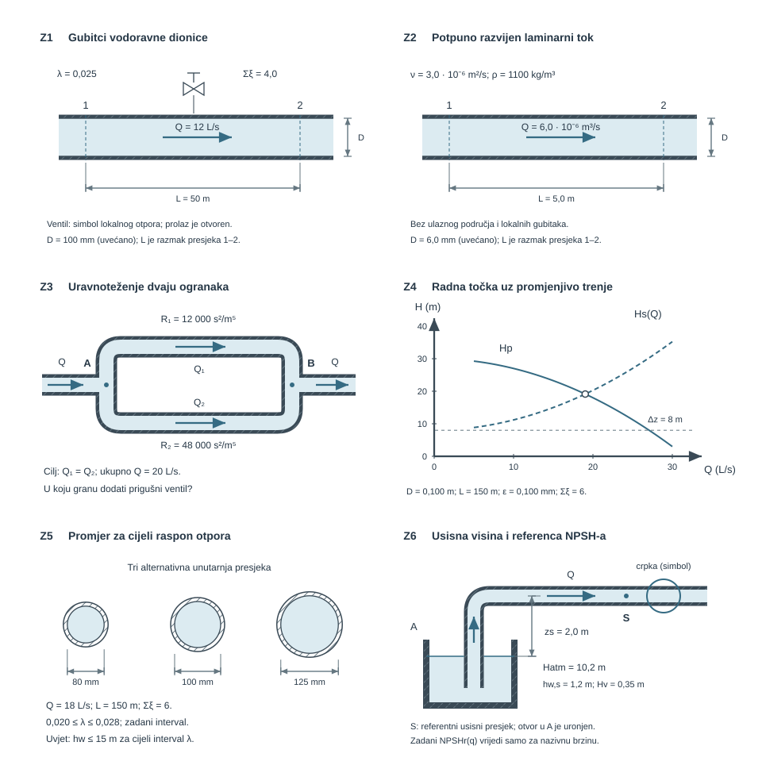

{#fig-cjevovodna-mreza-pregled fig-align="center" fig-alt="Od pojedine dionice do serijsko-paralelne mreže: protok određuje brzinu i režim, a gubitci zatvaraju energijsku bilancu."}

## Gubitci, cjevovodi, crpke i mreže {#sec-cjevovodi-motivacija}

U cjevovodnom sustavu kontinuitet povezuje ulazne i izlazne protoke, a energijska bilanca povezuje visinsku razliku, rad crpke i gubitke. Radna točka nastaje ondje gdje crpka daje upravo onu energijsku visinu koju sustav zahtijeva pri tom protoku.

::: {.mf1-application}

Inženjerski kontekst

Iste bilance opisuju balastni vod broda, rashladni krug, protupožarnu mrežu i sustav grijanja. Uz protok i promjer cijevi provjeravamo radnu točku, godišnju potrošnju električne energije, osjetljivost na hrapavost i usisne uvjete crpke.
:::

**Procijenjeno vrijeme rada uz priručnik:** 12 sati.

## Realna energijska bilanca sustava {#sec-realna-energijska-bilanca}

Promatrajmo stacionarni tok nestlačivog fluida kroz kontrolni volumen s jednim ulaznim presjekom 1 i jednim izlaznim presjekom 2. Pozitivni smjer protoka ide od 1 prema 2. Crpka fluidu dodaje visinu $h_p$, turbina oduzima visinu $h_t$, a disipacija se zapisuje pozitivnim članom $h_w\ge0$. Bilanca mehaničke energije po jedinici težine glasi

$$
\underbrace{\frac{p_1}{\rho g}+z_1+\alpha_1\frac{v_1^2}{2g}}_{H_1}
+h_p
=
\underbrace{\frac{p_2}{\rho g}+z_2+\alpha_2\frac{v_2^2}{2g}}_{H_2}
+h_t+h_w .
$$ {#eq-realna-energijska-bilanca}

Svi članovi imaju jedinicu metra promatranog fluida. Tlakovi $p_1$ i $p_2$ moraju imati istu referencu: oba apsolutna ili oba manometarska. Za dvije otvorene slobodne površine atmosferski se tlakovi mogu pokratiti, ali se u NPSH računu ne smiju izostaviti jer je ondje referenca apsolutna.

Koeficijent kinetičke energije

$$
\alpha=\frac{1}{A\bar v^3}\int_A u^3\,dA
$$ {#eq-cjevovodi-1-realna-energijska-bilanca-sustava-sec-realna-01}

uzima u obzir nejednolik profil. Za potpuno razvijen laminarni tok u kružnoj cijevi vrijedi $\alpha=2$; u mnogim turbulentnim tehničkim tokovima blizu je jedinice. Aproksimacija $\alpha\approx1$ nije opći zakon, nego odluka koju treba navesti.

::: {.mf1-fizikalno-znacenje}

Fizikalno značenje — energijska i piezometrijska crta

Energijska crta (EGL) prikazuje $H=p/(\rho g)+z+\alpha v^2/(2g)$, a piezometrijska crta (HGL) prikazuje $p/(\rho g)+z$. U dionici bez stroja EGL pada u smjeru toka za $h_w$; preko crpke skače naviše za $h_p$. Razmak EGL–HGL jednak je korigiranoj brzinskoj visini. Zato skica tih crta često otkrije pogrešan predznak prije računa.
:::

::: {.mf1-dublje}

Fizikalni temelj — disipacija nije proizvoljan dodatak

Za stacionaran, nestlačiv newtonski tok u kojem promatrani kontrolni volumen obuhvaća cijelo područje gubitka, lokalna viskozna disipacija po jedinici volumena jest

$$
\Phi=2\mu S_{ij}S_{ij}\geq0,
\qquad
S_{ij}=\frac12\left(\frac{\partial u_i}{\partial x_j}+\frac{\partial u_j}{\partial x_i}\right).
$$ {#eq-cjevovodi-disipacija-kao-izvor-gubitka-01}

Kada se energetski tokovi na ulaznom i izlaznom presjeku vrednuju dosljedno, dio mehaničke energije označen s $h_w$ povezan je s tom nepovratnom pretvorbom:

$$
\rho gQh_w=\int_V\Phi\,dV.
$$ {#eq-cjevovodi-disipacija-kao-izvor-gubitka-02}

Zato je doprinos $h_w$ nenegativan, a u idealnom graničnom slučaju $\mu=0$ nestaje. U jednodimenzijskom računu Darcyjev i lokalni koeficijent gubitka sažimaju ovaj učinak; u RANS proračunu dio prijenosa i disipacije predstavlja turbulencijski model. Ta interpretacija ne uklanja potrebu za mrežnom konvergencijom, validacijom i fizikalno odgovarajućim rubnim uvjetima.
:::

{#fig-energijska-crta-gubitci fig-align="center" fig-alt="U realnom toku energijska crta pada zbog linijskih i lokalnih gubitaka; lokalni element daje nagliji pad."}

::: {.mf1-granica-modela}

Granica modela

Jednadžba [-@eq-realna-energijska-bilanca] jest jednodimenzijska stacionarna bilanca. Brze promjene ventila, vodeni udar, elastičnost cijevi, plinoviti džepovi, izražena izmjena topline i snažno stlačivi tok traže proširen model. Koeficijenti gubitaka također vrijede samo za geometriju i režim za koje su određeni.
:::

## Linijski i lokalni gubitci {#sec-linijski-lokalni-gubitci}

Za ravnu kružnu cijev stalnog promjera Darcy–Weisbachov zapis glasi

$$
h_l=\lambda\frac{L}{D}\frac{v^2}{2g},
$$ {#eq-darcy-weisbach}

a za lokalni element

$$
h_{loc}=\xi\frac{v_{ref}^2}{2g}.
$$ {#eq-lokalni-gubitak}

Darcyjev koeficijent trenja $\lambda$ i lokalni koeficijent $\xi$ bezdimenzijski su. U izrazu za lokalni element mora se znati na koji se presjek odnosi $v_{ref}$. Kod nagloga proširenja, redukcijskog ventila ili grananja brzine s dviju strana nisu jednake, pa slijepo zbrajanje svih $\xi$ uz jednu zajedničku brzinu može biti pogrešno.

Za dionicu stalnog promjera praktičan je zapis

$$
h_w=\left(\lambda\frac{L}{D}+\sum_j\xi_j\right)\frac{v^2}{2g}.
$$ {#eq-gubitak-dionice}

Linijski i lokalni doprinosi ne predstavljaju dvije nove sile. Oba sažimaju nepovratnu pretvorbu mehaničke energije u unutarnju energiju zbog viskoznih naprezanja i miješanja. Darcy–Weisbachova korelacija i Moodyjev dijagram standardni su prikaz otpora razvijenoga toka u kružnim cijevima [@moody1944; @white2011].

### Promjer je najjača geometrijska poluga {#sec-utjecaj-promjera}

Pri zadanom protoku $Q$ vrijedi $v=4Q/(\pi D^2)$. Uvrštavanjem u [-@eq-darcy-weisbach] dobiva se

$$
h_l=\frac{8\lambda L}{\pi^2g}\frac{Q^2}{D^5}.
$$ {#eq-linijski-gubitak-protok}

Ako su $Q$, $L$ i **$\lambda$ fiksni**, udvostručenje promjera smanjuje linijski gubitak za $2^5=32$ puta. Lokalni gubitak s fiksnim $\xi$ tada se smanjuje 16 puta jer nema dodatni faktor $L/D$. Pri stvarnoj promjeni izvedbe treba ponovno odrediti $Re$, $\varepsilon/D$ i $\lambda$, pa konačni omjer nije nužno točno 32. Ova analiza pokazuje zašto nekoliko milimetara promjera može vrijediti više od niza manjih prilagodbi armature.

## Od Reynoldsova broja do koeficijenta trenja {#sec-koeficijent-trenja}

Ispravan slijed jest

$$
Q\longrightarrow v=\frac{Q}{A}
\longrightarrow Re=\frac{vD}{\nu}
\longrightarrow \lambda(Re,\varepsilon/D)
\longrightarrow h_w.
$$ {#eq-cjevovodi-3-od-reynoldsova-broja-do-koeficijenta-trenja-01}

Za potpuno razvijen laminarni tok newtonskog fluida u kružnoj cijevi vrijedi

$$
\lambda=\frac{64}{Re}.
$$ {#eq-lambda-laminarno}

Uvrsti li se taj izraz u Darcy–Weisbachovu jednadžbu, dobiva se Hagen–Poiseuilleov rezultat

$$
\Delta p=\rho gh_l=\frac{128\mu L}{\pi D^4}Q.
$$ {#eq-poiseuille-u13}

To je ključni granični slučaj: u laminarnom području $\Delta p\propto Q$, a ne $Q^2$. Kvadratni zapis u Darcyjevoj formuli ne dokazuje kvadratnu ovisnost jer je $\lambda\propto1/Q$.

Za turbulentni potpuno razvijeni tok u kružnoj cijevi Colebrook–Whiteova implicitna jednadžba povezuje $\lambda$, $Re$ i relativnu hrapavost [@colebrook1939]:

$$
\frac{1}{\sqrt{\lambda}}
=-2\log_{10}\!\left(
\frac{\varepsilon/D}{3{,}7}
+\frac{2{,}51}{Re\sqrt{\lambda}}
\right).
$$ {#eq-colebrook-white}

Jednadžba se rješava iterativno ili se $\lambda$ očitava iz Moodyjeva dijagrama. U prijelaznom području približno između $Re=2300$ i $4000$ režim je osjetljiv na ulazne poremećaje, hrapavost i povijest toka; jedna univerzalna korelacija ondje nije pouzdana. Ti pragovi odnose se na unutarnji tok u kružnoj cijevi, a ne na svako strujanje.

::: {.mf1-izvod}

Izvod — zašto je Colebrookov račun iterativan

**Fizikalno pitanje.** Za zadane $Q,D,\nu$ i $\varepsilon$ traži se otpor turbulentne dionice.

**Postavljanje.** Iz protoka se izračunaju $v$, $Re$ i $\varepsilon/D$. U [-@eq-colebrook-white] nepoznata $\lambda$ pojavljuje se izvan i unutar logaritma.

**Numerički korak.** Odabere se početna procjena, primjerice $\lambda_0=0{,}02$, i ponavlja

$$
\lambda_{k+1}=\left[
-2\log_{10}\!\left(
\frac{\varepsilon/D}{3{,}7}
+\frac{2{,}51}{Re\sqrt{\lambda_k}}
\right)
\right]^{-2}
$$ {#eq-cjevovodi-izvod-zasto-je-colebrookov-racun-iterativan-01}

dok razlika dviju uzastopnih vrijednosti ne postane manja od zadane tolerancije. Treba provjeriti i rezidual izvorne jednadžbe, ne samo promjenu iterata.

**Granice.** Kad $\varepsilon/D\to0$, hrapavost nestaje iz dominantnog člana; pri vrlo velikom $Re$ i konačnoj hrapavosti viskozni član postaje malen pa $\lambda$ teži vrijednosti određenoj uglavnom s $\varepsilon/D$.
:::

::: {.mf1-interaktivno}

Numerički pokus — od predviđanja do reziduala

Prije pokretanja predvidi kako promjena $Re$ i $\varepsilon/D$ pomiče $\lambda$. Zatim usporedi iterativno rješenje, aproksimaciju i očitanje s dijagrama te provjeri rezidual Colebrookove jednadžbe. Nastavak iste bilježnice rješava radnu točku iz Z4 uz promjenjiv faktor trenja i provjerava energijsku bilancu.

<a class="mf1-interaktivno-veza" href="https://martibasic.github.io/MF1_udzbenik/jlite/lab/index.html?path=u10_moody_dijagram.ipynb" target="_blank" rel="noopener">Pokreni u JupyterLiteu</a>

:::

## Serijske i paralelne mreže {#sec-cjevovodne-mreze}

Mreža se najprije razlaže na dionice unutar kojih su $D$, $\lambda$ i referentna brzina jednoznačni. Tek se zatim pišu jednadžbe.

- U **seriji** kroz sve dionice prolazi isti protok, a gubitci se zbrajaju.
- U **paraleli** između zajedničkih čvorova jednak je pad ukupne energije, a protoci se zbrajaju u čvoru.

Za dionicu u području u kojem se $\lambda$ može smatrati približno konstantnim korisno je uvesti

$$
h_w=RQ^2,
\qquad
R=\frac{8}{\pi^2g}
\left(\frac{\lambda L}{D^5}+\frac{\sum\xi}{D^4}\right).
$$ {#eq-hidraulicki-otpor}

Za serijski spoj tada vrijedi $R_{eq}=\sum R_i$. Za paralelne grane između čvorova A i B vrijedi

$$
Q=\sum_iQ_i,
\qquad
R_iQ_i^2=h_{AB},
\qquad
\frac{1}{\sqrt{R_{eq}}}=\sum_i\frac{1}{\sqrt{R_i}}.
$$ {#eq-paralelni-otpor}

Analogija s električnim otporom korisna je samo do određene granice: hidraulički je odnos ovdje kvadratan, a $R$ se mijenja s protokom ako se mijenja $\lambda$. Za opću mrežu zato se jednadžbe kontinuiteta u čvorovima i energijske jednadžbe po neovisnim putovima rješavaju zajedno i iterativno.

::: {.mf1-fizikalno-znacenje}

Fizikalno značenje — što se izjednačuje?

Dvije paralelne grane počinju u istom čvoru i završavaju u istom čvoru. Zato ne mogu imati različitu razliku ukupne energijske visine. Grana manjeg otpora pri tom zajedničkom padu prenosi veći protok. Jednaki protoci nastaju samo kao posljedica jednakih otpora, a ne kao opće pravilo paralelnog spoja.
:::

::: {.mf1-interaktivno}

Numerički pokus — paralelne grane

Najprije procijeni koja će grana ponijeti veći protok. Zatim mijenjaj promjer, duljinu i ukupni protok te provjeri kontinuitet i jednakost gubitaka između čvorova. Pokus radi u turbulentnom području, bez proizvoljne interpolacije prijelaznog režima. Zasebni nastavci obrađuju uravnoteženje grana iz Z3 i godišnju energiju regulacije iz Z6.

<a class="mf1-interaktivno-veza" href="https://martibasic.github.io/MF1_udzbenik/jlite/lab/index.html?path=u13_paralelne_grane.ipynb" target="_blank" rel="noopener">Pokreni u JupyterLiteu</a>

:::

## Crpka, karakteristika sustava i radna točka {#sec-radna-tocka-crpke}

Između dviju velikih otvorenih površina brzine i manometarski tlakovi iščezavaju iz bilance. Potrebna visina sustava tada je

$$
H_s(Q)=\Delta z+h_w(Q).
$$ {#eq-karakteristika-sustava}

Ako se koeficijenti otpora u promatranom području malo mijenjaju, često se piše

$$
H_s(Q)=H_{stat}+RQ^2.
$$ {#eq-cjevovodi-5-crpka-karakteristika-sustava-i-radna-tocka-01}

Crpka ima vlastitu karakteristiku $H_p(Q)$ za zadanu brzinu vrtnje, radno kolo (impeler) i fluid. Radna točka nije proizvoljno odabrana kataloška točka, nego rješenje

$$
H_p(Q_{op})=H_s(Q_{op}).
$$ {#eq-radna-tocka}

Zatvaranje ventila povećava otpor sustava i pomiče radnu točku. Promjena brzine vrtnje pomiče crpkinu krivulju. Za geometrijski istu crpku i približno slične režime afinitetni zakoni daju $Q\propto n$, $H\propto n^2$ i $P\propto n^3$, ali ti odnosi opisuju međusobno slične točke na crpkinim krivuljama. **Ne smiju se slijepo prenijeti na cijeli sustav sa statičkom visinom.** Novi pogonski protok uvijek treba dobiti iz novoga presjecišta $H_p$ i $H_s$ [@cengel2014; @white2011].

### Snaga bez miješanja energijskih razina {#sec-ledger-snage}

Crpka fluidu predaje hidrauličku snagu

$$
P_h=\rho gQH_p.
$$ {#eq-hidraulicka-snaga-crpke}

Ako je ukupna učinkovitost crpke $\eta_p$ (omjer hidrauličke i vratilne snage), vratilna snaga jest

$$
P_{vr}=\frac{P_h}{\eta_p}.
$$ {#eq-cjevovodi-snaga-bez-mijesanja-energijskih-razina-sec-ledge-01}

Ako motor i pretvarač imaju učinkovitosti $\eta_m$ i $\eta_f$, električna snaga preuzeta iz mreže jest

$$
P_{el}=\frac{P_{vr}}{\eta_m\eta_f}
=\frac{\rho gQH_p}{\eta_p\eta_m\eta_f}.
$$ {#eq-elektricna-snaga-crpke}

Redoslijed je dakle

$$
P_{el}\longrightarrow P_{vr}\longrightarrow P_h
\longrightarrow
\begin{cases}
\rho gQ\Delta z & \text{promjena potencijalne energije},\\
\rho gQh_w & \text{disipacija u sustavu}.
\end{cases}
$$ {#eq-cjevovodi-snaga-bez-mijesanja-energijskih-razina-sec-ledge-02}

Ventilska disipacija dio je hidrauličke snage, dok su gubitci motora i crpke razlike između različitih razina pretvorbe. Zato se snaga disipirana na ventilu ne smije izravno oduzeti od električne snage i nazvati ostatkom hidrauličke snage.

## Usis i $NPSH$: nužan, ali ne konačan kriterij {#sec-npsh}

Na usisu crpke apsolutni tlak može biti nizak zbog geodetskog uspona, brzinske visine i gubitaka. Raspoloživa neto pozitivna usisna visina definira se u referentnom usisnom presjeku kao

$$
NPSH_a=
\frac{p_{s,abs}}{\rho g}
+\frac{v_s^2}{2g}
-\frac{p_v}{\rho g},
$$ {#eq-npsha}

gdje je $p_v$ tlak zasićene pare pri radnoj temperaturi. Za crpku iznad otvorenog spremnika ista se veličina može zapisati

$$
NPSH_a=
\frac{p_{atm}}{\rho g}-z_s-h_{w,s}-\frac{p_v}{\rho g}.
$$ {#eq-npsha-spremnik}

Brzinska se visina u drugom zapisu pokrati jer je već uključena u Bernoullijevu bilancu do usisnog presjeka. Ta dva zapisa moraju dati isti rezultat.

Proizvođač određuje potrebni $NPSH_r(Q,n)$ prema deklariranom kriteriju i ispitivanju. Uporabna provjera zahtijeva usporedbu raspoloživog i potrebnog NPSH-a uz odgovarajuću projektnu marginu. Sam rezultat $NPSH_a>0$ ili činjenica da je srednji tlak na usisu iznad $p_v$ ne dokazuju da kavitacije neće biti: lokalni tlak u impeleru može biti niži, a dopuštena margina ovisi o crpki, režimu i kriteriju proizvođača.

::: {.mf1-granica-modela}

Granica modela — što $NPSH_a$ ne jamči

$NPSH_a$ opisuje sustav do dogovorenoga usisnog presjeka. Ne zamjenjuje proizvođačevu krivulju $NPSH_r$, ne opisuje lokalne mjehuriće u svakoj točki impelera i nije samostalna potvrda sigurnosti. Tlak pare mora odgovarati temperaturi i sastavu stvarnog fluida, a atmosferski tlak nadmorskoj visini i radnom stanju.
:::

## Riješeni primjeri {#sec-u13-rijeseni-primjeri}

::: {#ex-gubitci-jedne-dionice .mf1-we}

Linijski i lokalni gubitci jedne dionice T1

Voda gustoće $\rho=1000\ \mathrm{kg/m^3}$ struji horizontalnom cijevi promjera $D=0{,}12\ \mathrm{m}$ i duljine $L=36\ \mathrm{m}$ srednjom brzinom $v=2{,}4\ \mathrm{m/s}$. Zadani su $\lambda=0{,}028$ i $\sum\xi=4{,}6$. Odredimo linijski, lokalni i ukupni gubitak te pad tlaka.

Brzinska visina iznosi

$$
\frac{v^2}{2g}=\frac{2{,}4^2}{2\cdot9{,}81}=0{,}294\ \mathrm{m}.
$$ {#eq-cjevovodi-rijeseni-primjer-linijski-i-lokalni-gubitci-jedn-01}

Zato su

$$
h_l=0{,}028\frac{36}{0{,}12}(0{,}294)=2{,}47\ \mathrm{m},
$$ {#eq-cjevovodi-rijeseni-primjer-linijski-i-lokalni-gubitci-jedn-02}

$$
h_{loc}=4{,}6(0{,}294)=1{,}35\ \mathrm{m},
\qquad
h_w=3{,}82\ \mathrm{m}.
$$ {#eq-cjevovodi-rijeseni-primjer-linijski-i-lokalni-gubitci-jedn-03}

U horizontalnoj cijevi stalnog promjera promjena tlaka odgovara ukupnom gubitku:

$$
\Delta p=\rho gh_w=1000\cdot9{,}81\cdot3{,}82
=37{,}4\ \mathrm{kPa}.
$$ {#eq-cjevovodi-rijeseni-primjer-linijski-i-lokalni-gubitci-jedn-04}

**Neovisna provjera:** $\Delta p/(\rho g)=37\,400/(1000\cdot9{,}81)=3{,}81\ \mathrm{m}$ vraća ukupni gubitak. Oba su doprinosa pozitivna i njihov zbroj veći je od svakog pojedinačnog doprinosa.
:::

::: {#ex-laminarni-rashladni-vod .mf1-we}

Laminarni vod rashladnog modula T2

Rashladna smjesa gustoće $1050\ \mathrm{kg/m^3}$ i kinematičke viskoznosti $\nu=5{,}0\cdot10^{-6}\ \mathrm{m^2/s}$ teče kroz idealiziranu kružnu cijev $D=4{,}0\ \mathrm{mm}$, $L=2{,}0\ \mathrm{m}$ protokom $Q=8{,}0\cdot10^{-6}\ \mathrm{m^3/s}$. Zanemarimo ulazno područje i lokalne gubitke.

Površina i srednja brzina jesu

$$
A=\frac{\pi D^2}{4}=1{,}257\cdot10^{-5}\ \mathrm{m^2},
\qquad
v=\frac QA=0{,}637\ \mathrm{m/s}.
$$ {#eq-cjevovodi-rijeseni-primjer-laminarni-vod-rashladnog-modula-01}

Reynoldsov broj potvrđuje laminarni model:

$$
Re=\frac{vD}{\nu}=509,
\qquad
\lambda=\frac{64}{Re}=0{,}1257.
$$ {#eq-cjevovodi-rijeseni-primjer-laminarni-vod-rashladnog-modula-02}

Darcy–Weisbachova jednadžba daje

$$
h_l=0{,}1257\frac{2}{0{,}004}
\frac{0{,}637^2}{2\cdot9{,}81}
=1{,}298\ \mathrm{m},
$$ {#eq-cjevovodi-rijeseni-primjer-laminarni-vod-rashladnog-modula-03}

odnosno $\Delta p=\rho gh_l=13{,}37\ \mathrm{kPa}$.

**Provjera drugim zapisom:** $\mu=\rho\nu=5{,}25\cdot10^{-3}\ \mathrm{Pa\,s}$, pa [-@eq-poiseuille-u13] daje

$$
\Delta p=\frac{128\mu LQ}{\pi D^4}=13{,}37\ \mathrm{kPa}.
$$ {#eq-cjevovodi-rijeseni-primjer-laminarni-vod-rashladnog-modula-04}

Jednak rezultat iz dvaju ekvivalentnih zapisa provjerava i faktor 64 i pretvorbu protoka. Pri udvostručenju $Q$ ovaj laminarni pad tlaka udvostručio bi se.
:::

::: {#ex-serijsko-paralelna-mreza .mf1-we}

Serijsko-paralelna mreža između spremnika T3

Između otvorenih spremnika raspoloživa je razlika visina $H=12{,}0\ \mathrm{m}$. Dovod 0, dvije paralelne grane 1 i 2 te odvod 3 imaju već određene koeficijente $K_i=\lambda_iL_i/D_i+\sum\xi_i$:

| dionica | $D$ [mm] | $K$ |
|---|---:|---:|
| dovod 0 | 100 | 8,52 |
| grana 1 | 80 | 12,80 |
| grana 2 | 60 | 15,23 |
| odvod 3 | 100 | 5,52 |

Vrijedi $h_i=K_iv_i^2/(2g)$. Jednakost gubitaka paralelnih grana daje

$$
K_1v_1^2=K_2v_2^2
\quad\Rightarrow\quad
v_2=\sqrt{\frac{K_1}{K_2}}v_1=0{,}9168v_1.
$$ {#eq-cjevovodi-rijeseni-primjer-serijsko-paralelna-mreza-izme-u-01}

Kontinuitet daje

$$
Q=A_1v_1+A_2v_2,
$$ {#eq-cjevovodi-rijeseni-primjer-serijsko-paralelna-mreza-izme-u-02}

pa uz zadane promjere slijedi $v_0=v_3=0{,}9700v_1$. Energijska bilanca između spremnika tada je

$$
12{,}0=
\left[K_0(0{,}9700)^2+K_1+K_3(0{,}9700)^2\right]
\frac{v_1^2}{2g}.
$$ {#eq-cjevovodi-rijeseni-primjer-serijsko-paralelna-mreza-izme-u-03}

Iz toga se dobiva

$$
v_1=3{,}009\ \mathrm{m/s},
\qquad v_2=2{,}758\ \mathrm{m/s},
$$ {#eq-cjevovodi-rijeseni-primjer-serijsko-paralelna-mreza-izme-u-04}

$$
Q_1=15{,}12\ \mathrm{L/s},
\qquad Q_2=7{,}80\ \mathrm{L/s},
\qquad Q=22{,}92\ \mathrm{L/s}.
$$ {#eq-cjevovodi-rijeseni-primjer-serijsko-paralelna-mreza-izme-u-05}

Gubitci su

$$
h_0=3{,}70\ \mathrm{m},
\qquad h_{1}=h_{2}=5{,}91\ \mathrm{m},
\qquad h_3=2{,}40\ \mathrm{m}.
$$ {#eq-cjevovodi-rijeseni-primjer-serijsko-paralelna-mreza-izme-u-06}

**Neovisne provjere:** kontinuitet daje $15{,}12+7{,}80=22{,}92\ \mathrm{L/s}$; energijska bilanca daje $3{,}70+5{,}91+2{,}40=12{,}01\ \mathrm{m}$, što se unutar zaokruživanja podudara sa zadanih $12{,}0\ \mathrm{m}$. Šira grana nosi veći protok, kako se očekuje.
:::

::: {#ex-radna-tocka-vfd .mf1-we}

Radna točka i promjena brzine vrtnje T3

Karakteristika crpke pri nazivnoj brzini i karakteristika otvorenoga sustava zadane su s $q$ u $\mathrm{L/s}$:

$$
H_p(q)=25-0{,}0175q^2,
\qquad
H_s(q)=6+0{,}0303q^2.
$$ {#eq-cjevovodi-rijeseni-primjer-radna-tocka-i-promjena-brzine-01}

Prvi član sustava, $6\ \mathrm{m}$, statička je visina. Radna točka dobiva se iz jednakosti krivulja:

$$
25-0{,}0175q^2=6+0{,}0303q^2,
$$ {#eq-cjevovodi-rijeseni-primjer-radna-tocka-i-promjena-brzine-02}

$$
q_{op}=19{,}94\ \mathrm{L/s},
\qquad H_{op}=18{,}04\ \mathrm{m}.
$$ {#eq-cjevovodi-rijeseni-primjer-radna-tocka-i-promjena-brzine-03}

Želi se postići $q_2=17{,}24\ \mathrm{L/s}$ promjenom brzine, bez dodatnoga prigušenja. Izvorni sustav pri tom protoku traži

$$
H_s(q_2)=6+0{,}0303(17{,}24)^2=15{,}01\ \mathrm{m}.
$$ {#eq-cjevovodi-rijeseni-primjer-radna-tocka-i-promjena-brzine-04}

Za omjer brzina $s=n_2/n_1$ nova se idealizirana krivulja iste crpke dobiva skaliranjem

$$
H_{p,s}(q)=s^2H_p(q/s)=25s^2-0{,}0175q^2.
$$ {#eq-cjevovodi-rijeseni-primjer-radna-tocka-i-promjena-brzine-05}

Uvjet nove radne točke daje

$$
25s^2-0{,}0175(17{,}24)^2=15{,}01,
\qquad s=0{,}899.
$$ {#eq-cjevovodi-rijeseni-primjer-radna-tocka-i-promjena-brzine-06}

**Neovisna provjera i granica:** omjer brzina nije jednak omjeru radnih protoka $17{,}24/19{,}94=0{,}865$ jer se statičkih $6\ \mathrm{m}$ ne skalira s $n^2$. Da je $H_{stat}=0$ i da su obje radne točke slične, jednostavan afinitetni omjer bio bi mnogo bliži. U stvarnom odabiru treba provjeriti učinkovitost, dopušteno područje rada i proizvođačeve krivulje.
:::

::: {#ex-energijski-ledger-hladenja .mf1-we}

Godišnja energija rashladnog kruga T2

Rashladni krug radi $7000\ \mathrm{h/god}$ protokom $Q=6{,}0\ \mathrm{L/s}$ pri potrebnoj visini $H=12{,}0\ \mathrm{m}$. Gustoća je $1000\ \mathrm{kg/m^3}$, a učinkovitosti su $\eta_p=0{,}78$, $\eta_m=0{,}92$ i $\eta_f=0{,}97$.

Hidraulička snaga predana fluidu iznosi

$$
P_h=\rho gQH
=1000\cdot9{,}81\cdot0{,}006\cdot12
=0{,}706\ \mathrm{kW}.
$$ {#eq-cjevovodi-rijeseni-primjer-godisnja-energija-rashladnog-kr-01}

Vratilna i električna snaga jesu

$$
P_{vr}=\frac{0{,}706}{0{,}78}=0{,}906\ \mathrm{kW},
$$ {#eq-cjevovodi-rijeseni-primjer-godisnja-energija-rashladnog-kr-02}

$$
P_{el}=\frac{0{,}906}{0{,}92\cdot0{,}97}
=1{,}015\ \mathrm{kW}.
$$ {#eq-cjevovodi-rijeseni-primjer-godisnja-energija-rashladnog-kr-03}

Godišnja električna energija jest

$$
E_{el}=P_{el}t=1{,}015\cdot7000=7{,}10\ \mathrm{MWh/god}.
$$ {#eq-cjevovodi-rijeseni-primjer-godisnja-energija-rashladnog-kr-04}

Ako čišćenje izmjenjivača pri istom protoku smanji potrebnu visinu na $10\ \mathrm{m}$ i učinkovitosti ostanu iste, potrošnja pada na $5{,}92\ \mathrm{MWh/god}$, odnosno štedi se oko $1{,}18\ \mathrm{MWh/god}$.

**Neovisna provjera:** ukupna učinkovitost iznosi $\eta_p\eta_m\eta_f=0{,}696$. Omjer $P_h/P_{el}=0{,}706/1{,}015=0{,}696$ potvrđuje bilancu pretvorbe energije. Ušteda je razmjerna promjeni visine samo zato što su $Q$ i sve učinkovitosti ovdje izričito zadržani konstantnima.
:::

::: {#ex-npsha-usisne-crpke .mf1-we}

Raspoloživi NPSH servisne crpke T3

Crpka je $z_s=2{,}6\ \mathrm{m}$ iznad slobodne površine otvorenog spremnika. Voda protječe usisom $D=80\ \mathrm{mm}$, $L=5{,}0\ \mathrm{m}$ protokom $Q=0{,}014\ \mathrm{m^3/s}$. Zadano je $\lambda=0{,}030$, $\sum\xi=1{,}8$, $p_{atm}=101\ \mathrm{kPa}$, $p_v=2{,}34\ \mathrm{kPa}$ i $\rho=1000\ \mathrm{kg/m^3}$.

Brzina i usisni gubitak iznose

$$
v_s=\frac{Q}{\pi D^2/4}=2{,}785\ \mathrm{m/s},
$$ {#eq-cjevovodi-rijeseni-primjer-raspolozivi-npsh-servisne-crpke-01}

$$
h_{w,s}=\left(0{,}030\frac{5}{0{,}08}+1{,}8\right)
\frac{2{,}785^2}{2\cdot9{,}81}
=1{,}453\ \mathrm{m}.
$$ {#eq-cjevovodi-rijeseni-primjer-raspolozivi-npsh-servisne-crpke-02}

Bernoullijeva bilanca od slobodne površine do usisnog presjeka daje

$$
\frac{p_{s,abs}}{\rho g}
=\frac{p_{atm}}{\rho g}-z_s-\frac{v_s^2}{2g}-h_{w,s}
=5{,}847\ \mathrm{m},
$$ {#eq-cjevovodi-rijeseni-primjer-raspolozivi-npsh-servisne-crpke-03}

odnosno $p_{s,abs}=57{,}36\ \mathrm{kPa}$. Raspoloživi NPSH jest

$$
NPSH_a=5{,}847+0{,}395-0{,}239=6{,}00\ \mathrm{m}.
$$ {#eq-cjevovodi-rijeseni-primjer-raspolozivi-npsh-servisne-crpke-04}

**Neovisna provjera:** izravni zapis [-@eq-npsha-spremnik] daje $10{,}296-2{,}600-1{,}453-0{,}239=6{,}00\ \mathrm{m}$. Rezultat je raspoloživa vrijednost sustava, a ne presuda o kavitaciji. Za zaključak treba $NPSH_r$ pri istom protoku i brzini te kriterij margine proizvođača.
:::

::: {.mf1-samoprovjera}

Konceptualna provjera

1. Zašto se svi lokalni koeficijenti ne smiju automatski množiti istom brzinskom visinom?

::: {.callout-note collapse="true"}
### Odgovor

Koeficijent je definiran prema određenoj referentnoj brzini. Ako se promjer mijenja, različiti elementi mogu imati različite brzine i svaki se gubitak mora računati s pripadajućim presjekom.
:::

2. Zašto Darcyjev zapis s $v^2$ ne znači da je laminarni pad tlaka kvadratan u protoku?

::: {.callout-note collapse="true"}
### Odgovor

Jer je u laminarnom toku $\lambda=64/Re\propto1/v$. Umnožak $\lambda v^2$ zato je proporcionalan $v$, odnosno $Q$.
:::

3. Što ostaje jednako u paralelnim granama, a što u serijskim dionicama?

::: {.callout-note collapse="true"}
### Odgovor

U paralelnim granama između istih čvorova jednak je pad ukupne energije; u serijskim dionicama jednak je protok. U čvoru se protoci zbrajaju.
:::

4. Zašto $NPSH_a=6\ \mathrm{m}$ nije dovoljan podatak za tvrdnju da crpka neće kavitirati?

::: {.callout-note collapse="true"}
### Odgovor

Nedostaju proizvođačev $NPSH_r$ pri radnoj točki i zahtijevana margina. $NPSH_a$ opisuje raspoloživu energiju sustava do referentnog presjeka, a ne najmanji lokalni tlak u impeleru.
:::
:::

## Zadaci za samostalan rad {#sec-u13-zadatci}

{#fig-cjevovodne-vjezbe fig-align="center" fig-alt="D je unutarnji promjer, L povezuje referentne presjeke, a kota usisnog uspona polazi od slobodne površine i završava na visini usisnog presjeka crpke. Cijevi imaju otvorene krajeve i uronjen usis; krivulje radne točke izračunane su iz podataka zadatka."}

::::: {.mf1-vjezbe-list}

### Gubitci ravne dionice {#task-gubitci-ravne-dionice .unnumbered .unlisted}

Voda gustoće $\rho=998\ \mathrm{kg/m^3}$ stacionarno protječe vodoravnom cijevi stalnog unutarnjeg promjera $D=0{,}10\ \mathrm{m}$ i duljine $L=50\ \mathrm{m}$, protokom $Q=0{,}012\ \mathrm{m^3/s}$. Zadani su Darcyjev faktor $\lambda=0{,}025$ i $\sum\xi=4{,}0$ za armaturu između promatranih presjeka, svi prema brzini u toj cijevi. U oba presjeka uzmi isti profil brzine. Odredi brzinu, linijski, lokalni i ukupni gubitak te pad tlaka.

:::: {.content-visible .mf1-hint-online when-format="html"}
::: {.callout-tip collapse="true" data-hint-key="true"}
### Naputak
Najprije izračunaj $A$ i $v=Q/A$. Tek zatim zajedničku brzinsku visinu pomnoži s $\lambda L/D$ odnosno $\sum\xi$. Za jednake visine i profile presjeka tlak pada zbog gubitaka.
:::
::::
:::: {.content-visible .mf1-answer-online when-format="html"}
::: {.callout-note collapse="true" data-answer-key="true"}
### Kontrolni rezultat
$v=1{,}528\ \mathrm{m/s}$, $h_l=1{,}487\ \mathrm{m}$, $h_{loc}=0{,}476\ \mathrm{m}$, $h_w=1{,}963\ \mathrm{m}$ i $\Delta p=19{,}2\ \mathrm{kPa}$. Provjeri da je $\Delta p/(\rho g)=h_w$.
:::
::::

[Razina: T1]{.mf1-task-level}

### Laminarni tok viskozne smjese {#task-laminarna-cijev-smjese .unnumbered .unlisted}

Newtonska smjesa gustoće $\rho=1100\ \mathrm{kg/m^3}$ i kinematičke viskoznosti $\nu=3{,}0\cdot10^{-6}\ \mathrm{m^2/s}$ stacionarno protječe kružnom vodoravnom cijevi $D=6{,}0\ \mathrm{mm}$, protokom $Q=6{,}0\cdot10^{-6}\ \mathrm{m^3/s}$. Promatrani razmak $L=5{,}0\ \mathrm{m}$ nalazi se u potpuno razvijenom toku uz prianjanje na stijenku; ulazno područje i lokalne gubitke izostavi. Odredi $Re$, Darcyjev faktor $\lambda$ i $\Delta p$. Kako se pad tlaka promijeni ako udvostručiš protok dok tok ostaje laminaran?

:::: {.content-visible .mf1-hint-online when-format="html"}
::: {.callout-tip collapse="true" data-hint-key="true"}
### Naputak
Izračunaj režim prije izbora korelacije. Ako je tok laminaran, upotrijebi $\lambda=64/Re$; rezultat zatim provjeri Poiseuilleovim zakonom.
:::
::::
:::: {.content-visible .mf1-answer-online when-format="html"}
::: {.callout-note collapse="true" data-answer-key="true"}
### Kontrolni rezultat
$v=0{,}212\ \mathrm{m/s}$, $Re=424$, $\lambda=0{,}1508$ i $\Delta p=3{,}11\ \mathrm{kPa}$. Udvostručenje $Q$ uz ostale iste podatke udvostručuje $\Delta p$ dok tok ostaje laminaran.
:::
::::

[Razina: T1]{.mf1-task-level}

### Uravnoteženje paralelnih grana {#task-uravnotezenje-paralelnih-grana .unnumbered .unlisted}

Dva rashladna ogranka između istih čvorova trebaju dobivati jednak protok. Odredi u koji ogranak treba ugraditi prigušni ventil i koliki dodatni otpor ventil mora imati. Zatim zatvori kontinuitet i usporedi gubitke na oba puta.

Zadani približno konstantni otpori grana bez novoga ventila jesu $R_1=12\,000\ \mathrm{s^2/m^5}$ i $R_2=48\,000\ \mathrm{s^2/m^5}$. Regulacija održava ukupni protok $Q=0{,}020\ \mathrm{m^3/s}$ i može osigurati potrebnu visinu. U svakom ogranku vrijedi kvadratni model $h_i=R_iQ_i^2$; novi ventil dodaje $h_v=R_vQ_i^2$ s $R_v\ge0$. Odredi granu za ventil, $R_v$, oba protoka, zajednički gubitak $h_{AB}$ i doprinos samog ventila. Lokalni otpori postojećih spojeva već su uključeni u zadane $R_i$.

:::: {.content-visible .mf1-hint-online when-format="html"}
::: {.callout-tip collapse="true" data-hint-key="true"}
### Naputak
Cilj je $Q_1=Q_2=Q/2$. Izjednači ukupne gubitke između istih čvorova uz dodatak ventila. Prigušenje može povećati otpor, pa ne smiješ dobiti negativan $R_v$.
:::
::::
:::: {.content-visible .mf1-answer-online when-format="html"}
::: {.callout-note collapse="true" data-answer-key="true"}
### Kontrolni rezultat
Ventil ide u granu 1: $R_v=36\,000\ \mathrm{s^2/m^5}$. Vrijedi $Q_1=Q_2=10{,}00\ \mathrm{L/s}$, $h_{AB}=4{,}80\ \mathrm{m}$ i $h_v=3{,}60\ \mathrm{m}$. Provjera: $(R_1+R_v)Q_1^2=R_2Q_2^2$ i $Q_1+Q_2=Q$.
:::
::::

[Razina: T2]{.mf1-task-level}

### Radna točka hrapavog voda {#task-radna-tocka-hrapavog-voda .unnumbered .unlisted}

Crpka potiskuje vodu između dvaju velikih otvorenih spremnika. Odredi radnu točku kad otpor cijevi ovisi o Reynoldsovu broju, pa zatim odvojeno izračunaj hidrauličku, vratilnu i električnu snagu. U svakoj iteraciji ponovno provjeri trenje u cijevi.

Sintetička karakteristika crpke zadana je brojevnim vrijednostima $H_p=30-30\,000Q^2$, uz $Q$ u $\mathrm{m^3/s}$ i $H_p$ u metrima. Razlika visina slobodnih površina je $\Delta z=8{,}0\ \mathrm{m}$. Vod ima $D=0{,}100\ \mathrm{m}$, $L=150\ \mathrm{m}$, ekvivalentnu hrapavost $\varepsilon=0{,}100\ \mathrm{mm}$ i $\sum\xi=6{,}0$, uključujući ulaz i izlaz, prema brzini u tom vodu. Za vodu uzmi $\rho=1000\ \mathrm{kg/m^3}$ i $\nu=1{,}00\cdot10^{-6}\ \mathrm{m^2/s}$. Upotrijebi Darcy–Weisbachov model i Colebrookovu jednadžbu; konačno provjeri turbulentni režim.

Numerički riješi radnu točku u intervalu $0{,}005\le Q\le0{,}030\ \mathrm{m^3/s}$, uz pomoć bilježnice ili drugog računskog alata. Izvijesti $Q_{op}$, $H_{op}$, $Re$ i $\lambda$ te provjeri energijski rezidual manji od $10^{-6}\ \mathrm{m}$ i apsolutni Colebrookov rezidual manji od $10^{-6}$. Za zadanu ukupnu učinkovitost crpke $\eta_p=0{,}76$ i učinkovitost motora $\eta_m=0{,}92$ odredi $P_h$, $P_{vr}$ i $P_{el}$; gubitke pretvarača zanemari.

:::: {.content-visible .mf1-hint-online when-format="html"}
::: {.callout-tip collapse="true" data-hint-key="true"}
### Naputak
Za probni $Q$ odredi $v$, $Re$ i $\lambda$, pa $H_s=\Delta z+(\lambda L/D+\sum\xi)v^2/(2g)$. Mijenjaj $Q$ dok $H_p-H_s$ ne iščezne. Provjeri i izvorni Colebrookov rezidual. Zatim $P_h=\rho gQH_p$, $P_{vr}=P_h/\eta_p$ i $P_{el}=P_{vr}/\eta_m$.
:::
::::
:::: {.content-visible .mf1-answer-online when-format="html"}
::: {.callout-note collapse="true" data-answer-key="true"}
### Kontrolni rezultat
$Q_{op}\approx19{,}030\ \mathrm{L/s}$, $H_{op}\approx19{,}136\ \mathrm{m}$, $Re\approx2{,}423\cdot10^5$ i $\lambda\approx0{,}020812$. Snage su $P_h\approx3{,}572\ \mathrm{kW}$, $P_{vr}\approx4{,}700\ \mathrm{kW}$ i $P_{el}\approx5{,}109\ \mathrm{kW}$. Oba reziduala provjeravaju se s nezaokruženim rješenjem; vrijedi $P_h<P_{vr}<P_{el}$.
:::
::::

[Razina: T2]{.mf1-task-level}

### Izbor promjera uz nesiguran otpor {#task-robustan-izbor-promjera .unnumbered .unlisted}

Vod duljine $L=150\ \mathrm{m}$ mora prenositi $Q=0{,}018\ \mathrm{m^3/s}$. Zbroj lokalnih koeficijenata iznosi $\sum\xi=6{,}0$, prema brzini u odabranom vodu. Za svaki ponuđeni promjer zadana granica Darcyjeva faktora zbog nepoznatog stanja cijevi jest $0{,}020\le\lambda\le0{,}028$; to je interval mogućih vrijednosti, a ne standardna nesigurnost. Dostupni unutarnji promjeri su 80, 100 i 125 mm. Odaberi najmanji koji u cijelom zadanom intervalu zadovoljava $h_w\le15\ \mathrm{m}$. Objasni zašto nije dovoljan račun samo s donjom granicom otpora.

:::: {.content-visible .mf1-hint-online when-format="html"}
::: {.callout-tip collapse="true" data-hint-key="true"}
### Naputak
Za svaki ponuđeni promjer izračunaj brzinu, a zatim raspon $h_w$ za obje granice $\lambda$. Odluku donesi prema najvećem gubitku. Pri fiksnom protoku i promjeru gubitak raste s $\lambda$.
:::
::::
:::: {.content-visible .mf1-answer-online when-format="html"}
::: {.callout-note collapse="true" data-answer-key="true"}
### Kontrolni rezultat
Rasponi $h_w$ su približno 28,4–38,2 m za 80 mm, 9,64–12,85 m za 100 mm i 3,29–4,34 m za 125 mm. Najmanji izbor koji zadovoljava cijeli interval jest 100 mm: gornja granica $12{,}85<15\ \mathrm{m}$. Promjer 80 mm ne zadovoljava ni uz najmanji zadani otpor.
:::
::::

[Razina: T3]{.mf1-task-level}

### Regulacija crpke, energija i usisna rezerva {#task-regulacija-energija-npsh .unnumbered .unlisted}

Usporedi prigušenje ventilom i regulaciju brzine za jednak traženi protok. Odredi godišnju energiju obiju mogućnosti i uštedu, a zatim provjeri što zadani usisni podatci dopuštaju zaključiti o radu pri nazivnoj i sniženoj brzini vrtnje.

Sintetičke nastavne karakteristike zadane su brojevnim vrijednostima: pri nazivnoj brzini $H_p(q)=24-0{,}012q^2$, izvorni sustav $H_s(q)=5+0{,}025q^2$, a prigušeni $H_{s,V}(q)=5+0{,}040q^2$. Ovdje je $q$ u $\mathrm{L/s}$, a sve visine u metrima. Fluid je voda gustoće $\rho=1000\ \mathrm{kg/m^3}$. Ukupna učinkovitost električna–hidraulička pretpostavlja se jednakom $\eta=0{,}72$ u obje uspoređene točke; pogon radi $t=5000\ \mathrm{h/god}$.

1. Odredi radnu točku prigušenog sustava, $q$, $H_V$ i godišnju električnu energiju $E_V$.
2. Za isti protok, uz ponovno otvoren ventil, odredi omjer brzina $s=n_2/n_1$, potrebnu visinu $H_s$, godišnju energiju $E_s$ i uštedu $\Delta E$. Primijeni afinitetno skaliranje iste crpke, uz zadanu stalnu učinkovitost.
3. Pri tom protoku zadani su $H_{atm}=10{,}2\ \mathrm{m}$, usisni geodetski uspon $z_s=2{,}0\ \mathrm{m}$, usisni gubitak $h_{w,s}=1{,}2\ \mathrm{m}$ i visina tlaka pare $H_v=0{,}35\ \mathrm{m}$. Sintetički model potrebnog NPSH-a **pri nazivnoj brzini** jest $NPSH_r=2+0{,}003q^2$ u metrima. Odredi $NPSH_a$ i razliku $NPSH_a-NPSH_r$ za prigušeni slučaj. Navedi koji podatci nedostaju za konačnu odluku o usisu obaju načina regulacije; dani $NPSH_r$ nemoj nekritički prenijeti na sniženu brzinu.

:::: {.content-visible .mf1-hint-online when-format="html"}
::: {.callout-tip collapse="true" data-hint-key="true"}
### Naputak
Prigušenu točku dobiješ iz $H_p=H_{s,V}$. Za isti $q$ bez prigušenja vrijedi $H_{p,s}(q)=24s^2-0{,}012q^2=H_s(q)$. Energiju računaj s $Q=10^{-3}q$ iz $P_{el}=\rho gQH/\eta$. Za usis upotrijebi [-@eq-npsha-spremnik]; zadani potrebni NPSH vrijedi samo pri nazivnoj brzini.
:::
::::
:::: {.content-visible .mf1-answer-online when-format="html"}
::: {.callout-note collapse="true" data-answer-key="true"}
### Kontrolni rezultat
$q\approx19{,}12\ \mathrm{L/s}$; $(H_V,H_s)\approx(19{,}62;14{,}13)\ \mathrm{m}$ i $s\approx0{,}878$. $(E_V,E_s,\Delta E)\approx(25{,}54;18{,}41;7{,}14)\ \mathrm{MWh/god}$. Pri nazivnoj brzini $(NPSH_a,NPSH_r,NPSH_a-NPSH_r)\approx(6{,}65;3{,}10;3{,}55)\ \mathrm{m}$. Nedostaju kriterij margine i dopušteno radno područje, a za sniženu brzinu i odgovarajući $NPSH_r(q,n_2)$.
:::
::::

[Razina: T4]{.mf1-task-level}

:::::

::: {.mf1-numerika .kompakt}

Numerički most — mrežni model prije 3D CFD-a

**Fizikalna poveznica.** Numerički račun ne mora biti CFD: Colebrookova iteracija određuje jedan koeficijent, a 1D model mreže protoke i čvorne tlakove zatvaranjem kontinuiteta i energije. Mreža cijevi i čvorova opisuje sustav; CFD mreža ćelija razlučuje prostor unutar fluida.

**Primjena.** Ako tablični $\xi$ ne opisuje složen razdjelnik ili difuzor, mrežni model daje radni protok za lokalni CFD. Iz polja se izračuna gubitak mehaničke energije $h_L$, zatim $\xi=2gh_L/v_{ref}^2$, uz navedenu referentnu brzinu i presjeke. Koeficijent se vraća u sustav i ponovno određuje radna točka.

**Provjera.** Statički pad tlaka nije nužno gubitak ako se mijenjaju brzina ili visina; primijeni energijsku bilancu iz []{.mf1-chapter-ref target="u08"}. Provjeri konvergenciju $h_L$ i valjanost koeficijenta za isti režim i geometriju. Hijerarhiju analitika → 1D → mrežni model → CFD sažima @sec-cfd-kada-ne-treba: veći detalj opravdan je tek ako mijenja potrebnu odluku.
:::

## Sažetak {#sec-u13-zakljucak}

::: {.mf1-zavrsni-okvir}

Sažeta mapa modela

1. Nacrtaj sustav, presjeke, osi i referencu tlaka.
2. Napiši kontinuitet i realnu energijsku bilancu prije korelacija.
3. Za svaku dionicu idi redom $Q\to v\to Re\to\lambda\to h_w$.
4. U seriji zbrajaj gubitke pri istom $Q$; u paraleli izjednači pad energije i zatvori čvor.
5. Radnu točku odredi presjecištem karakteristika crpke i sustava; statička visina ne slijedi afinitetne zakone.
6. Odvojeno vodi $P_h$, $P_{vr}$ i $P_{el}$ te godišnju energiju.
7. Na usisu koristi apsolutni tlak i usporedi $NPSH_a$ s odgovarajućim $NPSH_r$ i kriterijem proizvođača.

Najbrža provjera rezultata jest kombinacija četiriju pitanja: jesu li svi gubitci pozitivni, zatvara li se bilanca protoka, vraća li zbroj gubitaka raspoloživu visinu i je li promjena radne točke fizikalno u očekivanom smjeru?
:::
