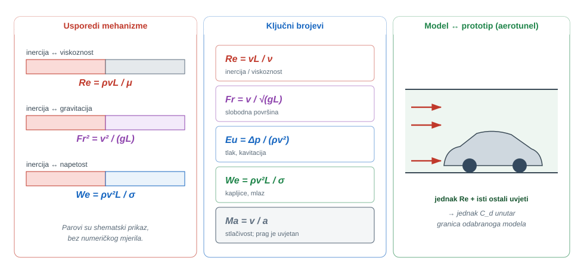
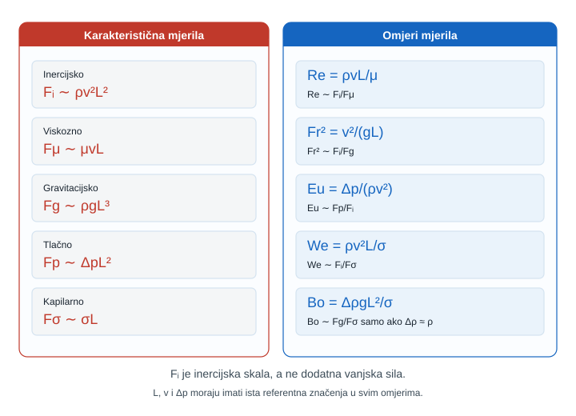
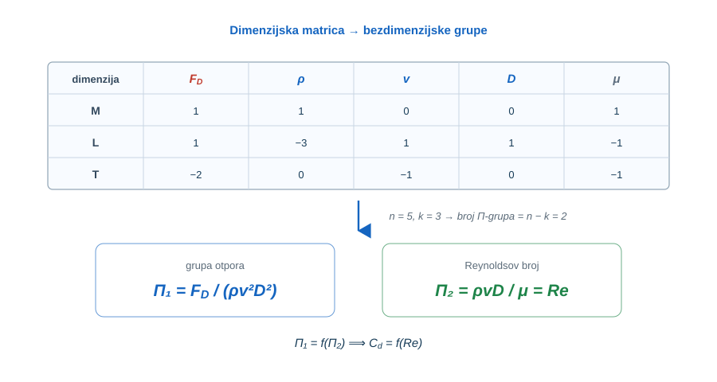
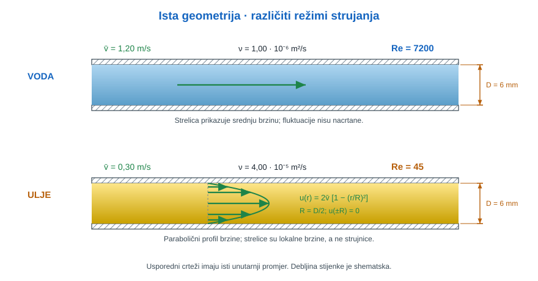
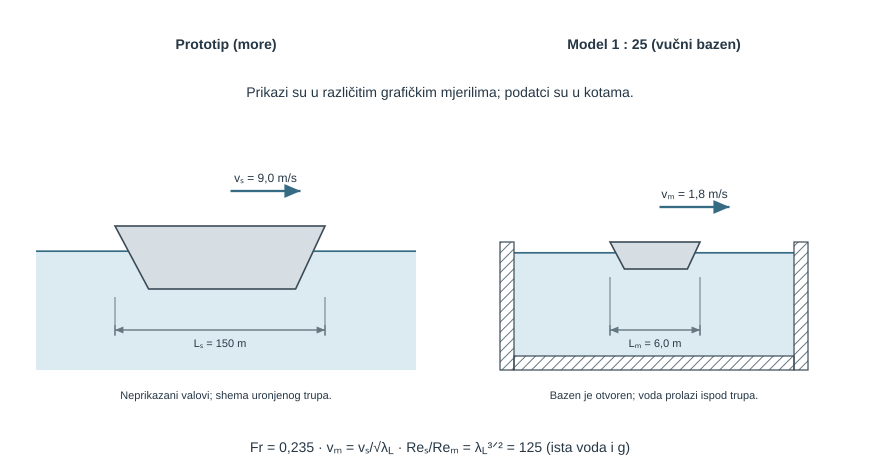
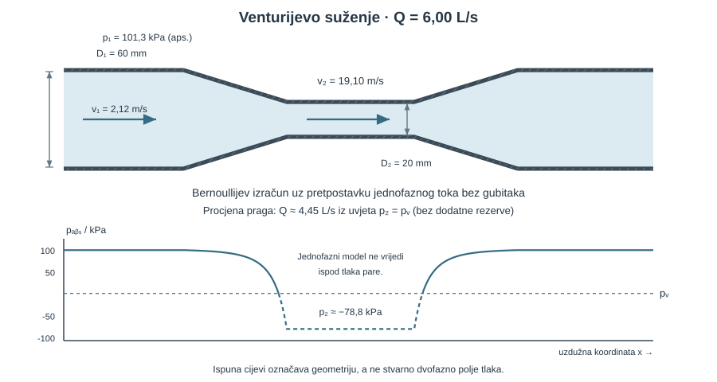
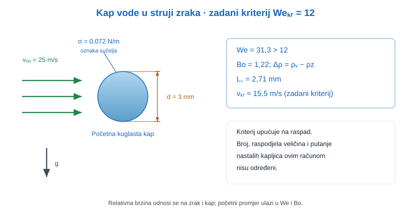
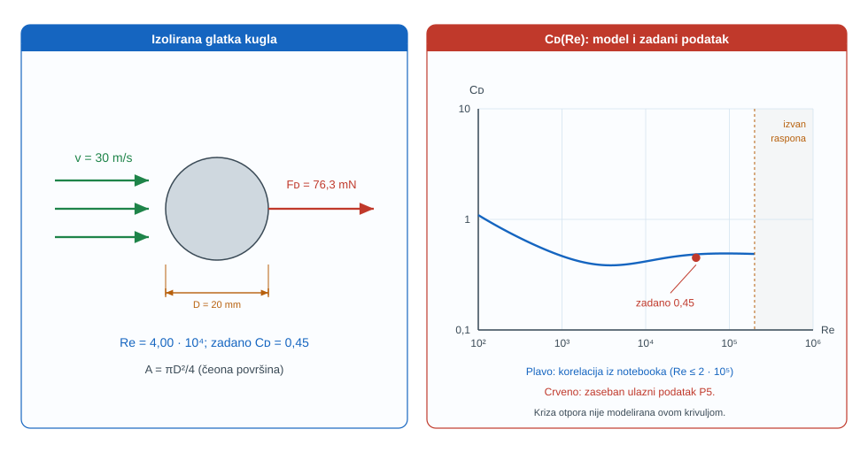
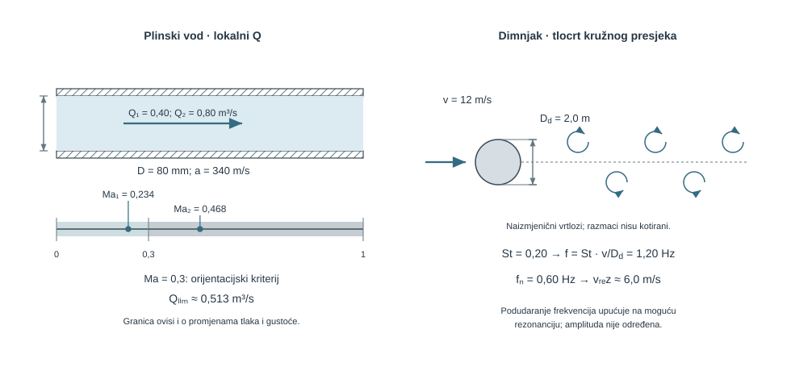
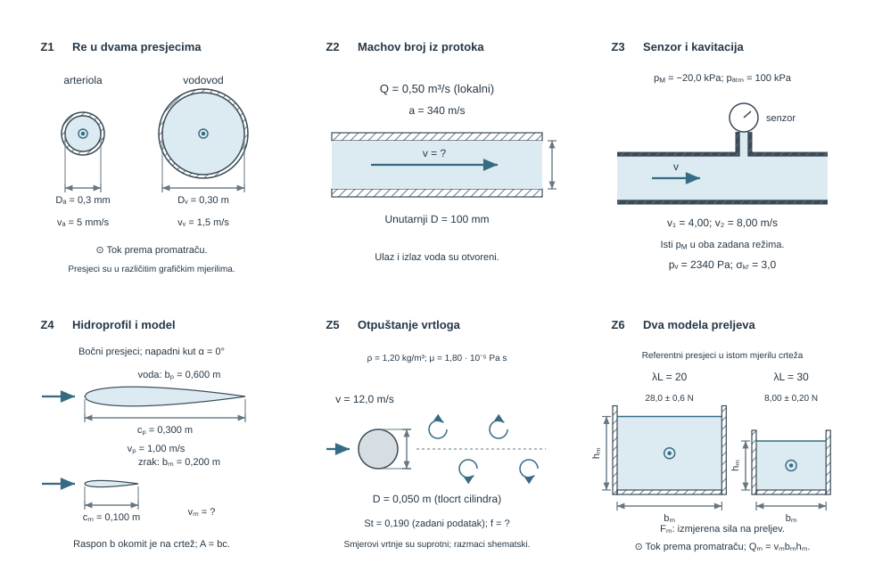

{#fig-uvod-u14 fig-align="center"}

## Sile kao zajednički jezik cijele knjige

Cijeli je udžbenik bio niz sila: tlačna sila u pog. 1Osnove fluida i Pascalov zakon, viskozna sila u pog. 2Viskoznost, površinska napetost i kapilarnost, gravitacijska sila kroz hidrostatiku i uzgon u pog. 7Uzgon, plivanje i stabilnost, inercijska sila u pog. 11Količina gibanja i sile strujanja te viskozni gubici i Reynoldsov broj u pog. 13Cjevovodi.

Ovo poglavlje **ne uvodi nijednu novu silu** — ono postojeće sile stavlja u omjere. Svaki bezdimenzijski broj mjeri koliko je jedna sila jača od druge, a iz tog omjera čita se koja sila vlada problemom i, posljedično, kako problem ispravno bezdimenzionirati.

::: {.mf1-application}

Inženjerski kontekst

Brod se prije gradnje ispituje kao model u vučnom bazenu, automobil i zrakoplovno krilo u aerotunelu, a brodski vijak i centrifugalna crpka provjeravaju se na kavitaciju. U svim tim slučajevima model i stvarni objekt razlikuju se po veličini i brzini, ali se ponašaju jednako čim im se izjednači pravi bezdimenzijski broj. Isti jezik objašnjava zašto dimnjak na vjetru titra (Strouhalov broj), zašto se mlaz dizela raspadne u maglicu (Weberov broj) i zašto je cijeli kolegij Mehanika fluida 1 ostao u području nestlačivog strujanja (Machov broj). Bezdimenzijski broj je ono što povezuje malu skicu u laboratoriju s velikim postrojenjem u pogonu.
:::

::: {.mf1-priprema}

Prije čitanja poglavlja

**Predznanje koje se pretpostavlja:**

- pojam viskoznosti i Reynoldsovog broja iz poglavlja pog. 2Viskoznost, površinska napetost i kapilarnost i pog. 10Realni Bernoulli i gubici;
- linijski gubici i koeficijent trenja $\lambda$ iz poglavlja pog. 13Cjevovodi;
- površinska napetost $\sigma$ i kapilarnost iz poglavlja pog. 2Viskoznost, površinska napetost i kapilarnost;
- pojam inercijske sile iz poglavlja pog. 11Količina gibanja i sile strujanja; SI jedinice i dimenzije iz pog. 1Osnove fluida i Pascalov zakon.

**Ishodi učenja:**

- izraziti svaki bezdimenzijski broj kao omjer dviju sila i prepoznati koja sila u danom problemu dominira;
- provesti Buckinghamovu dimenzijsku analizu i dobiti bezdimenzijske grupe ($\Pi$-grupe) iz popisa varijabli;
- primijeniti uvjete geometrijske, kinematičke i dinamičke sličnosti na modelsko ispitivanje;
- objasniti zašto se Reynoldsova i Froudeova sličnost u pravilu ne mogu zadovoljiti istovremeno i kako se ta nepotpunost rješava;
- donijeti pravilnu odluku o bezdimenzioniranju problema na temelju dominantne sile.

**Procijenjeno vrijeme:** 6–7 sati za teoriju i izvode, 4 sata za rješavanje primjera i zadataka.
:::

## Dimenzije, jedinice i sila inercije kao referenca

Svaka fizikalna veličina u mehanici fluida izražava se preko tri **primarne dimenzije**: mase $\mathsf{M}$, duljine $\mathsf{L}$ i vremena $\mathsf{T}$. Tako brzina ima dimenziju $\mathsf{L}\,\mathsf{T}^{-1}$, gustoća $\mathsf{M}\,\mathsf{L}^{-3}$, a tlak i naprezanje $\mathsf{M}\,\mathsf{L}^{-1}\,\mathsf{T}^{-2}$. Načelo **dimenzijske homogenosti** kaže da svaki ispravan fizikalni izraz mora s obje strane imati istu dimenziju — to je ujedno prva i najjeftinija provjera svake jednadžbe.

Bezdimenzijski broj nastaje kad se dvije veličine iste dimenzije podijele tako da se dimenzija pokrati. U mehanici fluida najkorisnije su upravo dimenzije **sila**, jer fizikalno ponašanje strujanja odlučuje koja sila prevladava. Pet sila koje se stalno natječu su:

$$
F_i \sim \rho v^2 L^2 \quad(\text{inercija}), \qquad
F_\mu \sim \mu v L \quad(\text{viskoznost}), \qquad
F_g \sim \rho g L^3 \quad(\text{gravitacija}),
$$

$$
F_p \sim \Delta p\, L^2 \quad(\text{tlak}), \qquad
F_\sigma \sim \sigma L \quad(\text{površinska napetost}).
$$

Ovdje je $L$ karakteristična duljina problema (promjer cijevi, duljina trupa, promjer kapi), a $v$ karakteristična brzina. **Inercijska sila** $F_i \sim \rho v^2 L^2$ uzima se kao prirodna referenca jer je prisutna u gotovo svakom strujanju — čim se fluid giba, ima inerciju. Zato se većina važnih bezdimenzijskih brojeva može pročitati kao omjer inercijske sile prema nekoj drugoj sili.

::: {.callout-note}
## Fizikalno značenje
Bezdimenzijski broj nije puka matematička kratica — on je **vaga**. Na jednoj strani vage je inercija (težnja fluida da nastavi gibanje), na drugoj neka sila koja se tome opire ili to pojačava (trenje, težina, napetost, stlačivost). Kad je broj velik, inercija nadjačava; kad je malen, dominira druga sila. Upravo zato dva posve različita uređaja — mikrokanal i naftovod, model i pravi brod — pokazuju isto strujanje čim im se izjednači taj omjer.
:::

## Svaki bezdimenzijski broj kao omjer sila

Slika [-@fig-u14-omjer-sila] prikazuje istu ideju vizualno: česticu fluida i sile koje na nju djeluju, te broj koji nastaje iz svakog para.

{#fig-u14-omjer-sila fig-align="center"}

**Reynoldsov broj** uspoređuje inerciju i viskoznost:

$$
Re = \frac{F_i}{F_\mu} = \frac{\rho v L}{\mu} = \frac{v L}{\nu}.
$$

Pri malom $Re$ viskoznost guši poremećaje i strujanje je laminarno; pri velikom $Re$ inercija nadjačava i strujanje postaje turbulentno. U cijevi je prijelaz oko $Re_{kr} \approx 2300$, a iznad $\approx 4000$ strujanje je razvijeno turbulentno (vidi pog. 13Cjevovodi).

**Froudeov broj** uspoređuje inerciju i gravitaciju:

$$
Fr = \frac{v}{\sqrt{gL}}, \qquad Fr^2 = \frac{F_i}{F_g}.
$$

Vlada svuda gdje postoji slobodna površina i valovi: brod, otvoreni kanal, preljev brane. Pri $Fr = 1$ strujanje u otvorenom kanalu je kritično (prijelaz iz mirnog u silovito); brzina vala i brzina toka tada su jednake.

**Eulerov broj i koeficijent tlaka** uspoređuju tlačnu i inercijsku silu:

$$
Eu = \frac{\Delta p}{\rho v^2}, \qquad C_p = \frac{p - p_\infty}{\tfrac{1}{2}\rho v^2}.
$$

Koeficijent tlaka $C_p$ dostiže vrijednost $1$ u stagnacijskoj točki (sva kinetička energija pretvorena u tlak, vidi Pitotovu cijev u pog. 9Bernoullijeva jednadžba idealnog fluida), a u ubrzanom strujanju postaje negativan.

**Kavitacijski broj** je posebni Eulerov broj koji mjeri koliko je lokalni tlak iznad tlaka isparavanja $p_v$:

$$
\sigma_{kav} = \frac{p - p_v}{\tfrac{1}{2}\rho v^2}.
$$

Kad $\sigma_{kav}$ padne ispod kritične vrijednosti, lokalni tlak dosegne $p_v$ i fluid kavitira (stvaraju se mjehuri pare koji urušavanjem buče i eroziraju). Ključan je za brodski vijak i usisni dio crpke.

**Weberov broj** uspoređuje inerciju i površinsku napetost:

$$
We = \frac{\rho v^2 L}{\sigma}, \qquad We = \frac{F_i}{F_\sigma}.
$$

Pri malom $We$ napetost drži kap ili mlaz na okupu; pri velikom $We$ inercija nadvlada i kap se raspada. Kod aerodinamičkog raspada kapi tipična kritična vrijednost je $We_{kr} \approx 12$. Vlada u atomizaciji goriva, sprejevima i tintnom ispisu.

**Bondov (Eötvösov) broj** uspoređuje gravitaciju i površinsku napetost:

$$
Bo = \frac{\rho g L^2}{\sigma}.
$$

Pri $Bo \sim 1$ dvije su sile usporedive; kapilarna duljina $L_c = \sqrt{\sigma/(\rho g)}$ je veličina ispod koje napetost dominira nad gravitacijom (za vodu $L_c \approx 2{,}7$ mm). Određuje oblik kapi, mjehura i kapilarni uspon iz pog. 2Viskoznost, površinska napetost i kapilarnost.

**Strouhalov broj** opisuje nestacionarno, periodičko strujanje:

$$
St = \frac{f L}{v},
$$

gdje je $f$ frekvencija pojave (npr. otpuštanja vrtloga). Za vrtložnu stazu iza valjkastog tijela $St \approx 0{,}2$ u širokom rasponu $Re$. Objašnjava vibracije dimnjaka, mostova i cijevnih snopova te rad vrtložnih mjerača protoka.

**Machov broj** uspoređuje inerciju i stlačivost (elastičnost) fluida:

$$
Ma = \frac{v}{a}, \qquad \text{Cauchyjev broj} = \frac{\rho v^2}{K} = Ma^2,
$$

gdje je $a$ brzina zvuka, a $K$ modul stlačivosti. Pri $Ma < 0{,}3$ promjene gustoće su zanemarive i fluid se računa kao **nestlačiv** — upravo zato cijeli kolegij Mehanika fluida 1 ostaje u tom području. Za $Ma > 0{,}3$ nužna je stlačiva analiza (gradivo kasnijih kolegija).

**Koeficijent trenja, otpora i tlaka kao bezdimenzijski rezultati.** Konačni rezultati otpora nisu sile nego njihove bezdimenzijske, normirane vrijednosti:

$$
\lambda = \lambda\!\left(Re, \frac{\varepsilon}{D}\right), \qquad
C_d = \frac{F_D}{\tfrac{1}{2}\rho v^2 A}.
$$

Darcyjev $\lambda$ iz pog. 13Cjevovodi i koeficijent otpora $C_d$ tijela u struji ovise samo o bezdimenzijskim brojevima — zato jedna izmjerena krivulja vrijedi za sve veličine i fluide.

::: {.callout-note collapse="true" icon="false"}
## Numerički trag

Kad se Navier-Stokesove jednadžbe za nestlačivo strujanje **bezdimenzioniraju** (sve veličine podijele svojom karakterističnom vrijednošću), iz njih ispadne samo jedan slobodan parametar — Reynoldsov broj. To je razlog zašto dvije simulacije s istim $Re$ i istom geometrijom daju identično bezdimenzijsko polje, bez obzira na stvarnu veličinu. Kod slobodne površine pridružuje se Froudeov, a kod kapljica Weberov broj.
:::

Tablica sažima sve brojeve poglavlja; ista tablica u skraćenom obliku ulazi u dod. ASažetak formula i oznaka.

| Broj | Definicija | Omjer sila | Kritična vrijednost | Gdje vlada |
| --- | --- | --- | --- | --- |
| $Re$ | $\rho v L/\mu = vL/\nu$ | inercija / viskoznost | $Re_{kr} \approx 2300$ (cijev) | režim strujanja, gubici |
| $Fr$ | $v/\sqrt{gL}$ | inercija / gravitacija | $Fr = 1$ kritično strujanje | brod, kanal, preljev |
| $Eu,\ C_p$ | $\Delta p/(\rho v^2)$; $(p-p_\infty)/(\tfrac{1}{2}\rho v^2)$ | tlak / inercija | $C_p = 1$ u stagnaciji | raspodjela tlaka |
| $\sigma_{kav}$ | $(p-p_v)/(\tfrac{1}{2}\rho v^2)$ | tlačna rezerva / inercija | $\sigma_{kav} < \sigma_{kr}$ → kavitacija | vijak, crpka |
| $We$ | $\rho v^2 L/\sigma$ | inercija / napetost | $We_{kr} \approx 12$ (raspad kapi) | atomizacija, sprej |
| $Bo$ | $\rho g L^2/\sigma$ | gravitacija / napetost | $Bo \sim 1$ → $L_c = \sqrt{\sigma/\rho g}$ | oblik kapi, kapilara |
| $\lambda,\ C_d$ | $\lambda(Re,\varepsilon/D)$; $F_D/(\tfrac{1}{2}\rho v^2 A)$ | normirani otpor | otporna kriza $\sim 2\cdot 10^5$ | gubici, vanjsko strujanje |
| $St$ | $fL/v$ | nestacionarna / konvektivna inercija | $St \approx 0{,}2$ | vrtložno otpuštanje |
| $Ma$ | $v/a$ | inercija / stlačivost | $Ma < 0{,}3$ → nestlačivo | granica modela MF1 |

## Buckinghamov Π teorem

Dimenzijska analiza odgovara na pitanje: ako problem ovisi o $n$ fizikalnih veličina, koliko **neovisnih bezdimenzijskih grupa** ga zaista određuje? Odgovor daje Buckinghamov $\Pi$ teorem:

$$
\text{broj } \Pi\text{-grupa} = n - k,
$$

gdje je $n$ broj fizikalnih veličina, a $k$ broj neovisnih primarnih dimenzija (u mehanici fluida najčešće $k = 3$: $\mathsf{M}, \mathsf{L}, \mathsf{T}$). Postupak je uvijek isti:

1. popiši sve fizikalne veličine koje ulaze u problem i njihove dimenzije;
2. odredi $k$ — broj neovisnih dimenzija;
3. izaberi $k$ **ponavljajućih varijabli** koje zajedno pokrivaju sve dimenzije i same ne tvore bezdimenzijsku grupu (tipično $\rho, v, L$);
4. svaku preostalu varijablu kombiniraj s ponavljajućima u jednu $\Pi$-grupu i odredi eksponente tako da izraz bude bezdimenzijski;
5. prepoznaj svaku grupu kao poznati broj (Re, Fr, …).

Slika [-@fig-u14-pi-buckingham] prikazuje taj postupak shematski na primjeru otpora kugle.

{#fig-u14-pi-buckingham fig-align="center"}

::: {.mf1-izvod}

Matematički izvod — Pad tlaka u cijevi daje λ(Re, ε/D)

Pad tlaka po jedinici duljine u cijevi ovisi o gustoći $\rho$, srednjoj brzini $v$, promjeru $D$, duljini $L$, viskoznosti $\mu$ i hrapavosti stijenke $\varepsilon$. Skup od $n = 7$ veličina ($\Delta p, \rho, v, D, L, \mu, \varepsilon$) ima $k = 3$ neovisne dimenzije, pa nastaje $\Pi = 7 - 3 = 4$ grupe.

Uz ponavljajuće varijable $\rho, v, D$ tvore se grupe:

$$
\Pi_1 = \frac{\Delta p}{\rho v^2}, \qquad
\Pi_2 = \frac{\rho v D}{\mu} = Re, \qquad
\Pi_3 = \frac{L}{D}, \qquad
\Pi_4 = \frac{\varepsilon}{D}.
$$

Iz teorema slijedi da su sve grupe povezane jednom funkcijom:

$$
\frac{\Delta p}{\rho v^2} = \phi\!\left(Re, \frac{L}{D}, \frac{\varepsilon}{D}\right).
$$

::: {.callout-note}
## Razrada koraka
Korak: traženje eksponenata za $\Pi_1 = \Delta p\, \rho^a v^b D^c$.

Dimenzije: $[\Delta p] = \mathsf{M}\mathsf{L}^{-1}\mathsf{T}^{-2}$, $[\rho] = \mathsf{M}\mathsf{L}^{-3}$, $[v] = \mathsf{L}\mathsf{T}^{-1}$, $[D] = \mathsf{L}$. Da $\Pi_1$ bude bezdimenzijski:

$$
\mathsf{M}:\ 1 + a = 0,\qquad
\mathsf{T}:\ -2 - b = 0,\qquad
\mathsf{L}:\ -1 - 3a + b + c = 0.
$$

Odatle $a = -1$, $b = -2$, $c = 0$, pa je $\Pi_1 = \Delta p/(\rho v^2)$, što je Eulerov broj.
:::

Budući da pad tlaka raste linearno s duljinom cijevi, mora biti $\Delta p/(\rho v^2) \propto L/D$. Izdvajanjem te ovisnosti dobiva se upravo Darcy-Weisbachov oblik

$$
\Delta p = \lambda\,\frac{L}{D}\,\frac{\rho v^2}{2}, \qquad \lambda = \lambda\!\left(Re, \frac{\varepsilon}{D}\right),
$$

čime dimenzijska analiza **dokazuje** ono što Moodyjev dijagram u pog. 13Cjevovodi koristi kao činjenicu: koeficijent trenja ovisi samo o Reynoldsovom broju i relativnoj hrapavosti.
:::

::: {.mf1-izvod}

Matematički izvod — Otpor kugle daje Cd(Re)

Sila otpora $F_D$ na kuglu u struji ovisi o gustoći $\rho$, brzini $v$, promjeru $D$ i viskoznosti $\mu$. Skup od $n = 5$ veličina ($F_D, \rho, v, D, \mu$) ima $k = 3$ dimenzije, pa nastaju samo $\Pi = 2$ grupe:

$$
\Pi_1 = \frac{F_D}{\rho v^2 D^2}, \qquad \Pi_2 = \frac{\rho v D}{\mu} = Re.
$$

Time je cijeli problem otpora sveden na jednu funkciju jedne varijable:

$$
\frac{F_D}{\rho v^2 D^2} = f(Re) \quad\Longleftrightarrow\quad C_d = \frac{F_D}{\tfrac{1}{2}\rho v^2 A} = f(Re).
$$

Ta jedna univerzalna krivulja $C_d(Re)$ objašnjava i Stokesov režim $C_d = 24/Re$ pri vrlo malom $Re$ i naglu „otpornu krizu" oko $Re \approx 2\cdot 10^5$. Umjesto beskonačno mnogo pojedinačnih mjerenja (za svaku veličinu, brzinu i fluid posebno), dovoljna je jedna izmjerena krivulja — to je praktična moć dimenzijske analize.
:::

## Sličnost i modelska ispitivanja

Da bi se rezultati ispitivanja modela mogli prenijeti na stvarni objekt (prototip), mora vrijediti **sličnost** na tri razine:

- **geometrijska sličnost** — model i prototip imaju isti oblik, sve duljine u istom mjerilu $\lambda_L = L_p/L_m$;
- **kinematička sličnost** — polja brzina su geometrijski slična (iste linije strujanja, brzine u istom omjeru);
- **dinamička sličnost** — sile na model i prototip u istom su omjeru, što znači da su **mjerodavni bezdimenzijski brojevi jednaki**.

Dinamička sličnost je cilj: ako su jednaki svi relevantni brojevi, model i prototip ponašaju se identično u bezdimenzijskom smislu, pa se izmjereni koeficijenti ($C_d$, $C_p$, $\lambda$) izravno prenose.

::: {.callout-note}
## Fizikalno značenje
Praktičan problem je što se svi brojevi rijetko mogu izjednačiti istovremeno. Promotrimo brod: dominira otpor valova, pa treba jednak Froudeov broj, $v_m = v_p/\sqrt{\lambda_L}$ — model mora biti **sporiji**. Ali jednak Reynoldsov broj traži $v_m = v_p\,\lambda_L$ — model bi morao biti **mnogo brži**. Oba uvjeta istovremeno mogu vrijediti samo ako se promijeni fluid na nemoguće svojstvo. Zato se u vučnom bazenu bira **Froudeova sličnost** (jer valovi dominiraju), a viskozni dio otpora (Reynolds) računa se i oduzima zasebno. Donijeti pravu odluku znači prepoznati koja je sila dominantna i njoj podrediti sličnost.
:::

Skaliranje veličina slijedi iz odabranog broja. Pri Froudeovoj sličnosti, uz mjerilo $\lambda_L$, vrijedi:

$$
\frac{v_p}{v_m} = \sqrt{\lambda_L}, \qquad
\frac{Q_p}{Q_m} = \lambda_L^{5/2}, \qquad
\frac{F_p}{F_m} = \lambda_L^{3}.
$$

## Kako odlučiti što bezdimenzionirati

Srž ovog poglavlja nije zapamtiti devet formula, nego znati **koju** primijeniti. Postupak je uvijek isti: identificiraj najveću i drugu po veličini silu u problemu — njihov omjer je broj koji moraš očuvati. Dijagram odlučivanja vodi kroz tipična pitanja.

{#fig-u14-odluka fig-align="center"}

::: {.mf1-decision-grid}
::: {.mf1-decision-step}
1

Postoji li slobodna površina ili valovi?

Ako da, u igri je gravitacija → mjerodavan je **Froudeov broj** $Fr$ (brod, kanal, preljev, hidraulički skok).
:::

::: {.mf1-decision-step}
2

Je li bitan režim ili trenje uz stijenku?

Gotovo uvijek → izračunaj **Reynoldsov broj** $Re$ prvo (cijev, granični sloj, ležaj). On odlučuje je li strujanje laminarno ili turbulentno.
:::

::: {.mf1-decision-step}
3

Ima li kapljica, mlaza ili mjehura?

Tada je važna napetost → **Weberov broj** $We$ (inercija vs napetost) i **Bondov broj** $Bo$ (gravitacija vs napetost). Usporedi $L$ s kapilarnom duljinom $L_c$.
:::

::: {.mf1-decision-step}
4

Može li tlak pasti do isparavanja?

U suženjima, na vijku i usisu crpke → **kavitacijski broj** $\sigma_{kav}$. Ako padne ispod kritičnog, nastaje kavitacija.
:::

::: {.mf1-decision-step}
5

Postoje li periodičke sile ili vibracije?

Vrtložno otpuštanje iza tijela → **Strouhalov broj** $St$. Provjeri može li nastupiti rezonancija s konstrukcijom.
:::

::: {.mf1-decision-step}
6

Je li brzina plina velika?

Ako se $v$ približava brzini zvuka → provjeri **Machov broj** $Ma$. Za $Ma < 0{,}3$ smiješ računati nestlačivo i zanemariti stlačivost.
:::

::: {.mf1-decision-step}
7

Što tražiš kao izlaz?

Otpor tijela → **koeficijent otpora** $C_d$; pad tlaka u cijevi → **koeficijent trenja** $\lambda$; raspodjela tlaka po plohi → **koeficijent tlaka** $C_p$.
:::
:::

## Riješeni primjeri

::: {.mf1-we}

Riješeni primjer — Reynoldsov broj u dva sustava iste geometrije&nbsp;T1

**Kontekst:** Mikrohladnjak za snažnu elektroniku ima kanal istog promjera kojim nekad teče rashladna voda, a nekad hidrauličko ulje. Iako je geometrija identična, režim strujanja je posve drukčiji jer ga ne određuje geometrija nego omjer sila.

**Zadano**

- Promjer kanala: $D = 6\ \text{mm}$ (zajednički)
- Voda: $v_A = 1{,}2\ \text{m/s}$, $\nu_v = 1{,}0 \cdot 10^{-6}\ \text{m}^2/\text{s}$
- Ulje: $v_B = 0{,}30\ \text{m/s}$, $\nu_u = 4{,}0 \cdot 10^{-5}\ \text{m}^2/\text{s}$

**Traženo**

1. Reynoldsov broj i režim u oba slučaja.
2. kritičnu brzinu vode pri kojoj nastupa prijelaz ($Re_{kr} = 2300$).

{#fig-u14-val1-reynolds fig-align="center"}

**Pretpostavke i model**

Strujanje je razvijeno u ravnom kanalu kružnog presjeka. Koristi se $Re = vD/\nu$; prijelaz u cijevi je oko $Re_{kr} \approx 2300$.

**Rješenje**

Za vodu:

$$
Re_A = \frac{v_A D}{\nu_v} = \frac{1{,}2 \cdot 0{,}006}{1{,}0 \cdot 10^{-6}} = 7200 \quad (>4000 \Rightarrow \text{turbulentno}).
$$

Za ulje:

$$
Re_B = \frac{v_B D}{\nu_u} = \frac{0{,}30 \cdot 0{,}006}{4{,}0 \cdot 10^{-5}} = 45 \quad (\ll 2300 \Rightarrow \text{izrazito laminarno}).
$$

Kritična brzina vode za prijelaz:

$$
v_{kr} = \frac{Re_{kr}\,\nu_v}{D} = \frac{2300 \cdot 1{,}0 \cdot 10^{-6}}{0{,}006} \approx 0{,}383\ \text{m/s}.
$$

**Provjera i komentar**

1. Pri istom $D$ i sličnom redu veličine brzine, $Re$ se razlikuje oko 160 puta — režim određuje omjer sila, ne oblik kanala.
2. Kod ulja je viskoznost 40 puta veća, pa viskozna sila potpuno guši inerciju i strujanje ostaje laminarno pri svakoj razumnoj brzini.
3. Već umjerena brzina vode prelazi $v_{kr}$, pa je u mikrohladnjaku s vodom realno očekivati turbulenciju, što povećava prijenos topline (i gubitke).
:::

::: {.mf1-we}

Riješeni primjer — Froudeova sličnost: model broda u vučnom bazenu&nbsp;T2

**Kontekst:** Brod se prije gradnje ispituje kao umanjeni model u vučnom bazenu. Otpor valova ovisi o Froudeovom broju, pa se brzina modela bira tako da Froudeov broj modela bude jednak onom prototipa.

**Zadano**

- Duljina broda: $L_s = 150\ \text{m}$
- Projektna brzina broda: $v_s = 9{,}0\ \text{m/s}$
- Mjerilo modela: $\lambda_L = 25$
- $\nu = 1{,}0 \cdot 10^{-6}\ \text{m}^2/\text{s}$, $g = 9{,}81\ \text{m/s}^2$

**Traženo**

1. duljinu i brzinu modela iz uvjeta $Fr_m = Fr_s$.
2. Froudeov broj te omjer Reynoldsovih brojeva prototipa i modela.
3. objašnjenje zašto se Reynoldsova sličnost ne može istovremeno zadovoljiti.

{#fig-u14-val2-brod fig-align="center"}

**Pretpostavke i model**

Dominira otpor valova → bira se Froudeova sličnost, $Fr_m = Fr_s$. Geometrijska sličnost daje $L_m = L_s/\lambda_L$.

**Rješenje**

Duljina modela:

$$
L_m = \frac{L_s}{\lambda_L} = \frac{150}{25} = 6{,}0\ \text{m}.
$$

Iz $Fr_m = Fr_s$, tj. $v_m/\sqrt{gL_m} = v_s/\sqrt{gL_s}$, slijedi $v_m = v_s/\sqrt{\lambda_L}$:

$$
v_m = \frac{v_s}{\sqrt{\lambda_L}} = \frac{9{,}0}{\sqrt{25}} = 1{,}8\ \text{m/s}.
$$

Froudeov broj (jednak na modelu i prototipu):

$$
Fr = \frac{v_s}{\sqrt{g L_s}} = \frac{9{,}0}{\sqrt{9{,}81 \cdot 150}} \approx 0{,}235.
$$

Reynoldsovi brojevi: $Re_s = v_s L_s/\nu = 1{,}35 \cdot 10^{9}$, $Re_m = v_m L_m/\nu = 1{,}08 \cdot 10^{7}$, pa je

$$
\frac{Re_s}{Re_m} = \lambda_L^{3/2} = 25^{1{,}5} = 125.
$$

**Provjera i komentar**

1. Model je kraći (mjerilo 25) i sporiji ($\sqrt{25} = 5$ puta) — to je posljedica Froudeove sličnosti.
2. Za jednak $Re$ model bi morao ići $v_m = v_s\,\lambda_L = 225\ \text{m/s}$, što je nefizikalno; Froude i Reynolds se ne mogu zadovoljiti istovremeno istim fluidom.
3. Zato se otpor razdvaja: dio od valova (Froude) prenosi se sličnošću, a dio od trenja (Reynolds) računa se posebno i korigira — to je standardni postupak (npr. ITTC metoda).
:::

::: {.mf1-we}

Riješeni primjer — Kavitacija u Venturijevom suženju&nbsp;T2

**Kontekst:** U usisnom vodu crpke ugrađen je Venturijev mjerač. Pri velikom protoku tlak u grlu može pasti do tlaka isparavanja, pa nastaje kavitacija — buka, erozija i pad protoka.

**Zadano**

- Promjer ulaza: $D_1 = 60\ \text{mm}$, promjer grla: $D_2 = 20\ \text{mm}$
- Protok: $Q = 6{,}0\ \text{L/s}$
- Ulazni (apsolutni) tlak: $p_1 = 101{,}3\ \text{kPa}$
- Voda: $\rho = 1000\ \text{kg/m}^3$, $p_v = 2340\ \text{Pa}$

**Traženo**

1. brzine $v_1$ i $v_2$.
2. tlak u grlu prema Bernoulliju i zaključak o kavitaciji.
3. kavitacijski broj i najveći protok bez kavitacije.

{#fig-u14-val3-venturi fig-align="center"}

**Pretpostavke i model**

Strujanje je idealno do grla (Bernoulli bez gubitaka), vodoravna os ($z_1 = z_2$). Kontinuitet daje brzine; kavitacija nastupa kad lokalni tlak dosegne $p_v$.

**Rješenje**

Površine i brzine:

$$
A_1 = \frac{\pi D_1^2}{4} = 2{,}827 \cdot 10^{-3}\ \text{m}^2, \qquad v_1 = \frac{Q}{A_1} = 2{,}12\ \text{m/s},
$$

$$
A_2 = \frac{\pi D_2^2}{4} = 3{,}142 \cdot 10^{-4}\ \text{m}^2, \qquad v_2 = \frac{Q}{A_2} = 19{,}10\ \text{m/s}.
$$

Tlak u grlu iz Bernoullija:

$$
p_2 = p_1 + \tfrac{1}{2}\rho\,(v_1^2 - v_2^2) = 101\,300 + 500\,(2{,}12^2 - 19{,}10^2) \approx -78{,}8\ \text{kPa}.
$$

Predviđeni apsolutni tlak je negativan — fizikalno nemoguć. To znači da tlak ne može pasti tako nisko: prije toga dosegne $p_v$ i grlo **kavitira**. Najveći protok bez kavitacije slijedi iz uvjeta $p_2 = p_v$, uz $v_1 = (A_2/A_1)v_2$:

$$
v_{2,\max} = \sqrt{\frac{p_1 - p_v}{\tfrac{1}{2}\rho\,(1 - (A_2/A_1)^2)}} \approx 14{,}16\ \text{m/s}, \qquad
Q_{\max} = A_2 v_{2,\max} \approx 4{,}45\ \text{L/s}.
$$

Kavitacijski broj pri radnom protoku ($v_2 = 19{,}10\ \text{m/s}$):

$$
\sigma_{kav} = \frac{p_1 - p_v}{\tfrac{1}{2}\rho v_2^2} = \frac{101\,300 - 2340}{500 \cdot 19{,}10^2} \approx 0{,}543.
$$

**Provjera i komentar**

1. Suženje 9 puta (po površini) daje 9 puta veću brzinu u grlu, pa kvadratni član u Bernoulliju naglo obara tlak.
2. Negativan apsolutni tlak je signal da je idealni model premašen — kavitacija nastupa već pri $Q < 6\ \text{L/s}$.
3. Da bi crpka radila bez kavitacije, protok treba ostati ispod $\approx 4{,}4\ \text{L/s}$ ili treba povećati grlo / podići ulazni tlak (povezano s pojmom NPSH).
:::

::: {.mf1-we}

Riješeni primjer — Weberov i Bondov broj: raspad kapi u struji zraka&nbsp;T2

**Kontekst:** Mlaznica raspršuje kap koja se relativnom brzinom giba kroz zrak. Hoće li se kap raspasti ovisi o tome nadvlada li inercija struje zraka silu površinske napetosti koja drži kap na okupu.

**Zadano**

- Promjer kapi: $d = 3\ \text{mm}$, relativna brzina: $v = 25\ \text{m/s}$
- Zrak: $\rho_{zr} = 1{,}2\ \text{kg/m}^3$; voda: $\rho_v = 1000\ \text{kg/m}^3$, $\sigma = 0{,}072\ \text{N/m}$
- Kritični Weberov broj za raspad: $We_{kr} \approx 12$

**Traženo**

1. Weberov broj (s gustoćom zraka) i prosudbu raspada.
2. Bondov broj i usporedbu gravitacije s napetošću.
3. kritičnu brzinu pri kojoj počinje raspad.

{#fig-u14-val4-kap fig-align="center"}

**Pretpostavke i model**

Aerodinamičko opterećenje kapi mjeri inercija struje zraka, pa u Weberov broj ide gustoća zraka. Raspad nastupa za $We > We_{kr}$.

**Rješenje**

Weberov broj:

$$
We = \frac{\rho_{zr}\,v^2\,d}{\sigma} = \frac{1{,}2 \cdot 25^2 \cdot 0{,}003}{0{,}072} \approx 31{,}3 \quad (>12 \Rightarrow \text{kap se raspada}).
$$

Bondov broj:

$$
Bo = \frac{\rho_v\,g\,d^2}{\sigma} = \frac{1000 \cdot 9{,}81 \cdot 0{,}003^2}{0{,}072} \approx 1{,}23.
$$

Kapilarna duljina $L_c = \sqrt{\sigma/(\rho_v g)} \approx 2{,}71\ \text{mm}$, što je blizu $d$, pa je $Bo \sim 1$. Kritična brzina za $We = 12$:

$$
v_{kr} = \sqrt{\frac{We_{kr}\,\sigma}{\rho_{zr}\,d}} = \sqrt{\frac{12 \cdot 0{,}072}{1{,}2 \cdot 0{,}003}} \approx 15{,}5\ \text{m/s}.
$$

**Provjera i komentar**

1. $We \approx 31$ znatno premašuje kritičnih 12 — pri 25 m/s napetost ne može držati kap, pa slijedi sekundarni raspad u sitnije kapi (bolja atomizacija).
2. $Bo \approx 1$ znači da ni gravitacija nije zanemariva pri toj veličini; manje kapi ($d \ll L_c$, $Bo \ll 1$) ostaju gotovo savršeno sferne.
3. Smanji li se brzina ispod $\approx 15{,}5\ \text{m/s}$, kap preživljava — zato fina atomizacija traži dovoljno veliku relativnu brzinu (ili manje kapi). Povezano sa skokom tlaka u kapi $\Delta p = 4\sigma/d$ iz pog. 2Viskoznost, površinska napetost i kapilarnost.
:::

::: {.mf1-ch}

Cjeloviti zadatak — Buckinghamova analiza otpora kugle i krivulja Cd(Re)&nbsp;T3

**Kontekst:** Otpor kugle (model zrnca, kapi ili lopte) ne može se pri visokom Reynoldsovom broju izvesti analitički. Dimenzijska analiza pokazuje da se cijeli problem svodi na jednu univerzalnu krivulju $C_d(Re)$, koja se izmjeri jednom i vrijedi za sve veličine i fluide.

**Zadano**

- Promjer kugle: $D = 20\ \text{mm}$, brzina struje: $v = 30\ \text{m/s}$
- Zrak: $\rho = 1{,}2\ \text{kg/m}^3$, $\nu = 1{,}5 \cdot 10^{-5}\ \text{m}^2/\text{s}$
- Izmjereni koeficijent otpora u radnom području: $C_d = 0{,}45$ (vrijedi za $Re \sim 10^4$–$10^5$)

**Traženo**

1. popis varijabli i broj $\Pi$-grupa po Buckinghamovom teoremu.
2. Reynoldsov broj struje.
3. silu otpora i vrijednost grupe $\Pi_1 = F_D/(\rho v^2 D^2)$.

{#fig-u14-ch1-kugla fig-align="center"}

**Pretpostavke i model**

Kugla je glatka, struja ustaljena i nestlačiva ($Ma < 0{,}3$). Koristi se $\Pi$-rezultat $C_d = f(Re)$ s izmjerenom vrijednošću.

**Rješenje**

#### 1. Dimenzijska analiza

Varijable $\{F_D, \rho, v, D, \mu\}$ daju $n = 5$, dimenzije $\mathsf{M}, \mathsf{L}, \mathsf{T}$ daju $k = 3$, pa nastaju $\Pi = 5 - 3 = 2$ grupe:

$$
\Pi_1 = \frac{F_D}{\rho v^2 D^2}, \qquad \Pi_2 = \frac{\rho v D}{\mu} = Re \quad\Rightarrow\quad C_d = f(Re).
$$

#### 2. Reynoldsov broj

$$
Re = \frac{v D}{\nu} = \frac{30 \cdot 0{,}020}{1{,}5 \cdot 10^{-5}} = 4{,}0 \cdot 10^{4}.
$$

#### 3. Sila otpora i grupa Π₁

Čeona površina $A = \pi D^2/4 = 3{,}142 \cdot 10^{-4}\ \text{m}^2$. Sila otpora:

$$
F_D = C_d\,\tfrac{1}{2}\rho v^2 A = 0{,}45 \cdot \tfrac{1}{2} \cdot 1{,}2 \cdot 30^2 \cdot 3{,}142 \cdot 10^{-4} \approx 0{,}0763\ \text{N} \approx 76{,}3\ \text{mN}.
$$

Vrijednost prve grupe:

$$
\Pi_1 = \frac{F_D}{\rho v^2 D^2} = \frac{0{,}0763}{1{,}2 \cdot 30^2 \cdot 0{,}020^2} \approx 0{,}177 = C_d \cdot \frac{\pi}{8}.
$$

**Provjera i komentar**

1. $\Pi$-teorem reducira problem s 5 varijabli na funkciju **jedne** varijable ($Re$) — to je ušteda koja zamjenjuje nebrojena mjerenja jednom krivuljom.
2. Veza $\Pi_1 = C_d\,\pi/8$ pokazuje da su $\Pi_1$ i $C_d$ ista informacija, samo različito normirana (čeona površina umjesto $D^2$).
3. Granica modela: oko $Re \approx 2{,}5 \cdot 10^5$ nastupa „otporna kriza" (granični sloj postaje turbulentan, $C_d$ naglo padne), pa konstantni $C_d = 0{,}45$ vrijedi samo u podkritičnom području u kojem je zadatak postavljen.
:::

::: {.mf1-we}

Riješeni primjer — Machov i Strouhalov broj: stlačivost i vrtložno otpuštanje&nbsp;T2

**Kontekst:** Dva pitanja koja statički $Re$ i $Fr$ ne hvataju: smije li se brzi protok zraka računati kao nestlačiv (Mach), i kojom frekvencijom dimnjak otpušta vrtloge na vjetru (Strouhal), uz rizik rezonancije.

**Zadano**

- Zrak u vodu promjera $D = 80\ \text{mm}$; protoci $Q_1 = 0{,}40\ \text{m}^3/\text{s}$ i $Q_2 = 0{,}80\ \text{m}^3/\text{s}$; brzina zvuka $a = 340\ \text{m/s}$
- Dimnjak promjera $D_d = 2{,}0\ \text{m}$ na vjetru $v = 12\ \text{m/s}$; $St \approx 0{,}2$; vlastita frekvencija konstrukcije $f_n = 0{,}6\ \text{Hz}$

**Traženo**

1. Machov broj pri oba protoka i granični protok za $Ma = 0{,}3$.
2. frekvenciju otpuštanja vrtloga iza dimnjaka i opasnu brzinu vjetra (rezonancija).

{#fig-u14-val5-mach fig-align="center"}

**Pretpostavke i model**

Mach: $Ma = v/a$; granica nestlačivosti $Ma = 0{,}3$. Strouhal: $f = St\,v/D$; rezonancija kad se $f$ poklopi s $f_n$.

**Rješenje**

Površina voda $A = \pi D^2/4 = 5{,}027 \cdot 10^{-3}\ \text{m}^2$. Brzine i Machovi brojevi:

$$
v_1 = \frac{Q_1}{A} = 79{,}6\ \text{m/s}, \quad Ma_1 = \frac{v_1}{a} = 0{,}234 \ (<0{,}3 \Rightarrow \text{nestlačivo}),
$$

$$
v_2 = \frac{Q_2}{A} = 159{,}2\ \text{m/s}, \quad Ma_2 = \frac{v_2}{a} = 0{,}468 \ (>0{,}3 \Rightarrow \text{stlačivo}).
$$

Granični protok za $Ma = 0{,}3$ ($v = 102\ \text{m/s}$): $Q_{lim} = A \cdot 102 \approx 0{,}513\ \text{m}^3/\text{s}$.

Frekvencija otpuštanja vrtloga iza dimnjaka:

$$
f = \frac{St\,v}{D_d} = \frac{0{,}2 \cdot 12}{2{,}0} = 1{,}2\ \text{Hz}.
$$

Opasna (rezonantna) brzina vjetra, kad je $f = f_n$:

$$
v_{rez} = \frac{f_n\,D_d}{St} = \frac{0{,}6 \cdot 2{,}0}{0{,}2} = 6{,}0\ \text{m/s}.
$$

**Provjera i komentar**

1. Udvostručenje protoka prebacuje strujanje iz nestlačivog u stlačivo područje — ista cijev, granica $Ma = 0{,}3$ odlučuje smije li vrijediti Bernoulli.
2. Pri vjetru oko 6 m/s frekvencija vrtloga poklapa se s vlastitom frekvencijom dimnjaka — moguća rezonancija i zamor; rješava se spiralnim trakama ili prigušivačima.
3. Strouhalov broj povezuje brzinu, veličinu i frekvenciju, pa služi i kao princip vrtložnog mjerača protoka (iz izmjerene frekvencije računa se brzina).
:::

::: {.mf1-samoprovjera}

Provjeri sebe

Sljedeća pitanja služe za samostalnu provjeru prije zadataka za vježbu. Preporučuje se prvo samostalno odgovoriti, a tek zatim otvoriti sklopivi blok.

1. Zašto se inercijska sila uzima kao referenca u većini bezdimenzijskih brojeva?

::: {.callout-note collapse="true"}
### Odgovor
Inercija je prisutna u gotovo svakom gibanju fluida ($F_i \sim \rho v^2 L^2$), pa je prirodno mjerilo prema kojem se uspoređuju ostale sile. Tako Reynolds, Froude, Weber i Mach svi imaju inerciju u brojniku (ili kao referencu), a razlikuju se po sili u nazivniku.
:::

2. Brod i njegov model ispituju se pri jednakom Froudeovom broju. Zašto se istovremeno ne može osigurati i jednak Reynoldsov broj?

::: {.callout-note collapse="true"}
### Odgovor
Jednak Froude traži da model bude sporiji ($v_m = v_p/\sqrt{\lambda_L}$), a jednak Reynolds da bude brži ($v_m = v_p\,\lambda_L$). Oba uvjeta istovremeno bila bi moguća samo uz fluid nemogućih svojstava, pa se bira dominantni broj (Froude za valove), a drugi se korigira računski.
:::

3. Koliko $\Pi$-grupa daje problem s 6 fizikalnih veličina i 3 neovisne dimenzije, i što to znači?

::: {.callout-note collapse="true"}
### Odgovor
Daje $6 - 3 = 3$ bezdimenzijske grupe. To znači da se eksperiment ili teorija mogu opisati funkcijom tri bezdimenzijska parametra umjesto šest dimenzijskih varijabli — bitno manje mjerenja i univerzalni rezultat.
:::

4. U kojem se području Machovog broja strujanje smije računati kao nestlačivo i zašto je to važno za MF1?

::: {.callout-note collapse="true"}
### Odgovor
Za $Ma < 0{,}3$ relativne promjene gustoće su ispod nekoliko postotaka, pa se fluid računa nestlačivim. Cijeli kolegij Mehanika fluida 1 ostaje u tom području, što opravdava korištenje Bernoullijeve jednadžbe i konstantne gustoće.
:::

5. Kako se iz dominantne sile odlučuje koji broj treba očuvati pri modelskom ispitivanju?

::: {.callout-note collapse="true"}
### Odgovor
Identificiraju se najveća i druga po veličini sila u problemu; njihov omjer je broj koji se mora očuvati. Npr. kod slobodne površine to je Froude (inercija/gravitacija), kod strujanja kroz cijev Reynolds (inercija/viskoznost), kod kapljica Weber (inercija/napetost).
:::
:::

## Zadaci za vježbu

::: {.mf1-vjezbe-list}
1. **T1** Krv teče arteriolom promjera $D = 0{,}3\ \text{mm}$ brzinom $v = 5\ \text{mm/s}$ ($\nu = 3{,}3 \cdot 10^{-6}\ \text{m}^2/\text{s}$), a voda gradskim vodom promjera $D = 0{,}3\ \text{m}$ brzinom $v = 1{,}5\ \text{m/s}$ ($\nu = 1{,}0 \cdot 10^{-6}\ \text{m}^2/\text{s}$). Odredi Reynoldsov broj u oba slučaja i prosudi koja sila dominira.

	**Natuknica:** $Re = vD/\nu$; usporedi s $Re_{kr} \approx 2300$. (Rješenje: $Re_{krv} \approx 0{,}45$ — viskoznost dominira; $Re_{voda} \approx 4{,}5 \cdot 10^5$ — inercija dominira.)

	**Skica:** da - dva presjeka cijevi vrlo različitih veličina s označenim $D$, $v$.

2. **T2** Model brane ispituje se u mjerilu $\lambda_L = 20$. Prototip prelijeva brzinom $v_s = 4{,}5\ \text{m/s}$ uz protok $Q_s = 350\ \text{m}^3/\text{s}$. Iz Froudeove sličnosti odredi brzinu i protok modela.

	**Natuknica:** $v_m = v_s/\sqrt{\lambda_L}$; $Q_m = Q_s/\lambda_L^{5/2}$. (Rješenje: $v_m \approx 1{,}01\ \text{m/s}$; $Q_m \approx 0{,}196\ \text{m}^3/\text{s}$.)

	**Skica:** da - preljev brane s modelom i prototipom, slobodna površina i kote.

3. **T2** Na usisu crpke apsolutni tlak iznosi $p = 80\ \text{kPa}$, brzina $v = 4\ \text{m/s}$, a tlak isparavanja $p_v = 2340\ \text{Pa}$. Odredi kavitacijski broj i procijeni rizik kavitacije.

	**Natuknica:** $\sigma_{kav} = (p - p_v)/(\tfrac{1}{2}\rho v^2)$; velik broj znači sigurnu rezervu. (Rješenje: $\sigma_{kav} \approx 9{,}7$ — bez rizika pri tim uvjetima.)

	**Skica:** da - usisni vod crpke s označenim $p$, $v$ i razinom $p_v$.

4. **T2** Mlaznica raspršuje kap goriva promjera $d = 0{,}15\ \text{mm}$ relativnom brzinom $v = 80\ \text{m/s}$ kroz zrak ($\rho_{zr} = 1{,}2\ \text{kg/m}^3$, $\sigma = 0{,}025\ \text{N/m}$). Odredi Weberov broj i prosudi raspad.

	**Natuknica:** $We = \rho_{zr} v^2 d/\sigma$; usporedi s $We_{kr} \approx 12$. (Rješenje: $We \approx 46$ — fini raspad, dobra atomizacija.)

	**Skica:** da - mlaznica s kapi u struji zraka, oznake $d$, $v$.

5. **T1** Zrak struji vodom promjera $D = 100\ \text{mm}$ protokom $Q = 0{,}5\ \text{m}^3/\text{s}$; brzina zvuka $a = 340\ \text{m/s}$. Odredi brzinu i Machov broj te prosudi smije li se računati nestlačivo.

	**Natuknica:** $v = Q/A$, $Ma = v/a$; granica $Ma = 0{,}3$. (Rješenje: $v \approx 63{,}7\ \text{m/s}$, $Ma \approx 0{,}19$ — nestlačivo.)

	**Skica:** da - vod zraka s presjekom, oznake $D$, $Q$.

6. **T3** U cijevi promjera $D = 50\ \text{mm}$ i duljine $L = 20\ \text{m}$ voda teče brzinom $v = 2\ \text{m/s}$ uz pad tlaka $\Delta p = 18\ \text{kPa}$ ($\nu = 1{,}0 \cdot 10^{-6}\ \text{m}^2/\text{s}$). Odredi Eulerov broj, iz njega koeficijent trenja $\lambda$ i Reynoldsov broj.

	**Natuknica:** $Eu = \Delta p/(\rho v^2)$; iz $\Delta p = \lambda (L/D)\tfrac{1}{2}\rho v^2$ slijedi $\lambda = 2\,Eu\,D/L$; $Re = vD/\nu$. (Rješenje: $Eu = 4{,}5$, $\lambda = 0{,}0225$, $Re = 1{,}0 \cdot 10^5$.)

	**Skica:** da - dionica cijevi s kotama $D$, $L$ i padom tlaka $\Delta p$.

7. **T4** Preljev brane ispituje se modelom u mjerilu $\lambda_L = 30$. Prototip pri projektnom protoku ima brzinu preljeva $v_p = 6{,}0\ \text{m/s}$ i protok $Q_p = 480\ \text{m}^3/\text{s}$, a izmjerena vodoravna sila na tijelo brane iznosi $F_p = 220\ \text{kN}$. (a) Iz Froudeove sličnosti odredi brzinu i protok modela. (b) Odredi silu koja odgovara toj sili na modelu. (c) Za dubinu preljeva na modelu $h_m = 0{,}25\ \text{m}$ i $\nu = 1{,}0 \cdot 10^{-6}\ \text{m}^2/\text{s}$ provjeri Reynoldsov broj modela i procijeni ostaje li strujanje turbulentno, tako da je pogreška zbog neispunjene Reynoldsove sličnosti mala.

	**Natuknica:** kod slobodne površine vlada gravitacija pa se čuva $Fr$: $v_m = v_p/\sqrt{\lambda_L}$, $Q_m = Q_p/\lambda_L^{5/2}$, $F_m = F_p/\lambda_L^{3}$; zatim $Re_m = v_m h_m/\nu$ i usporedi s prijelaznim područjem. (Rješenje: $v_m \approx 1{,}10\ \text{m/s}$; $Q_m \approx 97{,}4\ \text{L/s}$; $F_m \approx 8{,}15\ \text{N}$; $Re_m \approx 2{,}7 \cdot 10^5 \gg 4000$ — model je turbulentan, pa je odstupanje zbog neočuvanog $Re$ malo.)

	**Skica:** da - preljev brane s modelom i prototipom, slobodna površina, mjerilo $\lambda_L$ i kote $v$, $h_m$.
:::

::: {.mf1-zavrsni-okvir}

Za ponijeti iz poglavlja

**Sažeta provjera prije računa**

- Treba identificirati najveću i drugu po veličini silu u problemu.
- Njihov omjer je bezdimenzijski broj koji vlada problemom i koji se čuva pri sličnosti.
- Reynoldsov broj treba izračunati gotovo uvijek — on odlučuje o režimu.
- Karakteristična duljina $L$ i brzina $v$ moraju biti dosljedno izabrane.
- Treba provjeriti je li $Ma < 0{,}3$ (nestlačivo) prije primjene Bernoullija na plin.

**Najčešća pogreška**

Najčešća pogreška nije aritmetika nego pokušaj da se istovremeno zadovolje dva broja koja se isključuju (npr. Reynolds i Froude na istom modelu) ili pogrešan izbor karakteristične duljine. Druga je miješanje dvaju $C_d$: koeficijenta otpora tijela i koeficijenta istjecanja otvora iz pog. 13Cjevovodi.

**Nakon ovoga poglavlja mora biti moguće**

1. izraziti bilo koji od devet brojeva kao omjer sila i reći kada vlada.
2. provesti Buckinghamovu analizu i dobiti $\Pi$-grupe iz popisa varijabli.
3. odlučiti koji broj treba očuvati pri modelskom ispitivanju i objasniti zašto sličnost često nije potpuna.

**U tehnici to znači**

Modelska ispitivanja u bazenu, aerotunelu i na crpkama imaju smisla samo ako je očuvan pravi bezdimenzijski broj. Ista logika štedi mjerenja: jedna krivulja $C_d(Re)$ ili $\lambda(Re, \varepsilon/D)$ vrijedi za sve veličine i fluide.

**Granica modela**

Bezdimenzijski brojevi sažimaju fiziku, ali ne zamjenjuju je. Kad dva broja istovremeno postanu važna (npr. $Re$ i $Fr$ kod broda, ili $We$ i $Re$ kod mlaza), potpuna sličnost nije ostvariva i nužne su korekcije ili rastav doprinosa.

pog. 14Bezdimenzijski brojevi, dimenzijska analiza i sličnost zatvara kolegij time što sile iz svih prethodnih poglavlja okuplja u jedan jezik omjera. Tko nauči prepoznati dominantnu silu, taj zna i kako problem ispravno bezdimenzionirati.
:::

::: {.mf1-numerika}

Numerički most

**Gdje ovo živi u numerici.** Bezdimenzioniranje je prvi korak svake ozbiljne simulacije: Navier-Stokesove jednadžbe za nestlačivo strujanje, podijeljene karakterističnim veličinama, ostavljaju Reynoldsov broj kao jedini slobodan parametar. Dvije simulacije s istim $Re$ i istom geometrijom daju identično bezdimenzijsko polje.

**Što numerički alat radi s tim.** Solver koristi $Re$ kao kriterij za izbor modela turbulencije, a bezdimenzijsku udaljenost prve ćelije od stijenke $y^+$ kao mjeru kvalitete mreže uz zid. Koeficijenti $C_d$, $C_p$ i $\lambda$ izlaze iz simulacije izravno kao bezdimenzijski rezultati (npr. `forceCoeffs` u OpenFOAM-u).

**Tipičan scenarij.** Pri slobodnoj površini (brod, preljev) dodaje se Froudeov broj i metoda VOF za praćenje granice voda–zrak; kod kapljica i mlaza ulazi Weberov broj. Izbor relevantnih brojeva prije simulacije izravno određuje koja se fizika uopće razrješava.

**Alati u kojima se to susreće:** `OpenFOAM` (`forceCoeffs`, `yPlus`) · `ANSYS Fluent` (*Reference Values*, *Report Definitions*) · `COMSOL Multiphysics`.

> *Nije gradivo MF1. U kasnijim kolegijima posvećenima računalnoj dinamici fluida opisani sadržaj postat će poznat teren.*
:::
