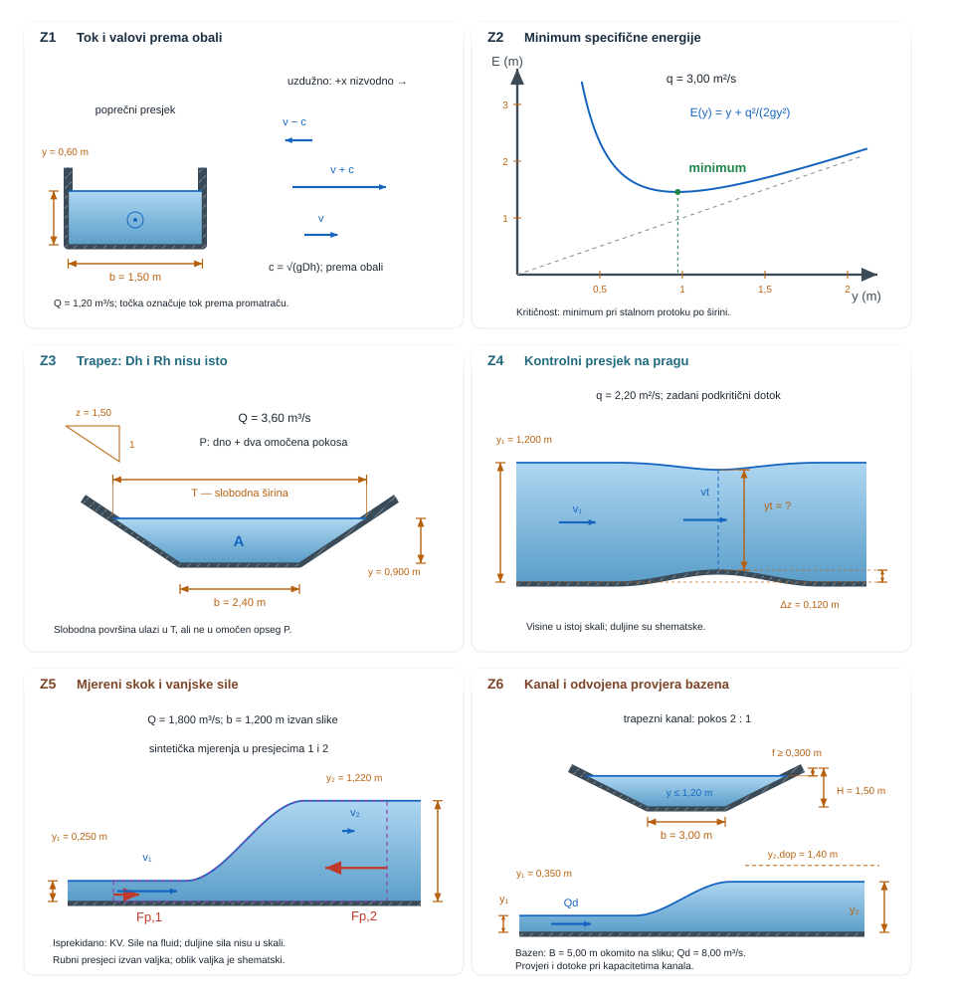

{#fig-otvoreni-tok-pregled fig-align="center" fig-alt="Otvoreni tok prelazi iz mirnog u kritični i siloviti režim te kroz hidraulički skok ponovno u dublji tok."}

## Otvoreni tokovi {#sec-otvoreni-tok-motivacija}

U punoj cijevi geometrija presjeka zadaje cijelu granicu toka. U otvorenom kanalu gornja je granica slobodna površina čiji se položaj mora odrediti zajedno s brzinom. Gravitacija tada ne daje samo potencijalnu energiju: ona određuje brzinu površinskih valova i razdvaja dva bitno različita režima [@chow1959].

::: {.mf1-application}

Inženjerski kontekst

Otvoreni tokovi pojavljuju se u odvodnim kanalima, preljevima brana, navodnjavanju i ispitnim bazenima. Uz kapacitet kanala treba odrediti smjer širenja poremećaja, položaj kritičnog presjeka i gubitak energije u hidrauličkom skoku.
:::

**Procijenjeno vrijeme rada uz udžbenik:** 9 sati.

## Geometrija presjeka i hidraulička dubina {#sec-geometrija-kanala}

Za poprečni presjek toka definiraju se površina $A$, širina slobodne površine $T$, omočen opseg $P$ i hidraulički polumjer

$$
R_h=\frac{A}{P}.
$$ {#eq-otvoreni-tokovi-geometrija-presjeka-i-hidraulicka-dubina-sec-geo-01}

Hidraulička dubina

$$
D_h=\frac{A}{T}
$$ {#eq-otvoreni-tokovi-geometrija-presjeka-i-hidraulicka-dubina-sec-geo-02}

nije isto što i hidraulički promjer pune cijevi. Ona je karakteristična dubina koja povezuje promjenu površine i razine te ulazi u brzinu dugoga gravitacijskog vala $c=\sqrt{gD_h}$.

Kontinuitet za stacionarni tok glasi $Q=Av$. Za pravokutni kanal širine $b$ i dubine $y$ vrijedi $A=by$, $T=b$, $D_h=y$ i protok po jedinici širine $q=Q/b=vy$.

## Froudeov broj i prijenos informacije {#sec-froude-kanal}

Froudeov broj otvorenog toka definira se

$$
Fr=\frac{v}{\sqrt{gD_h}}.
$$ {#eq-froude-otvoreni}

U jednodimenzijskom modelu plitke vode, uz približno hidrostatičku raspodjelu tlaka i pozitivni smjer nizvodno, vrijedi sljedeće tumačenje karakterističnih valova [@chow1959]:

- $Fr<1$: **mirni** ili podkritični tok; gravitacijski poremećaj može putovati i uzvodno i nizvodno.
- $Fr=1$: **kritični** tok; uzvodno širenje vala upravo je zaustavljeno.
- $Fr>1$: **siloviti** ili nadkritični tok; tok odnosi oba karakteristična vala nizvodno.

Ova je interpretacija preciznija od tvrdnje da je $Fr$ sam po sebi omjer sila: $Fr$ je omjer brzine toka i karakteristične brzine gravitacijskog vala, dok je $Fr^2$ omjer inercijske i gravitacijske skale.

::: {#ex-rezim-retencijski-kanal .mf1-we}

Režim u retencijskom kanalu T1

Pravokutni kanal širine $b=2{,}0\ \text{m}$ vodi $Q=3{,}0\ \text{m}^3/\text{s}$ pri dubini $y=0{,}80\ \text{m}$.

$$
v=\frac{Q}{by}=\frac{3}{2\cdot0{,}8}=1{,}875\ \text{m/s},
$$ {#eq-otvoreni-tokovi-rijeseni-primjer-rezim-u-retencijskom-kanalu-t1-01}

$$
Fr=\frac{1{,}875}{\sqrt{9{,}81\cdot0{,}80}}=0{,}669.
$$ {#eq-otvoreni-tokovi-rijeseni-primjer-rezim-u-retencijskom-kanalu-t1-02}

Tok je miran i promjena nizvodnog vodostaja može utjecati uzvodno. **Provjera:** $Fr$ je bezdimenzijski, a $v<c=2{,}80\ \text{m/s}$.
:::

::: {.mf1-numerika .kompakt}

Numerički trag — izbor modela slobodne površine

Jednadžbe plitke vode prikladne su kada je vertikalna struktura toka sporedna prema promjeni dubine i protoka. Trodimenzijski višefazni model potreban je kada lokalna geometrija, zakrivljenost površine, prskanje ili miješanje zraka mijenjaju traženu veličinu, uz znatno veći zahtjev za mrežom i vremenskim korakom.
:::

## Specifična energija i kritična dubina {#sec-specificna-energija}

Za blag nagib, približno hidrostatičku raspodjelu i korekcijski faktor kinetičke energije $\alpha\approx1$, energijska visina u odnosu na dno jest

$$
E=y+\frac{v^2}{2g}.
$$ {#eq-otvoreni-tokovi-specificna-energija-i-kriticna-dubina-sec-specif-01}

Za pravokutni kanal pri zadanom protoku po jedinici širine $q=vy$:

$$
E(y)=y+\frac{q^2}{2gy^2}.
$$ {#eq-specificna-energija}

Kritična dubina daje minimum specifične energije. Diferenciranjem uz konstantan $q$:

$$
\frac{dE}{dy}=1-\frac{q^2}{gy^3}=0,
$$ {#eq-otvoreni-tokovi-specificna-energija-i-kriticna-dubina-sec-specif-02}

pa je

$$
\boxed{y_c=\left(\frac{q^2}{g}\right)^{1/3}},
\qquad E_{min}=\frac{3}{2}y_c.
$$ {#eq-kriticna-dubina}

Uvrštavanjem $q=v y$ dobiva se $v^2=gy$ odnosno $Fr=1$. Za istu energiju veću od minimuma postoje dvije alternativne dubine: dublja mirna i plića silovita.

::: {#ex-kriticni-preljev .mf1-we}

Kritični presjek na širokom preljevu T2

Za kanal širine $b=4{,}0\ \text{m}$ i protok $Q=8{,}0\ \text{m}^3/\text{s}$ vrijedi $q=2{,}0\ \text{m}^2/\text{s}$. Kritična dubina je

$$
y_c=\left(\frac{2^2}{9{,}81}\right)^{1/3}=0{,}742\ \text{m},
$$ {#eq-otvoreni-tokovi-rijeseni-primjer-kriticni-presjek-na-sirokom-pre-01}

a minimalna specifična energija $E_{min}\approx1{,}112\ \text{m}$.

Energija je izračunata iz nezaokružene kritične dubine.

**Provjera:** $v_c=q/y_c=2{,}70\ \text{m/s}$ i $v_c/\sqrt{gy_c}=1{,}00$. Rezultat ne uključuje koeficijent istjecanja, zakrivljenost strujnica ni gubitak preko stvarnoga preljeva.
:::

## Postupno promjenjiv tok i kontrolni presjek {#sec-postupno-promjenjiv-tok}

Između presjeka energijska bilanca može se zapisati

$$
z_1+y_1+\alpha_1\frac{v_1^2}{2g}
=z_2+y_2+\alpha_2\frac{v_2^2}{2g}+h_L.
$$ {#eq-otvoreni-tokovi-postupno-promjenjiv-tok-i-kontrolni-presjek-sec-01}

Kod postupno promjenjivog toka dubina se mijenja na duljini mnogo većoj od dubine pa je raspodjela tlaka približno hidrostatička. Diferencijalni zapis za prizmatični kanal jest

$$
\frac{dy}{dx}=\frac{S_0-S_f}{1-Fr^2},
$$ {#eq-postupno-promjenjivi-tok}

gdje je $S_0$ nagib dna, a $S_f$ nagib energijske linije zbog trenja. Nazivnik pokazuje zašto presjek s kritičnom dubinom može određivati režim toka: pri $Fr\to1$ mala razlika nagiba može proizvesti veliku promjenu dubine, a jednostavna diferencijalna procjena postaje osjetljiva.

::: {#ex-dvije-dubine .mf1-we}

Dvije dubine za istu energiju T2

Za $q=1{,}5\ \text{m}^2/\text{s}$ i $E=1{,}20\ \text{m}$ rješava se

$$
y+\frac{1{,}5^2}{2g y^2}=1{,}20.
$$ {#eq-otvoreni-tokovi-rijeseni-primjer-dvije-dubine-za-istu-energiju-01}

Numerički se dobivaju $y_1\approx1{,}106\ \text{m}$ i $y_2\approx0{,}372\ \text{m}$. Za dublju granu $Fr\approx0{,}412$, a za pliću $Fr\approx2{,}11$.

**Provjera modela:** oba korijena zadovoljavaju istu idealiziranu specifičnu energiju, ali rubni uvjeti i smjer širenja informacije odlučuju koji se režim stvarno može uspostaviti.
:::

## Hidraulički skok: energija se gubi, količina gibanja zatvara prijelaz {#sec-hidraulicki-skok}

Hidraulički skok brz je prijelaz iz silovitog u mirni tok. Raspodjela tlaka dovoljno daleko prije i poslije skoka približno je hidrostatička, ali unutar skoka tok je snažno trodimenzijski i disipativan. Zato se između rubnih presjeka koristi bilanca količine gibanja, a ne Bernoullijeva jednadžba bez gubitaka.

Za pravokutni kanal po jedinici širine specifična funkcija količine gibanja jest

$$
M(y)=\frac{y^2}{2}+\frac{q^2}{gy}.
$$ {#eq-otvoreni-tokovi-hidraulicki-skok-energija-se-gubi-kolicina-giban-01}

Za kratak kontrolni volumen u približno vodoravnom pravokutnom kanalu zanemaruju se trenje o dno i stijenke te uzdužna komponenta težine. Hidrostatičke tlačne sile na ulaznom i izlaznom presjeku zadržavaju se; upravo one daju član $y^2/2$. Uz korekcijski faktor toka količine gibanja $\beta\approx1$ slijedi $M(y_1)=M(y_2)$. Preuređivanjem uz izražavanje $q$ preko uzvodnoga Froudeova broja dobiva se omjer spregnutih dubina

$$
\boxed{
\frac{y_2}{y_1}=\frac{1}{2}\left(\sqrt{1+8Fr_1^2}-1\right)
}.
$$ {#eq-spregnute-dubine}

Gubitak specifične energije iznosi

$$
\Delta E=E_1-E_2=\frac{(y_2-y_1)^3}{4y_1y_2}.
$$ {#eq-gubitak-skoka}

::: {#ex-hidraulicki-skok-bazen .mf1-we}

Disipacijski bazen iza ustave T3

Ispod ustave pravokutnog kanala izmjereni su $y_1=0{,}25\ \text{m}$ i $v_1=6{,}0\ \text{m/s}$. Tada je

$$
Fr_1=\frac{6}{\sqrt{9{,}81\cdot0{,}25}}=3{,}83,
$$ {#eq-otvoreni-tokovi-rijeseni-primjer-disipacijski-bazen-iza-ustave-t-01}

$$
\frac{y_2}{y_1}=\frac{\sqrt{1+8(3{,}83)^2}-1}{2}=4{,}94,
\qquad y_2=1{,}24\ \text{m}.
$$ {#eq-otvoreni-tokovi-rijeseni-primjer-disipacijski-bazen-iza-ustave-t-02}

$$
\Delta E=\frac{(y_2-y_1)^3}{4y_1y_2}\approx0{,}774\ \text{m}.
$$ {#eq-otvoreni-tokovi-rijeseni-primjer-disipacijski-bazen-iza-ustave-t-03}

U posljednjem računu zadržava se puna preciznost dubine $y_2=1{,}235326\ldots\ \text{m}$; ranije zaokruživanje na $1{,}24\ \text{m}$ dalo bi oko $0{,}7825\ \text{m}$ gubitka.

**Provjera:** nizvodna je dubina veća, a specifična energija manja. Potrebna duljina ili konstrukcija bazena ne slijedi iz ovoga 1D računa; za nju su potrebne empirijske korelacije, modelno ispitivanje ili CFD validiran za odgovarajući režim, geometriju i ciljnu veličinu [@nasa-cfd-vv; @asme-vv20-2009].
:::

## Uniformni tok i Manningova jednadžba {#sec-uniformni-tok}

U dugom prizmatičnom kanalu može se uspostaviti približno uniformni tok u kojem su dubina i srednja brzina stalne, a nagib energijske linije jednak nagibu dna. U sustavu SI često se koristi empirijska Manningova relacija

$$
Q=\frac{1}{n}A R_h^{2/3}S_f^{1/2}.
$$ {#eq-manning}

U ovom SI zapisu Manningov koeficijent $n$ ima jedinicu $\text{s}/\text{m}^{1/3}$; nije bezdimenzijski. Nije ni svojstvo fluida: on sažima hrapavost, oblik, vegetaciju, nepravilnost i stanje kanala te mora imati izvor i područje valjanosti [@chow1959]. U primjerima i zadatcima vrijednosti $n$ zadane su u toj jedinici. Jednadžba nije zamjena za lokalnu bilancu pri brzom suženju, preljevu ili hidrauličkom skoku.

::: {#ex-manning-osjetljivost .mf1-we}

Osjetljivost propusnosti odvodnog kanala na održavanje T3

Pravokutni kanal ima $b=3{,}0\ \text{m}$, $y=1{,}0\ \text{m}$ i $S_f=0{,}001$. Površina je $A=3{,}0\ \text{m}^2$, omočen opseg $P=5{,}0\ \text{m}$ i $R_h=0{,}60\ \text{m}$. Za čisti kanal $n=0{,}015$:

$$
Q=\frac{1}{0{,}015}(3)(0{,}60)^{2/3}(0{,}001)^{1/2}=4{,}50\ \text{m}^3/\text{s}.
$$ {#eq-otvoreni-tokovi-rijeseni-primjer-osjetljivost-klimatskog-kanala-01}

Ako vegetacija i nanos povećaju $n$ na $0{,}025$, ista geometrija i nagib daju $Q=2{,}70\ \text{m}^3/\text{s}$. **Interpretacija:** kapacitet je pao 40 %, ali brojke nisu projektna jamstva bez lokalno kalibriranog $n$ i sigurnosne analize.
:::

## Postupak analize otvorenog toka {#sec-otvoreni-tok-ritual}

1. Skica obuhvaća dno, slobodnu površinu, presjek i smjer toka.
2. Određuju se $A$, $T$, $P$, $D_h$ i $R_h$, uz razdvajanje njihovih fizikalnih uloga.
3. Srednja brzina $v$ i $Fr$ određuju se prije izbora uzvodnog ili nizvodnog rubnog uvjeta.
4. Za glatku promjenu primjenjuje se energijska bilanca, a za hidraulički skok bilanca količine gibanja i gubitak energije.
5. Empirijski koeficijenti navode se s izvorom, rasponom valjanosti i analizom osjetljivosti rezultata.

::: {.mf1-samoprovjera}

Provjeri sebe

1. Zašto se utjecaj promjene nizvodnog vodostaja može prenijeti uzvodno samo pri $Fr<1$?
2. Zašto kritična dubina minimizira specifičnu energiju pri zadanom $q$?
3. Zašto hidraulički skok ne smijemo zatvoriti Bernoullijevom jednadžbom bez gubitaka?
4. Je li Manningov $n$ univerzalno svojstvo betona?

::: {.callout-note collapse="true"}
### Odgovori
Brzina uzvodnog gravitacijskog vala tada nadmašuje srednju brzinu toka. U minimumu je $dE/dy=0$, što vodi na $Fr=1$. Skok je snažno ireverzibilan i disipira energiju, dok bilanca količine gibanja ostaje odgovarajući integralni zakon. Nije; $n$ je empirijski opis cijelog stanja kanala i mora biti lokalno opravdan.
:::
:::

::: {.mf1-numerika .kompakt}

Numerički trag — slobodna površina i hidraulički skok

Numerički modeli plitke vode diskretiziraju jednadžbe očuvanja mase i količine gibanja kada je vertikalna struktura toka sekundarna. Za složenu trodimenzijsku geometriju, izraženu zakrivljenost slobodne površine ili miješanje zraka uvodi se višefazni CFD, uz provjeru volumne bilance, konvergencije mreže i osjetljivosti na vremenski korak.

Za proračun kanala prate se vodostaj, protok, Froudeov broj i bilanca energije ili količine gibanja na istim presjecima kao u ručnom modelu. Diskretni prikaz hidrauličkoga skoka mora zadovoljiti bilance mase i količine gibanja. Pad mehaničke energije uključuje fizikalnu disipaciju, pa ga treba razlikovati od dodatnog utjecaja numeričke disipacije.

Višefazni model dodatno traži provjeru očuvanja vode i zraka te osjetljivosti položaja slobodne površine na vremenski korak. Izgled uvjerljive površine nije dovoljan ako se mijenja volumni debalans ili maksimalna dubina koja je projektna izlazna veličina.
:::

## Zadaci za vježbu {#sec-otvoreni-tok-zadaci}

{#fig-otvoreni-tok-vjezbe fig-align="center" fig-alt="Poprečne kote razlikuju dno, slobodnu širinu i dubinu. Uzdužni prikazi imaju otvoren tok iznad neprekinutog dna; sile na rubovima kontrolnog volumena skoka su suprotne."}

U svim vježbama koristi $g=9{,}81\ \mathrm{m/s^2}$.

::::: {.mf1-vjezbe-list}

### Froudeov broj i širenje poremećaja {#task-otvoreni-fr .unnumbered .unlisted}

Pravokutni kanal širine $b=1{,}5\ \mathrm{m}$ vodi $Q=1{,}2\ \mathrm{m^3/s}$ pri dubini $y=0{,}60\ \mathrm{m}$. Odredi srednju brzinu, Froudeov broj te smjer i brzinu obaju dugih gravitacijskih poremećaja prema nepomičnoj obali. Pozitivan smjer je nizvodno; primijeni model plitke vode s približno hidrostatičkim tlakom.

:::: {.content-visible .mf1-hint-online when-format="html"}
::: {.callout-note collapse="true" data-hint-key="true"}
### Naputak

Iz kontinuiteta odredi $v$. Za pravokutni kanal $D_h=y$, pa je relativna brzina dugog vala $c=\sqrt{gy}$. Prema obali valovi imaju brzine $v-c$ i $v+c$; sačuvaj predznake.
:::
::::

:::: {.content-visible .mf1-answer-online when-format="html"}
::: {.callout-tip collapse="true" data-answer-key="true"}
### Kontrolni rezultat

$v\approx1{,}333\ \mathrm{m/s}$, $Fr\approx0{,}550$, $c\approx2{,}426\ \mathrm{m/s}$. Brzine prema obali su $v-c\approx-1{,}093\ \mathrm{m/s}$ i $v+c\approx3{,}759\ \mathrm{m/s}$. Jedan poremećaj putuje uzvodno, drugi nizvodno.
:::
::::

[Razina: T1]{.mf1-task-level}

### Kritična dubina i minimalna energija {#task-kriticna-dubina .unnumbered .unlisted}

U pravokutnom kanalu protok po jedinici širine je $q=3{,}0\ \mathrm{m^2/s}$. Za hidrostatički model i korekcijski faktor kinetičke energije jednak jedinici odredi kritičnu dubinu i minimalnu specifičnu energiju.

:::: {.content-visible .mf1-hint-online when-format="html"}
::: {.callout-note collapse="true" data-hint-key="true"}
### Naputak

Traži minimum funkcije $E(y)$ pri stalnom $q$. Kritično stanje provjeri i uvjetom $Fr=1$; specifična energija mjeri se od lokalnog dna.
:::
::::

:::: {.content-visible .mf1-answer-online when-format="html"}
::: {.callout-tip collapse="true" data-answer-key="true"}
### Kontrolni rezultat

$y_c\approx0{,}972\ \mathrm{m}$ i $E_{min}\approx1{,}46\ \mathrm{m}$; u kritičnom presjeku $Fr=1$.
:::
::::

[Razina: T1]{.mf1-task-level}

### Geometrija i tok trapeznog kanala {#task-trapezni-presjek .unnumbered .unlisted}

U trapeznom kanalu razlikuj površinu poprečnog presjeka toka, širinu slobodne površine i omočen opseg. Iz geometrije odredi obje hidrauličke duljine, a zatim klasificiraj tok. Obrazloži koja duljina ulazi u brzinu gravitacijskog vala i zašto je ne smiješ zamijeniti duljinom za otpor strujanju.

Simetrični trapezni kanal ima širinu dna $b=2{,}40\ \mathrm{m}$, pokos $z=1{,}50$ vodoravno na jedan okomito, dubinu $y=0{,}900\ \mathrm{m}$ i protok $Q=3{,}60\ \mathrm{m^3/s}$. Izračunaj $A$, $T$, $P$, $D_h$, $R_h$, srednju brzinu i $Fr$. Tok je jednodimenzijski s približno hidrostatičkim tlakom. Slobodna površina nije dio omočenog opsega.

:::: {.content-visible .mf1-hint-online when-format="html"}
::: {.callout-note collapse="true" data-hint-key="true"}
### Naputak

Za pokos $z{:}1$ vrijedi $A=y(b+zy)$, $T=b+2zy$ i $P=b+2y\sqrt{1+z^2}$. U izrazu za $Fr$ upotrijebi $D_h=A/T$, a ne $R_h$.
:::
::::

:::: {.content-visible .mf1-answer-online when-format="html"}
::: {.callout-tip collapse="true" data-answer-key="true"}
### Kontrolni rezultat

$A=3{,}375\ \mathrm{m^2}$, $T=5{,}100\ \mathrm{m}$, $P\approx5{,}645\ \mathrm{m}$, $D_h\approx0{,}6618\ \mathrm{m}$, $R_h\approx0{,}5979\ \mathrm{m}$, $v\approx1{,}0667\ \mathrm{m/s}$ i $Fr\approx0{,}4186$ (mirni tok).
:::
::::

[Razina: T2]{.mf1-task-level}

### Kontrolni presjek na pragu {#task-kontrolni-presjek-na-pragu .unnumbered .unlisted}

Povišenje dna smanjuje raspoloživu specifičnu energiju toka. Provjeri može li voda prijeći preko širokog, blagog praga uz nepromijenjenu uzvodnu dubinu. Odredi graničnu visinu dna i odaberi ostvarivu dubinu na tjemenu prema neprekinutom nastavku uzvodnog režima.

Pravokutni kanal stalne širine vodi $q=2{,}20\ \mathrm{m^2/s}$ pri podkritičnoj uzvodnoj dubini $y_1=1{,}200\ \mathrm{m}$. Dno na tjemenu je više za $\Delta z=0{,}120\ \mathrm{m}$. Zanemari gubitke; tlak je približno hidrostatički, a $\alpha=1$. Nizvodni uvjet dopušta glatki podkritični nastavak. Promatraj presjeke daleko od lokalne zakrivljenosti prijelaza.

Odredi $y_c$, $E_{min}$ i najveće povišenje $\Delta z_{max}$ bez uzvodnog uspora. Za zadani prag odredi specifičnu energiju na tjemenu, oba pozitivna matematička korijena i prema fizikalnim uvjetima odaberi dubinu $y_t$ te njezin $Fr_t$. Za odabrani korijen zahtijevaj energijski rezidual manji od $\varepsilon_E=10^{-6}\ \mathrm{m}$. Objasni što se u modelu mora promijeniti ako prag nadvisi izračunatu granicu pri istom protoku.

:::: {.content-visible .mf1-hint-online when-format="html"}
::: {.callout-note collapse="true" data-hint-key="true"}
### Naputak

Između presjeka sačuvaj $z+E$. Na tjemenu je $E_t=E_1-\Delta z$, a minimum je granica prolaza. Korijene traži s obje strane $y_c$; neprekinuti podkritični dotok bira dublju granu. Pri graničnoj visini obje se grane spajaju.
:::
::::

:::: {.content-visible .mf1-answer-online when-format="html"}
::: {.callout-tip collapse="true" data-answer-key="true"}
### Kontrolni rezultat

$y_c\approx0{,}790179\ \mathrm{m}$, $E_{min}\approx1{,}185268\ \mathrm{m}$ i $\Delta z_{max}\approx0{,}186042\ \mathrm{m}$. Za zadani prag $E_t\approx1{,}251310\ \mathrm{m}$; korijeni su $0{,}630231$ i $1{,}009009\ \mathrm{m}$. Odabire se $y_t\approx1{,}009009\ \mathrm{m}$, $Fr_t\approx0{,}6930$. Viši prag traži uzvodni uspor ili promjenu protoka; prvotno stanje ne ostaje moguće.
:::
::::

[Razina: T2]{.mf1-task-level}

### Provjera mjerenja hidrauličkog skoka {#task-skok-mjerenje .unnumbered .unlisted}

Provjeri zatvara li sintetički mjerni skup bilancu količine gibanja kroz hidraulički skok. Odaberi kontrolni volumen s rubnim presjecima izvan valjka skoka, prikaži vanjske sile i usporedi rezidual s mjernom nesigurnošću. Zaključak ograniči na zadani model i kriterij slaganja mjerenja.

Zadano je $Q=1{,}800\pm0{,}018\ \mathrm{m^3/s}$, $b=1{,}200\pm0{,}003\ \mathrm{m}$, $y_1=0{,}250\pm0{,}003\ \mathrm{m}$ i $y_2=1{,}220\pm0{,}008\ \mathrm{m}$; navedene su neovisne standardne nesigurnosti ($k=1$). Kanal je vodoravan i pravokutan. Na kratkom kontrolnom volumenu zanemari uzdužnu silu dna i stijenki, uz hidrostatički tlak u rubnim presjecima i $\beta_1=\beta_2=1$.

Izvedi rezidual $R=M_2-M_1$, linearno propagiraj nesigurnost svih četiriju mjerenja i primijeni kriterij $|R|\le2u_R$. Oba presjeka koriste isti izračunati $q=Q/b$; njihove doprinose nesigurnosti ne smiješ tretirati kao dva neovisna protoka. Odredi i teorijsku spregnutu dubinu iz srednjih uzvodnih ulaza.

:::: {.content-visible .mf1-hint-online when-format="html"}
::: {.callout-note collapse="true" data-hint-key="true"}
### Naputak

Najprije propagiraj $q=Q/b$. Za $M(y,q)=y^2/2+q^2/(gy)$ deriviraj rezidual prema $y_1$, $y_2$ i zajedničkom $q$, a zatim primijeni korijen zbroja kvadrata. Hidrostatičke sile djeluju u suprotnim smjerovima; težina nema uzdužnu komponentu.
:::
::::

:::: {.content-visible .mf1-answer-online when-format="html"}
::: {.callout-tip collapse="true" data-answer-key="true"}
### Kontrolni rezultat

$q=1{,}5000\ \mathrm{m^2/s}$, $u_q\approx0{,}01546\ \mathrm{m^2/s}$, $R\approx-0{,}01648\ \mathrm{m^2}$ i $u_R\approx0{,}02010\ \mathrm{m^2}$. Omjer $|R|/u_R\approx0{,}820<2$: mjerenja su sukladna bilanci prema zadanom kriteriju. Teorijska dubina je $1{,}2353\ \mathrm{m}$. Slaganje samo po sebi ne dokazuje sve pretpostavke modela.
:::
::::

[Razina: T3]{.mf1-task-level}

### Propusnost oborinskog kanala {#task-klimatski-kanal .unnumbered .unlisted}

Usporedi tri stanja održavanja oborinskog kanala i provjeri slobodni rub pri zadanom protoku. Zatim odvojeno provjeri disipacijski bazen pri projektnom dotoku i pri kapacitetima kanala. Obrazloži odluku uz zadani kriterij nepovoljnije hrapavosti i granice podataka.

Simetrični trapezni kanal ima $b=3{,}00\ \mathrm{m}$, pokos $z=2{,}00$ vodoravno na jedan okomito, konstrukcijsku dubinu $H=1{,}50\ \mathrm{m}$ i nagib dna $S_0=0{,}00150$. Traže se projektni protok $Q_d=8{,}00\ \mathrm{m^3/s}$ i slobodni rub najmanje $f_{min}=0{,}300\ \mathrm{m}$. Primijeni uniformni Manningov model sa $S_f=S_0$. Nastavne procjene su A: $n_A=0{,}018\pm0{,}001\ \mathrm{s/m^{1/3}}$, B: $n_B=0{,}026\pm0{,}002\ \mathrm{s/m^{1/3}}$, C: $n_C=0{,}035\pm0{,}004\ \mathrm{s/m^{1/3}}$; navedene su standardne nesigurnosti.

Za svaki srednji $n$ odredi kapacitet na dopuštenoj dubini, normalnu dubinu pri $Q_d$ i slobodni rub. Ponovi kapacitet s $n_c=n+2u_n$: to je zadani kriterij nepovoljnije procjene, a ne zajamčena granica niti dokaz vjerojatnosti bez pretpostavke o raspodjeli.

Bazen je zaseban vodoravni pravokutni kontrolni volumen širine $B=5{,}00\ \mathrm{m}$. Ulazna dubina $y_1=0{,}350\ \mathrm{m}$ zadana je za sve usporedbe, a dopuštena spregnuta dubina je $y_{2,dop}=1{,}40\ \mathrm{m}$. Ulazni tok je nadkritičan, rubni tlakovi hidrostatički, $\beta=1$, a uzdužne sile trenja zanemarive. Geometrija prijelaza i način održavanja ulazne dubine nisu modelirani.

Provjeri spregnutu dubinu pri $Q_d$ i pri svakom srednjem kapacitetu. Kapacitet kanala nije automatski stvarni dotok. Preporuči stanje održavanja, izdvoji ograničenje bazena i navedi što treba provjeriti na terenu: hrapavost, presjek/nagib, ulaznu dubinu, nizvodni vodostaj i hidrološke podatke.

:::: {.content-visible .mf1-hint-online when-format="html"}
::: {.callout-note collapse="true" data-hint-key="true"}
### Naputak

Na dopuštenoj dubini $H-f_{min}$ računaj kapacitet. Pri $Q_d$ numerički riješi Manningovu jednadžbu za dubinu. Veći $n$ smanjuje kapacitet i povećava normalnu dubinu. U bazenu koristi $q=Q/B$ i spregnute dubine; isti projektni dotok daje isti skok za sva stanja održavanja.
:::
::::

:::: {.content-visible .mf1-answer-online when-format="html"}
::: {.callout-tip collapse="true" data-answer-key="true"}
### Kontrolni rezultat

Redom A/B/C (protoci u m³/s, dubine i rubovi u m): $Q_{cap}=(11{,}759;8{,}141;6{,}047)$; $y_n=(0{,}985;1{,}189;1{,}380)$; $f=(0{,}515;0{,}311;0{,}120)$; $Q_c=(10{,}583;7{,}055;4{,}922)$. Samo A zadovoljava kriterij s $n_c$. Pri $Q_d$: $y_2=1{,}059$; pri kapacitetima: $y_2=(1{,}628;1{,}080;0{,}765)$. Kapacitet A prelazi zadanu granicu bazena. Kalibriraj hrapavost te provjeri geometriju, dotok i rubne vodostaje.
:::
::::

[Razina: T4]{.mf1-task-level}

:::::

::: {.mf1-numerika}

Numerički pokus — grane energije i hidraulički skok

Bilježnica `u15_otvoreni_tokovi.ipynb` zadržava pokus alternativnih dubina i nesigurnosti spregnute dubine. Nastavci provjeravaju prag iz Z4, zajednički protok u mjernoj bilanci Z5 i odluku o održavanju i bazenu iz Z6. Najprije nacrtaj očekivani oblik $E(y)$, zatim numerički pronađi korijene i provjeri bilancu energije prije i poslije skoka.

<a class="mf1-interaktivno-veza" href="https://martibasic.github.io/MF1_udzbenik/jlite/lab/index.html?path=u15_otvoreni_tokovi.ipynb">Pokreni u pregledniku</a>

:::

::: {.mf1-zavrsni-okvir}

Za ponijeti iz poglavlja

- Slobodna površina uvodi gravitacijske valove i hidrauličku dubinu kao novu karakterističnu skalu.
- $Fr$ određuje smjer prijenosa informacije; $Fr=1$ označuje kritični presjek u plitkovodnom modelu.
- Pri zadanom protoku kritična dubina minimizira specifičnu energiju.
- Hidraulički skok opisuje se bilancom količine gibanja, a pritom se disipira mehanička energija.
- Empirijski koeficijent hrapavosti mora imati izvor, raspon i analizu osjetljivosti.
:::
