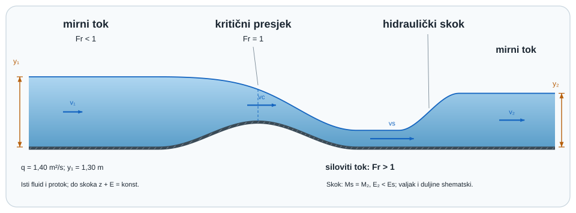

{#fig-otvoreni-tok-pregled fig-align="center" fig-alt="Otvoreni tok prelazi iz mirnog u kritični i siloviti režim te kroz hidraulički skok ponovno u dublji tok."}

## Tok kojemu tlak ne zatvara gornju granicu {#sec-otvoreni-tok-motivacija}

U punoj cijevi geometrija presjeka zadaje cijelu granicu toka. U otvorenom kanalu gornja je granica slobodna površina čiji se položaj mora odrediti zajedno s brzinom. Gravitacija tada ne daje samo potencijalnu energiju: ona određuje brzinu površinskih valova i razdvaja dva bitno različita režima [@chow1959].

::: {.mf1-application}

Inženjerski kontekst

Otvoreni tokovi pojavljuju se u urbanim odvodnim kanalima, preljevima brana, navodnjavanju, brodograđevnim ispitnim bazenima, palubnoj odvodnji i tankim filmovima procesnih postrojenja. Klimatski otpornom gradu nije dovoljan samo „projektni protok”: treba znati može li poremećaj putovati uzvodno, gdje nastaje kritični presjek i koliko energije disipira hidraulički skok.
:::

::: {.mf1-priprema}

Prije čitanja poglavlja

**Predznanje:** hidrostatička raspodjela, kontinuitet, energijska i količinska bilanca, Froudeov broj i geometrija ravninskih presjeka.

**Ishodi učenja:**

- izračunati srednju brzinu, hidrauličku dubinu i Froudeov broj;
- razlikovati mirni, kritični i siloviti tok;
- izvesti kritičnu dubinu pravokutnog kanala iz minimuma specifične energije;
- primijeniti bilancu količine gibanja na hidraulički skok;
- procijeniti uniformni tok i jasno ograničiti empirijsku primjenu Manningove jednadžbe.

**Procijenjeno vrijeme rada uz udžbenik:** 9 sati.
:::

## Geometrija presjeka i hidraulička dubina {#sec-geometrija-kanala}

Za presjek protoka definiraju se površina $A$, širina slobodne površine $T$, omočen opseg $P$ i hidraulički polumjer

$$
R_h=\frac{A}{P}.
$$ {#eq-otvoreni-tokovi-geometrija-presjeka-i-hidraulicka-dubina-sec-geo-01}

Hidraulička dubina

$$
D_h=\frac{A}{T}
$$ {#eq-otvoreni-tokovi-geometrija-presjeka-i-hidraulicka-dubina-sec-geo-02}

nije isto što i hidraulički promjer pune cijevi. Ona je karakteristična dubina koja povezuje promjenu površine i razine te ulazi u brzinu dugoga gravitacijskog vala $c=\sqrt{gD_h}$.

Kontinuitet za stacionarni tok glasi $Q=Av$. Za pravokutni kanal širine $b$ i dubine $y$ vrijedi $A=by$, $T=b$, $D_h=y$ i protok po jedinici širine $q=Q/b=vy$.

## Froudeov broj i prijenos informacije {#sec-froude-kanal}

Froudeov broj otvorenog toka definira se

$$
Fr=\frac{v}{\sqrt{gD_h}}.
$$ {#eq-froude-otvoreni}

U jednodimenzijskom modelu plitke vode, uz približno hidrostatičku raspodjelu tlaka i pozitivni smjer nizvodno, vrijedi sljedeće tumačenje karakterističnih valova [@chow1959]:

- $Fr<1$: **mirni** ili podkritični tok; gravitacijski poremećaj može putovati i uzvodno i nizvodno.
- $Fr=1$: **kritični** tok; uzvodno širenje vala upravo je zaustavljeno.
- $Fr>1$: **siloviti** ili nadkritični tok; oba karakteristična vala odnosi tok nizvodno.

Ova je interpretacija preciznija od tvrdnje da je $Fr$ sam po sebi omjer sila: $Fr$ je omjer brzine toka i karakteristične brzine gravitacijskog vala, dok je $Fr^2$ omjer inercijske i gravitacijske skale.

::: {#ex-rezim-retencijski-kanal .mf1-we}

Riješeni primjer — Režim u retencijskom kanalu T1

Pravokutni kanal širine $b=2{,}0\ \text{m}$ vodi $Q=3{,}0\ \text{m}^3/\text{s}$ pri dubini $y=0{,}80\ \text{m}$.

$$
v=\frac{Q}{by}=\frac{3}{2\cdot0{,}8}=1{,}875\ \text{m/s},
$$ {#eq-otvoreni-tokovi-rijeseni-primjer-rezim-u-retencijskom-kanalu-t1-01}

$$
Fr=\frac{1{,}875}{\sqrt{9{,}81\cdot0{,}80}}=0{,}669.
$$ {#eq-otvoreni-tokovi-rijeseni-primjer-rezim-u-retencijskom-kanalu-t1-02}

Tok je miran i promjena nizvodnog vodostaja može utjecati uzvodno. **Provjera:** $Fr$ je bezdimenzijski, a $v<c=2{,}80\ \text{m/s}$.
:::

## Specifična energija i kritična dubina {#sec-specificna-energija}

Za blag nagib, približno hidrostatičku raspodjelu i korekcijski faktor kinetičke energije $\alpha\approx1$, energijska visina u odnosu na dno jest

$$
E=y+\frac{v^2}{2g}.
$$ {#eq-otvoreni-tokovi-specificna-energija-i-kriticna-dubina-sec-specif-01}

Za pravokutni kanal pri zadanom protoku po širini $q=vy$:

$$
E(y)=y+\frac{q^2}{2gy^2}.
$$ {#eq-specificna-energija}

Kritična dubina daje minimum specifične energije. Diferenciranjem uz konstantan $q$:

$$
\frac{dE}{dy}=1-\frac{q^2}{gy^3}=0,
$$ {#eq-otvoreni-tokovi-specificna-energija-i-kriticna-dubina-sec-specif-02}

pa je

$$
\boxed{y_c=\left(\frac{q^2}{g}\right)^{1/3}},
\qquad E_{min}=\frac{3}{2}y_c.
$$ {#eq-kriticna-dubina}

Uvrštavanjem $q=v y$ dobiva se $v^2=gy$ odnosno $Fr=1$. Za istu energiju veću od minimuma postoje dvije alternativne dubine: dublja mirna i plića silovita.

::: {#ex-kriticni-preljev .mf1-we}

Riješeni primjer — Kritični presjek na širokom preljevu T2

Za kanal širine $b=4{,}0\ \text{m}$ i protok $Q=8{,}0\ \text{m}^3/\text{s}$ vrijedi $q=2{,}0\ \text{m}^2/\text{s}$. Kritična dubina je

$$
y_c=\left(\frac{2^2}{9{,}81}\right)^{1/3}=0{,}742\ \text{m},
$$ {#eq-otvoreni-tokovi-rijeseni-primjer-kriticni-presjek-na-sirokom-pre-01}

a minimalna specifična energija $E_{min}=1{,}113\ \text{m}$.

**Provjera:** $v_c=q/y_c=2{,}70\ \text{m/s}$ i $v_c/\sqrt{gy_c}=1{,}00$. Rezultat ne uključuje koeficijent istjecanja, zakrivljenost strujnica ni gubitak preko stvarnoga preljeva.
:::

## Postupno promjenjiv tok i kontrolni presjek {#sec-postupno-promjenjiv-tok}

Između presjeka energijska bilanca može se zapisati

$$
z_1+y_1+\alpha_1\frac{v_1^2}{2g}
=z_2+y_2+\alpha_2\frac{v_2^2}{2g}+h_L.
$$ {#eq-otvoreni-tokovi-postupno-promjenjiv-tok-i-kontrolni-presjek-sec-01}

Kod postupno promjenjivog toka dubina se mijenja na duljini mnogo većoj od dubine pa je raspodjela tlaka približno hidrostatička. Diferencijalni zapis za prizmatični kanal jest

$$
\frac{dy}{dx}=\frac{S_0-S_f}{1-Fr^2},
$$ {#eq-postupno-promjenjivi-tok}

gdje je $S_0$ nagib dna, a $S_f$ nagib energijske linije zbog trenja. Nazivnik pokazuje zašto se kritična dubina ponaša kao kontrolni presjek: pri $Fr\to1$ mala razlika nagiba može proizvesti veliku promjenu dubine, a jednostavna diferencijalna procjena postaje osjetljiva.

::: {#ex-dvije-dubine .mf1-we}

Riješeni primjer — Dvije dubine za istu energiju T2

Za $q=1{,}5\ \text{m}^2/\text{s}$ i $E=1{,}20\ \text{m}$ rješava se

$$
y+\frac{1{,}5^2}{2g y^2}=1{,}20.
$$ {#eq-otvoreni-tokovi-rijeseni-primjer-dvije-dubine-za-istu-energiju-01}

Numerički se dobivaju $y_1\approx1{,}106\ \text{m}$ i $y_2\approx0{,}372\ \text{m}$. Za dublju granu $Fr\approx0{,}412$, a za pliću $Fr\approx2{,}11$.

**Provjera modela:** oba korijena zadovoljavaju istu idealiziranu specifičnu energiju, ali rubni uvjeti i smjer širenja informacije odlučuju koji se režim stvarno može uspostaviti.
:::

## Hidraulički skok: energija se gubi, količina gibanja zatvara prijelaz {#sec-hidraulicki-skok}

Hidraulički skok brz je prijelaz iz silovitog u mirni tok. Raspodjela tlaka dovoljno daleko prije i poslije skoka približno je hidrostatička, ali unutar skoka tok je snažno trodimenzijski i disipativan. Zato se između rubnih presjeka koristi bilanca količine gibanja, a ne Bernoulli bez gubitaka.

Za pravokutni kanal po jedinici širine specifična funkcija količine gibanja jest

$$
M(y)=\frac{y^2}{2}+\frac{q^2}{gy}.
$$ {#eq-otvoreni-tokovi-hidraulicki-skok-energija-se-gubi-kolicina-giban-01}

Ako su vanjske uzdužne sile na kratkom kontrolnom volumenu zanemarive, $M(y_1)=M(y_2)$. Eliminacija $q$ daje omjer spregnutih dubina

$$
\boxed{
\frac{y_2}{y_1}=\frac{1}{2}\left(\sqrt{1+8Fr_1^2}-1\right)
}.
$$ {#eq-spregnute-dubine}

Gubitak specifične energije iznosi

$$
\Delta E=E_1-E_2=\frac{(y_2-y_1)^3}{4y_1y_2}.
$$ {#eq-gubitak-skoka}

::: {#ex-hidraulicki-skok-bazen .mf1-we}

Riješeni primjer — Disipacijski bazen iza ustave T3

Ispod ustave pravokutnog kanala izmjereni su $y_1=0{,}25\ \text{m}$ i $v_1=6{,}0\ \text{m/s}$. Tada je

$$
Fr_1=\frac{6}{\sqrt{9{,}81\cdot0{,}25}}=3{,}83,
$$ {#eq-otvoreni-tokovi-rijeseni-primjer-disipacijski-bazen-iza-ustave-t-01}

$$
\frac{y_2}{y_1}=\frac{\sqrt{1+8(3{,}83)^2}-1}{2}=4{,}94,
\qquad y_2=1{,}24\ \text{m}.
$$ {#eq-otvoreni-tokovi-rijeseni-primjer-disipacijski-bazen-iza-ustave-t-02}

$$
\Delta E=\frac{(1{,}24-0{,}25)^3}{4(0{,}25)(1{,}24)}=0{,}774\ \text{m}.
$$ {#eq-otvoreni-tokovi-rijeseni-primjer-disipacijski-bazen-iza-ustave-t-03}

**Provjera:** nizvodna je dubina veća, a specifična energija manja. Dobivena duljina ili konstrukcija bazena ne slijedi iz ovoga 1D računa; za nju su potrebne empirijske korelacije, modelno ispitivanje ili CFD validiran za odgovarajući režim, geometriju i ciljnu veličinu [@nasa-cfd-vv; @asme-vv20-2009].
:::

## Uniformni tok i Manningova jednadžba {#sec-uniformni-tok}

U dugom prizmatičnom kanalu može se uspostaviti približno uniformni tok u kojem su dubina i srednja brzina stalne, a nagib energijske linije jednak nagibu dna. U SI sustavu često se koristi empirijska Manningova relacija

$$
Q=\frac{1}{n}A R_h^{2/3}S_f^{1/2}.
$$ {#eq-manning}

Koeficijent $n$ nije svojstvo fluida: on sažima hrapavost, oblik, vegetaciju, nepravilnost i stanje kanala te mora imati izvor i područje valjanosti [@chow1959]. Jednadžba nije zamjena za lokalnu bilancu pri brzom suženju, preljevu ili hidrauličkom skoku.

::: {#ex-manning-osjetljivost .mf1-we}

Riješeni primjer — Osjetljivost klimatskog kanala na održavanje T3

Pravokutni kanal ima $b=3{,}0\ \text{m}$, $y=1{,}0\ \text{m}$ i $S_f=0{,}001$. Površina je $A=3{,}0\ \text{m}^2$, omočen opseg $P=5{,}0\ \text{m}$ i $R_h=0{,}60\ \text{m}$. Za čist kanal $n=0{,}015$:

$$
Q=\frac{1}{0{,}015}(3)(0{,}60)^{2/3}(0{,}001)^{1/2}=4{,}50\ \text{m}^3/\text{s}.
$$ {#eq-otvoreni-tokovi-rijeseni-primjer-osjetljivost-klimatskog-kanala-01}

Ako vegetacija i nanos povećaju $n$ na $0{,}025$, ista geometrija i nagib daju $Q=2{,}70\ \text{m}^3/\text{s}$. **Interpretacija:** kapacitet je pao 40 %, ali brojke nisu projektna jamstva bez lokalno kalibriranog $n$ i sigurnosne analize.
:::

## Radni ritual otvorenog toka {#sec-otvoreni-tok-ritual}

1. Nacrtaj dno, slobodnu površinu, presjek i smjer toka.
2. Odredi $A$, $T$, $P$, $D_h$ i $R_h$; ne zamjenjuj njihove uloge.
3. Izračunaj $v$ i $Fr$ prije odabira uzvodnog ili nizvodnog rubnog uvjeta.
4. Za glatku promjenu koristi energiju; za skok koristi količinu gibanja i zatim izračunaj gubitak energije.
5. Empirijske koeficijente navedi s izvorom, rasponom i osjetljivošću rezultata.

::: {.mf1-samoprovjera}

Provjeri sebe

1. Zašto se nizvodni vodostaj može prenijeti uzvodno samo pri $Fr<1$?
2. Zašto kritična dubina minimizira specifičnu energiju pri zadanom $q$?
3. Zašto hidraulički skok ne smijemo zatvoriti Bernoullijevom jednadžbom bez gubitaka?
4. Je li Manningov $n$ univerzalno svojstvo betona?

::: {.callout-note collapse="true"}
### Odgovori
Brzina uzvodnog gravitacijskog vala tada nadmašuje srednju brzinu toka. U minimumu je $dE/dy=0$, što vodi na $Fr=1$. Skok je snažno ireverzibilan i disipira energiju, dok bilanca količine gibanja ostaje odgovarajući integralni zakon. Nije; $n$ je empirijski opis cijelog stanja kanala i mora biti lokalno opravdan.
:::
:::

## Zadaci za vježbu {#sec-otvoreni-tok-zadaci}

::::: {.mf1-vjezbe-list}
1. [**T1**]{#task-otvoreni-fr} Pravokutni kanal $b=1{,}5\ \text{m}$ vodi $Q=1{,}2\ \text{m}^3/\text{s}$ pri $y=0{,}60\ \text{m}$. Odredi $v$, $Fr$ i smjer mogućeg širenja poremećaja.

   :::: {.content-visible .mf1-answer-online when-format="html"}
   ::: {.callout-tip collapse="true" data-answer-key="true"}
   ### Kontrolni rezultat

   $v=1{,}33\ \text{m/s}$, $Fr=0{,}55$.
   :::
   ::::
2. [**T1**]{#task-kriticna-dubina} Za $q=3{,}0\ \text{m}^2/\text{s}$ odredi $y_c$ i $E_{min}$.

   :::: {.content-visible .mf1-answer-online when-format="html"}
   ::: {.callout-tip collapse="true" data-answer-key="true"}
   ### Kontrolni rezultat

   $y_c\approx0{,}972\ \text{m}$, $E_{min}\approx1{,}46\ \text{m}$.
   :::
   ::::
3. [**T2**]{#task-trapezni-presjek} Simetrični trapezni kanal ima širinu dna $b=2{,}40\ \text{m}$, pokos $z=1{,}50$ vodoravno na jedan okomito, dubinu $y=0{,}900\ \text{m}$ i protok $Q=3{,}60\ \text{m}^3/\text{s}$. Izračunaj $A$, $T$, $P$, $D_h$, $R_h$, srednju brzinu i $Fr$; skicom jasno razdvoji širinu slobodne površine i omočen opseg.

   :::: {.content-visible .mf1-hint-online when-format="html"}
   ::: {.callout-note collapse="true" data-hint-key="true"}
   ### Naputak

   Za pokos $z{:}1$ vrijedi $A=y(b+zy)$, $T=b+2zy$ i $P=b+2y\sqrt{1+z^2}$. U izrazu za $Fr$ upotrijebi $D_h=A/T$, a ne $R_h$.
   :::
   ::::

   :::: {.content-visible .mf1-answer-online when-format="html"}
   ::: {.callout-tip collapse="true" data-answer-key="true"}
   ### Kontrolni rezultat

   $A=3{,}375\ \text{m}^2$, $T=5{,}100\ \text{m}$, $P=5{,}645\ \text{m}$, $D_h=0{,}6618\ \text{m}$, $R_h=0{,}5979\ \text{m}$, $v=1{,}0667\ \text{m/s}$ i $Fr=0{,}4186$ (mirni tok).
   :::
   ::::
4. [**T2**]{#task-alternativne-dubine} U pravokutnom kanalu protok po jedinici širine iznosi $q=2{,}20\ \text{m}^2/\text{s}$, a specifična energija $E=1{,}600\ \text{m}$. Bez uporabe gotove formule za korijene najprije provjeri $E>E_{min}$, zatim numerički odredi obje pozitivne dubine uz rezidual energije manji od $\varepsilon_E=1{,}0\cdot10^{-6}\ \text{m}$ i klasificiraj grane s pomoću $Fr$.

   :::: {.content-visible .mf1-hint-online when-format="html"}
   ::: {.callout-note collapse="true" data-hint-key="true"}
   ### Naputak

   Kritična dubina razdvaja intervale traženja korijena funkcije $f(y)=y+q^2/(2gy^2)-E$. Jedan korijen traži u $0<y<y_c$, a drugi u $y>y_c$; zapiši i kriterij zaustavljanja numeričkog postupka.
   :::
   ::::

   :::: {.content-visible .mf1-answer-online when-format="html"}
   ::: {.callout-tip collapse="true" data-answer-key="true"}
   ### Kontrolni rezultat

   $y_c=0{,}7902\ \text{m}$ i $E_{min}=1{,}1853\ \text{m}$. Plića je grana $y_s=0{,}4665\ \text{m}$, $Fr_s=2{,}204$; dublja je $y_d=1{,}4887\ \text{m}$, $Fr_d=0{,}3867$.
   :::
   ::::
5. [**T3**]{#task-skok-mjerenje} Na vodoravnom pravokutnom pokusnom kanalu izmjereni su $Q=1{,}800\pm0{,}018\ \text{m}^3/\text{s}$, $b=1{,}200\pm0{,}003\ \text{m}$, $y_1=0{,}250\pm0{,}003\ \text{m}$ i $y_2=1{,}220\pm0{,}008\ \text{m}$; navedene su neovisne standardne nesigurnosti ($k=1$). Presjeci su izvan valjka skoka, a na kratkom kontrolnom volumenu možeš zanemariti uzdužnu silu dna i stijenki te uzeti hidrostatički tlak i $\beta_1=\beta_2=1$. Definiraj kontrolni volumen i vanjske sile, izvedi rezidual bilance količine gibanja $R=M_2-M_1$, linearno propagiraj nesigurnost svih četiriju mjerenja i odluči zatvara li se bilanca prema kriteriju $|R|\le2u_R$.

   :::: {.content-visible .mf1-hint-online when-format="html"}
   ::: {.callout-note collapse="true" data-hint-key="true"}
   ### Naputak

   Najprije propagiraj $q=Q/b$. Za $M(y,q)=y^2/2+q^2/(gy)$ izračunaj parcijalne derivacije reziduala prema $y_1$, $y_2$ i $q$, a zatim primijeni korijen iz zbroja kvadrata. Hidrostatičke sile na krajnjim presjecima djeluju u suprotnim smjerovima; težina nema uzdužnu komponentu.
   :::
   ::::

   :::: {.content-visible .mf1-answer-online when-format="html"}
   ::: {.callout-tip collapse="true" data-answer-key="true"}
   ### Kontrolni rezultat

   $q=1{,}5000\ \text{m}^2/\text{s}$ i $u_q=0{,}01546\ \text{m}^2/\text{s}$. Dobiva se $R=-0{,}01648\ \text{m}^2$, $u_R=0{,}02010\ \text{m}^2$ i $|R|/u_R=0{,}820<2$, pa se u granicama zadanoga modela bilanca zatvara. Iz srednjih ulaza teorijska je spregnuta dubina $1{,}2353\ \text{m}$.
   :::
   ::::
6. [**T4**]{#task-klimatski-kanal} Trapezni oborinski kanal ima $b=3{,}00\ \text{m}$, pokos $z=2{,}00$, nagib $S_f=0{,}00150$ i konstrukcijsku dubinu $H=1{,}50\ \text{m}$; traže se projektni protok $Q_d=8{,}00\ \text{m}^3/\text{s}$ i slobodni rub najmanje $f_{min}=0{,}300\ \text{m}$. Procjene triju stanja jesu A: $n_A=0{,}018\pm0{,}001\ \text{s}/\text{m}^{1/3}$, B: $n_B=0{,}026\pm0{,}002\ \text{s}/\text{m}^{1/3}$ i C: $n_C=0{,}035\pm0{,}004\ \text{s}/\text{m}^{1/3}$ (standardne nesigurnosti). Manningovom jednadžbom usporedi kapacitete pri $y=H-f_{min}$, normalne dubine i slobodne rubove pri $Q_d$, a robusnost provjeri s $n_c=n+2u_n$. Kanal se ulijeva u pravokutni bazen širine $B=5{,}00\ \text{m}$ s ulaznom dubinom $y_1=0{,}350\ \text{m}$ i dopuštenom spregnutom dubinom $y_{2,dop}=1{,}40\ \text{m}$: provjeri skok pri $Q_d$ i pri kapacitetu svakog stanja, preporuči režim održavanja te navedi što prije odluke treba terenski kalibrirati.

   :::: {.content-visible .mf1-hint-online when-format="html"}
   ::: {.callout-note collapse="true" data-hint-key="true"}
   ### Naputak

   Za svaki $n$ najprije računaj kapacitet na dopuštenoj dubini $1{,}20\ \text{m}$, a normalnu dubinu pri $Q_d$ pronađi kao korijen Manningove jednadžbe. Odvojeno provjeri srednju procjenu i konzervativni $n_c$. U bazenu je $q=Q/B$; ista vrijednost $Q_d$ daje isti skok neovisno o stanju uzvodnog održavanja, ali kapaciteti daju različitu izvanprojektnu ovojnicu.
   :::
   ::::

   :::: {.content-visible .mf1-answer-online when-format="html"}
   ::: {.callout-tip collapse="true" data-answer-key="true"}
   ### Kontrolni rezultat

   Za A/B/C kapaciteti pri $y=1{,}20\ \text{m}$ iznose $11{,}759/8{,}141/6{,}047\ \text{m}^3/\text{s}$, a normalne dubine pri $Q_d$ $0{,}985/1{,}189/1{,}380\ \text{m}$, odnosno slobodni rubovi $0{,}515/0{,}311/0{,}120\ \text{m}$. S $n_c$ kapaciteti padaju na $10{,}583/7{,}055/4{,}922\ \text{m}^3/\text{s}$, pa samo A robusno zadovoljava oba zahtjeva. Pri $Q_d$ je $y_2=1{,}059\ \text{m}$; pri kapacitetima A/B/C dobiva se $y_2=1{,}628/1{,}080/0{,}765\ \text{m}$, pa bazen ne pokriva cijelu izvanprojektnu ovojnicu očišćenog kanala. Prije odluke treba terenski kalibrirati $n$, stvarni presjek i nagib, ulaznu dubinu i nizvodni vodostaj te projektnu hidrološku krivulju protoka.
   :::
   ::::
:::::

::: {.mf1-zavrsni-okvir}

Za ponijeti iz poglavlja

- Slobodna površina uvodi gravitacijske valove i hidrauličku dubinu kao novu karakterističnu skalu.
- $Fr$ određuje smjer prijenosa informacije; $Fr=1$ označuje kritični presjek u plitkovodnom modelu.
- Pri zadanom protoku kritična dubina minimizira specifičnu energiju.
- Hidraulički skok zatvara se količinom gibanja i pritom disipira energiju.
- Empirijski koeficijent hrapavosti mora imati izvor, raspon i analizu osjetljivosti.
:::

::: {.mf1-numerika}

Numerički pokus — grane energije i hidraulički skok

Notebook `u15_otvoreni_tokovi.ipynb` rješava nelinearnu jednadžbu alternativnih dubina, prikazuje minimum specifične energije i propagira mjernu nesigurnost kroz omjer spregnutih dubina. Student najprije crta očekivani oblik $E(y)$, zatim numerički pronalazi korijene i provjerava bilancu energije prije i poslije skoka.

<a class="mf1-interaktivno-veza" href="https://martibasic.github.io/MF1_udzbenik/jlite/lab/index.html?path=u15_otvoreni_tokovi.ipynb">Pokreni u pregledniku</a>

:::
