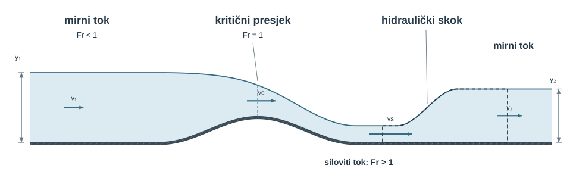
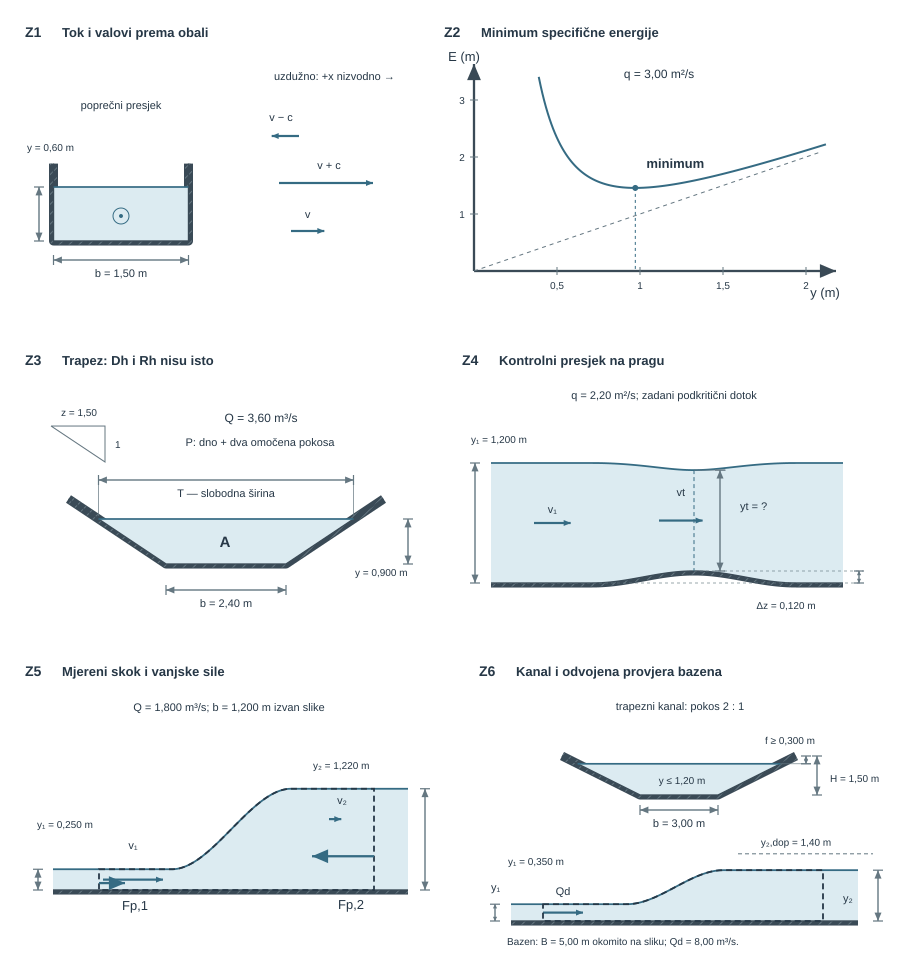

{#fig-otvoreni-tok-pregled fig-align="center" fig-alt="Otvoreni tok prelazi iz mirnog u kritični i siloviti režim te kroz hidraulički skok ponovno u dublji tok."}

**Tumačenje skice.** Prikazan je ilustrativni tok s $q=1{,}40\,\mathrm{m^2/s}$ i početnom dubinom $y_1=1{,}30\,\mathrm{m}$. Za isti fluid i protok, uz zanemarene gubitke prije skoka, vrijedi $z+E=\mathrm{konst}$. U kontrolnom volumenu hidrauličkog skoka vrijedi jednakost funkcije količine gibanja $M_s=M_2$, dok energija opada, $E_2<E_s$. Duljina skoka prikazana je shematski.

## Otvoreni tokovi {#sec-otvoreni-tok-motivacija}

U punoj cijevi geometrija presjeka zadaje cijelu granicu toka. U otvorenom kanalu gornja je granica slobodna površina čiji se položaj mora odrediti zajedno s brzinom. Gravitacija tada ne daje samo potencijalnu energiju: ona određuje brzinu površinskih valova i razdvaja dva bitno različita režima [@chow1959].

::: {.mf1-application}

Inženjerski kontekst

Otvoreni tokovi pojavljuju se u odvodnim kanalima, preljevima brana, navodnjavanju i ispitnim bazenima. Uz kapacitet kanala treba odrediti smjer širenja poremećaja, položaj kritičnog presjeka i gubitak energije u hidrauličkom skoku.
:::

**Procijenjeno vrijeme rada uz priručnik:** 9 sati.

## Geometrija presjeka i hidraulička dubina {#sec-geometrija-kanala}

Za poprečni presjek toka definiraju se površina $A$, širina slobodne površine $T$, omočen opseg $P$ i hidraulički polumjer

$$
R_h=\frac{A}{P}.
$$ {#eq-otvoreni-tokovi-geometrija-presjeka-i-hidraulicka-dubina-sec-geo-01}

Hidraulička dubina

$$
D_h=\frac{A}{T}
$$ {#eq-otvoreni-tokovi-geometrija-presjeka-i-hidraulicka-dubina-sec-geo-02}

nije isto što i hidraulički promjer pune cijevi. Ona je karakteristična dubina koja povezuje promjenu površine i razine te ulazi u brzinu dugoga gravitacijskog vala $c=\sqrt{gD_h}$.

Kontinuitet za stacionarni tok glasi $Q=Av$. Za pravokutni kanal širine $b$ i dubine $y$ vrijedi $A=by$, $T=b$, $D_h=y$ i protok po jedinici širine $q=Q/b=vy$.

## Froudeov broj i prijenos informacije {#sec-froude-kanal}

Froudeov broj otvorenog toka definira se

$$
Fr=\frac{v}{\sqrt{gD_h}}.
$$ {#eq-froude-otvoreni}

U jednodimenzijskom modelu plitke vode, uz približno hidrostatičku raspodjelu tlaka i pozitivni smjer nizvodno, vrijedi sljedeće tumačenje karakterističnih valova [@chow1959]:

- $Fr<1$: **mirni** ili podkritični tok; gravitacijski poremećaj može putovati i uzvodno i nizvodno.
- $Fr=1$: **kritični** tok; uzvodno širenje vala upravo je zaustavljeno.
- $Fr>1$: **siloviti** ili nadkritični tok; tok odnosi oba karakteristična vala nizvodno.

Ova je interpretacija preciznija od tvrdnje da je $Fr$ sam po sebi omjer sila: $Fr$ je omjer brzine toka i karakteristične brzine gravitacijskog vala, dok je $Fr^2$ omjer inercijske i gravitacijske skale.

::: {#ex-rezim-retencijski-kanal .mf1-we}

Režim u retencijskom kanalu T1

**Tekst zadatka**

Pravokutni kanal širine $b=2{,}0\ \text{m}$ vodi protok $Q=3{,}0\ \text{m}^3/\text{s}$ pri dubini $y=0{,}80\ \text{m}$.

**Traži se**

Odredi srednju brzinu i Froudeov broj te klasificiraj režim toka.

**Rješenje**

$$
v=\frac{Q}{by}=\frac{3}{2\cdot0{,}8}=1{,}875\ \text{m/s},
$$ {#eq-otvoreni-tokovi-rijeseni-primjer-rezim-u-retencijskom-kanalu-t1-01}

$$
Fr=\frac{1{,}875}{\sqrt{9{,}81\cdot0{,}80}}=0{,}669.
$$ {#eq-otvoreni-tokovi-rijeseni-primjer-rezim-u-retencijskom-kanalu-t1-02}

**Provjera i tumačenje**

Tok je miran i promjena nizvodnog vodostaja može utjecati uzvodno. $Fr$ je bezdimenzijski, a $v<c=2{,}80\ \text{m/s}$.
:::

::: {#cfd-kanal-vodostaji .mf1-cfd title="Računalna dinamika fluida"}

**Povišena razina rijeke na izlazu gradskoga kanala.** Za odvodni kanal zanima nas podiže li nizvodni vodostaj razinu uzvodno i približava li se voda rubu obale. U dubinski integriranom modelu zadajemo geometriju i otpor dna; za podkritični tok tipično ulazni protok i izlaznu razinu. Brzine dugih valova $v\pm\sqrt{gD_h}$ objašnjavaju kako nizvodni poremećaj može putovati uzvodno.

Uspoređujemo profile razine za više nizvodnih vodostaja pri istom dotoku. Pri nadkritičnom režimu obje informacije dolaze uzvodno pa se mijenja i zadavanje granica. Za oborinski događaj dodajemo vremenski promjenjive dotoke. Model opisuje dulju dionicu; lokalni tok oko ustave iz []{.mf1-chapter-ref target="u05"} po potrebi se izdvaja za detaljniji CFD.
:::

## Specifična energija i kritična dubina {#sec-specificna-energija}

Za blag nagib, približno hidrostatičku raspodjelu i korekcijski faktor kinetičke energije $\alpha\approx1$, energijska visina u odnosu na dno jest

$$
E=y+\frac{v^2}{2g}.
$$ {#eq-otvoreni-tokovi-specificna-energija-i-kriticna-dubina-sec-specif-01}

Za pravokutni kanal pri zadanom protoku po jedinici širine $q=vy$:

$$
E(y)=y+\frac{q^2}{2gy^2}.
$$ {#eq-specificna-energija}

Kritična dubina daje minimum specifične energije. Diferenciranjem uz konstantan $q$:

$$
\frac{dE}{dy}=1-\frac{q^2}{gy^3}=0,
$$ {#eq-otvoreni-tokovi-specificna-energija-i-kriticna-dubina-sec-specif-02}

pa je

$$
\boxed{y_c=\left(\frac{q^2}{g}\right)^{1/3}},
\qquad E_{min}=\frac{3}{2}y_c.
$$ {#eq-kriticna-dubina}

Uvrštavanjem $q=v y$ dobiva se $v^2=gy$ odnosno $Fr=1$. Za istu energiju veću od minimuma postoje dvije alternativne dubine: dublja mirna i plića silovita.

::: {#ex-kriticni-preljev .mf1-we}

Kritični presjek na širokom preljevu T2

**Tekst zadatka**

Pravokutni kanal širine $b=4{,}0\ \text{m}$ vodi protok $Q=8{,}0\ \text{m}^3/\text{s}$ preko širokog preljeva.

**Traži se**

Odredi kritičnu dubinu i najmanju specifičnu energiju.

**Rješenje**

Jedinični protok iznosi $q=2{,}0\ \text{m}^2/\text{s}$. Kritična dubina je

$$
y_c=\left(\frac{2^2}{9{,}81}\right)^{1/3}=0{,}742\ \text{m},
$$ {#eq-otvoreni-tokovi-rijeseni-primjer-kriticni-presjek-na-sirokom-pre-01}

a minimalna specifična energija $E_{min}\approx1{,}112\ \text{m}$.

Energija je izračunata iz nezaokružene kritične dubine.

**Provjera i tumačenje**

$v_c=q/y_c=2{,}70\ \text{m/s}$ i $v_c/\sqrt{gy_c}=1{,}00$. Rezultat ne uključuje koeficijent istjecanja, zakrivljenost strujnica ni gubitak preko stvarnoga preljeva.
:::

## Postupno promjenjiv tok i kontrolni presjek {#sec-postupno-promjenjiv-tok}

Između presjeka energijska bilanca može se zapisati

$$
z_1+y_1+\alpha_1\frac{v_1^2}{2g}
=z_2+y_2+\alpha_2\frac{v_2^2}{2g}+h_L.
$$ {#eq-otvoreni-tokovi-postupno-promjenjiv-tok-i-kontrolni-presjek-sec-01}

Kod postupno promjenjivog toka dubina se mijenja na duljini mnogo većoj od dubine pa je raspodjela tlaka približno hidrostatička. Diferencijalni zapis za prizmatični kanal jest

$$
\frac{dy}{dx}=\frac{S_0-S_f}{1-Fr^2},
$$ {#eq-postupno-promjenjivi-tok}

gdje je $S_0$ nagib dna, a $S_f$ nagib energijske linije zbog trenja. Nazivnik pokazuje zašto presjek s kritičnom dubinom može određivati režim toka: pri $Fr\to1$ mala razlika nagiba može proizvesti veliku promjenu dubine, a jednostavna diferencijalna procjena postaje osjetljiva.

::: {#ex-dvije-dubine .mf1-we}

Dvije dubine za istu energiju T2

**Tekst zadatka**

U pravokutnom kanalu jedinični protok iznosi $q=1{,}5\ \text{m}^2/\text{s}$, a specifična energija $E=1{,}20\ \text{m}$.

**Traži se**

Odredi obje pozitivne dubine koje odgovaraju zadanoj specifičnoj energiji te pripadne režime toka.

**Rješenje**

Rješavamo jednadžbu specifične energije:

$$
y+\frac{1{,}5^2}{2g y^2}=1{,}20.
$$ {#eq-otvoreni-tokovi-rijeseni-primjer-dvije-dubine-za-istu-energiju-01}

Numerički se dobivaju $y_1\approx1{,}106\ \text{m}$ i $y_2\approx0{,}372\ \text{m}$. Za dublju granu $Fr\approx0{,}412$, a za pliću $Fr\approx2{,}11$.

**Provjera i tumačenje**

Oba korijena zadovoljavaju istu idealiziranu specifičnu energiju, ali rubni uvjeti i smjer širenja informacije odlučuju koji se režim stvarno može uspostaviti.
:::

::: {.mf1-cfd title="Računalna dinamika fluida"}

**Hoće li prag uzvodno podići vodu?** U isti kanal dodamo blagi prag i usporedimo tok s izvedbom bez praga. Model mora odabrati granu rješenja spojivu s protokom i nizvodnim uvjetima. Specifična energija i kritična dubina daju ručnu provjeru: približavanje $Fr=1$ upozorava na kontrolni presjek i osjetljivost uzvodne razine.

Za blage promjene često su dovoljne jednadžbe plitke vode. Ako nas zanimaju vertikalno ubrzanje preko kratkoga praga, odvajanje ili lokalni tlakovi na konstrukciji, prelazimo na prostorni CFD vode i zraka. Uspoređujemo uzvodni vodostaj, protok i položaj prijelaza režima. Hidrostatski model ne provjeravamo na mjestu gdje mu izrazita zakrivljenost toka ruši osnovnu pretpostavku.
:::

## Hidraulički skok: energija se gubi, količina gibanja zatvara prijelaz {#sec-hidraulicki-skok}

Hidraulički skok brz je prijelaz iz silovitog u mirni tok. Raspodjela tlaka dovoljno daleko prije i poslije skoka približno je hidrostatička, ali unutar skoka tok je snažno trodimenzijski i disipativan. Zato se između rubnih presjeka koristi bilanca količine gibanja, a ne Bernoullijeva jednadžba bez gubitaka.

Za pravokutni kanal po jedinici širine specifična funkcija količine gibanja jest

$$
M(y)=\frac{y^2}{2}+\frac{q^2}{gy}.
$$ {#eq-otvoreni-tokovi-hidraulicki-skok-energija-se-gubi-kolicina-giban-01}

Za kratak kontrolni volumen u približno vodoravnom pravokutnom kanalu zanemaruju se trenje o dno i stijenke te uzdužna komponenta težine. Hidrostatičke tlačne sile na ulaznom i izlaznom presjeku zadržavaju se; upravo one daju član $y^2/2$. Uz korekcijski faktor toka količine gibanja $\beta\approx1$ slijedi $M(y_1)=M(y_2)$. Preuređivanjem uz izražavanje $q$ preko uzvodnoga Froudeova broja dobiva se omjer spregnutih dubina

$$
\boxed{
\frac{y_2}{y_1}=\frac{1}{2}\left(\sqrt{1+8Fr_1^2}-1\right)
}.
$$ {#eq-spregnute-dubine}

Gubitak specifične energije iznosi

$$
\Delta E=E_1-E_2=\frac{(y_2-y_1)^3}{4y_1y_2}.
$$ {#eq-gubitak-skoka}

::: {#ex-hidraulicki-skok-bazen .mf1-we}

Disipacijski bazen iza ustave T3

**Tekst zadatka**

Ispod ustave pravokutnog kanala izmjereni su dubina $y_1=0{,}25\ \text{m}$ i srednja brzina $v_1=6{,}0\ \text{m/s}$ ispred hidrauličkog skoka.

**Traži se**

Odredi uzvodni Froudeov broj, spregnutu nizvodnu dubinu i gubitak specifične energije u skoku.

**Rješenje**

$$
Fr_1=\frac{6}{\sqrt{9{,}81\cdot0{,}25}}=3{,}83,
$$ {#eq-otvoreni-tokovi-rijeseni-primjer-disipacijski-bazen-iza-ustave-t-01}

$$
\frac{y_2}{y_1}=\frac{\sqrt{1+8(3{,}83)^2}-1}{2}=4{,}94,
\qquad y_2=1{,}24\ \text{m}.
$$ {#eq-otvoreni-tokovi-rijeseni-primjer-disipacijski-bazen-iza-ustave-t-02}

$$
\Delta E=\frac{(y_2-y_1)^3}{4y_1y_2}\approx0{,}774\ \text{m}.
$$ {#eq-otvoreni-tokovi-rijeseni-primjer-disipacijski-bazen-iza-ustave-t-03}

U posljednjem računu zadržava se puna preciznost dubine $y_2=1{,}235326\ldots\ \text{m}$; ranije zaokruživanje na $1{,}24\ \text{m}$ dalo bi oko $0{,}7825\ \text{m}$ gubitka.

**Provjera i tumačenje**

Nizvodna je dubina veća, a specifična energija manja. Potrebna duljina ili konstrukcija bazena ne slijedi iz ovoga 1D računa; za nju su potrebne empirijske korelacije, modelno ispitivanje ili CFD validiran za odgovarajući režim, geometriju i ciljnu veličinu [@nasa-cfd-vv; @asme-vv20-2009].
:::

::: {#cfd-ustava-hidraulicki-skok .mf1-cfd title="Računalna dinamika fluida"}

**Smirivanje mlaza iza ustave.** U []{.mf1-chapter-ref target="u05"} određivali smo opterećenje ustave, a sada pratimo što njezin brzi mlaz radi nizvodno. Za oblikovanje umirnog bazena zadamo dotok, otvor ustave i odgovarajuću nizvodnu razinu. CFD prati položaj skoka, njegov valjak i promjenjive sile na dno i stijenke. Uspoređujemo izvedbe bazena pri istim radnim uvjetima.

**Zastani i promisli.** Model hidrauličkog skoka daje pad mehaničke energije, a bilanca količine gibanja se zatvara. Jesu li rezultati nespojivi?

VOF prati volumni udio vode u ćeliji: 1 znači vodu, 0 zrak, a međuvrijednost ćeliju kroz koju prolazi granica faza. Ručni @ex-hidraulicki-skok-bazen daje spregnutu dubinu i gubitak uz hidrostatske presjeke izvan valjka. Te veličine, očuvanje vode te prostorno i vremensko profinjenje provjeravamo i u CFD-u. Pad mehaničke energije uz zatvorenu bilancu količine gibanja očekivana je posljedica disipacije u skoku. Nerazlučeni mjehurići traže dodatni opis. Za predviđanje erozije iza bazena treba još model dna i pronosa sedimenta; sama velika brzina upozorava na mjesto za daljnju analizu.
:::

## Uniformni tok i Manningova jednadžba {#sec-uniformni-tok}

U dugom prizmatičnom kanalu može se uspostaviti približno uniformni tok u kojem su dubina i srednja brzina stalne, a nagib energijske linije jednak nagibu dna. U sustavu SI često se koristi empirijska Manningova relacija

$$
Q=\frac{1}{n}A R_h^{2/3}S_f^{1/2}.
$$ {#eq-manning}

U ovom SI zapisu Manningov koeficijent $n$ ima jedinicu $\text{s}/\text{m}^{1/3}$; nije bezdimenzijski. Nije ni svojstvo fluida: on sažima hrapavost, oblik, vegetaciju, nepravilnost i stanje kanala te mora imati izvor i područje valjanosti [@chow1959]. U primjerima i zadatcima vrijednosti $n$ zadane su u toj jedinici. Jednadžba nije zamjena za lokalnu bilancu pri brzom suženju, preljevu ili hidrauličkom skoku.

::: {#ex-manning-osjetljivost .mf1-we}

Osjetljivost propusnosti odvodnog kanala na održavanje T3

**Tekst zadatka**

Pravokutni kanal širine $b=3{,}0\ \text{m}$ i dubine $y=1{,}0\ \text{m}$ ima nagib energijske linije $S_f=0{,}001$. Manningov koeficijent čistog kanala iznosi $n=0{,}015$, a obraslog $n=0{,}025$.

**Traži se**

Odredi protok čistoga kanala i kanala obraslog vegetacijom te relativno smanjenje propusnosti.

**Rješenje**

Površina je $A=3{,}0\ \text{m}^2$, omočen opseg $P=5{,}0\ \text{m}$ i $R_h=0{,}60\ \text{m}$.

Za čisti kanal dobivamo

$$
Q=\frac{1}{0{,}015}(3)(0{,}60)^{2/3}(0{,}001)^{1/2}=4{,}50\ \text{m}^3/\text{s}.
$$ {#eq-otvoreni-tokovi-rijeseni-primjer-osjetljivost-klimatskog-kanala-01}

**Provjera i tumačenje**

Za zadanu povećanu hrapavost, ista geometrija i nagib daju $Q=2{,}70\ \text{m}^3/\text{s}$. kapacitet je pao 40 %, ali brojke nisu projektna jamstva bez lokalno kalibriranog $n$ i sigurnosne analize.
:::

::: {.mf1-cfd title="Računalna dinamika fluida"}

**Cijeli kanal i detalj oko ustave.** Dug gradski kanal možemo opisati dubinski integriranim modelom s Manningovim koeficijentom otpora, a okolinu ustave izdvojiti za 3D CFD. Prvi model daje dotok i nizvodne vodostaje za lokalni račun; lokalni rezultat može pomoći odrediti vezu protoka, otvora i razlike razina za model cijele dionice.

Usklađujemo ukupnu bilancu vode i isti raspon radnih uvjeta. Manningov $n$ predstavlja otpor bez razrješavanja profila po dubini, dok 3D model koristi naprezanje i obradu stijenke; $n$ nije molekularna viskoznost ni izravna visina hrapavosti. Uniformni tok daje jednostavnu provjeru ekvivalentnog otpora. To je ista logika povezivanja lokalnoga CFD-a i modela sustava koju smo koristili za rashladni krug.
:::

## Postupak analize otvorenog toka {#sec-otvoreni-tok-ritual}

1. Skica obuhvaća dno, slobodnu površinu, presjek i smjer toka.
2. Određuju se $A$, $T$, $P$, $D_h$ i $R_h$, uz razdvajanje njihovih fizikalnih uloga.
3. Srednja brzina $v$ i $Fr$ određuju se prije izbora uzvodnog ili nizvodnog rubnog uvjeta.
4. Za glatku promjenu primjenjuje se energijska bilanca, a za hidraulički skok bilanca količine gibanja i gubitak energije.
5. Empirijski koeficijenti navode se s izvorom, rasponom valjanosti i analizom osjetljivosti rezultata.

::: {.mf1-samoprovjera}

Provjeri sebe

1. Zašto se utjecaj promjene nizvodnog vodostaja može prenijeti uzvodno samo pri $Fr<1$?
2. Zašto kritična dubina minimizira specifičnu energiju pri zadanom $q$?
3. Model hidrauličkog skoka daje pad mehaničke energije, a bilanca količine gibanja se zatvara. Jesu li rezultati nespojivi?
4. Je li Manningov $n$ univerzalno svojstvo betona?

::: {.callout-note collapse="true"}
### Odgovori
1. Brzina uzvodnog gravitacijskog vala tada nadmašuje srednju brzinu toka.

2. U minimumu je $dE/dy=0$, što vodi na $Fr=1$.

3. Nisu. Skok disipira mehaničku energiju; ona se ne čuva kao u idealnom Bernoullijevu toku. Bilanca količine gibanja ostaje primjenjiva uz odgovarajuće presjeke i sile.

4. Nije; $n$ je empirijski opis cijelog stanja kanala i mora biti lokalno opravdan.
:::
:::

## Zadaci za vježbu {#sec-otvoreni-tok-zadaci}

{#fig-otvoreni-tok-vjezbe fig-align="center" fig-alt="Poprečne kote razlikuju dno, slobodnu širinu i dubinu. Uzdužni prikazi imaju otvoren tok iznad neprekinutog dna; sile na rubovima kontrolnog volumena skoka su suprotne."}

**Napomene uz skice.** U Z1 brzine valova prema obali su $v-c$ i $v+c$, uz $c=\sqrt{gD_h}$ i $Q=1{,}20\,\mathrm{m^3/s}$. Točka u poprečnom presjeku označuje tok prema promatraču. U Z2 krivulja $E(y)=y+q^2/(2gy^2)$ ima minimum pri stalnom protoku po širini; taj minimum određuje kritičnost. U Z3 slobodna površina ulazi u širinu $T$, ali ne u omočeni opseg $P$.

U Z4 visine imaju isto mjerilo, a uzdužne duljine su shematske. Z5 koristi sintetička mjerenja u presjecima izvan valjka skoka; isprekidana crta označuje kontrolni volumen, a sile djeluju na fluid. Oblik valjka i duljine strelica sila shematski su. U Z6 uz projektni protok treba provjeriti i dotoke koji odgovaraju kapacitetima kanala.

U svim vježbama koristi $g=9{,}81\ \mathrm{m/s^2}$.

::::: {.mf1-vjezbe-list}

### Froudeov broj i širenje poremećaja {#task-otvoreni-fr .unnumbered .unlisted}

**Tekst zadatka**

Pravokutni kanal širine $b=1{,}5\ \mathrm{m}$ vodi $Q=1{,}2\ \mathrm{m^3/s}$ pri dubini $y=0{,}60\ \mathrm{m}$. Pozitivan smjer je nizvodno; primijeni model plitke vode s približno hidrostatičkim tlakom.

**Traži se**

Odredi srednju brzinu, Froudeov broj te smjer i brzinu obaju dugih gravitacijskih poremećaja prema nepomičnoj obali.

:::: {.content-visible .mf1-hint-online when-format="html"}
::: {.callout-note collapse="true" data-hint-key="true"}
### Naputak

Iz kontinuiteta odredi $v$. Za pravokutni kanal $D_h=y$, pa je relativna brzina dugog vala $c=\sqrt{gy}$. Prema obali valovi imaju brzine $v-c$ i $v+c$; sačuvaj predznake.
:::
::::

:::: {.content-visible .mf1-answer-online when-format="html"}
::: {.callout-tip collapse="true" data-answer-key="true"}
### Kontrolni rezultat

$v\approx1{,}333\ \mathrm{m/s}$, $Fr\approx0{,}550$, $c\approx2{,}426\ \mathrm{m/s}$. Brzine prema obali su $v-c\approx-1{,}093\ \mathrm{m/s}$ i $v+c\approx3{,}759\ \mathrm{m/s}$. Jedan poremećaj putuje uzvodno, drugi nizvodno.
:::
::::

[Razina: T1]{.mf1-task-level}

### Kritična dubina i minimalna energija {#task-kriticna-dubina .unnumbered .unlisted}

**Tekst zadatka**

U pravokutnom kanalu protok po jedinici širine je $q=3{,}0\ \mathrm{m^2/s}$. Primijeni hidrostatički model i korekcijski faktor kinetičke energije jednak jedinici.

**Traži se**

Odredi kritičnu dubinu i minimalnu specifičnu energiju.

:::: {.content-visible .mf1-hint-online when-format="html"}
::: {.callout-note collapse="true" data-hint-key="true"}
### Naputak

Traži minimum funkcije $E(y)$ pri stalnom $q$. Kritično stanje provjeri i uvjetom $Fr=1$; specifična energija mjeri se od lokalnog dna.
:::
::::

:::: {.content-visible .mf1-answer-online when-format="html"}
::: {.callout-tip collapse="true" data-answer-key="true"}
### Kontrolni rezultat

$y_c\approx0{,}972\ \mathrm{m}$ i $E_{min}\approx1{,}46\ \mathrm{m}$; u kritičnom presjeku $Fr=1$.
:::
::::

[Razina: T1]{.mf1-task-level}

### Geometrija i tok trapeznog kanala {#task-trapezni-presjek .unnumbered .unlisted}

**Tekst zadatka**

Simetrični trapezni kanal ima širinu dna $b=2{,}40\ \mathrm{m}$, pokos $z=1{,}50$ vodoravno na jedan okomito, dubinu $y=0{,}900\ \mathrm{m}$ i protok $Q=3{,}60\ \mathrm{m^3/s}$. Tok je jednodimenzijski s približno hidrostatičkim tlakom. Slobodna površina nije dio omočenog opsega.

**Traži se**

1. Izračunaj $A$, $T$, $P$, $D_h$, $R_h$, srednju brzinu i $Fr$. U trapeznom kanalu razlikuj površinu poprečnog presjeka toka, širinu slobodne površine i omočen opseg.
2. Klasificiraj tok. Obrazloži koja duljina ulazi u brzinu gravitacijskog vala i zašto je ne smiješ zamijeniti duljinom za otpor strujanju.

:::: {.content-visible .mf1-hint-online when-format="html"}
::: {.callout-note collapse="true" data-hint-key="true"}
### Naputak

Za pokos $z{:}1$ vrijedi $A=y(b+zy)$, $T=b+2zy$ i $P=b+2y\sqrt{1+z^2}$. U izrazu za $Fr$ upotrijebi $D_h=A/T$, a ne $R_h$.
:::
::::

:::: {.content-visible .mf1-answer-online when-format="html"}
::: {.callout-tip collapse="true" data-answer-key="true"}
### Kontrolni rezultat

$A=3{,}375\ \mathrm{m^2}$, $T=5{,}100\ \mathrm{m}$, $P\approx5{,}645\ \mathrm{m}$, $D_h\approx0{,}6618\ \mathrm{m}$, $R_h\approx0{,}5979\ \mathrm{m}$, $v\approx1{,}0667\ \mathrm{m/s}$ i $Fr\approx0{,}4186$ (mirni tok).
:::
::::

[Razina: T2]{.mf1-task-level}

### Kontrolni presjek na pragu {#task-kontrolni-presjek-na-pragu .unnumbered .unlisted}

**Tekst zadatka**

Povišenje dna smanjuje raspoloživu specifičnu energiju toka. Pravokutni kanal stalne širine vodi $q=2{,}20\ \mathrm{m^2/s}$ pri podkritičnoj uzvodnoj dubini $y_1=1{,}200\ \mathrm{m}$. Dno na tjemenu je više za $\Delta z=0{,}120\ \mathrm{m}$. Zanemari gubitke; tlak je približno hidrostatički, a $\alpha=1$. Nizvodni uvjet dopušta glatki podkritični nastavak. Promatraj presjeke daleko od lokalne zakrivljenosti prijelaza. Za odabrani korijen zahtijevaj energijski rezidual manji od $\varepsilon_E=10^{-6}\ \mathrm{m}$.

**Traži se**

1. Odredi $y_c$, $E_{min}$ i najveće povišenje $\Delta z_{max}$ bez uzvodnog uspora.
2. Za zadani prag odredi specifičnu energiju na tjemenu, oba pozitivna matematička korijena i prema fizikalnim uvjetima odaberi dubinu $y_t$ te njezin $Fr_t$.
3. Objasni što se u modelu mora promijeniti ako prag nadvisi izračunatu granicu pri istom protoku.

:::: {.content-visible .mf1-hint-online when-format="html"}
::: {.callout-note collapse="true" data-hint-key="true"}
### Naputak

Između presjeka sačuvaj $z+E$. Na tjemenu je $E_t=E_1-\Delta z$, a minimum je granica prolaza. Korijene traži s obje strane $y_c$; neprekinuti podkritični dotok bira dublju granu. Pri graničnoj visini obje se grane spajaju.
:::
::::

:::: {.content-visible .mf1-answer-online when-format="html"}
::: {.callout-tip collapse="true" data-answer-key="true"}
### Kontrolni rezultat

$y_c\approx0{,}790179\ \mathrm{m}$, $E_{min}\approx1{,}185268\ \mathrm{m}$ i $\Delta z_{max}\approx0{,}186042\ \mathrm{m}$. Za zadani prag $E_t\approx1{,}251310\ \mathrm{m}$; korijeni su $0{,}630231$ i $1{,}009009\ \mathrm{m}$. Odabire se $y_t\approx1{,}009009\ \mathrm{m}$, $Fr_t\approx0{,}6930$. Viši prag traži uzvodni uspor ili promjenu protoka; prvotno stanje ne ostaje moguće.
:::
::::

[Razina: T2]{.mf1-task-level}

### Provjera mjerenja hidrauličkog skoka {#task-skok-mjerenje .unnumbered .unlisted}

**Tekst zadatka**

Zadano je $Q=1{,}800\pm0{,}018\ \mathrm{m^3/s}$, $b=1{,}200\pm0{,}003\ \mathrm{m}$, $y_1=0{,}250\pm0{,}003\ \mathrm{m}$ i $y_2=1{,}220\pm0{,}008\ \mathrm{m}$; navedene su neovisne standardne nesigurnosti ($k=1$). Kanal je vodoravan i pravokutan. Na kratkom kontrolnom volumenu zanemari uzdužnu silu dna i stijenki, uz hidrostatički tlak u rubnim presjecima i $\beta_1=\beta_2=1$. Oba presjeka koriste isti izračunati $q=Q/b$; njihove doprinose nesigurnosti ne smiješ tretirati kao dva neovisna protoka.

**Traži se**

1. Odaberi kontrolni volumen s rubnim presjecima izvan valjka skoka, prikaži vanjske sile i usporedi rezidual s mjernom nesigurnošću.
2. Izvedi rezidual $R=M_2-M_1$, linearno propagiraj nesigurnost svih četiriju mjerenja i primijeni kriterij $|R|\le2u_R$.
3. Odredi i teorijsku spregnutu dubinu iz srednjih uzvodnih ulaza. Zaključak ograniči na zadani model i kriterij slaganja mjerenja.

:::: {.content-visible .mf1-hint-online when-format="html"}
::: {.callout-note collapse="true" data-hint-key="true"}
### Naputak

Najprije propagiraj $q=Q/b$. Za $M(y,q)=y^2/2+q^2/(gy)$ deriviraj rezidual prema $y_1$, $y_2$ i zajedničkom $q$, a zatim primijeni korijen zbroja kvadrata. Hidrostatičke sile djeluju u suprotnim smjerovima; težina nema uzdužnu komponentu.
:::
::::

:::: {.content-visible .mf1-answer-online when-format="html"}
::: {.callout-tip collapse="true" data-answer-key="true"}
### Kontrolni rezultat

$q=1{,}5000\ \mathrm{m^2/s}$, $u_q\approx0{,}01546\ \mathrm{m^2/s}$, $R\approx-0{,}01648\ \mathrm{m^2}$ i $u_R\approx0{,}02010\ \mathrm{m^2}$. Omjer $|R|/u_R\approx0{,}820<2$: mjerenja su sukladna bilanci prema zadanom kriteriju. Teorijska dubina je $1{,}2353\ \mathrm{m}$. Slaganje samo po sebi ne dokazuje sve pretpostavke modela.
:::
::::

[Razina: T3]{.mf1-task-level}

### Propusnost oborinskog kanala {#task-klimatski-kanal .unnumbered .unlisted}

**Tekst zadatka**

Simetrični trapezni kanal ima $b=3{,}00\ \mathrm{m}$, pokos $z=2{,}00$ vodoravno na jedan okomito, konstrukcijsku dubinu $H=1{,}50\ \mathrm{m}$ i nagib dna $S_0=0{,}00150$. Traže se projektni protok $Q_d=8{,}00\ \mathrm{m^3/s}$ i slobodni rub najmanje $f_{min}=0{,}300\ \mathrm{m}$. Primijeni uniformni Manningov model sa $S_f=S_0$.

Nastavne procjene su A: $n_A=0{,}018\pm0{,}001\ \mathrm{s/m^{1/3}}$, B: $n_B=0{,}026\pm0{,}002\ \mathrm{s/m^{1/3}}$, C: $n_C=0{,}035\pm0{,}004\ \mathrm{s/m^{1/3}}$; navedene su standardne nesigurnosti.

Bazen je zaseban vodoravni pravokutni kontrolni volumen širine $B=5{,}00\ \mathrm{m}$. Ulazna dubina $y_1=0{,}350\ \mathrm{m}$ zadana je za sve usporedbe, a dopuštena spregnuta dubina je $y_{2,dop}=1{,}40\ \mathrm{m}$. Ulazni tok je nadkritičan, rubni tlakovi hidrostatički, $\beta=1$, a uzdužne sile trenja zanemarive. Geometrija prijelaza i način održavanja ulazne dubine nisu modelirani. Kapacitet kanala nije automatski stvarni dotok.

**Traži se**

1. Za svaki srednji $n$ odredi kapacitet na dopuštenoj dubini, normalnu dubinu pri $Q_d$ i slobodni rub.
2. Ponovi kapacitet s $n_c=n+2u_n$: to je zadani kriterij nepovoljnije procjene, a ne zajamčena granica niti dokaz vjerojatnosti bez pretpostavke o raspodjeli.
3. Provjeri spregnutu dubinu pri $Q_d$ i pri svakom srednjem kapacitetu.
4. Preporuči stanje održavanja, izdvoji ograničenje bazena i navedi što treba provjeriti na terenu: hrapavost, presjek/nagib, ulaznu dubinu, nizvodni vodostaj i hidrološke podatke.

:::: {.content-visible .mf1-hint-online when-format="html"}
::: {.callout-note collapse="true" data-hint-key="true"}
### Naputak

Na dopuštenoj dubini $H-f_{min}$ računaj kapacitet. Pri $Q_d$ numerički riješi Manningovu jednadžbu za dubinu. Veći $n$ smanjuje kapacitet i povećava normalnu dubinu. U bazenu koristi $q=Q/B$ i spregnute dubine; isti projektni dotok daje isti skok za sva stanja održavanja.
:::
::::

:::: {.content-visible .mf1-answer-online when-format="html"}
::: {.callout-tip collapse="true" data-answer-key="true"}
### Kontrolni rezultat

Redom A/B/C (protoci u m³/s, dubine i rubovi u m): $Q_{cap}=(11{,}759;8{,}141;6{,}047)$; $y_n=(0{,}985;1{,}189;1{,}380)$; $f=(0{,}515;0{,}311;0{,}120)$; $Q_c=(10{,}583;7{,}055;4{,}922)$. Samo A zadovoljava kriterij s $n_c$. Pri $Q_d$: $y_2=1{,}059$; pri kapacitetima: $y_2=(1{,}628;1{,}080;0{,}765)$. Kapacitet A prelazi zadanu granicu bazena. Kalibriraj hrapavost te provjeri geometriju, dotok i rubne vodostaje.
:::
::::

[Razina: T4]{.mf1-task-level}

:::::

::: {.mf1-numerika}

Numerički pokus — grane energije i hidraulički skok

**Predvidi.** Skiciraj $E(y)$ i označi kritičnu dubinu. Koja grana ima $Fr>1$?

**Provjeri i protumači.** Numerički pronađi obje alternativne dubine. Objasni zašto rubni uvjeti biraju ostvarivu granu i zašto te dvije dubine nisu spregnute dubine skoka. Nastavci povezuju nesigurnost, prag i održavanje kanala.

<a class="mf1-interaktivno-veza" href="https://martibasic.github.io/MF1_udzbenik/jlite/lab/index.html?path=u15_otvoreni_tokovi.ipynb">Pokreni u pregledniku</a>

:::

::: {.mf1-zavrsni-okvir}

Za ponijeti iz poglavlja

- Slobodna površina uvodi gravitacijske valove i hidrauličku dubinu kao novu karakterističnu skalu.
- $Fr$ određuje smjer prijenosa informacije; $Fr=1$ označuje kritični presjek u plitkovodnom modelu.
- Pri zadanom protoku kritična dubina minimizira specifičnu energiju.
- Hidraulički skok opisuje se bilancom količine gibanja, a pritom se disipira mehanička energija.
- Empirijski koeficijent hrapavosti mora imati izvor, raspon i analizu osjetljivosti.
:::
